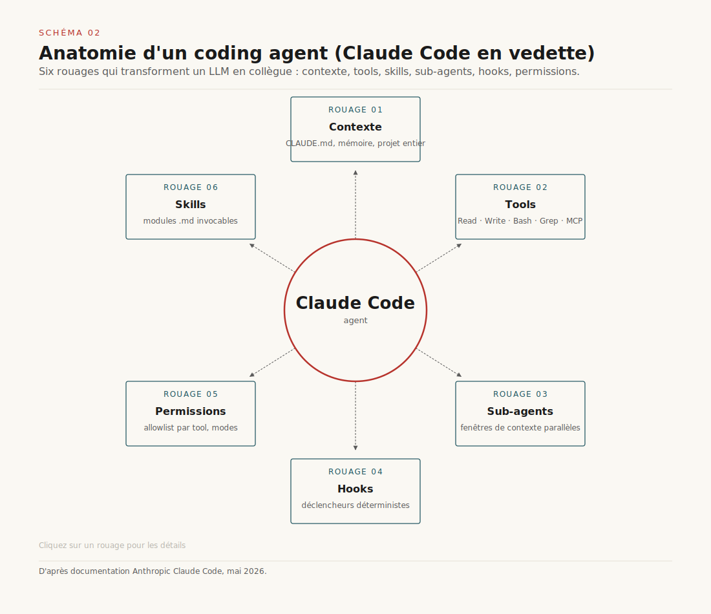
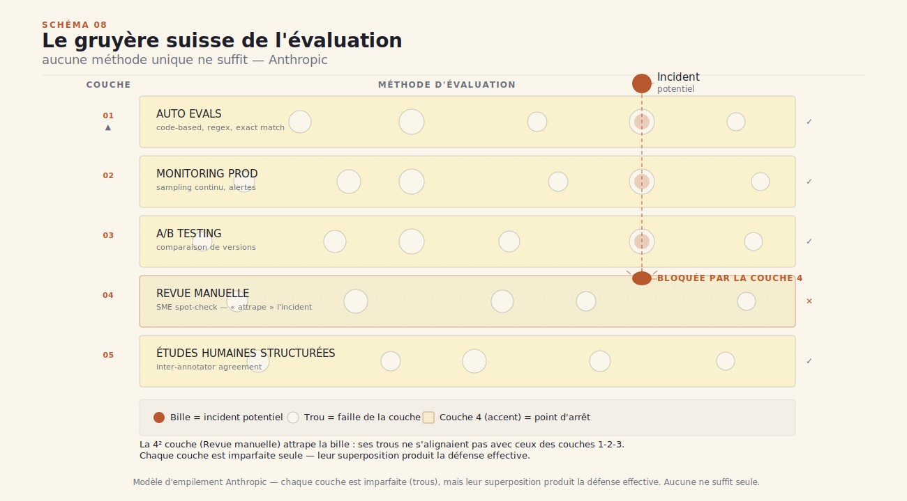

# Claude Code et l'Agent SDK

> *Un produit, un SDK, trois voies pour builder son agent.* — Mathieu Guglielmino, 18 mai 2026

## Synthèse exécutive

- **Claude Code et l'Agent SDK sont deux enveloppes du même harness.** Le produit terminal/IDE qu'on utilise au quotidien et la library Python/TypeScript qu'on importe partagent strictement le même cœur : modèle, tools built-in, agent loop, gestion du contexte. Anthropic l'écrit noir sur blanc : *« the same tools, agent loop, and context management that power Claude Code, programmable in Python and TypeScript »*.
- **Il existe trois voies pour builder un agent**, et le choix dépend du curseur entre effort et contrôle. API brute (Client SDK Anthropic, tool loop fait main), Agent SDK (harness hérité, UI à soi), Claude Code (skills et CLAUDE.md sur un produit existant). Un quatrième chemin pour la production hostée — les Managed Agents d'Anthropic — complète la matrice.
- **Bash is all you need, c'est la thèse opinionated du SDK.** Plutôt que d'empiler des dizaines de tools métier rigides, l'agent compose des primitives Unix — grep, jq, pipe, git, ffmpeg — et écrit ses propres scripts. C'est ce qui a fait sortir Claude Code du périmètre dev et qu'il est devenu utile aux équipes finance, marketing et data science.
- **La loop Gather → Act → Verify est le cœur invariant.** Trouver le contexte pertinent, agir, vérifier. La vérification est ce qui rend les coding agents fiables (lint, compile, tests) et ce qui reste difficile sur la recherche (citations floues). Les hooks permettent d'enforcer la discipline sans retraining.
- **Skills, hooks et filesystem sont les leviers de fiabilité déterministe.** Pour passer du prototype à la production, on extrait la logique d'agent (souvent ~50 lignes), on combine sandbox + permissions + alignement modèle (le gruyère suisse) et on lit les transcripts en continu — c'est la méta-compétence qui fait progresser un système agent.

## 1. Du prompt au harness — la bascule 2026

L'industrie LLM s'est déplacée par paliers. ==Trois générations distinctes, trois unités de raisonnement, trois rôles pour le dev.== À l'époque GPT-3, on construisait des **LLM features** : un prompt, une sortie. Classer un email. Résumer un texte. Étiqueter une intention. L'unité de raisonnement était le tour de parole unique ; le dev définissait un prompt et l'attendu était presque déterministe.

Puis sont arrivés les **workflows**. RAG sur codebase, pipelines structurés, indexation puis récupération puis génération. L'unité passait à la chaîne multi-étapes, mais le squelette restait écrit par l'humain. Le dev orchestrait, le modèle remplissait des cases. Beaucoup de produits IA de 2023-2024 sont des workflows déguisés en agents.

On bascule maintenant dans la troisième génération. Les **agents** construisent leur propre contexte, choisissent leurs propres trajectoires, et opèrent de façon largement autonome. C'est la définition que donne Thariq Shihipar (Anthropic) dans son workshop du 18 mai : *« systems that build their own context, decide their own trajectories, and work very autonomously »*. L'unité de raisonnement n'est plus le tour ni la chaîne — c'est la session de travail, dix, vingt, trente minutes pendant lesquelles le modèle décide quoi faire et comment vérifier.

Cette bascule n'est pas qu'une question de capacité du modèle. Elle vient avec une nouvelle infrastructure : ce qu'Aakash Gupta appelait début 2026 le **harness agentique**. Sa formule est restée : *« 2025 was agents, 2026 is agent harnesses »*. Le dossier [*Harness agentiques*](../harness-agentique/) publié sur ce site il y a quatre semaines détaille les sept couches industrielles d'un harness orienté production. On n'y revient pas.

Ce que ce rapport ajoute, c'est le point de vue d'Anthropic sur leur propre harness. Claude Code n'est pas un agent générique, c'est **une opinion forte** sur comment on construit un agent fiable. Et depuis quelques mois, Anthropic a fait quelque chose d'inhabituel : ils ont extrait ce harness en library publique, le **Claude Agent SDK**.

La question qu'on pose ici est concrète. Si vous voulez builder un agent en 2026, quel composant utilisez-vous ? L'API brute des modèles ? Le SDK ? Le produit Claude Code lui-même comme plateforme d'extension ? Les Managed Agents d'Anthropic ? Chacune de ces voies est légitime, et les trade-offs sont nets. Ce rapport déroule la matrice de décision en partant de la source : le workshop où Shihipar explique le raisonnement d'Anthropic.


*Schéma 1 — La bascule 2026 : du single-shot au harness autonome. Chaque génération change l'unité de raisonnement et le rôle du dev.*

## 2. Le harness, vu par Anthropic

Quand Shihipar décrit ce qu'il y a *dans la boîte Claude Code*, il liste neuf composants qui entourent le modèle. ==Ce ne sont pas des ajouts cosmétiques — chacun est une décision d'architecture qui change ce que l'agent peut faire en pratique.==

**Le modèle** d'abord. Claude Sonnet ou Opus selon le cas, parfois Haiku pour les sous-agents bon marché. Le choix est moins critique qu'on le pense — c'est ce qui entoure le modèle qui fait la différence sur la fiabilité.

**Les tools built-in.** L'Agent SDK et Claude Code partagent la même palette : `Read`, `Write`, `Edit`, `Bash`, `Monitor`, `Glob`, `Grep`, `WebSearch`, `WebFetch`, `AskUserQuestion`. Cette liste n'est pas neutre. Elle reflète une opinion : un agent utile lit le filesystem, écrit dans le filesystem, exécute du shell, cherche du contenu, et — quand il bloque — pose une question à l'utilisateur. Aucune de ces fonctions n'est spécifique à un domaine métier. C'est volontaire.

**Les prompts système.** Au-delà du system prompt principal de Claude Code, il y a un ensemble de prompts comportementaux qui orientent le modèle : comment formater les réponses, quand demander confirmation, comment structurer les explications. Quand on passe à l'Agent SDK, on hérite de ce socle et on peut le compléter.

**Le filesystem.** C'est le point que Shihipar martèle le plus : *« context is not just the prompt »*. Le contexte d'un agent, c'est aussi les fichiers qu'il lit, les scripts qu'il écrit, les artefacts qu'il génère, la mémoire qu'il pose sur disque. Le filesystem devient le **substrat de raisonnement** de l'agent — il sert à étendre le contexte au-delà de la fenêtre, à matérialiser des étapes intermédiaires, et à vérifier *a posteriori* ce qui a été fait. CLAUDE.md, les `examples/`, les scripts de support : tout vit dans des fichiers, pas dans le prompt.

**Les skills.** Récents dans la stack Claude. Ce sont des bundles d'instructions et de contexte que l'agent charge dynamiquement. Une skill DOCX peut contenir des prompts, des templates, des scripts de génération. L'agent découvre la skill via `.claude/skills/*/SKILL.md`, la lit, et s'exécute contre. C'est le mécanisme de progressive context disclosure — on ne charge le savoir spécialisé que quand il est pertinent.

**Les subagents.** Le tool `Agent` permet de déléguer une sous-tâche à un agent dédié. Une `AgentDefinition` décrit son rôle, ses tools, ses permissions. Utile pour scoper un contexte, pour paralléliser, ou pour limiter le blast radius d'une opération sensible.

**La memory auto-injectée.** Une mémoire utilisateur qui persiste entre les sessions. Et plus largement, des conventions comme CLAUDE.md à la racine d'un projet — l'agent les lit automatiquement au démarrage de session.

**Les hooks.** `PreToolUse`, `PostToolUse`, `Stop`, `SessionStart`, `SessionEnd`, `UserPromptSubmit`. Six points d'interception déterministes où vous pouvez injecter du contrôle. Si l'agent essaie d'écrire un fichier sensible, un hook `PreToolUse` peut bloquer. Si une réponse contient une hallucination de stat alors qu'un script aurait dû la vérifier, un hook `PostToolUse` peut renvoyer le modèle au travail. On y revient au § 8.

**Les permissions.** `allowed_tools` dans la config du SDK. Vous décidez quels tools l'agent peut utiliser, et donc quelle est sa surface d'action. C'est le contrôle de premier niveau, avant même les hooks et la sandbox.

**Le context management.** La gestion automatique de la fenêtre de contexte, le compacting des longs threads, la résumation des étapes anciennes. Composant peu glamour mais critique sur les sessions longues.

Tous ces composants sont disponibles à la fois dans Claude Code (le produit) et dans l'Agent SDK (la library). C'est exactement le point : **on hérite du même harness, on change juste ce qui le consomme**.


*Schéma 2 — Le harness packagé : un noyau (modèle) entouré de 9 satellites.*


*Schéma 2bis — Repris du dossier [**Harness agentiques**](../harness-agentique/) : les 7 couches industrielles d'un harness orientées production.*

## 3. Claude Code vs Claude Agent SDK

Pour beaucoup de devs, Claude Code est un produit qu'on installe — un CLI dans le terminal, une extension VS Code, une app desktop, un panneau dans claude.ai. On l'utilise pour coder, refactorer, debugger, parfois écrire des notes ou trier des emails. C'est le **mode produit utilisateur**.

L'Agent SDK retourne la perspective. ==Ce n'est plus un produit fini qu'on utilise, c'est une library qu'on importe pour fabriquer son propre produit.== La citation officielle d'Anthropic est limpide : *« The Agent SDK gives you the same tools, agent loop, and context management that power Claude Code, programmable in Python and TypeScript. »*

Concrètement, en Python :

```python
from claude_agent_sdk import query, ClaudeAgentOptions

async for message in query(
    prompt="Fix the bug in auth.py",
    options=ClaudeAgentOptions(allowed_tools=["Read", "Edit", "Bash"]),
):
    print(message)
```

Trois lignes utiles, et vous avez un agent qui lit votre repo, édite le fichier, exécute le shell pour vérifier. Le harness fait tout le reste — la loop, les hooks, le filesystem, le compacting.

Côté TypeScript, le package `@anthropic-ai/claude-agent-sdk` embarque directement le binaire Claude Code natif. C'est cohérent : ce qu'on appelle « Claude Code » est techniquement un agent en Rust/TypeScript, et le SDK TS expose cet exécutable en mode library. Côté Python, `claude-agent-sdk` parle au même binaire via un wrapper.

Pourquoi Anthropic a-t-il extrait ce SDK ? Shihipar donne la raison interne : *« we kept rebuilding the same infrastructure over and over again »*. Chaque équipe d'Anthropic qui montait un système agent — GitHub automations, Slack triagers, document generators, support tools — réimplémentait les mêmes briques : la loop, la gestion de fichiers, les hooks, la compaction. Plutôt que de continuer à dupliquer, ils ont packagé.

**Ce qu'on hérite en passant au SDK** : les tools built-in (avec leur logique de retry, leur format de retour, leur intégration avec le filesystem), l'agent loop avec sa gestion de tool_use, les hooks et leurs six points d'interception, les skills (l'agent peut découvrir et charger des `.claude/skills/*/SKILL.md` exactement comme dans Claude Code), les sessions (`resume`, `fork` pour reprendre ou bifurquer un thread), les permissions, le context compacting.

**Ce qu'on perd** : l'UI Claude Code, le mode interactif terminal avec ses raccourcis, l'intégration native VS Code/JetBrains/desktop. Vous devez fournir vous-même la surface utilisateur — une web app, un CLI custom, un bot Slack, une API HTTP. C'est précisément le point : vous êtes en train de fabriquer un produit *différent* de Claude Code, même s'il partage le moteur.

Une note de **branding** importante : Anthropic interdit l'usage de « Claude Code » comme nom pour un produit tiers. Les déclinaisons autorisées sont « Claude Agent » ou *{YourAgentName} Powered by Claude*. Si vous lancez un produit construit avec le SDK, vous nommez votre produit, pas Anthropic.

Anthropic a aussi annoncé mi-juin 2026 un crédit mensuel dédié aux usages Agent SDK — une façon de simplifier l'économie pour les équipes qui construisent en production sur la library plutôt que de tout consommer en metering brut sur l'API.


*Schéma 3 — Inversion produit ↔ SDK. Le bloc harness est identique, seul change ce qui le consomme.*

## 4. Trois voies pour builder un agent — le pivot décisionnel

Une fois qu'on a posé Claude Code comme produit et l'Agent SDK comme library, on a déjà deux voies. Mais il en reste une troisième, et un chemin de production dérivé. Voyons les quatre dans l'ordre du curseur effort/contrôle.

### Voie 1 — L'API brute (Anthropic Client SDK)

C'est le bas niveau. Vous appelez directement la Messages API d'Anthropic, vous gérez vous-même la boucle de tool calling. La structure typique est :

```python
response = client.messages.create(model=..., tools=[...], messages=[...])
while response.stop_reason == "tool_use":
    result = your_tool_executor(response.content[-1])
    response = client.messages.create(
        model=..., tools=[...],
        messages=[..., {"role": "tool_result", ...}]
    )
```

Max contrôle, max boilerplate. Vous écrivez votre propre logger de tool calls, votre propre gestion d'erreurs, votre propre orchestration. Dans le workshop, Shihipar montre exactement ce pattern avec son `chat.ts` qui expose cinq tools PokéAPI (`getPokemon`, `getPokemonSpecies`, `getPokemonAbility`, `getPokemonType`, `getMove`). Anthropic appelle cette voie le **Client SDK** par opposition à l'Agent SDK.

==Le Client SDK fait sens quand vous voulez maîtriser chaque atome du comportement et que vous êtes prêt à payer en boilerplate.== Cas typiques : intégration dans un produit avec des contraintes UI strictes, latence ultra-optimisée, contrôle fin de chaque tool call pour audit réglementaire.

### Voie 2 — L'Agent SDK

`from claude_agent_sdk import query, ClaudeAgentOptions`. Vous héritez du harness complet : tous les tools built-in disponibles à la demande, l'agent loop déjà câblée, les hooks accessibles, le filesystem géré, les skills loadables. Vous gardez la main sur l'UI (vous fabriquez votre propre frontend) et sur les tools métier que vous ajoutez en sus.

C'est le **sweet spot pour un produit custom**. La matrice officielle d'Anthropic le dit explicitement : l'Agent SDK est fait pour les CI/CD pipelines, les custom apps, l'automation de production. *« Many teams use both »* — typiquement, on prototype dans Claude Code pour vérifier que la logique tient, puis on extrait dans le SDK pour le produit final.

Exemples concrets : un agent de support multi-tenant qui tape dans la base de connaissances client et ouvre des tickets ; un agent SRE qui investigue un incident en consultant logs, métriques et runbooks ; un workflow CI/CD qui pré-review les PR et commente sur les diffs.

### Voie 3 — Claude Code comme plateforme d'extension

Vous ne fabriquez pas un nouveau produit. Vous étendez Claude Code lui-même. **Min effort, max vélocité, contrainte forte** : vous restez dans la skin Claude Code, votre artefact est exécutable uniquement par les gens qui ont Claude Code installé.

Les mécanismes d'extension sont : `.claude/skills/<nom>/SKILL.md` pour ajouter une compétence spécialisée, `.claude/commands/<nom>.md` pour ajouter un slash command, `CLAUDE.md` à la racine du projet pour fixer le comportement par défaut, les hooks dans `settings.json` pour intercepter les tool calls. Plus l'écosystème MCP pour brancher des serveurs externes.

Exemple courant : une skill `/review-pr` qui charge votre style guide de code review, un slash command `/triage-issue` qui suit votre process GitHub. C'est la voie pour internaliser de l'expertise dans votre environnement de dev sans construire un produit à part.

### Voie 4 — Managed Agents (path de production hostée)

À côté des trois voies, Anthropic propose les **Managed Agents** : une API REST hostée, sandbox managée par Anthropic, scaling automatique. Vous décrivez votre agent (system prompt, tools autorisés, skills) et vous obtenez un endpoint HTTP qui exécute le harness pour vous, dans l'infrastructure Anthropic.

Trade-off classique : moins de contrôle d'exécution, plus de simplicité opérationnelle. Le chemin canonique recommandé par Anthropic est : *« A common path is to prototype with the Agent SDK locally, then move to Managed Agents for production »*. Vous codez et débuggez en local sur le SDK, vous portez en Managed quand vous voulez livrer sans opérer la sandbox vous-même.

Ces quatre voies ne sont pas mutuellement exclusives. Une équipe mature combine souvent les trois : Claude Code pour le dev quotidien et le prototypage, Agent SDK pour les automations spécialisées, Managed Agents pour les surfaces produit hostées.


*Schéma 4 — Trois voies positionnées sur les axes effort × contrôle. Le sweet spot dépend de votre cas — et rien ne vous empêche de combiner.*

## 5. Créer une CLI ou wrapper une API — le geste concret

Le workshop déroule une démo concrète : wrapper PokéAPI pour répondre à des questions sur les Pokémon. Ce n'est qu'un prétexte — ce qui compte, ce sont les **trois variantes** qui illustrent les trois voies du § 4 sur un même use case. La leçon est transposable à n'importe quelle API métier.

Use case : *« liste-moi tous les Pokémon de Génération 2 de type eau »*.

### Variante A — Codegen pur dans Claude Code

Prompt initial à Claude Code : *« Va lire la doc de PokéAPI et génère-moi un SDK TypeScript. »* Le harness fait le travail. Le résultat est un dossier `pokeapi-sdk/` avec des interfaces TypeScript pour `Pokemon`, `Species`, `Ability`, `Type`, `Move`, une classe `PokemonAPI` exposant des méthodes typées (`getPokemon`, `listPokemon`, `getSpecies`, etc.), et un fichier `CLAUDE.md` qui documente les modules disponibles et donne des exemples d'usage.

Quand on pose la question Gen 2 eau, l'agent ne re-génère pas le code. Il **écrit un script** dans `examples/`, le pose sur disque, l'exécute, lit le résultat, le renvoie. Le CLAUDE.md sert d'état d'agent — il dit à Claude *« tu as cette API à disposition, voici comment l'utiliser »*.

C'est typiquement la voie 3. L'agent vit dans Claude Code, le filesystem est son substrat, le bash est son moteur d'exécution. Aucune ligne de code métier à écrire — le harness génère son propre wrapper et l'utilise.

### Variante B — Tools déclarés en Messages API (Anthropic Client SDK)

Cette fois on écrit un `chat.ts` qui appelle directement la Messages API d'Anthropic, et on déclare explicitement les cinq tools : `getPokemon`, `getPokemonSpecies`, `getPokemonAbility`, `getPokemonType`, `getMove`. Le modèle décide quand appeler quoi, on parse les `tool_use` blocks, on exécute, on renvoie. Boucle `while response.stop_reason == "tool_use"`.

Shihipar insiste : **logger systématiquement chaque tool call** au moment où le modèle l'émet. C'est la visibilité de base sur le comportement de l'agent, et ça vous évite des heures de debug.

Il y a un **plafond pratique** sur le nombre de tools. PokéAPI a des dizaines d'endpoints, mais le modèle ne peut raisonnablement en gérer qu'une dizaine simultanément avant de se perdre dans le choix. C'est une contrainte récurrente avec l'approche tools-only — passé un certain volume d'actions possibles, la composition devient ingérable. C'est ce qui pousse vers la variante C.

### Variante C — Codegen + bash dans un Agent SDK

Le compromis. On utilise l'Agent SDK, on autorise les tools `Read`, `Edit`, `Bash`, `WebFetch`, et on laisse l'agent **écrire ses propres scripts** au lieu d'invoquer des tools métier prédéfinis :

```python
async for msg in query(
    prompt="Liste les Pokémon de Génération 2 de type eau",
    options=ClaudeAgentOptions(
        allowed_tools=["Read", "Edit", "Bash", "WebFetch"],
        hooks={"PreToolUse": [HookMatcher(matcher="Write", hooks=[validate_script])]}
    ),
):
    ...
```

Le hook `validate_script` peut, par exemple, refuser tout script qui n'aurait pas d'abord lu la doc ou cassé la requête en étapes traçables. ==C'est cette voie qui donne le bon ratio contrôle/effort pour une production custom : l'agent fait le travail de wrapping en runtime, vous gardez les garde-fous via les hooks et les permissions.==

### Note de transposition

PokéAPI est un prétexte. Remplacez-le par votre API métier interne — un GraphQL produit, une REST de gestion documentaire, un SDK d'événementiel. Les trois variantes restent valides ; ce qui change, c'est juste l'endpoint et le schéma. Le choix de variante ne dépend pas du domaine, il dépend de **trois questions** : combien de contrôle il faut sur chaque appel ? Combien de tools faudrait-il déclarer pour couvrir l'usage attendu ? Et est-ce que les scripts générés peuvent être audités/validés *a posteriori* ?

Une observation que fait Shihipar pendant la démo mérite mention. En posant la question Gen 2 eau, l'agent commence parfois par *« répondre de mémoire »* — il sait déjà que Totodile et Croconaw sont Gen 2 eau, c'est de la donnée massivement vue à l'entraînement. Le bon réflexe est de détecter ce « cheating » et de forcer l'agent à passer par un script. C'est exactement le cas où les hooks deviennent indispensables : *« always write a script before answering »* injecté en `UserPromptSubmit` ou en `PostToolUse`.


*Schéma 5 — Pour le même output, trois architectures. Qui code, qui exécute, où vit l'état.*



*Schéma 5bis — Repris du dossier [**Coding agents**](../coding-agents/) : panorama de Claude Code, Cursor, Aider, Devin et compagnie.*

## 6. Bash is all you need — la thèse

C'est la phrase qu'on retient du workshop. ==Bash est le tool qui a généralisé Claude Code aux non-devs, et c'est l'opinion centrale qui structure l'Agent SDK.== Shihipar la formule sans détour : *« bash became the first true code mode »*. Et : *« eventually you end up with dozens or hundreds of rigid tools. Claude Code instead just uses Unix primitives »*.

Le constat qu'Anthropic a fait en interne : quand Claude Code a été déployé, ce ne sont pas seulement les ingénieurs qui l'ont adopté. Les équipes finance ont commencé à l'utiliser pour analyser des transactions. Marketing pour trier des campagnes. Data science pour des analyses ponctuelles. Et la raison de cette généralisation tient à un seul facteur : **le tool bash**.

### Le scénario rideshare

Shihipar prend un exemple concret. Un assistant email reçoit la question : *« Combien j'ai dépensé en VTC cette semaine ? »*

**Sans bash**, le modèle récupère 500 emails de la semaine, les stuffe dans le contexte, essaie de raisonner sur l'agrégat. Résultat : approximation, hallucination de chiffres, impossibilité de vérifier. La fenêtre de contexte explose et la précision s'effondre.

**Avec bash**, l'agent compose une chaîne Unix : `gmail-search "uber OR lyft after:2026-05-11" > emails.json` → `jq '.messages[].body' emails.json` → `grep -oE '\$[0-9]+\.[0-9]{2}'` → `awk '{sum+=$1} END {print sum}'`. Trois lignes de shell, un total exact, une trace auditée.

La différence de qualité n'est pas marginale. Elle est structurelle.

### Pourquoi bash gagne

Trois propriétés que les tools rigides n'ont pas :

**Composabilité native.** Toutes les primitives Unix se chaînent via pipe. `grep | jq | awk | sort | uniq` est une chaîne valide. Aucune coordination explicite à écrire dans le code de l'agent. Les tools rigides demandent souvent une orchestration externe — le modèle appelle `searchEmails`, reçoit un blob, doit appeler `extractPrices` sur le blob, etc. Avec bash, la composition est dans la syntaxe shell.

**Économie de contexte.** Les résultats intermédiaires vivent en **fichiers**, pas en tokens. `gmail-search > emails.json` produit un fichier ; l'agent peut le re-grep plus tard sans le réinjecter dans la fenêtre. C'est la différence entre une fenêtre qui explose et une fenêtre qui reste stable.

**Traçabilité.** Chaque étape laisse une trace : un fichier, un exit code, un stderr. Vous pouvez relire le transcript, voir exactement ce que l'agent a fait, et reproduire pas à pas. Avec des tools opaques (« j'ai appelé `analyzeData` et il a renvoyé `{result: 42}` »), la vérifiabilité disparaît.

### Les primitives qui comptent

Le workshop liste celles qui reviennent le plus : `grep`, pipe, `tail`, `jq`, `awk`, `ffmpeg`, `git`, `npm`, `bun`, les scripts linters comme `eslint`. Et tout ce que l'agent peut *installer à la demande* via `apt`, `brew`, `npm install`. ==L'agent ne se limite pas aux primitives qu'il connaît au démarrage : il étend son outillage en runtime, exactement comme un humain.==

Cette propriété est ce qui fait dire à Shihipar que bash devient *« le premier vrai code mode »*. Avant bash, le modèle écrivait du code en mode déclaratif (« je voudrais faire ça »). Avec bash, le modèle écrit du code en mode exécutoire (« je fais ça, je vois ce qui se passe, je corrige »). C'est la boucle d'apprentissage incrémentale que Codex et Cursor exploitaient déjà côté code, mais étendue à toutes les tâches non-coding.

### Le revers

Bash a des coûts. Latence supérieure aux tools (un appel de tool est synchrone et rapide ; une chaîne shell prend des secondes). Découvrabilité moindre (le modèle doit savoir que `jq` existe, et comment l'utiliser). Surface d'attaque large (n'importe quoi peut sortir d'un shell). C'est précisément pourquoi on combine — pas tout en bash, pas tout en tools. Le § 7 détaille la matrice.


*Schéma 6 — Bash transforme un agent d'« input → réponse approximative » en « extraction → vérification → réponse traçable ».*

## 7. Tools vs Bash vs Codegen — la matrice

Aucun des trois paradigmes ne gagne sur tout. ==Une app de production sérieuse combine les trois, et le choix de l'un sur l'autre dépend du type d'action.== Voici comment Shihipar découpe.

### Tools — actions structurées, atomiques, destructives

**Pros.** Structuré (schéma JSON déclaré), fiable (le modèle suit le schéma), rapide (un seul aller-retour), contrôlé (vous décidez exactement ce qui s'exécute).

**Cons.** Cher en contexte (chaque tool description prend des tokens), mauvaise composabilité (chaque tool est isolé, il faut orchestrer dans le prompt), faible discoverability (le modèle voit la liste mais ne peut pas en composer des nouveaux).

**Best for.** Actions destructives ou irréversibles où vous voulez un contrat strict : envoyer un email, créer un ticket Jira, écrire un fichier à un chemin précis, opérer une transaction de paiement. Tout ce qui doit avoir un masquage de données sensibles (un tool peut filtrer les champs ; un script bash, plus difficilement). Tout ce qui doit produire un audit log structuré.

### Bash — composition, filesystem, mémoire

**Pros.** Composable (pipes natifs), peu de contexte (les résultats vivent en fichiers, pas en tokens), scriptable et réutilisable (un script de la semaine dernière peut être ré-exécuté tel quel), dynamique (l'agent compose à la volée).

**Cons.** Découvrabilité moyenne (le modèle doit connaître `jq`, `awk`, etc. — ce qui marche sur les distros standards mais moins sur des stacks exotiques), latence supérieure (chaque commande shell coûte plus que un tool call), fiabilité immédiate plus basse (un typo dans une commande échoue silencieusement).

**Best for.** Filesystem (lecture, navigation, recherche), search (`grep`, `ripgrep`, `find`), lint et build (`eslint`, `tsc`, `pytest`), scripts réutilisables (déposer un script dans `tools/` et le rappeler plus tard), memory systems (`memories/` directory que l'agent lit/écrit).

### Codegen — flexibilité, analyses ad hoc, deep research

**Pros.** Flexibilité maximale (l'agent peut écrire n'importe quel programme), gestion d'APIs dynamiques (parse, transforme, agrège), logique réutilisable (un script peut être enrichi à la demande), idéal pour les analyses one-shot complexes.

**Cons.** Latence la plus haute (écrire le script puis l'exécuter prend des secondes voire minutes), overhead de compilation/exécution, API design plus difficile (le modèle doit comprendre le schéma de l'API cible avant de pouvoir l'utiliser).

**Best for.** Analyses dynamiques (« combien de clients ont X et Y et Z »), deep research (composer des requêtes complexes sur des sources hétérogènes), requêtes ad hoc qui ne reviendront pas, data analysis spécialisée.

### Le cas SQL

C'est l'exemple que Shihipar donne explicitement. Pour donner accès à une base à un agent, vous avez le choix :

- **Tool** quand vous voulez contrôle strict, masking de colonnes sensibles, et RBAC déterministe. Vous exposez `executeQuery` avec un whitelist de tables et un parser qui retire les colonnes PII. L'agent ne peut faire que ce que le tool permet.
- **Bash/codegen** quand vous voulez du SQL dynamique avec feedback loop. L'agent écrit une requête, voit l'erreur de syntaxe, corrige, relance. C'est plus puissant pour de l'analyse exploratoire mais beaucoup plus dur à sécuriser.

Le bon réflexe RBAC : ==**la sécurité passe par les clés API scopées, les proxies backend et les tokens temporaires — pas par le prompt.**== Un prompt « ne lis pas la table users » ne tient pas. Une clé API qui n'a pas accès à `users` tient toujours.

### La règle de combinaison

Une app de production combine typiquement les trois. **Tools** pour les ~5 actions destructives critiques. **Bash** pour 80% du raisonnement opérationnel (recherche, lecture de fichiers, exécution de scripts). **Codegen** pour les pics de flexibilité (analyses one-shot, intégrations ad hoc). La proportion dépend du domaine — un agent SRE pèse plus côté bash, un agent CRM plus côté tools.


*Schéma 7 — Trois paradigmes, trois zones de pertinence.*

## 8. L'agent loop — Gather → Act → Verify

C'est le cœur invariant. ==Tous les agents qui fonctionnent suivent la même structure : trouver le contexte, agir, vérifier — puis itérer.== Shihipar la décrit comme *« kind of an art or intuition »*, mais les trois étapes sont stables.

### 1. Gather Context

Trouver l'information pertinente avant d'agir. C'est l'étape **la plus sous-estimée**. Beaucoup d'agents échouent non pas parce que le modèle est mauvais, mais parce qu'ils ont sauté la phase de contexte.

Concrètement : `grep` les fichiers d'un repo, `git log` les commits récents, lister les emails non lus, requêter une base, fetcher une doc en ligne. Le filesystem est massivement utilisé ici — l'agent pose les résultats intermédiaires sur disque pour pouvoir les revisiter sans recharger en contexte.

Sur des codebases massives (Shihipar mentionne 50M+ lignes), `grep` brut ou stuffing de la fenêtre ne suffit pas. Sa recommandation : **bons CLAUDE.md** + démarrer l'agent dans un sous-répertoire précis pour limiter le scope. La search sémantique reste utile mais Shihipar la qualifie de *« brittle »* — le modèle n'est pas entraîné sur votre index sémantique spécifique, donc l'embedding ne marche pas comme on l'imagine.

### 2. Take Action

Exécuter le travail. Tools, bash, codegen — selon la matrice du § 7. C'est là que les choix d'architecture prennent vie. Un agent qui n'a accès qu'à des tools déclarés sera limité aux actions prévues ; un agent qui peut bash + codegen aura une surface d'action beaucoup plus large.

Point clé : **logger systématiquement** chaque action. Tool call, commande shell exécutée, script généré. Sans cette trace, le debugging est impossible.

### 3. Verify

Critique. ==Les coding agents sont forts précisément parce que la vérification y est facile : lint, compile, run tests, check exit code.== Les research agents sont plus durs parce que la vérification est floue — une citation correcte ? Un raisonnement valide ? Une donnée à jour ? Difficile à valider automatiquement.

Pour le code, le feedback loop est natif : `tsc` échoue, le modèle voit l'erreur, corrige, relance. Pour la recherche, il faut **construire** la vérification : forcer la citation des sources, faire valider par un second agent, croiser plusieurs sources, demander confirmation à l'utilisateur. C'est plus de plumbing mais c'est ce qui distingue un agent fiable d'un agent qui hallucine.

### Les hooks comme rattrapage déterministe

Quand le modèle saute une étape — typiquement, répondre de mémoire au lieu de vérifier — les **hooks** permettent d'enforcer la discipline sans retraining. Reprenons l'exemple Pokémon. Si l'agent répond *« Totodile, Croconaw, Feraligatr »* sans avoir exécuté de script, un hook `PostToolUse` (ou plus précisément un hook qui s'arme après une réponse sans tool_use) peut intercepter et injecter dans le contexte : *« Please make sure you write a script, please make sure you read this data from the API. »*

C'est de la **discipline déterministe ajoutée par-dessus** un modèle probabiliste. Vous n'attendez pas que le modèle soit parfait — vous reconfigurez sa boucle pour qu'une étape manquante soit toujours rattrapée. C'est le pattern le plus puissant de l'Agent SDK pour fiabiliser un agent en production.

### Et le planning ?

Shihipar le situe entre context gathering et action. Le modèle décompose la tâche en sous-tâches, écrit éventuellement une todo-list (l'Agent SDK fournit des todo-management tools), puis exécute pas à pas en cochant les cases. C'est une étape qui augmente la latence (un round-trip de plus avant d'agir) mais qui améliore la cohérence sur tâches longues. À utiliser quand la tâche fait plus de 5-10 sous-étapes.

### La méta-compétence : lire les transcripts

Shihipar termine son workshop là-dessus, et c'est probablement le conseil le plus utile pour quiconque construit des agents en production. *« Read transcripts constantly. »* Regardez ce que l'agent fait. Demandez : pourquoi a-t-il choisi cette action ? Où a-t-il échoué ? Quel contexte lui manquait ? Quelle vérification a manqué ?

C'est cette analyse itérative de transcripts qui fait progresser un système agent — plus que les ajustements de prompt système, plus que le tweaking des paramètres du modèle. C'est l'équivalent agentique du *post-mortem* en SRE : pas glamour, déterminant à long terme.


*Schéma 8 — La boucle qui sous-tend tous les agents fiables. Les hooks interceptent quand le modèle saute une étape.*

## 9. Production — local vs sandbox, sécurité multicouches

Une fois le prototype tournant dans Claude Code, vient la question : **comment je déploie ?** Shihipar décrit un chemin classique qui mérite d'être suivi tel quel.

### Le chemin de productionisation

D'abord, **prototyper dans Claude Code**. C'est gratuit, c'est rapide, et ça permet de valider que la logique d'agent tient avant d'investir en infrastructure.

Ensuite, **extraire la logique**. Shihipar fait une observation qui surprend les gens : *« the actual agent file looks like… it's around 50 lines »*. Une fois le harness fourni par le SDK, le code spécifique à votre agent tient en quelques dizaines de lignes — surtout du wiring (working directory, prompt template, options du SDK). Le reste vit dans le filesystem (CLAUDE.md, scripts, skills).

Puis, choisir une cible de déploiement :

- **Local app**. CLI installable, ou app frontend type Lovable avec dev server local et hot reload. Shihipar pense que les apps locales font un retour — *« I actually think local apps may come back because AI agents are expensive to host continuously. »* L'argument économique est solide : un agent qui tourne sur la machine de l'utilisateur ne coûte rien en compute serveur ; seul le modèle (via API Anthropic) est facturé.
- **Sandbox managé**. Cloudflare Sandbox, Modal, E2B, Daytona. La structure de déploiement devient : *« `sandbox.start; bun agent.ts` »*. L'infra de sandboxing est abstraite, vous focalisez sur la logique. Pertinent pour les usages multi-tenant où le code de l'agent doit tourner côté serveur (intégration Slack, webhook GitHub).
- **Managed Agents Anthropic**. REST API hostée par Anthropic, sandbox gérée, scaling. Pour les équipes qui veulent livrer en production sans opérer la sandbox elles-mêmes. Recommandé par Anthropic comme la suite naturelle d'un prototype Agent SDK.

### La sécurité Swiss cheese

Shihipar décrit la sécurité d'un agent bash-driven comme un **gruyère suisse à trois couches**. Chaque couche a des trous ; combinées, elles ferment la majorité des vecteurs d'attaque. ==Aucune des trois n'est suffisante seule — c'est la composition qui rend l'ensemble robuste.==

**Couche 1 — Alignement modèle.** Anthropic investit massivement sur l'alignement du modèle lui-même : il refuse les actions destructrices sans confirmation, il évite les prompt injections, il ne s'auto-exfiltre pas. Publication récente d'Anthropic sur le reward hacking — un modèle bien aligné ne triche pas pour atteindre son objectif. C'est la première barrière, mais ce n'est pas suffisant.

**Couche 2 — Harness controls.** Le SDK fournit un parser bash qui comprend ce que l'agent essaie de faire avant de l'exécuter (et permet de bloquer des patterns dangereux), un permission system qui restreint les tools accessibles, des hooks qui peuvent intercepter et refuser une action, des prompting controls qui orientent le comportement. C'est la couche que vous configurez explicitement.

**Couche 3 — Sandbox env.** Isolation réseau (l'agent ne peut pas appeler des endpoints arbitraires), filesystem scope (l'agent ne voit que `/workspace`, pas `/etc`), execution scope (pas d'accès root, limites de CPU/RAM). C'est ce qui empêche l'exfiltration de données et limite le blast radius en cas de compromission. Les providers cités (Cloudflare, Modal, E2B, Daytona) implémentent déjà ces garanties.

### RBAC, côté infra et pas côté prompt

Insistance qui revient dans le workshop : ==le contrôle d'accès passe par des clés API scopées, des proxies backend qui filtrent les requêtes, des tokens temporaires à courte durée de vie — jamais par un prompt qui dit *« ne touche pas à ces données »*.== Un agent qui n'a pas accès à `users` via sa clé API ne touchera pas à `users`, quoi qu'il décide. Un agent qui a la clé mais à qui on a *demandé* de ne pas toucher peut être manipulé.


*Schéma 9 — Trois couches imparfaites : alignement modèle (entraînement Anthropic), harness controls (parser bash, permissions, hooks) et sandbox env (isolation réseau et filesystem). Aucune ne suffit seule — c'est la superposition qui produit la défense.*



*Schéma 9 bis — À mettre en parallèle : le même motif appliqué à l'**évaluation** dans le dossier [**La fabrique d'un agent**](../fabrique-agent/) — 5 couches (auto evals, monitoring prod, A/B testing, revue manuelle, études humaines structurées). La défense en profondeur est un motif récurrent qui dépasse le champ sécurité.*

## 10. Quand utiliser quoi — synthèse décisionnelle

==Le choix de voie dépend du cas d'usage, du niveau de contrôle nécessaire et du profil d'utilisateurs finaux.== Voici la matrice pour les huit cas les plus fréquents rencontrés en équipe produit en 2026.

| Cas d'usage | Voie recommandée | Mélange Tools/Bash/Codegen | À surveiller |
|---|---|---|---|
| Assistant interne pour équipe non-dev | Claude Code + skills custom | Bash > Tools | CLAUDE.md à entretenir, formation des utilisateurs aux skills |
| Wrapper API métier interne (REST) | Agent SDK (Python ou TS) | Tools + Codegen | RBAC via clé API scopée, masking PII via tool |
| Agent multi-tenant SaaS en production | Agent SDK puis Managed Agents | Tools + Bash | Permissions strictes, isolation par tenant, audit log |
| Workflow GitHub triage | GitHub Action Claude Code | Bash > Tools | Audit log via hooks, scope du token GitHub |
| Agent SRE incidents | Agent SDK + observability custom | Bash + Codegen | Wide tools acceptés, file-based handoffs entre étapes |
| Agent research / veille | Agent SDK + WebSearch + WebFetch | Codegen > Bash | Verification floue : forcer la citation des sources |
| Automation Slack / Telegram | Claude Code + Slack integration | Tools > Bash | Routing prudent, confirmation utilisateur sur actions destructives |
| Pipeline ETL ponctuel | Claude Code + bash scripts | Bash > Codegen | Idempotence des scripts, traçabilité des runs |

Quelques règles transverses :

**Plus l'utilisateur final est exposé, plus la voie produit (Managed Agents ou Agent SDK avec UI custom) gagne.** Vous ne voulez pas exposer un terminal Claude Code à un client final.

**Plus les actions sont destructives, plus les tools déclarés gagnent sur le bash libre.** Un agent qui peut envoyer des emails à des clients ou modifier des données de production doit le faire via tools auditables, pas via shell.

**Plus l'analyse est ad hoc et exploratoire, plus le codegen + bash gagne.** Un agent de recherche ou de data analysis profite massivement de la flexibilité — la rigueur s'ajoute via les hooks et la vérification.

**Et toujours : commencer en Claude Code, valider la logique, puis extraire dans le SDK quand le produit prend forme.** C'est le chemin que recommande Anthropic et c'est le plus rapide pour ne pas se perdre dans l'infrastructure avant que la valeur soit prouvée.

Pour le panorama des produits de coding agents existants (Cursor, Aider, Devin, Codex et leurs trade-offs spécifiques), voir le dossier [*Coding agents*](../coding-agents/). Pour le détail des stades de maturité d'une équipe qui internalise les agents, voir [*La fabrique d'un agent*](../fabrique-agent/).

## Sources

1. **Thariq Shihipar**, *Workshop Claude Code + Agent SDK*, Anthropic, mai 2026. Transcription locale : `anatomie/docs/Claude Code + Agent SDK.md`.
2. **Anthropic**, *Claude Agent SDK overview*, [code.claude.com/docs/en/agent-sdk/overview](https://code.claude.com/docs/en/agent-sdk/overview), consulté 2026-05-18.
3. **Anthropic**, *Claude Code overview*, [code.claude.com/docs/en/overview](https://code.claude.com/docs/en/overview), consulté 2026-05-18.
4. **Aakash Gupta**, *« 2025 was agents, 2026 is agent harnesses »*, essai janvier 2026 — cité aussi dans le dossier [*Harness agentiques*](../harness-agentique/) (2026-04-29).

## Notes

- Format co-écrit avec l'aide d'une IA.
- Le workshop original est de Thariq Shihipar (Anthropic). Ce rapport reformule, contextualise et illustre — il n'est pas une transcription mais une mise en perspective.
- Voir aussi sur ce site : [*Harness agentiques*](../harness-agentique/) (anatomie industrielle 7 couches), [*Coding agents*](../coding-agents/) (panorama des produits Claude Code, Cursor, Aider, Devin), [*La fabrique d'un agent*](../fabrique-agent/) (organisation d'équipe et stades de maturité).
