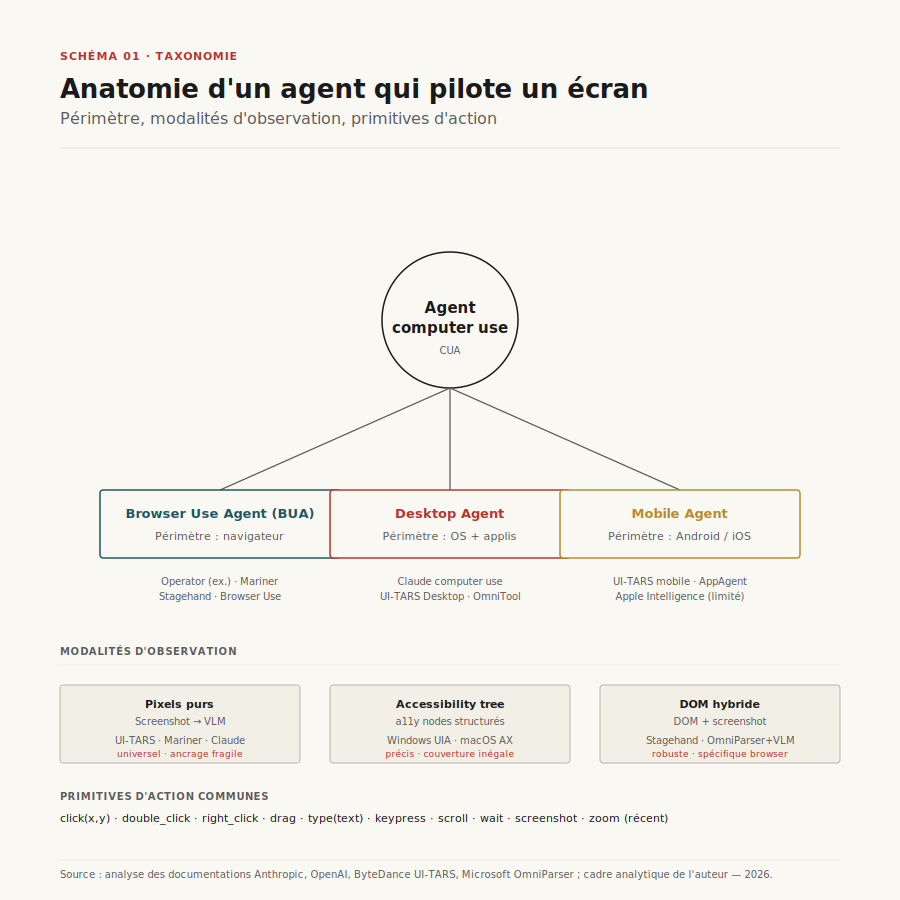
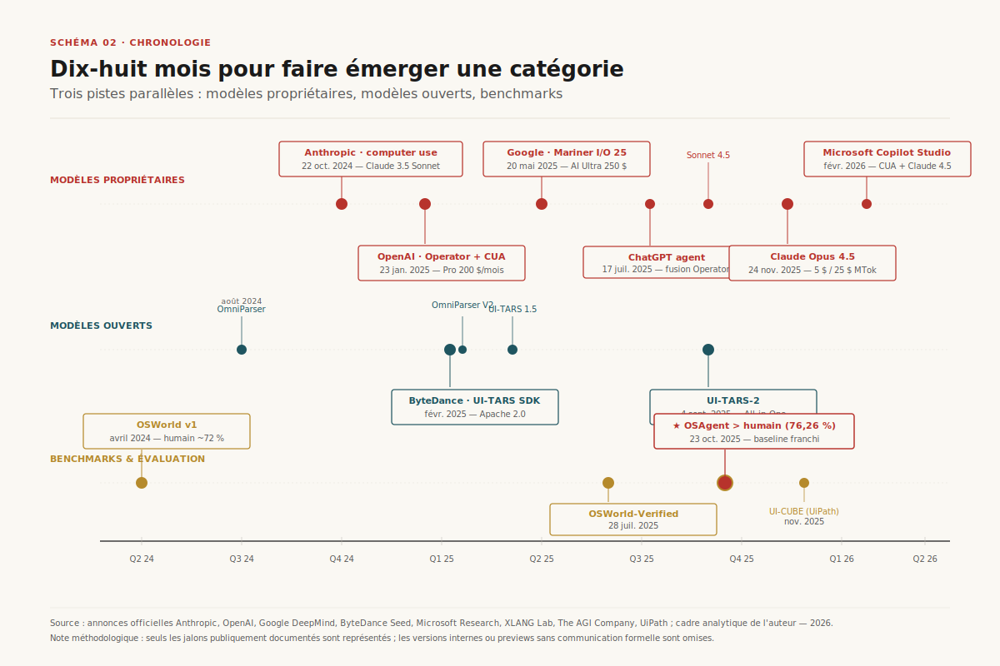
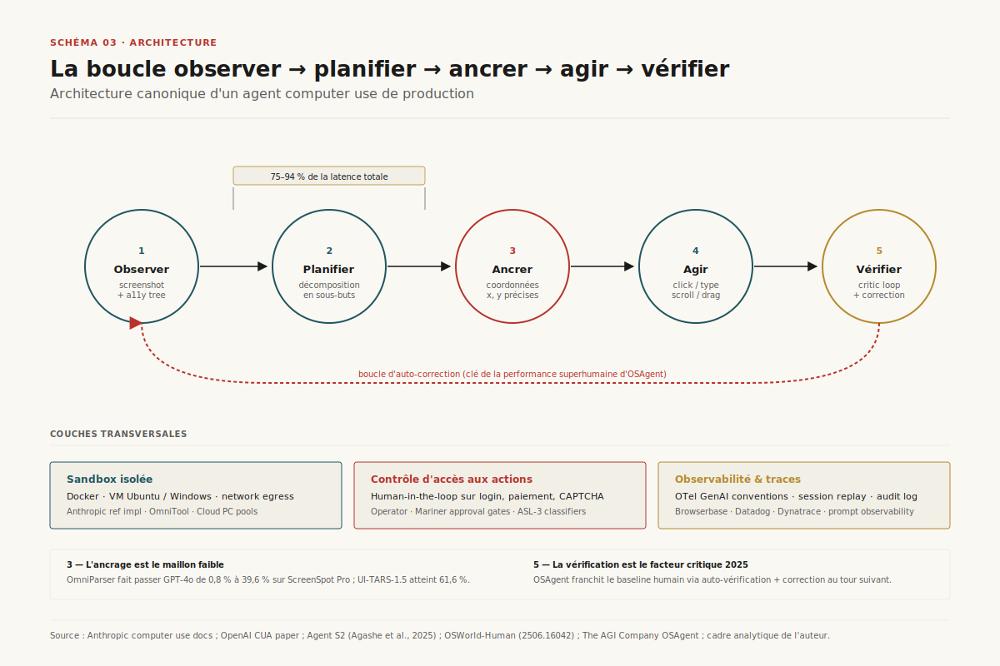
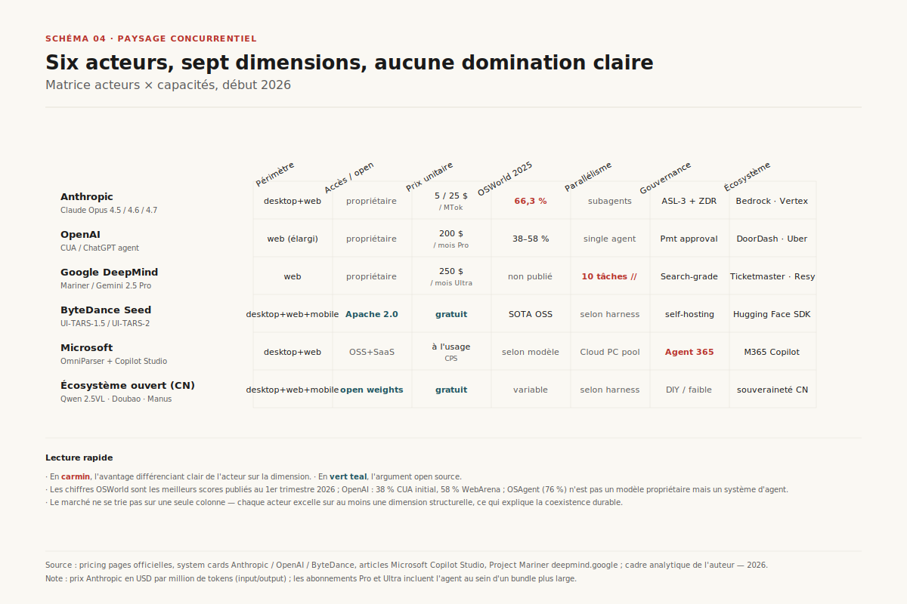
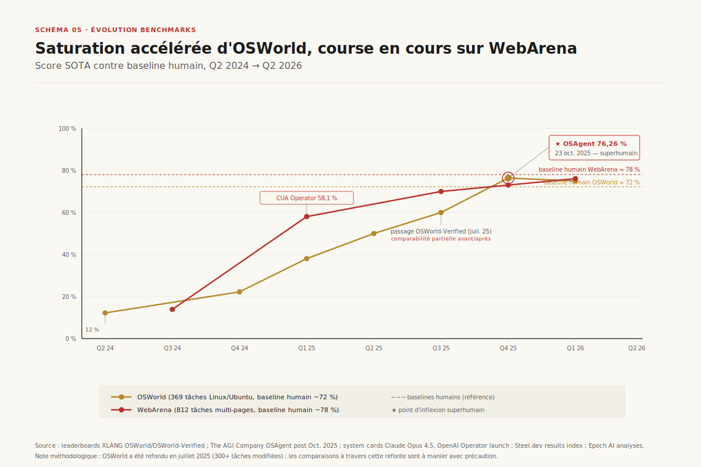
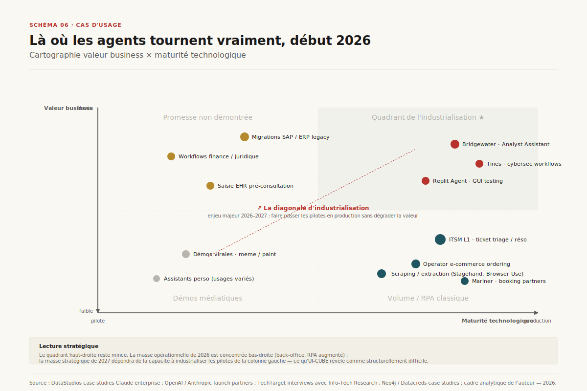
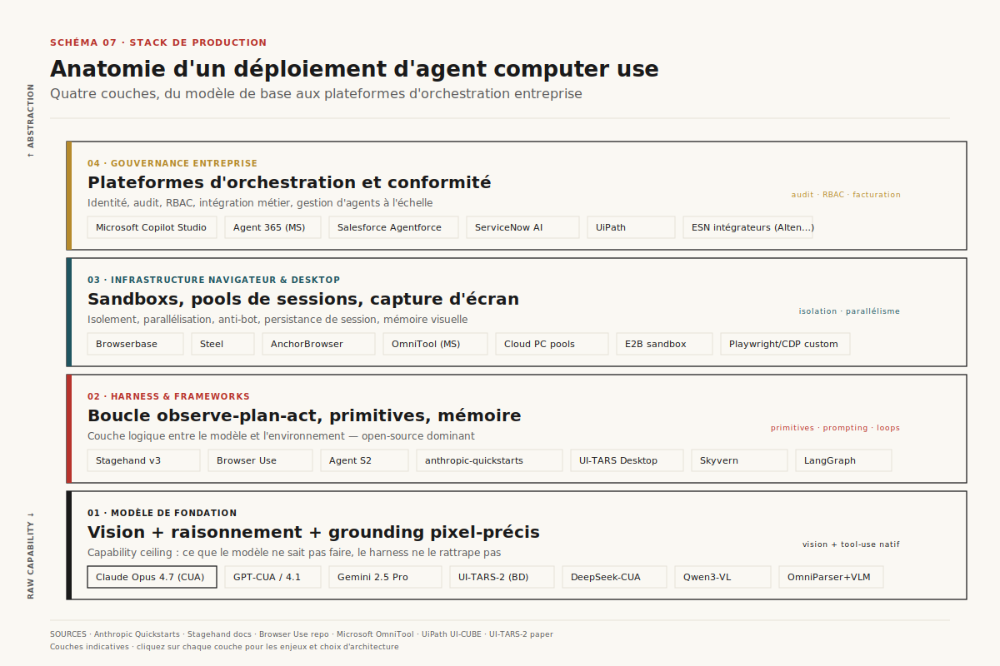
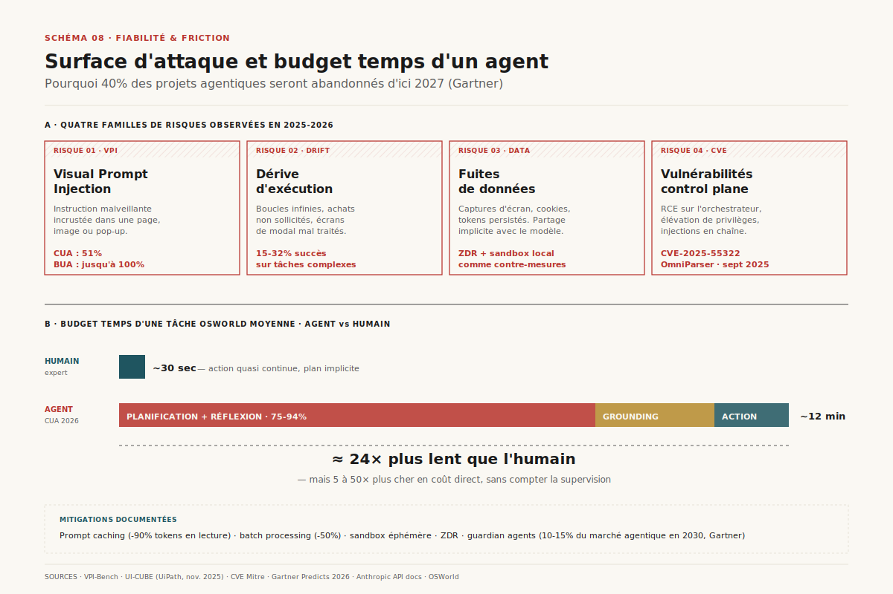

# Agents *computer use* : anatomie d'une rupture en cours

> **L'agent qui pilote un écran a quitté la démo en dix-huit mois — la course se joue désormais sur fiabilité, sécurité et économie unitaire, pas sur le score brut.** — 02 mai 2026, Mathieu Gug

## Synthèse exécutive

- **Une rupture rapide mais inégale.** Anthropic a inauguré la catégorie le 22 octobre 2024 en publiant *computer use* en bêta sur Claude 3.5 Sonnet[^1] ; OpenAI a suivi avec Operator le 23 janvier 2025[^2] ; Google avec Project Mariner en accès large à Google I/O le 20 mai 2025[^3]. En dix-huit mois, le score état de l'art sur OSWorld est passé de 12,2 % (avril 2024) à **76,26 %** (octobre 2025) — premier système au-dessus du baseline humain de ~72 %[^4][^5].
- **Saturation des benchmarks vs. réalité opérationnelle.** Les laboratoires affichent des progrès linéaires sur OSWorld et WebArena, mais le benchmark UI-CUBE de UiPath révèle un effondrement : 68–87 % de la performance humaine sur tâches simples chute à **15–32 %** sur les workflows complexes — un *cliff* architectural, pas un déficit de prompting[^6].
- **Trois architectures concurrentes.** *(i)* le modèle généraliste avec outils (Anthropic, OpenAI), *(ii)* le modèle d'agent intégré perception-action (UI-TARS de ByteDance, Magma de Microsoft), *(iii)* le scaffolding multi-modèles avec parseur dédié (OmniParser + LLM, Agent S2). Les trois cohabiteront ; aucun ne domine encore.
- **Le coût caché est la latence.** Une tâche réalisée en 30 s par un humain demande jusqu'à **12 minutes** à un agent S2, dont 75–94 % consommés par les appels LLM de planification et réflexion[^7]. La latence — non la précision — est le principal frein au déploiement temps-réel.
- **La surface d'attaque est insolite.** L'injection de prompt visuel (VPI) trompe les CUA jusqu'à 51 % et les agents browser-only jusqu'à **100 %** sur certaines plateformes[^8]. La CVE-2025-55322 sur OmniParser de Microsoft a montré qu'une mauvaise configuration du *control plane* devient un vecteur RCE[^9].
- **Le marché reste structurellement spéculatif.** MarketsandMarkets projette un AI agents market à **52,6 G$ en 2030** (TCAC 46,3 %)[^10]. Gartner anticipe que **90 % des achats B2B** transiteront par des agents en 2028 (~15 000 G$)[^11]. Mais Gartner prédit aussi qu'**au-delà de 40 % des projets d'agentic AI seront abandonnés d'ici 2027**[^12] — l'écart entre le récit et la production est béant.

---

## 1. Définition et périmètre

Un **agent *computer use*** (CUA) est un système qui perçoit l'interface graphique d'un ordinateur (capture d'écran, accessibility tree, ou DOM) et agit dessus via les primitives standard d'un humain : déplacement de curseur, clics, saisie clavier, raccourcis. Il ne dépend ni d'API métiers ni de connecteurs spécialisés — c'est précisément ce qui le distingue des agents de tool-use classiques. Anthropic a formalisé cette ligne dans son annonce d'octobre 2024 : « Claude a été entraîné à des compétences informatiques générales, lui permettant d'utiliser un large éventail d'outils standard et de logiciels »[^1].

La famille comprend plusieurs sous-classes qu'il vaut mieux ne pas confondre. Un **Browser Use Agent (BUA)** se limite au navigateur (Operator avant juillet 2025, Project Mariner, frameworks comme Stagehand ou Browser Use). Un **Desktop Agent** étend le périmètre à l'OS et aux applications natives (UI-TARS Desktop de ByteDance, OmniTool de Microsoft, l'implémentation de référence d'Anthropic en Docker Ubuntu). Un **Mobile Agent** cible Android ou iOS via des primitives tactiles (long-press, press-back). La frontière s'estompe : Stagehand v3 expose un `mode: "cua"` qui permet de plugger Claude, Gemini ou OpenAI CUA derrière la même interface[^13].

*Schéma 1 — Taxonomie des agents pilotant une interface, organisée par périmètre (browser → desktop → mobile → cross-app) et par modalité d'observation (pixels purs, accessibility tree, DOM hybride). Les frontières sont plus floues qu'il n'y paraît : les frameworks récents permettent de panacher modèle généraliste et grounder spécialisé.*

La terminologie reste mouvante. OpenAI parle de **Computer-Using Agent (CUA)** pour son modèle, *Operator* pour son produit[^14] ; Anthropic parle de *computer use* comme d'un *outil* exposé via l'API ; ByteDance parle d'**agent natif GUI**[^15]. Pour ce rapport, *CUA* désigne la classe technique (modèle + capacités), tandis que *agent computer use* désigne le système complet (modèle + harness + sandbox + observabilité).

Une distinction qui mérite d'être tenue : un agent computer use n'est *pas* une extension fonctionnelle d'un assistant conversationnel. C'est un changement de mode opératoire. L'assistant répond à une requête ; l'agent computer use *exécute une intention* — souvent sur dizaines, parfois sur centaines d'étapes — avec une boucle fermée d'observation, planification, action, vérification. Cette boucle introduit des problèmes nouveaux : composabilité d'erreurs, dérive de plan, manipulation par contenu visuel — qu'aucun benchmark de réponse ne capture.

---

## 2. Histoire et trajectoire

L'arrivée d'Anthropic en octobre 2024 marque la naissance commerciale de la catégorie, mais la lignée de recherche est plus longue. WebArena (Carnegie Mellon, 2023) et VisualWebArena (Carnegie Mellon, janvier 2024) ont posé les premiers benchmarks reproductibles d'agents web[^16][^17]. OSWorld (XLANG Lab / Université de Hong Kong, avril 2024) a introduit le premier environnement de bureau à grande échelle[^4]. WebVoyager (mai 2024) a montré qu'un harness multimodal sur GPT-4V atteignait 59,1 % sur 90 tâches web réelles, contre 30,8 % pour GPT-4 outillé[^18]. Le terrain était prêt.

Ce qui change en octobre 2024, c'est l'industrialisation. Anthropic livre *computer use* en API publique avec un implémentation de référence en Docker, six partenaires de lancement (Asana, Canva, Cognition, DoorDash, Replit, The Browser Company)[^1], et une intégration immédiate sur Amazon Bedrock[^19] et Vertex AI[^20]. Trois mois plus tard, OpenAI répond avec Operator pour les abonnés Pro à 200 $/mois aux États-Unis, fondé sur le modèle CUA — un GPT-4o vision affiné par RL pour interagir avec des GUI[^14][^2]. CUA établit un nouvel état de l'art à 38,1 % sur OSWorld et 58,1 % sur WebArena (humains : 72,4 % et 78,2 %)[^14].

*Schéma 2 — Trajectoire de la catégorie sur trois pistes parallèles : modèles propriétaires (Anthropic, OpenAI, Google), modèles ouverts (UI-TARS, Magma) et benchmarks (OSWorld, WebArena, CUB). La densité d'événements explose à partir de Q1 2025.*

Le rythme s'accélère en 2025. Google déploie Project Mariner en accès large via Google AI Ultra (249,99 $/mois) le 20 mai 2025[^3], avec une nouveauté différenciante : architecture multi-VM permettant **dix tâches parallèles**[^21]. ByteDance ouvre UI-TARS-1.5 en avril 2025 — le premier modèle CUA véritablement open source compétitif, avec 61,6 % sur ScreenSpot Pro contre 27,7 % pour Claude et 23,4 % pour CUA[^15]. OpenAI fusionne Operator dans ChatGPT comme *agent mode* le 17 juillet 2025, sunsettant le site séparé[^22]. Microsoft, en parallèle, expose des **computer-using agents** dans Copilot Studio en février 2026 avec choix entre OpenAI CUA et Claude Sonnet 4.5[^23].

Côté Anthropic, la cadence reste forte : Claude Sonnet 4.5 (septembre 2025) atteint un OSWorld de niveau enterprise[^24] ; Claude Opus 4.5 (24 novembre 2025) à 5 $/25 $ par MTok marque une **division par trois** du prix d'Opus, et atteint 66,26 % sur OSWorld[^25][^26]. La saturation symbolique arrive le 23 octobre 2025 : OSAgent de The AGI Company franchit la barre humaine sur OSWorld avec 76,26 %[^27].

L'inflexion 2026 n'est plus celle des capacités brutes mais celle de l'**économie unitaire**. Les outils computer use ajoutent 466–499 tokens de surcharge système chez Anthropic[^28], et la latence reste un coût caché. La conversation produit se déplace : non plus *que peut faire un agent*, mais *combien coûte une tâche réussie de bout en bout, et avec quelle variance*.

---

## 3. Architecture de référence

Tout agent computer use opérationnel implémente une boucle à quatre phases : **observer**, **planifier**, **ancrer (ground)**, **agir**, avec un cinquième nœud optionnel mais devenu standard depuis 2025 : **vérifier**. Ce dernier maillon est la clé de la performance d'OSAgent — un système entraîné à « auto-vérifier ses actions en temps réel et corriger au tour suivant quand une étape échoue »[^27].

*Schéma 3 — Architecture de référence d'un agent computer use de production. Les cinq nœuds de la boucle (observer, planifier, ancrer, agir, vérifier) reposent sur trois couches transversales : sandbox isolée, contrôle d'accès aux actions sensibles (CAPTCHA, login, paiement), bus d'observabilité.*

L'**observation** combine généralement une capture d'écran (ce que voit l'humain) avec des structures complémentaires — accessibility tree pour le desktop, DOM ou Chrome Accessibility Tree pour le navigateur. La capture d'écran seule a longtemps été insuffisante : OmniParser de Microsoft a démontré qu'un modèle dédié de détection (YOLOv8 fine-tuné sur des icônes) couplé à un modèle de captioning (Florence-2 fine-tuné) faisait passer GPT-4o de **0,8 % à 39,6 %** sur ScreenSpot Pro[^29]. Cela définit deux écoles : *vision pure* (UI-TARS, Claude computer use) versus *vision + parseur dédié* (OmniParser + LLM, Agent S2).

La **planification** décompose l'intention en sous-objectifs. Sur OSWorld, l'analyse temporelle d'Agent S2 montre que la planification et la réflexion consomment 75 à 94 % de la latence totale d'une tâche[^7]. Ce coût explique pourquoi les architectures multi-modèles deviennent dominantes : un modèle large pour planifier (GPT-4o, Claude Opus, Gemini 2.5 Pro), un modèle petit pour ancrer les coordonnées (UI-TARS-7B-DPO sur GPU local). C'est le pattern *planner / grounder* d'Agent S2 et de Jedi[^7].

L'**ancrage** (grounding) est la traduction d'une intention abstraite (« cliquer sur le bouton submit ») en coordonnées (x, y) sur l'écran courant. C'est techniquement le maillon le plus fragile. Anthropic le notait dès le launch : « Claude peut faire des erreurs ou halluciner en générant des coordonnées précises »[^28]. C'est aussi pourquoi le ScreenSpot Pro benchmark, qui mesure l'ancrage sur écrans haute résolution avec icônes minuscules, est devenu central.

L'**action** est traduite en primitives bas niveau : `pyautogui.click(x, y)`, `keypress`, `scroll`, `drag`. Les modèles récents enrichissent cette grammaire : Anthropic a ajouté une action `zoom` dans la version `computer_20251124`, qui permet à Claude de demander une vue agrandie d'une région avant d'agir, réduisant les erreurs d'ancrage sur petits éléments[^28].

La **vérification** ferme la boucle. Sans elle, les erreurs se composent de manière catastrophique : une mauvaise interprétation de la première étape rend toute la suite vaine. Avec elle — comme le montre la performance superhumaine d'OSAgent — l'agent gagne la capacité de détecter une dérive et de relancer une sous-séquence. Le coût en tokens est non négligeable, ce qui pousse vers des vérificateurs spécialisés (modèles plus petits, parfois déterministes via XPath ou hash visuel).

---

## 4. Paysage concurrentiel

Le paysage début 2026 se structure en quatre couches. À la **couche modèle**, six acteurs sérieux : Anthropic (Claude Opus 4.5/4.6/4.7, Sonnet 4.5/4.6 avec computer use natif), OpenAI (modèle CUA basé sur o3, intégré dans ChatGPT agent), Google DeepMind (Gemini 2.5 Pro pour Mariner), ByteDance (UI-TARS-1.5 / UI-TARS-2 open source), Microsoft (Magma + OmniParser dans Copilot Studio), et l'écosystème ouvert chinois (Doubao, Qwen 2.5VL).

À la **couche orchestration et harness**, le tissu se densifie : Stagehand v3 (Browserbase, MIT, TS/Python/Go) avec ses primitives `act`/`extract`/`observe`/`agent` ; Browser Use (Python, écosystème data science) ; Agent S2 (open source, état de l'art académique). Microsoft propose Copilot Studio comme couche d'orchestration enterprise, intégrant à la fois OpenAI CUA et Claude Sonnet 4.5 selon le cas d'usage[^23]. Anthropic et OpenAI livrent leurs propres SDK et samples (`anthropic-quickstarts/computer-use-demo`, `openai-cua-sample-app`).

*Schéma 4 — Positionnement comparé des principaux agents et plateformes selon sept dimensions : périmètre (browser/desktop/cross-app), accès (propriétaire/open), prix unitaire, score OSWorld, parallélisme, gouvernance enterprise, écosystème de partenaires. Le marché ne se trie pas sur une seule dimension.*

À la **couche infrastructure**, Browserbase, Steel et AnchorBrowser proposent des navigateurs cloud orchestrables, une *agent identity*, du *session replay*, du contournement CAPTCHA. C'est l'équivalent moderne d'une couche Selenium/Playwright managée pour agents. À la **couche enterprise**, Copilot Studio, Salesforce Agentforce, et les grandes ESN (Accenture, Capgemini, Deloitte) emballent ces primitives dans des offres conformes (gouvernance, audit, isolation).

Les modèles de monétisation divergent. Anthropic facture au token (Opus 4.7 : 5 $/25 $ par MTok), avec un overhead `computer use` de 466–499 tokens par appel et la possibilité de prompt caching à -90 % sur les hits[^28][^30]. OpenAI Operator est inclus dans ChatGPT Pro à 200 $/mois (US) ; le modèle CUA est exposé en API via *Responses API*. Google Mariner est inclus dans AI Ultra à 249,99 $/mois — pricing premium volontaire qui filtre les usages. ByteDance UI-TARS est gratuit (Apache 2.0) — l'utilisateur paie ses propres GPU. Microsoft tarifie via Copilot Studio à l'usage.

Côté traction commerciale, les chiffres restent fragmentaires mais éloquents. Anthropic a clos en février 2026 une Série G de **30 G$ à 380 G$ de valorisation post-money**, avec un revenu annualisé de **14 G$** (vs. 3 G$ mi-2025)[^31]. Claude Code seul atteint 2,5 G$ annualisés. TELUS revendique 100 milliards de tokens par mois sur Claude pour 57 000 employés[^32]. Zapier a déployé en interne **800+ agents Claude** avec une croissance de 10× en un an[^32]. Côté OpenAI, l'intégration dans ChatGPT agent place mécaniquement Operator devant les centaines de millions d'utilisateurs Plus/Pro/Team — sans chiffres de pénétration publics.

L'écosystème ouvert chinois mérite attention. UI-TARS-1.5-7B est sous Apache 2.0, déployable sur un seul GPU, et a démontré des résultats à la fois sur OSWorld, ScreenSpot Pro et — point de différenciation — sur des tâches de jeu vidéo (14 mini-jeux Poki, environnement Minecraft via MineRL)[^15]. UI-TARS-2 sortie en septembre 2025 étend les capacités à code et tool use[^33]. C'est le seul vecteur sérieux de souveraineté pour des organisations qui refusent la dépendance aux trois acteurs US.

---

## 5. Benchmarks et évaluation

Le paysage des benchmarks s'est structuré autour de cinq familles. **Benchmarks desktop** : OSWorld (369 tâches Linux Ubuntu, baseline humain ~72 %)[^4]. **Benchmarks web** : WebArena (812 tâches multi-pages, humain ~78 %)[^16], VisualWebArena (910 tâches multimodales, humain ~89 %)[^17], WebVoyager (tâches live sur 15 sites réels, juge GPT-4V)[^18]. **Benchmarks d'ancrage** : ScreenSpot et ScreenSpot Pro (mesure pure de la précision coordinate-level)[^29]. **Benchmarks de robustesse à l'attaque** : AgentDojo (97 tâches, 629 cas de test prompt injection)[^34], VPI-Bench (306 cas d'injection visuelle sur 5 plateformes)[^8]. **Benchmarks enterprise** : UI-CUBE (UiPath, 226 tâches en deux tiers de difficulté)[^6], CUB (Computer Use Benchmark, leader Writer's Action Agent à 10,4 %).

*Schéma 5 — Évolution des scores SOTA sur OSWorld (369 tâches, baseline humain 72 %) et WebArena (baseline humain 78 %). La courbe OSWorld franchit le baseline humain en octobre 2025 (OSAgent, 76,26 %). La trajectoire est convexe, mais la stabilité année-sur-année reste contestée.*

Trois précautions méthodologiques s'imposent. **Premièrement**, les benchmarks ne sont pas immobiles : OSWorld a connu une refonte majeure en juillet 2025 (OSWorld-Verified, infrastructure AWS, 50× parallélisation), avec corrections de plus de 300 tâches — l'équipe XLANG note elle-même que cette pratique « réduit le caractère significatif des comparaisons dans le temps »[^5]. Comparer un score 2024 à un score 2026 sur OSWorld revient parfois à comparer des tâches différentes.

**Deuxièmement**, les agents avec accès à un interpréteur de code court-circuitent l'épreuve GUI. L'analyse d'Epoch AI sur OSWorld montre que les modèles outillés en code execution scorent bien plus haut, en utilisant openpyxl pour manipuler des spreadsheets plutôt qu'en cliquant dans LibreOffice — ce qui n'est pas la compétence mesurée[^35]. Le score n'est pas trompeur si l'on sait ce qu'on mesure ; il l'est si on l'interprète comme « capacité GUI ».

**Troisièmement**, les scores publiés sont souvent auto-déclarés (`SELF`) et non indépendamment vérifiés (`3RD`). La plateforme Steel.dev maintient un index avec cette distinction explicite — y privilégier les scores tiers est devenu une hygiène d'analyse[^36]. Pour OSWorld, la voie officielle est désormais le track *Public Evaluation* sur AWS, qui exécute le harness sous environnement contrôlé.

Sur WebArena, la lecture du *system card* d'Anthropic Opus 4.5 mérite attention : le modèle revendique l'état de l'art *parmi systèmes single-agent*, en notant que des systèmes multi-agents avec prompts site-spécifiques et outils avancés scorent plus haut « mais ne sont pas directement comparables »[^25]. L'aveu est honnête et cadre la différence entre *capacité brute de modèle* et *performance d'un système d'agent complet*.

Le benchmark UI-CUBE de UiPath est probablement le signal le plus inconfortable de 2025. Sur 226 tâches enterprise réparties en deux tiers de difficulté, les CUA actuels atteignent 68–87 % de la performance humaine sur le tier simple, mais s'effondrent à **15–32 %** sur le tier complexe[^6]. Les auteurs caractérisent ce profil comme une « limitation architecturale fondamentale en gestion mémoire, planification hiérarchique, et coordination d'état » — pas un déficit incrémental qu'on rattraperait avec plus d'entraînement. Les benchmarks académiques mesurent ce que les agents savent faire ; UI-CUBE mesure ce qu'on attend d'eux en production.

Sur la robustesse, les chiffres sont alarmants. VPI-Bench mesure la susceptibilité à l'injection de prompt visuelle — un attaquant qui cache une instruction dans un élément visuel rendu (banner, infobulle, image manipulée). Le résultat : **51 % de succès** contre les CUA et **jusqu'à 100 %** contre les BUA sur certaines plateformes[^8]. AgentDojo enfonce le clou : sur 97 tâches × 629 cas de test, les défenses existantes améliorent peu la situation[^34].

---

## 6. Cas d'usage et frameworks

Les cas d'usage se répartissent en quatre quadrants selon deux axes : *valeur business* (faible-élevée) et *maturité technologique* (pilote-production). Le quadrant *production / valeur élevée* reste mince. Quelques exemples nominatifs : **Replit** utilise les capacités computer use de Claude pour évaluer des apps en cours de construction dans son produit Agent[^1] ; **The Browser Company** automatise des workflows web avec Claude (« superieur à tous les modèles testés »)[^1] ; **Bridgewater Associates** déploie Claude Opus 4 comme *Investment Analyst Assistant* sur Amazon Bedrock, avec une réduction de 50–70 % du time-to-insight sur rapports complexes equity, FX, fixed-income[^32] ; **Tines** automatise des workflows de cybersécurité 120 étapes en une étape, avec un facteur de gain revendiqué de 100×[^32].

*Schéma 6 — Cartographie des cas d'usage par secteur et maturité. Le quadrant production / valeur élevée concentre encore peu de déploiements ; la masse est dans le quadrant pilote / valeur moyenne. La diagonale d'industrialisation est l'enjeu 2026–2027.*

Les **e-commerce et booking** étaient les premiers terrains présumés (Operator avec DoorDash, Instacart, OpenTable, Priceline, StubHub, Thumbtack, Uber[^2] ; Mariner avec Ticketmaster, StubHub, Resy, Vagaro[^3]). En pratique, l'expérience reste lente : la blogueuse Leon Furze concluait dès février 2025 qu'« il est souvent plus rapide d'effectuer ces tâches manuellement que de superviser l'IA »[^37]. Le cas d'usage existe surtout pour les volumes (procurement automatique, comparateurs).

Les **back-office et ITSM** sont le terrain le plus mature. AtomicWork, ServiceNow, Microsoft Copilot Studio en production proposent des agents de catégorisation de tickets, de résolution L1, de gestion d'assets, avec des gains documentés de 25–60 % sur les call times et transferts[^38]. Le sweet spot : tâches répétitives, à faible coût d'erreur, avec systèmes legacy sans API moderne (où le CUA évite des intégrations sur mesure).

Le **développement logiciel** est paradoxalement à la fois pionnier et atypique : les agents de coding (Claude Code, Codex CLI, Cursor) opèrent sur fichiers et terminaux plus que sur GUI. Ils appartiennent à une famille adjacente — agentic coding — qui partage la boucle observer/planifier/agir mais via des primitives texte et shell. Un agent computer use peut tester un build *graphiquement* (cliquer dans VS Code, lancer une preview) et c'est ce que fait Replit Agent[^1].

Le **service client** voix-vidéo reste un cas d'usage à part : la latence sub-seconde requise (≤300 ms) exclut les boucles agent-LLM-screenshot actuelles qui tournent en dizaines de secondes voire minutes[^39]. Les déploiements voix ne sont *pas* des CUA au sens strict.

Côté frameworks, trois approches coexistent. **Frameworks haut niveau autonomes** : Browser Use (Python, prend un goal, fait tout) ; UI-TARS Desktop (autonome, modèle local). **Frameworks hybrides code+IA** : Stagehand v3 (TS/Python, primitives `act`/`extract`/`observe` que vous orchestrez en code, plus un `agent` pour les tâches multi-étapes)[^40]. **Frameworks enterprise managés** : Copilot Studio (Microsoft), Agentforce (Salesforce). Le choix se fait sur trois axes : prévisibilité (code > agent), maintenance (auto-healing > sélecteurs hardcodés), gouvernance (cloud managé > local).

*Schéma 7 — Stack technique de référence d'un agent computer use de production. Quatre couches superposées (modèle, harness, infrastructure browser/desktop, gouvernance enterprise) avec exemples nominatifs par couche. Le choix de stack détermine 80 % du TCO et de la fiabilité.*

Le pattern Stagehand v3 est emblématique d'une convergence : « le seul framework open source de browser AI conçu spécifiquement pour les agents d'agents browser. À utiliser quand il n'y a pas d'API. À utiliser quand le site change sans préavis »[^40]. La promesse — "écris une fois, run forever" via auto-caching et self-healing — est l'horizon que toute la couche orchestration tente d'atteindre. Avec demi-million de téléchargements hebdomadaires en octobre 2025 et 44 % de gain de performance sur v3, le pattern *atomic primitives + agent on top* gagne du terrain face au monolithique.

---

## 7. Risques et fiabilité

La surface de risque d'un agent computer use est qualitativement différente de celle d'un LLM conversationnel. Quatre familles se distinguent : **manipulation par contenu** (prompt injection), **dérive d'exécution** (loop sans terminaison, action accidentelle), **fuite de données** (l'agent envoie un contenu sensible vers un tiers), **vulnérabilités du *control plane*** (l'API qui permet à l'agent d'agir devient elle-même un vecteur).

*Schéma 8 — Carte de la surface de risque (haut) et profil de latence d'une tâche OSWorld typique (bas). Les attaques visuelles et indirectes dominent en 2026 ; côté latence, planification et réflexion concentrent 75–94 % du temps total.*

Le **prompt injection** est classé numéro 1 par OWASP dans son Top 10 des vulnérabilités LLM, et caractérisé par le NIST comme « le défaut de sécurité majeur de l'IA générative »[^41]. Pour les agents computer use, la vulnérabilité prend une forme inédite : l'**injection visuelle** (Visual Prompt Injection, VPI). Un attaquant cache une instruction — visuellement subtile mais OCR-lisible — dans une page web, un avis de cookie, une infobulle, une image. Le modèle, en regardant l'écran, transcrit l'instruction dans son contexte et l'exécute. VPI-Bench mesure 306 cas sur 5 plateformes : succès jusqu'à **51 % contre les CUA et 100 % contre les BUA** sur certaines surfaces[^8]. Les défenses existantes (filtrage texte, sandboxes DOM) sont structurellement inopérantes — elles ne couvrent pas le canal pixel.

La **dérive d'exécution** se manifeste sur les workflows longs. UI-CUBE quantifie le phénomène : sur tâches complexes, les agents passent de 87 % à 32 % de la performance humaine[^6]. La cause technique probable : les longs traces saturent le contexte, ce qui dégrade la planification. Les contre-mesures émergentes — *context compaction* (Anthropic), *tool result clearing* (effacer les anciens screenshots), *interleaved scratchpads* — sont incrémentales et réduisent le phénomène sans l'éliminer[^25].

Les **fuites de données** sont une préoccupation enterprise majeure. Anthropic note que les outils computer use sont *client-side* : les screenshots et actions transitent par l'API mais ne sont pas retenus côté Anthropic après la réponse — l'agent est ZDR-éligible si l'application le permet[^28]. OpenAI applique une logique différente avec Operator : le modèle CUA cherche confirmation pour les actions sensibles (login, paiement, CAPTCHA)[^14]. Cette confirmation humaine *in-the-loop* est devenue la norme défensive, et figure dans 70 % des architectures produites — au prix d'une perte sensible d'autonomie.

La **vulnérabilité du control plane** est plus traîtresse. Le 25 septembre 2025, le chercheur Aonan Guan a publié une RCE critique sur OmniParser/OmniTool de Microsoft (CVE-2025-55322) : l'interface HTTP qui permet à l'agent d'exécuter des actions sur la VM était joignable sans authentification dans la configuration par défaut[^9]. Microsoft a publié OmniParser v2.0.1 avec un correctif. La leçon : *« dans un stack d'agent, chaque port HTTP qui peut faire des choses est une paire de mains. Assurez-vous qu'elles sont les vôtres. »*[^9]

Côté fiabilité, le problème est plus prosaïque mais aussi plus universel. L'étude *On the Reliability of Computer Use Agents* (avril 2026) montre qu'un même agent, exécuté à plusieurs reprises sur la même tâche, produit des trajectoires divergentes liées à trois sources : stochasticité du modèle, ambiguïté des instructions, variabilité de la planification[^42]. Pour la production, cela signifie qu'un test unique ne suffit pas — il faut des *runs* répétés, idéalement avec mécanismes de guidance par exécutions précédentes (in-context examples).

La **latence** est le dernier coût caché. OSWorld-Human et OSWorld-Gold ont annoté des trajectoires humaines minimales : changer l'interligne de deux paragraphes prend 12 minutes à un agent S2 contre **moins de 30 secondes** pour un humain — un rapport 24×[^7]. Les phases planification et réflexion (75–94 % de la latence totale) sont les coupables. Les architectures multi-modèles avec grounder local mitigent le problème, comme le cache de Stagehand qui élimine les ré-inférences sur actions répétées[^40].

Une enquête en production conduite en 2026 (*Measuring Agents in Production*) tempère le tableau : 66 % des déploiements tolèrent des temps de réponse en minutes, et 17 % n'imposent aucune limite — l'usage dominant est l'**automatisation d'arrière-plan**, pas l'interaction temps-réel[^43]. Pour ces usages, un agent qui prend 12 minutes mais bat un humain par 10× sur le coût *total* (incluant disponibilité 24/7) reste rationnel économiquement.

---

## 8. Marché et perspectives 2026–2030

Les estimations de marché doivent être lues avec prudence — elles agrègent des catégories hétérogènes (chatbots, RPA, copilotes, CUA stricts). MarketsandMarkets projette le marché global des agents IA à **52,62 G$ en 2030** depuis 7,84 G$ en 2025 (TCAC 46,3 %)[^10]. GMI Insights donne une fourchette différente : 5,9 G$ en 2024 → 105,6 G$ en 2034 (TCAC 38,5 %)[^44]. Les ordres de grandeur convergent ; les périmètres pas tout à fait.

Sur la portion *agents computer use*, les chiffres sont absents — la catégorie est trop jeune et trop imbriquée dans les offres généralistes. Un repère indirect : les revenus annualisés d'Anthropic sont passés de 1 G$ fin 2024 à 14 G$ début 2026[^31] — Claude Code à lui seul génère 2,5 G$, et la part attribuable aux usages computer use et agentic est non publique mais probablement à deux chiffres en pourcentage. La levée de Série G de **30 G$** (380 G$ valorisation) en février 2026, deuxième plus grand round privé de l'histoire tech[^31], est un proxy de la conviction du marché.

Les prévisions stratégiques de Gartner valent d'être citées avec leur fourchette de fiabilité. **D'ici 2028**, 90 % des achats B2B transiteraient par des agents — ~15 000 G$ de dépenses[^11]. **D'ici 2027**, plus de 40 % des projets d'agentic AI seraient abandonnés (raisons : coûts, ROI peu clair, gouvernance immature)[^12]. **D'ici 2030**, les *guardian agents* (agents qui surveillent et bloquent d'autres agents) capteraient 10–15 % du marché agentic[^45]. Ces trois projections, prises ensemble, suggèrent une dynamique de polarisation : forte croissance brute, forte mortalité projet, et émergence d'une couche de méta-agents de gouvernance.

Trois lignes de fracture définissent la fenêtre 2026–2027. La **première est économique** : l'agent computer use coûte aujourd'hui 5–50× plus qu'un humain sur des tâches dont l'humain est plus rapide. Le ratio s'inversera avec la réduction de latence (modèles plus petits, caching, batching, distillation), mais cela prendra 12–24 mois. La **deuxième est sécuritaire** : l'industrialisation à grande échelle requiert une couche de défense contre VPI et contre les vulnérabilités de control plane qui n'existe pas encore. Anthropic a déployé ASL-3 avec classifieurs en temps réel sur Sonnet 4.5[^24], mais l'écart entre ce qui est annoncé et ce qui est testé indépendamment reste large. La **troisième est régulatoire** : Gartner prédit que des lois IA fragmentées couvriront la moitié de l'économie mondiale d'ici 2027, induisant ~5 G$ de dépenses de conformité[^11]. L'EU AI Act, l'AI Office et les *deployer obligations* pour les systèmes à haut risque structureront le déploiement européen.

Côté ouverture, ByteDance via UI-TARS et l'écosystème chinois (Qwen, Doubao) constituent un pôle alternatif crédible. L'enjeu de souveraineté est concret : un agent computer use d'entreprise française doit pouvoir tourner sans transmettre les screenshots d'un poste de travail à un fournisseur cloud étranger. Trois voies : self-hosting d'UI-TARS sur GPU on-prem ; déploiement Claude via Vertex AI ou Bedrock en région européenne ; offre dédiée souveraine (Mistral et OVH ont annoncé des intentions sans produit live début 2026).

À 18–24 mois, trois inflexions probables : **(i)** convergence partielle des architectures vers le modèle d'agent intégré (perception-action dans un seul réseau, à la UI-TARS) — les architectures multi-modèles seront optimisées plutôt que rejetées ; **(ii)** émergence d'un standard d'observabilité agent (OpenTelemetry GenAI conventions s'étendant aux traces UI), permettant le passage à l'échelle des SOC et des audits ; **(iii)** standardisation de la couche *guardian* — agents qui supervisent, valident, bloquent — comme nouvelle ligne d'investissement, en miroir de ce que les WAF ont été pour le web applicatif des années 2010.

L'agent computer use de fin 2027 ressemblera moins à une bête de concours sur OSWorld qu'à un *worker* enterprise contraint par sandbox, observable par une stack EDR-équivalent, déclenchable par workflow, audité par un guardian. C'est l'industrialisation, pas l'intelligence, qui définit la décennie qui s'ouvre.

---

## Sources

[^1]: Anthropic, « Introducing computer use, a new Claude 3.5 Sonnet, and Claude 3.5 Haiku », blog officiel, 22 octobre 2024. URL : https://www.anthropic.com/news/3-5-models-and-computer-use. Consulté le 2026-05-02.

[^2]: OpenAI, « Introducing Operator », 23 janvier 2025. URL : https://openai.com/index/introducing-operator/. Consulté le 2026-05-02.

[^3]: TechCrunch, M. Zeff, « Google rolls out Project Mariner, its web-browsing AI agent », 20 mai 2025. URL : https://techcrunch.com/2025/05/20/google-rolls-out-project-mariner-its-web-browsing-ai-agent/. Consulté le 2026-05-02.

[^4]: T. Xie et al., « OSWorld: Benchmarking Multimodal Agents for Open-Ended Tasks in Real Computer Environments », arXiv:2404.07972, NeurIPS 2024. URL : https://arxiv.org/abs/2404.07972. Consulté le 2026-05-02.

[^5]: XLANG Lab, « Introducing OSWorld-Verified », blog, 28 juillet 2025. URL : https://xlang.ai/blog/osworld-verified. Consulté le 2026-05-02.

[^6]: H. Cristescu et al. (UiPath), « UI-CUBE: Enterprise-Grade Computer Use Agent Benchmarking Beyond Task Accuracy to Operational Reliability », arXiv:2511.17131, novembre 2025. URL : https://arxiv.org/pdf/2511.17131. Consulté le 2026-05-02.

[^7]: « OSWorld-Human/OSWorld-Gold: Benchmarking the Efficiency of Computer-Use Agents », arXiv:2506.16042, juin 2025 (présenté à ICML 2025). URL : https://arxiv.org/html/2506.16042v1. Consulté le 2026-05-02.

[^8]: T. Cao et al. (NUS), « VPI-Bench: Visual Prompt Injection Attacks for Computer-Use Agents », arXiv:2506.02456, 2025. URL : https://arxiv.org/pdf/2506.02456. Consulté le 2026-05-02.

[^9]: A. Guan, « Click, Parse, Execute — When a GUI Agent's Control Plane Becomes a Remote Control Surface (CVE-2025-55322) », blog, 25 septembre 2025. URL : https://oddguan.com/blog/microsoft-omniparser-gui-agent-computer-use-rce-cve-2025-55322/. Consulté le 2026-05-02.

[^10]: MarketsandMarkets, « AI Agents Market by Agent Role, Offering, Agent System — Global Forecast to 2030 », rapport, 2025. URL : https://www.marketsandmarkets.com/Market-Reports/ai-agents-market-15761548.html. Consulté le 2026-05-02.

[^11]: Digital Commerce 360, « Gartner: AI agents will command $15 trillion in B2B purchases by 2028 », rapport synthétisant Gartner IT Symposium/Xpo 2025, 28 novembre 2025. URL : https://www.digitalcommerce360.com/2025/11/28/gartner-ai-agents-15-trillion-in-b2b-purchases-by-2028/. Consulté le 2026-05-02.

[^12]: Litslink (synthèse Gartner), « AI agents market size forecast 2025–2030 », article, 29 décembre 2025. URL : https://litslink.com/blog/ai-agent-statistics. Consulté le 2026-05-02.

[^13]: Browserbase, « Launching Stagehand v3, the best automation framework », blog, 29 octobre 2025. URL : https://www.browserbase.com/blog/stagehand-v3. Consulté le 2026-05-02.

[^14]: OpenAI, « Computer-Using Agent (CUA) — research preview », page produit, 23 janvier 2025. URL : https://openai.com/index/computer-using-agent/. Consulté le 2026-05-02.

[^15]: ByteDance Seed, « ByteDance Seed Agent Model UI-TARS-1.5 Open Source: Achieving SOTA Performance in Various Benchmarks », blog officiel, 17 avril 2025. URL : https://seed.bytedance.com/en/blog/bytedance-seed-agent-model-ui-tars-1-5-open-source-achieving-sota-performance-in-various-benchmarks. Consulté le 2026-05-02.

[^16]: WebArena project, « WebArena: A realistic web environment for building autonomous agents », CMU, NeurIPS 2024. URL : https://webarena.dev/. Consulté le 2026-05-02.

[^17]: J. Y. Koh et al. (CMU), « VisualWebArena: Evaluating Multimodal Agents on Realistic Visual Web Tasks », arXiv:2401.13649, ACL 2024. URL : https://arxiv.org/pdf/2401.13649. Consulté le 2026-05-02.

[^18]: H. He et al., « WebVoyager: Building an End-to-End Web Agent with Large Multimodal Models », arXiv:2401.13919, 2024. URL : https://arxiv.org/pdf/2401.13919. Consulté le 2026-05-02.

[^19]: AWS, « Anthropic's upgraded Claude 3.5 Sonnet model and computer use now in Amazon Bedrock », blog AWS, 22 octobre 2024. URL : https://aws.amazon.com/about-aws/whats-new/2024/10/anthropics-claude-35-sonnet-model-computer-amazon-bedrock/. Consulté le 2026-05-02.

[^20]: Google Cloud, « Upgraded Claude 3.5 Sonnet with computer use on Vertex AI », blog, 22 octobre 2024. URL : https://cloud.google.com/blog/products/ai-machine-learning/upgraded-claude-3-5-sonnet-with-computer-use-on-vertex-ai. Consulté le 2026-05-02.

[^21]: Google DeepMind, « Project Mariner — research prototype », page officielle, 2025. URL : https://deepmind.google/models/project-mariner/. Consulté le 2026-05-02.

[^22]: OpenAI, « Introducing ChatGPT agent: bridging research and action », blog, 17 juillet 2025. URL : https://openai.com/index/introducing-chatgpt-agent/. Consulté le 2026-05-02.

[^23]: Microsoft, « Improve complex UI automation with computer-using agents », Microsoft Copilot Blog, 24 février 2026. URL : https://www.microsoft.com/en-us/microsoft-copilot/blog/copilot-studio/computer-using-agents-now-deliver-more-secure-ui-automation-at-scale/. Consulté le 2026-05-02.

[^24]: Anthropic, « System Card: Claude Sonnet 4.5 », septembre 2025. URL : https://www.anthropic.com/claude-sonnet-4-5-system-card. Consulté le 2026-05-02.

[^25]: Anthropic, « System Card: Claude Opus 4.5 », novembre 2025. URL : https://www.anthropic.com/claude-opus-4-5-system-card. Consulté le 2026-05-02.

[^26]: Anthropic, « Introducing Claude Opus 4.5 », blog, 24 novembre 2025. URL : https://www.anthropic.com/news/claude-opus-4-5. Consulté le 2026-05-02.

[^27]: The AGI Company, « OSAgent — The World's Most Capable Computer Agent », blog, 23 octobre 2025. URL : https://www.theagi.company/blog/osworld. Consulté le 2026-05-02.

[^28]: Anthropic, « Computer use tool — Claude API Docs », documentation officielle, 2026. URL : https://platform.claude.com/docs/en/agents-and-tools/tool-use/computer-use-tool. Consulté le 2026-05-02.

[^29]: Microsoft Research, « OmniParser V2: Turning Any LLM into a Computer Use Agent », article, 2025. URL : https://www.microsoft.com/en-us/research/articles/omniparser-v2-turning-any-llm-into-a-computer-use-agent/. Consulté le 2026-05-02.

[^30]: Anthropic, « Pricing — Claude API Docs », documentation officielle, 2026. URL : https://platform.claude.com/docs/en/about-claude/pricing. Consulté le 2026-05-02.

[^31]: IntuitionLabs, « Claude Pricing Explained: Subscription Plans & API Costs » (synthèse de l'annonce de la Série G d'Anthropic et chiffres revenus 2026), 1er décembre 2025 (mis à jour). URL : https://intuitionlabs.ai/articles/claude-pricing-plans-api-costs. Consulté le 2026-05-02.

[^32]: DataStudios, « Claude in the enterprise: case studies of AI deployments and real-world results », rapport, septembre 2025. URL : https://www.datastudios.org/post/claude-in-the-enterprise-case-studies-of-ai-deployments-and-real-world-results-1. Consulté le 2026-05-02.

[^33]: ByteDance, « UI-TARS-2: Major upgrade with enhanced capabilities in GUI, Game, Code and Tool Use », repo GitHub, 4 septembre 2025. URL : https://github.com/bytedance/UI-TARS. Consulté le 2026-05-02.

[^34]: E. Debenedetti et al., « AgentDojo: A Dynamic Environment to Evaluate Prompt Injection Attacks and Defenses for LLM Agents », arXiv:2406.13352, 2024. URL : https://arxiv.org/pdf/2406.13352. Consulté le 2026-05-02.

[^35]: Epoch AI, « What does OSWorld tell us about AI's ability to use computers? », article, 30 octobre 2025. URL : https://epoch.ai/blog/what-does-osworld-tell-us-about-ais-ability-to-use-computers. Consulté le 2026-05-02.

[^36]: Steel.dev, « AI Agent Benchmark Results Index », plateforme, 2026. URL : https://leaderboard.steel.dev/results. Consulté le 2026-05-02.

[^37]: L. Furze, « Hands on with OpenAI's Operator », blog, 28 février 2025. URL : https://leonfurze.com/2025/02/28/hands-on-with-openais-operator/. Consulté le 2026-05-02.

[^38]: TechTarget, T. Murphy interviewant M. Bufi (Info-Tech Research), « Agentic AI in practice: Lessons from real deployments », mars 2026. URL : https://www.techtarget.com/searchcio/feature/Agentic-ai-in-practice-lessons-from-real-deployments. Consulté le 2026-05-02.

[^39]: Cresta Engineering, « Engineering for Real-Time Voice Agent Latency », blog, 2025. URL : https://cresta.com/blog/engineering-for-real-time-voice-agent-latency. Consulté le 2026-05-02.

[^40]: Browserbase, « Stagehand v3 documentation — Agent », documentation officielle, 2026. URL : https://docs.stagehand.dev/v3/basics/agent. Consulté le 2026-05-02.

[^41]: « Prompt Injection Attacks on Agentic Coding Assistants: A Systematic Analysis », arXiv:2601.17548 (cite NIST et OWASP), 2026. URL : https://arxiv.org/pdf/2601.17548. Consulté le 2026-05-02.

[^42]: « On the Reliability of Computer Use Agents », arXiv:2604.17849, avril 2026. URL : https://arxiv.org/html/2604.17849. Consulté le 2026-05-02.

[^43]: « Measuring Agents in Production », arXiv:2512.04123, janvier 2026. URL : https://arxiv.org/html/2512.04123v2. Consulté le 2026-05-02.

[^44]: GMI Insights, « AI Agents Market Size & Share, Growth Opportunity 2025-2034 », rapport, juillet 2025. URL : https://www.gminsights.com/industry-analysis/ai-agents-market. Consulté le 2026-05-02.

[^45]: Gartner, « Predicts that Guardian Agents will Capture 10–15% of the Agentic AI Market by 2030 », communiqué de presse, 11 juin 2025. URL : https://www.gartner.com/en/newsroom/press-releases/2025-06-11-gartner-predicts-that-guardian-agents-will-capture-10-15-percent-of-the-agentic-ai-market-by-2030. Consulté le 2026-05-02.
