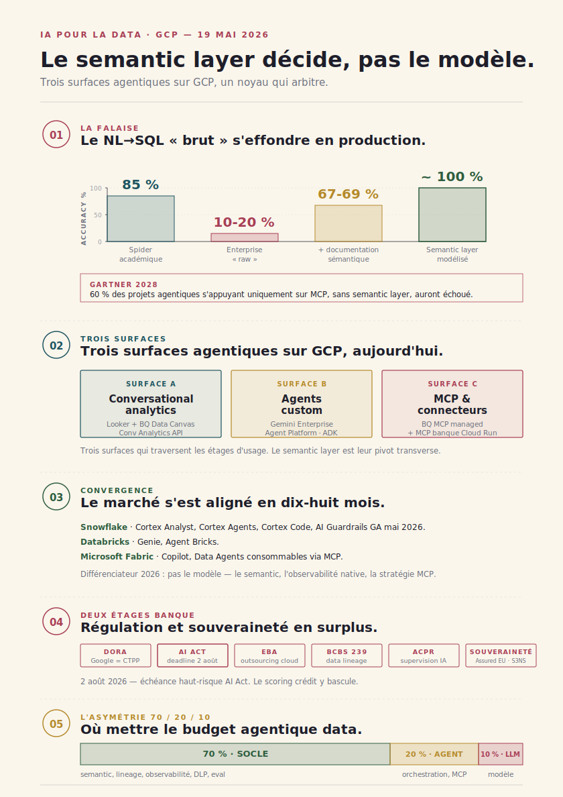

# IA pour la data sur GCP — anatomie d'une stack agentique

> **Trois surfaces agentiques sur GCP, un point d'arbitrage : le semantic layer décide, pas le modèle.** — 2026-05-19, Mathieu Guglielmino

## Pourquoi ce dossier maintenant

Entre 2024 et 2026, la chaîne data Google Cloud a été instrumentée de bout en bout pour l'agentique — sans annonce unique, par accumulation. Gemini in BigQuery est passé en GA[^1], Looker Conversational Analytics aussi[^2], Vertex AI Agent Builder est devenu Gemini Enterprise Agent Platform à Cloud Next 2026[^3], le BigQuery MCP server est sorti en version *fully managed remote*[^4], et BigQuery Agent Analytics expose désormais les traces ADK directement comme tables BQ[^5]. Sur dix-huit mois, ce qui se discutait en conférence est devenu commodité de plateforme.

Ce dossier ne fait pas l'inventaire des annonces produit. Il propose une lecture en ==trois surfaces agentiques== — *conversational analytics*, *agents custom*, *MCP & connecteurs* — qui structurent les choix d'architecture, et il les confronte à un contexte précis : une banque française tier 1 déjà sur GCP, qui doit composer avec DORA (Google Cloud désigné CTPP[^6]), l'AI Act dont l'échéance haut-risque tombe le 2 août 2026[^7] (à 75 jours d'aujourd'hui), les guidelines EBA sur l'outsourcing cloud[^8], BCBS 239 sur le data lineage[^9], et la position de l'ACPR en cours d'élaboration[^10].

==La thèse centrale est simple : les choix structurants ne sont plus « quel modèle » mais « quel semantic layer, quelle stratégie MCP, quel niveau de gouvernance ».== Les sections §4, §7 et §10 développent ces trois pivots. Les sections §5 et §6 décrivent les deux surfaces où la banque devra investir d'abord. La §11 propose une feuille de route 18 mois.

Comment lire. La §1 pose la falaise du NL→SQL et la thèse. La §2 rappelle la chaîne data GCP « avant agents » — un lecteur averti peut sauter. La §3 dessine le cadre signature : pyramide à quatre étages d'usage croisée avec les cinq couches de chaîne. Les §4 à §7 sont la *chair* : semantic layer, conversational analytics, agents custom, MCP. La §8 traite l'observabilité et l'évaluation. La §9 ferme la boucle sur la restitution narrative. La §10 est la section régu — pivot pour un RDV banque. La §11 compare le marché (Snowflake, Databricks, Fabric). La §12 est la feuille de route. Le lecteur pressé peut sauter de l'intro à la §3, puis aux §4, §10 et §12.

## Synthèse exécutive

- ==Le NL→SQL « brut » s'effondre en production==. 85 %+ d'accuracy sur Spider académique, 10-20 % sur des schémas enterprise réels[^11]. L'écart se rattrape via le semantic layer : +17 à +23 points avec contexte sémantique[^12], proche de 100 % sur des queries couvertes par un modèle bien posé[^13]. Gartner projette qu'à 2028, ==60 % des projets agentiques s'appuyant uniquement sur MCP sans semantic layer auront échoué==[^14].

- ==Trois surfaces agentiques sur GCP== sont aujourd'hui en GA ou en preview avancée. Conversational analytics (Looker Conv Analytics[^2], BigQuery Data Canvas[^15], Conversational Analytics API[^16]) — accessible étages métier. Agents custom (Gemini Enterprise Agent Platform[^3], ADK code-first avec 7 millions de téléchargements[^17]) — pour cas d'usage métier sur-mesure. MCP & connecteurs (BigQuery MCP server *fully managed*[^4], MCP Toolbox for Databases avec contrôle column-level[^18]) — pour exposer le SI banque proprement à un agent.

- ==Le marché s'est aligné en dix-huit mois==. Snowflake (Cortex Analyst, Cortex Agents, Cortex Code, AI Guardrails GA mai 2026[^19]), Databricks (Genie, Agent Bricks[^20]), Microsoft Fabric (Copilot, Data Agents consommables via MCP[^21]) ont tous convergé. Le différenciateur n'est plus le modèle mais le semantic, l'observabilité native et la stratégie MCP.

- ==La banque a deux étages de contrainte supplémentaires==. DORA[^6] (en vigueur depuis janvier 2025, Google Cloud désigné CTPP — la résilience du cloud devient un sujet du conseil d'administration), AI Act[^7] (haut-risque scoring crédit, deadline 2 août 2026 pour les obligations Annexe III), EBA Outsourcing[^8], BCBS 239 (2 G-SIBs sur 31 fully compliant selon PwC[^9]), ACPR (Tech Sprint IA générative, supervision AI Act en cours de cadrage[^10]). Et la souveraineté (Assured Workloads EU[^22], S3NS Premi3NS SecNumCloud 3.2 pour les OIV[^23]) qui devient la condition de mise en prod sur certains workloads.

- ==Asymétrie d'investissement recommandée : 70/20/10==. Sur un budget agentique data en banque, ~70 % doivent aller au socle (semantic layer, lineage Dataplex, observabilité, DLP, eval offline), ~20 % à la couche agent (orchestration, MCP servers internes), ~10 % au LLM. C'est exactement l'inverse de la répartition intuitive — et c'est ce qui distingue les projets qui passent en prod de ceux qui meurent au PoC.

*Schéma 0 (exec sum) — Une infographie A4 portrait qui condense les cinq messages-clés du dossier : effondrement du NL→SQL brut, trois surfaces agentiques sur GCP, alignement du marché, deux étages de contrainte bancaire, asymétrie 70/20/10. Pensée pour être imprimée et glissée dans un dossier de RDV banque.*

## §1. La rupture analytique en 2026

### Le NL→SQL « brut » est une fausse promesse

Le scénario qu'on imagine vend tout seul : un dirigeant ouvre un chat, tape *« quel a été le PNB de la banque privée au T1 par région avec variation YoY ? »*, et reçoit la réponse sourcée, avec un graphique. Le scénario marche en démo. Il ne marche pas en prod.

Les benchmarks académiques de text-to-SQL — Spider, BIRD, BIRD-INTERACT — atteignent 85 % d'accuracy ou plus avec les modèles frontière[^24]. Mais ces benchmarks sont *sales* — au sens où ils ont été nettoyés. Une analyse récente du benchmark BIRD a relevé 52,8 % d'erreurs d'annotation dans certains subsets ; après correction, les performances bougent de -3 à +31 points selon le système[^25]. Et surtout, les schémas y sont propres : peu de tables, noms de colonnes explicites, pas de table de référence intermédiaire, pas d'historisation slowly-changing.

En entreprise, les chiffres s'effondrent. Plusieurs études de praticiens placent l'accuracy NL→SQL sur des bases internes réelles entre 10 % et 20 %[^11]. La raison n'est pas un défaut du modèle ; c'est ==que le modèle, face à un schéma qu'il ne comprend pas, hallucine des jointures==. Il devine la relation entre deux tables, choisit la colonne dont le nom ressemble le plus à ce qu'on a demandé, et produit un SQL syntaxiquement correct mais sémantiquement faux. Le résultat passe le compilateur, parfois même le visuel — mais il ne dit pas ce qu'on croit qu'il dit.

*Schéma 1 — Quatre paliers d'accuracy du NL→SQL. Spider académique ~85 %, schéma enterprise « raw » 10-20 %, schéma + documentation sémantique +17-23 points, semantic layer bien modélisé proche de 100 % sur les queries couvertes.*

L'écart se rattrape — mais pas par un meilleur modèle. Il se rattrape par un meilleur *contexte*. Ajouter de la documentation sémantique aux tables (descriptions de colonnes, relations explicites, métriques nommées) gagne 17 à 23 points selon les benchmarks récents[^12]. Et passer à un semantic layer formel — où les métriques sont définies une fois, et où l'agent n'écrit pas le SQL mais appelle `get_metric(pnb, dimension=region, period=q1_2026)` — fait tomber l'accuracy à des niveaux proches de 100 % sur les queries couvertes[^13]. La §4 développe cette mécanique.

### Pourquoi la chaîne data n'est pas la chaîne code

La rupture agentique sur la chaîne code (qu'on a documentée dans le dossier `coding-agents/`[^26]) a un atout : ==le test unitaire==. Un coding agent peut écrire du code, le compiler, le tester, observer la sortie, recommencer. La boucle est fermée par un signal objectif. La chaîne data n'a pas cet équivalent évident. Un SQL qui retourne 1 234 567 lignes peut être faux. Une jointure qui multiplie les lignes par doublon non géré peut passer inaperçue. Une métrique recalculée à la volée par l'agent peut diverger d'un quart de point sans qu'aucun test ne le rattrape.

C'est pour ça que la chaîne data exige des garde-fous qui n'existent pas par défaut sur la chaîne code : le semantic layer (qui contraint la définition de la métrique), le lineage (qui trace l'origine d'une donnée), l'observabilité agentique (qui détecte la dérive des coûts BigQuery ou la régression d'accuracy), et l'évaluation offline (qui exécute périodiquement un référentiel de questions métier annotées). Sans ces quatre pièces, déployer un agent data en banque est un pari sur l'absence d'audit.

## §2. Anatomie de la chaîne data GCP « avant agents »

Avant de décrire les surfaces agentiques, on fixe le vocabulaire. La chaîne data sur GCP s'articule autour de cinq couches.

*Schéma 2 — Les cinq couches de la chaîne data GCP. Ingestion (Pub/Sub, Datastream, Storage Transfer, BigLake). Warehouse (BigQuery, AlloyDB pour l'opérationnel). Transformation (Dataform pour le SQL géré, Dataflow pour le streaming, Cloud Composer pour l'orchestration). Sémantique et serving (Looker semantic model, Looker Studio Pro, Connected Sheets). Restitution (dashboards Looker, embedded, applications). Le lineage traverse verticalement via Dataplex.*

**Ingestion**. Pub/Sub pour le streaming événementiel (paiements, trades, événements client), Datastream pour la réplication CDC depuis les bases opérationnelles (Oracle, MySQL, Postgres), Storage Transfer pour les batchs depuis l'extérieur, BigLake pour interroger les données restées sur Cloud Storage ou des lacs externes sans les déplacer.

**Warehouse**. BigQuery comme entrepôt central — stockage colonnaire séparé du compute, scalabilité fonctionnelle sans gestion de capacité. AlloyDB pour les workloads OLTP qui doivent rester transactionnels (référentiel client, KYC en lecture).

**Transformation**. Dataform pour les transformations SQL versionnées (héritier de l'approche dbt, intégré à BigQuery, désormais doté de Gemini Code Assist[^27]). Dataflow pour les pipelines de streaming et batch programmatiques. Cloud Composer (Airflow managé) pour l'orchestration multi-source.

**Sémantique et serving**. Le Looker semantic model (LookML) définit centralement les métriques, dimensions et relations. Looker Studio Pro et Connected Sheets exposent ces définitions à la BI self-service et au tableur. C'est cette couche qui devient stratégique en 2026 — la §4 y revient.

**Restitution**. Dashboards Looker, embedded analytics, applications data construites au-dessus de l'API Looker, et désormais expériences conversationnelles via Conversational Analytics API[^16]. Et, en parallèle, les fichiers Excel et Sheets qui restent le format de sortie n°1 dans la banque.

Le lineage traverse verticalement. Dataplex catalogue les sources, capture les transformations, expose le graphe d'origine — pièce clef pour BCBS 239 (§10).

Cette chaîne tournait déjà avant l'agentique. ==Ce qui change en 2026, c'est qu'à chaque couche s'ajoute une surface agentique==.

## §3. Trois surfaces agentiques — pyramide × chaîne

Le dossier `coding-agents/` proposait une pyramide à quatre étages d'usage : transverse, data quotidien, data expert, produit-décideurs[^26]. Cette pyramide se réinstancie sur la chaîne data. À chaque étage, des outils GCP différents. Mais ce qui structure les choix d'architecture ne s'aligne pas sur les étages — ça s'aligne sur ==trois surfaces transverses== qui traversent les étages : conversational analytics, agents custom, MCP.

*Schéma 3 (signature) — Pyramide d'usage à gauche (transverse, data quotidien, data expert, produit-décideurs), cinq colonnes de chaîne data à droite (ingestion, warehouse, transform, sémantique, restitution). Cellules remplies des outils GCP qui agissent. Code couleur pour identifier les trois surfaces transverses : conversational analytics (étages 1-2), agents custom (étages 3-4), MCP (étages 3-4, en façade).*

**Étage 1 — Transverse**. Les utilisateurs métier qui ne savent pas écrire SQL et n'ont pas envie d'apprendre. Pour eux : Gemini in Sheets (questions naturelles sur un onglet), Connected Sheets (interrogation BigQuery via tableur sans une ligne de code), Looker Conversational Analytics dans une fenêtre de chat embedded[^2]. Pas d'autonomie sur la donnée — ils consomment ce que le semantic layer expose.

**Étage 2 — Data quotidien**. Analystes métier, contrôleurs de gestion, chargés de reporting. Ils manipulent la donnée régulièrement mais ne sont pas développeurs. Pour eux : BigQuery Data Canvas[^15] avec son DAG visuel et son chat AI assistive, Looker (dashboards + Dashboard Agents), NotebookLM Enterprise pour la synthèse documentaire. Ils écrivent du SQL parfois, mais l'écart entre « écrire à la main » et « relire et corriger ce que Gemini propose » devient le mode dominant.

**Étage 3 — Data expert**. Ingénieurs data, data scientists, data engineers. Ils écrivent du code, gèrent les pipelines, déploient les modèles. Pour eux : Gemini Code Assist dans la console BigQuery et dans Dataform[^27], BigQuery DataFrames pour le Python sur BQ, Data Engineering Agent[^28] pour générer des pipelines, Colab Enterprise pour les notebooks, et au-dessus de tout cela les coding agents (Claude Code, Codex CLI, GitHub Copilot) sur le repo data — couplés aux MCP servers BigQuery, Looker, Dataform. C'est l'étage qui change le plus vite.

**Étage 4 — Produit / décideurs**. Cas d'usage exposés directement aux clients, aux partenaires ou aux décideurs. Pour eux : agents custom Vertex Agent Builder / Gemini Enterprise Agent Platform[^3], ADK code-first[^17], expériences narratives génératives, applications data conversationnelles embedded via Conversational Analytics API. C'est l'étage le plus exigeant en gouvernance — c'est celui où la latence, la conformité, la traçabilité ne sont plus négociables.

Les trois surfaces transverses se distribuent ainsi : **conversational analytics** est dominante aux étages 1-2 (Looker + BQ Data Canvas + Conv Analytics API), **agents custom** dominent aux étages 3-4 (Vertex/ADK), **MCP** est le tissu connectif qui circule entre les étages 3 et 4. La §5 développe la première surface, la §6 la deuxième, la §7 la troisième.

> **Pyramide d'usage data — déjà couverte.**
> La typologie à quatre étages (transverse / data quotidien / data expert / produit-décideurs) vient du dossier `coding-agents/` — anatomie d'un coding agent, pyramide d'usage, gains et coûts chiffrés. À lire en complément si la couche outillage n'est pas familière. Cette section reprend la pyramide telle quelle et la croise avec la chaîne data.

## §4. Le pivot sémantique

C'est la section la plus technique du dossier et le pivot où le RDV banque se joue.

### La mécanique de l'hallucination de jointure

Considérons un schéma banque simple : trois tables — `client` (id, segment, region_id), `compte` (id, client_id, type, devise) et `operation` (id, compte_id, montant_eur, date). Un dirigeant demande : *« total des opérations au T1 2026 par segment client en Europe »*.

Un agent sans semantic layer va :
- chercher les colonnes qui ressemblent à `segment` → trouvée dans `client.segment`
- chercher la jointure `client` → `operation` → il infère via `client.id = compte.client_id` puis `compte.id = operation.compte_id` (correct, ici)
- chercher la dimension `Europe` → trouve `client.region_id`, suppose qu'il existe une table `region` dont il devine le nom (`regions` ? `dim_region` ? `referentiel_region` ?) — il choisit le plus probable et hallucine au besoin
- chercher la métrique `total` → `SUM(operation.montant_eur)` (correct)
- filtre date sur Q1 2026 (correct)

Si la table de référence régions s'appelle effectivement `referentiel_region`, la query passe. Sinon, elle échoue silencieusement ou retourne 0. ==Mais surtout, si `montant_eur` représente en réalité le montant en devise convertie *à la date de l'opération* alors que le métier attend une conversion *à la date de cloôture*, la query passe mais le résultat est faux d'environ 1 à 3 % — invisiblement.==

C'est le problème structurel. Un schéma de base de données dit *où* les données sont. Il ne dit pas *ce qu'elles signifient*.

### Headless vs warehouse-native

Le semantic layer est la pièce qui dit ce que les données signifient. Il existe en deux architectures.

**Warehouse-native**. Le semantic layer vit dans la plateforme de données. Sur GCP : ==le Looker semantic model (LookML)== — métriques, dimensions, jointures, hiérarchies définies en YAML et versionnées en git. Sur Snowflake : Cortex Analyst lit un fichier de modèle sémantique YAML[^29]. Sur Microsoft : le semantic model Power BI / Fabric. Sur Databricks : Unity Catalog métriques.

**Headless**. Le semantic layer est un composant indépendant — ==dbt Semantic Layer (MetricFlow) ou Cube==[^30]. Il vit entre l'application et l'entrepôt, et peut servir plusieurs warehouses. Cube ship également un MCP server natif : les agents appellent des métriques nommées comme des tools, sans écrire de SQL[^31]. dbt fournit la même intégration via le dbt Cloud MCP server.

*Schéma 4 — Comparaison en miroir. Colonne gauche : agent → SQL généré → BigQuery, sans contrat. Colonne droite : agent → semantic layer (métriques nommées, jointures gouvernées, contraintes) → SQL compilé → BigQuery. Annotation des chiffres : accuracy ~10-20 % à gauche, ~100 % à droite sur queries couvertes. Vecteur d'erreur principal : hallucination de jointure / mauvaise convention métrique.*

### Le choix pour une banque française tier 1 GCP-first

Le bon défaut, pour une banque déjà sur GCP all-in, est ==le Looker semantic model==. Trois raisons. D'abord, il existe déjà : la plupart des banques sur GCP ont du Looker en production, donc un modèle sémantique partiel déjà versionné. Deuxièmement, l'intégration Conversational Analytics → Looker semantic est native et mesurée : Google publie que pairer Conv Analytics API avec Looker réduit les erreurs de gen AI sur les requêtes naturelles ==de deux tiers==[^16]. Troisièmement, le périmètre métier le plus exigeant — reporting réglementaire, scoring crédit, ALM — bénéficie d'un modèle gouverné centralement, ce qui simplifie le contrôle ACPR.

Le scénario qui justifie *Cube* ou *dbt MetricFlow* : multi-warehouse (parties de l'estate sur Snowflake ou Databricks suite à une acquisition), volonté d'isoler le semantic du fournisseur cloud, ou stack data déjà majoritairement dbt — auquel cas dbt Semantic Layer + son MCP server est cohérent.

Le scénario à éviter : laisser chaque équipe définir ses métriques dans son notebook, son dashboard ou son agent. C'est exactement ce contre quoi le semantic layer est conçu, et c'est ce qui produit ==les divergences de 0,5 à 3 % entre rapports==. Pour BCBS 239 (§10), c'est non-conforme par construction.

### La projection Gartner

Gartner publie, fin 2025, une projection citée plusieurs fois dans la presse spécialisée : ==à 2028, 60 % des projets agentiques s'appuyant uniquement sur MCP, sans semantic layer, auront échoué==[^14]. La même note projette que les organisations qui priorisent la sémantique dans leur data « AI-ready » verront leur accuracy GenAI augmenter de 80 % et leurs coûts baisser de 60 %. On peut discuter les pourcentages ; la direction du gradient n'est pas contestée. Le semantic layer est devenu une condition de mise en prod, plus une option d'architecture.

## §5. Conversational analytics sur GCP

Première surface agentique, et la plus avancée commercialement sur GCP en mai 2026.

### BigQuery Data Canvas

Data Canvas est l'interface visuelle de BigQuery centrée sur le workflow analytique[^15]. Quatre éléments structurants :

- ==Un DAG d'exploration==. Les requêtes successives s'enchaînent dans un graphe orienté, qu'on peut brancher et fusionner. C'est l'équivalent visuel d'un notebook où chaque cellule serait dépendante des précédentes, mais avec la possibilité d'explorer plusieurs branches en parallèle.

- **Le NL guidé**. À chaque nœud du DAG, on peut interroger en langage naturel. Gemini propose alors le SQL, l'utilisateur valide ou amende. Pas de prétention au « zéro SQL » — la plupart des analystes lisent et corrigent.

- **Le chat AI-assistive**. Depuis Cloud Next 25, le canvas a un mode chat qui couvre l'ensemble du workflow — découverte, transformation, viz. Pour les problèmes complexes (forecasting, anomaly detection), le chat peut produire du Python exécuté dans une sandbox managée plutôt que du SQL — c'est l'intégration de BigQuery DataFrames avec le canvas[^15].

- **La découverte assistée**. Gemini suggère, à partir des tables sélectionnées ou des tables fréquemment utilisées, des questions naturelles pertinentes et leur SQL correspondant. Pattern d'onboarding très efficace pour les analystes qui découvrent un nouveau domaine.

Cas d'usage banque typique pour Data Canvas : ==reporting interne semi-structuré==. Suivi opérationnel d'un département, analyse ad-hoc d'incident, exploration de cohorte client. Pas pour des chiffres réglementaires officiels — ceux-là passent par des pipelines Dataform versionnés et un semantic layer.

### Looker Conversational Analytics

Conv Analytics Looker[^2] est en GA depuis fin 2025 et a reçu des mises à jour majeures à Cloud Next 2026[^32]. Trois capacités structurantes :

- ==Grounding sur le semantic model Looker==. Toutes les requêtes naturelles sont résolues via LookML — l'agent n'écrit pas de SQL brut, il compose des Explores. Conséquence directe : les métriques sont les définitions officielles, les jointures sont celles que les modélisateurs ont validées, la gouvernance Looker (permissions par modèle, par dashboard, par utilisateur) s'applique transparente.

- ==Dashboard Agents==. Annoncés à Next 2026 : la possibilité de poser des questions de suivi *à l'intérieur d'un dashboard existant*, sans changer d'interface. Le dashboard fixe et la conversation cohabitent.

- ==Embedded Conversational Experiences==. Le chat Looker est exposable via iframe ou via Conversational Analytics API[^16], permettant d'embarquer la fonctionnalité dans une application métier (portail conseiller, espace client B2B, intranet) sans rebuilder une UI.

S'ajoutent les Agentic Workflows : des agents en arrière-plan qui monitorent des métriques critiques, détectent des irrégularités, identifient des corrélations cachées — et notifient. C'est de l'observabilité métier, pas une réponse à une question, mais ça partage la même surface conversationnelle.

### Conversational Analytics API

L'API Conversational Analytics[^16] est l'objet le plus stratégique pour une banque qui veut intégrer le NL dans son SI sans dépendre d'une UI Looker. Elle permet :

- D'interroger BigQuery ou Looker via API HTTP
- D'embarquer le chat dans une application web via iframe (private embedding avec login Looker, ou signed embedding avec auth applicative)
- De construire des workflows conversationnels multi-tour avec vérification et explication du SQL généré

Pour une banque, c'est ce qui permet de mettre un agent NL dans l'espace client professionnel pour analyser des relevés, dans l'interface conseiller pour synthétiser une situation client, ou dans le portail interne CFO pour itérer sur le reporting financier.

*Schéma 5 — Topologie d'un appel Conversational Analytics. Utilisateur (Sheets / Looker UI / app embedded) → Conv Analytics API → Gemini (compréhension intent) → Looker semantic / BQ schema → SQL exécuté → résultat (chart + table + SQL explained). Annotations : où le semantic layer intervient, où la gouvernance Looker s'applique, où le SQL généré est exposé pour audit.*

### Le pattern hybride dashboard + chat

Une erreur de cadrage à éviter : opposer dashboard fixe et conversational analytics. ==Le pattern qui marche en banque est l'hybride==. Les dashboards Looker restent l'objet de référence pour ce qui doit être audité, signé, distribué (reporting hebdo, comité crédit, ALM). Le chat conversational vient ouvrir, depuis ce dashboard, la possibilité de creuser une cellule, demander une variante, isoler une sous-population. Le dashboard apporte l'objet de référence ; la conversation apporte la profondeur. Les Dashboard Agents Next 2026 sont la matérialisation produit de ce pattern.

> **Surfaces agentiques utilisateur — déjà couvert.**
> Le dossier `surfaces-agentiques/` traite en profondeur les quatre régimes d'accès (chat, copilote inline, canvas génératif, on-behalf-of), la generative UI, le protocole AG-UI, et les niveaux d'autonomie. À lire en complément quand la question devient « quelle prise utilisateur sur l'agent », au-delà du seul cas conversational analytics.

## §6. Agents custom — Vertex Agent Builder, ADK, A2A

Deuxième surface agentique, celle où les cas d'usage métier sur-mesure prennent forme.

### Gemini Enterprise Agent Platform

À Cloud Next 2026, Google a rebrandé Vertex AI Agent Builder en ==Gemini Enterprise Agent Platform==[^3]. Sur le fond, c'est une consolidation. Sur la forme, c'est l'annonce que Google considère désormais l'agentique comme un produit de plateforme, pas comme une extension Vertex. Cinq briques :

- **Agent Studio** — interface low-code pour assembler un agent depuis une description, un set de tools, et un flow de workflow. Pour cadrages métier rapides, PoC, agents internes simples.

- **ADK** (Agent Development Kit)[^17] — framework code-first. Disponible en Python, Go, Java, TypeScript. ==Plus de 7 millions de téléchargements== à fin avril 2026 — un signal d'adoption non négligeable. Orchestration flexible : workflow agents prédictibles (séquences déterministes), ou routing dynamique (l'agent décide quelle étape suivre). Multi-agent natif (subagents spécialisés). Open source.

- **Agent Engine** — runtime managé pour déployer un agent ADK en prod. Persistent memory, session state, observabilité, scale élastique.

- **Agent Garden** — catalogue d'agents pré-construits et de templates pour cas d'usage typiques (customer support, knowledge agent, data analyst agent…).

- **200+ modèles** dont Gemini, Claude (via partenariat Anthropic), Llama, Mistral, et modèles open source. Choix par cas d'usage, pas par défaut imposé.

S'ajoute une couche de gouvernance qui a reçu de l'amplification récente : ==Tool Governance==[^33]. Cette feature permet de contrôler finement quels tools un agent peut invoquer, sous quelles conditions, avec quelles permissions. Pour la banque, c'est la pièce qui permet d'exposer un MCP server à un agent sans lui donner l'intégralité de la surface.

*Schéma 6 — Anatomie verticale d'un data agent custom sur GCP. Couches du bas vers le haut : warehouse (BigQuery) → semantic layer (Looker semantic model) → MCP servers (BQ MCP managed, Looker MCP, MCP banque internes) → orchestration ADK → runtime Agent Engine → modèle (Gemini / Claude / autre). Sidebars : observabilité (BigQuery Agent Analytics) à droite, gouvernance (Tool Governance, Model Armor, DLP) à gauche.*

### Cas d'usage banque sur-mesure

Quatre familles de cas d'usage banque pour lesquels un agent custom est la bonne réponse — par opposition à un simple chat conversational :

- **Réconciliation comptable**. Un agent qui croise les positions front, middle et back, identifie les écarts, propose des explications. Multi-tools, multi-bases, multi-tours.

- **Monitoring qualité données**. Un agent qui scrute les KPIs de fraîcheur, complétude, conformité référentielle sur les tables critiques. Alerte proactive, génère un ticket si écart inhabituel. Lien direct avec BCBS 239 (§10).

- **Reporting réglementaire pré-rempli**. Un agent qui assemble les éléments d'un reporting type COREP / FINREP / SURFI à partir des tables sources, propose un draft, identifie les zones d'incertitude. L'humain valide.

- **Surveillance d'opérations atypiques** (lien AML / fraude). Un agent qui ouvre une enquête en partant d'une alerte du système de détection, croise transactions, profil client, contexte. ==Cas d'usage haut-risque AI Act selon le critère* — voir §10.

### A2A et l'interop cross-vendor

À noter pour les choix stratégiques : Google a publié en 2025 le protocole ==A2A== (Agent-to-Agent), qui standardise la communication entre agents au-delà de la communication agent↔tool de MCP. Trajectoire 2026-2027 floue : soit adoption cross-vendor, soit absorption par MCP via sampling et subagents (déjà discutée dans la révision majeure de la spec MCP attendue automne 2026). Pour une banque, ce n'est pas un sujet à arbitrer en 2026 — c'est un sujet de veille. Pour 2027, ce sera celui qui décide si on peut composer des agents Google avec des agents Anthropic, Microsoft, OpenAI sans contournement.

> **Coding agents pour data engineers — déjà couvert.**
> Le dossier `coding-agents/` traite en détail l'anatomie d'un coding agent (Claude Code / Codex CLI / GitHub Copilot), avec leur application aux transformations Dataform et dbt, les tests, le lineage, la revue de PR. La pyramide d'usage à quatre étages y est définie. À lire pour la couche étage 3 — manipulation du repo data par un agent — qu'on ne re-développe pas ici.

## §7. MCP & connecteurs maison

Troisième surface agentique, et la plus jeune en maturité commerciale — mais la plus structurante pour une banque, parce que c'est la surface qui décide *quoi* l'agent peut atteindre.

### BigQuery MCP server, fully managed

Google a sorti en 2026 un ==BigQuery MCP server fully managed remote==[^4]. Activé en activant l'API BigQuery, accessible via HTTP, il expose à un client MCP (Gemini CLI, Claude Code, ChatGPT, Cursor, ou une application custom) trois familles d'actions :

- **Run queries** — exécuter du SQL contre BigQuery avec les permissions IAM de l'identité appelante
- **Get metadata** — lister datasets, tables, schémas, descriptions
- **List resources** — naviguer dans l'arborescence des datasets

Pas d'infrastructure à gérer, pas de container à déployer, pas de credentials à manipuler côté agent. L'auth se fait via la chaîne IAM Google Cloud classique. Pour des cas d'usage data analyste isolés, c'est le défaut le plus simple.

### MCP Toolbox for Databases

À côté du MCP server BQ managed, Google maintient en open source le ==MCP Toolbox for Databases==[^18] — un serveur qui centralise l'hosting et la gestion de toolsets, et qui découple l'application agentique de l'interaction directe avec la base. La feature critique pour la banque : ==contrôle column-level==. L'administrateur définit précisément quelles colonnes un agent peut voir, ce qui maintient les données sensibles protégées tout en laissant l'agent faire son travail sur les champs non sensibles.

C'est l'objet qui rend possible le déploiement d'un agent NL sur une base contenant des PII sans devoir cloner et masker la table : on configure le toolbox pour exclure les colonnes sensibles de la surface visible. Combiné à DLP / Sensitive Data Protection (§10), ça donne une défense en profondeur.

### MCP banque interne sur Cloud Run

L'écosystème MCP n'est pas que côté Google. Le pattern qui se généralise en 2026 — ==MCP banque interne déployé sur Cloud Run== — consiste à exposer des systèmes de référence métier (KYC, AML, référentiel produits, lineage Dataplex, positions front) via des MCP servers custom hébergés sur Cloud Run. Avantages :

- **Isolation**. Chaque MCP server est un service Cloud Run distinct, qu'on déploie, scale et révoque indépendamment
- **Auth OAuth 2.0 + PKCE**. Le pattern recommandé[^34] — l'agent obtient un token avec un scope précis pour chaque MCP server, sans manipuler de credentials longue durée
- **Audit log OTel**. Chaque appel MCP est tracé avec son client, son tool, ses arguments, sa réponse. Compatible avec OTel GenAI semconv (voir §8 et le dossier `observabilite-agents-ia/`)
- **Sandbox**. Le MCP server peut imposer des limites (whitelist de tables, throughput max, exécution dans un projet GCP isolé) avant d'atteindre le backend

*Schéma 7 — Topologie d'une stack MCP banque interne. Agent (Claude Code, Vertex Agent, app banque) → MCP host (orchestrateur côté agent) → MCP servers déployés sur Cloud Run (BQ managed, Looker, Dataform, KYC, AML, référentiel produits, lineage Dataplex) → backends (BQ, Looker, AlloyDB, services métier). Annotations sur le flux d'auth (OAuth + PKCE), les scopes par tool, l'audit log OTel, l'isolation par service Cloud Run.*

### Les quatre MCP servers que la banque doit construire

Pour une banque française tier 1, les quatre MCP servers internes prioritaires sont :

- **MCP « semantic »** — façade sur le Looker semantic model, exposant les métriques nommées en tant que tools. C'est le pattern Cube/dbt repensé pour Looker. L'agent appelle `get_metric(pnb, dimension=region, period=q1_2026)` au lieu de générer du SQL. Élimine 80 % des hallucinations sur les chiffres réglementaires.

- **MCP « lineage »** — façade sur Dataplex (et l'outil interne de lineage si existant). Expose les sources, transformations, dépendances d'une métrique. Pièce critique pour BCBS 239 — l'agent peut tracer une donnée bout-en-bout, et générer le diagramme de lineage demandé en audit ACPR.

- **MCP « référentiel »** — façade sur les données de référence (catalogue produits, segments client, hiérarchie organisationnelle, calendrier financier). Évite que l'agent ne devine les valeurs autorisées.

- **MCP « conformité »** — façade sur les règles de gestion (zones autorisées par utilisateur, données accessibles par profil, contraintes RGPD/AI Act sur certains champs). Centralise les règles « ce qu'un agent ne doit pas faire » au lieu de les répartir dans chaque agent.

> **Surface d'attaque MCP — déjà couverte.**
> Le dossier `mcp-plateforme/` détaille l'effet de réseau qui a installé MCP comme standard de fait, les six familles d'attaques (tool poisoning, indirect prompt injection cross-server, supply chain…), et la matrice défensive. À lire en complément avant tout déploiement MCP banque — la surface d'attaque doit être lue en regard du choix d'architecture proposé ici.

## §8. Observabilité & évaluation data-agentique

Trois pièces déterminent si un agent data passe en prod ou meurt en pilote : l'observabilité (qu'est-ce qu'il fait), l'évaluation (le fait-il bien), les garde-fous (qu'est-ce qu'il n'a pas le droit de faire).

### BigQuery Agent Analytics

L'objet le plus nouveau et le plus structurant pour la stack GCP en 2026 : ==BigQuery Agent Analytics==, un plugin ADK qui exporte les traces d'agent directement dans BigQuery[^5]. Chaque interaction agent — prompt, choix de tool, paramètres, résultat, latency, tokens — atterrit dans une table BQ qu'on peut requêter, joindre, agréger.

Conséquences directes :

- **Cost attribution native**. Chaque job BQ déclenché par l'agent est labellé. On retrouve via `INFORMATION_SCHEMA.JOBS_BY_PROJECT` la dépense exacte par agent, par cas d'usage, par utilisateur.

- **Évaluation et drift**. Le SDK[^5] expose des connecteurs pour piper les traces vers des outils d'eval — ground-truth matching, LLM judge, comparaison de runs.

- **Real-time via Storage Write API**. Pas de blocage : les traces streamquent sans bloquer l'exécution de l'agent.

### Les métriques data-spécifiques

Au-delà des métriques agentiques standard (latency, token consumption, tool calls, taux d'échec), un agent data demande des métriques propres :

- **Query failure rate**. % de SQL générés qui ne s'exécutent pas (erreur de syntaxe, table manquante, permission refusée). Indicateur direct de la qualité du semantic layer.

- **BQ cost drift**. Évolution du scan size moyen par requête. Un agent qui ne sait pas filtrer correctement génère du `SELECT *` sur des partitions non filtrées — la facture explose silencieusement.

- **Plausibilité d'insight**. Un LLM judge évalue, sur un échantillon, si les insights produits sont métier-plausibles (un PNB négatif, une croissance YoY de +850 %, un nombre de clients > population française → signaux d'alerte).

- **Repro rate**. Même question posée à dix moments différents → est-ce que l'agent produit le même SQL ? Si non, on a un problème de stabilité.

- **Hallucination de jointure**. Détection passive — par exemple en comparant les jointures effectivement écrites par l'agent avec les jointures déclarées valides dans le semantic model.

### L'évaluation offline

L'évaluation offline est ==la pratique qui distingue les agents prod-grade des PoC==. Pattern :

1. Constitution d'un référentiel de 100 à 200 questions métier annotées par les analystes seniors banque, avec la requête attendue et le résultat attendu.
2. Exécution périodique (à chaque release agent, à chaque évolution du semantic model, à chaque changement de modèle).
3. Trois mesures : accuracy SQL (correspondance avec le SQL annoté ou un SQL équivalent), accuracy résultat (correspondance au chiffre attendu), plausibilité (LLM judge).
4. Gating de release : pas de mise en prod si l'accuracy passe en dessous d'un seuil défini.

### Garde-fous runtime

Trois objets côté GCP :

- ==Model Armor==[^35] — service de protection des applications IA. Détection prompt injection, intégration DLP pour bloquer SSN / numéros de carte / IBAN dans les prompts ou les réponses, responsible AI filters, détection d'URL malveillantes. Pour la banque, c'est la première ligne sur les agents exposés à des utilisateurs externes.

- **Tool Governance** dans Agent Builder[^33] — contrôle d'appel de tools, déjà mentionné §6.

- **DLP / Sensitive Data Protection** sur les flux qui transitent (§10).

> **Observabilité agentique — déjà couverte.**
> Le dossier `observabilite-agents-ia/` traite les six piliers de la télémétrie agentique, OpenTelemetry GenAI semantic conventions, le bus d'observabilité, la hiérarchie d'alertes, le vendor landscape et l'échelle de maturité. À lire pour les patterns OTel transverses qu'on ne re-développe pas ici.

> **Évaluation agentique — déjà couverte.**
> Le dossier `evaluation-agentique/` traite les graders, le LLM-as-judge, les trajectoires multi-tours, τ-bench et τ²-bench, et le playbook gruyère en huit étapes. À lire pour les patterns d'eval transverses — la section §8 se concentre sur ce qui est spécifique data.

## §9. Restitution narrative & expériences générées

La quatrième couche de la chaîne data devient la plus mutable en 2026. ==Le dashboard fixe n'est pas mort, mais il n'est plus le terminal unique de la restitution.==

Trois objets cohabitent désormais :

- **Le dashboard fixe** (LookML versionné, Looker Studio Pro). Audité, signé, reproductible, distribué. Reste l'objet de référence pour ce qui doit être stable.

- **Le dashboard conversationnel** (Looker + Conv Analytics embedded, Dashboard Agents). Un dashboard fixe avec une couche de chat qui ouvre les chiffres à la question. C'est le pattern hybride mentionné §5.

- **L'expérience narrative générative**. Un agent produit, à la demande, une page d'analyse sur-mesure pour une question — graphes, texte, citations, lineage exposé. Plus proche d'un mini-article que d'un dashboard. C'est le format qui prend pied dans les portails clients B2B, les espaces conseillers, les comités de direction (CFO, CRO).

*Schéma 8 — Trois colonnes en parallèle. Dashboard fixe (LookML, audité, distribué). Dashboard conversationnel (Conv Analytics embedded, Dashboard Agents). Expérience narrative générative (agent ADK + generative UI, page produite à la demande). Annotations : audit, latence, gouvernance, public cible.*

Le scénario type banque : un comité crédit reçoit un dashboard fixe en début de séance (chiffres signés). Un membre pose une question hors-périmètre du dashboard : ==l'expérience conversationnelle ouvre la profondeur==, en interrogeant le semantic model avec gouvernance. Si la question demande une analyse sur-mesure — par exemple « cartographie l'exposition de notre portefeuille immobilier locatif aux zones où la sécheresse est en augmentation tendancielle » — un agent custom (§6) compose une page d'analyse à la demande, qui combine données internes, données externes, et qui expose son lineage.

Trois prérequis pour que ce pattern fonctionne en banque :

- ==Le semantic layer== (§4) — sinon les chiffres divergent entre les trois formats
- **Le lineage exposable** — l'expérience générative doit pouvoir dire d'où vient chaque chiffre, en un clic
- **Le watermarking** — distinction visuelle obligatoire entre un chiffre signé (dashboard fixe) et un chiffre généré (expérience). Sinon, l'audit interne s'effondre.

> **Expériences narratives — déjà couvert.**
> Le dossier `narrative-experiences/` traite l'état de l'art du data storytelling : Bertin / Shneiderman / Munzner / Cairo, les sept genres Segel-Heer, le tournant humaniste (Lupi, Posavec, Fragapane), le scrollytelling, les pipelines techniques et l'IA générative dans la chaîne narrative. À lire en complément quand la question devient « comment fabriquer une expérience » plutôt que « quelle surface produit ».

## §10. Banque française tier 1 — section régu

La section pivot pour le RDV. Les choix d'architecture présentés dans les §4 à §9 sont contraints — et parfois rendus obligatoires — par six référentiels qui se superposent en 2026.

### DORA — la résilience opérationnelle est un sujet du conseil

Le Digital Operational Resilience Act est entré en vigueur le 17 janvier 2025[^6]. Sa logique de fond : ==les défaillances IT et cloud d'un fournisseur critique deviennent le risque opérationnel de la banque cliente==, pas du fournisseur. La banque est désormais opérationnellement responsable de la résilience de ses providers cloud, et doit le prouver à son régulateur.

Google Cloud a été désigné Critical Third-Party Service Provider (CTPP)[^6] — au même titre qu'AWS et Azure. Conséquence pratique : la supervision financière européenne (via les ESAs : EBA, ESMA, EIOPA) supervise désormais directement Google Cloud sur ses obligations de résilience, en plus de la supervision contractuelle que la banque cliente exerce.

Pour la stack data agentique :

- **Contrats**. Les contrats GCP signés avant 2025 doivent être amendés sur les articles 28 à 30 de DORA (audit rights, sub-outsourcing, exit plans, location of data). Google publie une cartographie d'alignement[^8].

- **Exit plans**. Pour chaque service GCP critique utilisé (BigQuery, Looker, Vertex Agent Engine), la banque doit documenter un plan de migration testable. Pour Looker, c'est plus exigeant que pour BQ — le semantic model LookML est portable, mais les Conv Analytics, les Dashboard Agents et le runtime managé sont propriétaires.

- **Incident reporting**. Les incidents majeurs côté GCP doivent être notifiés à l'ACPR sous délais. La banque doit avoir un canal direct et des SLA explicites.

### AI Act — l'échéance du 2 août 2026

Le règlement européen 2024/1689 sur l'IA[^7] entre dans sa phase critique. ==Les obligations sur les systèmes haut-risque s'appliquent à compter du 2 août 2026== — soit 75 jours après la date de publication de ce dossier. Pour une banque, le périmètre Annexe III est explicite : tout système d'IA utilisé pour évaluer la solvabilité d'une personne physique ou attribuer un score de crédit (à l'exception de la détection de fraude) est ==haut-risque==.

Les obligations Article 9 à 15 couvrent :

- **Article 9** — système de gestion des risques formalisé sur l'ensemble du cycle de vie
- **Article 10** — gouvernance des datasets : training, validation, test datasets doivent avoir des pratiques documentées de collecte, préparation, labellisation, qualité
- **Article 11-12** — documentation technique et journalisation
- **Article 13** — transparence vis-à-vis du déployeur
- **Article 14** — supervision humaine effective (oversight)
- **Article 15** — exactitude, robustesse, cybersécurité

Pour un agent data utilisé sur scoring crédit, ==toutes ces obligations s'appliquent à l'agent==, pas seulement au modèle de scoring sous-jacent. C'est un changement de périmètre qui surprend encore beaucoup d'équipes. À l'inverse, un agent de monitoring qualité données ou de génération de reporting interne n'est pas haut-risque — il reste soumis à RGPD, BCBS 239, EBA, mais pas à l'arsenal Article 9-15.

L'ACPR[^10] prépare la supervision : elle a co-organisé avec le Lab Banque de France un Tech Sprint IA générative qui a produit huit prototypes en trois jours avec des data scientists externes, et elle cadre actuellement les méthodes pratiques de mise en œuvre et de supervision AI Act. Son intervention publique récurrente : la supervision se fera par cas d'usage, pas par modèle.

### EBA Outsourcing, BCBS 239, RGPD

**EBA Guidelines on Outsourcing to Cloud Service Providers**[^8] couvrent l'audit, la sécurité, la localisation, le sub-outsourcing, les contingency plans et les exit strategies pour tout outsourcing cloud d'une banque. ACPR supervise leur application en France. Google publie une cartographie spécifique[^36].

**BCBS 239** — *Principles for effective risk data aggregation and risk reporting*. En vigueur depuis 2016. Exigence : ==tracer chaque métrique de risque depuis sa source jusqu'au reporting==. PwC mesurait fin 2024 que seules 2 G-SIBs sur 31 étaient *fully compliant* sur les 14 principes[^9]. Le lineage est l'angle mort historique. C'est précisément ce qu'un agent data peut adresser : automatiser la production du graphe de lineage, détecter les ruptures, générer la documentation demandée en audit. Dataplex est l'outil GCP de base ; le MCP server lineage proposé §7 est la projection agentique.

**RGPD** — toujours, partout. DLP / Sensitive Data Protection avec ses 150+ infoTypes built-in détecte et masque les données personnelles. Le droit à l'explication (Article 22 sur les décisions automatisées) s'applique au scoring crédit — il converge avec l'AI Act Article 14 sur l'oversight.

### La souveraineté

Trois niveaux d'exigence souveraineté côté GCP :

- ==Assured Workloads for EU==[^22] — environnement GCP qui force la résidence des données dans l'UE et restreint le support et l'accès au personnel UE. Activable sur projet, compatible avec la quasi-totalité des services GCP.

- **Sovereign Controls by Partners** — opéré par un partenaire local (T-Systems en Allemagne avec G-Cloud). Layer de contrôle additionnel pour les workloads très sensibles.

- ==S3NS / Premi3NS==[^23] — opérateur français (filiale Thales + Google) qui exploite Google Cloud Dedicated en France sous certification SecNumCloud 3.2 (ANSSI). C'est le niveau exigé par l'État pour les Opérateurs d'Importance Vitale (OIV), qui inclut les banques systémiques françaises. Tradeoff : périmètre fonctionnel plus restreint — toutes les capacités IA frontière (en particulier les derniers modèles Gemini, certaines features Agent Builder) ne sont pas disponibles dans la version souveraine.

Le pattern qui s'installe en banque : ==workloads par criticité==. Reporting réglementaire et données les plus sensibles sur S3NS, workloads internes hybride sur Assured Workloads EU, workloads exploratoires sur GCP standard EU. L'arbitrage se fait au cas par cas, en lien avec la politique de l'établissement.

### La défense en profondeur applicative

Sept objets côté GCP composent la défense en profondeur agentique :

- **Model Armor**[^35] — firewall AI runtime (prompt injection, DLP, RAI, malicious URL)
- **Sensitive Data Protection / DLP** — détection et masquage de 150+ infoTypes
- **VPC Service Controls** — périmètre de sécurité sur les services GCP, exfiltration prevention
- **CMEK** (Customer-Managed Encryption Keys) — clés contrôlées par la banque
- **Confidential Computing** — exécution en TEE pour les workloads les plus sensibles
- **Dataplex lineage** — graphe d'origine bout-en-bout
- **Audit logs** (Cloud Audit Logs) — journalisation des actions GCP, exportable vers BigQuery pour analyse

Pour une banque, ==aucun de ces objets n'est optionnel== sur un déploiement agentique en production. Ils ne sont pas non plus exotiques — la plupart sont déjà actifs sur les workloads BigQuery existants. Ce qui change avec l'agentique, c'est qu'ils doivent désormais couvrir aussi le runtime ADK / Agent Engine, les appels MCP, et les exfiltrations possibles par injection de prompt.

*Schéma 9 — Matrice à neuf colonnes (couches stack : ingestion, warehouse, transform, sémantique, agent runtime, MCP, restitution, observabilité, gouvernance) × six lignes (DORA, AI Act, EBA Outsourcing, BCBS 239, RGPD, ACPR/souveraineté). Cellules : objets GCP qui répondent (Assured Workloads, S3NS, DLP, Model Armor, Dataplex, audit logs, semantic model gouvernance, Tool Governance, BQ Agent Analytics…).*

> **Gouvernance agentique — déjà couverte.**
> Le dossier `gouvernance/` (scrollytelling AI Act) traite le cadre AI Act, les lignes de défense, l'infrastructure agentique, les frameworks et les métriques de gouvernance — y compris le « prix de la gouvernance » (~17 % du coût agentique en moyenne). À lire en complément quand la question devient « comment cadrer la gouvernance interne » au-delà des seules obligations réglementaires.

## §11. Comparatif marché ponctuel

Pour situer GCP, trois comparatifs ponctuels. Pas un panorama — un repère.

### Snowflake

Snowflake est le concurrent le plus direct sur le segment warehouse agentique. Stack en mai 2026 :

- **Cortex Analyst** — NL→SQL gouverné via un fichier de modèle sémantique YAML. Pattern proche du Looker semantic model en philosophie, mais Snowflake-native.
- **Cortex Search** — recherche hybride sur documents (RAG)
- **Cortex Agents**[^19] — orchestration multi-tools, MCP natif. Agents qui peuvent updater CRM, générer reports, déclencher des workflows
- **Snowflake Intelligence** — assistant business unifié au-dessus de Cortex
- **Cortex Code** (annoncé avril 2026) — coding agent natif comprenant le contexte data Snowflake
- **Cortex AI Guardrails** (GA mai 2026) — protection runtime prompt injection / jailbreak

Forces : intégration profonde data + agent, MCP natif, AI Guardrails GA. Faiblesses : portabilité limitée, semantic file YAML moins riche que LookML, écosystème agentique moins ouvert que ADK.

### Databricks

Databricks adresse le segment Lakehouse agentique[^20]. Stack en mai 2026 :

- **Genie** — chat conversational sur les données, expose la logique générée (donc plus transparent pour les advanced users, parfois moins fluide pour les non-techniques)
- **Agent Bricks** (avril 2026) — *define an agent by describing it*, auto-génération de prompts et de tests
- **AI/BI** — la surface BI conversationnelle
- **MLflow 3.0** — observabilité GenAI avec tracking prompts et outputs
- **Vector search** — RAG à l'échelle
- **Unity Catalog** — gouvernance + semantic émergent

Forces : portabilité Lakehouse (pas de lock-in vendor cloud), maturité ML/MLOps, observabilité MLflow. Faiblesses : NL→SQL moins mature que Cortex Analyst ou Looker Conv Analytics, écart entre Genie et un agent ADK code-first.

### Microsoft Fabric

Fabric est l'option Microsoft consolidée[^21] :

- **Copilot in Fabric** — assistant transversal Power BI / Data Factory / Synapse
- **Power BI Copilot** — full-screen agent (preview), report pane (GA)
- **Fabric Data Agents** — agents définis dans Fabric et ==consommables via MCP== — point d'interop important
- **Microsoft 365 Copilot** — surface utilisateur dominante en banque (Outlook, Teams, Excel)

Forces : intégration M365 (dominante en banque), MCP exposure des Data Agents, Power BI semantic model mature. Faiblesses : couplage M365 (forte exposition à la stratégie Microsoft), agent custom moins ouvert que ADK.

### Où GCP gagne, où il perd

GCP gagne sur :

- ==Le semantic Looker== — l'écart fonctionnel avec Cortex YAML et Fabric semantic est encore en faveur de Looker, en particulier sur l'agentique
- ==Le BigQuery MCP managed== — pas d'équivalent fully-managed côté Databricks ou Fabric en mai 2026
- L'ouverture ADK — code-first multi-langage, open source, 7M+ téléchargements
- La souveraineté EU — S3NS SecNumCloud 3.2 sans équivalent strict côté concurrents

GCP perd sur :

- L'intégration M365 — quand la banque vit majoritairement dans Outlook / Teams / Excel, Fabric a un avantage de surface
- La portabilité Lakehouse — Databricks reste plus neutre vendor
- La maturité ML/MLOps — Databricks a une longueur d'avance

GCP est en commodité sur :

- Le NL→SQL de base — les trois plateformes sont arrivées au même niveau sur les requêtes simples
- La défense runtime — Model Armor, Cortex AI Guardrails, Microsoft AI Content Safety sont fonctionnellement comparables

==Le choix GCP s'impose si la banque est déjà GCP-first, ou si elle priorise le semantic Looker + l'ouverture agentique ADK + la souveraineté EU.== Le choix Fabric s'impose si la stratégie M365 est verrouillée. Le choix Databricks s'impose si la portabilité multi-cloud Lakehouse est non-négociable. Snowflake reste l'option pure warehouse agentique pour les estates Snowflake-existing.

> **Mesure du ROI agentique — déjà couverte.**
> Le dossier `measure-roi/` traite les cinq frameworks ROI 2024-2026 (Cigref, McKinsey, BCG, MIT NANDA, Forrester TEI), la grille analytique propriétaire, le paradoxe agentique (Klarna a reculé après son déploiement initial), l'arbre de décision sur huit méthodes. À lire avant de cadrer le business case agentique data — les patterns de mesure ne sont pas spécifiques GCP, mais le calibrage des attentes est essentiel pour un RDV banque.

## §12. Feuille de route 18 mois — banque française tier 1 GCP-first

Quatre phases. Chaque phase a un livrable, des métriques de sortie et un seuil pour passer à la suivante. ==Le séquencement est plus important que la vitesse.== Un PoC mené sans le socle T0-T3 ne tient pas en prod.

*Schéma 10 — Feuille de route 18 mois. Quatre phases séquencées : socle (T0-T3), étages 1 et 2 (T3-T6), étage 3 data expert (T6-T12), étage 4 et souveraineté (T12-T18). La déclaration AI Act haut-risque tombe le 2 août 2026 (jalon rouge). Sept pièges en bandeau bas.*

### T0-T3 — Socle (trois mois)

**Livrables.**

- Semantic Looker model formalisé sur les domaines prioritaires (PNB, encours, risque, exposition par segment, métriques réglementaires de base). Ou bascule Cube/dbt si multi-warehouse.
- DLP / Sensitive Data Protection actif sur tous les datasets BQ contenant des PII, BUS bus, données KYC.
- VPC Service Controls actif sur les projets GCP exposés à l'agentique.
- Dataplex lineage activé sur les datasets prioritaires.
- ==Référentiel de 150 questions métier annotées== (par les analystes seniors) avec SQL attendu et résultat attendu.
- Contrat GCP revu DORA-compliant + Mapping EBA Outsourcing actualisé.
- Cartographie des cas d'usage candidats classés haut-risque AI Act vs non-haut-risque.

**Métriques de sortie.** Couverture semantic des métriques critiques ≥ 80 %, accuracy NL→SQL offline ≥ 80 % sur le référentiel, DLP coverage ≥ 95 % sur tables sensibles, contrat DORA-aligné signé.

### T3-T6 — Étages 1 et 2 (trois mois)

**Livrables.**

- Looker Conversational Analytics déployé sur 2 à 3 domaines (reporting interne, monitoring opérationnel).
- BigQuery Data Canvas ouvert à la population analyste sur les domaines couverts par le semantic.
- Model Armor en place sur les prompts utilisateur exposés.
- Premiers Dashboard Agents sur les dashboards les plus consultés.
- Observabilité de base : BQ Agent Analytics en mode capture, dashboards d'usage.

**Métriques de sortie.** Taux d'adoption Conv Analytics sur la population cible ≥ 30 %, accuracy en prod ≥ 75 %, cost drift BQ < 20 % par rapport au baseline, zéro incident DLP sortant.

### T6-T12 — Étage 3 (six mois)

**Livrables.**

- Dataform + Gemini Code Assist sur le repo de transformations.
- BigQuery DataFrames adopté pour les analyses Python complexes.
- BQ MCP server managed activé pour les usages analystes.
- ==Premiers MCP servers banque internes== sur Cloud Run : MCP semantic (façade Looker), MCP lineage (façade Dataplex), MCP référentiel.
- Coding agents (Claude Code, Codex CLI, Gemini Code Assist) déployés sur le repo data avec MCP servers configurés. Voir `coding-agents/` pour le cadrage.
- BigQuery Agent Analytics actif en mode eval continu.

**Métriques de sortie.** Réduction temps de cycle release Dataform ≥ 30 %, accuracy continue ≥ 80 %, dépôt MCP servers internes documenté + audit log opérationnel, taux d'erreur de jointure (vs semantic) < 5 %.

### T12-T18 — Étage 4 + souveraineté (six mois)

**Livrables.**

- Agents custom Vertex Agent Builder / ADK sur 2 à 3 cas d'usage métier : réconciliation comptable, monitoring qualité données, reporting réglementaire pré-rempli.
- Tool Governance configurée par scope et par utilisateur.
- Si workloads concernés : bascule sur Assured Workloads EU ou S3NS Premi3NS selon la criticité.
- Premier cas d'usage Annexe III (par exemple scoring crédit) ==fully AI Act compliant== : documentation Article 10, oversight Article 14, robustness Article 15, registres CE.
- Expérience narrative générative en pilote sur un comité (CFO ou CRO).

**Métriques de sortie.** ≥ 2 agents custom en production, audit interne AI Act passé sur un cas Annexe III, conformité DORA testée en exit plan.

### Métriques de succès transverses

À mesurer continuellement, pas juste en fin de phase :

- **Taux de questions self-served** (sans intervention analyste) — cible 40-60 % à T12
- **Accuracy NL→SQL en prod** — cible ≥ 80 % stable
- **Cost per insight** — coût agent / nombre d'insights validés
- **Time-to-insight** — temps moyen entre question métier et réponse exploitable
- **Taux de garde-fou déclenché** (Model Armor) — devrait être faible mais non-nul
- **Conformité audits ACPR** — pass/fail sur les audits internes

### Les sept pièges à éviter

- ==Commencer par l'agent==, pas par le semantic. C'est le piège n°1. Le PoC marche, la prod échoue.
- Mettre le NL→SQL sur le scoring crédit sans cadre AI Act Article 9-15. La déclaration de système haut-risque doit précéder le déploiement, pas le suivre.
- Multiplier les MCP servers sans audit log centralisé. La défense en profondeur s'effondre dès qu'on perd la traçabilité.
- Skipper l'eval offline. Sans référentiel annoté, on découvre les régressions en prod.
- Mettre Conv Analytics sur des données non gouvernées. L'utilisateur croit aux chiffres parce que l'interface est polie.
- Commencer par S3NS pour tout. La souveraineté coûte en surface fonctionnelle ; à réserver aux workloads qui l'exigent.
- Sous-investir dans la formation des analystes au reading de SQL généré. Le métier change de mode, pas de compétence : il lit et corrige plus qu'il n'écrit.

## §13. Conclusion — ce que l'analytics garde, perd, devient

Ce qui reste, et ce qui devient stratégique :

- ==Le semantic layer== — qui contrôle les définitions, contrôle la conversation. C'est le nouveau LookML, le nouveau métier de référence.
- ==Le lineage== — qui peut tracer, peut auditer. BCBS 239 n'attendra pas.
- ==L'évaluation offline== — qui ne mesure pas, ne déploie pas.
- L'architecture MCP — qui choisit ce qu'un agent peut atteindre choisit ce qu'il peut faire.

Ce qui disparaît :

- ==Le ticket « extraire la requête X »==. Un analyste qui écrit cinquante SQL par jour à la main n'est pas un rôle qui survit à 2028.
- Le dashboard fixe comme terminal unique. Il reste pour le signé, le distribué, l'audité — il ne reste pas pour l'exploratoire.
- L'intermédiation pure entre la question métier et la donnée. Conv Analytics et les agents custom la suppriment progressivement.

Ce qui se transforme :

- ==Le data analyst devient lecteur de SQL généré==, modélisateur sémantique, évaluateur d'agent. Plus métier, moins manuel.
- ==Le data engineer devient platform engineer d'agents data==. MCP servers, observabilité, eval, gouvernance.
- ==Le data scientist devient évaluateur de plausibilité et concepteur d'expériences génératives==. Le modèle de scoring redevient un objet parmi d'autres dans une chaîne agentique sous contrainte AI Act.

Pour une banque française tier 1, le compteur tourne. L'échéance AI Act du 2 août 2026 ne décale pas. La supervision DORA s'installe. Les concurrents passent en prod. ==Le bon réflexe en mai 2026, ce n'est pas de choisir un modèle. C'est de mesurer la maturité du semantic layer, de cadrer la stratégie MCP, et de provisionner 70 % de l'investissement sur la gouvernance plutôt que sur l'agent.== Le reste suivra.

---

> *Format co-écrit avec l'aide d'une IA.*

## Sources

[^1]: Google Cloud Blog, « Gemini in BigQuery features are now GA », 2025. <https://cloud.google.com/blog/products/data-analytics/gemini-in-bigquery-features-are-now-ga>. Consulté le 2026-05-19.

[^2]: Google Cloud Blog, « Looker Conversational Analytics now GA », 2025. <https://cloud.google.com/blog/products/business-intelligence/looker-conversational-analytics-now-ga>. Consulté le 2026-05-19.

[^3]: Google Cloud, « Gemini Enterprise Agent Platform (formerly Vertex AI Agent Builder) », 2026. <https://cloud.google.com/products/agent-builder>. Consulté le 2026-05-19.

[^4]: Google Cloud Blog, « Using the fully managed remote BigQuery MCP server to build data AI agents », 2026. <https://cloud.google.com/blog/products/data-analytics/using-the-fully-managed-remote-bigquery-mcp-server-to-build-data-ai-agents>. Consulté le 2026-05-19.

[^5]: Google Cloud Blog, « Introducing BigQuery Agent Analytics », 2026. <https://cloud.google.com/blog/products/data-analytics/introducing-bigquery-agent-analytics>. Consulté le 2026-05-19.

[^6]: IBM Think, « What Is the Digital Operational Resilience Act (DORA)? », 2025. <https://www.ibm.com/think/topics/digital-operational-resilience-act>. Consulté le 2026-05-19.

[^7]: Règlement (UE) 2024/1689 du Parlement européen et du Conseil du 13 juin 2024 établissant des règles harmonisées concernant l'intelligence artificielle (AI Act) — Annexe III, Article 6, Articles 9 à 15. <https://eur-lex.europa.eu/eli/reg/2024/1689/oj>. Consulté le 2026-05-19.

[^8]: European Banking Authority, « Recommendations on outsourcing to cloud service providers », et « Guidelines on outsourcing arrangements ». <https://www.eba.europa.eu/activities/single-rulebook/regulatory-activities/internal-governance/recommendations-outsourcing-cloud-service-providers>. Consulté le 2026-05-19.

[^9]: Bank for International Settlements, « Implementation of the Principles for effective risk data aggregation and risk reporting (BCBS 239) ». <https://www.bis.org/publ/bcbs_nl36.htm>. Données G-SIBs reprises de PwC 2024 via OvalEdge. <https://www.ovaledge.com/blog/bcbs-239-data-lineage>. Consulté le 2026-05-19.

[^10]: Autorité de contrôle prudentiel et de résolution (ACPR), « Governance of Artificial Intelligence in Finance », et Lab Banque de France, « Tech Sprint IA générative ». <https://acpr.banque-france.fr/en/publications-and-statistics/publications/governance-artificial-intelligence-finance> ; <https://innovation.banque-france.fr/fr/challenges/challenge-acpr-banque-france-ia-generative-llm>. Consulté le 2026-05-19.

[^11]: Promethium AI, « Text to SQL Tools Comparison 2026: What Actually Works for Enterprise », et Vishal Mysore, « The Text-to-SQL Performance Cliff (2026): Why Natural Language to SQL Breaks ». <https://promethium.ai/guides/text-to-sql-comparison-2026-enterprise-solutions/>. Consulté le 2026-05-19.

[^12]: arxiv 2604.25149, « Semantic Layers for Reliable LLM-Powered Data Analytics: A Paired Benchmark of Accuracy and Hallucination Across Three Frontier Models », 2026. <https://arxiv.org/abs/2604.25149>. Consulté le 2026-05-19.

[^13]: dbt Labs, « Semantic Layer vs. Text-to-SQL: 2026 Benchmark Update », 2026. <https://docs.getdbt.com/blog/semantic-layer-vs-text-to-sql-2026>. Et VentureBeat, « Headless vs. native semantic layer: The architectural key to unlocking 90%+ text-to-SQL accuracy », 2026. <https://venturebeat.com/ai/headless-vs-native-semantic-layer-the-architectural-key-to-unlocking-90-text>. Consulté le 2026-05-19.

[^14]: Gartner, projection 2028 sur les projets agentiques sans semantic layer, citée par Brad Shimmin et The Information Difference, 2025. <https://www.informationdifference.com/llms-need-a-semantic-layer/>. Consulté le 2026-05-19.

[^15]: Google Cloud Documentation, « Analyze with BigQuery data canvas », et Google Cloud Blog, « Exploring new BigQuery data canvas AI assistant features ». <https://docs.cloud.google.com/bigquery/docs/data-canvas> ; <https://cloud.google.com/blog/products/data-analytics/exploring-new-bigquery-data-canvas-ai-assistant-features/>. Consulté le 2026-05-19.

[^16]: Google Cloud Blog, « Understanding Looker's Conversational Analytics API », et documentation « Conversational Analytics API: Build data agents and chat with your data ». <https://cloud.google.com/blog/products/data-analytics/understanding-lookers-conversational-analytics-api> ; <https://docs.cloud.google.com/gemini/docs/conversational-analytics-api/overview>. Consulté le 2026-05-19.

[^17]: Google Cloud Documentation, « Overview of Agent Development Kit ». <https://docs.cloud.google.com/agent-builder/agent-development-kit/overview>. Et Google Cloud Blog, « More ways to build and scale AI agents with Vertex AI Agent Builder ». <https://cloud.google.com/blog/products/ai-machine-learning/more-ways-to-build-and-scale-ai-agents-with-vertex-ai-agent-builder>. Consulté le 2026-05-19.

[^18]: Google Cloud Documentation, « Connect LLMs to BigQuery with MCP » (MCP Toolbox for Databases). <https://docs.cloud.google.com/bigquery/docs/pre-built-tools-with-mcp-toolbox>. Consulté le 2026-05-19.

[^19]: Snowflake Documentation, « Cortex Agents », et release note « Cortex AI Guardrails support for Snowflake Intelligence and Cortex Agents (General availability) », 14 mai 2026. <https://docs.snowflake.com/en/user-guide/snowflake-cortex/cortex-agents> ; <https://docs.snowflake.com/en/release-notes/2026/other/2026-05-14-cortex-ai-guardrails-si-cortex-agents>. Consulté le 2026-05-19.

[^20]: Snowflake et Databricks press releases, « Snowflake Expands Snowflake Intelligence and Cortex Code », avril 2026, et Databricks Blog, « BCBS 239 Compliance in the Age of AI ». <https://www.snowflake.com/en/news/press-releases/snowflake-expands-snowflake-intelligence-and-cortex-code-to-power-the-control-plane-for-the-agentic-enterprise/> ; <https://www.databricks.com/blog/bcbs-239-compliance-age-ai-turning-regulatory-burden-strategic-advantage>. Consulté le 2026-05-19.

[^21]: Microsoft Learn, « Overview of Copilot in Fabric », et « Consume a data agent from Copilot in Power BI (preview) ». <https://learn.microsoft.com/en-us/fabric/fundamentals/copilot-fabric-overview> ; <https://learn.microsoft.com/en-us/fabric/data-science/data-agent-copilot-powerbi>. Consulté le 2026-05-19.

[^22]: Google Cloud Blog, « Meet data sovereignty requirements with Assured Workloads for EU on Google Cloud », et documentation Sovereign Cloud. <https://cloud.google.com/blog/products/identity-security/meet-data-sovereignty-requirements-with-assured-workloads-for-eu-on-google-cloud> ; <https://cloud.google.com/sovereign-cloud>. Consulté le 2026-05-19.

[^23]: S3NS / Thales, « Premi3NS built on Google Cloud Dedicated » — qualification SecNumCloud 3.2 (ANSSI). Voir Futurum Group, « Google Expands Sovereign Cloud to Address EU Data Sovereignty Requirements ». <https://futurumgroup.com/insights/google-expands-sovereign-cloud-to-address-eu-data-sovereignty-requirements/>. Consulté le 2026-05-19.

[^24]: Spider et BIRD benchmarks — Yu et al., « Spider: A Large-Scale Human-Labeled Dataset for Complex and Cross-Domain Semantic Parsing and Text-to-SQL Task », EMNLP 2018. Et Li et al., « Can LLM Already Serve as A Database Interface? A BIg Bench for Large-Scale Database Grounded Text-to-SQLs », arxiv 2305.03111. <https://arxiv.org/pdf/2305.03111>. Consulté le 2026-05-19.

[^25]: VLDB 2026, Jin et al., « Text-to-SQL Benchmarks are Broken: An In-Depth Analysis of Annotation Errors ». <https://www.vldb.org/cidrdb/papers/2026/p5-jin.pdf>. Consulté le 2026-05-19.

[^26]: Mathieu Guglielmino, « Coding agents 2026 — Claude Code, Codex CLI, GitHub Copilot », mathieugug.github.io, 12 mai 2026. <https://mathieugug.github.io/coding-agents/>.

[^27]: Google Cloud Documentation, « Create actions with Gemini assistance » (Dataform). <https://docs.cloud.google.com/dataform/docs/develop-with-ai>. Consulté le 2026-05-19.

[^28]: Google Cloud Documentation, « Use the Data Engineering Agent to build and modify data pipelines ». <https://docs.cloud.google.com/bigquery/docs/data-engineering-agent-pipelines>. Consulté le 2026-05-19.

[^29]: Snowflake Documentation, Cortex Analyst — semantic model file (YAML). <https://docs.snowflake.com/en/user-guide/snowflake-cortex/cortex-analyst>. Consulté le 2026-05-19.

[^30]: dbt Labs Blog, « Semantic Layer as the Data Interface for LLMs ». <https://www.getdbt.com/blog/semantic-layer-as-the-data-interface-for-llms>. Consulté le 2026-05-19.

[^31]: Cube.dev, « Semantic Layer and AI: The Future of Data Querying with Natural Language » — MCP server support, AI API endpoint. <https://cube.dev/blog/semantic-layer-and-ai-the-future-of-data-querying-with-natural-language>. Consulté le 2026-05-19.

[^32]: Google Cloud Blog, « Looker updates for agentic BI at Next '26 ». <https://cloud.google.com/blog/products/business-intelligence/looker-updates-for-agentic-bi-at-next26>. Consulté le 2026-05-19.

[^33]: Google Cloud Blog, « New Enhanced Tool Governance in Vertex AI Agent Builder ». <https://cloud.google.com/blog/products/ai-machine-learning/new-enhanced-tool-governance-in-vertex-ai-agent-builder>. Consulté le 2026-05-19.

[^34]: Google Cloud Documentation, « Best practices for securing agent interactions with Model Context Protocol » (Bigtable doc, transposable). <https://docs.cloud.google.com/bigtable/docs/secure-agent-interactions-mcp>. Consulté le 2026-05-19.

[^35]: Google Cloud Codelabs, « Securing a Multi-Agent System with Model Armor », et Medium « Secure AI Applications with Model Armor and Sensitive Data Protection ». <https://codelabs.developers.google.com/codelabs/production-ready-ai-roadshow/3-securing-a-multi-agent-system/securing-a-multi-agent-system>. Consulté le 2026-05-19.

[^36]: Google Cloud, « EBA Outsourcing Guidelines Mapping ». <https://cloud.google.com/security/compliance/eba-outsourcing-mapping-gcp>. Consulté le 2026-05-19.
