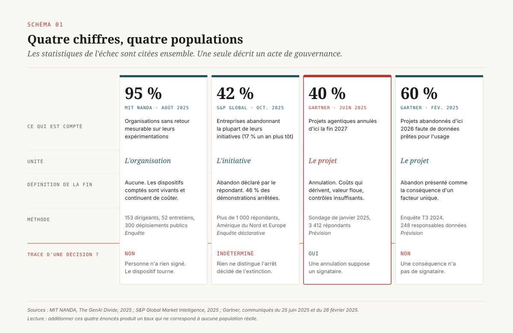
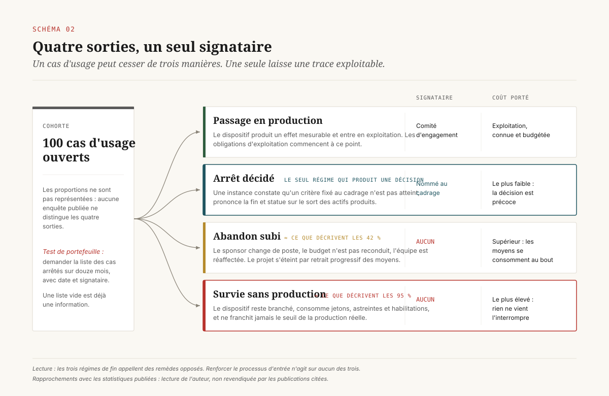
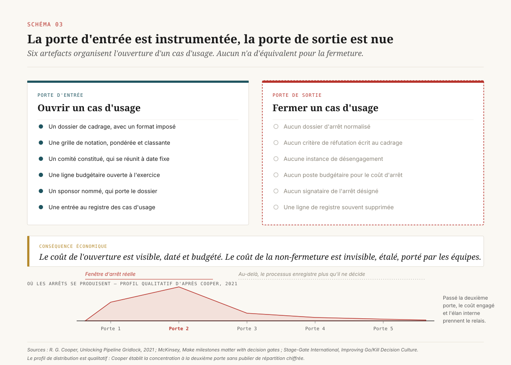
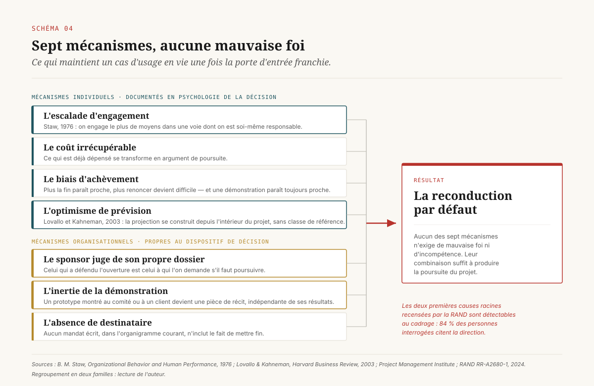
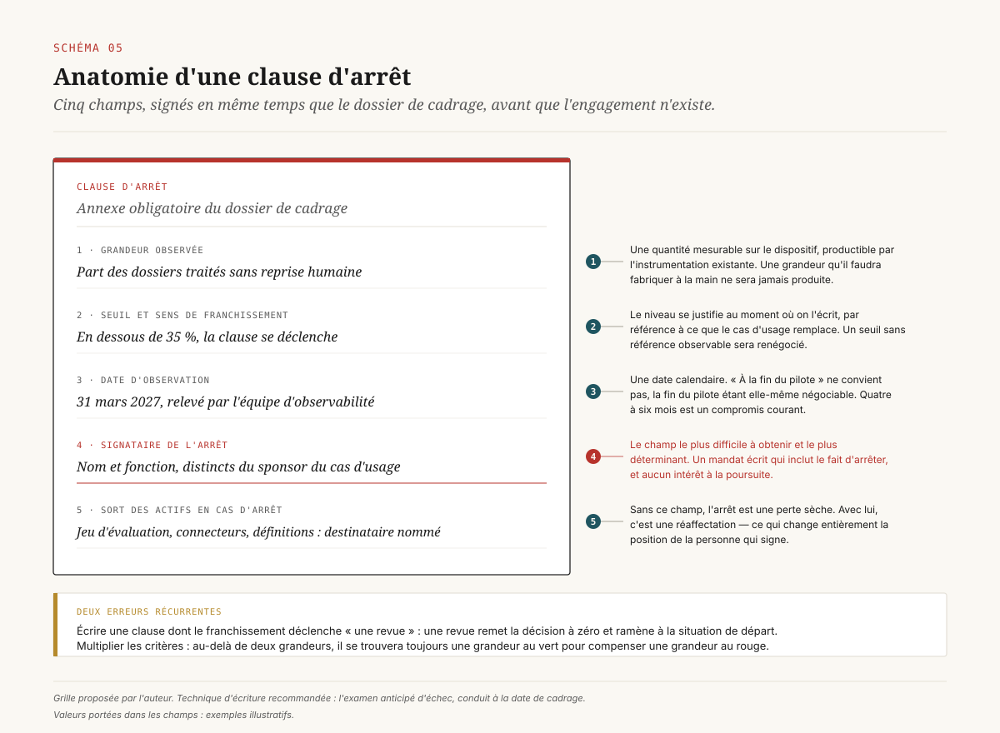

# Personne ne signe l'arrêt

> **Une direction data ne souffre pas d'un taux d'échec, elle souffre d'un taux d'arrêt : les chiffres qui circulent comptent des abandons subis, et la grille de scoring qui ouvre un cas d'usage est structurellement incapable de le fermer.** — 18 septembre 2026, Mathieu Guglielmino

Il existe aujourd'hui une abondante littérature sur l'échec des projets d'intelligence artificielle. On y trouve des taux, des cohortes, des causes racines, des typologies de blocage. Il n'existe presque rien sur la décision d'arrêter.

La différence semble rhétorique. Elle ne l'est pas. Un projet qui échoue et un projet qu'on arrête ne produisent pas les mêmes écritures comptables, ne mobilisent pas les mêmes instances, ne laissent pas la même trace et ne rendent pas les mêmes actifs. Surtout, ils ne se décident pas au même moment : l'échec se constate après coup, l'arrêt se décide pendant. Une direction data qui lit les statistiques d'échec y cherche une information qu'elles ne contiennent pas — la liste de ce qu'elle devrait fermer ce trimestre.

Ce dossier part d'une observation de portefeuille. Toutes les organisations qui ont industrialisé le cadrage de leurs cas d'usage disposent d'un processus d'entrée : un formulaire, une grille de notation, un comité, une ligne budgétaire, parfois un registre. Presque aucune ne dispose de l'équivalent en sortie. Il n'y a ni formulaire d'arrêt, ni critère d'arrêt, ni signataire désigné de l'arrêt, ni poste budgétaire pour le coût de l'arrêt. ==L'asymétrie entre la porte d'entrée et la porte de sortie est le fait le plus constant et le moins commenté de la gouvernance des portefeuilles de cas d'usage.==

La conséquence se lit dans les chiffres, à condition de les lire pour ce qu'ils sont.

## 1. Trois chiffres, trois objets

Trois statistiques dominent le débat depuis 2025. Elles sont citées ensemble, souvent dans la même phrase, comme si elles se renforçaient. Elles portent sur trois populations distinctes, comptent trois unités différentes et retiennent trois définitions incompatibles de la fin d'un projet.

**95 %.** Le rapport *The GenAI Divide* publié par l'initiative NANDA du MIT en août 2025 établit que 95 % des organisations interrogées n'obtiennent aucun retour mesurable de leurs expérimentations d'IA générative[^4]. La méthodologie repose sur 153 dirigeants interrogés, 52 entretiens approfondis et l'analyse de trois cents déploiements publics. L'unité comptée est l'**organisation**, quand les deux statistiques suivantes comptent des projets. Le critère retenu est l'absence d'effet mesurable au compte de résultat. Un point mérite attention : ce chiffre décrit des dispositifs **vivants**. Une organisation qui n'obtient aucun retour est une organisation qui continue de dépenser. Le rapport ne compte pas des projets morts, il compte des projets qui durent sans produire.

**42 %.** L'enquête de S&P Global Market Intelligence, conduite auprès de plus de mille répondants en Amérique du Nord et en Europe, relève que la proportion d'entreprises abandonnant la majorité de leurs initiatives d'IA est passée de 17 % à 42 % en un an[^3]. La même enquête donne un second chiffre, moins repris et plus utile : l'organisation moyenne abandonne 46 % de ses démonstrations de faisabilité avant qu'elles n'atteignent la production. L'unité comptée est ici l'**initiative**, et le critère est l'abandon déclaré par le répondant. Rien n'indique si cet abandon résulte d'une décision ou d'un épuisement.

**40 %.** Gartner prévoit que plus de 40 % des projets agentiques seront annulés d'ici la fin 2027, pour trois motifs énoncés : coûts qui dérivent, valeur métier indéterminée, contrôles de risque insuffisants[^1]. L'unité comptée est le **projet**, le critère est l'annulation, et l'horizon est une prévision. Le même cabinet ajoute un élément qui relève moins de l'échec que du tri du marché : sur les milliers de fournisseurs se réclamant de l'agentique, il estime qu'environ cent trente proposent réellement ce qu'ils annoncent.

À ces trois chiffres s'ajoute une quatrième prévision, antérieure et plus ancienne dans son objet : d'ici 2026, 60 % des projets d'IA non soutenus par des données prêtes pour l'usage seront abandonnés[^2]. Elle repose sur une enquête menée au troisième trimestre 2024 auprès de 248 responsables de la gestion des données, dont 63 % déclarent ne pas disposer, ou ne pas savoir s'ils disposent, des pratiques adaptées.

Ces quatre énoncés sont tous défendables. Aucun n'est interchangeable avec un autre. Le premier mesure une absence de rendement sur des dispositifs actifs ; le deuxième une déclaration d'abandon ; le troisième une prévision d'annulation ; le quatrième une prévision d'abandon conditionnée à un facteur unique. Une direction qui les additionne dans une note de cadrage obtient un chiffre qui ne correspond à aucune population réelle.

L'exercice utile consiste à poser à chacun la même question : **de quelle décision ce chiffre est-il la trace ?** Pour les 95 %, d'aucune — personne n'a rien décidé, le dispositif tourne. Pour les 42 %, la question reste ouverte. Pour les 40 %, une annulation est prévue, donc quelqu'un signera. Pour les 60 %, l'abandon est présenté comme une conséquence, et une conséquence n'a pas de signataire.

==Sur quatre statistiques majeures de l'échec, une seule décrit un acte de gouvernance.==

## 2. L'abandon, l'arrêt, le zombie

Les chiffres écrasent une distinction que le pilotage exige. Un cas d'usage peut cesser de trois manières, et les trois se paient différemment.

**L'arrêt décidé.** Une instance constate qu'un critère fixé auparavant n'est pas atteint, prononce la fin, inscrit la décision au registre, réaffecte les moyens et statue sur le sort des actifs produits. L'arrêt a une date, un signataire et un motif écrit. Il est coûteux à prononcer sur le plan politique, et peu coûteux sur le plan économique, parce qu'il intervient tôt.

**L'abandon subi.** Personne ne prononce rien. Le sponsor change de poste, la priorité se déplace, le budget n'est pas reconduit à l'exercice suivant, l'équipe est réaffectée sur une urgence. Le projet s'éteint par retrait progressif des moyens. Aucune date, aucun signataire, aucun motif. C'est le régime que décrivent, selon toute vraisemblance, la majorité des 42 % de S&P Global. Son coût économique est supérieur à celui de l'arrêt, parce que l'extinction consomme des moyens jusqu'au bout sans jamais produire d'enseignement transmissible.

**La survie sans production.** Le dispositif reste branché. Il consomme des jetons, des astreintes, des habilitations, une part d'attention en revue mensuelle. Il ne produit pas d'effet mesurable et ne franchit jamais le seuil de la production réelle. C'est le régime que décrivent les 95 % du MIT. Sa particularité tient à ce qu'il échappe aux deux autres : il n'est ni arrêté ni abandonné, donc il n'apparaît dans aucune statistique de fin de vie. Une enquête récente d'entreprise relève que près de 45 % des salariés déclarent porter au moins un projet qu'ils savent ne jamais pouvoir mener à terme, et que leur hiérarchie considère toujours comme actif.

Un quatrième régime existe et n'intéresse pas ce dossier : le passage en production, avec les obligations d'exploitation que le dossier [*La facture de l'agent*](../facture-agent/) a détaillées.

Le classement n'est pas académique. Les trois régimes appellent des remèdes opposés. Contre l'abandon subi, on renforce la continuité du portage et la reconduction budgétaire. Contre la survie sans production, on impose une date d'observation et un seuil. Contre l'arrêt décidé, on ne fait rien : il fonctionne. Une organisation qui confond les trois régimes traite son problème d'arrêt en renforçant son processus d'entrée, ce qui aggrave exactement la situation qu'elle cherche à corriger.

Un test simple permet de situer une organisation. Demander au responsable du portefeuille la liste des cas d'usage arrêtés au cours des douze derniers mois, avec pour chacun la date de la décision et le nom du signataire. Si la liste est vide alors que le portefeuille a perdu des projets, l'organisation est en régime d'abandon. Si la liste est vide et que le portefeuille n'a rien perdu, elle est en régime de survie. Dans les deux cas, ==le taux d'arrêt est nul, ce qui constitue une information de gouvernance plus dure qu'un taux d'échec.==

## 3. La porte qui ne sait pas fermer

L'incapacité à fermer n'est pas propre à l'intelligence artificielle. Elle est documentée depuis trois décennies dans la gestion de l'innovation, sous une forme qui transpose presque sans ajustement.

Robert Cooper, qui a formalisé le processus par portes d'étape dans les années 1980, consacre une part de ses travaux ultérieurs à son échec le plus répandu : l'engorgement du portefeuille[^6]. Le constat tient en une phrase. Les entreprises installent des portes, mais les portes manquent de dents, parce que la direction ne sait pas dire non, et l'option d'arrêt n'est presque jamais exercée. Les projets ne sont pas tués, tandis que de nouveaux arrivent sans égard pour la charge déjà engagée. Le portefeuille se remplit, les moyens se dispersent, chaque projet avance plus lentement, et la lenteur elle-même devient un argument pour ne pas trancher.

Cooper relève une régularité de distribution qui éclaire le mécanisme. Les décisions d'arrêt se concentrent massivement à la deuxième porte, immédiatement après l'examen du dossier économique. Passé ce point, les portes ultérieures ne tuent presque plus rien, parce que le coût déjà engagé et l'élan interne prennent le relais. L'organisation dispose donc d'une fenêtre d'arrêt courte, située tôt, et d'une longue période pendant laquelle le processus qu'elle croit décisionnel ne fait qu'enregistrer.

McKinsey énonce la même observation par sa cause financière : dans une porte d'étape ordinaire, le financement n'est presque jamais retardé ou interrompu, ce qui n'incite personne à préparer une discussion orientée décision[^7]. La revue devient un examen de maturité, et les participants la traitent comme une formalité. Le cabinet oppose à cette pratique la notion de porte de décision, définie comme un moment sans retour en arrière où la direction engage effectivement un investissement ou tranche un compromis. La différence entre les deux dispositifs ne tient pas au formulaire, elle tient à ce que la porte peut faire au budget.

Stage-Gate International formule la même chose du côté du comportement en séance : la question à poser est de savoir si la revue est un rituel d'entérinement qui approuve presque tout avec peu de contradiction, ou une instance où les dirigeants conduisent une discussion franche et prononcent des arrêts difficiles[^8].

Trois sources indépendantes, issues de la gestion de produit, du conseil en opérations et de la pratique des portes d'étape, convergent sur un même diagnostic : la porte d'entrée est instrumentée, la porte de sortie ne l'est pas. Il existe un dossier de cadrage, il n'existe pas de dossier d'arrêt. Il existe un comité d'engagement, il n'existe pas d'instance de désengagement. Il existe une ligne budgétaire pour ouvrir, il n'en existe pas pour fermer.

Cette asymétrie a une conséquence économique précise. ==Le coût de l'ouverture est visible, daté et budgété ; le coût de la non-fermeture est invisible, étalé et porté par les équipes.== L'un se discute au comité d'investissement, l'autre se constate en attrition et en dispersion.

## 4. Une grille de scoring ne peut pas tuer

La réponse la plus fréquente au problème du portefeuille consiste à en renforcer la méthode de sélection. On construit une grille : valeur métier, faisabilité technique, disponibilité des données, exposition au risque, alignement stratégique. On pondère, on note, on classe. L'exercice a des vertus réelles, à commencer par l'obligation d'écrire ce qu'on attend. Il ne produit pourtant jamais un arrêt, et l'affirmation se démontre.

**Un classement réalloue, il ne termine pas.** Une grille de notation produit un ordre. Un ordre permet de dire quel projet passe devant, jamais qu'un projet doit cesser. Le dernier d'un classement reste dans le classement. Pour qu'une notation ferme un dossier, il faut lui adjoindre une borne absolue, c'est-à-dire un seuil en dessous duquel on ne finance pas, indépendamment du rang. Presque aucune grille observée n'en comporte, parce qu'une borne absolue oblige à justifier son niveau, alors qu'un classement se contente de comparer.

**Une grille note des promesses.** Au moment du cadrage, aucune des grandeurs notées n'est observée. La valeur métier est une estimation, la faisabilité une opinion d'expert, le risque une anticipation. Lovallo et Kahneman ont décrit le régime de prévision qui prévaut dans ces conditions : les dirigeants construisent leurs projections depuis l'intérieur du projet, en enchaînant les hypothèses favorables, sans confronter le dossier à la distribution des résultats observés sur des projets comparables[^10]. Ils nomment prévision par classe de référence la correction consistant à prendre le point de vue extérieur. Une grille de scoring standard fait l'exact opposé : elle demande au porteur de noter son propre dossier sur des dimensions dont il est la seule source.

**Une promesse ne se dément pas d'elle-même.** C'est la propriété structurante. Un critère d'entrée porte sur une intention et reste vrai aussi longtemps que l'intention persiste. Pour qu'un cas d'usage puisse être fermé, il faut qu'un énoncé le concernant devienne **faux à une date donnée**. Cela exige une grandeur observable, un seuil et une échéance, trois éléments qu'aucune grille d'entrée ne contient.

La conséquence est que la grille de scoring et la décision d'arrêt sont deux objets de nature logique différente. La première ordonne des dossiers selon des déclarations, la seconde réfute un énoncé par une observation. Renforcer la première n'améliore jamais la seconde. Une direction qui répond au problème de l'arrêt en ajoutant des axes à sa grille de cadrage travaille sur le mauvais objet.

Il faut ajouter que la grille remplit une fonction politique utile et rarement avouée : elle permet de refuser en donnant une raison impersonnelle. Cette fonction ne s'exerce qu'à l'entrée. Une fois le projet ouvert, la grille n'a plus de prise, et le refus redevient personnel. C'est une des raisons pour lesquelles ==l'organisation sait dire non à un dossier et ne sait pas dire stop à un projet : le refus d'entrée est porté par une méthode, l'arrêt est porté par quelqu'un.==

## 5. Ce qui tient le projet en vie

Une fois la porte d'entrée franchie, un ensemble de mécanismes bien identifiés maintient le projet en vie indépendamment de ses résultats. Ils se répartissent en deux familles.

### Les mécanismes individuels

L'escalade d'engagement est le plus documenté. Barry Staw en a produit la démonstration expérimentale en 1976 sur 240 sujets placés en situation d'allocation de moyens[^9]. Le résultat central tient en une ligne : les personnes engagent le plus de ressources dans une voie déjà choisie lorsqu'elles sont **personnellement responsables** des conséquences négatives antérieures. Le déclencheur du renforcement est la responsabilité de la décision initiale, et l'information défavorable l'aggrave au lieu de le corriger.

La transposition est directe. Dans la plupart des organisations, le sponsor d'un cas d'usage est la personne qui l'a proposé, qui a défendu son dossier en comité, et à qui l'on demande ensuite de juger s'il faut le poursuivre. Le dispositif place le décideur dans la configuration exacte que Staw a isolée comme la plus défavorable. La littérature de gestion de projet a recensé plus de trente déterminants de la non-décision d'arrêt ; ceux qui reviennent le plus sont le coût irrécupérable, le biais d'achèvement, l'auto-justification et l'optimisme[^12].

Le biais d'achèvement mérite une mention distincte parce qu'il se renforce avec l'avancement. Plus un projet est proche de ce qu'on croit être sa fin, plus il devient difficile d'y renoncer, indépendamment de ce que cette fin produira. Dans un projet d'IA, la notion d'achèvement est particulièrement instable : une démonstration paraît toujours proche d'aboutir, parce que la distance entre un prototype convaincant et un système exploitable n'est pas visible dans la démonstration elle-même.

### Les mécanismes organisationnels

Le premier tient à la confusion entre le constat et la décision. Tant que la personne qui observe les résultats est celle qui les produit, l'organisation n'a pas de fait indépendant sur lequel fonder un arrêt. Le dossier [*CDO ou CAIO*](../cdo-caio-rattachement/) a établi une règle voisine sur le terrain des rattachements, et la Cour de justice de l'Union européenne en a donné la formulation la plus nette dans un autre contexte : nul ne contrôle les finalités et les moyens qu'il détermine lui-même.

Le deuxième est l'inertie de la démonstration. Un prototype exposé au comité de direction, repris dans une communication interne ou montré à un client acquiert un statut qui ne dépend plus de ses performances. Il devient une pièce de récit. L'arrêter revient à contredire publiquement une affirmation antérieure, ce qui déplace la discussion du terrain des résultats vers celui de la cohérence.

Le troisième est l'absence de destinataire. Une décision d'arrêt suppose quelqu'un dont le mandat inclut explicitement le fait d'arrêter. Dans la plupart des organigrammes, aucun titulaire n'a cette attribution écrite. Le comité d'architecture valide des choix techniques, le comité d'investissement engage des budgets, le comité de pilotage suit un avancement. Aucun n'a reçu mandat de mettre fin.

Le rapport de la RAND sur les causes racines de l'échec des projets d'IA place ce point au premier rang, à partir de 65 entretiens auprès d'ingénieurs et de scientifiques des données : 84 % des personnes interrogées citent des causes liées à la direction plutôt qu'à la technique[^5]. Le détail des causes recensées est instructif pour notre propos. Les deux premières concernent la définition du problème : les parties prenantes comprennent mal, ou expliquent mal, le problème à résoudre ; et des modèles sont déployés après avoir été optimisés sur des indicateurs qui ne correspondent pas au fonctionnement réel de l'activité. Ces deux causes ont une propriété commune : elles sont détectables **au cadrage**, pas après dix-huit mois. Une organisation qui ne les détecte pas au cadrage ne les détectera pas davantage ensuite, faute de critère pour les faire remonter.

## 6. Le seul arrêt que le droit impose

Une direction qui cherche un appui réglementaire pour fonder ses arrêts en trouvera un, et un seul.

L'article 26 du règlement européen sur l'intelligence artificielle fixe les obligations du déployeur d'un système à haut risque. Son paragraphe 5 dispose que le déployeur surveille le fonctionnement du système sur la base de la notice d'utilisation, et que lorsqu'il a des raisons de considérer que cet usage peut présenter un risque au sens de l'article 79, paragraphe 1, il informe sans retard injustifié le fournisseur ou le distributeur ainsi que l'autorité de surveillance du marché compétente, **et suspend l'utilisation du système**[^11]. Le même paragraphe ajoute qu'en cas d'incident grave, le déployeur informe immédiatement le fournisseur, puis l'importateur ou le distributeur et les autorités de surveillance.

Cette disposition est le seul point du droit européen applicable qui impose un arrêt à un déployeur. Sa portée mérite d'être lue précisément.

Elle est **conditionnée au risque**, au sens d'une atteinte à la santé, à la sécurité ou aux droits fondamentaux. Elle ne se déclenche pas sur une absence de valeur, un dépassement de budget ou un taux d'erreur métier jugé décevant. Un système parfaitement inutile, coûteux et sans effet mesurable reste parfaitement conforme.

Elle est **suspensive et non terminale**. Le texte impose de suspendre l'utilisation, pas de mettre fin au projet. La suspension est un état réversible, ce qui la rend compatible avec l'inertie décrite plus haut.

Elle **présuppose une surveillance**. L'obligation de suspendre ne s'active que si le déployeur a des raisons de considérer qu'un risque existe, ce qui suppose un dispositif d'observation en fonctionnement et des personnes habilitées à faire remonter un signal. Le paragraphe 1 de l'article 26 impose d'ailleurs des mesures techniques et organisationnelles appropriées, et le paragraphe relatif aux journaux en impose la conservation pendant une durée adaptée, d'au moins six mois.

La conclusion de gouvernance est nette. ==Le seul arrêt que le droit impose est un arrêt pour risque ; l'arrêt pour inutilité reste entièrement à la charge de l'organisation.== Aucune autorité ne viendra reprocher à une entreprise d'avoir laissé vivre trois ans un cas d'usage sans effet. Le sujet est budgétaire et organisationnel, ce qui signifie qu'il ne se réglera pas par une mise en conformité.

Une remarque secondaire mérite d'être faite, parce qu'elle a une valeur pratique. Le dispositif de surveillance que l'article 26 exige pour le risque produit exactement le type de matériau dont un arrêt pour inutilité a besoin : des journaux, des mesures de fonctionnement, une chaîne de remontée et un destinataire identifié. Une organisation qui construit ce dispositif pour des raisons de conformité dispose, sans coût marginal, de l'instrumentation nécessaire pour prononcer des arrêts économiques. Peu d'organisations font ce rapprochement, parce que les deux sujets sont portés par des fonctions différentes.

## 7. La clause d'arrêt

Tout ce qui précède conduit à un objet unique, dont l'énoncé est plus court que sa mise en œuvre : **un cas d'usage ne peut être fermé que par un critère écrit avant qu'il n'ait commencé.**

La raison est celle de la section 5. Une fois l'engagement constitué, le décideur se trouve dans la configuration de Staw, et le critère qu'il écrirait à ce moment porterait déjà la marque de son engagement. Le seul moment où l'organisation dispose d'un jugement non contaminé est celui du cadrage, avant que quiconque ait quelque chose à défendre. La clause d'arrêt est donc un objet de cadrage, au même titre que le dossier économique, et elle se signe en même temps que lui.

Cinq champs suffisent, et les cinq sont nécessaires.

**1. La grandeur observée.** Une quantité mesurable sur le dispositif lui-même, pas une appréciation. « Taux de réponses acceptées sans reprise par l'opérateur », « part des dossiers traités de bout en bout sans reprise humaine », « délai médian de traitement », « nombre d'utilisateurs actifs hebdomadaires distincts ». La grandeur doit être productible par l'instrumentation existante ou par une instrumentation dont le coût est chiffré dans le dossier. Une grandeur qu'il faudra fabriquer à la main ne sera pas produite.

**2. Le seuil.** Une valeur, avec son sens de franchissement. Le seuil se justifie au moment où on l'écrit, en référence à ce que le cas d'usage remplace : le niveau actuel du processus manuel, le coût unitaire actuel, le délai actuel. Un seuil qui ne se réfère à rien d'observable aujourd'hui sera renégocié demain.

**3. La date d'observation.** Une date calendaire. « À la fin du pilote » ne convient pas, parce que la fin du pilote est elle-même négociable. La date doit être assez tardive pour que la grandeur soit mesurable et assez précoce pour que la somme engagée reste dans l'ordre de grandeur d'une expérimentation. Dans les portefeuilles observés, un horizon de quatre à six mois constitue un compromis courant.

**4. Le signataire.** Une personne nommée, distincte du sponsor. C'est le champ le plus difficile à obtenir et le plus déterminant. La séparation reproduit, à l'échelle d'un projet, le principe de séparation du contrôle et de la conduite. Le signataire n'a pas besoin d'être un supérieur hiérarchique ; il a besoin d'un mandat écrit qui inclut le fait d'arrêter, et d'une absence d'intérêt à la poursuite. Un pair d'une autre direction, un membre du comité d'arbitrage, le responsable du registre des cas d'usage sont des configurations viables.

**5. Le sort des actifs.** Ce que devient, en cas d'arrêt, chacun des objets produits : le jeu d'évaluation, les connecteurs, les définitions métier formalisées, la ligne du registre, les habilitations ouvertes. Ce champ transforme la nature de la décision. Un arrêt sans clause de restitution est une perte sèche ; un arrêt avec clause de restitution est une réaffectation. La différence est décisive pour la personne qui signe.

La technique d'écriture la mieux établie pour remplir ces champs est le *pre-mortem*, ou examen anticipé d'échec : on demande à l'équipe de se projeter à la date d'observation en supposant que le projet a échoué, et d'écrire pourquoi. Les raisons énumérées se convertissent en grandeurs observables. L'exercice a l'avantage de rendre l'anticipation d'échec socialement acceptable au moment précis où elle ne coûte rien à personne.

Deux erreurs récurrentes méritent d'être signalées. La première consiste à écrire une clause dont le franchissement déclenche « une revue » plutôt qu'un arrêt. Une revue est une remise à zéro de la décision, et elle ramène à la situation de départ. La seconde consiste à multiplier les critères : au-delà de deux grandeurs, la clause devient négociable, parce qu'il se trouvera toujours une grandeur au vert pour compenser une grandeur au rouge. Une grandeur, éventuellement deux, avec la règle de combinaison écrite.

## 8. Le coût d'arrêt

Un portefeuille se pilote avec des indicateurs. Ceux qui existent aujourd'hui mesurent l'entrée — nombre de cas d'usage cadrés, taux de passage en production, retour sur investissement des dispositifs déployés. Aucun ne mesure la capacité d'arrêt.

L'indicateur manquant se construit simplement. Pour chaque cas d'usage arrêté, on relève deux dates : celle où le critère d'arrêt a été franchi et celle où la décision a été signée. L'écart entre les deux, multiplié par la consommation mensuelle du dispositif, donne le **coût d'arrêt** de ce cas d'usage. Agrégé sur le portefeuille, il donne une grandeur que les directions n'ont pas et que les comités devraient regarder.

[SCHEMA-06]

Cette grandeur a trois propriétés utiles.

Elle est **indépendante du taux d'échec**. Deux portefeuilles peuvent afficher le même taux de passage en production et des coûts d'arrêt dans un rapport de un à dix. Le premier ferme en six semaines, le second en dix-huit mois. Le taux d'échec ne distingue pas ces deux organisations, le coût d'arrêt les sépare immédiatement.

Elle est **actionnable**. Réduire un taux d'échec suppose de mieux choisir, ce qui est difficile et lent. Réduire un coût d'arrêt suppose d'écrire des clauses et de nommer des signataires, ce qui est rapide et se décide à un seul niveau.

Elle **valorise l'arrêt au lieu de le stigmatiser**. Un indicateur de taux d'échec fait de chaque arrêt une mauvaise nouvelle. Un indicateur de coût d'arrêt fait de chaque arrêt rapide une bonne nouvelle. L'effet sur le comportement des sponsors est direct : dans le premier régime, on a intérêt à ne jamais conclure ; dans le second, on a intérêt à conclure tôt.

Deux indicateurs complémentaires se dérivent de la même mesure. Le **taux d'arrêt**, soit le nombre de cas d'usage arrêtés sur l'exercice rapporté au nombre de cas d'usage ouverts, dont la valeur nulle constitue à elle seule un signal. Et le **taux de couverture par clause**, soit la proportion des cas d'usage actifs dont la fiche porte une clause d'arrêt complète et datée. Ce dernier est le seul des trois qui se mesure sans attendre : il se relève sur le registre, et une organisation qui le publie découvre en général qu'il est très bas.

Une précision de méthode. Le coût d'arrêt se calcule sur la consommation réelle du dispositif plutôt que sur le budget alloué. Les postes à retenir sont ceux qu'une exploitation impose : appels aux modèles, hébergement, astreinte, maintenance des connecteurs, temps d'équipe consacré au maintien. Le dossier [*La facture de l'agent*](../facture-agent/) en donne la décomposition ; l'essentiel pour notre propos est que cette consommation se poursuit intégralement pendant toute la période de non-décision.

## 9. Ce qu'un arrêt restitue

Il reste à traiter l'objection principale, qui est aussi le motif réel du blocage : arrêter, c'est perdre ce qu'on a investi. L'objection est fondée si l'arrêt est conduit comme une extinction. Elle ne l'est pas si l'arrêt est conduit comme une restitution.

Un cas d'usage arrêté à six mois laisse derrière lui des objets dont la valeur est indépendante de son succès.

**Le jeu d'évaluation.** L'ensemble des cas de test, des sorties attendues et des règles de notation constitué pendant l'expérimentation. C'est l'actif le plus durable et le plus réutilisable, parce qu'il encode un jugement métier que personne n'avait formalisé auparavant. Deux dossiers antérieurs de cette série y aboutissent indépendamment, ce qui mérite d'être noté : le jeu d'évaluation survit régulièrement au dispositif qu'il servait à évaluer.

**Les définitions métier.** Ce qu'est un dossier complet, un client actif, une réclamation traitée, un résultat acceptable. Un projet d'IA oblige à écrire ces définitions parce qu'un système ne fonctionne pas sans elles. Elles s'appliquent ensuite au processus manuel, aux tableaux de bord et aux autres cas d'usage du même domaine.

**Les connecteurs et les habilitations.** L'accès obtenu à une source de données, le droit d'écriture négocié sur un système, l'interface exposée par une application ancienne. Ces objets coûtent des mois de négociation interne et servent au cas d'usage suivant.

**La ligne du registre.** La trace écrite de ce qui a été tenté, avec la grandeur observée, le seuil, la date et le motif d'arrêt. C'est la seule protection contre la reproposition du même cas d'usage dix-huit mois plus tard par une autre équipe, phénomène courant dans les organisations dont le registre ne conserve que les projets vivants.

Une conséquence pratique en découle : ==le registre des cas d'usage doit conserver les cas d'usage arrêtés, avec leur motif, au même rang que les cas d'usage actifs.== Un registre qui supprime ses lignes fermées détruit le seul actif qu'un arrêt produit à coup sûr.

## Ce que cela change

**D1 — Écrire la clause d'arrêt dans le dossier de cadrage, et refuser l'ouverture sans elle.** Cinq champs : grandeur, seuil, date, signataire, sort des actifs. La clause se signe en même temps que le dossier économique, par les deux parties. Un cadrage sans clause d'arrêt reste un cadrage non instruit.

**D2 — Nommer le signataire de l'arrêt, distinct du sponsor.** Une personne, pas une instance, avec un mandat écrit qui inclut explicitement le fait d'arrêter. La séparation du constat et de la décision est la seule protection connue contre l'escalade d'engagement, et elle ne coûte rien à mettre en place au cadrage.

**D3 — Publier le taux d'arrêt et le coût d'arrêt au comité.** Trois chiffres au tableau de bord trimestriel : nombre de cas d'usage arrêtés sur l'exercice, coût d'arrêt moyen, part des cas d'usage actifs couverts par une clause complète. Le troisième se relève immédiatement et donne la mesure du chemin à parcourir.

**D4 — Traiter l'arrêt comme une restitution, et l'inscrire au registre.** Prévoir au cadrage le destinataire de chaque actif produit, conserver la ligne du registre après la fermeture avec son motif, et rendre la reproposition d'un cas d'usage arrêté conditionnelle à l'exposé de ce qui a changé depuis.

Le portefeuille de cas d'usage d'une direction data se juge aujourd'hui sur ce qu'il a mis en production. Il se jugera mieux sur ce qu'il a su fermer, et sur la vitesse à laquelle il l'a fait.

---

*Format co-écrit avec l'aide d'une IA.*

## Sources

[^1]: Gartner, *Gartner Predicts Over 40% of Agentic AI Projects Will Be Canceled by End of 2027*, communiqué du 25 juin 2025. https://www.gartner.com/en/newsroom/press-releases/2025-06-25-gartner-predicts-over-40-percent-of-agentic-ai-projects-will-be-canceled-by-end-of-2027

[^2]: Gartner, *Lack of AI-Ready Data Puts AI Projects at Risk*, communiqué du 26 février 2025. https://www.gartner.com/en/newsroom/press-releases/2025-02-26-lack-of-ai-ready-data-puts-ai-projects-at-risk

[^3]: S&P Global Market Intelligence, *Generative AI shows rapid growth but yields mixed results*, recherche, octobre 2025. https://www.spglobal.com/market-intelligence/en/news-insights/research/2025/10/generative-ai-shows-rapid-growth-but-yields-mixed-results

[^4]: MIT NANDA, *The GenAI Divide — State of AI in Business 2025*, août 2025. https://mlq.ai/media/quarterly_decks/v0.1_State_of_AI_in_Business_2025_Report.pdf

[^5]: James Ryseff, Brandon De Bruhl, Sydne J. Newberry, *The Root Causes of Failure for Artificial Intelligence Projects and How They Can Succeed*, RAND Corporation, RR-A2680-1, 2024. https://www.rand.org/pubs/research_reports/RRA2680-1.html

[^6]: Robert G. Cooper, *Unlocking « Pipeline Gridlock »: Effective Portfolio Management is the Key*, Institute for the Study of Business Markets, 2021. https://isbm.org/wp-content/uploads/2021/11/Cooper-2021-Unlocking-pipleine-gridlock.pdf

[^7]: McKinsey & Company, *Make milestones matter with « decision gates » — stage gates with real teeth*. https://www.mckinsey.com/capabilities/operations/our-insights/make-milestones-matter-with-decision-gatesstage-gates-with-real-teeth

[^8]: Stage-Gate International, *Improving Go/Kill Decision Culture*. https://www.stage-gate.com/blog/improving-go-kill-decision-culture/

[^9]: Barry M. Staw, *Knee-deep in the Big Muddy: A Study of Escalating Commitment to a Chosen Course of Action*, Organizational Behavior and Human Performance, vol. 16, p. 27-44, 1976. https://strategy.sjsu.edu/www.stable/B290/reading/Staw,%20B%20M,%201976,%20Organizational%20Behavior%20and%20Human%20Performance.%2016%20pp%2027-44.pdf

[^10]: Dan Lovallo, Daniel Kahneman, *Delusions of Success: How Optimism Undermines Executives' Decisions*, Harvard Business Review, juillet 2003. https://hbr.org/2003/07/delusions-of-success-how-optimism-undermines-executives-decisions

[^11]: Règlement (UE) 2024/1689 sur l'intelligence artificielle, article 26 — obligations incombant aux déployeurs de systèmes d'IA à haut risque. https://ai-act-service-desk.ec.europa.eu/en/ai-act/article-26

[^12]: Project Management Institute, *The psychology of project termination*. https://www.pmi.org/learning/library/psychology-project-termination-decision-maker-5914
