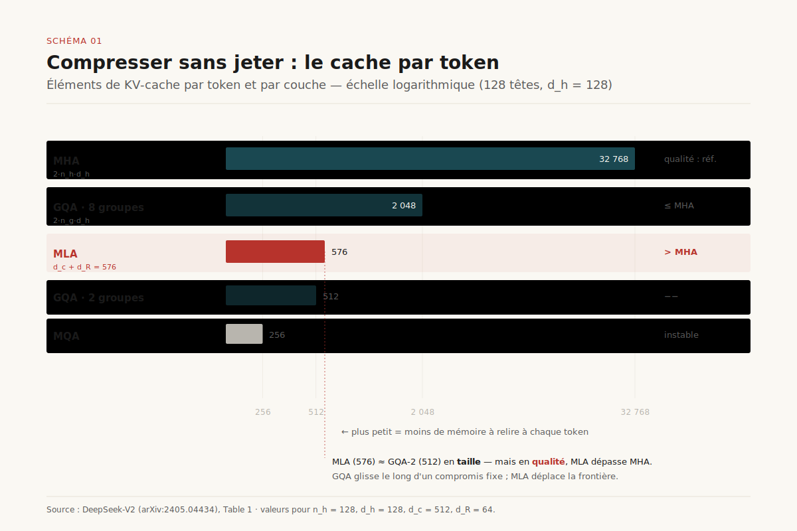
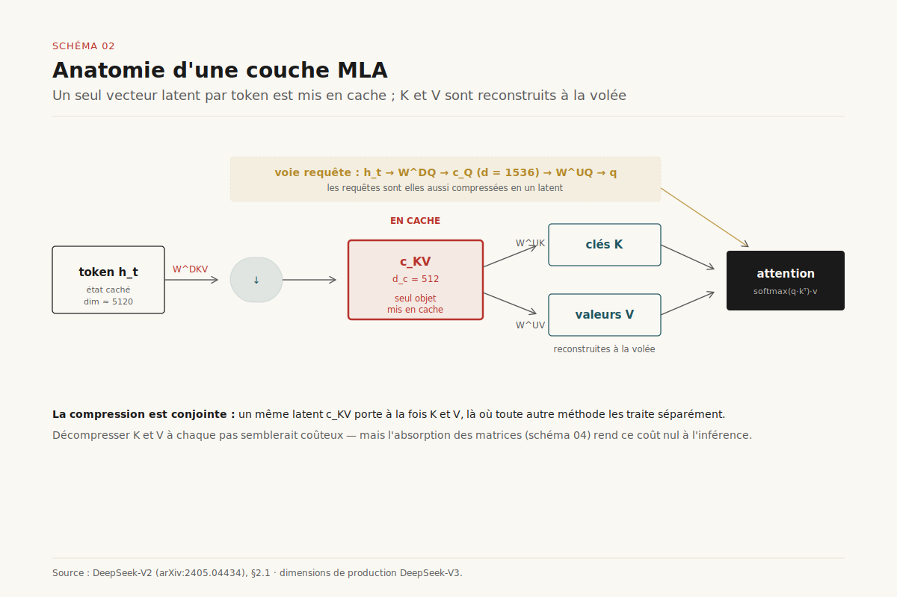

# L'attention latente, lue serré

> **MLA n'est pas une compression du cache de plus : c'est une reparamétrisation entraînée de l'attention où un vecteur latent par token remplace toutes les paires clé/valeur, et où l'absorption des matrices rend gratuit à l'inférence le surcoût de re-projection — d'où son statut de choix d'architecture d'attention 2026.** — 24 juillet 2026, Mathieu Guglielmino

*Deep dive prolongeant le dossier [Compresser le KV-cache](../compression-kv-cache/). Là où ce dernier traitait la compression comme un choix d'architecture à **trois étages** — partager les têtes (MQA/GQA), les projeter dans un latent (MLA), compresser les octets (quantification, éviction) — celui-ci ouvre l'étage du milieu et le lit ligne à ligne : la dérivation exacte de MLA, l'astuce d'absorption qui la rend praticable, la comparaison chiffrée avec GQA à budget cache égal, ses kernels, et le pari — TransMLA — qu'elle finisse par absorber tout l'écosystème GQA.*

---

## 1. Le point de départ : la mémoire prime, et GQA n'est qu'un pansement

Le dossier [L'économie du KV-cache](../kv-cache/) posait le diagnostic qui gouverne tout le reste : à la génération, un modèle de langage n'est pas limité par le calcul mais par la mémoire. Chaque nouveau token exige de relire les clés et valeurs (K, V) de tous les tokens précédents ; ces tenseurs sont mis en cache pour éviter un recalcul quadratique, et ce cache — pas les poids — devient le poste dominant à contexte long. La phase de décodage est *memory-bound* : le facteur limitant est la bande passante mémoire qu'il faut dépenser pour rapatrier le cache, pas les FLOP de l'attention[^1].

La réponse dominante, de 2023 à 2025, a été le **partage de têtes**. L'attention multi-têtes classique (MHA) attribue à chacune de ses `n_h` têtes sa propre projection K et V ; le cache pèse donc `2 · n_h · d_h` éléments par token et par couche. *Multi-Query Attention* (MQA, Shazeer 2019) pousse le curseur à l'extrême : une seule tête K/V partagée par toutes les têtes de requête, soit une division du cache par `n_h`[^2]. Le gain est spectaculaire mais l'appauvrissement l'est aussi — une unique paire K/V pour des dizaines de requêtes dégrade la qualité et rend l'entraînement instable. *Grouped-Query Attention* (GQA, Ainslie et al. 2023) est le compromis qui s'est imposé : `g` groupes de têtes de requête partagent chacun une paire K/V, avec `1 < g < n_h`. Llama 2/3, Mistral, Qwen, Gemma : presque tous les modèles ouverts de 2024-2025 sont des modèles GQA, souvent obtenus par *uptraining* d'un modèle MHA sur ~5 % de son budget de tokens[^3].

==Mais GQA réduit *grossièrement* : réduire le cache y revient toujours à partager davantage de têtes, c'est-à-dire à **jeter de l'information** — moins de directions distinctes dans l'espace des clés et des valeurs.== La question que MLA pose, et à laquelle GQA ne sait pas répondre, est la suivante : peut-on rendre le cache plus petit sans le rendre plus pauvre ? Peut-on compresser au lieu de trancher ?

## 2. L'idée centrale : compresser conjointement K et V dans un latent

*Multi-head Latent Attention* (MLA), introduite avec DeepSeek-V2 en mai 2024, change la nature de l'opération[^4]. Au lieu de partager des têtes, elle **projette** l'information des clés et valeurs dans un vecteur latent de basse dimension, et ne met en cache que ce vecteur.

Concrètement : pour chaque token `t`, une matrice de *down-projection* `W^DKV` comprime l'état caché `h_t` (dimension du modèle, plusieurs milliers) en un unique vecteur latent `c_KV_t` de dimension `d_c`, choisie bien plus petite que `n_h · d_h`. ==C'est ce vecteur `c_KV_t` — et lui seul — qui est écrit dans le cache.== Au moment de calculer l'attention, deux matrices de *up-projection*, `W^UK` et `W^UV`, reconstruisent à la volée les clés et les valeurs pleines à partir du latent. La compression est **de rang faible** (*low-rank*) et surtout **conjointe** : un même latent porte à la fois K et V, là où toutes les autres méthodes les traitent séparément.

Les chiffres de DeepSeek-V2 donnent la mesure du gain. Le vecteur latent y est de dimension `d_c = 512`, contre un cache MHA de `2 · n_h · d_h` éléments par token — pour un modèle à 128 têtes de dimension 128, cela ferait 32 768 éléments. En pratique, DeepSeek-V2 revendique une **réduction du KV-cache de 93,3 %** par rapport à son équivalent MHA, une **multiplication par 5,76 du débit maximal de génération** face à DeepSeek 67B (un modèle dense de génération précédente), et au passage **42,5 % de coûts d'entraînement économisés**[^4]. La compression latente n'est donc pas un artefact théorique : elle se lit directement au compteur de tokens par seconde.

La subtilité — et le piège — tient à ce que cette reconstruction *à la volée* pourrait coûter cher : décompresser le latent en K et V pleins à chaque pas de décodage, pour chaque token du contexte, réintroduirait exactement le calcul qu'on cherchait à éviter. La section 4 montre pourquoi il n'en est rien. Mais avant cela, il faut régler un obstacle que la compression naïve ne voit pas venir : la position.

## 3. Le piège RoPE et la parade du découplage

Les modèles de 2024 encodent la position des tokens par *Rotary Position Embedding* (RoPE, Su et al.) : à chaque tête, la requête et la clé sont **tournées** d'un angle proportionnel à leur position avant le produit scalaire, si bien que le score d'attention ne dépend plus que de la position *relative* des deux tokens[^5]. Élégant, universellement adopté — et incompatible avec la compression latente telle qu'on vient de la décrire.

Pourquoi ? Parce que le gain de MLA à l'inférence (section 4) repose sur la possibilité de **fusionner** la matrice `W^UK` qui reconstruit les clés dans la matrice `W^UQ` qui produit les requêtes, une fois pour toutes, hors ligne. Or RoPE insère entre les deux une matrice de rotation `R_t` qui *dépend de la position* `t` du token : `q_t · k_s` devient `(R_t q_t) · (R_s k_s)`. Cette rotation, différente pour chaque paire de positions, ne peut pas être pré-absorbée dans un produit de poids constant. ==RoPE et absorption des matrices sont, en l'état, mutuellement exclusifs : appliquer la rotation force à matérialiser les clés pleines, ce qui annule tout l'intérêt de ne cacher qu'un latent.==

La parade de DeepSeek est un **découplage** (*decoupled RoPE*). L'attention est scindée en deux voies. Une voie *contenu* : des dimensions de clé et de requête sans position, low-rank, compressées dans le latent et absorbables. Une voie *position* : des dimensions **découplées** `k^R` et `q^R`, de petite taille (`d_h^R = 64` par tête chez DeepSeek), qui portent *uniquement* le signal RoPE et ne passent pas par la compression latente. Les deux voies sont concaténées avant le produit scalaire ; la voie position subit sa rotation sans empêcher la voie contenu de rester absorbable. Le cache, dès lors, stocke deux choses par token : le latent conjoint `c_KV` (dimension `d_c = 512`) et **une** clé RoPE découplée partagée par toutes les têtes (dimension `d_h^R = 64`), soit **576 éléments par token**[^4] — un ordre de grandeur sous les 32 768 du MHA.

[SCHEMA-03]

## 4. L'absorption des matrices : le surcoût de projection est gratuit à l'inférence

C'est ici que MLA cesse d'être une jolie idée pour devenir un mécanisme praticable. La clé — le mot n'est pas innocent — est que ==les up-projections `W^UK` et `W^UV` n'ont jamais besoin d'être exécutées explicitement au décodage : elles se replient dans des matrices voisines et disparaissent.==

Côté clés. Le score d'attention d'une tête est `q_t · k_s`, où `k_s = W^UK c_KV_s` (la clé pleine reconstruite depuis le latent) et `q_t = W^UQ c_Q_t` (la requête). Développé : `(W^UQ c_Q_t) · (W^UK c_KV_s) = c_Q_t · (W^UQ)ᵀ W^UK · c_KV_s`. Le produit `(W^UQ)ᵀ W^UK` est une matrice **constante**, calculable hors ligne. Autrement dit, on peut **absorber** `W^UK` dans la projection de requête et calculer le score d'attention *directement entre la requête et le latent caché*, sans jamais reconstruire la clé pleine `k_s`.

Côté valeurs. Symétriquement, la valeur pleine `v_s = W^UV c_KV_s` n'apparaît que multipliée par la matrice de sortie `W^O` après agrégation. On absorbe donc `W^UV` dans `W^O` : l'attention pondère les latents `c_KV`, et la reconstruction des valeurs est repoussée dans la projection de sortie, déjà présente. ==Résultat : le cache latent n'est pas une version *comprimée* de l'état à décompresser — il *est* l'état sur lequel l'attention opère.== Le surcoût apparent des up-projections est nul à l'inférence ; il ne subsiste qu'à l'entraînement, où les K/V pleins sont matérialisés pour le calcul des gradients.

Cette absorption est la raison profonde pour laquelle MLA n'est pas « GQA avec des étapes en plus » mais une architecture distincte. GQA économise de la mémoire en *dupliquant* moins de têtes ; MLA économise de la mémoire en *reparamétrant* l'attention pour qu'elle vive dans un espace latent — et le fait sans payer de calcul supplémentaire au décodage. Le prix se limite à une légère gymnastique d'implémentation : les kernels doivent gérer ce calcul-dans-le-latent, et c'est précisément ce que FlashMLA industrialise (section 6).

[SCHEMA-04]

## 5. MLA contre GQA : même budget cache, plus de qualité

Le vrai test n'est pas « MLA réduit-elle le cache » — MQA le fait davantage — mais « à budget cache égal, quelle méthode préserve le mieux la qualité ». C'est sur ce front de Pareto que MLA se distingue.

L'ablation de DeepSeek-V2 est nette : **GQA reste au mieux à parité avec MHA**, tandis que **MLA *dépasse* MHA** tout en consommant une fraction de sa mémoire[^4]. Le cache de MLA y est présenté comme équivalent à celui d'un GQA à **2,25 groupes** — une valeur qu'aucun GQA réel n'atteint (les groupes sont entiers) et qui situe MLA sous le régime le plus courant, mais avec une qualité que même MHA n'égale pas. En chiffres bruts, à l'échelle DeepSeek (128 têtes, `d_h = 128`), MLA cache **576 éléments par token** là où une GQA à 8 groupes en cache **2 048** — un facteur 3,5 en mémoire, *à qualité supérieure*. ==Là où GQA ne fait que *suivre* le front de Pareto qualité × mémoire en glissant le long d'un compromis fixe, MLA le *déplace* : elle achète, au même prix mémoire, une expressivité que le partage de têtes ne peut pas offrir.==

L'intuition tient en une phrase : un latent **appris** capture plus d'information par octet qu'un partage de têtes **structurel**. GQA impose *a priori* que certaines têtes partagent exactement les mêmes K/V ; MLA laisse l'entraînement décider quelles directions de l'espace K/V méritent d'être conservées dans le latent. La compression est optimisée plutôt qu'imposée — la même différence de nature que celle qui sépare, côté attention parcimonieuse, l'éviction gloutonne d'un cache de la [parcimonie native entraînée](../attention-parcimonieuse/). C'est le fil conducteur de tout ce cluster de dossiers : ce qui remonte de l'ingénierie de service vers l'entraînement gagne en qualité ce qu'il perd en simplicité.

[SCHEMA-05]

## 6. Du papier au silicium : FlashMLA et le service en production

Une architecture d'attention ne vaut que par les kernels qui la servent. DeepSeek-V3, publié fin 2024, généralise MLA à un modèle de **671 milliards de paramètres dont 37 milliards activés** par token (l'architecture est aussi un mélange d'experts — voir [Le mélange d'experts](../melange-experts/))[^6]. Les dimensions de son attention latente sont désormais un standard de fait : `d_c = 512` pour le latent conjoint, 128 têtes, `d_h^R = 64` pour la voie RoPE découplée, soit **576 éléments de cache par token et par couche** — à comparer aux dizaines de milliers d'un MHA équivalent.

En février 2025, DeepSeek a ouvert **FlashMLA**, le kernel qui rend cette attention efficace sur les GPU Hopper[^7]. Trois traits le définissent. D'abord un **cache paginé** (*paged KV cache*) à blocs de **64 tokens**, dans la lignée de PagedAttention : le cache latent est alloué par pages pour éviter la fragmentation. Ensuite un régime de performance qui trahit la nature memory-bound de la tâche : FlashMLA atteint jusqu'à **~3 000 Go/s** de bande passante mémoire dans le cas limité par la mémoire, et ~**580 TFLOPS** dans le cas limité par le calcul, sur H800. Enfin une gestion de longueurs de séquences variables optimisée pour le service par lots réel, où chaque requête a son propre historique.

Cette efficacité a des effets systémiques. Un cache par token dix à vingt fois plus petit change l'arithmétique de la [désagrégation prefill/decode](../desagregation-prefill-decode/) : le transfert du KV entre pool de prefill et pool de decode, souvent le coût central de la désagrégation, devient beaucoup moins lourd quand ce qu'on transfère est un latent de 576 éléments plutôt qu'un cache plein. MLA n'est donc pas seulement une optimisation locale de l'attention : elle desserre simultanément la mémoire, le débit et le réseau — trois contraintes que les dossiers voisins traitaient séparément.

[SCHEMA-06]

## 7. TransMLA : et si MLA absorbait GQA ?

Si MLA domine GQA à budget égal, une question stratégique se pose : faut-il réentraîner de zéro les centaines de modèles GQA déjà déployés, ou peut-on les **convertir** ? En février 2025, un article au titre volontairement provocateur — *TransMLA: Multi-Head Latent Attention Is All You Need* — apporte une réponse théorique et pratique[^8].

L'argument central est démontré formellement (l'article est un *spotlight* NeurIPS 2025) : ==« GQA peut toujours être représentée par MLA à budget de cache égal, mais la réciproque est fausse » — GQA est un **cas particulier restreint** de MLA, qui dispose à mémoire identique d'une expressivité strictement supérieure== que le partage de têtes laisse inexploitée. Concrètement, TransMLA convertit les projections K/V d'un modèle GQA en la paramétrisation latente de MLA, puis exploite les degrés de liberté nouvellement libérés par un court réentraînement. Le résultat est frappant : sur **LLaMA-2-7B**, la conversion comprime **93 % du KV-cache** et débloque une **accélération d'inférence ×10,6 à 8 000 tokens de contexte**, en ne réentraînant que **6 milliards de tokens** — une fraction du budget d'origine[^8]. L'écosystème Llama/Qwen/Mistral devient, en principe, un vivier de modèles convertibles.

Il faut lire ce résultat avec la prudence due à un titre-slogan : « all you need » est une thèse, pas un théorème d'adoption. La conversion suppose un budget de réentraînement, un support kernel (FlashMLA côté Hopper), et une inertie d'écosystème considérable — les frameworks, les formats de poids, les pipelines de quantification sont tous calibrés sur GQA. Mais la direction est claire : ==MLA a cessé d'être une singularité DeepSeek pour devenir un attracteur vers lequel l'architecture d'attention ouverte pourrait converger.==

## 8. Trajectoires : MLA comme défaut d'architecture 2026

Trois lignes de force se dégagent pour les dix-huit mois qui viennent.

**Co-conception avec la parcimonie entraînée.** MLA compresse l'attention dans l'espace des *canaux* (le latent K/V) ; l'[attention parcimonieuse native](../attention-parcimonieuse/) la compresse dans l'espace des *tokens* (on ne calcule l'attention que sur une fraction du contexte). Les deux sont orthogonales et composables : DeepSeek-V3.2-Exp couple précisément une attention parcimoniée à MLA, remontant les deux décisions à l'entraînement[^9]. La *double parcimonie* — creux en têtes latentes et creux en tokens attendus — est le chantier système le plus riche de 2026.

**Quantification du latent.** Le cache MLA est déjà un ordre de grandeur plus petit ; le quantifier (voir [Quantifier les LLM](../quantification-llm/)) le réduit encore. Mais le latent conjoint est un objet plus fragile qu'un K/V plein — une erreur de quantification s'y propage à toutes les têtes reconstruites. Le couplage MLA × quantification est un terrain où le gain n'est pas additif et demande une calibration dédiée.

**Adoption et tensions.** Au-delà de DeepSeek, MLA gagne du terrain — Kimi K2 de Moonshot est un modèle MLA à grande échelle[^10] — mais deux frictions demeurent. D'abord le **parallélisme de tenseur** : GQA se découpe proprement par groupe de têtes sur plusieurs GPU ; le latent conjoint de MLA n'a qu'une seule « tête » latente **non partitionnable**, si bien qu'en décodage réparti chaque GPU doit charger *redondamment* le cache latent complet — le bénéfice du sharding s'annule, et des travaux récents (analyses matérielles de MLA, propositions de latents partitionnables type *Multi-head Low-rank Attention*) documentent ce trafic mémoire excédentaire comme la limite structurelle de MLA[^11]. Ensuite la **complexité d'entraînement** : le découplage RoPE, l'absorption et la stabilité du latent ajoutent des pièces mobiles qu'un GQA n'a pas. ==L'histoire de MLA en 2026 n'est donc pas celle d'une victoire acquise mais d'un basculement en cours : une architecture qui a prouvé qu'on peut compresser sans jeter, et dont l'adoption générale dépend maintenant moins de sa qualité — établie — que de l'inertie de l'écosystème GQA qu'elle prétend absorber.==

[SCHEMA-07]

---

## Sources

[^1]: Kwon, Woosuk et al., *Efficient Memory Management for Large Language Model Serving with PagedAttention*. SOSP 2023 — diagnostic du décodage memory-bound et du coût du KV-cache. [arxiv.org/abs/2309.06180](https://arxiv.org/abs/2309.06180)

[^2]: Shazeer, Noam, *Fast Transformer Decoding: One Write-Head is All You Need*. 2019 — introduction de Multi-Query Attention (une seule tête K/V partagée). [arxiv.org/abs/1911.02150](https://arxiv.org/abs/1911.02150)

[^3]: Ainslie, Joshua et al., *GQA: Training Generalized Multi-Query Transformer Models from Multi-Head Checkpoints*. EMNLP 2023 — Grouped-Query Attention et l'uptraining à ~5 % du budget. [arxiv.org/abs/2305.13245](https://arxiv.org/abs/2305.13245)

[^4]: DeepSeek-AI, *DeepSeek-V2: A Strong, Economical, and Efficient Mixture-of-Experts Language Model*. 2024 — introduction de MLA, réduction du KV-cache de 93,3 %, débit de génération ×5,76, RoPE découplé, dimensions latentes. [arxiv.org/abs/2405.04434](https://arxiv.org/abs/2405.04434)

[^5]: Su, Jianlin et al., *RoFormer: Enhanced Transformer with Rotary Position Embedding*. 2021 — RoPE, la rotation position-dépendante des requêtes et clés. [arxiv.org/abs/2104.09864](https://arxiv.org/abs/2104.09864)

[^6]: DeepSeek-AI, *DeepSeek-V3 Technical Report*. 2024 — MLA à l'échelle 671B/37B, dimensions de production de l'attention latente. [arxiv.org/abs/2412.19437](https://arxiv.org/abs/2412.19437)

[^7]: DeepSeek-AI, *FlashMLA* (dépôt open-source). Février 2025 — kernel MLA pour GPU Hopper, cache paginé à blocs de 64, ~3 000 Go/s / ~580 TFLOPS sur H800. [github.com/deepseek-ai/FlashMLA](https://github.com/deepseek-ai/FlashMLA)

[^8]: Meng, Fanxu et al., *TransMLA: Multi-Head Latent Attention Is All You Need*. NeurIPS 2025 (spotlight) — GQA comme cas restreint de MLA, conversion post-hoc (LLaMA-2-7B : −93 % de cache, ×10,6 à 8K, 6 Md tokens de réentraînement). [arxiv.org/abs/2502.07864](https://arxiv.org/abs/2502.07864) · code [github.com/MuLabPKU/TransMLA](https://github.com/MuLabPKU/TransMLA)

[^9]: DeepSeek-AI, *DeepSeek-V3.2-Exp* (attention parcimonieuse couplée à MLA). 2025 — double parcimonie tokens × latent. [github.com/deepseek-ai/DeepSeek-V3.2-Exp](https://github.com/deepseek-ai/DeepSeek-V3.2-Exp)

[^10]: Moonshot AI, *Kimi K2* — modèle à grande échelle fondé sur l'attention latente (MLA) hors écosystème DeepSeek. [github.com/MoonshotAI/Kimi-K2](https://github.com/MoonshotAI/Kimi-K2)

[^11]: *A Hardware-Centric Analysis of DeepSeek's Multi-Head Latent Attention* (arXiv:2506.02523) et *Multi-Head Low-Rank Attention* (états latents partitionnables) — la limite de MLA face au parallélisme de tenseur : un latent unique non shardable force chaque GPU à charger le cache complet. [arxiv.org/abs/2506.02523](https://arxiv.org/abs/2506.02523)
