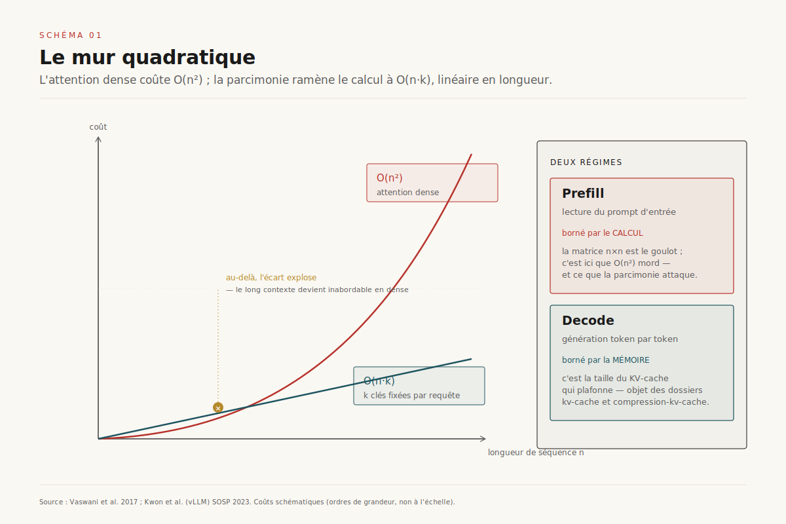
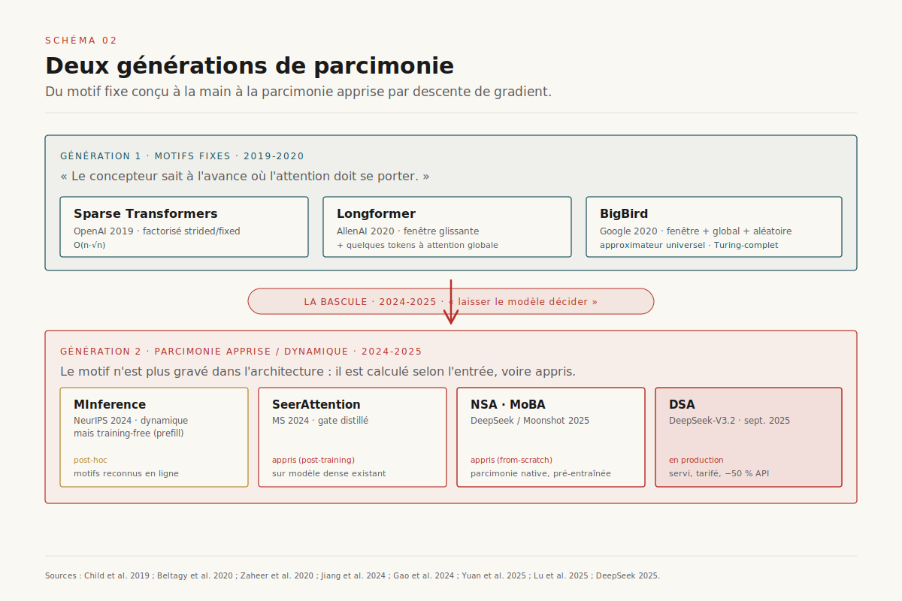
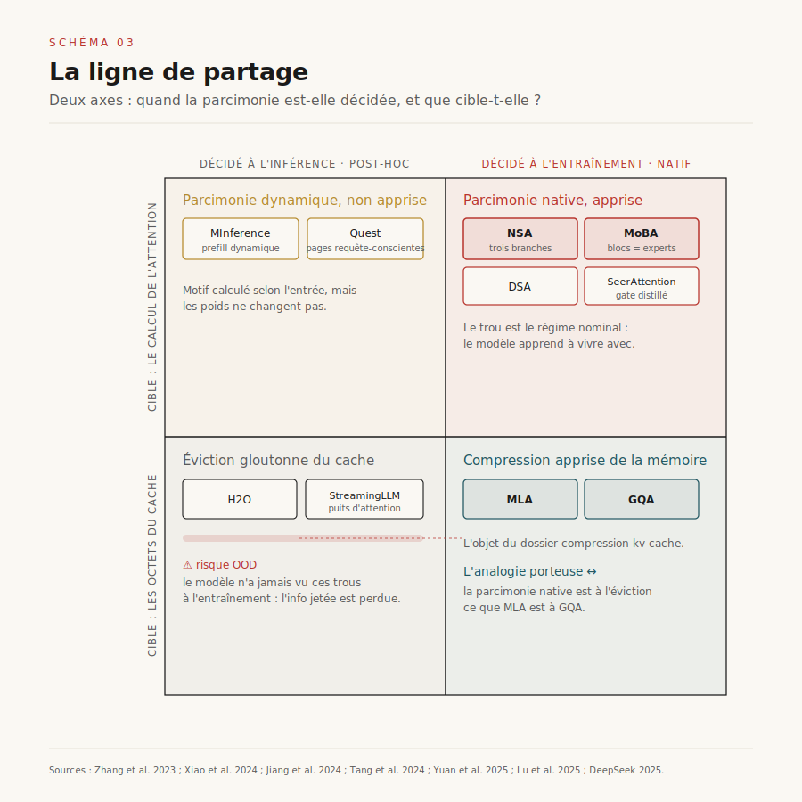
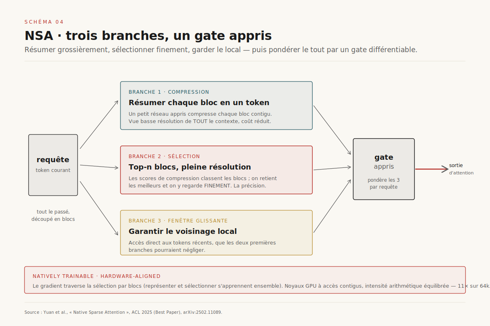
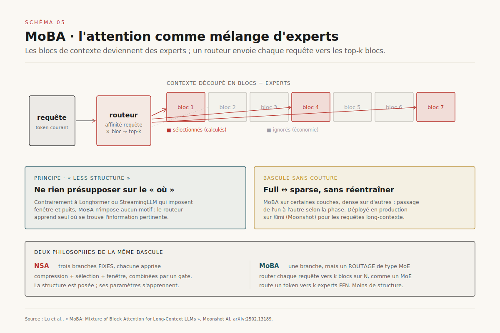
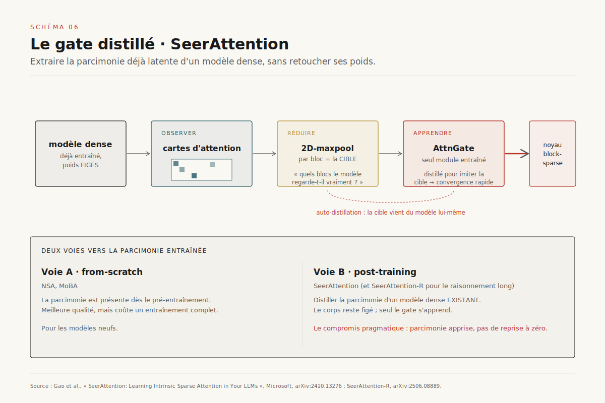
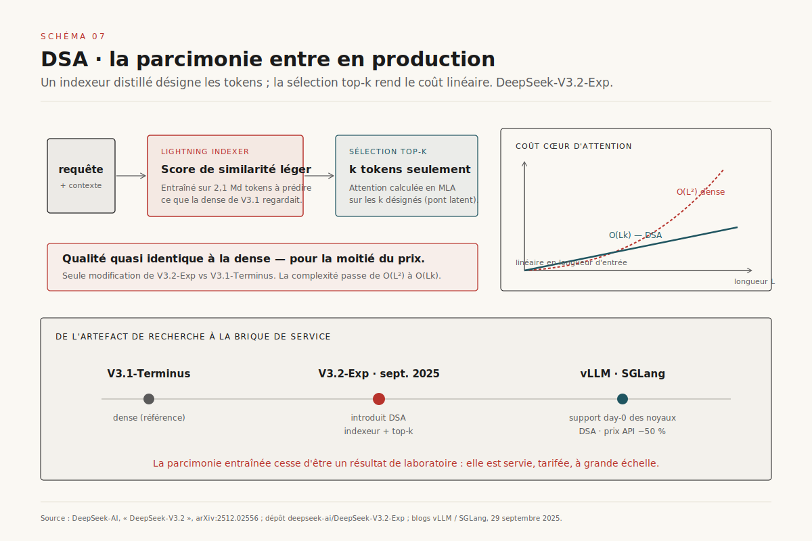

# Ignorer pour lire vite

> **L'attention parcimonieuse a changé de nature : longtemps optimisation greffée à l'inférence, elle est devenue une propriété *entraînée* du modèle — la parcimonie native est à l'éviction ce que MLA est à GQA.** — 22 juillet 2026, Mathieu Guglielmino

*Deep dive prolongeant le dossier [Compresser le KV-cache](../compression-kv-cache/). Là où `compression-kv-cache` réduisait la **taille** d'un cache déjà calculé — partage de têtes, latent, quantification, éviction — celui-ci attaque l'autre moitié du problème : **ne pas calculer** l'attention sur la plupart des tokens. La décision ne descend plus de l'ordonnanceur vers le service ; elle remonte du service vers l'entraînement.*

L'attention est le cœur du Transformer et son péché originel. Chaque token regarde tous les autres : le coût grimpe en carré de la longueur. Pendant huit ans, on a cherché à contourner ce mur en fabriquant des *raccourcis* — ne regarder qu'une fenêtre locale, quelques tokens globaux, un motif fixe décidé à la conception. Ces raccourcis fonctionnaient sur des tâches longues mais restaient une couche greffée, extérieure au modèle. En 2025, une bascule s'opère : la parcimonie cesse d'être un artifice d'inférence pour devenir un **objet appris**, entraîné de bout en bout, aligné sur le matériel. Trois travaux la scellent — NSA (DeepSeek), MoBA (Moonshot), DSA (DeepSeek-V3.2 en production). Ce dossier lit cette bascule serré : ce qu'elle change, pourquoi elle referme un trou que l'éviction gloutonne ne pouvait pas combler, et où elle mène.

## 1. Le mur quadratique

Le mécanisme d'attention calcule, pour chaque token de requête (*query*), un score de compatibilité avec chaque token de clé (*key*), puis une somme pondérée des valeurs (*values*). Sur une séquence de longueur *n*, c'est une matrice *n × n* de scores : le coût de calcul et l'empreinte mémoire des scores croissent en **O(n²)**. Doubler le contexte quadruple le travail. À 128 000 tokens, la matrice d'attention d'une seule tête compte plus de seize milliards d'entrées.

Il faut distinguer deux régimes, car ils ne souffrent pas du même mal. Le **prefill** — la lecture du prompt d'entrée — est *borné par le calcul* (*compute-bound*) : on multiplie de grandes matrices, et c'est là que le O(n²) mord. Le **decode** — la génération token par token — est *borné par la mémoire* (*memory-bound*) : à chaque nouveau token, on relit tout le KV-cache déjà écrit, et c'est sa *taille* qui plafonne le débit.[^1] ==Les dossiers `kv-cache` et `compression-kv-cache` traitaient de la mémoire : rendre le cache plus petit ou mieux paginé. Ce dossier traite du calcul : ne pas parcourir la plupart des clés du tout.== Ce sont deux moitiés distinctes du même problème long-contexte, souvent confondues sous l'étiquette vague « attention efficace ».

L'intuition de la parcimonie est empirique : dans un Transformer entraîné, la matrice d'attention est *presque vide*. La plupart des scores sont négligeables ; l'information utile se concentre sur une poignée de tokens — le début de séquence, le voisinage local, quelques ancres sémantiques.[^11] Si chaque requête ne devait attendre que *k* clés au lieu de *n*, le coût tomberait de O(n²) à **O(n·k)** — linéaire en longueur dès lors que *k* est fixe. Tout l'art de l'attention parcimonieuse tient dans une seule question : *comment choisir ces k clés, sans casser la qualité, et sans que le choix lui-même coûte plus cher que l'économie réalisée ?*

## 2. Deux générations de parcimonie

La première génération, née en 2019-2020, choisit les *k* clés par un **motif fixe, conçu à la main**. Les *Sparse Transformers* d'OpenAI[^6] factorisent l'attention en deux passes — une attention par blocs locaux (*strided*) et une attention sur des positions fixes (*fixed*) — ramenant le coût à O(n·√n). Longformer[^7] combine une **fenêtre glissante** (chaque token regarde ses voisins) avec une poignée de tokens à **attention globale** (le token `[CLS]`, les questions dans un QA). BigBird[^8] ajoute un troisième ingrédient — des **connexions aléatoires** — et démontre que ce triptyque *fenêtre + global + aléatoire* préserve les propriétés théoriques du Transformer dense : c'est un approximateur universel de fonctions séquence-à-séquence, et il est Turing-complet. Reformer[^9], la même année, remplace le motif par un *hachage sensible à la localité* (LSH) qui regroupe dynamiquement les requêtes et clés proches.

Ces méthodes partagent un présupposé : *le concepteur sait à l'avance où l'attention doit se porter*. Une fenêtre de 512, quelques tokens globaux, un peu d'aléatoire. Le motif est un **biais inductif imposé de l'extérieur**. Il marche sur l'encodage (BERT, classification de longs documents) mais résiste mal au décodage génératif, où la structure des dépendances varie d'un token à l'autre et d'une tâche à l'autre.

La seconde génération renverse ce présupposé : *laisser le modèle décider où regarder*. Le motif n'est plus gravé dans l'architecture ; il est **calculé dynamiquement** en fonction de l'entrée, voire **appris** par descente de gradient. C'est là que se joue toute la bascule de 2024-2025. Mais « dynamique » recouvre encore deux mondes très différents, que la section suivante sépare. ==Le clivage porteur n'est pas fixe contre dynamique — c'est *où* la décision de parcimonie est prise : à la conception, à l'inférence sur un modèle figé, ou à l'entraînement du modèle lui-même.==

## 3. La ligne de partage : post-hoc contre entraîné

Prenez un modèle déjà entraîné en attention dense, et rendez-le parcimonieux *après coup*. C'est la voie **post-hoc**, la plus répandue parce que la moins coûteuse : elle ne retouche pas les poids. Elle se décline en deux familles.

Côté **decode**, on évince des tokens du KV-cache. H2O[^12] identifie des *heavy hitters* — les tokens dont les scores d'attention cumulés dominent — et ne garde qu'eux plus une fenêtre récente. StreamingLLM[^11] observe que les tout premiers tokens agissent comme des *attention sinks* (puits d'attention) indispensables à la stabilité, et borne le cache à ces puits plus une fenêtre glissante. SnapKV compresse par tête selon la saillance vue depuis la fin du prompt. Côté **prefill**, MInference[^5] accélère la lecture des longs prompts en reconnaissant en ligne trois motifs récurrents dans les têtes — *A-shape*, *vertical-slash*, *block-sparse* — et applique à chaque tête le masque parcimonieux qui lui correspond, sans jamais toucher aux poids : jusqu'à 10× plus vite sur un million de tokens.

Ces méthodes sont ingénieuses et déployables immédiatement. Mais elles portent un défaut structurel : **le modèle n'a jamais vu ces trous à l'entraînement**. Il a appris à attendre une attention dense ; on lui en sert une trouée. Tant que l'éviction devine juste, tout va bien. Dès qu'elle se trompe — un token évincé qui redevient pertinent 10 000 positions plus loin — le modèle est en situation *hors distribution* (OOD) et n'a aucun recours : l'information a été jetée. ==L'éviction gloutonne est un pari fait à l'aveugle sur le futur d'une génération que le modèle n'a jamais été entraîné à honorer.==

La voie **entraînée** (*natively trainable*, *trained-in*) supprime ce pari. La parcimonie est présente *dès le pré-entraînement* : le modèle apprend, gradient à l'appui, à produire de bonnes sorties *sachant qu'il ne verra qu'une fraction du contexte*. Le trou n'est plus une surprise d'inférence ; c'est le régime nominal. Le gain de généralisation est le même que celui qui sépare, dans le dossier `compression-kv-cache`, MLA de GQA : une compression *apprise et intégrée à l'objectif* domine une compression *plaquée après coup*. **La parcimonie native est à l'éviction ce que MLA est à GQA** — non pas une optimisation de plus, mais un déplacement de la décision vers l'endroit où le modèle peut l'internaliser.

## 4. NSA — l'anatomie des trois branches

*Native Sparse Attention*, primé meilleur article à l'ACL 2025[^2], est la formulation la plus complète de la parcimonie entraînée. Sa réponse à la question « quelles *k* clés » n'est pas *un* mécanisme mais **trois chemins parallèles**, dont un gate appris pondère les sorties pour chaque requête.

Le premier chemin, la **compression**, découpe le passé en blocs contigus et résume chaque bloc en un unique token compressé (via un petit réseau appris). La requête attend alors ces résumés grossiers : une vue à basse résolution de tout le contexte, pour un coût réduit d'un facteur égal à la taille de bloc. Le deuxième chemin, la **sélection**, réutilise les scores de compression pour *classer* les blocs, en retient les *top-n* les plus prometteurs, et y applique une attention **fine, pleine résolution**. C'est ici que se concentre la précision : le modèle regarde finement là où le résumé grossier lui a signalé de l'information. Le troisième chemin, la **fenêtre glissante**, garantit l'accès au voisinage local immédiat, que les deux premiers pourraient négliger.

Deux propriétés font la force de NSA. D'abord, la sélection par blocs est **différentiable** : le gradient traverse le choix des top-n, si bien que le modèle apprend *conjointement* à représenter et à sélectionner. Ensuite — et c'est le mot « hardware-aligned » du titre — les noyaux GPU sont conçus pour que la sélection par blocs produise des accès mémoire contigus et une **intensité arithmétique équilibrée**, dans l'esprit de FlashAttention[^10] : la parcimonie théorique se traduit en accélération réelle, ce qui n'est pas garanti (un motif épars mais irrégulier peut être *plus lent* que le dense sur GPU). Le résultat : un modèle pré-entraîné avec NSA **égale ou dépasse** l'attention dense sur les benchmarks généraux, le long contexte et le raisonnement instruit, tout en étant jusqu'à **11× plus rapide** sur des séquences de 64k, et en s'étendant jusqu'à un million de tokens.[^2]

## 5. MoBA — l'attention comme mélange d'experts

MoBA[^14], publié à quelques jours de NSA, part de la même intuition mais l'habille d'une autre métaphore : et si les blocs de contexte étaient des **experts**, et l'attention un **routeur** à la manière du *mixture-of-experts* ?

Le contexte est découpé en blocs. Pour chaque requête, un routeur léger calcule une affinité avec chaque bloc (via le score entre la requête et une représentation résumée du bloc), puis sélectionne le **top-k** des blocs les plus pertinents ; l'attention n'est calculée que sur eux. Le parallèle avec `melange-experts` est direct : là où le MoE route chaque token vers *k* experts FFN sur *N*, MoBA route chaque requête vers *k* blocs de contexte sur *N*. La parcimonie devient un problème de **routage appris**, avec les mêmes vertus (capacité découplée du calcul) et les mêmes écueils potentiels (équilibrage de charge entre blocs).

La signature de MoBA est son principe de **« moins de structure »** (*less structure*) : contrairement à Longformer ou StreamingLLM qui *imposent* fenêtre et puits, MoBA ne présuppose rien sur *où* se trouve l'information — il laisse le routeur l'apprendre. Autre atout revendiqué : la **bascule sans couture entre attention pleine et parcimonieuse**. On peut activer MoBA sur certaines couches et garder la dense sur d'autres, ou passer de l'une à l'autre selon la phase, sans réentraîner — une souplesse précieuse en production. MoBA est d'ailleurs *déployé* : il sert les requêtes long-contexte de Kimi, l'assistant de Moonshot. Face à NSA — trois branches fixes dont chacune est apprise — MoBA propose **une seule branche, mais dont la sélection est un routage de type MoE**. Deux philosophies de la même bascule.

## 6. La voie de l'adaptation : le gate distillé

NSA et MoBA supposent qu'on pré-entraîne (ou re-entraîne lourdement) un modèle. Or il existe des milliers de modèles denses déjà entraînés. Peut-on leur *greffer* une parcimonie entraînée sans repartir de zéro ? C'est la promesse de SeerAttention[^4].

L'idée : la parcimonie utile est déjà **latente** dans le modèle dense — il suffit de l'extraire. SeerAttention ajoute un module léger, l'**AttnGate**, chargé de prédire quels blocs de clés méritent d'être calculés. Ce gate n'est pas conçu à la main : il est **auto-distillé**. On fait tourner le modèle dense, on récupère ses vraies cartes d'attention, on les réduit par un *2D-maxpool* au niveau des blocs (ce qui donne la cible : « quels blocs le modèle regarde-t-il vraiment ? »), et on entraîne l'AttnGate à reproduire cette cible. Seuls les paramètres du gate sont appris — le corps du modèle reste figé — d'où une convergence rapide et un coût minime. À l'inférence, le gate prédit la parcimonie par bloc, et un **noyau block-sparse compatible FlashAttention** ne calcule que les blocs retenus.

SeerAttention trace ainsi une **troisième voie**, à mi-chemin : ni motif fixe post-hoc (le gate est appris, pas deviné), ni pré-entraînement complet (le modèle n'est pas retouché). ==Entre l'éviction training-free et la parcimonie native from-scratch, la distillation du gate offre le compromis pragmatique : de la parcimonie *apprise* sur un modèle *existant*.== La suite, SeerAttention-R, spécialise l'approche pour le **raisonnement long** — les longues chaînes de pensée où le contexte à parcourir explose. La parcimonie entraînée n'est donc pas réservée aux nouveaux modèles : elle devient une opération d'adaptation.

## 7. La production : DeepSeek Sparse Attention

La preuve qu'une idée d'architecture a mûri, c'est qu'elle entre dans un modèle *servi à grande échelle*. En septembre 2025, DeepSeek publie **V3.2-Exp**, identique à V3.1-Terminus à une exception près : l'introduction de **DeepSeek Sparse Attention (DSA)**.[^3]

DSA repose sur deux composants. Le premier, le **lightning indexer**, est une fonction de similarité pondérée, volontairement légère, dont le rôle est de dire, pour chaque requête, *quels tokens la dense aurait regardés*. Fait remarquable : cet indexeur est **entraîné sur 2,1 milliards de tokens à imiter le comportement de l'attention dense de V3.1-Terminus** — c'est une distillation de la carte d'attention, dans le même esprit que SeerAttention, mais intégrée au pipeline de service. Le second composant, la **sélection fine top-k**, ne calcule l'attention (ici en MLA, l'attention latente de DeepSeek) que sur les *k* tokens désignés par l'indexeur. La complexité cœur passe de **O(L²) à O(Lk)** : le coût d'inférence croît désormais *linéairement* avec la longueur d'entrée.

Les conséquences sont tangibles. Qualité de sortie **quasi identique** à la dense, mais coût divisé : DeepSeek a répercuté l'économie en **baissant ses prix d'API d'environ 50 %**. Et l'écosystème a suivi immédiatement — vLLM et SGLang ont annoncé un **support day-0** des noyaux DSA. ==DSA marque le moment où l'attention parcimonieuse entraînée cesse d'être un résultat de laboratoire pour devenir une brique de service, tarifée et servie en production.== C'est aussi la convergence des fils de ce dossier : un indexeur *distillé* (SeerAttention), une sélection *top-k* (NSA/MoBA), le tout branché sur MLA (`compression-kv-cache`) — la parcimonie du *calcul* et la compression de la *mémoire* co-conçues dans un même modèle.

## 8. Trajectoires 2026-2028

**Parcimonie par défaut.** NSA, MoBA et DSA établissent qu'un modèle *pré-entraîné* parcimonieux égale la dense en qualité pour une fraction du coût long-contexte. L'attention dense complète deviendra probablement l'exception — réservée aux courts contextes ou aux couches où elle reste indispensable — et la parcimonie entraînée, le régime nominal des modèles à contexte long.

**Co-conception sparse × MLA.** DSA le montre déjà : la parcimonie du calcul (ne pas regarder tous les tokens) et la compression de la mémoire (MLA : projeter les clés/valeurs dans un latent) sont deux leviers *complémentaires*, pas concurrents. Le pont vers `compression-kv-cache` est structurel : l'attention se pense désormais comme un **système mémoire couplé**, où l'on décide conjointement *quoi stocker* (latent) et *quoi lire* (sélection top-k).

**Sparse × MoE : la double parcimonie.** MoBA rend l'analogie explicite — router des blocs de contexte, c'est router des experts. Un modèle 2027 pourrait être *doublement creux* : creux dans ses FFN (MoE, `melange-experts`) et creux dans son attention (blocs sélectionnés). La question ouverte est celle de l'équilibrage conjoint de ces deux routages.

**La théorie manque encore.** On sait *empiriquement* que la sélection apprise généralise mieux que l'éviction gloutonne. On ne sait pas *le prouver* : quelle borne sur la dégradation OOD ? quelle garantie qu'un bloc jamais sélectionné à l'entraînement le sera à bon escient à l'inférence ? La parcimonie entraînée attend sa théorie de la généralisation, comme le raisonnement attend sa théorie du modèle du monde (`llm-modele-du-monde`).

**Le banc d'évaluation est périmé.** Long Range Arena, référence de l'ère « efficient transformers », mesure surtout la classification de longues séquences — pas le raisonnement génératif à contexte long. Évaluer la parcimonie entraînée exige des bancs qui piègent l'oubli : rappel d'un fait enfoui loin dans le contexte, raisonnement multi-sauts sur un million de tokens. C'est le prolongement naturel du débat de `benchmarks-contestes`.

L'attention parcimonieuse aura mis huit ans à faire le chemin du raccourci bricolé à la propriété apprise. La leçon dépasse l'attention : à chaque étage de la pile — cache, précision, experts, attention — la même trajectoire se répète. *Ce qu'on plaquait après coup, on finit par l'apprendre.*

---

## Sources

[^1]: Kwon, Woosuk et al. *Efficient Memory Management for Large Language Model Serving with PagedAttention* (vLLM), SOSP 2023. Le régime prefill compute-bound vs decode memory-bound. arXiv:2309.06180.

[^2]: Yuan, Jingyang et al. *Native Sparse Attention: Hardware-Aligned and Natively Trainable Sparse Attention*, ACL 2025 (Best Paper). DeepSeek, Université de Pékin, Université de Washington. Les trois branches (compression, sélection, fenêtre), sélection différentiable, noyaux alignés matériel, 11× sur 64k. arXiv:2502.11089.

[^3]: DeepSeek-AI. *DeepSeek-V3.2* (rapport technique) et dépôt `deepseek-ai/DeepSeek-V3.2-Exp`, septembre 2025. DeepSeek Sparse Attention : lightning indexer distillé sur 2,1 Md tokens, sélection top-k, O(L²)→O(Lk), −50 % prix API. arXiv:2512.02556.

[^4]: Gao, Yizhao et al. *SeerAttention: Learning Intrinsic Sparse Attention in Your LLMs*, Microsoft Research, 2024. AttnGate auto-distillé sur le 2D-maxpool des cartes d'attention, noyau block-sparse. arXiv:2410.13276. Suite : *SeerAttention-R* (arXiv:2506.08889).

[^5]: Jiang, Huiqiang et al. *MInference 1.0: Accelerating Pre-filling for Long-Context LLMs via Dynamic Sparse Attention*, NeurIPS 2024, Microsoft. Motifs A-shape / vertical-slash / block-sparse, masque dynamique par tête, 10× sur 1M tokens, training-free. arXiv:2407.02490.

[^6]: Child, Rewon et al. *Generating Long Sequences with Sparse Transformers*, OpenAI, 2019. Attention factorisée strided/fixed, O(n√n). arXiv:1904.10509.

[^7]: Beltagy, Iz, Matthew Peters, Arman Cohan. *Longformer: The Long-Document Transformer*, Allen Institute for AI, 2020. Fenêtre glissante + attention globale. arXiv:2004.05150.

[^8]: Zaheer, Manzil et al. *Big Bird: Transformers for Longer Sequences*, NeurIPS 2020, Google. Fenêtre + global + aléatoire ; approximateur universel, Turing-complet. arXiv:2007.14062.

[^9]: Kitaev, Nikita, Łukasz Kaiser, Anselm Levskaya. *Reformer: The Efficient Transformer*, ICLR 2020. Attention par hachage sensible à la localité (LSH). arXiv:2001.04451.

[^10]: Dao, Tri et al. *FlashAttention: Fast and Memory-Efficient Exact Attention with IO-Awareness*, NeurIPS 2022. Le socle IO-aware dont NSA hérite la philosophie « hardware-aligned ». arXiv:2205.14135.

[^11]: Xiao, Guangxuan et al. *Efficient Streaming Language Models with Attention Sinks (StreamingLLM)*, ICLR 2024. Les puits d'attention, éviction training-free bornée. arXiv:2309.17453.

[^12]: Zhang, Zhenyu et al. *H2O: Heavy-Hitter Oracle for Efficient Generative Inference of Large Language Models*, NeurIPS 2023. Éviction gloutonne par heavy hitters. arXiv:2306.14048.

[^13]: Tang, Jiaming et al. *Quest: Query-Aware Sparsity for Efficient Long-Context LLM Inference*, ICML 2024. Sélection de pages requête-consciente, pont training-free ↔ sélection par blocs. arXiv:2406.10774.
[^14]: Lu, Enzhe et al. *MoBA: Mixture of Block Attention for Long-Context LLMs*, Moonshot AI, 2025. L'attention-comme-MoE : blocs-experts, routeur top-k, principe « less structure », déployé sur Kimi. arXiv:2502.13189.

