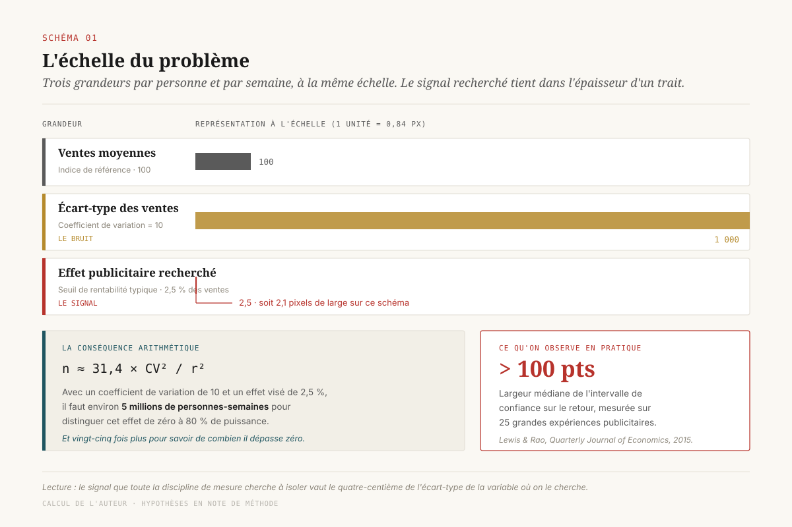

# Ce qu'on renonce à mesurer

> **La puissance statistique est une contrainte de budget et non un réglage technique : une direction qui ignore quel effet minimum ses moyens lui permettent de détecter finance des expériences dont elle lira les non-résultats comme des résultats.** — 4 septembre 2026, Mathieu Guglielmino

## Un plan de mesure commence par une liste de renoncements

Le marché a tranché sur la méthode. Interrogés en 2026, 60 % des décideurs marketing américains placent le test d'incrémentalité indépendant en tête de leur confiance, vingt points devant le modèle de mix et loin devant les tableaux de bord des régies[^12]. Plus de la moitié en réalisent déjà[^11]. La discipline causale a gagné la bataille des idées, et elle l'a gagnée pour de bonnes raisons : trois décennies de travaux ont montré que les méthodes non expérimentales, même nourries de données très riches, ne retrouvent pas l'effet réel de la publicité[^4][^5].

Et pourtant, dans la même enquête, 75 % des responsables du côté acheteur jugent que leurs méthodes de mesure sous-performent[^11]. Le paradoxe mérite mieux qu'une explication par l'immaturité des équipes. ==L'outil auquel le marché fait le plus confiance est aussi celui qu'une majorité d'annonceurs n'a pas les moyens de faire parler.== Ce n'est pas une question de compétence ni d'outillage. C'est une question de taille d'échantillon, et la taille d'échantillon d'une expérience publicitaire, ce sont des euros de média.

Ce dossier propose de traiter le calcul de puissance comme ce qu'il est devenu : un objet de gouvernance, au même titre que le registre des cas d'usage ou le plan média. Il défend une thèse et un livrable.

La thèse : chaque annonceur possède un **seuil d'indétectabilité** propre, calculable, stable d'un exercice à l'autre, en dessous duquel aucune expérience honnête n'est possible avec ses moyens. Ce seuil ne dépend pas des outils du marché. Il dépend de trois grandeurs que la direction connaît déjà : son intensité publicitaire, sa marge, et la volatilité de ses ventes.

Le livrable : la **note de renoncement**, un document annuel de trois pages qui range les questions marketing de l'année en quatre catégories — celles qu'un test peut trancher, celles qu'un modèle peut approcher sous réserve d'être calibré, celles qu'on renonce explicitement à mesurer, et la règle de décision arrêtée à l'avance pour chacune des premières. Elle se signe au même niveau que le plan média, parce qu'elle en est le revers.



## Le chiffre qui devrait ouvrir tout plan de mesure

En 2015, Randall Lewis et Justin Rao publient l'analyse de vingt-cinq grandes expériences publicitaires menées avec des distributeurs et des courtiers américains, la plupart touchant plusieurs millions de clients, pour 2,8 millions de dollars de dépense publicitaire cumulée. Leur résultat central tient en une phrase : ==l'intervalle de confiance médian sur le retour sur investissement dépasse cent points de pourcentage==[^1].

Il faut prendre la mesure de ce que cela signifie en comité. Une expérience médiane de ce corpus, conduite proprement, sur des millions de personnes, avec des données de ventes individuelles, ne permet pas de distinguer un investissement qui perd de l'argent d'un investissement qui en rapporte beaucoup. Elle ne dit pas que la campagne a échoué. Elle ne dit rien.

La cause n'est pas une faute de méthode. Elle est structurelle et Lewis et Rao la nomment : relativement au coût publicitaire par personne, les ventes individuelles sont extrêmement volatiles. Un coefficient de variation de 10 est courant, c'est-à-dire un écart-type des ventes individuelles dix fois supérieur à leur moyenne. Le signal qu'on cherche vaut quelques pour cent de cette moyenne. On cherche une variation de quelques pour cent d'une grandeur dont le bruit vaut mille pour cent. Les auteurs en tirent la conséquence arithmétique : une expérience informative peut facilement exiger plus de dix millions de personnes-semaines[^1].

Deux corpus indépendants ont confirmé depuis que ce n'était pas un artefact du média display en 2015.

Sur la télévision, Bradley Shapiro, Günter Hitsch et Anna Tuchman ont estimé les élasticités publicitaires de 288 marques de biens de grande consommation. Ils trouvent des élasticités nettement plus faibles que celles de la littérature antérieure, une proportion importante d'estimations non significatives ou négatives, et un retour marginal négatif pour plus de 80 % des marques[^2]. Ils prennent soin d'écarter l'explication commode : le résultat n'est pas dû à un manque de puissance ni à une erreur de mesure.

Sur la recherche payante, l'expérience d'eBay conduite par Thomas Blake, Chris Nosko et Steven Tadelis a montré que les annonces achetées sur le nom de la marque n'avaient pas d'effet mesurable à court terme, et que les estimations non expérimentales usuelles surestimaient les retours d'un facteur important[^3]. L'entreprise a coupé la dépense sans que le trafic bouge.

Ces trois travaux ne disent pas la même chose de la publicité. Ils disent la même chose de la mesure : sur ce terrain, l'incertitude est la situation normale, et un résultat net est l'exception qui demande à être expliquée. Une direction qui n'a pas intégré cela lira chaque non-résultat comme une anomalie d'exécution, et demandera un autre test.

## La loi du carré

La mécanique qui produit ces intervalles est élémentaire, et c'est justement pour cela qu'elle mérite d'être écrite noir sur blanc dans un document de gouvernance.

Pour un test à deux groupes de taille égale, la taille totale d'échantillon nécessaire pour détecter un effet relatif *r* avec une puissance de 80 % et un seuil de 5 % s'écrit :

```
n ≈ 31,4 × CV² / r²
```

où *CV* est le coefficient de variation de la variable de résultat (ventes par personne et par semaine, le plus souvent). Avec le *CV* de 10 observé par Lewis et Rao, cela donne 3 140 / r².

La seule chose à retenir de cette formule est le carré au dénominateur. ==Diviser par deux l'effet qu'on veut détecter quadruple la taille de l'expérience.== Passer de 10 % à 1,25 % ne coûte pas huit fois plus cher, mais soixante-quatre fois plus cher.

| Effet visé | Personnes-semaines nécessaires | Multiplicateur |
|---|---|---|
| 10 % | 314 000 | ×1 |
| 5 % | 1 256 000 | ×4 |
| 2,5 % | 5 024 000 | ×16 |
| 1,25 % | 20 096 000 | ×64 |

*(CV = 10, puissance 80 %, seuil 5 % bilatéral. Le détail du calcul est en note de méthode.)*

[SCHEMA-02]

Cette progression a une conséquence budgétaire qui n'est presque jamais tirée. Dans une expérience publicitaire, l'échantillon n'est pas une population qu'on observe : c'est une population qu'on **traite**, ou qu'on prive délibérément de traitement. Le groupe témoin d'un test d'extinction géographique est une région où l'on a coupé la publicité pendant six semaines. Le coût de l'expérience n'est pas le coût de l'analyse. C'est le chiffre d'affaires que la région témoin n'a pas fait, plus le média immobilisé dans un dispositif qui n'optimise pas.

Autrement dit : ==le budget de mesure est du budget média délibérément sacrifié, et il croît comme le carré de la précision qu'on exige.== C'est ce qui distingue radicalement la mesure marketing de la mesure industrielle, où observer davantage coûte du temps de calcul. Ici, observer davantage coûte des ventes.

Cette lecture change la nature de la ligne budgétaire. Un « budget de mesure » présenté comme un coût d'outillage (licences, prestataire d'analyse, temps d'analyste) est mal construit : il représente la partie négligeable de la dépense. La partie qui compte est une provision de média sacrifié, et elle relève du plan média plutôt que du budget des études.

Deux mécanismes permettent de gagner de la puissance sans acheter de l'échantillon, et ils valent d'être connus d'une direction parce qu'ils sont contre-intuitifs.

Le premier consiste à **retirer** de la donnée. Garrett Johnson, Randall Lewis et David Reiley ont montré, sur une expérience de trois millions d'utilisateurs, qu'écarter la moitié des ventes structurellement insensibles à la campagne améliorait la précision de 31 %, l'équivalent d'un échantillon porté à 5,3 millions de personnes. En comparaison, l'ajout de variables explicatives supplémentaires n'apportait que 5 %[^6]. La leçon opérationnelle : l'accumulation de données de contexte est le levier faible, la restriction du périmètre au sous-ensemble susceptible de réagir est le levier fort.

Le second consiste à **choisir** l'échantillon avant de le payer. Les outils de test géographique ouverts intègrent aujourd'hui cette étape. GeoLift simule l'expérience sur l'historique, pour chaque combinaison candidate de marchés traités et témoins, et renvoie l'effet minimum détectable de chacune avant le moindre engagement de budget[^7]. Meridian GeoX, présenté par Google en mai 2026, met en avant exactement le même argument de vente : abaisser l'effet minimum détectable et réduire le budget nécessaire, notamment par une conception à plusieurs cellules partageant un groupe témoin commun[^9][^10].

Il faut mesurer ce que cet argument de vente révèle. ==Les fournisseurs d'outillage ont compris avant les directions que l'effet minimum détectable est la grandeur qui commande le budget.== C'est sur elle qu'ils se différencient. Elle n'est presque jamais écrite dans une note de cadrage.

## Le seuil d'indétectabilité de votre entreprise

Reste la question que la formule ne résout pas seule : quel effet faut-il détecter ?

La réponse par défaut, « le plus petit possible », est un contresens économique. La question utile n'est pas de savoir si la publicité a un effet, mais si elle en a un qui couvre son coût. Cet effet-là se calcule, et il ne dépend d'aucun choix statistique.

Soit *d* la dépense publicitaire par personne et par semaine, *μ* les ventes par personne et par semaine, *m* la marge sur ventes incrémentales. La campagne atteint son seuil de rentabilité quand la marge sur les ventes supplémentaires couvre la dépense, soit un effet relatif :

```
r* = (d / μ) / m
```

Ce **seuil de rentabilité en effet relatif** est la vraie cible de mesure. En dessous, l'annonceur perd de l'argent ; au-dessus, il en gagne. Toute expérience dont l'effet minimum détectable est supérieur à *r\** est incapable de répondre à la seule question qui intéresse un directeur financier.

La formule produit un résultat qui surprend systématiquement en réunion. Le seuil *r\** est **d'autant plus bas que la marge est élevée**. Une marque à 60 % de marge doit distinguer de zéro un effet deux fois plus petit qu'une enseigne à 30 %, pour la même intensité publicitaire. Comme le coût de l'expérience varie comme l'inverse du carré de l'effet, elle doit dépenser quatre fois plus pour savoir si sa publicité est rentable.

==Plus une entreprise est rentable, plus il lui coûte cher de savoir si sa publicité l'est.== Le même mécanisme joue sur l'intensité publicitaire : celui qui dépense peu en média a un seuil bas, donc une mesure difficile. Les deux annonceurs qui mesurent le plus facilement sont ceux qui dépensent beaucoup avec des marges faibles, c'est-à-dire ceux que la question intéresse le moins.

[SCHEMA-03]

Quatre profils, calculés avec les mêmes hypothèses que ci-dessus, donnent l'ordre de grandeur.

| Profil | Intensité (*d/μ*) | Marge | Seuil *r\** | Personnes-semaines pour distinguer *r\** de zéro | Verdict |
|---|---|---|---|---|---|
| Distributeur alimentaire | 1,5 % | 25 % | 6,0 % | ≈ 0,9 M | Testable dans l'année |
| Enseigne spécialisée | 1,0 % | 40 % | 2,5 % | ≈ 5,0 M | Un exercice entier |
| Marque premium | 0,8 % | 60 % | 1,3 % | ≈ 18,6 M | Hors de portée |
| Éditeur de logiciel | 3,0 % | 80 % | 3,8 % | ≈ 2,2 M | Testable dans l'année |

Ces chiffres sont des ordres de grandeur, pas des résultats. Ils reposent sur un coefficient de variation de 10, valeur courante mais pas universelle : les catégories à achat fréquent et panier resserré descendent plus bas, et le coefficient y étant élevé au carré, un *CV* de 5 divise toutes les colonnes par quatre. Le calcul doit être refait sur les données de l'entreprise. Ce que le tableau apporte tient moins à la valeur des cases qu'à leur existence, et au fait qu'elles ne bougent pas d'un exercice à l'autre.

Et il faut aller un cran plus loin, parce que distinguer *r\** de zéro ne suffit pas à piloter. Savoir que la campagne est au moins rentable est une chose ; savoir si son retour est de 20 % ou de 120 % en est une autre, et c'est celle qui commande la réallocation de budget. Résoudre une bande de plus ou moins vingt points de retour autour de *r\** revient à détecter un cinquième de *r\**, donc à multiplier l'échantillon par vingt-cinq. Pour l'enseigne spécialisée du tableau, on passe de cinq millions à cent vingt-cinq millions de personnes-semaines.

C'est exactement le mur que Lewis et Rao ont mesuré empiriquement avec leur intervalle médian de cent points. La formule le retrouve à partir de trois grandeurs de gestion.

## Six questions, six coûts de preuve

Si le seuil est une contrainte fixe, alors le plan de mesure est un problème d'allocation sous contrainte, et il se traite comme tel : en rangeant les questions par ce qu'elles coûtent à trancher.

[SCHEMA-04]

**Un canal entier doit-il continuer d'exister ?** C'est la question la moins chère du portefeuille, parce que l'effet à détecter est l'effet total du canal, la plus grande quantité disponible. Un test d'extinction géographique sur six à huit semaines y répond pour beaucoup d'annonceurs. C'est la question qu'eBay a posée sur ses annonces de marque, et la réponse a été nette[^3].

**Faut-il déplacer du budget d'un canal vers un autre ?** L'écart entre deux canaux est une fraction de l'effet de chacun. L'expérience se conçoit en plusieurs cellules, ce que Meridian GeoX présente comme sa contribution principale : plusieurs traitements contre un groupe témoin commun, ce qui divise le coût par rapport à des tests séparés[^10]. Réalisable, au prix d'un exercice de mesure entier.

**Quel est le bon niveau de dépense sur un canal ?** La courbe de rendement décroissant demande plusieurs points d'intensité, chacun avec sa propre exigence de puissance. Le coût se multiplie par le nombre de points. Hors de portée d'une campagne de test annuelle pour presque tous les annonceurs. C'est là que le modèle de mix prend légitimement le relais.

**Quelle création est la meilleure ?** L'écart entre deux créations d'un même canal est typiquement un ordre de grandeur en dessous de l'effet du canal. La formule du carré fait le reste : cent fois le coût. Cette question est structurellement indécidable par l'expérience de vente, sauf pour les très grandes plateformes qui la traitent sur des volumes hors de portée d'un annonceur.

**Quelle fréquence, quelle séquence ?** Encore un cran en dessous, avec en prime un problème d'identification : la fréquence n'est pas assignable directement, elle résulte du comportement de l'utilisateur. À traiter comme non mesurable et à arbitrer par convention.

**Que rapporte cette audience fine ?** L'échantillon est petit par construction. La question est en général posée à un niveau de granularité où même la plateforme qui la vend ne peut pas y répondre proprement, ce qui n'empêche pas son tableau de bord de renvoyer un chiffre.

Le classement produit un verdict par ligne : testable, testable au prix d'un exercice entier, modélisable sous réserve de calibration, indécidable assumé. ==C'est ce verdict, et non la liste des questions, qui constitue le plan de mesure.== La plupart des plans de mesure que l'on rencontre sont des listes de questions sans verdict, ce qui revient à financer la première ligne et à espérer que les suivantes se résolvent d'elles-mêmes.

## Ce que devient un non-résultat en comité

Supposons le test lancé sans ce travail préalable, et l'intervalle qui en sort : de −15 % à +45 % sur le retour. Voici ce qui lui arrive.

[SCHEMA-05]

**Première lecture fausse : « non significatif, donc ça ne marche pas. »** C'est la confusion entre absence de preuve et preuve d'absence. L'intervalle contient +45 %, un très bon investissement. Le test n'a pas montré que le canal était inefficace, il a montré qu'il ne savait pas. La différence est décisive quand la conclusion sert à couper une ligne budgétaire.

**Deuxième lecture fausse : « le point est à +15 %, donc c'est rentable. »** L'estimation ponctuelle survit à la réunion, l'intervalle n'y survit jamais. Il disparaît d'abord de la note de synthèse, puis du support de comité, et le chiffre finit sa vie dans un tableau de suivi où il a la même apparence qu'une donnée comptable. Le travail de Shapiro, Hitsch et Tuchman rappelle ce qu'on perd au passage : sur 288 marques, une part importante des estimations sont non significatives ou négatives, et le retour marginal est négatif pour plus de 80 % d'entre elles[^2]. Un point médian retenu sans son intervalle est, statistiquement, plus souvent une illusion qu'une information.

**Troisième lecture fausse : le test arrêté au bon moment.** Une expérience qu'on regarde chaque semaine et qu'on arrête à la première traversée du seuil de significativité n'a plus le taux d'erreur qu'elle annonce. Le remède est connu et gratuit : fixer la durée et la règle d'arrêt avant de commencer, et ne pas y toucher.

**Quatrième lecture, la plus coûteuse, et elle est organisationnelle.** Les tests concluants remontent au comité, les autres meurent dans le fichier de l'analyste. Au bout de deux ans, la direction dispose d'une collection de résultats positifs qui ne reflète pas la réalité de ses canaux mais la sélection opérée par le circuit de remontée. Aucune correction statistique ne rattrape cela. Seule une règle d'organisation y remédie : ==le taux de tests concluants est lui-même un indicateur de pilotage, et un taux élevé doit se lire comme une alerte.== Un dispositif de mesure honnête produit une majorité de tests qui ne tranchent pas. S'il n'en produit pas, c'est que quelqu'un choisit ce qui remonte.

## Là où la modélisation prend le relais

Le modèle de mix marketing occupe la place laissée vide, et il l'occupe légitimement. Il répond aux questions que l'expérience ne peut pas atteindre : la courbe de saturation, la rémanence, l'arbitrage entre canaux sur un horizon long. Près de la moitié des annonceurs américains prévoient d'y investir davantage[^11].

Il faut simplement voir la propriété qui le rend à la fois utile et dangereux en gouvernance. ==Un modèle bayésien renvoie toujours une distribution a posteriori. Il ne refuse jamais de répondre.== Là où l'expérience produit un intervalle si large qu'il crève les yeux, le modèle produit un chiffre qui a l'air d'un résultat, et dont la largeur dépend en partie de ce que l'analyste a introduit comme information a priori.

La documentation de Meridian est explicite sur ce point : les lois a priori doivent être informées par la connaissance du domaine, et ==les expériences d'incrémentalité sont la meilleure base pour les formuler==[^8]. C'est la phrase qu'il faut retenir de tout ce dossier, retournée dans le sens de la gouvernance : le modèle n'est pas une alternative aux tests, il en est un consommateur. Sa précision est en grande partie empruntée à celle des expériences qui l'ont calibré. Google a d'ailleurs construit GeoX en amont de Meridian pour cette raison, les résultats des tests géographiques étant reversés au modèle comme lois a priori[^9][^10].

D'où la règle de gouvernance : **la crédibilité d'un modèle de mix se lit dans son plan d'expériences, pas dans sa qualité d'ajustement.** Deux modèles au même ajustement, l'un calibré sur trois tests géographiques documentés, l'autre sur les convictions de l'équipe média, n'ont pas le même statut dans une décision d'allocation. Rien dans la sortie du modèle ne permet de les distinguer.

Reste la tentation de se passer des deux et de revenir aux méthodes observationnelles, moins chères et disponibles immédiatement. Deux travaux ferment cette porte avec une autorité rare. Brett Gordon et ses coauteurs ont comparé, sur quinze expériences et cinq cents millions d'observations utilisateur, les résultats expérimentaux à ceux de plusieurs modèles observationnels usuels : ces derniers ne retrouvent pas l'effet causal[^4]. Ils ont ensuite étendu l'exercice à 663 expériences, avec plus de cinq mille variables utilisateur, soit bien davantage que ce dont dispose un annonceur ou son prestataire de mesure, et des méthodes autrement plus sophistiquées. La conclusion reste qu'une validation expérimentale demeure nécessaire[^5].

Il n'y a donc pas d'échappatoire par le bas. Les trois voies disponibles sont l'expérience, le modèle calibré par l'expérience, et la décision assumée sans preuve. La seule chose qu'une direction puisse faire est de dire laquelle s'applique à quelle question, et de l'écrire.

## La note de renoncement

C'est le document qui manque, et il est court.

[SCHEMA-06]

**Rubrique 1 — Décidable par test.** La liste des questions dont l'effet minimum détectable, calculé sur les données de l'entreprise, est inférieur au seuil de rentabilité *r\**. Pour chacune : la conception retenue, la durée, le budget média sacrifié, et la date de restitution. Cette rubrique est courte. Trois à cinq questions par an est un rythme réaliste pour un annonceur de taille intermédiaire.

**Rubrique 2 — Modélisable sous prior calibré.** Les questions renvoyées au modèle de mix, avec pour chacune l'origine de la loi a priori utilisée : quel test, de quand, sur quel périmètre. Une ligne sans origine est une convention et doit être écrite comme telle.

**Rubrique 3 — Indécidable assumé.** La liste des questions qu'on renonce à mesurer cette année, avec la raison. C'est la rubrique qui donne son nom au document et la seule qui n'existe nulle part aujourd'hui, y compris dans les référentiels de qualité : le cadre du Media Rating Council sur les mesures de résultat traite de la qualité des données et de la transparence des méthodes, et laisse entièrement de côté la puissance dont dispose l'annonceur pour les exploiter[^13]. Elle vaut deux choses. Elle empêche de financer des tests condamnés d'avance. Et elle protège l'équipe de mesure, qui cesse d'être comptable de questions qu'aucun budget ne permettait de trancher.

**Rubrique 4 — Règles de décision pré-enregistrées.** Pour chaque test de la rubrique 1 : le seuil, la durée, la règle d'arrêt, et surtout ce qui sera décidé dans chacun des trois cas possibles, y compris le cas où l'intervalle ne tranche pas. Cette dernière ligne est celle qui manque le plus souvent, et c'est elle qui empêche la première lecture fausse.

La règle générale que ce document formalise est déjà présente dans l'outillage, énoncée par ceux qui vendent les tests géographiques : ne pas lancer un test dont l'effet minimum détectable dépasse l'effet sur lequel on agirait[^7]. Elle n'a pas encore franchi la frontière entre la note technique et la note de cadrage.

Qui la signe ? Le même niveau que le plan média, parce qu'elle arbitre la même ressource. Une note de renoncement signée par le responsable de la mesure n'engage rien : elle constate. Signée par celui qui arbitre le budget média, elle devient l'acte par lequel une organisation accepte de ne pas savoir certaines choses, et décide où placer le peu de certitude qu'elle peut s'offrir.

Une note antérieure de cette série montrait que le mesureur est souvent juge et partie, et qu'il faut négocier un droit de vérification. Une autre montrait que la capacité d'expérimentation géographique se construit comme un actif plutôt qu'elle ne s'achète au coup par coup[^14]. La note de renoncement est ce qui les relie : elle dit combien de vérification cette capacité permet réellement d'exercer.

## Quatre décisions

**D1 · Le budget de preuve est une ligne du plan média, pas un reste du budget des études.** Il se compose du chiffre d'affaires laissé sur la table par les groupes témoins et du média immobilisé ; le coût de l'outillage y pèse peu. Le chiffrer ailleurs revient à le sous-estimer d'un ordre de grandeur, et à découvrir en cours d'exercice qu'on ne peut pas le payer.

**D2 · Aucun test n'est lancé sans son effet minimum détectable écrit avant l'engagement du budget**, et comparé au seuil de rentabilité *r\**. Les deux nombres tiennent sur une ligne. S'ils sont dans le mauvais ordre, le test ne se lance pas, quelle que soit la pression pour « avoir un chiffre ».

**D3 · La règle de décision est pré-enregistrée, y compris pour le cas où l'expérience ne tranche pas.** Et le taux de tests concluants est suivi comme un indicateur de qualité du dispositif : un taux élevé signale une sélection dans ce qui remonte au comité.

**D4 · La note de renoncement est produite chaque année et signée au niveau du plan média.** Trois pages, quatre rubriques. Elle est le seul document qui transforme une contrainte statistique en arbitrage assumé, et elle est presque gratuite à produire une fois le seuil calculé.

## Note de méthode

Le calcul de taille d'échantillon utilisé dans ce dossier est le calcul standard pour la comparaison de deux moyennes sur groupes indépendants de taille égale : par groupe, *n = 2(z<sub>1−α/2</sub> + z<sub>1−β</sub>)² σ² / δ²*, soit environ 15,7 σ²/δ² pour une puissance de 80 % et un seuil bilatéral de 5 %. En écrivant σ = CV·μ et δ = r·μ, la taille totale des deux groupes vaut *n ≈ 31,4 · CV² / r²*. Avec CV = 10, valeur donnée comme courante par Lewis et Rao[^1], on obtient 3 140/r².

Ce calcul suppose une assignation au niveau individuel. Les tests géographiques travaillent sur un nombre bien plus faible d'unités fortement corrélées entre elles, et leur puissance se détermine par simulation sur l'historique plutôt que par formule fermée[^7]. Les ordres de grandeur donnés ici valent comme repères de cadrage et ne dimensionnent aucune expérience.

Le seuil de rentabilité *r\** = (*d/μ*)/*m* suppose que la marge sur ventes incrémentales est constante et que la totalité de l'effet est captée dans la fenêtre de mesure. La rémanence rend cette seconde hypothèse conservatrice : l'effet total est plus élevé que l'effet mesuré, donc le seuil réel est un peu plus favorable que celui calculé. Cela ne change pas les ordres de grandeur.

Les valeurs d'intensité publicitaire et de marge du tableau des quatre profils sont des hypothèses de travail choisies pour être plausibles par secteur, et non des relevés. Elles servent à illustrer la structure du calcul. Toute utilisation opérationnelle demande de les remplacer par les valeurs de l'entreprise, et de réestimer le coefficient de variation sur ses propres données de ventes.

Les chiffres d'enquête cités en ouverture proviennent de relevés déclaratifs auprès de responsables marketing américains[^11][^12]. Ils décrivent des intentions et des perceptions plutôt que des budgets constatés.

## Sources

[^1]: Randall A. Lewis et Justin M. Rao, « The Unfavorable Economics of Measuring the Returns to Advertising », *The Quarterly Journal of Economics*, vol. 130, n° 4, novembre 2015, p. 1941-1973. https://academic.oup.com/qje/article-abstract/130/4/1941/1914592 (consulté le 4 septembre 2026)

[^2]: Bradley T. Shapiro, Günter J. Hitsch et Anna E. Tuchman, « TV Advertising Effectiveness and Profitability: Generalizable Results From 288 Brands », *Econometrica*, vol. 89, n° 4, juillet 2021, p. 1855-1879. https://onlinelibrary.wiley.com/doi/abs/10.3982/ECTA17674 (consulté le 4 septembre 2026)

[^3]: Thomas Blake, Chris Nosko et Steven Tadelis, « Consumer Heterogeneity and Paid Search Effectiveness: A Large-Scale Field Experiment », *Econometrica*, vol. 83, n° 1, janvier 2015, p. 155-174 (document de travail NBER n° 20171). https://www.nber.org/papers/w20171 (consulté le 4 septembre 2026)

[^4]: Brett R. Gordon, Florian Zettelmeyer, Neha Bhargava et Dan Chapsky, « A Comparison of Approaches to Advertising Measurement: Evidence from Big Field Experiments at Facebook », *Marketing Science*, vol. 38, n° 2, 2019, p. 193-225. https://pubsonline.informs.org/doi/10.1287/mksc.2018.1135 (consulté le 4 septembre 2026)

[^5]: Brett R. Gordon, Robert Moakler et Florian Zettelmeyer, « Close Enough? A Large-Scale Exploration of Non-Experimental Approaches to Advertising Measurement », *Marketing Science*, vol. 42, n° 4, juillet 2023, p. 768-793. https://pubsonline.informs.org/doi/abs/10.1287/mksc.2022.1413 (consulté le 4 septembre 2026)

[^6]: Garrett A. Johnson, Randall A. Lewis et David H. Reiley, « When Less Is More: Data and Power in Advertising Experiments », *Marketing Science*, vol. 36, n° 1, 2017, p. 43-53. https://pubsonline.informs.org/doi/10.1287/mksc.2016.0998 (consulté le 4 septembre 2026)

[^7]: Meta (Facebook Incubator), *GeoLift — guide de mise en œuvre*, dépôt public. https://github.com/facebookincubator/GeoLift/blob/main/vignettes/GeoLift_Walkthrough.md (consulté le 4 septembre 2026)

[^8]: Google, « Calibrate treatment priors », documentation Meridian. https://developers.google.com/meridian/docs/advanced-modeling/roi-priors-and-calibration (consulté le 4 septembre 2026)

[^9]: Google Research, « Meridian GeoX: An Open-Source Framework for Precision and Efficiency in Geo Experiments ». https://research.google/pubs/meridian-geox-an-open-source-framework-for-precision-and-efficiency-in-geo-experiments/ (consulté le 4 septembre 2026)

[^10]: Google, « Meridian GeoX: Google's new open-source geo incrementality solution », annonce, mai 2026. https://business.google.com/us/accelerate/announcements/meridian-geox-googles-new-open-source-geo-incrementality-solution/ (consulté le 4 septembre 2026)

[^11]: eMarketer, « MMM, incrementality, and other measurement trends that will define 2026 ». https://www.emarketer.com/content/mmm--incrementality--other-measurement-trends-that-will-define-2026 (consulté le 4 septembre 2026)

[^12]: eMarketer, « Incrementality testing earns marketers' top trust ». https://www.emarketer.com/content/incrementality-testing-earns-marketers--top-trust (consulté le 4 septembre 2026)

[^13]: Media Rating Council, *Outcomes and Data Quality Standards*, septembre 2022. https://mediaratingcouncil.org/sites/default/files/Standards/MRC%20Outcomes%20and%20Data%20Quality%20Standards%20(Final).pdf (consulté le 4 septembre 2026)

[^14]: Mathieu Guglielmino, « L'expérimentation géographique comme actif d'entreprise » (1ᵉʳ août 2026) et « Qui mesure, et pour le compte de qui » (12 août 2026). https://mathieugug.github.io/experimentation-geographique/ et https://mathieugug.github.io/mesure-juge-et-partie/ (consulté le 4 septembre 2026)

---

*Format co-écrit avec l'aide d'une IA.*
