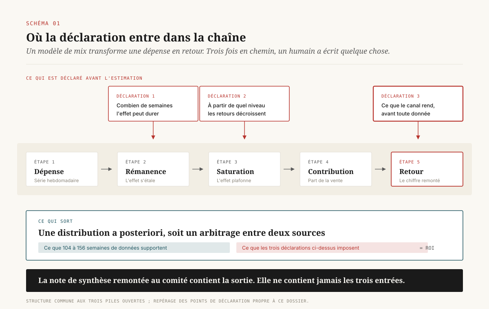
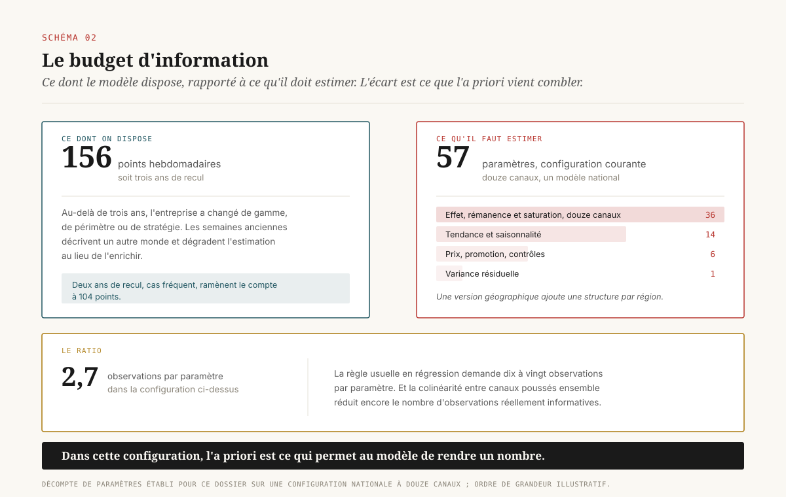

# Ce que le modèle de mix sait avant de voir les données

> **Les trois piles ouvertes de modélisation du mix média partagent la même mathématique et divergent sur ce qu'elles obligent l'annonceur à déclarer avant l'estimation. La décision de direction ne porte pas sur l'outil mais sur l'identité de celui qui écrit l'a priori.** — 25 septembre 2026, Mathieu Guglielmino

---

## 1. Le chiffre qui sort n'est pas une observation

Un modèle de mix média rend, pour chaque canal, un retour sur investissement assorti d'un intervalle de crédibilité. Le télévisé à 2,4, le search à 4,1, l'affichage numérique à 1,3. Ces chiffres circulent ensuite sans leur intervalle, se transforment en pourcentages de réallocation, et finissent dans une diapositive de comité d'investissement où ils occupent la même ligne que le chiffre d'affaires réalisé.

Ils n'ont pourtant pas le même statut. Le chiffre d'affaires est compté. Un résultat d'expérience géographique est mesuré, avec une erreur que le protocole borne. Un ROI issu d'un modèle de mix est ==une distribution a posteriori, c'est-à-dire le produit d'un arbitrage entre ce que les données de l'annonceur supportent et ce que quelqu'un a déclaré avant de les regarder==.

Cette déclaration porte un nom technique, la distribution a priori, et une fonction très concrète : elle comble l'écart entre un problème d'estimation sous-déterminé et la nécessité de rendre un nombre. L'article fondateur de Google sur la modélisation bayésienne du mix l'écrit sans détour : on utilise une approche bayésienne pour mobiliser la connaissance accumulée dans les modèles précédents ou apparentés[^10]. La formulation est honnête. Elle dit que le modèle arrive avec une opinion.

Le problème de gouvernance tient en une phrase. Cette opinion existe dans tous les modèles de mix en production, elle pèse d'autant plus lourd que les données sont pauvres, et elle n'apparaît dans presque aucun livrable remis à une direction générale. On présente le résultat, l'intervalle, la qualité d'ajustement, parfois les courbes de saturation. On ne présente jamais la ligne qui dirait : voici ce que le modèle croyait en arrivant, voici d'où cette croyance vient, voici qui l'a signée.

Ce dossier ne compare pas trois bibliothèques pour désigner la meilleure. Il soutient que la mathématique des trois piles ouvertes dominantes converge, que leur différence réelle porte sur la surface de déclaration qu'elles imposent, et que ==la décision qui engage une direction data porte sur l'attribution du droit d'écrire l'a priori==, bien davantage que sur le choix de la bibliothèque. Cette question devient inconfortable quand on observe qui publie ces outils : les deux premiers vendeurs d'espace publicitaire mondiaux.

---

## 2. Pourquoi l'a priori n'est pas une option de réglage

Il faut d'abord comprendre pourquoi le problème ne se résout pas avec plus de données. La contrainte est structurelle et trois mécanismes distincts s'y superposent.

### 2.1 Le budget d'information

Un modèle de mix national travaille sur des séries hebdomadaires. Deux ans de recul donnent 104 points, trois ans en donnent 156. Au-delà, l'entreprise a changé de périmètre, de gamme ou de stratégie, et les observations anciennes décrivent un autre monde. Chan et Perry, dans l'article de référence de Google sur les limites de l'exercice, ouvrent leur exposé des difficultés par cette question du volume de données disponible[^8].

Face à ces 104 à 156 points, le modèle doit estimer, pour dix à quinze canaux, au minimum trois paramètres chacun : un coefficient d'effet, un paramètre de rémanence qui décrit la décroissance de l'effet publicitaire dans le temps, et un paramètre de saturation qui décrit les rendements décroissants. Il faut y ajouter la tendance, la saisonnalité, les variables de contrôle comme le prix et la promotion, et, dans les versions géographiques, une structure hiérarchique par région.

Le compte est vite fait. ==Le nombre de paramètres à estimer se rapproche du nombre d'observations disponibles, et pour certaines configurations il le dépasse.== Aucune méthode fréquentiste ne rend de résultat exploitable dans cette situation. L'approche bayésienne, elle, en rend un : elle le fabrique en partie à partir de ce qu'on lui a déclaré.

### 2.2 La colinéarité

Les canaux ne bougent pas indépendamment. Un plan média augmente le télévisé et l'affichage numérique en même temps, avant Noël, avant les soldes, au lancement d'une gamme. Sur une série hebdomadaire, deux canaux poussés ensemble pendant deux ans sont statistiquement indiscernables : le modèle peut attribuer l'effet à l'un, à l'autre, ou à n'importe quelle combinaison intermédiaire, avec la même qualité d'ajustement.

C'est la raison pour laquelle Robyn, la pile de Meta, utilise une régression ridge, une forme de régularisation qui rétrécit les coefficients des variables qui bougent ensemble. C'est aussi une déclaration, simplement exprimée autrement : la régularisation impose une préférence pour les petits coefficients, et cette préférence est un a priori sous un autre nom.

### 2.3 L'endogénéité et la sélection

Le mécanisme le plus coûteux est le troisième. Les budgets média ne sont pas tirés au sort. Ils sont planifiés autour du calendrier promotionnel, ajustés à la performance récente, concentrés sur les périodes où la demande est déjà forte. La dépense est donc corrélée avec la vente pour des raisons qui ne doivent rien à la causalité publicitaire.

Chan et Perry emploient une définition volontairement large : ils appellent biais de sélection tout biais dans le mécanisme de sélection du traitement qui se trouve également corrélé avec le résultat, ce qui, dans ce contexte, veut dire potentiellement tout[^8]. Ils donnent l'exemple canonique, le passage télévisé qui génère des recherches, lesquelles alimentent le volume de search payant : un modèle qui estime tous les canaux dans une seule équation attribue au search un effet qui appartient au télévisé.

Un travail publié en août 2026 par Niklas Heusch donne à ce mécanisme un terrain d'essai propre. Il construit un générateur de données synthétiques de vente au détail sur 156 semaines et trois canaux, dans lequel ==la dépense naît de quatre mécanismes de coordination documentés : rétroaction budgétaire trimestrielle, anticipation du calendrier promotionnel, salves télévisées programmées, et poursuite algorithmique de la performance==[^13]. La contribution de ce travail tient à ce qu'il conteste dans les générateurs existants : ils produisent une dépense exogène, et omettent ainsi la difficulté centrale du problème d'estimation. La vérité causale de chaque semaine y est enregistrée, ce qui permet de mesurer l'écart entre l'estimation et le vrai, chose impossible sur données réelles.

### 2.4 La borne de bruit

Reste une limite qui ne dépend d'aucun modèle. Lewis et Rao ont analysé vingt-cinq grandes expériences de terrain menées avec des distributeurs et des courtiers américains, portant ensemble sur 2,8 millions de dollars de dépense publicitaire numérique. Leur résultat est resté le repère du domaine : ==l'intervalle de confiance médian sur le retour sur investissement dépasse cent points de pourcentage, et le plus étroit de l'échantillon dépasse encore cinquante points==[^12]. La cause est la volatilité des ventes individuelles rapportée au coût par personne de la publicité, avec un coefficient de variation de 10 qui n'a rien d'exceptionnel.

La conséquence est brutale pour qui attend d'un modèle qu'il tranche. Si une expérience randomisée, qui est l'instrument le plus puissant disponible, peine à distinguer un retour de 1,5 d'un retour de 2,5, aucun modèle observationnel construit sur les mêmes volumes ne le fera. Ce que le modèle produit en plus de l'expérience ne vient pas des données. Il vient de l'a priori.

---

## 3. Ce que chaque pile oblige à déclarer

Les trois piles ouvertes disponibles en 2026 partagent la même structure : transformation de rémanence, transformation de saturation, régression sur des séries agrégées, estimation d'une contribution par canal. Elles se distinguent sur la surface de déclaration, c'est-à-dire sur ce que l'utilisateur doit écrire avant que l'estimation commence.

### 3.1 Meridian — la déclaration porte sur le résultat

Meridian est la pile de Google, mise à disposition générale le 29 janvier 2025 après une phase de test avec plusieurs centaines de marques, accompagnée d'un programme de plus de vingt partenaires de mesure formés et certifiés[^4]. Elle remplace LightweightMMM, déprécié peu après l'annonce de Meridian en accès restreint en mars 2024.

Son choix de conception est le plus engageant des trois. ==Meridian place l'a priori directement sur le retour sur investissement de chaque canal, et non sur un coefficient de régression intermédiaire.== Le fichier `prior_distribution.py` du dépôt public donne les valeurs par défaut sans ambiguïté : le ROI d'un canal média suit une loi log-normale de paramètres 0,2 et 0,9, et le ROI marginal une log-normale de paramètres 0 et 0,5[^1].

Ce choix a une vertu et un coût. La vertu tient à l'interprétabilité : un directeur média sait ce qu'est un retour de 2, il ne sait pas ce qu'est un coefficient de 0,043 sur une variable transformée par une fonction de Hill. Déclarer sur la grandeur qu'on comprend rend la déclaration discutable, donc contestable, donc gouvernable. Le coût tient à la force de la chose : un a priori posé sur la sortie contraint le résultat plus directement qu'un a priori posé sur un paramètre interne.

### 3.2 Robyn — la déclaration passe par les bornes

Robyn est la pile de Meta, distribuée en R et en Python, toujours activement maintenue en 2026[^6]. Elle n'est pas bayésienne. Elle combine une régression ridge et une optimisation sans gradient des hyperparamètres par Nevergrad, et elle rend non pas un modèle mais un front de Pareto de modèles, entre lesquels l'analyste choisit.

La déclaration existe malgré tout, simplement déplacée. L'utilisateur fixe les bornes des hyperparamètres de rémanence et de saturation pour chaque canal : il dit, par exemple, que la demi-vie de l'effet télévisé se situe entre deux et huit semaines. Ces bornes sont une déclaration au même titre qu'une distribution a priori, avec deux différences. Elles sont uniformes à l'intérieur de l'intervalle, donc moins informatives et moins explicites. Et surtout, ==elles portent sur la forme de l'effet et jamais sur son ampleur==, ce qui rend la déclaration Robyn plus discrète et plus difficile à auditer qu'une déclaration Meridian.

La calibration expérimentale entre par un mécanisme distinct : lorsqu'un résultat d'expérience est fourni, Robyn active un troisième objectif d'optimisation, une erreur en pourcentage absolu entre l'effet impliqué par le modèle et l'effet mesuré par l'expérience. La recherche d'hyperparamètres favorise alors les combinaisons compatibles avec l'expérience. Le mécanisme est élégant, et il transforme la calibration en critère de sélection plutôt qu'en information injectée.

### 3.3 PyMC-Marketing — la déclaration est entièrement à la charge de l'annonceur

PyMC-Marketing est la seule des trois à ne pas être publiée par un vendeur d'espace. C'est une bibliothèque bayésienne générale, où l'utilisateur spécifie chaque distribution a priori et assume chaque choix.

Sa contribution la plus intéressante concerne la calibration. Plutôt que de traduire une expérience en a priori sur le ROI, la méthode `add_lift_test_measurements` ajoute une vraisemblance supplémentaire portant directement sur la courbe de saturation, avec une loi Gamma justifiée par le fait que les courbes de saturation sont monotones croissantes et que les effets mesurés sont positifs[^7]. L'expérience ne dit plus seulement « ce canal rend 2,3 », elle dit « à ce niveau de dépense, cet incrément de budget produit cet incrément de vente », ce qui informe la forme de la courbe et pas seulement son niveau moyen.

La liberté a son revers. ==Une pile qui n'impose aucun défaut ne produit aucune trace de ce qui a été déclaré==, sauf si l'organisation se dote elle-même de la discipline correspondante. Un modèle Meridian mal calibré expose ses défauts dans un fichier public ; un modèle PyMC-Marketing mal spécifié n'expose rien du tout.

---

## 4. Les quarante pour cent par défaut

Il existe dans Meridian un comportement par défaut qui illustre la thèse mieux que n'importe quel raisonnement.

Le ROI se définit comme un résultat incrémental divisé par une dépense. Quand l'indicateur suivi n'est pas du revenu, par exemple un nombre d'inscriptions, de visites en magasin ou de souscriptions, et que l'utilisateur ne fournit pas de valeur monétaire par unité, le ROI n'a plus d'échelle. Un a priori log-normal centré sur 1,2 ne veut alors plus rien dire, puisque l'unité du numérateur est arbitraire.

Meridian résout le problème en changeant de point d'ancrage. Il assigne un a priori commun à tous les canaux, calibré de telle sorte que ==la part de l'indicateur attribuable à l'ensemble du média payant ait une moyenne a priori de 40 % et un écart-type de 20 %==[^3]. Les constantes correspondantes sont dans le code : `P_MEAN = 0.4`, `P_SD = 0.2`[^1].

Il faut dire immédiatement ce que ce choix n'est pas. Ce n'est ni un défaut caché, ni une manœuvre : la documentation l'expose, le code le nomme, et il faut bien choisir quelque chose. Une part de 40 % avec un écart-type de 20 % laisse d'ailleurs une amplitude considérable, de l'ordre du simple au quadruple dans les deux écarts-types.

Le problème est ailleurs. Il tient à ce qu'un modèle lancé dans cette configuration ==arrive en croyant que la publicité payante cause environ deux cinquièmes de l'indicateur suivi, avant d'avoir regardé une seule semaine de données==. Si les données sont informatives, cette croyance s'efface et le résultat est gouverné par l'observation. Si les données sont pauvres, colinéaires ou endogènes, ce qui décrit la situation ordinaire décrite en section 2, le résultat reste proche de la croyance initiale.

[SCHEMA-04]

Et cette information ne remonte pas. Entre l'analyste qui a lancé l'estimation et le directeur qui arbitre la répartition, il y a une note de synthèse, et cette note contient un ROI par canal, un intervalle, une courbe de saturation. Elle ne contient pas la phrase qui dirait qu'en l'absence de calibration sur un indicateur non monétaire, la contribution totale du média a été ancrée à 40 %.

L'ordre de grandeur de ce que cela déplace se calcule sans difficulté. Sur un budget média annuel de 30 millions d'euros et un indicateur de 500 000 conversions, ancrer la contribution totale à 40 % plutôt qu'à 20 % double mécaniquement le retour implicite de l'ensemble du dispositif, et déplace la frontière entre les canaux qu'on renforce et ceux qu'on coupe. Aucune donnée n'a changé.

---

## 5. Qui écrit l'a priori

La question précédente en appelle une autre, qui est la vraie question de gouvernance. Un a priori vient de quelque part. Il y a exactement trois origines possibles, et elles ne se valent pas.

[SCHEMA-05]

### 5.1 L'expérience propre

L'annonceur a mené sa propre expérience géographique : il a coupé ou augmenté la dépense sur un sous-ensemble de régions, conservé un groupe témoin, et mesuré l'écart. Le résultat obtenu devient l'a priori du canal concerné.

C'est l'origine la plus solide et la plus coûteuse. Elle est opposable parce que le protocole est écrit, le périmètre documenté, et le résultat reproductible par un tiers qui dispose des mêmes données. Meridian fournit d'ailleurs un outil dédié, `CalibrationBuilder`, qui traduit un résultat d'expérience en a priori sur le ROI[^2].

### 5.2 Le jugement d'expert

À défaut d'expérience, on reprend l'a priori d'un modèle antérieur, d'un référentiel sectoriel, ou de l'expérience accumulée d'un analyste. C'est la pratique majoritaire, et l'article fondateur de Google l'assume comme telle[^10].

Cette origine n'est pas illégitime. Elle devient problématique pour une seule raison : elle ne laisse pas de trace. Un a priori d'expert ne s'accompagne ni d'un protocole ni d'un intervalle, et ==rien ne distingue, dans le fichier de configuration final, un a priori mesuré d'un a priori supposé==. Le modèle, lui, traite les deux exactement de la même façon.

### 5.3 L'étude du vendeur

La troisième origine est celle qui a changé de nature en 2026. L'a priori provient d'une étude de lift fournie par la plateforme qui vend l'espace du canal concerné.

Le 9 septembre 2026, Google a mis à disposition mondiale Meridian GeoX, une bibliothèque ouverte de conception et d'analyse d'expériences géographiques, dont la sortie alimente directement le modèle de mix Meridian[^5]. L'architecture est cohérente et techniquement bonne : le vendeur d'espace fournit désormais le modèle, l'outil d'expérimentation qui le calibre, et le pont entre les deux. Google précise que GeoX fonctionne indépendamment de la régie testée, ce qui est vrai et important.

Il faut être précis sur la nature de l'objection, parce que la version paresseuse est fausse. ==Les outils de plateforme ne sont pas naïfs, et ils ne cachent pas les biais qui les arrangent.== Google a publié en 2018, sous la signature d'Aiyou Chen et de ses coauteurs, une méthode de correction du biais de sélection du search payant fondée sur le critère de porte arrière de Pearl, appliquée à un diagramme causal au niveau de la requête[^9]. Autrement dit, le vendeur du canal search a publié la correction d'un biais qui gonflait la mesure de son propre canal, et l'a validée par comparaison avec des expériences randomisées. Le même groupe a publié l'article qui recense les limites de l'exercice[^8].

L'objection porte ailleurs. Elle ne concerne ni la méthode ni la bonne foi, mais ==la position : le chiffre qui calibre le modèle est produit par un dispositif dont l'annonceur ne peut ni auditer l'exécution ni reproduire le résultat==. Lorsque l'expérience est menée par l'annonceur, un tiers peut la refaire. Lorsqu'elle est menée par la régie sur son propre inventaire, l'annonceur reçoit un nombre. Le dossier `mesure-juge-et-partie` établissait ce point pour la mesure d'incrémentalité prise isolément. La calibration le déplace d'un cran, parce qu'un a priori entre dans un modèle et n'en ressort plus : il ne figure pas dans le résultat sous forme de ligne séparée, il s'y est dissous.

### 5.4 Le verdict praticable

La conclusion opérationnelle tient en une règle de traçabilité, et non en une interdiction. Une étude de vendeur reste souvent la meilleure information disponible pour un canal donné, et s'en priver dégrade le modèle. Ce qu'il faut, c'est que ==chaque a priori porte son origine dans le livrable, au même titre qu'une immobilisation porte sa date d'acquisition==. Un tableau de trois colonnes suffit : canal, valeur déclarée, origine. La troisième colonne est celle qui n'existe nulle part aujourd'hui.

---

## 6. Ce que la calibration coûte vraiment

La réponse évidente à tout ce qui précède est qu'il faut calibrer par l'expérience. Elle est juste, et elle est plus chère qu'on ne le dit.

[SCHEMA-06]

### 6.1 Le coût n'est pas celui de l'outil

Les bibliothèques d'analyse d'expérience géographique sont gratuites et ouvertes. Le coût réel d'une expérience calibrante tient dans le budget délibérément mal alloué pendant sa durée : les régions témoins reçoivent moins que ce que le plan optimal leur donnerait, ou les régions traitées reçoivent davantage. Sur un canal significatif, une expérience de huit semaines sacrifie un ou deux points de performance sur la période.

Et la borne de Lewis et Rao s'applique. Une expérience sous-dimensionnée rend un résultat non significatif, que la chaîne de décision interprétera spontanément comme l'absence d'effet. Le dossier `budget-de-preuve` traite cette question sous l'angle du seuil d'indétectabilité. La conséquence pour la calibration est directe : ==un canal dont l'effet se situe sous le seuil d'indétectabilité de l'annonceur n'est pas calibrable, et restera gouverné par son a priori, quel que soit le budget de test==.

### 6.2 Le piège d'estimand

Le piège le plus coûteux est technique et Google le signale dans sa propre documentation. `CalibrationBuilder` est conçu pour les expériences qui mesurent un lift incrémental moyen par comparaison à un contrefactuel de dépense nulle. Les expériences qui mesurent un lift marginal contre une dépense réduite ne sont pas recommandées, parce qu'elles introduisent une incompatibilité d'estimand avec le contrefactuel à dépense nulle du modèle[^2].

Traduit en termes de gestion : ==une expérience qui teste « et si on baissait de 20 % » ne calibre pas un modèle qui répond à la question « et si on ne dépensait rien »==. Les deux nombres sont valides, ils ne répondent pas à la même question, et les confondre injecte une erreur systématique dans le modèle sous couvert de le calibrer. Or le protocole d'expérience le plus facile à faire accepter en interne est justement celui de la réduction partielle, parce qu'il est le moins risqué commercialement.

C'est le point où la gouvernance de la mesure rencontre la mécanique du modèle. La question « quel protocole autorise-t-on » a une réponse technique, et elle se décide avant le test, pas après.

### 6.3 La cadence

Un a priori calibré vieillit. Il vieillit avec la créativité, avec la pression concurrentielle, avec les changements d'algorithme des régies, avec la saisonnalité de l'année suivante. Une calibration de 2024 utilisée en 2026 est un jugement d'expert déguisé en mesure.

La conséquence organisationnelle est qu'un plan de calibration ressemble moins à un projet qu'à un calendrier récurrent : un ou deux canaux testés par trimestre, par rotation, avec une règle explicite de péremption. Ce calendrier appartient au plan média, avec sa ligne budgétaire, et non au projet de modélisation.

---

## 7. Ce que la qualité d'ajustement ne dit pas

Reste le mécanisme qui rend tout ce qui précède difficile à détecter de l'intérieur.

[SCHEMA-07]

Les indicateurs qu'un comité regarde sont ceux de l'ajustement : coefficient de détermination, erreur en pourcentage absolu moyen, qualité de la prédiction hors échantillon. Ils mesurent tous la même chose, la capacité du modèle à reproduire la série de ventes observée. ==Aucun ne mesure le biais d'attribution entre canaux, et rien n'empêche un modèle d'ajuster parfaitement la série totale tout en répartissant l'effet entre les canaux de façon entièrement fausse.==

Deux travaux indépendants établissent ce point.

Gordon, Moakler et Zettelmeyer ont analysé 663 expériences à grande échelle menées sur Facebook, en cherchant si des méthodes non expérimentales pouvaient reconstituer les effets expérimentaux servant de référence. Ils ont testé l'apprentissage automatique double débiaisé et l'appariement stratifié sur score de propension. Le résultat est sans ambiguïté : ==bien que la première méthode fasse mieux que la seconde, aucune ne donne de résultat satisfaisant, y compris avec des modèles d'apprentissage profond flexibles pour les composantes de propension et de résultat==[^11]. Ces méthodes disposaient pourtant de données au niveau individuel, infiniment plus riches que les séries agrégées d'un modèle de mix.

Le travail de Heusch aborde le même problème par l'autre bout, en fabriquant une vérité terrain. Son générateur produit 156 semaines de données hebdomadaires de vente au détail sur trois canaux, avec une dépense endogène issue de quatre mécanismes de coordination réalistes, une ligne de base comprenant des composantes saisonnière, de qualité, de prix et de sentiment non observé, et deux transformations de rémanence et de saturation aux paramètres connus[^13]. La décomposition causale vraie de chaque semaine est enregistrée à côté des variables entachées d'erreur qu'un praticien observerait. Un tel dispositif permet de poser la question qui ne se pose jamais sur données réelles : l'estimation retrouve-t-elle ce qui a été généré.

Pour une direction, la conclusion à tirer n'est pas que les modèles de mix sont inutiles. Elle est que ==le tableau de bord de qualité présenté en comité est silencieux sur la seule propriété qui compte pour la décision qu'on s'apprête à prendre==. La seule chose qui informe sur le biais d'attribution est une source d'information extérieure au modèle, et la seule disponible est l'expérience.

---

## 8. Quatre décisions

Ce dossier n'aboutit pas à un classement d'outils. Meridian, Robyn et PyMC-Marketing sont tous trois défendables, et le choix entre eux dépend surtout de la compétence disponible en interne et du langage de l'équipe. Il aboutit à quatre décisions qui se prennent au-dessus de l'outil, et qui survivent à un changement de pile.

### D1 · La fiche d'a priori, jointe au livrable et signée

Tout livrable de modèle de mix porte en annexe un tableau à trois colonnes : le canal, la valeur déclarée avant estimation, et l'origine de cette valeur parmi trois catégories exclusives — expérience propre, jugement d'expert, étude fournisseur. Pour les deux premières, la date. Pour la troisième, le nom du fournisseur.

Cette fiche est ce qui permet de relire un résultat six mois plus tard. Elle coûte une demi-journée à produire, elle est la seule pièce qui rende le modèle contestable, et son absence est le signal le plus fiable qu'un dispositif de mesure n'est pas gouverné.

### D2 · La séparation entre qui écrit l'a priori et qui vend l'espace

Quand un a priori provient d'une étude fournie par la régie du canal concerné, il est utilisé et il est étiqueté comme tel. Un seuil explicite se décide en comité : la proportion du budget média dont l'a priori provient d'une source vendeuse. Au-dessus de ce seuil, la répartition de la dépense est en grande partie déterminée par des chiffres que l'annonceur ne peut pas vérifier.

Cette décision ne demande aucun outillage nouveau. Elle demande que la troisième colonne de D1 existe, et qu'on la somme.

### D3 · La calibration provisionnée dans le plan média

Le budget d'expérimentation calibrante figure dans le plan média annuel, avec une cadence de rotation des canaux et une règle de péremption des a priori. Le protocole retenu est le lift moyen contre contrefactuel nul, et l'écart à cette règle se justifie par écrit, parce que l'expérience marginale est plus facile à faire accepter et ne calibre pas.

Les canaux dont l'effet se situe sous le seuil d'indétectabilité sont listés comme tels, et la note précise qu'ils resteront gouvernés par leur a priori. C'est une information de gestion, pas un aveu d'échec.

### D4 · Le droit de ré-exécution

Le contrat d'agence ou de prestataire prévoit la remise des quatre éléments qui permettent de refaire tourner le modèle : le jeu de données d'entrée, le code, la graine aléatoire, et le fichier d'a priori. Sans ces quatre éléments, un résultat de modèle de mix n'est pas vérifiable, et le fait qu'il soit produit par une bibliothèque ouverte n'y change rien. L'ouverture du code ne garantit la reproductibilité que si la configuration est remise avec.

---

## En un paragraphe

Un modèle de mix média produit un arbitrage entre des données structurellement insuffisantes et une déclaration préalable. Les trois piles ouvertes disponibles partagent la même mathématique et se distinguent par la surface de déclaration qu'elles imposent : Meridian déclare sur le retour lui-même, Robyn par des bornes d'hyperparamètres, PyMC-Marketing laisse tout à l'utilisateur. Un modèle Meridian lancé sans calibration sur un indicateur non monétaire arrive en croyant que le média payant cause 40 % du résultat. Cette croyance s'efface quand les données sont fortes et persiste quand elles sont faibles, ce qui décrit le cas ordinaire. Aucun indicateur d'ajustement ne signale la différence. La décision qui engage une direction data porte donc sur trois colonnes de tableau, un seuil de dépendance aux chiffres du vendeur, une ligne budgétaire de calibration, et une clause de ré-exécution.

---

*Format co-écrit avec l'aide d'une IA.*

## Sources

[^1]: Google, dépôt Meridian, `meridian/model/prior_distribution.py`. Valeurs par défaut : `roi_m` et `roi_rf` en `LogNormal(0.2, 0.9)`, `mroi_m` et `mroi_rf` en `LogNormal(0.0, 0.5)`, `contribution_m` en `Beta(1.0, 99.0)`, `beta_m` en `HalfNormal(5.0)`, `alpha_m` en `Uniform(0, 1)`, `ec_m` en `TruncatedNormal(0.8, 0.8, 0.1, 10.0)` ; constantes de contribution totale `P_MEAN = 0.4` et `P_SD = 0.2`. https://github.com/google/meridian/blob/main/meridian/model/prior_distribution.py (consulté le 25 septembre 2026)

[^2]: Google, *Calibrate treatment priors* et *Set custom ROI priors using past experiments*, documentation Meridian. Décrit l'outil `CalibrationBuilder`, son intégration avec Meridian GeoX, et l'avertissement sur l'incompatibilité d'estimand entre une expérience de lift marginal et un contrefactuel de dépense nulle. https://developers.google.com/meridian/docs/advanced-modeling/roi-priors-and-calibration (consulté le 25 septembre 2026)

[^3]: Google, *When the KPI is not revenue (total paid media contribution prior)*, documentation Meridian. Établit qu'en l'absence de valeur monétaire par unité d'indicateur, un a priori commun est appliqué à tous les canaux de façon à donner à la contribution incrémentale du média payant une moyenne a priori de 40 % et un écart-type de 20 % de l'indicateur. https://developers.google.com/meridian/docs/advanced-modeling/unknown-revenue-kpi-default (consulté le 25 septembre 2026)

[^4]: Google, *Meridian is now available to everyone*, blog.google, 29 janvier 2025. Mise à disposition générale après tests auprès de plusieurs centaines de marques ; programme de plus de vingt partenaires de mesure certifiés. https://blog.google/products/ads-commerce/meridian-marketing-mix-model-open-to-everyone/ (consulté le 25 septembre 2026)

[^5]: *Google Launches Meridian GeoX Globally*, Search Engine Journal, septembre 2026. Disponibilité générale mondiale le 9 septembre 2026 d'une bibliothèque ouverte de conception et d'analyse d'expériences géographiques, indépendante de la régie testée, dont la sortie alimente le modèle de mix. Les gains annoncés par Google, au-delà de 31 % d'économie budgétaire pour les grands annonceurs, proviennent d'étalonnages internes sans revue indépendante ni définition de l'échantillon. https://www.searchenginejournal.com/google-launches-meridian-geox-globally/589030/ (consulté le 25 septembre 2026)

[^6]: Meta Marketing Science, *Robyn — An Analyst's Guide to MMM* et paquet CRAN `Robyn`. Régression ridge, optimisation des hyperparamètres par Nevergrad, front de Pareto multi-objectifs, et activation d'un troisième objectif d'erreur sur les expériences lorsqu'une entrée de calibration est fournie. https://facebookexperimental.github.io/Robyn/docs/analysts-guide-to-MMM/ (consulté le 25 septembre 2026)

[^7]: PyMC Labs, *Lift Test Calibration* et *Mitigating Unobserved Confounders in MMMs with Lift Test Likelihoods*, documentation PyMC-Marketing. Méthode `add_lift_test_measurements`, vraisemblance Gamma appliquée directement à la courbe de saturation, calibration par tests géographiques. https://www.pymc-marketing.io/en/stable/notebooks/mmm/mmm_lift_test.html (consulté le 25 septembre 2026)

[^8]: David X. Chan et Michael Perry, *Challenges and Opportunities in Media Mix Modeling*, Google Inc., 2017. Trois familles de difficultés : limites de données, biais de sélection, spécification du modèle. Définition large du biais de sélection et exemple de l'effet d'entonnoir télévisé vers search payant. https://research.google/pubs/challenges-and-opportunities-in-media-mix-modeling/ (consulté le 25 septembre 2026)

[^9]: Aiyou Chen, David Chan et coauteurs, *Bias Correction For Paid Search In Media Mix Modeling*, arXiv:1807.03292, juillet 2018. Correction du biais de sélection du search payant par application du critère de porte arrière de Pearl à un diagramme causal au niveau de la requête, validée par comparaison avec des expériences randomisées. https://arxiv.org/abs/1807.03292 (consulté le 25 septembre 2026)

[^10]: Yuxue Jin, Yueqing Wang, Yunting Sun, David Chan et Jim Koehler, *Bayesian Methods for Media Mix Modeling with Carryover and Shape Effects*, Google Inc., 2017. Article fondateur de la modélisation bayésienne du mix ; assume explicitement l'approche bayésienne comme moyen de mobiliser la connaissance a priori accumulée dans les modèles antérieurs. https://research.google/pubs/bayesian-methods-for-media-mix-modeling-with-carryover-and-shape-effects/ (consulté le 25 septembre 2026)

[^11]: Brett R. Gordon, Robert Moakler et Florian Zettelmeyer, *Close Enough? A Large-Scale Exploration of Non-Experimental Approaches to Advertising Measurement*, *Marketing Science* 42(4), 2023, p. 768-793. 663 expériences à grande échelle sur Facebook ; l'apprentissage automatique double débiaisé et l'appariement stratifié sur score de propension échouent tous deux à reconstituer les effets expérimentaux, y compris avec des modèles d'apprentissage profond. https://pubsonline.informs.org/doi/abs/10.1287/mksc.2022.1413 (consulté le 25 septembre 2026)

[^12]: Randall A. Lewis et Justin M. Rao, *The Unfavorable Economics of Measuring the Returns to Advertising*, *The Quarterly Journal of Economics* 130(4), novembre 2015, p. 1941-1973. Vingt-cinq grandes expériences de terrain représentant 2,8 millions de dollars de dépense ; intervalle de confiance médian sur le retour supérieur à cent points de pourcentage, le plus étroit dépassant cinquante points ; coefficient de variation des ventes individuelles de l'ordre de 10. https://academic.oup.com/qje/article-abstract/130/4/1941/1914592 (consulté le 25 septembre 2026)

[^13]: Niklas Heusch, *A Synthetic Benchmark Dataset with Endogenous Marketing Spend for Validating Marketing Mix Models*, arXiv:2608.21130, 21 août 2026. Générateur paramétré et instance de référence : 156 semaines, trois canaux, dépense issue de quatre mécanismes de coordination documentés (rétroaction budgétaire trimestrielle, anticipation du calendrier promotionnel, salves télévisées programmées, poursuite algorithmique de la performance) ; décomposition causale vraie enregistrée semaine par semaine. https://arxiv.org/abs/2608.21130 (consulté le 25 septembre 2026)
