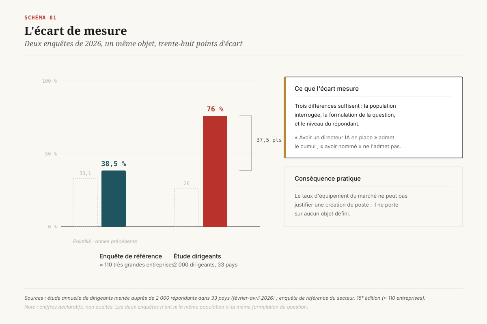
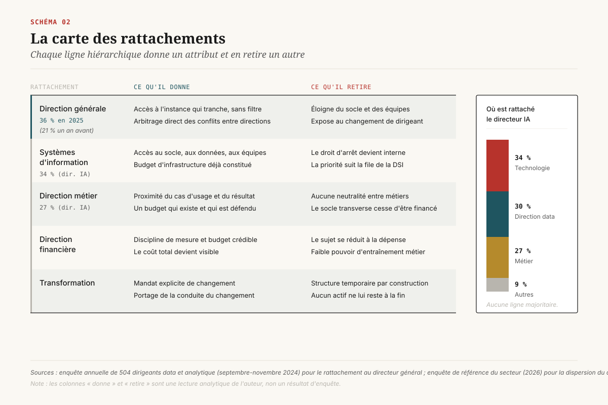
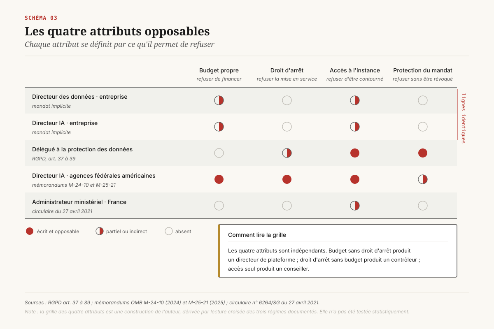
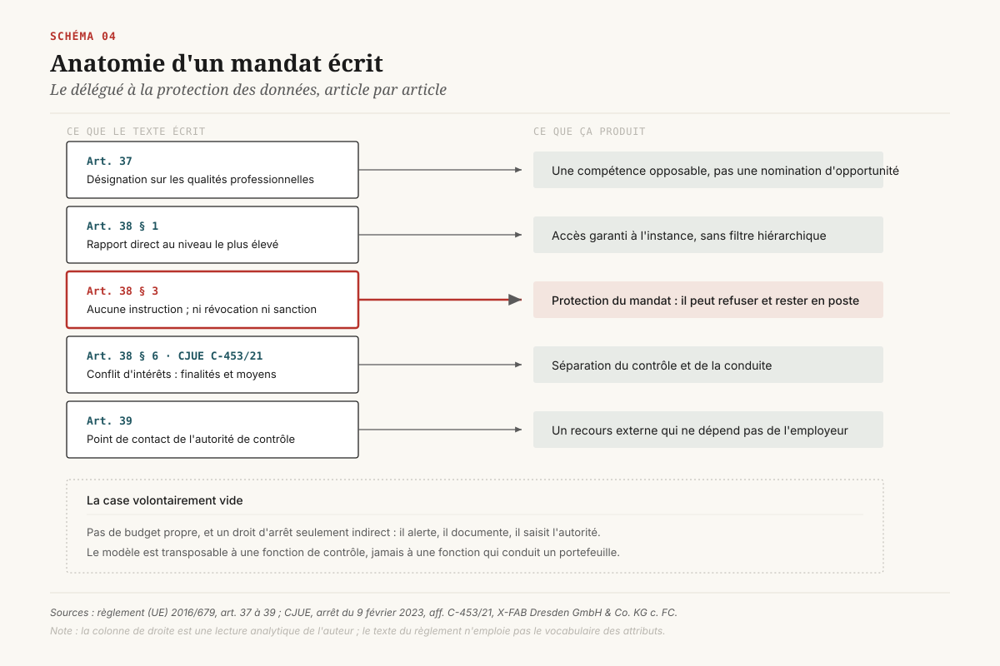

# Quatre lignes dans une lettre de mission

> **Le titre ne mesure rien et le rattachement ne mesure qu'un proxy : ce qui décide du sort d'une direction data/IA, c'est ce qui est écrit et opposable.** — 28 août 2026, Mathieu Guglielmino

Une organisation qui hésite entre nommer un directeur des données, un directeur de l'intelligence artificielle, ou les deux, croit arbitrer un organigramme. Elle arbitre en réalité un document beaucoup plus court et beaucoup plus rare : la lettre de mission. Ce dossier soutient que le contenu de ce document, et non l'intitulé du poste ni la ligne hiérarchique, détermine si la fonction tiendra.

La démonstration s'appuie sur une asymétrie utile. Il existe dans le monde deux fonctions liées à la donnée dont le mandat a été écrit par un législateur ou par une administration centrale, avec des attributs explicites et opposables : le délégué à la protection des données du RGPD, et le directeur de l'intelligence artificielle des agences fédérales américaines. Partout ailleurs, le mandat est implicite. Comparer les trois régimes donne une grille que l'on peut appliquer directement à une nomination d'entreprise.

## 1. Le poste qu'on ne sait pas compter

Deux enquêtes sérieuses ont mesuré la même chose, la même année, et sont arrivées à des résultats séparés par un facteur deux.

L'étude annuelle de l'IBM Institute for Business Value, conduite avec Oxford Economics auprès de 2 000 dirigeants exécutifs dans 33 pays et 21 secteurs entre février et avril 2026, rapporte que 76 % des organisations disposent d'un directeur de l'intelligence artificielle, contre 26 % un an plus tôt[^1]. L'enquête de référence du secteur, quinzième édition d'une série longue portant sur environ 110 très grandes entreprises dont 96 % de répondants au niveau exécutif, rapporte pour la même période 38,5 % d'entreprises ayant nommé un directeur de l'IA ou un équivalent, contre 33,1 % l'année précédente[^2].

Trente-huit et demi contre soixante-seize. Aucune des deux n'est fautive. Elles comptent des choses différentes sous le même mot, et l'écart entre elles mesure exactement ce que le titre ne dit pas.

Trois différences suffisent à expliquer l'essentiel. La population interrogée d'abord : 2 000 dirigeants de toutes tailles et de tous continents d'un côté, une centaine de très grandes entreprises de l'autre. La formulation ensuite : « avoir un directeur IA en place » admet le cumul de fonction, la nomination à temps partiel et le responsable de programme requalifié ; « avoir nommé un directeur IA ou un rôle équivalent » suppose une nomination distincte. Le répondant enfin : un directeur général décrivant son organisation ne répond pas comme un directeur des données décrivant ses pairs. ==Un poste qui produit un écart de mesure de trente-huit points selon la manière dont on pose la question n'a pas encore de définition partagée.==

Le corollaire pratique tombe immédiatement. Les comparaisons sectorielles du type « 76 % de nos concurrents en ont un » ne sont pas exploitables pour justifier une création de poste, parce qu'elles ne portent sur rien de défini. Le point de départ d'une décision d'organisation n'est pas le taux d'équipement du marché. Il est la liste des décisions qu'aujourd'hui personne ne tranche.

## 2. Ce que le rattachement prédit, et ce qu'il ne prédit pas

Le débat sur le rattachement est mieux documenté que celui sur le titre, et il a produit un résultat solide et une nuance qu'on oublie systématiquement de citer avec lui.

Le résultat : dans l'enquête annuelle de Gartner auprès de 504 dirigeants data et analytique du monde entier, conduite de septembre à novembre 2024, la part des directeurs data et analytique rattachés directement au directeur général atteint 36 %, contre 21 % un an auparavant[^3]. La même enquête établit que 70 % d'entre eux portent désormais la stratégie et le modèle opérationnel de l'IA de leur organisation, et projette que d'ici 2027, 75 % de ceux qui ne seront pas perçus comme essentiels au succès de l'IA perdront leur titre au comité exécutif[^3].

La nuance, publiée par la même maison : le rattachement au directeur général corrèle avec le succès, mais les autres lignes hiérarchiques ne l'empêchent pas, et la qualité des relations construites avec les autres dirigeants pèse davantage que la position dans l'organigramme[^4]. Il faut lire cette phrase pour ce qu'elle est. Elle ne dit pas que le rattachement est indifférent. Elle dit que le rattachement est un **indicateur** de quelque chose d'autre, que ce quelque chose d'autre s'obtient parfois autrement, et qu'on ne l'a pas nommé.

Du côté du directeur IA, il n'y a même pas d'indicateur. L'enquête de référence constate une dispersion sans consensus : 34 % rattachés à la direction technologique, 30 % à la direction des données, 27 % à une direction métier, le reste à la transformation[^2]. Trois lignes hiérarchiques différentes se partagent le poste à un tiers chacune. Une fonction dont le rattachement se répartit ainsi n'a pas de doctrine ; elle a des circonstances.

L'administration fédérale américaine offre le contre-exemple le plus net, et il est instructif qu'il aille dans l'autre sens. Dans l'enquête annuelle menée auprès des directeurs des données des agences fédérales, 30 % d'entre eux cumulent la fonction de directeur de l'IA de leur agence, 96 % collaborent au moins mensuellement avec la direction IA et 70 % le font chaque semaine[^5]. Là où les deux fonctions ont chacune une charte écrite, le cumul devient une configuration assumée plutôt qu'un signe de sous-investissement.

Le contrepoint optimiste existe et il faut le lire pour ce qu'il est. Dans une enquête menée auprès de 100 dirigeants d'entreprises réalisant plus d'un milliard de dollars de chiffre d'affaires, 78 % des directeurs data et analytique déclarent que l'IA leur a donné davantage de pouvoir de décision, 94 % attendent une croissance de leur influence dans les douze mois, et 95 % estiment que leur organisation n'exploite pas pleinement la valeur de ses données[^14]. Ces trois chiffres décrivent une perception de trajectoire, non une capacité constatée. Un titulaire peut simultanément gagner en influence perçue et rester incapable de suspendre un système.

## 3. Les quatre attributs opposables

Voici la proposition centrale de ce dossier. Ce que le rattachement indique sans le nommer se décompose en quatre attributs, et chacun se définit par ce qu'il permet de **refuser**. Un attribut qui ne permet de refuser à personne n'existe pas.

**Le budget propre.** Non pas un budget consommé, mais un budget engagé sous sa propre signature, avec un arbitrage interne que le titulaire tranche seul. Le test : le titulaire peut-il financer un chantier dont aucune direction métier ne veut, et couper un chantier qu'une direction métier réclame ? Sans cette double capacité, la fonction est un centre de coûts refacturé, ce qui la rend structurellement incapable de porter un investissement de socle. La grande enquête fédérale montre l'importance de ce poste par sa décrue : la part de directeurs des données citant les ressources financières comme premier besoin passe de 88 % en 2024 à 67 % en 2025, ce qui reste le premier besoin cité[^5].

**Le droit d'arrêt.** La capacité de suspendre un système en production, contre l'avis de son propriétaire métier, sans passer par un arbitrage préalable. C'est l'attribut le plus coûteux à accorder et le plus révélateur. Une organisation qui écrit une politique de niveaux d'autonomie sans désigner qui peut redescendre d'un cran a écrit une charte, pas une politique. Le règlement européen sur l'IA le formule d'ailleurs sans ambiguïté pour les systèmes à haut risque : le déployeur confie la surveillance humaine à des personnes physiques disposant de la compétence, de la formation et de **l'autorité** nécessaires[^11].

**L'accès garanti à l'instance qui tranche.** Non pas le droit d'être invité, mais l'obligation faite à l'instance de l'entendre avant de décider, et la trace de cette audition. La différence entre les deux se mesure le jour où le sujet est impopulaire. C'est l'attribut que le rattachement au directeur général procure le plus souvent par effet de bord, ce qui explique pourquoi il corrèle avec le succès sans en être la cause.

**La protection du mandat.** L'impossibilité de révoquer ou de sanctionner le titulaire pour l'exercice normal de ses missions. Cet attribut paraît exotique dans une entreprise privée. Il est pourtant le seul qui rende les trois autres crédibles dans la durée, parce qu'un droit d'arrêt exercé une fois contre un membre du comité exécutif ne survit pas à l'exercice suivant s'il n'est pas protégé.

Ces quatre attributs sont indépendants les uns des autres, et c'est ce qui rend la grille utile. On peut avoir le budget sans le droit d'arrêt, ce qui produit un directeur de plateforme. On peut avoir le droit d'arrêt sans le budget, ce qui produit un contrôleur. On peut avoir l'accès sans les deux autres, ce qui produit un conseiller. ==Le titre ne dit rien de ces quatre cases ; le rattachement en remplit une par accident ; seule la lettre de mission peut les remplir toutes.==

## 4. La seule fonction data dont le rattachement est écrit dans la loi

Le délégué à la protection des données est, en Europe, la seule fonction liée à la donnée dont les attributs sont fixés par un texte contraignant. Le lire comme un modèle de lettre de mission est plus instructif que de le lire comme une obligation de conformité.

Le RGPD procède en trois temps. L'article 37 impose une désignation fondée sur les qualités professionnelles, en particulier les connaissances spécialisées du droit et des pratiques de la protection des données, et prévoit explicitement que la fonction puisse être exercée par un salarié ou par un prestataire sous contrat de service[^9]. L'article 38 fixe la position : le délégué fait directement rapport au niveau le plus élevé de la direction, ne reçoit aucune instruction concernant l'exercice de ses missions, et ne peut être relevé de ses fonctions ni pénalisé pour l'accomplissement de ses tâches[^9]. L'article 39 énumère les missions et ferme le dispositif en désignant le délégué comme point de contact de l'autorité de contrôle[^9].

Trois des quatre attributs sont donc écrits : l'accès garanti au plus haut niveau, la protection du mandat, et une forme d'autorité de contrôle. La Cour de justice de l'Union européenne a précisé le contour du dispositif dans l'affaire *X-FAB Dresden*, tranchée le 9 février 2023. Un salarié cumulait la présidence du comité d'entreprise et la fonction de délégué pour plusieurs sociétés du groupe ; l'autorité de contrôle régionale a demandé sa révocation. La Cour a jugé qu'un conflit d'intérêts au sens de l'article 38(6) peut exister dès lors que le délégué se voit confier des missions qui le conduiraient à **déterminer les finalités et les moyens** du traitement, l'appréciation revenant au juge national au cas par cas ; et que l'article 38(3) ne s'oppose pas à une législation nationale n'autorisant la révocation que pour motif grave, y compris lorsque la révocation est sans lien avec l'exercice des missions[^10].

Cette décision fait plus que régler un litige social. Elle donne une définition opératoire de l'indépendance qu'aucun cabinet n'aurait produite : ==est indépendant celui qui ne décide pas de ce qu'il contrôle.== Une organisation qui confie à son directeur des données à la fois la construction des systèmes d'IA et le contrôle de leur conformité vient de reproduire exactement la configuration que la Cour désigne comme structurellement viciée, sans qu'aucun texte ne la lui interdise ici.

La quatrième case reste vide, et volontairement. Le délégué à la protection des données ne dispose pas de budget propre, et son droit d'arrêt est indirect : il alerte, il documente, il saisit l'autorité. Il contrôle sans arbitrer. Ce choix du législateur a une conséquence directe pour une direction data : le modèle du délégué n'est pas transposable à une fonction dont on attend qu'elle **conduise** un portefeuille. Il est transposable, en revanche, à la fonction de contrôle qu'il faudra bien loger quelque part, et qui ne peut pas se loger chez celui qui construit.

## 5. La deuxième charte écrite : le directeur IA fédéral américain

Le second cas de mandat écrit vient de l'administration fédérale américaine, et il présente un intérêt méthodologique rare : les deux fonctions y ont été créées à six ans d'écart, avec des chartes explicites, et l'une comme l'autre font l'objet d'un suivi annuel publié. On dispose donc d'un résultat.

Le directeur des données d'agence est une création législative. Le *Foundations for Evidence-Based Policymaking Act* de 2018, codifié au titre 44 du code des États-Unis, impose à chaque agence de désigner un directeur des données choisi parmi les agents non politiques, sur la base d'une formation et d'une expérience démontrées en matière de gestion, de gouvernance, de collecte, d'analyse, de protection, d'usage et de diffusion des données ; le même dispositif crée un conseil interagences dont chaque directeur des données est membre de droit[^6]. La qualité d'agent non politique est un attribut de protection du mandat déguisé : elle soustrait le poste au cycle des nominations.

Le directeur de l'IA est une création administrative. Le mémorandum M-24-10 du 28 mars 2024 impose à chaque agence de désigner un directeur de l'IA et de constituer un conseil de gouvernance de l'IA, de produire un inventaire de tous les cas d'usage de l'IA de l'agence, et de traiter par des procédures renforcées deux catégories définies, les usages ayant une incidence sur les droits et ceux ayant une incidence sur la sécurité ; les dérogations à ces procédures existent, mais elles sont documentées[^7]. Le mémorandum M-25-21 durcit le dispositif : le directeur de l'IA doit disposer d'une autorité budgétaire et d'un pouvoir de décision réels, il occupe dans les agences de rang ministériel un poste de haut encadrement dirigeant, chaque agence publie son plan de conformité ou une déclaration écrite indiquant qu'elle n'utilise pas d'IA couverte, et un conseil des directeurs de l'IA coordonne l'ensemble[^8].

Les quatre attributs sont là, cette fois au complet ou presque : budget, décision, instance dédiée, seuil de grade. Le résultat mérite d'être lu sans complaisance.

Dans la sixième édition de l'enquête annuelle auprès des directeurs des données fédéraux, publiée le 24 mars 2026, 61 % déclarent réussir « très bien » ou « complètement » leur mission, contre 43 % en 2024 et 37 % en 2023[^5]. L'usage de l'IA dans les organisations fédérales passe de 67 % à 78 % en un an. Et 87 % des directeurs des données jugent leurs responsabilités au moins « assez » claires. Mais ==39 % réclament encore de l'administration centrale une clarification de leurs responsabilités et de leurs autorités, huit ans après une loi qui a créé leur poste et défini leurs missions.==

Ce chiffre est la mesure la plus honnête dont on dispose sur le sujet. Il dit que la charte écrite ne suffit pas : elle laisse subsister un tiers de titulaires qui ne savent pas ce qu'ils ont le droit de faire. Il dit aussi, par contraste avec la trajectoire 37 % → 43 % → 61 %, que la charte fait bouger la ligne dans le bon sens et vite. La conclusion pratique n'est pas que l'écriture est inutile ; elle est que l'écriture doit porter sur les autorités plus que sur les responsabilités, parce que ce sont les autorités qui manquent quand tout le reste est en place.

[SCHEMA-05]

## 6. Le cas français : une charte sans attribut

La France a été précoce et l'est restée sur le papier. La circulaire n° 6264/SG du 27 avril 2021 institue une politique publique de la donnée, des algorithmes et des codes sources, et crée dans chaque ministère un administrateur ministériel des données, des algorithmes et des codes sources. Les nominations sont effectives dans tous les ministères au 15 mai 2021, soit moins de trois semaines après la circulaire, et quinze feuilles de route ministérielles sont publiées le 27 septembre de la même année[^13].

Le dispositif est remarquable par sa vitesse d'exécution et par ce qu'il ne tranche pas. Les administrateurs ministériels portent la stratégie de leur ministère sur ces trois objets, coordonnent les acteurs et servent de point de contact aux réutilisateurs. Leur rattachement, en revanche, varie d'un ministère à l'autre selon l'organisation propre de chacun[^13]. La circulaire crée un titre et un réseau ; elle laisse à chaque maison le soin de décider ce que le titulaire aura le droit de refuser.

C'est le cas d'école du mandat sans attribut, et il ne relève d'aucune négligence. Une circulaire du Premier ministre ne peut pas imposer un organigramme interne à quinze ministères sans provoquer une résistance qui aurait retardé de deux ans la nomination des titulaires. L'arbitrage est explicite : on a préféré quinze titulaires en trois semaines à quinze mandats opposables en trois ans. Une direction générale d'entreprise fait exactement le même arbitrage lorsqu'elle nomme un directeur de l'IA avant d'avoir écrit ce qu'il pourra arrêter. La différence est qu'elle ne le formule pas.

## 7. Ce que le règlement européen impose sans créer de poste

Trois obligations européennes déjà en vigueur ou datées exigent une autorité sans désigner de titulaire. C'est la configuration la plus dangereuse pour une organisation, parce que le titulaire finit par être désigné de fait, souvent au mauvais niveau et toujours après l'incident.

L'article 4 du règlement sur l'IA impose aux fournisseurs et aux déployeurs de prendre des mesures pour assurer un niveau suffisant de littératie en matière d'IA chez leur personnel et chez toute personne utilisant les systèmes pour leur compte, ce qui inclut les prestataires et les sous-traitants. Il est entré en application le 2 février 2025, sans période transitoire[^12]. La surveillance et l'exécution par les autorités nationales commencent le 3 août 2026[^12]. Une obligation de formation applicable dix-huit mois avant sa surveillance produit mécaniquement un stock de non-conformité dont personne ne se sent responsable.

L'article 26 est plus direct encore. Le déployeur d'un système à haut risque confie la surveillance humaine à des personnes physiques disposant de la compétence, de la formation et de l'autorité nécessaires, ainsi que du soutien nécessaire[^11]. La lecture opérationnelle de cette phrase est qu'il faut désigner nommément des personnes, documenter leur position dans l'organisation, et leur donner la capacité effective de remplacer, suspendre ou interrompre le fonctionnement du système[^11]. Le texte exige donc un droit d'arrêt, personnel et nominatif, sans dire qui l'accorde ni à quel niveau.

Une organisation a trois manières de répondre. Elle peut loger l'autorité chez le propriétaire métier du système, ce qui est cohérent avec la responsabilité opérationnelle et incohérent avec la neutralité exigée. Elle peut la loger chez une fonction transverse, ce qui suppose que cette fonction dispose d'un droit d'arrêt réel et donc d'une lettre de mission. Elle peut ne rien décider, auquel cas l'autorité échoit par défaut au dernier maillon technique capable d'appuyer sur l'interrupteur, qui n'a ni le grade ni la protection pour le faire contre un directeur métier.

[SCHEMA-06]

## 8. La lettre de mission en sept lignes

Le livrable de ce dossier tient en un document court. Sept lignes, dont chacune doit être signée par la direction générale pour valoir quelque chose. Elles s'appliquent indifféremment à un directeur des données, à un directeur de l'IA ou à un titulaire cumulant les deux ; c'est d'ailleurs le point.

1. **Périmètre d'engagement.** La liste nominative des systèmes et des traitements sur lesquels le titulaire est compétent, et la règle qui fait entrer un système nouveau dans cette liste. Sans règle d'entrée, le périmètre se referme sur ce qui existait au jour de la nomination.
2. **Budget propre et seuil de signature.** Le montant engagé sous la seule signature du titulaire, et le seuil au-delà duquel il remonte. Un budget sans seuil écrit est un budget refacturé.
3. **Droit d'arrêt et procédure de reprise.** Ce que le titulaire peut suspendre seul, sous quel délai il doit en rendre compte, et qui décide de la reprise. La procédure de reprise est la partie que les organisations oublient, et c'est elle qui rend le droit d'arrêt utilisable plus d'une fois.
4. **Accès à l'instance.** L'obligation faite au comité qui arbitre le portefeuille d'entendre le titulaire avant toute mise en production d'un système de la liste, et la trace écrite de cette audition. Le droit d'être entendu se distingue du droit d'être invité par sa trace.
5. **Séparation du contrôle et de la conduite.** La désignation d'un tiers, interne ou externe, chargé du contrôle de conformité des systèmes que le titulaire fait construire. La jurisprudence européenne sur le délégué à la protection des données donne le critère : nul ne contrôle les finalités et les moyens qu'il détermine[^10].
6. **Protection du mandat.** La durée du mandat, les motifs de révocation, et l'exclusion explicite de l'exercice normal des missions parmi ces motifs. Une entreprise privée n'a pas le dispositif du RGPD à sa disposition, mais elle peut écrire une clause de durée et une obligation de motivation.
7. **Critère de sortie.** Ce qui, au bout de dix-huit mois, fera conclure que la fonction doit être fusionnée, transférée ou supprimée. Écrit à la nomination, ce critère vaut mieux que la projection selon laquelle trois quarts des titulaires non perçus comme essentiels perdront leur titre[^3] : il transforme une menace subie en jalon négocié.

### Cinq décisions, classées par réversibilité

**Réversible en une réunion.** Recenser les décisions qu'aujourd'hui personne ne tranche, avant de discuter d'un titre. La liste fait généralement entre quatre et dix lignes et elle rend la conversation sur l'organigramme beaucoup plus courte.

**Réversible en un trimestre.** Écrire les lignes 3 et 4 de la lettre de mission pour le titulaire actuel, quel que soit son intitulé. Ce sont les deux qui coûtent le moins cher à accorder et qui produisent le plus d'effet, parce qu'elles ne déplacent aucun budget.

**Réversible en un exercice.** Séparer le contrôle de la conduite. La séparation coûte un poste ou un contrat de prestation ; ne pas l'opérer coûte la crédibilité du dispositif entier le jour du premier incident.

**Difficilement réversible.** Créer un poste de directeur de l'IA distinct de la direction des données. Le cumul assumé est une configuration documentée et majoritairement fonctionnelle chez ceux qui disposent d'une charte écrite[^5] ; la séparation crée une frontière qu'il faudra arbitrer chaque semaine, et dont le coût de coordination est permanent.

**Irréversible à l'échelle d'un mandat.** Nommer sans écrire. Un titulaire installé sans attribut consomme la crédibilité de la fonction, et son successeur héritera d'un poste que l'organisation aura appris à contourner. C'est le seul scénario de cette liste dont on ne revient pas en changeant de personne.

[SCHEMA-07]

## Ce qu'il faut retenir

Le débat public sur ces fonctions se joue sur deux terrains qui ne décident de rien. Le premier est l'intitulé, dont on a vu qu'il ne constitue même pas un objet mesurable, deux enquêtes solides trouvant 38,5 % et 76 % la même année. Le second est le rattachement, dont on sait qu'il corrèle avec le succès sans le conditionner, et dont les praticiens qui l'ont mesuré disent eux-mêmes qu'il compte moins que la qualité des relations construites autour.

Le terrain qui décide est un document que la plupart des organisations n'écrivent pas. Les deux endroits au monde où il a été écrit, le délégué à la protection des données européen et le directeur de l'IA fédéral américain, donnent des modèles opposés et complémentaires : le premier protège un contrôleur et lui refuse le budget, le second dote un conducteur d'un budget et d'un pouvoir de décision. Aucun des deux n'a produit un dispositif parfait, et le taux de 39 % de titulaires fédéraux qui réclament encore une clarification de leurs autorités interdit de vendre la charte comme une solution.

Elle reste néanmoins la seule variable sur laquelle une direction générale a prise. Le titre est du vocabulaire, le rattachement est un symptôme, et l'autorité est une signature.

## Note de méthode

Ce dossier a été rédigé dans un environnement dont la politique de sortie réseau bloque la récupération automatique des pages : les sites de Gartner, du MIT Sloan Management Review, de Wavestone, de la Maison-Blanche, d'EUR-Lex, de Wikipédia et l'hébergeur du rapport d'enquête de référence ont tous renvoyé un blocage. Les chiffres cités proviennent donc de résultats de recherche et de reprises secondaires, recoupés sur au moins deux formulations indépendantes lorsque c'était possible. Ils sont à vérifier à la source avant toute réutilisation dans un document engageant.

Trois réserves supplémentaires méritent d'être portées. Les enquêtes d'éditeurs et de cabinets citées ici (IBM, Gartner, Deloitte, et l'enquête de référence du secteur) sont des **déclarations de dirigeants** sur leur propre organisation, non des mesures auditées ; les taux de réussite déclarés en particulier sont des auto-évaluations, ce qui vaut aussi pour les 61 % de l'enquête fédérale. La projection de Gartner sur 2027 est une prévision de cabinet, pas un constat, et elle est citée comme telle. Enfin, l'application des mémorandums américains a connu depuis 2024 des inflexions politiques dont ce dossier ne traite pas : la lecture proposée ici porte sur le **contenu des chartes** en tant que modèles de mandat, non sur la trajectoire administrative de leur mise en œuvre.

Une dernière limite tient au raisonnement lui-même. La grille des quatre attributs est une construction de l'auteur, dérivée par lecture croisée des trois régimes documentés. Elle n'a pas été testée statistiquement contre les issues de carrière des titulaires, et aucune des sources citées ne la valide en tant que telle. Elle vaut comme instrument de rédaction d'une lettre de mission, non comme modèle prédictif.

## Sources

[^1]: IBM Institute for Business Value, *2026 CEO Study*, réalisée avec Oxford Economics auprès de 2 000 dirigeants exécutifs dans 33 pays et 21 secteurs, février-avril 2026. https://newsroom.ibm.com/2026-05-04-ibm-study-ceos-are-reshaping-c-suite-roles-for-the-ai-era

[^2]: *2026 AI & Data Leadership Executive Benchmark Survey*, quinzième édition annuelle, environ 110 grandes entreprises, 96 % de répondants au niveau exécutif, décembre 2025. Série longue de référence sur les fonctions data et IA. https://www.wavestone.com/en/insight/data-ai-executive-leadership-survey-2024/

[^3]: Gartner, *CDAO Agenda Survey 2025*, 504 dirigeants data et analytique dans le monde, enquête conduite de septembre à novembre 2024, communiqué du 12 mai 2025. https://www.gartner.com/en/newsroom/press-releases/2025-05-12-gartner-survey-finds-seventy-percent-of-cdaos-are-responsible-for-artificial-intelligence-strategy-and-operating-model

[^4]: Gartner, *Align CDAO Reporting Lines to Create Maximum Business Value*, note de recherche. https://www.gartner.com/en/documents/6406975

[^5]: Data Foundation et Deloitte, *Navigating Transition and Change: 2025 Survey of Federal Chief Data Officers*, sixième édition annuelle, publiée le 24 mars 2026. https://datafoundation.org/news/reports/825/825-Navigating-Transition-and-Change-2025-Survey-of-Federal-Chief-Data-Officers

[^6]: *Foundations for Evidence-Based Policymaking Act of 2018* (P.L. 115-435), codifié 44 U.S.C. § 3520 (directeurs des données d'agence) et § 3520A (conseil des directeurs des données). https://uscode.house.gov/view.xhtml?req=granuleid%3AUSC-prelim-title44-section3520&num=0&edition=prelim

[^7]: Office of Management and Budget, mémorandum M-24-10, *Advancing Governance, Innovation, and Risk Management for Agency Use of Artificial Intelligence*, 28 mars 2024. https://www.whitehouse.gov/wp-content/uploads/2024/03/M-24-10-Advancing-Governance-Innovation-and-Risk-Management-for-Agency-Use-of-Artificial-Intelligence.pdf

[^8]: Office of Management and Budget, mémorandum M-25-21, *Accelerating Federal Use of AI through Innovation, Governance, and Public Trust*, 2025. https://www.whitehouse.gov/wp-content/uploads/2025/02/M-25-21-Accelerating-Federal-Use-of-AI-through-Innovation-Governance-and-Public-Trust.pdf

[^9]: Règlement (UE) 2016/679 (RGPD), articles 37 (désignation), 38 (fonction du délégué à la protection des données) et 39 (missions). https://gdpr-info.eu/art-38-gdpr/

[^10]: Cour de justice de l'Union européenne, arrêt du 9 février 2023, affaire C-453/21, *X-FAB Dresden GmbH & Co. KG contre FC*, sixième chambre, sur renvoi préjudiciel du Bundesarbeitsgericht. https://op.europa.eu/en/publication-detail/-/publication/2f0db45e-cc3a-11ed-a05c-01aa75ed71a1/language-en

[^11]: Règlement (UE) 2024/1689 (règlement sur l'intelligence artificielle), article 26, obligations incombant aux déployeurs de systèmes d'IA à haut risque. https://ai-act-service-desk.ec.europa.eu/en/ai-act/article-26

[^12]: Règlement (UE) 2024/1689, article 4, maîtrise de l'IA, applicable depuis le 2 février 2025 ; surveillance par les autorités nationales à compter du 3 août 2026. https://digital-strategy.ec.europa.eu/en/policies/ai-talent-skills-and-literacy

[^13]: Circulaire n° 6264/SG du 27 avril 2021 relative à la politique publique de la donnée, des algorithmes et des codes sources, et réseau des administrateurs ministériels (Etalab). https://www.etalab.gouv.fr/administrateur-general-des-donnees

[^14]: Deloitte, *Chief Data and Analytics Officer Survey*, 100 dirigeants d'entreprises réalisant plus d'un milliard de dollars de chiffre d'affaires, enquête menée d'août à septembre 2025, publiée le 3 mars 2026. https://www.deloitte.com/us/en/about/press-room/chief-data-and-analytics-officer-survey-finds-cdaos-acting-as-ai-trailblazers.html

---

*Format co-écrit avec l'aide d'une IA.*
