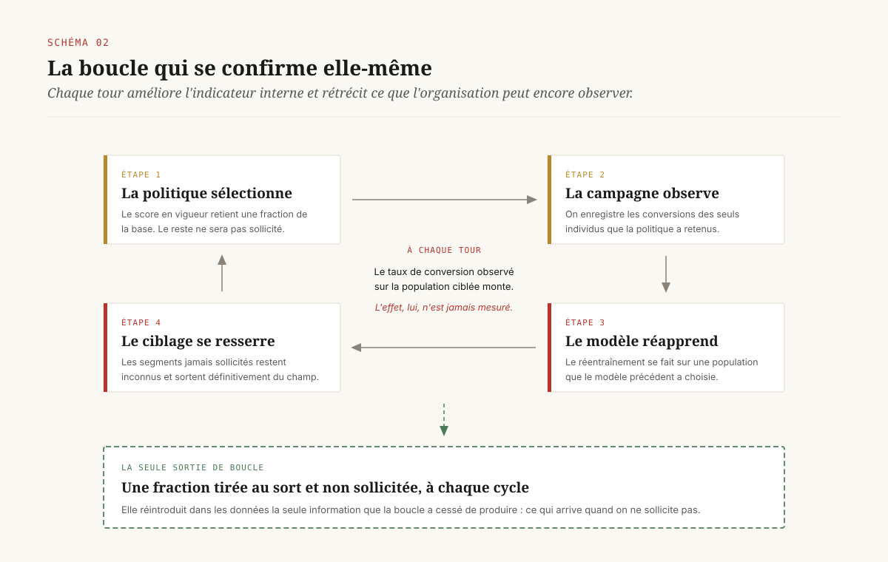
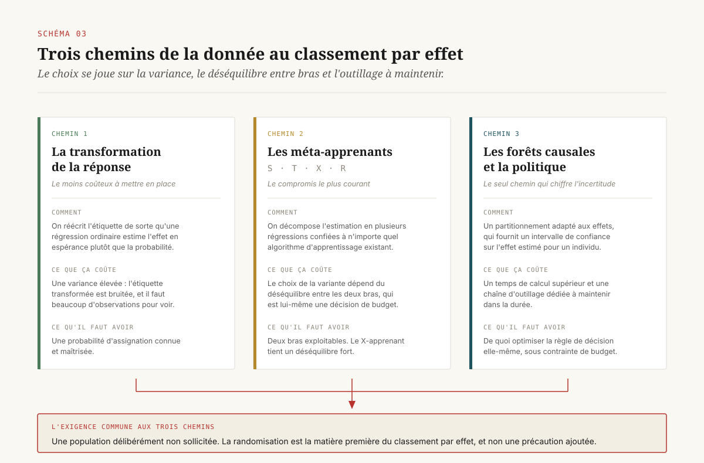
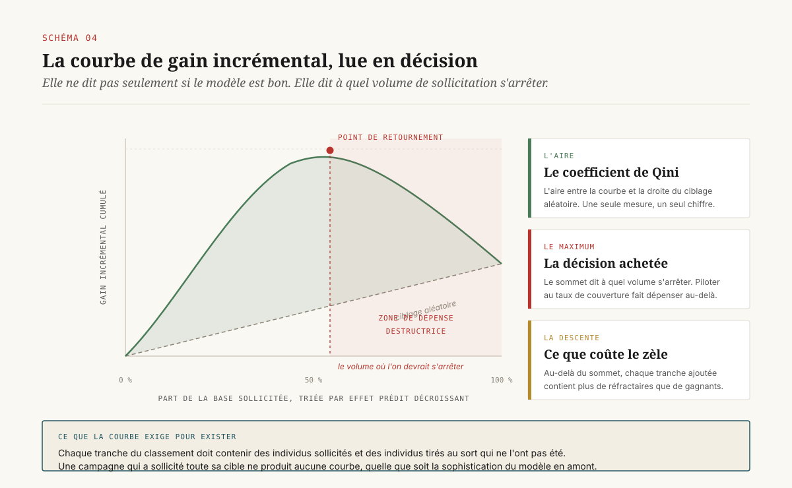

# Cibler ceux qu'on fait changer d'avis

> **Un modèle de ciblage classe des probabilités d'achat ; une politique de ciblage devrait classer des effets. Les deux se confondent en production parce que l'effet individuel n'existe nulle part dans l'entrepôt et ne s'évalue pas sans assignation aléatoire.** — 23 septembre 2026, Mathieu Guglielmino

## Synthèse exécutive

- **La question posée aux équipes data n'est presque jamais la bonne.** On demande qui va acheter. La décision porte sur qui achète *parce qu'on lui a parlé*. Les deux classements coïncident rarement, et l'écart se paie sur le budget promotionnel.
- **Deux travaux fondateurs disent la même chose sur deux terrains opposés.** Chez eBay, l'essentiel de la dépense publicitaire se concentrait sur des acheteurs dont le comportement n'était pas modifié par la publicité, avec un rendement moyen négatif à la clé[^1]. En rétention, cibler les clients au plus fort risque de résiliation s'est révélé inefficace ; ce qui fonctionne est de cibler la sensibilité à l'intervention[^2].
- **La confusion est structurelle.** L'effet d'une sollicitation sur un individu n'est jamais observé : on voit ce qui s'est passé, et jamais ce qui se serait passé autrement. Aucune colonne de l'entrepôt ne porte cette information, et un modèle de propension entraîné sur l'historique apprend en partie la trace des ciblages précédents.
- **Changer d'objet coûte de la randomisation.** Estimer un effet conditionnel se fait par transformation de la variable de réponse, par méta-apprenants ou par forêts causales[^7][^8][^9]. Les trois familles diffèrent par leur robustesse ; aucune ne dispense d'un groupe d'individus délibérément non sollicités.
- **Le verrou se situe à l'évaluation plutôt qu'à l'estimation.** Un classement par effet ne se valide pas hors ligne comme un classement par probabilité. Les mesures de référence se calculent contre un témoin[^11], et l'évaluation hors politique permet de comparer un grand nombre de politiques candidates sur un seul jeu de données randomisé[^3].
- **La ligne budgétaire qui manque est le témoin permanent.** ==Une politique de ciblage sans population témoin maintenue dans la durée n'est pas une politique vérifiable : c'est une hypothèse qui s'auto-confirme.== Son coût est calculable ; son absence l'est beaucoup moins.
- **La régie a pris l'avantage sur ce terrain.** Depuis 2025, les grandes plateformes proposent d'optimiser directement sur l'incrémental estimé, à partir d'un modèle calibré sur leurs propres tests d'incrémentalité[^12]. Le conflit d'intérêt documenté sur la mesure remonte d'un cran : la plateforme ne se contente plus de mesurer son effet, elle décide à qui parler en fonction de l'effet qu'elle s'attribue.

## 1. La question qui n'est jamais posée au comité

Le cadrage d'un cas d'usage de ciblage se déroule presque toujours de la même façon. Une direction commerciale dispose d'un budget de sollicitation : des coupons, des relances, une campagne de rétention, un budget média. Elle demande à l'équipe data de lui dire *où le mettre*. L'équipe construit un score, le valide sur un échantillon de contrôle temporel, obtient une aire sous la courbe honorable, et livre une liste triée. La campagne part sur les premiers déciles. Le taux de conversion observé sur la population ciblée est supérieur à la moyenne. Le cas d'usage est classé en succès.

Rien dans cette chaîne ne vérifie que la sollicitation a produit quoi que ce soit. Le score a répondu à la question « qui va acheter », et la population retenue achète effectivement plus que la moyenne. Il se peut qu'elle ait acheté sans rien recevoir.

Deux travaux de référence ont mis ce mécanisme en évidence sur des terrains sans rapport l'un avec l'autre.

Le premier porte sur la publicité de recherche. Blake, Nosko et Tadelis ont conduit chez eBay une expérience de grande échelle consistant à couper la dépense sur des zones entières, puis à comparer[^1]. Sur les mots-clés de marque, l'effet à court terme n'était pas mesurable : les personnes qui tapaient le nom de l'enseigne arrivaient de toute façon. Sur les mots-clés hors marque, l'effet existait, mais il était concentré sur les utilisateurs nouveaux et peu fréquents, alors que la dépense, elle, se concentrait sur les utilisateurs fréquents dont le comportement d'achat n'était pas modifié. Le rendement moyen en ressortait négatif, et les estimations non expérimentales le surestimaient massivement, parce que les clics de recherche et l'intention d'achat varient ensemble.

Le second porte sur la rétention. Ascarza a combiné deux expériences de terrain avec des méthodes d'apprentissage statistique pour tester la pratique dominante : identifier les clients au plus fort risque de départ et leur adresser une offre[^2]. Le résultat contredit la pratique. Les clients au risque le plus élevé ne sont pas les meilleures cibles d'un programme de rétention. La recommandation qui en découle est de concentrer l'effort de modélisation sur l'hétérogénéité de *réponse à l'intervention* et de cibler sur la sensibilité, indépendamment du niveau de risque. Le travail a reçu en 2018 le prix Paul E. Green, qui distingue l'article de l'année ayant le plus fort potentiel de contribution à la pratique.

Les deux résultats se rejoignent sur une phrase : ==cibler ceux qui achètent le plus n'est pas cibler ceux que l'on fait acheter==. Elle tient sans aucun formalisme, et elle suffit à rendre une revue de portefeuille inconfortable.

## 2. Deux classements qui ne se ressemblent pas

Il est utile de séparer proprement les deux objets, parce que la confusion se loge dans le vocabulaire avant de se loger dans le code.

Un **score de propension** — au sens courant du métier, la probabilité estimée qu'un individu réalise l'achat — répond à une question d'observation. Il se calcule sur l'historique, se valide sur des données passées, et son erreur se mesure directement : la personne a acheté ou non, on compare.

Un **effet conditionnel** répond à une question de contrefactuel : de combien la probabilité d'achat de cet individu change-t-elle si on le sollicite. C'est la différence entre deux mondes, dont un seul est observé. Le métier l'appelle *uplift* ; la littérature statistique parle d'effet moyen conditionnel du traitement.

Croiser les deux dimensions donne quatre populations, et le vocabulaire est ancien dans le marketing direct.

Les **persuadables** achètent si on les sollicite, et pas sinon. Ce sont les seuls sur lesquels un budget de sollicitation produit une valeur. Les **acquis d'avance** achètent dans les deux cas ; toute dépense sur eux est une remise consentie sans contrepartie. Les **perdus d'avance** n'achètent dans aucun des deux cas ; la dépense est perdue, mais elle ne détruit rien d'autre. Les **réfractaires** réagissent négativement à la sollicitation : la relance réveille une résiliation oubliée, le coupon dégrade une perception de prix, la pression publicitaire lasse. Sur ceux-là, la dépense produit un effet, et il est du mauvais signe.

Un score de propension ne distingue pas ces quatre groupes. Il place au sommet du classement les acquis d'avance et les persuadables mélangés, parce que les deux achètent souvent, et il place en bas les perdus d'avance et les réfractaires mélangés, parce que les deux achètent rarement. Le classement par effet, lui, place les persuadables en tête, laisse acquis et perdus au milieu autour de zéro, et pousse les réfractaires tout en bas, en territoire négatif.

L'implication opérationnelle est directe et rarement tirée : ==un classement par effet a un bas de liste qu'il faut exclure activement, là où un classement par propension a seulement un bas de liste qu'on n'appelle pas==. Le premier produit une décision de ne pas contacter ; le second produit une décision de priorité.

## 3. Pourquoi la confusion est structurelle

Trois raisons distinctes expliquent que la substitution se reproduise, y compris dans des organisations outillées.

**L'effet individuel n'est jamais observé.** C'est le problème fondamental de l'inférence causale : pour une personne donnée, on constate soit ce qui arrive après sollicitation, soit ce qui arrive sans, jamais les deux. Il n'existe donc pas d'exemple d'apprentissage au niveau individuel. Un modèle de propension apprend sur des étiquettes qu'on peut vérifier une à une ; un modèle d'effet apprend sur une quantité qui n'est identifiable qu'en agrégat, sur des groupes comparables.

**L'entrepôt ne contient pas la colonne.** Les tables d'un socle marketing portent des achats, des expositions, des ouvertures, des paniers. Elles ne portent pas l'indicateur d'assignation aléatoire qui rendrait le contrefactuel calculable, sauf si quelqu'un a décidé en amont de le produire et de le conserver. Cette décision est organisationnelle avant d'être technique, et elle se prend au moment du cadrage de la campagne, pas au moment de l'analyse.

**Le ciblage passé façonne les données d'apprentissage.** C'est la boucle la plus coûteuse. Une politique de ciblage sélectionne une population, cette population est sollicitée, ses conversions sont observées, et ces observations servent à réentraîner le modèle suivant. Le modèle apprend alors sur une population que le modèle précédent a choisie. Les segments jamais sollicités restent inconnus, les segments sur-sollicités paraissent performants, et chaque itération resserre le ciblage sur la zone déjà explorée. La boucle se stabilise sur un optimum local qu'aucune métrique interne ne signale, puisque le taux de conversion observé sur la population ciblée continue de monter.

Cette boucle a une conséquence directe sur la crédibilité des comparaisons hors ligne. Simester, Timoshenko et Zoumpoulis ont évalué sept méthodes d'apprentissage statistique couramment employées pour optimiser le ciblage, en les entraînant sur une première expérience de terrain de grande échelle, puis en validant les politiques obtenues dans une seconde expérience[^4]. Le protocole est instructif en lui-même : la validation des politiques a exigé une nouvelle expérience. Le travail portait explicitement sur la robustesse de ces méthodes aux défauts de données que rencontre une direction en conditions réelles, et il montre que les écarts de performance entre méthodes ne se lisent pas sur les seules données d'entraînement.

## 4. Changer d'estimand, et ce que ça coûte en données

Une fois admis que l'objet à estimer est un effet, trois familles de méthodes se présentent. Les distinguer n'a d'intérêt pour une direction que par ce que chacune exige et par ce qu'elle fragilise.

**La transformation de la variable de réponse.** L'astuce consiste à réécrire l'étiquette de sorte qu'un modèle de régression ordinaire, entraîné dessus, estime en espérance l'effet plutôt que la probabilité. L'avantage est qu'on réutilise l'outillage existant sans changer d'infrastructure. Le coût est une variance élevée : l'étiquette transformée est bruitée, et il faut beaucoup d'observations pour que le signal émerge. La méthode suppose une probabilité d'assignation connue, donc une randomisation maîtrisée.

**Les méta-apprenants.** Künzel, Sekhon, Bickel et Yu ont formalisé la famille sous ce nom : des procédures qui décomposent l'estimation de l'effet conditionnel en plusieurs problèmes de régression confiés à n'importe quel algorithme d'apprentissage[^7]. Le S-apprenant entraîne un modèle unique avec le traitement comme variable explicative ; le T-apprenant entraîne deux modèles séparés, un par bras, et prend la différence ; le X-apprenant ajoute une étape d'imputation croisée qui le rend nettement plus stable quand les deux bras sont très déséquilibrés en effectif. Nie et Wager ont proposé le R-apprenant, construit autour d'une réécriture du problème qui isole l'effet en neutralisant d'abord la partie prédictible du résultat et du traitement[^8]. Le choix entre ces variantes n'est pas cosmétique : il dépend du déséquilibre entre bras, et ce déséquilibre est une décision de budget.

**Les forêts causales et l'apprentissage de politique.** Wager et Athey ont adapté les forêts aléatoires à l'estimation d'effets hétérogènes, avec une propriété rare dans ce domaine : des intervalles de confiance valides sur l'effet estimé pour un individu donné[^9]. C'est ce qui permet de passer d'un classement à une décision documentée, puisqu'on peut dire de combien on est sûr. Athey et Wager ont ensuite traité directement l'objet qui intéresse la direction, l'apprentissage de la politique elle-même — la règle qui, pour chaque profil, décide de solliciter ou non — plutôt que l'estimation de l'effet suivie d'un seuil arbitraire[^10]. Kitagawa et Tetenov avaient posé le cadre dans lequel cette question devient un problème d'optimisation sous contrainte, où la contrainte peut être un budget ou une exigence d'interprétabilité de la règle[^13].

Le point commun mérite d'être énoncé en clair, parce qu'il gouverne toute la suite. ==Les trois familles diffèrent par leur variance, leur robustesse et leur interprétabilité ; aucune ne dispense d'une population délibérément non sollicitée.== La randomisation n'est pas une précaution méthodologique ajoutée par prudence, elle est la matière première.

L'ordre de grandeur des données nécessaires se laisse deviner sur les jeux de référence publics. Le jeu de données d'incrémentalité publié par Criteo à l'occasion d'un atelier AdKDD compte environ 25 millions de lignes, avec un taux de visite de l'ordre de 4 % et un taux de conversion de l'ordre de 0,2 %, pour un taux de traitement proche de 85 %[^14]. Ces chiffres disent l'essentiel : quand l'événement à expliquer est rare et que l'effet recherché est une différence de quelques points de base entre deux bras, le volume requis n'a rien à voir avec celui d'un modèle de propension.

## 5. L'évaluation est le vrai verrou

C'est ici que la plupart des projets s'arrêtent sans le dire, et c'est le point que doit tenir une direction.

Un modèle de propension s'évalue par comparaison à la vérité terrain. Un modèle d'effet n'a pas de vérité terrain individuelle. Sa qualité se juge donc sur des groupes : on trie la population par effet prédit décroissant, on découpe en tranches, et dans chaque tranche on compare le taux de conversion des sollicités à celui des témoins. La courbe de gain incrémental cumulé qui en résulte se compare à la droite d'un ciblage aléatoire ; l'aire entre les deux est le coefficient de Qini, généralisation du coefficient de Gini au cas de l'effet, introduit dans les travaux de Radcliffe et Surry sur les arbres d'*uplift* fondés sur la significativité[^11].

Deux conséquences suivent, et elles sont budgétaires avant d'être techniques.

**La courbe n'existe pas sans témoin.** Chaque tranche du classement doit contenir des individus sollicités et des individus non sollicités, tirés au sort. Un dispositif qui a sollicité toute la population ciblée ne peut produire aucune courbe, quelle que soit la sophistication du modèle en amont. La mesure de qualité du ciblage et le coût du ciblage sont liés par construction.

**La courbe a un maximum, et il tombe rarement à 100 %.** Le gain incrémental cumulé croît tant qu'on ajoute des persuadables, plafonne quand on ajoute des acquis et des perdus, puis décroît quand on atteint les réfractaires. Le point de retournement est la décision que la direction achète réellement : il dit à quel volume de sollicitation s'arrêter. Une organisation qui pilote au taux de couverture plutôt qu'à ce point dépense au-delà du maximum.

Reste la question pratique qui bloque le plus souvent : faut-il une expérience de terrain par politique candidate ? La réponse est non, et elle est récente à l'échelle de la pratique. Hitsch, Misra et Zhang ont posé un cadre général d'évaluation de politiques de ciblage reposant sur deux piliers, l'estimation des effets conditionnels et l'évaluation hors politique à partir de données à assignation randomisée[^3]. Leur point opérationnel : un seul jeu de données randomisé permet d'évaluer un nombre arbitraire de politiques différentes, ce qui représente un avantage de coût considérable par rapport à la conduite d'autant d'expériences de terrain. Simester et ses coauteurs ont traité la même question sous l'angle du protocole d'entreprise, en montrant comment dépasser les essais champion contre challenger qui restent la norme dans beaucoup de directions[^5].

Le déplacement à retenir pour un comité : ==le témoin cesse d'être le coût d'une campagne pour devenir un actif réutilisable par toutes les politiques candidates suivantes==.

## 6. Le groupe témoin permanent comme ligne budgétaire

Un dossier antérieur de cette série établissait que la puissance statistique est une contrainte de budget et non un réglage technique, et qu'un plan de mesure devrait commencer par la liste des questions auxquelles les moyens ne permettent pas de répondre. Le ciblage incrémental fournit à cette thèse son cas le plus concret, parce que la contrainte y est permanente et non ponctuelle.

Un dispositif de ciblage évaluable suppose quatre éléments, et chacun a un propriétaire.

**Une population témoin maintenue.** Une fraction de la base, tirée au sort, qui ne reçoit pas la sollicitation, et qui est reconstituée à chaque cycle plutôt que figée. Son coût est le manque à gagner sur les persuadables qu'elle contient, ce qui se calcule une fois l'effet moyen connu. Ce coût est un investissement de mesure, et il se compare aux dépenses inutiles qu'il permet d'éviter sur les acquis d'avance.

**Une trace d'assignation conservée.** L'indicateur de bras, l'horodatage, la version de la règle appliquée, la probabilité d'assignation. Sans ces quatre colonnes, les données de la campagne ne sont pas réutilisables pour une évaluation hors politique six mois plus tard. C'est un point de conception du socle, à poser au même niveau qu'un registre de mesure.

**Une politique explicitée et versionnée.** La règle qui transforme le score en décision de contacter est un objet à part entière : elle porte un seuil, une contrainte de volume, des exclusions. Elle se révise, et l'on doit pouvoir dire laquelle était active à une date donnée.

**Un propriétaire qui protège le témoin.** C'est le point de gouvernance qui décide de tout le reste. Un groupe témoin est, vu d'une direction commerciale en fin de trimestre, un stock de clients non sollicités disponible immédiatement. Il disparaît si sa protection n'est pas écrite quelque part et portée par quelqu'un dont ce n'est pas l'intérêt de le consommer.

Une note de cadrage qui tient ces quatre éléments en une page fait plus pour la crédibilité d'un programme de ciblage que le choix entre un X-apprenant et une forêt causale.

[SCHEMA-05]

## 7. La cible mesurable n'est pas la cible qui compte

Deux distorsions d'horizon se glissent dans les dispositifs bien construits, et elles méritent d'être nommées parce qu'elles survivent à la randomisation.

**L'effet mesuré à court terme n'est pas l'effet qui intéresse.** Un coupon adressé à un client qui allait acheter la semaine suivante produit un achat dans la fenêtre de mesure. L'effet apparaît positif ; il s'agit d'une anticipation, financée par une remise. La fenêtre d'observation fabrique alors des persuadables qui n'en sont pas. Le correctif est connu et coûteux : allonger la fenêtre, ce qui dégrade la puissance et retarde la décision.

Yang, Eckles, Dhillon et Aral ont traité ce compromis frontalement[^6]. Le problème qu'ils posent est celui d'un décideur qui veut cibler pour maximiser un résultat observable seulement à long terme, et qui doit choisir entre attendre le résultat ou se rabattre sur un indicateur de court terme. Leur approche s'appuie sur les littératures des variables de substitution et de l'apprentissage de politique pour imputer le résultat de long terme manquant, puis approcher la politique optimale sur les résultats imputés. Leur application porte sur la gestion de l'attrition d'abonnés numériques au *Boston Globe*, où il s'agissait de savoir si les remises consenties maximisaient réellement le revenu de long terme ; l'effet net rapporté sur trois ans se situe dans une fourchette de quatre à cinq millions de dollars par rapport à la pratique en place.

Ce qu'une direction doit en retenir tient en une exigence de cadrage : la variable que la politique optimise doit être nommée dans la note de cadrage, et la distance entre cette variable et le résultat qui intéresse vraiment l'entreprise doit être explicitée. Un ciblage qui optimise la conversion à sept jours n'optimise pas la valeur du client, et les deux politiques ne trient pas les mêmes personnes.

**L'effet sur une personne n'est pas l'effet sur l'entreprise.** Une politique qui exclut les acquis d'avance économise la remise, mais elle modifie aussi la relation, la perception de prix et le comportement de recherche. Ces effets de second ordre ne se lisent pas dans une courbe de Qini construite sur la conversion. Ils se lisent dans un suivi long, à l'échelle de la base entière.

## 8. Quand la plateforme vend l'incrémentalité qu'elle mesure

Jusqu'en 2024, le ciblage incrémental restait un chantier d'annonceur : c'est l'entreprise qui décidait de tirer au sort, de conserver la trace et de construire le classement. Cette situation a changé, et le changement déplace la décision.

Les grandes régies proposent désormais d'optimiser directement sur l'incrémental estimé. Du côté de Meta, une option d'attribution incrémentale a été ouverte en 2025 dans le gestionnaire de publicités, avec deux modes distincts : un mode de mesure, qui ajoute des colonnes de résultats incrémentaux au rapport sans modifier la diffusion, et un mode d'optimisation, qui modifie la diffusion pour viser les personnes chez qui l'impact incrémental est jugé le plus probable[^12]. La documentation de la plateforme est explicite sur le mécanisme : les résultats incrémentaux mesurent les conversions qui ne se seraient pas produites sans la publicité, et l'estimation provient d'un modèle statistique entraîné et validé sur l'historique des tests d'incrémentalité de la plateforme.

Trois observations pour une direction data, dans l'ordre où elles engagent.

**La proposition est méthodologiquement sérieuse.** Optimiser sur l'incrémental estimé plutôt que sur la probabilité de conversion corrige exactement le défaut décrit aux sections 1 et 2, et la régie dispose pour le faire d'un atout que l'annonceur n'a pas : elle peut construire son témoin au niveau de l'enchère, sans priver personne d'une offre commerciale. La technique des publicités fantômes, qui consiste à enregistrer quelles publicités auraient été diffusées à des utilisateurs du groupe témoin, reste hors de portée d'un annonceur.

**Le conflit d'intérêt monte d'un cran.** Un dossier antérieur de cette série a cartographié les dispositifs de mesure d'incrémentalité tenus par ceux-là mêmes qui vendent l'espace. La question portait alors sur la mesure. Elle porte désormais sur la décision : la plateforme choisit à qui parler en fonction de l'effet qu'elle s'attribue, puis rend compte de cet effet avec le modèle qu'elle a calibré sur ses propres tests. L'annonceur qui active le mode d'optimisation délègue simultanément la politique de ciblage et son évaluation.

**Les chiffres de performance communiqués sont des chiffres de partie.** Les gains annoncés à l'occasion des communications financières et des documents commerciaux reposent sur des séries de tests d'incrémentalité conduits par la plateforme sur un échantillon d'annonceurs, avec un protocole que l'annonceur ne choisit pas et ne rejoue pas. Ces chiffres ne sont pas faux pour autant ; ils ne sont simplement pas des chiffres vérifiables par l'acheteur, et un comité d'investissement devrait les traiter comme tels.

La conséquence pratique ne consiste pas à refuser l'option. Elle consiste à ne pas laisser la régie être à la fois le ciblage et la preuve. Le contrepoids existe et il est connu : un dispositif de vérification tenu par l'annonceur, indépendant du canal, cadencé, dont les résultats servent de référence externe. Un test géographique conduit par l'annonceur mesure l'effet total du canal sans dépendre de la comptabilité de la régie ; c'est le seul chiffre qui permette de trancher si l'optimisation incrémentale de la plateforme a produit ce qu'elle annonce.

[SCHEMA-06]

## 9. Cinq décisions

**Décision 1 — Nommer l'estimand dans chaque note de cadrage de campagne.** Une ligne obligatoire indiquant ce que le score classe : une probabilité de résultat ou un effet de la sollicitation. Cette ligne coûte une minute à écrire et rend visible, à l'échelle du portefeuille, la proportion de cas d'usage qui optimisent la mauvaise quantité.

**Décision 2 — Inscrire le témoin permanent au budget, avec son coût chiffré.** Une fraction tirée au sort, reconstituée à chaque cycle, dont le manque à gagner est estimé à partir de l'effet moyen connu et comparé aux dépenses évitées sur les acquis d'avance. Le chiffre rend l'arbitrage possible ; son absence le rend impossible.

**Décision 3 — Faire de la trace d'assignation une obligation du socle.** Bras, horodatage, version de la règle, probabilité d'assignation, conservés au même titre que les données de conversion. C'est cette trace qui transforme une campagne passée en jeu d'évaluation réutilisable, et qui permet de comparer plusieurs politiques candidates sans repayer une expérience.

**Décision 4 — Désigner un propriétaire du témoin, hors de la chaîne commerciale.** Sans désignation nominative et sans autorité pour refuser une réaffectation de fin de trimestre, le groupe témoin disparaît dans l'année. Cette désignation relève de la même logique que la séparation du contrôle et de la conduite dans une direction data.

**Décision 5 — Ne pas acheter à la même partie le ciblage et sa preuve.** L'optimisation incrémentale proposée par une régie peut être activée ; elle doit alors être adossée à une vérification tenue par l'annonceur, cadencée, indépendante du canal, et dont les résultats sont pré-enregistrés avant la lecture. Ce point se négocie au contrat, pas après les résultats.

## Note de méthode

Ce dossier repose sur des travaux publiés en revue à comité de lecture, sur un article d'atelier accompagné de son jeu de données public, et sur la documentation officielle d'une plateforme publicitaire. Les résultats empiriques cités proviennent d'expériences de terrain dont les protocoles sont décrits dans les publications d'origine ; leur transposition à un autre secteur n'est pas automatique, et le dossier ne prétend pas à une généralisation quantitative.

Les chiffres de performance communiqués par une régie sur ses propres outils d'optimisation sont rapportés comme des déclarations de partie et signalés comme telles. Aucune vérification indépendante de ces chiffres n'existait à la date de rédaction.

Les ordres de grandeur de volumétrie sont tirés d'un jeu de données public sous-échantillonné de manière non uniforme par son éditeur pour des raisons de confidentialité ; ils indiquent une échelle, non une valeur de référence.

## Sources

[^1]: Tom Blake, Chris Nosko, Steven Tadelis, « Consumer Heterogeneity and Paid Search Effectiveness: A Large-Scale Field Experiment », *Econometrica*, vol. 83, n° 1, 2015, p. 155-174. Version de travail NBER n° 20171 : https://www.nber.org/papers/w20171 (consulté le 23 septembre 2026).

[^2]: Eva Ascarza, « Retention Futility: Targeting High-Risk Customers Might Be Ineffective », *Journal of Marketing Research*, vol. 55, n° 1, 2018, p. 80-98. https://journals.sagepub.com/doi/abs/10.1509/jmr.16.0163 (consulté le 23 septembre 2026).

[^3]: Günter J. Hitsch, Sanjog Misra, Walter W. Zhang, « Heterogeneous treatment effects and optimal targeting policy evaluation », *Quantitative Marketing and Economics*, vol. 22, n° 2, 2024, p. 115-168. https://link.springer.com/article/10.1007/s11129-023-09278-5 (consulté le 23 septembre 2026).

[^4]: Duncan Simester, Artem Timoshenko, Spyros I. Zoumpoulis, « Targeting Prospective Customers: Robustness of Machine-Learning Methods to Typical Data Challenges », *Management Science*, vol. 66, n° 6, 2020, p. 2495-2522. https://pubsonline.informs.org/doi/10.1287/mnsc.2019.3308 (consulté le 23 septembre 2026).

[^5]: Duncan Simester, Artem Timoshenko, Spyros I. Zoumpoulis, « Efficiently Evaluating Targeting Policies: Improving on Champion vs. Challenger Experiments », *Management Science*, vol. 66, n° 8, 2020, p. 3412-3424. https://pubsonline.informs.org/doi/10.1287/mnsc.2019.3379 (consulté le 23 septembre 2026).

[^6]: Jeremy Yang, Dean Eckles, Paramveer Dhillon, Sinan Aral, « Targeting for Long-Term Outcomes », *Management Science*, 2024. https://doi.org/10.1287/mnsc.2023.4881 (consulté le 23 septembre 2026).

[^7]: Sören R. Künzel, Jasjeet S. Sekhon, Peter J. Bickel, Bin Yu, « Metalearners for estimating heterogeneous treatment effects using machine learning », *Proceedings of the National Academy of Sciences*, vol. 116, n° 10, 2019, p. 4156-4165. https://www.pnas.org/doi/10.1073/pnas.1804597116 (consulté le 23 septembre 2026).

[^8]: Xinkun Nie, Stefan Wager, « Quasi-oracle estimation of heterogeneous treatment effects », *Biometrika*, vol. 108, n° 2, 2021, p. 299-319. https://doi.org/10.1093/biomet/asaa076 (consulté le 23 septembre 2026).

[^9]: Stefan Wager, Susan Athey, « Estimation and Inference of Heterogeneous Treatment Effects using Random Forests », *Journal of the American Statistical Association*, vol. 113, n° 523, 2018, p. 1228-1242. https://doi.org/10.1080/01621459.2017.1319839 (consulté le 23 septembre 2026).

[^10]: Susan Athey, Stefan Wager, « Policy Learning With Observational Data », *Econometrica*, vol. 89, n° 1, 2021, p. 133-161. https://doi.org/10.3982/ECTA15732 (consulté le 23 septembre 2026).

[^11]: Nicholas J. Radcliffe, Patrick D. Surry, « Real-World Uplift Modelling with Significance-Based Uplift Trees », Stochastic Solutions, rapport technique TR-2011-1, 2011. https://www.stochasticsolutions.com/pdf/sig-based-up-trees.pdf (consulté le 23 septembre 2026).

[^12]: Meta Business Help Center, « About Incremental Attribution ». https://www.facebook.com/business/help/2366718460372682 (consulté le 23 septembre 2026).

[^13]: Toru Kitagawa, Aleksey Tetenov, « Who Should Be Treated? Empirical Welfare Maximization Methods for Treatment Choice », *Econometrica*, vol. 86, n° 2, 2018, p. 591-616. https://doi.org/10.3982/ECTA13288 (consulté le 23 septembre 2026).

[^14]: Eustache Diemert, Artem Betlei, Christophe Renaudin, Massih-Reza Amini, « A Large Scale Benchmark for Uplift Modeling », *AdKDD & TargetAd Workshop*, KDD, 2018. http://papers.adkdd.org/2018/papers/adkdd18-diemert-large-scale.pdf (consulté le 23 septembre 2026). Jeu de données : Criteo AI Lab, *Criteo Uplift Prediction Dataset*, https://ailab.criteo.com/criteo-uplift-prediction-dataset/
