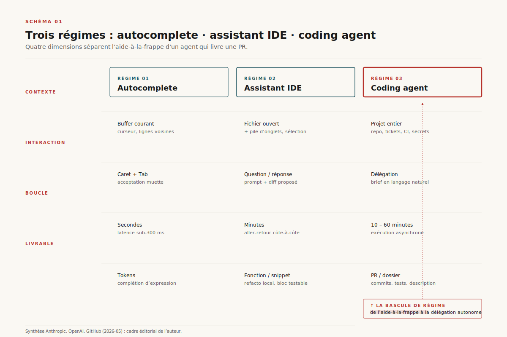
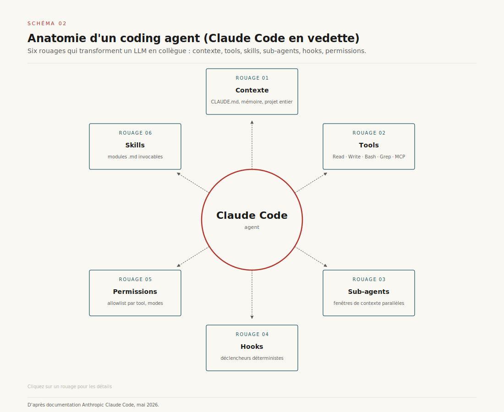
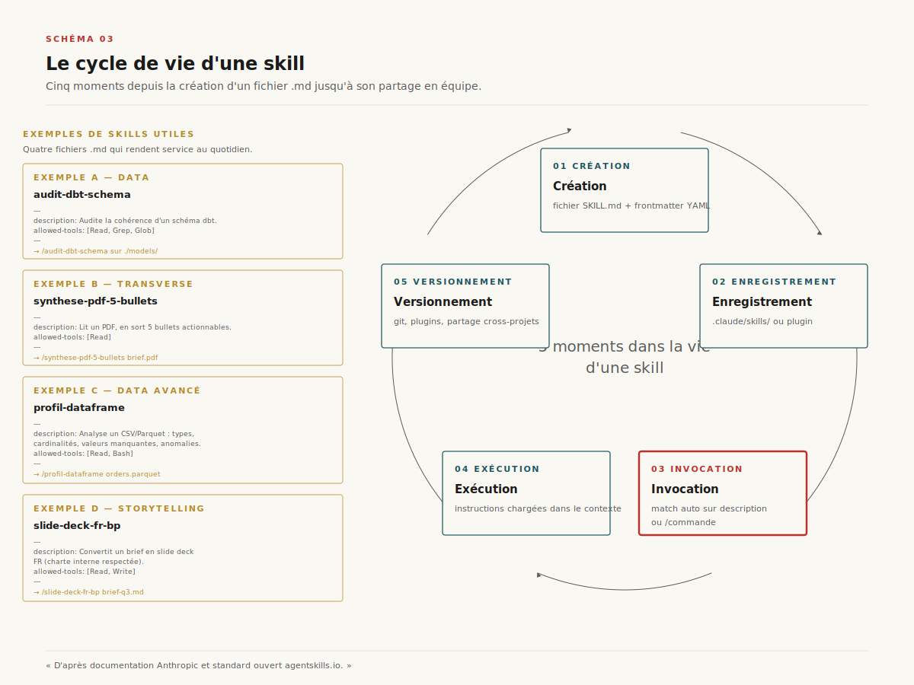
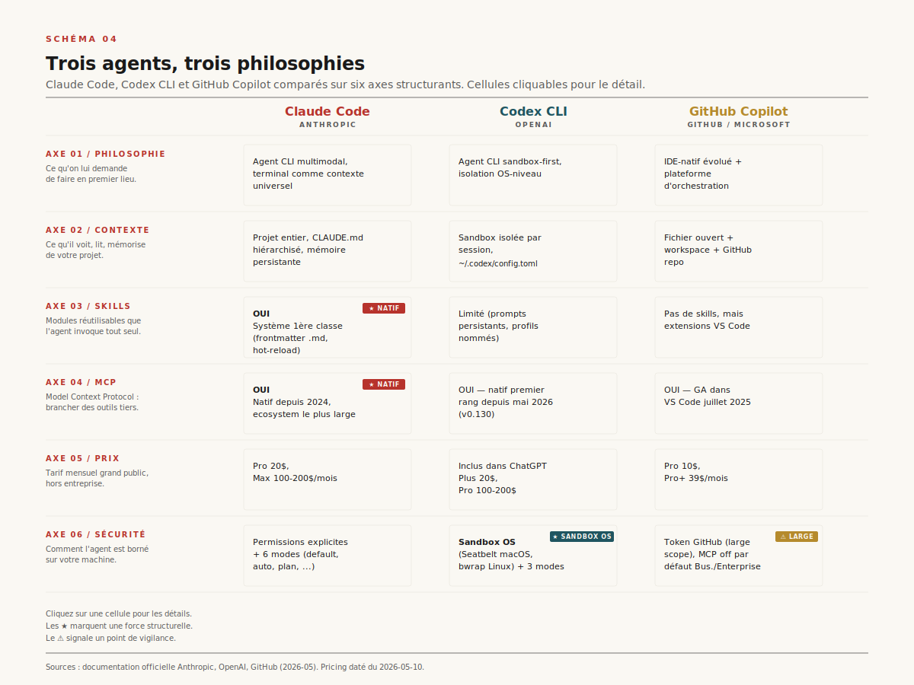
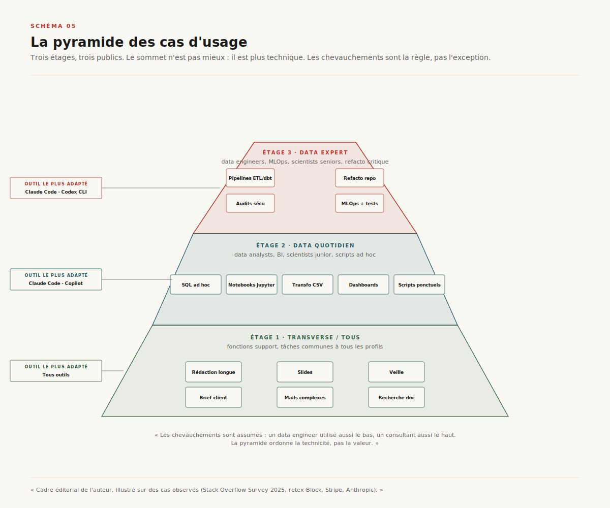
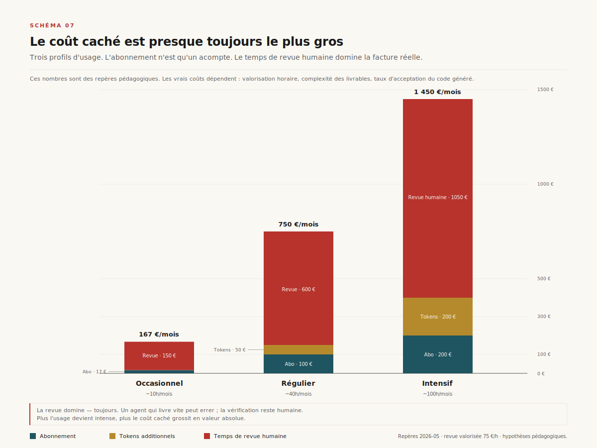
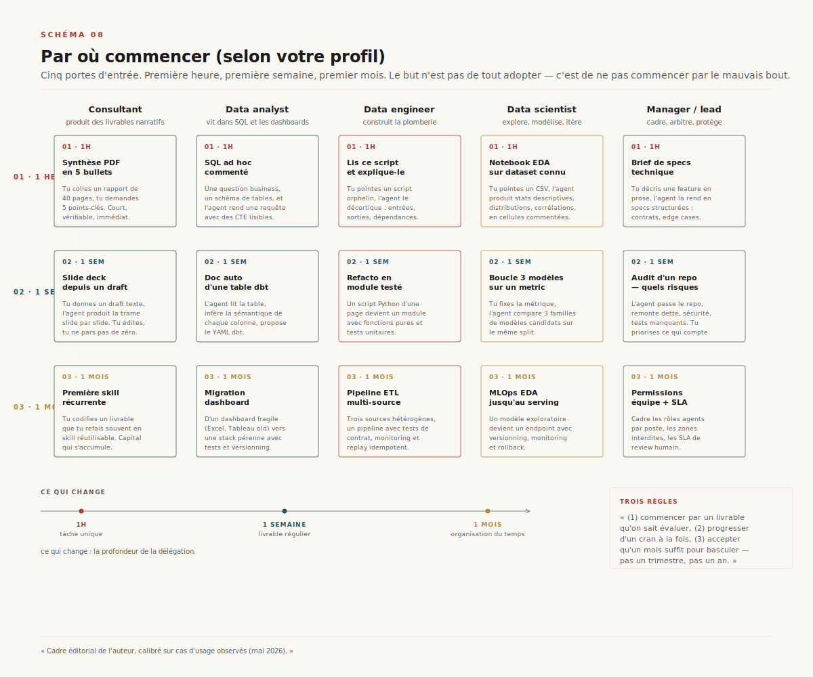

# Coding agents 2026 — Claude Code, Codex CLI, GitHub Copilot

> **Trois outils qui ressemblent à des copilotes mais opèrent comme des collègues.** — 2026-05-12, Mathieu Guglielmino

## Pourquoi ce dossier maintenant

Entre 2024 et 2026, un objet a changé de nature sans changer de nom. On l'appelait *autocomplete*, puis *assistant IDE*, puis *copilote*. On peut désormais l'appeler ce qu'il est : un délégué. Quand on lance Claude Code dans un terminal, on n'obtient pas une suggestion de complétion ; on obtient une boucle qui ouvre des fichiers, lance des commandes, lit des erreurs, recommence. La différence avec ChatGPT n'est pas de modèle, elle est de régime de travail. ChatGPT répond à une question. Un coding agent livre un dossier.

Ce dossier ne cherche ni à émerveiller ni à rassurer. Il décrit ce qui s'est installé entre la sortie de Claude Code en février 2025, le passage en agent mode de GitHub Copilot la même année, et la donation du Model Context Protocol à la Linux Foundation en décembre 2025[^7]. À la mi-2026, l'écosystème est stable assez pour qu'on en parle sans bullet points marketing : trois outils dominants, des cas d'usage qui s'éclaircissent, des chiffres encore contradictoires, et un coût caché qui devient le sujet honnête.

==Pour qui ce dossier ?== Pour les data experts — ingénieurs, scientists, analysts, BI — qui voient passer ces outils dans leur quotidien sans toujours mesurer ce qu'ils peuvent leur déléguer. Et pour les fonctions support, consultants, managers, chefs de projet — toutes ces personnes qui *écrivent* sans coder, et qui découvrent que ces agents ne sont plus seulement des outils de développeurs. Simon Willison l'a écrit en octobre 2025, après avoir longtemps minimisé le tournant agentique : *« Claude Code est mal nommé. Ce n'est pas un outil de code, c'est un outil d'automatisation générale »*[^33]. La pyramide qu'on dessine en §5 part de cette intuition.

Comment lire ce qui suit. La §1 pose les concepts. La §2 ouvre Claude Code et regarde sous le capot — c'est la section la plus dense, on peut y revenir. Les §3 et §4 traitent Codex CLI et GitHub Copilot par leurs spécificités, pas en panorama. La §5 est la pyramide : si l'on cherche son cas d'usage, c'est par là qu'il faut entrer. Les §6 et §7 traitent gains et coûts avec autant d'honnêteté que possible — sources contradictoires, retex chiffrés assumés. La §8 est une carte de décision pour démarrer. Le lecteur pressé peut sauter directement de l'intro à la §5, puis à la §8.

## §1. Coding agent : définition opérationnelle

### Trois choses qu'un coding agent fait que rien ne faisait avant

Un coding agent agit sur un projet entier, pas sur un buffer. C'est la première rupture. Là où l'autocomplete propose la fin de la ligne courante et où l'assistant IDE répond à propos du fichier ouvert, l'agent peut lire trois cents fichiers, suivre un import qui le mène dans un sous-module, et revenir sur celui d'origine pour proposer une modification cohérente. Le projet n'est plus un environnement de saisie — il devient le terrain de jeu de l'agent.

Un coding agent itère en boucle. Il propose une commande, observe sa sortie, ajuste, recommence. Une boucle dure entre dix et soixante minutes selon la tâche. Un autocomplete fonctionne en millisecondes ; un chat conversationnel répond en secondes. L'agent, lui, *travaille* — au sens où il prend du temps, fait des essais qui échouent, lit le message d'erreur du compilateur et y répond. Cette mécanique n'est pas plus rapide ; elle est *autonome*.

Un coding agent prend en charge un livrable, pas une suggestion. La différence est conceptuelle mais ses conséquences sont massives. Quand on demande à Copilot v1 d'écrire une fonction, il propose dix lignes — c'est au développeur d'ouvrir le fichier où la coller, d'écrire les tests, de gérer le commit. Quand on demande à Claude Code la même chose, il ouvre le fichier, écrit la fonction, ajoute les tests, lance la suite, propose un message de commit. Le périmètre du livrable est devenu la PR ouverte, pas la ligne de code.

### Démarcation vs autocomplete, assistant IDE, chat

L'autocomplete (Copilot v1, Tabnine première génération) prédit la suite d'un curseur. Son contexte : quelques centaines de tokens autour. Sa boucle : la milliseconde. Son livrable : un fragment.

L'assistant IDE (JetBrains AI Assistant, les premières versions de Copilot Chat, Tabnine) ouvre un panneau dans l'éditeur et répond à des questions sur le fichier ouvert. Son contexte : le fichier, parfois le projet via embedding. Sa boucle : la seconde. Son livrable : une réponse texte ou un patch local.

Le chat ChatGPT — le navigateur, sans plugin filesystem — répond à une question abstraite. Il ne touche à rien sur la machine. Son livrable : du texte qu'on copie-colle.

Le coding agent fait autre chose. Il accède au système de fichiers, lance des commandes shell, observe leurs sorties, lit ce qu'il a écrit lui-même, modifie sa stratégie. Il vit dans un terminal — ou dans un environnement cloud qui lui ressemble — et son contexte n'est pas un fichier mais un *projet*. C'est la bascule centrale.



Le schéma ci-dessus aligne quatre axes : contexte d'opération, mode d'interaction, durée d'une boucle, type de livrable. Il faut le lire de gauche à droite comme une trajectoire historique : 2018 (autocomplete), 2022 (assistant IDE chat), 2025 (agent). À chaque passage, la fenêtre de contexte s'élargit, la boucle s'allonge, le livrable s'étoffe. ==Ce n'est pas un assistant plus rapide, c'est un délégué.== Toute la suite du dossier découle de cette distinction.

## §2. Anatomie d'un coding agent

Claude Code sert ici de référence. Pas par préférence — par densité documentaire. Anthropic a publié l'essentiel de l'architecture de l'outil dans une documentation publique[^1][^2][^3][^4][^5][^6] qui rend chacun des composants citables. Codex CLI et GitHub Copilot reprennent les mêmes concepts avec d'autres noms et d'autres dosages ; on y reviendra en §3 et §4.



Six composants tournent autour du modèle. Le contexte (ce que l'agent sait du projet), les tools (ce qu'il peut faire), les skills (les modules d'expertise qu'il invoque), les sub-agents (les délégations parallèles), les hooks (les règles automatiques attachées au cycle de vie), et les permissions (la frontière entre ce qu'il peut et ne peut pas faire sans demander). Aucun de ces six éléments n'est nouveau pris isolément. Ce qui change, c'est leur intégration en un seul système.

### §2.1 Le contexte — la nouveauté centrale vs ChatGPT

Le contexte d'un coding agent ne se résume pas à la fenêtre de tokens du modèle. Il y a, d'abord, le projet — l'arborescence complète des fichiers que l'agent peut lire à la demande. Il y a, ensuite, la mémoire persistante. Anthropic la matérialise dans `CLAUDE.md`[^6], un simple fichier markdown placé à la racine du projet, qui contient les conventions, les pièges connus, les choix d'architecture. À chaque session, le contenu de ce fichier est injecté en début de conversation. Quand la fenêtre de contexte se sature et que l'outil déclenche une compaction, `CLAUDE.md` est *re-lu depuis le disque* et ré-injecté — il survit à l'oubli. C'est la différence concrète avec ChatGPT, où chaque nouvelle conversation repart de zéro.

L'arbitrage est élégant. La documentation Anthropic recommande explicitement de garder `CLAUDE.md` sous deux cents lignes[^6]. Au-delà, on bascule sur des règles plus ciblées, dans `.claude/rules/*.md` avec des globs de paths qui les déclenchent automatiquement quand l'agent travaille sur les fichiers concernés. Quatre scopes existent : le `CLAUDE.md` de projet (versionné, partagé via git), le `~/.claude/CLAUDE.md` user (préférences personnelles), un fichier de policy enterprise managed, et `CLAUDE.local.md` (gitignored, instructions perso pour ce projet). Tous sont *concaténés*, pas écrasés — ce qui force à les écrire courts.

L'auto-mémoire complète l'édifice. Claude Code écrit, à mesure des sessions, un fichier `~/.claude/projects/<project>/memory/MEMORY.md` qui résume les conversations passées. Les premières deux cents lignes sont chargées à chaque démarrage. C'est la mémoire long-terme du projet du point de vue de l'agent — ce qu'il a appris en travaillant avec son utilisateur. Cette couche est rarement éditée à la main : elle se construit toute seule.

==Le contexte n'est plus un paramètre du prompt. C'est un objet versionné, partagé, gouverné.== Cette inversion change qui contrôle quoi : un onboarding sur le projet ne se fait plus via une page Confluence à lire par un humain, il se fait via un `CLAUDE.md` à écrire pour les agents. Toute l'équipe — humaine et agentique — partage la même source de vérité.

### §2.2 Les tools — le terminal comme contexte universel

Un coding agent dispose d'un jeu d'outils opérables nativement. Chez Claude Code : `Read` (lire un fichier), `Write` (écrire/écraser), `Edit` (modifier ciblé via match-replace), `Grep` (recherche regex sur le repo via ripgrep), `Bash` (lancer une commande shell), `Glob` (chercher des fichiers par motif). Ces six tools couvrent 80% des actions d'un développeur. Le reste — appeler une API, requêter une base, manipuler GitHub — passe par MCP.

MCP, le Model Context Protocol[^4][^7][^8], est un standard ouvert qui définit comment un client (Claude Code, Cursor, ChatGPT, Microsoft Copilot) parle à un serveur tiers (GitHub, Postgres, Linear, Notion, Filesystem). L'analogie officielle : *« MCP est comme un port USB-C pour applications IA »*[^8]. Avant MCP, chaque éditeur d'IDE devait écrire son propre connecteur GitHub, son propre connecteur Postgres, son propre connecteur Slack. Avec MCP, le connecteur est écrit *une fois*, par l'éditeur du service ou la communauté, et tous les agents peuvent l'utiliser.

Anthropic a donné MCP à la **Agentic AI Foundation** sous Linux Foundation en décembre 2025[^7], en co-fondation avec Block et OpenAI. Soutiens platinum : Google, Microsoft, AWS, Cloudflare, Bloomberg. Le dénombrement officiel à la donation : ~97 millions de téléchargements SDK mensuels, plus de 10 000 serveurs MCP publics actifs. C'est désormais un standard neutre. Pour l'utilisateur, ça veut dire qu'un serveur MCP installé est valable transversalement — le serveur GitHub MCP fonctionne dans Claude Code, dans Cursor, dans ChatGPT, dans VS Code.

La conséquence pratique pour un data engineer : un serveur Postgres MCP suffit à donner à Claude Code la capacité de requêter une base, sans que l'agent voie les credentials autrement qu'à travers l'interface tool/result. Pour un consultant : le serveur Filesystem MCP avec un path scope étroit permet à l'agent de manipuler un dossier de présentations sans toucher au reste de la machine.

Une feature spécifique à Claude Code mérite mention : **Tool Search**[^4]. Quand le nombre de tools chargés au démarrage devient grand (typiquement avec plusieurs serveurs MCP qui exposent chacun dix à cinquante tools), la consommation contextuelle explose. Tool Search charge dynamiquement les définitions de tools quand l'agent les invoque, plutôt qu'à l'ouverture. Anthropic mesure une réduction de **~72k → ~8.7k tokens (-85%)** sur des sessions chargées. Cette feature est invisible à l'utilisateur mais change l'économie d'usage : avoir vingt serveurs MCP installés ne pénalise plus chaque conversation.

Ce qui frappe, en utilisant ces outils dans la durée, c'est que le terminal devient le **contexte universel**. Un dossier de fichiers + un shell + un agent — c'est un environnement de travail qui peut contenir aussi bien un repo Python qu'un dossier de slides Markdown ou une note longue en cours de rédaction. Le terminal n'est pas l'environnement du développeur, c'est l'environnement du *travail formalisable*. C'est la philosophie qu'on retrouvera à plusieurs reprises dans ce dossier.

### §2.3 Les skills — un objet partageable



Les skills sont la nouveauté la plus mal nommée et la plus structurante de Claude Code en 2025-2026. Une skill est un dossier `<nom>/` contenant un fichier `SKILL.md` — frontmatter YAML (description, allowed-tools, paths d'application) plus corps markdown d'instructions — et, optionnellement, des fichiers de support : scripts, templates, exemples. Les skills sont chargées par le client Claude Code à mesure qu'elles deviennent pertinentes (matching par description) ou sur invocation explicite (`/<nom-skill>`)[^1].

Quatre emplacements par priorité décroissante : enterprise (managed, imposée par l'organisation), personnel (`~/.claude/skills/`), projet (`.claude/skills/`), plugin (`<plugin>/skills/`). Une skill peut être versionnée dans le repo du projet — donc partagée avec l'équipe — ou rester dans le scope user. Anthropic a aligné le format sur le standard ouvert **Agent Skills** (agentskills.io) — interopérable avec d'autres clients à venir[^1].

Simon Willison, qui n'est pas réputé pour son enthousiasme rapide, a qualifié les skills d'objet *« peut-être plus important que MCP »*[^33]. Sa raison : MCP donne à l'agent l'accès à des outils nouveaux ; les skills lui donnent l'accès à des **procédures** — des manières de faire codifiées, partageables, versionnables. Une skill `audit-dbt-schema` n'est pas un nouveau tool, c'est une recette qui combine les tools existants (Read, Bash, MCP Postgres) selon un protocole précis.

Voici un mini-exemple de skill pour le data, qui audite un schéma dbt à partir d'un dossier projet.

```markdown
---
description: Audite un schéma dbt — détecte les modèles sans tests, les colonnes non documentées, et les tables orphelines (déclarées mais jamais référencées). Invoquer quand un dossier contient `dbt_project.yml`.
allowed-tools: [Read, Glob, Grep, Bash]
paths:
  - "models/**/*.sql"
  - "models/**/*.yml"
  - "dbt_project.yml"
---

# Skill : audit-dbt-schema

Tu auditeras le projet dbt courant. Procède dans cet ordre :

1. **Cartographie**. Glob `models/**/*.sql` pour la liste des modèles. Glob
   `models/**/*.yml` pour les fichiers de doc/tests. Pour chaque modèle .sql,
   identifier s'il a un `.yml` jumeau (même nom).

2. **Couverture tests**. Pour chaque `.yml`, parser la section `tests:` au
   niveau modèle et au niveau colonne. Construire la matrice
   {modèle × colonnes documentées × tests existants}.

3. **Tables orphelines**. Pour chaque modèle, grepper son nom (`ref('<nom>')`)
   dans le reste des `.sql`. Les modèles jamais référencés et qui ne sont pas
   marqués `materialized: incremental` ou exposés dans un `expose:` sont
   candidats orphelins.

4. **Rapport**. Produire un fichier `dbt-audit.md` à la racine, structuré en
   trois sections : Modèles non testés · Colonnes non documentées · Modèles
   orphelins. Pour chaque cas, donner le chemin du fichier et 1 phrase de
   recommandation actionable.

Ne **jamais** modifier les fichiers .sql ou .yml ; cette skill est read-only.
```

Le data engineer qui voit cette skill comprend immédiatement deux choses. Un, ce n'est pas du code à exécuter, c'est un protocole à suivre par l'agent. Deux, ce qui rend la skill utile, ce n'est pas l'IA — c'est la *structure du raisonnement*. Cette skill remplace une page Confluence interne du type "comment auditer notre dbt" qui aurait fini obsolète. Elle est versionnée, déclenchable par mots-clés, exécutable end-to-end.

Voici un mini-exemple côté transverse, pour une fonction support qui produit régulièrement des synthèses de PDF.

```markdown
---
description: Synthétise un PDF en cinq bullets actionnables, plus une citation-clé verbatim. Pour notes de lecture, comptes rendus de réunion enregistrés en PDF, articles longs.
allowed-tools: [Read, Write]
---

# Skill : synthese-pdf-5-bullets

Tu produiras une synthèse en cinq points d'un PDF fourni. Procède ainsi :

1. **Lecture intégrale**. Read le PDF complet. Pas d'extrait, pas de skim.

2. **Cinq bullets**. Pas plus, pas moins. Chaque bullet :
   - une phrase de 15-25 mots
   - factuelle (un chiffre, un nom propre, un mécanisme — pas une généralité)
   - hiérarchisée (le bullet 1 = ce qu'on retient si on n'a 30 secondes)

3. **Citation-clé**. Une phrase ou deux *verbatim* du PDF, qui résume la
   thèse principale, entre guillemets. Donner le numéro de page si présent
   dans le texte source.

4. **Métadonnées**. Auteur, titre, date de publication si présents. Sinon
   noter "métadonnées non disponibles dans le source".

5. **Sortie**. Écrire `<nom-pdf-sans-ext>-synthese.md` dans le même dossier
   que le PDF d'entrée.

Ne paraphrase pas la citation-clé. Ne réécris pas l'auteur. Si le PDF contient
des images sans alt-text exploitable, mentionne-le en bas de la synthèse.
```

Cette skill, déposée dans `~/.claude/skills/` d'un consultant ou d'un manager, transforme l'invocation *« synthétise ce PDF en cinq bullets »* en un livrable structuré reproductible. Le format n'a rien d'extraordinaire ; ce qui l'est, c'est qu'il n'a plus besoin d'être ré-énoncé à chaque fois. La skill est invocable par mots-clés (Claude Code matche sur la description) ou via `/synthese-pdf-5-bullets`.

Le cycle de vie d'une skill, qu'illustre le schéma 03, suit cinq étapes : création (rédaction du `.md`), enregistrement (placement dans le bon dossier), invocation (mots-clés ou commande), exécution (Claude charge le `.md`, lit les instructions, applique le protocole), versionnement (commit dans un repo, partage). Pas plus complexe que ça. La complexité réside dans la rédaction de la skill — savoir formaliser son propre protocole de travail, ce qui est plus difficile qu'il n'y paraît.

### §2.4 Sub-agents — déléguer dans la délégation

Un sub-agent est un assistant secondaire que l'agent principal invoque pour une tâche bornée[^3]. Il a sa propre fenêtre de contexte, son propre system prompt, son propre accès tools restreint, et renvoie un *résumé* au thread principal — pas l'intégralité de son travail. Cette dernière propriété est cruciale : elle permet au thread principal de garder une fenêtre légère même quand le sub-agent a fait un travail dense.

Trois sub-agents built-in chez Claude Code : `Explore` (read-only, parfait pour la cartographie), `Plan` (mode plan, pour drafter sans toucher), `general-purpose` (le bouclage classique). On peut en créer des custom : un fichier `.claude/agents/<nom>.md` (frontmatter `name`, `description`, `tools`, `model`) plus un system prompt. Le custom-agent peut être routé sur Haiku (plus rapide, moins cher) tout en laissant le main-thread sur Opus.

Cas d'usage concret. On veut auditer la sécurité d'un repo de mille fichiers. Le main-thread principal lance trois sub-agents en parallèle : *« cherche les secrets dans les fichiers de config »*, *« cherche les patterns de désérialisation à risque »*, *« cherche les endpoints sans auth »*. Chaque sub-agent travaille en isolation, retourne trois à cinq findings résumés. Le main-thread fait la synthèse. Avantage par rapport à un thread linéaire : la fenêtre de contexte du main-thread reste dans les vingt ou trente milliers de tokens, là où un audit linéaire l'aurait saturée à deux cent mille.

Pour un data team, l'usage récurrent est le triplet `Explore → Plan → général`. On envoie d'abord `Explore` cartographier ce qui existe, on demande ensuite à `Plan` de drafter un plan basé sur cette cartographie, on lance enfin un agent général pour exécuter. Cette séquence est l'embryon de ce qu'on appelle dans le jargon le *subagent-driven development* — fragmenter une tâche complexe en sous-tâches indépendantes, exécutables en parallèle.

Limite à connaître. Les sub-agents ne partagent rien entre eux ; ce que l'un découvre, l'autre l'ignore. Si un audit nécessite que le sub-agent A informe le sub-agent B, c'est au main-thread de relayer. Cette discipline ralentit certains workflows mais protège la fenêtre de contexte ; le compromis est volontaire.

### §2.5 Hooks — ce qui se déclenche tout seul

Un hook est une commande shell *déterministe* que Claude Code lance à des points fixes du cycle de vie[^2]. Pas de modèle dans la boucle ; un programme externe avec ses arguments. Six événements pertinents : `PreToolUse` (avant qu'un tool ne s'exécute, peut bloquer en exit non-zéro), `PostToolUse` (après un tool, typiquement formattage/lint), `Notification` (signal utilisateur), `Stop` (fin de session), `SessionStart` (chargement de contexte custom), `InstructionsLoaded` (post-CLAUDE.md re-load).

Configuration dans `settings.json`, sous la clé `hooks` :

```json
{
  "hooks": {
    "PostToolUse": [
      {
        "matcher": "Edit|Write",
        "hooks": [
          {
            "type": "command",
            "command": "ruff format $CLAUDE_FILE_PATH"
          }
        ]
      }
    ],
    "PreToolUse": [
      {
        "matcher": "Bash",
        "hooks": [
          {
            "type": "command",
            "command": ".claude/hooks/check-rm.sh"
          }
        ]
      }
    ]
  }
}
```

Trois usages dominent. **Formattage automatique** : un hook `PostToolUse` sur `Edit|Write` qui lance `ruff` ou `prettier` sur le fichier touché. **Garde-fou destructif** : un hook `PreToolUse` sur `Bash` qui scanne la commande pour `rm -rf` ou pour des paths sensibles, et bloque (exit 1) si match. **Audit log** : un hook `PostToolUse` qui appende dans un journal local toutes les actions effectuées, pour relecture a posteriori — utile en environnement réglementé.

Le contrat est plus fort qu'une instruction dans le prompt. Une instruction *« reformatte toujours après une édition »* repose sur la docilité du modèle ; un hook le garantit. La documentation Anthropic le dit explicitement : *« Hooks provide deterministic control over Claude Code's behavior, ensuring certain actions always happen rather than relying on the LLM to choose to run them »*[^2]. C'est la manière de durcir les passages où le non-déterminisme du modèle n'est pas acceptable.

Note de sécurité : un hook s'exécute avec les droits complets de l'utilisateur, hors sandbox. Les hooks doivent être traités comme du code privilégié et review en conséquence. Une variable d'environnement `$CLAUDE_PROJECT_DIR` est exposée pour fiabiliser les chemins relatifs.

### §2.6 Permissions, gouvernance, sandboxing

Six modes de permission chez Claude Code[^5]. `default` : les lectures sont auto-approuvées, le reste demande une confirmation. `acceptEdits` : les édits filesystem passent aussi en auto. `plan` : mode lecture seule produisant un plan. `auto` : un classifier IA évalue chaque action pour décider auto/prompt (disponible avec Sonnet 4 ou Opus 4.6+). `dontAsk` : refuse toute action non pré-approuvée — adapté à la CI. `bypassPermissions` : tout passe sans demande — adapté aux conteneurs isolés où l'on accepte le risque.

Au-dessus de ces modes, une allowlist granulaire dans `settings.json` (sous `permissions.allow`, `permissions.deny`, `permissions.ask`) qui peut autoriser nommément un tool : `Bash(npm test)`, `Skill(commit)`, `Skill(deploy *)`. Plusieurs layers — user, project, local, managed — qui *mergent* avec une priorité descendante.

Une notion essentielle : les **protected paths**. Quel que soit le mode (sauf `bypassPermissions`), certains paths ne sont jamais auto-approuvés en écriture : `.git`, `.vscode`, `.idea`, `.claude` (sauf sous-dossiers `commands/`, `agents/`, `skills/`, `worktrees/`), les rcs shell, `.mcp.json`, `.claude.json`. C'est le garde-fou structurel qui protège la configuration de l'agent contre l'agent lui-même. Sans cette frontière, une session avec `acceptEdits` activé pourrait laisser l'agent réécrire son propre `CLAUDE.md` ou son `settings.json`. C'est interdit, et la documentation est explicite[^5].

Pour un environnement enterprise, la combinaison `dontAsk` + `permissions.allow` étroite + protected paths donne un agent qui ne peut faire *que* ce qu'on a explicitement listé. Le coût : il faut maintenir la liste, et chaque nouvelle tâche peut nécessiter d'ouvrir une permission. Le bénéfice : la trace est complète et le risque circonscrit.

### §2.7 Une philosophie : le terminal comme contexte universel

Un dernier point, philosophique mais pratique. Pourquoi le terminal et pas l'IDE ?

Parce que le terminal est plus ancien que les langages, plus stable que les IDEs, et plus universel que les éditeurs. Un terminal contient un shell, un répertoire, un environnement. Tout ce qu'un développeur fait depuis trente ans peut se faire dans un terminal. Choisir le terminal comme habitat de l'agent, c'est choisir d'être agnostique sur le contenu : un dossier de code Python, un dossier de slides Markdown, un dossier de notes de recherche en cours, un dossier de données CSV à explorer — l'agent voit la même chose, et opère pareillement.

Le corollaire : le coding agent n'est pas un outil de développeur, c'est un outil pour qui que ce soit qui sait organiser son travail en dossiers, fichiers et commandes. C'est la condition de possibilité de la pyramide de §5. C'est aussi pourquoi Willison a fini par admettre — six mois après ses premières critiques — que *« Claude Code est, avec le recul, mal nommé. Ce n'est pas purement un outil de code : c'est un outil d'automatisation générale »*[^33].

## §3. Codex CLI en bref

Codex CLI est l'analogue OpenAI de Claude Code. Annoncé le 16 avril 2025[^9], open-source sous Apache 2.0, distribué via npm (`@openai/codex`) et Homebrew. La codebase est passée de TypeScript/Node.js à **96 % Rust**[^10] mi-2025 — une réécriture complète motivée par la latence (suppression du GC), le packaging air-gapped, et l'élimination de la dépendance Node v22+. Au 2026-05-10, le repo affiche 81,6k stars et 11,8k forks. C'est l'un des projets open source les plus actifs sur GitHub en 2025-2026.

Le positionnement d'OpenAI sur Codex CLI est explicite : *« lightweight, open source coding agent that runs locally in your terminal »*[^11]. Sur le papier, c'est le même produit que Claude Code. Dans la pratique, deux différences structurantes émergent.

### Sandboxing strict, OS-natif

C'est la spécificité qu'OpenAI met le plus en avant. Codex CLI n'utilise pas un système d'approbations comme Claude Code — il ajoute une couche d'**isolation OS-niveau** par-dessus les permissions[^12].

Sur **macOS** : `sandbox-exec` du framework Seatbelt, hors de la boîte. Pas d'installation ; le sandbox est natif au système. Sur **Linux et WSL2** : `bubblewrap` (`bwrap`) en isolation user namespace, à installer manuellement (`apt install bubblewrap`). Sur **Windows natif** : pas de sandbox built-in, OpenAI recommande Windows Sandbox ou WSL2.

Trois modes de sandbox, orthogonaux à quatre approval policies[^13]. Les modes : `read-only` (l'agent ne peut rien écrire), `workspace-write` (défaut — écriture autorisée *seulement* dans le dossier courant, paths protégés `.git`, `.agents`, `.codex`, **réseau désactivé**), `danger-full-access` (alias `--yolo`, à éviter hors conteneur). Les approval policies : `on-request` (défaut, l'utilisateur valide), `untrusted` (auto-exec sur une whitelist limitée), `never`, `auto_review` (un agent reviewer interne évalue le risque avant exécution — credentials, exfiltration, commandes destructrices).

Cette différence d'architecture compte. **Un data engineer en environnement bancaire ou healthtech** qui hésite entre Claude Code et Codex CLI peut préférer Codex CLI pour cette raison précise. Avec `workspace-write`, l'agent ne peut pas, par construction OS, sortir du dossier courant — même si une faille du modèle ou une commande malicieuse essayait. Avec Claude Code, la garantie est du même ordre que celle d'un contrat : forte, mais reposant sur un système d'approbations plutôt que sur une isolation kernel.

### Comparaison directe — un cas concret

Soit la tâche : *« refactore un script Python isolé qui transforme un CSV en JSON, et ajoute des tests unitaires »*. Pas de mémoire de projet, pas d'historique, pas d'autres fichiers à modifier.

Avec Claude Code, l'expérience est fluide. L'agent lit le script, comprend sa logique, propose une refacto, écrit les tests, lance la suite. Si l'utilisateur a configuré son `CLAUDE.md` avec `Format: black, line-length 100`, la refacto sort déjà formattée. La boucle est rapide.

Avec Codex CLI, l'expérience est légèrement plus rigide mais plus rassurante en environnement réglementé. L'agent demande explicitement la permission d'exécuter `pytest` (mode `on-request`). En `workspace-write`, il ne peut pas accéder au dossier parent ni au home de l'utilisateur. Si un test essaie d'ouvrir un fichier hors du dossier courant, le sandbox le refuse — silencieusement et au niveau OS, pas au niveau agent. C'est cette **garantie kernel-level** qui justifie le choix Codex CLI dans des environnements où le sandbox n'est pas négociable.

### Quand préférer Codex CLI

Trois cas. **Sandboxing prioritaire** : on travaille sur un poste avec accès à des données sensibles que l'agent n'a pas vocation à voir, le sandbox `workspace-write` est la défense de profondeur. **Écosystème OpenAI déjà actif** : on a un abonnement ChatGPT Plus ou Pro, Codex CLI est inclus[^11], pas de surcoût d'abonnement. **Dossier isolé** : on veut traiter un dossier ponctuel sans contaminer la mémoire d'un projet plus large.

### Note honnête — moins riche en skills, MCP plus jeune

Codex CLI est plus jeune que Claude Code de quelques mois, et ça se voit côté écosystème. Les skills, comme objet first-class, n'ont pas encore d'équivalent stabilisé chez Codex CLI ; on contourne avec des prompts versionnés dans `.codex/config.toml` mais ça reste artisanal[^14]. Côté MCP, OpenAI a ajouté le support en 2025 et l'a promu **runtime de premier rang en mai 2026** avec la release 0.130.0[^15]. Parité fonctionnelle aujourd'hui, mais Claude Code reste l'implémentation de référence et la plus ancienne.

Un dernier point qui peut peser : Codex CLI est intégré aux abonnements ChatGPT (Plus, Pro, Team, Enterprise), avec une fenêtre de quotas de cinq heures partagée entre Codex CLI local, Codex tâches cloud, et limite hebdo. Pour qui consomme déjà ses heures ChatGPT, Codex CLI est essentiellement gratuit. C'est un argument d'adoption non négligeable.

## §4. GitHub Copilot en bref + encadré Cursor / Devin / Aider

GitHub Copilot a 2026 sur le dos. Lancé en 2021 comme premier autocomplete IA grand public, il a longtemps été *l'autocomplete*. La bascule a commencé le 6 février 2025 avec l'annonce de Thomas Dohmke *« The agent awakens »*[^16] — agent mode, Copilot Edits multi-fichiers GA dans VS Code, preview de Project Padawan (futur agent autonome assignable à une issue). Le 4 avril 2025, l'agent mode est déployé à tous les utilisateurs VS Code stable[^17] avec, dans le même mouvement, **MCP en public preview**. Le 19 mai 2025, le **coding agent asynchrone** — assigné à une issue GitHub, travaillant dans un environnement GitHub Actions, poussant des commits sur une PR draft — est annoncé à Microsoft Build[^18] ; il devient GA le 25 septembre 2025. Le 28 octobre 2025, à GitHub Universe, **Agent HQ** ouvre Copilot à un écosystème multi-agents : Anthropic, OpenAI, Google, Cognition, xAI livrables au sein de l'abonnement Copilot[^19]. GitHub se positionne comme **plateforme d'orchestration** plutôt que comme concurrent direct de Claude Code — qu'il intègre désormais.

### La spécificité à creuser : densité d'usage IDE-natif et intégration GitHub

C'est l'avantage structurel de Copilot, et il est difficile à rattraper. Pour un développeur qui vit dans VS Code (et les ~80% des devs qui le font selon Stack Overflow Developer Survey 2025[^30]), Copilot est intégré nativement — autocomplete inline, chat panel, agent mode dans la même interface. Pas de terminal séparé, pas de switch contextuel.

L'intégration GitHub est l'autre force. Issues, PR, repo : le coding agent peut être assigné à une issue depuis l'interface web. Il ouvre une PR draft, pousse des commits, répond aux commentaires de review automatiquement. Pour une équipe qui structure son travail autour de GitHub Issues, c'est un workflow sans friction. Le coding agent devient un membre fantôme de l'équipe, qui prend les tickets `good first issue` ou les bug fixes triviaux pendant que les humains travaillent sur le reste.

MCP est passé GA dans VS Code à partir de **juillet 2025** (VS Code 1.102), et dans JetBrains, Eclipse, Xcode en août 2025[^20]. Avec une réserve importante : la **politique MCP est désactivée par défaut sur Business et Enterprise** ; un admin doit activer. Free, Pro, Pro+ ne sont pas concernés par cette restriction. Le **GitHub MCP Registry** reste en public preview à mai 2026.

### Comparaison directe — ouvrir une PR depuis une issue GitHub

Soit la tâche : *« il y a une issue #142 dans notre repo, qui décrit un bug de validation de formulaire. Ouvre une PR qui le fixe. »*

Avec GitHub Copilot, on ouvre l'issue dans l'interface web, on assigne `@copilot`. L'agent prend le ticket, lit le repo, propose un fix, ouvre une PR draft, qui apparaît dans la liste des PR de la même équipe. Le reviewer voit le diff, demande un ajustement en commentaire, l'agent répond. Pas de terminal, pas de checkout local. C'est le workflow qu'aucun autre agent ne fait avec autant de fluidité, parce que l'intégration native à GitHub n'est pas reproductible à l'extérieur.

Avec Claude Code, on cloud le repo, on ouvre Claude Code dans le dossier, on lui passe l'URL de l'issue. L'agent lit l'issue (via MCP GitHub si configuré), code, ouvre une PR via le CLI `gh`. Étapes équivalentes, mais le développeur reste dans son terminal et n'a pas l'expérience web fluide.

Pour un développeur qui *vit* dans GitHub Issues — typiquement un mainteneur OSS ou un dev en équipe produit — Copilot est imbattable sur ce cas précis.



### Quand Copilot suffit, quand il décroche

Copilot suffit quand l'usage reste centré sur autocomplete inline, génération de fonction in-IDE, ouvrir une PR depuis une issue GitHub. Sa fluidité d'intégration et son tarif (Pro à 10$/mois, Business à 19$/seat) en font la porte d'entrée la plus économique. L'arrivée d'Agent HQ et l'intégration de Claude / Codex / Gemini comme agents internes à l'abonnement Pro+ (39$/mois) renforce ce positionnement : un seul abonnement pour avoir accès à plusieurs modèles d'agents.

Copilot décroche quand on cherche des **skills versionnables** (pas d'équivalent SKILL.md à mai 2026), un **contexte projet hors GitHub** (l'agent est moins à l'aise sur un dossier qui n'est pas un repo Git), ou un **MCP activé par défaut en environnement enterprise** (désactivé en Business / Enterprise sans intervention admin).

> ### Encadré — Et Cursor / Devin / Aider ?
>
> **Cursor** est un IDE-fork (de VS Code) avec un agent intégré. Stack Overflow Developer Survey 2025 le décrit comme *« la plus rapide adoption d'IDE de l'histoire »*[^30] — 17,9% d'usage parmi les répondants ayant essayé un IDE AI-enabled, devant Claude Code (10%) et Windsurf (5%). Hors scope de ce dossier parce que ce n'est pas un agent CLI : c'est un IDE complet, avec son propre marché, ses propres workflows, ses propres trade-offs ergonomiques. Mérite un dossier dédié.
>
> **Devin** (Cognition Labs) est l'agent autonome cloud le plus visible du marché. Promesse : un *« ingénieur AI complet »* qui opère sans supervision continue. Hors scope ici par positionnement : entreprise, coût premium (plusieurs centaines à milliers de dollars par mois), philosophie d'autonomie longue. C'est un autre régime que les CLI locaux dont parle ce dossier.
>
> **Aider** est le pionnier open source CLI git-first. Plus ancien que Claude Code (2023), philosophie *« chaque modification = un commit »*, modèle agnostique. Cité ici parce qu'il a posé plusieurs des conventions qu'on retrouve dans Claude Code et Codex CLI ; un dossier dédié serait pertinent — le fait qu'il ne soit pas porté par un grand vendor en fait un objet d'étude différent.

## §5. La pyramide des cas d'usage



Trois étages. Au bas, le plus large, l'étage transverse — ce que tout knowledge worker peut déléguer à un coding agent dans son quotidien, qu'il soit consultant, manager, chef de projet, fonction support. Au milieu, l'étage data quotidien — ce qu'un analyste, un BI dev, un data scientist déclenche dix fois par semaine. Au sommet, le plus étroit, l'étage data expert — ce qui touche aux pipelines critiques, aux refactos de repo, aux audits sécurité.

==Le sommet n'est pas mieux que la base, il est plus technique.== Cette nuance est cruciale. La pyramide est une carte de complexité, pas de valeur. Un livrable transverse réussi (un brief client de cinq pages structuré en deux heures plutôt qu'en huit) génère autant de valeur qu'un audit de sécurité réussi.

Les chevauchements sont assumés. Un data engineer utilise aussi le bas — il rédige des briefs, des slides, des notes. Un consultant utilise aussi le haut quand il manipule des CSV ou écrit un script Python ad hoc. La pyramide trace une distribution moyenne par persona, pas une assignation rigide.

### §5.1 Étage transverse — pour tout knowledge worker

**Rédaction longue.** Un dossier comme celui-ci, un compte rendu de mission, un mémo de positionnement. L'agent lit les sources fournies, propose un plan, drafte section par section. Voilà à quoi ça ressemble : on ouvre Claude Code dans un dossier `/dossier-x/`, on y dépose les sources (PDF, articles, transcripts), on lance *« lis ces sources et drafte un plan en sept parties pour un dossier de 9000 mots sur le sujet X »*. Voilà ce qu'on récupère : un fichier `plan.md` structuré, qu'on revoit, qu'on amende, qu'on relance ensuite section par section.

**Slide deck.** Sur la base d'un texte source ou d'un brief client, l'agent produit une structure de slides (titres + bullet points) en markdown, qu'on porte ensuite dans Gamma, Beautiful.ai ou un template PowerPoint via une skill dédiée. Le gain est dans l'**armature narrative** plus que dans le visuel.

**Veille / résumés.** Un dossier de quinze articles longs à dépouiller en deux heures. L'agent lit chaque article, sort une synthèse de cinq points + une citation-clé. La skill montrée en §2.3 (`synthese-pdf-5-bullets`) fait exactement ça.

**Brief client / proposal.** Sur la base d'un cadrage initial (notes de réunion, contexte client, objectifs), l'agent drafte un brief structuré : enjeux, livrables, jalons, équipe. Particulièrement efficace quand l'organisation a déjà un *template* de proposition et qu'une skill `brief-proposal-template` encode son squelette.

**Mails complexes.** Pas le mail d'une ligne — le mail de réponse à une RFP, le mail de cadrage qui résume trois conversations et propose un plan, le mail de gestion de crise. L'agent peut ingérer un thread Gmail (via MCP Gmail si configuré) et produire un draft long form.

**Recherche documentaire.** Trouver dix sources sur un sujet précis, vérifier leurs citations, synthétiser. C'est le chemin direct entre *« je vais bouquiner trois soirs »* et *« je récupère un brief en deux heures »*. Limite à connaître : la qualité des sources reste à arbitrer humainement, et l'agent peut citer des papiers inexistants — il faut vérifier les URL et les noms d'auteurs.

**Contre-cas pour cet étage.** Toute production qui exige une **voix originale** ou un **point de vue éditorial** non triangulable depuis des sources existantes. Un agent peut compiler, structurer, harmoniser un ton — mais il ne peut pas inventer une thèse. Quand on lui en demande une, il en propose une moyenne, ce qu'on appelle ailleurs *AI slop*. Un brief client de mission innovante a souvent besoin d'un humain pour produire une perspective ; l'agent peut emballer la perspective une fois qu'elle est trouvée.

Stack Overflow Developer Survey 2025 [^30] documente que 84% des répondants utilisent ou prévoient d'utiliser un outil IA, et que ChatGPT (81,7%) et GitHub Copilot (67,9%) dominent l'usage agent ; mais Claude Code, à 40,8% chez les répondants ayant essayé un agent IA, est en croissance la plus forte sur la période — porté précisément par cet élargissement vers le transverse.

### §5.2 Étage data quotidien — analyste, BI dev, data scientist

**SQL ad hoc.** *« Sors-moi le top 20 produits par marge sur Q4, hors retours »*. L'agent ouvre la base via MCP Postgres ou MCP BigQuery, regarde le schéma, drafte la requête, l'exécute, propose une seconde version commentée si la première a un edge case (jointure manquée, retours non filtrés). Particulièrement utile quand la base est mal documentée ou que les noms de tables sont opaques. La skill `sql-ad-hoc` encode des bonnes pratiques (limites par défaut, alias clairs, commentaires).

**Notebook EDA.** *« Voilà un dataset CSV de cinquante mille lignes, fais l'EDA standard et identifie deux ou trois patterns notables. »* L'agent ouvre Jupyter (ou écrit un notebook standalone), trace les distributions, fait les corrélations, signale les outliers, écrit une cellule markdown de synthèse. C'est l'archétype de la tâche *transparente* : le notebook produit est lisible, les choix sont commentés, l'humain peut prendre le relais.

**Transformation CSV.** Un fichier 200 Mo qui doit être pivoté, joint à un autre, exporté en quatre variantes. L'agent écrit le script Pandas, le teste sur un échantillon, l'exécute en complet. La transparence du script reste critique — c'est lui que la prochaine personne va relire si la transfo doit être ré-exécutée.

**Dashboards / Streamlit.** *« Crée un Streamlit qui prend ce CSV en entrée et affiche les KPIs X, Y, Z avec des filtres par catégorie. »* L'agent scaffolde le projet, écrit l'app, lance localement, propose une URL. Pour de l'exploration interne, c'est imbattable. Pour de la production avec gouvernance, retour à §7.4.

**Scripts ponctuels.** Le script Python de cinquante lignes qu'on écrit *une fois* pour traiter un cas particulier, qu'on jetterait sinon. Beaucoup de data analysts ont accumulé des dossiers `~/scripts/` de cinq cents fichiers ; l'agent peut les générer plus vite qu'on ne les écrit, et — plus important — peut écrire les *trois variantes* qu'on aurait évitées sinon.

**Contre-cas pour cet étage.** Tout ce qui nécessite **comprendre intimement un domaine métier non documenté**. L'agent peut écrire un SQL impeccable sur une base inconnue ; il ne peut pas savoir que la table `produits_v2` est obsolète depuis un an mais que personne n'a renommé l'ancienne. Cette connaissance vit dans la tête des humains de l'équipe. Un `CLAUDE.md` ou une skill peut l'encoder, mais elle est rarement écrite *à temps*.

Selon Stack Overflow Survey 2025, **Claude Sonnet est le LLM le plus admiré (sauf devant Gemini Reasoning) et le 2e plus désiré** chez les développeurs (33%)[^30]. Cette préférence se concentre précisément sur les usages data quotidien — bonne adhérence au schéma, code propre, peu d'hallucinations sur les noms de fonctions.

### §5.3 Étage data expert — pipelines, refactos, audits

**Pipelines ETL / dbt.** Construction ou évolution d'un pipeline de production. L'agent peut scaffolder une nouvelle source dbt, drafter les modèles, ajouter les tests. La revue humaine reste critique — un pipeline en prod a des contraintes de qualité (idempotence, recovery, observability) que l'agent ne maîtrise pas seul. C'est le terrain typique du **subagent-driven development** : un sub-agent explore l'existant, un autre drafte le plan, un autre exécute par chunks.

**Refacto de repo.** L'exemple emblématique : Stripe a déployé Claude Code à 1370 ingénieurs, et l'anecdote phare est une **migration de 10 000 lignes Scala vers Java en 4 jours**, là où l'estimation initiale était 10 semaines-ingénieur[^25]. Soit un facteur 12,5 sur ce projet précis. Le mental model interne décrit Claude Code comme *« un nouvel ingénieur capable, qui connaît tous les langages mais pas le contexte business ni le 'Stripe way' »*[^25]. La nuance est importante : sans le `CLAUDE.md` qui encode la *Stripe way*, l'agent produirait du code Java idiomatique mais hors-norme pour la maison.

**Audits sécurité / qualité.** *« Audite ce repo, identifie les patterns de désérialisation à risque, les endpoints sans auth, les dépendances avec CVE connue. »* C'est le terrain où les sub-agents brillent — chaque axe d'audit dans un sub-agent isolé, synthèse finale par le main-thread. La frugalité de la fenêtre de contexte permet d'auditer un repo de plusieurs millions de lignes en une session.

**MLOps + tests.** Tests d'intégration sur un pipeline ML, génération de fixtures, vérification de drift. L'agent peut écrire les tests qu'aucun data scientist n'a le temps d'écrire — la couverture explose, sans que le scientist quitte son notebook.

**Contre-cas pour cet étage.** Les tâches où l'agent **rallentit** un senior. C'est le scénario documenté par METR en juillet 2025[^22] : 16 développeurs OSS experts, 5+ ans d'ancienneté, codebases massives (>1M LOC), 246 tâches réelles. Avec accès à l'IA, ils sont **19% plus lents**, alors qu'ils prédisaient être 24% plus rapides. La cause probable : leur maîtrise du codebase est telle que le contexte humain bat le contexte IA — ils savent où aller plus vite que ce que l'agent peut découvrir. Le code généré nécessite review et debug, qui ajoute du temps. METR a auto-critiqué cette étude en février 2026[^23] : le -19% est probablement une **borne haute du ralentissement** (donc une borne basse du speedup réel) à cause de biais de sélection — 30 à 50% des devs ont admis avoir retiré du panel les tâches avec gain anticipé maximal, et la mesure du temps est cassée sur workflows agentiques (le dev fait autre chose pendant que l'agent tourne).

Le résultat brut reste néanmoins instructif. ==Sur les codebases qu'on connaît par cœur, l'agent peut être un frein.== C'est aussi pour ça qu'on ne le déploie pas dans une équipe sans une réflexion sur où il aide vraiment.

## §6. Gains



Cette section essaie d'être honnête sur trois plans : ce que je peux mesurer en première personne (3 retex perso chiffrés), ce que disent les benchmarks publics (5-6 références, contradictoires), et ce qui est connu sur les biais qui faussent ces chiffres. ==Aucun chiffre n'est universellement valable. Tous le deviennent en contexte.==

### §6.1 Trois retex chiffrés

**Retex 1 — Ce dossier-ci.** Production d'un dossier de ~10 000 mots avec 8 schémas SVG, une app interactive, un slideshow, un hub. Estimation à la main, basée sur ma cadence pré-agent : 25 heures réparties sur 5 jours (2 jours de recherche + cadrage, 2 jours de rédaction, 1 jour d'illustration et mise en forme). Temps réel avec Claude Code dans le pipeline : ~5 heures réparties sur 1 jour et demi. Soit un facteur ~5 sur ce projet précis. La nature des heures change aussi — je passe plus de temps à *réviser* (lire ce que l'agent a produit, ajuster, recadrer) qu'à *produire* (écrire moi-même). La qualité subjective est plus haute sur la structure (les huit schémas auraient sans doute été 4 à la main) et plus basse à la première passe sur la prose (l'agent en moyenne écrit moins idiomatique que moi, et j'amende beaucoup). Le delta de qualité finale, après plusieurs passes de revue, est peu lisible — l'agent ne fait pas mieux que moi, il fait *au-niveau*, plus vite. Mention obligée : ce dossier est lui-même un cas d'usage, c'est dit dans la disclosure ; les ordres de grandeur valent pour les artefacts comme celui-ci, pas universellement.

**Retex 2 — Refacto d'une bibliothèque JS partagée.** Le repo public où ce dossier est publié héberge huit applications HTML qui partageaient initialement chacune leur propre copie d'~400 lignes de JS et ~400 lignes de CSS. La refacto consistait à extraire ce code dans une bibliothèque partagée `/assets/dossier-app.{js,css}`, à migrer les huit apps en sed et regex, à ajouter des tests CI pour vérifier la non-régression. Estimation à la main : 6 à 8 heures réparties sur 2 sessions (1 session pour le design, 1 session pour la migration et les tests). Temps réel avec Claude Code en mode subagent-driven : ~1 heure pour le design (un agent Plan), ~1 heure pour la migration (un agent général qui lance sept sub-agents en parallèle pour les sept apps non-pivotes), ~30 minutes pour les tests. Soit ~2,5 heures, facteur ~3. Particulièrement notable : trois bugs de regex ont été détectés à la review humaine (entre les passes de l'agent et la PR finale), et corrigés. Sans cette review, deux d'entre eux auraient cassé l'app au moment du merge.

**Retex 3 — Slide deck d'offres commerciales pour une équipe practice.** Cas pro, anonymisé. Une équipe practice (consulting) doit produire chaque trimestre un deck d'offres commerciales — typiquement 25-40 slides structurées par axe métier, avec un template imposé et des KPIs à mettre à jour. Production traditionnelle : 1 jour-personne par offre × 8 offres = 8 jours, étalés sur 2-3 semaines de slack des consultants. Production avec Claude Code + skill dédiée (`offre-template-slide-deck`) : ~2 heures par offre, et les 8 offres en parallèle dans des branches Git séparées, livrées en 1 journée totale par 1 humain qui orchestre. Soit un facteur de l'ordre de 8x sur ce livrable récurrent. Le coût caché : la skill `offre-template-slide-deck` a pris ~4 heures à écrire correctement la première fois — et n'est rentable qu'à partir de la 3e ou 4e itération.

### §6.2 Benchmarks publics calibrants

Six références dominantes, qu'il faut lire ensemble parce qu'elles divergent fortement.

**GitHub +55,8% (2023)** — l'étude des +55%. 95 développeurs JavaScript, randomisés en deux groupes, tâche : implémenter un serveur HTTP en JavaScript le plus vite possible, soumissions auto-scorées. Résultat : **55,8% plus rapide avec Copilot**, IC 95% [21%, 89%], p=0,0017[^21]. Critique standard : tâche unique greenfield <3h, sans review, sans debug, sans architecture, sans contexte de codebase existant. Non représentative du travail réel d'un dev senior. À garder en tête : c'est le chiffre marketing typique, et il vient d'une vraie étude — mais sur une vraie tâche jouet.

**METR -19% (juillet 2025)** — l'étude qui a freiné l'enthousiasme. 16 développeurs OSS experts (>5 ans, >1500 commits), 246 tâches réelles sur des repos massifs, tirage aléatoire AI/no-AI. Résultat : **19% plus lents avec accès à l'IA**, alors que les devs prédisaient 24% plus rapides[^22]. Gap perception/réalité : ~39 points. Taux d'acceptation du code généré : <44%. Hypothèses des auteurs : maîtrise déjà élevée du codebase, perte de temps à réviser/débugger. Critique : échantillon hyper-spécifique (16 mainteneurs OSS, ne dit rien des juniors ou du greenfield), modèles testés (Claude 3.5/3.7 Sonnet) antérieurs aux générations agentiques actuelles.

**METR auto-critique (février 2026)** — 57 devs (10 du panel d'origine + 47 nouveaux), 800+ tâches, 143 repos. METR renie partiellement le -19% : *« le speedup réel pourrait être bien plus élevé chez les devs et les tâches qui ont été retirées de l'expérience »*[^23]. Trois biais identifiés : 30-50% des devs ont admis avoir retiré du panel les tâches avec gain anticipé maximal, une part croissante refuse de participer parce qu'ils ne veulent plus coder sans IA, et la mesure du temps est cassée sur workflows agentiques (le dev fait autre chose pendant que l'agent tourne).

**Anthropic case studies (2025)** — auto-déclaratifs, à manier avec critique. Stripe : 1370 ingénieurs équipés, anecdote 10k lignes Scala→Java en 4 jours[^25]. Block (Cash App, Square) : 4000 utilisateurs actifs, 75% des ingénieurs déclarent économiser 8-10h/semaine[^26]. Anthropic interne : *« la majorité du code Anthropic est écrit par Claude Code »*, productivité auto-déclarée +50%[^27]. Palo Alto : 2000 devs équipés via Sourcegraph + Claude, productivité revendiquée jusqu'à +40%, moyenne +25% (auto-déclaratif)[^28]. Le pattern est répété : auto-report, pas de groupe contrôle, anecdotes spectaculaires.

**Microsoft / Accenture (longitudinal)** — étude longitudinale [^24] : pas de variation statistiquement significative sur les métriques de commit après adoption Copilot. Les devs déclarent une productivité subjective accrue mais le code commit ne change pas. Conforte des chiffres antérieurs : PR/semaine +12,9% à +21,8% chez Microsoft, +7,5% à +8,7% chez Accenture — bien en deçà des 55% mais en ligne avec les retours organisationnels mesurés.

**DORA Report 2025** — ~5000 répondants, 100h+ qualitatif, 7 archétypes d'équipes[^29]. 90% utilisent l'IA au travail (+14 pts vs 2024), médiane d'usage 2h/jour. >80% estiment que l'IA augmente leur productivité ; 59% rapportent un effet positif sur la qualité du code. **Mais 30% font peu ou pas confiance** au code IA. Impact sur les métriques DORA : positive sur le throughput (deployment frequency, lead time), **négative sur la stabilité** (change failure rate) sans système de contrôle robuste. La phrase qu'il faut retenir : *« AI's primary role is as an amplifier, magnifying an organization's existing strengths and weaknesses »*[^29]. Une équipe qui livrait propre livre encore plus propre ; une équipe qui livrait bancal livre plus de bancal plus vite.

**Stack Overflow Developer Survey 2025** — 48 885 répondants, section AI 33 662 réponses[^30]. 84% utilisent ou prévoient d'utiliser un outil IA. Mais **trust accuracy 40% → 29%**, sentiment positif 70%+ → 60%, frustration #1 *« presque juste, mais pas tout à fait »* (66%). Adoption monte, confiance descend.

### §6.3 Critique honnête

Quatre angles à tenir tous ensemble pour rester honnête.

**Le biais de self-report.** METR le démontre nettement : les devs s'estimaient 20% plus rapides alors qu'ils étaient 19% plus lents. Cette erreur n'est pas un cas isolé ; c'est probablement la valeur par défaut des sondages internes type Block / Palo Alto[^26][^28]. Quand un manager demande à son équipe *« combien de temps vous gagnez avec X ? »*, la réponse moyenne sur-estime de 30 à 40 points. Le seul protocole fiable est un RCT avec mesure objective — coûteux, rare.

**Tâche jouet vs tâche réelle.** La +55% de l'étude GitHub se mesure sur une tâche de 1h30 greenfield. La -19% de METR se mesure sur des tâches de 2-3h sur codebase massive. Ces deux nombres ne décrivent pas le même monde. Les chiffres de gain sont massifs sur le greenfield (où le coût d'apprentissage du codebase est nul) et beaucoup plus faibles, voire négatifs, sur le brownfield mature (où l'humain a déjà amorti ce coût). La grosse majorité du travail réel se passe entre ces deux extrêmes.

**Débit individuel vs débit organisation.** Faros AI documente que les devs avec forte adoption IA traitent +9% de tâches/jour et +47% de PR/jour vs faible adoption[^31]. Mais le lead time global de l'organisation **ne diminue pas** : l'IA augmente le débit individuel tout en saturant les goulots aval (review, QA, déploiement). Argument de Faros : METR mesure temps par tâche (lab-like) ; en production, l'IA déplace la valeur vers le parallélisme (un dev pilote plusieurs agents) — non capté par METR. La conclusion en sandwich : le débit individuel monte, le débit collectif reste stable. Pour décider si l'agent paie, il faut savoir où sont vos goulots.

**Hallucinations et qualité.** Simon Willison rappelle que les hallucinations dans le code sont le **risque le moins dangereux** des LLM, parce qu'elles sont immédiatement testables : un appel à une fonction inexistante explose au premier run[^32]. La vraie menace : les bugs subtils qui passent les tests et la review, mais qui modifient un comportement business à la marge. Birgitta Böckeler de ThoughtWorks ajoute, plus largement : *« vous devez traiter ces outils comme des coéquipiers enthousiastes mais trop confiants, qui nécessitent une supervision constante »*[^36][^37]. Cette posture — "coéquipier supervisé" — est probablement la plus saine. Pas un magicien, pas un junior, pas un outil passif : un coéquipier qui produit beaucoup, parfois bien, parfois faux, et qu'on doit relire.

AI Snake Oil (Narayanan, Kapoor, Stroebl) creuse un autre angle : les leaderboards d'agents sont méthodologiquement cassés tant qu'ils ignorent le coût[^34]. Des baselines simples atteignent souvent l'accuracy d'agents complexes pour une fraction du prix. Quand on lit *« GPT-5-Codex bat tel benchmark à 67% »*, il faut se demander combien d'argent et combien de tokens ont été dépensés. Souvent, une approche plus naïve à 1/10e du coût atteint 60%. Au-delà d'un certain seuil, payer plus pour gagner 7 points n'est pas rationnel.

## §7. Coûts



Trois colonnes : abonnements, tokens, coût caché. Les deux premières sont chiffrables. La troisième est la plus grosse, et celle qu'aucun calcul vendor n'inclut.

### §7.1 Abonnements (panorama 2026-05)

À la date de publication, les principaux plans pour usage agent côté CLI ressemblent à ceci.

| Plan | Anthropic | OpenAI | GitHub Copilot |
|------|-----------|--------|----------------|
| Free | 0 $ | 0 $ (Go 8 $/mois US) | 0 $ (50 premium req/mois) |
| Standard | Pro 20 $/mois (17 $ annuel) | Plus 20 $/mois | Pro 10 $/mois |
| Premium | Max 100 $ (5×) ou 200 $ (20×) | Pro 100 $ (5×) ou Pro 200 $ (20×) | Pro+ 39 $/mois |
| Business | Team 25 $/seat (20 $ annuel) | Team 30 $/seat (25 $ annuel) | Business 19 $/seat |
| Enterprise | 20 $/seat + API (devis) | Enterprise (devis) | Enterprise 39 $/seat |

Sources : pages pricing publiques d'Anthropic, OpenAI, GitHub à la capture du 2026-05-10.

Quelques points méritent qu'on s'y arrête. **Côté Anthropic** : le plan Pro à 20$/mois donne accès à Claude Code mais sur quota partagé avec claude.ai, donc rapidement saturé pour un usage intensif. Le passage à Max 5x (100$) ou 20x (200$) débloque Opus et étend les outputs ; c'est le tarif réel pour qui produit un livrable long format par semaine. **Côté OpenAI** : Codex CLI est inclus dans les abonnements ChatGPT Plus/Pro, sans surcoût explicite, avec une fenêtre de quotas de cinq heures partagée. Le boost promotionnel "10× Codex" sur Pro 100 et "25× Codex" sur Pro 200 jusqu'au 31 mai 2026 est temporaire et vise à concurrencer la profondeur de Claude Code. **Côté Copilot** : la **bascule usage-based le 1er juin 2026** transforme tous les plans en allocation mensuelle de "GitHub AI Credits" calculée en tokens (input + output + cached) ; les prix de plan sont inchangés mais l'expérience utilisateur peut changer si l'usage dépasse les seuils.

Pour un usage occasionnel (5-10h/mois), Pro suffit (20$/mois). Pour un usage régulier (40h/mois), Max 5x ou Pro+ devient l'option rationnelle (100$ ou 39$). Pour un usage intensif (100h+/mois), Max 20x (200$) couvre la majorité des cas mais peut nécessiter un complément API pour les pics.

### §7.2 Tokens — l'ordre de grandeur d'un dossier long format

Pour la production de ce dossier (~10 000 mots de rapport + 8 schémas SVG + une app interactive + un slideshow + un hub), j'ai consommé en gros : ~12 millions de tokens d'input (avec caching), ~600 000 tokens d'output, ~30 sessions avec compaction. Sur l'abonnement Max 20x, ça rentre largement dans le quota. À l'API directe, ça coûterait l'ordre de 15-25$ — moins que le plan Pro mensuel.

Le caching change l'économie. La fonctionnalité de **prompt caching** d'Anthropic permet à un long `CLAUDE.md` ou à un long fichier source d'être facturé à 10% de son coût normal s'il est ré-utilisé dans la fenêtre de cinq minutes. Sur un dossier comme celui-ci où les sources et le contexte sont stables, le cache hit dépasse 80% — sans le caching, le coût serait ~3-4x plus élevé.

Côté Claude Code, **Tool Search** (cf. §2.2) divise par cinq la consommation contextuelle quand on a beaucoup de serveurs MCP[^4]. C'est devenu l'optimisation par défaut pour les sessions chargées.

L'ordre de grandeur à retenir : un long format payé **à l'API directe** coûte 10 à 50$ en tokens selon longueur et nombre de relances. Sur abonnement Max ou Pro+, le même travail rentre dans le quota. C'est aussi pour ça que le débat *abonnement vs API* s'est tranché : pour de la consommation prévisible, l'abonnement est moins cher ; pour de l'usage ponctuel, l'API.

### §7.3 Coût caché — le multiplicateur réel

Quand on calcule le coût total d'un livrable produit avec un agent, il y a trois lignes qu'on oublie systématiquement.

**La rédaction de la skill ou du `CLAUDE.md`.** Une skill bien faite prend 2 à 4 heures d'humain à écrire correctement la première fois. Tant qu'on ne l'a pas écrite, l'agent travaille avec des instructions ad hoc à chaque session, qui dégradent la qualité et qu'on doit re-prompter. La skill amortit son coût à partir de la troisième ou quatrième invocation. Avant ça, elle est en perte sèche. C'est le piège classique : on essaie une fois sans skill, ça marche moyen ; on conclut "l'agent c'est pas pour moi". Alors qu'on n'a pas encore investi dans le tooling.

**Le temps de relecture et de fix.** Sur le retex 2 (refacto bibliothèque JS), trois bugs ont été pris à la review humaine. Sur ce dossier, ~30% du temps a été consacré à relire et amender ce que l'agent avait produit. Cette fraction varie par profil d'utilisateur : un senior expérimenté met 50% à 70% de son temps à réviser ; un junior peut accepter 90% du livrable sans révision et risquer plus de bugs. Le multiplicateur réel d'usage agent est rarement le facteur brut (5x, 8x) — c'est plutôt le facteur brut **divisé par 1.5 à 2** une fois la review intégrée.

**Le coût des erreurs manquées.** Plus subtil et plus inquiétant. Quand un bug subtil passe la review humaine et part en prod, le coût peut être massif (incident, downtime, perte de confiance client). Ce coût est probabilistique mais réel. Pragmatic Engineer documente que le code churn augmente après adoption agent, et que la tendance est à empiler du code neuf plutôt qu'à faire évoluer l'existant[^37]. Dette technique implicite, à laquelle on paiera plus tard.

==La revue domine — toujours.== Tout calcul de gain qui n'inclut pas explicitement le temps de review surestime. Un livrable agent pris au sérieux passe par autant de relecture que sans agent ; ce qui change, c'est la *production* (plus rapide), pas la *validation* (au mieux égale).

### §7.4 Risques structurels

Quatre risques qui ne se chiffrent pas en €/mois mais qui pèsent sur la décision d'adoption.

**Skill rot.** Compétences qui s'atrophient. Si on ne code plus que via l'agent, on perd des automatismes : se rappeler de la syntaxe d'un decorator Python, d'une jointure SQL exotique, d'une regex tordue. À court terme, c'est une libération ; à moyen terme, c'est une dépendance. Pour les juniors qui apprennent dans un monde où l'agent existe, la trajectoire d'apprentissage est différente — ils savent ce que fait un agent avant de savoir ce qu'ils font eux-mêmes. Pas forcément un mal, mais un changement de pédagogie qui n'est pas encore stabilisé.

**Lock-in vendor.** Le `CLAUDE.md` est spécifique à Claude Code. Le `.codex/config.toml` à Codex CLI. Les skills `.claude/skills/` ne tournent pas chez Cursor. À mesure qu'on investit dans la rédaction de ces artefacts, on s'attache à un vendor. La donation de MCP à la Linux Foundation atténue ce risque sur la couche tool[^7] — un serveur MCP fonctionne partout. Mais la couche skill et la couche memory restent vendor-spécifiques. La standardisation Agent Skills à laquelle Anthropic a aligné Claude Code[^1] pourrait à terme rééquilibrer, mais elle ne couvre pas encore Codex CLI ou Copilot.

**Confidentialité — où vivent les tokens.** Le contenu d'une session passe par l'API du vendor. En Pro/Plus standard, les conversations peuvent être utilisées pour l'entraînement (sauf opt-out). En Business/Enterprise, des engagements de non-utilisation s'appliquent. Pour un cabinet, une banque, un secteur réglementé, la lecture du contrat est un préalable, pas un détail. Les hooks `PreToolUse` peuvent bloquer l'envoi à l'API de fichiers contenant certains patterns (PII, credentials), mais c'est une défense de profondeur, pas une garantie.

**Souveraineté — où vit le repo et qui peut le lire.** Question parallèle à la précédente, plus structurelle. Si tout le code projet, toutes les notes de réunion, tous les briefs clients vivent dans des dossiers que l'agent peut lire — et donc dans des sessions qui passent par AWS, GCP ou Azure selon le vendor — la question de la souveraineté des données se pose. Ce n'est pas spécifique aux coding agents, mais leur usage l'amplifie : ce qui était cantonné à des fichiers Word sur un partage interne devient désormais matière première d'un agent dont on ignore parfois la chaîne d'hébergement.

## §8. Par où commencer



Vous lisez ce dossier, vous êtes convaincu (ou intrigué) qu'il y a quelque chose pour vous, et vous vous demandez par quoi commencer. Voici une proposition par profil, déclinée en trois jalons : première heure, première semaine, premier mois.

### §8.1 Première heure : un cas trivial qui marche

Le but de la première heure n'est pas de prouver le ROI. C'est de constater que ça marche. Choisissez un cas qui a très peu de chances d'échouer.

**Si vous êtes consultant / fonction support :** synthèse d'un PDF en cinq bullets. Téléchargez Claude Code (ou utilisez votre Codex CLI inclus dans ChatGPT Plus). Ouvrez un dossier qui contient un PDF de 20-30 pages que vous avez lu. Demandez *« synthétise ce PDF en cinq bullets et donne-moi une citation-clé »*. Comparez avec ce que vous auriez écrit vous-même. Ce n'est pas une démonstration de productivité, c'est une démonstration *de capabilité*.

**Si vous êtes data analyst :** SQL ad hoc commenté. Configurez le serveur MCP de votre base (Postgres, BigQuery, Snowflake) ou pointez l'agent vers un dump de schema. Demandez une requête que vous savez écrire : *« sors-moi le top 10 produits par revenu sur le dernier trimestre, avec les pourcentages »*. Lisez le SQL généré. La cible n'est pas le speedup, c'est la qualité des commentaires et le respect de votre style.

**Si vous êtes data engineer :** refacto d'un script Python isolé que vous trouvez moche. Pas de pipeline, pas de prod — un script de cinquante lignes que vous avez sous le coude. Demandez *« refactore ce script pour qu'il soit plus testable, et écris des tests »*. Lisez le diff.

**Si vous êtes data scientist :** notebook EDA sur un dataset connu. Pas un dataset client critique — un dataset public ou un échantillon anonymisé. *« Fais l'EDA standard de ce CSV, identifie deux ou trois patterns notables, et écris une cellule markdown de synthèse. »*

**Si vous êtes manager / lead :** brief de specs technique. Vous avez un projet qui démarre, vous savez ce qu'il faut faire dans la tête mais vous n'avez pas encore le brief écrit. Demandez à l'agent : *« voici les notes de cadrage <coller>, écris un brief de specs en six sections : contexte, objectifs, livrables, jalons, équipe, risques »*.

### §8.2 Première semaine : un cas régulier qui colle au vrai travail

Le but de la première semaine est d'identifier UN cas qui revient régulièrement dans votre quotidien, et de l'automatiser via une skill.

Choisissez ce cas avec les critères suivants : il vous prend au moins une heure quand vous le faites à la main, vous le faites au moins deux fois par mois, le livrable est structuré (a un format reconnaissable), et l'erreur est rattrapable (pas de bug en prod, pas de mail envoyé par erreur).

Exemples de candidats : compte rendu de réunion structuré · brief client en quatre sections · revue mensuelle d'un dashboard avec ses commentaires · audit récurrent d'un projet dbt · génération d'un rapport hebdomadaire sur un dataset.

Écrivez la skill. Cible : 30 à 60 minutes pour une première version. Format : un fichier `.md` dans `~/.claude/skills/<nom>/SKILL.md` avec frontmatter et corps. Inspirez-vous des deux exemples de §2.3.

Utilisez la skill au moins trois fois sur des cas réels. Notez ce qui ne marche pas. Amendez la skill. À la fin de la semaine, vous avez un objet réutilisable, qui marche pour *votre* travail, pas pour le travail moyen.

### §8.3 Premier mois : un cas qui change l'organisation de son temps

Le but du premier mois est différent : pas un cas isolé, un *changement de cadence*. Identifiez un livrable que vous produisez aujourd'hui à un rythme limité par votre temps disponible, et qui pourrait être produit plus souvent (donc avec plus de valeur) si la cadence s'accélérait.

Exemples : un dossier de veille mensuel qui pourrait devenir hebdomadaire · un audit trimestriel qui pourrait devenir mensuel · un brief client par mois qui pourrait passer à un par semaine.

Le test est concret : à la fin du mois, regardez votre calendrier des dernières quatre semaines. Y a-t-il une plage horaire qui a disparu (ou s'est réduite) parce qu'un livrable est passé d'une journée à deux heures ? Cette plage devient disponible pour autre chose. Si oui, l'agent paie. Si non, vous êtes en automatisation marginale — utile, mais pas transformatif.

C'est aussi le moment de faire le bilan honnête du coût. Compter : prix de l'abonnement (20-200$/mois), heures passées à écrire les skills, fraction du temps de revue. Comparer au temps libéré. Si le ratio est positif, l'investissement est validé ; sinon, ajuster — soit en reprenant les skills, soit en abandonnant les cas où l'agent ne paie pas.

## Conclusion — Le bon réflexe en 2026

Le bon réflexe n'est pas de remplacer le clavier. C'est de déléguer un livrable.

La distinction est subtile mais structurante. Remplacer le clavier, c'est essayer de faire la même chose plus vite. Déléguer un livrable, c'est changer ce que l'on fait — passer du temps à orchestrer, à réviser, à cadrer, plutôt qu'à produire le premier draft. Cette bascule a un nom dans la culture managériale : c'est le passage d'individual contributor à orchestrateur. Sauf qu'ici, on l'effectue sur soi-même, pas sur une équipe humaine.

Le piège opposé existe. Tout vouloir déléguer mène au retour du coût caché : un livrable produit en deux heures dont la review prendra douze, parce que l'agent a halluciné quelque part et que personne n'a regardé. Le ratio production/revue doit rester équilibré. Sur les tâches où la revue est elle-même bornée (un script de cinquante lignes, un brief de cinq pages), la délégation paie. Sur les tâches où la revue exige le même niveau d'expertise que la production initiale (un audit sécurité, une décision d'architecture), la délégation est une fausse économie.

L'horizon proche, sur lequel ce dossier ne s'étend pas mais qu'on doit nommer : l'**autonomie longue**. Aujourd'hui un coding agent travaille en sessions de dix à soixante minutes ; demain il travaillera en sessions de plusieurs heures, voire de plusieurs jours. Devin a montré que l'expérience est techniquement possible ; le coût et la fiabilité ne sont pas encore au rendez-vous. Le **agent-to-agent** — un agent qui orchestre d'autres agents, parfois chez d'autres vendors — est l'autre direction, déjà entamée par GitHub Agent HQ[^19]. Et l'**on-device** — un coding agent qui tourne entièrement sur la machine sans appel API externe — reste le horizon souveraineté ; les modèles open source de la classe Llama 4 ou Mistral Large rendent l'expérience plausible, pas encore confortable.

Pour l'année qui vient (2026-2027), l'enjeu n'est pas l'évolution technique. Elle suivra son cours. L'enjeu est d'apprendre à déléguer. C'est, bizarrement, un travail de soi sur soi — celui qu'aucun agent ne fera à votre place.

## Sources

[^1]: Anthropic. *Extend Claude with skills*. code.claude.com/docs/en/skills. Accédé 2026-05-10.

[^2]: Anthropic. *Automate workflows with hooks*. code.claude.com/docs/en/hooks-guide. Accédé 2026-05-10.

[^3]: Anthropic. *Create custom subagents*. code.claude.com/docs/en/sub-agents. Accédé 2026-05-10.

[^4]: Anthropic. *Connect Claude Code to tools via MCP*. code.claude.com/docs/en/mcp. Accédé 2026-05-10.

[^5]: Anthropic. *Choose a permission mode*. code.claude.com/docs/en/permission-modes. Accédé 2026-05-10.

[^6]: Anthropic. *How Claude remembers your project (CLAUDE.md)*. code.claude.com/docs/en/memory. Accédé 2026-05-10.

[^7]: Anthropic. *Donating MCP and establishing the Agentic AI Foundation*. anthropic.com/news/donating-the-model-context-protocol-and-establishing-of-the-agentic-ai-foundation. 9 décembre 2025.

[^8]: Model Context Protocol. *Landing page (USB-C analogy)*. modelcontextprotocol.io. Accédé 2026-05-10.

[^9]: OpenAI. *Introducing Codex (CLI)*. openai.com/index/introducing-codex/. 16 avril 2025.

[^10]: OpenAI. *openai/codex (GitHub repository)*. github.com/openai/codex. Accédé 2026-05-10.

[^11]: OpenAI. *Codex CLI documentation*. developers.openai.com/codex/cli. Accédé 2026-05-10.

[^12]: OpenAI. *Sandboxing — Codex Concepts*. developers.openai.com/codex/concepts/sandboxing. Accédé 2026-05-10.

[^13]: OpenAI. *Agent approvals & security (Codex)*. developers.openai.com/codex/agent-approvals-security. Accédé 2026-05-10.

[^14]: OpenAI. *Codex Configuration Reference (config.toml)*. developers.openai.com/codex/config-reference. Accédé 2026-05-10.

[^15]: OpenAI. *MCP — Codex*. developers.openai.com/codex/mcp. Accédé 2026-05-10.

[^16]: Dohmke, Thomas. *GitHub Copilot: The agent awakens*. github.blog/news-insights/product-news/github-copilot-the-agent-awakens/. 6 février 2025.

[^17]: GitHub. *Vibe coding with GitHub Copilot — agent mode et MCP rolling out*. github.blog/news-insights/product-news/github-copilot-agent-mode-activated/. 4 avril 2025.

[^18]: GitHub. *Meet the new coding agent*. github.blog/news-insights/product-news/github-copilot-meet-the-new-coding-agent/. 19 mai 2025 (annonce) ; GA 25 septembre 2025.

[^19]: Daigle, Kyle. *Agent HQ — any agent, any way you work*. github.blog/news-insights/company-news/welcome-home-agents/. GitHub Universe, 28 octobre 2025.

[^20]: GitHub. *About Model Context Protocol (MCP)*. docs.github.com/en/copilot/concepts/context/mcp. Accédé 2026-05-10.

[^21]: Peng, Sida ; Kalliamvakou, Eirini ; Cihon, Peter ; Demirer, Mert. *The Impact of AI on Developer Productivity: Evidence from GitHub Copilot*. arxiv.org/abs/2302.06590. Février 2023.

[^22]: Becker, Joel ; Rush, Nate ; Barnes, Elizabeth ; Rein, David. *Measuring the Impact of Early-2025 AI on Experienced Open-Source Developer Productivity*. METR. metr.org/blog/2025-07-10-early-2025-ai-experienced-os-dev-study/. 10 juillet 2025.

[^23]: METR. *We are Changing our Developer Productivity Experiment Design (uplift update)*. metr.org/blog/2026-02-24-uplift-update/. 24 février 2026.

[^24]: *Developer Productivity With and Without GitHub Copilot — longitudinal mixed-methods*. arxiv.org/abs/2509.20353. Septembre 2025.

[^25]: Anthropic. *Stripe deploys Claude Code to 1,370 engineers*. claude.com/customers/stripe. 2025.

[^26]: Anthropic. *Block (Cash App, Square, Afterpay) — Claude case study*. claude.com/customers/block. 2025.

[^27]: Anthropic. *How Anthropic teams use Claude Code*. anthropic.com/news/how-anthropic-teams-use-claude-code. 2025.

[^28]: AWS. *Palo Alto Networks + Anthropic + Sourcegraph success story*. aws.amazon.com/partners/success/palo-alto-networks-anthropic-sourcegraph/. 2025.

[^29]: DORA. *DORA Report 2025 — State of AI-Assisted Software Development*. dora.dev/dora-report-2025/. Septembre 2025.

[^30]: Stack Overflow. *Stack Overflow Developer Survey 2025 — section AI*. survey.stackoverflow.co/2025/ai. Décembre 2025.

[^31]: Faros AI. *What METR's Study Missed About AI Productivity in the Wild*. faros.ai/blog/lab-vs-reality-ai-productivity-study-findings. 2025.

[^32]: Willison, Simon. *Hallucinations in code are the least dangerous form of LLM mistakes*. simonwillison.net/2025/Mar/2/hallucinations-in-code/. 2 mars 2025.

[^33]: Willison, Simon. *Claude Skills are awesome, maybe a bigger deal than MCP*. simonwillison.net/2025/Oct/16/claude-skills/. 16 octobre 2025.

[^34]: Kapoor, Sayash ; Stroebl, Benedikt ; Narayanan, Arvind. *AI leaderboards are no longer useful*. AI Snake Oil. aisnakeoil.com/p/ai-leaderboards-are-no-longer-useful. 30 avril 2024.

[^35]: Latent Space. *Claude Code: Anthropic's Agent in Your Terminal (avec Cat Wu & Boris Cherny)*. latent.space/p/claude-code. 7 mai 2025.

[^36]: Böckeler, Birgitta. *I still care about the code*. ThoughtWorks / Martin Fowler. martinfowler.com/articles/exploring-gen-ai/i-still-care-about-the-code.html. 9 juillet 2025.

[^37]: Orosz, Gergely ; Böckeler, Birgitta. *Learnings from two years of using AI tools*. The Pragmatic Engineer. newsletter.pragmaticengineer.com/p/two-years-of-using-ai. Juin 2025.

---

*Format co-écrit avec l'aide d'une IA — et le sujet est lui-même un cas d'usage. Les ordres de grandeur de gains revendiqués ici s'appliquent à la production de ce dossier.*
