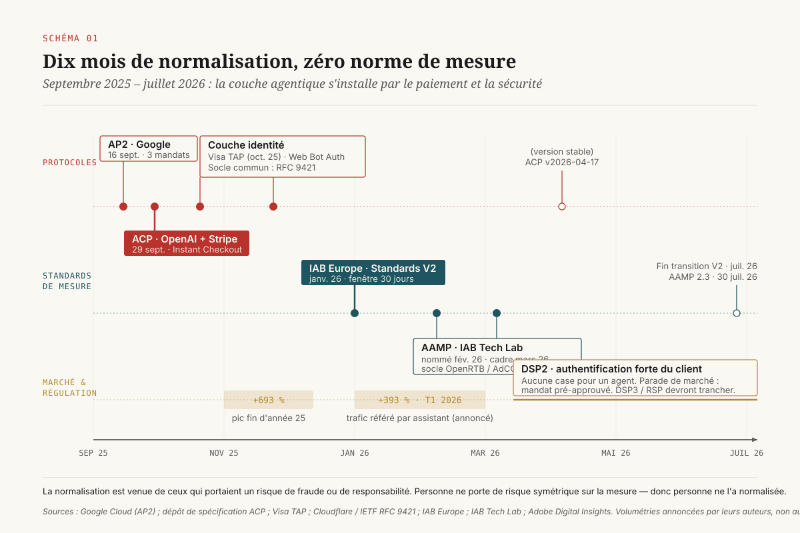

# Quand l'acheteur n'est plus humain

> **Le commerce agentique ne se décide pas au niveau du protocole de paiement. Ce qui bascule, c'est l'unité d'observation de tout le marketing numérique — la session d'un humain exposé à un stimulus. Deux des trois piliers de la mesure perdent leur objet, un seul survit : la décision de direction porte sur ce qu'on re-provisionne et sur ce qu'on fait écrire au contrat.** — 5 août 2026, Mathieu Guglielmino

Depuis dix-huit mois, la question qui circule dans les comités marketing est mal posée. Elle s'énonce « quel protocole de commerce agentique faut-il adopter », et elle suppose qu'il existe un choix à faire entre des candidats concurrents, qu'il faut le faire vite, et qu'il engage l'entreprise pour plusieurs années. Les trois suppositions sont fausses.

Les six « protocoles » que le marché cite dans le même souffle — ACP, AP2, Trusted Agent Protocol, Web Bot Auth, MCP, A2A — n'occupent pas la même case. Une fois rangés, ils se répartissent sur trois couches distinctes qui ne se disputent presque rien, et surtout ils laissent une quatrième case entièrement vide. Cette case, c'est la mesure.

Or c'est là que se joue l'arbitrage réel. Le commerce agentique ne casse pas le paiement — il le sécurise plutôt mieux qu'avant, avec une chaîne d'autorisation cryptographique dont la transaction humaine ordinaire n'a jamais disposé. Ce qu'il casse, c'est la chaîne d'observation sur laquelle repose l'intégralité de la mesure marketing depuis vingt-cinq ans : un humain est exposé à un stimulus, on l'observe, il navigue, on le suit, il achète, on rattache. ==Retirez l'humain de cette phrase et il ne reste rien à observer — il reste une transaction parfaitement authentifiée dont personne ne sait ce qui l'a causée.==

Ce dossier ne cherche pas à désigner un gagnant entre protocoles. Il pose la question que personne ne pose : **quand l'acheteur est un agent, qu'est-ce qui reste mesurable, et qu'est-ce qu'il faut aller chercher au contrat parce que ce n'est plus observable ?**

---

## 1. Ce qui a changé en dix-huit mois, et ce que ça pèse déjà

Entre septembre 2025 et juillet 2026, une couche entière de l'infrastructure du commerce en ligne s'est installée. Elle n'existait pas auparavant, et sa densité de normalisation est inhabituelle : six spécifications, deux corps de standards publicitaires, une norme IETF, dans une fenêtre de dix mois.

Le point de départ tient à deux semaines de septembre 2025. Le 16, Google annonce l'**Agent Payments Protocol** (AP2) avec plus de soixante partenaires — Mastercard, PayPal, American Express, Adyen, Worldpay, Coinbase, Etsy, Intuit, Salesforce, ServiceNow[^1]. Le 29, OpenAI et Stripe publient l'**Agentic Commerce Protocol** (ACP) et ouvrent « Instant Checkout » dans ChatGPT[^2][^3]. En octobre, Visa introduit le **Trusted Agent Protocol** (TAP), un cadre pour que les marchands distinguent un agent légitime d'un robot anonyme[^5]. En parallèle, Cloudflare pousse à l'IETF **Web Bot Auth**, une méthode de signature cryptographique du trafic d'agent adossée à la RFC 9421[^6][^7].

Le versant publicitaire suit avec un an de décalage, et c'est ce décalage qui est intéressant. **IAB Europe** publie en janvier 2026 la version 2 de ses standards de mesure du commerce media, avec une période de transition de six mois qui s'est refermée fin juillet 2026 : la fenêtre d'attribution par défaut y reste de trente jours, et le texte suppose partout une exposition observable[^10]. Le mois suivant, **IAB Tech Lab** nomme AAMP (*Agentic Advertising Management Protocols*) l'initiative sous laquelle il regroupe l'ensemble de ses travaux agentiques ; le cadre complet est publié en mars 2026, la version 2.3 le 30 juillet 2026[^12]. Autrement dit : ==le standard de mesure opposable en vigueur a été écrit pour un monde à impressions, et il est entré en application au moment précis où l'industrie publiait le cadre destiné à le dépasser.==

Le volume, lui, n'a pas attendu les standards. Adobe mesure sur les sites de distribution américains une multiplication du trafic référé par assistant d'IA — +393 % au premier trimestre 2026 sur un an, après un pic de +693 % pendant la période de fin d'année 2025[^8]. Le renversement du taux de conversion est plus significatif que le volume : en mars 2025, ce trafic convertissait 38 % moins bien que les sources classiques ; en mars 2026, il convertit 42 % mieux, avec un revenu par visite supérieur d'environ un tiers[^8]. Salesforce, sur un panel de plus de 1,5 milliard d'acheteurs dans 89 pays, estime que l'IA a « influencé » 20 % des ventes en ligne mondiales de la saison de fin d'année 2025, soit de l'ordre de 262 milliards de dollars[^9].

Ces chiffres appellent une précaution immédiate, et elle est structurante pour la suite du dossier : **ils sont annoncés par des acteurs qui vendent l'outillage correspondant, et aucun n'est audité par un tiers.** Ils indiquent un ordre de grandeur et une direction — pas un niveau. Le verbe « influencer » chez Salesforce, en particulier, n'a pas de définition publique opposable ; il recouvre une famille de situations très large. On les utilise ici pour établir que le phénomène a cessé d'être marginal, pas pour dimensionner un budget.

Ce qu'il faut retenir de cette chronologie n'est pas la liste. C'est que **la normalisation est arrivée par le paiement et par la sécurité, jamais par la mesure.** Les acteurs qui se sont précipités pour normaliser sont ceux qui avaient un risque de fraude ou de responsabilité à couvrir. Personne n'a de risque symétrique sur la mesure — donc personne ne l'a normalisée. C'est exactement pour cette raison que la charge retombe sur l'annonceur et sur le distributeur.

---

## 2. Six protocoles, trois couches, une seule case vide

La confusion vient de ce qu'on cite ces spécifications dans une liste plate, comme si elles étaient substituables. Elles ne le sont pas. Rangées, elles occupent trois couches nettement séparées.

**Couche 1 — identité et accès.** Avant toute transaction, un marchand doit pouvoir répondre à une question de gestion de trafic : ce visiteur est-il un robot d'aspiration, un agent piloté par un utilisateur réel, ou un humain ? Web Bot Auth répond par la cryptographie : le fournisseur d'agent publie une clé publique à un emplacement connu, l'agent signe ses en-têtes HTTP conformément à la RFC 9421, le site vérifie[^6][^7]. Visa TAP répond à la même question au moment du paiement, avec des signatures liées au domaine du marchand, horodatées, non rejouables, et y ajoute deux objets que Web Bot Auth n'a pas : l'**intention** de l'agent (navigue-t-il ou paie-t-il ?) et la **reconnaissance du consommateur** — identifiants de compte de paiement, numéro de fidélité, adresse électronique, transmis avec consentement[^5].

Point souvent manqué : Cloudflare sépare explicitement les *robots vérifiés* (un crawler agissant pour le compte d'une entreprise) des *agents signés* (une infrastructure agissant pour le compte d'un utilisateur final)[^6]. Cette distinction n'est pas cosmétique. Elle transforme le pare-feu applicatif en instrument de politique commerciale : on peut désormais bloquer l'aspiration tout en accueillant l'acheteur agentique, ce qui était techniquement impossible tant que les deux se présentaient comme du trafic non identifié.

**Couche 2 — mandat et autorisation.** C'est le terrain propre d'AP2. Le protocole introduit trois *mandats*, contrats numériques signés cryptographiquement et inaltérables[^1] :

- le **mandat d'intention** capture la demande initiale de l'utilisateur (« trouve-moi des chaussures de course sous 120 € ») et fournit le contexte auditable de la transaction ;
- le **mandat de panier** est créé quand l'agent a présenté ses options et que l'utilisateur approuve — il fige le contenu exact et le prix ;
- le **mandat de paiement** rattache le moyen de paiement au contenu vérifié du panier.

Google formule explicitement l'objectif : cette séquence « crée une piste d'audit non répudiable qui répond aux questions d'autorisation et d'authenticité, et fournit une base claire pour la responsabilité »[^1]. Le protocole est agnostique au règlement — carte, virement instantané, monnaie stable[^1].

**Couche 3 — transaction et règlement.** C'est ACP. La spécification, maintenue par OpenAI et Stripe sous un modèle de décision par consensus avec l'intention affichée de passer à terme sous l'égide d'une fondation neutre, comprend une API de commande, une API de délégation de paiement et un flux produit[^2]. Le versionnement est daté ; la version stable au moment de la rédaction est celle du 17 avril 2026[^2]. Le principe de conception qui compte pour une direction commerciale est écrit noir sur blanc : les agents « intègrent la transaction sans devenir le marchand de référence », l'architecture « préserve la relation entre le marchand et son client »[^2]. Le jeton de paiement partagé transmis au marchand ou à son prestataire est borné par un montant maximal et une expiration[^4].

[SCHEMA-02]

Une fois cette pile dessinée, l'observation qui commande le reste du dossier saute aux yeux : **il n'y a personne sur la quatrième case.** Aucune des six spécifications ne définit ce qu'est une exposition, ce qu'est une attribution, ni ce qu'un annonceur est en droit de mesurer ou de vérifier dans une transaction agentique. AAMP travaille sur la couche publicitaire, mais par le haut — en étendant OpenRTB, AdCOM et OpenDirect vers un monde d'agents acheteurs de média[^12] — et non sur la question de savoir ce qui reste observable quand l'acheteur *final* est un agent.

Conséquence directe pour un comité d'investissement : **le choix du protocole n'est pas une décision structurante, parce que les protocoles ne se disputent pas la ressource rare.** Un marchand qui implémente ACP, TAP et Web Bot Auth ne fait pas trois paris concurrents ; il équipe trois couches. La ressource rare, c'est la capacité à savoir ce qui a causé une vente — et aucune de ces implémentations ne l'améliore d'un pouce.

---

## 3. Ce que le marchand reçoit, ce qui ne lui arrive plus

Prenons une transaction agentique complète et regardons ce qui traverse jusqu'au système d'information du marchand.

**Ce qui arrive, et qui est de bonne qualité.** Une identité d'agent vérifiée cryptographiquement, non rejouable, liée au domaine du marchand[^5]. Une preuve que l'agent porte des instructions valides de l'utilisateur pour cet achat précis[^5]. Un jeton de paiement borné en montant et en durée[^4]. Des identifiants du consommateur, quand celui-ci les a consentis : référence de compte de paiement, numéro de fidélité, courriel[^5]. Un panier figé et signé[^1]. La commande, le montant, les articles.

Il faut le dire clairement, parce que le discours ambiant sur le sujet est anxiogène : **sur le plan de l'authentification, la transaction agentique est meilleure que la transaction humaine ordinaire.** Un panier signé et non répudiable est un objet dont le commerce en ligne n'a jamais disposé. Le contentieux « je n'ai pas commandé ça » devient tranchable par la preuve.

**Ce qui n'arrive pas.** La requête initiale de l'utilisateur — sa formulation, ses contraintes, son budget déclaré. Les alternatives que l'agent a considérées et écartées. Le critère qui a fait pencher la décision : prix, disponibilité, délai de livraison, avis, position dans une liste, souvenir d'un achat précédent. Le nombre de marchands consultés. Le temps de délibération. Et, plus fondamentalement : le fait qu'il y ait eu, ou non, une exposition publicitaire quelque part en amont.

Tout ce bloc — c'est-à-dire **l'intégralité de la phase de considération** — se déroule à l'intérieur du système du fournisseur d'agent. Le marchand ne le voit pas, et rien dans les protocoles ne l'y oblige. Le mandat d'intention d'AP2 contient bien la demande initiale de l'utilisateur[^1], mais il circule dans la chaîne d'autorisation de paiement, pas dans la chaîne d'analyse marketing — et il n'existe aucune obligation de le rendre exploitable à des fins de mesure.

[SCHEMA-03]

Le déplacement est donc net et il est asymétrique : **la donnée comportementale du marchand commence désormais au moment de la mise au panier.** Découverte, comparaison, considération, formation de la préférence : ce qui constituait le matériau de l'analyse marketing est passé chez un tiers, qui n'a aucune raison contractuelle de le restituer et de bonnes raisons commerciales de le garder.

C'est le même mouvement que celui des places de marché il y a quinze ans, avec une différence de degré qui devient une différence de nature. Une place de marché prenait la relation client mais laissait voir le parcours à l'intérieur de sa surface, et cette surface était mesurable — c'est même sur cette mesurabilité que s'est construit le retail media. Ici, la surface elle-même est invisible : il n'y a pas de page, pas d'emplacement, pas d'impression, rien à instrumenter.

---

## 4. L'unité d'observation qui disparaît

On arrive au cœur. L'erreur d'analyse la plus répandue consiste à traiter l'agentique comme une nouvelle vague de perte de signal — après la fin des témoins tiers, après l'ITP d'Apple, après le mode consentement. Cette lecture est rassurante et elle est fausse. Les vagues précédentes retiraient des **identifiants** : on perdait la capacité à relier deux observations entre elles, et la parade était modélisatrice — modéliser les conversions manquantes, reconstruire les parcours, imputer.

L'agentique ne retire pas des identifiants. Elle retire l'**événement observé**. Il ne s'agit pas d'un individu qu'on ne sait plus relier ; il s'agit d'une exposition qui n'a pas eu lieu, d'un parcours qui s'est déroulé ailleurs, d'une session qui n'existe pas. ==On ne modélise pas un événement qui ne s'est pas produit — on ne peut que renoncer à le mesurer, ou changer d'objet de mesure.==

Décomposons ce qui disparaît, brique par brique :

- **L'exposition** — il n'y a plus personne à qui montrer une annonce. Un agent qui interroge un catalogue ne « voit » pas une bannière ; il ingère des données. La notion d'impression, qui est l'unité de facturation d'une part écrasante du marché publicitaire, perd son référent.
- **Le parcours** — la séquence des points de contact se déroule dans un système fermé qui n'émet rien.
- **La session** — l'agent n'a pas de session au sens analytique. Il peut interroger vingt marchands en parallèle, ne rien acheter, revenir trois jours plus tard depuis une autre infrastructure.
- **L'identité** — elle survit partiellement, et paradoxalement mieux qu'ailleurs, puisque TAP prévoit la transmission d'identifiants consentis[^5]. Mais c'est une identité *au moment de payer*, pas une identité *au moment d'être exposé* — donc inutilisable pour rattacher une conversion à un stimulus.

Appliquons maintenant cette grille aux trois piliers de la mesure marketing. Le résultat n'est pas une dégradation uniforme : c'est un tri.

**Pilier 1 — l'attribution multi-touch : sans objet.** Elle repose intégralement sur l'observation d'une séquence de points de contact rattachés à un individu. Retirez l'exposition, le parcours et la session, et il ne reste pas une attribution dégradée : il ne reste rien. Ce n'est pas un problème de précision, c'est un problème de définition. Les modèles de dernier clic, de premier clic, en U ou pilotés par les données ont tous besoin de savoir *quels contacts ont eu lieu* — et la réponse, en agentique, est structurellement inaccessible au marchand.

C'est aussi la ligne qui rend le standard de mesure en vigueur inapplicable : les *Retail Media Measurement Guidelines* IAB/MRC définissent l'attribution comme le rattachement d'une conversion à une exposition dans une fenêtre de rétrospection[^11], et la version 2 des standards IAB Europe reconduit une fenêtre par défaut de trente jours[^10]. Ces textes sont bien écrits pour ce qu'ils décrivent. Ils décrivent un monde qui a un spectateur.

**Pilier 2 — le retail media : l'inventaire perd son spectateur, mais pas sa valeur.** C'est la ligne la plus intéressante parce que c'est la seule qui se déplace au lieu de disparaître. Ce qu'un annonceur achète en retail media, ce n'est pas fondamentalement un pixel : c'est de l'**influence sur une décision d'achat au point de vente numérique**. Le pixel n'était que le véhicule. Quand la décision est prise par un agent, le véhicule change — l'influence passe par le classement, la complétude du flux produit, la structuration des attributs, la disponibilité déclarée — mais l'objet acheté reste le même. La difficulté est ailleurs : **il n'existe aujourd'hui aucune méthode acceptée pour compter, facturer et certifier cette influence.** C'est une crise de l'unité de facturation et de l'audit, pas une disparition du marché.

**Pilier 3 — l'incrémentalité mesurée par l'expérience, et le modèle de mix : structurellement indemnes.** Et pour une raison qui n'a rien d'accidentel : ces méthodes n'ont **jamais** eu besoin d'observer l'individu. Une expérimentation géographique compare l'évolution des ventes agrégées d'un ensemble de zones traitées à celle de zones témoins ; elle n'a besoin de connaître ni le parcours, ni la session, ni l'identité de qui que ce soit. Un modèle de mix travaille sur des séries temporelles agrégées de dépense et de ventes. **Que l'acheteur final soit un humain ou un agent est, pour ces deux méthodes, rigoureusement indifférent** — tant que les ventes, elles, restent comptées.

[SCHEMA-04]

Ce dernier point mérite d'être formulé sans ambiguïté, parce qu'il constitue la conséquence pratique principale de ce dossier. Le débat « modèle de mix contre expérimentation contre attribution », qui occupe les directions marketing depuis cinq ans, vient d'être tranché par l'infrastructure plutôt que par l'argumentation. ==L'agentique ne dégrade pas l'attribution multi-touch : elle la prive d'objet, et promeut par élimination la seule famille de méthodes qui ne dépendait pas de l'observation individuelle.==

Ceux qui ont déjà investi dans une capacité d'expérimentation interne n'ont, sur ce plan, rien à faire. Ceux qui ont bâti leur pilotage sur une chaîne d'attribution comportementale ont un chantier, et son échéance est celle de la montée en charge du canal agentique — pas celle d'une décision réglementaire.

Deux réserves honnêtes, cependant. La première : l'incrémentalité expérimentale résiste, mais elle reste chère et lente, et un test isolé est presque toujours sous-puissant — sa valeur ne se réalise qu'en régime, avec une cadence annuelle et un budget témoin provisionné. Elle ne remplace pas l'attribution en granularité ni en fréquence ; elle la remplace en *validité*. La seconde : si une part significative des ventes bascule vers des canaux agentiques dont la volumétrie n'est pas correctement rattachée au périmètre géographique du test, l'estimation devient bruitée. La condition de survie de l'incrémentalité, c'est de continuer à **compter proprement les ventes par zone** — ce qui reste possible, mais suppose que les commandes agentiques portent une géographie exploitable.

---

## 5. Le retail media sans spectateur

Le retail media est le point où l'agentique cesse d'être un sujet de mesure pour devenir un sujet de contrat. Il pèse assez pour que le problème remonte au comité de direction.

Reprenons la chaîne. Aujourd'hui, un annonceur achète un emplacement chez un distributeur, le distributeur sert une impression à un visiteur identifié dans son propre environnement, observe une conversion dans la fenêtre convenue, et rapporte. Le dispositif est en boucle fermée — c'est sa force et c'est aussi son vice de forme : **le distributeur est à la fois vendeur de l'espace et mesureur de sa performance.** Le sujet est connu et il est ancien.

L'agentique aggrave ce vice de deux façons.

**D'abord, elle supprime la seule brique que l'annonceur pouvait encore vérifier de l'extérieur.** Une impression, on peut la faire mesurer par un tiers ; une position dans un classement consulté par un agent, non — il n'existe ni norme de visibilité, ni mesureur indépendant, ni même de définition de ce qu'il faudrait compter. L'annonceur passe d'une boucle fermée *auditable en un point* à une boucle fermée *entièrement déclarative*.

**Ensuite, elle déplace l'objet vendu vers quelque chose qui ressemble beaucoup à du référencement payant à l'intérieur du catalogue** — avec une différence : le classement est consommé par une machine, à un rythme et dans des volumes qui rendent la notion d'enchère au coût par mille difficile à défendre. Que vaut une impression servie à un agent qui interroge quarante références en deux cents millisecondes et n'en retient qu'une ? La question n'est pas rhétorique : c'est la question de tarification que tout contrat de régie devra trancher dans les dix-huit mois.

[SCHEMA-05]

L'état des standards ne comble pas ce vide, et il faut regarder le calendrier de près pour comprendre pourquoi. IAB Europe a publié en janvier 2026 la version 2 de ses standards de mesure du commerce media, avec transition close fin juillet 2026 et fenêtre d'attribution par défaut de trente jours, « empiriquement justifiée » et alignée sur le cycle de vente de la catégorie[^10]. Le texte est solide — pour un monde à impressions. IAB Tech Lab, de son côté, construit AAMP sur OpenRTB, AdCOM et OpenDirect en y greffant MCP, A2A et gRPC[^12] : c'est la standardisation de l'**achat média par des agents**, pas celle de la **mesure d'un achat produit par un agent**. Les deux sujets portent le même adjectif et ne sont pas le même problème.

Il y a donc, à date, un trou de normalisation à l'endroit exact où passe l'argent. La conséquence pratique est contractuelle, pas technique. Trois clauses deviennent la vraie négociation :

1. **Un droit de vérification indépendante**, ou à défaut un droit d'audit sur la méthode et sur la donnée sous-jacente — puisqu'il n'y a plus de tiers mesureur à interposer.
2. **Une définition écrite et versionnée de l'unité facturée** en contexte agentique, avec l'engagement de notifier tout changement de méthode. Sans cela, l'unité de facturation dérive silencieusement au rythme des évolutions de l'algorithme de classement du distributeur.
3. **Une obligation de triangulation** : la performance déclarée par la régie doit pouvoir être confrontée périodiquement à une mesure d'incrémentalité conduite par l'annonceur, avec un périmètre et une cadence convenus d'avance. C'est le seul contrepoids réel, et il suppose que l'annonceur ait la capacité correspondante en interne — ce qui renvoie à l'arbitrage de la section précédente.

---

## 6. Du consentement au mandat

Il y a un glissement juridique dans cette affaire, et il est plus profond qu'il n'y paraît.

Le régime de la donnée personnelle en Europe repose sur un **consentement** : donné par une personne, pour une finalité déterminée, révocable à tout moment, et dont le responsable de traitement doit pouvoir apporter la preuve. C'est un objet vivant — il se retire, il expire, il se re-collecte.

Ce que les protocoles agentiques installent est d'une autre nature : un **mandat**. Le mandat d'intention d'AP2 capture l'instruction initiale ; le mandat de panier fige la validation ; le mandat de paiement lie le moyen de règlement au panier vérifié[^1]. L'ensemble est signé cryptographiquement et forme une piste d'audit « non répudiable »[^1]. Un mandat, ce n'est pas un consentement : c'est une **délégation d'autorité, prouvable après coup**. On ne le retire pas — on l'exécute ou on ne l'exécute pas, et il laisse une trace opposable.

Le déplacement de gouvernance qui en découle est concret. La question « cette personne a-t-elle consenti au traitement ? » se double d'une question nouvelle : « **pour le compte de qui cet agent a-t-il agi, et sur quelle autorité ?** » — question de chaîne de délégation, pas de finalité de traitement. Elle appelle des réponses que le registre des traitements ne contient pas.

[SCHEMA-06]

Côté paiement, le droit européen n'a pas encore de case pour cet objet. Les modèles de paiement par agent restent soumis à la DSP2 et à ses normes techniques sur l'authentification forte du client, sans régime spécifique ; or ce régime suppose une **autorisation humaine claire de l'ordre de paiement**, et il n'existe pas de mécanisme permettant de traiter un agent comme l'équivalent d'un payeur humain[^13][^14]. La parade employée en pratique — le mandat de dépense pré-approuvé, avec plafonds et cas d'usage définis à l'avance[^14] — est exactement ce que décrit le jeton borné en montant et en durée d'ACP[^4] et la chaîne de mandats d'AP2[^1]. Ce sont des solutions d'ingénierie construites en anticipation d'un cadre que la DSP3 et le règlement sur les services de paiement devront trancher[^13][^14].

Deux conséquences opérationnelles, à décider maintenant et non quand le texte sortira :

- **La preuve d'autorisation devient un objet à conserver.** Pas au titre du marketing, au titre du contentieux. Un panier signé et non répudiable n'a de valeur défensive que s'il est retrouvable au moment où quelqu'un le conteste. Cela suppose une politique de conservation explicite — durée, format, responsable — et cette politique n'existe dans presque aucune organisation aujourd'hui.
- **La question « qui répond » doit être tranchée par écrit avec le fournisseur d'agent.** Les protocoles répètent que l'agent n'est pas le marchand de référence[^2] et que la chaîne de mandats fournit « une base claire pour la responsabilité »[^1]. Une base claire n'est pas une répartition. Si un mandat d'intention est mal interprété — un agent achète le mauvais article, au mauvais prix, en trop grande quantité — la chaîne prouve *ce qui a été signé*, pas *qui supporte l'écart*. C'est une clause à négocier, pas une propriété du protocole.

---

## 7. Le catalogue cesse d'être une vitrine

L'autre moitié de la décision est côté marchand, et elle est plus immédiate que tout ce qui précède.

Depuis vingt ans, une fiche produit est une **surface de persuasion** : on y optimise des photographies, un titre, une preuve sociale, un bouton. L'organisation qui la produit est une organisation de conversion, et son budget est un budget de conversion.

Quand le lecteur est un agent, la fiche redevient ce qu'elle n'aurait jamais dû cesser d'être : une **source de données**. Ce qui compte alors, c'est la complétude et l'exactitude des attributs, la fraîcheur du prix et du stock, la structuration du flux produit, la précision des délais et des conditions de retour. ACP prévoit d'ailleurs un flux produit comme l'une de ses trois spécifications, aux côtés de la commande et de la délégation de paiement[^2] — la découverte est traitée comme un objet de premier rang, pas comme un sous-produit du site.

Le constat empirique d'Adobe recoupe ce déplacement : le trafic référé par assistant croît fortement pendant que les sites de distribution restent, en moyenne, mal préparés à être lus par une machine[^8]. C'est un écart d'investissement, pas un écart technique — les compétences existent, elles sont simplement affectées ailleurs.

La décision qui en découle est un arbitrage budgétaire simple à énoncer et inconfortable à trancher : **une part du budget de conversion doit basculer vers un budget de lisibilité et de gouvernance du catalogue.** Ce budget ne produira aucune amélioration mesurable du taux de conversion sur le site propre. Sa contrepartie est ailleurs : être retenu par un agent dans une liste de trois.

Et il vient avec une décision jumelle, celle-là franchement politique : **qui a le droit de lire le catalogue, et à quelles conditions ?** Web Bot Auth transforme cette question en levier actionnable, en séparant les robots d'aspiration des agents pilotés par un utilisateur[^6][^7]. Un marchand peut désormais choisir : ouvrir à tous, ouvrir seulement aux agents signés, ouvrir sous condition contractuelle. Ce n'est plus un réglage de sécurité, c'est une politique de distribution — de même nature que la décision d'entrer ou non sur une place de marché, avec les mêmes conséquences sur la marge et sur la propriété de la relation client.

---

## 8. Cinq arbitrages datés

Voici, en synthèse, ce qu'une direction data ou marketing a réellement à décider en 2026. Chacun de ces arbitrages est daté par un événement extérieur, et chacun est classé selon sa réversibilité — parce que c'est le critère qui doit dicter l'ordre.

**1. Fixer une politique d'accès des agents au catalogue.** *Réversible.* La brique technique existe et se déploie en semaines. La décision porte sur le régime : ouvert, signé seulement, ou contractuel. À prendre en premier parce qu'elle est peu coûteuse, qu'elle produit immédiatement de la donnée sur le volume agentique réel, et qu'elle se révise.

**2. Re-provisionner la mesure sur l'incrémentalité expérimentale.** *Peu réversible — délai de constitution long.* C'est le vrai chantier. Une capacité d'expérimentation ne s'achète pas au coup par coup : elle suppose une cadence annuelle, un budget témoin provisionné à l'exercice, et une règle de décision pré-enregistrée. Une organisation qui décide en 2026 dispose d'une capacité utilisable en 2027. Une organisation qui attend que l'attribution cesse visiblement de fonctionner décidera trop tard.

**3. Ouvrir la renégociation des clauses de vérification en régie.** *Réversible mais fenêtré.* Les standards de mesure du commerce media viennent d'entrer pleinement en application[^10] et ne couvrent pas l'agentique. Le moment où l'on peut encore faire écrire un droit d'audit et une définition versionnée de l'unité facturée, c'est maintenant — avant que la pratique s'installe et devienne la norme par défaut.

**4. Décider d'une politique de conservation de la chaîne d'autorisation.** *Peu réversible.* Ce qui n'a pas été conservé au moment de la transaction ne se reconstitue pas. Durée, format, responsable : trois lignes à écrire, dont la valeur ne se révèle qu'au premier contentieux.

**5. Ne pas standardiser prématurément sur un protocole.** *La décision la plus rentable est ici de ne pas décider.* Les couches identité, mandat et transaction sont occupées par des acteurs différents, sans concurrence frontale, et la couche identité converge techniquement — TAP et Web Bot Auth reposent tous deux sur les signatures de message HTTP de la RFC 9421[^5][^7]. Implémenter ce qui est nécessaire, couche par couche, coûte moins cher qu'un pari d'architecture sur un gagnant, et n'engage pas.

[SCHEMA-07]

---

## Ce qu'il faut retenir

Le commerce agentique est presque toujours présenté comme un problème de paiement. C'est la partie qui a été résolue en premier, et plutôt bien : la chaîne de mandats signés offre une qualité d'autorisation que le commerce en ligne n'avait jamais eue.

Le problème non résolu est ailleurs, et il n'a pour l'instant aucun propriétaire : **plus personne ne sait ce qui cause une vente.** Non pas parce que la donnée est protégée ou fragmentée, mais parce que l'événement qu'on mesurait — un humain exposé à un stimulus — n'a pas lieu. Aucun des six protocoles ne le traite, parce qu'aucun de leurs auteurs ne porte le risque correspondant. Ce risque est intégralement chez l'annonceur et chez le distributeur.

La bonne nouvelle est qu'il existe une famille de méthodes que cette bascule n'atteint pas, pour la raison qui la rendait autrefois inconfortable : elle n'a jamais eu besoin de l'individu. L'expérimentation d'incrémentalité et le modèle de mix travaillent sur des agrégats et sur des contrefactuels, pas sur des parcours. Ils sont plus lents, plus chers, moins granulaires — et ils sont, à partir de maintenant, la seule chose qui reste debout.

==Le commerce agentique n'a pas rendu la mesure plus difficile. Il a rendu obligatoire la mesure difficile.==

---

## Note de méthode

Trois réserves à porter avec ce dossier.

**Sur l'accès aux sources.** Plusieurs pages primaires renvoient un `HTTP 403` en récupération automatique depuis l'environnement de rédaction (openai.com, docs.stripe.com, business.adobe.com, blog.cloudflare.com, investor.visa.com). Les éléments qui en proviennent ont été recoupés sur au moins deux formulations indépendantes, mais ils doivent être revérifiés à la source avant toute réutilisation en cadrage ou en support commercial.

**Sur les chiffres de volumétrie.** Les données Adobe et Salesforce sont produites et publiées par des acteurs qui commercialisent l'outillage correspondant. Aucune n'est auditée par un tiers, et le verbe « influencer » employé par Salesforce n'a pas de définition publique opposable. Elles sont utilisées ici comme ordres de grandeur et comme indication de direction — jamais comme mesure. C'est d'ailleurs une illustration du propos du dossier : les seuls chiffres disponibles sur l'ampleur du phénomène sont produits par des méthodes que le phénomène lui-même invalide.

**Sur un chiffre écarté.** Une donnée circulant en seconde main — les marchands implémentant deux protocoles capteraient environ 40 % de trafic agentique de plus que ceux n'en soutenant qu'un — n'a pas pu être ramenée à une source primaire. Elle est écartée du dossier plutôt que citée avec réserve.

---

## Sources

[^1]: Google Cloud, « Announcing Agent Payments Protocol (AP2) », 16 septembre 2025. https://cloud.google.com/blog/products/ai-machine-learning/announcing-agents-to-payments-ap2-protocol

[^2]: Agentic Commerce Protocol, spécification et gouvernance (mainteneurs fondateurs : OpenAI et Stripe ; version stable 2026-04-17). https://github.com/agentic-commerce-protocol/agentic-commerce-protocol

[^3]: OpenAI, « Buy it in ChatGPT: Instant Checkout and the Agentic Commerce Protocol », 29 septembre 2025. https://openai.com/index/buy-it-in-chatgpt/

[^4]: Stripe, « Developing an open standard for agentic commerce » et documentation *Agentic Commerce Protocol* (jeton de paiement partagé, délégation de paiement). https://stripe.com/blog/developing-an-open-standard-for-agentic-commerce

[^5]: Visa, *Trusted Agent Protocol* — dépôt de spécification et annonce d'octobre 2025 (identité d'agent, intention d'agent, reconnaissance du consommateur ; signatures RFC 9421). https://github.com/visa/trusted-agent-protocol

[^6]: Cloudflare, « The age of agents: cryptographically recognizing agent traffic » et documentation *Signed agents / Web Bot Auth*. https://blog.cloudflare.com/signed-agents/

[^7]: IETF, RFC 9421 — *HTTP Message Signatures*. https://www.rfc-editor.org/rfc/rfc9421.html

[^8]: Adobe, *Adobe Digital Insights* — rapports sur le trafic référé par IA vers les sites de distribution, 2026. https://business.adobe.com/blog/ai-traffic-surge-retail-sites-not-machine-readable

[^9]: Salesforce, données de la saison de fin d'année 2025 (panel de plus de 1,5 milliard d'acheteurs dans 89 pays). https://www.salesforce.com/news/stories/2025-holiday-shopping-data/

[^10]: IAB Europe, *Commerce (incl. Retail) Media Measurement Standards V2*, janvier 2026 (fenêtre d'attribution par défaut de 30 jours ; transition close fin juillet 2026). https://iabeurope.eu/iab-europe-releases-updated-commerce-incl-retail-media-standards-flexi-ad-sizes-guidelines-for-retail-media-networks/

[^11]: IAB / MRC, *Retail Media Measurement Guidelines*, janvier 2024. https://www.iab.com/wp-content/uploads/2024/01/IAB_Retail_Media_Measurement_Guidelines_January2024.pdf

[^12]: IAB Tech Lab, AAMP — *Agentic Advertising Management Protocols* (initiative nommée en février 2026, cadre publié en mars 2026, version 2.3 le 30 juillet 2026 ; socle OpenRTB / AdCOM / OpenDirect étendu par MCP, A2A et gRPC). https://www.iab.com/external-links/get-aampd-iab-tech-labs-agentic-ad-management-protocol/

[^13]: Taylor Wessing, « Agentic AI in payments: key regulatory considerations », février 2026. https://www.taylorwessing.com/en/insights-and-events/insights/2026/02/agentic-ai-in-payments

[^14]: Osborne Clarke, « Agentic payments: a new challenge for Europe's payments ecosystem ». https://www.osborneclarke.com/insights/agentic-payments-new-challenge-europes-payments-ecosystem

---

*Format co-écrit avec l'aide d'une IA.*
