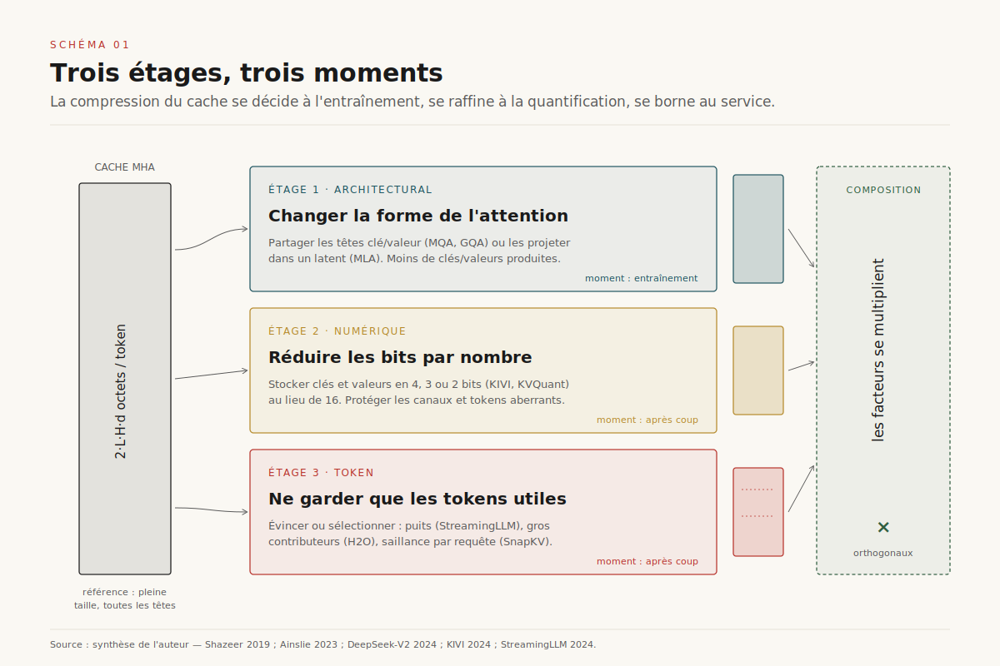
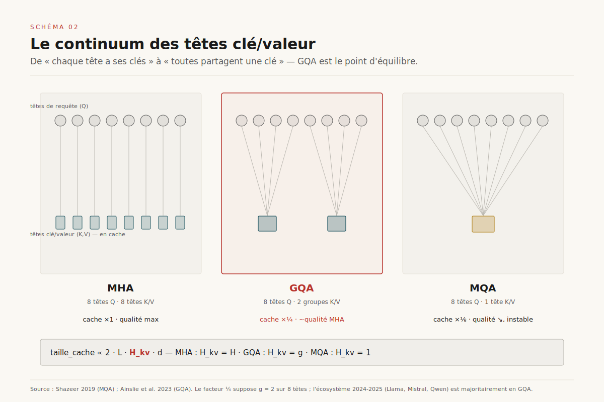
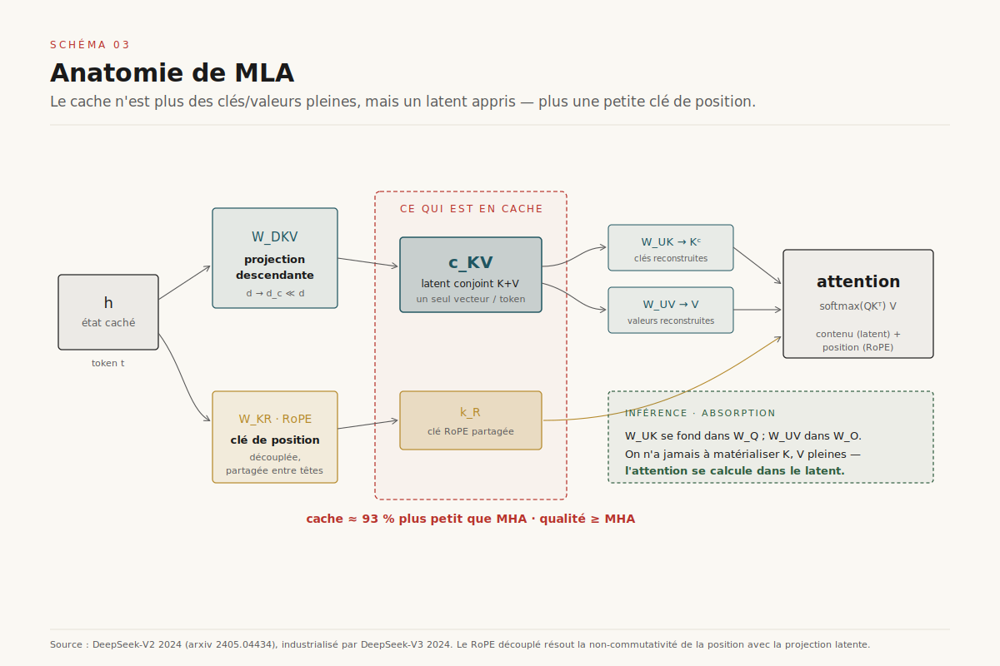
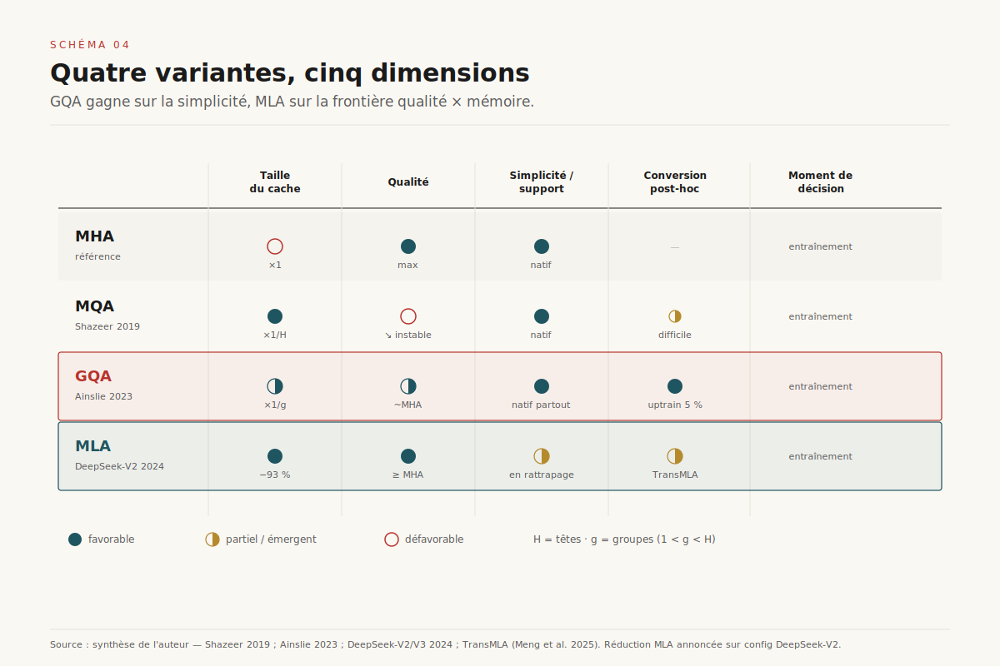
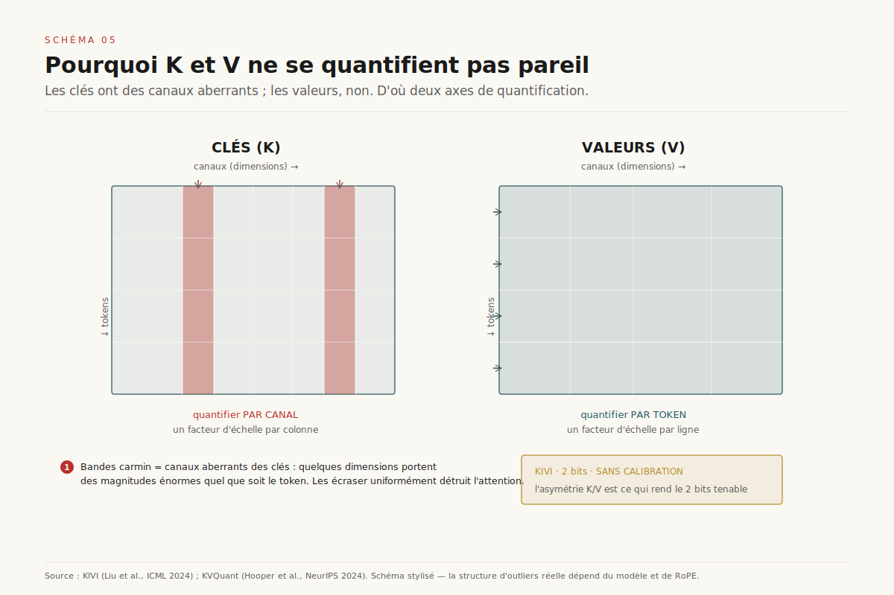

# Compresser le KV-cache

> **Compresser le KV-cache n'est pas une optimisation de service greffée après coup : c'est un choix d'architecture d'attention, fait à trois étages distincts — partager les têtes (MQA/GQA), les projeter dans un latent (MLA), ou compresser les octets déjà écrits (quantification, éviction). En 2026, l'arbitrage porteur n'est plus « faut-il compresser » mais MLA contre GQA : deux philosophies du compromis qualité × mémoire, que les trois étages permettent par ailleurs de superposer.** — 17 juillet 2026, Mathieu Guglielmino

Le rapport [*L'économie du KV-cache*](../kv-cache/) posait le diagnostic : sur une charge d'inférence réelle, le facteur limitant n'est plus le FLOP mais l'octet — la mémoire occupée par les clés et valeurs mises en cache par le mécanisme d'attention. Il décrivait ensuite comment les systèmes de service *gèrent* cette rareté : pagination (PagedAttention), partage de préfixes (RadixAttention), désagrégation prefill/decode. Toutes ces techniques prennent le cache comme une donnée et l'orchestrent au mieux.

Ce rapport traite de l'autre moitié du problème : **rendre le cache plus petit à la source**. Là où la gestion mémoire optimise l'allocation d'un objet de taille fixée, la compression change la taille de l'objet lui-même. Et cette bascule fait remonter la décision d'un cran : elle ne se joue plus dans l'ordonnanceur du serveur d'inférence, mais dans l'architecture du modèle, souvent au moment de l'entraînement. ==Comprimer le KV-cache, c'est reconnaître que la forme du cache est une variable de conception du modèle, pas une constante physique.==

## 1. Pourquoi le cache pèse trop — et pourquoi c'est un problème d'architecture

Rappelons la formule de coût. Pour un modèle à *L* couches, *H* têtes d'attention de dimension *d*, la taille du KV-cache par token vaut :

`taille_par_token = 2 · L · H · d · précision_octets`

Le facteur 2 compte la clé *et* la valeur. Pour un modèle de 30 milliards de paramètres avec des têtes classiques (*multi-head attention*, MHA), on atteint facilement plusieurs centaines de kilo-octets par token — et cette occupation croît linéairement avec la longueur de la séquence *et* avec la taille du batch. À contexte long, sur une session multi-tours ou un agent, le cache finit par dominer l'empreinte mémoire du modèle lui-même[^1].

Trois observations rendent la compression inévitable plutôt qu'accessoire.

**La mémoire, pas le calcul.** La phase de décodage autorégressif est *memory-bound* : à chaque token généré, le GPU passe le plus clair de son temps à *lire* le cache depuis la mémoire haute-bande-passante (HBM), pas à multiplier des matrices. Réduire le cache de moitié réduit à peu près de moitié le trafic mémoire du décodage — donc double le débit potentiel. La compression n'achète pas seulement de la capacité, elle achète de la *latence*[^1].

**Le cache scale mal.** Doubler les paramètres double le coût des poids une fois. Doubler le contexte double le cache à *chaque* requête, en permanence. Sur les usages 2026 — RAG à long document, agents à mémoire, raisonnement à chaîne longue — c'est le second terme qui explose.

**La décision remonte à l'entraînement.** On peut quantifier ou évincer un cache *après* l'entraînement. Mais le levier le plus puissant — combien de têtes clé/valeur le modèle possède, s'il les projette dans un espace latent — se fixe au moment où l'on dessine l'architecture. ==Un modèle entraîné en MHA classique porte pour toujours un cache que seule la compression post-hoc peut réduire ; un modèle entraîné en MLA naît avec un cache déjà comprimé d'un ordre de grandeur.== C'est pourquoi ce rapport distingue trois *étages* de compression, à trois moments différents du cycle de vie du modèle.

- **Étage architectural (entraînement).** On change la structure de l'attention pour qu'elle produise moins de clés/valeurs : partage de têtes (MQA, GQA) ou projection latente (MLA).
- **Étage numérique (après coup).** On garde la structure mais on stocke chaque nombre sur moins de bits : quantification du cache (KIVI, KVQuant).
- **Étage token (après coup).** On garde la structure et la précision mais on ne conserve *pas tous les tokens* : éviction, sélection (H2O, StreamingLLM, SnapKV).

Les trois sont largement orthogonaux et se composent. On peut quantifier un cache déjà réduit par GQA, puis en évincer les tokens froids. La suite les prend un par un.

## 2. Étage architectural (a) — partager les têtes : de MQA à GQA

L'idée la plus ancienne est aussi la plus simple. En MHA classique, chaque tête d'attention a sa propre projection de clés et de valeurs : *H* têtes de requête, *H* têtes de clé, *H* têtes de valeur. Le cache porte donc *H* jeux de clés/valeurs par token. Or les têtes de requête sont ce qui donne au modèle sa richesse d'attention — mais faut-il vraiment *H* jeux de clés distincts ?

**Multi-Query Attention (MQA).** En 2019, Noam Shazeer répond : non, un seul suffit. En MQA, les *H* têtes de requête partagent **une unique** tête de clé et **une unique** tête de valeur[^2]. Le cache passe de *H* jeux à *1* jeu — une réduction d'un facteur *H* (souvent 32 à 64). Le décodage, memory-bound, accélère d'autant. Le prix : une perte de qualité mesurable et, plus insidieux, une *instabilité* d'entraînement sur les gros modèles. Une seule tête clé/valeur est un goulot d'expressivité ; le modèle a moins de manières de « regarder » son passé.

**Grouped-Query Attention (GQA).** En 2023, Ainslie et ses co-auteurs proposent l'interpolation évidente : au lieu de 1 ou de *H* jeux clé/valeur, en avoir *g*, avec 1 < *g* < *H*[^3]. Les *H* têtes de requête sont réparties en *g* groupes ; chaque groupe partage un jeu clé/valeur. Avec *g* = 8 sur un modèle à 64 têtes, le cache est divisé par 8, presque toute la qualité MHA est préservée, et l'instabilité de MQA disparaît. Mieux : les auteurs montrent qu'on peut *convertir* un modèle MHA existant en GQA par « uptraining » — en moyennant les projections clé/valeur par groupe puis en ré-entraînant sur ~5 % du budget de pré-entraînement d'origine[^3]. On n'a pas besoin de repartir de zéro.

Ce détail — la conversion bon marché — explique l'adoption massive de GQA. Llama-2 70B l'adopte, puis Llama-3 sur *toutes* ses tailles, Mistral, Qwen, et l'essentiel des modèles ouverts de 2024-2025. ==GQA est devenu le réglage par défaut de l'attention moderne non parce qu'il est optimal, mais parce qu'il offre ~90 % du gain de MQA pour ~10 % de son risque, et qu'il se greffe sur un checkpoint existant.== C'est un compromis d'ingénieur, pas une percée théorique — et c'est précisément ce qui en fait le standard.

Reste que GQA laisse de la valeur sur la table. Le partage de têtes est un instrument grossier : il jette de l'information (les têtes fusionnées perdent leur individualité) sans exploiter la *structure* redondante des clés et valeurs. D'où le second levier architectural, plus ambitieux.

## 3. Étage architectural (b) — projeter dans un latent : Multi-Head Latent Attention

DeepSeek-V2, en mai 2024, prend le problème par l'autre bout[^4]. Plutôt que de réduire le *nombre* de têtes clé/valeur, MLA (*Multi-head Latent Attention*) réduit la *dimension* de ce qu'on met en cache — en le compressant dans un espace latent basse-dimension.

**La compression conjointe.** Pour chaque token, MLA ne met pas en cache les clés et valeurs pleines. Il met en cache un unique **vecteur latent** *c_KV*, de dimension bien plus faible, obtenu par une projection descendante (*down-projection*) de l'état caché. Au moment de l'attention, deux projections montantes (*up-projections*) reconstruisent les clés et valeurs pleines à partir de ce latent. Le cache ne porte donc plus 2·*H*·*d* nombres par token, mais seulement *d_c* nombres (la dimension latente), plus un petit terme pour la position. La réduction est spectaculaire : DeepSeek-V2 annonce un cache environ **93 % plus petit** que le MHA équivalent, pour une qualité *supérieure* à celle de MHA — pas seulement préservée[^4].

Comment obtenir *à la fois* plus de compression que GQA *et* plus de qualité que MHA ? Parce que la projection latente est **apprise** : le modèle découvre lui-même le sous-espace basse-dimension qui préserve l'information utile de l'attention. Là où GQA impose une structure de partage arbitraire (« ces 8 têtes partagent »), MLA laisse la descente de gradient trouver la meilleure compression. C'est la différence entre couper des têtes au hasard et apprendre une base optimale.

**Le piège de RoPE, et le RoPE découplé.** Un détail technique a failli tout faire échouer, et sa résolution est le cœur de l'élégance de MLA. Les modèles modernes encodent la position par *rotary position embedding* (RoPE), qui applique aux clés une rotation dépendant de leur position. Or RoPE est *position-dépendant et non linéaire* : il ne commute pas avec la projection latente. Si l'on met en cache le latent *c_KV* puis qu'on applique RoPE à la reconstruction, on ne peut plus « absorber » proprement les matrices de projection, et l'avantage mémoire s'évapore.

La parade de DeepSeek : **découpler** la position. MLA scinde chaque clé en deux morceaux — une partie « contenu » compressée dans le latent (sans RoPE) et une petite partie « position » qui porte RoPE, partagée entre toutes les têtes et mise en cache séparément[^4]. Le cache MLA est donc, concrètement, un vecteur latent *c_KV* **plus** une petite clé RoPE partagée. Cette dissociation permet l'**absorption des matrices** : à l'inférence, les projections montantes se fondent dans les matrices de requête et de sortie, si bien qu'on n'a jamais besoin de matérialiser les clés/valeurs pleines. On calcule l'attention *directement dans l'espace latent*. C'est ce qui rend MLA à la fois compact en mémoire et efficace en calcul.

DeepSeek-V3, fin 2024, industrialise MLA sur un modèle de 671 milliards de paramètres et en fait la brique mémoire d'un système servant des dizaines de milliards de tokens par jour[^5]. MLA n'est plus une curiosité de papier : c'est l'architecture d'attention d'un des modèles frontière les plus servis de 2025.

## 4. MLA contre GQA — l'arbitrage porteur de 2026

Nous avons donc deux réponses architecturales concurrentes à la même question. Le choix entre elles est la décision d'attention structurante de 2026.

**En faveur de GQA : la simplicité et l'inertie.** GQA est trivial à implémenter, se greffe sur un checkpoint MHA par uptraining à 5 %, est supporté nativement par tous les noyaux d'attention (FlashAttention, les kernels de vLLM et SGLang), et son comportement est parfaitement compris. Un labo qui part d'un modèle existant, ou qui veut minimiser le risque d'ingénierie, choisit GQA sans hésiter. La quasi-totalité de l'écosystème ouvert 2024-2025 est en GQA.

**En faveur de MLA : la frontière qualité × mémoire.** À budget de cache égal, MLA offre une meilleure qualité que GQA ; à qualité égale, un cache plus petit. DeepSeek montre qu'un cache MLA rivalise en taille avec un GQA très agressif (peu de groupes) tout en gardant la qualité d'un MHA. Pour qui sert du contexte long à grande échelle et contrôle son pré-entraînement, MLA est le meilleur point de Pareto[^4][^5].

**Ce qui retient les labos.** MLA est plus complexe : le RoPE découplé, l'absorption des matrices et l'intégration aux noyaux d'attention demandent un travail non trivial, et le support outillé a mis du temps à rattraper GQA. Surtout, MLA se décide à l'entraînement — on ne convertit pas trivialement un modèle GQA existant en MLA. C'est là qu'intervient une ligne de recherche récente : des travaux de 2025 (TransMLA et apparentés) montrent qu'on *peut* convertir un checkpoint GQA en MLA post-hoc, en absorbant le partage de groupes dans une projection latente équivalente puis en fine-tunant[^6]. Si cette conversion se banalise, le principal frein à l'adoption de MLA — le coût de repartir de zéro — tombe. ==Le pari raisonnable pour 2026-2027 : MLA devient le défaut des nouveaux modèles frontière, GQA reste le socle de l'immense parc existant, et les convertisseurs GQA→MLA font le pont.==

Ces deux leviers architecturaux plafonnent néanmoins à ce que l'entraînement permet. Les deux étages suivants attaquent le cache *après coup*, sur n'importe quel modèle déjà entraîné — y compris ceux qu'on ne peut pas ré-entraîner.

## 5. Étage numérique — quantifier le cache

La quantification des *poids* est un sujet à part entière[^7] — traité dans le dossier [*Quantifier les LLM*](../quantification-llm/). Quantifier le *cache* est un problème voisin mais distinct, avec une géométrie d'outliers qui lui est propre.

L'idée de base : au lieu de stocker chaque clé et valeur en 16 bits (BF16/FP16), les stocker en 4, 3, voire 2 bits. Un cache 2 bits est 8 fois plus petit qu'un cache FP16. Mais le cache est numériquement plus délicat que les poids : une erreur de quantification sur une clé se propage à *tous* les tokens futurs qui l'attendront, et l'attention est sensible aux valeurs extrêmes (le softmax amplifie les grands scores).

**L'asymétrie clé/valeur.** La contribution centrale de KIVI (ICML 2024) est une observation empirique fine : les **clés** et les **valeurs** n'ont pas la même structure d'aberrance, et doivent donc être quantifiées différemment[^8]. Les clés présentent des **canaux aberrants** (*outlier channels*) : certaines dimensions de l'espace des clés portent systématiquement des magnitudes énormes, quel que soit le token. Les valeurs, elles, n'ont pas de canaux privilégiés — leurs aberrations sont réparties. Conséquence : il faut quantifier les clés **par canal** (*per-channel*, un facteur d'échelle par dimension, pour isoler les canaux aberrants) et les valeurs **par token** (*per-token*, un facteur d'échelle par token). KIVI obtient ainsi une quantification 2 bits *sans calibration ni ré-entraînement* qui préserve l'essentiel de la qualité[^8].

**KVQuant et le contexte extrême.** KVQuant (NeurIPS 2024) pousse plus loin pour viser des contextes de l'ordre de 10 millions de tokens[^9]. Il combine plusieurs raffinements : quantification non uniforme sensible à la distribution (*non-uniform quantization*, des niveaux resserrés là où la densité est forte), isolation explicite d'une poignée d'outliers stockés en pleine précision, et prise en compte de RoPE avant quantification (car RoPE mélange les canaux et brouille la structure d'outliers). Le résultat : une quantification 3 bits quasi sans perte et une empreinte qui rend jouables des contextes auparavant impossibles à tenir en mémoire[^9].

Le message des deux travaux converge. ==La quantification du cache ne consiste pas à « tronquer la précision » uniformément : elle consiste à identifier la poignée de canaux et de tokens qui portent l'information critique et à les protéger, en écrasant tout le reste.== Sous 4 bits, la falaise de qualité guette — et seules ces stratégies de protection ciblée la repoussent. La quantification est orthogonale à l'architecture : on quantifie un cache MHA, GQA ou MLA indifféremment, et les gains se cumulent.

## 6. Étage token — n'garder que les tokens qui comptent

Le troisième étage fait un pari plus radical : et si la plupart des tokens du cache ne servaient à rien ? Si l'on pouvait en *jeter* la majorité sans perdre en qualité ? La réponse — nuancée — a ouvert toute une famille de méthodes d'éviction et de sélection.

[SCHEMA-06]

**Les puits d'attention (StreamingLLM).** Xiao et al. (ICLR 2024) font une observation contre-intuitive : les tout premiers tokens d'une séquence captent une part énorme du poids d'attention, même quand leur contenu est insignifiant[^10]. Ces *attention sinks* agissent comme un « dépotoir » où le softmax déverse la masse de probabilité qu'il ne sait où mettre. Corollaire pratique : si l'on veut faire glisser une fenêtre d'attention sur un flux infini, il ne faut *surtout pas* jeter les premiers tokens — les garder (quelques-uns suffisent) plus une fenêtre récente permet une génération stable sur des millions de tokens sans ré-entraînement[^10]. StreamingLLM ne comprime pas tant qu'il *borne* le cache à taille constante.

**Les gros contributeurs (H2O).** H2O (NeurIPS 2023) formalise l'intuition « quelques tokens comptent »[^11]. En observant les scores d'attention cumulés, on constate qu'une petite fraction de tokens — les *heavy hitters* — concentre l'essentiel de l'attention reçue. H2O maintient un budget de cache fixe en gardant en permanence ces gros contributeurs plus les tokens récents, et en évinçant le reste selon une politique gloutonne fondée sur les scores accumulés. Le cache est plafonné, la qualité largement préservée sur de nombreuses tâches[^11].

**La sélection guidée par la requête (SnapKV, FastGen).** Une génération plus fine remarque que *ce qu'il faut garder dépend de la question*. SnapKV (NeurIPS 2024) observe qu'avant même de générer, les têtes d'attention de la fin du prompt « pointent » déjà vers les portions du contexte qui comptent ; il utilise ce signal pour compresser le cache du prompt en ne retenant que les positions saillantes, par tête[^12]. FastGen (ICLR 2024) va plus loin en *profilant* chaque tête et en lui appliquant une politique de rétention adaptée — certaines têtes ne s'intéressent qu'aux tokens récents, d'autres aux ponctuations, d'autres à des positions spécifiques[^13]. On ne comprime pas le cache uniformément : on l'adapte à la structure de l'attention de chaque tête.

**Le risque du pari.** Toutes ces méthodes reposent sur une hypothèse statistique : *les tokens évincés hier ne redeviendront pas critiques demain*. C'est vrai en moyenne, faux dans la queue. Une méthode d'éviction qui a jeté un token s'expose à ne plus jamais pouvoir l'attendre, même si une requête ultérieure en aurait eu besoin — un mode d'échec hors-distribution (OOD) invisible sur les benchmarks agrégés mais réel sur les cas limites (récupération d'un détail lointain, aiguille dans une botte de foin). ==L'éviction troque une garantie contre une probabilité : elle est presque toujours correcte, ce qui n'est pas la même chose que toujours correcte.== C'est le compromis structurant de cet étage, et la raison pour laquelle les usages critiques préfèrent souvent quantifier (qui dégrade tout un peu) plutôt qu'évincer (qui supprime tout ou rien).

## 7. Composer les étages — et la falaise qualité × mémoire

Les trois étages ne sont pas des alternatives : ce sont des couches. On peut servir un modèle **MLA** (architecture), dont le cache latent est **quantifié en 4 bits** (numérique), et dont les tokens froids sont **évincés** au-delà d'un budget (token). Les facteurs de réduction se multiplient. C'est l'état de l'art des piles d'inférence 2026.

[SCHEMA-07]

Mais la composition a une limite, et c'est la vraie leçon de méthode. Chaque étage entame une réserve de redondance ; une fois la redondance épuisée, chaque bit gagné se paie en qualité. Le benchmark de Yuan et al. (2024), qui évalue frontalement la question — *« compresser le cache, mais que rend-on en échange ? »* — montre que les méthodes ne se comparent pas sur un seul axe mais sur une **frontière de Pareto** qualité × mémoire, et que cette frontière plonge brutalement (la « falaise ») au-delà d'un certain taux de compression[^14]. Deux enseignements en découlent :

- **La perplexité ment.** Une méthode peut préserver la perplexité moyenne tout en détruisant des capacités précises — récupération longue-distance, raisonnement multi-sauts, tâches de code. Il faut évaluer sur des suites à contexte long ciblées, pas sur un score agrégé.
- **Le bon étage dépend de l'usage.** Contexte court et qualité critique : rester en GQA/MLA pleine précision. Contexte très long et budget serré : quantifier agressivement. Flux quasi infini : borner par éviction (StreamingLLM). Il n'y a pas de réglage universel — il y a une frontière et un point d'opération à choisir.

**La convergence par l'entraînement : la sparsité native.** La ligne de fuite la plus intéressante est celle qui *fusionne* l'étage architectural et l'étage token. Plutôt que d'évincer des tokens après coup (avec le risque OOD), pourquoi ne pas *entraîner* le modèle à n'attendre qu'un sous-ensemble de tokens ? C'est le pari de Native Sparse Attention (NSA, 2025) : une attention creuse **apprise de bout en bout**, où le modèle décide, de manière différentiable et alignée sur le matériel, quels blocs de cache consulter[^15]. La sparsité n'est plus une amputation post-hoc mais une propriété native — ce qui supprime le mode d'échec OOD de l'éviction gloutonne, puisque le modèle a appris *quand* un token lointain redevient pertinent. NSA est à l'éviction ce que MLA est à GQA : le déplacement d'une heuristique de service vers une capacité entraînée.

## 8. Trajectoires 2026-2028

Quatre mouvements se dessinent.

**MLA (ou ses convertisseurs) par défaut.** À mesure que les noyaux d'attention et les serveurs d'inférence intègrent MLA nativement, et que les convertisseurs GQA→MLA mûrissent[^6], le coût d'adoption tombe. Les nouveaux modèles frontière naîtront en MLA ; le parc GQA existant sera converti ou servi tel quel. GQA restera le socle historique, MLA le sommet de gamme.

**La sparsité native entraînée.** NSA et ses successeurs déplacent l'éviction de l'inférence vers l'entraînement, supprimant le risque OOD au prix d'un modèle co-conçu pour la sparsité[^15]. C'est la convergence des étages architectural et token.

**Le KV-as-a-service comprimé.** Le cache comprimé devient un objet transférable et mutualisable entre requêtes et entre locataires — avec les enjeux d'isolation que cela pose (un cache latent MLA partagé fuit-il de l'information cross-tenant ?). C'est le pont vers la désagrégation et la sécurité du prompt caching évoqués dans [*La désagrégation prefill/decode*](../desagregation-prefill-decode/).

**La co-conception attention × hiérarchie mémoire.** À terme, la forme du cache (latent, quantifié, creux), la hiérarchie mémoire (HBM / DRAM / SSD) et le format matériel (FP8, MXFP4) se dessinent ensemble. La compression du cache cesse d'être une couche pour devenir une dimension de conception jointe du modèle et de la machine.

Le fil conducteur reste le même du premier étage au dernier. ==La taille du KV-cache n'est pas une fatalité physique : c'est une variable de conception, que l'on peut choisir à l'entraînement, raffiner à la quantification et borner au service — pourvu qu'on sache ce qu'on rend en échange.== Compresser le cache, c'est reconnaître que la mémoire de l'attention n'est pas un sous-produit du modèle, mais l'un de ses paramètres les plus décisifs.

---

## Sources

[^1]: Kwon, Woosuk et al. *Efficient Memory Management for Large Language Model Serving with PagedAttention*. SOSP 2023. arxiv.org/abs/2309.06180 — pose le diagnostic du KV-cache memory-bound et de son coût mémoire ; référence-pivot du dossier *kv-cache*.

[^2]: Shazeer, Noam. *Fast Transformer Decoding: One Write-Head is All You Need*. 2019. arxiv.org/abs/1911.02150 — introduit Multi-Query Attention (une seule tête clé/valeur partagée), l'ancêtre de toute la compression architecturale du cache.

[^3]: Ainslie, Joshua et al. *GQA: Training Generalized Multi-Query Transformer Models from Multi-Head Checkpoints*. EMNLP 2023. arxiv.org/abs/2305.13245 — introduit Grouped-Query Attention et l'uptraining à ~5 % ; le compromis qui est devenu le défaut de l'écosystème.

[^4]: DeepSeek-AI. *DeepSeek-V2: A Strong, Economical, and Efficient Mixture-of-Experts Language Model*. 2024. arxiv.org/abs/2405.04434 — introduit Multi-head Latent Attention (MLA), la compression latente conjointe et le RoPE découplé ; ~93 % de réduction du cache avec qualité supérieure à MHA.

[^5]: DeepSeek-AI. *DeepSeek-V3 Technical Report*. 2024. arxiv.org/abs/2412.19437 — industrialise MLA sur un modèle 671B servi à l'échelle ; MLA comme brique mémoire d'un système de production.

[^6]: Meng, Fanxu et al. *TransMLA: Multi-Head Latent Attention Is All You Need*. 2025. arxiv.org/abs/2502.07864 — montre la conversion post-hoc d'un checkpoint GQA en MLA, levant le principal frein à l'adoption de MLA.

[^7]: Dettmers, Tim et al. *LLM.int8(): 8-bit Matrix Multiplication for Transformers at Scale*. NeurIPS 2022. arxiv.org/abs/2208.07339 — référence de la quantification des poids et de la découverte des *emergent outlier features* ; contexte pour l'étage numérique.

[^8]: Liu, Zirui et al. *KIVI: A Tuning-Free Asymmetric 2bit Quantization for KV Cache*. ICML 2024. arxiv.org/abs/2402.02750 — établit l'asymétrie clé/valeur (per-channel pour K, per-token pour V) et une quantification 2 bits sans calibration.

[^9]: Hooper, Coleman et al. *KVQuant: Towards 10 Million Context Length LLM Inference with KV Cache Quantization*. NeurIPS 2024. arxiv.org/abs/2401.18079 — quantification non uniforme, isolation d'outliers et gestion de RoPE pour des contextes de l'ordre de 10 M tokens.

[^10]: Xiao, Guangxuan et al. *Efficient Streaming Language Models with Attention Sinks* (StreamingLLM). ICLR 2024. arxiv.org/abs/2309.17453 — découvre les *attention sinks* et borne le cache à taille constante pour des flux quasi infinis.

[^11]: Zhang, Zhenyu et al. *H2O: Heavy-Hitter Oracle for Efficient Generative Inference of Large Language Models*. NeurIPS 2023. arxiv.org/abs/2306.14048 — formalise les *heavy hitters* et une politique d'éviction à budget fixe fondée sur les scores d'attention cumulés.

[^12]: Li, Yuhong et al. *SnapKV: LLM Knows What You are Looking for Before Generation*. NeurIPS 2024. arxiv.org/abs/2404.14469 — compresse le cache du prompt en exploitant le fait que les têtes de fin de prompt pointent déjà vers les positions saillantes.

[^13]: Ge, Suyu et al. *Model Tells You What to Discard: Adaptive KV Cache Compression* (FastGen). ICLR 2024. arxiv.org/abs/2310.01801 — profile chaque tête d'attention et applique une politique de rétention adaptée par tête.

[^14]: Yuan, Jiayi et al. *KV Cache Compression, But What Must We Give in Return? A Comprehensive Benchmark*. 2024. arxiv.org/abs/2407.01527 — méta-évaluation frontale : la frontière de Pareto qualité × mémoire, la falaise, et le piège de la perplexité agrégée.

[^15]: DeepSeek-AI. *Native Sparse Attention: Hardware-Aligned and Natively Trainable Sparse Attention* (NSA). 2025. arxiv.org/abs/2502.11089 — attention creuse apprise de bout en bout, alignée matériel ; la sparsité comme capacité entraînée plutôt qu'amputation post-hoc.
