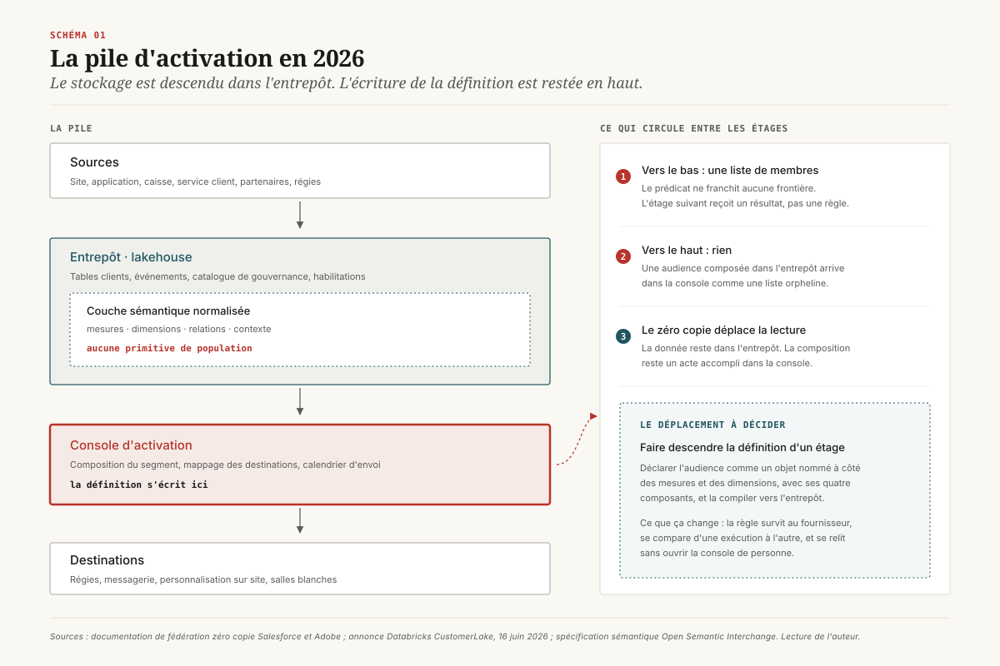
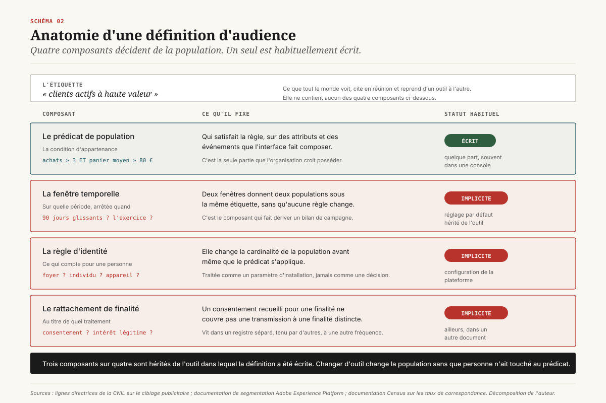
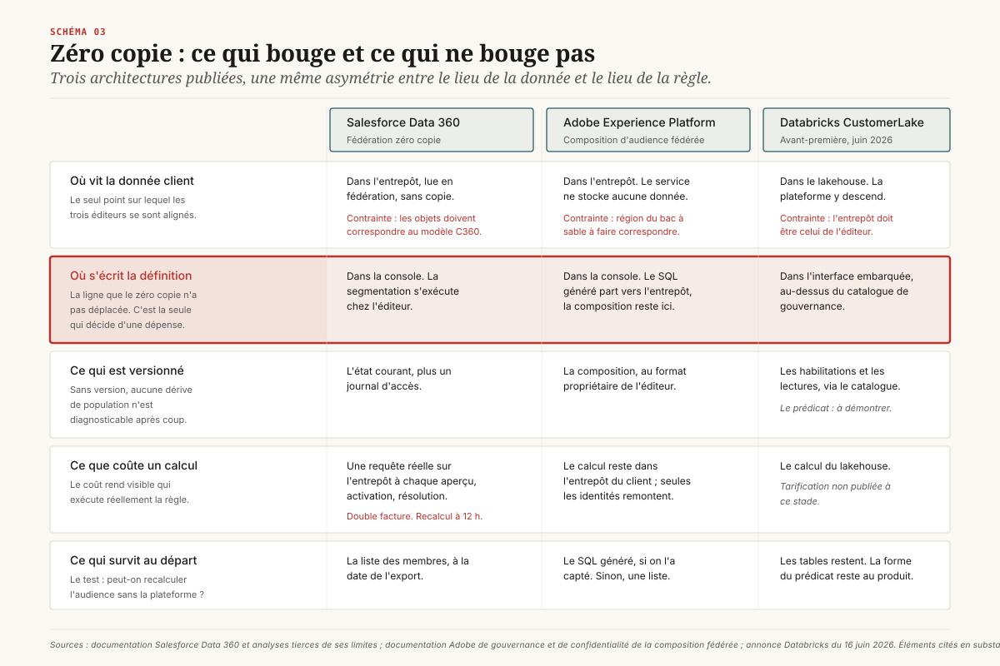
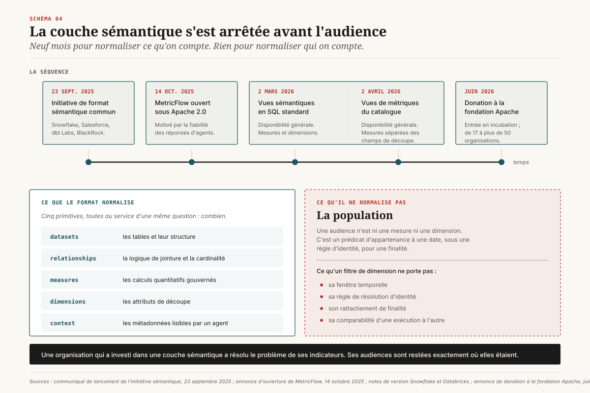
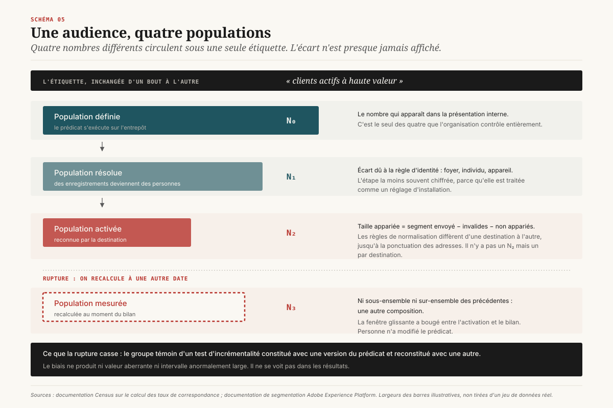
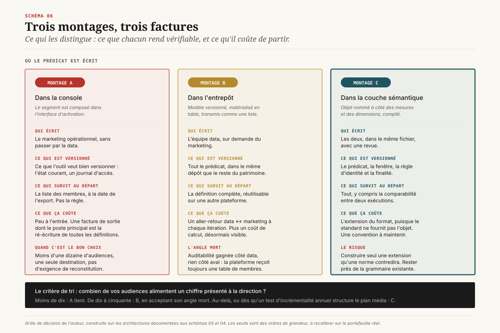

# Qui possède la définition

> **Les données sont revenues dans l'entrepôt ; la définition de l'audience, elle, est restée dans la console.** — 9 septembre 2026, Mathieu Guglielmino

## Ce qui n'a pas déménagé

Depuis trois ans, la question posée aux directions data se formule presque toujours de la même façon : faut-il acheter une plateforme de données clients, ou la construire au-dessus de l'entrepôt qu'on a déjà payé ? La question a reçu sa réponse, et elle est architecturale. Les éditeurs eux-mêmes ont replié leur produit sur l'entrepôt : Salesforce interroge les tables de Snowflake, de BigQuery ou de Databricks sans les copier ; Adobe traduit une composition d'audience en SQL qu'il pousse dans l'entrepôt du client et ne conserve rien ; Databricks a fait descendre la plateforme de données clients à l'intérieur du lakehouse, sous la gouvernance de son propre catalogue. Le stockage a cessé d'être le sujet.

Ce déplacement a laissé une chose exactement où elle était. La **définition** d'une audience, c'est-à-dire la règle qui décide qui en fait partie, continue de s'écrire dans une interface d'activation. Elle y est composée à la souris, rarement versionnée, jamais publiée dans le catalogue de données, et invisible de la couche sémantique que l'industrie vient précisément de normaliser. ==La donnée a déménagé dans l'entrepôt sans emporter la règle qui décide de son usage.==

Quatre constats structurent ce dossier.

**Premier constat.** Le débat « acheter ou construire » porte sur un lieu de stockage, alors que la décision qui engage porte sur un lieu d'écriture. Deux organisations peuvent avoir la même architecture de données et des régimes de responsabilité opposés selon l'endroit où le segment est écrit.

**Deuxième constat.** Le zéro copie a déplacé la donnée sans déplacer l'autorité. Dans les trois architectures publiées à ce jour, la composition reste un acte accompli dans la console de l'éditeur, et les limites documentées (mapping obligatoire, plafonds d'audiences, intervalles de rafraîchissement, facturation par requête) sont les traces de cette asymétrie.

**Troisième constat**, et c'est la nouveauté de 2026. La normalisation sémantique a abouti. Entre septembre 2025 et juin 2026, l'industrie s'est donné un format commun pour décrire des jeux de données, des relations, des mesures et des dimensions ; ce format est passé à la fondation Apache. Il ne comporte aucune primitive de **population**. La normalisation a couvert ce qu'on compte, et s'est arrêtée avant qui on compte.

**Quatrième constat.** Le prix de ce trou se paie en aval, sur le seul chiffre que la direction regarde. Entre la population définie, la population résolue, la population activée et la population mesurée, il y a quatre nombres différents et une seule étiquette. L'écart n'est presque jamais affiché, et il contamine le groupe témoin des tests d'incrémentalité.

---

## 1. Le débat mal posé

La plateforme de données clients a été définie en 2013 comme un système d'entreprise qui construit une base de profils persistante, unifiée et accessible aux autres systèmes. Douze ans plus tard, chacun des quatre termes a été attaqué séparément. « Persistante » a cédé devant le coût du stockage dupliqué. « Unifiée » a cédé devant la résolution d'identité en place. « Accessible aux autres systèmes » a cédé devant la généralisation des connecteurs inverses. Il reste « base de profils », et l'entrepôt la tient déjà.

D'où la thèse de la composition : on n'achète plus une plateforme, on assemble des composants au-dessus de l'entrepôt. Ingestion d'un côté, résolution d'identité au milieu, activation de l'autre, le tout piloté par les mêmes outils de transformation que le reste du patrimoine data.

Le marché donne la mesure exacte du malentendu. Le relevé de janvier 2026 de l'institut qui suit ce secteur depuis l'origine montre deux chiffres qu'il faut lire ensemble : les acteurs composables ou nés dans l'entrepôt ont augmenté leurs effectifs de 7,8 % sur la période, contre 1,3 % pour la moyenne du secteur ; et ils pèsent toujours moins de 5 % du marché en taille[^1]. Une croissance six fois plus rapide sur une base qui reste marginale.

La lecture facile consiste à dire que le composable gagne et qu'il faut attendre. La lecture utile est autre. Si l'architecture composable était réellement le sujet, on observerait un transfert de dépense, or on observe un ajout : les organisations gardent leur plateforme d'activation et lui adjoignent un entrepôt qui l'alimente. Elles ont dupliqué la couche de données sans trancher la question de l'autorité. Le résultat tient en une phrase de bilan : la donnée est à deux endroits, la règle à un seul, et ce n'est pas celui qu'on croit.

Le vocabulaire entretient la confusion. Quand un éditeur dit « vos données restent chez vous », il décrit exactement ce qu'il fait, et il ne dit rien de l'endroit où la règle s'écrit. Les deux affirmations sont compatibles, et la première est celle qui se vend.

### Ce que la question devrait être

Reformulée pour une direction, la question d'architecture devient : **qui a le droit d'écrire la règle qui décide d'une dépense média, et où cette règle est-elle conservée ?** Cette formulation a trois vertus. Elle est vérifiable (on peut ouvrir le fichier ou constater qu'il n'existe pas). Elle est attribuable (quelqu'un a écrit la dernière version). Elle survit à un changement de fournisseur, ce que la précédente ne faisait pas.

---

## 2. Ce qu'est réellement une définition d'audience

Un segment se présente comme une phrase courte : « clients actifs à haute valeur ». Cette phrase n'est pas la définition, elle en est l'étiquette. La définition complète comporte quatre composants, dont un seul est habituellement écrit.

**Le prédicat de population.** La condition d'appartenance proprement dite, exprimée sur des attributs et des événements. C'est la partie visible, celle que l'interface fait composer. Elle est presque toujours écrite quelque part, même si ce quelque part est une console.

**La fenêtre temporelle.** Sur quelle période les événements comptent, et à quelle date la population est arrêtée. Une audience « clients actifs » calculée sur quatre-vingt-dix jours glissants et la même calculée sur l'exercice comptable n'ont pas les mêmes membres, et l'étiquette ne le dit pas. La fenêtre est souvent un réglage par défaut hérité de l'outil.

**La règle de résolution d'identité.** À quel niveau on considère que deux enregistrements désignent la même personne : identifiant client déterministe, adresse électronique normalisée, foyer, appareil, appariement probabiliste. Ce choix change la cardinalité de la population avant même que le prédicat s'applique. Il est presque toujours implicite, hérité de la configuration de la plateforme.

**Le rattachement de finalité.** Au titre de quel traitement cette population est constituée, et sur quelle base. Le règlement européen sur la protection des données impose des finalités déterminées, explicites et légitimes, et l'autorité française a rappelé en 2026 qu'un consentement recueilli pour une finalité ne couvre pas une transmission à une finalité distincte[^2]. Ce composant n'est presque jamais attaché à la définition technique du segment ; il vit dans un registre séparé, tenu par d'autres personnes, à une autre fréquence.

Trois composants sur quatre sont donc implicites. Et ce sont eux qui font diverger les populations, parce qu'ils sont hérités de l'outil dans lequel la définition a été écrite. ==Changer d'outil d'activation change la population d'un segment dont personne n'a modifié le prédicat.==

C'est ce qui rend la question du lieu d'écriture non cosmétique. Une définition écrite dans une console emporte silencieusement les valeurs par défaut de cette console. Une définition écrite dans un fichier versionné doit rendre ses quatre composants explicites, sans quoi elle ne s'exécute pas.

---

## 3. Le zéro copie déplace la donnée, pas l'autorité

Trois architectures ont été publiées et documentées. Elles diffèrent par le sens de la descente, et se ressemblent par ce qu'elles laissent en place.

### Salesforce Data 360 — fédérer la lecture, garder la composition

La fédération zéro copie permet d'accéder aux données d'une source externe et de les utiliser dans la plateforme, y compris pour la résolution d'identité et la segmentation, sans les dupliquer[^3]. La donnée reste dans l'entrepôt ; la segmentation s'exécute dans Data 360.

Les limites documentées disent où passe la frontière. Pour être interrogeables, les objets de l'entrepôt doivent correspondre au modèle de données Customer 360 de l'éditeur, faute de quoi ils restent hors de portée de la fédération. Le nombre d'audiences pouvant s'appuyer sur des jeux de données externes est plafonné, et leur recalcul intervient à intervalle de douze heures. Chaque prévisualisation de segment, chaque activation, chaque exécution de résolution d'identité déclenche une requête réelle sur l'entrepôt du client, ce qui produit une double facturation : les crédits de la plateforme d'un côté, le calcul de l'entrepôt de l'autre[^4].

Chacune de ces limites est raisonnable prise isolément. Ensemble, elles décrivent une architecture où l'entrepôt est un système de fichiers et la console le système d'exploitation.

### Adobe — pousser le SQL, garder la composition

L'approche d'Adobe est plus radicale sur le stockage et identique sur l'autorité. La composition d'audience fédérée traduit la composition en SQL, pousse la requête vers le moteur de l'entrepôt, et ne récupère que les identités résultantes et les attributs sélectionnés. La documentation de gouvernance est explicite : le service ne stocke aucune donnée client issue des entrepôts, ce qui reporte sur le client la conformité aux demandes d'effacement et impose de connecter des bases situées dans la région du bac à sable correspondant[^5].

La contrepartie apparaît dans le traitement des audiences composées à l'extérieur. Lorsqu'une audience est chargée depuis un système tiers, seule la colonne d'identité primaire est rattachée au profil ; tous les autres champs sont traités comme des attributs de charge utile, et si aucun profil existant ne correspond, un profil est créé sans attribut ni événement associé[^6]. La documentation le nomme profil orphelin.

Le terme mérite d'être retenu, parce qu'il décrit exactement ce qui se perd. ==Ce qui traverse la frontière entre l'entrepôt et la plateforme d'activation, c'est une liste de membres, jamais la règle qui les a produits.== Une audience définie dans l'entrepôt arrive dans la plateforme comme un résultat, pas comme une définition, et elle y est donc irrévisable, incomparable et non auditable.

### Databricks CustomerLake — descendre la plateforme dans le lakehouse

Annoncée le 16 juin 2026, CustomerLake prend le problème par l'autre bout : plutôt que de fédérer l'entrepôt depuis la console, elle installe les fonctions de la plateforme de données clients (profil unifié, résolution d'identité, construction d'audiences, activation, personnalisation) à l'intérieur du lakehouse, sous la gouvernance du catalogue existant[^7]. L'argument commercial est le déplacement supprimé : on ne bouge ni ne duplique de données sensibles.

C'est l'architecture la plus proche de ce que ce dossier défend, et elle appelle deux réserves. La première tient au calendrier : le produit a été présenté en avant-première privée, et les avant-premières privées ne sont pas des retours d'expérience. La seconde tient à la nature du gain. Faire descendre la composition sous un catalogue règle la question du contrôle d'accès et de la traçabilité des lectures. Elle ne règle pas, à elle seule, celle de la **forme** de la définition : un segment composé dans une interface reste un segment composé dans une interface, même quand cette interface s'exécute au-dessus d'un catalogue gouverné. Le gain est réel côté habilitations ; il reste à démontrer côté versionnement et portabilité.

### Ce que les trois ont en commun

Dans les trois cas, l'objet qui circule entre l'entrepôt et l'activation est une population, jamais un prédicat. C'est cette asymétrie qui rend le sujet décisionnel plutôt que technique : elle détermine ce dont l'organisation disposera le jour où elle voudra vérifier, comparer ou partir.

---

## 4. La couche sémantique s'est arrêtée avant l'audience

Pendant que le marché des plateformes clients repliait son stockage sur l'entrepôt, une autre normalisation aboutissait, et elle mérite d'être lue comme le principal fait de 2026 sur ce terrain.

La séquence est courte et documentée.

Le 23 septembre 2025, Snowflake annonce avec Salesforce, dbt Labs, BlackRock et RelationalAI une initiative de format sémantique commun, destinée à faire cesser la fragmentation des définitions entre outils[^8]. Le 14 octobre 2025, dbt Labs place le moteur MetricFlow sous licence Apache 2.0, en motivant l'ouverture par la fiabilité des agents : un agent qui compile contre des définitions gouvernées rend la même réponse partout[^9]. Le 2 mars 2026, l'interrogation des vues sémantiques de Snowflake en SQL standard passe en disponibilité générale[^10]. Le 2 avril 2026, les vues de métriques du catalogue de Databricks passent en disponibilité générale, avec séparation explicite entre les mesures et les dimensions qui servent à les découper[^11]. En juin 2026, l'initiative est donnée à la fondation Apache et entre en incubation, la coalition étant passée de dix-sept partenaires initiaux à plus de cinquante organisations[^12].

En moins d'un an, la profession s'est donné un format commun, versionné, lisible par les outils décisionnels comme par les agents. C'est un progrès réel, et il faut mesurer exactement son périmètre.

### Ce que le format contient

Le modèle sémantique normalisé décrit des jeux de données, des relations avec leur logique de jointure et leur cardinalité, des mesures (des calculs quantitatifs pouvant traverser plusieurs jeux de données), des dimensions (des attributs catégoriels servant à découper) et des métadonnées de contexte. La documentation des implémentations dit la même chose : une vue de métriques sépare la définition d'une mesure des champs qui servent à la grouper, la filtrer et l'agréger.

Toutes ces briques répondent à la question « combien ». Aucune ne répond à la question « qui ».

Une audience n'est ni une mesure ni une dimension. C'est un **prédicat d'appartenance** appliqué à une population à une date donnée, sous une règle d'identité donnée, pour une finalité donnée. On peut la bricoler avec les primitives existantes : un filtre de dimension, un indicateur booléen calculé, une table matérialisée. Bricoler n'est pas normaliser. Un filtre de dimension ne porte ni sa fenêtre, ni sa règle d'identité, ni sa finalité ; il ne se versionne pas comme un objet nommé ; il ne se compare pas d'une exécution à l'autre.

### Pourquoi le trou existe

L'explication est probablement moins conspirative qu'organisationnelle. Les acteurs qui ont porté la normalisation sémantique sont des acteurs de l'analyse : leur objet natif est l'indicateur, leur utilisateur est l'analyste, leur cas d'usage récent est l'agent conversationnel qui doit rendre le même chiffre que le tableau de bord. La population activable n'est pas leur objet, elle est celui des plateformes d'activation, qui n'avaient aucune raison d'aller normaliser la seule chose qui les distingue les unes des autres.

Il y a donc une conséquence pratique immédiate, et une conséquence stratégique.

Immédiate : une organisation qui a investi dans une couche sémantique croit souvent avoir résolu le problème des définitions. Elle l'a résolu pour ses indicateurs. Ses audiences sont restées exactement où elles étaient.

Stratégique : le trou est une position à occuper. Rien n'interdit à une organisation d'étendre son propre format en y ajoutant un objet « audience » qui porte ses quatre composants, tant que la définition reste exécutable dans son entrepôt. C'est un travail de quelques semaines, pas de quelques trimestres, et il produit un actif qui survit au fournisseur d'activation.

---

## 5. Le prix de la divergence

Le trou se paie en aval, et il se paie sur le chiffre de mesure.

Suivons une même étiquette à travers la chaîne.

**La population définie.** Le prédicat s'exécute sur l'entrepôt et renvoie un nombre. Appelons-le N₀. C'est le nombre qui apparaît dans la présentation interne.

**La population résolue.** Le prédicat s'applique à des enregistrements, la campagne s'adresse à des personnes. Le passage dépend de la règle d'identité, et il n'est pas neutre : selon qu'on résout au foyer ou à l'individu, à l'adresse électronique normalisée ou à l'identifiant client, on obtient N₁ sensiblement différent de N₀. Cette étape est celle qui est le moins souvent chiffrée, parce qu'elle est traitée comme un réglage.

**La population activée.** L'audience est transmise à une plateforme média, qui doit la reconnaître chez elle. Le taux de correspondance se calcule comme la taille appariée rapportée à la taille du segment envoyé, la taille appariée étant le segment moins les enregistrements invalides et moins les non appariés[^13]. Les règles de normalisation diffèrent d'une plateforme à l'autre, jusqu'au détail (certaines exigent la suppression des points avant l'arrobase d'une adresse, d'autres non), si bien que la même audience envoyée à deux plateformes produit deux populations différentes pour des raisons purement syntaxiques. On obtient N₂, et il n'y a pas un N₂ mais un par destination.

**La population mesurée.** Au moment du bilan, quelqu'un recalcule l'audience pour comparer exposés et non exposés. S'il la recalcule à la date du bilan et non à la date de l'activation, la fenêtre glissante a bougé et la population a changé de composition. On obtient N₃, et l'écart entre N₃ et N₂ est purement temporel.

### Ce que cela casse concrètement

L'enjeu n'est pas l'écart lui-même, qui est inévitable, mais le fait qu'il ne soit pas affiché. Trois conséquences valent d'être nommées.

**Le groupe témoin devient poreux.** Un test d'incrémentalité repose sur la comparaison entre une population exposée et une population comparable non exposée. Si la définition qui a servi à constituer le groupe traité et celle qui sert à reconstituer le groupe témoin ne sont pas la même version du même prédicat, la comparabilité est perdue avant le premier calcul. C'est une source de biais qui ne se voit pas dans les résultats, parce qu'elle ne produit ni valeur aberrante ni intervalle anormalement large.

**Le coût par résultat devient incomparable dans le temps.** Un indicateur de coût par acquisition sur une audience dont la définition a dérivé mesure deux choses à la fois, et l'organisation attribue en général la variation à la campagne.

**La conformité se découple de l'exécution.** Le registre porte la finalité déclarée du traitement ; la console porte le prédicat effectivement exécuté. Rien ne garantit que les deux aient été révisés en même temps, et l'écart n'apparaît qu'au contrôle.

Ces trois effets ont un point commun : ils ne sont détectables qu'a posteriori, et seulement si l'on a conservé quelque chose. C'est ce qui rend la section suivante moins bureaucratique qu'elle n'en a l'air.

---

## 6. Le registre des audiences

Ce que la gouvernance data a fait pour les cas d'usage, la mesure ne l'a pas fait pour les audiences. La proposition est symétrique et bornée : une fiche par audience active, tenue là où vivent les définitions, et non dans un tableur parallèle.

Le contenu minimal tient en sept champs.

**Un propriétaire nommé.** Une personne, pas une équipe. C'est le champ qui coûte le plus cher politiquement et le moins cher techniquement.

**Une version.** Un identifiant qui change quand le prédicat change, et un horodatage. Sans lui, aucune des trois pathologies de la section précédente n'est diagnosticable.

**Le prédicat en clair.** La règle exécutable, écrite dans le format de l'organisation, lisible sans ouvrir la console d'un fournisseur.

**La fenêtre.** Explicite, y compris quand elle vaut le réglage par défaut de l'outil, précisément parce qu'un réglage par défaut est une décision que personne n'a prise.

**La règle d'identité.** Le niveau de résolution retenu, et le taux de résolution constaté à la dernière exécution.

**La finalité.** Le rattachement au traitement déclaré, dans les termes du registre de conformité, avec la base légale. Les lignes directrices de l'autorité française sur la publicité ciblée demandent que soient décrits les catégories de données utilisées pour le ciblage, la logique et les critères de segmentation, l'usage éventuel d'un système d'IA et les sources des données[^2]. Un registre d'audiences correctement tenu produit ces éléments sans travail supplémentaire.

**Une date de gel pour la mesure.** L'instantané de population sur lequel le bilan sera calculé, arrêté au moment de l'activation. C'est le champ qui empêche la dérive N₃.

### Ce que ça coûte, et ce que ça évite

Le coût réel n'est pas la tenue du registre, il est la discipline d'écriture qu'il impose : on ne peut pas remplir ces sept champs en composant à la souris. Une organisation qui adopte le registre bascule mécaniquement vers une écriture des définitions hors de la console, ce qui est le but.

Le coût politique est ailleurs. Un registre rend visible le nombre d'audiences réellement actives, et ce nombre est presque toujours embarrassant. Il rend aussi visible que plusieurs audiences portant des étiquettes différentes ont le même prédicat, et que plusieurs portant la même étiquette n'ont pas le même. C'est le moment le plus désagréable de la démarche, et c'est celui qui produit la valeur.

Une remarque de proportion : ce registre n'a d'intérêt que sur les audiences qui engagent une dépense ou alimentent un chiffre de bilan. Une audience exploratoire construite pour une question ponctuelle n'a pas à y entrer. Le critère de tri est simple : si sa population sert à justifier une décision devant quelqu'un, elle entre au registre.

---

## 7. Trois montages, trois factures

Trois montages sont défendables. Ce qui les distingue n'est pas leur élégance mais ce que chacun rend vérifiable et ce que chacun coûte à quitter.

### Montage A — La définition reste dans la console

Le segment est composé dans l'interface de la plateforme d'activation, qui lit l'entrepôt en fédération ou par ingestion.

*Qui écrit* : l'équipe marketing opérationnelle, sans passer par la data.
*Ce qui est versionné* : ce que l'outil veut bien versionner, en général l'état courant et un journal d'audit d'accès.
*Ce qui survit au départ* : la liste des membres, à la date d'export. Pas la règle.
*Ce que ça coûte* : peu à l'entrée, et une facture de sortie dont le poste principal est la ré-écriture de l'ensemble des définitions actives.
*Quand c'est le bon choix* : peu d'audiences, faible enjeu de mesure, une seule plateforme d'activation, pas d'exigence de reconstitution.

### Montage B — La définition vit dans l'entrepôt, l'exécution est poussée

Le prédicat est écrit comme un modèle versionné dans le dépôt de transformation, matérialisé en table, et transmis à la plateforme d'activation comme une liste. C'est l'architecture composable, dans sa forme la plus courante.

*Qui écrit* : l'équipe data, sur demande du marketing.
*Ce qui est versionné* : tout le prédicat, dans le même dépôt que le reste du patrimoine.
*Ce qui survit au départ* : la définition complète, réutilisable sur une autre plateforme.
*Ce que ça coûte* : un délai d'aller-retour entre le marketing et la data à chaque itération, et c'est le point de friction réel. Plus le coût de calcul, qui devient visible parce qu'il est facturé par l'entrepôt.
*L'angle mort* : la définition est versionnée, mais elle reste une table de membres pour la plateforme d'activation, qui ne peut ni la réviser ni la comparer. On a gagné l'auditabilité côté data et rien côté aval.

### Montage C — La définition vit dans une couche sémantique étendue

Le prédicat est déclaré comme un objet nommé dans le format sémantique de l'organisation, à côté des mesures et des dimensions, avec ses quatre composants. Il est compilé vers l'entrepôt à l'exécution, et exposé aux outils aval par la même interface que les indicateurs.

*Qui écrit* : les deux, dans le même fichier, avec une revue.
*Ce qui est versionné* : le prédicat, la fenêtre, la règle d'identité, la finalité, sous contrôle de version.
*Ce qui survit au départ* : tout, y compris la comparabilité entre exécutions.
*Ce que ça coûte* : le travail d'extension du format, puisque le standard ne fournit pas l'objet. Et une convention interne à maintenir tant qu'aucune norme ne la reprend.
*Le risque* : construire seul une extension qu'une norme ultérieure contredira. Il se mitige en restant proche de la grammaire existante et en n'inventant que l'objet manquant.

### Le critère de tri

Pour choisir, une seule question suffit dans la plupart des cas : **combien de vos audiences alimentent un chiffre présenté à la direction ?** En dessous d'une dizaine, le montage A tient. Entre dix et cinquante, le montage B est le rapport coût-bénéfice raisonnable, à condition d'accepter son angle mort. Au-delà, ou dès qu'un test d'incrémentalité annuel structure le plan média, le montage C se justifie, non pour l'élégance mais parce que la comparabilité entre exécutions devient l'actif principal.

---

## 8. Cinq décisions

**Décision 1 — Nommer le propriétaire de chaque audience qui engage une dépense.** Une personne par audience, publiée. C'est l'attribut le moins coûteux à accorder et le plus rarement écrit. Sans lui, aucune des quatre décisions suivantes ne s'applique à quelqu'un.

**Décision 2 — Exiger l'export de la définition, pas seulement des membres.** À écrire au contrat, au même titre que l'export périodique de l'état : le fournisseur restitue, dans un format lisible et à une fréquence convenue, la règle exécutable de chaque audience active, sa fenêtre et sa règle d'identité. Un export de membres n'est pas une restitution ; c'est une photographie qui ne se rejoue pas. Le test d'acceptation est simple : peut-on recalculer l'audience à l'identique sans la plateforme ?

**Décision 3 — Geler la population au moment de l'activation.** Une décision de méthode, sans coût technique. L'instantané pris à l'activation est celui sur lequel le bilan se calcule. Il ferme la dérive temporelle qui contamine les tests d'incrémentalité, et il coûte une table.

**Décision 4 — Afficher les quatre nombres.** Population définie, résolue, activée, mesurée, sur chaque bilan de campagne. Non pour les réconcilier (ils ne se réconcilient pas), mais parce qu'un écart affiché cesse d'être une surprise et devient un paramètre. C'est la décision la plus simple à prendre et celle qui change le plus vite la conversation avec les régies.

**Décision 5 — Décider si l'audience entre dans la couche sémantique, et acter que le standard ne l'y met pas.** Si l'organisation a investi dans un format sémantique, la question se pose maintenant, pendant que l'extension est bon marché. Si elle décide de ne pas le faire, qu'elle l'écrive : l'inaction non consignée se transforme, deux ans plus tard, en constat de dette imputé à personne.

---

## Note de méthode

Ce dossier a été rédigé dans un environnement dont la politique d'accès réseau refuse la récupération automatique de plusieurs domaines cités, parmi lesquels `databricks.com`, `martech.org`, `cdpinstitute.org`, `docs.getdbt.com` et `salesforce.com`. Les éléments qui en proviennent ont été recueillis par recherche et recoupés sur au moins deux formulations indépendantes ; ils sont cités **en substance** et doivent être revérifiés à la source avant toute réutilisation contractuelle. Les dates de disponibilité générale, les plafonds d'audiences et les intervalles de rafraîchissement sont particulièrement sensibles à la révision : ce sont des paramètres produit, susceptibles de changer sans annonce.

Trois réserves supplémentaires. Les chiffres de croissance d'effectifs et de part de marché du secteur des plateformes de données clients proviennent d'un relevé sectoriel privé et sont **annoncés**, non audités ; ils sont utilisés ici pour leur forme (un écart de rythme entre deux populations d'acteurs) et non pour leur valeur absolue. CustomerLake a été présentée en avant-première privée en juin 2026 : les capacités décrites sont celles de l'annonce, pas d'un retour d'expérience en production. Enfin, l'affirmation centrale de la section 4 est une affirmation négative (l'absence de primitive de population dans le format sémantique normalisé) : elle a été vérifiée sur la description publiée du modèle à la date de rédaction, et une extension ultérieure la rendrait caduque. C'est d'ailleurs le résultat souhaitable.

---

## Sources

[^1]: CDP Institute, *Are Composable CDPs Eating the CDP Industry's Lunch?*, relevé sectoriel de janvier 2026. https://www.cdpinstitute.org/cdp-institute/is-composable-eating-the-cdp-industrys-lunch/ : croissance d'effectifs de 7,8 % pour les acteurs composables et nés dans l'entrepôt contre 1,3 % pour la moyenne du secteur, pour une part de marché en taille inférieure à 5 %. Consulté le 9 septembre 2026.

[^2]: CNIL, *La responsabilité des acteurs de la publicité politique ciblée*, et rappels 2026 sur la transmission de données à des fins publicitaires. https://www.cnil.fr/fr/la-responsabilite-des-acteurs-de-la-publicite-politique-ciblee : finalité déterminée, explicite et légitime ; description exigée des catégories de données de ciblage, des critères et de la logique de segmentation, de l'usage éventuel d'un système d'IA et des sources ; un consentement recueilli pour une finalité ne couvre pas une transmission à une finalité distincte. Consulté le 9 septembre 2026.

[^3]: Salesforce, *Data Cloud — Zero Copy Connectivity*. https://www.salesforce.com/data/connectivity/zero-copy/ : accès aux données de la source externe sans duplication, utilisables dans la résolution d'identité et la segmentation. Consulté le 9 septembre 2026.

[^4]: Salesforce Ben, *Salesforce Data Cloud Zero Copy: When (and When Not) to Use It*. https://www.salesforceben.com/salesforce-data-cloud-zero-copy-when-and-when-not-to-use-it/ : correspondance obligatoire au modèle Customer 360, plafond d'audiences appuyées sur des jeux externes, recalcul à intervalle de douze heures, requête réelle déclenchée à chaque prévisualisation et activation, double facturation plateforme et entrepôt. Consulté le 9 septembre 2026.

[^5]: Adobe Experience League, *Privacy and Security in Federated Audience Composition*. https://experienceleague.adobe.com/en/docs/federated-audience-composition/using/governance-privacy-security/home : la composition est traduite en SQL poussé vers l'entrepôt ; aucune donnée client n'est stockée par le service ; conformité aux demandes d'effacement et contrainte de région du bac à sable à la charge du client. Consulté le 9 septembre 2026.

[^6]: Adobe Experience League, *Audiences Frequently Asked Questions* (Experience Platform Segmentation). https://experienceleague.adobe.com/en/docs/experience-platform/segmentation/faq : pour une audience générée à l'extérieur, seule la colonne d'identité primaire est rattachée au profil, les autres champs sont des attributs de charge utile, et un identifiant sans correspondance produit un profil orphelin. Consulté le 9 septembre 2026.

[^7]: Databricks, *Introducing CustomerLake: The Agentic CDP embedded in Databricks*, 16 juin 2026. https://www.databricks.com/blog/introducing-customerlake-agentic-cdp : Customer 360, résolution d'identité, segmentation, activation et personnalisation embarquées dans le lakehouse sous gouvernance du catalogue ; avant-première privée. Consulté le 9 septembre 2026.

[^8]: Snowflake, communiqué *Snowflake, Salesforce, dbt Labs, and More, Revolutionize Data Readiness for AI with Open Semantic Interchange Initiative*, 23 septembre 2025. https://www.snowflake.com/en/news/press-releases/snowflake-salesforce-dbt-labs-and-more-revolutionize-data-readiness-for-ai-with-open-semantic-interchange-initiative/ : objectif d'un format sémantique neutre décrivant jeux de données, mesures, dimensions, relations et contexte. Consulté le 9 septembre 2026.

[^9]: dbt Labs, *Announcing open source MetricFlow: Governed metrics to power trustworthy AI and agents*, 14 octobre 2025. https://www.getdbt.com/blog/open-source-metricflow-governed-metrics : passage du moteur sous licence Apache 2.0, motivé par la cohérence des réponses rendues par les agents. Consulté le 9 septembre 2026.

[^10]: Snowflake Documentation, *Overview of semantic views* et note de version du 2 mars 2026 (interrogation en SQL standard, disponibilité générale). https://docs.snowflake.com/en/user-guide/views-semantic/overview : périmètre du modèle : mesures, dimensions, relations. Consulté le 9 septembre 2026.

[^11]: Databricks Documentation, *Unity Catalog metric views*, disponibilité générale du 2 avril 2026. https://docs.databricks.com/aws/en/uc-semantics/metric-views/ : séparation des définitions de mesures et des champs servant à grouper, filtrer et agréger. Consulté le 9 septembre 2026.

[^12]: Snowflake, *Apache Ossie (Incubating): The New Name for Open Semantic Interchange*, juin 2026. https://www.snowflake.com/en/blog/apache-ossie-open-semantic-interchange-incubator/ : donation à la fondation Apache, entrée en incubation, coalition passée de dix-sept partenaires à plus de cinquante organisations. Consulté le 9 septembre 2026.

[^13]: Census, *Audience Match Rates*. https://docs.getcensus.com/audience-hub/audience-match-rates : taille appariée égale à la taille du segment moins les enregistrements invalides et les non appariés ; règles de normalisation propres à chaque plateforme de destination. Consulté le 9 septembre 2026.

---

*Format co-écrit avec l'aide d'une IA · 9 septembre 2026 · Mathieu Guglielmino*
