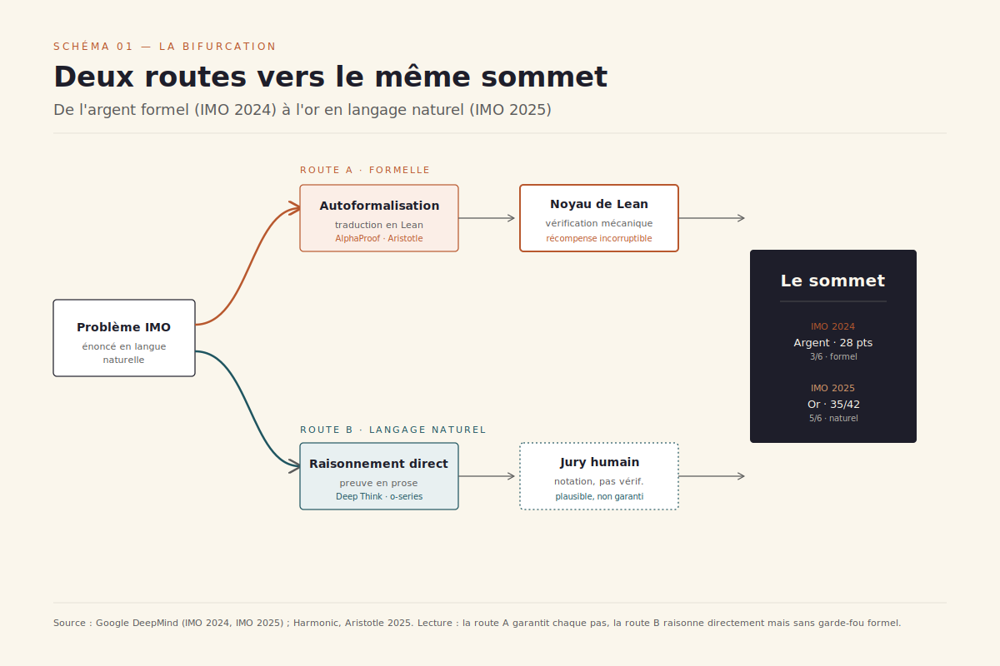
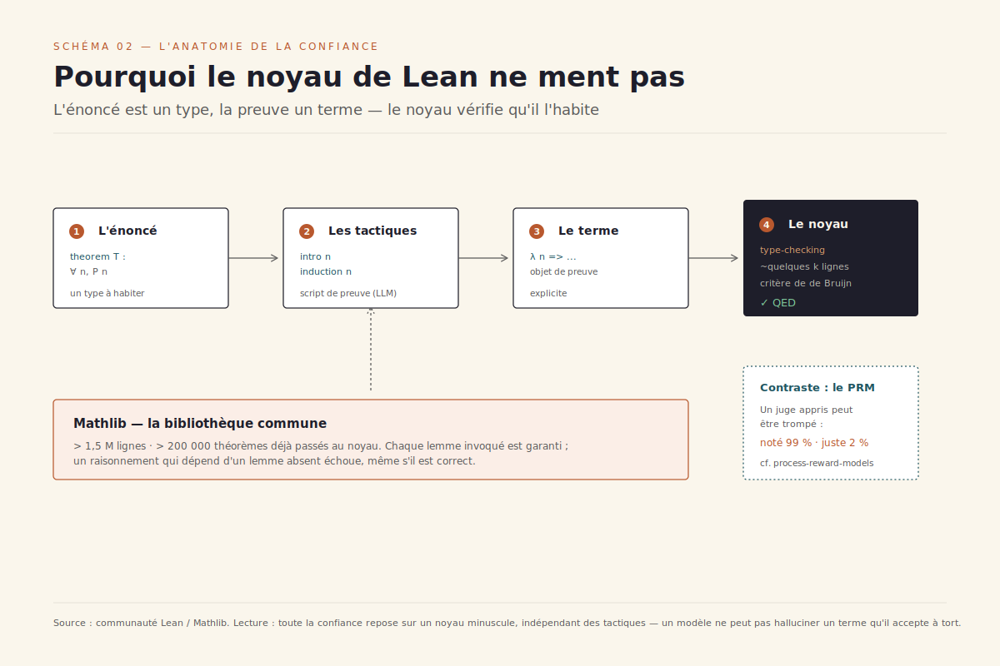

# La preuve comme banc d'essai

> **Dans le seul domaine où la récompense du raisonnement est dense, automatique et incorruptible — la démonstration formelle en Lean — la machine atteint sa forme la plus pure. Mais la médaille d'or 2025 a été gagnée en langage naturel, sans garde-fou : le raisonnement machine est à une bifurcation.** — 26 juin 2026, Mathieu Guglielmino

En juillet 2024, à l'Olympiade internationale de mathématiques (IMO), un système de Google DeepMind nommé AlphaProof résout trois des six problèmes et, avec son comparse géométrique AlphaGeometry 2, atteint 28 points — le seuil exact de la médaille d'argent.[^1][^2] Chaque preuve est écrite et vérifiée dans **Lean**, un assistant de preuve qui n'accepte qu'un argument logiquement irréprochable. Un an plus tard, à l'IMO 2025, deux systèmes — Gemini Deep Think de Google et un modèle non publié d'OpenAI — franchissent le seuil de l'**or** avec 35 points sur 42.[^3] Mais cette fois, aucune ligne de Lean : les preuves sont produites *de bout en bout en langage naturel*, lues et notées par des humains.[^3]

Le même sommet, deux routes opposées. La première garantit chaque pas mais doit d'abord traduire l'énoncé dans un langage formel — un goulot d'étranglement. La seconde raisonne directement comme un humain mais perd toute garantie mécanique de correction. Ce rapport est un deep dive du dossier [modèles de raisonnement](../modeles-raisonnement/) : il défend l'idée que ==la démonstration formelle n'est pas une niche de la preuve automatique, mais le laboratoire le plus pur du raisonnement machine== — parce que c'est le seul terrain où la récompense ne se laisse pas tromper.

## 1. Le verdict qui ne ment pas

Tout l'enjeu tient dans la nature du signal de récompense. Quand on entraîne un modèle de raisonnement par renforcement, il faut une fonction qui dise, à la fin d'une trajectoire, *« c'était juste »* ou *« c'était faux »*. Dans la plupart des domaines, ce juge est lui-même un modèle appris — un *reward model* ou un LLM-juge — et c'est précisément là que le bât blesse : un juge appris peut être *trompé*. Le dossier [modèles de notateur procéduraux](../process-reward-models/) documentait ce *reward hacking* où un raisonnement noté 99 % par le juge n'était correct que dans 2 % des cas.[^10]

La démonstration formelle échappe à ce piège par construction. En Lean, une preuve n'est pas *évaluée* — elle est *type-checkée*. L'énoncé d'un théorème est un type ; une preuve est un terme de ce type ; et un petit programme — le **noyau** (*kernel*) — vérifie mécaniquement que le terme habite bien le type. Ce noyau suit le **critère de de Bruijn** : toute la confiance du système repose sur un cœur minuscule, de quelques milliers de lignes, indépendant des tactiques et des heuristiques qui ont *construit* la preuve.[^13] ==Un modèle peut halluciner n'importe quel raisonnement ; il ne peut pas halluciner un terme que le noyau de Lean accepte à tort.== Le verdict est binaire, automatique, reproductible et — c'est le mot décisif — **incorruptible**.

C'est exactement ce que la communauté du raisonnement appelle désormais le **RLVR** (*Reinforcement Learning with Verifiable Rewards*) : remplacer le juge appris par une vérification mécanique — exécution de code, vérification de réponse, ou ici, type-checking d'une preuve.[^10] DeepSeek-R1 a popularisé l'approche pour le code et les mathématiques à réponse courte.[^10] Mais la math formelle en est la forme *limite* : non seulement la réponse finale est vérifiable, mais **chaque pas intermédiaire** l'est. Le noyau ne se contente pas de dire si la conclusion est juste ; il atteste que tout le chemin l'était. Là où un PRM (*process reward model*) doit *apprendre* à noter les étapes, Lean les note *gratuitement et parfaitement*.

### Mathlib, le terrain commun

Aucun prouveur ne part de zéro. Il s'appuie sur **Mathlib**, la bibliothèque mathématique de Lean — plus de 1,5 million de lignes, plus de 200 000 théorèmes formalisés, de l'arithmétique élémentaire à la théorie des schémas, maintenue par une communauté de centaines de contributeurs.[^13] Mathlib joue le rôle d'un *corpus de référence vérifié* : chaque théorème qu'un prouveur invoque a déjà été passé au noyau. C'est à la fois une force — un socle immense et fiable — et une contrainte : un raisonnement qui dépend d'un lemme *absent* de Mathlib échoue, même s'il est mathématiquement correct.

## 2. AlphaProof : AlphaZero rencontre le solveur

AlphaProof est l'illustration la plus aboutie de ce que le RLVR formel permet. Son architecture couple un modèle de langage pré-entraîné à l'algorithme de renforcement **AlphaZero** — celui-là même qui avait appris seul les échecs, le shogi et le go.[^1][^2] La boucle est élégante : confronté à un problème, le système **autoformalise** l'énoncé en Lean, génère des candidats de solution, puis *cherche* parmi les pas de preuve possibles en construisant un arbre de recherche guidé par le réseau. Chaque preuve trouvée et vérifiée par Lean est réinjectée pour renforcer le modèle — qui s'attaque alors à des problèmes plus durs.[^1]

[SCHEMA-03]

Le verrou que DeepMind a fait sauter, c'est la **rareté des données**. Les énoncés mathématiques formalisés se comptent en dizaines de milliers ; les problèmes en langage naturel, en millions. Pour nourrir AlphaZero, l'équipe a entraîné un réseau d'**autoformalisation** qui a traduit environ un million de problèmes en langage naturel en quelque **cent millions** d'énoncés Lean — un corpus synthétique sur lequel la boucle RL pouvait enfin tourner à l'échelle.[^1][^2] ==C'est l'autoformalisation, et non la recherche de preuve, qui a constitué le vrai déverrouillage d'AlphaProof.==

Le bilan IMO 2024 est nuancé. AlphaProof a résolu les problèmes P1, P2 et le redoutable P6 (que seuls cinq concurrents humains ont craqué) ; AlphaGeometry 2 a réglé le P4 de géométrie.[^2] Les deux problèmes de combinatoire (P3, P5) sont restés hors de portée. Surtout, le système a parfois eu besoin de **plusieurs jours** de calcul là où un humain dispose de 4 h 30 — un détail qui rappelle que « niveau médaille d'argent » désigne le *score*, pas la *vitesse*.[^2] La version publiée dans *Nature* en novembre 2025, peer-reviewée, a consolidé ces résultats et détaillé l'approche de *test-time reinforcement learning*, où le système continue d'apprendre sur le problème même qu'il tente de résoudre.[^1]

## 3. La course des prouveurs open-source

AlphaProof reste fermé. Mais une vague de prouveurs ouverts a, en dix-huit mois, rapproché l'état de l'art accessible à tous de la frontière. Trois familles de stratégies se dégagent.

[SCHEMA-05]

La première génère la **preuve entière** d'un coup (*whole-proof generation*) et la soumet à Lean ; on rejoue jusqu'à ce qu'une tentative passe. La deuxième **décompose en sous-objectifs** (*subgoal decomposition*) : un grand modèle raisonne en langage naturel sur le plan de preuve, découpe le théorème en lemmes, puis formalise chaque morceau. La troisième combine **recherche arborescente et itération d'expert** (*expert iteration*) : le prouveur explore l'espace des tactiques, garde les preuves trouvées comme nouvelles données d'entraînement, et recommence.

**DeepSeek-Prover-V2** incarne la deuxième voie. Le modèle 671B utilise DeepSeek-V3 pour décomposer un théorème en sous-buts, génère une chaîne de raisonnement, puis applique du renforcement (GRPO) sur les preuves vérifiées par Lean. Il atteint **88,9 %** de réussite sur miniF2F-test et résout **49 des 658** problèmes de PutnamBench.[^4] **Goedel-Prover-V2**, sorti quelques mois plus tard, pousse la troisième voie avec une *synthèse de données échafaudée* et une *auto-correction guidée par le vérificateur* : son modèle 32B — vingt fois plus petit — atteint **90,4 %** sur miniF2F en mode auto-correction et **86** problèmes PutnamBench, prenant la tête des modèles ouverts.[^5][^14] Enfin **Aristotle**, du laboratoire Harmonic, revendique une performance de niveau **médaille d'or** à l'IMO 2025 — mais, contrairement à Gemini, *avec vérification formelle en Lean 4*.[^6]

[SCHEMA-04]

La leçon de cette course est familière à qui suit les [benchmarks contestés](../benchmarks-contestes/) : ==miniF2F sature, et un score de 90 % y signifie moins qu'il n'y paraît==. La barre s'est déplacée vers **PutnamBench**, dérivé de la compétition Putnam de niveau universitaire, où les meilleurs prouveurs ouverts plafonnent encore autour de 13 % — l'écart vertigineux qui sépare « olympiade lycée » de « recherche ». Le benchmark qui était le sommet en 2023 est devenu le plancher en 2025.

## 4. Le mur de l'autoformalisation

Si la recherche de preuve progresse vite, c'est l'autre moitié du problème qui résiste : **traduire un énoncé du langage naturel vers Lean** sans en trahir le sens. C'est le goulot d'étranglement structurel de tout le domaine.

[SCHEMA-06]

Les modes d'échec sont documentés et tenaces. Les modèles **hallucinent des imports** de lemmes qui n'existent pas dans Mathlib ; ils **mélangent la syntaxe** de Lean avec celle d'autres assistants (Coq, Isabelle) vue à l'entraînement ; et surtout, ils produisent un énoncé formel *syntaxiquement valide mais sémantiquement faux* — une dérive silencieuse qui passe le noyau tout en prouvant le mauvais théorème.[^11] ProofBridge, qui aligne preuves naturelles et formelles dans un espace d'embeddings joint, et des bancs comme IndiMathBench montrent que ==préserver le sens exact lors de la traduction est plus dur que trouver la preuve une fois l'énoncé fixé==.[^11]

Sous le mur de l'autoformalisation se cache un problème de **données**. Les preuves formelles sont rares ; on ne peut pas les *scraper* comme du texte ou du code. La parade dominante en 2025 est la **génération de données synthétiques à grande échelle** : autoformaliser massivement (AlphaProof), échafauder des théorèmes de difficulté croissante (Goedel), ou faire tourner l'itération d'expert pour que le prouveur fabrique ses propres données d'entraînement vérifiées.[^5][^12] Toute la discipline tient sur cette boucle vertueuse — le vérificateur produit le signal *et* les données — mais elle bute sur les domaines où l'autoformalisation reste fragile : l'analyse, la combinatoire, tout ce qui demande de construire des objets plutôt que de manipuler des équations.

## 5. La médaille d'or sans garde-fou

C'est ce mur qui éclaire le choix de 2025. Pour décrocher l'or, Gemini Deep Think et le modèle d'OpenAI ont **contourné le formel**. Ils ont raisonné de bout en bout en langage naturel, dans le temps imparti de 4 h 30, en s'appuyant sur une *parallel thinking* — explorer et combiner plusieurs pistes simultanément — et un entraînement par renforcement sur des données de raisonnement multi-étapes et de théorèmes.[^3] Résultat : 35/42, problèmes 1 à 5 résolus, seul le P6 résistant.

Mais le contournement a un coût épistémique. Les preuves de Gemini ont été **notées et certifiées officiellement** par les coordinateurs de l'IMO ; celles d'OpenAI l'ont été *en interne*, par un panel de trois anciens médaillés parvenus à un consensus unanime — sans validation externe ni formelle.[^3] ==Une médaille d'or en langage naturel atteste qu'un humain expert juge la preuve correcte ; une médaille en Lean atteste qu'aucun humain n'a besoin de la juger.== C'est toute la différence entre *plausible* et *garanti*.

> **Renvoi au dossier [modèles de notateur procéduraux](../process-reward-models/).** Le risque du langage naturel non vérifié est exactement celui qu'y décrivait le *reward hacking* : un raisonnement fluide, convaincant, et faux à un endroit que personne ne contrôle. À l'IMO, trois médaillés relisent ; en production, sur un problème ouvert, personne ne relit. C'est pourquoi des pipelines de **vérification-et-raffinement** sont apparus — générer en naturel, puis filtrer et corriger les sorties avant de les déclarer correctes — comme un pont entre la généralité du naturel et la rigueur du formel.[^7]

La bifurcation n'est donc pas un choix de camp mais une **tension productive**. Le langage naturel apporte la généralité et la vitesse ; le formel apporte la garantie. Le programme de recherche le plus prometteur de 2026 consiste précisément à les recoudre : *le langage naturel propose, Lean dispose*.

## 6. Le nouveau métier du mathématicien

Reste la question que tout cela soulève pour les mathématiciens eux-mêmes. La réponse la plus instructive vient de **Terence Tao**, médaillé Fields devenu l'évangéliste le plus lucide de la preuve assistée. Son **Equational Theories Project** a déterminé les **22 028 942** implications du graphe entre les **4 694** lois équationnelles les plus simples sur les magmas — un calcul combinatoire colossal, mené par un mélange de preuves humaines et automatiques, *toutes validées par Lean*.[^8]

[SCHEMA-07]

L'enseignement n'est pas que l'IA remplace le mathématicien, mais que ==la vérification formelle débloque une échelle de collaboration jusque-là impossible==. Traditionnellement, un projet de recherche réunit une poignée d'experts qui se font confiance ; on ne peut pas accepter la contribution d'un inconnu sans la relire. Lean change l'équation : n'importe qui peut soumettre une preuve, le noyau la valide, et la confiance interpersonnelle devient superflue.[^8] C'est de la mathématique *crowdsourcée* à l'échelle de l'internet — une première. Tao reste pourtant lucide sur les limites : l'IA comprend les énoncés et formalise des propositions correctes, mais *« reste coincée aux moments cruciaux »* d'une démonstration, là où il faut une idée plutôt qu'une manipulation.[^9]

### Trajectoires 2026-2028

Trois lignes se dessinent. D'abord, des **autoformaliseurs fiables** : le jour où traduire un énoncé en Lean sera aussi robuste que compiler du code, le mur du chapitre 4 tombe et le formel rejoint le naturel en généralité. Ensuite, la **preuve-comme-intégration-continue** : des bibliothèques mathématiques (et bientôt des spécifications logicielles critiques) maintenues sous vérification formelle permanente, où chaque modification doit re-passer le noyau — la math traitée comme une base de code. Enfin, et c'est le pari le plus structurant, ==le vérificateur formel comme récompense universelle du raisonnement== : entraîner les modèles généralistes en branchant leur sortie sur un noyau qui ne ment pas, pour importer dans tous les domaines la garantie qui n'existait jusqu'ici qu'en mathématiques.[^10] La démonstration formelle aura alors cessé d'être une niche pour devenir ce qu'elle est déjà en laboratoire : le banc d'essai où l'on mesure si une machine *raisonne* vraiment, ou si elle se contente d'être convaincante.

## Sources

[^1]: Google DeepMind et al., « Olympiad-level formal mathematical reasoning with reinforcement learning » (AlphaProof), *Nature*, novembre 2025. Paper peer-reviewé décrivant l'architecture AlphaZero + autoformalisation + recherche de preuve en Lean. https://www.nature.com/articles/s41586-025-09833-y
[^2]: Google DeepMind, « AI achieves silver-medal standard solving International Mathematical Olympiad problems », blog, juillet 2024. Annonce des 28 points, P1/P2/P6 par AlphaProof, P4 par AlphaGeometry 2. https://deepmind.google/blog/ai-solves-imo-problems-at-silver-medal-level/
[^3]: Google DeepMind, « Advanced version of Gemini with Deep Think officially achieves gold-medal standard at the International Mathematical Olympiad », blog, juillet 2025. 35/42 en langage naturel, certification officielle vs notation interne d'OpenAI. https://deepmind.google/blog/advanced-version-of-gemini-with-deep-think-officially-achieves-gold-medal-standard-at-the-international-mathematical-olympiad/
[^4]: Z. Ren et al., « DeepSeek-Prover-V2: Advancing Formal Mathematical Reasoning via Reinforcement Learning for Subgoal Decomposition », arXiv:2504.21801, avril 2025. 88,9 % miniF2F-test, 49/658 PutnamBench. https://arxiv.org/abs/2504.21801
[^5]: Y. Lin et al., « Goedel-Prover-V2: Scaling Formal Theorem Proving with Scaffolded Data Synthesis and Self-Correction », arXiv:2508.03613, août 2025. 90,4 % miniF2F (self-correction), 86 PutnamBench, modèle 32B. https://arxiv.org/abs/2508.03613
[^6]: Harmonic, « Aristotle: IMO-level Automated Theorem Proving », arXiv:2510.01346, octobre 2025. Performance niveau or à l'IMO 2025 avec vérification formelle en Lean 4. https://arxiv.org/pdf/2510.01346
[^7]: « Winning Gold at IMO 2025 with a Model-Agnostic Verification-and-Refinement Pipeline », arXiv:2507.15855, juillet 2025. Pipeline génération NL + vérification/raffinement. https://arxiv.org/pdf/2507.15855
[^8]: T. Tao et al., « The Equational Theories Project: Advancing Collaborative Mathematical Research at Scale », arXiv:2512.07087, 2025. 22 028 942 implications, 4 694 lois, validation Lean, collaboration crowdsourcée. https://arxiv.org/html/2512.07087
[^9]: Quanta Magazine, « How Terry Tao Became an Evangelist for AI in Math », juin 2026. Perspective du mathématicien : autoformalisation, blocages de l'IA aux moments cruciaux. https://www.quantamagazine.org/how-terry-tao-became-an-evangelist-for-ai-in-math-20260608/
[^10]: « Reinforcement Learning with Verifiable Rewards Implicitly Incentivizes Correct Reasoning in Base LLMs », arXiv:2506.14245, juin 2025. Cadre théorique du RLVR ; lien DeepSeek-R1, GRPO, récompenses vérifiables vs reward model appris. https://arxiv.org/abs/2506.14245
[^11]: « ProofBridge: Auto-Formalization of Natural Language Proofs in Lean via Joint Embeddings », arXiv:2510.15681, octobre 2025. Modes d'échec de l'autoformalisation : imports hallucinés, syntaxe mélangée, dérive sémantique. https://arxiv.org/html/2510.15681v1
[^12]: « LLM-based Automated Theorem Proving Hinges on Scalable Synthetic Data Generation », arXiv:2505.12031, mai 2025. La rareté des données formelles et la centralité de la synthèse. https://arxiv.org/pdf/2505.12031
[^13]: Communauté Lean / Mathlib, leanprover-community. Le noyau de vérification (critère de de Bruijn) et la bibliothèque Mathlib (>1,5 M lignes, >200 k théorèmes). https://leanprover-community.github.io/
[^14]: Y. Lin et al., « Goedel-Prover: A Frontier Model for Open-Source Automated Theorem Proving », arXiv:2502.07640, février 2025. Provenance de la lignée Goedel-Prover, état de l'art open-source. https://arxiv.org/pdf/2502.07640
