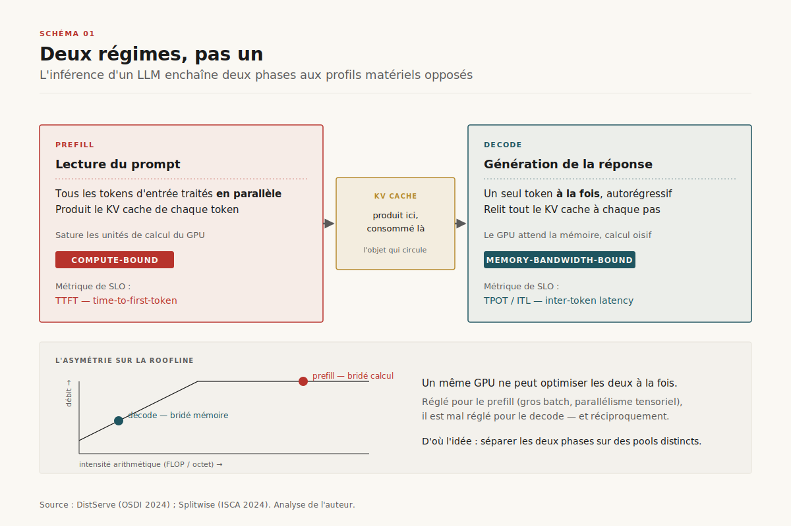
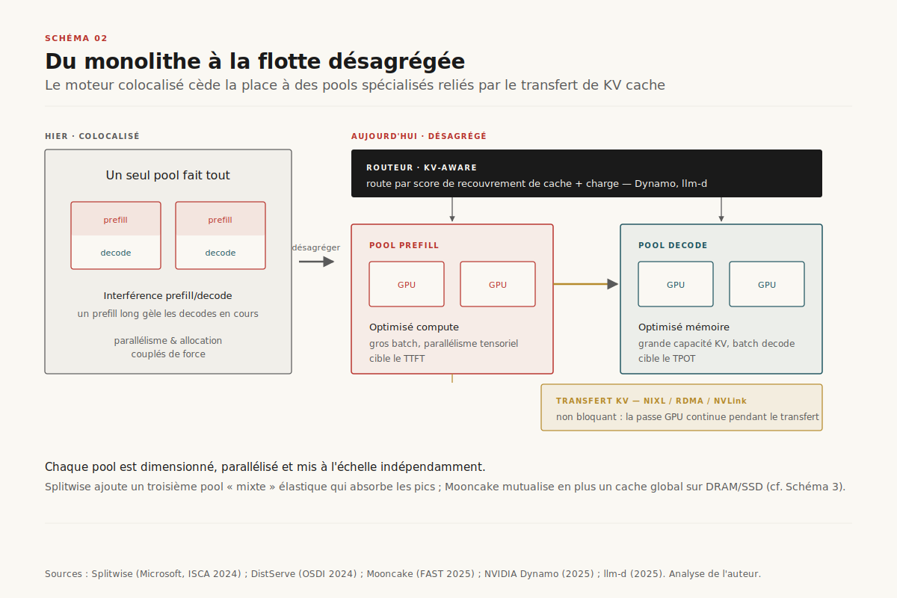
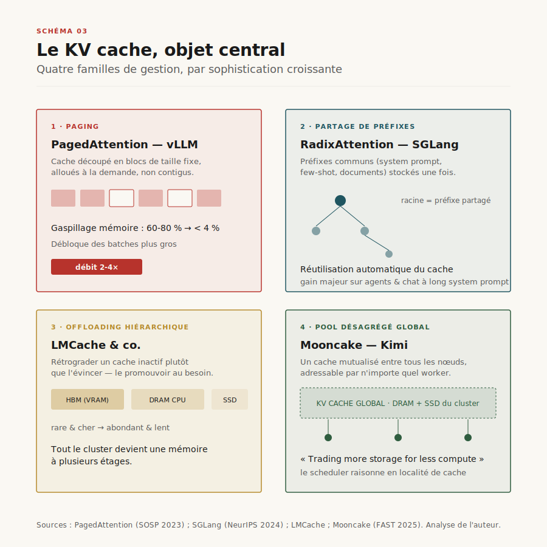
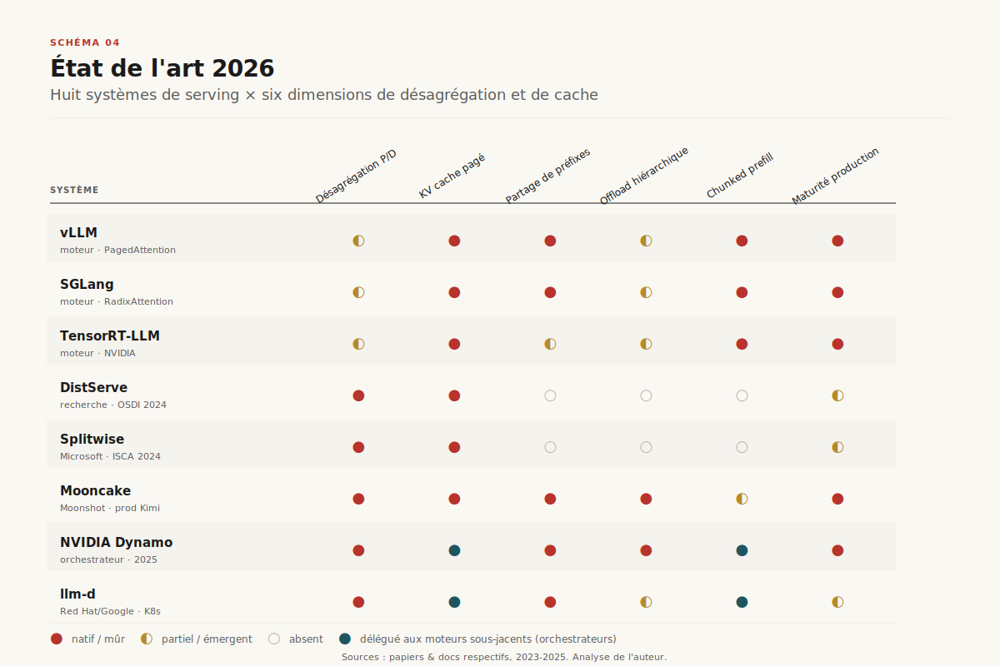

# Désagréger l'inférence

> **La séparation des deux régimes de l'inférence LLM — *prefill* et *decode* — sur des pools de GPU distincts est devenue le principal levier économique du *serving* en production 2026, et fait du KV cache l'objet central qu'on transfère, mutualise et facture.** — 17 juin 2026, Mathieu Guglielmino

## Synthèse exécutive

- **L'inférence d'un modèle de langage n'est pas une charge, mais deux.** La phase de *prefill* (lecture du prompt, calcul parallèle, production du KV cache) est limitée par la **puissance de calcul** ; la phase de *decode* (génération autorégressive, un token à la fois) est limitée par la **bande passante mémoire**. Les colocaliser sur le même GPU force un compromis perdant-perdant. ==Optimiser l'inférence en 2026, c'est d'abord cesser de traiter ces deux régimes comme un seul.==

- **La désagrégation paie, et les chiffres sont publics.** DistServe sert **7,4× plus de requêtes** — ou tient un SLO **12,6× plus serré** — que les systèmes colocalisés à latence égale[^1]. Splitwise atteint **1,4× de débit à 20 % de coût en moins**, ou **2,35× de débit à budget et puissance constants**[^2]. Mooncake, qui sert Kimi (Moonshot AI), encaisse **+75 % de requêtes** en charge réelle grâce à son cache désagrégé[^3].

- **Le KV cache est passé de sous-produit transitoire à actif de premier ordre.** PagedAttention a d'abord ramené le gaspillage mémoire de 60-80 % à moins de 4 %[^4] ; RadixAttention a rendu le partage de préfixes automatique[^5] ; Mooncake en a fait un **pool global** étalé sur la DRAM et les SSD inutilisés du cluster[^3]. La trajectoire est nette : le cache devient une ressource qu'on adresse, déplace et — bientôt — vend.

- **L'économie est désormais chiffrable.** DeepSeek a publié les nombres de sa flotte désagrégée : **73 700 tokens/s en entrée** (prefill, cache compris) et **14 800 tokens/s en sortie** (decode) par nœud H800, pour une **marge théorique de 545 %** au tarif R1[^7]. ==Le coût marginal d'un token de cache *hit* est dix à quinze fois inférieur à celui d'un token recalculé== — ce qui transforme la gestion du cache en stratégie de marge.

- **L'orchestration est en train de se standardiser.** NVIDIA Dynamo[^8] et le projet open-source llm-d[^9] convergent vers la même pile : un routeur conscient du cache (*KV-aware routing*), un transfert de KV cache à la vitesse du fil (NIXL, RDMA), et un *planner* qui dimensionne séparément les pools prefill et decode. La désagrégation sort du laboratoire pour devenir une couche d'infrastructure.

---

## 1. Deux régimes, pas un

Un appel d'inférence à un modèle autorégressif traverse deux phases physiquement distinctes (cf. Schéma 1).

La **phase de prefill** ingère le prompt complet. Tous les tokens d'entrée sont traités **en parallèle** en une seule passe : le modèle calcule, pour chaque couche d'attention, les vecteurs *key* et *value* de chaque token, et les stocke — c'est le **KV cache**. Cette phase sature les unités de calcul du GPU : elle est *compute-bound*. Sa métrique de qualité de service est le **TTFT** (*time-to-first-token*), le délai avant que l'utilisateur voie apparaître le premier mot.

La **phase de decode** génère la réponse token par token. À chaque pas, le modèle ne traite **qu'un seul nouveau token**, mais doit relire l'intégralité du KV cache accumulé. Le calcul est minuscule ; le volume de données déplacé depuis la mémoire est énorme. Cette phase est *memory-bandwidth-bound* : le GPU passe son temps à attendre la mémoire, ses unités de calcul largement oisives. Sa métrique est le **TPOT** (*time-per-output-token*), aussi appelé **ITL** (*inter-token latency*) — la fluidité du flux de génération.

==Les deux phases ont des profils opposés sur la roofline : prefill plafonne sur le compute, decode plafonne sur la bande passante mémoire.== Un même GPU configuré pour exceller en prefill (gros *batch*, parallélisme tensoriel agressif) est mal configuré pour le decode, et réciproquement. C'est la tension fondatrice que la désagrégation cherche à dénouer.

## 2. Le péché du moteur monolithique

Pendant des années, les moteurs d'inférence — TGI, le vLLM des premières versions, les serveurs maison — ont **colocalisé** les deux phases sur les mêmes GPU. La raison était simple : c'est l'architecture la plus directe, et le *continuous batching* introduit par Orca en 2022[^10] avait spectaculairement amélioré le débit en injectant de nouvelles requêtes dans le *batch* à chaque itération plutôt qu'en attendant la fin des précédentes.

Mais le *continuous batching* a résolu un problème en en créant un autre : l'**interférence prefill/decode**. Quand un nouveau prompt long arrive, son prefill — gourmand en calcul — monopolise le GPU et **gèle** (*stalls*) les decodes des requêtes en cours. L'utilisateur dont la réponse était en train de se générer voit le flux se figer pendant que le système digère le prompt d'un autre. Inversement, mêler des decodes à un *batch* de prefill dilue l'efficacité du calcul.

Le problème est structurel : colocaliser **couple de force** deux décisions qui devraient être indépendantes — le plan de parallélisme (combien de GPU, quel découpage tensoriel/pipeline) et l'allocation de ressources. Un seul réglage doit servir deux régimes antagonistes. ==Le moteur monolithique n'optimise jamais ni le TTFT ni le TPOT : il négocie en permanence un compromis médiocre entre les deux.==

## 3. Deux réponses rivales

[SCHEMA-05]

Deux écoles répondent à l'interférence (cf. Schéma 5).

**La voie colocalisée : le *chunked prefill*.** Sarathi-Serve[^6] garde prefill et decode sur les mêmes GPU mais **découpe** chaque prefill en morceaux (*chunks*) de taille quasi égale, puis construit des *batches* « sans gel » (*stall-free*) : chaque itération mêle un *chunk* de prefill et les decodes en cours, sans jamais suspendre ces derniers. Le gain est réel — jusqu'à **2,6× de capacité** sur Mistral-7B, **3,7×** sur Yi-34B, **5,6×** sur Falcon-180B en parallélisme de pipeline[^6]. C'est l'approche retenue par défaut dans vLLM et SGLang modernes : simple à déployer, un seul pool à gérer.

**La voie désagrégée : DistServe.** Plutôt que d'entrelacer finement, DistServe[^1] **sépare physiquement** : un pool de GPU ne fait que du prefill, un autre que du decode. Le KV cache produit par le pool prefill est transféré vers le pool decode. Chaque pool est alors optimisé indépendamment — parallélisme, taille de *batch*, voire type de GPU. Le résultat est une optimisation directe du **goodput** (le débit *utile*, qui respecte les contraintes de SLO) : **7,4× plus de requêtes** ou un **SLO 12,6× plus serré** que l'état de l'art colocalisé[^1].

Le débat n'est pas tranché et la nuance compte. Une analyse de 2025, *Beyond the Buzz*[^11], rappelle que la désagrégation **ajoute un coût de transfert du KV cache** et n'est rentable qu'au-dessus d'une certaine échelle et pour certains profils de charge : prompts longs, fort déséquilibre entre durée de prefill et de decode, SLO stricts. ==En dessous d'un certain volume, le *chunked prefill* colocalisé reste le bon choix ; au-dessus, la désagrégation devient le seul moyen de tenir les deux SLO simultanément.==

## 4. L'architecture désagrégée en production

La désagrégation est passée du papier à la production en moins de deux ans (cf. Schéma 2).

**Splitwise** (Microsoft Azure)[^2] fut l'un des premiers déploiements à l'échelle. Il maintient trois pools : un pool *prompt* (prefill), un pool *token* (decode), et un **pool mixte** qui s'étend ou se contracte selon la charge — une soupape élastique. Splitwise exploite explicitement le fait que les deux phases ont des profils de puissance électrique distincts pour optimiser non seulement le coût mais aussi la consommation : **1,4× de débit à -20 % de coût**, ou **2,35× à budget et puissance constants**[^2].

**Mooncake** (Moonshot AI, qui opère Kimi)[^3] est l'architecture désagrégée la plus aboutie publiée à ce jour — *Best Paper* à FAST 2025. Son parti pris : « *trading more storage for less computation* ». Au-delà de séparer prefill et decode, Mooncake construit un **KV cache désagrégé global** en récupérant la DRAM CPU et les SSD inutilisés du cluster comme étages de cache. En charge réelle, l'architecture permet à Kimi de traiter **+75 % de requêtes**, et jusqu'à **+115 % sur clusters A800**[^3].

**NVIDIA Dynamo**[^8] généralise le motif en **orchestrateur** : il se place au-dessus des moteurs (vLLM, SGLang, TensorRT-LLM) et coordonne routage, *scheduling* conscient du cache, disaggregation et *autoscaling*. Sa brique clé est **NIXL**, qui transfère le KV cache directement de la VRAM du moteur prefill à celle du moteur decode, de façon **non bloquante** — les passes GPU continuent de servir d'autres requêtes pendant le transfert. Le routeur sélectionne le *worker* prefill par **score de recouvrement de cache** (*KV-aware routing*), pour éviter de recalculer un préfixe déjà en mémoire ailleurs.

**llm-d**[^9] (Red Hat, Google, IBM) porte le même modèle dans l'écosystème **Kubernetes**, avec une intégration annoncée du *Dynamo Planner* et du *KV Cache Manager*. La désagrégation devient ainsi un objet d'infrastructure cloud-native, déployable et *autoscalable* comme n'importe quelle charge conteneurisée.

## 5. Le KV cache, nouvel objet central

Si l'on suit le fil rouge de ces systèmes, l'objet qui se déplace au centre de l'architecture n'est plus le modèle : c'est le **KV cache** (cf. Schéma 3). Quatre familles de techniques le gèrent, par sophistication croissante.

**Le paging — PagedAttention** (vLLM)[^4]. Inspiré de la mémoire virtuelle des systèmes d'exploitation, il découpe le KV cache en **blocs** de taille fixe, alloués à la demande et non contigus. Cela élimine la fragmentation interne et externe : le gaspillage mémoire passe de 60-80 % à **moins de 4 %**, débloquant des *batches* bien plus gros et un débit **2 à 4×** supérieur[^4]. C'est devenu le socle de facto de tous les moteurs modernes.

**Le partage de préfixes — RadixAttention** (SGLang)[^5]. Beaucoup de requêtes partagent un préfixe (même *system prompt*, même contexte few-shot, mêmes documents). RadixAttention organise les caches dans un **arbre radix** : tout préfixe commun n'est calculé et stocké **qu'une fois**, puis réutilisé automatiquement par toutes les requêtes qui le partagent. Sur les charges à fort recouvrement (agents, chat avec system prompt long), le gain dépasse plusieurs fois le débit.

**L'*offloading* hiérarchique.** La VRAM (HBM) est rare et chère. Plutôt que d'évincer un cache devenu inactif, on le **rétrograde** vers la DRAM CPU, puis le SSD — pour le **promouvoir** à nouveau s'il redevient utile. Des bibliothèques comme LMCache industrialisent cette hiérarchie HBM → DRAM → SSD, transformant tout le cluster en une mémoire à plusieurs étages.

**Le pooling désagrégé — Mooncake**[^3]. L'aboutissement : un **cache global mutualisé** entre tous les nœuds, adressable par n'importe quel *worker*. Le cache cesse d'appartenir à une requête ou à un GPU ; il devient une ressource partagée du cluster, et le *scheduler* raisonne en termes de localité de cache autant que de charge de calcul.

## 6. État de l'art 2026

Le Schéma 4 cartographie huit systèmes selon six dimensions : désagrégation prefill/decode, KV cache pagé, partage de préfixes, *offloading* hiérarchique, *chunked prefill*, et maturité en production.

Trois constats se dégagent. D'abord, le **paging du KV cache est universel** : aucun système sérieux ne s'en passe en 2026. Ensuite, la ligne de partage court entre les **moteurs** (vLLM, SGLang, TensorRT-LLM — qui exécutent) et les **orchestrateurs** (Dynamo, llm-d — qui coordonnent des flottes de moteurs) : la désagrégation à grande échelle est devenue une fonction de la couche d'orchestration, pas du moteur isolé. Enfin, les systèmes les plus complets — Mooncake, Dynamo — sont précisément ceux qui traitent le KV cache comme une **ressource distribuée de premier ordre**, et non comme une structure de données locale.

## 7. L'économie : goodput, marges et le cache comme actif

C'est ici que l'architecture rencontre le compte de résultat. La métrique pertinente n'est pas le débit brut mais le **goodput** — le débit qui respecte les SLO — car un token livré hors contrainte de latence n'a aucune valeur commerciale.

DeepSeek a rendu cette économie publique en février 2025[^7]. Sa flotte désagrégée affecte des degrés de parallélisme différents aux deux phases (prefill : *expert parallelism* 32 ; decode : pipeline à 5 étages). Chaque nœud H800 délivre **~73 700 tokens/s en entrée** (cache compris) en prefill et **~14 800 tokens/s en sortie** en decode. Au tarif public R1, le revenu théorique journalier atteint **562 027 $** pour un coût d'opération d'environ **87 072 $** — soit une **marge théorique de 545 %**[^7]. Le chiffre est « théorique » (il suppose une facturation pleine de tous les tokens, ce que la gratuité hors-pointe et les réductions de nuit démentent), mais il fixe l'ordre de grandeur : ==une inférence désagrégée bien orchestrée n'est pas un centre de coût subi, c'est une activité à forte marge brute.==

Le levier décisif y est le **cache hit**. Le tarif DeepSeek distingue explicitement **0,14 $/M de tokens en cache *hit*** contre **0,55 $/M en cache *miss***[^7] — un rapport de près de quatre à un répercuté jusque dans le prix de vente. Côté coût, l'écart est plus large encore : relire un préfixe depuis le KV cache au lieu de le recalculer économise l'essentiel du compute de prefill. ==Plus le cache cross-requête est partagé et persistant, plus la marge structurelle s'élève — d'où la course au cache global de Mooncake et au *KV-aware routing* de Dynamo.== Le KV cache devient un **actif** dont le taux de réutilisation pilote directement la rentabilité.

## 8. Trajectoires 2026-2028

[SCHEMA-06]

Le Schéma 6 retrace la trajectoire et la prolonge. Quatre lignes de force se dessinent.

**Le KV-cache-as-a-service.** Si le cache est un actif facturable, il deviendra un service à part entière : un étage de cache mutualisé, persistant entre sessions et entre clients (avec les garanties d'isolation qui s'imposent), facturé à la rétention et au taux de *hit*. Les premières briques existent déjà chez les hyperscalers sous forme de *prompt caching* tarifé.

**La désagrégation plus fine.** Après la séparation inter-nœuds, la recherche descend d'un cran : *Nexus* explore la **désagrégation intra-GPU** (séparer prefill et decode sur le même GPU par partitionnement proactif), tandis que *HexGen-2* attaque le **serving désagrégé hétérogène** (mélanger des générations de GPU dans un même pool selon leur profil prefill ou decode). La granularité de la désagrégation va continuer de baisser.

**La convergence des standards.** Le rapprochement Dynamo ↔ llm-d[^8][^9] esquisse une pile commune : routeur conscient du cache, transfert KV par RDMA, *planner* qui dimensionne les pools. Comme OpenTelemetry pour l'observabilité, on s'achemine vers une **grammaire partagée** du serving désagrégé — interfaces de transfert de cache (NIXL), API de *planner*, conventions de routage.

**Le couplage avec le decode spéculatif.** La désagrégation et le *speculative decoding* (cf. dossier [decode-speculative](../decode-speculative/), mai 2026) attaquent le même goulot — la lenteur du decode *memory-bound* — par deux angles complémentaires : l'un sépare les phases, l'autre densifie le calcul du decode. Leur composition (un pool decode lui-même spéculatif) est la frontière 2027.

### Conclusion

En trois ans, l'inférence LLM est passée d'un moteur monolithique qui faisait « tout, partout » à une **flotte désagrégée** où chaque phase a son pool, son parallélisme et son SLO, et où le KV cache circule comme la donnée centrale du système. Ce n'est pas un raffinement marginal : ==c'est le même mouvement de spécialisation qui a transformé les bases de données — séparer lecture et écriture, mettre le cache au centre — appliqué à l'inférence.==

Le risque est le même que pour le *scheduler* du harness : que cette couche d'orchestration reste captive de stacks propriétaires. La parade est déjà tracée — Dynamo est open-source, llm-d est cloud-native, Mooncake et DistServe ont publié leurs architectures. Reste à standardiser le transfert de cache et le routage pour que la désagrégation devienne un acquis d'infrastructure plutôt qu'un avantage concurrentiel verrouillé. La prochaine bataille de l'inférence ne se jouera pas sur le modèle, mais sur **qui possède le cache**.

---

## Sources

[^1]: Zhong et al., *DistServe: Disaggregating Prefill and Decoding for Goodput-optimized LLM Serving*, OSDI 2024. La référence fondatrice de la désagrégation : démontre 7,4× de requêtes ou un SLO 12,6× plus serré en séparant les phases. https://arxiv.org/abs/2401.09670

[^2]: Patel et al., *Splitwise: Efficient Generative LLM Inference Using Phase Splitting*, ISCA 2024 (Microsoft Azure Research). Premier déploiement à l'échelle avec pool mixte élastique ; chiffre l'angle coût + puissance. https://arxiv.org/abs/2311.18677

[^3]: Qin et al., *Mooncake: A KVCache-centric Disaggregated Architecture for LLM Serving*, FAST 2025 (Best Paper). Architecture de Kimi/Moonshot AI ; cache désagrégé global sur DRAM/SSD, +75 % de requêtes en charge réelle. https://arxiv.org/abs/2407.00079

[^4]: Kwon et al., *Efficient Memory Management for Large Language Model Serving with PagedAttention*, SOSP 2023 (vLLM). Le paging du KV cache : gaspillage mémoire < 4 %, débit 2-4×. Socle de facto des moteurs modernes. https://arxiv.org/abs/2309.06180

[^5]: Zheng et al., *SGLang: Efficient Execution of Structured Language Model Programs*, NeurIPS 2024 (RadixAttention). Partage automatique des préfixes via arbre radix. https://arxiv.org/abs/2312.07104

[^6]: Agrawal et al., *Taming Throughput-Latency Tradeoff in LLM Inference with Sarathi-Serve*, OSDI 2024. L'alternative colocalisée : chunked prefill + stall-free batching, 2,6×-5,6× de capacité. https://arxiv.org/abs/2403.02310

[^7]: DeepSeek-AI, *DeepSeek-V3/R1 Inference System Overview*, Open Source Week (jour 6), février 2025. Chiffres de production d'une flotte désagrégée : 73,7k tok/s prefill, 14,8k tok/s decode par nœud H800, marge théorique 545 %, tarification cache hit/miss. https://github.com/deepseek-ai/open-infra-index/blob/main/202502OpenSourceWeek/day_6_one_more_thing_deepseekV3R1_inference_system_overview.md

[^8]: NVIDIA, *Dynamo — Disaggregated Serving* (documentation, 2025). Orchestrateur multi-nœud au-dessus de vLLM/SGLang/TensorRT-LLM ; transfert KV non bloquant via NIXL, KV-aware routing. https://docs.dynamo.nvidia.com/dynamo/design-docs/disaggregated-serving

[^9]: NVIDIA Developer Blog, *NVIDIA Dynamo Accelerates llm-d Community Initiatives for Large-Scale Distributed Inference*, 2025. Convergence Dynamo ↔ llm-d (Red Hat/Google/IBM), pile désagrégée cloud-native Kubernetes. https://developer.nvidia.com/blog/nvidia-dynamo-accelerates-llm-d-community-initiatives-for-advancing-large-scale-distributed-inference

[^10]: Yu et al., *Orca: A Distributed Serving System for Transformer-Based Generative Models*, OSDI 2022. Le continuous (iteration-level) batching, fondation du serving moderne — et source de l'interférence que la désagrégation corrige. https://www.usenix.org/conference/osdi22/presentation/yu

[^11]: *Beyond the Buzz: A Pragmatic Take on Inference Disaggregation*, 2025. Analyse critique : quantifie le coût de transfert du KV cache et les régimes où la désagrégation ne paie pas. https://arxiv.org/pdf/2506.05508

[^12]: *Nexus: Proactive Intra-GPU Disaggregation of Prefill and Decode in LLM Serving* (2025, https://arxiv.org/pdf/2507.06608) et *HexGen-2: Disaggregated Generative Inference of LLMs in Heterogeneous Environment* (2025, https://arxiv.org/pdf/2502.07903). La frontière : désagrégation intra-GPU et hétérogène.
