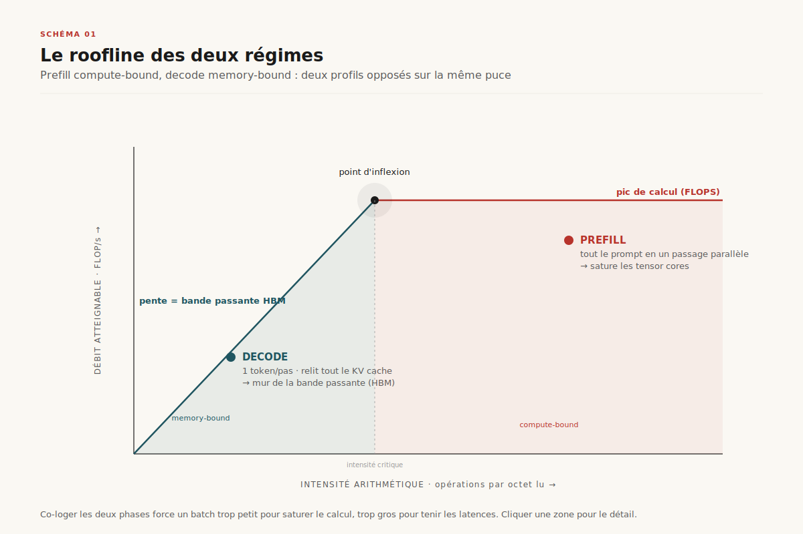
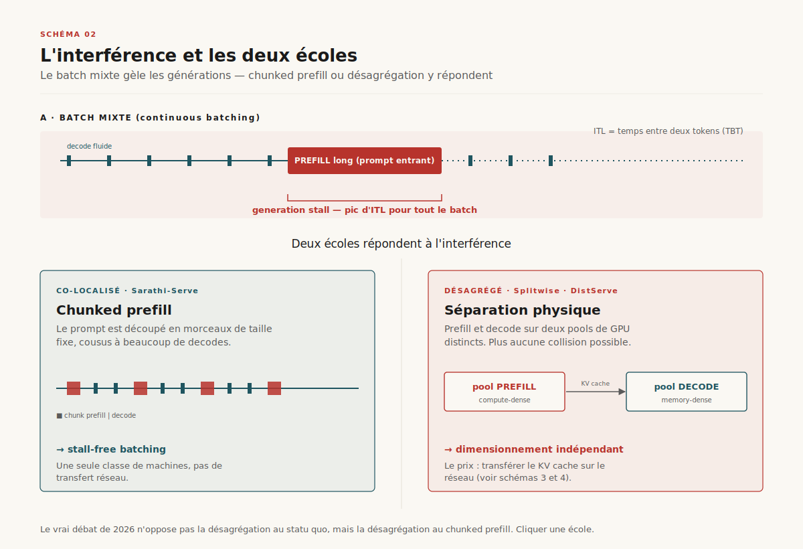
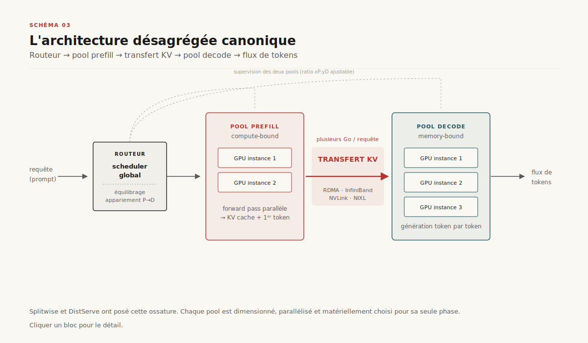

# Désagréger l'inférence : prefill et decode, deux régimes sur une seule machine

> **L'inférence d'un LLM fait coexister deux régimes de calcul antagonistes — le *prefill*, compute-bound, et le *decode*, memory-bound. Les co-loger sur la même machine fait que l'un sabote la latence de l'autre. La désagrégation — les séparer sur des pools distincts et transporter le KV cache sur le réseau — est le tournant architectural du serving 2024-2026.** — 19 juin 2026, Mathieu Guglielmino

*Deep dive des dossiers [décodage spéculatif](../decode-speculative/) et [économie de l'inférence](../economie-inference/).*

## Synthèse exécutive

- **Un LLM ne fait pas un, mais deux calculs très différents.** Le *prefill* lit le prompt entier en un seul passage parallèle : il sature les unités de calcul (compute-bound). Le *decode* génère ensuite un token à la fois, en relisant tout le cache à chaque pas : il sature la bande passante mémoire (memory-bound). ==Ce sont deux charges de travail aux profils opposés, et tout serveur qui les traite sur le même GPU au même instant force un compromis perdant.==[^1][^2]

- **Le batch mixte est le péché originel.** Le *continuous batching* d'Orca (2022), qui a fait gagner un ordre de grandeur de débit, mélange dans un même lot des requêtes en prefill et en decode. Conséquence : un long prefill bloque les générations en cours — un pic de latence inter-token (*generation stall*) visible par tous les utilisateurs du batch.[^5][^6]

- **Deux écoles répondent à l'interférence.** L'école *co-localisée* garde prefill et decode sur la même machine mais les discipline : le *chunked prefill* de Sarathi-Serve découpe les prompts en morceaux pour ne jamais bloquer un decode (*stall-free batching*).[^4] L'école *désagrégée* les sépare physiquement sur deux pools de GPU — Splitwise[^1], DistServe[^2], Mooncake[^3]. ==Le vrai débat de la couche serving en 2026 n'oppose pas la désagrégation au statu quo, mais la désagrégation au chunked prefill.==

- **Désagréger transforme le KV cache en objet réseau de première classe.** Séparer les phases impose de transférer le cache des clés/valeurs du pool prefill vers le pool decode — des gigaoctets par requête, sur RDMA / InfiniBand / NVLink. Mooncake va jusqu'à en faire un pool tiéré CPU/DRAM/SSD partagé.[^3] La désagrégation ne supprime pas le goulot, ==elle le déplace du GPU vers le réseau et la mémoire.==

- **La métrique qui tranche est le *goodput* sous SLO.** TTFT (gouverné par le prefill) et TPOT (gouverné par le decode) ont des SLO distincts. Désagréger permet de dimensionner les deux pools *indépendamment* — ratio xP:yD, parallélisme et matériel choisis phase par phase — et de maximiser le nombre de requêtes qui respectent *les deux* contraintes.[^2] En production, NVIDIA Dynamo[^9] et llm-d[^10] industrialisent cette approche ; ==elle paie à l'échelle, pas en deçà.==

## 1. Deux régimes, une seule machine

Générer une réponse avec un *transformer* autorégressif se décompose en deux phases qu'on confond trop souvent sous le mot « inférence ».

La **phase de prefill** (aussi dite *prompt* ou *encoding*) traite le prompt d'entrée. Tous les tokens du prompt sont connus d'avance ; le modèle peut donc les faire passer *en parallèle* dans un unique *forward pass*. Le coût est une grosse multiplication matrice × matrice : beaucoup d'opérations flottantes, peu de lectures mémoire par opération. Le prefill est **compute-bound** — il sature les unités de calcul du GPU (les *tensor cores*) et son temps croît avec la longueur du prompt. C'est lui qui détermine le **TTFT** (*time-to-first-token*), le délai avant que l'utilisateur voie le premier mot.[^2]

La **phase de decode** (ou *generation*) produit la réponse token par token. Chaque nouveau token dépend du précédent : impossible de paralléliser dans le temps. À chaque pas, le modèle relit l'intégralité des clés et valeurs déjà calculées — le **KV cache** — pour calculer l'attention. C'est une multiplication matrice × vecteur : peu d'opérations, mais une lecture massive de mémoire. Le decode est **memory-bandwidth-bound** — il sature la bande passante de la mémoire haut débit (HBM), pas le calcul. Il gouverne le **TPOT** (*time-per-output-token*, ou ITL, *inter-token latency*), la fluidité du flux de texte.[^1][^2]

==Le rapport d'intensité arithmétique — le nombre d'opérations par octet lu en mémoire — diffère de plus d'un ordre de grandeur entre les deux phases.== Sur un diagramme *roofline*, le prefill se situe sur le plateau du calcul, le decode collé contre le mur de la bande passante mémoire (voir Schéma 1). Les deux phases sollicitent des ressources différentes du même GPU. Quand on les exécute ensemble, on ne peut optimiser ni l'une ni l'autre : le batch est trop petit pour saturer le calcul en prefill, trop gros pour tenir les latences en decode.

Cette divergence a une conséquence matérielle profonde. Un GPU optimal pour le prefill privilégie le calcul brut (FLOPS) ; un GPU optimal pour le decode privilégie la bande passante mémoire et la capacité HBM. ==Tant que les deux phases partagent la même machine, on paie le prix fort du composant le plus cher pour les deux usages.==[^1]

## 2. L'interférence : le péché du batch mixte

L'avancée qui a rendu le serving de LLM économiquement viable est le **continuous batching**, introduit par Orca en 2022 (sous le nom de *iteration-level scheduling*).[^5] Au lieu d'attendre qu'un lot entier de requêtes soit terminé avant d'en lancer un autre, le serveur recompose le batch *à chaque itération* : dès qu'une requête finit, une nouvelle prend sa place. Couplé à la gestion mémoire par pagination de PagedAttention (vLLM, 2023)[^6], ce mécanisme a multiplié le débit par un ordre de grandeur et reste le socle de tous les serveurs modernes.

Mais le continuous batching porte un défaut structurel. À chaque itération, le batch peut contenir un mélange de requêtes : certaines en plein decode (un token à produire), d'autres qui viennent d'arriver et doivent faire leur prefill (des centaines ou milliers de tokens à traiter d'un coup). Comme le batch s'exécute en une seule passe synchrone, ==le long prefill d'une requête entrante bloque les decodes de toutes les autres==. L'utilisateur dont la génération était fluide voit soudain un *trou* : un pic d'ITL, le *generation stall*.[^4] Plus le prompt entrant est long, plus le gel est marqué. Sur des charges réelles mêlant requêtes courtes et contextes longs (RAG, agents), ces pics rendent l'expérience erratique.

Deux écoles répondent à cette interférence, et leur opposition structure tout le champ du serving en 2026.

L'**école co-localisée** garde prefill et decode sur la même machine mais réordonne le travail pour ne jamais bloquer un decode. **Sarathi-Serve** (OSDI 2024) en est la référence : il découpe chaque prefill en *chunks* de taille fixe (*chunked prefills*) et compose des batchs hybrides où un peu de prefill est cousu à beaucoup de decodes, sans jamais dépasser un budget de calcul par itération.[^4] C'est le *stall-free batching* : aucune itération n'est assez lourde pour geler les générations. L'approche est élégante, ne demande qu'une seule classe de machines, et reste le défaut de nombreux déploiements.

L'**école désagrégée** tranche le nœud autrement : si les deux phases s'interfèrent, ==il faut les séparer physiquement==. Prefill sur un pool de GPU, decode sur un autre. Plus aucun prefill ne peut bloquer un decode, puisqu'ils ne tournent plus sur les mêmes machines. C'est le pari de Splitwise[^1], DistServe[^2] et Mooncake[^3]. Le prix à payer : il faut transférer le KV cache d'un pool à l'autre.

## 3. L'architecture désagrégée canonique

L'architecture qui émerge des trois papiers fondateurs partage une même ossature.

Un **routeur global** (ou ordonnanceur, *global scheduler*) reçoit la requête. Il l'envoie d'abord à une **instance de prefill**, choisie dans le pool prefill selon la charge et, idéalement, la possibilité de réutiliser un cache existant (*prefix caching*). L'instance de prefill calcule en un passage le KV cache de tout le prompt et le premier token.

Ce KV cache est ensuite **transféré** vers une **instance de decode**, dans le pool decode, qui prend le relais : elle reçoit le cache, l'installe dans sa propre mémoire, puis génère la réponse token par token jusqu'à la fin. Le routeur supervise l'appariement prefill→decode et l'équilibrage de charge entre pools.[^1][^2]

Cette séparation débloque trois libertés que la co-localisation interdit :

- **Parallélisme par phase.** Le prefill, compute-bound, profite d'un parallélisme tensoriel agressif sur peu de GPU ; le decode, memory-bound, préfère un parallélisme dimensionné pour tenir la latence. DistServe choisit ces stratégies séparément pour chaque pool.[^2]
- **Dimensionnement indépendant.** On peut faire tourner, par exemple, 2 instances de prefill pour 6 de decode (un ratio xP:yD), ajusté à la forme réelle du trafic — prompts longs et réponses courtes, ou l'inverse.[^2]
- **Matériel hétérogène.** Splitwise montre qu'on peut placer le prefill sur des GPU à fort calcul et le decode sur des GPU plus anciens ou à forte bande passante mais moins chers, optimisant coût et consommation électrique à débit constant.[^1][^11]

**Splitwise** (Microsoft Azure + Université de Washington, ISCA 2024) a posé le concept de *phase splitting* et démontré ses gains de coût/puissance sur des grappes Azure réelles.[^1] **DistServe** (Peking University + UC San Diego, OSDI 2024) l'a formalisé autour du *goodput* et a montré comment co-optimiser placement et parallélisme par phase.[^2] **TetriInfer** y ajoute une classification des requêtes pour router intelligemment selon leur profil prédit.[^7]

## 4. Le KV cache comme objet réseau

La désagrégation ne supprime pas le coût : ==elle le transforme en un problème de transport==. Le KV cache d'une seule requête peut peser plusieurs gigaoctets — il croît linéairement avec la longueur du contexte, le nombre de couches et la dimension cachée du modèle. Le déplacer du pool prefill au pool decode, pour chaque requête, sur le chemin critique de latence, est le défi central de toute architecture désagrégée.

Plusieurs leviers le rendent tenable.

**Le transport rapide.** Les implémentations sérieuses ne passent pas par le réseau TCP classique mais par des liens à très faible latence : NVLink entre GPU d'un même nœud, **RDMA sur InfiniBand** ou RoCE entre nœuds. NVIDIA a standardisé cette couche avec **NIXL** (*NVIDIA Inference Xfer Library*), le moteur de transfert au cœur de Dynamo, qui abstrait HBM, DRAM et stockage derrière une API unique.[^9] Mooncake a développé son propre **Transfer Engine** RDMA, désormais adopté par d'autres serveurs.[^3]

**Le recouvrement layer-by-layer.** Plutôt que d'attendre la fin du prefill complet avant d'expédier le cache, on peut le *streamer* couche par couche au fur et à mesure de son calcul : le transfert de la couche *n* recouvre le calcul de la couche *n+1*. **DéjàVu** a poussé cette idée du *KV-cache streaming*, qui sert aussi la tolérance aux pannes et le *swapping* de micro-batchs.[^8] Le transfert devient ainsi en grande partie gratuit, masqué derrière le calcul.

**Le pool tiéré et partagé.** Mooncake (Moonshot AI, qui sert l'assistant Kimi ; *best paper* à FAST 2025) fait du KV cache l'objet architectural central — d'où son nom de *KVCache-centric architecture*.[^3] Le cache vit dans un **pool désagrégé exploitant la DRAM et le SSD inutilisés** de la grappe, en plusieurs niveaux (HBM → DRAM → SSD). Ce pool sert deux fins : alimenter les instances de decode, et **réutiliser les préfixes** entre requêtes (deux conversations partageant un *system prompt* ne le recalculent pas). Mooncake y greffe un ordonnanceur orienté surcharge (*overload-oriented*) qui sait rejeter ou différer sous pic.

==Le prefix caching transforme l'économie de la désagrégation== : sur des charges à fort recouvrement de contexte (mêmes instructions système, documents RAG récurrents), une grande part du prefill n'est jamais recalculée, et le pool KV devient un cache de second niveau aussi important que le calcul lui-même.[^3]

[SCHEMA-05]

## 5. Goodput sous SLO : pourquoi désagréger paie

La métrique pertinente n'est ni le débit brut (tokens/seconde) ni la latence moyenne, mais le **goodput** : le nombre de requêtes par seconde qui respectent *simultanément* leurs objectifs de service (SLO) de TTFT **et** de TPOT. C'est la contribution conceptuelle de DistServe.[^2]

Pourquoi ce double critère change tout : un serveur peut afficher un débit superbe en bourrant ses batchs, tout en violant le TPOT (générations saccadées) ou le TTFT (premiers tokens trop lents). Deux SLO, gouvernés par deux phases aux profils opposés, tirent dans des directions contraires. ==Optimiser le débit agrégé sans regarder les deux SLO produit un système rapide en moyenne et inutilisable en pratique.==

La désagrégation attaque ce problème par la racine : puisque TTFT dépend du pool prefill et TPOT du pool decode, on peut **dimensionner et régler chaque pool pour son seul SLO**, sans compromis. Besoin de TTFT plus serré ? On ajoute des instances de prefill. TPOT qui dérive sous charge ? On ajoute du decode. Le ratio xP:yD devient un cadran qu'on tourne selon la forme du trafic. DistServe montre des gains substantiels de requêtes servies dans les SLO par rapport à un serveur co-localisé, à matériel égal.[^2]

Mais — et c'est le contre-point honnête — ==la désagrégation a un coût fixe d'entrée qui ne se rentabilise qu'à l'échelle==. Transférer le KV cache ajoute de la latence et de la complexité ; séparer en deux pools suppose assez de GPU pour que chacun soit bien rempli. Sur un petit déploiement, ou sous charge homogène où l'interférence reste marginale, **le chunked prefill co-localisé de Sarathi-Serve est souvent le meilleur choix** : une seule classe de machines, pas de transfert réseau, un *stall-free batching* qui suffit.[^4] Le seuil de bascule dépend de l'échelle, de l'hétérogénéité du trafic et du coût du réseau — c'est une décision d'ingénierie, pas un dogme.

[SCHEMA-06]

## 6. Cartographie des systèmes 2026

Le champ s'est structuré en trois cercles concentriques : les papiers fondateurs, les frameworks de production, l'adoption dans les serveurs open-source grand public (voir Schéma 6).

**Les fondateurs académiques.** *Splitwise*[^1] (phase splitting, coût/énergie, matériel hétérogène) et *DistServe*[^2] (goodput, placement et parallélisme par phase) ont posé les bases en 2024. *TetriInfer*[^7] ajoute la classification de requêtes ; *DéjàVu*[^8] le streaming de KV et la tolérance aux pannes. Du côté co-localisé, *Sarathi-Serve*[^4] reste la référence du *stall-free batching*, héritier du *continuous batching* d'Orca[^5].

**Les frameworks de production.** *Mooncake*[^3] est le premier déploiement à grande échelle d'une architecture désagrégée centrée KV cache, en production derrière Kimi. *NVIDIA Dynamo*[^9], annoncé à GTC en mars 2025, est un framework de serving open-source qui fait du *disaggregated serving* un mode natif, avec routage *KV-aware*, planificateur dynamique de pools (*planner*) et transport NIXL — la réponse de NVIDIA à la généralisation du pattern. *llm-d*[^10] (Red Hat, Google, IBM, CoreWeave, mai 2025) porte la désagrégation dans le monde Kubernetes : inférence distribuée native, fondée sur vLLM, avec routage sensible au cache KV et désagrégation prefill/decode comme primitive de déploiement.

**L'adoption open-source.** *vLLM* a introduit un support expérimental de *disaggregated prefilling* via un connecteur KV (configurations 1P1D et au-delà)[^12] ; *SGLang* a ajouté la désagrégation P/D et intègre le Transfer Engine de Mooncake.[^12] Le signe que le pattern n'est plus une curiosité de recherche mais une option de déploiement standard.

| Système | École | Transport KV | Statut |
|---|---|---|---|
| Splitwise[^1] | Désagrégé | InfiniBand | Recherche / Azure |
| DistServe[^2] | Désagrégé | RDMA | Recherche |
| TetriInfer[^7] | Désagrégé + routing | RDMA | Recherche |
| DéjàVu[^8] | Désagrégé + streaming | KV streaming | Recherche |
| Sarathi-Serve[^4] | Co-localisé (chunked) | — (pas de transfert) | Recherche / intégré |
| Mooncake[^3] | Désagrégé (KV-centric) | Transfer Engine RDMA | Production (Kimi) |
| NVIDIA Dynamo[^9] | Désagrégé | NIXL | Production (OSS) |
| llm-d[^10] | Désagrégé | KV-aware (vLLM) | Production (OSS) |
| vLLM / SGLang[^12] | Désagrégé (opt.) | Connecteur KV / Mooncake | Open-source |

## 7. Trajectoires 2026-2028 et conclusion

Quatre directions se dessinent.

**Le matériel hétérogène par phase devient la norme.** L'intuition de Splitwise — prefill sur GPU compute-dense, decode sur GPU mémoire-dense et moins cher — se généralise à mesure que les parcs se diversifient (générations successives de GPU, accélérateurs spécialisés). ==La désagrégation est le préalable architectural qui permet d'exploiter un parc hétérogène au lieu d'aligner tout le monde sur le composant le plus cher.==[^1][^11]

**Le KV cache devient un service partagé.** La logique de Mooncake — un pool KV tiéré, multi-tenant, avec réutilisation de préfixes — pousse vers un *KV cache as a service* mutualisé à l'échelle de la grappe, voire du datacenter. La frontière entre « cache » et « stockage » s'efface ; les questions de cohérence, d'éviction et d'isolation deviennent centrales.[^3]

**La désagrégation se compose avec le décodage spéculatif.** Le [décodage spéculatif](../decode-speculative/) attaque le mur mémoire du decode ; la désagrégation isole ce mur sur un pool dédié. Les deux sont orthogonaux et cumulables : un pool decode désagrégé est l'endroit naturel pour déployer la spéculation, et l'on commence à voir des serveurs combiner les deux.

**La désagrégation gagne les experts MoE.** Sur les modèles à mélange d'experts, la même logique de séparation s'applique aux couches d'experts — *expert parallelism* désagrégé, où l'acheminement vers les experts devient un problème de transport analogue à celui du KV cache. La standardisation du transport (NIXL[^9], Transfer Engine[^3]) prépare ce terrain.

**Conclusion.** La désagrégation prefill/decode n'invente pas une optimisation de plus : elle reconnaît une vérité longtemps masquée par le mot unique « inférence » — qu'un LLM exécute deux charges de travail aux profils matériels opposés. La séparation des préoccupations qui en découle est familière aux systèmes distribués : on isole les régimes, on dimensionne chacun pour sa contrainte, et l'on paie le prix d'un transport explicite entre eux. ==Ce prix — déplacer le KV cache du GPU vers le réseau — n'est rentable qu'à l'échelle ; en deçà, le chunked prefill co-localisé reste le bon défaut.== Mais à l'échelle des assistants grand public et des flottes d'agents, le calcul penche désormais nettement vers la désagrégation. Le goulot d'étranglement de l'inférence LLM n'est plus seulement le GPU : c'est, de plus en plus, le réseau qui relie les deux moitiés d'un même calcul.

## Sources

[^1]: Patel, P., Choukse, E., Zhang, C., et al. « Splitwise: Efficient Generative LLM Inference Using Phase Splitting ». *ISCA 2024* / arXiv:2311.18677. Microsoft Azure Research + University of Washington. Fondateur du *phase splitting* : pools prefill et decode séparés, transfert KV sur InfiniBand, optimisation coût/puissance et matériel hétérogène. https://arxiv.org/abs/2311.18677

[^2]: Zhong, Y., Liu, S., Chen, J., et al. « DistServe: Disaggregating Prefill and Decoding for Goodput-optimized Large Language Model Serving ». *OSDI 2024* / arXiv:2401.09670. Peking University + UC San Diego. Formalise le *goodput* sous SLO (TTFT + TPOT), le placement et le parallélisme par phase, le dimensionnement indépendant des pools. https://arxiv.org/abs/2401.09670

[^3]: Qin, R., Li, Z., He, W., et al. « Mooncake: A KVCache-centric Disaggregated Architecture for LLM Serving ». *FAST 2025* (best paper) / arXiv:2407.00079. Moonshot AI (Kimi). Architecture de production : pool KV tiéré CPU/DRAM/SSD, Transfer Engine RDMA, réutilisation de préfixes, ordonnancement orienté surcharge. https://arxiv.org/abs/2407.00079

[^4]: Agrawal, A., Kedia, N., Panwar, A., et al. « Taming Throughput-Latency Tradeoff in LLM Inference with Sarathi-Serve ». *OSDI 2024* / arXiv:2403.02310. Microsoft Research India + Georgia Tech. L'école co-localisée : *chunked prefills* + *stall-free batching*, le principal rival de la désagrégation. https://arxiv.org/abs/2403.02310

[^5]: Yu, G.-I., Jeong, J. S., Kim, G.-W., et al. « Orca: A Distributed Serving System for Transformer-Based Generative Models ». *OSDI 2022*. Origine du *continuous / iteration-level batching* — et donc du batch mixte qui crée l'interférence prefill↔decode. https://www.usenix.org/conference/osdi22/presentation/yu

[^6]: Kwon, W., Li, Z., Zhuang, S., et al. « Efficient Memory Management for Large Language Model Serving with PagedAttention » (vLLM). *SOSP 2023* / arXiv:2309.06180. Pagination du KV cache, socle mémoire des serveurs modernes. https://arxiv.org/abs/2309.06180

[^7]: Hu, C., Huang, H., Xu, L., et al. « Inference without Interference: Disaggregate LLM Inference for Mixed Downstream Workloads » (TetriInfer). arXiv:2401.11181. Désagrégation couplée à une classification de requêtes pour le routage. https://arxiv.org/abs/2401.11181

[^8]: Strati, F., Elvinger, S., Kerimoglu, T., Klimovic, A. « DéjàVu: KV-cache Streaming for Fast, Fault-tolerant Generative LLM Serving ». *ICML 2024* / arXiv:2403.01876. ETH Zürich. Streaming du KV cache, *micro-batch swapping*, tolérance aux pannes. https://arxiv.org/abs/2403.01876

[^9]: NVIDIA. « NVIDIA Dynamo » — framework de serving d'inférence open-source (annoncé GTC, mars 2025). *Disaggregated serving* natif, routage KV-aware, planificateur de pools, transport NIXL (*NVIDIA Inference Xfer Library*). https://github.com/ai-dynamo/dynamo

[^10]: llm-d. « llm-d: Kubernetes-native distributed inference » (Red Hat, Google, IBM, CoreWeave, mai 2025). Inférence distribuée fondée sur vLLM, désagrégation prefill/decode et routage sensible au cache KV comme primitives de déploiement. https://llm-d.ai

[^11]: Patel, P., et al. « Splitwise: Better Performance and Lower Cost for LLM Inference » — billet Microsoft Azure Research, et travaux liés sur la gestion de puissance (POLCA). Angle coût/énergie et matériel hétérogène par phase. https://www.microsoft.com/en-us/research/blog/

[^12]: Documentation vLLM (« Disaggregated Prefilling », connecteur KV, configurations 1P1D) et SGLang (« PD Disaggregation », intégration du Mooncake Transfer Engine). L'adoption de la désagrégation dans les serveurs open-source grand public. https://docs.vllm.ai
