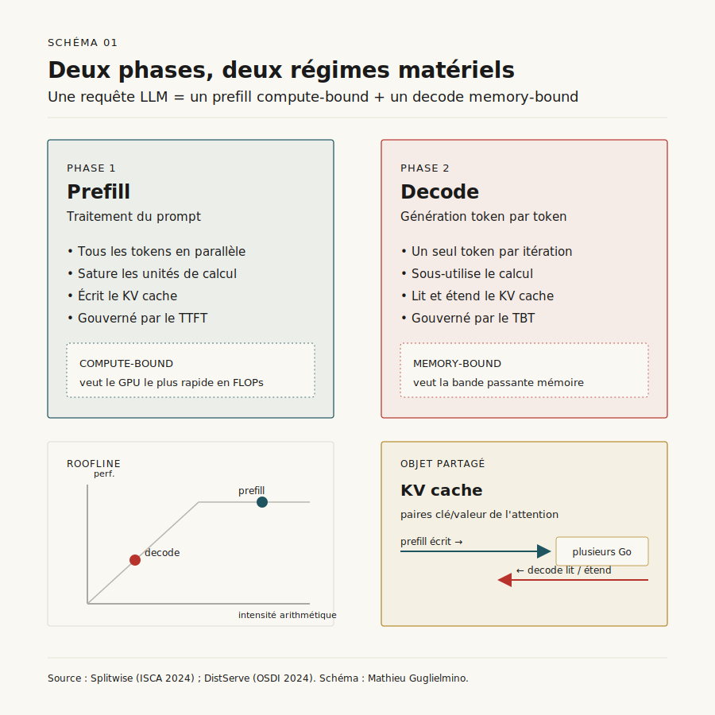
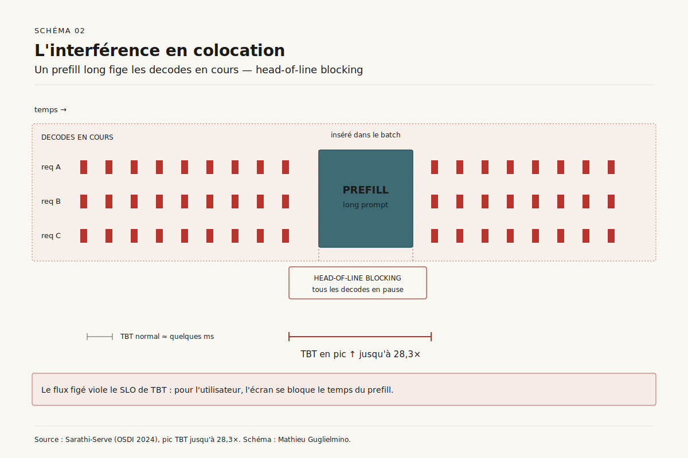
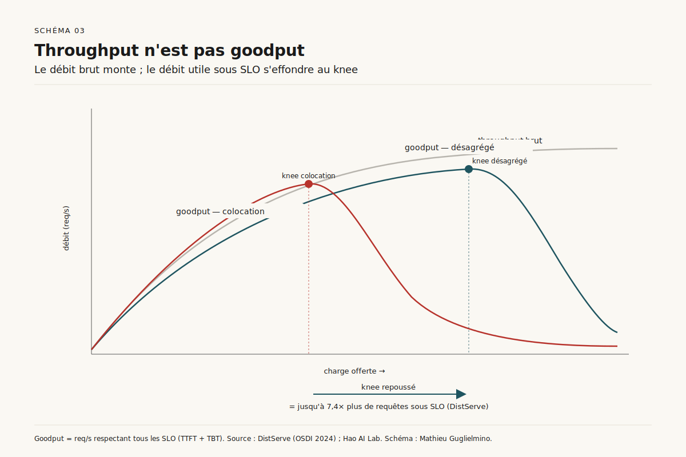
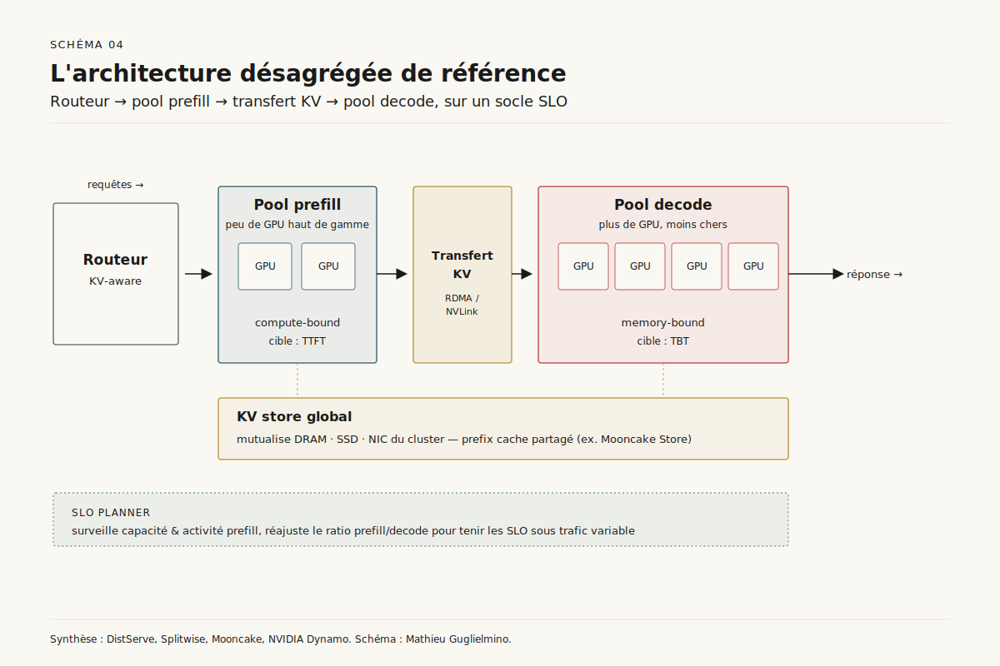
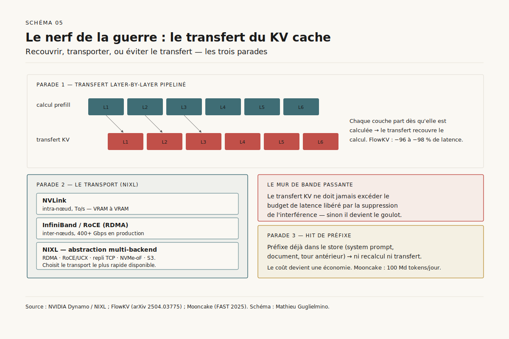

# Désagréger l'inférence : pourquoi le serving LLM sépare prefill et decode

> **La désagrégation prefill/decode sépare les deux phases de l'inférence — l'une compute-bound et parallèle, l'autre memory-bound et séquentielle — sur des pools matériels distincts pour supprimer l'interférence qui plafonne le débit utile sous SLO. Devenue l'architecture par défaut du serving à grande échelle en 2026, elle n'est pourtant rentable qu'au-dessus d'un seuil de charge et de longueur de contexte.** — 22 juin 2026, Mathieu Guglielmino

## Synthèse exécutive

- Une requête LLM s'exécute en deux phases aux profils matériels opposés : le *prefill* (traitement du prompt) sature le compute en parallèle, le *decode* (génération token par token) sous-utilise ce même compute et s'étrangle sur la bande passante mémoire. ==Les colocaliser sur le même GPU, c'est forcer deux charges antagonistes à se partager une ressource calibrée pour aucune des deux.==
- En colocation, l'insertion d'un prefill long dans un batch de decodes en cours provoque un *head-of-line blocking* : le pic de latence inter-tokens (TBT) peut atteindre **28,3×** la valeur d'un batch de decode pur[^4]. C'est ce que la désagrégation supprime à la racine en assignant chaque phase à un pool de GPU dédié.
- La métrique qui compte n'est pas le débit brut mais le **goodput** — le nombre de requêtes par seconde qui respectent *tous* leurs SLO (TTFT *et* TBT)[^8]. DistServe montre que désagréger permet de servir **7,4× plus de requêtes** ou de tenir un SLO **12,6× plus serré** à matériel constant[^1] ; Splitwise obtient **2,35×** de débit à coût et puissance égaux[^2] ; Mooncake, en production chez Kimi, gagne **59 à 498 %** de capacité effective sous SLO[^3].
- Le coût caché de la désagrégation, c'est le **transfert du KV cache** du pool prefill vers le pool decode. Mal géré, il devient le nouveau goulot d'étranglement ; bien géré — transfert *layer-by-layer* recouvrant le compte, transport RDMA/NVLink via des bibliothèques comme NIXL — il devient négligeable[^12].
- La désagrégation n'est pas universellement gagnante. ==Sous un seuil de charge et de longueur de contexte, le prefill découpé en colocation (Sarathi-Serve) reste compétitif voire supérieur== — l'overhead de transfert et la fragmentation des pools ne se rentabilisent qu'à l'échelle[^10]. Choisir, c'est lire sa propre courbe de charge, pas suivre la mode.

## 1. Deux phases, deux régimes matériels

Toute génération autorégressive se décompose en deux temps que tout sépare. Le **prefill** ingère le prompt : il calcule en une passe les représentations de tous les tokens d'entrée et remplit le *KV cache* — les paires clé/valeur de l'attention qui seront réutilisées à chaque pas suivant. Cette phase traite des centaines ou des milliers de tokens *en parallèle* : elle sature les unités de calcul matriciel du GPU. Elle est *compute-bound*.

Le **decode** génère ensuite la réponse, un token à la fois. Chaque itération lit l'intégralité du KV cache accumulé, calcule un seul nouveau token, l'ajoute au cache, recommence. Le volume de calcul par pas est minuscule ; ce qui domine, c'est le va-et-vient mémoire — lire les poids du modèle et le cache à chaque token. Cette phase est *memory-bandwidth-bound* : elle laisse les unités de calcul du GPU largement inoccupées[^2].

*Schéma 1 — Les deux phases d'une requête LLM occupent des points opposés de la roofline matérielle : le prefill sature le calcul, le decode s'étrangle sur la bande passante mémoire.*

Comme l'illustre le Schéma 1, ces deux régimes vivent sur des points opposés de la *roofline* matérielle. Le prefill veut le GPU le plus rapide en FLOPs ; le decode veut surtout de la bande passante mémoire et se contente d'un accélérateur moins onéreux. Splitwise documente l'asymétrie sans détour : ==la phase de génération « n'a pas besoin de la capacité de calcul des derniers GPU et peut tourner sur des composants moins puissants, moins coûteux et moins énergivores »==[^2]. C'est l'observation fondatrice. Forcer ces deux charges à cohabiter sur un seul type de matériel revient à payer un GPU de pointe pour passer la majorité de son temps en sous-régime de calcul, à attendre la mémoire.

La durée respective des deux phases varie énormément avec la charge de travail. Un assistant de code avec un long contexte (des milliers de tokens en entrée, quelques dizaines en sortie) est dominé par le prefill ; un agent conversationnel qui génère de longues réponses à partir d'un prompt court est dominé par le decode. Cette variabilité est précisément ce qui rend l'allocation statique inefficace : aucun ratio fixe de ressources prefill/decode ne convient à toutes les requêtes simultanément.

## 2. L'interférence en colocation

Les systèmes de serving classiques — vLLM dans sa configuration de base, les premières versions de TensorRT-LLM — colocalisent les deux phases et les *batchent* ensemble sur les mêmes GPU. C'est rationnel en apparence : on remplit le matériel. En pratique, cela crée une **interférence prefill-decode** dont les conséquences sur la latence sont sévères.

*Schéma 2 — En colocation, l'insertion d'un prefill long dans un batch met en pause tous les decodes en cours (head-of-line blocking) et fait exploser le temps inter-tokens en queue.*

Le mécanisme, schématisé Schéma 2, est un *head-of-line blocking*. Une itération de decode est très rapide — quelques millisecondes. Une passe de prefill sur un long prompt peut prendre des centaines de millisecondes. Quand le *scheduler* insère un prefill dans un batch où des requêtes sont déjà en train de générer, ces decodes en cours sont mis en pause le temps que le prefill s'exécute. Pour l'utilisateur dont la réponse s'écrivait token par token, l'écran se fige. Sarathi-Serve mesure l'ampleur du dégât : le *batching* hybride naïf provoque ==une augmentation allant jusqu'à 28,3× du temps inter-tokens en queue (TBT) par rapport à un batch de decode pur==[^4].

Le problème est structurel parce que les deux phases ont des **objectifs de latence (SLO) distincts et antagonistes**. Le prefill est gouverné par le *Time-To-First-Token* (TTFT) : combien de temps avant que la réponse commence à s'afficher. Le decode est gouverné par le *Time-Between-Tokens* (TBT, parfois TPOT) : la fluidité du flux une fois lancé[^8]. Optimiser l'un dégrade l'autre. Pour réduire le TTFT, on veut traiter les prefills vite et en priorité — ce qui fige les decodes et dégrade le TBT. Pour lisser le TBT, on veut protéger les decodes en cours — ce qui fait attendre les nouveaux prompts et dégrade le TTFT. ==En colocation, le scheduler est condamné à arbitrer en permanence entre deux SLO qu'il ne peut satisfaire ensemble que dans une fenêtre de charge étroite.==

## 3. Throughput n'est pas goodput

L'erreur classique de dimensionnement consiste à mesurer le *throughput* — tokens ou requêtes traités par seconde, toutes confondues — et à le maximiser. Or le throughput ignore la qualité de service : il compte autant une requête servie dans les temps qu'une requête dont la première réponse a mis dix secondes à arriver. La métrique pertinente est le **goodput** : ==le nombre de requêtes complétées par seconde qui respectent *simultanément* tous leurs SLO== (TTFT sous le plafond *et* TBT sous le plafond pour chaque token)[^8].

*Schéma 3 — Le throughput continue de monter avec la charge ; le goodput s'effondre dès que la latence viole les SLO. La désagrégation déplace ce knee vers la droite.*

Le Schéma 3 oppose les deux courbes en fonction de la charge. Le throughput monte continûment puis plafonne quand le matériel sature. Le goodput, lui, suit le throughput jusqu'à un *knee* — le point où la latence commence à violer les SLO — puis s'effondre : au-delà, le système traite toujours autant de tokens, mais une fraction croissante d'entre eux arrive trop tard pour compter. Tout l'enjeu d'un serving sous contrainte d'expérience utilisateur est de repousser ce knee le plus loin possible.

C'est exactement ce que fait la désagrégation. En supprimant l'interférence, elle découple les courbes de latence des deux phases : un pic de prefill ne contamine plus le TBT des decodes. Le knee de goodput se déplace vers la droite. Le titre du billet du Hao AI Lab résume la thèse de DistServe : *« Throughput is not all you need »*[^9]. Les chiffres du papier quantifient le déplacement : à SLO constant, **7,4× plus de requêtes** servies ; ou, à charge constante, un SLO **12,6× plus serré** tenable — le tout en gardant plus de 90 % des requêtes dans les clous[^1].

Une nuance s'impose. Des travaux ultérieurs ont montré que la définition même du goodput est piégeuse : un goodput mesuré sur des SLO moyens peut masquer des violations en queue de distribution, et comparer des systèmes sur des définitions de SLO différentes invalide la comparaison[^8]. La leçon opérationnelle : un goodput n'a de sens qu'attaché à une paire de seuils (TTFT, TBT) explicite et à un percentile (P90, P99). ==Annoncer « 7,4× » sans dire à quel SLO, c'est annoncer un chiffre creux.==

## 4. L'alternative qui n'est pas un homme de paille : le prefill découpé

Avant de désagréger, il faut écarter une objection sérieuse : on peut atténuer l'interférence *sans* séparer les pools. C'est l'approche du **prefill découpé** (*chunked prefill*) de Sarathi-Serve[^4]. L'idée : au lieu d'exécuter un long prefill en une passe bloquante, on le découpe en morceaux de taille à peu près constante, et on insère chaque morceau dans un batch qui contient aussi des decodes en cours — sans jamais mettre ces decodes en pause. C'est le *stall-free scheduling*.

Le gain est double. D'abord, le TBT reste maîtrisé parce qu'aucun decode n'est jamais figé par un prefill entier — au pire, il partage une itération avec un chunk de prefill borné. Ensuite, on peut faire tourner de gros batches (bon pour le throughput) sans payer la latence en queue. Sarathi-Serve revendique **2,6×** de capacité de service sur Mistral-7B, jusqu'à **3,7×** sur Yi-34B, et **5,6×** avec parallélisme de pipeline sur Falcon-180B, par rapport à vLLM[^4].

Le prefill découpé est aujourd'hui le *baseline* sérieux que la désagrégation doit battre, pas un repoussoir. ==Pour une charge modérée, sur un seul type de GPU, le chunked prefill capture l'essentiel du bénéfice sans introduire le coût de transfert du KV cache ni la complexité opérationnelle de deux pools distincts.== Les deux techniques ne sont d'ailleurs pas exclusives : un pool prefill désagrégé peut lui-même découper ses prefills en interne. Mais elles répondent à des échelles différentes — c'est le cœur de la décision de la section 8.

## 5. L'architecture désagrégée de référence

Désagréger, c'est physiquement séparer les deux pools de GPU et router chaque requête à travers les deux. Le Schéma 4 en donne l'anatomie de référence, convergente entre DistServe, Splitwise, Mooncake et NVIDIA Dynamo malgré leurs différences.

*Schéma 4 — Anatomie de référence : chaque phase a son pool de GPU, son objectif de latence, et un socle commun de cache global et de planification sous SLO.*

En amont, un **routeur** reçoit les requêtes. Dans les systèmes modernes il est *KV-aware* : il sait quels préfixes sont déjà en cache et où, et oriente le trafic pour maximiser les réutilisations et minimiser les recalculs[^5]. La requête part d'abord vers le **pool prefill** : un petit nombre de GPU haut de gamme, calibrés pour le calcul, qui produisent le KV cache du prompt le plus vite possible (TTFT). Ce cache est ensuite transféré — c'est l'objet de la section 6 — vers le **pool decode** : un plus grand nombre de GPU, éventuellement moins coûteux, optimisés pour la bande passante mémoire, qui génèrent la réponse token par token sous contrainte de TBT.

Trois propriétés font la valeur de cette séparation. D'abord, **chaque pool se dimensionne et se parallélise indépendamment** : le prefill peut utiliser un parallélisme tensoriel agressif pour minimiser la latence, le decode un parallélisme orienté débit ; et le *ratio* entre les deux pools s'ajuste à la charge réelle, là où la colocation impose un compromis figé[^1]. Ensuite, un **KV store global** (le *Mooncake Store* en est l'archétype) mutualise les caches au-delà d'un seul nœud : il agrège la DRAM, les SSD et les NIC sous-exploités du cluster pour étendre la capacité de cache et servir de hub de transfert inter-nœuds[^3]. Enfin, un **planificateur sous SLO** — le *SLO Planner* de Dynamo en est l'exemple — surveille en continu la capacité et l'activité de prefill, et réajuste l'allocation de GPU pour tenir les objectifs de latence malgré les variations de trafic[^5].

Le coût de cette élégance est réel : on gère désormais deux systèmes au lieu d'un, un fabric de transfert, un routeur intelligent, un store distribué. ==La désagrégation échange de la complexité opérationnelle contre du goodput — un échange qui ne devient avantageux qu'à partir d'une certaine échelle.==

## 6. Le nerf de la guerre : le transfert du KV cache

Tout repose sur un déplacement : le KV cache produit par le pool prefill doit rejoindre le pool decode avant que la génération puisse commencer. Pour un long contexte, ce cache pèse plusieurs gigaoctets. Mal géré, ==ce transfert annule le bénéfice de la désagrégation en réintroduisant une latence sur le chemin critique de chaque requête==[^10]. Bien géré, il devient quasi invisible. C'est là que se joue la viabilité de toute l'architecture.

*Schéma 5 — Trois parades face au transfert : le recouvrir (layer-by-layer), le transporter au plus vite (NIXL), ou l'éviter (hit de préfixe dans le store global).*

La première parade, schématisée Schéma 5, est le **transfert *layer-by-layer* pipeliné**. Le KV cache se construit couche par couche pendant le prefill ; plutôt que d'attendre la fin du prefill complet pour tout transférer en bloc, on émet le cache de chaque couche dès qu'elle est calculée. Le transfert recouvre ainsi le calcul du prefill : quand la dernière couche est prête, l'essentiel est déjà parti. FlowKV pousse cette logique avec des techniques de réorganisation mémoire et d'allocation par segments, et revendique une **réduction de 96 à 98 %** de la latence de transfert[^11].

La seconde parade est le **transport** lui-même. À l'intérieur d'un nœud, le KV cache circule sur NVLink ; entre nœuds, sur InfiniBand ou RoCE en RDMA. NVIDIA a packagé cette couche dans **NIXL** (*NVIDIA Inference Xfer Library*), utilisée par Dynamo, qui déplace le cache directement de VRAM à VRAM sur le transport le plus rapide disponible et expose plusieurs backends — RDMA/InfiniBand, RoCE via UCX, repli TCP, NVMe-oF, et même stockage objet S3-compatible[^12]. La règle d'ingénierie : ==pour qu'un cluster reste sous SLO, le transfert KV ne doit jamais excéder le budget de latence libéré par la suppression de l'interférence== — d'où l'importance d'un interconnect à 400+ Gbps en production[^12].

La troisième parade transforme le coût en bénéfice : le **cache de préfixes global**. Si deux requêtes partagent un préfixe — un *system prompt* commun, un document déjà vu, un tour de conversation antérieur — le KV cache correspondant n'a pas à être recalculé : il est servi depuis le store. C'est le cœur de l'architecture KVCache-centric de Mooncake, qui revendique de traiter ==plus de 100 milliards de tokens par jour sur des milliers de nœuds== précisément parce que le store mutualise et réutilise les caches au lieu de les jeter[^3]. Le transfert cesse alors d'être un pur coût pour devenir le support d'une économie de calcul.

## 7. Cartographie des systèmes, 2024-2026

En deux ans, la désagrégation est passée de l'article de recherche au standard de fait. Le Schéma 6 cartographie sept systèmes selon six dimensions : support natif de la désagrégation, transport du KV, cache global, ratio prefill/decode dynamique, échelle de production démontrée, et licence.

[SCHEMA-06]

**DistServe** (Peking University, UC San Diego, StepFun — OSDI 2024) est le papier qui a posé le cadre du goodput et démontré le placement par phase[^1]. **Splitwise** (Microsoft Research — ISCA 2024, Best Paper) a apporté l'argument des pools matériels *hétérogènes* — GPU haut de gamme pour le prefill, GPU plus modestes pour le decode — et la mesure énergétique[^2]. **Mooncake** (Moonshot AI, Tsinghua — FAST 2025, Best Paper) a industrialisé l'approche KVCache-centric en production derrière Kimi, avec le Mooncake Store comme couche de cache distribuée[^3]. Ces trois jalons académiques cadrent le sujet.

Côté plateformes, **NVIDIA Dynamo** (GTC 2025) est l'offre la plus intégrée : routeur KV-aware, NIXL pour le transport, KV Block Manager pour la hiérarchie mémoire, SLO Planner pour l'allocation dynamique — le tout open source[^5]. Côté écosystème ouvert, **vLLM** expose la désagrégation via un connecteur de transfert KV configurable (NIXL, LMCache, mémoire partagée)[^6] ; l'équipe LMSYS en a fait la démonstration à l'échelle en mai 2025 en servant DeepSeek-R1 sur **96 GPU H100** (pool prefill de 3 nœuds, pool decode de 9 nœuds) avec un débit de sortie par nœud ==environ 5× supérieur== au parallélisme tensoriel classique[^7]. **SGLang** et **TensorRT-LLM** ont suivi avec leurs propres implémentations.

Le motif d'adoption mérite d'être nommé. L'inflexion de 2025 n'a pas été technique — les papiers et les prototypes existaient dès 2024. ==Elle a été économique : à mesure que les produits à base de LLM atteignaient des millions d'utilisateurs, chaque violation de SLO est devenue un événement de revenu mesurable, rendant le coût d'ingénierie de la désagrégation manifestement justifié.== C'est la bascule classique d'une optimisation de recherche vers une infrastructure de production.

## 8. Quand désagréger — et l'horizon 2026-2028

La désagrégation n'est pas une amélioration de Pareto. Elle introduit un transfert sur le chemin critique, fragmente les ressources en pools moins flexibles aux variations brutales, et exige un fabric et un routeur dédiés. Le travail contrarian *Beyond the Buzz* le rappelle : ==sous un certain seuil de charge et de longueur de contexte, la colocation avec prefill découpé reste compétitive, et la désagrégation peut même dégrader le goodput== en payant un overhead qu'elle ne rentabilise pas[^10].

[SCHEMA-07]

Le Schéma 7 propose une grille de décision sur deux axes : la **charge et la longueur de contexte** (horizontalement) et la **tension entre SLO** — l'écart entre les contraintes de TTFT et de TBT, qui mesure l'intensité de l'interférence (verticalement). En bas à gauche — faible charge, contexte court, SLO lâches — la **colocation simple** suffit. Quand la charge monte mais que le contexte reste modéré, le **prefill découpé** capture l'essentiel du gain sans le coût de transfert. C'est seulement dans le quadrant haut-droit — forte charge, longs contextes, SLO serrés et divergents — que la **désagrégation pleine** se justifie ; et à très grande échelle multi-nœuds, avec forte réutilisation de préfixes, l'architecture **KVCache-centric** devient le régime dominant.

Trois forces vont étendre ce quadrant haut-droit sur l'horizon 2026-2028. D'abord les **modèles de raisonnement** : leurs longues chaînes de pensée allongent massivement la phase de decode, accentuant l'asymétrie entre les phases et donc le bénéfice de pools séparés — c'est explicitement la cible que Dynamo revendique[^5]. Ensuite les **modèles MoE** (*mixture-of-experts*) avec parallélisme d'experts, dont les schémas de communication se composent différemment avec la désagrégation et amplifient les gains à grande échelle. Enfin, la maturation d'un **KVCache-as-a-service** : à mesure que NIXL, LMCache et les stores distribués se standardisent, le cache KV devient une couche d'infrastructure mutualisée, découplée du modèle servi — la suite logique de la trajectoire amorcée par Mooncake Store.

La question pour 2027 n'est donc plus *« faut-il désagréger ? »* mais *« où placer le curseur sur la grille de la section 8 ? »* — et cette réponse, ==aucune mode ne la donne à la place de la courbe de charge réelle d'un service==.

## Sources

[^1]: Zhong, Yinmin et al. *DistServe: Disaggregating Prefill and Decoding for Goodput-optimized Large Language Model Serving*. OSDI 2024 (Peking University, UC San Diego, StepFun). URL : https://arxiv.org/abs/2401.09670. Consulté le 22 juin 2026.

[^2]: Patel, Pratyush et al. *Splitwise: Efficient Generative LLM Inference Using Phase Splitting*. ISCA 2024, Best Paper Award (Microsoft Research). URL : https://arxiv.org/abs/2311.18677. Consulté le 22 juin 2026.

[^3]: Qin, Ruoyu et al. *Mooncake: A KVCache-centric Disaggregated Architecture for LLM Serving*. FAST 2025, Best Paper Award (Moonshot AI, Tsinghua). URL : https://arxiv.org/abs/2407.00079. Consulté le 22 juin 2026.

[^4]: Agrawal, Amey et al. *Taming Throughput-Latency Tradeoff in LLM Inference with Sarathi-Serve*. OSDI 2024. URL : https://arxiv.org/abs/2403.02310. Consulté le 22 juin 2026.

[^5]: NVIDIA. *Introducing NVIDIA Dynamo, A Low-Latency Distributed Inference Framework for Scaling Reasoning AI Models*. NVIDIA Technical Blog, GTC 2025. URL : https://developer.nvidia.com/blog/introducing-nvidia-dynamo-a-low-latency-distributed-inference-framework-for-scaling-reasoning-ai-models/. Consulté le 22 juin 2026.

[^6]: vLLM Project. *Disaggregated Prefilling (experimental)*. Documentation vLLM. URL : https://docs.vllm.ai/en/latest/features/disagg_prefill/. Consulté le 22 juin 2026.

[^7]: LMSYS Org. *Disaggregated serving de DeepSeek-R1 sur 96 GPU H100*. mai 2025. URL : https://docs.vllm.ai/en/latest/examples/disaggregated/lmcache/. Consulté le 22 juin 2026.

[^8]: Ye, Zihao et al. *Revisiting Service Level Objectives and System Level Metrics in Large Language Model Serving*. arXiv 2410.14257. URL : https://arxiv.org/abs/2410.14257. Consulté le 22 juin 2026.

[^9]: Hao AI Lab (UCSD). *Throughput is Not All You Need: Maximizing Goodput in LLM Serving using Prefill-Decode Disaggregation*. URL : https://haoailab.com/blogs/distserve/. Consulté le 22 juin 2026.

[^10]: *Beyond the Buzz: A Pragmatic Take on Inference Disaggregation*. arXiv 2506.05508. URL : https://arxiv.org/abs/2506.05508. Consulté le 22 juin 2026.

[^11]: *FlowKV: A Disaggregated Inference Framework with Low-Latency KV Cache Transfer and Load-Aware Scheduling*. arXiv 2504.03775. URL : https://arxiv.org/abs/2504.03775. Consulté le 22 juin 2026.

[^12]: NVIDIA. *How to Reduce KV Cache Bottlenecks with NVIDIA Dynamo* (NIXL, transport RDMA/NVLink/NVMe-oF). NVIDIA Technical Blog, 2025. URL : https://developer.nvidia.com/blog/how-to-reduce-kv-cache-bottlenecks-with-nvidia-dynamo/. Consulté le 22 juin 2026.
