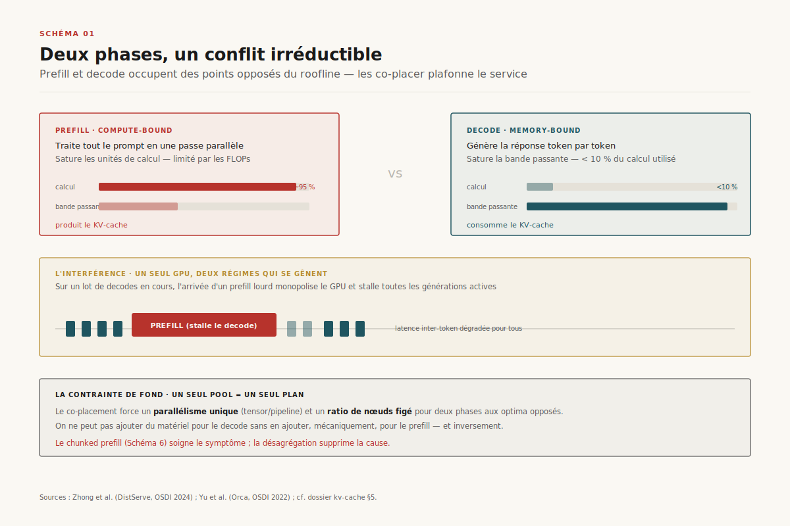
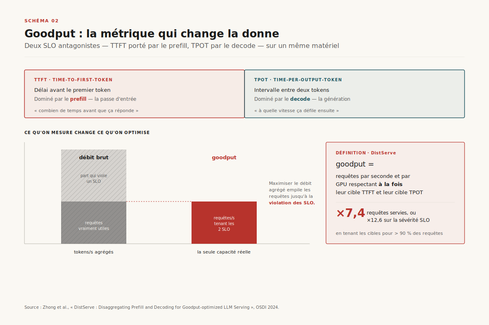
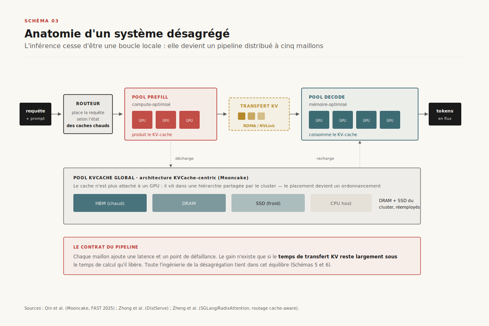
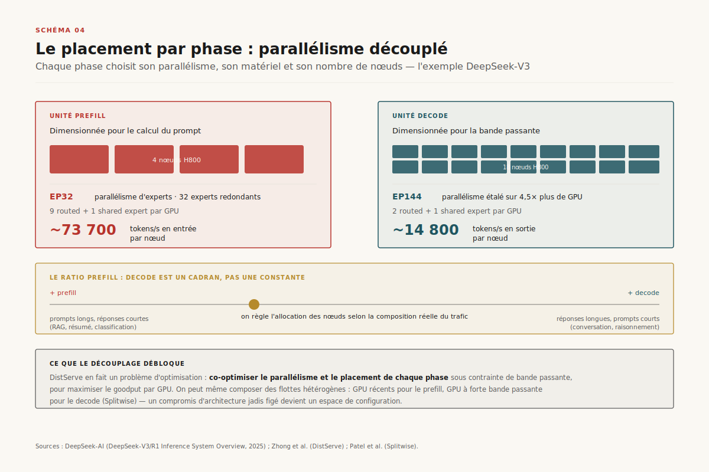
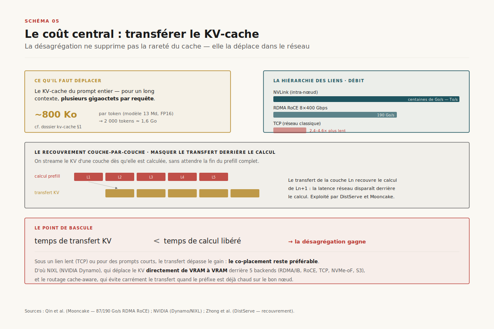
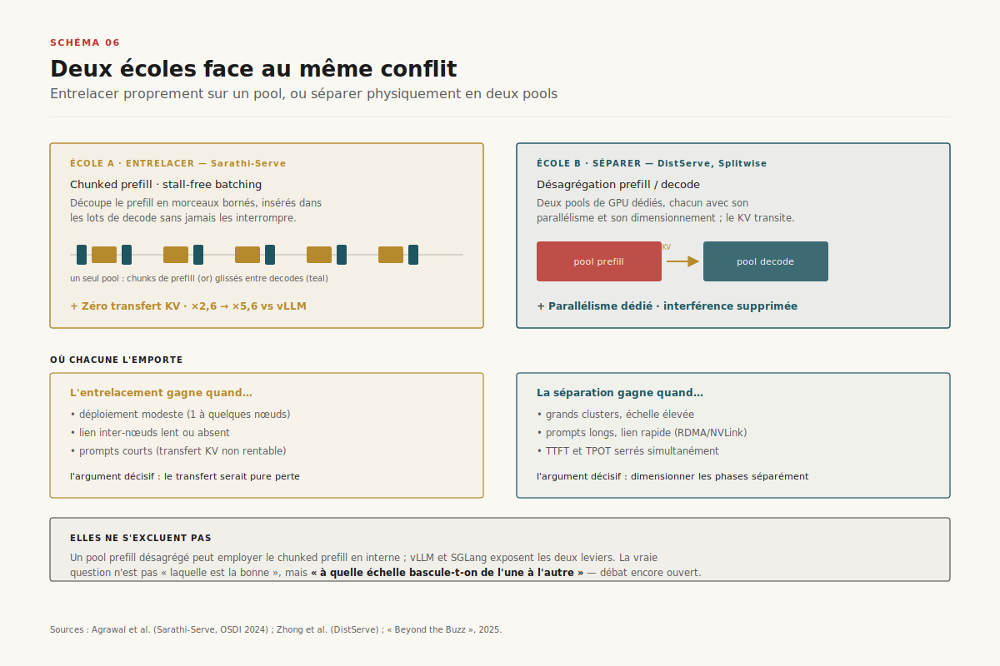
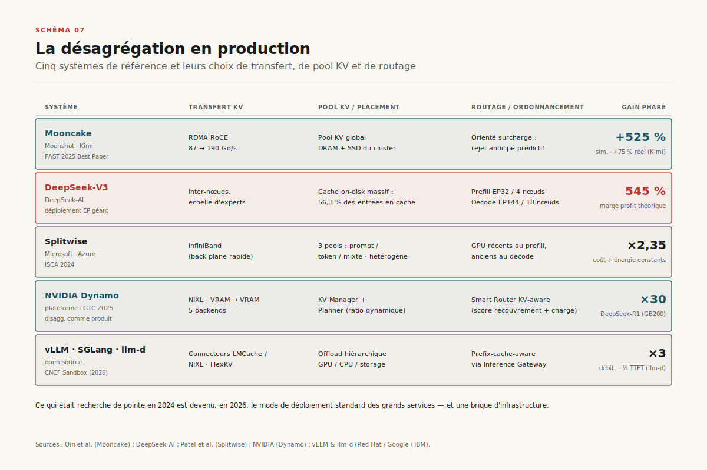

# Désagréger l'inférence : prefill et decode sur deux pools

> **La désagrégation prefill/decode fait passer le service d'inférence d'un problème d'ordonnancement temporel — partager un GPU entre deux phases antagonistes — à un problème d'architecture distribuée : placer, transférer, router. La phase devient l'unité de déploiement, le KV-cache devient un flux réseau, et le *goodput* sous double SLO remplace le débit brut comme métrique de vérité.** — 29 juin 2026, Mathieu Guglielmino

L'inférence d'un grand modèle de langage n'est pas une opération, c'en est deux. Lire le prompt et générer la réponse mobilisent le matériel de façon si différente qu'on a longtemps cru pouvoir les faire cohabiter sur le même GPU par pur ordonnancement. Cette croyance a tenu jusqu'en 2024. La vague de **désagrégation prefill/decode** qui a suivi — DistServe, Splitwise, Mooncake — repose sur une thèse simple et radicale : si les deux phases veulent du matériel opposé, donnons-leur du matériel séparé. Ce rapport est le récit de cette bascule architecturale, de la métrique qui l'a rendue lisible jusqu'aux systèmes qui servent aujourd'hui des dizaines de milliards de tokens par jour sur ce principe.

C'est un *deep dive* qui prolonge le dossier [kv-cache](../kv-cache/) : là où ce dernier traitait la mémoire d'attention comme une ressource à *gérer* (paginer, partager, comprimer), celui-ci traite la désagrégation comme un problème de *système distribué* — comment on découpe, dimensionne, relie et orchestre deux flottes de GPU autour d'un cache qui circule de l'une à l'autre.

## 1. Deux phases, un conflit irréductible

Servir un modèle, c'est exécuter deux régimes de calcul que tout oppose. La phase de **prefill** traite le prompt d'entrée en une seule passe : tous les tokens en parallèle, ce qui sature les unités de calcul du GPU. Elle est *compute-bound* — limitée par les FLOPs. La phase de **decode** génère ensuite la réponse token par token : à chaque pas, une seule ligne de calcul mais une lecture complète du KV-cache accumulé. Elle est *memory-bound* — limitée par la bande passante mémoire, pas par le calcul.

==Un GPU en decode pur utilise typiquement moins de 10 % de sa puissance de calcul tout en saturant sa bande passante mémoire ; en prefill, c'est l'inverse exact.==[^1][^2] Tant qu'on exécute les deux sur le même matériel, trois problèmes se cumulent. D'abord l'**interférence** : quand une nouvelle requête arrive, son prefill (lourd, compute-bound) s'insère dans un lot de decodes en cours (légers, memory-bound) et les *stalle*, dégradant brutalement la latence inter-token de tous les utilisateurs actifs — un héritage direct du *continuous batching* introduit par Orca[^11]. Ensuite le **parallélisme imposé** : un déploiement co-placé doit choisir *un seul* schéma de parallélisme (tensor, pipeline) pour les deux phases, alors qu'elles n'ont pas le même optimum — le prefill aime le parallélisme tensoriel qui accélère une grosse passe, le decode préfère répartir la pression mémoire. Enfin le **dimensionnement bloqué** : on ne peut pas ajouter du matériel pour le decode sans en ajouter aussi, mécaniquement, pour le prefill.

Sarathi-Serve[^4] a proposé le premier remède *sans changer de matériel* — le **chunked prefill**, qui découpe un prefill long en morceaux insérables dans les lots de decode sans les interrompre (on y revient en §6). Mais le remède reste prisonnier de la contrainte de fond : un seul pool, un seul parallélisme, un seul ratio de nœuds. La désagrégation attaque la cause, pas le symptôme.

> **Renvoi — `kv-cache`.** Le roofline prefill/decode, la mécanique du *continuous batching* et le chunked prefill sont posés dans le dossier [kv-cache](../kv-cache/), §5. Ce rapport reprend le fil là où il s'arrêtait : la séparation physique des deux phases.

## 2. Goodput : la métrique qui change la donne

Pourquoi a-t-on mis si longtemps à voir le conflit ? Parce qu'on mesurait la mauvaise chose. Le **débit brut** — tokens par seconde agrégés sur tout le cluster — est trompeur : on peut le maximiser en empilant les requêtes jusqu'à ce que la latence individuelle devienne inacceptable. Or l'inférence interactive est gouvernée par *deux* contraintes de latence distinctes, une par phase.

La première est le **TTFT** (*time-to-first-token*) : le délai avant le premier token, dominé par le prefill. La seconde est le **TPOT** (*time-per-output-token*) : l'intervalle entre deux tokens successifs, dominé par le decode. ==DistServe a fait de cette dualité une métrique : le *goodput*, soit le nombre de requêtes par seconde qui respectent *à la fois* leur cible de TTFT et leur cible de TPOT.==[^1] La distinction est décisive. Un système peut afficher un débit brut flatteur tout en livrant un goodput médiocre, parce qu'une fraction des requêtes viole l'un des deux SLO. Optimiser le débit agrégé sur un pool co-placé revient à optimiser une moyenne qui masque la violation de contraintes antagonistes : serrer le TTFT (gros lots de prefill) relâche le TPOT, et inversement.

Le goodput est la lentille qui rend la désagrégation évidente. Dès lors qu'on mesure le respect simultané de deux SLO portés par deux phases aux profils opposés, séparer ces phases sur du matériel dédié — chacune optimisée pour sa contrainte — cesse d'être une astuce pour devenir la conséquence logique de la métrique. ==DistServe (OSDI 2024) rapporte jusqu'à ×7,4 requêtes servies, ou ×12,6 sur la sévérité de la contrainte SLO, tout en tenant les cibles pour plus de 90 % des requêtes.==[^1]

## 3. Anatomie d'un système désagrégé

Une fois les phases séparées, l'inférence cesse d'être une boucle locale pour devenir un *pipeline distribué*. Cinq composants apparaissent, là où le système co-placé n'en exposait qu'un.

Le **routeur** (ou orchestrateur global) reçoit la requête et décide où la placer ; dans les systèmes *cache-aware*, il connaît l'état des KV-caches déjà chauds et route préférentiellement vers une instance qui détient le bon préfixe — la mécanique de l'arbre radix de SGLang[^9] devient ici une décision de routage inter-nœuds. Le **pool prefill** exécute la passe d'entrée, dimensionné et parallélisé pour le calcul ; il *produit* le KV-cache. Le **transfert KV** déplace ce cache — plusieurs gigaoctets d'états d'attention — sur le réseau vers le pool decode (§5). Le **pool decode** prend en charge la génération auto-régressive, dimensionné pour la bande passante mémoire ; il *consomme* le cache. Enfin, dans les architectures les plus abouties, un **pool KV global** détache le cache de tout GPU précis : il vit dans une hiérarchie HBM/DRAM/SSD partagée par le cluster, et le placement devient un problème d'ordonnancement de premier ordre — c'est le cœur de l'architecture *KVCache-centric* de Mooncake[^3].

Sous chaque pool, le substrat reste la mémoire paginée de PagedAttention[^10] ; et certains systèmes, comme TetriInfer[^5], enrichissent le routeur d'une **prédiction de longueur de génération** (par un petit modèle) pour placer les requêtes sans créer de points chauds de decode — réduisant le TTFT jusqu'à 97 %.

Le contrat de ce pipeline est exigeant. Chaque maillon ajoute une latence et un point de défaillance ; le gain de la désagrégation n'existe que si le transfert KV reste largement sous le temps de calcul qu'il libère. Toute l'ingénierie tient dans cet équilibre.

## 4. Le placement par phase : parallélisme découplé

Le bénéfice le plus profond de la désagrégation n'est pas la disparition de l'interférence — c'est le **découplage du dimensionnement**. Chaque phase peut désormais choisir indépendamment son schéma de parallélisme, son type de GPU et son nombre de nœuds.

DistServe en fait un problème d'optimisation explicite : il **co-optimise le parallélisme et le placement de chaque phase** sous contrainte de bande passante du lien, cherchant la configuration qui maximise le goodput par GPU.[^1] Splitwise[^2] généralise avec trois pools — un pool de machines *prompt* (prefill), un pool de machines *token* (decode), et un pool *mixte* qui absorbe les pics — et montre qu'on peut composer des flottes hétérogènes : du matériel récent et coûteux pour le prefill compute-bound, du matériel plus ancien mais à forte bande passante pour le decode. ==Splitwise (Microsoft, ISCA 2024) obtient ×2,35 de débit à coût et enveloppe énergétique constants, ou ×1,4 de débit pour −20 % de coût.==[^2]

Le cas de production le plus spectaculaire est **DeepSeek-V3**[^6]. Son déploiement sépare radicalement les deux phases avec des degrés de **parallélisme d'experts** (*expert parallelism*, EP) très différents : l'unité de prefill tourne en **EP32 sur 4 nœuds** ; l'unité de decode pousse jusqu'à **EP144 sur 18 nœuds** pour répartir la pression mémoire du KV-cache et des 256 experts à travers bien plus de GPU. Les deux unités embarquent **32 experts redondants** pour équilibrer la charge entre nœuds. Le résultat parle de lui-même : ==~73 700 tokens/s en entrée par nœud H800 en prefill, ~14 800 tokens/s en sortie par nœud en decode== — deux régimes, deux dimensionnements.[^6] Et le ratio prefill:decode n'est pas figé : il s'ajuste à la composition réelle du trafic — un service à prompts longs et réponses courtes (RAG, résumé) sur-provisionne le prefill ; un service conversationnel à réponses longues sur-provisionne le decode. La désagrégation transforme un compromis d'architecture gravé dans le marbre en un *cadran* qu'on règle selon la charge.

## 5. Le coût central : transférer le KV-cache

La désagrégation ne supprime pas la rareté du cache : elle la **déplace dans le réseau**. Le prix à payer a un nom — le transfert du KV-cache — et c'est lui qui décide si l'architecture gagne ou perd.

La taille à déplacer est celle du KV-cache du prompt : pour un long contexte, plusieurs gigaoctets par requête (cf. [kv-cache](../kv-cache/) §1, ~800 Ko/token pour un modèle de 13 Md en FP16). Trois leviers rendent ce coût supportable. D'abord la **bande passante du lien** : sur NVLink intra-nœud (centaines de Go/s) le transfert est quasi gratuit ; sur RDMA InfiniBand inter-nœuds il devient un poste à budgéter ; sur Ethernet classique il peut annuler tout le gain. Ensuite le **recouvrement couche-par-couche** : plutôt que d'attendre la fin du prefill complet, on streame le KV-cache d'une couche dès qu'elle est calculée, masquant la latence de transfert derrière le calcul des couches suivantes — DistServe et Mooncake exploitent ce recouvrement.[^1][^3] Enfin la **localité** : un routeur cache-aware évite carrément le transfert quand le préfixe est déjà chaud sur le bon nœud.

==Le point de bascule est net : la désagrégation gagne tant que le temps de transfert reste inférieur au temps de calcul qu'elle libère ; sous un lien lent ou pour des prompts courts, le co-placement reste préférable.==[^1][^2][^12] L'ordre de grandeur du lien est tout : Mooncake mesure un transfert RDMA RoCE de **87 Go/s (4×200 Gbps) à 190 Go/s (8×400 Gbps), soit 2,4 à 4,6 fois plus rapide que TCP**[^3] — et le NVLink intra-nœud monte encore d'un cran (centaines de Go/s à plusieurs To/s). C'est pourquoi NVIDIA a fait du transfert une couche logicielle de premier plan : **NIXL** (*NVIDIA Inference Xfer Library*), la bibliothèque au cœur de la plateforme **Dynamo**[^7], déplace le KV-cache *directement de VRAM à VRAM* entre moteur prefill et moteur decode, derrière cinq backends (RDMA/InfiniBand, RoCE, TCP, NVMe-oF, S3). Mooncake[^3], lui, s'appuie sur RDMA pour alimenter son pool KV distribué exploitant la DRAM et les SSD sous-utilisés du cluster.

## 6. Désagrégation contre chunked prefill : deux écoles

La désagrégation n'est pas la seule réponse au conflit prefill/decode. Une école rivale — le **chunked prefill** de Sarathi-Serve[^4] — refuse de séparer les phases et préfère les *entrelacer* proprement sur un même pool.

Le principe du chunked prefill : découper un prefill long en morceaux de taille bornée, et insérer chaque morceau dans un lot de decode sans jamais l'interrompre — un ordonnancement *stall-free* qui exploite les cœurs GPU inactifs pendant le decode. ==Sarathi-Serve (OSDI 2024) multiplie ainsi la capacité de service par 2,6 (Mistral-7B sur un A100) à 5,6 (Falcon-180B sur 8 A100) face à vLLM, sans aucun transfert de KV-cache== puisque tout reste sur le même GPU.[^4] C'est l'argument décisif de cette école : **zéro coût réseau**. Elle brille sur les déploiements de taille modeste, à un ou quelques nœuds, où le transfert inter-pools serait pure perte, et sur les charges à prompts courts.

L'école désagrégée l'emporte quand l'échelle et l'hétérogénéité des SLO le justifient : grands clusters, prompts longs, exigence de TTFT et de TPOT serrés *simultanément*, besoin de dimensionner les phases indépendamment. Les deux approches ne s'excluent d'ailleurs pas : un pool prefill désagrégé peut lui-même employer le chunked prefill en interne, et les frameworks récents (vLLM, SGLang) exposent les deux leviers. Le débat reste vif — des analyses pragmatiques de 2025-2026[^12] cherchent précisément la frontière, et certains travaux proposent déjà d'*unifier* agrégation et désagrégation dans un même ordonnanceur. ==La question n'est pas « laquelle est la bonne » mais « à quelle échelle bascule-t-on de l'une à l'autre »== — un arbitrage qui dépend du lien réseau, de la distribution des longueurs de prompt et de la sévérité des SLO.

## 7. La production : qui désagrège, et comment

En 2026, la désagrégation est passée du papier de conférence au mode de déploiement standard des grands services. La cartographie tient en cinq systèmes de référence et leurs choix.

- **Mooncake / Kimi**[^3] — l'architecture la plus aboutie. KVCache-centric : pool KV global sur DRAM/SSD, transfert RDMA, et un **ordonnancement orienté surcharge** (*prediction-based early rejection*) qui prédit la charge et rejette par avance les requêtes condamnées à violer leur SLO plutôt que de dégrader tout le monde. ==Jusqu'à +525 % de débit en simulation sous SLO ; en charge réelle, Kimi traite +75 % de requêtes.==
- **DeepSeek-V3**[^6] — la désagrégation à très grande échelle d'experts : prefill (EP32, 4 nœuds) et decode (EP144, 18 nœuds) sur des unités aux degrés d'*expert parallelism* très différents, 32 experts redondants pour l'équilibrage. Démonstration que désagrégation et MoE se composent — avec un cache massivement réutilisé : ==56,3 % des tokens d'entrée servis depuis le cache on-disk==, et une marge de profit théorique annoncée à 545 %.
- **Splitwise / Azure**[^2] — trois pools (prompt, token, mixte), flottes hétérogènes, transfert InfiniBand. La preuve que la désagrégation est aussi un levier de *coût* et d'*énergie*, pas seulement de latence (×2,35 à coût et énergie constants).
- **NVIDIA Dynamo**[^7] — la plateforme qui industrialise le pattern : *disaggregated serving* natif, *Smart Router* KV-aware, bibliothèque de transfert NIXL, *Planner* qui ajuste dynamiquement le ratio prefill:decode. ==Jusqu'à ×30 de requêtes servies sur DeepSeek-R1 (GB200 NVL72) et >×2 sur Llama 70B (Hopper), à parc GPU constant.== La désagrégation comme produit d'infrastructure.
- **vLLM / SGLang / llm-d**[^8] — l'open source qui généralise : support natif du *disaggregated prefill* (connecteurs LMCache/NIXL), et avec **llm-d** (initiative Kubernetes-native portée par Red Hat, Google et IBM, en *CNCF Sandbox* depuis mars 2026) une orchestration distribuée standardisée — son routage cache-aware revendique ~×3 de débit de sortie et ~×2 de réduction du TTFT face au round-robin. Ce qui était recherche en 2024 devient brique d'infrastructure en 2026.

## 8. Trajectoires 2026-2028

La direction est tracée : la *phase* s'impose comme unité d'architecture, et le service d'inférence se reconfigure autour d'elle.

- **Désagrégation par défaut.** Ce qui exigeait un système sur mesure en 2024 est intégré nativement dans vLLM, SGLang et Dynamo en 2026 ; à grande échelle, le co-placement devient l'exception, pas la règle.
- **Désagrégation à N phases.** Après prefill/decode, la séparation se poursuit *à l'intérieur* des phases : désagrégation du *parallélisme d'experts* (attention et FFN/MoE sur des pools distincts, comme l'esquisse DeepSeek-V3), ouvrant un espace de placement bien plus large que la simple dualité initiale.
- **KV-cache-as-a-service cross-request.** Le pool KV de Mooncake préfigure des caches *partagés entre requêtes et entre tenants*, monétisés à l'octet-seconde — avec l'isolation comme nouvelle surface de sécurité (un tenant ne doit pas lire le cache d'un autre).
- **Placement hiérarchique appris.** Le placement du KV-cache sur la hiérarchie HBM/DRAM/SSD/réseau deviendra une politique apprise, à la croisée de l'ordonnancement et du *caching* — un terrain naturel pour le [scheduler appris](../harness-scheduler/) du harness.
- **Observabilité du transfert.** Mesurer le coût du transfert KV, le *hit-rate* du pool, le ratio de rejet anticipé devient un besoin d'exploitation. Le namespace OpenTelemetry `gen_ai.*` — détaillé dans [otel-genai-semconv](../otel-genai-semconv/) — n'a pas encore d'attributs dédiés au transfert KV, lacune que la pression opérationnelle comblera.

Le fil rouge tient en une phrase : ==servir un modèle, c'est désormais orchestrer deux flottes autour d'un cache qui circule — l'inférence est devenue un problème de système distribué, et la phase en est l'unité.== Qui sait placer, transférer et router le cache sait servir le modèle à grande échelle.

---

## Sources

[^1]: Yinmin Zhong et al., « DistServe : Disaggregating Prefill and Decoding for Goodput-optimized LLM Serving », OSDI 2024. https://arxiv.org/abs/2401.09670 — introduit le *goodput* (double SLO TTFT/TPOT), co-optimisation parallélisme/placement par phase ; ×7,4 requêtes ou ×12,6 sur la contrainte SLO.
[^2]: Pratyush Patel et al. (Microsoft), « Splitwise : Efficient Generative LLM Inference Using Phase Splitting », ISCA 2024. https://arxiv.org/abs/2311.18677 — pools prompt/token/mixte, flottes hétérogènes ; ×2,35 à coût constant ou ×1,4 à −20 % de coût.
[^3]: Ruoyu Qin et al. (Moonshot AI), « Mooncake : A KVCache-centric Disaggregated Architecture for LLM Serving », FAST 2025 (Best Paper). https://arxiv.org/abs/2407.00079 — pool KV global DRAM/SSD, transfert RDMA, ordonnancement orienté surcharge ; +59-498 % capacité, >100 Md tokens/jour pour Kimi.
[^4]: Amey Agrawal et al., « Taming Throughput-Latency Tradeoff in LLM Inference with Sarathi-Serve », OSDI 2024. https://arxiv.org/abs/2403.02310 — chunked prefill *stall-free*, l'école rivale sans transfert ; ×2,6-3,7 vs vLLM.
[^5]: Cunchen Hu et al., « Inference without Interference : Disaggregate LLM Inference for Mixed Downstream Workloads » (TetriInfer), 2024. https://arxiv.org/abs/2401.11181 — désagrégation + prédiction de longueur de génération (petit LLM) pour l'ordonnancement à deux niveaux ; TTFT réduit jusqu'à 97 %, temps de complétion de job jusqu'à 47 %.
[^6]: DeepSeek-AI, « DeepSeek-V3 Technical Report », 2024. https://arxiv.org/abs/2412.19437 — déploiement de production désagrégé : unités prefill vs decode aux degrés d'*expert parallelism* distincts, experts redondants pour l'équilibrage.
[^7]: NVIDIA, « NVIDIA Dynamo : A Datacenter Scale Distributed Inference Serving Framework », documentation et annonce, 2025. https://github.com/ai-dynamo/dynamo — *disaggregated serving* natif, routage KV-aware, bibliothèque de transfert NIXL, planificateur dynamique du ratio prefill:decode.
[^8]: vLLM & llm-d, « Disaggregated Prefilling » (vLLM) et llm-d (Red Hat / Google / IBM), 2025. https://docs.vllm.ai/en/latest/features/disagg_prefill.html — support open source natif de la désagrégation ; llm-d, orchestration Kubernetes-native de l'inférence distribuée.
[^9]: Lianmin Zheng et al., « SGLang : Efficient Execution of Structured Language Model Programs » (RadixAttention), NeurIPS 2024. https://arxiv.org/abs/2312.07104 — arbre radix du préfixe, base du routage cache-aware inter-nœuds.
[^10]: Woosuk Kwon et al., « Efficient Memory Management for Large Language Model Serving with PagedAttention », SOSP 2023. https://arxiv.org/abs/2309.06180 — substrat mémoire (pagination) sur lequel reposent les pools désagrégés.
[^11]: Gyeong-In Yu et al., « Orca : A Distributed Serving System for Transformer-Based Generative Models », OSDI 2022. https://www.usenix.org/conference/osdi22/presentation/yu — *continuous batching* (iteration-level scheduling), origine de l'interférence prefill/decode.
[^12]: « Beyond the Buzz : A Pragmatic Take on Inference Disaggregation », 2025. https://arxiv.org/abs/2506.05508 — analyse des conditions où la désagrégation est réellement bénéfique vs où le chunked prefill co-placé suffit ; cadrage du débat agrégation ↔ désagrégation encore ouvert.
