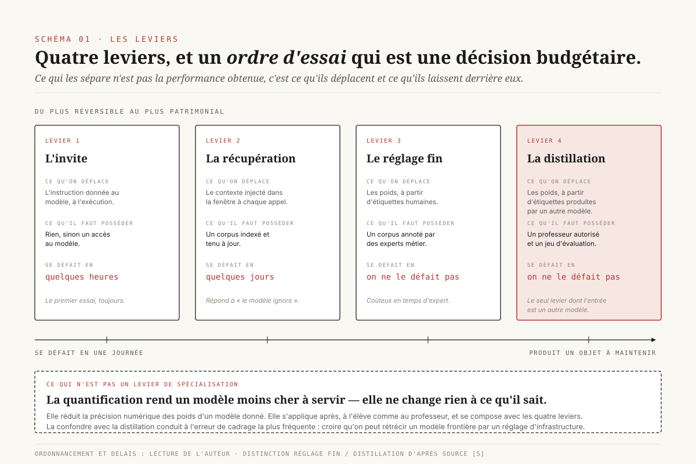
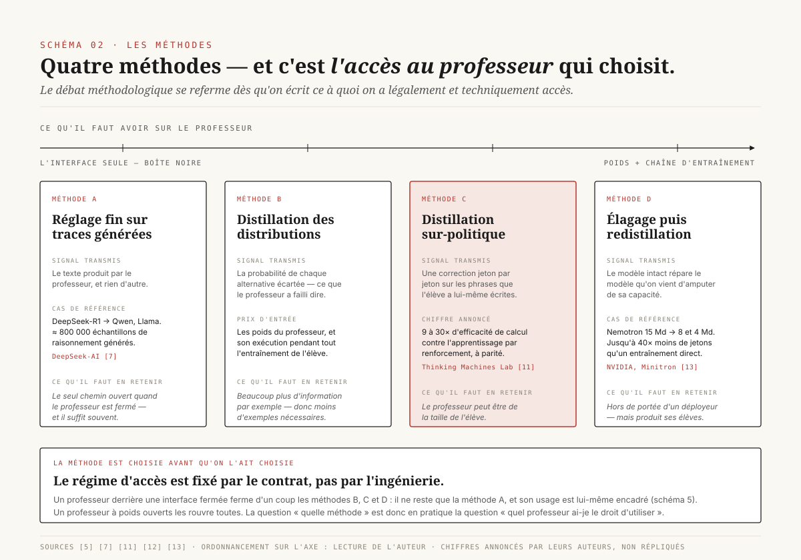
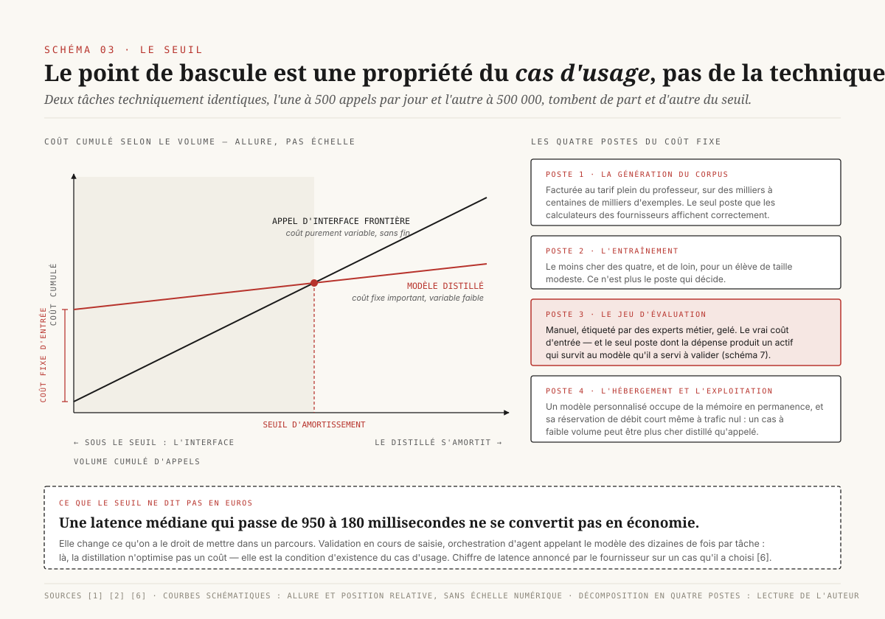
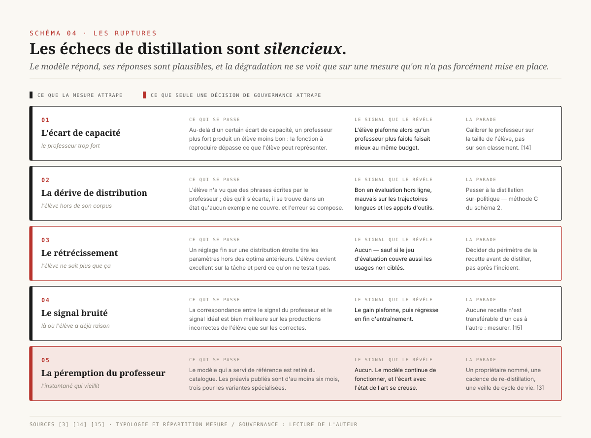
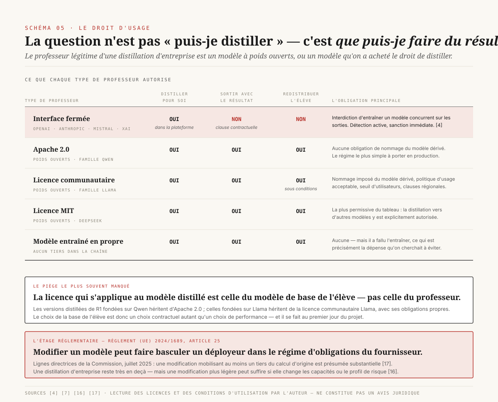
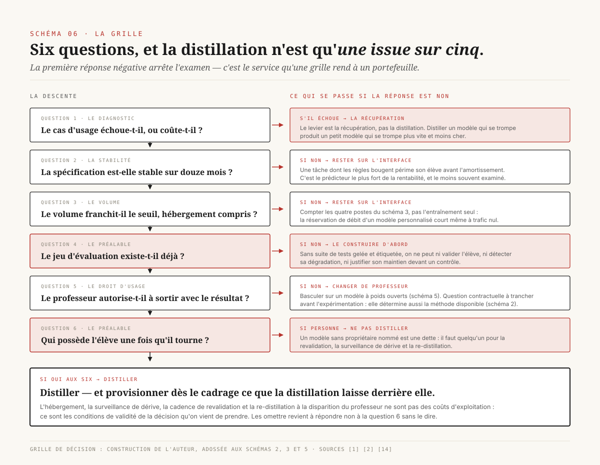
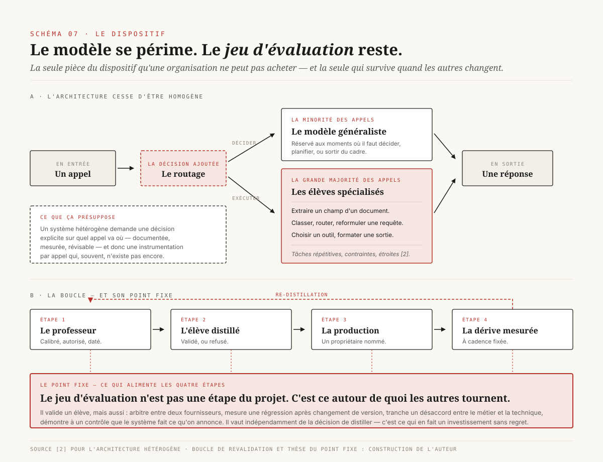

# Le petit modèle qui suffit

> **La distillation a cessé d'être une technique de laboratoire pour fabriquer des modèles frontières plus petits : c'est devenu un arbitrage d'achat, cas d'usage par cas d'usage. Et ce qui tranche cet arbitrage n'est pas la méthode — c'est le volume, la stabilité de la spécification, le droit d'usage des sorties du professeur, et la question de savoir à qui appartient le jeu d'évaluation.** — 3 août 2026, Mathieu Guglielmino

## Synthèse exécutive

- **La décision n'est pas « faut-il distiller », c'est « ce cas d'usage mérite-t-il son propre modèle ».** Distiller n'a de sens que sur une tâche dont la spécification est stable et le volume élevé. Sur une tâche qui bouge tous les mois, le modèle distillé est périmé avant d'être amorti. Le critère de tri n'est donc pas technique : c'est le couple **volume × stabilité**, et il se lit sur un portefeuille de cas d'usage, pas dans une architecture.

- **Les gains annoncés par les plateformes sont réels dans leur ordre de grandeur, et systématiquement présentés dans le sens qui les flatte.** Amazon annonce sur Bedrock des modèles distillés « jusqu'à 5 fois plus rapides et jusqu'à 75 % moins chers » que le modèle d'origine, avec moins de 2 % de perte de justesse sur des cas de génération augmentée par récupération[^1]. Les travaux de NVIDIA sur les petits modèles avancent un facteur 10 à 30 sur le coût d'inférence par jeton[^2]. Ces chiffres sont des chiffres **annoncés** par des acteurs qui vendent la capacité de distiller ; aucun n'est audité indépendamment. Ils cadrent l'ordre de grandeur, pas le dossier d'investissement.

- **Quatre méthodes seulement, et c'est le droit d'accès au professeur qui choisit à votre place.** Réglage fin sur traces générées (le seul chemin ouvert quand le professeur est derrière une interface fermée), distillation des distributions de sortie (exige les poids), distillation *sur-politique* — l'élève génère, le professeur corrige ses propres phrases —, élagage puis redistillation. Le débat méthodologique se referme dès qu'on écrit ce à quoi on a légalement et techniquement accès.

- **Le mode de rupture le plus coûteux n'est pas la perte de justesse : c'est la péremption du professeur.** Un modèle distillé fige le comportement d'un modèle frontière à une date donnée. Quand ce modèle est déprécié — les politiques de retrait publiées se comptent en mois, pas en années[^3] —, la référence qui a servi à fabriquer l'élève n'existe plus. On ne peut plus reproduire la distillation à l'identique, et l'écart avec l'état de l'art se creuse sans qu'aucune alerte ne se déclenche.

- **Distiller depuis une interface fermée est presque toujours une violation contractuelle, et c'est désormais un risque documenté.** Les conditions d'utilisation d'OpenAI, d'Anthropic, de Mistral et de xAI interdisent d'employer les sorties pour entraîner un modèle concurrent. En février 2026, Anthropic a rendu publique une campagne d'extraction attribuée à trois laboratoires chinois : environ 24 000 comptes frauduleux et plus de 16 millions d'échanges[^4]. Pour une direction, la conséquence pratique est étroite et nette : **le professeur légitime d'une distillation d'entreprise est un modèle à poids ouverts, ou un modèle qu'on a acheté le droit de distiller.**

- **L'actif produit n'est pas le modèle : c'est le jeu d'évaluation.** Le modèle distillé se périme ; la suite de tests qui définit ce que « bien faire cette tâche » veut dire, elle, se capitalise et survit au changement de professeur, de plateforme et de méthode. C'est la seule pièce du dispositif qu'une organisation ne peut pas acheter.

---

## 1. Ce que « distiller » veut dire — et les trois choses que ce n'est pas

La distillation de connaissance, dans sa formulation d'origine, est un transfert : un modèle large (le **professeur**) produit un signal d'apprentissage, un modèle plus petit (l'**élève**) est entraîné à le reproduire. Ce qui a changé depuis 2023 n'est pas la définition mais l'objet. La littérature académique récente distingue explicitement la distillation *d'algorithmes* — comment transférer —, la distillation *de compétences* — transférer quoi : suivi d'instruction, raisonnement, appel d'outils — et la distillation *de verticales*, c'est-à-dire l'application à un domaine précis : droit, santé, finance[^5]. C'est cette troisième branche qui intéresse une direction data, et c'est la moins couverte par le discours public, tout entier occupé par la première.

Trois confusions coûtent cher au cadrage.

**Ce n'est pas de la quantification.** La quantification réduit la précision numérique des poids d'un modèle donné ; elle ne change ni ce qu'il sait, ni ce qu'il fait. Elle s'applique *après*, à l'élève comme au professeur, et les deux leviers se composent. Confondre les deux conduit à l'erreur de cadrage la plus fréquente : croire qu'on peut « rétrécir » un modèle frontière par un réglage d'infrastructure. On ne peut pas — on peut le rendre moins cher à servir, ce qui n'est pas la même décision.

**Ce n'est pas de la génération augmentée par récupération.** La récupération injecte du contexte à l'exécution ; la distillation inscrit un comportement dans les poids. La première répond à « le modèle ignore mes données », la seconde à « le modèle sait, mais je paie trop cher pour qu'il le fasse ». Un cas d'usage qui échoue par manque de connaissance métier ne se répare pas par distillation, et l'inverse est vrai aussi. Le diagnostic préalable — *le modèle échoue-t-il, ou coûte-t-il ?* — décide seul du levier.

**Ce n'est pas exactement du réglage fin, mais ça passe par lui.** La distinction est subtile et elle est structurante : le réglage fin supervisé désigne le mécanisme d'entraînement ; la distillation désigne **l'origine des étiquettes**. Un réglage fin classique apprend sur des données annotées par des humains ; une distillation apprend sur des données produites par un modèle plus fort. En pratique, la majorité des distillations d'entreprise sont des réglages fins supervisés dont le jeu d'entraînement a été fabriqué par un professeur — c'est précisément ce qu'automatisent les plateformes : la génération synthétique des exemples, l'augmentation des invites, l'entraînement de l'élève et son hébergement[^1] [^6].

*Schéma 1 — Les quatre leviers de spécialisation, rangés du plus réversible au plus patrimonial. Ce qui sépare le réglage fin de la distillation n'est pas le mécanisme d'entraînement — c'est l'origine des étiquettes ; et la quantification, souvent rangée avec eux, n'est pas un levier de spécialisation du tout.*

Comme le montre le Schéma 1, ces quatre leviers ne sont pas concurrents mais séquentiels, et l'ordre d'essai a une conséquence budgétaire directe. On commence toujours par le plus réversible — l'invite, puis la récupération — et on ne descend d'un cran que lorsque le précédent a échoué sur une mesure, pas sur une impression. La raison est simple : les deux premiers leviers se défont en quelques jours, les deux derniers produisent un objet qu'il faudra ensuite héberger, surveiller et revalider pendant des années.

---

## 2. Quatre méthodes, et c'est l'accès au professeur qui choisit

Le paysage méthodologique paraît touffu ; il tient en quatre familles, et la question qui les sépare n'est pas « laquelle est la meilleure » mais **« à quoi ai-je accès sur le professeur »**.

### 2.1 Réglage fin sur traces générées — le régime « boîte noire »

C'est le chemin par défaut lorsque le professeur n'est accessible que par une interface de programmation. On lui soumet des invites représentatives du cas d'usage, on collecte ses réponses, on filtre, puis on entraîne l'élève à les reproduire. Le signal transmis est mince : uniquement le texte produit, aucune information sur les alternatives que le professeur avait envisagées.

C'est pourtant la méthode qui a produit le résultat le plus spectaculaire du domaine. DeepSeek a généré environ 800 000 échantillons de raisonnement avec son modèle R1, puis les a utilisés pour régler finement des modèles ouverts existants des familles Qwen et Llama, publiés en six tailles de 1,5 à 70 milliards de paramètres[^7]. La version à 32 milliards de paramètres dépasse o1-mini sur plusieurs bancs de raisonnement ; la version à 70 milliards atteint 94,5 sur MATH-500, très près du modèle professeur lui-même[^7]. Rien dans ce procédé n'est sophistiqué : c'est un réglage fin sur un corpus synthétique, et cela suffit à transférer une compétence de raisonnement.

Les plateformes ont industrialisé exactement ce chemin. OpenAI l'a ouvert dès octobre 2024 avec les *stored completions* — un indicateur `store: true` sur les appels qui archive automatiquement les couples entrée-sortie, sans coût ni latence supplémentaires —, complétés par un module d'évaluation et le réglage fin[^8]. Microsoft a repris le dispositif dans Azure[^9], Amazon l'a automatisé de bout en bout dans Bedrock[^1], Google l'expose dans Model Garden pour la famille Gemma[^10]. Aucune de ces offres n'invente de méthode : elles suppriment la plomberie.

### 2.2 Distillation des distributions de sortie — le régime « boîte blanche »

Lorsqu'on dispose des poids du professeur, on peut transmettre bien davantage que le texte : à chaque position, la distribution complète de probabilité sur le vocabulaire. L'élève n'apprend plus seulement *ce que le professeur a dit*, mais *ce qu'il a failli dire* — l'information portée par les alternatives écartées, et c'est cette information qui fait l'essentiel du gain. Le prix d'entrée est double : il faut les poids, et il faut faire tourner le professeur pendant tout l'entraînement.

### 2.3 Distillation sur-politique — l'élève parle, le professeur corrige

Les deux méthodes précédentes partagent un défaut structurel : l'élève apprend sur des phrases que le professeur a écrites, puis on lui demande d'écrire les siennes. Dès qu'il s'écarte un peu, il se trouve dans un état qu'aucun exemple d'entraînement ne couvre, et l'erreur se compose au fil de la génération. C'est la **dérive de distribution**, et elle explique pourquoi un élève excellent en évaluation hors ligne s'effondre parfois sur des trajectoires longues.

La distillation *sur-politique* (**on-policy distillation**) inverse le dispositif : l'élève génère ses propres réponses, et le professeur note chacun de ses jetons. L'élève est donc corrigé exactement là où il se trompe, dans les états qu'il visite réellement. Thinking Machines Lab, qui a popularisé la formulation en 2025, annonce une efficacité de calcul 9 à 30 fois meilleure que l'apprentissage par renforcement à performance équivalente, avec un exemple chiffré : 70 % de justesse sur AIME'24 atteints en 1 800 heures de GPU au lieu de 17 920[^11]. Le facteur de référence, hors amortissement, est plutôt de 9 lorsque le corpus supervisé est déjà disponible[^11]. La méthode s'est diffusée vite : des travaux de synthèse parus en 2026 la décrivent comme un complément désormais installé du réglage fin supervisé et de l'apprentissage par renforcement dans les chaînes de post-entraînement publiées[^12].

Pour une entreprise, l'intérêt n'est pas le classement au banc d'essai : c'est que la distillation sur-politique s'applique aussi à un professeur qui **n'est pas plus gros que l'élève**. Un modèle expert d'un domaine peut corriger un modèle généraliste de même taille sur ce domaine précis. Le geste cesse d'être « comprimer un gros modèle » pour devenir « transférer une compétence ».

### 2.4 Élagage puis redistillation — quand on part d'un modèle qu'on possède

Dernière famille : on prend un modèle existant, on lui retire structurellement de la capacité — profondeur, largeur, têtes d'attention —, puis on redistille depuis le modèle intact pour réparer les dégâts. NVIDIA a documenté le procédé sur sa famille Nemotron : dériver des modèles à 8 et 4 milliards de paramètres d'un modèle à 15 milliards demande jusqu'à 40 fois moins de jetons d'entraînement par modèle qu'un entraînement à partir de zéro, pour un gain de calcul de 1,8× sur la production de toute la famille, avec des scores MMLU supérieurs de jusqu'à 16 % à ceux d'un entraînement direct[^13].

Cette famille est la moins pertinente pour la plupart des organisations : elle suppose qu'on possède le modèle de départ et une chaîne d'entraînement. Elle est citée ici parce qu'elle explique **d'où viennent les petits modèles ouverts** que tout le monde utilise comme élèves — ils sont eux-mêmes le produit d'une distillation, et l'entreprise qui distille se situe donc au deuxième étage d'une chaîne dont elle n'a pas construit le premier.

*Schéma 2 — Les quatre familles rangées sur l'axe qui décide vraiment : ce à quoi il faut avoir accès sur le professeur. Le régime d'accès étant en pratique fixé par le contrat et non par l'ingénierie, la méthode est presque toujours déterminée avant qu'on l'ait choisie.*

---

## 3. Le point de bascule est économique, pas technique

Le Schéma 2 montre que le choix de méthode se referme rapidement. Le vrai arbitrage est ailleurs, et il se pose en termes de trésorerie : **à partir de quel volume un modèle distillé coûte-t-il moins cher qu'un appel d'interface, tout compris ?**

La structure de coût des deux options est de nature différente, et c'est tout le sujet. Une interface frontière est un coût purement variable, sans engagement, sans amortissement : chaque appel se paie, indéfiniment. Un modèle distillé est un coût fixe important suivi d'un coût variable faible. Deux droites, un point d'intersection.

Le coût fixe se décompose en quatre postes, et l'erreur de cadrage la plus répandue consiste à n'en compter qu'un.

**Poste 1 — la génération du corpus.** Elle se paie au tarif du professeur, à plein tarif, sur des volumes qui se comptent en milliers à centaines de milliers d'exemples. Sur Bedrock, cette génération synthétique est explicitement facturée au tarif à la demande du modèle professeur[^1]. C'est le seul poste que les calculateurs des fournisseurs affichent correctement.

**Poste 2 — l'entraînement.** Le moins cher des quatre, et de loin, pour un élève de taille modeste avec les techniques d'adaptation à faible rang. Ce n'est plus le poste qui décide.

**Poste 3 — le jeu d'évaluation.** Le poste que personne ne provisionne. Pour savoir que l'élève est acceptable, il faut une suite de tests représentative, étiquetée, gelée, et suffisamment large pour détecter une régression de quelques points. Sa fabrication est manuelle, elle mobilise des experts métier, et elle constitue le vrai coût d'entrée dans la distillation. C'est aussi, on y revient en section 7, le seul poste dont la dépense produit un actif durable.

**Poste 4 — l'hébergement et l'exploitation.** Un modèle distillé n'est pas gratuit à servir : il occupe de la mémoire de calcul en permanence. Les plateformes gérées traitent les modèles distillés comme des modèles personnalisés, ce qui implique en général une réservation de débit — un coût qui court même quand le trafic est nul[^1]. Un cas d'usage à faible volume peut donc être **plus cher** distillé qu'appelé, ce qui est exactement l'inverse de l'intuition.

Face à ces quatre postes, le gain unitaire, lui, est massif et bien documenté dans son ordre de grandeur. Servir un modèle de quelques milliards de paramètres plutôt qu'un modèle frontière divise le coût par jeton par un facteur avancé entre 10 et 30 dans les travaux de NVIDIA[^2]. Amazon annonce jusqu'à 75 % d'économie et jusqu'à 5× de gain de latence sur les modèles distillés de Bedrock, pour moins de 2 % de perte de justesse sur des cas de génération augmentée par récupération[^1] ; sur un cas d'appel de fonctions, la même source rapporte un gain de 11 points de justesse et une latence médiane passant de 950 à 180 millisecondes[^6]. Ces chiffres proviennent des fournisseurs eux-mêmes et décrivent des cas favorables choisis par eux — ils bornent le possible, ils ne prédisent aucun cas particulier.

*Schéma 3 — Le seuil d'amortissement. À gauche du point d'intersection, l'interface frontière est la bonne réponse et la distillation détruit de la valeur. La position du seuil est déplacée bien plus par le poste « jeu d'évaluation » que par le coût d'entraînement.*

Le Schéma 3 rend visible la conséquence de gouvernance : **la position du seuil n'est pas une propriété de la technologie, c'est une propriété du cas d'usage.** Deux tâches identiques techniquement, l'une à 500 appels par jour et l'autre à 500 000, tombent de part et d'autre du seuil. C'est pourquoi la question « faut-il distiller » n'a pas de réponse d'entreprise : elle n'a que des réponses par ligne du registre des cas d'usage.

Un dernier élément déplace le seuil, et il est souvent décisif : la **latence**. Un gain de 950 à 180 millisecondes ne se convertit pas en euros, mais il change ce qu'on a le droit de mettre dans un parcours utilisateur. Certains cas d'usage — validation en cours de saisie, orchestration d'agent où le modèle est appelé des dizaines de fois par tâche — ne sont tout simplement pas réalisables au-dessus d'un certain temps de réponse. Là, la distillation n'est pas une optimisation de coût : c'est la condition d'existence du cas d'usage.

---

## 4. Cinq façons de rater une distillation

Les échecs de distillation ont ceci de désagréable qu'ils sont **silencieux** : le modèle répond, ses réponses sont plausibles, et la dégradation ne se voit que sur une mesure qu'on n'a pas forcément mise en place. Cinq modes de rupture reviennent.

### 4.1 L'écart de capacité — le professeur trop fort

L'intuition dit que le meilleur professeur possible donne le meilleur élève. C'est faux, et le résultat est bien établi. Les travaux d'Apple et d'Oxford sur les lois d'échelle de la distillation décrivent une transition entre deux régimes de loi de puissance : au-delà d'un certain écart de capacité, un professeur plus fort produit un élève **moins bon**, parce que la fonction que l'élève doit reproduire dépasse ce que sa capacité lui permet de représenter[^14]. Le corollaire pratique est net : le choix du professeur doit être calibré sur la taille de l'élève, et le modèle le plus cher n'est pas nécessairement le bon professeur.

Le même travail énonce une frontière de rentabilité plus large encore : la distillation ne dépasse l'apprentissage supervisé que jusqu'à un niveau de calcul qui croît de façon prévisible avec la taille de l'élève, et **si l'on ne distille qu'un seul élève et qu'il faut aussi entraîner le professeur, l'apprentissage supervisé direct reste préférable**[^14]. La distillation est économiquement justifiée quand le professeur existe déjà — ce qui est le cas d'entreprise standard — ou quand on fabrique plusieurs élèves.

### 4.2 La dérive de distribution — l'élève hors de son corpus

Décrite en section 2.3 : un élève entraîné exclusivement sur des phrases écrites par le professeur n'a jamais vu ses propres erreurs. Sur une tâche courte, cela ne se remarque pas. Sur une trajectoire d'agent de cinquante appels d'outils, la première déviation entraîne toutes les suivantes. C'est la raison d'être de la distillation sur-politique, et c'est le mode de rupture qui explique le mieux l'écart entre un banc d'essai réussi et une mise en production ratée.

### 4.3 Le rétrécissement — l'élève ne sait plus que ça

Un réglage fin sur une distribution étroite tire les paramètres hors des optima des données antérieures ; sans réinjection de données générales, la dérive est mécanique. L'élève devient excellent sur la tâche visée et perd des capacités qu'on ne testait pas, parce qu'on ne pensait pas en avoir besoin. Ce mode de rupture est particulièrement traître dans les architectures d'agent, où un modèle « de classification » finit par être sollicité pour reformuler, résumer ou décider — des usages qui n'étaient pas dans le corpus de distillation et qui ne figurent donc dans aucune mesure de recette.

### 4.4 Le signal bruité là où l'élève a déjà raison

Résultat plus récent, et contre-intuitif : la supervision du professeur n'est pas également utile partout. Un travail d'Apple publié en 2026 montre que la correspondance entre le signal de distillation et le signal idéal est nettement meilleure sur les productions **incorrectes** de l'élève que sur les correctes — là où l'élève réussit déjà, la consigne du professeur devient bruitée[^15]. Les mêmes travaux montrent que la forme optimale du signal dépend conjointement de la capacité de l'élève et de la tâche : une solution résumée double presque la qualité de l'alignement pour un élève de 1,7 milliard de paramètres, mais dégrade légèrement un élève de 0,6 milliard, qui a besoin du raisonnement détaillé pas à pas[^15]. Aucune configuration universelle n'émerge. Traduction pour un cadrage : **il n'existe pas de recette de distillation transférable d'un cas d'usage à l'autre**, et l'expérience acquise sur un premier cas ne dispense pas de la mesure sur le suivant.

### 4.5 La péremption du professeur

Le mode de rupture le plus coûteux, et le seul qui soit purement contractuel. Un modèle distillé est un instantané : il fige le comportement d'un professeur à une date. Or ce professeur disparaît. Les politiques publiées annoncent des préavis de retrait d'au moins six mois pour les modèles génériquement disponibles et d'au moins trois mois pour les variantes spécialisées[^3] — des délais courts au regard d'un cycle de vie applicatif d'entreprise. Le jour où le professeur est retiré, on ne peut plus reproduire la distillation à l'identique, ni régénérer le corpus, ni comparer l'élève à sa propre référence. Le modèle continue de fonctionner : c'est précisément ce qui rend la situation dangereuse. Il ne signale rien, il vieillit.

*Schéma 4 — Les cinq modes de rupture, et la ligne de partage entre ceux qu'une mesure attrape et ceux que seule une décision de gouvernance attrape.*

Le Schéma 4 fait apparaître cette ligne de partage, qui est la lecture utile pour une direction. L'écart de capacité, la dérive de distribution et le signal bruité se détectent par la mesure — c'est-à-dire par le jeu d'évaluation, à condition qu'il existe. Le rétrécissement et la péremption du professeur, eux, ne produisent aucun signal : le premier n'apparaît que si quelqu'un a décidé, avant de distiller, que la recette devait couvrir des usages non ciblés ; le second n'apparaît que si quelqu'un est nommé pour surveiller le cycle de vie du professeur et déclencher la re-distillation. Sans ce propriétaire, un modèle distillé devient une dette silencieuse.

---

## 5. Le droit d'usage : ce que le contrat autorise réellement

Voici le point où la plupart des cadrages techniques s'arrêtent, et où commence la décision de direction.

### 5.1 Les interfaces fermées interdisent la distillation concurrente

Les principaux fournisseurs de modèles fermés — OpenAI, Anthropic, Mistral, xAI — inscrivent dans leurs conditions d'utilisation une clause interdisant l'emploi de leurs sorties pour développer des modèles concurrents. La formulation d'OpenAI est explicite : il est interdit d'utiliser les sorties du service pour développer des modèles qui concurrencent OpenAI.

L'interprétation opérationnelle de cette clause est plus étroite qu'il n'y paraît, et c'est ce qui la rend praticable. Elle vise le modèle **concurrent**, pas l'usage interne : c'est précisément pourquoi les mêmes fournisseurs commercialisent des outils de distillation. Quand OpenAI expose les *stored completions* et le réglage fin[^8], quand Amazon automatise la distillation d'un professeur Claude ou Nova vers un élève de la même famille[^1], le geste est explicitement autorisé — parce qu'il reste **dans** la plateforme et que le produit final continue d'y être facturé. Le contrat n'interdit pas de distiller ; il interdit de sortir avec le résultat.

Pour une direction, la conséquence est une distinction à porter au cadrage, pas au débat technique : distiller *à l'intérieur* d'une plateforme est un service acheté, avec la dépendance au fournisseur que cela implique ; distiller *depuis* une plateforme vers un modèle qu'on héberge soi-même est, sauf accord spécifique, une violation contractuelle.

### 5.2 L'affaire de février 2026 a rendu le risque concret

Le 23 février 2026, Anthropic a publié une analyse attribuant à trois laboratoires chinois — DeepSeek, Moonshot AI et MiniMax — une campagne d'extraction industrielle de son modèle Claude : environ 24 000 comptes frauduleux et plus de 16 millions d'échanges, dont plus de 3,4 millions attribués à Moonshot AI, ciblant le raisonnement agentique et l'usage d'outils, et plus de 13 millions attribués à MiniMax, concentrés sur la génération de code agentique[^4]. La détection s'est appuyée sur les données d'adressage réseau, les métadonnées de comptes et les motifs d'usage de l'interface[^4].

Ce qu'une direction doit en retenir n'est pas le volet géopolitique mais deux faits opérationnels. D'abord, **la détection existe et fonctionne** : les fournisseurs instrumentent la diversité anormale des requêtes et les motifs d'usage. Ensuite, la sanction disponible est immédiate et sans procès : suspension des comptes et coupure d'accès. Pour une entreprise dont un service en production dépend de cette interface, le risque n'est pas un contentieux lointain — c'est une interruption de service.

### 5.3 Les poids ouverts : ce que la licence autorise, et à quel prix

Le chemin praticable pour une distillation d'entreprise passe donc par des professeurs à poids ouverts. Encore faut-il lire les licences, qui ne se valent pas.

- **Apache 2.0** (famille Qwen) : usage commercial, modification et redistribution libres, sans obligation de nommage du modèle dérivé. C'est le régime le plus simple.
- **Licence communautaire Llama** : usage commercial autorisé, mais assorti d'une politique d'usage acceptable, d'une **obligation de nommage** des modèles dérivés, d'un seuil d'utilisateurs au-delà duquel une licence spécifique est requise, et de clauses régionales.
- **MIT** (poids DeepSeek) : le régime le plus permissif, incluant explicitement la distillation vers d'autres modèles.

Un point technique a une conséquence juridique directe et il est régulièrement manqué : **la licence qui s'applique à un modèle distillé est celle du modèle de base de l'élève, pas celle du professeur.** Les versions distillées de R1 fondées sur Qwen héritent d'Apache 2.0 ; celles fondées sur Llama héritent de la licence communautaire Llama, avec ses obligations propres. Le choix de la base de l'élève est donc un choix contractuel autant qu'un choix de performance.

### 5.4 Distiller peut vous faire changer de statut réglementaire

Dernier étage, et le moins anticipé. Le règlement européen sur l'intelligence artificielle prévoit à son article 25 les situations dans lesquelles un acteur en aval **devient fournisseur** et hérite du régime d'obligations correspondant : apposition de son nom ou de sa marque sur un système à haut risque déjà mis sur le marché, modification substantielle d'un tel système, modification de sa destination le faisant basculer en haut risque, ou intégration d'un modèle à usage général dans un système à haut risque d'une manière non prévue par le fournisseur d'origine[^16].

Pour les modèles à usage général, les lignes directrices de la Commission européenne publiées en juillet 2025 introduisent un seuil indicatif : une modification mobilisant au moins **un tiers** du calcul d'entraînement du modèle d'origine est susceptible de constituer une modification substantielle[^17]. Ce seuil place la quasi-totalité des distillations d'entreprise hors de portée — on distille avec des ordres de grandeur inférieurs. Mais il ne referme pas la question : les lignes directrices précisent que des modifications plus légères peuvent également déclencher le statut de fournisseur si elles changent significativement les capacités ou le profil de risque du modèle[^17], et la voie de l'article 25 relative aux systèmes à haut risque reste ouverte indépendamment de tout seuil de calcul.

*Schéma 5 — Le droit d'usage par type de professeur. La colonne qui décide n'est pas « puis-je distiller » — presque toujours oui — mais « qu'ai-je le droit de faire du résultat », et sous quelles obligations.*

---

## 6. La grille de décision

Le Schéma 5 clôt la question du possible ; reste celle du souhaitable. Six questions, dans cet ordre, tranchent le cas d'usage. La première réponse négative arrête l'examen.

**1. Le cas d'usage échoue-t-il, ou coûte-t-il ?** S'il échoue par manque de connaissance métier, le levier est la récupération, pas la distillation. Distiller un modèle qui se trompe produit un petit modèle qui se trompe plus vite et moins cher.

**2. La spécification de la tâche est-elle stable sur douze mois ?** Une tâche dont les règles changent au rythme des évolutions réglementaires ou commerciales périme son élève avant l'amortissement. La stabilité de la spécification est le prédicteur le plus fort de la rentabilité, et le moins souvent examiné.

**3. Le volume franchit-il le seuil d'amortissement, hébergement compris ?** Avec les quatre postes du Schéma 3, pas seulement l'entraînement. La réservation de débit d'un modèle personnalisé court même à trafic nul.

**4. Ai-je un jeu d'évaluation, ou seulement l'intention d'en faire un ?** Sans suite de tests gelée et étiquetée, on ne peut ni valider l'élève, ni détecter sa dégradation, ni justifier son maintien. C'est un préalable, pas un livrable de fin de projet.

**5. Le professeur envisagé m'autorise-t-il à sortir avec le résultat ?** Question contractuelle, à trancher avant l'expérimentation et non après. Elle détermine aussi la méthode disponible — le Schéma 2 se lit à partir de cette réponse.

**6. Qui possède l'élève une fois qu'il tourne ?** Un modèle distillé sans propriétaire nommé est une dette. Il faut un responsable de la revalidation, de la surveillance de dérive et de la re-distillation.

*Schéma 6 — L'arbre de décision. Cinq issues, dont une seule est « distiller ». Les questions 4 et 6 sont des préalables organisationnels : y répondre « on verra » revient à répondre non.*

Comme le montre le Schéma 6, la distillation n'est qu'une des cinq issues de la grille. Ce n'est pas une faiblesse du levier : c'est ce qui le rend utile. Un levier qui convient partout ne discrimine rien, et le service qu'une grille rend à un portefeuille est précisément d'écarter les cas d'usage sur lesquels un projet de distillation aurait consommé six mois pour un gain nul.

---

## 7. Ce que ça change pour un portefeuille de cas d'usage

### 7.1 L'architecture cesse d'être homogène

La conséquence la plus visible est architecturale. Le travail de NVIDIA sur les petits modèles pose une thèse simple : dans un système agentique, la grande majorité des appels au modèle sont des tâches répétitives, contraintes et étroites — extraire un champ, reformuler une requête, choisir un outil, formater une sortie — pour lesquelles un petit modèle spécialisé est suffisamment capable, structurellement mieux adapté et nécessairement plus économique[^2]. La recommandation qui en découle est une architecture **hétérogène** : réserver le modèle généraliste puissant aux moments où il faut décider ou planifier, et déployer des modèles spécialisés partout où la tâche est une corvée langagière[^2].

Cette recommandation a une traduction organisationnelle qui n'est pas anodine. Un système hétérogène demande un routage, donc une décision explicite sur *quel appel va où* — décision qui doit être documentée, mesurée et révisable. Elle demande aussi que l'on sache, pour chaque appel du système, ce qu'il coûte et ce qu'il produit. Autrement dit, elle présuppose une instrumentation par appel qui, dans la plupart des organisations, n'existe pas encore.

### 7.2 On ne loue plus un service, on possède un objet

Le basculement de fond est de nature patrimoniale. Appeler une interface, c'est acheter un service : sans stock, sans maintenance, sans obsolescence à gérer. Déployer un modèle distillé, c'est posséder un objet qui se déprécie. Il faut l'héberger, le surveiller, mesurer sa dérive, le revalider à chaque évolution du cas d'usage, et le refabriquer quand son professeur disparaît.

Cette charge n'apparaît sur aucune ligne du dossier d'investissement initial, et elle est la première cause d'abandon des modèles spécialisés en production. Le modèle fonctionne, personne ne le surveille, l'écart avec l'état de l'art se creuse pendant dix-huit mois, puis quelqu'un compare et découvre que le modèle frontière du moment fait mieux pour moins cher qu'à l'époque de la décision.

### 7.3 L'actif, c'est le jeu d'évaluation

D'où la thèse qui ferme ce dossier. Dans tout le dispositif décrit ici, une seule pièce se capitalise.

Le modèle distillé se périme — par changement de spécification, par dérive, par péremption du professeur. La méthode se périme aussi : la distillation sur-politique n'existait pas dans le vocabulaire industriel il y a deux ans. La plateforme se remplace. Le professeur est retiré du catalogue.

Le **jeu d'évaluation**, lui, survit à tout cela. C'est un corpus étiqueté par des experts métier, qui définit formellement ce que « bien faire cette tâche » signifie dans cette organisation. Il permet de valider un élève, mais aussi d'arbitrer entre deux fournisseurs, de mesurer une régression après changement de version, de trancher un désaccord entre le métier et la technique, et de démontrer à un contrôle que le système fait ce qu'on annonce. Il vaut indépendamment de la décision de distiller ou non — et c'est sa propriété la plus intéressante en cadrage, parce qu'elle rend l'investissement sans regret.

C'est aussi la seule pièce qu'une organisation ne peut pas acheter. Les poids sont téléchargeables, la chaîne d'entraînement est ouverte, la plateforme est louée au mois. La définition de ce qu'est une bonne réponse dans ce métier, chez ce client, sous cette contrainte réglementaire, n'existe nulle part sur étagère.

*Schéma 7 — Le dispositif complet. Le jeu d'évaluation n'est pas une étape du projet : c'est le point fixe autour duquel tournent le professeur, l'élève et le routage, et la seule pièce qui reste quand les autres changent.*

### 7.4 Ce qu'il faut regarder dans les dix-huit mois

Trois évolutions déplaceront les seuils décrits ici.

**La distillation sur-politique se banalise.** Elle est passée en dix-huit mois du papier de recherche aux chaînes de post-entraînement publiées[^12]. Son intérêt d'entreprise n'est pas le facteur de calcul mais le fait qu'elle autorise un professeur de taille comparable à l'élève : le transfert de compétence entre modèles de même gabarit devient une opération courante, et cela change les cas d'usage éligibles.

**Le seuil d'amortissement descend.** Les élèves très petits — sous le milliard de paramètres — deviennent utilisables sur des tâches étroites après réglage fin ciblé, ce qui abaisse les postes 2 et 4 du Schéma 3. Corollaire : des cas d'usage aujourd'hui sous le seuil basculeront au-dessus sans que leur volume ait changé.

**Le cadrage réglementaire du modèle modifié se précise.** Le seuil indicatif du tiers de calcul[^17] est une première borne, pas une doctrine stabilisée. Une organisation qui distille aujourd'hui à grande échelle doit conserver la traçabilité de ce qu'elle a fait — quel professeur, quel corpus, quel volume de calcul, quelle évaluation — non pas parce qu'une obligation l'exige aujourd'hui, mais parce que la reconstitution rétroactive de ces éléments est impossible.

---

## Ce qu'il faut retenir

- La distillation est un **arbitrage d'achat par cas d'usage**, pas une politique d'entreprise. Elle se décide ligne par ligne dans un registre, sur le couple volume × stabilité de la spécification.
- Le choix de méthode est presque toujours **déterminé par le contrat**, pas par l'ingénierie : ce à quoi on a droit sur le professeur ferme trois familles sur quatre.
- Le seuil d'amortissement se calcule sur **quatre postes**, pas un. Le poste qui le déplace le plus est le jeu d'évaluation ; celui qu'on oublie le plus est l'hébergement, qui court à trafic nul.
- Deux des cinq modes de rupture ne produisent **aucun signal technique**. Ils exigent un propriétaire nommé, une cadence de revalidation et une veille sur le cycle de vie du professeur.
- Le seul actif durable est le **jeu d'évaluation**. Il vaut même si l'on décide de ne pas distiller — ce qui en fait le seul investissement sans regret de tout le dispositif.

---

## Note de méthode

Ce dossier a été construit à partir de sources primaires et institutionnelles consultées le 3 août 2026. Deux réserves de sourçage doivent être portées au lecteur.

**Les chiffres de performance et de coût attribués aux plateformes sont des chiffres annoncés par leurs fournisseurs**, sur des cas d'usage qu'ils ont choisis — Amazon pour Bedrock[^1] [^6], NVIDIA pour ses travaux sur les petits modèles[^2] [^13], Thinking Machines Lab pour la distillation sur-politique[^11]. Ils sont cités comme bornes d'ordre de grandeur et signalés comme tels dans le corps du texte. Aucun n'a fait l'objet d'une réplication indépendante publiée.

**La récupération du texte intégral de plusieurs sources a été empêchée** par la politique de filtrage réseau de l'environnement de rédaction (réponses `HTTP 403` sur `arxiv.org`, `machinelearning.apple.com`, `thinkingmachines.ai`, `aws.amazon.com` et `huggingface.co`). Les éléments tirés de ces sources reposent sur des résultats de recherche et des reprises secondaires convergentes, et chaque chiffre cité a été recoupé sur au moins deux formulations indépendantes. Les valeurs numériques précises — en particulier les scores de bancs d'essai de la section 2.1 et les facteurs de calcul de la section 2.3 — méritent une vérification sur la publication d'origine avant toute réutilisation en dehors de ce dossier.

---

## Sources

[^1]: Amazon Web Services, « Amazon Bedrock Model Distillation ». URL : https://aws.amazon.com/bedrock/model-distillation/. Consulté le 2026-08-03.

[^2]: Peter Belcak, Greg Heinrich et al., « Small Language Models are the Future of Agentic AI », NVIDIA Research, 2025. arXiv:2506.02153. URL : https://arxiv.org/abs/2506.02153. Consulté le 2026-08-03.

[^3]: OpenAI, « Deprecations », documentation de l'interface de programmation. URL : https://developers.openai.com/api/docs/deprecations. Consulté le 2026-08-03.

[^4]: CNBC, « Anthropic accuses DeepSeek, Moonshot and MiniMax of distillation attacks on Claude », 24 février 2026, reprenant la publication d'Anthropic du 23 février 2026. URL : https://www.cnbc.com/2026/02/24/anthropic-openai-china-firms-distillation-deepseek.html. Consulté le 2026-08-03.

[^5]: Xiaohan Xu, Ming Li, Chongyang Tao et al., « A Survey on Knowledge Distillation of Large Language Models », 2024. arXiv:2402.13116. URL : https://arxiv.org/abs/2402.13116. Consulté le 2026-08-03.

[^6]: Amazon Web Services, « Amazon Bedrock Model Distillation: Boost function calling accuracy while reducing cost and latency », AWS Machine Learning Blog. URL : https://aws.amazon.com/blogs/machine-learning/amazon-bedrock-model-distillation-boost-function-calling-accuracy-while-reducing-cost-and-latency/. Consulté le 2026-08-03.

[^7]: DeepSeek-AI, « DeepSeek-R1 » et fiches des modèles distillés `DeepSeek-R1-Distill-Qwen-32B` et `DeepSeek-R1-Distill-Llama-70B`. URL : https://huggingface.co/deepseek-ai/DeepSeek-R1. Consulté le 2026-08-03.

[^8]: OpenAI, « Model Distillation in the API », octobre 2024. URL : https://openai.com/index/api-model-distillation/. Consulté le 2026-08-03.

[^9]: Microsoft Learn, « Stored completions & distillation », documentation Azure OpenAI. URL : https://learn.microsoft.com/en-us/azure/ai-foundry/openai/how-to/stored-completions. Consulté le 2026-08-03.

[^10]: Google Cloud, « Vertex AI Model Garden » et documentation des modèles ouverts Gemma. URL : https://docs.cloud.google.com/vertex-ai/generative-ai/docs/open-models/use-gemma. Consulté le 2026-08-03.

[^11]: Thinking Machines Lab, « On-Policy Distillation », 2025. URL : https://thinkingmachines.ai/blog/on-policy-distillation/. Consulté le 2026-08-03.

[^12]: « A Survey of On-Policy Distillation for Large Language Models », 2026. arXiv:2604.00626. URL : https://arxiv.org/abs/2604.00626. Consulté le 2026-08-03.

[^13]: Saurav Muralidharan, Sharath Turuvekere Sreenivas et al., « Compact Language Models via Pruning and Knowledge Distillation », NVIDIA, 2024. arXiv:2407.14679. URL : https://arxiv.org/abs/2407.14679. Consulté le 2026-08-03.

[^14]: Dan Busbridge, Amitis Shidani, Floris Weers et al., « Distillation Scaling Laws », Apple et University of Oxford, 2025. arXiv:2502.08606. URL : https://arxiv.org/abs/2502.08606. Consulté le 2026-08-03.

[^15]: « Unmasking On-Policy Distillation: Where It Helps, Where It Hurts, and Why », Apple Machine Learning Research, 2026. arXiv:2605.10889. URL : https://arxiv.org/abs/2605.10889. Consulté le 2026-08-03.

[^16]: Règlement (UE) 2024/1689 établissant des règles harmonisées concernant l'intelligence artificielle, article 25 — « Responsabilités tout au long de la chaîne de valeur de l'IA ». URL : https://artificialintelligenceact.eu/article/25/. Consulté le 2026-08-03.

[^17]: Commission européenne, « Guidelines on the scope of the obligations for general-purpose AI models », juillet 2025 — seuil indicatif du tiers du calcul d'entraînement pour la qualification de modification substantielle. URL : https://digital-strategy.ec.europa.eu/en/policies/guidelines-gpai-models. Consulté le 2026-08-03.
