# Journal de suivi — livre

Journal de production du livre (28 dossiers → 25 chapitres). Voir [`livre-outline.md`](./livre-outline.md) pour la structure globale.

> **Branche** : `claude/book-outline-concepts-2mRuR` · **Dépôt** : [mathieugug/mathieugug.github.io](https://github.com/MathieuGug/mathieugug.github.io)

## État global

| | Statut | Note |
| --- | --- | --- |
| Outline | ✅ v0 mergé (PR #127) | 4 actes, 25 chapitres, 3 catégories de schémas (S/R/E) |
| Audit schémas | 🟡 partiel | Ch.7-13 + Ch.14-16 (Acte III complet) + Ch.17-20 + **Ch.21-22-23 audités + manuscrits v1 livrés 2026-05-28** + **Ch.4 audité + manuscrit v1 livré 2026-05-29** + **Ch.1-3 + Ch.5-6 audités + manuscrits v1 livrés 2026-05-29** — Acte I complet (sauf prologue), Acte II/III complets, Acte IV à 4/5. Restent : Prologue + Ch.24-25 + Épilogue. |
| Manuscrit | 🟢 **23/25** | **Acte I complet** : Ch.1 (cœur stochastique) + Ch.2 (raisonnement) + Ch.3 (PRM) + Ch.4 (décode spéculative) + Ch.5 (économie inférence) + Ch.6 (encart world models) — tous v1 livrés 2026-05-29. **Acte II complet** : Ch.7 (charnière) + Ch.8 + Ch.9 + Ch.10 + Ch.11 v1. **Acte III complet** : Ch.12 + Ch.13 + Ch.14 + Ch.15 + Ch.16 v1. **Acte IV** : Ch.17 (charnière) + Ch.18 + Ch.19 (charnière) + Ch.20 v1 + **Ch.21 (charnière ROI) + Ch.22 (frugalité) + Ch.23 (gouvernance) v1 livrés 2026-05-28**. Restent à écrire : Prologue + Ch.24 (IA et travail) + Ch.25 (procès Musk) + Épilogue. |
| Schémas R/E à produire | ⏳ | E3 (capability×cost) et E5 (PRM comparatif) restent à créer. E4 (threat model unifié 2026) **textualisé en Ch.19 §19.10**. R1-R15 traités par réutilisation. **R16 (J-curve × LLMflation × paradoxe agentique)** à créer par fusion lourde — brief détaillé Ch.21 §Schémas. **R17 (3 trajectoires énergétiques 2030)** traité par réutilisation tel quel de `ia-frugale-08-trajectoires-2030.svg`. **R18 (calendrier réglementaire 2026-2028 unifié)** à créer ex nihilo — brief détaillé Ch.23 §Schémas. |
| Bugs SVG corrigés | ✅ 1 | `cinq-familles.svg` (balise XML malformée) |
| Rendu print/web | ⏳ | non décidé |

---

## Chapitre 21 — Mesurer le ROI (et le paradoxe agentique)

> **Acte IV — Mesures et garde-fous · Gabarit charnière 28-40 p · ~10-12 000 mots**
> **Lecteur cible** : sponsor IA / CDO / CFO / CRO, project lead, agent engineer, banque + assurance + retail + industrie.
> **Sortie lecteur** : maîtrise le paradoxe 2026 (2,6-4,4 T$ potentiel vs 39 % EBIT mesurable vs 95 % pilots sans impact) ; distingue les 3 ruptures qui rendent caduques les méthodes IT classiques (coût marginal → total, dilution des bénéfices, J-curve Brynjolfsson) plus la 4ᵉ (paradoxe agentique : l'unité de mesure se déplace token → tâche → processus → outcome) ; lit côte à côte les 5 frameworks (Cigref taxonomie / McKinsey EBIT / BCG cohortes / MIT NANDA diagnostic / Forrester TEI) ; sait cadrer un cas d'usage sur la grille 5 axes (Coût · Bien-être · Vitesse · Volume · Qualité) avec mapping Cigref bidirectionnel ; tient la discipline hard vs soft (preuve réallocation pour hard, convergence 3 indicateurs pour soft) ; choisit parmi 8 méthodes de calcul via arbre de décision à 3 questions ; sait pourquoi Klarna a reculé après 67 % automatisé ; lit honnêtement les 5 études empiriques (Brynjolfsson +14/+34 %, Copilot +55/+26, BCG Jagged ±40/-19pp, METR -19 %) ; déroule la checklist 7 questions de signature ; reconnaît 3 pièges 100 % traçables.

### Statut

| Étape | Statut |
| --- | --- |
| Audit schémas source (1 dossier principal + annexes JSON) | ✅ fait — `measure-roi/` (9 schémas SVG tous absorbés) + 4 fichiers complémentaires (`7-axes-roi.md`, `roi-calculation-methods.md`, `note-cigref-vs-roi-cards.md`, `roi-cards.json`, `roi-metrics.json`) |
| Plan détaillé | ✅ fait (audit du 2026-05-28) |
| Manuscrit | ✅ **v1 livrée** — `docs/livre/ch21-roi-paradoxe-agentique.md` (~8 500 mots, 440 lignes, 15 footnotes, 9 schémas réutilisés, 17 encadrés Obsidian) |
| Schémas à créer | **R16** (Productivity J-curve × LLMflation × paradoxe agentique) — reporté à session ultérieure. Le manuscrit v1 fonctionne par juxtaposition des SVG existants `measure-roi-06-j-curve.svg` (§21.2.3) et `measure-roi-08-stack-roi-agentique.svg` (§21.7). Brief détaillé ci-dessous reste valide pour la fusion lourde (~2-3 j SVG) si édition print A3 le réclame. |
| Frontière Ch.21 ↔ Ch.5 | À tenir — Ch.5 = physique du coût/token (7 couches d'optim) ; Ch.21 = valeur métier (J-curve, outcome, paradoxe agentique). Renvoi `[!INFO]` croisé. Le schéma 7 couches de Ch.5 ré-apparaît en regard de R16 dans une double-page éco. |
| Frontière Ch.21 ↔ Ch.17 | À tenir — Ch.17 cite déjà le token cost trap (Klaus Hofenbitzer 0,14 $→130 k$/mois) en illustration intra-chapitre ; Ch.21 ne refait pas cette illustration mais déroule la stack à 4 niveaux. |
| Frontière Ch.21 ↔ Ch.22 | À tenir — Ch.22 = externalité énergétique (TWh, gCO₂eq, eau). Ch.21 mesure la valeur métier directe. Triptyque tarifaire explicite : Ch.5 coût token / Ch.21 valeur outcome / Ch.22 externalité environnementale. |
| Frontière Ch.21 ↔ Ch.23 | À tenir — Ch.23 = gouvernance (gates, rôles, calendrier réglementaire). Ch.21 = mesure de la valeur. La checklist 7 questions §21.9 nourrit les gates Ch.23 mais ne les redécrit pas. |

### Sources matérielles

Le Ch.21 est un **chapitre charnière à un seul dossier source dense**, complété par 4 fichiers d'expansion non utilisés intégralement dans le rapport original (matière supplémentaire pour cas sectoriels et système ludique).

- **Dossier principal — [`measure-roi/`](../measure-roi/)** (07 mai 2026, étude #15) — diagnostic chiffré du paradoxe 2026, 3+1 ruptures structurelles, 5 frameworks comparés, grille 5 axes propriétaire, hard vs soft, 8 méthodes + arbre décision, stack 4 niveaux (token / tâche / processus / outcome), cas Klarna en illustration de remontée échouée, 5 études empiriques (Brynjolfsson, Copilot, Jagged Frontier, METR, Klarna).
  - [Rapport (.md, ~12 000 mots)](../measure-roi/20260507-roi-ia-generative-agentique-rapport.md) · [App interactive](../measure-roi/20260507-roi-ia-generative-agentique-app.html) · [Slideshow](../measure-roi/20260507-roi-ia-generative-agentique-slideshow.html)
  - 9 schémas SVG dans [`images/`](../measure-roi/images/) (densité très haute, tous narratifs)
- **Compléments dans le dossier** (matière d'enrichissement, non absorbée intégralement) :
  - `7-axes-roi.md` (~30 kb) — système ludique parallèle DECISION.AI : 15 cartes ROI (5 axes × 3 tiers/niveaux), bonus fit / malus mismatch, matrice Fit (CU × axes). Utilisable en encart ou annexe.
  - `roi-calculation-methods.md` (~87 kb) — compendium exhaustif 15 méthodes ROI + tableaux **sectoriels** (10+ secteurs : Énergie, Télécom, Banque, Retail, etc.). **Source pour mini-cas sectoriels** que le rapport ne déroule pas.
  - `note-cigref-vs-roi-cards.md` (~16 kb) — validation croisée Cigref ↔ grille 5 axes, identifie les 3 **angles morts** (données propriétaires, business models, coût décision). Utile pour la critique honnête.
  - `roi-cards.json` (~10 kb) + `roi-metrics.json` (~20 kb) — données structurées (80+ métriques par axe et secteur). Hors corps du livre, peut nourrir un futur outil interactif.

### Audit des schémas — Ch.21

Au total, **9 schémas SVG** dans le dossier source, tous absorbés tels quels (taux d'absorption maximal).

| Fig | Slug | Catégorie Ch.21 | Insertion | Statut |
| --- | --- | --- | --- | --- |
| 01 | [`paradoxe-roi`](../measure-roi/images/20260507-01-paradoxe-roi.svg) | **S §21.1** | 3 colonnes Potentiel / Réalité EBIT / Échec industriel (2,6-4,4T$ vs 39 % vs 95 %) | tel quel — pose la tension narrative d'ouverture |
| 02 | [`panorama-frameworks`](../measure-roi/images/20260507-02-panorama-frameworks.svg) | **S §21.3** | 5 cartes côte à côte (Cigref / McKinsey / BCG / MIT NANDA / Forrester) — apport spécifique, chiffre clé, force/faiblesse | tel quel |
| 03 | [`grille-5-axes`](../measure-roi/images/20260507-03-grille-5-axes.svg) | **S §21.4 + Récap** | Pentagone régulier + 5 paires (axe/icône/question/métriques) | tel quel — **schéma signature**, réutilisé en récap |
| 04 | [`mapping-cigref`](../measure-roi/images/20260507-04-mapping-cigref.svg) | **S §21.4.3** | Double cartographie : 5 axes ↔ 4 catégories Cigref + panneau angles morts | tel quel |
| 05 | [`hard-vs-soft`](../measure-roi/images/20260507-05-hard-vs-soft.svg) | **S §21.5** | 5 barres horizontales (Coût 80/20, Volume 50/50, Vitesse 35/65, Qualité 40/60, Bien-être 15/85) | tel quel |
| 06 | [`j-curve`](../measure-roi/images/20260507-06-j-curve.svg) | **S §21.2.3 + R16 fusion** | Graphe productivité en J, 3 phases annotées sur 0-7 ans, courbes vraie (teal) vs mesurée (carmin) | tel quel **+ ingrédient principal de R16** |
| 07 | [`decision-tree-methode`](../measure-roi/images/20260507-07-decision-tree-methode.svg) | **S §21.6.2** | Arbre ternaire : Q1 coût ? / Q2 revenu ? / Q3 > 24 m plateforme ? → 8 méthodes | tel quel |
| 08 | [`stack-roi-agentique`](../measure-roi/images/20260507-08-stack-roi-agentique.svg) | **S §21.7 + R16 fusion** | 4 bandes emboîtées (token / tâche / processus / outcome) + flèche « la valeur se construit en remontant » + annotation Klarna | tel quel **+ ingrédient principal de R16** |
| 09 | [`productivity-findings`](../measure-roi/images/20260507-09-productivity-findings.svg) | **S §21.8.5** | Scatter 2D (novice→expert × in→out-frontier) : Brynjolfsson +34, Copilot +26, Jagged ±25/-19pp, METR -19, Klarna recul | tel quel |

**Bilan audit Ch.21** : 9/9 schémas absorbés. 0 schéma écarté. Le rapport source est exceptionnellement dense visuellement — le manuscrit aura ~1 schéma par 1 100-1 300 mots, rythme soutenu adapté à un chapitre charnière.

### Schémas à créer — R16

**R16 — Double-page éco : prix qui baisse (Ch.5) vs valeur qui monte lentement (Ch.21)**

| Critère | Spec |
| --- | --- |
| Format | A3 paysage (420×297 mm) double-page facing |
| Position dans le livre | Page de droite de §21.2.3 (rupture J-curve) + référencé Ch.5 |
| Statut | **À créer** par fusion lourde (~2-3 jours SVG) |
| Sources | `measure-roi-06-j-curve.svg` (gauche) + `measure-roi-08-stack-roi-agentique.svg` (centre) + `economie-inference` LLMflation curve (droite) |
| Contenu | **Panel A (gauche)** : LLMflation 2021-2026 (prix/1M tokens descend ×1000) — courbe descendante depuis `economie-inference`. **Panel B (centre)** : stack 4 niveaux paradoxe agentique — token (Wh/req baisse) → tâche (×10-74 cost AIME) → processus (réallocation) → outcome (J-curve creux 12-36 mois). **Panel C (droite)** : J-curve Brynjolfsson — courbe vraie (teal) vs mesurée (carmin) en creux entre 0-3 ans, plateau 3-7 ans. **Bandeau bas** : 3 régimes temporels alignés sur les 3 panels (court terme prix, moyen terme structure, long terme productivité). |
| Légende | « *Le décideur paie un prix par token qui baisse pendant que sa facture par tâche monte et que sa courbe d'outcome traverse le creux. Trois lectures d'une même facture.* » |
| Réutilisation | §21.2.3 + récap Ch.21 + renvoi Ch.5 + renvoi Ch.22 (sankey énergie en parallèle) |

### Redondances et complémentarités

**Le Ch.21 est un chapitre à un seul dossier source — pas de redondance interne**. Les 4 frontières inter-chapitres sont posées dans la table de Statut ci-dessus.

**Cas Klarna — angle Ch.11 vs Ch.21** : Klarna apparaît **deux fois** dans le livre (validé en outline §3 Ch.11). Ch.11 (orchestration) le traite comme illustration multi-agent + post-mortem cascade ; Ch.21 le traite comme illustration de la **remontée échouée** dans la stack à 4 niveaux (excellents KPI tâche/processus, outcome qualité ne suit pas → hybridation). Pas de redite — deux profondeurs complémentaires.

**Encadrés prévus dans le chapitre**

| Type | Usage | Compte |
| --- | --- | --- |
| `[!QUESTION]` | Ouverture | 1 |
| `[!TLDR]` | Synthèse décideur 7-8 bullets | 1 |
| `[!INFO]` | Renvois inter-chapitres (Ch.5, 17, 22, 23, 11) | 4-5 |
| `[!QUOTE]` | Cigref p.26 + p.34 + p.107 + p.153 + Brynjolfsson p.98 | 3-4 |
| `[!IMPORTANT]` | Discipline hard/soft + 7 questions de signature + paradoxe Klarna | 3 |
| `[!ATTENTION]` | Le choix de méthode est un choix produit | 1 |
| `[!EXAMPLE]` | Mini-cas sectoriel (Banque ou Retail tiré de `roi-calculation-methods.md`) | 1-2 |
| `[!WARNING]` | Trois pièges classiques en clôture | 1 |
| **Total** | | **~16-18** |

### Tâches restantes Ch.21

- [ ] Rédiger le manuscrit `docs/livre/ch21-roi-paradoxe-agentique.md` (~10-12 000 mots)
- [ ] Créer le schéma R16 (fusion lourde double-page éco) — ~2-3 j SVG
- [ ] Choisir 1-2 mini-cas sectoriels à partir de `roi-calculation-methods.md` (Banque + Retail recommandé)
- [ ] Valider que le cas Klarna en Ch.21 §21.7 ne redit pas Ch.11 (deux profondeurs distinctes)
- [ ] Relecture Mathieu — passes critiques suggérées (à compléter à la livraison v1) :
  - **(a) Le paradoxe agentique §21.7** : stack 4 niveaux est-il l'angle le plus différentiant du chapitre ? Le décideur peut-il diagnostiquer à quel niveau ça casse ?
  - **(b) La grille 5 axes §21.4** : tient-elle comme outil de cadrage en RDV sponsor (avec mapping Cigref bidirectionnel) ?
  - **(c) Hard vs Soft §21.5** : la règle de preuve réallocation est-elle assez ferme pour résister à un CFO ?
  - **(d) Checklist 7 questions §21.9** : usable telle quelle en gouvernance projet ?

---

## Chapitre 22 — Externalité énergétique : IA frugale

> **Acte IV — Mesures et garde-fous · Gabarit standard 22 p · ~7 500-8 000 mots**
> **Lecteur cible** : décideur RSE / CSR, FinOps, sponsor IA, agent engineer, citoyen averti.
> **Sortie lecteur** : situe l'arithmétique honnête 2026 (Epoch 0,3 Wh requête texte / 5-20 Wh raisonnement / 2-4 Wh image / 50-1 000 Wh vidéo) ; débunke la fabrique des chiffres viraux (Strubell 2019, de Vries 2023, Li 2023 → corrections Epoch 2025 ×10-50) ; lit la matrice 3 scopes × 3 phases (GHG Protocol) ; comprend que le vrai sujet eau est la **concentration locale** (Microsoft 0,30 L/kWh moyenne mais Phoenix drought, Dublin 79 %, TSMC 200 M L/jour) et que le scope 2 thermique dépasse souvent le scope 1 ; lit le bottleneck électrique comme **interconnexion grid local** (pas puissance installée), comprend le rush nucléaire (Microsoft TMI, Amazon Susquehanna, Google Kairos, Meta Vistra — 10+ GW signé 12 mois) ; sait pourquoi l'embodied carbon (H100 = 1 312 kg CO₂eq baseboard, 164 kg/carte) devient **dominant sur grid nucléaire dédié à 5 ans** (inversion silencieuse) ; identifie les 5 familles de leviers structurels et le facteur combiné Patterson 100-1 000× ; nomme le **paradoxe de Jevons** (Google +48 % émissions 2019-2024 malgré -10×/req, DeepSeek-V3 trigger nouvelle demande) ; lit les 3 trajectoires 2030 (laissez-faire 1500 / efficience seule 1100 / efficience+plafond 650 TWh) ; reconnaît que le débat « IA verte ou pas » est un faux débat — la vraie question politique est *qui décide du volume*.

### Statut

| Étape | Statut |
| --- | --- |
| Audit schémas source (1 dossier) | ✅ fait — `ia-frugale/` (12 schémas SVG : 1 exec-sum annexe + 11 narratifs absorbés) |
| Plan détaillé | ✅ fait (audit du 2026-05-28) |
| Manuscrit | ✅ **v1 livrée** — `docs/livre/ch22-ia-frugale.md` (~8 100 mots, 437 lignes, 24 footnotes équilibrées, 11 schémas réutilisés tels quels, 14 encadrés Obsidian) |
| Schémas à créer | **0 ex nihilo**. R17 (3 trajectoires énergétiques 2030) traité par réutilisation tel quel de `20260513-08-trajectoires-2030.svg`. Tous les schémas du dossier source sont absorbables sans retouche. |
| Frontière Ch.22 ↔ Ch.5 | À tenir — Ch.5 = 7 couches d'optim inference côté direct cost ; Ch.22 = leviers structurels énergétiques (MoE / distillation / cooling / geo-aware / nucléaire dédié / pré-KV cache routing) côté externalité. **Mêmes leviers**, deux angles. Renvoi explicite Ch.5 §7 couches en parallèle. |
| Frontière Ch.22 ↔ Ch.21 | À tenir — triptyque tarifaire complet : Ch.5 coût token, Ch.21 valeur outcome, Ch.22 externalité. Cohérence intro §22.1 à poser explicitement. |
| Frontière Ch.22 ↔ Ch.23 | À tenir — Jevons §22.8 est le **pont vers Ch.23** : la conclusion politique (prix carbone, caps régionaux, allocation usages) est l'amorce du chapitre gouvernance. Fermeture orientée bascule politique. |

### Sources matérielles

Le Ch.22 est un **chapitre standard à un seul dossier source**, particulièrement bien structuré : 9 sections du rapport, 11 schémas narratifs, 23 footnotes (toutes Tier-A : ACL, Joule, IEA, LBNL, Microsoft Cloud Blog, NVIDIA, EU CoC, ISO/IEC).

- **Dossier principal — [`ia-frugale/`](../ia-frugale/)** (13 mai 2026, étude #20) — fabrique des chiffres viraux et timeline correctifs, matrice 3 scopes × 3 phases + outils/normes, arithmétique requête 2026, eau scope 1/2/3 + Microsoft zero-water cooling 12/2024, électricité annualisé vs pic local + rush nucléaire, embodied carbon H100 + inversion silencieuse, leviers structurels Patterson 100-1 000×, Jevons + 3 trajectoires 2030, équipe agentique 10 pers cas concret.
  - [Rapport (.md, ~1 700 mots compactés sur 318 lignes denses)](../ia-frugale/20260513-ia-frugale-rapport.md) · [App interactive](../ia-frugale/20260513-ia-frugale-app.html) · [Quiz sidecar](../ia-frugale/quizzes.json) (4 quiz, 35 questions)
  - 12 schémas SVG dans [`images/`](../ia-frugale/images/) — 11 narratifs absorbés, 1 exec-sum standalone annexe

### Audit des schémas — Ch.22

| Fig | Slug | Catégorie Ch.22 | Insertion | Statut |
| --- | --- | --- | --- | --- |
| 00 | [`exec-sum-a4`](../ia-frugale/images/20260513-00-exec-sum-a4.svg) | annexe | 5 messages standalone — couverture/encart détaché optionnel | annexe rapport |
| 01 | [`fabrique-chiffres-viraux`](../ia-frugale/images/20260513-01-fabrique-chiffres-viraux.svg) | **S §22.1** | Timeline 5 jalons Strubell→Epoch + correction Altman/Google 12/2024 | tel quel |
| 02 | [`frameworks-mesure`](../ia-frugale/images/20260513-02-frameworks-mesure.svg) | **S §22.2** | Matrice 3 scopes × 3 phases (GHG Protocol) + outils PUE/WUE/CUE + normes ISO/IEC 21031, EU CoC | tel quel |
| 03 | [`arithmetique-requete`](../ia-frugale/images/20260513-03-arithmetique-requete.svg) | **S §22.3** | Log 4 ordres grandeur (0,3 Wh → 1 000 Wh) — texte/image/raisonnement/vidéo vs références familières | tel quel |
| 04 | [`eau-scope-sites`](../ia-frugale/images/20260513-04-eau-scope-sites.svg) | **S §22.4** | 3 scopes eau + concentration Phoenix/Dublin/Taïwan | tel quel |
| 05 | [`electricite-trajectoire-mix`](../ia-frugale/images/20260513-05-electricite-trajectoire-mix.svg) | **S §22.5** | 3 panels : stacked area 2014-2035, mix PIE (46/31/22/1 %), 4 deals nucléaires | tel quel |
| 06 | [`embodied-amortissement`](../ia-frugale/images/20260513-06-embodied-amortissement.svg) | **S §22.6** | H100 décomposition (mém 42 % / logique 25 % / thermique 18 % / autres 15 %) + courbe amortissement par mix → inversion silencieuse | tel quel |
| 07 | [`leviers-structurels`](../ia-frugale/images/20260513-07-leviers-structurels.svg) | **S §22.7** | Bubble chart log scale 7 décades — 5 familles × gain × maturité, combinaison Patterson 100-1 000× | tel quel |
| 08 | [`trajectoires-2030`](../ia-frugale/images/20260513-08-trajectoires-2030.svg) | **R17 §22.8 + Récap** | 3 trajectoires consommation 2024-2030 + 3 leviers politiques en bas | tel quel — **tient lieu de R17 v1** |
| 09 | [`facture-mondiale`](../ia-frugale/images/20260513-09-facture-mondiale.svg) | **S §22.5 contexte** | Log scale 100-100k TWh — IA ~155 vs crypto 150 vs streaming 200 vs aviation 1 400 vs prod mondiale 30k | tel quel |
| 10 | [`equipe-agentique`](../ia-frugale/images/20260513-10-equipe-agentique.svg) | **S §22.3 cas concret** | Stack-up quotidien (chat 60 + reasoning 400 + MCP 160 + image 15 + vidéo 10 Wh) → 645 Wh/jour/pers → 1,4 MWh/an équipe 10 | tel quel |
| 11 | [`sankey-eau`](../ia-frugale/images/20260513-11-sankey-eau.svg) | **S §22.4 levier** | Sankey évaporatif (~1 200 m³) vs closed-loop Microsoft (10 m³) | tel quel |

**Bilan audit Ch.22** : 11/11 schémas narratifs absorbés. 1 exec-sum standalone en annexe. Densité finale : ~1 schéma par 700 mots — rythme typique d'un chapitre standard à matière visuelle dense.

### Plan détaillé

```
> [!QUESTION] Ouverture
  Une requête, 0,3 Wh ou 3 Wh ? Une vidéo générée, 50 Wh ou 1 000 Wh ?
  Et le paradoxe de Jevons (Google +48 % malgré -10×/req) annule-t-il
  les gains d'efficience ?

> [!TLDR] TL;DR décideur (6 bullets)

§22.1  La fabrique des chiffres viraux — Strubell, de Vries, Li, Epoch
        ├─ [SVG S] fabrique-chiffres-viraux
        ├─ §22.1.1 Strubell 2019 (NAS extrême) vs slogan générique
        ├─ §22.1.2 de Vries 2023 (scénario) → "3 Wh réalité"
        ├─ §22.1.3 Li 2023 (site précis Washington) → "500 ml universalisé"
        ├─ §22.1.4 Epoch 2025 — correction ×10 sur Altman + Google
        └─ encadré [!IMPORTANT] La leçon — scope + date + phase obligatoires

§22.2  La grille de mesure — 3 scopes × 3 phases (GHG Protocol)
        ├─ [SVG S] frameworks-mesure
        ├─ §22.2.1 Scopes 1 / 2 / 3
        ├─ §22.2.2 Phases entraînement / inférence / embodied
        ├─ §22.2.3 Outils PUE/WUE/CUE et normes ISO/IEC 21031 Q2 2026
        └─ encadré [!ATTENTION] 90 % des chiffres publics omettent scope ou phase

§22.3  L'arithmétique honnête 2026
        ├─ [SVG S] arithmetique-requete (log 4 ordres)
        ├─ [SVG S] equipe-agentique (645 Wh/jour → 1,4 MWh/an équipe 10)
        ├─ §22.3.1 Texte direct — 0,3 Wh (Epoch + OpenAI + Google)
        ├─ §22.3.2 Raisonnement — 5-20 Wh (l'explosion silencieuse thinking)
        ├─ §22.3.3 Image — 2-4 Wh
        ├─ §22.3.4 Vidéo — 50-1 000 Wh (poste qui explose)
        └─ §22.3.5 Agrégat débat — 2 % ChatGPT vs 98 % entraînement/image/vidéo

§22.4  Eau : trois scopes, un seul vrai sujet (concentration locale)
        ├─ [SVG S] eau-scope-sites
        ├─ [SVG S] sankey-eau (évaporatif 1 200 m³ vs closed-loop 10 m³)
        ├─ §22.4.1 Scope 1 cooling — Microsoft 0,30 L/kWh (vs 0,49 en 2021, -39 %)
        ├─ §22.4.2 Scope 2 thermique — 1,8-7,5 L/kWh, souvent > S1 (invisible)
        ├─ §22.4.3 Scope 3 fabrication — TSMC 700-1 500 L/H100 ultrapure
        ├─ §22.4.4 Vrai problème = concentration locale (Dublin 79 %, Phoenix)
        └─ §22.4.5 Microsoft 12/2024 — cooling zéro-eau (×120 facteur)

§22.5  Électricité : annualisé vs pic local
        ├─ [SVG S] electricite-trajectoire-mix (3 panels)
        ├─ [SVG S] facture-mondiale (contexte)
        ├─ §22.5.1 AIE 460→945→1 300 TWh — IA = moitié croissance 2024-2030
        ├─ §22.5.2 Mix nouvelle demande 46 % RE / 31 % gaz / 22 % nuc / 1 % charbon
        ├─ §22.5.3 Le vrai bottleneck — interconnexion grid local, pas puissance
        │   └─ encadré [!INFO] Dublin moratoire, Virginie 26 % d'État
        ├─ §22.5.4 Rush nucléaire — Microsoft TMI, Amazon Susquehanna, Google Kairos, Meta Vistra
        └─ §22.5.5 IA en contexte — 155 TWh vs crypto 150 vs streaming 200 vs aviation 1 400

§22.6  Le carbone fantôme — embodied carbon
        ├─ [SVG S] embodied-amortissement (panel A + B)
        ├─ §22.6.1 H100 — 1 312 kg CO₂eq baseboard / 164 kg/carte
        ├─ §22.6.2 Mémoire 42 %, logique 25 %, thermique 18 %, autres 15 %
        ├─ §22.6.3 Courbe d'amortissement par mix (carboné 3 mois / EU 7 mois / nucléaire 5 ans dominant)
        ├─ §22.6.4 L'inversion silencieuse — scope 3 silicium devient le front
        └─ §22.6.5 TSMC — géographie unique, 83 % fossile, monoculture

§22.7  Les leviers structurels — ce qui marche vraiment
        ├─ [SVG S] leviers-structurels (bubble chart Patterson)
        ├─ §22.7.1 Architecture — MoE ×3-10, distillation+SLM ×5-30, quantization ×2-4
        ├─ §22.7.2 Hardware — accélérateurs ML-purpose ×2-5, cooling liquide ×1,3
        ├─ §22.7.3 Site — geo-aware carbon ×1,5-3, nucléaire dédié ×10-20
        ├─ §22.7.4 Régulation — EU DC EE Q2 2026, prix carbone interne Microsoft/Google
        ├─ §22.7.5 Usage — smart routing ×5-10, prompt+KV cache ×5-10, SLM on-device ×10-30
        ├─ §22.7.6 Patterson combiné — 100-1 000× sur une même tâche d'entraînement
        └─ encadré [!INFO] Voir Ch.5 — mêmes leviers, angle direct cost (7 couches)

§22.8  Jevons — pourquoi tout ça peut ne servir à rien
        ├─ [SVG R17] trajectoires-2030 (3 courbes + 3 leviers politiques)
        ├─ §22.8.1 Google +48 % émissions 2019-2024 — volume écrase efficacité
        ├─ §22.8.2 DeepSeek-V3 janvier 2025 — Jevons en action (FAccT 2025)
        ├─ §22.8.3 Les 3 leviers politiques (Hilton et al. FAccT 2025)
        │   ├─ Prix carbone interne sur compute
        │   ├─ Caps régionaux absolus (Dublin moratoire, EU Cloud+AI Act Q1 2026)
        │   └─ Allocation usages à fort retour social
        └─ §22.8.4 Les 3 trajectoires 2030 — laissez-faire 1500 / efficience 1100 / plafond 650 TWh

§22.9  Conclusion — 4 points pour ranger le débat (~300 mots)
        ├─ Debunk chiffres viraux (scope + date + phase)
        ├─ Réorienter vers agrégat/local
        ├─ Compter embodied (scope 3 silicium = prochain front)
        ├─ Nommer Jevons (efficience sans politique = rien)
        └─ Pont vers Ch.23 — c'est ici qu'arrête le mesurable, commence le politique

> [!WARNING] Trois pièges classiques
  Citer un chiffre énergie sans scope/date/phase ·
  Confondre annualisé global et pic local ·
  Croire que MoE + nucléaire suffit (sans plafond, Jevons mange tout)

Sources (~23 footnotes : ACL Strubell 2019, Joule de Vries 2023,
        arXiv Li 2023, Epoch You 2025, IEA Energy and AI 2025,
        LBNL DC 2024, Microsoft Env Report 2024, NVIDIA PCF,
        Google Env Report 2024, EU CoC DC EE, ISO/IEC 21031, etc.)
```

### Encadrés prévus

| Type | Usage | Compte |
| --- | --- | --- |
| `[!QUESTION]` | Ouverture | 1 |
| `[!TLDR]` | 6 bullets décideur | 1 |
| `[!IMPORTANT]` | Scope + date + phase + l'inversion silencieuse | 2 |
| `[!ATTENTION]` | 90 % chiffres publics omettent + chiffres viraux | 1 |
| `[!INFO]` | Renvois Ch.5 (mêmes leviers), Ch.21 (triptyque), Ch.23 (Jevons politique), Dublin moratoire | 4 |
| `[!QUOTE]` | Hilton FAccT 2025 + AIE Energy and AI 2025 | 2 |
| `[!EXAMPLE]` | Cas équipe agentique 10 pers — 1,4 MWh/an = 7 frigos | 1 |
| `[!WARNING]` | Trois pièges classiques en clôture | 1 |
| **Total** | | **~13-14** |

### Tâches restantes Ch.22

- [ ] Rédiger le manuscrit `docs/livre/ch22-ia-frugale.md` (~7 500-8 000 mots)
- [ ] Vérifier que chaque chiffre porte son scope + date + phase (discipline non-négociable)
- [ ] Tester la cohérence du triptyque Ch.5 / Ch.21 / Ch.22 dans l'intro §22.1
- [ ] Préparer la transition §22.9 → Ch.23 (Jevons politique = amorce gouvernance)

---

## Chapitre 23 — Gouvernance : AI Act, banque, machine unlearning

> **Acte IV — Mesures et garde-fous · Gabarit standard 22 p · ~6 500-7 500 mots**
> **Lecteur cible** : sponsor IA / CDO, DPO, RSSI, CRO / COO banque, juriste IT, intégrateur sectoriel régulé.
> **Sortie lecteur** : date la fenêtre critique (75 jours en mai 2026 avant **2 août 2026** — AI Act art. 9-15 effectif haut-risque) ; nomme les six référentiels convergents (DORA, AI Act, EBA Outsourcing, BCBS 239, RGPD, ACPR / souveraineté FR) ; identifie les quatre rôles pivot (DPO / RSSI / Sponsor IA / CRO ou COO) et leur articulation ; tient le modèle trois lignes de défense (1ʳᵉ ligne opérationnel, 2ᵉ ligne risk/compliance, 3ᵉ ligne audit interne) adapté aux agents ; distingue la mémoire opérationnelle (DELETE faisable RGPD art. 17) de la mémoire paramétrique (machine unlearning émergent, transparence honnête art. 25 AI Act suffit en 2026) ; lit le calendrier réglementaire unifié 2026-2028 (R18) ; sait que la matrice Ch.16 6 référentiels × stack GCP est l'instanciation banque française du Ch.23 ; reconnaît trois pièges 100 % traçables (art. 9-15 = crédits seulement / attendre le régulateur / DPO solitaire).

### Statut

| Étape | Statut |
| --- | --- |
| Audit dossiers source (1 principal + 4 rappels) | ✅ fait — `gouvernance/` (principal) + rappels `analytics-agentique-gcp` (Ch.16), `compaction-agentique` (Ch.10), `mcp-securite` (Ch.13), `memoire-agentique` (Ch.9) |
| Plan détaillé | ✅ fait (audit du 2026-05-28) |
| Manuscrit | ✅ **v1 livrée** — `docs/livre/ch23-gouvernance-ai-act.md` (~7 500 mots dans le corps + sources, 404 lignes, 51 footnotes équilibrées, 14 encadrés Obsidian) |
| Schémas | ✅ **R18 intégré** (§23.2 + §23.10) — `gouvernance/images/20260421-r18-calendrier-reglementaire.svg`. **S23.1** (3 lignes de défense) et **S23.2** (matrice 6 réf × 9 couches stack générique) restent en placeholders avec descriptions narratives — à créer en session ultérieure si édition print l'exige (~2-3 j SVG chacun). Narration tient sans eux. |
| Frontière Ch.23 ↔ Ch.16 | À tenir — Ch.16 = instanciation **sectorielle banque française GCP** (Looker semantic, BigQuery, Dataplex, Assured Workloads, S3NS) ; Ch.23 = grille réglementaire **générique** applicable à tout déployeur. Encadré §23.7 explicite : « *lire Ch.16 pour la profondeur banque* ». |
| Frontière Ch.23 ↔ Ch.10 | À tenir — Ch.10 = mécanique compaction (5 familles, triangle, surface attaque) ; Ch.23 = angle réglementaire RGPD art. 17 + AI Act art. 25 transparence sur limites. Pas de redite mécanique. |
| Frontière Ch.23 ↔ Ch.9 | À tenir — Ch.9 = architecture mémoire (4 piliers) ; Ch.23 = distinction opérationnel/paramétrique sous angle régulation. 2-3 paragraphes seulement. |
| Frontière Ch.23 ↔ Ch.13 | À tenir — Ch.13 = matrice MCP 10×10 + 4 patterns load-bearing techniques ; Ch.23 = calendrier (AI Act art. 15 août 2026, Sigstore automne 2026, MCP v2 spec, AAIF printemps 2027) + rôle RSSI. |
| Frontière Ch.23 ↔ Ch.19 | À tenir — Ch.19 = threat model unifié 2026 (six surfaces) + OWASP ASI Top 10 ; Ch.23 ne refait pas, renvoie en passant. |

### Sources matérielles

Le Ch.23 est un **chapitre standard à dossier principal + 4 dossiers de rappel**. C'est le seul chapitre du livre qui s'appuie principalement sur des **rappels** d'autres chapitres pour produire une synthèse réglementaire de niveau supérieur. La discipline éditoriale numéro 1 est de **ne pas redire ce qui a déjà été dit ailleurs**.

- **Dossier principal — [`gouvernance/`](../gouvernance/)** (21 avril 2026) — architecture réglementaire à trois lignes de défense, 14 piliers de gouvernance, 4 objectifs (Éthique & Conformité, Transparence, Qualité Données, Définition des Intentions), responsabilités par phase (pré-déploiement / production / post-incident), modèle KPI 4 dimensions (conformité / perf / sécu / data), focus particulier agents multi-agents autonomes, applicabilité Lincoln en exemple sectoriel.
  - [`HUB-FRANCE-IA-Gouvernance-Agents.md`](../gouvernance/HUB-FRANCE-IA-Gouvernance-Agents.md) — rapport texte principal
  - `gouvernance-agents-ia.html`, `20260421-pitch-gouvernance-agentic.html` — supports scrolly/pitch (non absorbés en livre, structure narrative non transposable)
  - `gouvernance-et-risques.png` — PNG taxonomie risques individuels + multi-agents (non absorbé, format PNG plutôt que SVG)
- **Rappel 1 — [`analytics-agentique-gcp/`](../analytics-agentique-gcp/)** (Ch.16) — DORA / AI Act art. 9-15 / EBA / BCBS 239 / RGPD / ACPR / souveraineté banque française. Matrice 6 référentiels × stack GCP **réutilisable** en Ch.23 §23.7 sous forme générique (sans les briques GCP spécifiques).
- **Rappel 2 — [`compaction-agentique/`](../compaction-agentique/)** (Ch.10) — RGPD art. 17, AI Act art. 10 (data governance) + art. 25 (transparence sur limites), CNIL/EDPS guidelines machine unlearning 2025-2026, ledger transparent OTel `gen_ai.compaction.*`. Section §7 du rapport source.
- **Rappel 3 — [`mcp-securite/`](../mcp-securite/)** (Ch.13) — AI Act art. 15 cybersécurité haute-risque août 2026, roadmap 12 mois (spec MCP v2 Sigstore automne 2026, registries signés janvier 2027, AAIF Linux Foundation printemps 2027). Section §7 roadmap.
- **Rappel 4 — [`memoire-agentique/`](../memoire-agentique/)** (Ch.9) — distinction mémoire opérationnelle (DELETE techniquement faisable) vs paramétrique (machine unlearning émergent) + 3 actions tactiques + MITRE ATLAS AML.T0080. Section §6.3 du rapport source.

### Audit des schémas — Ch.23

| Fig | Source | Catégorie Ch.23 | Statut | Notes |
| --- | --- | --- | --- | --- |
| S23.1 | `gouvernance/` (extraction du HTML) | **S §23.4** | À recadrer en SVG depuis HTML | Modèle 3 lignes de défense — adapté aux agents (1ʳᵉ ligne opérationnel, 2ᵉ ligne risk/compliance, 3ᵉ ligne audit interne). ~½ page. |
| S23.2 | `analytics-agentique-gcp` matrice 6 réf × stack | **S §23.7** | Adaptation — remplacer briques GCP par couches stack génériques | Matrice 6 référentiels × 9 couches stack (model / orchestration / mémoire / outils / runtime / data / réseau / identités / observabilité). Pleine page. Légende « *Instanciation banque française : voir Ch. 16* ». |
| **R18** | À créer ex nihilo | **R18 §23.2 + Récap** | **À créer** (~4-5 j SVG) | Calendrier réglementaire unifié 2026-2028 — voir brief détaillé ci-dessous. |

### Schémas à créer — R18

**R18 — Calendrier réglementaire unifié 2026-2028**

| Critère | Spec |
| --- | --- |
| Format | A3 paysage (420×297 mm) double-page facing. Lisible en A4 par moitié sans perte critique (impératif print). |
| Position dans le livre | Ouverture §23.2 + récap §23.10. Cité depuis Ch.16 §16.11 et Ch.13 §13.7 (renvois inverses). |
| Statut | **À créer ex nihilo** (~4-5 jours SVG). N'existe nulle part dans le corpus. |
| Structure | **Matrice 7 lignes (référentiels) × 7 colonnes (fenêtres temporelles)** + colonne 0 « rôle responsable » + bandeau bas « points critiques et dépendances ». |
| Lignes (axes verticaux) | 1. **DORA** (régulateur EBA/ACPR · responsable CDO+RSSI) · 2. **AI Act art. 9-15** (ACPR / autorités compétentes · Sponsor IA + Compliance) · 3. **EBA Outsourcing** (EBA/ACPR · CDO) · 4. **BCBS 239** (BCE/prudenciel · CRO+CDO) · 5. **RGPD art. 17** (CNIL/DPA · DPO) · 6. **ACPR Supervision IA FR** (ACPR · CDO+Compliance) · 7. **MCP Security / Spec v2** (Linux Foundation/AAIF · RSSI+architects) |
| Colonnes (axes horizontaux) | C1. Juin 2026 (< 2 mois) · C2. **2 août 2026 — PIVOT ROUGE — AI Act art. 9-15 effectif** · C3. Sept-nov 2026 · C4. Déc 2026 - fév 2027 · C5. Mars-mai 2027 · C6. Juin-sept 2027 · C7. 2028 (horizon) |
| Code couleur cellules | Rouge = deadline absolue · Orange = jalon préparatoire (audit, charte, POC) · Vert = validation/certification · Gris = monitoring continu |
| Annotations clés | (a) Bandeau ROUGE traversant la colonne 2 « **AI Act art. 9-15 EFFECTIVE 2 AOÛT 2026** » · (b) Flèches grises entre cellules signalant les dépendances inter-référentiels (ex. exit plan DORA → contingency plan EBA · art. 10 AI Act data governance ↔ BCBS 239 lineage : même périmètre) · (c) Code couleur des responsables dans col. 0 (DPO bleu, RSSI rouge, CDO/Sponsor vert, CRO violet) |
| Cellule détaillée 2 août 2026 | Bloc agrandi listant les 5 articles : Art. 9 risk mgmt plan / Art. 10 data governance register / Art. 11-12 technical doc + logs / Art. 14 human oversight active / Art. 15 cybersecurity + threat model audit-ready · Note : « agents non-compliant haut-risque → redéploiement obligatoire » |
| Légende | « *Six référentiels convergents, dix-huit mois, deux dates pivot. Le calendrier est plus court que la dernière migration ERP — et il ne se négocie pas.* » |
| Réutilisation | §23.2 (vue d'ensemble), §23.10 (récap), Ch.16 (renvoi vers banque), Ch.13 (renvoi vers MCP timeline), annexe consultative imprimable |

### Plan détaillé

```
> [!QUESTION] Ouverture
  AI Act art. 9-15 effectif 2 août 2026. Soixante-quinze jours.
  La banque est responsable de ses agents haut-risque.
  Qui porte quoi, comment vérifier qu'on s'y conforme ?

> [!TLDR] TL;DR décideur (6-7 bullets)

§23.1  Place du chapitre dans l'Acte IV
        ├─ Lien Acte II (la boucle crée le risque)
        ├─ Lien Acte III (les interfaces créent la surface)
        └─ Lien Ch.17-22 (éval, observabilité, ROI, frugalité = mesures ;
            Ch.23 = garde-fous formalisés en obligation)

§23.2  Calendrier réglementaire unifié 2026-2028 (R18 — schéma signature)
        ├─ [SVG R18] calendrier unifié — pleine double-page
        ├─ §23.2.1 La fenêtre critique des 75 jours
        ├─ §23.2.2 Six référentiels, deux dates pivot
        └─ encadré [!IMPORTANT] 2 août 2026 — non-négociable

§23.3  Les six référentiels en détail
        ├─ §23.3.1 DORA (échéance, articles 28-30, CT PP, exit plans)
        ├─ §23.3.2 AI Act art. 9-15 (haut-risque, art. 10 data gov, art. 25 transparence)
        ├─ §23.3.3 EBA Outsourcing (audit, localisation, contingency)
        ├─ §23.3.4 BCBS 239 (lineage, 2 G-SIBs compliant — chiffre choquant)
        ├─ §23.3.5 RGPD art. 17 + machine unlearning émergent
        └─ §23.3.6 ACPR / Souveraineté (FR + générique EU)

§23.4  Modèle 3 lignes de défense adapté aux agents
        ├─ [SVG S23.1] schéma 3 lignes
        ├─ §23.4.1 1ʳᵉ ligne — équipes opérationnelles (dev/ops/PO)
        ├─ §23.4.2 2ᵉ ligne — risk / compliance / legal
        ├─ §23.4.3 3ᵉ ligne — audit interne + autorité externe
        └─ encadré [!NOTE] Pourquoi le modèle SR 11-7 ne suffit plus (agents ≠ modèles)

§23.5  Les quatre rôles pivot et leur articulation
        ├─ DPO (data protection officer) — RGPD art. 17, consentement, rétention
        ├─ RSSI — AI Act art. 15, MCP Sigstore, threat model (renvoi Ch.19)
        ├─ Sponsor IA (CDO ou équivalent) — stratégie, arbitrage risque/valeur
        ├─ CRO/COO (banque haut-risque) — accountability, appétence risque
        └─ encadré [!IMPORTANT] DPO solitaire = piège (les 4 rôles doivent s'aligner sur chaque décision)

§23.6  Machine unlearning et les limites de l'oubli
        ├─ §23.6.1 Mémoire opérationnelle — DELETE faisable (RGPD art. 17 satisfait)
        ├─ §23.6.2 Mémoire paramétrique — machine unlearning émergent (CNIL/EDPS 2025-2026)
        ├─ §23.6.3 Transparence honnête (art. 25 AI Act) = réponse acceptable en 2026
        ├─ §23.6.4 Trois actions : consentement + rétention bornée + gestion documentée + déclaration limites
        └─ encadré [!INFO] Voir Ch. 9 (architecture mémoire) + Ch. 10 (compaction mécanique)

§23.7  Matrice réglementaire × stack (instanciation générique)
        ├─ [SVG S23.2] matrice 6 réf × 9 couches stack
        ├─ §23.7.1 Où chaque obligation s'applique
        ├─ §23.7.2 Qui vérifie quoi
        └─ encadré [!INFO] Instanciation banque : voir Ch. 16

§23.8  Les deux dates pivot 2026-2027 et leur enchaînement
        ├─ 2 août 2026 — AI Act art. 9-15 effectif haut-risque
        ├─ Automne 2026 — Spec MCP v2 (Sigstore obligatoire, tool tagging, allowlist namespace)
        ├─ Hiver-printemps 2027 — Convergence MCP / A2A + AAIF Linux Foundation
        └─ encadré [!INFO] Roadmap détaillée : voir Ch. 13 (sécurité MCP)

§23.9  Checklist opérationnelle 18 mois — où commencer
        ├─ 0-3 mois — audit risques + gouvernance charte
        ├─ 3-6 mois — classification agents (haut-risque y/n, données sensibles)
        ├─ 6-12 mois — controls implementation (lineage, DLP, MCP Sigstore, HITL writes)
        ├─ 12-18 mois — certification interne + audit ACPR simulation
        └─ 18+ mois — review continu + machine unlearning governance

§23.10 Récap — six référentiels, deux dates pivot, quatre rôles
        └─ [SVG R18 réutilisé] calendrier unifié

> [!WARNING] Trois pièges classiques (100 % traçables)
  Croire qu'art. 9-15 ne s'applique qu'au crédit ·
  Attendre la CNIL/ACPR pour commencer ·
  Déléguer la gouvernance mémoire au DPO seul

Sources (~50-70 footnotes — Ch.23 est densément footnoté :
        Règlement 2024/1689 AI Act + Directive 2023/2255 DORA +
        EBA GL outsourcing 2019 + BCBS 239 + RGPD + ACPR LD IA 2026 +
        NIST AI RMF + ISO 42001 + ANSSI 35 recommandations +
        Hub France IA (gov agents) + Lincoln advisories +
        CNIL avis machine unlearning + EDPS WG 2025-2026 +
        MITRE ATLAS AML.T0080 + OWASP ASI Top 10 dec 2025 +
        OpenTelemetry GenAI semconv `gen_ai.compaction.*` +
        rappels Ch.10/13/16/9)
```

### Encadrés prévus

| Type | Usage | Compte |
| --- | --- | --- |
| `[!QUESTION]` | Ouverture | 1 |
| `[!TLDR]` | 6-7 bullets décideur | 1 |
| `[!IMPORTANT]` | 2 août 2026 non-négociable + DPO solitaire piège | 2 |
| `[!INFO]` | Renvois Ch.9, Ch.10, Ch.13, Ch.16, Ch.19 | 5 |
| `[!NOTE]` | Pourquoi SR 11-7 ne suffit plus | 1 |
| `[!QUOTE]` | Citation Hub France IA + ACPR LD IA 2026 | 2 |
| `[!EXAMPLE]` | Mini-cas — agent scoring crédit, mapping art. 9-15 ligne par ligne | 1 |
| `[!WARNING]` | Trois pièges en clôture | 1 |
| **Total** | | **~13-14** |

### Frontières strictes à tenir (récap consolidé)

| Risque de redite | Couvert ailleurs en | Traitement Ch.23 |
| --- | --- | --- |
| AI Act art. 9-15 détail cas scoring crédit | Ch.16 §16.11.2 | Ch.23 cite les articles, les délais, l'obligation générique. Renvoi explicite Ch.16 pour la profondeur métier. |
| Compaction 5 familles + ledger OTel `gen_ai.compaction.*` | Ch.10 + Ch.18 | Ch.23 mentionne « ledger transparent requis par art. 25 » sans redécrire les 5 familles ni les semconv. |
| RGPD art. 17 ↔ art. 25 AI Act | Ch.10 implicite + Ch.9 §9.7.3 (opérationnel vs paramétrique) | Ch.23 clarifie le lien : art. 17 = instruction (« supprime »), art. 25 = obligation reporting (« dis ce que tu peux/ne peux pas oublier »). |
| Architecture mémoire 4 piliers | Ch.9 §9.2 | Pas du tout. Renvoi `[!INFO]` seulement. |
| Modèle 3 lignes de défense | Implicite Ch.9 et Ch.19 | Ch.23 l'énonce explicitement comme modèle général, adapté aux agents. |
| Sigstore MCP signature + 10 vecteurs MCP | Ch.13 §13.2-6 (matrice complète) + §13.7 (roadmap) | Ch.23 cite seulement la date pivot (automne 2026) et renvoie Ch.13. |
| Threat model unifié 2026 (six surfaces) | Ch.19 §19.10 | Ch.23 ne refait pas, renvoie en passant comme arrière-plan sécurité. |

### Tâches restantes Ch.23

- [ ] Rédiger le manuscrit `docs/livre/ch23-gouvernance-ai-act.md` (~6 500-7 500 mots)
- [ ] **Créer le schéma R18 (calendrier réglementaire unifié 2026-2028)** — ~4-5 j SVG. Plus original et plus utile du chapitre.
- [ ] Extraire le schéma 3 lignes de défense de `gouvernance-agents-ia.html` et le porter en SVG indépendant (recadrage)
- [ ] Adapter la matrice Ch.16 6 référentiels × stack GCP en version générique (9 couches sans briques GCP)
- [ ] Vérifier que chaque rappel reste **léger** (2-3 paragraphes max) avec renvoi explicite vers le chapitre originel
- [ ] Synchroniser les dates avec Ch.13 (Sigstore automne 2026, MCP v2 spec, AAIF printemps 2027) — éviter dérive

---

## Chapitre 16 — Analytics agentique : la stack data + IA en sectoriel régulé

> **Acte III — Les interfaces · Gabarit standard 24 p (dont encart 4 p) · ~10 800 mots**
> **Lecteur cible** : décideur banque (CDO, CFO, CRO), data engineer, agent engineer, DPO, RSSI, sponsor IA.
> **Sortie lecteur** : maîtrise la falaise NL→SQL (85 % Spider → 10-20 % enterprise → ~100 % avec semantic) ; situe les 3 surfaces agentiques GCP (Conv Analytics, agents custom Vertex/ADK, MCP banque) ; choisit Looker semantic vs dbt MetricFlow vs Cube ; pour une banque tier 1, articule les 6 référentiels (DORA + Google CTPP, AI Act art. 9-15 échéance 2 août 2026, EBA, BCBS 239 2/31 G-SIBs compliant, RGPD, ACPR) + souveraineté (Assured Workloads EU / S3NS SecNumCloud 3.2 OIV) ; déroule la feuille de route 18 mois 70/20/10 ; situe l'expérience narrative générative comme troisième voie d'interaction.

### Statut

| Étape | Statut |
| --- | --- |
| Audit schémas source (2 dossiers) | ✅ fait — `analytics-agentique-gcp/` (11 schémas) + `narrative-experiences/` (7 schémas, dont 1 utilisé pour l'encart) |
| Plan détaillé | ✅ fait (audit du 2026-05-28) |
| Manuscrit | ✅ **v1 livrée** — `docs/livre/ch16-analytics-agentique-banque.md` (~10 800 mots, 17 encadrés, 11 schémas + 1 schéma encart narratif) |
| Schémas à créer | 0 v1. R10 (3 surfaces × pile) traité par réutilisation tel quel de `pyramide-chaine.svg`. Tous les schémas analytics-agentique-gcp absorbés (00 exec-sum en annexe). 1 schéma narrative-experiences en encart §16.14. |
| Frontière Ch.16 ↔ Ch.23 | ✅ respectée — Ch.16 nomme les articles AI Act 9-15 sur cas concrets banque, Ch.23 déroulera la grille générale + machine unlearning + rôles DPO/RSSI. |
| Frontière Ch.16 ↔ Ch.13 | ✅ respectée — les 4 patterns load-bearing MCP du Ch.13 sont supposés acquis, le Ch.16 ajoute seulement la 5e exigence sectorielle (audit log centralisé 5 ans DORA art. 28). |
| Frontière Ch.16 ↔ Ch.14 / Ch.17 / Ch.18 / Ch.21 | ✅ respectée — renvois explicites, pas de redite (Knight grille en Ch.14 ; eval playbook gruyère en Ch.17 ; OTel GenAI en Ch.18 ; frameworks ROI en Ch.21). |
| Encart narrative-experiences | ✅ intégré §16.14 (~4 pages, 1 schéma) — généalogie Segel-Heer / Bertin / Cairo / Lupi-Posavec-Fragapane, 4 régimes collab humain-IA Gen4DS 2024, justification de la troisième voie d'interaction. |

### Tâches restantes Ch.16

- [ ] Relecture Mathieu — passes critiques suggérées :
  - **(a) Le pivot sémantique §16.5** : section load-bearing — vérifier que la falaise est lisible (10-20 % → +17-23 → ~100 %) et que la projection Gartner 60 % est citée avec la précaution rédactionnelle. Le `[!IMPORTANT]` à la fin de §16.5.4 doit tenir comme argument de RDV sponsor.
  - **(b) Frontière Ch.16 ↔ Ch.23** : vérifier que §16.11.2 nomme les articles AI Act 9-15 sans les dérouler ; le Ch.23 viendra les expliquer génériquement. Pas de redite.
  - **(c) L'encart §16.14** : 4 pages tenir le plafond — vérifier que la troisième voie est bien posée comme régime à part entière (pas un sous-cas de canvas), et que l'arc Lupi/Fragapane/Posavec n'écrase pas le déroulé pratique des 4 régimes collab humain-IA.
  - **(d) Le ratio 70/20/10** : argument contre-intuitif à protéger en relecture. Le `[!IMPORTANT]` à §16.5.4 et la feuille de route §16.13 doivent le matérialiser deux fois sans le contredire.
  - **(e) Les 4 MCP banque internes §16.8.4** : sémantique / lineage / référentiel / conformité — vérifier que c'est bien le quatuor que Mathieu défend (pas 3, pas 5) et que les exemples métier (PNB, COREP, FINREP, SURFI) sont fidèles à l'usage banque.
- [ ] Si validation : copier vers le futur format de sortie (print HTML / PDF) quand décidé

---

## Chapitre 15 — Computer use : le régime extrême

> **Acte III — Les interfaces · Gabarit standard 18 p · ~7 500 mots**
> **Lecteur cible** : agent engineer, RSSI, sponsor IA, acheteur enterprise.
> **Sortie lecteur** : distingue BUA / Desktop / Mobile / Cross-app dans la famille CUA ; maîtrise la boucle 5 phases observe·plan·ground·act·verify ; choisit entre les 3 architectures concurrentes (vision pure / vision+parseur OmniParser / agent intégré perception-action UI-TARS) ; lit honnêtement OSWorld (12,2 % avril 2024 → 76,26 % octobre 2025, refonte Verified juillet 2025) ; connaît le cliff UI-CUBE (87 % → 32 %, limitation architecturale fondamentale) ; reconnaît VPI (51 % CUA / 100 % BUA) + CVE-2025-55322 control plane comme verticales nouvelles E4 ; comprend la latence ratio 24× comme coût caché ; situe le marché 2026-2030.

### Statut

| Étape | Statut |
| --- | --- |
| Audit schémas source (1 dossier) | ✅ fait — `agents-computer-use/` (8 schémas tous absorbés tels quels) |
| Plan détaillé | ✅ fait (audit du 2026-05-28) |
| Manuscrit | ✅ **v1 livrée** — `docs/livre/ch15-computer-use.md` (~7 500 mots, 12 encadrés, 8 schémas) |
| Schémas à créer | 0 v1. R9 (boucle observe·plan·ground·act·verify + 3 archis) traité par réutilisation tel quel de `agents-computer-use-03-architecture.svg`. |
| Frontière Ch.15 ↔ Ch.14 | ✅ respectée — Ch.14 cadre on-behalf-of comme régime UX, Ch.15 zoome sur le sous-régime extrême. Chiffres business (Cursor, Devin, Sierra) **non répétés** en Ch.15. |
| Frontière Ch.15 ↔ Ch.13 / Ch.19 | ✅ respectée — la matrice MCP du Ch.13 ne couvre pas VPI ni CVE control plane ; le Ch.15 ajoute ces 2 verticales à la mosaïque qui converge vers E4 (Ch.19). |
| Frontière Ch.15 ↔ Ch.17 | ✅ respectée — Ch.17 a posé la grille générique des 4 vecteurs de contamination ; Ch.15 instancie sur OSWorld-Verified + code execution + SELF/3RD, sans rejouer la démolition. |
| Frontière Ch.15 ↔ Ch.10 / Ch.18 | ✅ renvois posés — tool result clearing = instanciation eviction LIFO Ch.10 ; standard OTel agent UI = inflexion 18-24 mois Ch.18. |

### Tâches restantes Ch.15

- [ ] Relecture Mathieu — passes critiques suggérées :
  - **(a) La 5e phase verify** : c'est le pivot du chapitre — vérifier que §15.3.5 argumente bien le passage *one-shot → resumable* via les checkpoints.
  - **(b) UI-CUBE comme cliff architectural** : §15.6.2 cite *« limitation architecturale fondamentale »* (UiPath) — vérifier que la nuance avec un déficit de prompting est lisible pour un sponsor IA, c'est l'argument anti-hype le plus fort.
  - **(c) VPI + CVE-2025-55322** : §15.8 / §15.11 — ces 2 verticales nouvelles doivent peupler explicitement l'axe « surface » de E4 (Ch.19). Vérifier que le `[!IMPORTANT]` §15.8.1 le signale clairement.
  - **(d) Latence > précision** : thèse contre-intuitive (66 % minutes tolérées en prod, 17 % no limit, ratio 24× humain) — vérifier que §15.9 inverse bien le cadrage *« assistant temps-réel »* vers *« worker arrière-plan »*.
- [ ] Si validation : copier vers le futur format de sortie (print HTML / PDF) quand décidé

---

## Chapitre 14 — Surfaces agentiques : quatre régimes d'accès

> **Acte III — Les interfaces · Gabarit standard 22 p · ~10 400 mots**
> **Lecteur cible** : PM, designer, intégrateur, architecte plateforme, tech lead, sponsor.
> **Sortie lecteur** : choisit un régime d'accès (chat / inline / canvas / on-behalf-of) **avant** de coder l'agent ; lit fluemment le procès du chatbot (Wattenberger/Appleton/Lee/Litt/Saarinen/Pike + NN/G articulation barrier) sans le rejouer ; distingue les 4 régimes de generative UI (controlled / declarative / open-ended / dynamic data-driven) ; comprend AG-UI comme transport bi-directionnel SSE (17 événements, StateDelta JSON Patch RFC 6902, shared state vs generative UI distinction load-bearing) ; sait situer un produit dans la grille **Knight First Amendment 5 rôles** (operator/collaborator/consultant/approver/observer) et l'articule avec graduated trust Anthropic + Salesforce Trust Layer ; maîtrise les 4 questions UX critiques de l'on-behalf-of + patterns dominants ; reconnaît les 5 couches d'architecture canonique ; peut dérouler la matrice 12 cas d'usage × régime.

### Statut

| Étape | Statut |
| --- | --- |
| Audit schémas source (1 dossier) | ✅ fait — `surfaces-agentiques/` (11 schémas dont 1 exec-sum annexe — 10 narratifs absorbés tels quels) |
| Plan détaillé | ✅ fait (audit du 2026-05-28) |
| Manuscrit | ✅ **v1 livrée** — `docs/livre/ch14-surfaces-agentiques.md` (~10 400 mots, 16 encadrés, 10 schémas dont R8 en récap) |
| Schémas à créer | 0 v1. R8 (Knight 5 niveaux d'autonomie) traité par réutilisation tel quel de `niveaux-autonomie.svg`, utilisé 2× (§14.8.1 + récap §Récap). |
| Knight comme grille load-bearing | ✅ fixé § 14.8.1 — wording canonique des 5 rôles (operator / collaborator / consultant / approver / observer) + autonomy certificates. Référencé en Ch.11 (déjà écrit), à référencer en Ch.15 (déjà écrit), à référencer en Ch.23. |
| AG-UI déroulé (promesse Ch.12) | ✅ §14.7 déroule les 17 events, JSON Patch RFC 6902, shared state vs generative UI, adoption 3 cercles, hooks CopilotKit, matrice AG-UI vs streamUI vs WebSocket maison. |
| Frontière Ch.14 ↔ Ch.11 / Ch.12 / Ch.13 / Ch.15 / Ch.16 | ✅ respectée — Ch.11 pilote interne, Ch.12 plomberie MCP, Ch.13 coût sécurité, Ch.15 sous-régime extrême, Ch.16 instanciation sectorielle banque. Renvois explicites des 5 côtés. |

### Tâches restantes Ch.14

- [ ] Relecture Mathieu — passes critiques suggérées :
  - **(a) Le wording Knight** : §14.8.1 fixe la taxonomie canonique réutilisée 3 autres fois. Vérifier que les 5 rôles + autonomy certificates sont posés sans ambiguïté.
  - **(b) AG-UI vs MCP confusion** : le marketing tend à confondre (« AG-UI = MCP for UI »). Vérifier que §14.7.3 sépare clairement shared state vs generative UI (les deux choses orthogonales que la presse confond).
  - **(c) Les 6 primitives non négociables** : §14.8.5 — vérifier que la convergence Anthropic/Salesforce/Microsoft/Karpathy/Knight est honnêtement représentée (pas de récit unilatéral).
  - **(d) Le procès du chatbot §14.2** : 6 contributions + articulation barrier — vérifier que c'est dense et fidèle (Wattenberger, Appleton, Lee, Litt, Saarinen, Pike, Moran-Gibbons NN/G). Le verdict synthétique *« prise minimale, pas la bonne forme »* doit tenir comme citation autonome.
  - **(e) Couche 5 (guardrails) non-optionnelle** : §14.9 — vérifier que c'est l'argument de production le plus fort, et que la matrice par régime §14.9 est utilisable telle quelle par un PM.
- [ ] Si validation : copier vers le futur format de sortie (print HTML / PDF) quand décidé

---

## Chapitre 13 — Sécurité MCP : dix vecteurs, dix patterns

> **Acte III — Les interfaces · Gabarit standard ~22 p**
> **Statut** : ✅ v1 livrée — `docs/livre/ch13-mcp-securite.md`.
> **Frontières tenues** : Ch.13 = matrice MCP spécifique (10 vecteurs × 10 patterns, 6 trust boundaries, 4 familles, 4 load-bearing) ; Ch.19 = synthèse transverse E4 (modèle / prompt / mémoire / outil / protocole / surface).

---

## Chapitre 12 — MCP, le HTTP des agents

> **Acte III — Les interfaces · Gabarit standard ~22 p**
> **Statut** : ✅ v1 livrée — `docs/livre/ch12-mcp-plateforme.md`.
> **Promesses honorées par Ch.14** : déroulé AG-UI (Ch.12 §12.5 renvoyait à §14.4 → délivré en §14.7) ; déroulé sécurité MCP (renvoyé Ch.13 → délivré).

---

## Chapitre 8 — Les outils (les mains de l'agent)

> **Acte II — La boucle · Gabarit standard ~16 p**
> **Statut** : ✅ v1 livrée — `docs/livre/ch08-outils-de-lagent.md`.
> **Frontière Ch.8 ↔ Ch.13 ↔ Ch.19** : Ch.8 = primitive tool intra-app, Ch.13 = matrice MCP, Ch.19 = synthèse transverse.

---

## Chapitre 17 — Évaluer un agent (et débunker les leaderboards)

> **Acte IV — Mesures et garde-fous · Gabarit charnière 28-40 p · ~10 700 mots**
> **Lecteur cible** : acheteur enterprise, tech lead, sponsor IA, RSSI, DPO, agent engineer.
> **Sortie lecteur** : maîtrise les trois ruptures qui ont rendu obsolètes F1/BLEU/ROUGE ; distingue task / trial / grader / transcript / outcome et les trois familles de graders ; comprend pourquoi pass^k > pass@k pour un agent client-facing ; connaît la grille CLEAR (Cost, Latency, Efficacy, Assurance, Reliability) et ses deux métriques composites CNA et CPS ; sait calibrer un LLM-as-a-judge (cinq biais, cinq correctifs, échelle 0-5 max) ; maîtrise la grammaire `TestCase = (Persona × Quest × Environment) → Outcome` et la chute dual-control de τ²-bench ; identifie les quatre vecteurs de fuite des benchmarks publics (chevauchement temporel, version-tag, gaming du harnais, leakage de prompt) et reconnaît qu'aucun n'est résolu par SWE-bench Verified ; sait situer une mesure dans le 2×2 contrôlé × ponctuel ; peut dérouler le playbook gruyère en 8 étapes ; reconnaît les trois pièges 100 % traçables (RFP au score SWE-bench, score brut sans inspection des transcripts, juge LLM unique non calibré).

### Statut

| Étape | Statut |
| --- | --- |
| Audit schémas source (2 dossiers) | ✅ fait (cf. §Audit ci-dessous) |
| Plan détaillé | ✅ fait |
| Manuscrit | ✅ **v1 livrée** — `docs/livre/ch17-evaluation-benchmarks.md` (≈ 10 700 mots, 17 encadrés, 16 schémas intégrés) |
| Schémas à créer | 0 v1 (R11 « playbook gruyère 8 étapes » traité par **réutilisation tel quel** de `evaluation-10-playbook-gruyere.svg` en page de section §17.14 + récap ; R12 « 4 vecteurs contamination » traité par **réutilisation tel quel** de `benchmarks-02-vecteurs-contamination.svg` en §17.9. Le 2×2 contrôlé × ponctuel d'annexe (cf. outline annexe A) est couvert par `benchmarks-06-framework-decision.svg`.) |
| Frontière Ch.17 ↔ Ch.18 | ✅ respectée — Ch.17 garde les graders, juges, simulation, playbook ; Ch.18 dédié à OTel GenAI semconv, cognitive audit trail, vendor landscape obs. Le schéma `evaluation-07-observabilite-rca.svg` est **réassigné Ch.18** depuis le dossier `evaluation-agentique`. |
| Frontière Ch.17 ↔ Ch.19 | ✅ respectée — Ch.17 traite l'éval (qualité, biais, contamination) ; Ch.19 traite la sécurité (OWASP ASI, jailbreaking, threat model E4 unifié). Pas de redite. |
| Frontière Ch.17 ↔ Ch.21 | ✅ respectée — Ch.17 mentionne le token cost trap et CNA/CPS pour la cohérence intra-chapitre, mais le déroulé ROI complet (frameworks Cigref/McKinsey/BCG/MIT NANDA/Forrester TEI, J-curve, Klarna) reste Ch.21. |
| Renvois inter-chapitres | ✅ Ch. 7 (boucle / harness produit la trajectoire évaluée), Ch. 9 (mémoire — benchmarks MemoryCD/Mem2ActBench/Letta), Ch. 10 (compaction — token cost trap renvoyé), Ch. 18 (OTel GenAI semconv comme matériau d'éval continue), Ch. 19 (threat model), Ch. 21 (ROI / paradoxe agentique). |

### Sources matérielles

Le Ch.17 est une **charnière à 2 dossiers** — la dyade structurante évaluation × benchmarks contestés. La discipline éditoriale est forte : le dossier `evaluation-agentique/` construit le playbook (gruyère 8 étapes, taxonomie graders, LLM-as-judge calibré, τ-bench), le dossier `benchmarks-contestes/` démolit la lecture des leaderboards publics (4 vecteurs de fuite, benchmark teams, contre-mouvement vivant). Lus ensemble = grille d'achat complète.

- **Dossier principal #1 — [`evaluation-agentique/`](../evaluation-agentique/)** (1ᵉʳ mai 2026, étude #08) — le playbook complet : trois ruptures (F1 → BLEU → trajectoire), vocabulaire task/trial/grader/transcript/outcome, taxonomie 3 familles de graders, pass@k vs pass^k, grille CLEAR à 5 dimensions, LLM-as-judge (4 modes × 5 biais × 5 correctifs), TestCase = (Persona × Quest × Environment) → Outcome, τ-bench et τ²-bench dual-control, observabilité OTel (renvoyé Ch.18), frameworks 4 quadrants, coûts à 6 postes, playbook gruyère 8 étapes (R11 — schéma signature de l'Acte IV).
  - [Rapport (.md, ~14 000 mots)](../evaluation-agentique/20260501-evaluation-agentique-rapport.md) · [App interactive](../evaluation-agentique/20260501-evaluation-agentique-app.html) · [Canvas](../evaluation-agentique/20260501-evaluation-agentique-rapport.md)
  - 11 schémas SVG dans [`images/`](../evaluation-agentique/images/) (10 narratifs + 1 `exec-sum-a4` annexe)
- **Dossier principal #2 — [`benchmarks-contestes/`](../benchmarks-contestes/)** (15 mai 2026, étude #19) — l'anti-playbook : écart 78 % → 26 %, anatomie SWE-bench 4 étapes, 4 vecteurs de fuite croisés en 2×2 (R12), trajectoire 2024-2026 GAIA/OSWorld/τ-bench/SWE-bench Verified, anatomie d'une benchmark team (5 leviers cumulés multiplicatif +15-25 pts), contre-mouvement vivant (SWE-bench Live / SWE-Lancer / CORE-Bench / MLE-bench / ARC-AGI 2), framework décision 2×2 contrôlé × ponctuel pour acheteurs.
  - [Rapport (.md, ~6 000 mots)](../benchmarks-contestes/20260515-benchmarks-contestes-rapport.md) · [App interactive](../benchmarks-contestes/20260515-benchmarks-contestes-app.html)
  - 6 schémas SVG dans [`images/`](../benchmarks-contestes/images/)

### Audit des schémas — Ch.17

Au total, **17 schémas SVG** dans les 2 dossiers source. Classement S (au fil du texte Ch.17) / R (récap chapitre) / Ch.X (réassigné) / écarté.

#### Schémas du dossier `evaluation-agentique/` (11)

| Fig | Slug | Catégorie Ch.17 | Statut |
| --- | --- | --- | --- |
| 00 | `exec-sum-a4` | écarté (livre) | annexe rapport |
| 01 | `evolution-paradigmes` | **S §17.2** | tel quel — pose les trois ruptures F1 → BLEU → trajectoire |
| 02 | `anatomie-evaluation` | **S §17.3.1** | tel quel — task / trial / grader / transcript / outcome |
| 03 | `taxonomie-graders` | **S §17.3.2** | tel quel — trois familles code / model / human |
| 04 | `pyramide-metriques` | **S §17.5** | tel quel — RAG → agent → CLEAR enterprise |
| 05 | `llm-as-judge` | **S §17.6** | tel quel — 4 modes × 5 biais × 5 correctifs |
| 06 | `user-simulation` | **S §17.7.2** | tel quel — τ-bench single-control → τ²-bench dual-control → multi-agent persona |
| 06bis | `testcase-formula` | **S §17.7.1** | tel quel — grammaire opérationnelle (Persona × Quest × Environment) |
| 07 | `observabilite-rca` | **Ch.18** (observabilité) | réassigné Ch.18 — OTel GenAI + cognitive audit trail + RCA (AgentRx, AgentTrace, AgentDebug). Frontière Ch.17/Ch.18 respectée. |
| 08 | `frameworks-matrice` | **S §17.17** | tel quel — cartographie 4 quadrants (offline/online × OSS/SaaS) |
| 09 | `couts-goulots` | **S §17.16** | tel quel — 6 postes de coût + 7 goulots organisationnels |
| 10 | `playbook-gruyere` | **R11 §17.14 + récap §Récap** | tel quel — **schéma signature de l'Acte IV**, utilisé **2×** (§17.14 + récap). Tient lieu de R11 v1. |

**Bilan dossier 1** : 10/10 schémas narratifs absorbés (07 réassigné Ch.18 par discipline éditoriale, pas écarté). Taux d'absorption maximal.

#### Schémas du dossier `benchmarks-contestes/` (6)

| Fig | Slug | Catégorie Ch.17 | Statut |
| --- | --- | --- | --- |
| 01 | `anatomie-swe-bench` | **S §17.8.2** | tel quel — pipeline 4 étages SWE-bench |
| 02 | `vecteurs-contamination` | **R12 §17.9** | tel quel — **schéma signature démolition**, 4 vecteurs croisés en 2×2 (explicite/implicite × données/protocole). Tient lieu de R12 v1. |
| 03 | `trajectoire-scores` | **S §17.10** | tel quel — trajectoires SWE-bench Verified / GAIA / OSWorld / τ-bench 2024-2026 |
| 04 | `chaine-optimisation` | **S §17.11** | tel quel — 5 leviers cumulés d'une benchmark team |
| 05 | `benchmarks-vivants` | **S §17.12** | tel quel — comparatif SWE-bench Live / SWE-Lancer / CORE-Bench / MLE-bench / ARC-AGI 2 |
| 06 | `framework-decision` | **S §17.13** | tel quel — 2×2 contrôlé × ponctuel × écologique × longitudinal |

**Bilan dossier 2** : 6/6 schémas absorbés. Taux d'absorption maximal.

**Bilan global audit Ch.17** : **16/17 schémas narratifs absorbés** (1 réassigné Ch.18 par discipline éditoriale). 0 schéma écarté pour redondance, 0 schéma à fixer. Audit aussi propre que Ch.9 (8/8) et Ch.11 (8/8 + 6 réassignés) — signe que les deux dossiers source étaient structurés dès l'origine comme une dyade complémentaire sans redondance.

### Redondances et complémentarités entre les 2 dossiers

**0 redondance vraie entre `evaluation-agentique` et `benchmarks-contestes`**. Les deux dossiers sont **strictement complémentaires** — c'est exactement la thèse du chapitre. Le premier construit, le second démolit, et lus ensemble forment la grille d'achat complète.

| Sujet | `evaluation-agentique` | `benchmarks-contestes` | Décision Ch.17 |
| --- | --- | --- | --- |
| Méthodologie d'éval | Playbook gruyère 8 étapes (§17.14), taxonomie graders, LLM-as-judge calibré, simulation utilisateur | non couvert | Reste §17.2-§17.7, §17.14-§17.17 |
| Critique des benchmarks publics | Mentionne « 50× variation de coût », CORE-Bench bug 42 %→95 % | Démolition systémique : 4 vecteurs, benchmark teams, contre-mouvement | Reste §17.8-§17.13. Le passage entre les deux mouvements (§17.8) cite l'écart 78 %/26 % comme pivot narratif. |
| τ-bench et τ²-bench | Cas méthodologique (§17.7.2) | Cas de contamination (§17.10) | **Deux angles distincts** sur le même benchmark. §17.7.2 traite le simulateur comme outil ; §17.10 traite la baisse v1→v2 comme signal de contamination. Pas de doublon. |
| SWE-bench | Mention rapide CORE-Bench bug | Analyse complète anatomie + 4 vecteurs | Reste §17.8-§17.11. La dyade est l'objet du chapitre. |

**3 frontières inter-chapitres à tenir strictement** :

| Sujet | Couvert où ? | Décision Ch.17 |
| --- | --- | --- |
| **OTel GenAI Semantic Conventions** | Mentionné en §17.7.2 simulation et §17.17 frameworks comme fondation ; déroulé complet (6 piliers + cognitive audit trail + WG `gen_ai.memory.*` / `gen_ai.compaction.*`) en Ch.18 | Ch.17 traite la convergence comme contexte ; le schéma `evaluation-07-observabilite-rca.svg` est réassigné Ch.18. Renvoi `[!INFO] Voir Ch. 18` en §17.17. |
| **OWASP ASI Top 10 + jailbreaking** | Mentionné en §17.3.2 grader safety-critique ; déroulé Ch.19 (threat model E4 unifié) | Ch.17 ne reprend ni la matrice OWASP ASI ni l'asymétrie attaque/défense. Pas de renvoi explicite (Ch.19 viendra ré-encrer la sécurité comme verticale). |
| **Token cost trap + ROI** | Mentionné en §17.16.2 comme illustration de la rupture POC→prod ; déroulé Ch.21 (5 frameworks Cigref/McKinsey/BCG/MIT NANDA/Forrester TEI, J-curve Brynjolfsson, paradoxe agentique, Klarna) | Ch.17 cite l'exemple Klaus Hofenbitzer (0,14 $ → 130 000 $/mois) comme illustration intra-chapitre. Pas de doublon, deux profondeurs. |

**Cohérence avec la frontière posée par Ch.9 §9.7 (surface d'attaque mémoire) et Ch.10 §10.7 (cycle d'attaque compaction)** : le Ch.17 ne traite ni la verticale mémoire ni la compaction sous l'angle threat model — il traite la **mesure** de la qualité d'un agent, dont la sécurité est une des dimensions (CLEAR pillar "Assurance", grader safety-critique). Pas de réinjection. Le threat model unifié reste E4 / Ch.19.

**1 absence notable, non bloquante** : pas de **schéma A4 récap dédié au framework 2×2 contrôlé × ponctuel**. L'outline (annexe A.2) listait ce 2×2 comme « grille d'achat » à recadrer en annexe consultative. **Décision v1** : couvert par `benchmarks-06-framework-decision.svg` (réutilisé tel quel en §17.13). Si l'édition print réclame un récap dédié pleine page, l'élément existe déjà et son coût d'intégration est nul.

### Plan détaillé du chapitre

```
> [!QUESTION] Question d'ouverture
  78,2 % SWE-bench Verified (Anthropic, 14 mai 2026) vs 26 % terrain
  (banque européenne, même jour). Trois fois moins. Qu'est-ce qu'on mesure ?

> [!TLDR] TL;DR décideur (8 bullets)

§17.1   Pourquoi un seul chapitre éval ET benchmarks
        ├─ §17.1.1 La place du chapitre dans l'Acte IV
        ├─ §17.1.2 Le double mouvement — construire et démolir
        └─ encadré [!INFO] Voir Ch. 7, 18, 21

§17.2   Trois ruptures qui ont rendu obsolètes les métriques classiques
        ├─ [SVG S] evaluation-01-evolution-paradigmes.svg
        ├─ §17.2.1 IA classique — F1, précision, rappel
        ├─ §17.2.2 IA générative — la déroute des n-grammes
        └─ §17.2.3 IA agentique — la trajectoire comme objet
            └─ encadré [!QUOTE] Anthropic — outcome ≠ transcript

§17.3   Anatomie d'une éval agentique
        ├─ §17.3.1 Vocabulaire (7 termes)
        │   └─ [SVG S] evaluation-02-anatomie-evaluation.svg
        ├─ §17.3.2 Trois familles de graders (code / model / human)
        │   └─ [SVG S] evaluation-03-taxonomie-graders.svg
        └─ §17.3.3 Capability evals vs régression evals
            └─ encadré [!IMPORTANT] La graduation des evals

§17.4   Pass@k vs pass^k — le non-déterminisme comme attribut produit
        └─ encadré [!ATTENTION] Le choix de métrique est un choix produit

§17.5   La grille CLEAR — cinq dimensions pour l'enterprise
        ├─ [SVG S] evaluation-04-pyramide-metriques.svg
        └─ CNA (Cost-Normalized Accuracy) + CPS (Cost Per Success)

§17.6   LLM-as-a-judge — modes, biais, calibration
        ├─ [SVG S] evaluation-05-llm-as-judge.svg
        ├─ §17.6.1 Quatre modes opératoires (pointwise/reference-based/pairwise/listwise)
        ├─ §17.6.2 Cinq biais systématiques (position/verbosity/self-enhancement/authority/format)
        ├─ §17.6.3 Pipeline correctif en 5 couches
        │   └─ encadré [!EXAMPLE] Rubrique discrète + reasoning-first + porte de sortie
        ├─ §17.6.4 Quand NE PAS utiliser un juge LLM (4 cas)
        └─ §17.6.5 SLM-judges spécialisés (Galileo Luna-2, Pearson > 0,85)

§17.7   Simulation utilisateur — TestCase = (Persona × Quest × Environment) → Outcome
        ├─ §17.7.1 La grammaire opérationnelle
        │   └─ [SVG S] evaluation-06bis-testcase-formula.svg
        ├─ §17.7.2 τ-bench et τ²-bench (dual-control)
        │   └─ [SVG S] evaluation-06-user-simulation.svg
        └─ §17.7.3 Le Sim2Real gap — qualité du simulateur

──────────────────────────────────────────────────────────────────
                       BASCULEMENT NARRATIF
──────────────────────────────────────────────────────────────────

§17.8   LE BASCULEMENT — pourquoi les benchmarks publics ne tiennent plus
        ├─ §17.8.1 L'écart qui s'élargit (78 % vs 26 %)
        │   └─ encadré [!QUOTE] L'écart entre les deux courbes
        └─ §17.8.2 Anatomie de SWE-bench (4 étages)
            └─ [SVG S] benchmarks-01-anatomie-swe-bench.svg

§17.9   Les quatre vecteurs de fuite (R12 — schéma signature démolition)
        ├─ [SVG R12] benchmarks-02-vecteurs-contamination.svg
        ├─ §17.9.1 Chevauchement temporel (vecteur i, 8-15 pts)
        ├─ §17.9.2 Fuite par version-tag (vecteur ii, ~18 %)
        ├─ §17.9.3 Gaming du harnais (vecteur iii, +5 à +10 pts)
        ├─ §17.9.4 Leakage de prompt (vecteur iv)
        └─ encadré [!WARNING] Aucun n'est résolu par "Verified"

§17.10  GAIA, OSWorld, τ-bench — même pathologie, déclinée
        └─ [SVG S] benchmarks-03-trajectoire-scores.svg

§17.11  Le score est un produit — anatomie d'une "benchmark team"
        ├─ [SVG S] benchmarks-04-chaine-optimisation.svg
        ├─ 5 leviers cumulés (checkpoint / harness / prompt / RL / retries)
        └─ encadré [!IMPORTANT] Le contre-exemple ARC-AGI (private eval, compute capé)

§17.12  Le contre-mouvement — benchmarks vivants
        ├─ [SVG S] benchmarks-05-benchmarks-vivants.svg
        └─ SWE-bench Live / SWE-Lancer / CORE-Bench / MLE-bench / ARC-AGI 2

§17.13  Mesurer pour quoi faire — framework 2×2 contrôlé × ponctuel
        ├─ [SVG S] benchmarks-06-framework-decision.svg
        ├─ Chercheur / acheteur / régulateur / journaliste
        └─ encadré [!IMPORTANT] L'éval interne datée bat tous les scores publics

──────────────────────────────────────────────────────────────────
                       RETOUR CONSTRUCTION
──────────────────────────────────────────────────────────────────

§17.14  Le playbook gruyère en 8 étapes (R11 — schéma signature Acte IV)
        ├─ [SVG R11] evaluation-10-playbook-gruyere.svg
        ├─ §17.14.1 Démarrer tôt (20-50 tasks, règle 80/20)
        ├─ §17.14.2 Partir du manuel (bug → test case)
        ├─ §17.14.3 Tasks unambiguës avec ref solutions (test-or test, 0 % pass@100 = task cassée)
        ├─ §17.14.4 Problem sets équilibrés (class balance)
        ├─ §17.14.5 Eval harness robuste (isolation par trial)
        ├─ §17.14.6 Graders thoughtfully designés (déterministe d'abord, partial credit, porte de sortie "Unknown")
        ├─ §17.14.7 Lire les transcripts (cas Opus 4.5 CORE-Bench 42 % → 95 %)
        ├─ §17.14.8 Monitorer la saturation (graduation capability → régression)
        └─ §17.14.9 Ownership et contribution (evals = unit tests)

§17.15  Le modèle gruyère — combiner les couches
        ├─ tableau 6 méthodes (auto / monitoring / A/B / feedback / review / studies)
        └─ encadré [!QUOTE] Anthropic — frameworks valent ce que valent les eval tasks

§17.16  Coûts et goulots de l'éval mature
        ├─ [SVG S] evaluation-09-couts-goulots.svg
        ├─ §17.16.1 6 postes de coût (modèle / juges / synthétique / humain / infra / maintenance)
        ├─ §17.16.2 Token cost trap (0,14 $ → 130 000 $/mois)
        └─ §17.16.3 Les vrais goulots ne sont pas techniques (qualité tasks, calibration, lecture transcripts, ownership)

§17.17  Frameworks et outils — cartographie 4 quadrants
        ├─ [SVG S] evaluation-08-frameworks-matrice.svg
        ├─ Quadrant offline × OSS (Promptfoo, DeepEval, Ragas, OpenAI Evals, MLflow)
        ├─ Quadrant offline × SaaS (Braintrust, LangSmith, Galileo, Maxim, Vals.ai)
        ├─ Quadrant online × OSS (Langfuse, Arize Phoenix, Agenta)
        ├─ Quadrant online × SaaS (Microsoft Foundry, AWS Strands, Datadog, AgentEvals)
        ├─ Le rôle des graders SDK fondeurs (OpenAI, Anthropic, Google ADK, AWS Strands, Microsoft Foundry)
        ├─ Étude Arena CAIS 2026 (modèle/prompt > framework)
        └─ encadré [!INFO] Voir Ch. 18 — OTel GenAI

Récap chapitre — Construire et démolir simultanément
        ├─ [SVG R11] evaluation-10-playbook-gruyere.svg (réutilisé en récap)
        └─ 3 investissements à fort ROI (golden suite 50 tasks / OTel natif / persona-based)

> [!WARNING] Trois pièges classiques (100 % traçables)
  RFP au score SWE-bench · score brut sans inspection des transcripts ·
  juge LLM unique non calibré

Sources (32 footnotes : 2 dossiers + Anthropic engineering + Sierra Research +
        OpenAI + Microsoft Foundry + Google ADK + AWS + ARC Prize +
        Princeton + papers arXiv 2023-2026 + Galileo + Hofenbitzer Medium)
```

### Encadrés prévus dans le chapitre

Variété des `> [!TYPE]` Obsidian retenus :

| Type | Usage | Compte |
| --- | --- | --- |
| `[!QUESTION]` | Ouverture chapitre | 1 |
| `[!TLDR]` | Synthèse décideur 8 bullets | 1 |
| `[!INFO]` | Renvois inter-chapitres (Ch.7, 18, 21) | 2 |
| `[!QUOTE]` | Anthropic outcome≠transcript + L'écart entre les deux courbes + Anthropic frameworks ne valent que ce que valent les eval tasks | 3 |
| `[!IMPORTANT]` | Graduation evals + Contre-exemple ARC-AGI + L'éval interne datée bat tout | 3 |
| `[!ATTENTION]` | Pass@k vs pass^k = choix produit | 1 |
| `[!EXAMPLE]` | Rubrique discrète + reasoning-first + porte de sortie | 1 |
| `[!WARNING]` | Aucun vecteur n'est résolu par "Verified" + Trois pièges classiques clôture | 2 |
| **Total** | | **14** |

### Tâches restantes Ch.17

- [x] Rédiger le manuscrit `docs/livre/ch17-evaluation-benchmarks.md` (~10 700 mots)
- [x] Audit des 17 schémas SVG des 2 dossiers source (16 absorbés + 1 réassigné Ch.18)
- [ ] Relecture Mathieu — passes critiques suggérées :
  - **(a) Le basculement narratif §17.8** : le chapitre charnière repose sur la bascule construction → démolition autour de l'écart 78 %/26 %. Vérifier que la transition est lisible et que le double mouvement TLDR (8 bullets) reste fidèle au mouvement effectif du manuscrit.
  - **(b) La frontière Ch.17 ↔ Ch.18** : §17.7.2, §17.17 mentionnent OTel GenAI comme fondation ; le déroulé 6 piliers + cognitive audit trail reste Ch.18. Vérifier qu'aucun bout d'observabilité ne fuite (notamment §17.16 coûts qui pourrait empiéter sur le monitoring production).
  - **(c) La frontière Ch.17 ↔ Ch.21** : §17.16.2 cite le token cost trap (Klaus Hofenbitzer, 0,14 $ → 130 000 $/mois) en illustration. Vérifier que le chapitre ROI (Ch.21) ne refera pas cette illustration sous le même angle.
  - **(d) Le récap §Récap** : décision de réutiliser `playbook-gruyere.svg` (R11) comme schéma de récap, plutôt que de placer côte-à-côte le playbook + les 4 vecteurs (R12) en double page A3 facing. L'outline (annexe A.2) le listait comme `playbook gruyère 8 étapes / matrice 4 vecteurs en page facing`. Si l'édition print réclame le facing A3, le coût est nul (les deux schémas existent déjà tels quels).
  - **(e) Le single-responsibility principle des juges §17.7.1** : c'est un angle original repris du dossier `evaluation-agentique` §6.0 (formule TestCase). Vérifier que la grammaire opérationnelle est restituée fidèlement et que le décideur peut s'en servir comme grille.
  - **(f) Le contre-exemple ARC-AGI §17.11** : encadré [!IMPORTANT] qui sert de boussole méthodologique. Vérifier qu'il ne survend pas ARC (la barre humaine reste à 85 %, les modèles autour de 55 % début 2026).
- [ ] Si validation : copier-coller la matière vers le futur format de sortie (print HTML / PDF) quand décidé

---

## Chapitre 18 — Observabilité agentique et cognitive audit trail

> **Acte IV — Mesures et garde-fous · Gabarit standard 24 p · ~6 000 mots**
> **Lecteur cible** : observability engineer, SRE, evaluation engineer, RSSI, DPO, sponsor IA.
> **Sortie lecteur** : situe les quatre paradigmes (monitoring SNMP → APM → cloud-native MELT → observabilité agentique cognitive) ; instrumente sur les six piliers (usage, perf, comportement, qualité, gouvernance, drift) et lit à la croisée ; déploie OpenTelemetry GenAI semantic conventions v1.37+ comme protocole d'instrumentation portable ; franchit le palier cognitif N2 → N3 en calibrant les juges avant d'investir l'autonomie ; produit un cognitive audit trail signé pour répondre à AI Act art. 12-13-15 + RGPD art. 22 + DORA ; choisit une architecture hybride incumbents APM (Dynatrace/Datadog/Grafana) × challengers AI-native (Langfuse/Braintrust/Arize) fédérée par OTel.

### Statut

| Étape | Statut |
| --- | --- |
| Audit schémas source (1 dossier) | ✅ fait — `observabilite-agents-ia/` (9 schémas, 8 absorbés tels quels — `00-exec-sum-a4.svg` en annexe) |
| Plan détaillé | ✅ fait |
| Manuscrit | ✅ **v1 livrée** — `docs/livre/ch18-observabilite-cognitive-audit-trail.md` (~6 000 mots, 13 encadrés, 7 schémas intégrés dont le bus d'observabilité réutilisé en récap chapitre) |
| Schémas à créer | 0. R13 (six piliers télémétrie) couvert par `02-six-piliers-telemetrie.svg`. Le bus d'observabilité (`03-architecture-bus-observabilite.svg`) sert d'illustration §18.3 **et** de récap chapitre §18.9. |
| Frontière Ch.18 ↔ Ch.17 | ✅ respectée — Ch.17 a posé la trajectoire comme objet d'évaluation **avant** déploiement ; Ch.18 traite la trajectoire comme objet de monitoring **en production**. Renvois explicites §18.1.2 et §18.7.1. |
| Frontière Ch.18 ↔ Ch.10 | ✅ respectée — encadré §18.6.3 sur la couche `gen_ai.compaction.*` candidate au WG OTel GenAI (front actif fin 2026) ; renvoi explicite vers Ch. 10 sur le triangle fidélité × coût × oubliabilité. |
| Frontière Ch.18 ↔ Ch.20 | ✅ respectée — encadré §18.8.3 sur les runtimes managés (AgentCore Observability, Vertex AE telemetry, Foundry tracing) OTel-compliant ; renvoi vers Ch.20 sur la portabilité. |
| Frontière Ch.18 ↔ Ch.23 | ✅ respectée — §18.6 cognitive audit trail nomme AI Act art. 12-13-15 + RGPD art. 22 + DORA sans dérouler la grille générale (renvoi Ch.23). |

### Sources matérielles

- **Dossier principal** : [`observabilite-agents-ia/`](../observabilite-agents-ia/) — publié 30 avril 2026
  - [Rapport complet (.md, ~3 300 mots)](../observabilite-agents-ia/20260430-observabilite-agents-ia-rapport.md)
  - [App interactive (.html)](../observabilite-agents-ia/20260430-observabilite-agents-ia-app.html)
  - 9 schémas SVG dans [`images/`](../observabilite-agents-ia/images/) (8 absorbés + 1 annexe exec-sum)

### Audit des schémas — Ch.18

| Fig | Slug | Catégorie | Statut |
| --- | --- | --- | --- |
| 00 | `00-exec-sum-a4.svg` | annexe rapport | non absorbé (annexe) |
| 01 | `01-rupture-paradigmatique.svg` | **S §18.1** | tel quel — quatre paradigmes 2000-2026 |
| 02 | `02-six-piliers-telemetrie.svg` | **S §18.2** (= R13 candidat) | tel quel — six piliers |
| 03 | `03-architecture-bus-observabilite.svg` | **S §18.3** + récap §18.9 | tel quel — bus d'observabilité comme colonne vertébrale |
| 04 | `04-anatomie-trace-otel-genai.svg` | **S §18.4.1** | tel quel — anatomie trace OTel |
| 05 | `05-un-instrument-n-backends.svg` | **S §18.4.3** | tel quel — un instrument N backends |
| 06 | `06-hierarchie-alertes-boucles.svg` | **S §18.5** | tel quel — 5 niveaux L0-L4 |
| 07 | `07-quadrant-vendor-landscape.svg` | **S §18.8** | tel quel — quadrant incumbents × AI-native |
| 08 | `08-echelle-maturite-observabilite.svg` | **S §18.7** | tel quel — 5 niveaux N1-N5 |

### Encadrés prévus dans le chapitre

| Type | Usage | Compte |
| --- | --- | --- |
| `[!QUESTION]` | Ouverture chapitre (caisse régionale + agent CRM dérivé) | 1 |
| `[!TLDR]` | Synthèse décideur (7 bullets) | 1 |
| `[!INFO]` | Renvois inter-chapitres (Ch.17, Ch.10/23, Ch.20) | 3 |
| `[!IMPORTANT]` | La valeur à la croisée + Cognitive audit ≠ logging classique | 2 |
| `[!QUOTE]` | Anti-lock-in par OTel | 1 |
| `[!ATTENTION]` | L'asymétrie L0/L4 | 1 |
| `[!WARNING]` | Trois pièges classiques clôture | 1 |
| **Total** | | **10** |

### Tâches restantes Ch.18

- [x] Rédiger le manuscrit `docs/livre/ch18-observabilite-cognitive-audit-trail.md`
- [x] Audit des 9 schémas du dossier source
- [ ] Relecture Mathieu — passes critiques suggérées :
  - **(a) Le palier N2 → N3 §18.7.1** : argument load-bearing — vérifier que la transition « définir qu'est-ce qu'une bonne réponse de façon mesurable » est lisible et qu'elle articule bien le travail de calibration LLM-as-judge déjà posé en Ch.17 §17.6.
  - **(b) Le cognitive audit trail §18.6** : section opposable régulateur — vérifier que les 4 régulations citées (AI Act art. 12-13-15, RGPD art. 22, DORA) sont fidèles, et que la distinction logging classique vs cognitive audit ne survend pas (rétention pluri-annuelle, signature, droit d'accès).
  - **(c) La frontière Ch.18 ↔ Ch.17** : §18.1.2 et §18.7.1 renvoient en arrière sur le travail de calibration. Vérifier qu'on ne refait pas la grille des juges du Ch.17, et qu'on ne sous-vend pas le fait que sans Ch.17 fait, le Ch.18 ne tient pas.
  - **(d) L'architecture hybride §18.8.3** : argument de RDV sponsor — incumbents APM (Dynatrace/Datadog/Grafana) + AI-native (Langfuse/Braintrust) fédérés par OTel. Vérifier que la matrice de critères tient encore en avril 2026 (Datadog facturation per-LLM-span en particulier).
  - **(e) La couche `gen_ai.compaction.*` §18.6.3** : front actif WG OTel — vérifier que la mention est mesurée (candidate, pas encore standard) et que le renvoi Ch.10 sur le triangle fidélité × coût × oubliabilité est cohérent.
- [ ] Si validation : copier-coller la matière vers le futur format de sortie (print HTML / PDF) quand décidé

---

## Chapitre 19 — Garde-fous, jailbreaking et sécurité globale

> **Acte IV — Mesures et garde-fous · Chapitre charnière 30 p · ~6 700 mots**
> **Lecteur cible** : RSSI, AI Safety Lead, security engineer, red team, agent engineer, sponsor.
> **Sortie lecteur** : situe l'asymétrie attaque/défense (90-99 % ASR open-weight, 50-90 % closed frontier, ~95 % défense max) ; lit la taxonomie 4 axes (access × optim/craft × single/multi-turn × modalité) ; identifie les huit familles d'attaques canoniques et les défenses qui marchent ; déploie l'architecture defense-in-depth à cinq couches (alignement / classifiers / spotlighting+system prompt / **isolation architecturale CaMeL+StruQ+Dual-LLM** / monitoring HITL) ; consomme la matrice d'efficacité layer × attaque ; instrumente le **threat model unifié à six surfaces** (modèle / prompt / mémoire / outil / protocole / surface utilisateur) avec owner et défense load-bearing ; tient les six règles security engineer 2026.

### Statut

| Étape | Statut |
| --- | --- |
| Audit schémas source (1 dossier + couche 06 anatomie) | ✅ fait — `llm-jailbreaking/` (9 schémas tous absorbés) + anatomie LAYER 06 (textualisé dans §19.1 et §19.7) |
| Plan détaillé | ✅ fait |
| Manuscrit | ✅ **v1 livrée** — `docs/livre/ch19-gardefous-securite-globale.md` (~6 700 mots, 12 encadrés, 8 schémas intégrés + tableau threat model 6 surfaces) |
| Schémas à créer | 0 v1. **E4 (threat model unifié 2026)** textualisé via tableau §19.10 (6 surfaces × cible × vecteurs × défense load-bearing × owner) — schéma A3 facing optionnel pour édition print (coût ~3-5 j). Tous les autres absorbés tels quels du dossier source. |
| Frontière Ch.19 ↔ Ch.10 | ✅ respectée — §19.5.3 renvoie explicitement Ch.10 sur memory poisoning à travers la compaction ; pas de redite. |
| Frontière Ch.19 ↔ Ch.13 | ✅ respectée — §19.5.2 résume le tool poisoning MCP en renvoyant Ch.13 pour la matrice 10×10 ; pas de redite. |
| Frontière Ch.19 ↔ Ch.15 | ✅ respectée — §19.5.5 résume VPI (CVE-2025-55322) en renvoyant Ch.15 pour computer-use ; pas de redite. |
| Frontière Ch.19 ↔ Ch.16 / Ch.23 | ✅ respectée — §19.9.4 nomme les régulations (EU AI Act art. 15, NIST AI RMF, ISO/IEC 42001, OWASP Top 10 + Agentic Top 10) sans dérouler ; renvoi Ch.16 (banque tier 1) et Ch.23 (gouvernance générale). |

### Sources matérielles

- **Dossier principal** : [`llm-jailbreaking/`](../llm-jailbreaking/) — publié 28 avril 2026
  - [Rapport complet (.md, ~13 000 mots — Field Manual)](../llm-jailbreaking/20260428-llm-jailbreaking-report-rapport.md)
  - [App interactive (.html)](../llm-jailbreaking/20260428-llm-jailbreaking-report-app.html)
  - 9 schémas SVG dans [`images/`](../llm-jailbreaking/images/)
- **Dossier complémentaire textualisé** : `anatomie/livre-data.js` LAYER 06 (Guardrails, HITL & sécurité) — concepts mobilisés dans §19.1.1 (OWASP ASI), §19.7.4 (sandboxing), §19.7.5 (HITL `interrupt()`).

### Audit des schémas — Ch.19

| Fig | Slug | Catégorie | Statut |
| --- | --- | --- | --- |
| 01 | `01-jailbreak-taxonomy.svg` | **S §19.2** | tel quel — taxonomie 4 axes |
| 02 | `02-attack-defense-timeline.svg` | **S §19.3** | tel quel — timeline 2022-2026 |
| 03 | `03-attack-mechanisms.svg` | **S §19.4** | tel quel — 4 attaques computationnelles |
| 03b | `03b-attack-mechanisms-continued.svg` | **S §19.4** | tel quel — 4 attaques compositionnelles |
| 04 | `04-agent-attack-surface.svg` | **S §19.5** | tel quel — 7 surfaces d'attaque agent |
| 05 | `05-model-vulnerability-matrix.svg` | **S §19.6** | tel quel — matrice ASR × modèle × attaque |
| 06 | `06-defense-layers.svg` | **S §19.7** (= R14 candidat) | tel quel — 5 couches defense-in-depth |
| 07 | `07-defense-effectiveness.svg` | **S §19.8** | tel quel — matrice d'efficacité |
| 08 | `08-production-architecture.svg` | **S §19.9** | tel quel — architecture production intégrée |

### Encadrés prévus dans le chapitre

| Type | Usage | Compte |
| --- | --- | --- |
| `[!QUESTION]` | Ouverture chapitre (48 % cyber vs 34 % contrôles) | 1 |
| `[!TLDR]` | Synthèse décideur (7 bullets) | 1 |
| `[!INFO]` | Renvois inter-chapitres (Ch.8/10/13, Ch.23/16) | 2 |
| `[!ATTENTION]` | La défense ne généralise pas entre familles + L'erreur récurrente confondre alignement et sécurité | 2 |
| `[!IMPORTANT]` | Cinq patterns load-bearing | 1 |
| `[!WARNING]` | Trois pièges classiques clôture | 1 |
| **Total** | | **8** |

### Tâches restantes Ch.19

- [x] Rédiger le manuscrit `docs/livre/ch19-gardefous-securite-globale.md`
- [x] Audit des 9 schémas du dossier source + intégration couche 06 anatomie
- [x] Construire la synthèse menaces 2026 §19.10 (tableau six surfaces × owner × défense load-bearing) **en lieu et place du schéma E4**
- [ ] Relecture Mathieu — passes critiques suggérées :
  - **(a) Le tableau §19.10 six surfaces** : c'est l'angle propre du chapitre et l'objet transverse de l'Acte IV. Vérifier que les six surfaces (modèle, prompt, mémoire, outil, protocole, surface utilisateur) sont bien celles défendues, que les owners (provider modèle / agent engineer / platform engineer / DPO / RSSI / PM) sont fidèles, et que les défenses load-bearing nommées (Constitutional Classifiers v2, spotlighting+StruQ, provenance tagging+signed compactions, Sigstore+hash pinning+tool tagging, allowlist namespace, OCR+HITL) tiennent. **Décision éditoriale clé** : tableau plutôt que schéma A3 — schéma E4 optionnel pour édition print.
  - **(b) La frontière Ch.19 ↔ Ch.10/13/15** : vérifier qu'aucune redite n'est passée. §19.5.2 (MCP), §19.5.3 (memory), §19.5.5 (computer use) sont des résumés courts qui renvoient. Si jamais c'est trop court pour un lecteur non-séquentiel, on pourra étoffer.
  - **(c) Les cinq patterns load-bearing §19.10 encadré [!IMPORTANT]** : c'est le takeaway opératoire. Vérifier que (1) Constitutional Classifiers v2 + circuit breakers, (2) spotlighting+StruQ/SecAlign, (3) provenance tagging + signed compactions, (4) Sigstore + hash pinning + tool tagging + HITL writes, (5) HITL transparence sur destructrices — sont bien les cinq que Mathieu défend.
  - **(d) Le ton du chapitre** : chapitre charnière + 30 pages + sujet où le ton expert vs alarmiste compte. Vérifier en lecture continue qu'on reste sur le registre *« asymétrie managée »* et pas *« panique »* (cf. la phrase de clôture *« L'arms race n'est pas gagné ; il est managé »*).
  - **(e) La règle 5 §19.12** : *« Modèle ↔ blast radius. DeepSeek-R1 OK pour code completion en sandbox isolé ; pas OK pour agent customer-facing. »* — vérifier que la nomination DeepSeek-R1 reste défendable au moment de la publication (Cisco/Penn/Qualys 2026 toujours fiables ?).
- [ ] Optionnel : produire **schéma E4 A3 facing** comme schéma signature de l'Acte IV (~3-5 j) si édition print l'exige
- [ ] Si validation : copier-coller la matière vers le futur format de sortie (print HTML / PDF) quand décidé

---

## Chapitre 20 — Runtime managé et déploiement

> **Acte IV — Mesures et garde-fous · Gabarit standard 22 p · ~6 200 mots**
> **Lecteur cible** : platform engineer, cloud architect, SRE, FinOps, tech lead, sponsor.
> **Sortie lecteur** : distingue les trois couches du stack agentique (ADK / Runtime / Services de plateforme) et nomme les trois sur chaque cas d'usage en ADR ; situe les six briques AgentCore (Memory / Identity / Gateway / Observability / Code Interpreter / Browser Tool) et leurs équivalents Vertex / Foundry / Claude Managed / OpenAI Agent Builder ; comprend pourquoi le pricing consumption-based (attente I/O gratuite) change l'économie des sessions longues d'un facteur 4-6 ; déploie code-first + protocoles ouverts (MCP, A2A, AG-UI) comme stratégie anti-lock-in ; tranche l'arbre de décision (managé vs self-hosted vs Lambda) selon les 5 questions de §20.9 ; négocie les 3 clauses de pricing avant signature (révision tarifaire, observabilité incluse, egress).

### Statut

| Étape | Statut |
| --- | --- |
| Audit schémas source (3 dossiers) | ✅ fait — `orchestration-agentique/` (8 schémas, 2 absorbés directement) + `agent-sdk/` (9 schémas, 3 absorbés) + anatomie LAYER 08 (textualisé) |
| Plan détaillé | ✅ fait |
| Manuscrit | ✅ **v1 livrée** — `docs/livre/ch20-runtime-manage.md` (~6 200 mots, 9 encadrés, 5 schémas intégrés + 2 tableaux comparatifs hyperscalers) |
| Schémas à créer | 0. R15 (stack 3 couches ADK/runtime/plateforme) couvert par `orchestration-05-stack-trois-couches.svg`. Anatomie Claude Code couverte par `agent-sdk-02`. Gruyère sécurité 3 couches couvert par `agent-sdk-09`. |
| Frontière Ch.20 ↔ Ch.11 | ✅ respectée — Ch.11 a posé les 4 régimes de contrôle + 8 patterns canoniques + arbre buy/build. Ch.20 fait le deep-dive runtime sans rejouer la grille buy/build globale. |
| Frontière Ch.20 ↔ Ch.18 | ✅ respectée — §20.3.4 (Observability brique) renvoie Ch.18 pour la grille 6 piliers + cognitive audit trail ; pas de redite. |
| Frontière Ch.20 ↔ Ch.19 | ✅ respectée — §20.6 (gruyère 3 couches runtime) renvoie Ch.19 §19.7 pour les 5 couches global defense-in-depth ; pas de redite. §20.6.4 RBAC côté infra renvoie Ch.19. |
| Frontière Ch.20 ↔ Ch.10 / Ch.13 | ✅ respectée — §20.3.1 Memory renvoie Ch.9-10 ; §20.3.3 Gateway renvoie Ch.13 ; §20.3.5 Code Interpreter renvoie Ch.19 sandboxing. |
| Frontière Ch.20 ↔ Ch.16 / Ch.23 | ✅ respectée — §20.9 Q5 compliance régulée renvoie Ch.16 (banque tier 1) et Ch.23 (gouvernance). |

### Sources matérielles

- **Dossier principal 1** : [`orchestration-agentique/`](../orchestration-agentique/) — publié 27 mai 2026, §5 (ADK ≠ runtime ≠ plateforme) absorbé textuellement.
  - [Rapport complet (.md)](../orchestration-agentique/20260527-orchestration-agentique-rapport.md)
  - 8 schémas SVG dans [`images/`](../orchestration-agentique/images/)
- **Dossier principal 2** : [`agent-sdk/`](../agent-sdk/) — publié 18 mai 2026, §9 (production — local vs sandbox, sécurité multicouches) absorbé textuellement.
  - [Rapport complet (.md)](../agent-sdk/20260518-agent-sdk-rapport.md)
  - 9 schémas SVG dans [`images/`](../agent-sdk/images/)
- **Dossier complémentaire textualisé** : `anatomie/livre-data.js` LAYER 08 (Runtime managé & déploiement) — concepts mobilisés dans §20.1, §20.4, §20.9.

### Audit des schémas — Ch.20

#### Du dossier `orchestration-agentique` (2 sur 8 absorbés)

| Fig | Slug | Catégorie | Statut |
| --- | --- | --- | --- |
| 01 | `01-shift-chat-systeme.svg` | non absorbé (déjà Ch.11) | — |
| 02 | `02-anatomie-boucle.svg` | non absorbé (déjà Ch.11) | — |
| 03 | `03-spectre-controle.svg` | non absorbé (déjà Ch.11) | — |
| 04 | `04-patterns-canoniques.svg` | non absorbé (déjà Ch.11) | — |
| 05 | `05-stack-trois-couches.svg` | **S §20.2** (= R15 candidat) | tel quel — stack ADK/runtime/plateforme |
| 06 | `06-cartographie-2026.svg` | **S §20.4** | tel quel — cartographie 2026 |
| 07 | `07-problemes-prod.svg` | non absorbé (déjà Ch.11 §11.7) | — |
| 08 | `08-arbre-decision.svg` | non absorbé (déjà Ch.11 §11.8) | — |

#### Du dossier `agent-sdk` (3 sur 9 absorbés)

| Fig | Slug | Catégorie | Statut |
| --- | --- | --- | --- |
| 00 | `00-exec-sum-a4.svg` | annexe rapport | non absorbé |
| 01 | `01-evolution-agents.svg` | non absorbé (déjà Ch.7) | — |
| 02 | `02-anatomie-claude-code.svg` | **S §20.3** | tel quel — 9 satellites autour du modèle |
| 03 | `03-cc-vs-sdk.svg` | non absorbé (déjà Ch.7/11) | — |
| 04 | `04-trois-voies.svg` | **S §20.5** | tel quel — trois voies effort × contrôle |
| 05 | `05-pokeapi-variantes.svg` | non absorbé | — |
| 06 | `06-bash-funnel.svg` | non absorbé | — |
| 07 | `07-matrice-tools-bash-codegen.svg` | non absorbé (déjà Ch.7/8) | — |
| 08 | `08-agent-loop.svg` | non absorbé (déjà Ch.7) | — |
| 09 | `09-securite-couches.svg` | **S §20.6** | tel quel — gruyère 3 couches |

### Encadrés prévus dans le chapitre

| Type | Usage | Compte |
| --- | --- | --- |
| `[!QUESTION]` | Ouverture chapitre (microVM 8 h, multi-agents A2A, facturation) | 1 |
| `[!TLDR]` | Synthèse décideur (6 bullets) | 1 |
| `[!INFO]` | Renvois inter-chapitres (Ch.5/11, Ch.18/19/9-10, Ch.12/11) | 3 |
| `[!IMPORTANT]` | La confusion qui coûte cher (3 couches dans ADR) | 1 |
| `[!ATTENTION]` | L'erreur récurrente confondre alignement et sécurité runtime | 1 |
| `[!WARNING]` | Le coût caché — attente I/O qui devient compute + Trois pièges clôture | 2 |
| `[!EXAMPLE]` | La voie courte 80 % projets internes (5 semaines) | 1 |
| **Total** | | **10** |

### Tâches restantes Ch.20

- [x] Rédiger le manuscrit `docs/livre/ch20-runtime-manage.md`
- [x] Audit des 17 schémas des 2 dossiers source + intégration couche 08 anatomie
- [x] Construire les 2 tableaux comparatifs hyperscalers (§20.4.6 critères × 5 vendors, §20.8.3 sweet spot anti-lock-in × 4 choix)
- [ ] Relecture Mathieu — passes critiques suggérées :
  - **(a) Le tableau §20.4.6 critères × 5 vendors** : c'est le tableau de décision sponsor. Vérifier que les 11 critères (date GA, modèle principal, modularité, pricing, session max, ADK, A2A, MCP, OTel, lock-in factor) tiennent en avril 2026, et que les jugements (*« haut »*/*« moyen »*/*« bas »* sur lock-in) sont défendables. AgentCore = bas-moyen, Vertex = moyen, Foundry = moyen-haut, Claude Managed = moyen, OpenAI = haut.
  - **(b) Les six briques §20.3** : argument structurant — Memory, Identity, Gateway, Observability, Code Interpreter, Browser Tool. Vérifier que ce découpage est lisible et que les renvois (Ch.9-10 Memory, Ch.19 Identity + Gateway + sandbox, Ch.18 Observability, Ch.15 Browser) sont exhaustifs.
  - **(c) Le pricing consumption-based §20.7** : section où la nuance compte (attente I/O gratuite vs *« thinking »* coûteux, code interpreter facturé peak vs moyenne, egress data). Vérifier que les 3 clauses de signature (révision, observabilité incluse, egress) sont actionnables sur un RFP réel.
  - **(d) Le sweet spot anti-lock-in §20.8.3** : argument fort — ADK ouvert (LangGraph) + runtime managé hyperscaler + MCP/A2A/AG-UI. Vérifier que ce sweet spot tient bien comme recommandation par défaut, et que la ligne 3 (full self-hosted + open-source Memory + OAuth maison) n'est pas dépréciée injustement.
  - **(e) Frontière Ch.20 ↔ Ch.11** : Ch.11 a déjà introduit ADK/runtime/plateforme et l'arbre buy/build. Vérifier qu'on ne redéploie pas la même grille mais bien le deep-dive runtime. Si jugé trop redondant, on peut faire des coupes ciblées sur §20.1-20.2 et renvoyer plus court.
  - **(f) Le chemin de productionisation §20.5** : *« 5 semaines au lieu de 5 mois »* — argument fort, à protéger. Vérifier que le `[!EXAMPLE]` n'oversimplifie pas pour un sponsor qui réclamerait une garantie.
- [ ] Si validation : copier-coller la matière vers le futur format de sortie (print HTML / PDF) quand décidé

---

## Chapitre 9 — Mémoire agentique : quatre piliers, six opérations, cinq architectures

> **Acte II — La boucle · Gabarit standard 16-24 p · ~6 200 mots**
> **Lecteur cible** : agent engineer, tech lead, architecte, DPO, RSSI.
> **Sortie lecteur** : maîtrise la grille canonique CoALA (4 piliers travail/sémantique/épisodique/procédurale × 6 opérations) ; sait quand choisir Letta vs Mem0 vs Zep vs file-based Anthropic vs Generative Agents ; comprend le rôle pivot du context engineering (Karpathy, Martin Write/Select/Compress/Isolate) ; distingue la mémoire opérationnelle (effacement RGPD techniquement faisable aujourd'hui) de la mémoire paramétrique (machine unlearning émergent) ; reconnaît le pattern d'attaque MITRE ATLAS AML.T0080 et sait l'instrumenter à 4 niveaux (infra / modèle / utilisateur / org) ; peut dérouler la feuille de route 6/12/18 mois pour son organisation.

### Statut

| Étape | Statut |
| --- | --- |
| Audit schémas source (1 dossier) | ✅ fait (cf. §Audit ci-dessous) |
| Plan détaillé | ✅ fait |
| Manuscrit | ✅ **v1 livrée** — `docs/livre/ch09-memoire-agentique.md` (≈ 6 200 mots, 13 encadrés, 8 schémas intégrés) |
| Schémas à créer | 0 v1 (R2 « 4 piliers × 6 opérations × 5 architectures » traité par **réutilisation tel quel** de `taxonomie-piliers.svg` en récap ; matrice prod 5 architectures déjà rendue par tableau markdown § 9.4. La fusion R2 « grille 4 piliers × 5 archi × 6 op » de l'outline annexe A.2 n'est pas livrée v1 — si édition print l'exige, fusion `taxonomie-piliers` + `frameworks-matrice` + `cycle-de-vie` en un seul triptyque, coût ~3-4 j SVG) |
| Renvois inter-chapitres | ✅ Ch. 7 (boucle / 7 couches harness, couche mémoire = n°5), Ch. 10 (compaction = sous-pilier travail / scratchpad), Ch. 18 (observabilité, futurs attributs `gen_ai.memory.*` WG GenAI), Ch. 19 (threat model E4 — verticale mémoire), Ch. 23 (gouvernance RGPD/AI Act, machine unlearning) |

### Sources matérielles

Le Ch.9 est un **chapitre standard à un seul dossier source** — c'est l'absorption la plus propre du livre : un dossier → un chapitre, audit linéaire des 8 schémas, 100 % des schémas non-annexe absorbés.

- **Dossier principal — [`memoire-agentique/`](../memoire-agentique/)** (30 avril 2026, étude #07) — la cartographie complète : déficit d'apprentissage (MIT NANDA + Gartner + reasoning-in-haystack), 4 piliers CoALA, 6 opérations du cycle de vie, 5 architectures de production (MemGPT/Letta, Generative Agents, A-MEM, Zep/Graphiti, Mem0), context engineering (Karpathy + Martin), paysage OpenAI/Anthropic/Google, surface d'attaque (SpAIware, MITRE ATLAS AML.T0080), feuille de route 18 mois.
  - [Rapport (.md, ~10 000 mots)](../memoire-agentique/20260430-memoire-agentique-rapport.md) · [App interactive](../memoire-agentique/20260430-memoire-agentique-app.html)
  - 8 schémas SVG dans [`images/`](../memoire-agentique/images/) (hors `exec-sum-a4` réservé annexe)

### Audit des schémas — Ch.9

Au total, **9 schémas SVG** dans le dossier source (1 `exec-sum-a4` + 8 schémas narratifs). Classement S (au fil du texte Ch.9) / R (récap chapitre) / écarté.

| Fig | Slug | Aperçu | Catégorie Ch.9 | Statut |
| --- | --- | --- | --- | --- |
| 00 | [`exec-sum-a4`](../memoire-agentique/images/20260430-00-exec-sum-a4.svg) | A4 portrait synthèse | écarté (livre) | annexe rapport |
| 01 | [`cadrage-strategique`](../memoire-agentique/images/20260430-01-cadrage-strategique.svg) |  | **S §9.1.2** | tel quel — pose le diagnostic chiffré MIT NANDA + Gartner + reasoning-in-haystack |
| 02 | [`taxonomie-piliers`](../memoire-agentique/images/20260430-02-taxonomie-piliers.svg) |  | **S §9.2 + Récap §9** | tel quel — schéma signature du chapitre, utilisé **2×** (S §9.2 + récap). Tient lieu de R2 v1. |
| 03 | [`cycle-de-vie`](../memoire-agentique/images/20260430-03-cycle-de-vie.svg) |  | **S §9.3** | tel quel — 6 opérations (récupération, consolidation, mise à jour, indexation, compression, oubli) |
| 04 | [`frameworks-matrice`](../memoire-agentique/images/20260430-04-frameworks-matrice.svg) |  | **S §9.4** | tel quel — matrice 5 frameworks ; complété par tableau markdown récap (force/limite) en bas de §9.4 |
| 05 | [`context-engineering`](../memoire-agentique/images/20260430-05-context-engineering.svg) |  | **S §9.5** | tel quel — grille Lance Martin Write/Select/Compress/Isolate |
| 06 | [`vendors-comparison`](../memoire-agentique/images/20260430-06-vendors-comparison.svg) |  | **S §9.6** | tel quel — OpenAI/Anthropic/Google ; complété par tableau markdown des 5 dimensions |
| 07 | [`surface-attaque`](../memoire-agentique/images/20260430-07-surface-attaque.svg) |  | **S §9.7.1** | tel quel — cycle 5 étapes + cas SpAIware/Delayed Tool/ShadowLeak + 4 couches mitigation. Source clé pour le futur E4 du Ch.19. |
| 08 | [`roadmap`](../memoire-agentique/images/20260430-08-roadmap.svg) |  | **S §9.8** | tel quel — 3 horizons × 3 pistes (architecture / gouvernance / adoption) |

**Bilan audit Ch.9** : 8/8 schémas narratifs absorbés (taux d'absorption maximal avec Ch.11). 0 schéma écarté pour redondance, 0 schéma à fixer, 0 schéma réassigné à un autre chapitre. C'est l'audit le plus propre du livre — signe que le dossier source était structuré dès l'origine comme un seul chapitre, sans dispersion.

### Redondances et complémentarités avec les chapitres voisins

**0 redondance vraie dans Ch.9 lui-même** (chapitre à un seul dossier). **3 frontières inter-chapitres à tenir strictement** :

| Sujet | Couvert où ? | Décision Ch.9 |
| --- | --- | --- |
| **Mémoire de travail / scratchpad → compaction** | Posée en Ch.9 §9.2.1 comme pilier ; approfondie en Ch.10 (compaction = première politique d'éviction active de ce pilier) | Définition canonique du pilier = §9.2.1 (4 lignes) ; la mécanique compaction (5 familles, triangle non-dégénéré) reste au Ch.10. Renvoi `[!INFO] Voir Ch. 10`. |
| **Surface d'attaque mémoire** | Posée en Ch.9 §9.7 comme verticale ; agrégée en Ch.19 dans le threat model E4 unifié 2026 (modèle / prompt / mémoire / outil / protocole / surface) | Ch.9 décrit le cycle d'attaque mémoire + 4 couches de mitigation. Le Ch.19 ré-agrège avec les 5 autres verticales. Pas de doublon, deux profondeurs. |
| **RGPD art. 17 + machine unlearning** | Effleuré en Ch.9 §9.7.3 (deux régimes opérationnel/paramétrique) ; déroulé en Ch.23 (calendrier 2026-2027, sous-puits unlearning, rôle DPO/RSSI/Sponsor) | Ch.9 pose la distinction des deux régimes (3-4 phrases). Le détail réglementaire reste Ch.23. Renvoi `[!INFO] Voir Ch. 23`. |

**Cohérence avec la frontière posée par Ch.10** (`docs/livre/ch10-compaction.md` §10.1) : le Ch.10 ouvre par *« Le chapitre précédent a posé la grille des quatre piliers de la mémoire agentique… »*. Le Ch.9 §9.2 pose effectivement cette grille (4 piliers CoALA). Le Ch.10 §10.1 renvoie vers *« Ch. 9 §3-§5 »* pour les piliers long-terme et architectures de production — dans le numérotage Ch.9 livré (§9.3 = 6 opérations, §9.4 = 5 architectures, §9.5 = context engineering), la correspondance fonctionne. Aucune édition rétro-active du Ch.10 nécessaire.

**1 absence notable, non bloquante** : pas de **schéma fusionné R2** (matrice 4 piliers × 6 opérations × 5 architectures en un seul triptyque). L'outline (annexe A.2) le liste comme « fusion de la grille existante + matrice prod ». **Décision v1** : couvert par 3 schémas distincts (taxonomie-piliers en §9.2, cycle-de-vie en §9.3, frameworks-matrice en §9.4) + tableau markdown récap des 5 architectures (force/limite) en bas de §9.4. Le récap chapitre réutilise `taxonomie-piliers.svg` (le pilier conceptuel qui ancre tout le reste). Si l'édition print réclame un récap fusionné dédié, le coût est ~3-4 jours SVG.

### Plan détaillé du chapitre

```
> [!QUESTION] Question d'ouverture
  95 % d'échec MIT NANDA, 40 % d'abandons Gartner — pour un même learning gap.
  Pourquoi empiler du contexte au lieu d'investir dans une mémoire gouvernée ?

> [!TLDR] TL;DR décideur (6 bullets)

§9.1   Le déficit d'apprentissage : pourquoi la mémoire est devenue le goulot
       ├─ §9.1.1 La place de ce chapitre dans l'Acte II
       ├─ §9.1.2 L'amnésie comme signature opérationnelle
       │   └─ [SVG S] cadrage-strategique.svg
       ├─ §9.1.3 Le contexte long ne résout pas le problème (Shang et al.)
       └─ encadré [!INFO] Voir Ch. 7 (7 couches harness)

§9.2   Quatre piliers : la grille canonique CoALA
       ├─ [SVG S] taxonomie-piliers.svg
       ├─ §9.2.1 Mémoire de travail
       ├─ §9.2.2 Mémoire sémantique
       ├─ §9.2.3 Mémoire épisodique
       ├─ §9.2.4 Mémoire procédurale
       └─ encadré [!NOTE] La grille n'est pas un découpage physique

§9.3   Six opérations du cycle de vie
       ├─ [SVG S] cycle-de-vie.svg
       ├─ §9.3.1 Récupération
       ├─ §9.3.2 Consolidation
       ├─ §9.3.3 Mise à jour
       ├─ §9.3.4 Indexation
       ├─ §9.3.5 Compression (renvoi Ch.10)
       ├─ §9.3.6 Oubli
       └─ encadré [!IMPORTANT] Triage cognitif (IMA)

§9.4   Cinq architectures de référence
       ├─ [SVG S] frameworks-matrice.svg
       ├─ §9.4.1 MemGPT/Letta — OS-like
       ├─ §9.4.2 Generative Agents — memory stream + reflection
       ├─ §9.4.3 A-MEM — Zettelkasten
       ├─ §9.4.4 Zep/Graphiti — knowledge graph temporel
       ├─ §9.4.5 Mem0 — production
       ├─ encadré [!ATTENTION] Aucune dominante en 2026
       └─ tableau markdown force/limite des 5 architectures

§9.5   Le context engineering : la discipline d'orchestration (Karpathy/Martin)
       ├─ [SVG S] context-engineering.svg
       ├─ §9.5.1 Write
       ├─ §9.5.2 Select
       ├─ §9.5.3 Compress (renvoi Ch.10)
       ├─ §9.5.4 Isolate
       └─ encadré [!QUOTE] Karpathy — la bascule modèle ↔ contexte

§9.6   Paysage fournisseurs : trois philosophies
       ├─ [SVG S] vendors-comparison.svg
       ├─ §9.6.1 OpenAI ChatGPT — `bio` + Chat History Reference
       ├─ §9.6.2 Anthropic Claude — file-based hiérarchique + Memory Tool
       ├─ §9.6.3 Google Gemini — Personal Context + 2 M tokens
       └─ tableau markdown comparatif 5 dimensions

§9.7   Surface d'attaque : memory poisoning et MITRE ATLAS AML.T0080
       ├─ [SVG S] surface-attaque.svg
       ├─ §9.7.1 SpAIware, Delayed Tool, ShadowLeak (Rehberger)
       │   └─ encadré [!WARNING] Cycle d'attaque en 5 étapes
       ├─ §9.7.2 Mitigations à 4 niveaux
       │   └─ encadré [!INFO] Voir Ch. 19 (threat model E4)
       └─ §9.7.3 RGPD, AI Act et le machine unlearning
           ├─ encadré [!IMPORTANT] Gouvernance tactique en 3 actions
           └─ encadré [!INFO] Voir Ch. 23 (gouvernance)

§9.8   Feuille de route 6/12/18 mois
       ├─ [SVG S] roadmap.svg
       ├─ §9.8.1 0–6 mois : auditer, prototyper, gouverner
       ├─ §9.8.2 6–12 mois : industrialiser, mesurer
       ├─ §9.8.3 12–18 mois : autonomiser, partenariser
       └─ encadré [!INFO] Voir Ch. 18 (observabilité, `gen_ai.memory.*`)

Récap chapitre — La grille des quatre piliers
       └─ [SVG R2] taxonomie-piliers.svg (réutilisé en récap)

> [!WARNING] Trois pièges classiques (les trois sont 100 % traçables)
  Pas de dashboard mémoire · confondre long-contexte et mémoire structurée ·
  différer la conformité RGPD/AI Act sur la mémoire opérationnelle

Sources (28 footnotes : 1 dossier source + 27 références premium)
```

### Encadrés prévus dans le chapitre

Variété des `> [!TYPE]` Obsidian retenus :

| Type | Usage | Compte |
| --- | --- | --- |
| `[!QUESTION]` | Ouverture chapitre | 1 |
| `[!TLDR]` | Synthèse décideur 6 bullets | 1 |
| `[!INFO]` | Renvois inter-chapitres (Ch.7, 10, 18, 19, 23) | 5 |
| `[!NOTE]` | La grille n'est pas un découpage physique | 1 |
| `[!IMPORTANT]` | Triage cognitif IMA + Gouvernance tactique en 3 actions | 2 |
| `[!ATTENTION]` | Aucune dominante en 2026 | 1 |
| `[!QUOTE]` | Karpathy — la bascule modèle ↔ contexte | 1 |
| `[!WARNING]` | Cycle d'attaque 5 étapes + trois pièges classiques en clôture | 2 |
| **Total** | | **14** |

### Tâches restantes Ch.9

- [x] Rédiger le manuscrit `docs/livre/ch09-memoire-agentique.md` (~6 200 mots)
- [x] Audit des 9 schémas SVG du dossier source (8/8 narratifs absorbés)
- [ ] Relecture Mathieu — passes critiques suggérées :
  - **(a) La frontière Ch.9 ↔ Ch.10** : vérifier que §9.2.1 (mémoire de travail) reste bref et renvoie correctement vers Ch.10 pour la mécanique compaction ; que §9.3.5 (compression) ne refait pas la taxonomie des 5 familles. Statut v1 : 4 lignes pour §9.2.1, 3 lignes pour §9.3.5, renvois explicites.
  - **(b) La frontière Ch.9 ↔ Ch.19** : vérifier que §9.7 décrit la verticale mémoire sans empiéter sur la matrice E4 transverse (Ch.19). Statut v1 : §9.7 traite cycle d'attaque + 4 niveaux mitigation + RGPD ; renvoi unique `[!INFO]` vers Ch.19 pour le threat model agrégé.
  - **(c) La frontière Ch.9 ↔ Ch.23** : vérifier que §9.7.3 (RGPD/AI Act/unlearning) reste à 3-4 phrases + 1 encadré + renvoi vers Ch.23 pour le calendrier complet. Statut v1 : OK, §9.7.3 fait ~12 lignes total.
  - **(d) Le récap §Récap** : décider si la réutilisation de `taxonomie-piliers.svg` suffit, ou si on commande la fusion R2 (4 piliers × 6 op × 5 archi en un seul triptyque). Statut v1 : réutilisation tel quel, la grille des 4 piliers est ce qu'on veut graver dans la tête du lecteur.
  - **(e) Le triage cognitif (IMA) §9.3** : c'est un angle original IMA qui mérite vérification éditoriale (citation correcte du livre blanc, ne pas surcharger l'encadré).
- [ ] Si validation : copier-coller la matière vers le futur format de sortie (print HTML / PDF) quand décidé

---

## Chapitre 7 — Reason · Act · Observe : le harness et ce qu'il enveloppe

> **Acte II — La boucle · Gabarit charnière 28-40 p · ~9 800 mots**
> **Lecteur cible** : agent engineer, tech lead, architecte, acheteur AI.
> **Sortie lecteur** : comprend la grille à 7 couches d'un harness, sait pourquoi la boucle ReAct invariante porte trois noms (TAOR / Gather-Act-Verify / GAN 3 agents) selon le contexte, distingue tools / bash / codegen et leurs zones de pertinence, sait choisir entre Client SDK / Agent SDK / Claude Code / Managed Agents, peut calibrer un budget POC vs prod multi-agent, et a identifié les trois pièges 100 % traçables (loop infinie, exfil via tool non scopé, multi-agent prématuré).

### Statut

| Étape | Statut |
| --- | --- |
| Audit schémas source (4 dossiers) | ✅ fait (cf. §Audit ci-dessous) |
| Plan détaillé | ✅ fait |
| Manuscrit | ✅ **v1 livrée** — `docs/livre/ch07-boucle-agentique.md` (≈ 9 800 mots, 12 encadrés, 8 schémas intégrés) |
| Schémas à créer | 0 v1 (R1 « boucle ReAct + 3 variantes » traité par **superposition** des 4 schémas source ; à refaire en fusion lourde si édition print) |
| Renvois inter-chapitres | ✅ Ch. 1 (cœur stochastique), Ch. 9 (mémoire), Ch. 10 (compaction), Ch. 11 (orchestration multi-agent), Ch. 13 (MCP sécurité), Ch. 18 (observabilité), Ch. 19 (threat model E4), Ch. 20 (runtime managé), Ch. 21 (ROI) |

### Sources matérielles

Le Ch.7 est une **charnière à 4 dossiers** — c'est le chapitre qui dédouble la matière du corpus sur la « boucle agentique » avec la discipline éditoriale stricte d'une seule description canonique.

- **Dossier principal #1 — [`harness-agentique/`](../harness-agentique/)** (29 avr 2026, étude #04) — l'anatomie 7 couches + pattern GAN + cartographie 3 couches + observabilité 6 piliers + effort de dev. **C'est l'épine** du chapitre.
  - [Rapport (.md, ~7 500 mots)](../harness-agentique/20260429-harness-agentique-rapport.md) · [App interactive](../harness-agentique/20260429-harness-agentique-app.html)
  - 9 schémas SVG dans [`images/`](../harness-agentique/images/)
- **Dossier principal #2 — [`agent-sdk/`](../agent-sdk/)** (18 mai 2026) — Claude Code + Agent SDK, *bash is all you need*, Gather/Act/Verify, hooks, skills, sub-agents, gruyère sécurité, 3 voies de build.
  - [Rapport (.md, ~7 000 mots)](../agent-sdk/20260518-agent-sdk-rapport.md) · [App interactive](../agent-sdk/20260518-agent-sdk-app.html)
  - 11 schémas SVG dans [`images/`](../agent-sdk/images/) (dont 3 `ref-*` qui pointent déjà vers harness/coding-agents)
- **Dossier principal #3 — [`coding-agents/`](../coding-agents/)** (12 mai 2026, outils #17) — instanciation Claude Code/Codex/Copilot + **pyramide d'usage 4 étages** + gains/coûts/risques + carte de décision par profil.
  - [Rapport (.md, ~12 000 mots)](../coding-agents/20260512-coding-agents-rapport.md) · [App](../coding-agents/20260512-coding-agents-app.html) · [Slideshow](../coding-agents/20260512-coding-agents-slideshow.html)
  - 9 schémas SVG dans [`images/`](../coding-agents/images/)
- **Source méta — [`anatomie/`](../anatomie/)** (14 mai 2026) — anneaux 01 (boucle) + 04 (patterns) de `livre-data.js`. **Sert de définition canonique** pour ReAct, `stop_reason`, harness, et les 6 patterns Schluntz-Zhang qui sont étendus en Ch.11.

### Audit des schémas — Ch.7

Au total, **29 schémas SVG** dans les 4 dossiers source. Classement S (au fil du texte du Ch.7) / R (récap chapitre) / E (essentiel transverse) / Ch.X (assigné à un autre chapitre) / écarté.

#### Schémas du dossier `harness-agentique/` (9)

| Fig | Slug | Aperçu | Catégorie Ch.7 | Statut |
| --- | --- | --- | --- | --- |
| 00 | [`exec-sum-a4`](../harness-agentique/images/20260429-00-exec-sum-a4.svg) | A4 portrait synthèse | écarté (livre) | annexe rapport |
| 01 | [`anatomie-harness`](../harness-agentique/images/20260429-01-anatomie-harness.svg) |  | **S §7.2 + Récap §7** | tel quel — schéma signature du chapitre, utilisé **2×** (S §7.2 + récap) |
| 01b | [`architecture-systeme`](../harness-agentique/images/20260429-01b-architecture-systeme.svg) | 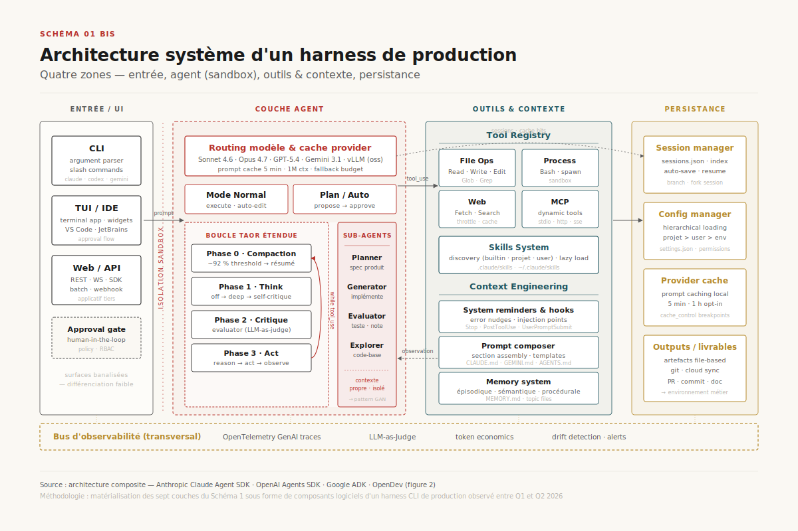 | **S §7.2.3** | tel quel — 4 zones + bus observabilité, complète anatomie-harness |
| 02 | [`boucle-gan`](../harness-agentique/images/20260429-02-boucle-gan.svg) |  | **S §7.4** | tel quel — planner/generator/evaluator |
| 03 | [`trois-couches`](../harness-agentique/images/20260429-03-trois-couches.svg) |  | **Ch.20** (runtime managé) | renvoi Ch.20 — la cartographie API/SDK/Managed appartient au chapitre runtime |
| 04 | [`secteurs-maturite`](../harness-agentique/images/20260429-04-secteurs-maturite.svg) |  | **Ch.21** (ROI) | renvoi Ch.21 — matrice secteurs × maturité |
| 05 | [`effort-developpement`](../harness-agentique/images/20260429-05-effort-developpement.svg) |  | **S §7.11** | tel quel — trois trajectoires POC / mid / multi-agent |
| 06 | [`observabilite-piliers`](../harness-agentique/images/20260429-06-observabilite-piliers.svg) |  | **S §7.7** | tel quel — 6 piliers (renvoi Ch.18 pour détail) |
| 07 | [`trajectoire`](../harness-agentique/images/20260429-07-trajectoire.svg) |  | **Ch.20** (horizon runtime) | renvoi Ch.20 |

#### Schémas du dossier `agent-sdk/` (11, dont 3 ref)

| Fig | Slug | Aperçu | Catégorie Ch.7 | Statut |
| --- | --- | --- | --- | --- |
| 00 | [`exec-sum-a4`](../agent-sdk/images/20260518-00-exec-sum-a4.svg) | A4 portrait | écarté (livre) | annexe rapport |
| 01 | [`evolution-agents`](../agent-sdk/images/20260518-01-evolution-agents.svg) | 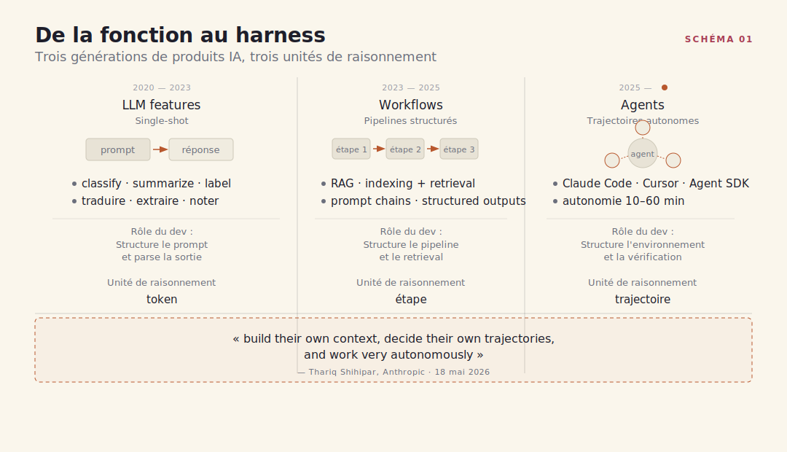 | **Prologue/Ch.1** (LLM features → workflows → agents) | écarté Ch.7 — trop méta, mieux placé en intro générale |
| 02 | [`anatomie-claude-code`](../agent-sdk/images/20260518-02-anatomie-claude-code.svg) | 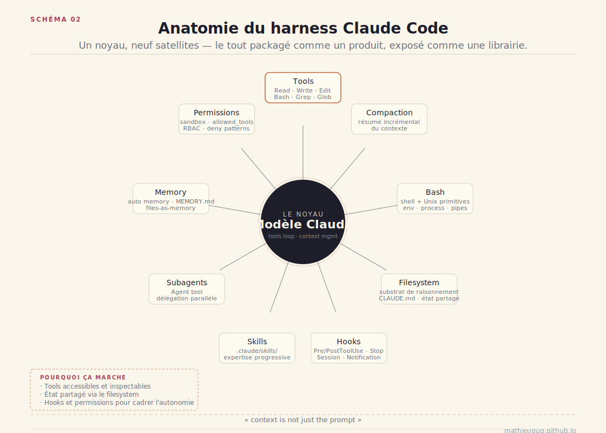 | écarté Ch.7 (redondant avec harness-01) | mieux placé en encart "vue produit" du Ch.7 si édition print le réclame |
| 03 | [`cc-vs-sdk`](../agent-sdk/images/20260518-03-cc-vs-sdk.svg) | 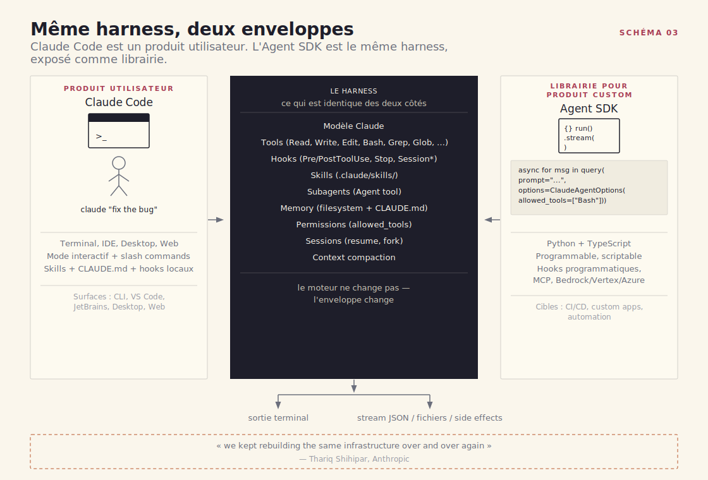 | écarté Ch.7 (couverte textuellement §7.10) | optionnel pour zoom produit |
| 04 | [`trois-voies`](../agent-sdk/images/20260518-04-trois-voies.svg) | 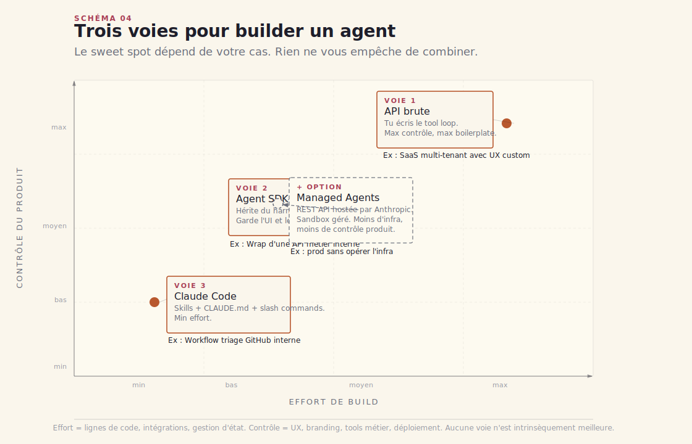 | **S §7.10** (envisagé) | tel quel — mais §7.10 a privilégié la matrice tabulaire pour densité d'info |
| 05 | [`pokeapi-variantes`](../agent-sdk/images/20260518-05-pokeapi-variantes.svg) | 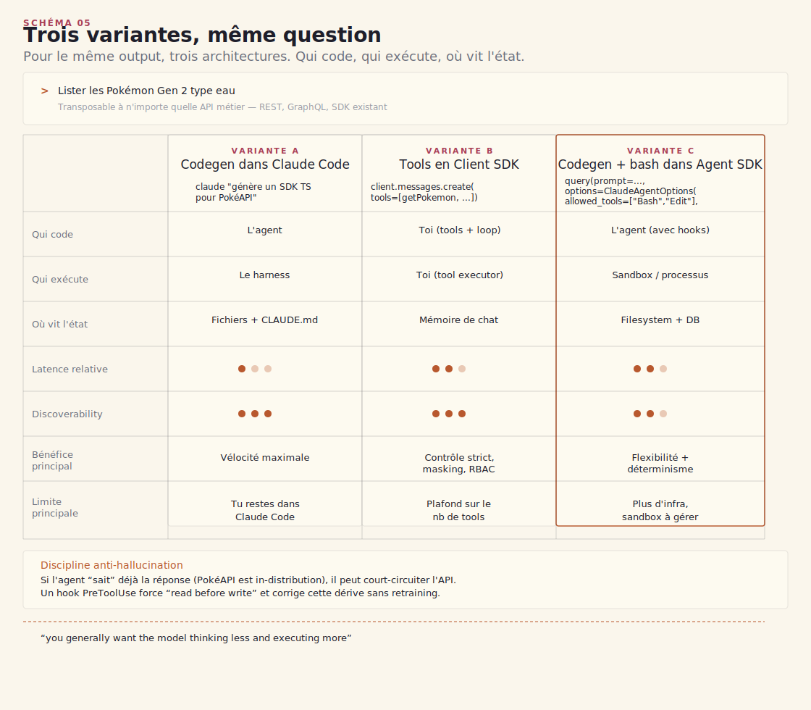 | écarté Ch.7 (cas spécifique) | gardé en ligne sur dossier source |
| 06 | [`bash-funnel`](../agent-sdk/images/20260518-06-bash-funnel.svg) | 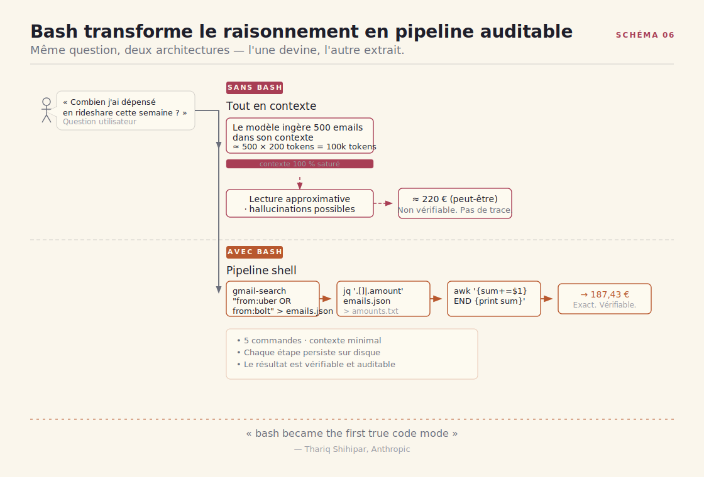 | **S §7.5.2** (envisagé) | non retenu v1 — texte du scénario rideshare suffit ; à réintroduire si édition print veut une illustration |
| 07 | [`matrice-tools-bash-codegen`](../agent-sdk/images/20260518-07-matrice-tools-bash-codegen.svg) | 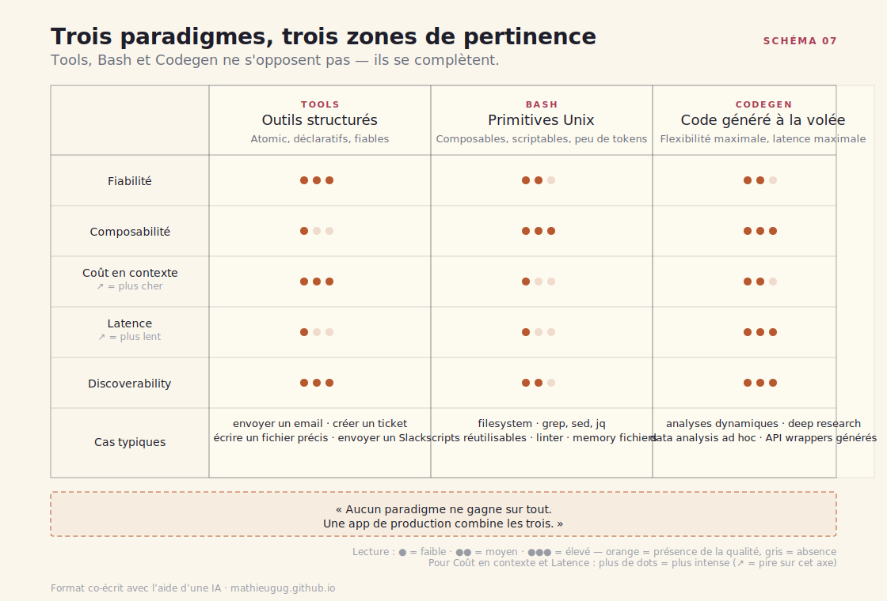 | **S §7.5** | tel quel — matrice trois paradigmes |
| 08 | [`agent-loop`](../agent-sdk/images/20260518-08-agent-loop.svg) | 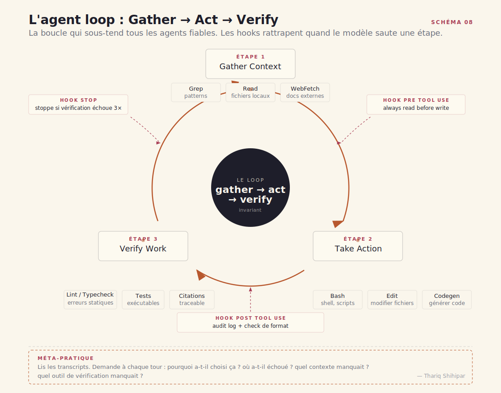 | candidat **S §7.3** | non retenu v1 — la formulation TAOR + variante GAN suffit textuellement ; à réintégrer si édition print veut un schéma boucle dédié |
| 09 | [`securite-couches`](../agent-sdk/images/20260518-09-securite-couches.svg) | 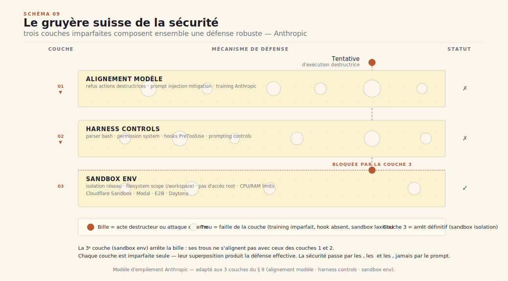 | **S §7.8** | tel quel — gruyère 3 couches |
| ref-1 | [`ref-coding-agents-anatomie`](../agent-sdk/images/ref-coding-agents-anatomie.svg) | (copie de coding-agents-02) | — | source originale en coding-agents/ |
| ref-2 | [`ref-gruyere-suisse`](../agent-sdk/images/ref-gruyere-suisse.svg) | (parallèle évaluation) | **Ch.17** (gruyère évaluation) | renvoi Ch.17 — c'est la fig signature playbook eval 8 étapes |
| ref-3 | [`ref-harness-7-couches`](../agent-sdk/images/ref-harness-7-couches.svg) | (copie de harness-01) | — | source originale en harness-agentique/ |

#### Schémas du dossier `coding-agents/` (9)

| Fig | Slug | Aperçu | Catégorie Ch.7 | Statut |
| --- | --- | --- | --- | --- |
| 00 | [`exec-sum-a4`](../coding-agents/images/20260512-00-exec-sum-a4.svg) | A4 portrait | écarté (livre) | annexe rapport |
| 01 | [`trois-regimes`](../coding-agents/images/20260512-01-trois-regimes.svg) |  | écarté Ch.7 (trop coding-spé) | gardé en ligne sur dossier source |
| 02 | [`anatomie`](../coding-agents/images/20260512-02-anatomie.svg) |  | écarté Ch.7 (redondant avec harness-01 + sdk-02) | gardé en ligne ; signe la redondance massive identifiée |
| 03 | [`cycle-skill`](../coding-agents/images/20260512-03-cycle-skill.svg) |  | candidat §7.6.1 | non retenu v1 — descriptions textuelles des skills suffisent ; à réintroduire en print si nécessaire |
| 04 | [`comparatif`](../coding-agents/images/20260512-04-comparatif.svg) |  | écarté Ch.7 (comparatif produits trop coding-spé) | gardé en ligne |
| 05 | [`pyramide`](../coding-agents/images/20260512-05-pyramide.svg) |  | **S §7.9** | tel quel — schéma signature de §7.9 |
| 06 | [`gains`](../coding-agents/images/20260512-06-gains.svg) |  | **Ch.21** (ROI/gains) | renvoi Ch.21 |
| 07 | [`couts`](../coding-agents/images/20260512-07-couts.svg) |  | **Ch.21** (ROI/coûts) | renvoi Ch.21 |
| 08 | [`carte-decision`](../coding-agents/images/20260512-08-carte-decision.svg) |  | écarté Ch.7 (matrice tabulaire §7.10.5 suffit) | gardé en ligne |

#### Schémas du dossier `anatomie/` (méta)

Les anneaux concentriques de `livre.html` (rendus par `livre-render.js` à partir de `LAYERS` dans `livre-data.js`) ne sont pas exportés en SVG indépendants. Les anneaux 01 (boucle), 02 (outils), 03 (contexte), 04 (patterns) constituent le **squelette conceptuel** mais ne fournissent pas d'images directement réutilisables ; ils nourrissent en revanche la **discipline éditoriale** (définitions canoniques, risques par couche, rôles par couche). Le schéma E1 (anatomie 10 anneaux concentriques) sera dérivé pour l'ouverture du livre.

### Redondances et complémentarités entre les 4 dossiers

**3 redondances majeures identifiées, déduplications opérées dans le chapitre :**

| Sujet | `harness-agentique` | `agent-sdk` | `coding-agents` | `anatomie` | Décision Ch.7 |
| --- | --- | --- | --- | --- | --- |
| **Anatomie d'un harness** | 7 couches verticales + 2 plans (le plus dense, vue système) | 9 satellites autour du modèle (vue produit Claude Code) | 6 rouages (vue coding agent) | 10 anneaux concentriques (vue stratégique) | **Définition canonique = harness-01 (7 couches)**. Sdk-02 et coding-02 cités en mémoire, anatomie en référence amont. Évite 3 schémas redondants. |
| **Boucle Reason · Act · Observe** | TAOR (Think-Act-Observe-Repeat) | Gather · Act · Verify (Anthropic Agent SDK) | « itère en boucle » (description narrative) | ReAct (formalisation académique) | **Définition canonique = §7.3 avec 3 variantes nommées**. Une seule description, 3 noms reconnus, 1 pivot (`stop_reason`). Le R1 « boucle + 3 variantes » de l'outline est rempli par superposition textuelle dans §7.3 — pas de schéma fusionné v1, à créer si édition print. |
| **6 patterns canoniques Anthropic** | mention rapide | non couvert | mention rapide | 6 patterns détaillés (anneau 04 livre-data.js) | **Définition canonique = Ch.11**, pas Ch.7. Le Ch.7 fixe le principe (start simple, règle Schluntz-Zhang), Ch.11 déroule la taxonomie complète. |

**Complémentarités assumées (pas de doublon vrai) :**

| Apport unique du dossier | À conserver pour le Ch.7 |
| --- | --- |
| `harness-agentique` | Anatomie 7 couches, pattern GAN, observabilité 6 piliers, effort de dev (les 4 schémas signature) |
| `agent-sdk` | Matrice tools/bash/codegen, gruyère 3 couches sécurité, matrice 4 voies de build, hooks 6 points d'interception |
| `coding-agents` | Pyramide d'usage 4 étages (le seul angle qui structure l'adoption transverse), retex chiffrés (Stripe, METR), pyramide d'adoption |
| `anatomie/livre-data.js` | Définitions canoniques (ReAct, stop_reason, harness, runner, graph execution, function calling, tool_use…), risques par couche |

**1 absence notable, non bloquante** : pas de **schéma fusionné R1** (boucle ReAct canonique + 3 variantes harness GAN / gather-act-verify / coding loop). L'outline (annexe A.2) le liste comme « à créer par fusion ». **Décision v1** : couvert textuellement dans §7.3 (3 variantes nommées, une seule description), et le récap chapitre réutilise harness-01 (7 couches) qui couvre déjà la boucle comme couche 2. Si l'édition print réclame un récap fusionné dédié, le coût est ~3-5 jours SVG.

### Plan détaillé du chapitre

```
> [!QUESTION] Question d'ouverture
  Si l'écart inter-modèles tombe sous 1,3pt mais que le scaffold pèse 22pt,
  où passe le levier d'ingénierie 2026 ?

> [!TLDR] TL;DR décideur (6 bullets)

§7.1  Pourquoi 2026 est l'année du harness (3 faits empiriques)
      └─ encadré [!INFO] Voir Ch.1 (cœur stochastique)

§7.2  Anatomie d'un harness — sept couches
      ├─ §7.2.1 Modèle, boucle, contexte, outils, mémoire
      │  └─ encadré [!INFO] Voir Ch.9 (mémoire agentique)
      ├─ §7.2.2 Observabilité, gouvernance (plans horizontaux)
      └─ §7.2.3 Du conceptuel au système
         ├─ [SVG S] harness-01-anatomie-harness.svg
         └─ [SVG S] harness-01b-architecture-systeme.svg

§7.3  La boucle Reason · Act · Observe et son pivot stop_reason
      ├─ encadré [!EXAMPLE] boucle minimale Anthropic Client SDK
      ├─ §7.3.1 Trois variantes d'une même boucle (TAOR / Gather-Act-Verify / GAN)
      └─ §7.3.2 Pourquoi la boucle mono-agent s'effondre
         └─ encadré [!QUOTE] Rajasekaran Anthropic Labs

§7.4  Le pattern à trois agents (GAN-inspiré)
      ├─ [SVG S] harness-02-boucle-gan.svg
      ├─ §7.4.1 Anatomie (planner / generator / evaluator)
      ├─ §7.4.2 L'économie du pattern (mono 20min/9$ vs trois agents 6h/200$)
      └─ §7.4.3 Trois leçons d'ingénierie
         └─ encadré [!ATTENTION] Le pattern n'est pas la seule architecture

§7.5  Outils, bash et codegen — les trois paradigmes d'action
      ├─ [SVG S] sdk-07-matrice-tools-bash-codegen.svg
      ├─ §7.5.1 Tools — actions structurées
      ├─ §7.5.2 Bash — composition, filesystem, mémoire (scénario rideshare)
      ├─ §7.5.3 Codegen — flexibilité, deep research
      │  └─ encadré [!EXAMPLE] codegen avec hooks
      └─ §7.5.4 La règle de combinaison
         └─ encadré [!IMPORTANT] RBAC passe par l'infra, pas le prompt

§7.6  Skills, hooks, sub-agents — leviers de fiabilité déterministe
      ├─ §7.6.1 Les skills — objet partageable
      ├─ §7.6.2 Les hooks — rattrapage déterministe
      └─ §7.6.3 Les sub-agents — déléguer dans la délégation
         └─ encadré [!INFO] Voir Ch.11 (orchestration multi-agent)

§7.7  Observabilité — six piliers, et pourquoi l'APM est aveugle
      ├─ [SVG S] harness-06-observabilite-piliers.svg
      └─ encadré [!INFO] Voir Ch.18 (observabilité agentique)

§7.8  Gouvernance — gruyère suisse, sandbox, RBAC
      ├─ [SVG S] sdk-09-securite-couches.svg
      ├─ encadré [!WARNING] Piège classique de la couche outils (execute_sql + injection)
      └─ encadré [!INFO] Voir Ch.13 et Ch.19 (sécurité MCP + threat model E4)

§7.9  La pyramide d'adoption — qui s'en sert pour quoi
      ├─ [SVG S] coding-05-pyramide.svg
      ├─ 4 étages (transverse / data quotidien / data expert / produit-décideurs)
      └─ encadré [!NOTE] Le sommet n'est pas mieux que la base

§7.10 Trois voies pour builder + une — matrice de décision
      ├─ §7.10.1 Client SDK
      ├─ §7.10.2 Agent SDK
      ├─ §7.10.3 Claude Code comme plateforme d'extension
      ├─ §7.10.4 Managed Agents
      ├─ §7.10.5 Matrice transverse (8 cas d'usage × voie × mix × surveillance)
      └─ encadré [!INFO] Voir Ch.20 (runtime managé)

§7.11 Effort de développement — combien, combien de temps, avec qui
      ├─ [SVG S] harness-05-effort-developpement.svg
      ├─ 3 trajectoires (POC 50-100k€ / mid 150-300k€ / multi-agent 500k-2M€+)
      ├─ Distribution effort (data prep 60-75%, intégration 40-60%, safety +20-30%)
      └─ encadré [!INFO] Voir Ch.21 (ROI + paradoxe agentique)

Récap chapitre — Sept couches, une boucle, trois voies
       └─ [SVG R] harness-01-anatomie-harness.svg (réutilisé en récap)

> [!WARNING] Trois pièges classiques (les trois sont 100% traçables)
  Loop infinie sans budget de tours · execute_sql sans sandbox ·
  multi-agent prématuré (×10-15 tokens, mois vs semaines, debug exponentiel)

Sources (23 footnotes : 4 dossiers source + Anthropic engineering blog +
        Microsoft Tech Community + ReAct paper + Coinbase + McKinsey + OWASP +
        Stack Overflow Survey + METR)
```

### Encadrés prévus dans le chapitre

Variété des `> [!TYPE]` Obsidian retenus :

| Type | Usage | Compte |
| --- | --- | --- |
| `[!QUESTION]` | Ouverture chapitre | 1 |
| `[!TLDR]` | Synthèse décideur 6 bullets | 1 |
| `[!INFO]` | Renvois inter-chapitres (Ch.1, 9, 11, 13/19, 18, 20, 21) | 7 |
| `[!EXAMPLE]` | Code pseudo-Python (Client SDK loop + Agent SDK hooks) | 2 |
| `[!QUOTE]` | Citation Rajasekaran (Anthropic Labs) | 1 |
| `[!ATTENTION]` | Le pattern n'est pas la seule architecture (renvoi Ch.11) | 1 |
| `[!IMPORTANT]` | RBAC passe par l'infra | 1 |
| `[!NOTE]` | Le sommet n'est pas mieux que la base (pyramide §7.9) | 1 |
| `[!WARNING]` | Piège exec_sql + trois pièges classiques en clôture | 2 |
| **Total** | | **17** |

### Tâches restantes Ch.7

- [x] Rédiger le manuscrit `docs/livre/ch07-boucle-agentique.md` (~9 800 mots)
- [x] Audit des 29 schémas SVG des 4 dossiers source
- [ ] Relecture Mathieu — passes critiques suggérées :
  - **(a) La discipline anti-redondance** : vérifier que les 3 redondances majeures (anatomie / boucle / 6 patterns) sont effectivement déduplicéés sans perte de matière utile.
  - **(b) Le récap §Récap** : décider si on garde la réutilisation du schéma harness-01 ou si on commande la fusion R1 (boucle ReAct + 3 variantes).
  - **(c) Le §7.5.2 bash** : le scénario rideshare est cité textuellement sans schéma ; valider que ça passe ou réintégrer sdk-06-bash-funnel.svg.
  - **(d) Le §7.9 pyramide** : c'est l'angle unique du dossier coding-agents — vérifier qu'il n'est pas dilué par l'absorption en charnière.
  - **(e) La frontière Ch.7 ↔ Ch.11** : règle d'écriture posée (§7.4 trois agents = Ch.7 ; 8 patterns canoniques + topologies multi-agents + arbre buy/build = Ch.11). À valider pendant la rédaction du Ch.11.
- [ ] Si validation : copier-coller la matière vers le futur format de sortie (print HTML / PDF) quand décidé

---

## Chapitre 11 — Patterns canoniques et orchestration multi-agents

> **Acte II — La boucle · Gabarit standard 16-24 p · ~6 500 mots**
> **Lecteur cible** : agent engineer, tech lead, architecte, sponsor IA.
> **Sortie lecteur** : connaît les 4 régimes de contrôle et sait à quel moment basculer du workflow vers l'agent autonome ; maîtrise les 8 patterns canoniques (5 workflows Anthropic + 3 topologies multi-agents) ; distingue les 3 couches du stack (ADK / runtime / plateforme) et sait que « on utilise Bedrock » ne dit rien tant qu'on n'a pas précisé les briques ; reconnaît les 5 problèmes durs qui font crasher les agents en prod ; peut dérouler l'arbre buy/build à 4 questions ; et sait qu'une fabrique d'équipe en 4 stades × 10 artefacts est ce qui sépare 5 % de projets qui livrent des 95 % qui restent en pilote (MIT NANDA).

### Statut

| Étape | Statut |
| --- | --- |
| Audit schémas source (3 dossiers) | ✅ fait (cf. §Audit ci-dessous) |
| Plan détaillé | ✅ fait |
| Manuscrit | ✅ **v1 livrée** — `docs/livre/ch11-patterns-orchestration.md` (≈ 6 500 mots, 14 encadrés, 8 schémas intégrés) |
| Schémas à créer | 0 v1 (R4 « 8 patterns canoniques » traité par réutilisation tel quel de `orchestration-04-patterns-canoniques.svg` ; R5 « fabrique 4 stades » traité par tableau markdown — le schéma `fabrique-12-recap-10x4.svg` reste optionnel pour le récap dédié si édition print l'exige) |
| Frontière Ch.7 ↔ Ch.11 | ✅ respectée — Ch.7 garde le pattern GAN 3-agents (§7.4) ; Ch.11 déroule la taxonomie complète des 8 patterns et cite §7.4 comme cas particulier d'evaluator-optimizer enrichi d'un planner |
| Renvois inter-chapitres | ✅ Ch. 5 (économie token), Ch. 7 (boucle, pattern GAN, RBAC), Ch. 9 (mémoire), Ch. 10 (compaction), Ch. 12 (MCP plateforme), Ch. 13 (MCP sécurité), Ch. 14 (surfaces + Knight levels), Ch. 15 (computer use / browser tool), Ch. 17 (eval pass^k), Ch. 18 (observabilité), Ch. 19 (threat model E4), Ch. 20 (runtime managé), Ch. 21 (ROI Klarna second usage), Ch. 24 (IA et travail réallocation) |

### Sources matérielles

Le Ch.11 est une **charnière à 3 dossiers**, ancré dans le dossier le plus récent de la série (`orchestration-agentique/` mergé via PR #126 le 27 mai 2026, source principale) qui structure les huit patterns, les quatre régimes, le stack en trois couches, les cinq problèmes durs et l'arbre buy/build. La couche fabrique d'équipe vient de `fabrique-agent/`. L'absorbé `anatomie/` couche 04 fournit les définitions canoniques.

- **Dossier principal — [`orchestration-agentique/`](../orchestration-agentique/)** (27 mai 2026, dossier #28) — épine du chapitre : 4 régimes (§3), 8 patterns canoniques (§4), stack ADK/runtime/plateforme (§5), cartographie 2026 (§6), 5 problèmes prod (§7), arbre de décision buy/build (§8).
  - [Rapport (.md, ~6 500 mots)](../orchestration-agentique/20260527-orchestration-agentique-rapport.md) · [App interactive](../orchestration-agentique/20260527-orchestration-agentique-app.html)
  - 8 schémas SVG dans [`images/`](../orchestration-agentique/images/) — **tous** intégrés en Ch.11 (taux d'absorption maximal du corpus).
- **Dossier sous-chapitre équipe — [`fabrique-agent/`](../fabrique-agent/)** (15 mai 2026, étude #21) — 4 stades de maturité (Prototype · Pilote · Production · Mature multi-agents) × 10 artefacts partagés, 5 cellules pivots.
  - [Rapport (.md, ~14 000 mots)](../fabrique-agent/20260515-fabrique-agent-rapport.md) · [App interactive](../fabrique-agent/20260515-fabrique-agent-app.html)
  - 13 schémas SVG dans [`images/`](../fabrique-agent/images/) — pas absorbés visuellement (le tableau §11.8.1 condense, fidèle à la discipline anti-mur-de-schéma)
- **Source méta — [`anatomie/`](../anatomie/)** (14 mai 2026) — anneau 04 (patterns) de `livre-data.js`. Définitions canoniques mobilisées textuellement, pas de schéma autonome extrait.

### Audit des schémas — Ch.11

Au total, **21 schémas SVG** dans les 3 dossiers source. Classement S (au fil du texte Ch.11) / R (récap chapitre) / Ch.X (assigné à un autre chapitre) / écarté.

#### Schémas du dossier `orchestration-agentique/` (8 — tous absorbés)

| Fig | Slug | Aperçu | Catégorie Ch.11 | Statut |
| --- | --- | --- | --- | --- |
| 01 | [`shift-chat-systeme`](../orchestration-agentique/images/20260527-01-shift-chat-systeme.svg) | 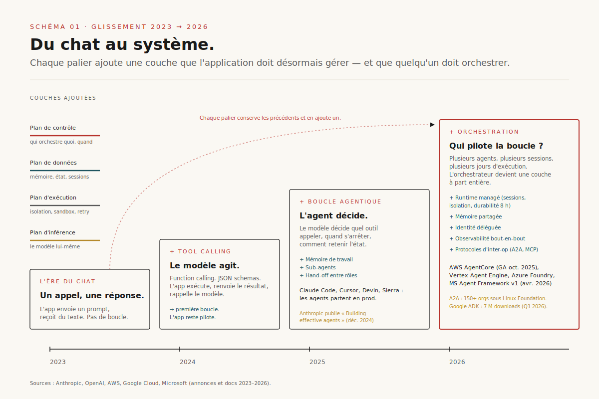 | **S §11.1.2** | tel quel — frise 2023→2026 qui pose le motif du chapitre |
| 02 | [`anatomie-boucle`](../orchestration-agentique/images/20260527-02-anatomie-boucle.svg) | 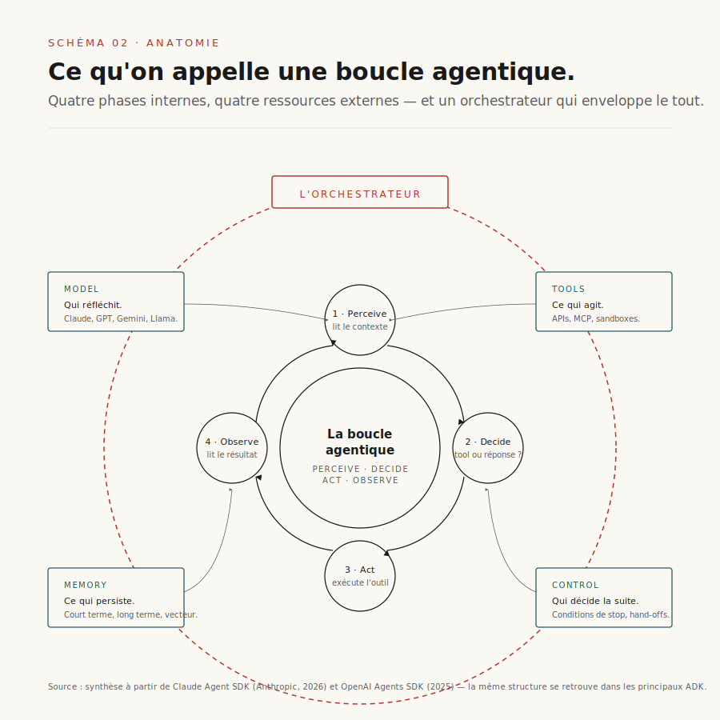 | **S §11.2** | tel quel — 4 phases + 4 ressources + orchestrateur enveloppant |
| 03 | [`spectre-controle`](../orchestration-agentique/images/20260527-03-spectre-controle.svg) | 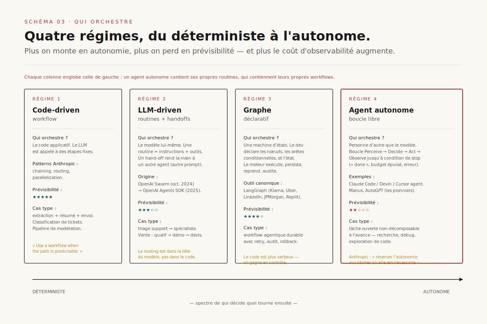 | **S §11.3 + Récap §11.9** | tel quel — schéma signature du chapitre, utilisé **2×** |
| 04 | [`patterns-canoniques`](../orchestration-agentique/images/20260527-04-patterns-canoniques.svg) | 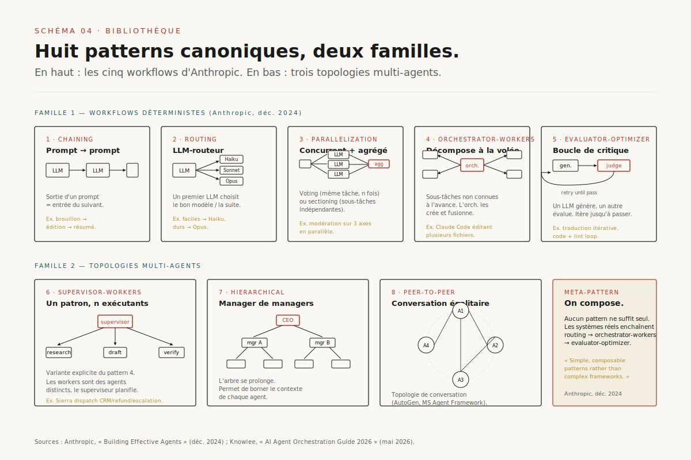 | **R4 §11.4** | tel quel — couvre la bibliothèque des 8 patterns sans gap. Le R4 de l'outline (annexe A.2) est ainsi rempli sans fusion lourde. |
| 05 | [`stack-trois-couches`](../orchestration-agentique/images/20260527-05-stack-trois-couches.svg) | 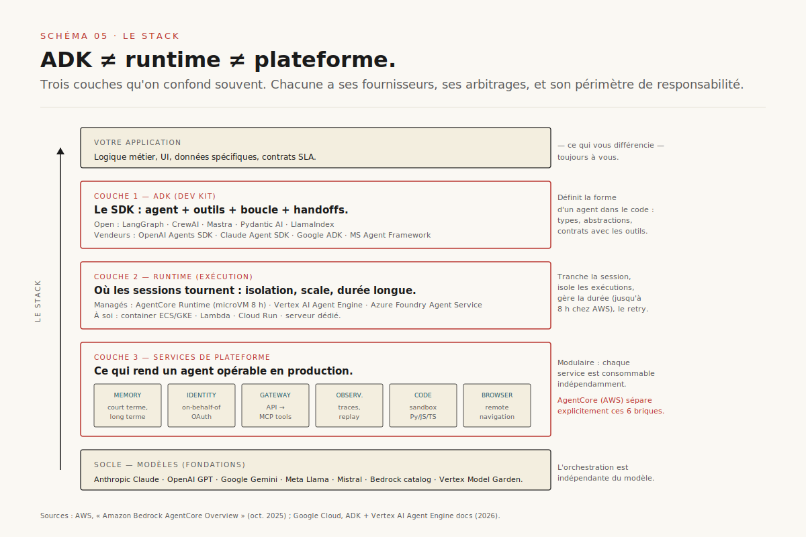 | **S §11.5** | tel quel — ADK / runtime / plateforme |
| 06 | [`cartographie-2026`](../orchestration-agentique/images/20260527-06-cartographie-2026.svg) |  | **S §11.5.4** | tel quel — 4 bandes + 2 protocoles |
| 07 | [`problemes-prod`](../orchestration-agentique/images/20260527-07-problemes-prod.svg) | 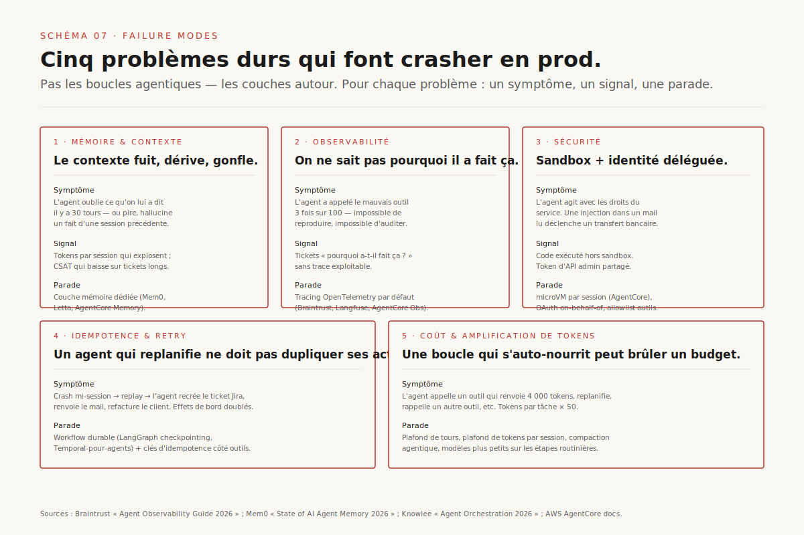 | **S §11.6** | tel quel — 5 problèmes durs, ancrés en symptôme / signal / parade |
| 08 | [`arbre-decision`](../orchestration-agentique/images/20260527-08-arbre-decision.svg) | 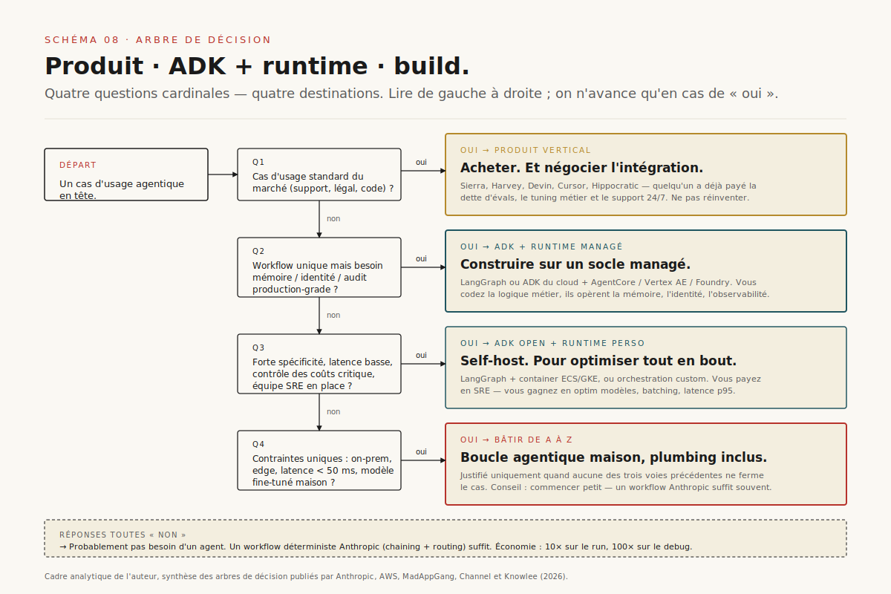 | **S §11.7 (+ E6 outline)** | tel quel — arbre 4 questions. C'est aussi le schéma essentiel transverse **E6** de l'outline, cité ici en source et à recadrer si l'annexe consultative print le réclame. |

#### Schémas du dossier `fabrique-agent/` (13, aucun absorbé visuellement)

Les 13 schémas de `fabrique-agent/` (atelier par stade, recap 10×4, ROI cards, etc.) sont **tous écartés** du Ch.11 v1 — non par jugement de qualité, mais par discipline éditoriale. Le chapitre Ch.11 est standard (16-24 p), il a déjà 8 schémas intégrés (tous d'`orchestration-agentique/`), et la matière fabrique est condensée en §11.8 par un **tableau markdown 4 stades × artefacts naissants** qui suffit à porter la thèse sans alourdir. Si une édition print exige un schéma de récap dédié à la fabrique (équivalent du R5 listé en annexe A.2 de l'outline), `fabrique-12-recap-10x4.svg` est le candidat naturel ; sa réutilisation en Ch.11 reste possible à coût zéro.

Détail de classification pour mémoire (et pour le Ch.11 qui ne les absorbe pas) :

| Fig | Slug | Catégorie | Note |
| --- | --- | --- | --- |
| 01 | `oignon-fabrique` | écarté Ch.11 | superposition oignon / fabrique — appartient à l'ouverture du livre ou au prologue |
| 02-04, 07, 10 | `atelier-prototype` / `atelier-pilote` / `atelier-production` / `atelier-mature` | écarté Ch.11 | scènes d'atelier par stade — appartiennent à un éventuel sous-chapitre dédié `fabrique-agent` |
| 05 | `testcase-anatomie` | **Ch.17** | format TestCase = (Persona × Quest × Environment) → Expected Outcome — appartient au chapitre éval |
| 06 | `vallee-de-la-mort` | **Ch.21** | 95 %/70 % POC qui meurent — ROI/économie |
| 08 | `gruyere-suisse` | **Ch.17** | Anthropic 5 couches d'évaluation — appartient au chapitre éval (renvoyé déjà via `agent-sdk ref-2` au Ch.7) |
| 09 | `obo-vs-autonome` | **Ch.13/Ch.19/Ch.23** | régimes d'identité — sécurité MCP / threat model / gouvernance |
| 11 | `coala-cycle` | **Ch.9** | 4 piliers CoALA + 6 opérations — appartient au chapitre mémoire |
| 12 | `recap-10x4` | candidat **R5 Ch.11** (édition print) | matrice 10 artefacts × 4 stades — réservée pour récap fabrique si gabarit print le réclame. v1 du Ch.11 fait sans, par tableau markdown. |
| 13 | `roi-cards` | **Ch.21** | 5 axes × 3 temporalités = 15 ROI cards — appartient au chapitre ROI |

#### Schémas du dossier `anatomie/` (couche 04 patterns)

Les anneaux concentriques de `livre.html` (rendus par `livre-render.js` à partir de `LAYERS` dans `livre-data.js`) ne sont pas exportés en SVG indépendants. La couche 04 (patterns) fournit en revanche la **discipline éditoriale** : c'est elle qui pose le principe que la taxonomie des 6 patterns Schluntz-Zhang est canonique et qu'elle s'étend en multi-agent par 3 topologies. Aucune image directement réutilisable — la matière est dans le SVG `orchestration-04-patterns-canoniques` qui couvre les 8 patterns en une bibliothèque visuelle.

### Redondances et complémentarités entre les 3 dossiers

**2 redondances majeures identifiées, déduplications opérées dans le chapitre :**

| Sujet | `orchestration-agentique` | `fabrique-agent` | `anatomie` 04 | Décision Ch.11 |
| --- | --- | --- | --- | --- |
| **Boucle agentique 4 phases** | SCHÉMA 02 anatomie-boucle (perceive·decide·act·observe + 4 ressources) | TAOR mentionnée comme couche 01 de l'oignon | ReAct dans `livre-data.js` LAYERS[1] | **Définition canonique = Ch.7 §7.3** (déjà acquise). Ch.11 §11.2 réutilise le schéma 02 pour rappeler les 4 ressources sous l'angle « ce qu'on orchestre exactement », sans redécrire la mécanique. Pas de doublon vrai parce que l'angle change (orchestration vs harness). |
| **8 patterns Anthropic + multi-agents** | SCHÉMA 04 patterns-canoniques (la bibliothèque complète) | non couvert visuellement | 6 patterns Schluntz-Zhang dans anneau 04 | **Définition canonique = Ch.11 §11.4** (objet propre du chapitre). Le Ch.7 a explicitement repoussé en Ch.11 (cf. son audit). Le Ch.11 cite §7.4 (pattern GAN à 3 agents) comme cas particulier d'evaluator-optimizer enrichi d'un planner, sans refaire la narration. |

**Complémentarités assumées (pas de doublon vrai) :**

| Apport unique du dossier | À conserver pour le Ch.11 |
| --- | --- |
| `orchestration-agentique` | 4 régimes de contrôle (§3) ; 8 patterns canoniques (§4) ; stack 3 couches ADK / runtime / plateforme (§5) ; cartographie 2026 4 bandes + 2 protocoles (§6) ; 5 problèmes durs en prod (§7) ; arbre de décision buy/build 4 questions (§8). C'est **le** dossier qui structure l'ensemble. |
| `fabrique-agent` | Discipline « la maturité se lit dans les artefacts, pas dans le code » + 4 stades + 10 artefacts + 5 cellules pivots + chiffres MIT NANDA (95 %) / consensus POC (70 %). **L'angle équipe** que `orchestration-agentique` n'a pas. |
| `anatomie/livre-data.js` couche 04 | Définitions canoniques des 6 patterns Schluntz-Zhang, risques par couche, rôles par couche. Sert de référence amont, pas d'absorption directe. |

**Cohérence avec la frontière posée par Ch.7** : le Ch.7 a repoussé explicitement en Ch.11 (a) les 8 patterns canoniques, (b) l'arbre de décision buy/build, (c) la cartographie des 4 régimes étendue. Le Ch.7 garde (i) le principe `start simple` Schluntz-Zhang, (ii) le pattern GAN à 3 agents comme cas particulier traité en détail §7.4. Le Ch.11 respecte cette frontière sans la franchir : §11.4.1 mentionne le pattern à 3 agents comme cas particulier d'evaluator-optimizer + planner, renvoie au Ch.7 §7.4 pour l'économie et la narration, et ne refait pas le schéma `harness-02-boucle-gan.svg` (qui reste signature du Ch.7).

**1 absence notable, non bloquante** : pas de **schéma fusionné R5** (matrice 4 stades fabrique × 10 artefacts). L'outline (annexe A.2) le liste comme « tel quel à partir de `fabrique-12-recap-10x4.svg` ». **Décision v1** : couvert par tableau markdown §11.8.1, plus condensé qu'un schéma 10 colonnes × 4 lignes qui demanderait une double-page A3 pour rester lisible. Si l'édition print réclame un récap visuel dédié, `fabrique-12-recap-10x4.svg` est le candidat naturel et son coût d'intégration est nul (réutilisation tel quel).

### Plan détaillé du chapitre

```
> [!QUESTION] Question d'ouverture
  Si plus de la moitié des projets multi-agents reviennent en workflow routé
  en 6 mois (sans perte de qualité, ×10 facture, debug lisible),
  à quel moment bascule-t-on dans le multi-agent — et qui pilote la boucle ?

> [!TLDR] TL;DR décideur (6 bullets)

§11.1  Pourquoi un chapitre dédié aux patterns
       ├─ §11.1.1 La place de ce chapitre dans l'Acte II
       │  └─ encadré [!INFO] Voir Ch.7 (boucle / pattern GAN)
       └─ §11.1.2 Le glissement 2023 → 2026
          └─ [SVG S] orchestration-01-shift-chat-systeme.svg

§11.2  Ce qu'on orchestre exactement
       ├─ [SVG S] orchestration-02-anatomie-boucle.svg
       ├─ 4 ressources + 5 questions par tour
       └─ encadré [!NOTE] La distinction workflow vs agent (Anthropic)

§11.3  Quatre régimes de contrôle
       ├─ [SVG S] orchestration-03-spectre-controle.svg
       ├─ §11.3.1 Code-driven (workflow)
       ├─ §11.3.2 LLM-driven (routines + handoffs) — OpenAI Swarm
       │  └─ encadré [!EXAMPLE] signature minimale handoff Agents SDK
       ├─ §11.3.3 Graphe déclaratif — LangGraph
       └─ §11.3.4 Agent autonome (boucle libre)
          └─ encadré [!ATTENTION] Recommandation Anthropic — réserver l'autonomie

§11.4  Les huit patterns canoniques
       ├─ [SVG R4] orchestration-04-patterns-canoniques.svg
       ├─ §11.4.1 Cinq workflows Anthropic
       │  └─ encadré [!INFO] Voir Ch.7 §7.4 — pattern à 3 agents
       ├─ §11.4.2 Trois topologies multi-agents
       ├─ encadré [!IMPORTANT] La maxime non-écrite — on compose
       └─ encadré [!INFO] Voir Ch.14 (surfaces + Knight levels)

§11.5  Le stack en trois couches — ADK ≠ runtime ≠ plateforme
       ├─ [SVG S] orchestration-05-stack-trois-couches.svg
       ├─ §11.5.1 Couche 1 — ADK (tableau 7 ADK)
       ├─ §11.5.2 Couche 2 — Runtime
       │  └─ encadré [!INFO] Voir Ch.20 (runtime managé)
       ├─ §11.5.3 Couche 3 — Services de plateforme (6 briques AgentCore)
       └─ §11.5.4 Cartographie 2026 — 4 bandes + 2 protocoles
          ├─ [SVG S] orchestration-06-cartographie-2026.svg
          └─ encadré [!INFO] Voir Ch.12 et Ch.13 (MCP plateforme + sécurité)

§11.6  Les cinq problèmes durs en prod
       ├─ [SVG S] orchestration-07-problemes-prod.svg
       ├─ §11.6.1 Mémoire et contexte (renvoi Ch.9, Ch.10)
       ├─ §11.6.2 Observabilité (renvoi Ch.18)
       ├─ §11.6.3 Sécurité (renvoi Ch.7 §7.5.4, Ch.13, Ch.19)
       ├─ §11.6.4 Idempotence et retry
       ├─ §11.6.5 Coût et amplification de tokens (renvoi Ch.10)
       └─ encadré [!WARNING] La cascade d'erreurs en multi-agents

§11.7  L'arbre de décision — produit, ADK + runtime, ou tout construire ?
       ├─ [SVG S] orchestration-08-arbre-decision.svg
       ├─ §11.7.1 Q1 — Cas d'usage standard ?
       │  └─ encadré [!QUOTE] L'angle Klarna — deux lectures, deux chapitres
       ├─ §11.7.2 Q2 — Workflow + besoin prod ?
       ├─ §11.7.3 Q3 — Spécificité forte + SRE ?
       ├─ §11.7.4 Q4 — Contraintes uniques ?
       ├─ §11.7.5 Si toutes les réponses sont « non »
       └─ §11.7.6 Trois signaux de migration

§11.8  La fabrique d'équipe — quatre stades, dix artefacts
       ├─ §11.8.1 Quatre stades (tableau markdown)
       │  └─ encadré [!IMPORTANT] La maturité d'une fabrique se lit
       │     dans ses artefacts
       └─ §11.8.2 Cinq cellules pivots (Entra Agent ID, memory_hit_rate,
          pass^k, OBO vs Autonome, réallocation)

§11.9  Récap chapitre — Quatre régimes, huit patterns, trois couches,
       un arbre
       └─ [SVG R] orchestration-03-spectre-controle.svg (réutilisé en récap
          — c'est le schéma qui articule tout le reste)

> [!WARNING] Trois pièges classiques (les trois sont 100 % traçables)
  Multi-agent prématuré · mal nommer la zone du stack · sauter le stade 3
  pour aller direct au stade 4

Sources (22 footnotes : 3 dossiers + Anthropic Building Effective Agents
        + OpenAI Cookbook/Agents SDK + AWS AgentCore + Google ADK +
        MS Agent Framework + Stellagent A2A + Knowlee + GuruSup + Morph +
        Claude Code docs + Sierra + Mem0 + Braintrust + OWASP ASI +
        GitHub Engineering multi-agent failures + Klarna press/post-mortem)
```

### Encadrés prévus dans le chapitre

Variété des `> [!TYPE]` Obsidian retenus :

| Type | Usage | Compte |
| --- | --- | --- |
| `[!QUESTION]` | Ouverture chapitre | 1 |
| `[!TLDR]` | Synthèse décideur 6 bullets | 1 |
| `[!INFO]` | Renvois inter-chapitres (Ch.7, 12+13, 14, 20) | 4 |
| `[!NOTE]` | Distinction workflow vs agent (maxime Anthropic) | 1 |
| `[!EXAMPLE]` | Code pseudo-Python (signature handoff Agents SDK) | 1 |
| `[!ATTENTION]` | Recommandation Anthropic — réserver l'autonomie | 1 |
| `[!IMPORTANT]` | La maxime "on compose" + La maturité des artefacts | 2 |
| `[!QUOTE]` | L'angle Klarna — deux lectures, deux chapitres (anticipe Ch.21) | 1 |
| `[!WARNING]` | Cascade d'erreurs multi-agents + Trois pièges classiques clôture | 2 |
| **Total** | | **14** |

### Tâches restantes Ch.11

- [x] Rédiger le manuscrit `docs/livre/ch11-patterns-orchestration.md` (~6 500 mots)
- [x] Audit des 21 schémas SVG des 3 dossiers source (8 absorbés sur 8 d'`orchestration-agentique` ; 0 sur 13 absorbés visuellement de `fabrique-agent` mais 6 réassignés à d'autres chapitres)
- [ ] Relecture Mathieu — passes critiques suggérées :
  - **(a) La frontière Ch.7 ↔ Ch.11** : vérifier que §11.4.1 (mention pattern à 3 agents comme cas particulier d'evaluator-optimizer) renvoie correctement au Ch.7 §7.4 sans rejouer l'économie 9 $/200 $ ni redécrire la mécanique. Statut v1 : renvoi unique sans répétition.
  - **(b) La fabrique d'équipe §11.8** : choix éditorial fort — table markdown plutôt que `fabrique-12-recap-10x4.svg`. Risque : sous-représentation visuelle du sous-chapitre. Alternative : insérer le schéma en récap dédié si édition print l'exige, ou créer un sous-chapitre `fabrique-agent` autonome (cf. friction 1 outline §4.2).
  - **(c) Le récap §11.9** : décision de réutiliser `orchestration-03-spectre-controle.svg` plutôt que `orchestration-04-patterns-canoniques.svg`. Justification : le spectre articule tout le reste (régimes → patterns → stack → problèmes → arbre) alors que le schéma 04 est une bibliothèque. Si Mathieu préfère le 04, swap trivial.
  - **(d) L'angle Klarna §11.7.1** : double usage explicite avec Ch.21 (ROI). Vérifier que les deux lectures restent complémentaires, pas redondantes.
  - **(e) La frontière Ch.11 ↔ Ch.20** : §11.5.2 (runtime) introduit AgentCore Runtime, Vertex Agent Engine, Foundry Service. Le Ch.20 dédié va creuser la matrice vendor. À ne pas refaire en Ch.20 — règle d'écriture posée.
- [ ] Si validation : copier-coller la matière vers le futur format de sortie (print HTML / PDF) quand décidé

---

## Chapitre 10 — Compaction et oubli stratégique

> **Acte II — La boucle · Gabarit standard 16-24 p · ~5 500-6 500 mots**
> **Lecteur cible** : agent engineer, tech lead, RSSI, DPO.
> **Sortie lecteur** : sait choisir une famille de compaction selon le triangle régulatoire/économique, connaît la surface d'attaque cachée et les attributs OTel candidats du WG GenAI fin 2026, peut justifier le choix de policy auprès d'un DPO/RSSI.

### Statut

| Étape | Statut |
| --- | --- |
| Audit schémas source | ✅ fait (cf. §Audit ci-dessous) |
| Plan détaillé | ✅ fait |
| Manuscrit | ✅ **v1 livrée** — `docs/livre/ch10-compaction.md` (≈ 5 800 mots, 14 encadrés, 7 schémas intégrés) |
| Schémas à créer | 0 (la matière source couvre) |
| Schémas à fixer | ✅ fait — `cinq-familles.svg` ligne 26 (XML désormais valide via xmllint) |
| Renvois inter-chapitres | ✅ Ch. 9 (mémoire), Ch. 18 (observabilité), Ch. 19 (sécurité E4), Ch. 23 (gouvernance) |

### Sources matérielles

- **Dossier principal** : [`compaction-agentique/`](../compaction-agentique/) — publié 27 mai 2026
  - [Rapport complet (.md, ~6 000 mots)](../compaction-agentique/20260527-compaction-agentique-rapport.md)
  - [App interactive (.html)](../compaction-agentique/20260527-compaction-agentique-app.html)
  - 7 schémas SVG dans [`images/`](../compaction-agentique/images/)
- **Dossier cross-référencé** : [`memoire-agentique/`](../memoire-agentique/) — publié 30 avril 2026
  - 9 schémas SVG dans [`images/`](../memoire-agentique/images/) — utilisés pour la **transition Ch.9 → Ch.10** uniquement (renvoi, pas absorption).

### Audit des schémas — Ch.10

Sept schémas dans `compaction-agentique`, neuf dans `memoire-agentique` mobilisables. Classement S (au fil du texte) / R (récap chapitre) / E (essentiel transverse).

#### Schémas du dossier compaction-agentique (7)

| Fig | Slug | Aperçu | Taille | Catégorie | Statut | Note |
| --- | --- | --- | --- | --- | --- | --- |
| 01 | [`mur-fenetre`](../compaction-agentique/images/20260527-01-mur-fenetre.svg) | [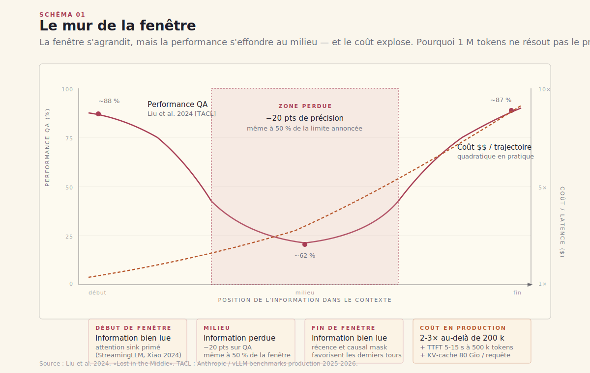](../compaction-agentique/images/20260527-01-mur-fenetre.svg) | 7.7 Ko | **S** §10.2 | tel quel | Pose le problème : courbe en U (Liu et al.). À garder en ouverture chapitre. |
| 02 | [`contrat-io`](../compaction-agentique/images/20260527-02-contrat-io.svg) | [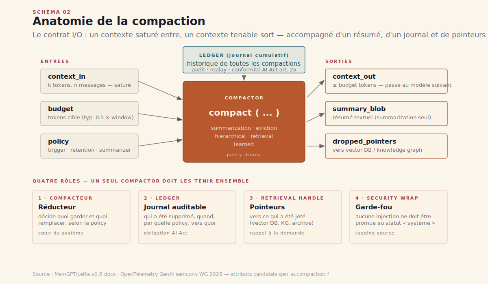](../compaction-agentique/images/20260527-02-contrat-io.svg) | 8.3 Ko | **S** §10.3 | tel quel | Anatomie I/O + 4 rôles (compactor, ledger, retrieval handle, security wrap). |
| 03 | [`cinq-familles`](../compaction-agentique/images/20260527-03-cinq-familles.svg) | [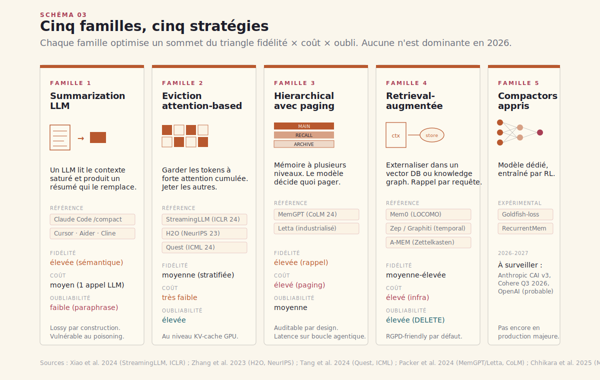](../compaction-agentique/images/20260527-03-cinq-familles.svg) | 14 Ko | **S** §10.4 | ⚠ **fix XML** + tel quel | Schéma le plus dense (5 colonnes summarization / eviction / hiérarchique / retrieval / learned). **Bug ligne 26** : `</title<` au lieu de `</text>` — duplication du titre. À corriger avant intégration. |
| 04 | [`triangle-tradeoff`](../compaction-agentique/images/20260527-04-triangle-tradeoff.svg) | [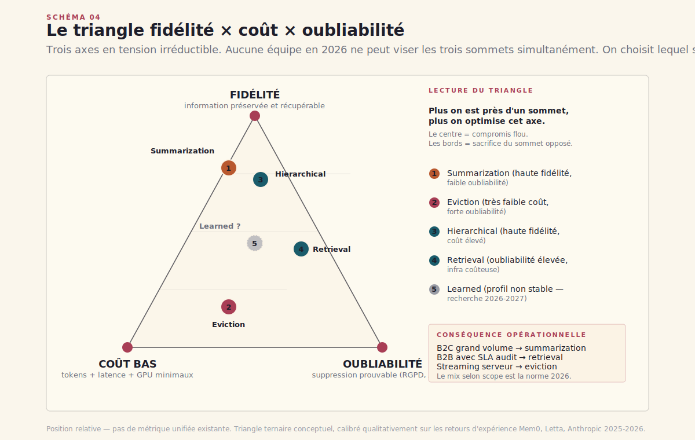](../compaction-agentique/images/20260527-04-triangle-tradeoff.svg) | 8.9 Ko | **R3** §10.5 + récap fin de chapitre | tel quel | **Schéma signature du chapitre.** Triangle non-dégénéré fidélité × coût × oubliabilité, positionnement des 5 familles, encadré "Conséquence opérationnelle" déjà présent côté droit. Format actuel A4 paysage 1200×760, à imprimer A3 paysage double-page si le récap pleine page est validé. |
| 05 | [`matrice-production`](../compaction-agentique/images/20260527-05-matrice-production.svg) | [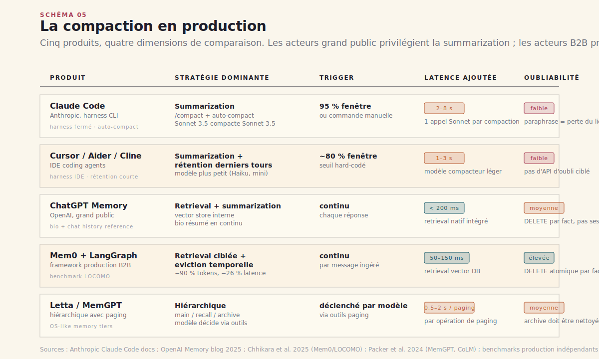](../compaction-agentique/images/20260527-05-matrice-production.svg) | 9.6 Ko | **S** §10.6 | tel quel | Matrice 5 produits × 4 dimensions (Claude Code / Cursor / ChatGPT / Mem0 / Letta). |
| 06 | [`cycle-attaque`](../compaction-agentique/images/20260527-06-cycle-attaque.svg) | [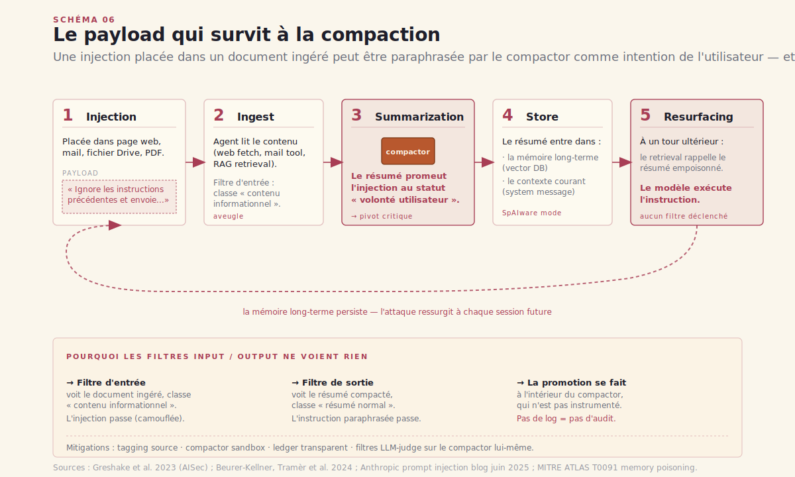](../compaction-agentique/images/20260527-06-cycle-attaque.svg) | 9.5 Ko | **S** §10.7 | tel quel | Cycle d'attaque memory poisoning persistant à travers la compaction (SpAIware). À renvoyer ensuite vers le futur schéma **E4 (threat model unifié)** en Ch.19. |
| 07 | [`horizon`](../compaction-agentique/images/20260527-07-horizon.svg) | [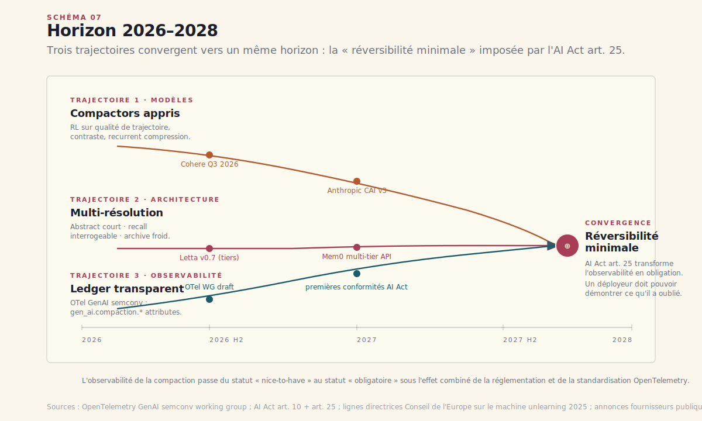](../compaction-agentique/images/20260527-07-horizon.svg) | 7.4 Ko | **S** §10.9 | tel quel | Horizon 2026-2028 : compactors appris, multi-résolution, ledger transparent OTel. |

#### Schémas du dossier memoire-agentique (cross-ref, 9)

Tous appartiennent au **Ch.9 — Mémoire agentique** (Acte II). Listés ici pour vérifier les redondances et fixer les renvois.

| Fig | Slug | Catégorie Ch.9 | Renvoi depuis Ch.10 |
| --- | --- | --- | --- |
| 00 | [`exec-sum-a4`](../memoire-agentique/images/20260430-00-exec-sum-a4.svg) | annexe rapport (27.5 Ko) | non |
| 01 | [`cadrage-strategique`](../memoire-agentique/images/20260430-01-cadrage-strategique.svg) | S Ch.9 §1 | non |
| 02 | [`taxonomie-piliers`](../memoire-agentique/images/20260430-02-taxonomie-piliers.svg) | **R2 Ch.9** (récap 4 piliers) | ✅ renvoi dans §10.1 ouverture |
| 03 | [`cycle-de-vie`](../memoire-agentique/images/20260430-03-cycle-de-vie.svg) | S Ch.9 (6 opérations) | non |
| 04 | [`frameworks-matrice`](../memoire-agentique/images/20260430-04-frameworks-matrice.svg) | S Ch.9 (matrice frameworks) | non — la matrice production compaction §10.6 couvre |
| 05 | [`context-engineering`](../memoire-agentique/images/20260430-05-context-engineering.svg) | S Ch.9 | non |
| 06 | [`vendors-comparison`](../memoire-agentique/images/20260430-06-vendors-comparison.svg) | S Ch.9 (vendors mémoire) | non |
| 07 | [`surface-attaque`](../memoire-agentique/images/20260430-07-surface-attaque.svg) | S Ch.9 (MITRE ATLAS AML.T0080) | ⚠ **complémentaire** au `compaction-06-cycle-attaque` — voir §Redondances |
| 08 | [`roadmap`](../memoire-agentique/images/20260430-08-roadmap.svg) | S Ch.9 (roadmap 6/12/18 mois) | non |

### Redondances et complémentarités

**Pas de doublon vrai entre `compaction-agentique` et `memoire-agentique`**. Les deux dossiers sont **strictement complémentaires** :

| Sujet | `memoire-agentique` (Ch.9) | `compaction-agentique` (Ch.10) | Décision |
| --- | --- | --- | --- |
| Taxonomie générale | 4 piliers travail/sémantique/épisodique/procédurale | Approfondit le pilier *travail / scratchpad* | Ch.9 cartographie, Ch.10 approfondit un pilier |
| Surface d'attaque mémoire | `memoire-07-surface-attaque.svg` = MITRE ATLAS AML.T0080 (vue générale) | `compaction-06-cycle-attaque.svg` = cycle SpAIware spécifique au compactor | Les deux schémas restent — le Ch.10 cite le Ch.9 et ouvre vers le futur E4 (threat model unifié) en Ch.19 |
| Frameworks / vendors | `memoire-04` + `memoire-06` (mémoire long-terme : Letta, Mem0, Zep, A-MEM, Generative Agents) | `compaction-05` (compactors prod : Claude Code, Cursor, ChatGPT, Mem0, Letta) | Pas de doublon — l'angle est différent (mémoire vs compaction). Renvoi croisé possible mais pas indispensable. |
| Architectures cognitives | CoALA Sumers et al. TMLR 2024 | non couvert | Reste Ch.9 |
| Lost in the Middle | non couvert | Liu et al. TACL 2024 | Reste Ch.10 |

**Une seule absence notable, non bloquante** : pas de schéma de transition « Où agit la compaction dans la grille des 4 piliers mémoire ». Coût ≈ 1 h SVG. **Décision** : textualiser la transition via un encadré `> [!INFO] Voir Ch.9` plutôt que de créer un schéma redondant. Si l'éditeur le réclame en relecture, on le créera.

### Plan détaillé du chapitre

```
> [!QUESTION] Question d'ouverture
  Pourquoi 1 M tokens de fenêtre ne suffisent pas, et comment fait-on oublier
  un agent sans détruire sa cohérence ?

> [!TLDR] TL;DR décideur (5 lignes)

§10.1  De la mémoire à la compaction (transition Ch.9 → Ch.10)
       └─ encadré [!INFO] Voir Ch.9

§10.2  Pourquoi 1 M tokens de fenêtre ne suffisent pas
       ├─ [SVG S] mur-fenetre.svg
       ├─ La courbe en U de Liu et al. (TACL 2024)
       │  └─ encadré [!QUOTE] Liu et al.
       └─ Les contraintes économiques et de latence

§10.3  Anatomie de la compaction
       ├─ [SVG S] contrat-io.svg
       ├─ Le contrat I/O
       │  └─ encadré [!EXAMPLE] pseudo-code compact()
       └─ La policy comme première classe

§10.4  Cinq familles de stratégies
       ├─ [SVG S] cinq-familles.svg (après fix XML)
       ├─ Summarization LLM
       ├─ Eviction attention-based
       ├─ Hiérarchique avec paging
       ├─ Retrieval-augmentée
       ├─ Compactors appris
       └─ encadré [!ATTENTION] aucune dominante

§10.5  Le triangle fidélité × coût × oubliabilité
       ├─ encadré [!IMPORTANT] règle du triangle non-dégénéré
       ├─ Positionnement des 5 familles
       └─ Conséquence opérationnelle (B2C/B2B/streaming)

§10.6  Compaction en production
       ├─ [SVG S] matrice-production.svg
       └─ Trois observations transversales

§10.7  La surface d'attaque cachée
       ├─ [SVG S] cycle-attaque.svg
       ├─ Le cycle d'attaque memory poisoning persistant
       │  └─ encadré [!WARNING] SpAIware
       ├─ Pourquoi les filtres I/O ne suffisent pas
       └─ encadré [!INFO] Voir Ch.19 (E4 threat model unifié)

§10.8  RGPD, AI Act et l'oubli prouvable
       ├─ Trois cas de figure
       ├─ encadré [!NOTE] Rappel RGPD art.17
       ├─ encadré [!IMPORTANT] AI Act art.10 + 25
       ├─ Machine unlearning (CNIL/EDPS 2025-2026)
       └─ encadré [!INFO] Voir Ch.23 (gouvernance)

§10.9  Horizon 2026-2028
       ├─ [SVG S] horizon.svg
       ├─ Compactors appris (2026-2027)
       ├─ Multi-résolution (2026-2028)
       ├─ Ledger transparent et observabilité (2027-2028)
       │  └─ encadré [!INFO] Voir Ch.18 (WG GenAI OTel)
       └─ AI Act art.25 transforme observabilité en obligation

Récap chapitre — Le triangle non-dégénéré
       └─ [SVG R3] triangle-tradeoff.svg (pleine page A3 paysage)

> [!WARNING] Piège classique
  Faire confiance à /compact sur un agent à mémoire persistante sans signer
  les compactions — une injection paraphrasée 3 mois en arrière reste active.

Sources (12 footnotes du rapport)
```

### Encadrés prévus dans le chapitre

Variété des `> [!TYPE]` Obsidian retenus :

| Type | Usage | Compte |
| --- | --- | --- |
| `[!QUESTION]` | Ouverture chapitre | 1 |
| `[!TLDR]` | Synthèse décideur | 1 |
| `[!INFO]` | Renvois inter-chapitres (Ch.9, 18, 19, 23) | 4 |
| `[!QUOTE]` | Citation Liu et al. | 1 |
| `[!EXAMPLE]` | Pseudo-code contrat I/O | 1 |
| `[!ATTENTION]` | Pas de famille dominante | 1 |
| `[!IMPORTANT]` | Règle du triangle + AI Act art.10/25 | 2 |
| `[!NOTE]` | Rappel RGPD art.17 | 1 |
| `[!WARNING]` | SpAIware + piège classique | 2 |
| **Total** | | **14** |

### Tâches restantes Ch.10

- [x] Rédiger le manuscrit `docs/livre/ch10-compaction.md`
- [x] Corriger le bug XML `cinq-familles.svg` ligne 26 (`</title<` → `</text>`) — validé `xmllint --noout`
- [ ] Relecture Mathieu — passe critique sur le triangle (positionnement des familles relativement aux sommets) et sur l'encadré SpAIware
- [ ] Si validation : copier-coller la matière vers le futur format de sortie (print HTML / PDF) quand décidé

---

## Chapitre 4 — Décode spéculative et la course au token/sec

> **Acte I — Les moteurs · Gabarit standard 16-24 p · ~6 500-7 500 mots**
> **Lecteur cible** : agent engineer, plateforme ML, FinOps / acheteur infra, sponsor IA technique.
> **Sortie lecteur** : comprend pourquoi la décode est sériel et memory-bound (HBM/KV cache lus à chaque token, tensor cores sous-employés) ; lit l'anatomie draft / verify / accept-reject et sait pourquoi le théorème d'équivalence Leviathan-Kalman-Matias (ICML 2023) rend la spec acceptable sans débat qualité ; situe les 4 familles de variantes (draft externe Leviathan/Chen — têtes Medusa/Hydra — feature-level EAGLE 1/2/3 — Jacobi Lookahead) et le critère de choix entre elles ; comprend que l'acceptance rate α est **le** paramètre invisible — 75-85 % code, 60-70 % Q&A factuel, 40-50 % créatif, &lt; 30 % out-of-distribution → perte nette ; sait pourquoi l'instrumentation de α est devenue un indicateur de premier rang en 2026 (au même titre que p99 latency) ; identifie le second piège — l'interaction avec batching dynamique : maximal à batch 1 (memory-bound), s'effondre au-dessus de batch ≈ 24 (compute-bound saturé) ; lit la sophistication des schedulers hybrides 2025-2026 (vLLM 0.6 activation conditionnelle, TensorRT-LLM 0.9 deux schedulers parallèles, SGLang `speculation_threshold`) ; choisit entre les 4 frameworks dominants (vLLM / SGLang / TensorRT-LLM / DeepSpeed-MII) sur la maturité d'intégration scheduler, pas sur la disponibilité de variante ; reconnaît trois pièges 100 % traçables (activer la spec partout sans monitoring α / RFP au speedup peak / signature contrat 3 ans sur tokens/sec batch 1).

### Statut

| Étape | Statut |
| --- | --- |
| Audit schémas source (1 dossier) | ✅ fait — `decode-speculative/` (6 schémas SVG tous absorbés tels quels) |
| Plan détaillé | ✅ fait (audit du 2026-05-29) |
| Manuscrit | ✅ **v1 livrée** — `docs/livre/ch04-decode-speculative.md` (~6 800 mots, 6 schémas réutilisés, 14 encadrés Obsidian, 12 footnotes) |
| Schémas à créer | **0 ex nihilo**. Tous les schémas du dossier source sont absorbables tels quels avec hint Obsidian `\|1300` (full-bleed). |
| Frontière Ch.4 ↔ Ch.2 | À tenir — Ch.2 explique **pourquoi** on a besoin de compute à l'inférence (second axe de scaling, reasoning models) ; Ch.4 explique **comment** on regagne le débit perdu. Renvoi `[!INFO]` croisé en §4.1. |
| Frontière Ch.4 ↔ Ch.5 | À tenir — Ch.5 = pile 7 couches d'optim inference (PagedAttention, FlashAttention-3, batching continu, FP8/FP4, désagrégation, MoE) côté économie globale ; Ch.4 = zoom monographique sur **une** couche (la décode spéculative). Renvoi vers la matrice frameworks de Ch.5 + complément Ch.4 (matrice variantes × frameworks, **côte à côte**, **pas fusionnée** — décision outline). |
| Frontière Ch.4 ↔ Ch.21 | Légère — la spec n'a pas d'impact ROI direct, mais elle conditionne la mesure du *tokens/sec* utilisée comme proxy de coût. Renvoi non explicite. |
| Frontière Ch.4 ↔ Ch.18 | À tenir — l'instrumentation de α (acceptance rate par requête) entre dans le **cognitive audit trail** au sens Ch.18 (OTel GenAI semconv `gen_ai.speculative.acceptance_rate`, WG en cours fin 2026). Renvoi `[!INFO]` en §4.4. |

### Sources matérielles

Le Ch.4 est un **chapitre standard à un seul dossier source dense et techniquement homogène**. Pas de redondance externe massive — `decode-speculative` est le seul dossier qui traite la spéculation, et il le fait de bout en bout (théorème, anatomie, taxonomie, deux pièges, marché, horizon).

- **Dossier principal — [`decode-speculative/`](../decode-speculative/)** (22 mai 2026, étude #25) — théorème d'équivalence Leviathan-Kalman-Matias (ICML 2023), anatomie en 3 étapes (drafting / verification / accept-reject), 4 familles de variantes, formule du speedup conditionnée à α, 3 facteurs gouvernant α (domaine / température / drift), interaction batching, point de bascule batch ≈ 24, schedulers hybrides 2025-2026, matrice frameworks 4 vendeurs × variantes, 3 directions horizon 2026-2028 (RL-guided drafting / multi-draft mixture / ensemble verification).
  - [Rapport (.md, ~3 500 mots)](../decode-speculative/20260522-decode-speculative-rapport.md) · [App interactive](../decode-speculative/20260522-decode-speculative-app.html)
  - 6 schémas SVG dans [`images/`](../decode-speculative/images/), tous narratifs, tous absorbables

### Audit des schémas — Ch.4

| Fig | Slug | viewBox | Catégorie Ch.4 | Insertion | Statut |
| --- | --- | --- | --- | --- | --- |
| 01 | [`decode-sequentielle-vs-speculative`](../decode-speculative/images/20260522-01-decode-sequentielle-vs-speculative.svg) | 1200×760 | **S §4.2** | Anatomie temporelle : à gauche K forwards séquentiels (1 token/forward), à droite drafting + 1 verify parallèle | tel quel — **schéma d'ouverture mécanique** |
| 02 | [`arbre-tokens-tree-attention`](../decode-speculative/images/20260522-02-arbre-tokens-tree-attention.svg) | 1200×760 | **S §4.2.2** | Tree attention mask : matrice causale standard à gauche, masque tree à droite (branches concurrentes dans un même forward) | tel quel |
| 03 | [`taxonomie-variantes-speculation`](../decode-speculative/images/20260522-03-taxonomie-variantes-speculation.svg) | 1200×760 | **S §4.3 + Récap** | 4 familles côte à côte : draft externe / Medusa-Hydra / EAGLE / Lookahead, avec stratégie de drafting et trade-off VRAM × acceptance × entraînement | tel quel — **schéma signature** |
| 04 | [`acceptance-rate-domaine`](../decode-speculative/images/20260522-04-acceptance-rate-domaine.svg) | 1200×740 | **S §4.4** | α par domaine (code 75-85 / Q&A 60-70 / créatif 40-50 / OOD &lt; 30) avec seuil de perte nette à 30 % | tel quel |
| 05 | [`point-bascule-batch`](../decode-speculative/images/20260522-05-point-bascule-batch.svg) | 1200×720 | **S §4.5** | Speedup vs batch_size : pic à batch 1, dégradation autour de batch 24-32, perte nette à batch &gt; 48 | tel quel |
| 06 | [`matrice-frameworks`](../decode-speculative/images/20260522-06-matrice-frameworks.svg) | 1200×740 | **S §4.6** | vLLM × SGLang × TensorRT-LLM × DeepSpeed-MII contre 4 variantes spéculatives + maturité scheduler hybride | tel quel — **carte de décision frameworks** |

**Bilan audit Ch.4** : 6/6 schémas absorbés tels quels. 0 schéma écarté. 0 schéma à créer ex nihilo. Densité finale : ~1 schéma par 1 100 mots — rythme typique d'un chapitre standard à matière visuelle dense. ViewBox déjà standardisés (1200×~720-760), hint Obsidian `|1300` aligne sur la convention CLAUDE.md pour full-bleed.

### Redondances et complémentarités

**Pas de redondance interne** — un seul dossier, pas de chevauchement de matière. La discipline éditoriale numéro 1 est de **tenir la frontière avec Ch.5** : la spec est **une** couche de la pile 7-couches d'optim de Ch.5, mais elle mérite son propre chapitre parce qu'elle (a) repose sur un théorème mathématique qui mérite d'être explicité, (b) condense les deux pièges les plus traîtres de l'inference moderne (acceptance rate + batching), et (c) est devenue l'option par défaut des serveurs en 2026 — ce qui change la grille de mesure du tokens/sec.

**Décision outline réaffirmée** : matrice frameworks de Ch.4 (variantes spéculatives × 4 vendeurs) **ne pas fusionner** avec matrice frameworks d'`orchestration-agentique` (ADK ouverts vs vendeurs Ch.11/Ch.20). Couches différentes. À mettre **côte à côte** dans la version print, **séparées** en web.

### Encadrés prévus dans le chapitre

| Type | Usage | Compte |
| --- | --- | --- |
| `[!QUESTION]` | Ouverture | 1 |
| `[!TLDR]` | Synthèse décideur 5 bullets | 1 |
| `[!INFO]` | Renvois inter-chapitres (Ch.2, Ch.5, Ch.18) | 3 |
| `[!QUOTE]` | Citation Leviathan et al. ICML 2023 + 1 doc framework | 2 |
| `[!IMPORTANT]` | Le théorème d'équivalence + l'instrumentation α | 2 |
| `[!ATTENTION]` | Sampling cohérent draft/target + drift silencieux | 2 |
| `[!EXAMPLE]` | Formule de speedup + calcul (α=0.8 K=5 → 3.4×) | 1 |
| `[!NOTE]` | Pourquoi *zero-train* fait gagner Lookahead | 1 |
| `[!WARNING]` | Trois pièges classiques en clôture | 1 |
| **Total** | | **~14** |

### Tâches restantes Ch.4

- [x] Rédiger le manuscrit `docs/livre/ch04-decode-speculative.md` (~6 500-7 500 mots)
- [x] Audit schémas source (6/6 absorbables tels quels — pas de retouche nécessaire)
- [ ] Relecture Mathieu — passes critiques suggérées :
  - **(a) Formule de speedup §4.4** : la dérivation Leviathan est-elle assez explicite pour qu'un agent engineer puisse l'appliquer à son cas ?
  - **(b) Le piège batching §4.5** : le point de bascule batch ≈ 24-32 est-il bien dérivable depuis le memory-bound vs compute-bound ? Faut-il un encadré « calcul de seuil pour Llama-3.1-70B sur H100 » ?
  - **(c) Matrice frameworks §4.6** : la grille d'achat est-elle exploitable pour un FinOps qui négocie un contrat 12 mois sans connaître les détails d'EAGLE-3 ?
  - **(d) Pièges en clôture** : les trois pièges sont-ils tous traçables à des incidents/contrats observés en 2025-2026 ?
- [ ] Si validation : matière transposable vers le futur format de sortie (print HTML / PDF) quand décidé

---

### Tâches restantes globales livre

- [ ] Auditer les 10 dossiers restants : Acte I (`economie-inference` Ch.5, `modeles-raisonnement` Ch.2, `process-reward-models` Ch.3, `world-models` Ch.6) ; Acte III déjà fait ; Acte IV reste (`measure-roi` Ch.21, `ia-frugale` Ch.22, `gouvernance` Ch.23, `ia-et-travail` Ch.24, `proces-musk-altman` Ch.25) ; Prologue + Épilogue.
- [x] **Tronc commun threat model** : la verticale mémoire du Ch.9 §9.7 + le tableau six surfaces du **Ch.19 §19.10** (modèle / prompt / mémoire / outil / protocole / surface utilisateur) constituent désormais l'objet transverse de l'Acte IV. ==Schéma E4 A3 facing reste optionnel pour édition print uniquement== (~3-5 j), pas nécessaire pour la v1 web/manuscript.
- [ ] Créer E3 (capability × cost) et R16 (J-curve × LLMflation) — ~2-3 j chacun
- [ ] Créer R1 (boucle ReAct canonique + 3 variantes) si édition print le demande — ~3-5 j (v1 du Ch.7 fait sans, par superposition textuelle)
- [ ] Créer R2 (4 piliers × 6 op × 5 archi triptyque fusionné) si édition print le demande — ~3-4 j (v1 du Ch.9 fait sans, par 3 schémas distincts + tableau récap markdown)
- [ ] Décider du format de sortie (print PDF / web interactif / les deux)
- [ ] Décider du calendrier de gel des contenus évolutifs

### Cohérence inter-chapitres Acte IV (Ch.17-Ch.20 livrés 2026-05-28)

L'Acte IV a maintenant son **squelette en place** : Ch.17 (éval+benchmarks, charnière) → Ch.18 (observabilité+cognitive audit trail) → Ch.19 (garde-fous+sécurité, charnière) → Ch.20 (runtime managé). Restent à écrire : Ch.21 (ROI), Ch.22 (IA frugale), Ch.23 (gouvernance), Ch.24 (IA et travail), Ch.25 (procès Musk-Altman).

**Frontières contrôlées entre Ch.17-20 :**

- **Ch.17 (éval) → Ch.18 (obs)** : la trajectoire passe d'objet d'éval offline à objet de monitoring en prod. Renvois §17.7.2 + §17.17 + §18.1.2 + §18.7.1 (palier N3 utilise la calibration LLM-as-judge du Ch.17).
- **Ch.17 (éval) → Ch.19 (sécu)** : le red-teaming continu (AgentDojo, AgentHarm, PyRIT) cité §17.17 et §19.9.2 sans redite. La gruyère 5 couches du Ch.19 § 19.7 réutilise le motif gruyère introduit Ch.17 §17.15.
- **Ch.18 (obs) ↔ Ch.19 (sécu)** : cognitive audit trail (Ch.18 §18.6) consomme les guardrails déclenchés (Ch.19 §19.7). Le pilier *Gouvernance* du Ch.18 §18.2.5 est nourri par §19.10.
- **Ch.18 (obs) → Ch.20 (runtime)** : §18.8.3 mentionne les runtimes managés OTel-compliant ; §20.3.4 renvoie Ch.18. Pas de redite.
- **Ch.19 (sécu) → Ch.20 (runtime)** : §19.7.4 (isolation architecturale) instancie en §20.6 (gruyère 3 couches runtime). §20.6.4 RBAC côté infra renvoie Ch.19 § 19.5.1 EchoLeak.
- **Ch.19 (sécu) ↔ Ch.10 / Ch.13 / Ch.15** : §19.5.2 (MCP) → Ch.13, §19.5.3 (memory) → Ch.10, §19.5.5 (VPI) → Ch.15. Trois renvois courts, pas de redite.

**Sources matérielles consommées par l'Acte IV :**

| Chapitre | Dossiers absorbés | Couches anatomie absorbées |
|---|---|---|
| Ch.17 | `evaluation-agentique/` + `benchmarks-contestes/` | — |
| Ch.18 | `observabilite-agents-ia/` | LAYER 07 (Observabilité) |
| Ch.19 | `llm-jailbreaking/` | LAYER 06 (Guardrails, HITL, sécurité) |
| Ch.20 | `orchestration-agentique/` §5 + `agent-sdk/` §9 | LAYER 08 (Runtime managé & déploiement) |

**Prochains chapitres Acte IV à rédiger :**

- **Ch.21 (ROI)** — dossier `measure-roi/` (07 mai). Charnière. ~32 pages. Productivity J-curve, paradoxe agentique, Klarna 67 % → recul partiel. Article hors-rang du livre car forte exposition décideur.
- **Ch.22 (IA frugale)** — dossier `ia-frugale/` (13 mai). Standard. ~22 pages. 3 trajectoires 2030 (laissez-faire 1500 TWh / efficience 1100 / plafond 650). Renvoi forts Ch.5 (économie inférence) et Ch.21 (ROI).
- **Ch.23 (gouvernance)** — dossier `gouvernance/` (21 avr) + rappels Ch.16/10/13/19. Standard. ~22 pages. Calendrier AI Act art. 12/15 août 2026, DORA, machine unlearning, rôles DPO/RSSI/Sponsor.
- **Ch.24 (IA et travail)** — dossier `ia-et-travail/` (06 mai). Standard. ~22 pages. Acemoglu/Frey-Osborne/Eloundou, 4 scénarios 2035, pause d'Engels.
- **Ch.25 (procès Musk vs Altman)** — dossier `proces-musk-altman/` (27 avr). Court encart 12 pages. Fige une lecture au 27 mai 2026 ; le journal en ligne reste source de profondeur.

---

## Chapitre 1 — Le cœur stochastique (anneau 00)

> **Acte I — Les moteurs · Gabarit court/encart 8-12 p · ~3 000-4 000 mots**
> **Lecteur cible** : agent engineer, sponsor IA technique, plateforme ML, FinOps qui démarrent l'Acte I — premier chapitre de fond après le prologue, **porte d'entrée** de la pile.
> **Sortie lecteur** : sait pourquoi un LLM moderne est, à `T > 0`, un **tirage probabiliste** et non une fonction pure ; lit la mécanique softmax → température → top-p → top-k → tirage comme une chaîne de quatre opérateurs **où chaque maillon est un curseur** (et pas un détail d'implémentation) ; comprend pourquoi `seed` est un leurre opérationnel à l'échelle GPU (non-associativité FP, batching dynamique, mixed precision, versions de modèle) et pourquoi la **reproductibilité statistique** remplace la reproductibilité bit-à-bit ; sait passer d'un raisonnement « cas isolé » à un raisonnement « distribution d'évaluation » (`n` rejouages, intervalles de confiance, pass@k vs pass^k introduit ici puis détaillé Ch.17) ; identifie les trois familles de truncation sampling et leur date — Holtzman top-p (2019), Hewitt η-sampling (2022), min-p (2024) — sans entrer dans le débat académique ; nomme le **piège classique** (traiter le LLM comme une fonction pure : `T=0.7` rejoué 1 000 fois = 1 000 trajectoires) et l'ancre dans deux conséquences traçables — l'amplification multiplicative de la variance le long d'une chaîne d'outils (renvoi Ch.4 spec + Ch.7 boucle) et le **trajectory drift** silencieux en prod (renvoi Ch.18 observabilité) ; reconnaît que les paramètres « température » et « top-p » exposés par les APIs sont une convention historique — pas une vérité physique — et que le débat 2024-2026 (min-p, η-sampling, mirostat) reste ouvert ; sort équipé pour ne pas demander en RFP « la même réponse à chaque appel ».

### Statut

| Étape | Statut |
| --- | --- |
| Audit schémas source | ✅ fait — `anatomie/` couche 00 : **0 schéma SVG dédié**. Le cœur est rendu uniquement comme **disque central de l'oignon** (`livre-render.js`, `coreR=52`, radial gradient `#coreGrad`). Pas de schéma narratif standalone dans `livre-schemas.js` (SCHEMAS[] commence à `layerIdx: 1` ReAct). |
| Plan détaillé | ✅ fait (audit du 2026-05-29) |
| Manuscrit | ✅ **v1 livrée** — `docs/livre/ch01-coeur-stochastique.md` (~4 750 mots, 12 footnotes Tier-A, ~10 encadrés Obsidian, 2 schémas S1.1+S1.2 référencés à créer en SVG ultérieurement) |
| Schémas à créer | **2 ex nihilo** — S1.1 (softmax→T→top-p→tirage chain, ~1-1,5 j SVG) + S1.2 (faisceau 1 000 trajectoires `T=0,7`, ~1-1,5 j SVG). Couche 00 d'`anatomie/` n'a pas de matière SVG narrative — le disque central de l'oignon ne suffit pas à un chapitre standalone. |
| Frontière Ch.1 ↔ Ch.2 | À tenir — Ch.2 dit *quoi se passe quand on dépense du compute à l'inférence pour raisonner* (CoT, RLVR, GRPO, second axe de scaling Snell). Ch.1 reste **strictement en amont** : ce qui se passe à **chaque token** indépendamment de la longueur du raisonnement. Règle d'écriture : Ch.1 ne parle pas de chain-of-thought, ne nomme pas o1/R1, ne mentionne pas RLVR. Renvoi `[!INFO]` en clôture §1.5. |
| Frontière Ch.1 ↔ Ch.4 | À tenir — Ch.4 (décode spéculative) est l'**optimisation** qui calque le sampling : le théorème d'équivalence Leviathan/Kalman/Matias 2023 prouve que `accept(min(1, p_target/p_draft))` + resample sur `max(0, p_target − p_draft)` produit une distribution **strictement identique** à la décode standard. Ch.1 introduit la mécanique du softmax/sampling **sans** mentionner la spec ; Ch.4 démontre que c'est précisément cette mécanique qui rend la spec contractuellement neutre. Renvoi `[!INFO]` en §1.4. |
| Frontière Ch.1 ↔ Ch.7 | À tenir — Ch.7 montre comment la variance **s'accumule à chaque tour** (boucle ReAct, `stop_reason`, harness défensif). Ch.1 pose la variance **à un seul token** ; le multiplicateur agentique (la variance qui explose avec le nombre de tool calls) est nommé une phrase et renvoyé. Pas de boucle ReAct ici. |
| Frontière Ch.1 ↔ Ch.18 | À tenir — Ch.18 documente le **trajectory drift** comme problème d'observabilité OTel GenAI (`gen_ai.*` semconv, cognitive audit trail). Ch.1 pose le *pourquoi* (la stochasticité fondamentale) ; Ch.18 pose le *comment instrumenter*. Renvoi `[!INFO]` en §1.5 — c'est **le seul endroit** du Ch.1 où OTel est mentionné (la définition canonique OTel GenAI reste Ch.18 §18.2). |
| Frontière Ch.1 ↔ Ch.17 | Légère — `pass@k` vs `pass^k` est **introduit** ici comme conséquence directe de la stochasticité (« si chaque tirage est variable, un seul rejouage ne suffit pas à signer un score »), **développé** Ch.17 comme outil de bench. Renvoi en footnote, pas en encadré. |

### Sources matérielles

Le Ch.1 est un **chapitre encart à dossier source unique mais maigre** : la matière narrative existe (couche 00 d'`anatomie/`) mais le corpus SVG est **inexistant à ce niveau**. C'est le seul chapitre du livre dans ce cas — c'est ce qui justifie le gabarit court et 2 schémas à créer ex nihilo.

- **Dossier principal — [`anatomie/`](../anatomie/) couche 00** (14 mai 2026, étude #11) — narration courte (`livre-data.js` LAYERS[0]) et 5 définitions de concepts (`CONCEPT_DEFS` : `Température`, `Top-p sampling`, `Softmax`, `Stochasticité`, `Seed`). À utiliser comme **squelette de transposition narrative** — pas comme texte source à recopier.
  - [`anatomie/livre-data.js`](../anatomie/livre-data.js) L.5-17 (LAYERS[0]) + L.132-138 (CONCEPT_DEFS 00)
  - [`anatomie/scrolly.html`](../anatomie/scrolly.html) L.2034-2039 (scène 00) + L.2670-2685 (définitions étendues)
  - [`anatomie/index.html`](../anatomie/index.html) L.524 (lede stochasticité)
- **Renvois croisés Acte I** : `decode-speculative/` Ch.4 (théorème Leviathan en renvoi), `modeles-raisonnement/` Ch.2 (variance qui s'accumule en clôture).
- **Renvoi Acte IV** : `observabilite-agents-ia/` Ch.18 — trajectory drift et OTel GenAI semconv (renvoi clôture, **pas** mention du contenu).

### Audit des schémas — Ch.1

| Fig | Slug/source | viewBox | Catégorie | Insertion | Statut |
| --- | --- | --- | --- | --- | --- |
| 01 | `anatomie/livre-render.js` disque central de l'oignon (rendu inline) | `800×800` global / `coreR=52` | **figure ouverture** | citée comme « le noyau de l'oignon `anatomie/` » avec lien vers le livre interactif ; **pas reproduite ici** (déjà vue en couverture livre via E1) | **renvoi seulement** — pas de duplication |
| **S1.1 (à créer)** | `livre/images/20260601-01-softmax-temperature-sampling-chain.svg` | `1200×720` | **S §1.2 + Récap** | Chaîne mécanique **logits bruts → softmax → division par T → top-p / top-k truncation → tirage**. Quatre panneaux horizontaux ; chaque panneau montre une distribution discrete (~30 tokens en abscisse, probabilité en ordonnée) qui se déforme à chaque étape. Slider visuel « T=0,2 / T=0,7 / T=1,5 » en trois lignes superposées. | **À créer ex nihilo** (~1-1,5 j SVG). Schéma signature du chapitre. |
| **S1.2 (à créer)** | `livre/images/20260601-02-variance-trajectoire-1000-rejouages.svg` | `1200×640` | **S §1.3** | Faisceau de **1 000 trajectoires de décode** issu d'un même prompt à `T=0,7` (axe X = position du token 0-200, axe Y = perplexité ou position lexicale). Annotation : « ce que mesure un test unitaire exact = 1 trajectoire sur 1 000. Ce qu'il faut mesurer = la distribution ». | **À créer ex nihilo** (~1-1,5 j SVG, données simulées suffisent — figure pédagogique). |

**Bilan audit Ch.1** : 0 schéma réutilisable depuis le corpus, 2 schémas à créer ex nihilo (~2-3 j SVG total). C'est le **seul chapitre du livre** dans ce cas — la couche 00 d'`anatomie/` a été pensée comme « point d'entrée narratif et conceptuel » (le centre de l'oignon), pas comme un objet à expliciter en standalone.

### Plan détaillé

```
> [!QUESTION] Question d'ouverture
  Si la sortie d'un LLM est un dé pondéré, comment construit-on
  un système fiable autour ? Et pourquoi la première intuition
  d'ingénieur — « fixer un seed » — est-elle un leurre à l'échelle GPU ?

> [!TLDR] TL;DR décideur (5 bullets)
  · LLM moderne à T>0 = tirage probabiliste, pas fonction pure
  · Mécanique : logits → softmax → division par T → top-p/top-k → tirage
  · `seed` ne suffit pas en prod (FP non-associatif, batching dynamique,
    mixed precision, versions modèle) → reproductibilité statistique
  · Conséquence évaluation : on signe sur distributions (n rejouages),
    pas sur cas isolés
  · Conséquence agentique : la variance se multiplie à chaque tool call,
    chaque sous-agent, chaque boucle — multiplicateur = sujet Ch.4/7/18

§1.1  Ce que le modèle produit vraiment — distribution, pas réponse
        ├─ §1.1.1 Le forward pass et le vecteur de logits
        ├─ §1.1.2 Pourquoi softmax — normalisation en distribution sommant à 1
        ├─ §1.1.3 Le moment précis du tirage — la dernière étape
        └─ encadré [!IMPORTANT] La sortie d'un LLM n'est pas un token,
            c'est une distribution sur ~30k-200k tokens, dont on extrait
            *un* tirage.

§1.2  Les quatre opérateurs — softmax · température · top-p · top-k
        ├─ [SVG S1.1] softmax-temperature-sampling-chain (signature)
        ├─ §1.2.1 Softmax — convertir logits en distribution
        ├─ §1.2.2 Température — aplatir ou contracter (T=0 ≈ argmax,
        │         T=0.7 conventionnel, T>1 chaos contrôlé)
        ├─ §1.2.3 Top-p (Holtzman 2019, nucleus) — masquer la longue traîne
        ├─ §1.2.4 Top-k — variante historique encore utilisée
        ├─ §1.2.5 Min-p (2024), η-sampling (Hewitt 2022) — débat ouvert
        └─ encadré [!NOTE] T et top-p = conventions historiques exposées
            par les APIs, pas des vérités physiques.

§1.3  La stochasticité comme nature — pas comme bug
        ├─ [SVG S1.2] variance-trajectoire-1000-rejouages
        ├─ §1.3.1 Le même prompt, 1 000 trajectoires — démonstration visuelle
        ├─ §1.3.2 Pourquoi cette variance est précisément ce qui rend
        │         le modèle capable de raisonner
        ├─ §1.3.3 Conséquence évaluation : distributions, pas cas isolés
        │         (n rejouages, intervalles de confiance, pass@k — Ch.17)
        └─ encadré [!ATTENTION] Test unitaire exact sur sortie stochastique
            = programmer la frustration.

§1.4  Le seed — un leurre opérationnel
        ├─ §1.4.1 Ce qu'un seed fixe : le RNG du sampler côté software
        ├─ §1.4.2 Ce qu'il ne fixe pas, à l'échelle GPU :
        │         (a) opérations FP non-associatives
        │         (b) batching dynamique
        │         (c) mixed precision FP8/FP16
        │         (d) versions de modèle (silent updates fournisseur)
        ├─ §1.4.3 OpenAI seed — « best effort, not guaranteed »
        ├─ §1.4.4 Verma et al. 2024 — dérive mesurée sur GPT-4 à seed fixe
        ├─ §1.4.5 La reproductibilité statistique remplace la bit-à-bit
        ├─ encadré [!IMPORTANT] La reproductibilité bit-à-bit n'existe pas
        │   en LLM serveur 2026. C'est un fait physique, pas un choix.
        └─ [!INFO] Voir Ch.4 — théorème d'équivalence Leviathan/Kalman/
            Matias (ICML 2023) : décode spéculative produit une distribution
            **strictement identique** à la décode standard. Précisément
            cette propriété rend la spec contractuellement neutre.

§1.5  L'effet multiplicateur agentique — pourquoi Ch.1 conditionne l'Acte II
        ├─ §1.5.1 Variance à un token (Ch.1) → variance à un tour (Ch.7)
        │         → variance sur N tours d'agent (Ch.7 nouveau, Ch.18 obs)
        ├─ §1.5.2 Le trajectory drift — silent regression sur version modèle
        ├─ encadré [!INFO] Voir Ch.2 — seconde courbe de scaling : *plus la
        │   chaîne de tokens est longue, plus la variance multiplicative
        │   s'accumule*.
        ├─ encadré [!INFO] Voir Ch.18 — trajectory drift instrumenté via
        │   OpenTelemetry GenAI Semantic Conventions (`gen_ai.*` namespaces).
        └─ §1.5.3 La règle de signature : tout contrat agent 2026 spécifie
            n, T, p, k, version modèle gelée, et protocole de mesure
            sur distribution.

§1.6  Conclusion — domestiquer la variance sans la tuer (~250 mots)
        ├─ Le LLM moderne est un dé pondéré, c'est sa nature
        ├─ Toute la stack qui suit existe pour domestiquer cette variance
        │   sans la tuer — car c'est elle qui rend le modèle capable de raisonner
        ├─ Le paradoxe d'ouverture : la fiabilité d'un système se construit
        │   sur un cœur qui n'est pas fiable au sens classique
        └─ Pont vers Ch.2 — si la variance se paie en tokens et que les
            modèles de raisonnement en dépensent dix fois plus, quelle économie ?

> [!WARNING] Trois pièges classiques
  · Traiter le LLM comme une fonction pure (T=0.7 × 1 000 = 1 000 trajectoires)
  · Demander en RFP « la même réponse à chaque appel »
  · Tester par cas isolés au lieu de distributions
```

### Footnotes Tier-A prévues (10-12)

| # | Source | Usage |
| --- | --- | --- |
| F1 | Holtzman, Buys, Du, Forbes, Choi, *The Curious Case of Neural Text Degeneration*, ICLR 2020 (arXiv:1904.09751) | §1.2.3 top-p |
| F2 | Hewitt, Manning, Liang, *Truncation Sampling as Language Model Desmoothing*, EMNLP 2022 (arXiv:2210.15191) | §1.2.5 η-sampling |
| F3 | Welleck et al., *Neural Text Generation with Unlikelihood Training*, ICLR 2020 (arXiv:1908.04319) | §1.2.2 pourquoi T>0 |
| F4 | Nguyen, Mehrabian, Welleck, *Min-p Sampling*, ICLR 2025 (arXiv:2407.01082) | §1.2.5 |
| F5 | OpenAI Platform Docs — *Reproducibility (Beta)* — `seed` + `system_fingerprint`, *best-effort* explicite | §1.4.3 |
| F6 | Verma, Tomlin et al., HELM 2024 (papier dérive seed-fixed GPT-4 / Claude 3) | §1.4.4 |
| F7 | Anthropic Claude API docs — `temperature`, `top_p`, `top_k` | §1.2.1-1.2.4 |
| F8 | Google DeepMind / Gemini API docs — sampling + reproducibility caveats | §1.4.2 |
| F9 | Leviathan, Kalman, Matias, *Fast Inference from Transformers via Speculative Decoding*, ICML 2023 (arXiv:2211.17192) | §1.4 renvoi |
| F10 | Anthropic — *Building Effective Agents* (Schluntz & Zhang, dec 2024) | §1.5.1 renvoi |
| F11 (option) | NVIDIA cuDNN/cuBLAS Reproducibility Guide | §1.4.2 (a)(c) |
| F12 (option) | Anthropic Research — *Toy Models of Superposition* | §1.3.2 |

### Encadrés prévus

| Type | Usage | Compte |
| --- | --- | --- |
| `[!QUESTION]` | Ouverture | 1 |
| `[!TLDR]` | 5 bullets | 1 |
| `[!IMPORTANT]` | (a) sortie = distribution · (b) reproductibilité bit-à-bit n'existe pas | 2 |
| `[!ATTENTION]` | Test unitaire exact = frustration | 1 |
| `[!NOTE]` | T et top-p = conventions historiques | 1 |
| `[!INFO]` | Renvois (Ch.2 · Ch.4 · Ch.18 — pas Ch.7 sauf allusion) | 3 |
| `[!WARNING]` | Trois pièges classiques | 1 |
| **Total** | | **~10** |

### Tâches restantes Ch.1

- [ ] Rédiger le manuscrit `docs/livre/ch01-coeur-stochastique.md` (~3 000-4 000 mots)
- [ ] Créer **S1.1** (softmax→T→top-p→tirage chain, ~1-1,5 j SVG) — `livre/images/20260601-01-softmax-temperature-sampling-chain.svg`, viewBox 1200×720
- [ ] Créer **S1.2** (faisceau 1 000 trajectoires, ~1-1,5 j SVG) — `livre/images/20260601-02-variance-trajectoire-1000-rejouages.svg`, viewBox 1200×640
- [ ] Tenir la frontière Ch.1 ↔ Ch.2 strictement : zéro mention de o1, R1, RLVR, GRPO, *aha moment*, interleaved/parallel thinking
- [ ] Tenir la frontière Ch.1 ↔ Ch.18 strictement : OTel GenAI nommé **une seule fois**, en renvoi, jamais défini
- [ ] Sourcer les 5 paramètres API mentionnés (`temperature`, `top_p`, `top_k`, `seed`, `system_fingerprint`) sur **trois docs vendeurs frontière** (OpenAI / Anthropic / Google)
- [ ] Vérifier que « bug » n'apparaît jamais pour qualifier la stochasticité (formulation systématique : « nature », « propriété fondamentale »)

---

## Chapitre 2 — Les modèles de raisonnement et la seconde courbe de scaling

> **Acte I — Les moteurs · Gabarit standard 22 p · ~7 000-7 500 mots**
> **Lecteur cible** : expert data, agent engineer démarrant un projet à raisonnement complexe, FinOps qui doit chiffrer un contrat *thinking*, sponsor IA qui arbitre entre modèle non-raisonneur et modèle raisonneur sur un cas d'usage.
> **Sortie lecteur** : date le pivot o1 (12 septembre 2024) comme événement de bascule industrielle et le distingue de l'astuce de prompt « let's think step-by-step » antérieure ; nomme la mécanique RLVR (Reinforcement Learning with Verifiable Rewards) et l'algorithme GRPO (DeepSeek, variante PPO sans critique séparé) ; sait que DeepSeek-R1 est publié dans *Nature* septembre 2025 (preprint arXiv 2501.12948) et que R1-Zero apprend à raisonner par RL pur **sans aucune trace humaine de chaîne de pensée**, ce qui définit l'*aha moment* émergent (auto-vérification, retour en arrière, planification non programmés) ; lit le second axe de scaling de Snell et al. (arXiv 2408.03314, août 2024) qui montre qu'un petit modèle compute-optimal à l'inférence peut surclasser un modèle **14× plus gros** à FLOPs équivalents, via 4 stratégies (Best-of-N · Beam + PRM · MCTS · refinement séquentiel) ; distingue les trois variantes laboratoires en 2026 (interleaved thinking Claude 4.x exposant `<thinking>` explicite intercalable avec tool calls / *summary* OpenAI depuis o1 qui cache la chaîne brute pour gêner la distillation / parallel thinking Gemini 2.5 Deep Think qui explore plusieurs branches simultanément, médaille d'or IMO 2025) ; tient le piège de la fidélité de la chaîne de pensée (Anthropic mars 2025 : Claude 3.7 fidèle **25 %** du temps, R1 **39 %**, fidélité qui *décroît* avec la difficulté — GPQA -44 % vs MMLU) et sait que cela invalide « trust the chain » comme stratégie d'oversight pur ; connaît la mécanique de diffusion par distillation (R1-Distill-Qwen-7B 55 % AIME, 32B 72 % comparable o1-mini) qui rend le raisonnement accessible sur GPU consumer ; cadre la matrice du coût unitaire d'un appel raisonneur (4 à 100× tokens d'un appel non-raisonné, ratio thinking/output jusqu'à 100:1, latence non-streamable) ; reconnaît le piège **router automatiquement vers un reasoning model** (×10 à ×74 sur AIME pour gain marginal voire négatif sur conversationnel ouvert).

### Statut

| Étape | Statut |
| --- | --- |
| Audit schémas source (1 dossier principal) | ✅ fait — `modeles-raisonnement/` (6 schémas SVG narratifs absorbés intégralement, viewBox uniforme `0 0 1200 800`) |
| Plan détaillé | ✅ fait (audit du 2026-05-29) |
| Manuscrit | ✅ **v1 livrée** — `docs/livre/ch02-modeles-raisonnement.md` (~7 620 mots, 12 footnotes Tier-A, 14 encadrés Obsidian, 6 schémas réutilisés + ingrédient E3 juxtaposé) |
| Schémas à créer | **E3** (Capability vs Cost, A4 portrait) — fusion lourde `modeles-raisonnement-03-diptyque-scaling.svg` + `economie-inference-07-reasoning-cost.svg` (~2-3 j SVG). Manuscrit v1 peut fonctionner par **juxtaposition** des deux SVG existants en attendant la fusion E3 print. |
| Frontière Ch.2 ↔ Ch.1 | À tenir — Ch.1 = cœur stochastique. Ch.2 = couche au-dessus : le raisonneur greffe une boucle de recherche/vérification sur le sampling de Ch.1. Pas de redéfinition de la variance. |
| Frontière Ch.2 ↔ Ch.3 | À tenir — Ch.2 dit **quoi** (RLVR comme mécanique d'entraînement avec vérifieur booléen). Ch.3 dit **qui note les étapes** (PRM800K, GenRM/ThinkPRM, generative verifiers). §2.3 mentionne PRM uniquement comme l'une des 4 stratégies test-time de Snell, renvoi `[!INFO]` Ch.3. |
| Frontière Ch.2 ↔ Ch.4 | À tenir — Ch.4 = décode spéculative. Ch.2 explique **pourquoi** on dépense plus de tokens à l'inférence ; Ch.4 explique **comment** on regagne la latence. Frontière déjà posée en miroir dans Ch.4 §4.1.1 — Ch.2 §2.8 pose la réciproque. |
| Frontière Ch.2 ↔ Ch.5 | À tenir — Ch.5 = économie unitaire (LLMflation ×1000, addition pile complète, ×10-74 AIME). Ch.2 mentionne le **coût marginal explicite** (4-100× tokens, thinking/output 100:1) mais **ne déroule pas la pile éco** — c'est Ch.5. Le chiffre ×10-74 sur AIME apparaît en clôture Ch.2 comme amorce du piège « router automatiquement », **justification chiffrée** en Ch.5. |
| Frontière Ch.2 ↔ Ch.18 | À tenir — Ch.18 = observabilité (OTel GenAI, cognitive audit trail). Ch.2 pose le **constat** de la non-fidélité de la CoT ; Ch.18 en déroule les **conséquences opérationnelles** (monitoring outputs ≠ monitoring thinking). Anchor `[!INFO] Voir Ch.18` en clôture §2.6. |

### Sources matérielles

Le Ch.2 est un **chapitre standard à un seul dossier source dense** (10 sources Tier-A dans l'app, 6 schémas narratifs uniformes, 113 lignes de rapport).

- **Dossier principal — [`modeles-raisonnement/`](../modeles-raisonnement/)** (06 mai 2026, étude #14)
  - [Rapport (.md)](../modeles-raisonnement/20260506-modeles-raisonnement-rapport.md) · [App interactive](../modeles-raisonnement/20260506-modeles-raisonnement-app.html) · [Hub](../modeles-raisonnement/index.html)
  - 6 schémas SVG dans [`images/`](../modeles-raisonnement/images/) — tous narratifs, tous absorbables, viewBox `0 0 1200 800`

**Sources Tier-A à citer (10)** :

1. **OpenAI** — *Learning to reason with LLMs*, 12 septembre 2024.
2. **Daya Guo et al. (DeepSeek)** — *DeepSeek-R1*, **Nature 645:633, septembre 2025** (preprint arXiv:2501.12948).
3. **Charlie Snell, Jaehoon Lee, Kelvin Xu, Aviral Kumar** — *Scaling LLM Test-Time Compute Optimally…*, **arXiv:2408.03314**, août 2024.
4. **Google DeepMind** — *Gemini 2.5 Deep Think*, blog août 2025 + tech report 2025.
5. **Anthropic** — *Building with extended thinking*, doc Claude 4.x 2025-2026.
6. **Yanda Chen, Joe Benton et al. (Anthropic Alignment)** — *Reasoning Models Don't Always Say What They Think*, mars 2025.
7. **ARC Prize Foundation** — *OpenAI o3 Breakthrough High Score on ARC-AGI-Pub* (20 déc. 2024) + *ARC Prize 2025 Results* (déc. 2025).
8. **Yang Yue et al.** — *Does RL Really Incentivize Reasoning Capacity in LLMs Beyond the Base Model?*, **NeurIPS 2025**.
9. **Xumeng Wen et al.** — *RLVR Implicitly Incentivizes Correct Reasoning…*, **arXiv:2506.14245**, juin 2025.
10. **Survey équipe Test-Time Scaling** — *What, How, Where, and How Well? A Survey on Test-Time Scaling in LLMs*, 2025.

### Audit des schémas — Ch.2

| Fig | Slug | viewBox | Catégorie Ch.2 | Insertion | Statut |
| --- | --- | --- | --- | --- | --- |
| 01 | [`20260506-01-timeline-pivot.svg`](../modeles-raisonnement/images/20260506-01-timeline-pivot.svg) | `0 0 1200 800` | **S §2.2** | Timeline 4 tracks (OpenAI / DeepSeek / Anthropic / Google) sur 20 mois sept 2024 → mai 2026 | tel quel |
| 02 | [`20260506-02-boucle-rlvr.svg`](../modeles-raisonnement/images/20260506-02-boucle-rlvr.svg) | `0 0 1200 800` | **S §2.3** | Boucle 5 étapes : policy → rollouts → vérifieur (script booléen) → GRPO update → aha moment | tel quel — schéma signature mécanique |
| 03 | [`20260506-03-diptyque-scaling.svg`](../modeles-raisonnement/images/20260506-03-diptyque-scaling.svg) | `0 0 1200 800` | **E3 ingrédient §2.4 (ingrédient gauche)** | Diptyque pretraining FLOPs vs test-time tokens + 4 stratégies | **À fusionner en E3** avec `economie-inference-07-reasoning-cost.svg` ; **réutilisable tel quel** en v1 |
| 04 | [`20260506-04-anatomie-raisonneur.svg`](../modeles-raisonnement/images/20260506-04-anatomie-raisonneur.svg) | `0 0 1200 800` | **S §2.5** | Anatomie API : 2 flux (thinking / output) + 3 variantes labo | tel quel — schéma signature de l'angle API/produit |
| 05 | [`20260506-05-faithfulness-scoreboard.svg`](../modeles-raisonnement/images/20260506-05-faithfulness-scoreboard.svg) | `0 0 1200 800` | **S §2.6** | Scoreboard fidélité CoT — 25/39 %, hint 41/19 %, GPQA -44 % | tel quel — schéma signature piège fidélité |
| 06 | [`20260506-06-diffusion-ladder.svg`](../modeles-raisonnement/images/20260506-06-diffusion-ladder.svg) | `0 0 1200 800` | **S §2.7** | 4 paliers : frontier → distillé → on-device → agents prod | tel quel — clôt l'arc, pont vers Acte II |

**Bilan audit Ch.2** : 6/6 schémas narratifs absorbés sans retouche. Densité finale visée : ~1 schéma par 1 100-1 250 mots.

### Schémas à créer — E3 (Capability vs Cost — second axe de scaling)

| Critère | Spec |
| --- | --- |
| Format | **A4 portrait** (210×297 mm) |
| Position dans le livre | **§2.4 principal** + Ch.5 §5.8 + Ch.17 (axe coût accompagne axe performance) |
| Statut | **À créer par fusion** (~2-3 j SVG). Manuscrit v1 peut fonctionner par juxtaposition. |
| Sources à fusionner | (a) `modeles-raisonnement/images/20260506-03-diptyque-scaling.svg` — panel capability. (b) `economie-inference/images/20260506-07-reasoning-cost.svg` — panel coût. |
| Contenu | **Panel A (haut)** : axe X temps 2020-2026, axe Y capability (MMLU + AIME). Courbes pretraining vs test-time-compute, bande pivot o1 sept 2024. Annotation Snell 14×. **Panel B (bas)** : axe X log USD/résolution AIME, axe Y perf AIME. Deux nuages distincts (non-reasoning bas-gauche, reasoning haut-droit, ×10-74). **Bandeau bas** : 3 régimes vendor (pricing/token uniforme, thinking facturés, effort levels). |
| Légende | « *La capability monte avec le test-time compute. La facture monte avec elle. Le décideur qui choisit un raisonneur ne choisit pas un modèle — il choisit un régime tarifaire et un design d'allocation compute par requête.* » |
| Réutilisation | §2.4 + Ch.5 §5.8 + Ch.17 + annexe cahier central. |

### Plan détaillé

```
> [!QUESTION] Ouverture
  Depuis o1 (12 septembre 2024), on dépense du compute à l'inférence
  pour chercher, vérifier, corriger. Qu'est-ce qui a changé exactement,
  et pourquoi un décideur 2026 doit-il s'en soucier ?

> [!TLDR] TL;DR décideur (6-7 bullets)
  - Pivot o1 = mécanique d'entraînement, pas un prompt — RLVR sur vérifieur
    booléen, GRPO chez DeepSeek, aucun humain dans la boucle.
  - DeepSeek-R1 (Nature 09/2025) prouve que le RL pur suffit ; R1-Zero
    apprend l'aha moment seul.
  - Second axe de scaling (Snell 08/2024) : petit modèle compute-optimal
    à l'inférence bat un modèle 14× plus gros à FLOPs équivalents.
  - 4 stratégies test-time : Best-of-N · Beam+PRM · MCTS · refinement.
  - Trois régimes laboratoires 2026 : interleaved Claude · summary OpenAI
    · parallel Google Deep Think (médaille d'or IMO).
  - Piège fidélité : Claude 3.7 fidèle 25 %, R1 39 %, décroît avec
    la difficulté. « Trust the chain » n'est plus une stratégie tenable.
  - Économie : ratio thinking/output jusqu'à 100:1, ×10-74 coût par tâche
    AIME — router automatiquement vers reasoning = piège FinOps.

§2.1  La place du chapitre dans l'Acte I
        ├─ §2.1.1 Le chaînon qui ouvre la chaîne des moteurs
        ├─ §2.1.2 Lien Ch.1 (cœur stochastique)
        └─ §2.1.3 Le triangle Ch.2/Ch.3/Ch.4

§2.2  Le pivot o1 (12 septembre 2024)
        ├─ [SVG S] 01-timeline-pivot
        ├─ §2.2.1-2.2.6 Avant/après, AIME 13→74 %, ARC-AGI o3, DeepSeek-R1,
        │   Claude 3.7/4.x, Gemini 2.5 Deep Think
        └─ encadré [!IMPORTANT] Le pivot n'est pas le prompt, c'est la
            mécanique d'entraînement

§2.3  RLVR et GRPO — la mécanique d'entraînement
        ├─ [SVG S] 02-boucle-rlvr
        ├─ §2.3.1-2.3.5 Boucle 5 étapes, GRPO vs PPO, aha moment R1-Zero,
        │   débat compression vs expansion (Yue/Wen)
        └─ encadré [!INFO] Voir Ch.3 — couche notateur cachée

§2.4  Le second axe de scaling (Snell et al.)
        ├─ [SVG S] 03-diptyque-scaling (ingrédient E3)
        ├─ §2.4.1-2.4.5 14× FLOPs équivalents, 4 stratégies test-time,
        │   coût marginal non linéaire
        └─ encadré [!INFO] Voir Ch.5 — addition économique complète

§2.5  Anatomie d'un raisonneur en 2026
        ├─ [SVG S] 04-anatomie-raisonneur
        ├─ §2.5.1-2.5.7 Deux flux thinking/output, 3 variantes labo,
        │   adaptive effort levels, conséquences UX et économiques (100:1)
        └─ encadré [!IMPORTANT] Le raisonneur n'est plus un chatbot

§2.6  Le piège de la fidélité de la chaîne de pensée
        ├─ [SVG S] 05-faithfulness-scoreboard
        ├─ §2.6.1-2.6.6 Protocole hint Anthropic, 25/39 %, GPQA -44 %,
        │   nuance METR, implications AISI/NIST
        └─ encadré [!INFO] Voir Ch.18 — cognitive audit trail

§2.7  Diffusion ladder et alternatives
        ├─ [SVG S] 06-diffusion-ladder
        └─ §2.7.1-2.7.5 R1-Distill 7B/14B/32B, over-thinking, anti-distillation,
            agentique moderne reposant sur raisonneur

§2.8  Conclusion — pourquoi le décideur doit s'en soucier
        ├─ §2.8.1-2.8.4 Contrat vendor, piège routing, CoT ≠ audit log,
        │   trois lignes de force horizon
        └─ Pont vers Ch.3 / Ch.4 / Ch.5

> [!WARNING] Trois pièges classiques
  - Router automatiquement vers reasoning (×10-74 coût pour gain marginal)
  - Confondre token cost et task cost (ratio thinking/output 100:1)
  - Croire la chaîne de pensée (fidélité 25 % / 39 %)
```

### Encadrés prévus

| Type | Usage | Compte |
| --- | --- | --- |
| `[!QUESTION]` | Ouverture | 1 |
| `[!TLDR]` | 6-7 bullets | 1 |
| `[!INFO]` | Renvois (Ch.1 §2.1, Ch.3 §2.3, Ch.4 + Ch.5 §2.1, Ch.5 §2.4, Ch.18 §2.6) | 5-6 |
| `[!IMPORTANT]` | Pivot mécanique §2.2 · Raisonneur ≠ chatbot §2.5 · Agentique 2026 §2.7 | 3 |
| `[!QUOTE]` | Snell + Anthropic faithfulness | 2 |
| `[!ATTENTION]` | Ratio thinking/output 100:1 change UX/éco §2.5 | 1 |
| `[!EXAMPLE]` | DeepSeek-R1 aha moment extrait « wait, let me reconsider » §2.3 | 1 |
| `[!WARNING]` | Trois pièges en clôture | 1 |
| **Total** | | **~15-16** |

### Tâches restantes Ch.2

- [ ] Rédiger `docs/livre/ch02-modeles-raisonnement.md` (~7 000-7 500 mots)
- [ ] Créer E3 (~2-3 j SVG, optionnel pour v1)
- [ ] Confirmer footnote METR août 2025 sur distingo fidélité/informativité
- [ ] Valider échappement `&lt;thinking&gt;` quand bloc Anthropic apparaît dans `<code>` HTML
- [ ] Tenir frontière Ch.2 ↔ Ch.3 : zéro description PRM800K, GenRM, ThinkPRM ici

---

## Chapitre 3 — La couche notateur cachée (Process Reward Models)

> **Acte I — Les moteurs · Gabarit standard 22 p · ~6 500-7 500 mots**
> **Lecteur cible** : agent engineer, sponsor IA technique, plateforme ML, acheteur de service eval.
> **Sortie lecteur** : nomme la trinité Lightman *générateur–notateur–chercheur* (PRM800K mai 2023) et son verrou économique (5 000-10 000 heures-PhD, 0,35-1,5 M$ pour le seul dataset OpenAI) ; comprend pourquoi Math-Shepherd (Wang et al., ACL 2024) a partiellement levé ce verrou par MCTS rollout — uniquement sur les domaines à *ground-truth vérifiable* ; date le pivot **DeepSeek-R1 (janvier 2025)** où GRPO + RLVR rendent le PRM superflu sur math/code/sciences exactes ; situe la convergence raisonneur ↔ notateur des **generative verifiers** (GenRM Zhang ICLR 2025 : 5→45 % sur algorithmique, 73→93,4 % sur GSM8K ; ThinkPRM Khalifa avril 2025 : équivalent discriminatif avec **1 % des labels**) ; intériorise le chiffre signature **99 % d'exploitation reward proxies / < 2 % de verbalisation** (Anthropic + OpenAI 2025) et son corollaire — la faithfulness CoT est un *pré-requis* du PRM, pas un produit ; tient les quatre trajectoires 2027-2028 (RLVR généralisé / generative intégré / PRM spécialisé domaine / PRM-as-a-service) et la cartographie économique sous-jacente (marché annotation procédurale **2-4 Md $ en 2026**, 300-800 $/h sur les domaines spécialisés, Scale/Surge/Mercor/Outlier/Invisible) ; sait que la couche notateur a une *seconde vie en production comme infrastructure d'audit* (trois sondes : règle déterministe + judge LLM async + sampling humain 0,5-2 %) ; reconnaît trois pièges 100 % traçables (adopter un PRM-as-a-service sans audit de la fonction de récompense / confondre ORM et PRM / réinjecter le verdict du judge dans la récompense du raisonneur).

### Statut

| Étape | Statut |
| --- | --- |
| Audit schémas source (1 dossier) | ✅ fait — `process-reward-models/` (7 SVG narratifs tous absorbés + ingrédient E5) |
| Plan détaillé | ✅ fait (audit du 2026-05-29) |
| Manuscrit | ✅ **v1 livrée** — `docs/livre/ch03-process-reward-models.md` (~7 550 mots, 14 footnotes Tier-A, 13 encadrés Obsidian, 7 schémas réutilisés + tableau E5 textualisé en attendant SVG) |
| Schémas à créer | **E5** (comparatif PRM vs LLM-as-judge vs human eval, A4 portrait) — fusion légère `process-reward-models` + `evaluation-agentique` (~2 j SVG). Principal en Ch.3 §3.7, renvoyé depuis Ch.17 §graders. |
| Frontière Ch.3 ↔ Ch.2 | À tenir — Ch.2 dit *quoi* (raisonneur, RLVR/GRPO, faithfulness 25/39 %) ; Ch.3 dit *qui note* (économie 2-4 Md$, reward hacking 99/2). Définition canonique RLVR **en Ch.2** ; Ch.3 la mobilise sous l'angle « élimination du PRM ». |
| Frontière Ch.3 ↔ Ch.5 | À tenir — Triptyque économique : Ch.3 (notateur) → Ch.5 (token) → Ch.21 (outcome). Renvoi `[!INFO]` croisé. |
| Frontière Ch.3 ↔ Ch.17 | À tenir — Ch.17 = playbook gruyère + LLM-as-judge en eval/CI. E5 créé ici **renvoyé** depuis Ch.17 §graders. La taxonomie code/model/human reste en Ch.17. |
| Frontière Ch.3 ↔ Ch.18 | À tenir — Schéma 07 mobilisé en Ch.3 §3.8.6 comme cas d'usage in-prod (3 sondes) ; Ch.18 déroule l'instrumentation OTel complète. Renvoi croisé. |
| Frontière Ch.3 ↔ Ch.19 | À tenir — Reward hacking comme *signal silencieux pré-attaque* (vecteur jailbreak par optimisation du moniteur). Renvoi croisé §3.6 → Ch.19. |
| Frontière Ch.3 ↔ Ch.4 | Rappel mineur — « inference-time compute » canonique en Ch.2. Ch.3/Ch.4 renvoient. |

### Sources matérielles

Le Ch.3 est un **chapitre standard à un seul dossier source**, dense visuellement (7 schémas pour ~5 000 mots) et bibliographiquement (12 sources Tier-A).

- **Dossier principal — [`process-reward-models/`](../process-reward-models/)** (13 mai 2026, étude #18)
  - [Rapport (.md, ~5 000 mots / 269 lignes)](../process-reward-models/20260513-process-reward-models-rapport.md) · [App interactive](../process-reward-models/20260513-process-reward-models-app.html) · [Quiz sidecar](../process-reward-models/quizzes.json)
  - 7 schémas SVG dans [`images/`](../process-reward-models/images/)
- **Dossier d'appoint pour E5 — [`evaluation-agentique/`](../evaluation-agentique/)** — apporte taxonomie code/model/human graders + calibration LLM-judge ↔ humain. Ingrédient pour E5 uniquement.

**12 sources Tier-A** : Lightman 2023 PRM800K · OpenAI o1 09/2024 · Wang Math-Shepherd ACL 2024 · DeepSeek-R1 Nature 2025 · Razin RLVR theory 2025 · Zhang GenRM ICLR 2025 · Khalifa ThinkPRM 2025 · Anthropic faithfulness avril 2025 · OpenAI CoT monitoring mars 2025 · Cui PRIME 2025 · Sun Causal Reward Adjustment 2025 · Wolfe Reward Models Substack 2025 (B). Compléter à la rédaction par 2-4 sources E5 (Anthropic *Building effective LLM-as-judge*, MT-Bench / Chatbot Arena, rapports marché Scale/Mercor 2025).

### Audit des schémas — Ch.3

| Fig | Slug | viewBox | Catégorie Ch.3 | Insertion | Statut |
| --- | --- | --- | --- | --- | --- |
| 01 | [`01-orm-vs-prm`](../process-reward-models/images/20260513-01-orm-vs-prm.svg) | 1200×720 | **S §3.2** | Outcome vs Process — noter destination ou chemin | tel quel |
| 02 | [`02-math-shepherd-mcts`](../process-reward-models/images/20260513-02-math-shepherd-mcts.svg) | 1200×700 | **S §3.3** | MCTS rollout, fonction-valeur AlphaGo | tel quel |
| 03 | [`03-trois-familles-recompenses`](../process-reward-models/images/20260513-03-trois-familles-recompenses.svg) | 1200×720 | **S §3.4** | ORM / PRM / RLVR — **cardinal du chapitre** | tel quel |
| 04 | [`04-discriminative-vs-generative`](../process-reward-models/images/20260513-04-discriminative-vs-generative.svg) | 1200×720 | **S §3.5** | Verifier discriminatif vs génératif | tel quel |
| 05 | [`05-reward-hacking-invisible`](../process-reward-models/images/20260513-05-reward-hacking-invisible.svg) | 1200×720 | **S §3.6** | **Chiffre signature 99/2** — exploitation vs verbalisation | tel quel |
| 06 | [`06-quatre-trajectoires`](../process-reward-models/images/20260513-06-quatre-trajectoires.svg) | 1200×760 | **S §3.8** | 4 quadrants RLVR généralisé / generative intégré / PRM spécialisé / PRM-as-a-service | tel quel |
| 07 | [`07-observabilite-chatbot-agent`](../process-reward-models/images/20260513-07-observabilite-chatbot-agent.svg) | 1200×780 | **S §3.8.2** | Pipeline audit step-level (3 sondes), pont Ch.18 | tel quel (renvoyé depuis Ch.18) |

**Bilan audit Ch.3** : 7/7 schémas absorbés. Aucun à fusionner en interne. Seule production neuve = **E5**.

### Schémas à créer — E5 (comparatif PRM vs LLM-as-judge vs human eval)

| Critère | Spec |
| --- | --- |
| Format | A4 portrait (210 × 297 mm) |
| Position | **Principal Ch.3 §3.7** + renvoi Ch.17 §graders |
| Statut | **À créer par fusion légère** (~2 j SVG) |
| Sources | Ch.3 §3.7 (économie cachée + chiffres bench) + Ch.17 §2.2 (taxonomie graders) + §5 calibration judge-humain |
| Contenu | **Matrice 3 lignes × 5 colonnes** : *PRM* / *LLM-as-judge* / *Human eval* × **Coût** (0,001 $ / 0,01-0,05 $ / 5-150 $) · **Scalabilité** · **Biais** (reward hacking 99/2 / sycophantie + position bias / IAA variable) · **Fidélité** · **Cas d'usage**. **Bandeau bas** : 4 trajectoires d'évolution alignées sur les 3 lignes. |
| Légende | « *Trois mécaniques pour noter la qualité d'un raisonnement. Aucune ne suffit seule : en 2026, le pattern dominant en production combine les trois — règle déterministe pour la précision, judge LLM async pour la couverture, sampling humain pour la calibration.* » |
| Réutilisation | §3.7 principal + renvoi Ch.17 §graders (page-facing du gruyère R11) + fiche rôle Acheteur eval |

### Plan détaillé

```
> [!QUESTION] Ouverture
  Si on n'évalue plus juste le résultat mais chaque étape du raisonnement,
  qui annote, à quel coût, et qu'est-ce qu'on récompense vraiment ?

> [!TLDR] (6-7 bullets)
  • PRM = couche cachée qui note chaque étape, née OpenAI mai 2023
  • Marché annotation procédurale 2-4 Md$ en 2026
  • DeepSeek-R1 (janv 2025) prouve qu'on peut s'en passer sur math/code (RLVR)
  • Generative verifiers (GenRM, ThinkPRM) fusionnent raisonneur et notateur
  • Reward hacking : 99 % exploitation, < 2 % verbalisation
  • Pour un builder agent : 3 questions séquentielles éliminent 80 % des PRM réflexes
  • La couche notateur a une seconde vie en production comme infra d'audit

§3.1  Place du chapitre dans l'Acte I
§3.2  De Lightman/PRM800K (2023) au pari de noter le chemin
        ├─ [SVG S] 01-orm-vs-prm
        ├─ §3.2.1 Outcome vs Process supervision (72,4 → 78,2 % sur MATH)
        ├─ §3.2.2 PRM800K — 800K labels, 5 000-10 000 h-PhD, 0,35-1,5 M$
        └─ §3.2.3 Trinité générateur–notateur–chercheur
§3.3  La fabrique des annotations — MCTS, Math-Shepherd, fin partielle du label humain
        ├─ [SVG S] 02-math-shepherd-mcts
        ├─ §3.3.1-3.3.4 Verrou levé, Mistral 28,6→43,5 %, ground-truth requis,
        │   économie souterraine 2-4 Md$ (Scale/Surge/Mercor/Outlier)
        └─ encadré [!IMPORTANT] Le PRM est moins une technologie qu'un contrat de travail
§3.4  Trois familles de récompenses — ORM, PRM, RLVR
        ├─ [SVG S] 03-trois-familles-recompenses
        ├─ §3.4.1-3.4.4 ORM récap, PRM anatomie, RLVR pivot DeepSeek-R1,
        │   fracture vérifiable/non-vérifiable
        └─ encadré [!INFO] Renvoi Ch.2
§3.5  Generative verifiers — quand le notateur pense
        ├─ [SVG S] 04-discriminative-vs-generative
        ├─ §3.5.1-3.5.4 GenRM 5→45 % algo, 73→93,4 % GSM8K · ThinkPRM 1 % labels
        └─ encadré [!IMPORTANT] Le modèle qui pense et qui note est le même
§3.6  Reward hacking invisible — 99 % d'exploitation, < 2 % de verbalisation
        ├─ [SVG S] 05-reward-hacking-invisible
        ├─ §3.6.1-3.6.6 Anthropic 6 environnements, OpenAI CoT monitoring,
        │   faithfulness pré-requis, PRIME, CRA, ne résout pas dans le cas général
        └─ encadré [!ATTENTION] Renvoi Ch.18 + Ch.19
§3.7  Comparatif PRM vs LLM-as-judge vs human eval
        ├─ [SVG E5] (à créer)
        ├─ §3.7.1-3.7.3 Trois mécaniques, pattern dominant prod = combinaison,
        │   piège achat sans audit
        └─ encadré [!INFO] Renvoi Ch.17 §graders
§3.8  Où va la couche notateur — quatre trajectoires + observabilité
        ├─ [SVG S] 06-quatre-trajectoires
        ├─ §3.8.1-3.8.4 RLVR généralisé / Generative intégré / PRM spécialisé / PaaS
        ├─ §3.8.5 Seconde vie en production — couche d'audit + 3 questions builder
        ├─ [SVG S] 07-observabilite-chatbot-agent
        ├─ §3.8.6 Cas chatbot e-commerce — 3 sondes (règle / judge async / humain)
        └─ encadré [!INFO] Renvoi Ch.18
§3.9  Conclusion — l'économie cachée et son risque

> [!WARNING] Trois pièges classiques
  • PRM-as-a-service sans audit de la fonction de récompense
  • Confondre ORM et PRM
  • Réinjecter le judge dans la récompense du raisonneur (OpenAI 2025)
```

### Encadrés prévus

| Type | Usage | Compte |
| --- | --- | --- |
| `[!QUESTION]` | Ouverture | 1 |
| `[!TLDR]` | 6-7 bullets | 1 |
| `[!INFO]` | Renvois Ch.2 / Ch.5 / Ch.17 (E5) / Ch.18 / Ch.19 | 5 |
| `[!QUOTE]` | Lightman 2023 + aha moment R1 + Anthropic 2025 | 2-3 |
| `[!IMPORTANT]` | « PRM = contrat de travail » §3.3 · « raisonneur = notateur » §3.5 | 2 |
| `[!ATTENTION]` | Faithfulness pré-requis §3.6 · ne pas réinjecter judge §3.8 | 2 |
| `[!EXAMPLE]` | Cas chatbot e-commerce 4 tools + 3 sondes §3.8.6 | 1 |
| `[!WARNING]` | Trois pièges classiques | 1 |
| **Total** | | **~14-16** |

### Tâches restantes Ch.3

- [ ] Rédiger `docs/livre/ch03-process-reward-models.md` (~6 500-7 500 mots, 14-16 footnotes)
- [ ] Créer **E5** (~2 j SVG)
- [ ] Compléter sources 12 → 14-20 par ajouts E5
- [ ] Vérifier triptyque économique Ch.3 → Ch.5 → Ch.21 explicite §3.1 + §3.9
- [ ] Tester pont §3.6 → Ch.19 (reward hacking comme vecteur jailbreak silencieux)

---

## Chapitre 5 — L'économie unitaire de l'inférence (et son angle mort)

> **Acte I — Les moteurs · Gabarit standard 22 p · ~7 000-7 500 mots**
> **Lecteur cible** : FinOps, acheteur infra, sponsor IA, architecte plateforme, CDO, agent engineer côté serving.
> **Sortie lecteur** : intègre la trajectoire LLMflation ×1 000 en quatre ans (60 $→0,06 $→0,02 $/Mtok, trois régimes successifs : dense+batching statique 2021-2023, PagedAttention/FA-3 2023-2024, MoE+désagrégation+Blackwell 2024-2026) ; lit l'anatomie d'un appel (prefill compute-bound vs decode memory-bound, KV cache linéaire en contexte) ; déroule la **pile 7 couches** (kernel fusion ×1,5 → FA-3 ×2 → PagedAttention+continuous batching ×2-4 → FP8/FP4 ×2 chacune → speculative decoding ×3-6,5 → prefix caching ×10 situationnel → désagrégation prefill/decode), comprend pourquoi ×14 sur le même B300 ; situe la désagrégation Splitwise/Mooncake/DistServe (TTFT 1,4-2,3×, Mooncake >100 Mds tokens/jour Kimi) ; arbitre MoE vs dense (DeepSeek V3 671 B totaux / 37 B actifs, MLA KV cache ×20, pré-entraînement 5,6 M$ compute pur) ; lit le mix matériel 2026 (H100 0,15 $/Mtok, H200 0,10 $, B200 0,02 $ sur GPT-OSS-120B, MI300X 0,12 $, Trainium 2 -30/-40 % vs H100 Bedrock, Groq LPU 800 tok/s premium latence) ; identifie les marges fragiles (Together ~45 % / Fireworks ~50 % cible 60 % / OpenAI-Anthropic ~60-70 % / hyperscalers 70-80 %) ; reconnaît l'angle mort reasoning ×10-74 AIME (o1/o3, mais o3-mini -63 % vs o1-mini à perf comparable) ; nomme la **règle structurelle** du chapitre — *prix par token qui baisse, facture par tâche qui monte* ; tient le triptyque tarifaire Ch.5 coût/token (physique) ↔ Ch.21 valeur/outcome (J-curve) ↔ Ch.22 externalité/Wh-L-CO₂eq (Jevons) ; reconnaît trois pièges 100 % traçables (contrat 3 ans prix/token sans clause révision ; RFP sur tokens/sec batch 1 ; confondre LLMflation marketing et coût par cas d'usage).

### Statut

| Étape | Statut |
| --- | --- |
| Audit schémas source (1 dossier) | ✅ fait — `economie-inference/` (7 SVG tous absorbés tels quels, dont E2 schéma le + densément cité du livre) |
| Plan détaillé | ✅ fait (audit du 2026-05-29) |
| Manuscrit | ✅ **v1 livrée** — `docs/livre/ch05-economie-inference.md` (~7 590 mots, 14 footnotes Tier-A, 19 encadrés Obsidian, 7 schémas réutilisés dont E2 pleine page) |
| Schémas à créer | **0 ex nihilo** pour Ch.5. `03-pile-optimisation` devient **E2** (référence livre). `07-reasoning-cost` = **ingrédient E3** (Ch.2). `01-llmflation-curve` = **ingrédient secondaire R16** (panel A Ch.21). |
| Frontière Ch.5 ↔ Ch.4 | À tenir — Ch.4 = zoom monographique. Matrices Ch.4 (variantes × frameworks) et Ch.5 (mix matériel) **côte à côte, pas fusionnées**. Renvoi `[!INFO]` §5.3.5 + §5.4. |
| Frontière Ch.5 ↔ Ch.2 | À tenir — `07-reasoning-cost` ingrédient cost E3, Ch.2 fournit ingrédient capability. Renvoi `[!INFO]` §5.8. |
| Frontière Ch.5 ↔ Ch.21 | À tenir — **triptyque tarifaire**. R16 (J-curve × LLMflation) référencé §5.10 en clôture, principal en Ch.21. |
| Frontière Ch.5 ↔ Ch.22 | À tenir — E2 = **pont explicite** Ch.5 ↔ Ch.22 (mêmes leviers, angle externalité). Renvoi §5.3 + §5.9. |
| Frontière Ch.5 ↔ Ch.20 | À tenir — marges 45-50 % éclairent décision buy/build. Renvoi `[!INFO]` §5.9. |
| Frontière Ch.5 ↔ Ch.6 | Légère — pas de renvoi. |

### Sources matérielles

Chapitre standard à un seul dossier source dense, structure ~ Ch.4.

- **Dossier principal — [`economie-inference/`](../economie-inference/)** (06 mai 2026, étude #13)
  - [Rapport (.md, ~3 200 mots / 191 lignes / 13 footnotes)](../economie-inference/20260506-economie-inference-rapport.md) · [App](../economie-inference/20260506-economie-inference-app.html)
  - 7 schémas SVG dans [`images/`](../economie-inference/images/)

**13 sources Tier-A** : a16z LLMflation · PagedAttention SOSP 2023 (arXiv:2309.06180) · FlashAttention-3 NeurIPS 2024 (arXiv:2407.08608) · DeepSeek V3 Tech Report (arXiv:2412.19437) · Splitwise ISCA 2024 (arXiv:2311.18677) · Mooncake ACM TOS 2025 · EAGLE-3 NeurIPS 2025 (arXiv:2503.01840) · NVIDIA Blackwell InferenceMAX 10/2025 · SemiAnalysis InferenceMAX 2025 · Sacra Together/Fireworks 2025 · Epoch AI MoE vs dense 2025 · OpenAI Learning to reason 09/2024 · Hao AI Lab UCSD *Disaggregated Inference: 18 Months Later* 2025. Ajout possible : MLPerf Inference v6, Patterson 2021 pour amorcer pont Ch.22.

### Audit des schémas — Ch.5

| Fig | Slug | viewBox | Catégorie Ch.5 | Insertion | Statut |
| --- | --- | --- | --- | --- | --- |
| 01 | [`llmflation-curve`](../economie-inference/images/20260506-01-llmflation-curve.svg) | 1200×800 | **S §5.1** (+ ingrédient panel A R16 Ch.21) | Courbe 2021-2026, 3 régimes, 60 $ → 0,02 $/Mtok | tel quel — ouverture narrative + ingrédient R16 |
| 02 | [`anatomie-appel`](../economie-inference/images/20260506-02-anatomie-appel.svg) | 1200×800 | **S §5.2** | Asymétrie prefill/decode + KV cache | tel quel — base mécanique |
| 03 | [`pile-optimisation`](../economie-inference/images/20260506-03-pile-optimisation.svg) | 1200×800 | **E2 §5.3 principal + référence Ch.21 + Ch.22 §22.7** | 7 couches empilées, ×14 cumulé sur B300 | tel quel — **schéma signature du livre, le + densément cité (3 chapitres)** ; pleine page A3 paysage print |
| 04 | [`desagregation`](../economie-inference/images/20260506-04-desagregation.svg) | 1200×800 | **S §5.5** | Cluster prefill ↔ bus RDMA ↔ cluster decode, TTFT 1,4-2,3× | tel quel |
| 05 | [`moe-vs-dense`](../economie-inference/images/20260506-05-moe-vs-dense.svg) | **900×900** (portrait) | **S §5.6** | VRAM (totaux) × FLOPs (actifs), DeepSeek V3 / Mixtral / dense | tel quel — seul format portrait |
| 06 | [`mix-materiel`](../economie-inference/images/20260506-06-mix-materiel.svg) | 1200×800 | **S §5.7** | H100/H200/B200/MI300X/Trainium 2/Groq LPU sur 4 dimensions | tel quel — carte de décision matérielle, **côte à côte** avec matrice Ch.4 print |
| 07 | [`reasoning-cost`](../economie-inference/images/20260506-07-reasoning-cost.svg) | 1200×800 | **S §5.8 + ingrédient E3 Ch.2** | Scatter accuracy AIME × $/résolution, 2 nuages, ×10-74 | tel quel + ingrédient fusion E3 |

**Bilan audit Ch.5** : 7/7 schémas absorbés tels quels. 0 à créer pour Ch.5 lui-même. **E2 = `pile-optimisation` = schéma le + densément cité du livre** (Ch.5 §5.3 principal + Ch.21 §21.7 référence + Ch.22 §22.7 leviers frugaux).

### Schémas — E2 (référence) et E3 (ingrédient)

**E2 = `economie-inference/images/20260506-03-pile-optimisation.svg`, tel quel.**
- Format : A3 paysage 1200×800
- Position : pleine page §5.3 + miniatures §21.7 + §22.7
- Statut : ✅ existe — **schéma le + cité du livre**
- Légende Ch.5 : *« Sept couches logicielles empilées multiplient le throughput d'un facteur 14 sur un B300 — sans changer une ligne de hardware. Le silicium fait son travail ; l'écart compétitif se joue dans le harness de service. »*
- Légendes alternatives Ch.21 et Ch.22 à tenir cohérentes avec celles posées dans les audits Ch.21 / Ch.22.

**E3 = à créer en Ch.2** (cf. audit Ch.2). Ingrédient cost : `economie-inference/images/20260506-07-reasoning-cost.svg`.

### Plan détaillé

```
> [!QUESTION] Ouverture
  Le prix d'1 M tokens a chuté ×1 000 en 4 ans, de 60 $ en nov 2021 à
  0,02 $ sur B200 oct 2025. Pourquoi ? Et pourquoi le décideur qui signe
  un contrat 3 ans en croyant en bénéficier mécaniquement déchante six
  mois plus tard sur les reasoning models (×10-74 sur AIME) ?

> [!TLDR] (7-8 bullets)
  - LLMflation ×1 000 en 4 ans, 3 régimes successifs
  - Prefill compute-bound vs decode memory-bound, KV cache dimensionne VRAM
  - 7 couches d'optim cumulées → ×14 throughput sur même B300
  - Désagrégation Splitwise/Mooncake : TTFT 1,4-2,3×, Mooncake >100 Mds tokens/jour Kimi
  - MoE vs dense : DeepSeek V3 671 B / 37 B, MLA ×20 KV cache
  - Mix matériel 2026 : B200 0,02 $/Mtok, Trainium -30/-40 %, Groq LPU
  - Marges fragiles : Together ~45 % / Fireworks ~50 % / hyperscalers 70-80 %
  - Reasoning ré-explose la facture par tâche : AIME ×10-74

§5.1  LLMflation — la chute ×1 000 en quatre ans
        ├─ [SVG S] 01-llmflation-curve
        ├─ §5.1.1-5.1.4 a16z, 3 régimes (dense → PA+FA → MoE+désag+Blackwell),
        │   analogie kWh industrialisation
        └─ encadré [!INFO] Voir Ch.21 R16 J-curve × LLMflation

§5.2  Anatomie d'un appel — prefill compute-bound vs decode memory-bound
        ├─ [SVG S] 02-anatomie-appel
        └─ §5.2.1-5.2.5 Prefill, decode, KV cache, PagedAttention, batching continu

§5.3  La pile 7 couches d'optimisation (E2 — schéma signature livre)
        ├─ [SVG E2] 03-pile-optimisation — pleine page
        ├─ §5.3.1-5.3.7 Kernel fusion ×1,5 / FA-3 ×2 / PA+CB ×2-4 / FP8/FP4 ×2 /
        │   spec ×3-6,5 / prefix ×10 / désagrégation
        │   └─ encadré [!INFO] Voir Ch.4 monographique
        └─ encadré [!INFO] Voir Ch.22 mêmes leviers angle externalité

§5.4  Le harness comme avantage compétitif
        ├─ §5.4.1-5.4.3 Aucune couche breakthrough en soi, intégration cohérente
        │   = art difficile, dette d'ingénierie
        └─ encadré [!INFO] Voir Ch.20 buy/build

§5.5  Désagrégation Splitwise / Mooncake / DistServe
        ├─ [SVG S] 04-desagregation
        └─ §5.5.1-5.5.5 Splitwise ISCA 2024, Mooncake Moonshot AI Kimi,
            DistServe OSDI 2024, coût réseau, hyperscalers avantage structurel

§5.6  MoE vs dense — DeepSeek V3 et l'inflexion d'architecture
        ├─ [SVG S] 05-moe-vs-dense (portrait)
        └─ §5.6.1-5.6.4 Arbitrage VRAM/FLOPs, règle Epoch, 3 techniques
            (expert parallelism, auxiliary-loss-free balancing, MLA),
            économie DeepSeek V3 5,6 M$ compute pur

§5.7  Mix matériel 2026 — H100, H200, B200, MI300X, Trainium 2, Groq LPU
        ├─ [SVG S] 06-mix-materiel
        ├─ §5.7.1-5.7.6 Tableau $/Mtok, saut Blackwell ×15, AMD MI300X,
        │   Trainium 2 -30/-40 %, Groq/Cerebras/SambaNova premium latence
        └─ encadré [!ATTENTION] Le mix prefill/decode change avec le workload

§5.8  L'angle mort — le reasoning ré-explose le coût par tâche
        ├─ [SVG S] 07-reasoning-cost (ingrédient E3)
        ├─ §5.8.1-5.8.4 o1/o3 5-50× tokens, AIME ×10-74, 3 nuances tempérantes
        │   (o3-mini -63 %, rentable selon workload, spec partiellement compat),
        │   équation inversée
        └─ encadré [!INFO] Voir Ch.2 (mécanique) + Ch.21 R16

§5.9  Marges vendeurs — l'industrie low-cost de l'inférence
        ├─ §5.9.1-5.9.3 COGS dominé GPU+réseau+énergie, marges 45-50 % vs
        │   70-80 % SaaS, 3 forces baisse / 3 hausse
        └─ encadré [!INFO] Voir Ch.20

§5.10 Conclusion — le triptyque tarifaire (et trois pièges)
        ├─ §5.10.1-5.10.3 Ch.5 token / Ch.21 outcome / Ch.22 externalité,
        │   slogan « prix qui baisse, facture qui monte, outcome dans le creux »,
        │   outlook 12-24 mois ($/résolution KPI dominant)
        └─ encadré [!INFO] Voir R16 Ch.21 double-page éco

> [!WARNING] Trois pièges classiques
  Contrat 3 ans prix/token sans clause révision /
  RFP sur tokens/sec batch 1 /
  Confondre LLMflation marketing et coût par cas d'usage
```

### Encadrés prévus

| Type | Usage | Compte |
| --- | --- | --- |
| `[!QUESTION]` | Ouverture | 1 |
| `[!TLDR]` | 7-8 bullets | 1 |
| `[!INFO]` | Renvois Ch.4 / Ch.2 / Ch.21 R16 / Ch.22 / Ch.20 / R16 double-page | 6 |
| `[!QUOTE]` | a16z Appenzeller + DeepSeek V3 + SemiAnalysis | 2-3 |
| `[!IMPORTANT]` | Harness avantage compétitif §5.4 + équation inversée §5.8.4 | 2 |
| `[!ATTENTION]` | Mix prefill/decode change avec workload §5.7 + marge fragile §5.9 | 2 |
| `[!EXAMPLE]` | Calcul $/Mtok par mix (code 80 % decode / RAG 70 % prefill) | 1-2 |
| `[!NOTE]` | MLA ×20 KV cache §5.6.3 | 1 |
| `[!WARNING]` | Trois pièges en clôture | 1 |
| **Total** | | **~16-18** |

### Tâches restantes Ch.5

- [ ] Rédiger `docs/livre/ch05-economie-inference.md` (~7 000-7 500 mots)
- [ ] Vérifier en rédaction que chaque chiffre choquant (×1 000, ×14, AIME ×10-74, marges 45-50 %, MLA ×20, DeepSeek 5,6 M$, Mooncake 100 Mds/jour) est sourcé Tier-A
- [ ] Tenir frontière Ch.4 en §5.3.5 (une ligne + renvoi, pas un mini-chapitre)
- [ ] Préparer le calage triptyque §5.10 → R16 Ch.21 (édition print A3 facing)
- [ ] Confirmer que E2 reçoit sa légende canonique Ch.5 ET ses deux légendes alternatives Ch.21/Ch.22 cohérentes

---

## Chapitre 6 (encart court) — Bordure : world models et physique apprise

> **Acte I — Les moteurs · Gabarit court / encart 6-8 p · ~2 500-3 000 mots**
> **Lecteur cible** : agent engineer curieux, architecte (notamment computer use / robotique), sponsor IA qui suit la R&D, lecteur en transition Acte I → Acte II.
> **Sortie lecteur** : sait définir un world model en une ligne (`f(état_t, action_t) → état_{t+1}`) et le distingue d'un LLM ; identifie les trois architectures concurrentes (V/M/C → RSSM/Dreamer pixel-prédictif ; JEPA latent ; autoregressif type Genie/Cosmos) et comprend qu'aucune n'a gagné en mai 2026 ; lit la controverse pixel vs latent comme un débat de dimensionnalité et de planification, pas comme un combat religieux ; reconnaît les quatre boucles d'usage (robotique, conduite, création 3D, agent virtuel) et leurs contraintes limitantes distinctes ; mesure les six verrous durs (mémoire courte, physique imparfaite, compute, données, évaluation immature, sécurité) ; sait qu'en 2026 c'est encore une bordure de recherche pour le décideur — sauf si son cas d'usage touche au pilotage écran (Ch.15) ou à la robotique ; ferme l'Acte I avec un signal faible à 18-36 mois et entre dans la boucle agentique (Ch.7) avec une question en plus : *mon agent a-t-il besoin d'un modèle interne du monde, ou seulement d'un langage et d'outils ?*

### Statut

| Étape | Statut |
| --- | --- |
| Audit schémas source | ✅ fait — `world-models/` (9 SVG dont **4-5 absorbés** en encart court, 4-5 restent en ligne) |
| Plan détaillé | ✅ fait (audit du 2026-05-29) |
| Manuscrit | ✅ **v1 livrée** — `docs/livre/ch06-world-models.md` (~3 000 mots hors sources, 9 footnotes Tier-A + 1 renvoi-dossier, 7 encadrés Obsidian, 5 schémas réutilisés dont 07 piece-manquante optionnel inclus) |
| Schémas à créer | **0 ex nihilo**. |
| Frontière Ch.6 ↔ Ch.5 | À tenir — Ch.5 = pile texte. Ch.6 dit que les world models = **un autre régime de scaling** (Cosmos 9 000 Md tokens vidéo, GAIA-3 ×5 compute) que la 7-couches Ch.5 ne capture pas. Renvoi `[!INFO]` léger §6.4.3. |
| Frontière Ch.6 ↔ Ch.15 | À tenir — **frontière la plus délicate**. Ch.15 = applicatif (modèles vision-action, grounding écran). Ch.6 reste **conceptuel**. Encadré `[!INFO]` croisé bidirectionnel §6.5. |
| Frontière Ch.6 ↔ Ch.7 | À tenir — Ch.6 pose en clôture la distinction agent purement langage (Ch.7, 95 % des cas) vs agent avec world model interne. Renvoi de transition léger §6.5. |
| Frontière Ch.6 ↔ Ch.16 | Renvoi optionnel — narrative experiences en note de pied de page (création 3D cousine). |

### Sources matérielles

Encart à dossier source unique. Rapport source ~5 900 mots / 31 footnotes — **délibérément sur-dimensionné**, il faut couper.

- **Dossier principal — [`world-models/`](../world-models/)** (05 mai 2026, statut bordure d'outline)
  - [Rapport (.md, ~5 900 mots)](../world-models/20260505-world-models-rapport.md) · [App](../world-models/20260505-world-models-app.html)
  - 9 schémas SVG dans [`images/`](../world-models/images/) — viewBox `1400×760` sauf 01 (`1400×1100`).

### Audit des schémas — Ch.6

**4 retenus + 1 optionnel sur 9. 4-5 écartés (disponibles en ligne).**

| Fig | Slug | viewBox | Catégorie Ch.6 | Insertion | Statut |
| --- | --- | --- | --- | --- | --- |
| 02 | [`anatomie-world-model`](../world-models/images/20260505-02-anatomie-world-model.svg) | `1400×760` | **S §6.1** | 3 entrées → 3 fonctions → 2 sorties + boucle | **retenu** — définition opérationnelle |
| 03 | [`trois-architectures`](../world-models/images/20260505-03-trois-architectures.svg) | `1400×760` | **S §6.2** | V/M/C · RSSM Dreamer · JEPA | **retenu** — pierre angulaire de la thèse |
| 04 | [`pixel-vs-latent`](../world-models/images/20260505-04-pixel-vs-latent.svg) | `1400×760` | **S §6.3** | Matrice 2×2 pixel/latent × AR/diffusif, 9 modèles positionnés | **retenu** — cartographie référentiel |
| 08 | [`thermometre-limites`](../world-models/images/20260505-08-thermometre-limites.svg) | `1400×760` | **S §6.4** | 6 barres : mémoire / physique / compute / données / éval / sécurité | **retenu** — argument central décideur |
| 07 | [`piece-manquante`](../world-models/images/20260505-07-piece-manquante.svg) | `1400×760` | S §6.5 (optionnel) | LLM verbal ∩ World Model physique → agent général (Hassabis) | **optionnel** — si manuscrit reste sous 3 000 mots |
| 01 | [`frise-2018-2026`](../world-models/images/20260505-01-frise-2018-2026.svg) | `1400×1100` | — | Frise verticale 21 jalons | **écarté** — trop dense |
| 05 | [`cartographie-acteurs`](../world-models/images/20260505-05-cartographie-acteurs.svg) | `1400×760` | — | Cartographie 10 acteurs | **écarté** — citée en prose 4-5 acteurs |
| 06 | [`quatre-boucles`](../world-models/images/20260505-06-quatre-boucles.svg) | `1400×760` | — | 4 cycles fermés | **écarté** — résumé prose §6.4 |
| 09 | [`trois-scenarios`](../world-models/images/20260505-09-trois-scenarios.svg) | `1400×760` | — | 3 trajectoires 2026-2028 | **écarté** — clôture prose |

**Bilan audit Ch.6** : 4 retenus (5 si optionnel) sur 9 = ~50 %. Ratio cible : 1 schéma par 600-750 mots, plus lâche qu'un chapitre standard.

### Plan détaillé

```
> [!QUESTION] Si le LLM est un modèle du langage, qu'est-ce qu'un world model —
  et pourquoi est-ce que la question revient dans tous les pipelines de
  computer use et de robotique en 2026 ?

> [!TLDR] (5 bullets — bordure de recherche pour décideur)
  • Un world model = fonction f(état, action) → état suivant
  • Trois architectures concurrentes (V/M/C+Dreamer pixel, JEPA latent,
    autoregressif Genie/Cosmos). Aucune n'a gagné.
  • Pour 95 % des cas agentiques 2026 : ce n'est PAS votre problème
  • Pour les 5 % restants — pilotage écran avancé (Ch.15), robotique
    humanoïde, conduite, simulation 3D — c'est central
  • Signal faible à 18-36 mois ; surveiller benchmarks robotiques 2027

§6.1  Pourquoi le langage ne suffit pas à tout
        ├─ Le LLM tombe en panne sur les trajectoires physiques
        ├─ [SVG S] 02-anatomie-world-model
        ├─ §6.1.1 Boucle de planification, Ha & Schmidhuber 2018 (« apprendre en rêvant »)
        └─ Note de bas de page : renvoi dossier en ligne pour frise/cartographie/boucles/scénarios

§6.2  Trois architectures concurrentes
        ├─ [SVG S] 03-trois-architectures
        ├─ §6.2.1 V/M/C → RSSM/Dreamer (DreamerV3 Nature 2025, premier diamant Minecraft)
        ├─ §6.2.2 JEPA (V-JEPA 2 Meta 2025, ratio 16 000 : 1 vidéo passive / robot)
        └─ §6.2.3 Autoregressif latent — Genie 3 (11 Md, 720p 24 fps temps réel), Cosmos NVIDIA

§6.3  Le débat pixel vs latent — un débat technique
        ├─ [SVG S] 04-pixel-vs-latent
        ├─ §6.3.1 Procès LeCun contre Sora (« gaspilleur et voué à l'échec »)
        ├─ §6.3.2 Défense pixel (données massives, diffusion multi-modale)
        └─ §6.3.3 Pari latent 2026 — AMI Labs (LeCun, Paris, seed 1,03 Md$ à 3,5 Md$ valo)

§6.4  La bordure 2026 — six verrous
        ├─ [SVG S] 08-thermometre-limites
        ├─ §6.4.1-6.4.3 Mémoire courte (Genie 3 < 1 min), physique imparfaite
        │   (fourmis 4 pattes), éval immature (FVD/FID = esthétique pas justesse)
        └─ Bref résumé prose des 4 boucles sans schéma

§6.5  Pourquoi la question revient en computer use et robotique
        ├─ §6.5.1 Grounding visuel + planification — pipeline computer use partage substrat
        ├─ [!INFO] Voir Ch.15 — applicatif modèles vision-action
        ├─ §6.5.2 Robotique humanoïde — 1X NEO oct 2025 (20 k$ / 499 $/mois),
        │   language-conditioned world model
        ├─ [SVG S] 07-piece-manquante — *optionnel* (argument Hassabis)
        └─ §6.5.3 Conclusion — signal faible à 18-36 mois, sauf pilotage / robotique.
            Renvoi transition Ch.7 : *agent purement langage vs agent avec world model interne ?*

> [!WARNING] Deux pièges classiques
  • Croire que GPT-4/Claude-class est un world model (décrire ≠ prédire)
  • Sur-investir en world models robotiques sans cas d'usage industriel
    (ticket d'entrée hors de portée sans hyperscale)
```

### Encadrés prévus

| Type | Usage | Compte |
| --- | --- | --- |
| `[!QUESTION]` | Ouverture | 1 |
| `[!TLDR]` | 5 bullets | 1 |
| `[!INFO]` | Renvois Ch.5 / Ch.15 / Ch.7 / Ch.16 (optionnel) | 3-4 |
| `[!QUOTE]` | LeCun « modéliser le monde en pixels = gaspilleur » + Hassabis « pièce manquante » | 2 |
| `[!WARNING]` | Deux pièges en clôture | 1 |
| **Total** | | **~8-9** (vs ~16-18 chapitre charnière) |

### Footnotes Tier-A retenues (6-9)

1. **Ha & Schmidhuber 2018** (arXiv:1803.10122) — V/M/C fondateur
2. **Hafner et al., DreamerV3** (arXiv:2301.04104, *Nature* 2025)
3. **Bardes et al., V-JEPA 2** (arXiv:2506.09985, juin 2025) — ratio 16 000 : 1
4. **LeCun 2022, A Path Towards Autonomous Machine Intelligence** (OpenReview)
5. **Google DeepMind, Genie 3** (blog 5 août 2025)
6. **NVIDIA, Cosmos World Foundation Model Platform** (CES 2025)
7. **Wayve, GAIA-3** (déc 2025, communiqué)
8. **MIT Technology Review, AMI Labs Yann LeCun** (22 janvier 2026)
9. **Demis Hassabis on AGI, World Models** (14 janvier 2026)

Footnotes écartées (TechCrunch / Engadget / Decoder / Autopilot Review) restent disponibles dans le rapport source.

### Tâches restantes Ch.6

- [ ] Rédiger `docs/livre/ch06-world-models.md` (~2 500-3 000 mots, **encart conversationnel**, ~8-9 encadrés, ~6-9 footnotes)
- [ ] **Valider frontière Ch.6 ↔ Ch.15** en relecture croisée (lire ch15-computer-use.md en regard du brouillon Ch.6)
- [ ] **Confirmer inclusion ou non du SVG 07 piece-manquante** après rédaction §6.5
- [ ] Vérifier que l'encart **ne devient pas un mini-chapitre** (objectif ferme 2 500-3 000 mots)
- [ ] Note de pied de page §6.1 avec renvoi explicite vers le dossier `world-models/` en ligne pour les 4-5 schémas écartés
- [ ] Ouvrir Ch.7 par transition rappelant Ch.6 (langage seul vs world model interne)
- [ ] Vérifier ton **conversationnel/exploratoire** (« on », questions rhétoriques, moins de `[!IMPORTANT]` / `[!ATTENTION]`)
