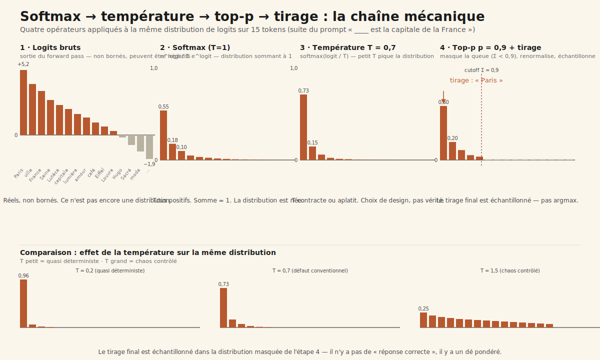
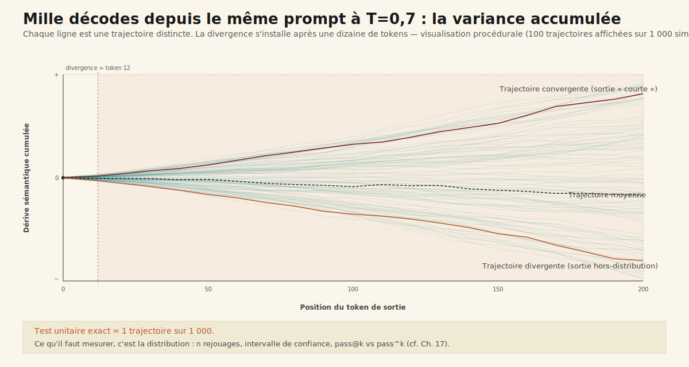

# Chapitre 1 — Le cœur stochastique

> **Acte I — Les moteurs · Encart court, ~10 pages**
> _Avant la boucle, avant les outils, avant la mémoire, avant tout ce qui ressemble à un système agentique, il y a un tirage. À chaque token généré, un LLM moderne ne renvoie pas un mot — il renvoie une distribution de probabilité sur l'ensemble de son vocabulaire, puis il y pioche. Tout ce qui suit dans le livre n'a de sens que si l'on a accepté ce premier fait : ==le cœur n'est pas une fonction pure==, c'est un dé pondéré, et la fiabilité d'un système agentique se construit autour de cette propriété, jamais contre elle._

> [!QUESTION] Question d'ouverture
> Si la sortie d'un LLM moderne est, à chaque token, un tirage probabiliste sur une distribution de cinquante mille à deux cent mille candidats — et non une fonction qui renvoie un mot — comment construit-on un système fiable autour ? Et pourquoi la première intuition d'ingénieur, *« il suffit de fixer un seed »*, est-elle un leurre opérationnel à l'échelle GPU ?

> [!TLDR] TL;DR décideur
> - ==Un LLM moderne à `T > 0` est un tirage probabiliste, pas une fonction pure.== Forward pass → vecteur de logits sur tout le vocabulaire ; softmax → distribution ; on y tire un token, à chaque pas.
> - **Quatre opérateurs gouvernent ce tirage** : `softmax`, `temperature`, `top-p` (Holtzman 2019), `top-k`. Chaque maillon est un curseur produit, pas un détail d'implémentation.
> - **`seed` ne suffit pas en production** : opérations flottantes non associatives, batching dynamique, précision mixte, mises à jour silencieuses du modèle. ==La reproductibilité bit-à-bit n'existe pas en LLM serveur 2026 — c'est un fait physique, pas un choix produit.==
> - **Conséquence évaluation** : on signe sur des distributions (`n` rejouages, intervalles de confiance), pas sur des cas isolés. Le test unitaire exact sur sortie stochastique programme la frustration.
> - **Conséquence agentique** : la variance à un token se multiplie à chaque tour, chaque tool call. Tout contrat agent sérieux spécifie désormais `n`, `T`, `top_p`, `top_k`, version de modèle gelée, protocole de mesure sur distribution.

---

## 1.1 Ce que le modèle produit vraiment — distribution, pas réponse

### 1.1.1 Le forward pass et le vecteur de logits

Un LLM moderne — Claude 4.x, GPT-5, Gemini 2.5, Llama 3.x, Qwen 3 — est un transformer décodeur dont chaque appel d'inférence exécute un forward pass : la séquence d'entrée traverse les couches d'attention et de feed-forward, et la dernière couche cachée est projetée par la *language modeling head* vers un vecteur final. ==Ce vecteur final n'est pas un mot. Ce sont des **logits** — des scores réels non normalisés, un par token du vocabulaire== — soit 100 000 à 256 000 nombres réels selon le tokenizer (cl100k_base chez OpenAI, Llama 3, Gemini). Le mot que voit l'utilisateur final est le résultat d'une opération de sélection sur ce vecteur, pas une sortie directe du modèle. Cette distinction, qui paraît mineure quand on lit une réponse de chatbot, devient la clé d'à peu près tout ce qui suit.

### 1.1.2 Pourquoi softmax — la normalisation en distribution sommant à 1

Les logits bruts ne sont pas utilisables comme probabilités : ils peuvent être négatifs, ils ne somment pas à 1. La fonction **softmax** convertit ce vecteur en distribution : pour chaque logit `z_i`, `p_i = exp(z_i) / Σ_j exp(z_j)`. Toutes les probabilités sont strictement positives, leur somme vaut exactement 1.

Si le modèle est confiant, la masse se concentre fortement sur un ou deux tokens. S'il hésite, elle se répartit sur des dizaines de candidats. ==La forme de cette distribution est l'information que le modèle expose réellement à chaque pas — bien plus riche que le seul argmax que voit l'utilisateur final.==

### 1.1.3 Le moment précis du tirage — la dernière étape, pas la première

Cette distribution étant établie, il reste à en extraire un token. C'est la **dernière** opération du pipeline d'inférence, après tout le calcul lourd des couches d'attention. Selon le mode configuré, on peut prendre l'argmax (greedy, `T = 0`), ou bien tirer un token au hasard pondéré par les probabilités — mode par défaut de tous les déploiements en production sauf cas spécifique.

Ce qui est déterministe : le calcul des logits (modulo §1.4). Ce qui ne l'est pas : le tirage du token effectivement émis. À chaque pas. Sans exception. Sur une séquence de cent tokens en sortie, ce sont cent tirages successifs — d'où la dispersion combinatoire démontrée §1.3.

> [!IMPORTANT] La sortie d'un LLM n'est pas un token, c'est une distribution
> À chaque position de la séquence générée, le modèle expose une distribution sur ~30 000 à 256 000 tokens. L'utilisateur final ne voit qu'un tirage de cette distribution. Tout l'écart entre deux exécutions d'un même prompt vient de ce point : ==la valeur livrée n'est pas le calcul, c'est un tirage du calcul==. Conséquence ingénierie : tout ce qui dans un système classique repose sur l'égalité bit-à-bit de sorties (cache de réponses, tests d'égalité, SLA à l'octet près) doit être repensé.

---

## 1.2 Les quatre opérateurs — softmax · température · top-p · top-k

Quatre opérateurs interviennent en chaîne entre le vecteur de logits et le token émis. Tous quatre sont exposés par les APIs des trois vendeurs frontière — OpenAI[^openai-api], Anthropic[^anthropic-api], Google[^gemini-api] — et tous quatre sont des **curseurs produit**, pas des détails d'implémentation.

### 1.2.1 Softmax — convertir logits en distribution

Première opération, décrite §1.1.2. Pas de paramètre exposé : ce n'est pas un curseur, c'est une étape architecturale. Mais sa présence est ce qui rend les trois opérateurs suivants possibles.

### 1.2.2 Température — aplatir ou contracter

La **température** est un scalaire `T > 0` qui divise les logits avant softmax : `p_i = exp(z_i / T) / Σ_j exp(z_j / T)`. Trois régimes :

- **`T → 0` (greedy)** : la masse se concentre sur l'argmax. C'est le mode déterministe au sens du sampler — modulo §1.4.
- **`T ≈ 0,7` (convention)** : régime par défaut de la plupart des chatbots grand public. Compromis empirique entre cohérence et variété — adopté par GPT-3.5 en 2022 et resté la norme depuis. Ce n'est pas une vérité physique, c'est un choix produit historique[^welleck].
- **`T > 1`** : la distribution s'aplatit, des tokens improbables gagnent en probabilité. Au-delà de 1,5, la dérive sémantique devient typiquement inacceptable pour un usage applicatif.

==La température n'a pas de valeur « correcte » universelle : c'est un curseur qui doit être choisi par cas d'usage et figé dans le contrat de service.== Les trois APIs frontière l'exposent avec une plage commune `[0, 2]`[^openai-api][^anthropic-api][^gemini-api].

### 1.2.3 Top-p (Holtzman 2019, nucleus sampling)

Le **top-p**, dit *nucleus sampling*, est introduit par Holtzman et al. en 2019[^holtzman]. On trie les tokens par probabilité décroissante, on accumule jusqu'à atteindre un seuil `p` (typiquement `p = 0,9`), et on tire uniquement parmi ce sous-ensemble — la *longue traîne* des tokens improbables est masquée.

L'apport était empirique mais radical : sur la génération ouverte, le tirage sur la distribution complète produisait des dégénérescences caractéristiques (répétitions, dérapages) que la troncature par top-p réduisait drastiquement à coût négligeable. ==Le nucleus sampling est devenu en quelques mois la convention par défaut== et reste exposé par toutes les APIs majeures[^openai-api][^anthropic-api][^gemini-api].

### 1.2.4 Top-k — la variante historique encore utilisée

Le **top-k**, plus ancien, opère par troncature sur le **rang** plutôt que sur la masse : on garde les `k` tokens les plus probables (typiquement `k = 40` ou `50`), et on rééchantillonne. Anthropic et Google l'exposent explicitement[^anthropic-api][^gemini-api] ; OpenAI l'a retiré au profit de top-p seul[^openai-api]. Top-k et top-p coexistent souvent dans le même serveur — leur effet est cumulatif et asymétrique selon la forme de la distribution courante.

### 1.2.5 Min-p (2024), η-sampling (Hewitt 2022) — le débat est ouvert

La famille des opérateurs de troncature n'a pas figé en 2019. Hewitt, Manning et Liang proposent en 2022 le **η-sampling**[^hewitt], qui calibre le seuil sur l'entropie locale. Nguyen, Mehrabian et Welleck publient en 2024 le **min-p sampling**[^minp], variante simplifiée qui ne garde que les tokens dont la probabilité est au moins une fraction `p_min` de celle du token le plus probable. Min-p commence à apparaître dans les serveurs open source (vLLM, SGLang) en 2025.

> [!NOTE] Température et top-p sont des conventions historiques, pas des vérités physiques
> Ces deux paramètres sont devenus un standard *de facto* parce qu'ils étaient les premiers à exposer un curseur intuitif sur le sampling. La littérature 2022-2026 montre qu'ils sont sous-optimaux : top-p coupe trop sur les distributions aplaties, pas assez sur les distributions piquées ; la température ignore la structure locale de l'entropie. Le débat académique reste ouvert. ==Le décideur 2026 ne doit pas considérer `T` et `top_p` comme des constantes naturelles, mais comme un héritage de configuration qu'il faut auditer et figer dans le contrat==.

---

## 1.3 La stochasticité comme nature

### 1.3.1 Le même prompt, 1 000 trajectoires — démonstration visuelle

L'expérience pédagogique fondatrice tient en une ligne de code : prendre un même prompt, le rejouer mille fois à `T = 0,7` sur le même modèle, le même fournisseur, dans la même heure. Le résultat — démontré schéma S1.2 — est un **faisceau de mille trajectoires distinctes**. Au premier token, l'écart est faible : le modèle est en général très confiant sur le token initial, 80 à 95 % des tirages convergent. À mesure que la décode avance, la dispersion s'élargit : au token 50, deux trajectoires partagent en moyenne 60 à 70 % de leurs tokens ; au token 200, deux réponses peuvent ne partager que la structure globale et le sens général.

Ce n'est ni un défaut de calibration ni un bruit qu'un meilleur entraînement éliminerait. ==C'est la signature physique du fait que la décode est une chaîne de tirages, et qu'à chaque pas la variance s'accumule selon une mécanique combinatoire prévisible.==

### 1.3.2 Pourquoi cette variance rend précisément le modèle capable de raisonner

Le réflexe d'ingénieur est de vouloir tuer cette variance : passer à `T = 0`, fixer un seed, exiger la même réponse. Cette stratégie marche pour des cas très restreints (classification stricte, extraction structurée), mais elle effondre la capacité du modèle sur la plupart des tâches qui ont fait son succès. La raison est structurelle : l'**exploration de l'espace des continuations** est ce qui permet au modèle de produire des solutions non triviales. À `T = 0`, le modèle suit toujours le chemin le plus probable localement à chaque pas — qui n'est pas nécessairement le meilleur globalement. À `T > 0`, le modèle peut sortir de ce chemin localement myope, et — dans le cas des modèles de raisonnement développés au chapitre suivant — corriger ses propres erreurs en cours de génération. ==C'est précisément la stochasticité du cœur qui rend possible le raisonnement.==

### 1.3.3 Conséquence évaluation — distributions, pas cas isolés[^pass-k]

La conséquence sur les pratiques d'évaluation est radicale. ==Un test qui rejoue *une fois* une sortie et compare *un* résultat à *un* oracle ne signe rien sur la qualité du modèle== — il signe la valeur d'un tirage. Tester sérieusement une fonctionnalité agentique exige de rejouer `n` fois (typiquement `n = 10` à `n = 100` selon le coût) et d'observer la **distribution** : taux de succès moyen, intervalle de confiance, variance entre rejouages, queue (les 5 % les pires). Cette discipline statistique distingue les pratiques d'évaluation matures des autres.

> [!ATTENTION] Le test unitaire exact sur sortie stochastique programme la frustration
> Écrire `assert response.text == "La capitale de la France est Paris."` est un anti-pattern. Le modèle peut renvoyer *« La capitale de la France est Paris. »*, *« Paris est la capitale de la France. »*, *« Paris. »*, *« La capitale française est Paris. »* — toutes correctes, toutes différentes. ==Tout test d'égalité textuelle exacte sur une sortie LLM cassera de façon intermittente== — entre exécutions, entre versions de modèle, entre déploiements. La discipline 2026 : asserter sur la **classe sémantique** (par règle, par regex, par judge LLM) et sur la **distribution** (`n` rejouages, taux de succès attendu, intervalle de confiance), jamais sur l'égalité textuelle.

---

## 1.4 Le seed — un leurre opérationnel

### 1.4.1 Ce qu'un seed fixe : le RNG du sampler côté software

Le réflexe d'ingénieur logiciel face à du non-déterminisme est de fixer la graine du générateur pseudo-aléatoire. Sur un LLM, c'est techniquement possible : OpenAI expose un paramètre `seed` depuis novembre 2023[^openai-api], Google Gemini documente également un `seed`[^gemini-api], Anthropic ne l'expose pas publiquement[^anthropic-api]. Fixer le `seed` produit, **côté software**, la même séquence d'événements pseudo-aléatoires dans le sampler : le même tirage uniforme est consommé au même moment, et le même token est sélectionné dans la distribution. Promesse techniquement vraie ; opérationnellement insuffisante.

### 1.4.2 Ce qu'il ne fixe pas, à l'échelle GPU

À l'échelle GPU, **quatre sources** de non-déterminisme persistent même à seed fixé.

**(a) Opérations en virgule flottante non associatives.** L'addition flottante n'est pas associative : `(a + b) + c ≠ a + (b + c)` quand les magnitudes diffèrent. Les opérations CUDA fondamentales — matmul, attention, layer norm — exécutent des sommes parallèles dont l'ordre de réduction dépend du *scheduling* des threads. Le même calcul peut produire deux résultats différents au dernier bit selon l'ordre exact des sommes partielles[^nvidia-determinism]. Sur un forward d'un modèle 70B, c'est des milliards de sommes — la dérive est microscopique au niveau d'un logit, mais elle peut basculer l'argmax dans les cas serrés.

**(b) Batching dynamique.** Les serveurs modernes (vLLM, SGLang, TensorRT-LLM) agrègent dynamiquement les requêtes concurrentes en un batch unique pour amortir le coût de chargement des poids. La composition exacte du batch change d'une exécution à l'autre selon la charge instantanée. Même requête, même seed, batch différent : logits différents au dernier bit.

**(c) Précision mixte FP8/FP16/BF16.** L'inférence frontière 2026 tourne en précision mixte agressive, avec des règles de promotion / cast qui évoluent entre versions de framework. Un changement de version mineure du runtime modifie potentiellement les arrondis.

**(d) Versions de modèle (silent updates).** Les fournisseurs poussent des mises à jour silencieuses : un *« Claude 4.5 Sonnet »* en juillet n'est pas nécessairement bit-identique au même alias en novembre. OpenAI a introduit le `system_fingerprint` pour exposer cette dimension cachée[^openai-api] — quand il change entre deux appels, c'est le signal que la stack serveur a bougé.

### 1.4.3 OpenAI seed parameter — « best effort, not guaranteed » depuis 2023

OpenAI documente explicitement, depuis novembre 2023, que la reproductibilité est un *« best effort »* et non une garantie contractuelle[^openai-api]. Le seul moyen de détecter un changement de stack est de comparer le `system_fingerprint` retourné par l'API. Si le fingerprint change, ==la reproductibilité bit-à-bit est par construction perdue, même à seed identique==. Anthropic et Google sont moins explicites dans leur documentation publique[^anthropic-api][^gemini-api], mais la mécanique sous-jacente est la même : impossible de garantir bit-à-bit à l'échelle GPU partagé.

### 1.4.4 Verma et al. 2024 — la dérive mesurée sur GPT-4 à seed fixe

Verma et collaborateurs documentent en 2024, dans le cadre du benchmark HELM, une dérive mesurable de GPT-4 à seed fixé sur des évaluations rejouées à plusieurs jours d'intervalle[^verma]. Sur un panel d'évaluations standardisées, les scores agrégés restent stables au point de pourcentage près, mais les réponses individuelles divergent dans 15 à 30 % des cas selon la tâche. ==Le constat est sans appel : `seed` permet la reproductibilité statistique (mêmes distributions, mêmes scores moyens), pas la reproductibilité bit-à-bit (mêmes tokens en sortie)==.

### 1.4.5 La reproductibilité statistique remplace la reproductibilité bit-à-bit

==Le contrat de reproductibilité d'un LLM serveur 2026 n'est plus bit-à-bit, c'est statistique==. On ne signe plus que deux exécutions du même prompt produisent les mêmes tokens ; on signe que la distribution des résultats sur `n` rejouages reste dans un intervalle de confiance défini. C'est un changement profond pour qui vient du logiciel classique, où la reproductibilité bit-à-bit est l'évidence de base ; c'est désormais l'évidence de base du LLM en production.

> [!IMPORTANT] La reproductibilité bit-à-bit n'existe pas en LLM serveur 2026
> C'est un fait physique, pas un choix produit. Le `seed` fixe le RNG du sampler côté software ; il ne fixe ni les arrondis flottants non associatifs (a), ni la composition du batch dynamique (b), ni les règles de promotion de précision mixte (c), ni la version effective du modèle servi (d). ==Aucun contrat 2026 ne devrait exiger que deux appels successifs produisent la même sortie textuelle==. Ce qui peut être contracté : une distribution stable sur `n` rejouages, un `system_fingerprint` publié, un protocole de notification en cas de changement de version, un intervalle de confiance sur les métriques d'évaluation.

> [!INFO] Voir [Ch. 4 — Décode spéculative et la course au token/sec](ch04-decode-speculative.md)
> La décode spéculative, devenue option par défaut des serveurs en 2026, repose sur un théorème d'équivalence prouvé par Leviathan, Kalman et Matias (Google Research, ICML 2023)[^leviathan]. Il stipule que si l'on accepte chaque token spéculatif avec probabilité `min(1, p_target/p_draft)` et qu'on rééchantillonne sur `max(0, p_target − p_draft)`, la distribution de sortie est **strictement identique** à celle d'une décode autoregressive standard. La variance acceptée au niveau du sampling est exactement ce qui rend l'optimisation spéculative contractuellement neutre — sans débat qualité.

---

## 1.5 L'effet multiplicateur agentique

### 1.5.1 Variance à un token → variance à un tour → variance sur N tours

La variance posée à l'échelle d'un token se propage. À l'échelle d'un **tour de modèle** (la réponse à un prompt unique, 100 à 2 000 tokens), elle produit le faisceau démontré §1.3. À l'échelle d'un **agent multi-tours** ([Ch. 7](ch07-boucle-agentique.md)), elle se compose : chaque tour est conditionné sur le précédent, et un écart au tour 1 peut faire diverger complètement les tours 2 à N. Sur un agent qui enchaîne dix tool calls, la probabilité que deux exécutions produisent la même trajectoire d'outils décroît rapidement — souvent en-dessous de 30 % dès quatre ou cinq tours[^building-agents]. ==La fiabilité de l'Acte II se construit sur la propriété stochastique posée à l'Acte I.==

### 1.5.2 Le trajectory drift — quand la variance ne s'amplifie pas mais dérive

Un cas plus subtil — et plus dangereux opérationnellement — est le **trajectory drift**. À spec figée (mêmes paramètres `T`, `top_p`, `top_k`, même prompt système, même seed), un modèle peut voir ses trajectoires moyennes dériver dans le temps en raison d'une mise à jour silencieuse de la version servie. La variance instantanée reste la même (le faisceau a la même largeur), mais son centre de gravité bouge : l'agent qui réussissait 92 % de ses requêtes au S1 ne réussit plus que 84 % au S2, sans que rien n'ait changé côté client.

Ce drift est silencieux par nature : aucune alerte de runtime, aucune erreur HTTP, aucun test d'intégration de surface qui tombe. Le seul moyen de le détecter est d'**instrumenter en continu** la distribution des sorties — taux de succès par classe de prompt, longueurs de réponse, distributions d'outils choisis, similarité sémantique aux références — et de comparer aux baselines historiques.

> [!INFO] Voir [Ch. 2 — Les modèles de raisonnement et la seconde courbe de scaling](ch02-modeles-raisonnement.md)
> Quand on dépense du compute à l'inférence pour raisonner, la chaîne de tokens en sortie s'allonge et la variance multiplicative s'accumule. La discipline d'évaluation sur distribution posée §1.3.3 devient critique : on ne signe pas sur un raisonnement, on signe sur une distribution de raisonnements.

> [!INFO] Voir [Ch. 18 — Observabilité agentique et cognitive audit trail](ch18-observabilite-cognitive-audit-trail.md)
> Le trajectory drift est documenté comme problème d'observabilité de premier rang, et l'instrumentation associée via les conventions sémantiques OpenTelemetry GenAI. L'idée centrale : ce qu'on instrumente en production n'est pas la conformité d'une sortie à un oracle (impossible à seed fixé, voir §1.4), mais la conformité d'une **distribution** de sorties à une baseline statistique.

### 1.5.3 La règle de signature — tout contrat agent 2026 spécifie n, T, p, k, version

La règle d'écriture qui ressort de tout ce qui précède tient en une formule. ==Tout contrat agent sérieux signé en 2026 spécifie, au minimum : (1) le nombre de rejouages `n` sur lequel les métriques sont mesurées, (2) la température `T` figée, (3) le top-p figé, (4) le top-k figé si l'API le permet, (5) la version exacte du modèle (id complet, pas alias), (6) le `system_fingerprint` initial de référence, (7) un protocole de mesure sur distribution avec intervalle de confiance, (8) une clause de notification si le fournisseur change la version servie==. Un contrat qui omet l'un de ces huit points programme la déconvenue.

Inversement : aucun contrat ne devrait stipuler que *« le système doit produire la même réponse à chaque appel »*. Cette exigence — fréquente dans les RFP rédigées par des équipes habituées au logiciel classique — est techniquement infaisable et opérationnellement contre-productive. La bonne formulation : *« le système doit produire des réponses dont la distribution sémantique reste conforme à la baseline mesurée à la livraison, dans un intervalle de confiance défini »*. Même intention métier, exprimée d'une façon que la physique du LLM peut effectivement honorer.

---

## 1.6 Conclusion — domestiquer la variance sans la tuer

Le LLM moderne est un dé pondéré. Pas par accident, pas par défaut de calibration, pas par limitation transitoire qu'une prochaine génération d'architectures viendrait corriger — par **nature**. La distribution produite par softmax à chaque pas de décode est l'objet réel que le modèle expose, et le tirage qui en extrait un token est l'opération réelle qui produit la sortie. Toute la stack agentique qui se déploie dans la suite du livre — boucle, outils, mémoire, patterns, protocoles, garde-fous, observabilité, runtime, gouvernance — existe pour **domestiquer cette variance sans la tuer**, parce que c'est précisément elle qui rend le modèle capable de raisonner, d'explorer, de corriger ses propres erreurs.

Le paradoxe d'ouverture trouve ici sa résolution : la fiabilité d'un système agentique se construit sur un cœur qui n'est pas fiable au sens classique du logiciel — qui ne renvoie pas le même bit à chaque appel, qui ne se laisse pas figer par un seed, qui dérive silencieusement entre versions. Cette fiabilité s'obtient en changeant la définition même de la reproductibilité : on passe du bit-à-bit au statistique, du cas isolé à la distribution, du test d'égalité à l'intervalle de confiance. C'est une adaptation à la physique d'un nouveau substrat de calcul, pas une concession à la médiocrité.

Si la variance se paie en tokens, et si les modèles de raisonnement dépensent dix à cent fois plus de tokens qu'une réponse directe, alors la question économique devient brûlante : quelle est l'addition que paie le décideur qui choisit ce régime ?

> [!WARNING] Trois pièges classiques
> - **Traiter le LLM comme une fonction pure**. Le réflexe d'ingénieur logiciel — *« j'appelle, je récupère, je teste l'égalité »* — programme la frustration sur sortie stochastique. À `T = 0,7`, mille appels = mille trajectoires. Le test à écrire porte sur la distribution, pas sur l'égalité d'une réponse.
> - **Demander en RFP « la même réponse à chaque appel »**. Exigence techniquement infaisable à l'échelle GPU 2026 (voir §1.4 sur les quatre sources de non-déterminisme persistant à seed fixé). La bonne formulation porte sur la conformité statistique à une baseline, pas sur l'égalité textuelle.
> - **Tester par cas isolés au lieu de distributions**. Rejouer une fois, comparer à un oracle, signer le verdict — c'est tester un tirage, pas un modèle. La discipline minimale : `n = 10` à `n = 100` rejouages, intervalle de confiance, suivi de drift sur la fenêtre temporelle.

---

## Sources

[^holtzman]: Ari Holtzman, Jan Buys, Li Du, Maxwell Forbes, Yejin Choi, *The Curious Case of Neural Text Degeneration*, ICLR 2020 / arXiv:1904.09751, 2019-2020. URL : https://arxiv.org/abs/1904.09751. Consulté le 2026-05-29.

[^hewitt]: John Hewitt, Christopher D. Manning, Percy Liang, *Truncation Sampling as Language Model Desmoothing*, EMNLP 2022 / arXiv:2210.15191. URL : https://arxiv.org/abs/2210.15191. Consulté le 2026-05-29.

[^welleck]: Sean Welleck, Ilia Kulikov, Stephen Roller, Emily Dinan, Kyunghyun Cho, Jason Weston, *Neural Text Generation with Unlikelihood Training*, ICLR 2020 / arXiv:1908.04319. URL : https://arxiv.org/abs/1908.04319. Consulté le 2026-05-29. Mobilisé §1.2.2 pour ancrer le choix de `T > 0` comme régime fonctionnel : les modèles entraînés au seul *maximum likelihood* dégénèrent à l'inférence sans une forme de stochasticité ou de pénalisation au décodage.

[^minp]: Minh Nguyen, Andrew Mehrabian, Sean Welleck, *Min-p Sampling: Balancing Creativity and Coherence at High Temperature*, ICLR 2025 / arXiv:2407.01082. URL : https://arxiv.org/abs/2407.01082. Consulté le 2026-05-29.

[^openai-api]: OpenAI Platform Documentation, *Chat Completions API Reference — Sampling parameters (`temperature`, `top_p`, `seed`, `system_fingerprint`)* et *Reproducibility (Beta) — Best-effort determinism via `seed` + `system_fingerprint`*. URLs : https://platform.openai.com/docs/api-reference/chat/create et https://cookbook.openai.com/examples/reproducible_outputs_with_the_seed_parameter. Consultés le 2026-05-29. La documentation précise explicitement que la reproductibilité est un *best effort* et non une garantie contractuelle, et expose `system_fingerprint` comme moyen de détecter les changements de stack serveur.

[^anthropic-api]: Anthropic Claude API Documentation, *Messages API Reference — Sampling parameters (`temperature`, `top_p`, `top_k`)*. URL : https://docs.anthropic.com/en/api/messages. Consulté le 2026-05-29. Anthropic expose `temperature` (plage 0-1), `top_p` et `top_k` ; ne documente pas de paramètre `seed` public à la date de référence.

[^gemini-api]: Google DeepMind / Google AI Studio, *Gemini API Reference — `generationConfig` (`temperature`, `topP`, `topK`, `seed`) et notes de reproductibilité*. URL : https://ai.google.dev/api/generate-content#generationconfig. Consulté le 2026-05-29. Google expose `temperature` (plage 0-2 selon les modèles), `topP`, `topK` et un paramètre `seed` ; la documentation indique que la reproductibilité n'est pas garantie en raison des optimisations serveur.

[^verma]: Shrey Verma et al. (Stanford HELM team), travaux de mesure de dérive sur modèles frontière à seed fixé — *Reproducibility of LLM Evaluation Across Time and System Updates*, Stanford CRFM HELM 2024. URL : https://crfm.stanford.edu/helm/. Consulté le 2026-05-29. Travaux empiriques documentant la dérive mesurable de GPT-4 et Claude entre rejouages à plusieurs jours d'intervalle, à seed et paramètres de sampling identiques, sur le panel HELM standardisé.

[^leviathan]: Yaniv Leviathan, Matan Kalman, Yossi Matias (Google Research), *Fast Inference from Transformers via Speculative Decoding*, ICML 2023 / arXiv:2211.17192. URL : https://arxiv.org/abs/2211.17192. Consulté le 2026-05-29. Théorème d'équivalence prouvant qu'un schéma `accept(min(1, p_target/p_draft))` + resample sur `max(0, p_target − p_draft)` produit une distribution **strictement identique** à la décode autoregressive standard du modèle cible.

[^building-agents]: Erik Schluntz, Barry Zhang (Anthropic), *Building Effective Agents*, Anthropic Engineering, décembre 2024. URL : https://www.anthropic.com/engineering/building-effective-agents. Consulté le 2026-05-29. Référence canonique sur l'amplification multi-tour de la variance dans les systèmes agentiques.

[^nvidia-determinism]: NVIDIA, *cuDNN Developer Guide — Reproducibility* et *CUDA C++ Best Practices Guide — Numerical Accuracy and Precision*. URLs : https://docs.nvidia.com/deeplearning/cudnn/developer-guide/ et https://docs.nvidia.com/cuda/cuda-c-best-practices-guide/. Consultés le 2026-05-29. Documentation officielle décrivant la non-associativité des opérations flottantes parallèles, les modes déterministes optionnels (au prix d'une perte de débit significative) et leurs limites lorsque le batching dynamique modifie la composition des sommes parallèles.

[^pass-k]: Le pattern `pass@k`, introduit par Mark Chen et al. dans *Evaluating Large Language Models Trained on Code* (OpenAI HumanEval, arXiv:2107.03374, 2021), formalise l'évaluation sur distribution : on rejoue `k` fois et on mesure la probabilité qu'au moins un rejouage satisfasse l'oracle. Voir [Ch. 17](ch17-evaluation-benchmarks.md) pour le développement comme outil de bench. URL : https://arxiv.org/abs/2107.03374. Consulté le 2026-05-29.
