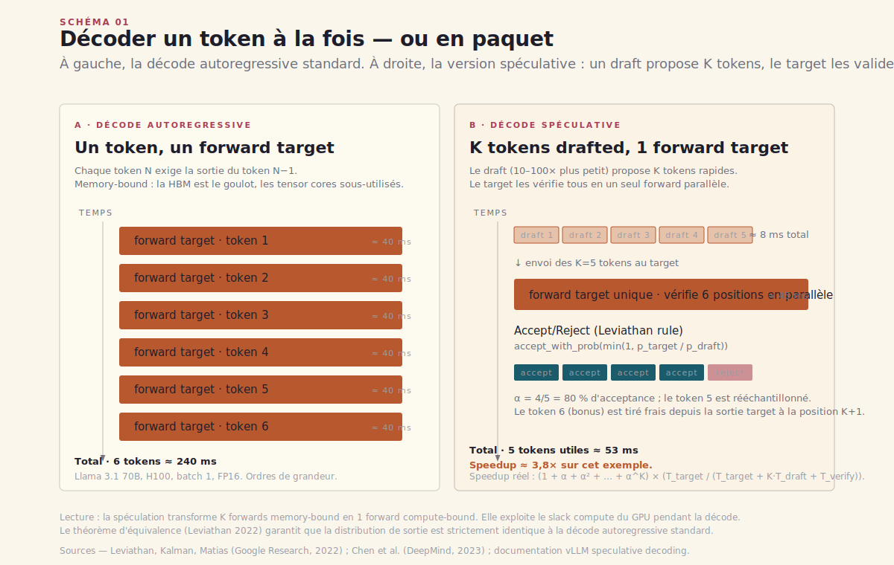
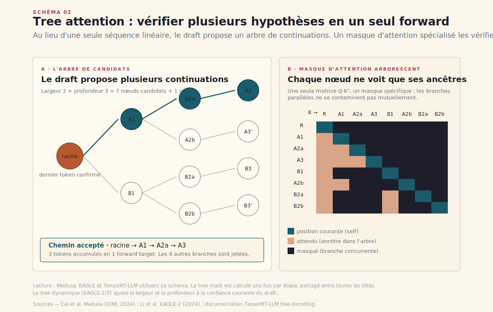
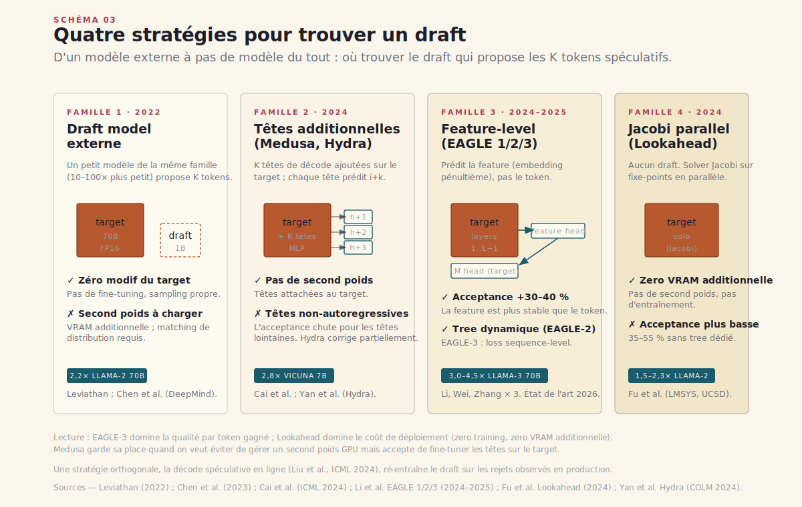
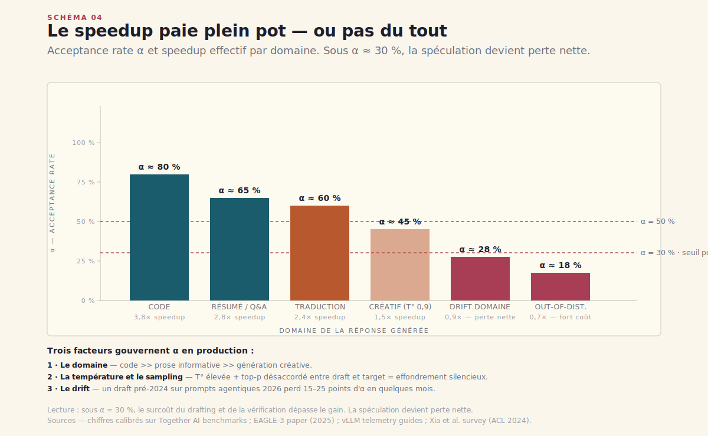
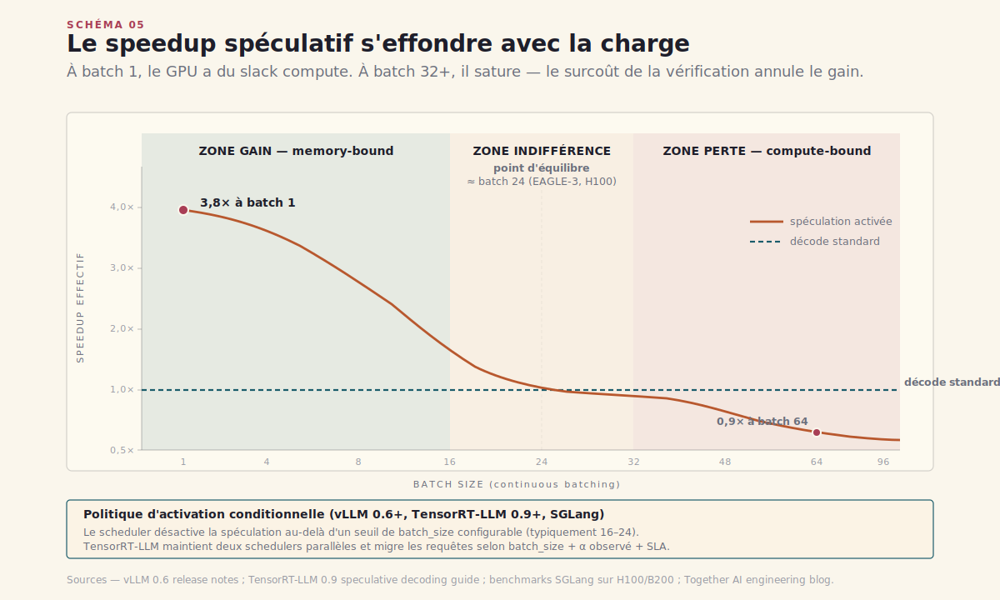
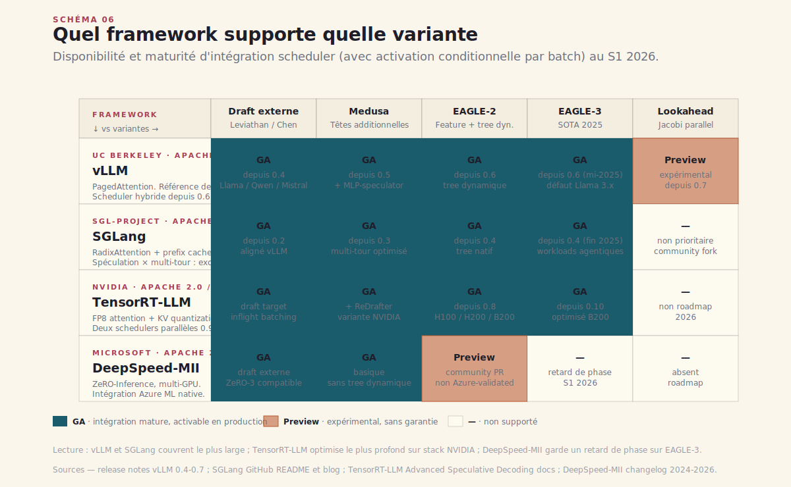

# Chapitre 4 — Décode spéculative et la course au token/sec

> **Acte I — Les moteurs · Chapitre standard, ~22 pages**
> _La seconde courbe de scaling est désormais acquise — depuis o1, on dépense du compute **à l'inférence** pour chercher, vérifier, corriger. Ce surcoût se paye en latence : un raisonnement qui consomme dix fois plus de tokens met dix fois plus longtemps à sortir si l'on décode token après token. Comment l'industrie a regagné le facteur perdu — sans dégrader la qualité — via une optimisation devenue option par défaut des serveurs en 2026. La décode spéculative n'est ni un compromis, ni un free lunch : c'est une optimisation **conditionnelle** dont le gain s'évapore dès que l'on quitte deux régimes précis. Tout tient en deux phrases : la spec marche en memory-bound à batch faible et sur un domaine in-distribution. En dehors de ces deux conditions, elle peut devenir perte nette — silencieusement._

> [!QUESTION] Question d'ouverture
> Si le draft model accepte 80 % de ses propositions sur du code mais 45 % sur de la prose créative, à partir de quel batch et sur quel cas d'usage la spec devient-elle une perte nette plutôt qu'un gain ? Et comment instrumente-t-on un paramètre — l'acceptance rate — qui peut dériver silencieusement de 75 % à 35 % en dix-huit mois sans qu'aucune alerte ne se déclenche, parce que le SLA de latence se dégrade lentement et que le serveur continue de répondre ?

> [!TLDR] TL;DR décideur
> - ==**Le théorème d'équivalence rend la spéculation acceptable sans débat qualité.**== Leviathan, Kalman et Matias (Google Research, ICML 2023) prouvent que si l'on accepte chaque token spéculatif avec probabilité `min(1, p_target/p_draft)` et qu'on rééchantillonne le rejet sur `max(0, p_target − p_draft)`, la distribution de sortie est **strictement identique** à celle d'une décode autoregressive standard. Pas de trade-off qualité/vitesse ; sortie bit-identique en sampling stochastique. C'est ce qui distingue la spec des autres optimisations agressives (quantification 4-bit, pruning, distillation) qui dégradent toutes mesurablement les benchmarks.
> - **Quatre familles, trois choix de drafting.** Famille 1 — *draft externe* (Leviathan, Chen 2023) : petit modèle séparé, le canon mais coûteux en VRAM. Famille 2 — *têtes additionnelles* (Medusa, Hydra) : on greffe K têtes au target, pas de second modèle, mais l'acceptance rate des tokens lointains chute. Famille 3 — *feature-level autoregression* (EAGLE 1/2/3) : on prédit la feature pénultième, pas le token — c'est l'état de l'art entraîné en 2026. Famille 4 — *Jacobi parallel decoding* (Lookahead) : pas de draft du tout, zéro entraînement supplémentaire, niche zero-train.
> - ==**Les gains observés en production sont de 2× à 4× sur le temps par token, mais ces chiffres dépendent d'un paramètre invisible : α, l'acceptance rate.**== Code 75-85 %, Q&A factuel 60-70 %, créatif 40-50 %, *out-of-distribution* &lt; 30 % → perte nette. En 2026, l'instrumentation de α par requête est devenue un indicateur de premier rang dans les dashboards d'inference, au même titre que `p99 latency` ou `tokens/second`. Un draft entraîné en 2023 sur des données pré-agentiques verra son α s'effondrer sur des prompts contemporains, **sans erreur, sans alerte, sans signal — sauf si on le mesure explicitement**.
> - **Le second piège est l'interaction avec le batching dynamique.** Speedup maximal à `batch_size = 1` (decode memory-bound, slack compute énorme). À `batch_size = 24-32`, le serveur sature les unités compute du GPU et le surcoût du draft annule le gain. Au-delà de batch 48, la spec peut **dégrader** le throughput agrégé. ==L'optimisation d'un déploiement spéculatif n'est plus le choix de la variante (EAGLE-3 vs Medusa-2), c'est le calibrage du seuil de désactivation par batch== — vLLM 0.6, TensorRT-LLM 0.9 et SGLang exposent tous trois un *speculation threshold* configurable depuis 2025.
> - **Le marché s'est consolidé en 2026 sur quatre frameworks.** vLLM (UC Berkeley, défaut sur Llama / Qwen / Mistral), SGLang (sgl-project, choix montant pour workloads agentiques multi-tour avec RadixAttention), TensorRT-LLM (NVIDIA, optimisation compute profonde sur H100 / H200 / B200), DeepSpeed-MII (Microsoft, niche multi-GPU à très grande échelle). Le décideur qui signe un contrat 12 mois doit choisir non sur la disponibilité d'une variante mais sur **la maturité de son intégration avec le scheduler hybride** — c'est là que se joue le gain réel sous charge mixte.

---

## 4.1 Pourquoi décoder est sériel

L'inférence LLM se découpe en deux phases asymétriques. La **prefill** traite le prompt complet en un seul forward parallèle : 1 000 tokens d'entrée = 1 forward, compute-bound, le GPU sature ses tensor cores. La **decode** génère les tokens de sortie *un par un*, chaque token dépendant du précédent : 100 tokens de sortie = 100 forwards séquentiels[^6]. Cette deuxième phase est **memory-bound** — le goulot n'est pas le compute, c'est le débit de lecture du KV cache et des poids du modèle depuis la HBM vers les registres.

Une seule décode autoregressive d'un Llama-3 70B sur un H100 lit environ 140 Go de poids et 2-30 Go de KV cache par token généré, sur une bande passante HBM3 de ~3,35 To/s — ce qui plafonne théoriquement à ~24 tokens/seconde. ==Le GPU passe l'essentiel de son temps à attendre la mémoire ; ses tensor cores sont sous-utilisés (souvent à 5-15 % de leur peak FLOPS pendant la décode)==[^6]. C'est ce *slack compute* qui rend la spéculation possible : il y a de la puissance de calcul disponible si l'on trouve un moyen d'évaluer plusieurs tokens en parallèle.

D'où l'idée fondatrice. Plutôt que d'attendre que le target produise le token N pour ensuite produire le token N+1, on demande à un **petit modèle rapide** (le *draft*) de produire spéculativement les K tokens suivants. Le *target* — le gros modèle — les valide tous en **un seul forward parallèle** (compute-bound, comme un mini-prefill). Si le draft a bien deviné, on a généré K tokens en un seul aller-retour HBM au lieu de K. Si le draft a mal deviné, on retombe sur la décode normale à partir du dernier token accepté. C'est la mécanique fondatrice ; tout ce qui suit en est variation, raffinement, ou diagnostic du moment où elle cesse de payer.

---

## 4.2 Anatomie d'un cycle spéculatif

### 4.2.1 Trois étapes, une boucle

La décode spéculative se décompose en trois étapes que les serveurs modernes exécutent en boucle jusqu'à atteindre la séquence finale (voir Schéma 1).

**Étape 1 — Drafting.** Un modèle léger (typiquement 10-100× plus petit que le target : Llama-3.2-1B pour drafter Llama-3.1-70B, par exemple) génère K tokens autoregressifs. Ce coût est faible — le draft est petit, sa décode est rapide même séquentielle. K varie typiquement entre 4 et 8 ; au-delà, l'acceptance rate chute trop vite pour que ça paie.

**Étape 2 — Verification.** Le target reçoit la séquence préfixe + les K tokens proposés en *un seul forward*. Cela produit les distributions `p_target` aux positions 1 à K+1. Cette étape utilise le `tree attention mask` (voir Schéma 2) : un masque qui permet à plusieurs branches d'hypothèses de coexister dans le même forward sans interférence — une astuce d'attention causale étendue qui distingue les implémentations modernes (Medusa, EAGLE, TensorRT-LLM tree decoding) des prototypes académiques originaux.

**Étape 3 — Accept / Reject.** Pour chaque position i, on compare `p_target[i]` à `p_draft[i]`. Le critère d'acceptation est `accept_with_prob(min(1, p_target[i] / p_draft[i]))`. Si tous les K tokens sont acceptés, on a généré K+1 tokens en un forward target — le +1 venant de la position K+1, qui est échantillonnée fraîche depuis `p_target[K+1]`. Si le token i est rejeté, on échantillonne un token de remplacement depuis la distribution `max(0, p_target[i] − p_draft[i])` normalisée, on tronque tout ce qui suit, et on relance le drafting au prochain cycle[^1][^2].



### 4.2.2 Tree attention : pourquoi les branches coexistent

Le passage de la *séquence linéaire* (un draft, K tokens proposés en file indienne) au *tree* (plusieurs branches d'hypothèses évaluées en parallèle dans un même forward) est ce qui distingue les variantes modernes (Medusa-2, EAGLE-2/3, TensorRT-LLM tree decoding) de la première implémentation de Leviathan et al. ==Plutôt que de proposer une seule continuation de K tokens, on propose un arbre de continuations== — typiquement 8-16 branches de profondeur 3-5 — et le target les vérifie toutes simultanément via un masque d'attention spécialisé. Le serveur retient ensuite le plus long préfixe accepté.



L'intérêt est mathématique : si chacune des B branches de profondeur K a une acceptance rate par token α, la probabilité qu'au moins une branche entière soit acceptée est `1 − (1 − α^K)^B`, et l'espérance du préfixe le plus long accepté monte avec B même quand K est tenu fixe. ==C'est pourquoi un tree de 8 branches × 4 tokens accepte en moyenne plus de tokens qu'une séquence linéaire de 16 tokens à acceptance égale==. Le coût compute du verify scale en B × K positions au lieu de K seul, mais reste largement absorbé par le slack memory-bound — tant qu'on est à batch modéré (cf. §4.5).

### 4.2.3 Le théorème d'équivalence — pourquoi la spec ne se débat plus

Le point théorique clé — celui qui rend la technique adoptable sans discussion produit — est l'**équivalence de distribution**. Leviathan, Kalman et Matias prouvent que le schéma accept/reject produit des séquences indistinguables d'une décode standard du target : même distribution marginale, même comportement de sampling, même reproductibilité à seed fixe[^1]. Pas de *trade-off qualité/vitesse* — c'est ce qui distingue la décode spéculative d'autres optimisations agressives (quantification 4-bit, pruning, distillation) qui dégradent toutes mesurablement les benchmarks.

> [!IMPORTANT] Le théorème d'équivalence rend la spec contractuellement neutre
> ==Aucune justification produit n'est nécessaire== : la sortie est bit-identique en sampling stochastique. C'est ce qui a permis à vLLM, SGLang, TensorRT-LLM et aux services managés (Together AI, Fireworks) d'activer la spéculation **par défaut** dès 2024-2025, sans avoir à exposer un toggle utilisateur. Le contrat est respecté ; seule la latence change. La spec n'apparaît dans aucune fiche produit, dans aucun changelog vendeur — et pourtant tout serveur récent en bénéficie. C'est précisément ce qui rend son monitoring difficile : ce qui marche silencieusement passe inaperçu quand il commence à dérailler (cf. §4.4.3 sur le drift silencieux de α).

> [!QUOTE] Yaniv Leviathan, Matan Kalman, Yossi Matias, *Fast Inference from Transformers via Speculative Decoding*, arXiv 2211.17192, ICML 2023
> *« We prove that the resulting samples are distributed identically to the target's, regardless of the draft's quality. The draft cannot introduce bias in the output distribution — only latency wins or losses. »*[^1]

---

## 4.3 Quatre familles de variantes

Le paysage des variantes s'est structuré entre 2023 et 2025 autour de quatre approches qui répondent toutes au même problème — *où trouver le draft model ?* — par des stratégies différentes (voir Schéma 3).

### 4.3.1 Famille 1 — Draft model externe (Leviathan, Chen)

L'approche originale : on entraîne ou on télécharge un petit modèle de la même famille (Llama-3.2-1B pour drafter Llama-3.1-70B). Avantages : zéro modification du target, draft réutilisable sur plusieurs tailles cibles, sampling stochastique propre. Inconvénients : il faut héberger et charger un second modèle (occupation VRAM 1-3 Go en FP16 pour un 1B, latence de chargement, gestion de version), et le draft doit avoir été pré-entraîné sur une distribution proche du target sinon l'acceptance rate s'effondre[^1][^2]. C'est l'option la plus simple à déployer quand le draft existe déjà — typiquement Llama-3.2-1B/3B en tant que drafters officiels de la famille Llama-3.

### 4.3.2 Famille 2 — Têtes additionnelles (Medusa, Hydra)

Tianle Cai et al. (Together AI, Princeton) proposent en 2024 d'**ajouter K têtes de décode sur le target lui-même** — chaque tête prédit le token à i+1, i+2, …, i+K en parallèle, à partir de la même couche cachée[^3]. Avantage majeur : pas de second modèle, pas de second poids à charger en VRAM, pas de gestion de version draft/target. Inconvénient structurel : le draft n'est plus autoregressif — chaque tête voit la même couche cachée, pas la prédiction de la tête précédente — donc l'acceptance rate des tokens lointains chute vite (typiquement 75 % → 55 % → 40 % → 25 % pour les têtes 1 à 4). Hydra corrige partiellement en réintroduisant une dépendance séquentielle entre têtes[^12]. Medusa-2 (2024) augmente le nombre de têtes et combine avec tree attention pour atteindre 2,8× sur Vicuna 7B[^3]. ==Medusa reste populaire en 2026 chez les acteurs qui ne veulent pas reentraîner ou re-déployer un second poids== — c'est l'option *brownfield* par excellence.

### 4.3.3 Famille 3 — Feature-level autoregression (EAGLE 1/2/3)

Yuhui Li et al. (Microsoft Research, Vector Institute) repèrent en 2024 un défaut de Medusa : prédire les tokens directement est intrinsèquement bruité parce que l'opération `argmax(softmax)` détruit l'information de confiance. EAGLE prédit la **feature** (l'embedding intermédiaire de la couche pénultième) au lieu du token, puis applique la couche LM finale séparément. ==La feature étant un signal plus stable que le token, EAGLE atteint des acceptance rates 30-40 % plus élevés que Medusa sur les mêmes K==[^4]. EAGLE-2 (mi-2024) introduit un mécanisme de **dynamic draft tree** qui adapte la profondeur et la largeur du tree à la confiance courante. EAGLE-3 (2025) supprime l'entraînement de la feature loss au profit d'une nouvelle fonction d'objective basée sur la sequence-level acceptance — atteignant 4,5-5× sur Llama 3.1 8B et 3,0-4,5× sur Llama 3.3 70B[^4]. **EAGLE-3 est en 2026 l'état de l'art de la décode spéculative entraînée**, et le défaut sur les familles Llama 3.x / Qwen 2.5 dans vLLM et SGLang.

### 4.3.4 Famille 4 — Jacobi parallel decoding (Lookahead)

Yichao Fu et al. (LMSYS, UCSD) proposent en 2024 une approche radicalement différente : **pas de draft model du tout**. Lookahead Decoding utilise un solver Jacobi pour résoudre en parallèle un système d'équations fixe-points sur les futurs tokens, en exploitant le fait que le target lui-même peut servir de critique. Acceptance rate plus faible (35-55 %), mais zéro overhead de drafting, zéro entraînement supplémentaire, zéro VRAM additionnelle. Speedup mesuré : 1,5-2,3× selon les modèles[^5].

> [!NOTE] Pourquoi *zero-train* fait gagner Lookahead dans certains contextes
> Lookahead n'atteint jamais le 3-4× d'EAGLE-3, et pourtant il a sa niche en 2026. Trois raisons : (1) **aucun second poids à charger** — précieux sur les déploiements à mémoire serrée (edge inference, multi-tenant agressif) ; (2) **aucune dépendance d'entraînement** — le target déployé peut être un modèle propriétaire ou un fine-tune custom dont aucun draft compatible n'existe ; (3) **portabilité immédiate** — Lookahead marche dès l'install sans contrat d'entraînement préalable. ==C'est la variante de choix pour les déploiements *zero-training* où l'on ne veut ni gérer un second poids ni reentraîner le target== — typiquement un service managé qui héberge des dizaines de fine-tunes clients sans pouvoir préparer un draft par fine-tune.



À ces quatre familles s'ajoute un raffinement orthogonal : la **décode spéculative en ligne** (Liu et al., ICML 2024) qui adapte le draft à la distribution observée en production, via fine-tuning continu sur les rejets[^8]. C'est techniquement compatible avec les familles 1 et 3 (où le draft existe comme entité entraînable séparément). En pratique, peu de déploiements l'activent — la complexité opérationnelle (qui ré-entraîne ? sur quelles données ? avec quelle gouvernance ? quel rollback si le draft se met à dériver vers une distribution dégradée ?) freine l'adoption hors des labs de recherche. Le pattern réapparaît néanmoins en 2026 sous l'étiquette **RL-guided drafting** (cf. §4.7) — qui résout le problème de gouvernance en cadrant l'entraînement en RL bornée plutôt qu'en fine-tuning ouvert.

---

## 4.4 Le piège de l'acceptance rate

### 4.4.1 La formule du speedup

Tous les chiffres marketing des frameworks (« 2× », « 3× », « jusqu'à 5× ») masquent une dépendance forte au **domaine de la séquence générée** et à la qualité du draft. Le speedup réel d'une décode spéculative est gouverné par la formule (Leviathan et al., 2022) :

```
speedup ≈ (1 + α + α² + … + α^K) × (T_target / (T_target + K · T_draft + T_verify))
```

où `α` est l'acceptance rate par token, K le nombre de tokens proposés, `T_target` le coût d'un forward target standard, `T_draft` le coût d'un forward draft et `T_verify` le surcoût de la vérification parallèle (négligeable à batch faible, croissant à batch élevé — cf. §4.5).

> [!EXAMPLE] Calculs de speedup pour quelques régimes typiques
> En première approximation (T_draft et T_verify négligeables devant T_target, batch 1) :
>
> | α | K | Facteur géométrique `1+α+α²+…+α^K` | Speedup approx |
> | --- | --- | --- | --- |
> | 0.85 (code) | 5 | 1 + 0.85 + 0.72 + 0.61 + 0.52 + 0.44 ≈ **4.14** | ~3.5-4× |
> | 0.65 (Q&A factuel) | 5 | 1 + 0.65 + 0.42 + 0.27 + 0.18 + 0.12 ≈ **2.64** | ~2-2.5× |
> | 0.45 (créatif chaud) | 5 | 1 + 0.45 + 0.20 + 0.09 + 0.04 + 0.02 ≈ **1.80** | ~1.5× |
> | 0.25 (out-of-distribution) | 5 | 1 + 0.25 + 0.06 + 0.02 ≈ **1.33** | < 1× après surcoût draft → **perte nette** |
>
> Le facteur géométrique est super-linéaire en α : passer de 0.45 à 0.85 ne double pas le speedup, il le triple. C'est pourquoi le combat industriel a moins porté sur l'optimisation du *verify* que sur l'augmentation de α — d'où l'arrivée d'EAGLE (feature-level), du dynamic draft tree (EAGLE-2/3), et bientôt du RL-guided drafting (§4.7).

### 4.4.2 Trois facteurs gouvernent α en production

**Le domaine.** Le code source affiche des acceptance rates très élevés (75-85 %) : vocabulaire restreint, structures syntaxiques répétitives, tokens prévisibles (`(`, `{`, `return`, indentation). Les résumés et la réponse Q&A factuelle se situent autour de 60-70 % : prévisibilité moyenne. La génération créative ouverte (fiction, poésie, brainstorming) tombe à 40-50 % : variabilité lexicale, températures élevées (0,8-1,2) qui aplatissent les distributions et désynchronisent draft et target. La traduction varie selon la paire de langues — élevée dans les langues européennes proches typologiquement, plus basse pour les langues à morphologie riche (finnois, hongrois, turc) où le draft hésite davantage sur les segmentations.



**La température et la stratégie de sampling.** À température 0 (greedy), draft et target convergent vers les mêmes argmax si leurs top-1 coïncident — α monte mécaniquement. À température 0,7-1,0, la divergence stochastique des deux distributions fait chuter α de 10-15 points. Top-p et top-k filtering compliquent l'analyse : Together AI a documenté en 2024 des cas où top-p = 0,95 sur le draft mais 0,9 sur le target causait un effondrement silencieux de α — le draft proposait systématiquement des tokens hors-top-p du target, donc systématiquement rejetés[^11].

> [!ATTENTION] Garder le sampling cohérent entre draft et target
> ==Tout désalignement de paramètres de sampling entre draft et target est un effondrement silencieux d'α==. Trois pièges connus en production : (1) top-p configuré sur le serveur appliqué au draft mais pas au target (ou inversement) ; (2) température injectée par le client appliquée au draft via fallback alors que le target reçoit la température par défaut ; (3) seed différents sur draft et target alors qu'on ne fait pas du sampling déterministe. La règle : ==**tous les paramètres de sampling doivent être unifiés à l'entrée du serveur et propagés identiquement aux deux modèles**==. vLLM 0.6 et SGLang vérifient cette cohérence à l'init du runtime ; TensorRT-LLM le fait depuis 0.10. DeepSpeed-MII laisse encore la responsabilité au caller.

### 4.4.3 Le drift silencieux

**Le drift de distribution** est le piège le plus traître. Un draft entraîné sur les données pré-2024 et appelé en 2026 sur des prompts agentiques (chaînes JSON longues, calls de tools, code generation contemporaine avec frameworks 2025-2026) verra son α s'effondrer. ==C'est le scénario silencieux : le SLA latence se dégrade graduellement sans erreur, sans alerte ; seul un monitoring explicite de l'acceptance rate par requête permet de détecter le drift==. Et le drift est progressif — il n'y a pas de seuil binaire où le serveur tombe en erreur, juste une dégradation continue du `tokens/second` qui passe inaperçue tant qu'on n'instrumente pas α.

> [!IMPORTANT] L'instrumentation d'α est devenue un indicateur de premier rang en 2026
> Au même titre que `p99 latency`, `tokens/second`, `requests/second`, l'**acceptance rate par requête** entre désormais dans tout dashboard d'inférence sérieux. Trois métriques minimum à exposer : (1) `α_p50`, `α_p95` par fenêtre de 1 000 requêtes, (2) `α_by_domain` segmenté par classification du prompt (code / Q&A / créatif), (3) `α_by_endpoint` segmenté par tenant si multi-tenant. Une dérive de α_p50 de plus de 10 points sur 7 jours est un signal qui doit déclencher (a) une vérification du draft model et de sa version, (b) une analyse de la distribution récente des prompts, (c) éventuellement un swap de draft ou une désactivation conditionnelle de la spec.

EAGLE-3 et Medusa-2 incluent des mécanismes de **draft tree dynamique** qui adaptent la profondeur K et la largeur (nombre de branches dans le tree) à la confiance courante : sur une zone à haute prédictibilité (génération de code structuré), le tree pousse à K=8 et largeur 4 ; sur une zone créative, il retombe à K=3 et largeur 1 — voire désactive temporairement la spéculation jusqu'à ce qu'on quitte la zone difficile. Cette adaptativité est ce qui distingue une intégration GA mature (vLLM 0.6+, TensorRT-LLM 0.9+) d'un prototype académique[^4][^9][^10].

> [!INFO] Voir [Ch. 18 — Observabilité agentique et cognitive audit trail](ch18-observabilite-cognitive-audit-trail.md)
> L'OpenTelemetry GenAI semconv WG a ouvert mi-2026 un sous-groupe `gen_ai.speculative.*` qui standardise les champs `acceptance_rate`, `draft_model.id`, `draft_model.version`, `accepted_tokens`, `rejected_tokens`, `tree_depth`, `tree_width`. Pour le décideur, c'est la condition pour que l'instrumentation d'α devienne **portable entre vendeurs** au lieu de rester captive de chaque framework — exactement comme `gen_ai.usage.*` a permis de comparer les coûts token cross-provider depuis 2025. Le pattern complet de l'OTel GenAI semconv tient en [Ch. 18](ch18-observabilite-cognitive-audit-trail.md) : cognitive audit trail, 6 piliers télémétrie, vendor landscape.

---

## 4.5 Spéculation × batching dynamique : où ça casse

### 4.5.1 Pourquoi le speedup s'effondre au-delà d'un seuil

Le second piège — celui que la littérature académique a longtemps esquivé et que la mise en production a forcé à regarder en face — est l'interaction entre spéculation et **batching dynamique**.

La décode est memory-bound à `batch_size = 1` : un seul utilisateur, le GPU lit les poids et le KV cache pour une seule séquence, les tensor cores sont sous-employés. ==C'est précisément le régime où la spéculation brille== : le surcoût compute du forward de vérification (qui traite K+1 positions au lieu de 1) est absorbé par les cores inutilisés. Le speedup mesuré est maximal — proche du 4-5× annoncé par EAGLE-3 sur les benchmarks single-batch.

Mais en production multi-tenant, un serveur d'inference n'opère pas à batch 1. vLLM, SGLang et TensorRT-LLM agrègent dynamiquement les requêtes concurrentes en un batch unique pour amortir le coût de chargement des poids (le **continuous batching** introduit par Orca et popularisé par vLLM)[^6]. À batch 32 ou 64, le GPU repasse en régime compute-bound : les tensor cores sont saturés par le batch lui-même, le slack compute disparaît, et le surcoût de la vérification spéculative (K+1 positions × batch_size) devient un coût net qui n'est plus absorbé.



Le point de bascule dépend du modèle, du GPU, et de la variante de spéculation choisie. Sur Llama-3.1-70B en FP16 sur H100, le point d'équilibre se situe autour de `batch_size ≈ 24-32` pour EAGLE-3 et `batch_size ≈ 16-20` pour Medusa-2 (qui paie plus cher en compute par tête)[^9][^10]. ==Au-delà de ce seuil, la spéculation **dégrade le throughput agrégé**== : on traite moins de tokens/seconde total avec spéculation activée que sans. Les frameworks qui activent la spec inconditionnellement sont donc défavorisés sous charge — ce qui a poussé l'industrie vers les schedulers hybrides.

### 4.5.2 Les schedulers hybrides 2025-2026

D'où la sophistication récente des serveurs. **vLLM 0.6** (juin 2025) introduit un *scheduler hybride* : il active la spéculation par requête, en fonction de la charge instantanée. Quand le batch courant est < 16, la spéculation est activée ; quand le batch dépasse un seuil (configurable, défaut 24), elle est désactivée pour les nouvelles requêtes du batch. **TensorRT-LLM 0.9** (octobre 2025) va plus loin : il maintient deux schedulers parallèles, un avec spéculation et un sans, et migre dynamiquement les requêtes entre les deux selon une heuristique combinant `batch_size`, `α observé sur les 100 derniers tokens` et `SLA configuré`[^10]. **SGLang** propose une approche similaire via son `runtime_config.speculation_threshold`, exposé directement comme paramètre de déploiement[^9]. Ces trois implémentations convergent sur un même invariant : ==**la spec n'est plus une décision globale du serveur, c'est une décision par-batch et par-requête**==.

L'implication pratique : ==l'optimisation d'un déploiement spéculatif en production n'est plus le choix de la variante (EAGLE-3 vs Medusa-2), c'est le calibrage du seuil de désactivation par batch==. Un seuil trop bas laisse du speedup sur la table aux heures creuses ; un seuil trop haut dégrade le throughput aux heures de pointe. La métrique à optimiser n'est pas le `tokens/second peak` (atteint à batch 1, jamais en prod réelle) mais le `p95 time-to-first-token` sous charge représentative, qui capture les deux régimes.

> [!ATTENTION] Ne pas signer un contrat 12 mois sur le `tokens/second peak`
> Les chiffres « 4× » ou « 5× » annoncés par EAGLE-3 sont mesurés à `batch_size = 1`. En production multi-tenant à batch 32-64, le speedup réel est typiquement 1,2-1,8×, et peut tomber à 0,9× sous charge de pointe si le scheduler n'est pas configuré. ==Tout RFP qui demande au fournisseur de garantir un `tokens/second` agrégé sans préciser le profil de charge est une RFP mal cadrée==. Les bonnes questions : (1) `p95 TTFT` sous charge représentative (à fournir), (2) seuil de désactivation conditionnelle et heuristique de scheduler, (3) instrumentation d'α exposée comme métrique cliente, (4) plan de rollback si α dérive en-dessous d'un seuil convenu. Sans ces quatre garde-fous, le contrat porte sur un peak inatteignable en réel.

---

## 4.6 Le marché des frameworks en 2026

Quatre frameworks dominent l'inference LLM open-source en 2026, et tous quatre intègrent au moins une variante spéculative en GA. ==Le choix entre eux dépend moins de la disponibilité d'une variante que de la **maturité de son intégration avec le scheduler et le batching dynamique**== (voir Schéma 6).



### 4.6.1 vLLM (UC Berkeley, sky-lab)

La référence de fait depuis la publication SOSP 2023[^6]. Architecture PagedAttention + continuous batching. Support spéculatif en GA : draft model externe (depuis 0.4), Medusa et MLP-speculator (depuis 0.5), EAGLE et EAGLE-3 (depuis 0.6, ajouté mi-2025), Lookahead (expérimental). Scheduler hybride avec activation conditionnelle par batch depuis 0.6. License Apache 2.0. **Choix par défaut pour qui veut un déploiement spéculatif éprouvé sur Llama / Qwen / Mistral**. Maturité scheduler : élevée, documentée, communauté large.

### 4.6.2 SGLang (sgl-project, fondé par Lianmin Zheng, ex-LMSYS)

Né en 2024 comme alternative académique à vLLM, ciblant initialement les workloads multi-tour structurés (RadixAttention pour le prefix caching agressif). Support spéculatif aligné sur vLLM : draft externe, Medusa, EAGLE-1/2/3. ==RadixAttention + spéculation = particulièrement efficace pour les workloads agentiques où les prompts partagent des préfixes longs== (system prompt, contexte conversationnel, historique d'outils)[^9]. License Apache 2.0. **Choix montant pour workloads agentiques et multi-tour conversationnels** — typiquement les déploiements qui hébergent des assistants longue-mémoire ou des agents harness-driven (cf. [Ch. 7](ch07-boucle-agentique.md)).

### 4.6.3 TensorRT-LLM (NVIDIA)

L'implémentation propriétaire NVIDIA, optimisée pour H100 / H200 / B200. Support spéculatif : draft target, Medusa, ReDrafter (variante NVIDIA exclusive), EAGLE-2/3. Particularité : intégration avec le `inflight batching` propre à NVIDIA, et avec les optimisations bas niveau (FP8 attention, KV cache quantization, fused MoE kernels). Le scheduler à deux étages (avec/sans spéculation) est documenté[^10]. License : Apache 2.0 côté code, mais lié à l'écosystème CUDA. **Choix par défaut sur GPU NVIDIA récents quand on veut la performance compute pure** ; moins flexible sur GPU non-NVIDIA. La maturité de l'intégration scheduler est élevée mais l'opacité de la stack CUDA rend le debug plus difficile que sur vLLM.

### 4.6.4 DeepSpeed-MII (Microsoft)

L'inference fork de DeepSpeed, intégré aux pipelines Azure ML. Support spéculatif plus limité : draft externe et Medusa, pas d'EAGLE-3 en GA au S1 2026. Avantage : intégration native ZeRO-Inference (sharding agressif des poids sur multi-GPU pour les modèles &gt; 200B paramètres). License Apache 2.0. **Choix de niche pour déploiements multi-GPU à très grande échelle** ; moins de variantes spéculatives matures que les trois précédents. Le retard de phase sur EAGLE-3 est attribué à la priorité Microsoft sur l'intégration Azure plutôt que sur la course aux variantes.

### 4.6.5 Les services managés

À ces quatre frameworks s'ajoutent les solutions managées : **Together AI**, **Fireworks**, **Anyscale**, **Modal**, **Replicate** — qui exposent les mêmes variantes sous forme d'API, en ayant fait les calibrations de seuils pour leurs clients. Together AI a publié en 2024 un benchmark croisé public qui reste une référence — EAGLE atteignait alors 2,5× sur Llama-2 70B à charge moyenne, Medusa 2,1×, Lookahead 1,7×[^11]. Les chiffres ont depuis augmenté avec EAGLE-3 (3,0-4,5×) et les optimisations B200. Le choix entre managé et self-hosted répond à la question habituelle : ==**est-ce que le calibrage du seuil de désactivation par batch sous votre profil de charge est un sujet sur lequel vous voulez investir, ou est-ce que vous préférez l'externaliser**== contre une marge fournisseur de 20-30 % sur le coût brut compute.

---

## 4.7 Horizon 2026-2028

Trois directions de recherche structurent l'avenir court de la décode spéculative — toutes orthogonales aux quatre familles existantes, et toutes attendues en GA dans les 18-24 mois.

**RL-guided drafting.** Plutôt qu'entraîner le draft par cross-entropy classique sur des corpus généraux, l'approche RL optimise directement l'acceptance rate observé contre le target sur une distribution représentative. Premiers résultats publics fin 2025 : +5 à +8 points d'α sur des draft models de même taille, pour un coût d'entraînement marginal (quelques milliers d'heures GPU). EAGLE-3 utilise déjà partiellement cette stratégie via son loss sequence-level. Attendu en GA dans vLLM et SGLang fin 2026 — c'est probablement la prochaine bascule en termes de speedup absolu.

**Multi-draft mixture.** Au lieu d'un seul draft, plusieurs drafts spécialisés (un pour code, un pour prose, un pour JSON) tournent en parallèle et le serveur route chaque requête vers le bon draft selon une classification du prompt. Le surcoût VRAM est multiplié par le nombre de drafts (3-5× le poids d'un draft standard), mais l'acceptance rate moyen pondéré peut atteindre 75-80 % en multi-tenant — bien au-dessus du 50-60 % d'un draft généraliste sur la même distribution mixte. Première implémentation publique : Together AI MoSpec, papier attendu été 2026.

**Ensemble verification.** Symétrique de l'idée précédente : au lieu de proposer plusieurs drafts, on vérifie une seule proposition avec plusieurs *targets* (typiquement deux instances quantifiées différemment). Si les deux targets s'accordent, on accepte avec haute confiance ; sinon, on remonte au target full-precision. Permet de combiner la latence d'un modèle 4-bit avec la qualité d'un modèle FP16 sans dégradation mesurable. Encore en phase recherche.

À horizon plus lointain (2027-2028), les pistes intéressantes sont la **spéculation hiérarchique** (cascade draft 1B → draft 7B → target 70B, chaque étage filtrant pour le suivant), la **co-entraînement draft/target** (le target est explicitement régularisé pour produire des distributions faciles à drafter), et l'**intégration MoE-spéculation** (chaque expert MoE a son propre draft, exploitant la routing sparsity). Ces directions restent expérimentales : ==aucune n'a encore franchi le seuil de maturité pour un déploiement production en 2026==. Pour le décideur qui signe en 2026, la fenêtre d'action utile reste : choisir la famille (1-4), calibrer le scheduler hybride, instrumenter α — le reste sera apporté par les mises à jour mineures du framework choisi.

---

## 4.8 Récap — deux régimes, trois pièges, une métrique

Trois invariants à mémoriser pour qui déploie de la décode spéculative en 2026 :

- **Le théorème d'équivalence rend la spec gratuite côté qualité.** La sortie est bit-identique en sampling stochastique ; aucune justification produit n'est nécessaire. C'est pourquoi tous les serveurs récents l'activent par défaut, et c'est aussi pourquoi son dysfonctionnement passe inaperçu — ce qui marche silencieusement déraille silencieusement.
- **Le gain est conditionnel.** Speedup maximal sur deux régimes simultanés : (a) acceptance rate α ≥ 0,5 (code, Q&A factuel, prose informative) et (b) batch ≤ 16-24 selon variante et GPU. Hors de ces deux régimes, le speedup s'effondre ; au-delà d'un seuil de batch ou en dessous de α ≈ 0,3, la spec devient perte nette.
- **L'instrumentation d'α est le seul moyen de détecter la dérive.** En 2026, monitorer α par requête, par domaine, par tenant est aussi obligatoire que monitorer `p99 latency` ou `tokens/second`. La sémantique OTel GenAI `gen_ai.speculative.*` (WG fin 2026) standardise cette télémétrie pour la rendre portable entre vendeurs.

> [!WARNING] Trois pièges classiques de la décode spéculative en production
> **(1) Activer la spec partout sans monitoring α.** Le SLA latence se dégrade graduellement à mesure que les prompts dérivent vers une distribution out-of-distribution pour le draft entraîné en 2023. Aucune alerte ne se déclenche jusqu'au moment où un client incident la dégradation. *Mitigation* : instrumenter α_p50/p95 par tenant dès le premier déploiement, alerte sur dérive &gt; 10 points sur 7 jours.
>
> **(2) RFP au `tokens/second peak`.** Les chiffres « 4× » d'EAGLE-3 sont à batch 1 ; en multi-tenant à batch 32-64, le speedup réel est 1,2-1,8×. Un fournisseur peut techniquement honorer un peak qu'il n'atteint qu'aux heures creuses. *Mitigation* : RFP au `p95 TTFT` sous charge représentative + seuil de désactivation par batch documenté + plan de rollback si α dérive.
>
> **(3) Signer un contrat 12 mois sur un mix workload supposé stable.** Un draft optimisé pour un mix « 60 % code, 40 % Q&A » verra son α s'effondrer si le mix bascule à « 30 % code, 70 % agentique JSON » — typique d'une équipe qui adopte de nouveaux agents en cours d'année. *Mitigation* : clause de révision trimestrielle de la calibration draft + mécanisme de swap de draft sans recompiler le serveur (vLLM 0.6+ et SGLang le permettent ; TensorRT-LLM 0.9+ aussi mais avec un recompile partiel).

---

## Pour aller plus loin

- Pour le décor économique global de l'inference LLM dans lequel s'inscrit la décode spéculative (LLMflation × 1 000, pile 7 couches, désagrégation prefill/decode, MoE, mix matériel H100/B200/MI300X/Trainium 2/Groq LPU, marges des hyperscalers), voir le **[Ch. 5 — L'économie unitaire de l'inférence](ch05-economie-inference.md)**.
- Pour la mécanique du raisonnement à l'inférence qui rend la spec économiquement nécessaire (sans spec, le coût × 10 d'un reasoning model deviendrait coût × 10 en latence), voir le **[Ch. 2 — Les modèles de raisonnement et la seconde courbe de scaling](ch02-modeles-raisonnement.md)**.
- Pour l'instrumentation OTel GenAI de l'acceptance rate dans un *cognitive audit trail* portable cross-vendor, voir le **[Ch. 18 — Observabilité agentique et cognitive audit trail](ch18-observabilite-cognitive-audit-trail.md)**.
- Côté sources externes vivantes : la documentation [vLLM Speculative Decoding](https://docs.vllm.ai/), le [SGLang engineering blog](https://github.com/sgl-project/sglang), la doc [TensorRT-LLM Speculative Decoding](https://nvidia.github.io/TensorRT-LLM/advanced/speculative-decoding.html), et le benchmark croisé [Together AI specdec](https://www.together.ai/blog/specdec) restent les références à jour entre deux éditions.

---

## Sources

[^1]: Yaniv Leviathan, Matan Kalman, Yossi Matias (Google Research), *Fast Inference from Transformers via Speculative Decoding*, arXiv 2211.17192, ICML 2023. URL : https://arxiv.org/abs/2211.17192. Consulté le 2026-05-22.

[^2]: Charlie Chen, Sebastian Borgeaud, Geoffrey Irving, Jean-Baptiste Lespiau, Laurent Sifre, John Jumper (DeepMind), *Accelerating Large Language Model Decoding with Speculative Sampling*, arXiv 2302.01318, 2023. URL : https://arxiv.org/abs/2302.01318. Consulté le 2026-05-22.

[^3]: Tianle Cai, Yuhong Li, Zhengyang Geng, Hongwu Peng, Jason D. Lee, Deming Chen, Tri Dao, *Medusa: Simple LLM Inference Acceleration Framework with Multiple Decoding Heads*, arXiv 2401.10774, ICML 2024. URL : https://arxiv.org/abs/2401.10774. Consulté le 2026-05-22.

[^4]: Yuhui Li, Fangyun Wei, Chao Zhang, Hongyang Zhang, *EAGLE: Speculative Sampling Requires Rethinking Feature Uncertainty*, arXiv 2401.15077, ICML 2024 ; suivi par EAGLE-2 (arXiv 2406.16858) et EAGLE-3 (arXiv 2503.01840). URL : https://arxiv.org/abs/2401.15077. Consulté le 2026-05-22.

[^5]: Yichao Fu, Peter Bailis, Ion Stoica, Hao Zhang (LMSYS, UCSD), *Break the Sequential Dependency of LLM Inference Using Lookahead Decoding*, arXiv 2402.02057, 2024 ; blog LMSYS associé. URL : https://arxiv.org/abs/2402.02057. Consulté le 2026-05-22.

[^6]: Woosuk Kwon, Zhuohan Li, Siyuan Zhuang, Ying Sheng, Lianmin Zheng, Cody Hao Yu, Joseph Gonzalez, Hao Zhang, Ion Stoica (UC Berkeley), *Efficient Memory Management for Large Language Model Serving with PagedAttention*, SOSP 2023 ; documentation vLLM speculative decoding. URL : https://arxiv.org/abs/2309.06180. Consulté le 2026-05-22.

[^7]: Heming Xia, Zhe Yang, Qingxiu Dong, Peiyi Wang, Yongqi Li, Tao Ge, Tianyu Liu, Wenjie Li, Zhifang Sui, *Unlocking Efficiency in Large Language Model Inference: A Comprehensive Survey of Speculative Decoding*, arXiv 2401.07851, ACL 2024 Findings. URL : https://arxiv.org/abs/2401.07851. Consulté le 2026-05-22.

[^8]: Xiaoxuan Liu, Lanxiang Hu, Peter Bailis, Alvin Cheung, Zhijie Deng, Ion Stoica, Hao Zhang, *Online Speculative Decoding*, ICML 2024 / arXiv 2310.07177. URL : https://arxiv.org/abs/2310.07177. Consulté le 2026-05-22.

[^9]: SGLang Team (sgl-project, Lianmin Zheng et al.), SGLang documentation et blog d'ingénierie, 2024-2026. URL : https://github.com/sgl-project/sglang. Consulté le 2026-05-22.

[^10]: NVIDIA, *TensorRT-LLM Speculative Decoding documentation* (draft target, Medusa, ReDrafter, EAGLE), versions 0.8 à 0.10, 2024-2026. URL : https://nvidia.github.io/TensorRT-LLM/advanced/speculative-decoding.html. Consulté le 2026-05-22.

[^11]: Together AI Engineering Blog, *Speculative decoding: better, faster, cheaper LLM inference*, 2024 ; benchmarks croisés EAGLE / Medusa / Lookahead sur Llama-2 7B et 70B. URL : https://www.together.ai/blog/specdec. Consulté le 2026-05-22.

[^12]: Zhuoming Chen, Avner May, Ruslan Svirschevski, Yuhsun Huang, Max Ryabinin, Zhihao Jia, Beidi Chen, *Hydra: Sequentially-Dependent Draft Heads for Medusa Decoding*, arXiv 2402.05109, COLM 2024. URL : https://arxiv.org/abs/2402.05109. Consulté le 2026-05-22.
