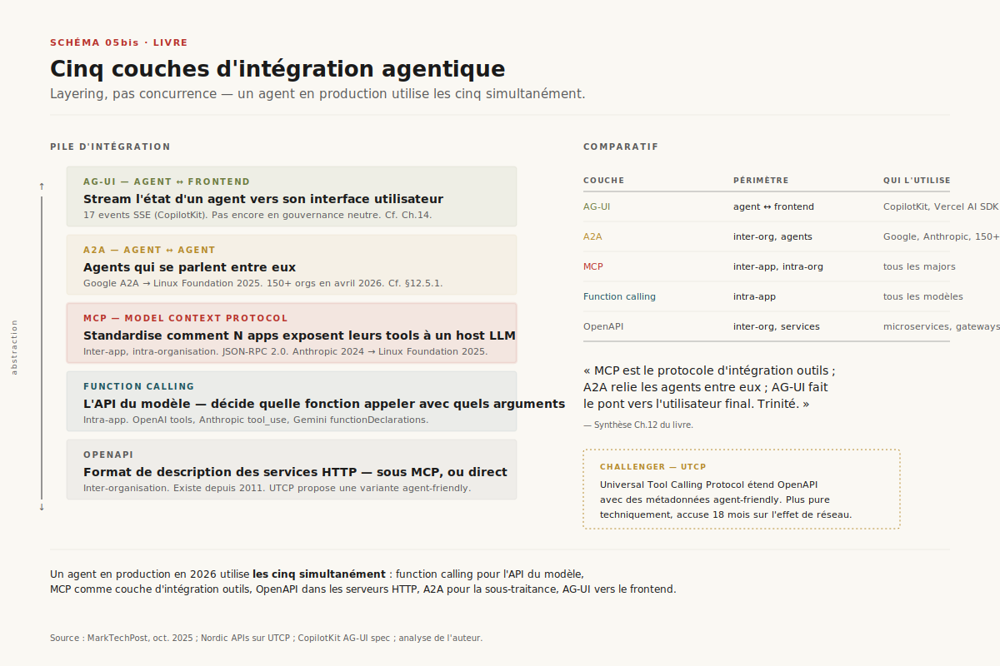

# Chapitre 12 — MCP, le HTTP des agents

> **Acte III — Les interfaces · Chapitre standard, ~22 pages**
> _En dix-huit mois, le Model Context Protocol est passé d'une initiative open-source d'Anthropic à une infrastructure industrielle qu'OpenAI, Microsoft, Google et AWS embarquent dans leurs runtimes. Pourquoi un protocole techniquement modeste a-t-il gagné si vite, et qu'est-ce que ça change pour l'architecte qui standardise sa stack ? Le [Ch. 13](ch13-mcp-securite.md) enchaîne avec la facture sécurité que cette adoption a précédée._

> [!QUESTION] Question d'ouverture
> Anthropic publie MCP le 25 novembre 2024 : 100 000 téléchargements SDK le mois suivant. Dix-huit mois plus tard, **97 millions** de téléchargements mensuels, **7 500 serveurs** actifs, **300+ clients**, et une donation à la Linux Foundation par Anthropic, Block et OpenAI réunis. Si l'effet de réseau a tranché si vite — sans qu'un comité de standardisation n'ait jamais voté quoi que ce soit — qu'est-ce que ça dit du **timing** des protocoles d'infrastructure, et pourquoi le décideur qui parie sur un format propriétaire en 2026 paie-t-il une dette de portabilité qu'il ne voit pas encore ?

> [!TLDR] TL;DR décideur
> - ==MCP a gagné par effet de réseau, pas par sa rigueur technique.== JSON-RPC 2.0 sur stdio ou HTTP, sans sémantique formelle, sans chain-of-trust, sans signature obligatoire. Sa modestie est précisément ce qui l'a fait adopter — exactement le pattern qui a fait gagner HTTP contre des protocoles plus rigoureux dans les années 90.
> - **Quatre couches d'intégration LLM ↔ outils coexistent**, et la lecture qui les présente en concurrence est fausse. Function calling = API du modèle (intra-app). MCP = protocole d'intégration au-dessus (inter-app, intra-org). OpenAPI = format de description en dessous (inter-org, service HTTP). A2A = couche encore au-dessus (agent ↔ agent). Un agent de production en 2026 utilise les quatre simultanément.
> - **Trois inflexions de gouvernance** dessinent la trajectoire : MCP donné à la Linux Foundation (Agentic AI Foundation, décembre 2025) ; A2A donné à la même fondation par Google (juin 2025, 150+ organisations en avril 2026) ; AG-UI émergeant comme standard de fait pour la couche frontend (CopilotKit, 17 events SSE). ==La trinité protocolaire MCP × A2A × AG-UI structure l'interopérabilité 2026-2027.==
> - **L'écosystème est plus concentré qu'il en a l'air.** 7 500 serveurs scannés, mais une dizaine de clients concentrent l'usage (Claude Desktop, ChatGPT desktop, Cursor, Windsurf, Continue, Cline, VS Code, Zed, Replit, Sourcegraph Cody). Anthropic déclare seul **plus d'un milliard d'appels MCP/mois** en mars 2026. La longue traîne est massive en nombre mais marginale en débit.
> - **L'adoption a précédé le durcissement.** Tool poisoning documenté dès mars 2025 (Invariant Labs), prompt injection cross-server avec le post-mortem Anthropic GitHub README-to-Tool de juin 2025, supply chain typosquatting 2026. ==Aucun mécanisme de signature des descriptions d'outils n'est encore obligatoire dans la spec à mai 2026.== La spec d'automne 2026, en discussion à l'AAIF, impose Sigstore — c'est le pivot. Le [Ch. 13](ch13-mcp-securite.md) documente le coût intégral de ce retard.

---

## 12.1 Pourquoi un protocole, pourquoi maintenant

Si les outils sont les *mains* de l'agent, MCP est **le câblage standardisé entre ces mains et le corps**. C'est l'objet qui transforme une intégration ad-hoc en couche d'interopérabilité — celle sur laquelle se branchent les surfaces agentiques ([Ch. 14](ch14-surfaces-agentiques.md)), les régimes de computer use ([Ch. 15](ch15-computer-use.md)), et les cas sectoriels régulés ([Ch. 16](ch16-analytics-agentique-banque.md)). Là où le [Ch. 8](ch08-outils-de-lagent.md) a montré **comment un LLM appelle une fonction** dans un même processus, il s'agit ici de **comment plusieurs fonctions appartenant à plusieurs équipes deviennent disponibles pour un même agent** sans réécriture par paire vendor × outil. Le [Ch. 13](ch13-mcp-securite.md), en dyade, documente le coût de sécurité que cette ouverture entraîne.

> [!INFO] Voir [Ch. 8 — Les outils (les mains de l'agent)](ch08-outils-de-lagent.md)
> Le [Ch. 8](ch08-outils-de-lagent.md) traite la primitive (`tool_use`, JSON Schema, exécution synchrone, retours formatés) à l'échelle d'un modèle et d'une application. Ici se traite le **protocole** qui standardise cette primitive entre acteurs hétérogènes. La discipline de lecture : sans avoir lu §8.2 sur les schémas JSON, on comprend la mécanique MCP mais on rate pourquoi la *description en langage naturel* d'un tool est exécutable au sens où le LLM peut l'interpréter comme une instruction.

### 12.1.1 Le déclic novembre 2024

Avant MCP, intégrer un LLM à un outil était un travail propriétaire et redondant. Chaque fournisseur exposait son propre format de **function calling** : OpenAI publie sa première version en juin 2023, Anthropic suit avec les `tool_use` blocks de Claude, Google ajoute le `functionDeclarations` à Gemini, Mistral son `tool_choice`. Les sémantiques sont proches mais incompatibles — un wrapper écrit pour OpenAI ne tournait pas sous Claude sans réécriture des schémas et des handlers.

Pour un éditeur d'IDE comme Cursor ou Continue, la conséquence était lourde. Donner à un agent l'accès au filesystem local, à un repo Git, à une base Postgres exigeait **N intégrations × M modèles × K applications** — produit cartésien classique. Chaque couple {Claude, OpenAI, Gemini} × {filesystem, GitHub, Slack, Jira, Postgres, …} était un projet. ==La fragmentation a été la norme jusqu'à fin 2024.==

Le 25 novembre 2024, Anthropic publie le Model Context Protocol[^5]. La proposition est minimaliste : **un protocole client-serveur sur JSON-RPC 2.0**, où un *host* (l'application qui embarque le LLM) lance un ou plusieurs *clients*, chacun parlant à un *serveur* qui expose des `tools`, des `resources`, et des `prompts`. La spec tient en quelques pages. Les SDK sortent en TypeScript et Python. Tout est sous licence MIT.


L'inflexion qui transforme la proposition en standard de fait survient le **26 mars 2025** : OpenAI annonce le support de MCP dans son Agents SDK, dans la Responses API, et dans le client desktop ChatGPT[^2]. Sam Altman tweete : « People love MCP and we are excited to add support across our products. » C'est la première fois qu'un fournisseur frontier adopte le protocole concurrent d'un autre fournisseur — bascule rare dans l'histoire des protocoles d'IA. Microsoft suit dans la foulée : MCP servers officiels pour GitHub, Azure, Teams et Microsoft 365 d'ici Q3 2025. Google ajoute le support à Gemini API et Vertex AI Agent Builder en Q1 2026.

Le 9 décembre 2025, Anthropic **transfère la gouvernance** du protocole à la Linux Foundation via la création de l'**Agentic AI Foundation (AAIF)**, co-fondée avec Block et OpenAI[^1]. Le geste est calculé : à ce stade, MCP n'est plus un asset stratégique pour Anthropic, c'est un standard industriel qu'il faut désamorcer politiquement avant qu'un fork ne se produise. La donation s'accompagne d'engagements de Microsoft, Google, AWS et Cloudflare. Le protocole devient **infrastructure neutre**, comme HTTP en 1994.

> [!NOTE] Le pattern industriel — IBM/Linux, Microsoft/TypeScript, Anthropic/MCP
> Un acteur dominant publie un standard ouvert, attend que la masse critique s'agrège, puis cède la gouvernance pour transformer la défense d'un standard en commodité industrielle. C'est la séquence qu'a suivie IBM avec Linux dans les années 2000, Microsoft avec TypeScript dans les années 2010, et Anthropic avec MCP en 2024-2025. La leçon de cette séquence : ==**plus vite vous donnez la gouvernance, plus vite votre format devient un commun**==. Tant que MCP appartenait à Anthropic, chaque adoption était un acte d'allégeance ; depuis la donation, c'est un acte d'opportunisme rationnel.

---

## 12.2 Architecture — client, serveur, transports

MCP repose sur **JSON-RPC 2.0**, un standard IETF de 2010, lui-même successeur d'XML-RPC. Chaque message est un objet JSON portant un `method`, des `params`, et soit un `id` (requête, attente d'une réponse) soit pas d'`id` (notification, fire-and-forget). C'est volontairement boring : ==aucune innovation au niveau du wire format==, l'innovation se joue ailleurs.

### 12.2.1 Trois rôles, un découplage

Trois rôles sont définis dans la spec[^4] :

- **Host** — l'application qui embarque le LLM (Claude Desktop, Cursor, ChatGPT desktop, un agent maison). Le host instancie un ou plusieurs clients et présente au modèle la liste agrégée des tools disponibles.
- **Client** — un connecteur 1-pour-1 vers un serveur. C'est le client qui négocie les capabilities à l'initialisation, route les requêtes JSON-RPC, et gère le cycle de vie (handshake, version, reconnect).
- **Server** — le processus qui expose les *primitives* : `tools` (fonctions appelables), `resources` (documents lisibles), `prompts` (templates), et plus récemment `sampling` (le serveur peut demander au host de relancer le LLM).

Cette séparation host / client / server est ce qui distingue MCP du function calling natif. En function calling, le modèle reçoit une liste de fonctions en paramètre d'appel et l'application qui héberge le modèle exécute ce qu'il décide d'appeler. En MCP, **le LLM ne voit jamais le serveur** : c'est le host qui présente au modèle une liste de tools agrégée, exécute les appels via les clients MCP, et renvoie les résultats. ==Le serveur peut être à l'autre bout du monde, écrit en Go, derrière un firewall — le modèle n'en sait rien.== C'est la propriété d'isolation qui rend MCP composable.

> [!EXAMPLE] Un handshake MCP minimal — le `initialize`
> ```json
> // Client → Server
> {
>   "jsonrpc": "2.0",
>   "id": 1,
>   "method": "initialize",
>   "params": {
>     "protocolVersion": "2025-06-18",
>     "capabilities": { "sampling": {}, "roots": {} },
>     "clientInfo": { "name": "Claude Desktop", "version": "1.4.2" }
>   }
> }
> // Server → Client
> {
>   "jsonrpc": "2.0",
>   "id": 1,
>   "result": {
>     "protocolVersion": "2025-06-18",
>     "capabilities": { "tools": { "listChanged": true }, "resources": {} },
>     "serverInfo": { "name": "mcp-github", "version": "0.7.1" }
>   }
> }
> ```
> Quelques dizaines d'octets. Aucune authentification *à ce stade* — le client a confiance dans le serveur parce qu'il l'a lui-même lancé (stdio) ou parce qu'il a déjà négocié OAuth (HTTP). Cette confiance préalable est l'angle sous lequel le [Ch. 13](ch13-mcp-securite.md) attaque la surface de risque.

### 12.2.2 Deux transports

Deux transports sont supportés en pratique en mai 2026[^3] :

- **stdio** — le host lance le serveur comme un sous-processus, pipe stdin/stdout, échange des messages JSON-RPC séparés par des newlines. C'est le transport par défaut pour les serveurs locaux (filesystem, sqlite, ripgrep). Latence sub-milliseconde, pas d'authentification requise puisqu'on parle à un processus enfant qu'on a soi-même lancé.
- **Streamable HTTP** — le serveur tourne en daemon, le client poste des requêtes HTTP, le serveur peut répondre soit en `application/json` (cas synchrone) soit en `text/event-stream` (SSE) pour streamer plusieurs messages. Adopté en juin 2025 en remplacement du transport SSE-only d'origine, jugé trop limitant. C'est le transport pour les serveurs distants (GitHub, Slack, Jira) — il transporte avec lui la question de l'authentification (OAuth 2.0 + PKCE désormais recommandé, voir §12.7 et [Ch. 13](ch13-mcp-securite.md) §13.5).

Le SSE pur, présent dans la première spec, est désormais marqué *legacy* mais encore supporté pour rétro-compatibilité. C'est un témoin du fait que la spec a évolué vite : **trois révisions majeures (2024-11, 2025-03, 2025-06) en dix-huit mois**, ce qui est rapide pour un protocole infrastructure. Le [Ch. 13](ch13-mcp-securite.md) §13.5 documente une partie de cette dette de jeunesse — *Dynamic Client Registration*, *token passthrough*, *session hijack SSE* — qui survit aux révisions parce que les serveurs déployés en production ne se mettent pas à jour à la même vitesse que la spec.

### 12.2.3 Composition multi-server : ce qui rend MCP utile à l'échelle

Le pattern qui rend MCP utile à l'échelle d'une équipe n'est pas le serveur unique, c'est la **composition** : un même host instancie plusieurs clients, chacun parlant à un serveur dédié. L'agent voit alors une liste agrégée de tools, comme s'ils venaient tous d'une seule source.


Cette composition est ce qui crée la valeur. Un agent de support technique peut avoir simultanément accès au filesystem (lire des logs), à GitHub (créer une issue), à Slack (notifier une équipe), et à Postgres (vérifier le statut d'un compte client). Quatre serveurs, quatre packages indépendants, quatre `npm install` ou `uvx`. C'est aussi ce qui crée la surface d'attaque ([Ch. 13](ch13-mcp-securite.md) §13.4) : ==un serveur compromis peut influencer la lecture des descriptions des trois autres==, parce que toutes les descriptions vivent dans le même prompt système. C'est l'angle *cross-server confusion* — namespace collision, tool shadowing, capability leak — que le [Ch. 13](ch13-mcp-securite.md) traite comme famille C des dix vecteurs documentés.

> [!INFO] Voir [Ch. 13 — Sécurité MCP : dix vecteurs × dix patterns](ch13-mcp-securite.md) §13.4
> La composition multi-server est la *valeur* du protocole et son *vecteur d'attaque principal* simultanément. Le [Ch. 13](ch13-mcp-securite.md) documente les trois sous-variants (namespace collision, tool shadowing, capability leak) et propose comme pattern défensif load-bearing l'**allowlist namespace par serveur** — l'utilisateur déclare au démarrage quels outils peuvent écrire, et toute écriture d'un outil non listé déclenche une confirmation.

---

## 12.3 L'effet de réseau — anatomie d'une bascule en dix-huit mois


L'adoption MCP suit une trajectoire qu'on retrouve à chaque protocole d'infrastructure qui gagne : **bascule en T+4 mois (mars 2025), gouvernance neutre en T+12 (décembre 2025), masse critique en T+15 (mars 2026)**. À chaque étape, le coût marginal de l'adoption baisse — d'abord pour les ingénieurs (le SDK est trivial), puis pour les intégrateurs (les serveurs deviennent disponibles en `npx -y`), enfin pour les décideurs (refuser MCP devient politiquement plus coûteux que l'adopter).

Trois métriques racontent la même histoire sous trois angles[^6][^2][^12] :

- **SDK téléchargements** : 100 000/mois en novembre 2024 → 97 millions en mars 2026. Facteur 970 en seize mois. Le pattern est exponentiel typique d'effet de réseau précoce.
- **Serveurs actifs** : 7 500+ scannés par crawl indépendant en mars 2026, ~9 000 dans le registry officiel (avec doublons), 19 000 dans MCP.so (registre communautaire plus permissif). Le décalage entre ces chiffres est en lui-même un signal — le marché s'organise mais la longue traîne reste massive.
- **Adoption enterprise** : ==78 % des équipes IA enterprise déclarent au moins un agent MCP en production en mars 2026==, contre 31 % un an plus tôt[^2]. C'est la métrique la plus politiquement chargée parce qu'elle traduit le passage du *engineering experiment* au *standard d'achat*.

> [!QUOTE] Why the Model Context Protocol Won — The New Stack, février 2026
> « MCP gagne parce qu'il est ennuyeux. C'est du JSON-RPC sur stdio ou HTTP, sans rien de plus que ce que l'IETF aurait pu publier en 2002. Et c'est précisément cette modestie qui explique l'adoption : il coûte si peu à implémenter qu'il est devenu rationnel de l'embarquer même quand on a déjà sa propre interface. »[^3]

Cette modestie technique est l'argument central. JSON-RPC 2.0 sur stdio aurait pu sortir en 2010 ; MCP n'invente rien sur le wire format. ==Ce qu'il invente, c'est une distribution *timing-correcte*== : quelques mois après que function calling soit devenu mainstream, avant que chaque éditeur d'IDE n'ait fini de bricoler son propre format propriétaire. La fenêtre était de trois à six mois — Anthropic l'a vue.

> [!IMPORTANT] La leçon pour le décideur — *protocoles boring vs protocoles intelligents*
> L'histoire des standards d'infrastructure n'est pas tendre avec la rigueur technique. HTTP a battu Gopher, SMTP a battu X.400, JSON a battu XML — chaque fois, le protocole le plus simple à implémenter a gagné contre le plus rigoureux. ==Refuser MCP en 2026 parce qu'il manque de typage formel ou de chain-of-trust== est l'erreur d'analyse classique : c'est précisément l'absence de friction d'adoption qui a fait gagner ces protocoles, et la gouvernance neutre se charge ensuite de combler les manques à l'usage. Le [Ch. 13](ch13-mcp-securite.md) documente ce qu'il en coûte aujourd'hui ; mais le coût d'attendre une spec plus rigoureuse pour adopter est, à mon avis, supérieur.

---

## 12.4 L'écosystème en 2026 — décompte et concentration

Le décompte exact des serveurs MCP est devenu un exercice politique. Plusieurs registres se font concurrence :

- **MCP Registry officiel** — lancé en preview le 8 septembre 2025, soutenu par Anthropic, GitHub, PulseMCP et Microsoft. C'est un *metaregistry* : il indexe la métadonnée (nom, description, repo, version) mais le code lui-même reste sur npm, PyPI ou Docker Hub. ~9 000 entrées brutes, ~2 700 repos uniques après déduplication.
- **MCP.so** — registre communautaire, plus ouvert sur les soumissions, ~19 000 serveurs déclarés.
- **Crawlers indépendants** — un audit de Meyhem en mars 2026 a crawlé 7 500+ serveurs accessibles publiquement[^12] — chiffre plus réaliste que les déclaratifs des registres.

Le décalage entre 19 000 (MCP.so), 9 000 (officiel), 7 500 (crawl) et **10 000 actifs revendiqués par Anthropic au moment de la donation**[^1] traduit deux faits structurels. D'abord, **la longue traîne** : la majorité des serveurs sont des wrappers d'API publiques (GitHub, Notion, Slack, Stripe, Google Drive…) écrits par un seul auteur, parfois en moins de cent lignes. Ensuite, **le taux de mortalité** : sur 12 000 serveurs identifiés par les registres, près d'un tiers ont des liens morts ou n'ont pas reçu de commit depuis plus de 90 jours.

Côté clients, le paysage est plus concentré : ==300+ clients déclarent un support MCP, mais une dizaine concentrent l'usage réel== — Claude Desktop, ChatGPT desktop, Cursor, Windsurf, Continue, Cline, VS Code (via GitHub Copilot), Zed, Replit, Sourcegraph Cody. **Anthropic seul déclare plus d'un milliard d'appels d'outils MCP par mois** via Claude Desktop et l'API en mars 2026. La forme du marché est typique d'un protocole infrastructure jeune : longue traîne massive côté serveurs (90 % du nombre, 10 % du débit) et concentration brutale côté clients (10 clients, 90 % du débit).

Le langage majoritaire des serveurs est **Python**, légèrement devant TypeScript — surprise relative puisque le SDK officiel a démarré TypeScript-first. Go et Rust complètent à parts marginales mais croissantes (les serveurs en Go sont sur-représentés dans les wrappers d'infrastructure, parce que les équipes plateforme y trouvent leur compte en latence et en empreinte mémoire).

> [!NOTE] Ce que la concentration côté clients change pour l'architecte
> Quand 10 clients concentrent 90 % du débit, leurs choix d'implémentation deviennent **standards de fait** avant que la spec ne tranche. Exemple : Cursor 0.45 impose un préfixe serveur obligatoire pour résoudre les collisions de namespace ; Claude Desktop 1.4 exige un consent à l'install pour tout outil partageant un nom avec un outil déjà connecté. Ces choix ne sont pas dans la spec MCP — mais comme ils sont déjà en production chez 60 % de la base installée, ils *deviennent* la spec d'usage. L'AAIF travaille à les rétro-codifier dans la révision automne 2026 ; en attendant, ==la pratique des clients dominants vaut spec==.

---

## 12.5 Les cinq couches d'intégration agentique — qui mange quoi ?

Une lecture commune présente MCP comme un concurrent du function calling natif des fournisseurs. ==C'est inexact.== Cinq couches d'intégration vivent à des niveaux d'abstraction différents et se composent plutôt qu'elles ne s'opposent[^11]. Trois sont orientées **vers les outils** (function calling, MCP, OpenAPI), une **vers les agents pairs** (A2A), une **vers l'utilisateur final** (AG-UI).



- **Function calling** est *l'API du modèle* : un protocole d'appel entre le runtime LLM et le runtime applicatif. Une fonction = un schéma JSON, un appel = une décision du modèle. C'est **intra-app** : la fonction et le modèle vivent dans le même processus ou la même requête API. La couche du [Ch. 8](ch08-outils-de-lagent.md).
- **MCP** est *le protocole d'intégration au-dessus* : il standardise comment plusieurs applications, possiblement écrites par plusieurs équipes, exposent leurs tools à un host LLM. Périmètre **inter-app, intra-organisation**. La couche traitée ici.
- **OpenAPI** est *le format de description en dessous* : il décrit des services HTTP. Un serveur MCP peut wrapper un OpenAPI ; un agent peut appeler directement un endpoint OpenAPI sans passer par MCP. Périmètre **inter-organisation, mais centré service HTTP**.
- **A2A (Agent-to-Agent)** est *la couche agents-pairs* : protocoles entre agents autonomes (Google A2A, donné à la Linux Foundation en juin 2025 ; Anthropic Computer Use ; divers travaux académiques). Une *Agent Card* publiée à `/.well-known/agent-card.json` permet à un agent de découvrir les capabilities d'un pair sans coordination préalable. Périmètre **inter-organisation, agent ↔ agent**. **150+ organisations** déclaraient un support en avril 2026.
- **AG-UI** est *la couche frontend* : un agent doit aussi parler à l'utilisateur, et pas seulement à ses outils. Porté par CopilotKit (équipe React open-source), pas encore en gouvernance neutre, mais en passe de devenir le standard de fait pour le pont **agent ↔ frontend**. **17 events SSE** standardisés (`message_delta`, `tool_call_start`, `tool_call_result`, `agent_handoff`, `state_update`…) que les UI clients (Vercel AI SDK, LangGraph UI, Anthropic Console UI) consomment.

L'erreur fréquente est de croire qu'il faut choisir. La réalité de production en 2026 est qu'**un même agent utilise les cinq** : il appelle des fonctions via le function calling natif de son modèle, ces fonctions sont implémentées par des clients MCP qui parlent à des serveurs qui eux-mêmes wrappent des OpenAPIs, certains de ces serveurs déclenchent à leur tour des sub-agents via A2A, et l'état de toute cette chorégraphie est streamé vers le frontend via AG-UI. ==C'est un *layering*, pas une compétition.==

> [!EXAMPLE] Un agent banque en production — les cinq couches dans le même appel
> Un agent KYC interroge un client : le LLM (function calling) décide d'appeler `check_identity_documents` ; le tool est routé via MCP au serveur `mcp-kyc-internal` ; ce serveur wrappe l'API HTTP du système KYC documentée en OpenAPI ; déclenche en parallèle, via A2A, un sub-agent de scoring fraude qui tourne sur un autre runtime ; et pendant ce temps, AG-UI stream à l'utilisateur les events `tool_call_start` / `tool_call_result` pour qu'il voie la progression. Cinq couches, un seul appel utilisateur. L'architecte qui n'en utilise qu'une rate soit la portabilité (FC seul, lock-in vendor), soit la séparation des préoccupations (MCP partout, on perd l'API REST documentée existante), soit la délégation multi-agent (pas d'A2A, l'agent doit tout faire lui-même), soit l'observabilité côté utilisateur (pas d'AG-UI, le frontend retombe à du long-polling artisanal). Le **layering** est l'angle d'architecture qui maximise l'optionalité — cf. [Ch. 11](ch11-patterns-orchestration.md) §11.5 sur le stack en trois couches.

### 12.5.1 La trinité MCP × A2A × AG-UI

Les cinq couches ne sont pas équivalentes en maturité. **Function calling et OpenAPI** sont des formats — ils décrivent des contrats, ils ne portent pas d'effet de réseau propre. **MCP, A2A et AG-UI** sont les **protocoles** qui définissent la stack d'interopérabilité agentique 2026-2027. C'est la trinité opérationnelle :

- **MCP** — agent ↔ outils, gouvernance Linux Foundation (AAIF) depuis décembre 2025, 7 500+ serveurs.
- **A2A** — agent ↔ agent, donné à la Linux Foundation par Google en juin 2025, 150+ organisations en avril 2026.
- **AG-UI** — agent ↔ frontend, porté par CopilotKit, pas encore donné à une fondation neutre — c'est le maillon faible de la trinité du point de vue gouvernance, mais le standard de fait s'impose par adoption client (Vercel AI SDK, LangGraph UI, Anthropic Console).

> [!INFO] Voir [Ch. 14 — Surfaces agentiques : quatre régimes d'accès](ch14-surfaces-agentiques.md)
> Le [Ch. 14](ch14-surfaces-agentiques.md) traite AG-UI comme couche de plomberie des quatre régimes d'accès (chat / copilote inline / canvas génératif / on-behalf-of). Ici, on situe AG-UI dans la trinité protocolaire — la profondeur sur les events SSE et leur articulation avec les patterns de confiance Anthropic *graduated trust* / Salesforce *trust layer* est traitée en §14.4.

==Chaque protocole de la trinité couvre une frontière distincte== (agent↔outils, agent↔agent, agent↔frontend) ; ensemble, ils définissent une stack d'intégration cohérente où aucun acteur ne contrôle toutes les couches. La trajectoire de gouvernance probable : AG-UI suit MCP et A2A vers la Linux Foundation d'ici fin 2026 — sinon le rapport de force se déséquilibre et un fork interne CopilotKit devient probable.

### 12.5.2 UTCP, l'alternative émergente

Une alternative émergente, **UTCP (Universal Tool Calling Protocol)**, mérite une mention. Lancée fin 2025 comme réaction à la complexité perçue de MCP, UTCP étend OpenAPI avec des métadonnées agent-friendly, permettant à un agent d'appeler directement un endpoint REST/gRPC/WebSocket sans passer par un serveur intermédiaire. UTCP est techniquement plus pure mais accuse 15-18 mois de retard sur l'effet de réseau de MCP — ==sa probabilité de survie tient surtout à sa capacité à se positionner comme **complément** plutôt que concurrent.== Les conversations en cours dans l'AAIF suggèrent qu'une convergence MCP-UTCP pour le sous-cas « *wrap an HTTP API* » est plausible en 2027 : UTCP fournirait la métadonnée OpenAPI enrichie, MCP fournirait le protocole de transport vers le host.

---

## 12.6 La surface de risque, vue depuis la plateforme

Le succès de MCP a précédé son durcissement de sécurité. L'avertissement le plus diffusé est venu de Simon Willison en avril 2025, qui résume le problème en une phrase :

> [!QUOTE] Simon Willison, Model Context Protocol has prompt injection security problems, avril 2025
> « The lethal trifecta is access to private data, the ability to read untrusted instructions, and exfiltration channels — and MCP combines all three by default. »[^9]


Quatre familles d'attaques sont aujourd'hui documentées et reproductibles[^7][^8][^11]. Le [Ch. 13](ch13-mcp-securite.md) les déroule en détail ; on les nomme ici pour boucler la cartographie plateforme.

- **Tool poisoning** — un serveur publie une description de tool dont le langage naturel contient des instructions cachées que le LLM lit comme commande. Aucune signature obligatoire ne protège aujourd'hui la description. Variants : description statique empoisonnée (Invariant Labs, mars 2025), rug pull (description rotative), Unicode tags invisibles (Pillar Security, novembre 2025), line-jumping. [Ch. 13](ch13-mcp-securite.md) §13.2.
- **Indirect prompt injection cross-document** — quand un agent compose plusieurs serveurs, le résultat de l'un peut contaminer les appels suivants. L'attaque *GitHub README-to-Tool* (post-mortem Anthropic, juin 2025) est canonique. [Ch. 13](ch13-mcp-securite.md) §13.3.
- **Supply chain** — un serveur MCP est un paquet npm ou PyPI comme un autre. Typosquatting (`mcp-githab` vs `mcp-github`), maintainer hijack, dependency confusion s'appliquent. ==10 des 14 paquets MCP les plus téléchargés sur npm exposaient au moins une CVE de dépendance non patchée== au scan MCPwn d'avril 2026. [Ch. 13](ch13-mcp-securite.md) §13.5.
- **Authentification trop tardive** — la spec d'origine n'avait pas de modèle d'auth. La révision 2025-06 a ajouté OAuth 2.0 + PKCE, mais beaucoup de serveurs en production utilisent encore des bearer tokens longue durée stockés en clair dans `~/.mcp/config.json`. La séparation entre identité utilisateur, identité serveur et identité agent reste floue. [Ch. 13](ch13-mcp-securite.md) §13.5.

OWASP a publié en mars 2026 un *MCP Top 10* qui canonise ces vecteurs et donne des recommandations défensives. ==La maturité des défenses reste en retard d'environ neuf mois sur les attaques connues== — ratio classique pour un protocole en phase d'adoption rapide.

> [!INFO] Voir [Ch. 13 — Sécurité MCP : dix vecteurs × dix patterns](ch13-mcp-securite.md)
> Le [Ch. 13](ch13-mcp-securite.md) est l'autre moitié obligée. Il documente les **six trust boundaries** géométriques de la surface MCP, les **quatre familles** d'attaques (A : tool layer, B : prompt layer, C : cross-server, D : transport & identité), les **dix vecteurs** documentés à mai 2026, et la **matrice défensive 10×10** dont **quatre patterns** sont load-bearing : Sigstore + hash pinning, tool tagging, allowlist namespace, HITL writes. À lire en dyade — la promesse plateforme et son coût ne se séparent pas.

---

## 12.7 Trajectoire 2026-2027 — commodification, durcissement, prochaine couche


Trois mouvements simultanés vont structurer la prochaine étape. ==Aucun ne remettra en cause la place de MCP comme couche par défaut, mais chacun va en redessiner les contours.==

### 12.7.1 Commodification — la consolidation des registres

Les registres concurrents (officiel, MCP.so, npm, PyPI, Docker Hub) vont consolider. Le pattern probable : un standard de métadonnée commun (similaire à `package.json` + un `mcp.json` complémentaire), des mirrors signés gérés par les hyperscalers (AWS, Azure, GCP, Cloudflare), et la disparition graduelle des registres communautaires non maintenus. Le couplage avec les marketplaces des IDE (Cursor, VS Code) jouera le rôle qu'a joué le Chrome Web Store pour les extensions — **concentration de la distribution sur trois ou quatre canaux**.

### 12.7.2 Gouvernance et durcissement — la spec automne 2026

L'AAIF va publier d'ici fin 2026 une révision majeure de la spec intégrant :

- **Signature cryptographique** des descriptions (probablement Sigstore-compatible).
- **Policy enforcement** obligatoire au niveau du host.
- **Isolation par défaut** entre serveurs (chaque tool dans son propre namespace de capabilities).
- Un **standard d'audit log** compatible avec OpenTelemetry GenAI semantic conventions.

OWASP MCP Top 10 deviendra la référence d'audit pour l'enterprise. Les premiers organismes notifiés AI Act commenceront à inspecter les déploiements MCP en production à partir de l'été 2026. ==Le calendrier réglementaire (AI Act art. 15, août 2026) et le calendrier technique (spec v2 Sigstore, automne 2026) convergent à ±60 jours== — coïncidence opportune pour les déployeurs qui veulent capitaliser sur les deux fronts en un seul effort de mise en conformité.

> [!IMPORTANT] AI Act art. 15 et Spec MCP v2 — un seul effort, deux conformités
> L'AI Act art. 15 (cybersécurité des systèmes IA haut risque, en vigueur 2 août 2026) impose une résistance documentée à la manipulation par entrée adverse. Pour un agent MCP en production, ==l'adoption de Sigstore + hash pinning + tool tagging + HITL writes coche simultanément== : (1) la conformité technique au futur MCP v2 ; (2) la documentation de robustesse exigée par l'art. 15 ; (3) la traçabilité d'audit pour le RSSI. Trois fronts, un seul investissement de plomberie. Cf. [Ch. 23](ch23-gouvernance-ai-act.md) §3 pour le calendrier réglementaire complet.

### 12.7.3 La prochaine couche — agent-to-agent et convergence MCP/A2A

MCP s'arrête à *un* agent qui parle à *plusieurs* serveurs. La vraie question infrastructurelle de 2027 sera **l'interopérabilité agent-à-agent à grande échelle** : un agent A peut-il sous-traiter une tâche à un agent B qu'il n'a jamais rencontré, sans coordination préalable de leurs équipes ?

C'est ce que tente A2A (Google) ; c'est aussi ce qu'esquissent les primitives `sampling` et `subagents` de MCP — qui pourraient progressivement absorber le cas d'usage A2A. À supposer que cette absorption ait lieu, MCP deviendrait **le protocole pivot du Web agentique**, exactement comme HTTP est devenu le protocole pivot du Web humain. Si elle n'a pas lieu, MCP restera bloqué à la couche tool-LLM et un autre protocole prendra l'agent-to-agent. ==Les deux scénarios sont également plausibles aujourd'hui== — c'est le pari à 18-24 mois qui fait débat dans l'AAIF.

---

## Récap chapitre — Cinq couches, une seule grille


==**À retenir** : Function calling = API du modèle (intra-app). MCP = protocole inter-app intra-org. OpenAPI = description service HTTP inter-org. A2A = agent ↔ agent inter-org. AG-UI = agent ↔ frontend.== Les cinq se composent dans un même appel de production. Refuser une couche, c'est refuser une dimension d'optionalité que la concurrente (vendor lock-in, code custom, REST direct, frontend artisanal) coûte beaucoup plus cher à compenser. Le pari pour les douze prochains mois est moins technique que politique : la gouvernance via la Linux Foundation tiendra-t-elle face aux tensions entre les co-fondateurs (Anthropic, OpenAI, Block) qui restent par ailleurs concurrents sur les modèles ? AG-UI rejoindra-t-il la trinité gouvernée, ou restera-t-il sous tutelle CopilotKit ? La trajectoire de Kubernetes (CNCF, neutre, succès) versus celle d'OpenStack (factionalisée, déclin) est le précédent à suivre.

---

> [!WARNING] Piège classique
> Réinventer MCP en propriétaire. Chaque SDK qui fige son propre protocole d'intégration outils-LLM **enferme ses outils dans sa chapelle**. Le jour du changement de vendor, la migration coûte des trimestres au lieu de semaines. Et l'argument *« on a déjà notre propre format »* ne tient que tant que l'écosystème reste petit : à 7 500 serveurs MCP disponibles à `npx -y` près, le coût marginal d'adopter le standard est inférieur au coût marginal de maintenir un format alternatif. ==La gouvernance neutre n'existe pas pour rien — c'est l'assurance anti-balkanisation que l'écosystème a souscrit collectivement en décembre 2025==. Refuser d'y participer en 2026 sera, à 24 mois, l'équivalent technique d'avoir refusé HTTP en 1996.

---

## Sources

[^1]: Anthropic, *Donating the Model Context Protocol and Establishing the Agentic AI Foundation*, 9 décembre 2025. <https://www.anthropic.com/news/donating-the-model-context-protocol-and-establishing-of-the-agentic-ai-foundation>

[^2]: Pento, *A Year of MCP: From Internal Experiment to Industry Standard*, janvier 2026. <https://www.pento.ai/blog/a-year-of-mcp-2025-review>

[^3]: The New Stack, *Why the Model Context Protocol Won*, février 2026. <https://thenewstack.io/why-the-model-context-protocol-won/>

[^4]: Spécification officielle, *Transports — Model Context Protocol*, révision 2025-06-18. <https://modelcontextprotocol.io/specification/2025-06-18/basic/transports>

[^5]: Anthropic, *Introducing the Model Context Protocol*, 25 novembre 2024. <https://www.anthropic.com/news/model-context-protocol>

[^6]: Wikipédia, *Model Context Protocol*. <https://en.wikipedia.org/wiki/Model_Context_Protocol>

[^7]: Palo Alto Networks Unit 42, *New Prompt Injection Attack Vectors Through MCP Sampling*, mars 2026. <https://unit42.paloaltonetworks.com/model-context-protocol-attack-vectors/>

[^8]: Invariant Labs, *MCP Security Notification: Tool Poisoning Attacks*, mars 2025. <https://invariantlabs.ai/blog/mcp-security-notification-tool-poisoning-attacks>

[^9]: Simon Willison, *Model Context Protocol has prompt injection security problems*, 9 avril 2025. <https://simonwillison.net/2025/Apr/9/mcp-prompt-injection/>

[^10]: Microsoft Developer Blog, *Protecting against indirect prompt injection attacks in MCP*, 2026. <https://developer.microsoft.com/blog/protecting-against-indirect-injection-attacks-mcp>

[^11]: MarkTechPost, *MCP vs Function Calling vs OpenAPI Tools — When to Use Each?*, 8 octobre 2025. <https://www.marktechpost.com/2025/10/08/model-context-protocol-mcp-vs-function-calling-vs-openapi-tools-when-to-use-each/>

[^12]: R. Mecham (Meyhem), *I crawled 7,500+ MCP servers. Here's what I found.*, mars 2026. <https://api.rhdxm.com/blog/crawled-7500-mcp-servers>

[^13]: Mathieu Guglielmino, *MCP, le HTTP des agents — Model Context Protocol gagne par effet de réseau, pas par sa rigueur technique*, 8 mai 2026.
