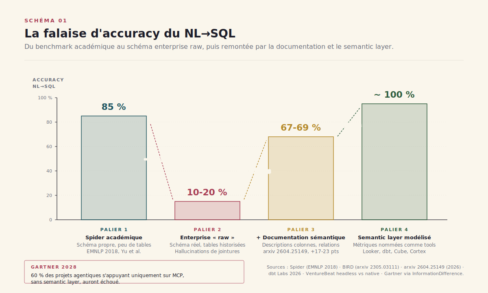
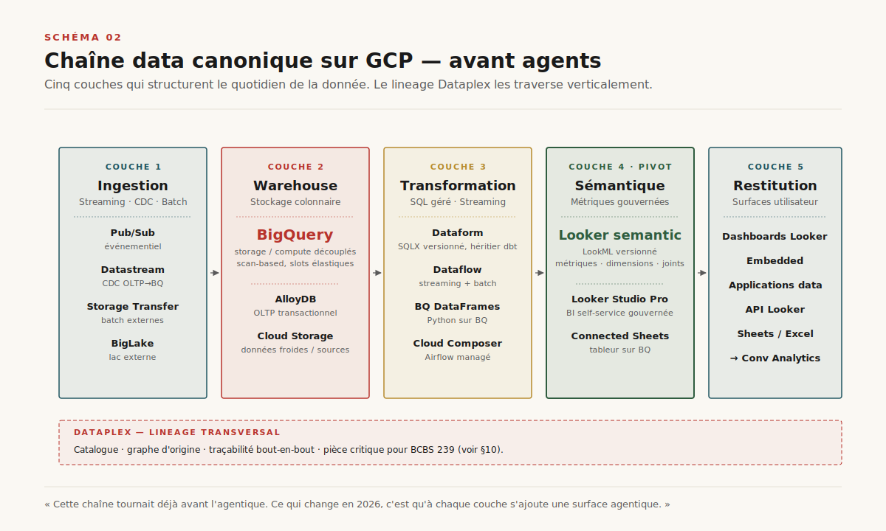
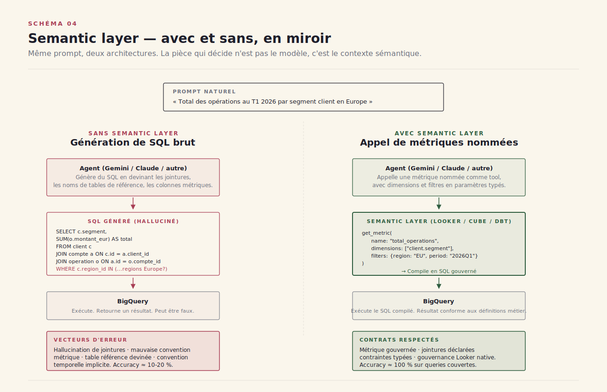
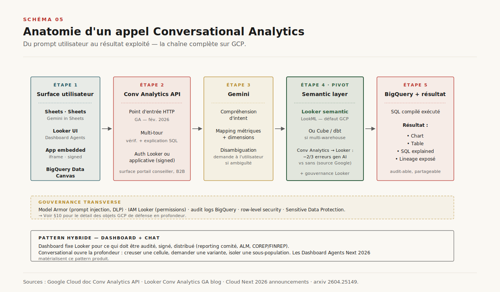
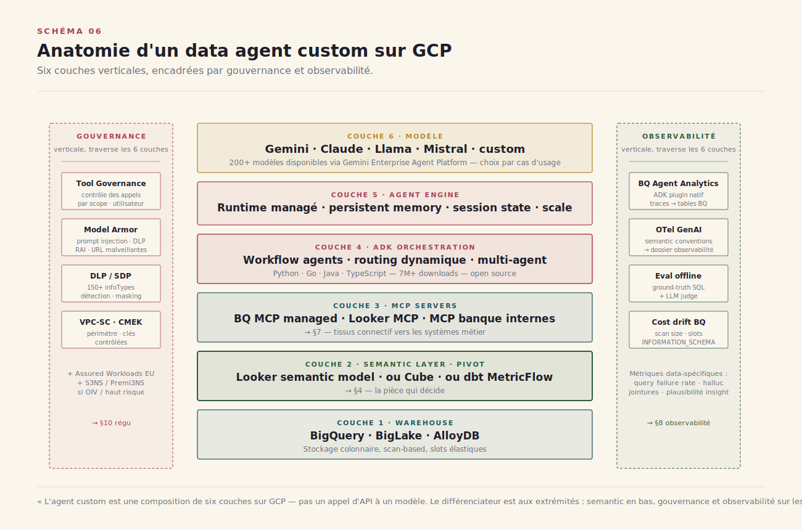
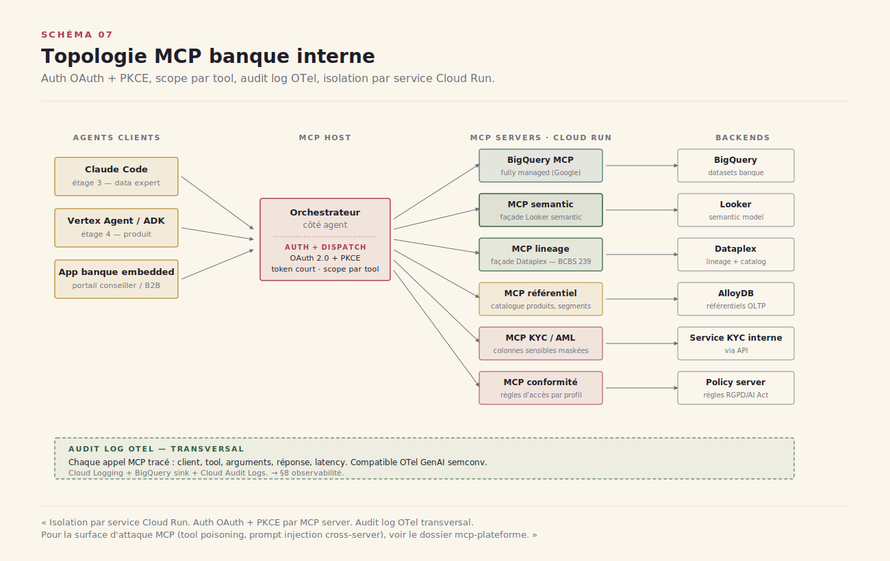
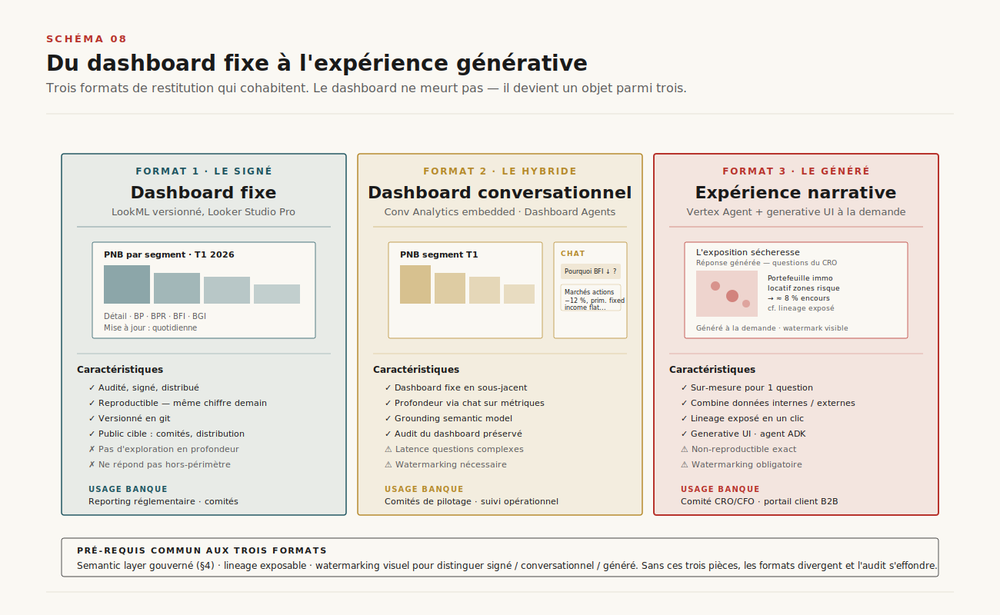
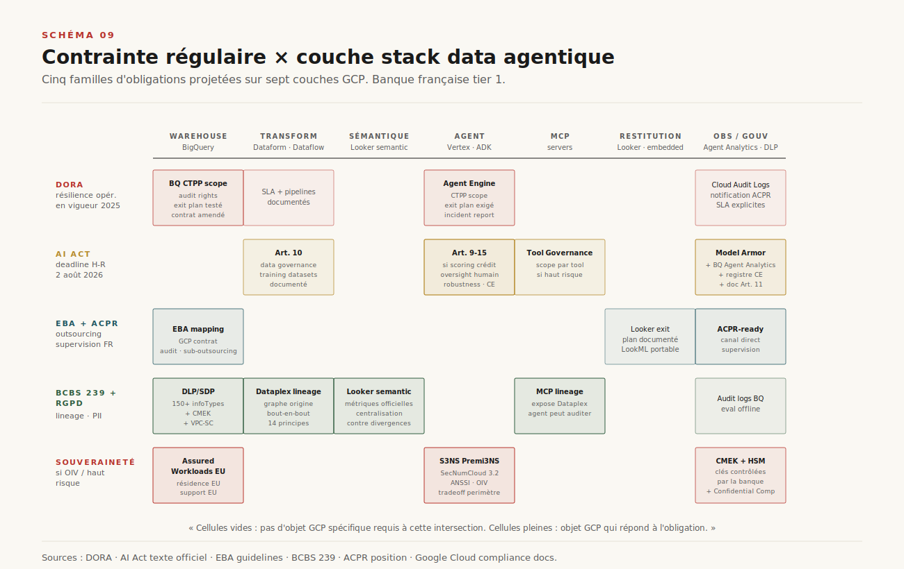
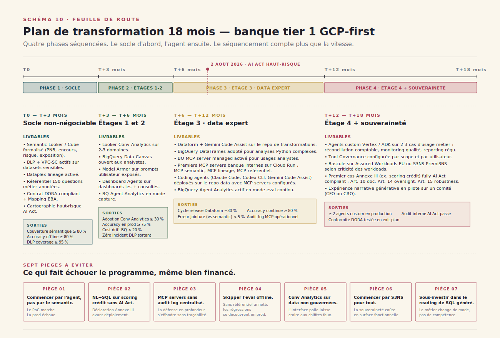

# Chapitre 16 — Analytics agentique : la stack data + IA en sectoriel régulé

> **Acte III — Les interfaces · Chapitre standard, ~24 pages (dont encart 4 pages)**
> _Le Ch.14 a posé quatre régimes d'accès, le Ch.15 a zoomé sur le sous-régime extrême. Ce chapitre ferme l'Acte III en instanciant les trois objets sur un cas concret : la stack data + IA d'une **banque française tier 1** sur Google Cloud, à 75 jours de l'échéance AI Act haut-risque (2 août 2026). Trois surfaces agentiques (conversational analytics / agents custom / MCP banque), un pivot d'architecture (le semantic layer), une matrice régulaire à six référentiels superposés, et une feuille de route 18 mois construite autour d'un ratio 70/20/10 contre-intuitif. L'encart §16.14 ferme l'Acte sur la généalogie des expériences narratives — la troisième voie d'interaction qui ne se range ni en chat, ni en copilote, ni en canvas._

> [!QUESTION] Question d'ouverture
> Le scénario qui vend tout seul : un dirigeant ouvre un chat, tape *« quel a été le PNB de la banque privée au T1 par région avec variation YoY ? »*, et reçoit la réponse sourcée, avec un graphique. Le scénario marche en démo. Il ne marche pas en prod. Les benchmarks académiques de NL→SQL — Spider, BIRD — atteignent **85 % d'accuracy** ou plus avec les modèles frontière[^24]. En entreprise, sur des schémas réels, les chiffres s'effondrent : ==**10–20 %** d'accuracy[^11]==. Et Gartner publie fin 2025 une projection qui circule : à 2028, ==**60 % des projets agentiques s'appuyant uniquement sur MCP sans semantic layer auront échoué**==[^14]. Si la falaise est mesurée, le pivot n'est plus *quel modèle* mais *quel semantic, quelle stratégie MCP, quel niveau de gouvernance* — et le calendrier régulaire ne décale pas.

> [!TLDR] TL;DR décideur
> - ==Le NL→SQL « brut » s'effondre en production.== 85 %+ Spider académique, **10-20 % schémas enterprise réels**[^11], **+17 à +23 points** avec contexte sémantique[^12], proche de 100 % sur queries couvertes par un semantic layer bien posé[^13]. Le pivot d'architecture est sémantique, pas modèle.
> - **Trois surfaces agentiques sur GCP** structurent les choix 2026. Conversational analytics (Looker Conv Analytics GA, BQ Data Canvas, Conv Analytics API embedded), agents custom (Gemini Enterprise Agent Platform + ADK 7M downloads), MCP banque (BQ MCP server *fully managed remote*, MCP Toolbox column-level, 4 MCP servers banque internes à construire — sémantique / lineage / référentiel / conformité).
> - ==Six référentiels superposés en banque française tier 1.== DORA (Google Cloud désigné CTPP — résilience du cloud = sujet du conseil), AI Act art. 9-15 (échéance **2 août 2026** pour systèmes haut-risque dont scoring crédit), EBA Outsourcing, BCBS 239 (lineage — seules **2 G-SIBs sur 31** *fully compliant*[^9]), RGPD art. 22 (droit à l'explication), ACPR Tech Sprint + Lab Banque de France. Souveraineté à trois niveaux : Assured Workloads EU, Sovereign Controls partenaires, **S3NS Premi3NS SecNumCloud 3.2** pour OIV.
> - **Asymétrie d'investissement recommandée : 70/20/10.** Sur un budget agentique data en banque, ~70 % au socle (semantic, lineage Dataplex, observabilité, DLP, eval offline), ~20 % à la couche agent (orchestration, MCP servers internes), ~10 % au LLM. ==C'est exactement l'inverse de la répartition intuitive== — et c'est ce qui distingue les projets qui passent en prod de ceux qui meurent au PoC.
> - **Le marché s'est aligné en dix-huit mois.** Snowflake (Cortex Analyst + Agents + Code + AI Guardrails GA mai 2026), Databricks (Genie + Agent Bricks), Microsoft Fabric (Copilot + Data Agents consommables via MCP) ont tous convergé. Le différenciateur GCP n'est plus le modèle mais le Looker semantic + l'ouverture ADK + la souveraineté S3NS.

---

## 16.1 La place de ce chapitre — instanciation sectorielle

### 16.1.1 Pourquoi un cas banque française tier 1 sur GCP

Le Ch.16 ferme l'Acte III en quittant l'analyse transverse pour une **instanciation sectorielle**. C'est le seul chapitre du livre qui prend ce parti : un cas concret — une banque française tier 1 déjà sur GCP — sert de cadre pour montrer comment se composent en pratique les régimes du Ch.14, le pilotage écran du Ch.15, la matrice MCP du Ch.13, et la grille Knight du Ch.14 §14.8.

Le choix de la banque française tier 1 n'est pas anodin. ==C'est le secteur où la pression réglementaire est la plus dense en 2026== — six référentiels se superposent (DORA, AI Act, EBA Outsourcing, BCBS 239, RGPD, ACPR), trois niveaux de souveraineté coexistent (Assured Workloads EU, partenaires souverains, S3NS SecNumCloud 3.2), et l'échéance AI Act haut-risque du 2 août 2026 tombe à 75 jours du jour où ce chapitre est écrit. Ce qui résiste à cette pression résiste à la majorité des autres secteurs régulés (assurance, énergie, santé, défense).

Le choix de GCP comme cible n'est pas non plus exclusif. Le Ch.16 §16.12 compare ponctuellement Snowflake, Databricks, Microsoft Fabric — les patterns proposés ici s'instancient sur les autres warehouses moyennant traduction (Looker semantic ↔ Cortex Analyst YAML ↔ Power BI semantic model ↔ Unity Catalog métriques).

> [!INFO] Voir Ch. 23 — Gouvernance : AI Act, machine unlearning, calendrier réglementaire
> Le présent chapitre traite la **régulation comme contrainte d'architecture sectorielle**. Le Ch.23 traite la régulation comme **grille générale** : calendrier 2026-2027 complet, machine unlearning (CNIL, EDPS, retraining-free papers 2025-2026), rôles DPO / RSSI / Sponsor pour chaque obligation. ==La discipline éditoriale est stricte== : les articles AI Act (9 à 15) sont **nommés** ici mais **déroulés** en Ch.23 ; les modalités de gouvernance interne (qui signe quoi) sont en Ch.23. Le Ch.16 montre comment ça se concrétise sur un cas concret — scoring crédit, reporting réglementaire, agent ITSM banque.

### 16.1.2 La position dans le calendrier

L'échéance n'est pas symbolique : ==l'AI Act haut-risque entre en vigueur le **2 août 2026**==[^7]. Tout système d'IA utilisé pour évaluer la solvabilité d'une personne physique ou attribuer un score de crédit (à l'exception de la détection de fraude) sera *haut-risque* — Annexe III. Pour une banque française qui veut déployer un agent NL→SQL sur des données client, qui veut industrialiser le reporting réglementaire, qui veut automatiser le scoring : la conformité n'est plus optionnelle, elle est la condition de mise en prod. C'est dans ce calendrier que se cadrent les choix d'architecture du présent chapitre.

---

## 16.2 La rupture analytique en 2026 — la falaise du NL→SQL

### 16.2.1 Spider académique vs schéma enterprise réel

Les benchmarks académiques de text-to-SQL — Spider, BIRD, BIRD-INTERACT — atteignent 85 % d'accuracy ou plus avec les modèles frontière[^24]. Mais ces benchmarks sont *sales* — au sens où ils ont été nettoyés. Une analyse récente du benchmark BIRD a relevé ==**52,8 % d'erreurs d'annotation** dans certains subsets ; après correction, les performances bougent de -3 à +31 points selon le système==[^25]. Et surtout, les schémas y sont propres : peu de tables, noms de colonnes explicites, pas de table de référence intermédiaire, pas d'historisation slowly-changing.

En entreprise, les chiffres s'effondrent. Plusieurs études de praticiens placent l'accuracy NL→SQL sur des bases internes réelles entre **10 % et 20 %**[^11]. ==La raison n'est pas un défaut du modèle ; c'est que le modèle, face à un schéma qu'il ne comprend pas, hallucine des jointures.== Il devine la relation entre deux tables, choisit la colonne dont le nom ressemble le plus à ce qu'on a demandé, et produit un SQL syntaxiquement correct mais sémantiquement faux. Le résultat passe le compilateur, parfois même le visuel — mais il ne dit pas ce qu'on croit qu'il dit.

L'écart se rattrape — mais pas par un meilleur modèle. ==Il se rattrape par un meilleur *contexte*.== Ajouter de la documentation sémantique aux tables (descriptions de colonnes, relations explicites, métriques nommées) gagne 17 à 23 points selon les benchmarks récents[^12]. Et passer à un semantic layer formel — où les métriques sont définies une fois, et où l'agent n'écrit pas le SQL mais appelle `get_metric(pnb, dimension=region, period=q1_2026)` — fait tomber l'accuracy à des niveaux proches de **100 %** sur les queries couvertes[^13]. La §16.5 développe cette mécanique.

### 16.2.2 Pourquoi la chaîne data n'est pas la chaîne code

La rupture agentique sur la chaîne code (cf. dossier `coding-agents/`) a un atout : ==le test unitaire==. Un coding agent peut écrire du code, le compiler, le tester, observer la sortie, recommencer. La boucle est fermée par un signal objectif. **La chaîne data n'a pas cet équivalent évident.** Un SQL qui retourne 1 234 567 lignes peut être faux. Une jointure qui multiplie les lignes par doublon non géré peut passer inaperçue. Une métrique recalculée à la volée par l'agent peut diverger d'un quart de point sans qu'aucun test ne le rattrape.

C'est pour ça que la chaîne data exige des garde-fous qui n'existent pas par défaut sur la chaîne code : le **semantic layer** (qui contraint la définition de la métrique), le **lineage** (qui trace l'origine d'une donnée), l'**observabilité agentique** (qui détecte la dérive des coûts BigQuery ou la régression d'accuracy), et l'**évaluation offline** (qui exécute périodiquement un référentiel de questions métier annotées). ==Sans ces quatre pièces, déployer un agent data en banque est un pari sur l'absence d'audit.==

---

## 16.3 La chaîne data GCP « avant agents »

Avant de décrire les surfaces agentiques, on fixe le vocabulaire. La chaîne data sur GCP s'articule autour de cinq couches. Le lecteur averti peut sauter au §16.4.

**Ingestion**. Pub/Sub pour le streaming événementiel (paiements, trades, événements client), Datastream pour la réplication CDC depuis les bases opérationnelles (Oracle, MySQL, Postgres), Storage Transfer pour les batchs depuis l'extérieur, BigLake pour interroger les données restées sur Cloud Storage ou des lacs externes sans les déplacer.

**Warehouse**. BigQuery comme entrepôt central — stockage colonnaire séparé du compute, scalabilité fonctionnelle sans gestion de capacité. AlloyDB pour les workloads OLTP qui doivent rester transactionnels (référentiel client, KYC en lecture).

**Transformation**. Dataform pour les transformations SQL versionnées (héritier de l'approche dbt, intégré à BigQuery, désormais doté de Gemini Code Assist[^27]). Dataflow pour les pipelines de streaming et batch programmatiques. Cloud Composer (Airflow managé) pour l'orchestration multi-source.

**Sémantique et serving**. ==Le Looker semantic model (LookML)== définit centralement les métriques, dimensions et relations. Looker Studio Pro et Connected Sheets exposent ces définitions à la BI self-service et au tableur. ==C'est cette couche qui devient stratégique en 2026== — la §16.5 y revient en profondeur.

**Restitution**. Dashboards Looker, embedded analytics, applications data construites au-dessus de l'API Looker, et désormais expériences conversationnelles via Conversational Analytics API[^16]. Et, en parallèle, les fichiers Excel et Sheets qui restent le format de sortie n°1 dans la banque.

Le lineage traverse verticalement. Dataplex catalogue les sources, capture les transformations, expose le graphe d'origine — pièce clef pour BCBS 239 (§16.11). ==Cette chaîne tournait déjà avant l'agentique. Ce qui change en 2026, c'est qu'à chaque couche s'ajoute une surface agentique.==

---

## 16.4 Trois surfaces agentiques — pyramide × chaîne

Le dossier `coding-agents/` propose une pyramide à quatre étages d'usage : transverse, data quotidien, data expert, produit-décideurs. Cette pyramide se réinstancie sur la chaîne data. À chaque étage, des outils GCP différents. Mais ce qui structure les choix d'architecture ne s'aligne pas sur les étages — ça s'aligne sur ==trois surfaces transverses== qui traversent les étages : conversational analytics, agents custom, MCP.

**Étage 1 — Transverse**. Les utilisateurs métier qui ne savent pas écrire SQL et n'ont pas envie d'apprendre. Pour eux : Gemini in Sheets (questions naturelles sur un onglet), Connected Sheets (interrogation BigQuery via tableur sans une ligne de code), Looker Conversational Analytics dans une fenêtre de chat embedded[^2]. Pas d'autonomie sur la donnée — ils consomment ce que le semantic layer expose.

**Étage 2 — Data quotidien**. Analystes métier, contrôleurs de gestion, chargés de reporting. Ils manipulent la donnée régulièrement mais ne sont pas développeurs. Pour eux : BigQuery Data Canvas[^15] avec son DAG visuel et son chat AI assistive, Looker (dashboards + Dashboard Agents), NotebookLM Enterprise pour la synthèse documentaire. Ils écrivent du SQL parfois, mais ==l'écart entre « écrire à la main » et « relire et corriger ce que Gemini propose » devient le mode dominant==.

**Étage 3 — Data expert**. Ingénieurs data, data scientists, data engineers. Ils écrivent du code, gèrent les pipelines, déploient les modèles. Pour eux : Gemini Code Assist dans la console BigQuery et dans Dataform[^27], BigQuery DataFrames pour le Python sur BQ, Data Engineering Agent[^28] pour générer des pipelines, Colab Enterprise pour les notebooks, et au-dessus de tout cela les coding agents (Claude Code, Codex CLI, GitHub Copilot) sur le repo data — couplés aux MCP servers BigQuery, Looker, Dataform. C'est l'étage qui change le plus vite.

**Étage 4 — Produit / décideurs**. Cas d'usage exposés directement aux clients, aux partenaires ou aux décideurs. Pour eux : agents custom Vertex Agent Builder / Gemini Enterprise Agent Platform[^3], ADK code-first[^17], expériences narratives génératives, applications data conversationnelles embedded via Conversational Analytics API. ==C'est l'étage le plus exigeant en gouvernance== — c'est celui où la latence, la conformité, la traçabilité ne sont plus négociables.

Les trois surfaces transverses se distribuent ainsi : **conversational analytics** est dominante aux étages 1-2 (Looker + BQ Data Canvas + Conv Analytics API), **agents custom** dominent aux étages 3-4 (Vertex/ADK), **MCP** est le tissu connectif qui circule entre les étages 3 et 4. La §16.6 développe la première surface, la §16.7 la deuxième, la §16.8 la troisième.

---

## 16.5 Le pivot sémantique — la section la plus technique

C'est la section où le RDV banque se joue. Elle est plus longue et plus dense que les autres ; ==c'est la thèse load-bearing du chapitre==.

### 16.5.1 La mécanique de l'hallucination de jointure

Considérons un schéma banque simple : trois tables — `client` (id, segment, region_id), `compte` (id, client_id, type, devise) et `operation` (id, compte_id, montant_eur, date). Un dirigeant demande : *« total des opérations au T1 2026 par segment client en Europe »*.

Un agent sans semantic layer va :

- chercher les colonnes qui ressemblent à `segment` → trouvée dans `client.segment`
- chercher la jointure `client` → `operation` → il infère via `client.id = compte.client_id` puis `compte.id = operation.compte_id` (correct, ici)
- chercher la dimension `Europe` → trouve `client.region_id`, suppose qu'il existe une table `region` dont il devine le nom (`regions` ? `dim_region` ? `referentiel_region` ?) — il choisit le plus probable et hallucine au besoin
- chercher la métrique `total` → `SUM(operation.montant_eur)` (correct)
- filtre date sur Q1 2026 (correct)

Si la table de référence régions s'appelle effectivement `referentiel_region`, la query passe. Sinon, elle échoue silencieusement ou retourne 0. ==Mais surtout, si `montant_eur` représente en réalité le montant en devise convertie *à la date de l'opération* alors que le métier attend une conversion *à la date de clôture*, la query passe mais le résultat est faux d'environ 1 à 3 % — invisiblement.==

C'est le problème structurel. Un schéma de base de données dit *où* les données sont. Il ne dit pas *ce qu'elles signifient*.

### 16.5.2 Warehouse-native vs headless

Le semantic layer est la pièce qui dit ce que les données signifient. Il existe en deux architectures.

**Warehouse-native**. Le semantic layer vit dans la plateforme de données. Sur GCP : ==le Looker semantic model (LookML)== — métriques, dimensions, jointures, hiérarchies définies en YAML et versionnées en git. Sur Snowflake : Cortex Analyst lit un fichier de modèle sémantique YAML[^29]. Sur Microsoft : le semantic model Power BI / Fabric. Sur Databricks : Unity Catalog métriques.

**Headless**. Le semantic layer est un composant indépendant — ==dbt Semantic Layer (MetricFlow) ou Cube==[^30]. Il vit entre l'application et l'entrepôt, et peut servir plusieurs warehouses. Cube ship également un MCP server natif : les agents appellent des métriques nommées comme des tools, sans écrire de SQL[^31]. dbt fournit la même intégration via le dbt Cloud MCP server.

### 16.5.3 Le choix pour une banque française tier 1 GCP-first

Le bon défaut, pour une banque déjà sur GCP all-in, est ==le Looker semantic model==. Trois raisons.

D'abord, **il existe déjà** : la plupart des banques sur GCP ont du Looker en production, donc un modèle sémantique partiel déjà versionné. C'est un actif que l'agentique réutilise, pas un coût qu'elle invente.

Deuxièmement, **l'intégration Conversational Analytics → Looker semantic est native et mesurée** : Google publie que pairer Conv Analytics API avec Looker ==réduit les erreurs de gen AI sur les requêtes naturelles **de deux tiers**==[^16]. C'est le chiffre à montrer au sponsor qui hésite entre headless et warehouse-native.

Troisièmement, **le périmètre métier le plus exigeant** — reporting réglementaire, scoring crédit, ALM — bénéficie d'un modèle gouverné centralement, ce qui simplifie le contrôle ACPR.

Le scénario qui justifie *Cube* ou *dbt MetricFlow* : multi-warehouse (parties de l'estate sur Snowflake ou Databricks suite à une acquisition), volonté d'isoler le semantic du fournisseur cloud, ou stack data déjà majoritairement dbt — auquel cas dbt Semantic Layer + son MCP server est cohérent.

Le scénario à éviter : laisser chaque équipe définir ses métriques dans son notebook, son dashboard ou son agent. C'est exactement ce contre quoi le semantic layer est conçu, et c'est ce qui produit ==les divergences de 0,5 à 3 % entre rapports==. Pour BCBS 239 (§16.11), c'est non-conforme par construction.

### 16.5.4 La projection Gartner — pivot pour le sponsor

Gartner publie, fin 2025, une projection citée plusieurs fois dans la presse spécialisée : ==à 2028, **60 % des projets agentiques s'appuyant uniquement sur MCP, sans semantic layer, auront échoué**==[^14]. La même note projette que les organisations qui priorisent la sémantique dans leur data « AI-ready » verront leur accuracy GenAI augmenter de 80 % et leurs coûts baisser de 60 %. ==On peut discuter les pourcentages ; la direction du gradient n'est pas contestée.== Le semantic layer est devenu une condition de mise en prod, plus une option d'architecture.

> [!IMPORTANT] Le pivot d'architecture en 2026 n'est pas le modèle, c'est le semantic
> Pour un directeur data qui doit arbitrer entre *« on prend le modèle le plus cher »* et *« on construit le semantic »*, la grille est claire : le delta de qualité d'un modèle frontière à l'autre est de 2-3 points sur les benchmarks NL→SQL ; le delta apporté par un semantic layer bien posé est de **80 points** (10 % → ~95 %). ==L'asymétrie est telle qu'aucun investissement sur le modèle ne rattrape un déficit de semantic.== C'est ce que matérialise le ratio 70/20/10 du §16.13.

---

## 16.6 Surface 1 — Conversational Analytics

Première surface agentique, et la plus avancée commercialement sur GCP en mai 2026.

### 16.6.1 BigQuery Data Canvas

Data Canvas est l'interface visuelle de BigQuery centrée sur le workflow analytique[^15]. Quatre éléments structurants :

- ==Un **DAG d'exploration**.== Les requêtes successives s'enchaînent dans un graphe orienté, qu'on peut brancher et fusionner. C'est l'équivalent visuel d'un notebook où chaque cellule serait dépendante des précédentes, mais avec la possibilité d'explorer plusieurs branches en parallèle.
- **Le NL guidé**. À chaque nœud du DAG, on peut interroger en langage naturel. Gemini propose alors le SQL, l'utilisateur valide ou amende. ==Pas de prétention au « zéro SQL » — la plupart des analystes lisent et corrigent.==
- **Le chat AI-assistive**. Depuis Cloud Next 25, le canvas a un mode chat qui couvre l'ensemble du workflow — découverte, transformation, viz. Pour les problèmes complexes (forecasting, anomaly detection), le chat peut produire du Python exécuté dans une sandbox managée plutôt que du SQL — c'est l'intégration de BigQuery DataFrames avec le canvas[^15].
- **La découverte assistée**. Gemini suggère, à partir des tables sélectionnées ou des tables fréquemment utilisées, des questions naturelles pertinentes et leur SQL correspondant. Pattern d'onboarding très efficace pour les analystes qui découvrent un nouveau domaine.

Cas d'usage banque typique pour Data Canvas : ==reporting interne semi-structuré==. Suivi opérationnel d'un département, analyse ad-hoc d'incident, exploration de cohorte client. Pas pour des chiffres réglementaires officiels — ceux-là passent par des pipelines Dataform versionnés et un semantic layer.

### 16.6.2 Looker Conversational Analytics

Conv Analytics Looker[^2] est en GA depuis fin 2025 et a reçu des mises à jour majeures à Cloud Next 2026[^32]. Trois capacités structurantes :

- ==**Grounding sur le semantic model Looker**.== Toutes les requêtes naturelles sont résolues via LookML — l'agent n'écrit pas de SQL brut, il compose des Explores. Conséquence directe : les métriques sont les définitions officielles, les jointures sont celles que les modélisateurs ont validées, la gouvernance Looker (permissions par modèle, par dashboard, par utilisateur) s'applique transparente.
- ==**Dashboard Agents**.== Annoncés à Next 2026 : la possibilité de poser des questions de suivi *à l'intérieur d'un dashboard existant*, sans changer d'interface. Le dashboard fixe et la conversation cohabitent. C'est le pattern hybride canonique 2026 (§16.6.4).
- ==**Embedded Conversational Experiences**.== Le chat Looker est exposable via iframe ou via Conversational Analytics API[^16], permettant d'embarquer la fonctionnalité dans une application métier (portail conseiller, espace client B2B, intranet) sans rebuilder une UI.

S'ajoutent les Agentic Workflows : des agents en arrière-plan qui monitorent des métriques critiques, détectent des irrégularités, identifient des corrélations cachées — et notifient. C'est de l'observabilité métier, pas une réponse à une question, mais ça partage la même surface conversationnelle.

### 16.6.3 Conversational Analytics API

L'API Conversational Analytics[^16] est ==l'objet le plus stratégique pour une banque qui veut intégrer le NL dans son SI sans dépendre d'une UI Looker==. Elle permet :

- D'interroger BigQuery ou Looker via API HTTP
- D'embarquer le chat dans une application web via iframe (private embedding avec login Looker, ou signed embedding avec auth applicative)
- De construire des workflows conversationnels multi-tour avec vérification et explication du SQL généré

Pour une banque, c'est ce qui permet de mettre un agent NL dans l'espace client professionnel pour analyser des relevés, dans l'interface conseiller pour synthétiser une situation client, ou dans le portail interne CFO pour itérer sur le reporting financier.

### 16.6.4 Le pattern hybride dashboard + chat

Une erreur de cadrage à éviter : opposer dashboard fixe et conversational analytics. ==Le pattern qui marche en banque est l'hybride.== Les dashboards Looker restent l'objet de référence pour ce qui doit être audité, signé, distribué (reporting hebdo, comité crédit, ALM). Le chat conversational vient ouvrir, depuis ce dashboard, la possibilité de creuser une cellule, demander une variante, isoler une sous-population. Le dashboard apporte l'objet de référence ; la conversation apporte la profondeur. Les Dashboard Agents Next 2026 sont la matérialisation produit de ce pattern.

> [!INFO] Voir Ch. 14 — Quel régime d'accès ?
> Conv Analytics combine deux des quatre régimes du Ch.14 : un **régime narratif** orienté tâche (le dashboard fixe pose une trame, la conversation ouvre des poignées calibrées) et un **régime inline** dans le dashboard (la question ne vit pas dans une fenêtre séparée, elle vit dans le contexte de lecture). C'est l'instanciation sectorielle du pattern hybride §14.10. La grille Knight situe Conv Analytics typiquement en *collaborator* ou *consultant* — jamais en *operator* (l'agent n'exécute pas à la place de l'humain) ni en *observer* (la décision reste à l'humain).

---

## 16.7 Surface 2 — Agents custom Vertex / ADK / A2A

Deuxième surface agentique, celle où les cas d'usage métier sur-mesure prennent forme.

### 16.7.1 Gemini Enterprise Agent Platform

À Cloud Next 2026, Google a rebrandé Vertex AI Agent Builder en ==Gemini Enterprise Agent Platform==[^3]. Sur le fond, c'est une consolidation. Sur la forme, c'est l'annonce que Google considère désormais l'agentique comme un produit de plateforme, pas comme une extension Vertex. Cinq briques :

- **Agent Studio** — interface low-code pour assembler un agent depuis une description, un set de tools, et un flow de workflow. Pour cadrages métier rapides, PoC, agents internes simples.
- **ADK** (Agent Development Kit)[^17] — framework code-first. Disponible en Python, Go, Java, TypeScript. ==Plus de **7 millions de téléchargements** à fin avril 2026== — un signal d'adoption non négligeable. Orchestration flexible : workflow agents prédictibles (séquences déterministes), ou routing dynamique (l'agent décide quelle étape suivre). Multi-agent natif (subagents spécialisés). Open source.
- **Agent Engine** — runtime managé pour déployer un agent ADK en prod. Persistent memory, session state, observabilité, scale élastique.
- **Agent Garden** — catalogue d'agents pré-construits et de templates pour cas d'usage typiques (customer support, knowledge agent, data analyst agent…).
- **200+ modèles** dont Gemini, Claude (via partenariat Anthropic), Llama, Mistral, et modèles open source. ==Choix par cas d'usage, pas par défaut imposé.==

S'ajoute une couche de gouvernance qui a reçu de l'amplification récente : ==**Tool Governance**==[^33]. Cette feature permet de contrôler finement quels tools un agent peut invoquer, sous quelles conditions, avec quelles permissions. Pour la banque, c'est la pièce qui permet d'exposer un MCP server à un agent sans lui donner l'intégralité de la surface.

### 16.7.2 Quatre familles de cas d'usage banque

Quatre familles de cas d'usage banque pour lesquels un agent custom est la bonne réponse — par opposition à un simple chat conversational :

- ==**Réconciliation comptable**.== Un agent qui croise les positions front, middle et back, identifie les écarts, propose des explications. Multi-tools, multi-bases, multi-tours.
- ==**Monitoring qualité données**.== Un agent qui scrute les KPIs de fraîcheur, complétude, conformité référentielle sur les tables critiques. Alerte proactive, génère un ticket si écart inhabituel. Lien direct avec BCBS 239 (§16.11).
- ==**Reporting réglementaire pré-rempli**.== Un agent qui assemble les éléments d'un reporting type COREP / FINREP / SURFI à partir des tables sources, propose un draft, identifie les zones d'incertitude. L'humain valide.
- ==**Surveillance d'opérations atypiques** (lien AML / fraude).== Un agent qui ouvre une enquête en partant d'une alerte du système de détection, croise transactions, profil client, contexte.

> [!ATTENTION] Cas d'usage haut-risque AI Act selon le critère Annexe III
> ==**La surveillance d'opérations atypiques pour scoring crédit relève d'Annexe III** (haut-risque) ; la détection de fraude au sens strict en est explicitement exclue.== La frontière est subtile et c'est elle qui décide si toutes les obligations art. 9-15 s'appliquent. Pour la sécurité juridique : ne pas câbler dans le même agent une fonction scoring (haut-risque) et une fonction fraude (non haut-risque) sous prétexte qu'elles partagent les mêmes données — la mise en conformité d'un agent unique mixte coûte plus que la séparation en deux agents distincts. Le Ch.23 détaille la grille Annexe III par cas d'usage.

### 16.7.3 A2A et l'interop cross-vendor

À noter pour les choix stratégiques : Google a publié en 2025 le protocole ==**A2A**== (Agent-to-Agent), qui standardise la communication entre agents au-delà de la communication agent↔tool de MCP. Trajectoire 2026-2027 floue : soit adoption cross-vendor, soit absorption par MCP via sampling et subagents (déjà discutée dans la révision majeure de la spec MCP attendue automne 2026). ==Pour une banque, ce n'est pas un sujet à arbitrer en 2026 — c'est un sujet de veille.== Pour 2027, ce sera celui qui décide si on peut composer des agents Google avec des agents Anthropic, Microsoft, OpenAI sans contournement.

> [!INFO] Voir Ch. 11 — Patterns canoniques et orchestration multi-agents
> Le Ch.11 a posé les 8 patterns canoniques (5 workflows Anthropic + 3 topologies multi-agents) et les 4 régimes de contrôle (code-driven / LLM-driven / graphe / agent autonome). Les agents banque décrits ici instancient typiquement le pattern *orchestrator-workers* (un agent superviseur + sous-agents spécialisés) en régime *LLM-driven routines+handoffs*. La régu cadre le buy/build : pour Annexe III, le contrôle du raisonnement impose souvent le régime code-driven (workflow) plutôt qu'agent autonome — la prédictibilité prime.

---

## 16.8 Surface 3 — MCP & connecteurs maison

Troisième surface agentique, et la plus jeune en maturité commerciale — mais ==la plus structurante pour une banque==, parce que c'est la surface qui décide *quoi* l'agent peut atteindre.

### 16.8.1 BigQuery MCP server, fully managed

Google a sorti en 2026 un ==**BigQuery MCP server fully managed remote**==[^4]. Activé en activant l'API BigQuery, accessible via HTTP, il expose à un client MCP (Gemini CLI, Claude Code, ChatGPT, Cursor, ou une application custom) trois familles d'actions :

- **Run queries** — exécuter du SQL contre BigQuery avec les permissions IAM de l'identité appelante
- **Get metadata** — lister datasets, tables, schémas, descriptions
- **List resources** — naviguer dans l'arborescence des datasets

Pas d'infrastructure à gérer, pas de container à déployer, pas de credentials à manipuler côté agent. L'auth se fait via la chaîne IAM Google Cloud classique. Pour des cas d'usage data analyste isolés, c'est le défaut le plus simple.

### 16.8.2 MCP Toolbox for Databases

À côté du MCP server BQ managed, Google maintient en open source le ==**MCP Toolbox for Databases**==[^18] — un serveur qui centralise l'hosting et la gestion de toolsets, et qui découple l'application agentique de l'interaction directe avec la base. ==La feature critique pour la banque : **contrôle column-level**.== L'administrateur définit précisément quelles colonnes un agent peut voir, ce qui maintient les données sensibles protégées tout en laissant l'agent faire son travail sur les champs non sensibles.

C'est l'objet qui rend possible le déploiement d'un agent NL sur une base contenant des PII sans devoir cloner et masker la table : on configure le toolbox pour exclure les colonnes sensibles de la surface visible. Combiné à DLP / Sensitive Data Protection (§16.11), ça donne une défense en profondeur.

### 16.8.3 MCP banque interne sur Cloud Run

L'écosystème MCP n'est pas que côté Google. Le pattern qui se généralise en 2026 — ==**MCP banque interne déployé sur Cloud Run**== — consiste à exposer des systèmes de référence métier (KYC, AML, référentiel produits, lineage Dataplex, positions front) via des MCP servers custom hébergés sur Cloud Run.

Avantages :

- **Isolation**. Chaque MCP server est un service Cloud Run distinct, qu'on déploie, scale et révoque indépendamment
- **Auth OAuth 2.0 + PKCE**. Le pattern recommandé[^34] — l'agent obtient un token avec un scope précis pour chaque MCP server, sans manipuler de credentials longue durée
- **Audit log OTel**. Chaque appel MCP est tracé avec son client, son tool, ses arguments, sa réponse. Compatible avec OTel GenAI semconv (voir §16.9 et Ch.18)
- **Sandbox**. Le MCP server peut imposer des limites (whitelist de tables, throughput max, exécution dans un projet GCP isolé) avant d'atteindre le backend

### 16.8.4 Les quatre MCP servers que la banque doit construire

Pour une banque française tier 1, ==**les quatre MCP servers internes prioritaires**== sont :

- ==**MCP « semantic »**==— façade sur le Looker semantic model, exposant les métriques nommées en tant que tools. C'est le pattern Cube/dbt repensé pour Looker. L'agent appelle `get_metric(pnb, dimension=region, period=q1_2026)` au lieu de générer du SQL. ==Élimine 80 % des hallucinations sur les chiffres réglementaires.==
- ==**MCP « lineage »**== — façade sur Dataplex (et l'outil interne de lineage si existant). Expose les sources, transformations, dépendances d'une métrique. Pièce critique pour BCBS 239 — l'agent peut tracer une donnée bout-en-bout, et générer le diagramme de lineage demandé en audit ACPR.
- ==**MCP « référentiel »**== — façade sur les données de référence (catalogue produits, segments client, hiérarchie organisationnelle, calendrier financier). Évite que l'agent ne devine les valeurs autorisées.
- ==**MCP « conformité »**== — façade sur les règles de gestion (zones autorisées par utilisateur, données accessibles par profil, contraintes RGPD/AI Act sur certains champs). Centralise les règles « ce qu'un agent ne doit pas faire » au lieu de les répartir dans chaque agent.

> [!INFO] Voir Ch. 13 — Sécurité MCP : la matrice 10×10 supposée acquise
> Le déploiement des quatre MCP servers banque suppose acquises les défenses du Ch.13 : signature Sigstore + hash pinning sur les serveurs internes (couche A), allowlist namespace par utilisateur (couche C), tool tagging au runtime (couche A et C), human-in-the-loop sur les `write` tools (couche B). ==Le Ch.13 a déjà nommé ces patterns load-bearing ; la banque les implémente== avec en plus une exigence sectorielle — chaque appel MCP doit être loggé dans un audit log central conservé 5 ans (DORA art. 28), ce qui ajoute au pattern un cinquième port load-bearing : audit log centralisé non-altérable.

---

## 16.9 Observabilité & évaluation data-spécifique

Trois pièces déterminent si un agent data passe en prod ou meurt en pilote : l'observabilité (qu'est-ce qu'il fait), l'évaluation (le fait-il bien), les garde-fous (qu'est-ce qu'il n'a pas le droit de faire).

### 16.9.1 BigQuery Agent Analytics — l'objet le plus structurant 2026

L'objet le plus nouveau et le plus structurant pour la stack GCP en 2026 : ==**BigQuery Agent Analytics**, un plugin ADK qui exporte les traces d'agent directement dans BigQuery==[^5]. Chaque interaction agent — prompt, choix de tool, paramètres, résultat, latency, tokens — atterrit dans une table BQ qu'on peut requêter, joindre, agréger.

Conséquences directes :

- **Cost attribution native**. Chaque job BQ déclenché par l'agent est labellé. On retrouve via `INFORMATION_SCHEMA.JOBS_BY_PROJECT` la dépense exacte par agent, par cas d'usage, par utilisateur.
- **Évaluation et drift**. Le SDK[^5] expose des connecteurs pour piper les traces vers des outils d'eval — ground-truth matching, LLM judge, comparaison de runs.
- **Real-time via Storage Write API**. Pas de blocage : les traces streamquent sans bloquer l'exécution de l'agent.

### 16.9.2 Les métriques data-spécifiques

Au-delà des métriques agentiques standard (latency, token consumption, tool calls, taux d'échec), un agent data demande des métriques propres :

- ==**Query failure rate**==. % de SQL générés qui ne s'exécutent pas (erreur de syntaxe, table manquante, permission refusée). Indicateur direct de la qualité du semantic layer.
- ==**BQ cost drift**==. Évolution du scan size moyen par requête. Un agent qui ne sait pas filtrer correctement génère du `SELECT *` sur des partitions non filtrées — la facture explose silencieusement.
- ==**Plausibilité d'insight**==. Un LLM judge évalue, sur un échantillon, si les insights produits sont métier-plausibles (un PNB négatif, une croissance YoY de +850 %, un nombre de clients > population française → signaux d'alerte).
- ==**Repro rate**==. Même question posée à dix moments différents → est-ce que l'agent produit le même SQL ? Si non, on a un problème de stabilité. C'est l'instanciation du *On the Reliability* du Ch.15 §15.8.5 sur le cas data.
- ==**Hallucination de jointure**==. Détection passive — par exemple en comparant les jointures effectivement écrites par l'agent avec les jointures déclarées valides dans le semantic model.

### 16.9.3 L'évaluation offline — la pratique qui distingue prod-grade des PoC

L'évaluation offline est ==la pratique qui distingue les agents prod-grade des PoC==. Pattern :

1. Constitution d'un référentiel de **100 à 200 questions métier annotées par les analystes seniors banque**, avec la requête attendue et le résultat attendu.
2. Exécution périodique (à chaque release agent, à chaque évolution du semantic model, à chaque changement de modèle).
3. Trois mesures : accuracy SQL (correspondance avec le SQL annoté ou un SQL équivalent), accuracy résultat (correspondance au chiffre attendu), plausibilité (LLM judge).
4. **Gating de release** : pas de mise en prod si l'accuracy passe en dessous d'un seuil défini.

### 16.9.4 Garde-fous runtime

Trois objets côté GCP :

- ==**Model Armor**==[^35] — service de protection des applications IA. Détection prompt injection, intégration DLP pour bloquer SSN / numéros de carte / IBAN dans les prompts ou les réponses, responsible AI filters, détection d'URL malveillantes. Pour la banque, c'est la première ligne sur les agents exposés à des utilisateurs externes.
- **Tool Governance** dans Agent Builder[^33] — contrôle d'appel de tools, déjà mentionné §16.7.
- **DLP / Sensitive Data Protection** sur les flux qui transitent (§16.11).

> [!INFO] Voir Ch. 17 et Ch. 18 — Les transverses déjà couverts
> Le Ch.17 a posé le playbook gruyère d'évaluation 8 étapes et les graders (code / model / human) — le présent chapitre **ne refait pas** la grille générique, il ajoute les métriques **data-spécifiques** (query failure rate, BQ cost drift, hallucination de jointure). Le Ch.18 traite OpenTelemetry GenAI Semantic Conventions et le cognitive audit trail — BigQuery Agent Analytics est l'instanciation GCP de la couche obs.

---

## 16.10 Restitution narrative générative

La quatrième couche de la chaîne data devient la plus mutable en 2026. ==Le dashboard fixe n'est pas mort, mais il n'est plus le terminal unique de la restitution.==

Trois objets cohabitent désormais :

- **Le dashboard fixe** (LookML versionné, Looker Studio Pro). Audité, signé, reproductible, distribué. Reste l'objet de référence pour ce qui doit être stable.
- **Le dashboard conversationnel** (Looker + Conv Analytics embedded, Dashboard Agents). Un dashboard fixe avec une couche de chat qui ouvre les chiffres à la question. C'est le pattern hybride mentionné §16.6.4.
- ==**L'expérience narrative générative**.== Un agent produit, à la demande, une page d'analyse sur-mesure pour une question — graphes, texte, citations, lineage exposé. Plus proche d'un mini-article que d'un dashboard. ==C'est le format qui prend pied dans les portails clients B2B, les espaces conseillers, les comités de direction (CFO, CRO).==

Le scénario type banque : un comité crédit reçoit un dashboard fixe en début de séance (chiffres signés). Un membre pose une question hors-périmètre du dashboard : ==l'expérience conversationnelle ouvre la profondeur==, en interrogeant le semantic model avec gouvernance. Si la question demande une analyse sur-mesure — par exemple *« cartographie l'exposition de notre portefeuille immobilier locatif aux zones où la sécheresse est en augmentation tendancielle »* — un agent custom (§16.7) compose une page d'analyse à la demande, qui combine données internes, données externes, et qui expose son lineage.

Trois prérequis pour que ce pattern fonctionne en banque :

- ==**Le semantic layer**== (§16.5) — sinon les chiffres divergent entre les trois formats
- ==**Le lineage exposable**== — l'expérience générative doit pouvoir dire d'où vient chaque chiffre, en un clic
- ==**Le watermarking**== — distinction visuelle obligatoire entre un chiffre signé (dashboard fixe) et un chiffre généré (expérience). Sinon, l'audit interne s'effondre.

L'encart §16.14 plus bas remonte la généalogie complète des expériences narratives — c'est la troisième voie d'interaction qui justifie l'existence de ce régime au-delà du seul cas analytics.

---

## 16.11 La section régu banque française

La section pivot pour le RDV. Les choix d'architecture présentés dans les §16.5 à §16.10 sont contraints — et parfois rendus obligatoires — par six référentiels qui se superposent en 2026.

### 16.11.1 DORA — la résilience opérationnelle est un sujet du conseil

Le **Digital Operational Resilience Act** est entré en vigueur le 17 janvier 2025[^6]. Sa logique de fond : ==les défaillances IT et cloud d'un fournisseur critique deviennent le risque opérationnel de la banque cliente==, pas du fournisseur. La banque est désormais opérationnellement responsable de la résilience de ses providers cloud, et doit le prouver à son régulateur.

==**Google Cloud a été désigné Critical Third-Party Service Provider (CTPP)**==[^6] — au même titre qu'AWS et Azure. Conséquence pratique : la supervision financière européenne (via les ESAs : EBA, ESMA, EIOPA) supervise désormais directement Google Cloud sur ses obligations de résilience, en plus de la supervision contractuelle que la banque cliente exerce.

Pour la stack data agentique : (a) **Contrats** — les contrats GCP signés avant 2025 doivent être amendés sur les articles 28 à 30 (audit rights, sub-outsourcing, exit plans, location of data) ; (b) **Exit plans** — pour chaque service GCP critique (BigQuery, Looker, Vertex Agent Engine), la banque doit documenter un plan de migration testable ; (c) **Incident reporting** — les incidents majeurs côté GCP doivent être notifiés à l'ACPR sous délais.

### 16.11.2 AI Act — l'échéance du 2 août 2026

Le règlement européen 2024/1689 sur l'IA[^7] entre dans sa phase critique. ==**Les obligations sur les systèmes haut-risque s'appliquent à compter du 2 août 2026**== — soit 75 jours après la date de publication de ce dossier. Pour une banque, le périmètre Annexe III est explicite : tout système d'IA utilisé pour évaluer la solvabilité d'une personne physique ou attribuer un score de crédit (à l'exception de la détection de fraude) est haut-risque.

Les obligations Article 9 à 15 couvrent : système de gestion des risques formalisé (art. 9), gouvernance des datasets (art. 10), documentation technique et journalisation (art. 11-12), transparence (art. 13), supervision humaine effective (art. 14), exactitude, robustesse, cybersécurité (art. 15). ==Pour un agent data utilisé sur scoring crédit, **toutes ces obligations s'appliquent à l'agent**, pas seulement au modèle de scoring sous-jacent.== C'est un changement de périmètre qui surprend encore beaucoup d'équipes.

L'ACPR[^10] prépare la supervision : elle a co-organisé avec le Lab Banque de France un Tech Sprint IA générative qui a produit huit prototypes en trois jours avec des data scientists externes, et elle cadre actuellement les méthodes pratiques de mise en œuvre. ==Son intervention publique récurrente : la supervision se fera par cas d'usage, pas par modèle.==

### 16.11.3 EBA Outsourcing, BCBS 239, RGPD

**EBA Guidelines on Outsourcing to Cloud Service Providers**[^8] couvrent l'audit, la sécurité, la localisation, le sub-outsourcing, les contingency plans et les exit strategies pour tout outsourcing cloud d'une banque. ACPR supervise leur application en France.

**BCBS 239** — *Principles for effective risk data aggregation and risk reporting*. En vigueur depuis 2016. Exigence : ==tracer chaque métrique de risque depuis sa source jusqu'au reporting==. PwC mesurait fin 2024 que ==seules **2 G-SIBs sur 31** étaient *fully compliant* sur les 14 principes==[^9]. Le lineage est l'angle mort historique. C'est précisément ce qu'un agent data peut adresser : automatiser la production du graphe de lineage, détecter les ruptures, générer la documentation demandée en audit. Dataplex est l'outil GCP de base ; le **MCP server lineage** proposé §16.8.4 est la projection agentique.

**RGPD** — toujours, partout. DLP / Sensitive Data Protection avec ses 150+ infoTypes built-in détecte et masque les données personnelles. Le droit à l'explication (Article 22 sur les décisions automatisées) s'applique au scoring crédit — il converge avec l'AI Act Article 14 sur l'oversight.

### 16.11.4 La souveraineté à trois niveaux

Trois niveaux d'exigence souveraineté côté GCP :

- ==**Assured Workloads for EU**==[^22] — environnement GCP qui force la résidence des données dans l'UE et restreint le support et l'accès au personnel UE. Activable sur projet, compatible avec la quasi-totalité des services GCP.
- **Sovereign Controls by Partners** — opéré par un partenaire local (T-Systems en Allemagne avec G-Cloud). Layer de contrôle additionnel pour les workloads très sensibles.
- ==**S3NS / Premi3NS**==[^23] — opérateur français (filiale Thales + Google) qui exploite Google Cloud Dedicated en France sous certification **SecNumCloud 3.2** (ANSSI). C'est le niveau exigé par l'État pour les **Opérateurs d'Importance Vitale (OIV)**, qui inclut les banques systémiques françaises. Tradeoff : ==périmètre fonctionnel plus restreint== — toutes les capacités IA frontière (en particulier les derniers modèles Gemini, certaines features Agent Builder) ne sont pas disponibles dans la version souveraine.

Le pattern qui s'installe en banque : ==**workloads par criticité**==. Reporting réglementaire et données les plus sensibles sur S3NS, workloads internes hybride sur Assured Workloads EU, workloads exploratoires sur GCP standard EU. L'arbitrage se fait au cas par cas, en lien avec la politique de l'établissement.

### 16.11.5 Défense en profondeur applicative

Sept objets côté GCP composent la défense en profondeur agentique : Model Armor[^35] (firewall AI runtime), Sensitive Data Protection / DLP (150+ infoTypes), VPC Service Controls (exfiltration prevention), CMEK (Customer-Managed Encryption Keys), Confidential Computing (TEE pour workloads sensibles), Dataplex lineage (graphe d'origine bout-en-bout), Audit logs Cloud (journalisation exportable BQ).

Pour une banque, ==aucun de ces objets n'est optionnel== sur un déploiement agentique en production. Ils ne sont pas non plus exotiques — la plupart sont déjà actifs sur les workloads BigQuery existants. Ce qui change avec l'agentique, c'est qu'ils doivent désormais couvrir aussi le runtime ADK / Agent Engine, les appels MCP, et les exfiltrations possibles par injection de prompt.

> [!IMPORTANT] La frontière Ch.16 ↔ Ch.23
> ==Ce chapitre nomme les articles AI Act 9-15 ; le Ch.23 les déroule.== Ici, on montre comment ils se concrétisent sur un cas concret (scoring crédit, reporting réglementaire). Là, le Ch.23 fait la grille générale (calendrier AI Act 2026-2027, GPAI, machine unlearning émergent comme réponse opérationnelle à RGPD art. 17, rôle DPO / RSSI / Sponsor par obligation). Le présent chapitre **ne refait pas** le calendrier complet AI Act ni la grille des rôles ; il instancie sur l'écosystème banque française. Discipline éditoriale stricte.

---

## 16.12 Comparatif marché ponctuel

Pour situer GCP, trois comparatifs ponctuels. Pas un panorama — un repère.

### 16.12.1 Snowflake

Snowflake est le concurrent le plus direct sur le segment warehouse agentique. Stack en mai 2026 : **Cortex Analyst** (NL→SQL gouverné via fichier YAML, pattern proche du Looker semantic en philosophie, mais Snowflake-native), **Cortex Search** (RAG), **Cortex Agents**[^19] (orchestration multi-tools, MCP natif), **Snowflake Intelligence** (assistant business unifié), **Cortex Code** (coding agent natif, annoncé avril 2026), **Cortex AI Guardrails** (GA mai 2026 — protection runtime prompt injection/jailbreak).

Forces : intégration profonde data + agent, MCP natif, AI Guardrails GA. Faiblesses : portabilité limitée, semantic file YAML moins riche que LookML, écosystème agentique moins ouvert que ADK.

### 16.12.2 Databricks

Databricks adresse le segment Lakehouse agentique[^20]. **Genie** (chat conversational sur les données, expose la logique générée), **Agent Bricks** (avril 2026 — *define an agent by describing it*, auto-génération de prompts et de tests), **AI/BI** (BI conversationnelle), **MLflow 3.0** (observabilité GenAI avec tracking prompts et outputs), **Vector search** (RAG à l'échelle), **Unity Catalog** (gouvernance + semantic émergent).

Forces : portabilité Lakehouse (pas de lock-in vendor cloud), maturité ML/MLOps, observabilité MLflow. Faiblesses : NL→SQL moins mature que Cortex Analyst ou Looker Conv Analytics, écart entre Genie et un agent ADK code-first.

### 16.12.3 Microsoft Fabric

Fabric est l'option Microsoft consolidée[^21] : **Copilot in Fabric** (transversal Power BI / Data Factory / Synapse), **Power BI Copilot** (full-screen agent en preview, report pane GA), **Fabric Data Agents** (==agents définis dans Fabric et **consommables via MCP**==), **Microsoft 365 Copilot** (surface utilisateur dominante en banque — Outlook, Teams, Excel).

Forces : intégration M365 (dominante en banque), MCP exposure des Data Agents, Power BI semantic model mature. Faiblesses : couplage M365 (forte exposition à la stratégie Microsoft), agent custom moins ouvert que ADK.

### 16.12.4 Où GCP gagne, où il perd, où il est en commodité

**GCP gagne sur** : le **semantic Looker** (écart fonctionnel avec Cortex YAML et Fabric semantic encore en faveur de Looker sur l'agentique) ; le **BigQuery MCP managed** (pas d'équivalent fully-managed côté Databricks ou Fabric en mai 2026) ; l'**ouverture ADK** (code-first multi-langage, open source, 7M+ téléchargements) ; la **souveraineté EU** (S3NS SecNumCloud 3.2 sans équivalent strict côté concurrents).

**GCP perd sur** : l'**intégration M365** (quand la banque vit majoritairement dans Outlook / Teams / Excel, Fabric a un avantage de surface) ; la **portabilité Lakehouse** (Databricks reste plus neutre vendor) ; la **maturité ML/MLOps** (Databricks a une longueur d'avance).

**GCP est en commodité sur** : le **NL→SQL de base** (les trois plateformes sont arrivées au même niveau sur les requêtes simples) ; la **défense runtime** (Model Armor, Cortex AI Guardrails, Microsoft AI Content Safety sont fonctionnellement comparables).

==**Le choix GCP s'impose si la banque est déjà GCP-first**, ou si elle priorise le semantic Looker + l'ouverture agentique ADK + la souveraineté EU.== Le choix Fabric s'impose si la stratégie M365 est verrouillée. Le choix Databricks s'impose si la portabilité multi-cloud Lakehouse est non-négociable. Snowflake reste l'option pure warehouse agentique pour les estates Snowflake-existing.

---

## 16.13 Feuille de route 18 mois — 70/20/10

Quatre phases. Chaque phase a un livrable, des métriques de sortie et un seuil pour passer à la suivante. ==Le séquencement est plus important que la vitesse.== Un PoC mené sans le socle T0-T3 ne tient pas en prod.

### 16.13.1 T0-T3 — Socle (trois mois)

**Livrables.** Semantic Looker model formalisé sur les domaines prioritaires (PNB, encours, risque, exposition par segment, métriques réglementaires de base) — ou bascule Cube/dbt si multi-warehouse. DLP / Sensitive Data Protection actif sur tous les datasets BQ contenant des PII, BUS bus, données KYC. VPC Service Controls actif sur les projets GCP exposés à l'agentique. Dataplex lineage activé sur les datasets prioritaires. ==Référentiel de **150 questions métier annotées**== (par les analystes seniors) avec SQL attendu et résultat attendu. Contrat GCP revu DORA-compliant + mapping EBA Outsourcing actualisé. Cartographie des cas d'usage candidats classés haut-risque AI Act vs non-haut-risque.

**Métriques de sortie.** Couverture semantic des métriques critiques ≥ 80 %, accuracy NL→SQL offline ≥ 80 % sur le référentiel, DLP coverage ≥ 95 % sur tables sensibles, contrat DORA-aligné signé.

### 16.13.2 T3-T6 — Étages 1 et 2 (trois mois)

**Livrables.** Looker Conversational Analytics déployé sur 2 à 3 domaines (reporting interne, monitoring opérationnel). BigQuery Data Canvas ouvert à la population analyste sur les domaines couverts par le semantic. Model Armor en place sur les prompts utilisateur exposés. Premiers Dashboard Agents sur les dashboards les plus consultés. Observabilité de base : BQ Agent Analytics en mode capture, dashboards d'usage.

**Métriques de sortie.** Taux d'adoption Conv Analytics sur la population cible ≥ 30 %, accuracy en prod ≥ 75 %, cost drift BQ < 20 % par rapport au baseline, zéro incident DLP sortant.

### 16.13.3 T6-T12 — Étage 3 (six mois)

**Livrables.** Dataform + Gemini Code Assist sur le repo de transformations. BigQuery DataFrames adopté pour les analyses Python complexes. BQ MCP server managed activé pour les usages analystes. ==**Premiers MCP servers banque internes**== sur Cloud Run : MCP semantic (façade Looker), MCP lineage (façade Dataplex), MCP référentiel. Coding agents (Claude Code, Codex CLI, Gemini Code Assist) déployés sur le repo data avec MCP servers configurés. BigQuery Agent Analytics actif en mode eval continu.

**Métriques de sortie.** Réduction temps de cycle release Dataform ≥ 30 %, accuracy continue ≥ 80 %, dépôt MCP servers internes documenté + audit log opérationnel, taux d'erreur de jointure (vs semantic) < 5 %.

### 16.13.4 T12-T18 — Étage 4 + souveraineté (six mois)

**Livrables.** Agents custom Vertex Agent Builder / ADK sur 2 à 3 cas d'usage métier : réconciliation comptable, monitoring qualité données, reporting réglementaire pré-rempli. Tool Governance configurée par scope et par utilisateur. Si workloads concernés : bascule sur Assured Workloads EU ou S3NS Premi3NS selon la criticité. ==Premier cas d'usage Annexe III (par exemple scoring crédit) **fully AI Act compliant**== : documentation Article 10, oversight Article 14, robustness Article 15, registres CE. Expérience narrative générative en pilote sur un comité (CFO ou CRO).

**Métriques de sortie.** ≥ 2 agents custom en production, audit interne AI Act passé sur un cas Annexe III, conformité DORA testée en exit plan.

### 16.13.5 Métriques de succès transverses

À mesurer continuellement, pas juste en fin de phase : **taux de questions self-served** (cible 40-60 % à T12), **accuracy NL→SQL en prod** (cible ≥ 80 % stable), **cost per insight** (coût agent / nombre d'insights validés), **time-to-insight**, **taux de garde-fou déclenché** (devrait être faible mais non-nul), **conformité audits ACPR** (pass/fail sur les audits internes).

> [!INFO] Voir Ch. 21 — Mesurer le ROI agentique
> Le Ch.21 a documenté les 5 frameworks ROI (Cigref, McKinsey, BCG, MIT NANDA, Forrester TEI), le paradoxe agentique token→tâche→processus→outcome, le cas Klarna (67 % automatisé puis recul partiel). Le présent chapitre **ne refait pas** la grille ROI générique — il décline les métriques data-spécifiques. Le cost per insight et le time-to-insight sont les deux indicateurs qu'on remonte au Ch.21 comme illustration sectorielle. ==Le calibrage des attentes ROI reste Ch.21 ; les indicateurs concrets sont ici.==

### 16.13.6 Les sept pièges à éviter

> [!WARNING] Sept pièges classiques
> 1. ==**Commencer par l'agent**, pas par le semantic.== C'est le piège n°1. Le PoC marche, la prod échoue. Le ratio 70/20/10 le matérialise — 70 % au socle.
> 2. **Mettre le NL→SQL sur le scoring crédit sans cadre AI Act art. 9-15.** La déclaration de système haut-risque doit précéder le déploiement, pas le suivre.
> 3. **Multiplier les MCP servers sans audit log centralisé.** La défense en profondeur s'effondre dès qu'on perd la traçabilité.
> 4. **Skipper l'eval offline.** Sans référentiel annoté, on découvre les régressions en prod.
> 5. **Mettre Conv Analytics sur des données non gouvernées.** L'utilisateur croit aux chiffres parce que l'interface est polie.
> 6. **Commencer par S3NS pour tout.** La souveraineté coûte en surface fonctionnelle ; à réserver aux workloads qui l'exigent.
> 7. **Sous-investir dans la formation des analystes au reading de SQL généré.** Le métier change de mode, pas de compétence : il lit et corrige plus qu'il n'écrit.

---

## 16.14 Encart — Expériences narratives génératives (la troisième voie)

> _Cet encart de quatre pages remonte la généalogie des expériences narratives — Segel & Heer, Bertin, Tufte, Cairo, Lupi, Posavec, Fragapane — pour justifier l'existence du régime narratif §16.10 au-delà du seul cas analytics. C'est la troisième voie d'interaction qui ne se range ni en chat, ni en copilote, ni en canvas, et que le Ch.14 §14.5 a esquissée. Le dossier `narrative-experiences/` (5 mai 2026) traite la matière en profondeur ; on en garde ici les quatre arêtes saillantes._

### 16.14.1 Trois régimes pour communiquer avec des données

Il existe trois régimes principaux pour communiquer avec des données.

Le **régime exploratoire** est celui de l'analyste face à son tableau de bord : la donnée est exposée crue, l'utilisateur navigue à sa guise. C'est l'aire de Tableau, Power BI, Looker, des notebooks Jupyter exposés. La métrique de qualité est *la couverture* — combien de questions l'utilisateur peut-il poser ?

Le **régime infographique classique** — la planche statique du *National Geographic* — est à l'opposé : un seul écran, un seul plan de lecture, aucune interactivité. L'auteur fixe tout, le lecteur reçoit. Métrique de qualité : *la mémorisation*.

==L'**expérience narrative** est la troisième voie.== Elle préserve la structure auctoriale (l'auteur sait où il va, dans quel ordre, et avec quelle pointe) **et** confère au lecteur des poignées calibrées : un schéma fait remonter ses détails au survol, une étape exige un clic pour avancer, un graphique laisse explorer librement *à un endroit précis* du parcours.

### 16.14.2 Le canon académique en quatre références

Edward Segel et Jeffrey Heer, dans leur article fondateur de 2010 (2 600 citations en mai 2026), théorisent un **spectre continu entre auteur-driven et reader-driven**[^34]. Chaque artefact se positionne sur ce spectre. Sept genres récurrents : magazine style, annotated chart, partitioned poster, flow chart, comic strip, slide show, film/video/animation. Le scrollytelling, qui dominera la décennie suivante, n'apparaît pas — pour cause, il n'existait pas encore comme genre stabilisé. On peut aujourd'hui le placer entre slideshow et film.

À ce socle s'ajoutent **Tamara Munzner** (cadre *What/Why/How*, 2014, qui sépare les questions de données, de tâches et d'encodages), **Robert Kosara et Jock Mackinlay** (storytelling comme *next step* de la recherche en visualisation, 2013), et **Nathalie Henry Riche, Christophe Hurter, Nicholas Diakopoulos et Sheelagh Carpendale** (manuel de référence *Data-Driven Storytelling*, 2018).

### 16.14.3 Les fondations canoniques — Bertin → Shneiderman → Cairo

L'expérience narrative s'appuie sur quarante ans de théorie de la visualisation. Jacques Bertin (*Sémiologie graphique*, 1967) identifie huit variables visuelles et leur adéquation au type de donnée — la qualité d'un graphique ne tient pas au goût mais à **l'adéquation entre la nature de la donnée et la variable visuelle choisie**. Ben Shneiderman (1996) pose le mantra *« overview first, zoom and filter, then details on demand »*. Alberto Cairo formule l'éthique du graphique : *« honesty, clarity, and depth come first »*. Pour un praticien banque, ces référents permettent de **diagnostiquer une expérience qui ne marche pas** sans s'en remettre à l'intuition.

### 16.14.4 Le tournant humaniste — Lupi, Posavec, Fragapane

Plus récemment, un courant refuse la promesse moderniste de neutralité. ==**Giorgia Lupi** publie en 2017 un *Manifesto for Data Humanism*== : les données ne sont pas neutres, leur visualisation non plus, et la prétention à l'objectivité visuelle est une posture. Son projet *Dear Data* avec **Stefanie Posavec** (2014-2016, acquis par le MoMA en 2017) matérialise l'argument. Le travail de **Federica Fragapane** — formes organiques, lignes-vies, refus de la propreté algorithmique — pousse la position artistique (trois pièces acquises par le MoMA en 2023).

==Cette école dit une chose simple : la prétention à l'objectivité visuelle est une posture. Pour la banque, c'est un rappel utile== — un graphique produit par un agent IA porte les biais du modèle, de la source, du prompt. Le watermarking §16.10 et l'exposition du lineage sont les contreparties opérationnelles à cette honnêteté épistémique.

### 16.14.5 IA générative dans la chaîne narrative

Le pivot 2025-2026 introduit un cinquième acteur : l'IA générative dans la chaîne de production narrative. Gartner avait prédit en 2021 que **75 % des récits-données seraient générés automatiquement à l'horizon 2025** — prédiction à la fois prématurée (les outils grand public n'y sont pas) et trop timide (les pipelines internes l'ont déjà dépassée pour les artefacts à faible enjeu).

Le workshop IEEE VIS Gen4DS (2024) a institutionnalisé la question. Une revue récente identifie quatre régimes de collaboration humain-IA : **IA-assistée** (le designer trace, l'IA propose des variantes), **IA-collaboratrice** (partage 50/50 du tracé), **humain-réviseur** (l'IA produit, l'humain valide ; pattern banque dominant), **fully-automatic** (l'IA produit et publie, sans relecture ; à proscrire en production banque).

==Aucun de ces régimes ne supprime l'auteur : ils déplacent son acte de valeur ajoutée — du tracé des courbes vers le **scénario, le rythme et le jugement éditorial**.== Pour la stack data agentique banque, le régime à viser est *humain-réviseur* pour les artefacts à enjeu (comités, reporting réglementaire) et *IA-collaboratrice* pour les artefacts internes à faible enjeu (suivi opérationnel, exploration). Le *fully-automatic* est exclu par construction des obligations AI Act art. 14 sur la supervision humaine.

> [!NOTE] La place de cet encart dans l'Acte III
> Cet encart ferme l'Acte III en posant que ==la **troisième voie d'interaction** — ni chat (régime 1 du Ch.14), ni copilote (régime 2), ni canvas (régime 3) — est une catégorie à part entière==, avec sa généalogie, ses contraintes, et ses usages 2026. Elle se déploie côté banque sous la forme d'expériences narratives génératives à la demande (§16.10) ; côté grand public, elle se déploie sous la forme de scrollytellings IA-assistés ; côté produit, elle se déploie sous la forme de briefs scénarisés type Tableau Pulse (Ch.14 §14.5). C'est le genre éditorial 2026 qui n'a pas encore son nom commercial, et c'est probablement le plus important à ne pas confondre avec les trois autres.

---

## 16.15 Conclusion — ce que l'analytics garde, perd, devient

==Ce qui reste, et ce qui devient stratégique :==

- ==**Le semantic layer**== — qui contrôle les définitions, contrôle la conversation. C'est le nouveau LookML, le nouveau métier de référence.
- ==**Le lineage**== — qui peut tracer, peut auditer. BCBS 239 n'attendra pas.
- ==**L'évaluation offline**== — qui ne mesure pas, ne déploie pas.
- **L'architecture MCP** — qui choisit ce qu'un agent peut atteindre choisit ce qu'il peut faire.

==Ce qui disparaît :==

- ==**Le ticket « extraire la requête X »**==. Un analyste qui écrit cinquante SQL par jour à la main n'est pas un rôle qui survit à 2028.
- **Le dashboard fixe comme terminal unique.** Il reste pour le signé, le distribué, l'audité — il ne reste pas pour l'exploratoire.
- **L'intermédiation pure** entre la question métier et la donnée. Conv Analytics et les agents custom la suppriment progressivement.

==Ce qui se transforme :==

- ==**Le data analyst devient lecteur de SQL généré**==, modélisateur sémantique, évaluateur d'agent. Plus métier, moins manuel.
- ==**Le data engineer devient platform engineer d'agents data**==. MCP servers, observabilité, eval, gouvernance.
- ==**Le data scientist devient évaluateur de plausibilité et concepteur d'expériences génératives**==. Le modèle de scoring redevient un objet parmi d'autres dans une chaîne agentique sous contrainte AI Act.

Pour une banque française tier 1, le compteur tourne. L'échéance AI Act du 2 août 2026 ne décale pas. La supervision DORA s'installe. Les concurrents passent en prod. ==Le bon réflexe en mai 2026, ce n'est pas de choisir un modèle. C'est de mesurer la maturité du semantic layer, de cadrer la stratégie MCP, et de provisionner 70 % de l'investissement sur la gouvernance plutôt que sur l'agent.== Le reste suivra.

L'Acte III est maintenant fermé. Le Ch.12 a posé MCP comme HTTP des agents, le Ch.13 a documenté son coût sécurité, le Ch.14 a cadré quatre régimes d'accès et fixé Knight, le Ch.15 a zoomé sur le pilotage écran, et le présent chapitre a instancié les quatre objets sur une banque française tier 1. L'Acte IV s'ouvre maintenant sur les mesures et garde-fous — évaluation, observabilité, sécurité, ROI, frugalité, gouvernance, société.

---

## Sources

[^2]: Google Cloud Blog, *Looker Conversational Analytics now GA*, 2025. [cloud.google.com/blog/products/business-intelligence/looker-conversational-analytics-now-ga](https://cloud.google.com/blog/products/business-intelligence/looker-conversational-analytics-now-ga). Consulté 2026-05-19.

[^3]: Google Cloud, *Gemini Enterprise Agent Platform (formerly Vertex AI Agent Builder)*, 2026. [cloud.google.com/products/agent-builder](https://cloud.google.com/products/agent-builder). Consulté 2026-05-19.

[^4]: Google Cloud Blog, *Using the fully managed remote BigQuery MCP server to build data AI agents*, 2026. [cloud.google.com/blog/products/data-analytics/using-the-fully-managed-remote-bigquery-mcp-server-to-build-data-ai-agents](https://cloud.google.com/blog/products/data-analytics/using-the-fully-managed-remote-bigquery-mcp-server-to-build-data-ai-agents). Consulté 2026-05-19.

[^5]: Google Cloud Blog, *Introducing BigQuery Agent Analytics*, 2026. [cloud.google.com/blog/products/data-analytics/introducing-bigquery-agent-analytics](https://cloud.google.com/blog/products/data-analytics/introducing-bigquery-agent-analytics). Consulté 2026-05-19.

[^6]: IBM Think, *What Is the Digital Operational Resilience Act (DORA)?*, 2025. [ibm.com/think/topics/digital-operational-resilience-act](https://www.ibm.com/think/topics/digital-operational-resilience-act). Consulté 2026-05-19.

[^7]: Règlement (UE) 2024/1689 du Parlement européen et du Conseil du 13 juin 2024 établissant des règles harmonisées concernant l'intelligence artificielle (AI Act) — Annexe III, Article 6, Articles 9 à 15. [eur-lex.europa.eu/eli/reg/2024/1689/oj](https://eur-lex.europa.eu/eli/reg/2024/1689/oj). Consulté 2026-05-19.

[^8]: European Banking Authority, *Recommendations on outsourcing to cloud service providers*, et *Guidelines on outsourcing arrangements*. [eba.europa.eu/activities/single-rulebook/regulatory-activities/internal-governance/recommendations-outsourcing-cloud-service-providers](https://www.eba.europa.eu/activities/single-rulebook/regulatory-activities/internal-governance/recommendations-outsourcing-cloud-service-providers). Consulté 2026-05-19.

[^9]: Bank for International Settlements, *Implementation of the Principles for effective risk data aggregation and risk reporting (BCBS 239)*. [bis.org/publ/bcbs_nl36.htm](https://www.bis.org/publ/bcbs_nl36.htm). Données G-SIBs PwC 2024 via OvalEdge. [ovaledge.com/blog/bcbs-239-data-lineage](https://www.ovaledge.com/blog/bcbs-239-data-lineage). Consulté 2026-05-19.

[^10]: Autorité de contrôle prudentiel et de résolution (ACPR), *Governance of Artificial Intelligence in Finance*, et Lab Banque de France, *Tech Sprint IA générative*. [acpr.banque-france.fr/en/publications-and-statistics/publications/governance-artificial-intelligence-finance](https://acpr.banque-france.fr/en/publications-and-statistics/publications/governance-artificial-intelligence-finance) ; [innovation.banque-france.fr/fr/challenges/challenge-acpr-banque-france-ia-generative-llm](https://innovation.banque-france.fr/fr/challenges/challenge-acpr-banque-france-ia-generative-llm). Consulté 2026-05-19.

[^11]: Promethium AI, *Text to SQL Tools Comparison 2026: What Actually Works for Enterprise*, et Vishal Mysore, *The Text-to-SQL Performance Cliff (2026): Why Natural Language to SQL Breaks*. [promethium.ai/guides/text-to-sql-comparison-2026-enterprise-solutions](https://promethium.ai/guides/text-to-sql-comparison-2026-enterprise-solutions/). Consulté 2026-05-19.

[^12]: arXiv 2604.25149, *Semantic Layers for Reliable LLM-Powered Data Analytics: A Paired Benchmark of Accuracy and Hallucination Across Three Frontier Models*, 2026. [arxiv.org/abs/2604.25149](https://arxiv.org/abs/2604.25149). Consulté 2026-05-19.

[^13]: dbt Labs, *Semantic Layer vs. Text-to-SQL: 2026 Benchmark Update*, 2026. [docs.getdbt.com/blog/semantic-layer-vs-text-to-sql-2026](https://docs.getdbt.com/blog/semantic-layer-vs-text-to-sql-2026). Et VentureBeat, *Headless vs. native semantic layer: The architectural key to unlocking 90%+ text-to-SQL accuracy*, 2026. [venturebeat.com/ai/headless-vs-native-semantic-layer-the-architectural-key-to-unlocking-90-text](https://venturebeat.com/ai/headless-vs-native-semantic-layer-the-architectural-key-to-unlocking-90-text). Consulté 2026-05-19.

[^14]: Gartner, projection 2028 sur les projets agentiques sans semantic layer, citée par Brad Shimmin et The Information Difference, 2025. [informationdifference.com/llms-need-a-semantic-layer](https://www.informationdifference.com/llms-need-a-semantic-layer/). Consulté 2026-05-19.

[^15]: Google Cloud Documentation, *Analyze with BigQuery data canvas*, et Google Cloud Blog, *Exploring new BigQuery data canvas AI assistant features*. [docs.cloud.google.com/bigquery/docs/data-canvas](https://docs.cloud.google.com/bigquery/docs/data-canvas) ; [cloud.google.com/blog/products/data-analytics/exploring-new-bigquery-data-canvas-ai-assistant-features](https://cloud.google.com/blog/products/data-analytics/exploring-new-bigquery-data-canvas-ai-assistant-features/). Consulté 2026-05-19.

[^16]: Google Cloud Blog, *Understanding Looker's Conversational Analytics API*, et documentation *Conversational Analytics API: Build data agents and chat with your data*. [cloud.google.com/blog/products/data-analytics/understanding-lookers-conversational-analytics-api](https://cloud.google.com/blog/products/data-analytics/understanding-lookers-conversational-analytics-api) ; [docs.cloud.google.com/gemini/docs/conversational-analytics-api/overview](https://docs.cloud.google.com/gemini/docs/conversational-analytics-api/overview). Consulté 2026-05-19.

[^17]: Google Cloud Documentation, *Overview of Agent Development Kit*. [docs.cloud.google.com/agent-builder/agent-development-kit/overview](https://docs.cloud.google.com/agent-builder/agent-development-kit/overview). Et Google Cloud Blog, *More ways to build and scale AI agents with Vertex AI Agent Builder*. [cloud.google.com/blog/products/ai-machine-learning/more-ways-to-build-and-scale-ai-agents-with-vertex-ai-agent-builder](https://cloud.google.com/blog/products/ai-machine-learning/more-ways-to-build-and-scale-ai-agents-with-vertex-ai-agent-builder). Consulté 2026-05-19.

[^18]: Google Cloud Documentation, *Connect LLMs to BigQuery with MCP* (MCP Toolbox for Databases). [docs.cloud.google.com/bigquery/docs/pre-built-tools-with-mcp-toolbox](https://docs.cloud.google.com/bigquery/docs/pre-built-tools-with-mcp-toolbox). Consulté 2026-05-19.

[^19]: Snowflake Documentation, *Cortex Agents*, et release note *Cortex AI Guardrails support for Snowflake Intelligence and Cortex Agents (General availability)*, 14 mai 2026. [docs.snowflake.com/en/user-guide/snowflake-cortex/cortex-agents](https://docs.snowflake.com/en/user-guide/snowflake-cortex/cortex-agents) ; [docs.snowflake.com/en/release-notes/2026/other/2026-05-14-cortex-ai-guardrails-si-cortex-agents](https://docs.snowflake.com/en/release-notes/2026/other/2026-05-14-cortex-ai-guardrails-si-cortex-agents). Consulté 2026-05-19.

[^20]: Snowflake et Databricks press releases, *Snowflake Expands Snowflake Intelligence and Cortex Code*, avril 2026, et Databricks Blog, *BCBS 239 Compliance in the Age of AI*. [snowflake.com/en/news/press-releases/snowflake-expands-snowflake-intelligence-and-cortex-code-to-power-the-control-plane-for-the-agentic-enterprise](https://www.snowflake.com/en/news/press-releases/snowflake-expands-snowflake-intelligence-and-cortex-code-to-power-the-control-plane-for-the-agentic-enterprise/) ; [databricks.com/blog/bcbs-239-compliance-age-ai-turning-regulatory-burden-strategic-advantage](https://www.databricks.com/blog/bcbs-239-compliance-age-ai-turning-regulatory-burden-strategic-advantage). Consulté 2026-05-19.

[^21]: Microsoft Learn, *Overview of Copilot in Fabric*, et *Consume a data agent from Copilot in Power BI (preview)*. [learn.microsoft.com/en-us/fabric/fundamentals/copilot-fabric-overview](https://learn.microsoft.com/en-us/fabric/fundamentals/copilot-fabric-overview) ; [learn.microsoft.com/en-us/fabric/data-science/data-agent-copilot-powerbi](https://learn.microsoft.com/en-us/fabric/data-science/data-agent-copilot-powerbi). Consulté 2026-05-19.

[^22]: Google Cloud Blog, *Meet data sovereignty requirements with Assured Workloads for EU on Google Cloud*. [cloud.google.com/blog/products/identity-security/meet-data-sovereignty-requirements-with-assured-workloads-for-eu-on-google-cloud](https://cloud.google.com/blog/products/identity-security/meet-data-sovereignty-requirements-with-assured-workloads-for-eu-on-google-cloud). Consulté 2026-05-19.

[^23]: S3NS / Thales, *Premi3NS built on Google Cloud Dedicated* — qualification SecNumCloud 3.2 (ANSSI). Voir Futurum Group, *Google Expands Sovereign Cloud to Address EU Data Sovereignty Requirements*. [futurumgroup.com/insights/google-expands-sovereign-cloud-to-address-eu-data-sovereignty-requirements](https://futurumgroup.com/insights/google-expands-sovereign-cloud-to-address-eu-data-sovereignty-requirements/). Consulté 2026-05-19.

[^24]: Spider et BIRD benchmarks — Yu et al., *Spider: A Large-Scale Human-Labeled Dataset for Complex and Cross-Domain Semantic Parsing and Text-to-SQL Task*, EMNLP 2018. Et Li et al., *Can LLM Already Serve as A Database Interface?*, arXiv:2305.03111. [arxiv.org/pdf/2305.03111](https://arxiv.org/pdf/2305.03111). Consulté 2026-05-19.

[^25]: VLDB 2026, Jin et al., *Text-to-SQL Benchmarks are Broken: An In-Depth Analysis of Annotation Errors*. [vldb.org/cidrdb/papers/2026/p5-jin.pdf](https://www.vldb.org/cidrdb/papers/2026/p5-jin.pdf). Consulté 2026-05-19.

[^27]: Google Cloud Documentation, *Create actions with Gemini assistance* (Dataform). [docs.cloud.google.com/dataform/docs/develop-with-ai](https://docs.cloud.google.com/dataform/docs/develop-with-ai). Consulté 2026-05-19.

[^28]: Google Cloud Documentation, *Use the Data Engineering Agent to build and modify data pipelines*. [docs.cloud.google.com/bigquery/docs/data-engineering-agent-pipelines](https://docs.cloud.google.com/bigquery/docs/data-engineering-agent-pipelines). Consulté 2026-05-19.

[^29]: Snowflake Documentation, Cortex Analyst — semantic model file (YAML). [docs.snowflake.com/en/user-guide/snowflake-cortex/cortex-analyst](https://docs.snowflake.com/en/user-guide/snowflake-cortex/cortex-analyst). Consulté 2026-05-19.

[^30]: dbt Labs Blog, *Semantic Layer as the Data Interface for LLMs*. [getdbt.com/blog/semantic-layer-as-the-data-interface-for-llms](https://www.getdbt.com/blog/semantic-layer-as-the-data-interface-for-llms). Consulté 2026-05-19.

[^31]: Cube.dev, *Semantic Layer and AI: The Future of Data Querying with Natural Language* — MCP server support, AI API endpoint. [cube.dev/blog/semantic-layer-and-ai-the-future-of-data-querying-with-natural-language](https://cube.dev/blog/semantic-layer-and-ai-the-future-of-data-querying-with-natural-language). Consulté 2026-05-19.

[^32]: Google Cloud Blog, *Looker updates for agentic BI at Next '26*. [cloud.google.com/blog/products/business-intelligence/looker-updates-for-agentic-bi-at-next26](https://cloud.google.com/blog/products/business-intelligence/looker-updates-for-agentic-bi-at-next26). Consulté 2026-05-19.

[^33]: Google Cloud Blog, *New Enhanced Tool Governance in Vertex AI Agent Builder*. [cloud.google.com/blog/products/ai-machine-learning/new-enhanced-tool-governance-in-vertex-ai-agent-builder](https://cloud.google.com/blog/products/ai-machine-learning/new-enhanced-tool-governance-in-vertex-ai-agent-builder). Consulté 2026-05-19.

[^34]: Edward Segel & Jeffrey Heer, *Narrative Visualization: Telling Stories with Data*, IEEE TVCG, 2010. Voir aussi `narrative-experiences/` sur ce site pour la généalogie complète. Consulté 2026-05-19.

[^35]: Google Cloud Codelabs, *Securing a Multi-Agent System with Model Armor*, et Medium *Secure AI Applications with Model Armor and Sensitive Data Protection*. [codelabs.developers.google.com/codelabs/production-ready-ai-roadshow/3-securing-a-multi-agent-system/securing-a-multi-agent-system](https://codelabs.developers.google.com/codelabs/production-ready-ai-roadshow/3-securing-a-multi-agent-system/securing-a-multi-agent-system). Consulté 2026-05-19.
