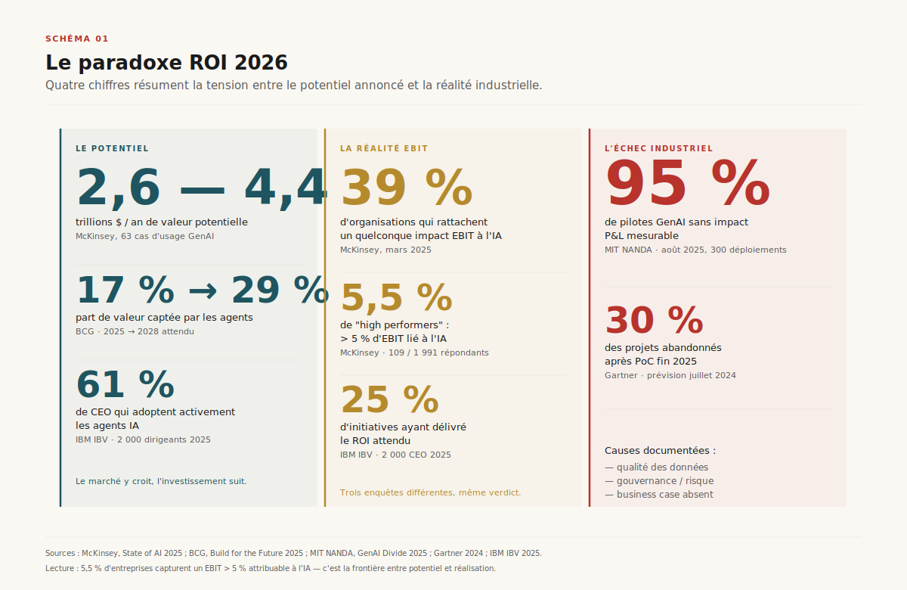
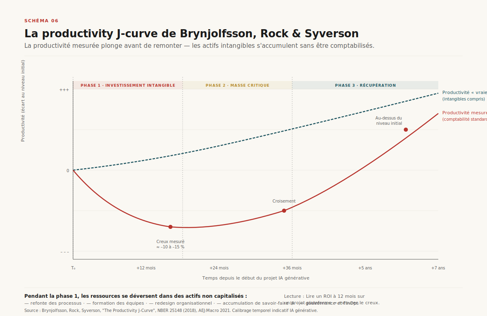
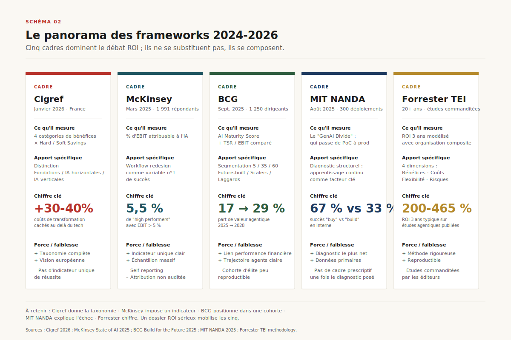
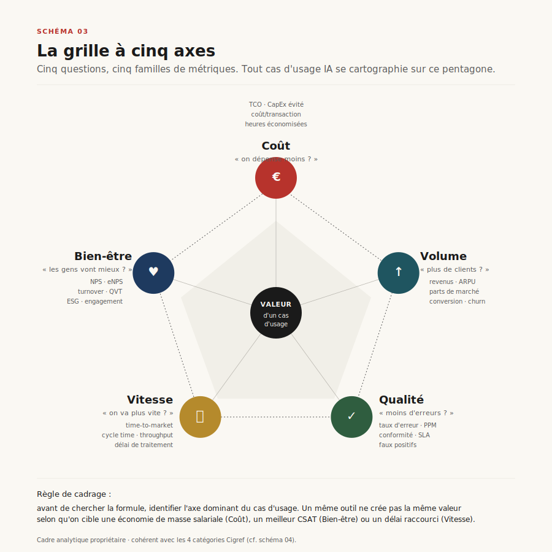
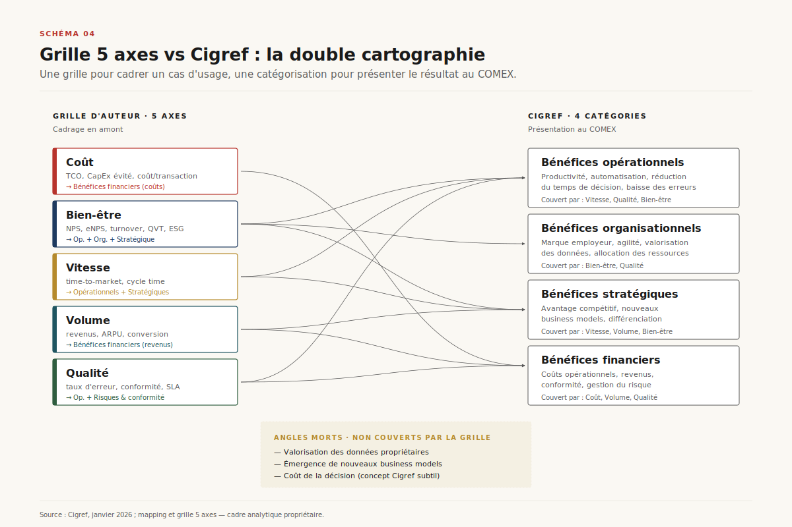
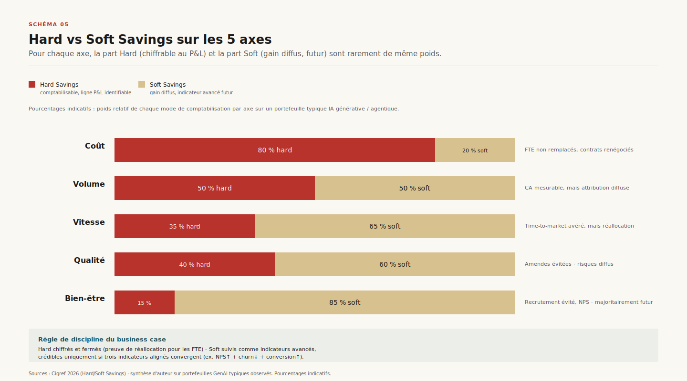
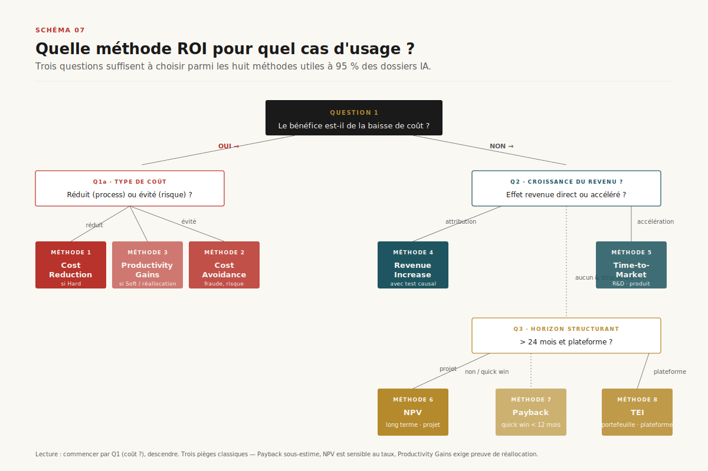
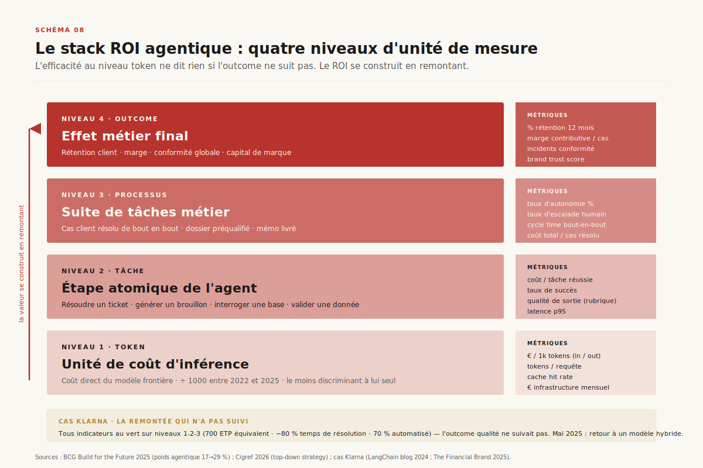
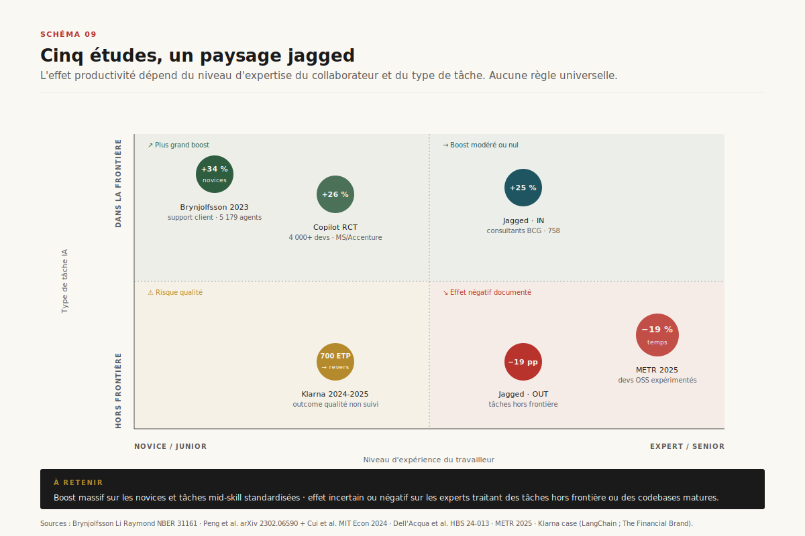

# Chapitre 21 — Mesurer le ROI (et le paradoxe agentique)

> **Acte IV — Mesures et garde-fous · Chapitre charnière, ~30 pages**
> _Le débat sur le ROI de l'IA générative se joue sur deux malentendus tenaces — mesurer ce qui est facile à compter plutôt que ce qui crée de la valeur, et importer les méthodes IT classiques sur des projets qui n'ont plus la même structure de coûts ni la même temporalité de bénéfices. Le chapitre absorbe le dossier `measure-roi/` (07 mai 2026) : diagnostic chiffré du paradoxe 2026, trois ruptures structurelles (auxquelles s'ajoute la rupture agentique), cinq frameworks lus côte à côte, grille analytique à cinq axes, discipline hard vs soft, huit méthodes de calcul, stack à quatre niveaux du paradoxe agentique, cinq études empiriques, checklist en sept questions de signature. Le chapitre tient une **double promesse** : donner au sponsor IA la grille de décision dont le COMEX a besoin, et donner à l'agent engineer la lecture honnête de ce qui se mesure vraiment quand un agent monte la pile token → tâche → processus → outcome._

> [!QUESTION] Question d'ouverture
> McKinsey chiffre à **2 600-4 400 milliards de dollars** par an la valeur économique mondiale potentielle de l'IA générative. La même étude indique pourtant que **39 % des organisations seulement** parviennent à relier un quelconque impact EBIT à l'IA — et pour la majorité, cet impact reste sous les 5 %. Le rapport MIT NANDA *State of AI in Business 2025* enfonce le clou : ==95 % des pilotes d'IA générative en entreprise n'ont pas démontré d'impact mesurable sur le P&L==[^mit-nanda]. Quatre chiffres, une question : si la valeur potentielle est aussi massive et la matérialisation aussi rare, **qu'est-ce qui distingue les 5 % qui captent la valeur des 95 % qui restent en pilote** — et comment construit-on un business case qui résiste au CFO sans renier la valeur diffuse que l'IA produit vraiment ?

> [!TLDR] TL;DR décideur
> - ==Le paradoxe ROI 2026 n'est pas un défaut de technologie, c'est un défaut d'unité de mesure.== Le potentiel est réel (McKinsey 2,6-4,4 T$/an), la concentration aussi (5,5 % des entreprises tirent > 5 % d'EBIT de l'IA, 5 % sont *future-built* BCG), et l'écart entre les deux se creuse — pas se résorbe.
> - **Trois ruptures structurelles** rendent les méthodes IT classiques inopérantes : coût marginal qui tend vers zéro mais coût total qui explose (+30-40 % de coûts cachés de transformation), bénéfices qui se diluent sur le workflow plutôt que sur un poste, **J-curve de Brynjolfsson, Rock & Syverson** qui voit la productivité mesurée *plonger* avant de remonter quand les actifs intangibles atteignent une masse critique (horizon 3-7 ans).
> - **Une quatrième rupture pour les agents** : l'unité de mesure se déplace. On ne mesure plus une transaction ou une tâche, mais **une stack à quatre niveaux — token → tâche → processus → outcome** — et le ROI se construit en remontant, pas en se concentrant sur le niveau le plus facile à compter.
> - **Cinq frameworks lus côte à côte** : Cigref (taxonomie 4 catégories), McKinsey (% EBIT), BCG (cohortes 5/35/60), MIT NANDA (diagnostic *learning gap*), Forrester TEI (méthode de chiffrage 3 ans). Aucun ne suffit seul. Un dossier ROI sérieux les mobilise tous, dans cet ordre : taxonomie → indicateur d'aboutissement → cohorte → diagnostic d'apprentissage → modélisation chiffrée.
> - **Grille à cinq axes** pour cadrer un cas d'usage *avant* d'aller chercher la formule : ==Coût · Bien-être · Vitesse · Volume · Qualité==. Le choix de l'axe dominant détermine le KPI métier — un même outil de support client ne crée pas la même valeur selon qu'on cible une économie salariale (Coût), un meilleur CSAT (Bien-être) ou un temps de résolution (Vitesse).
> - **Discipline hard vs soft** : Hard chiffré et fermé (un FTE économisé ne se compte que s'il est non remplacé *ou* explicitement réaffecté à un projet à valeur démontrable) ; Soft suivi par convergence (gain crédible si **trois indicateurs alignés** convergent, jamais comme un montant en €).
> - **Huit méthodes de calcul** + arbre de décision à trois questions (coût ? revenu ? horizon > 24 mois ?). Trois pièges traçables : Payback qui sous-estime sur trajectoire croissante, NPV dont le taux d'actualisation à 10 % vs 7 % renverse l'ordre des projets, *Productivity Gains* sans preuve de réallocation qui produit un chiffre que la finance refusera.
> - **Klarna est le cas-école de la remontée échouée** : 67 % automatisé, 80 % du temps de résolution gagné, 700 ETP équivalents — recul partiel en mai 2025 vers un modèle hybride parce que l'**outcome** (qualité du service, confiance client) ne suivait pas le rythme des niveaux tâche et processus. À utiliser comme illustration et comme avertissement, pas comme contre-modèle.
> - **Cinq études empiriques** dessinent un paysage *jagged* : Brynjolfsson +14 % moyen / +34 % novices (support), Copilot +55,8 % en tâche / +26 % en PR/semaine (devs Microsoft 4 000+), Jagged Frontier ±40 % in-frontier / **-19 points hors-frontière** (BCG×HBS, 758 consultants), METR -19 % temps sur devs OSS très expérimentés sur codebase mature. Pattern : effet positif sur mid-skill et novices, ==effet nul ou négatif sur expertise mature ou hors-frontière==.
> - **Sept questions de signature** : axe dominant + KPI métier ; part hard vs soft ; coûts cachés de transformation (+30-40 %) ; niveau agentique ciblé ; fenêtre temporelle réaliste ; preuve de réallocation ; test causal sur attribution. Pas plus, pas moins. Si une réponse manque, le business case n'est pas prêt pour la signature.

---

## 21.1 Le paradoxe ROI 2026

### 21.1.1 Quatre chiffres et un diagnostic

Quatre chiffres tiennent la tension. McKinsey, dans son *State of AI 2025*, estime à **2 600 à 4 400 milliards de dollars** la valeur économique annuelle potentielle de l'IA générative à l'échelle mondiale, sur 63 cas d'usage[^mckinsey]. La même étude indique pourtant que **seuls 39 % des organisations** parviennent à relier un quelconque impact EBIT à l'IA — et pour la majorité, cet impact reste sous les 5 %. À l'autre bout du spectre, le rapport MIT NANDA *State of AI in Business 2025* avance que **95 % des pilotes d'IA générative en entreprise n'ont pas démontré d'impact mesurable sur le P&L**[^mit-nanda]. Gartner annonçait dès juillet 2024 que **30 % des projets seraient abandonnés après PoC** d'ici fin 2025, faute de qualité des données, de gouvernance, ou simplement de business case lisible[^gartner].

L'écart entre le potentiel et la réalisation n'est pas un défaut de technologie. Le rapport BCG *Build for the Future 2025* estime que **5 % d'entreprises sont déjà *future-built*** sur l'IA, **35 % industrialisent**, et **60 % restent en retard** — avec un écart qui se creuse : les leaders affichent une croissance du chiffre d'affaires **1,7×** supérieure et une marge EBIT **1,6×** supérieure aux retardataires[^bcg]. Le sujet n'est pas *est-ce que ça marche*, il est **qu'est-ce qui distingue ceux qui captent la valeur**.

### 21.1.2 La méthode comptable classique est l'angle mort

Cigref, dans sa note de janvier 2026, formule le diagnostic de manière brutale : ==justifier un projet d'IA générative comme on le ferait pour une migration de serveur est une impasse==[^cigref]. Les méthodes comptables classiques — payback en 18 mois, NPV sur 5 ans avec hypothèses tenables, attribution claire d'un revenu — buttent sur trois caractéristiques nouvelles, auxquelles l'arrivée des agents ajoute une quatrième.

> [!INFO] Voir Ch. 5 — Économie unitaire de l'inférence · Ch. 17 — Évaluer un agent · Ch. 22 — IA frugale · Ch. 23 — Gouvernance
> Ce chapitre est la **face métier** du triptyque tarifaire qui traverse l'Acte IV. Le Ch.5 a posé la physique du coût par token (sept couches d'optimisation, LLMflation ×1000 entre 2022 et 2025) ; le Ch.17 a posé la mesure de la qualité ; le Ch.21 mesure la valeur métier ; le Ch.22 mesurera l'externalité énergétique. Trois lectures complémentaires de la même facture. Le Ch.23 consommera la checklist en sept questions §21.9 comme entrée des *gates* de gouvernance.

---

## 21.2 Pourquoi les méthodes IT classiques calent

### 21.2.1 Première rupture — le coût marginal tend vers zéro, le coût total explose

Une inférence sur un modèle frontière coûte aujourd'hui une fraction de centime. C'est la donnée à laquelle s'arrête le décideur qui *lit* le sujet : *« le token est devenu gratuit »*. La réalité est ailleurs. Une organisation qui industrialise une centaine d'agents internes génère des millions de tokens par jour, et le **coût total d'usage** devient une variable difficile à anticiper — surtout sur les modèles de raisonnement, où une seule tâche AIME peut consommer 10-74× plus de tokens qu'une conversation ordinaire (voir Ch.2 et Ch.5).

Cigref recense les coûts à intégrer dans un business case sérieux : ingénierie, infrastructures cloud, licences, consommation énergétique, inférence — auxquels s'ajoutent ==30 à 40 % de coûts de transformation cachés== (conduite du changement, gouvernance, formation, FinOps)[^cigref]. La règle empirique pour un dossier ROI 2026 : tout chiffre de coût qui n'a pas additionné explicitement ces 30-40 % est sous-estimé.

> [!IMPORTANT] La règle Cigref des +30-40 %
> ==Un business case qui n'a pas calculé la conduite du changement, la gouvernance, la formation et le FinOps en tant que postes propres est un business case qui se prépare une mauvaise surprise en revue de portefeuille à 12 mois.== L'erreur classique consiste à compter ces postes comme « frais généraux » ou à les diluer dans le projet métier qui aurait existé sans l'IA. Ils sont propres à l'IA et ils sont massifs.

### 21.2.2 Deuxième rupture — les bénéfices se diluent sur un workflow

Quand un assistant rédactionnel fait gagner six minutes sur un mémo, ces six minutes ne s'agrègent pas en gain capitalisable. Elles se redistribuent : un peu de relecture en plus, un peu de café en plus, un peu de réflexion sur le mémo suivant. Aucune de ces redistributions n'apparaît dans une ligne de P&L. McKinsey identifie d'ailleurs ==la refonte des workflows comme la variable n°1== qui distingue les organisations à fort impact EBIT[^mckinsey] : sans ré-architecture des processus, l'économie locale ne se traduit pas en gain global.

C'est l'aspect le plus mal compris du débat. Le sponsor IA qui dit *« on a déployé Copilot, on devrait voir un gain de productivité »* mesure la mauvaise chose. Le gain de productivité existe au niveau atomique (la tâche est faite plus vite, c'est documenté empiriquement — voir §21.8) mais il s'évapore au niveau organisationnel **si rien n'a été redesigné**. La J-curve commence ici.

### 21.2.3 Troisième rupture — la J-curve de Brynjolfsson, Rock & Syverson

Les économistes Erik Brynjolfsson, Daniel Rock et Chad Syverson ont formalisé en 2018 ce qu'ils appellent la **productivity J-curve**[^brynjolfsson-jcurve]. Les technologies à usage général comme l'IA exigent des investissements complémentaires intangibles (refonte de processus, formation, redesign organisationnel) qui sont *dépensés* mais non *capitalisés* dans la comptabilité standard. La productivité mesurée plonge donc d'abord, avant de remonter quand les actifs intangibles produisent leurs effets.

Trois phases se succèdent. **Phase 1 (0-3 ans)** : dépense visible, actifs intangibles invisibles, productivité mesurée *en dessous* du baseline. C'est exactement la phase qui produit les *95 % de pilotes au point mort* de MIT NANDA — non pas parce que les projets sont mauvais, mais parce qu'on les mesure trop tôt. **Phase 2 (3-5 ans)** : la masse critique d'intangibles atteinte ; la productivité remonte et croise le baseline. **Phase 3 (5-7 ans et au-delà)** : les actifs intangibles produisent leurs effets, la productivité dépasse durablement le niveau initial.

Brynjolfsson et al. estiment que **les ajustements liés aux intangibles informatiques rendaient déjà la TFP américaine 15,9 % plus élevée que les mesures officielles fin 2017**[^brynjolfsson-jcurve]. Sur l'IA générative, le même mécanisme est attendu, à un horizon de 3 à 7 ans selon le secteur.

> [!ATTENTION] Lire un ROI à 12 mois, c'est mesurer le creux
> ==Lire un ROI à 12 ou 18 mois sur un projet plateforme ou agentique structurant revient souvent à mesurer le creux de la J et à conclure trop vite à l'échec.== C'est la cause structurelle des 30 % d'abandons Gartner après PoC, et c'est probablement la cause des 95 % de MIT NANDA. La fenêtre d'évaluation doit être calibrée sur la nature du projet : 6-12 mois pour un *quick win* tactique, 3-7 ans pour une plateforme ou un agent structurant. Mélanger les deux horizons sur le même dashboard COMEX, c'est garantir une décision biaisée.

### 21.2.4 Quatrième rupture — l'unité de mesure se déplace

À ces trois ruptures s'en ajoute une quatrième, propre aux agents autonomes : ==la définition de l'unité de mesure se déplace==. On ne mesure plus le coût d'une transaction ou le temps d'une tâche, mais le coût et la qualité d'une *suite de décisions enchaînées* par un agent qui appelle des outils, des sous-agents et reformule sa propre stratégie en cours de route. Cette rupture fait l'objet du §21.7 (paradoxe agentique).

---

## 21.3 Cinq frameworks 2024-2026 lus côte à côte

Cinq grands cadres se sont imposés en dix-huit mois pour structurer la mesure de la valeur. Aucun ne remplace les autres ; ils se complètent, et leurs angles de vue convergent quand on les mobilise dans le bon ordre.

### 21.3.1 Cigref — la taxonomie

**Cigref** (janvier 2026) propose une **cartographie en quatre catégories** — bénéfices opérationnels (productivité, automatisation, erreurs), organisationnels (engagement, marque employeur, allocation des ressources), stratégiques (avantage compétitif, nouveaux business models) et financiers (coûts, revenus, conformité)[^cigref]. Surtout, Cigref introduit **deux distinctions essentielles** que le reste du chapitre déroule : la séparation **fondations / IA horizontales / IA verticales** (chacun avec son propre profil ROI), et l'opposition **Hard Savings / Soft Savings** (cf. §21.5).

C'est le framework qui sert de *grammaire* pour ranger les bénéfices. Sans lui, on additionne des choux et des carottes — un gain de productivité opérationnelle avec un gain de marque employeur, comme s'ils répondaient à la même règle de validation. Avec lui, on a une taxonomie qui force à dire *de quel type* est chaque bénéfice avant d'en chiffrer le montant.

### 21.3.2 McKinsey — l'indicateur d'aboutissement

**McKinsey** (mars 2025) met en avant un seul indicateur d'aboutissement — le **% d'EBIT attribuable à l'IA** — et identifie une cohorte étroite de *high performers* : 5,5 % des entreprises disent dépasser **5 % d'EBIT lié à l'IA**[^mckinsey]. Sa thèse : *organizations are rewiring to capture value*. Le redesign des workflows, l'investissement dans le talent, et la responsabilisation au niveau du COMEX sont les variables qui ressortent.

L'apport unique de McKinsey est d'imposer une **discipline d'aboutissement** : un projet IA ne se mesure pas à sa qualité technique ni à son adoption, il se mesure à ce qu'il fait au compte d'exploitation. C'est l'angle qui résiste le mieux à un CFO sceptique.

### 21.3.3 BCG — la cohorte

**BCG** (*Build for the Future 2025*, septembre 2025) segmente la population en trois : **5 % future-built**, **35 % scalers**, **60 % laggards**, avec un AI Maturity Score qui croise dépense, talent, capacité agentique et impact mesuré. BCG insiste sur la part croissante de la valeur captée par les agents : **17 % en 2025, 29 % attendu en 2028**[^bcg].

L'apport BCG est de positionner une organisation dans une cohorte de pairs. *« On est dans les 60 % en retard »* est une assertion stratégiquement actionnable ; *« on est en retard »* est une opinion. La cohorte donne le repère.

### 21.3.4 MIT NANDA — le diagnostic *learning gap*

**MIT NANDA** (*State of AI in Business 2025*, août 2025) documente le *GenAI Divide* : derrière le chiffre choc des 95 % de pilotes au point mort se cache une mécanique précise. ==Les déploiements achetés à des éditeurs spécialisés réussissent dans 67 % des cas, contre un tiers pour les développements internes==[^mit-nanda]. Le facteur structurant n'est pas la technologie, c'est l'apprentissage continu : la majorité des systèmes GenAI ne mémorisent pas le feedback, ne s'adaptent pas au contexte, ne progressent pas dans le temps.

L'apport MIT NANDA est de pointer **où ça casse** : ce n'est pas le modèle qui est insuffisant, c'est la mémoire et la boucle d'apprentissage de l'organisation qui ne se forment pas. Le lien avec le Ch.9 (mémoire agentique) et le Ch.7 (boucle) est ici direct — le diagnostic ROI rejoint le diagnostic technique.

### 21.3.5 Forrester TEI — la méthode de chiffrage

**Forrester TEI** — le *Total Economic Impact* — n'est pas un cadre nouveau (Forrester l'a établi il y a plus de vingt ans), mais il s'applique particulièrement bien à l'IA agentique parce qu'il oblige à modéliser **quatre dimensions ensemble** : bénéfices, coûts, **flexibilité** (options réelles futures), risques[^forrester]. Sur Microsoft 365 Copilot, sur des solutions agentiques Microsoft, sur OutSystems, les études TEI publiées depuis 2024 affichent des ROI 3 ans entre 200 % et 465 % — chiffres construits sur des organisations composites, pas des projections marketing.

L'apport Forrester est la méthode : un *Total Economic Impact* discipliné force à modéliser la flexibilité (le droit d'exercer ou non une option future) comme une vraie ligne du bilan, ce que ni le Payback ni la NPV simple ne font.

### 21.3.6 Composition des cinq

**Aucun de ces cinq cadres ne suffit seul.** Cigref donne la taxonomie, McKinsey impose l'indicateur d'aboutissement, BCG positionne dans une cohorte, MIT NANDA diagnostique le *learning gap*, Forrester fournit la méthode de chiffrage. ==Un dossier ROI sérieux les mobilise tous, dans cet ordre== : taxonomie → indicateur d'aboutissement → cohorte → diagnostic d'apprentissage → modélisation chiffrée.

> [!QUOTE] Cigref — note de janvier 2026
> *« Justifier un projet d'IA générative comme on le ferait pour une migration de serveur est une impasse. »*[^cigref]
> La phrase est brutale mais la cible n'est pas le projet : c'est la méthode comptable. Le chapitre déroule à partir d'ici une méthode adaptée à la nature des bénéfices, pas une variation de la méthode classique.

---

## 21.4 Une grille en cinq axes pour cartographier la valeur

Les quatre catégories Cigref et l'indicateur EBIT McKinsey sont des cadres de **bilan** — ils servent à présenter les résultats au COMEX. Ils sont moins utiles pour **cadrer un cas d'usage en amont** : par où commencer, quelle métrique choisir, quel poste de bénéfice cibler ? La grille analytique propriétaire à cinq axes que ce chapitre propose comble cet écart de cadrage opérationnel.

### 21.4.1 Les cinq axes et leurs questions de cadrage

Chaque cas d'usage IA génère de la valeur sur un ou plusieurs des cinq axes suivants. La force de la grille est de **forcer la question avant la métrique** : on commence par expliciter le mécanisme de création de valeur, pas par chercher la formule de calcul.

- **Coût** — argent économisé, baisse des dépenses. Question clé : *« on dépense moins ? »*. Métriques typiques : TCO, CapEx évité, coût par transaction, heures économisées valorisées au coût horaire chargé.
- **Bien-être** — satisfaction des collaborateurs, des clients, de la société. Question clé : *« les gens vont mieux ? »*. Métriques : NPS, eNPS, turnover, qualité de vie au travail, score ESG.
- **Vitesse** — efficacité, temps, productivité. Question clé : *« on va plus vite ? »*. Métriques : time-to-market, cycle time, throughput, délai de traitement.
- **Volume** — croissance, plus de clients, plus de chiffre d'affaires. Question clé : *« on a plus de clients ou un panier plus gros ? »*. Métriques : revenus, parts de marché, conversion, ARPU, churn.
- **Qualité** — précision, fiabilité, conformité, risque maîtrisé. Question clé : *« on fait moins d'erreurs ? »*. Métriques : taux d'erreur, défauts par million (PPM), taux de faux positifs, conformité réglementaire, vulnérabilités détectées.

### 21.4.2 Le choix de l'axe détermine le KPI métier

Un même outil de support client ne crée pas la même valeur selon qu'on cible une économie de masse salariale (Coût), une amélioration du CSAT (Bien-être), ou un raccourcissement du temps de résolution (Vitesse). ==Le choix de l'axe dominant détermine le KPI de pilotage==, donc le critère de signature, donc la gouvernance.

C'est la décision qu'un sponsor IA doit prendre **avant** d'écrire le business case, pas pendant. Trois symptômes signalent que la décision n'a pas été prise :
- Le dashboard de pilotage agrège des métriques de plusieurs axes sans hiérarchie (taux d'adoption + CSAT + délai de résolution + nombre de prompts).
- Le porteur projet répond *« les deux »* à la question *« on vise plutôt Coût ou Bien-être ? »*.
- La revue de portefeuille à 6 mois remplace la métrique cible par la métrique disponible.

### 21.4.3 Mapping bidirectionnel avec Cigref

La grille à cinq axes se mappe proprement sur les quatre catégories Cigref. La table ci-dessous montre la correspondance bidirectionnelle.

| Catégorie Cigref | Axes 5-grille concernés | Bénéfice Cigref typique | Métrique exemple |
|---|---|---|---|
| **Opérationnels** | Vitesse, Qualité, Bien-être | Automatisation, réduction du temps de décision, baisse des erreurs | `cycle-time`, `processing-errors`, `employee-engagement` |
| **Organisationnels** | Bien-être, Qualité | Marque employeur, agilité, valorisation des données | `eNPS`, `model-accuracy`, `prediction-reliability` |
| **Stratégiques** | Vitesse, Volume, Bien-être | Avantage compétitif, nouveaux business models, différenciation | `time-to-market`, `markets-addressed`, `brand-trust` |
| **Financiers** | Coût, Volume, Qualité | Coûts opérationnels, revenus, conformité | `tco-infrastructure`, `revenue`, `fines-avoided` |

### 21.4.4 Les trois angles morts honnêtes

Trois bénéfices identifiés par Cigref restent difficiles à capter sur la grille à cinq axes — comme sur les autres cadres. La discipline éditoriale du chapitre consiste à les nommer plutôt que les diluer :

- **La valorisation des données propriétaires.** Un agent qui exploite mieux la base client interne crée une valeur d'option (capacité à monétiser, à différencier, à pivoter sur un segment). Aucune des cinq dimensions ne la chiffre proprement. Traitement : la déclarer en *flexibilité* dans un Forrester TEI (§21.6.1 méthode 8), pas en gain direct.
- **L'émergence de nouveaux business models.** Quand un copilot interne se transforme en produit vendu à des clients externes (cas observable chez plusieurs banques européennes 2025-2026), le ROI initial est trompeur. Traitement : reclasser dès que le pivot est documenté, traiter le nouveau revenu comme un projet à part.
- **Le coût de la décision.** Quand un agent fait *moins de décisions mauvaises* ou *plus de décisions bien étayées*, l'effet est réel mais quasi-invisible dans les comptes à court terme. Traitement : suivi qualitatif par convergence de trois indicateurs (NPS interne, taux de retour sur décision, durée de cycle décisionnel).

Ce sont des angles morts honnêtes. ==Mieux vaut les nommer comme tels que de fabriquer un chiffre douteux qui décrédibilisera tout le business case quand la finance grattera la première ligne.==

---

## 21.5 Hard Savings vs Soft Savings — la vraie ligne de partage

Cigref reprend une distinction héritée du procurement[^procureability] et la place au cœur de son cadre : **Hard Savings** vs **Soft Savings**. Les Hard Savings sont des économies **tangibles, comptabilisables au P&L** — un contrat renégocié à 10 € au lieu de 12 €, une licence remplacée, un FTE non remplacé. Les Soft Savings sont des **gains diffus, indirects, porteurs de valeur future** mais qui ne génèrent pas de ligne d'écriture comptable identifiable — six minutes économisées par mémo, un meilleur engagement, un meilleur NPS, une réponse plus rapide.

### 21.5.1 La répartition par axe

La distribution Hard/Soft n'est pas uniforme sur les cinq axes — et c'est l'information clé que le sponsor IA doit avoir en tête avant le RDV finance. Approximativement :

- **Coût 80 % Hard / 20 % Soft** — la quasi-totalité du gain Coût est chiffrable, à condition de la valider.
- **Volume 50 % Hard / 50 % Soft** — la moitié du gain (revenu attribuable, marge, ARPU) est chiffrable ; l'autre moitié (rétention, brand value, valeur d'option) ne l'est pas directement.
- **Vitesse 35 % Hard / 65 % Soft** — le gain de cycle time est mesurable, mais la conversion en valeur P&L exige une preuve de réallocation (cf. §21.5.3).
- **Qualité 40 % Hard / 60 % Soft** — les amendes évitées, les défauts évités sont chiffrables ; la réputation et la confiance ne le sont pas.
- **Bien-être 15 % Hard / 85 % Soft** — l'attrition réduite peut se chiffrer (coût de remplacement évité) ; l'essentiel reste un gain de signature diffuse.

==Une part importante de la valeur de l'IA générative tombe dans la catégorie Soft Savings== — et c'est précisément ce qui rend le sujet inflammable au CFO.

### 21.5.2 Les deux écueils symétriques

Le risque est double et symétrique.

1. **Refuser de compter les Soft Savings** au nom de la rigueur comptable. On sous-estime massivement le retour. C'est la trajectoire qui mène à un abandon prématuré : *« on a investi 500 K€, on ne voit rien venir au P&L après 12 mois, on coupe »*. C'est, structurellement, ce qui produit la moitié des 95 % MIT NANDA.
2. **Les compter sans méthode.** On construit un business case fictif où chaque collaborateur gagne 30 minutes par jour, multiplié par 10 000 collaborateurs, valorisé au coût horaire chargé — produisant un chiffre que personne ne croit et que la finance refuse de signer. C'est l'autre moitié des 95 %.

La sortie par le haut est la **double discipline** : Hard chiffrés et fermés sous règle stricte ; Soft suivis par convergence d'indicateurs avancés.

### 21.5.3 Règle de validation Hard — la preuve de réallocation

Pour les Hard Savings, la règle de validation est stricte : ==un FTE économisé ne se compte que s'il est non remplacé *ou* explicitement réaffecté à un projet à valeur démontrable==. Une économie d'achat ne se compte qu'avec une preuve de facturation.

Cigref alerte explicitement : ==la valeur réelle des IA horizontales dépend de la réallocation du temps gagné vers des missions à plus haute valeur ajoutée==[^cigref]. Le mécanisme est essentiel et il est mal compris. Quand un copilot fait gagner 30 minutes par jour à un analyste financier, ces 30 minutes deviennent un gain Hard **uniquement si** l'analyste les consacre à un projet d'analyse stratégique que l'organisation n'aurait pas pu lancer sans cela. Si les 30 minutes sont absorbées par plus de meetings, plus de mails, plus de café, le gain est Soft — et il faut le déclarer comme tel.

> [!IMPORTANT] La règle de la preuve de réallocation
> ==Pas de FTE économisé sans preuve de réallocation== — c'est-à-dire sans nomination explicite du projet à valeur ajoutée que la personne va porter avec le temps libéré. Sans cette nomination, on transfère du gain Soft en gain Hard et on crée un chiffre que la finance détectera comme fictif. La règle est dure mais elle est ce qui permet au business case de tenir au-delà du COMEX d'ouverture.

### 21.5.4 Règle de validation Soft — la convergence à trois indicateurs

Pour les Soft Savings, la règle est différente mais aussi disciplinée. ==Un gain Soft n'est crédible que si trois indicateurs alignés convergent.== On n'attribue **pas** un montant en € aux Soft Savings ; on les utilise comme **conditions nécessaires** d'un effet futur de Volume ou de Coût.

Exemple concret. Un copilot rédactionnel produit (a) un eNPS interne qui monte de 6 points, (b) un taux de churn collaborateur qui baisse de 1,8 point, (c) un cycle time moyen qui se contracte de 12 %. Les trois indicateurs convergent dans le sens *« les gens vont mieux et produisent plus »*. Le gain Soft est **validé comme indicateur avancé**. On ne le chiffre pas, mais on le compte comme condition de la promesse Volume ou Coût qui se matérialisera plus tard.

Sans cette discipline de triangulation, on tombe dans le récit (*« les équipes adorent l'outil »*) qui n'a pas de valeur de signature.

> [!EXAMPLE] Mini-cas — un copilot juridique en banque française
> Une banque tier 1 française déploie un copilot juridique sur 80 juristes internes (revue de contrats, recherche jurisprudentielle, génération de mémos). Audit ROI à 18 mois :
> - **Hard documentés** : 12 contrats stratégiques signés en moyenne 8 jours plus vite (raccourcissement du cycle commercial → revenu attribuable 1,4 M€/an, avec un test causal sur la cohorte expérimentale vs contrôle). Coût direct : 380 k€/an (licences + RAG legal + supervision).
> - **Soft validés par convergence** : eNPS juridique +9 pts, time-to-first-draft -34 %, taux de retour métier sur mémos -18 %. Pas chiffrés, déclarés en condition.
> - **Soft non validés (rejetés du business case)** : *« les juristes ont l'air moins stressés »* — sans triangulation, le récit n'est pas pris.
>
> Le business case présenté au COMEX : ROI Hard = 270 % à 18 mois. Soft signalés comme indicateurs avancés conditionnant la projection à 36 mois. La finance signe.

---

## 21.6 La boîte à outils méthodologique

Une fois l'axe identifié (§21.4) et la nature Hard/Soft tranchée (§21.5), il reste à choisir une **méthode de calcul**. Huit méthodes principales suffisent à couvrir l'essentiel des cas d'usage IA générative et agentique.

### 21.6.1 Huit méthodes en une table

| # | Méthode | Formule | Quand l'utiliser | Quand l'éviter |
|---|---|---|---|---|
| 1 | **Cost Reduction** | `(Coût Avant − Coût Après) / Investissement` | Automatisation de processus, efficacité opérationnelle | Bénéfices majoritairement qualitatifs |
| 2 | **Cost Avoidance** | `Coût évité × Probabilité / Investissement` | Détection fraude, conformité, sécurité | Événements à très faible probabilité ou non quantifiables |
| 3 | **Productivity Gains** | `Temps gagné × Coût horaire × Volume / Investissement` | Assistants, copilots, automatisation partielle | Le temps gagné ne se traduit pas en réallocation utile |
| 4 | **Revenue Increase** | `Δ CA × Marge / Investissement` | Pricing, upsell, conversion, churn | Attribution incertaine ou marketing-only |
| 5 | **Time-to-Market** | `Accélération × Fenêtre marché / Investissement` | R&D, développement produit, time-critical | Fenêtre marché incertaine |
| 6 | **NPV** | `Σ(Flux futurs / (1+r)^t) − Investissement` | Projets stratégiques long terme, infrastructures | Taux d'actualisation contestable |
| 7 | **Payback Period** | `Investissement / Bénéfice annuel net` | Quick wins tactiques, validation d'enveloppe | Bénéfices qui croissent dans le temps (sous-estimation) |
| 8 | **TEI (Forrester)** | `Bénéfices − Coûts ± Flexibilité − Risques` | Décisions plateforme, projets agentiques structurants | Données projetées peu robustes |

### 21.6.2 Arbre de décision à trois questions

L'arbre tient en trois questions séquentielles. Chacune élimine quatre méthodes et oriente vers les quatre suivantes.

1. **Le bénéfice est-il principalement de la baisse de coût ?** Si oui, *Cost Reduction* (Hard) ou *Productivity Gains* (Soft tant que la réallocation n'est pas prouvée). Si le bénéfice est *évité* (un risque qui ne s'est pas matérialisé), *Cost Avoidance*.
2. **Le bénéfice est-il principalement de la croissance du revenu ?** Si oui, *Revenue Increase* (si attribution claire) ou *Time-to-Market* (si l'effet vient de l'accélération d'un lancement).
3. **L'horizon dépasse-t-il 24 mois et l'investissement est-il structurant ?** Alors quitter les méthodes simples pour *NPV* (ROI projet) ou *TEI* (ROI plateforme/portefeuille avec flexibilité et risque).

### 21.6.3 Trois pièges pratiques à connaître

**Le piège du Payback.** Sur un projet où les bénéfices croissent (effet d'apprentissage, J-curve, agent qui mémorise et progresse), le Payback simple sous-estime systématiquement le retour parce qu'il ignore la trajectoire. Symptôme : *« le payback à 14 mois est plus long que notre seuil de 12 mois, on rejette »* — alors que la trajectoire des 24 mois suivants double le bénéfice annuel.

**Le piège de la NPV.** Un taux d'actualisation à 10 % vs 7 % change l'ordre des projets. Et personne n'a un taux unique défendable sur des projets aussi atypiques. Symptôme : trois projets IA présentés au même COMEX avec trois taux différents — le sponsor IA n'a pas calé une norme méthodologique avant la revue de portefeuille.

**Le piège de la *Productivity Gains* mal conduite.** Valoriser 30 minutes économisées par jour × 10 000 personnes × 80 €/h sans tester la réallocation produit un nombre absurdement élevé que la finance refusera. La règle Cigref tient ici : ==pas de FTE économisé sans preuve de réallocation==[^cigref]. Symptôme : le business case présente un *Productivity Gains* à 150 M€/an que personne ne croit, et la décision se prend sur les chiffres alternatifs qu'on a glissés à côté.

---

## 21.7 Le paradoxe agentique — l'unité de mesure se déplace

L'arrivée des agents — entités logicielles capables de planifier, d'appeler des outils, de raisonner et de revenir sur leurs propres décisions (voir Acte II) — décale la mesure du ROI à un niveau d'abstraction supérieur. BCG estime déjà à **17 % la part de valeur captée par les agents en 2025**, et anticipe **29 % en 2028**[^bcg]. IBM IBV confirme que ==61 % des dirigeants disent adopter activement des agents et préparer leur déploiement à l'échelle==[^ibm-ibv]. Le sujet n'est plus émergent.

### 21.7.1 La stack à quatre niveaux

Le déplacement se joue sur quatre niveaux d'unité de mesure, chacun avec ses métriques propres :

1. **Token** — l'unité de coût directe de l'inférence. Métrique : coût par mille tokens en entrée et en sortie. Décroissance d'environ ×1000 entre 2022 et 2025 sur les modèles frontières (LLMflation, voir Ch.5). C'est la dimension la plus visible mais la moins discriminante au niveau du business case.
2. **Tâche** — une étape atomique réalisée par l'agent (résoudre un ticket, générer un brouillon, requêter une base). Métrique : coût par tâche, taux de succès, qualité. C'est l'unité où la productivité GenAI se mesure au mieux dans la littérature empirique (§21.8).
3. **Processus** — l'enchaînement de tâches qui produit un résultat métier (un cas client résolu de bout en bout, un mémo livré, un dossier préqualifié). Métrique : **taux d'autonomie** (% de processus terminés sans intervention humaine), taux d'escalade, coût total processus.
4. **Outcome** — l'effet métier final (rétention client, marge, conformité, croissance). C'est le seul niveau qui parle vraiment au COMEX, et le plus difficile à attribuer.

==Le ROI agentique se construit en remontant ces niveaux, pas en se concentrant sur un seul.== Une économie au niveau token ne dit rien si le taux d'autonomie au niveau processus stagne à 30 %. Un taux d'autonomie de 95 % au niveau processus ne dit rien non plus si le taux d'erreur dégrade l'outcome.

### 21.7.2 Klarna — le cas d'école de la remontée échouée

Le cas Klarna illustre la difficulté de cette remontée. En 2024, l'entreprise communiquait sur un assistant IA qui faisait *l'équivalent du travail de 700 ETP humains*, avec une réduction de 80 % du temps moyen de résolution et 70 % des tâches répétitives automatisées[^klarna]. Tous les indicateurs aux niveaux 1 (token), 2 (tâche) et 3 (processus) étaient excellents.

**Pourtant, en mai 2025, Klarna a réembauché des agents humains et basculé vers un modèle hybride** — l'IA faisant le triage et les requêtes simples, les humains traitant les cas nuancés, avec escalade automatique quand la confiance baisse ou qu'une émotion est détectée[^klarna]. L'outcome (la qualité globale du service, la confiance client) ne suivait pas le rythme.

> [!INFO] Voir Ch. 11 — Patterns et orchestration multi-agents
> Le cas Klarna apparaît deux fois dans le livre. **Ch.11 §11.7.1** le traite comme illustration de la décision multi-agent et de l'arbre buy/build — *« on a sorti l'artillerie multi-agent pour un besoin qu'un workflow aurait résolu »*. **Ch.21 §21.7.2** le traite comme illustration de la remontée échouée dans la stack à quatre niveaux — *« excellents KPI tâche et processus, outcome dégradé »*. Deux profondeurs, deux leçons complémentaires. La signature commune : ne pas confondre l'optimum local (taux d'autonomie) avec l'optimum global (qualité du service).

### 21.7.3 La règle Cigref de l'alignement stratégique

Cigref formule une règle directement utile ici : ==seuls les projets top-down, alignés sur la stratégie globale, génèrent un impact structurant à long terme==[^cigref]. Sur un agent autonome, *« aligné sur la stratégie »* se traduit en **cible d'outcome explicite**, pas en cible d'efficacité.

La règle de design correspondante : **avant de coder l'agent, écrire la cible d'outcome**. Trois exemples de formulation correcte :
- *« L'agent doit produire un taux de rétention client à 12 mois supérieur de 2 points au baseline, tout en maintenant un CSAT > 4,2/5. »* (banque retail)
- *« L'agent doit raccourcir le temps moyen de qualification d'un dossier crédit PME de 35 % sans augmenter le taux de défaut à 24 mois au-delà du baseline. »* (banque corporate)
- *« L'agent doit augmenter le taux de conversion sur la liste d'attente de 8 points, sans dégrader le NPS du premier contact. »* (e-commerce)

==Une cible d'outcome qui n'inclut pas une contrainte de qualité est un piège à Klarna.==

### 21.7.4 Le diagnostic intra-stack

Quand un projet agentique sous-performe, le diagnostic ne se fait pas au niveau global. Il se fait niveau par niveau. La question utile : **à quel niveau ça casse ?**

| Niveau | Symptôme typique | Cause probable | Cible de remédiation |
|---|---|---|---|
| **Token** | Facture x3 vs prévision | Reasoning models routés par défaut, pas de KV cache | Smart routing, prompt + KV caching, SLM on certains tours (voir Ch.5) |
| **Tâche** | Taux de succès stagne à 60-70 % | Tools mal scopés, grader pas calibré, instructions ambiguës | Refactor des tools, calibration LLM-as-judge (voir Ch.17), simplification prompts |
| **Processus** | Taux d'autonomie bloqué autour de 40 % | Escalades non instrumentées, agents en boucle, mémoire insuffisante | Trajectoire monitoring (voir Ch.18), mémoire architecturée (voir Ch.9), patterns orchestration (voir Ch.11) |
| **Outcome** | Métier neutre ou négatif malgré succès tâche/processus | Optimum local capté, optimum global manqué — *cas Klarna* | Re-cibler la fonction objective : qualité métier comme contrainte dure, pas comme bonus |

Cette grille de diagnostic est ce qui permet de transformer un *« le projet ne fonctionne pas »* en *« le projet bloque au niveau processus à cause d'escalades non instrumentées »*. ==C'est la différence entre un projet qu'on coupe et un projet qu'on corrige.==

---

## 21.8 Ce que disent vraiment les études empiriques

Cinq études bien construites donnent un éclairage solide sur la productivité réelle de l'IA générative. Lues ensemble, elles dessinent un paysage **jagged** — irrégulier — qu'il faut accepter pour ne pas se tromper.

### 21.8.1 Brynjolfsson — support client, +14 % moyen / +34 % novices

Étude sur **5 179 agents de support technique** dans une grande entreprise américaine, déploiement progressif d'un assistant conversationnel GenAI sur 12 mois. Résultat principal : ==+14 % de productivité moyenne (issues résolues par heure), mais +34 % pour les novices et débutants, effet marginal pour les seniors==[^brynjolfsson-genai]. L'IA *égalise* la qualité en diffusant les meilleures pratiques des bons agents vers les nouveaux. Effets secondaires : satisfaction client améliorée, **taux d'attrition des agents baissé de 8,6 %**.

### 21.8.2 Copilot — devs, +55,8 % en tâche / +26 % en PR/semaine

**Peng et al.** (arXiv 2302.06590) — expérience contrôlée sur **95 développeurs**, tâche de rédaction d'un serveur HTTP en JavaScript. Le groupe traité (Copilot) termine **55,8 % plus vite**[^peng-copilot]. C'est le chiffre cité partout, et c'est le chiffre piège : il décrit *une tâche atomique*, pas la productivité d'un développeur sur son projet.

**Cui et al.** (Microsoft / MIT / Princeton / Wharton, 2024) — étude complémentaire sur **plus de 4 000 développeurs** à Microsoft, Accenture et un Fortune 100 : **+26,08 % de pull requests par semaine**, avec un effet marqué pour les développeurs moins expérimentés[^cui-developers]. C'est le chiffre qui ressemble plus à la productivité réelle : non pas 55 % de gain par tâche, mais 26 % de PR supplémentaires par semaine — un quart d'augmentation, pas une moitié.

### 21.8.3 Jagged Frontier — consultants, ±40 % in / -19 pts out

**Dell'Acqua et al.** (HBS WP 24-013) — étude BCG × HBS sur **758 consultants**. Sur les tâches **à l'intérieur de la frontière de capacités IA** : **+40 % de qualité, +25 % de vitesse, +12 % de tâches complétées**[^dellacqua-jagged]. Sur les tâches **à l'extérieur de la frontière** (où l'IA est plausible mais en réalité incompétente), ==les consultants qui utilisent l'IA performent 19 points de pourcentage en dessous de ceux qui ne l'utilisent pas==.

Deux comportements émergent dans la cohorte traitée : les **Cyborgs** (intégration continue avec l'IA, gain marqué) et les **Centaurs** (délégation par découpage de tâches, gain moindre). La leçon métier est dure : **l'IA mal utilisée nuit activement** quand elle est appliquée à un problème qu'elle ne devrait pas traiter. C'est l'argument numéro un en faveur d'une formation sérieuse à la *jagged frontier* avant le déploiement.

### 21.8.4 METR — devs OSS très expérimentés, -19 %

**METR** (juillet 2025) — RCT sur **16 développeurs très expérimentés** (5 ans en moyenne sur leur projet OSS), **246 tâches randomisées** avec ou sans IA. Résultat *contre-intuitif* : ==l'autorisation des outils IA augmente le temps de complétion de 19 %==[^metr-os]. Le ressenti des développeurs allait dans l'autre sens (ils estimaient *avant* un gain de 24 %, *après* un gain de 20 %), ce qui suggère un **biais de perception massif**.

METR attribue le résultat à trois facteurs : (a) complexité élevée du codebase, (b) maturité du projet (les développeurs en connaissent les conventions implicites mieux que l'IA), (c) expertise déjà très haute des participants (l'IA ne diffuse pas de meilleure pratique qu'eux n'ont déjà).

> [!IMPORTANT] Le biais de perception comme angle mort de l'auto-évaluation
> ==Les développeurs METR pensaient gagner 20 % de temps alors qu'ils en perdaient 19 %.== Cet écart de 39 points entre perception et réalité est l'angle mort de tous les sondages internes d'adoption. Un dashboard de pilotage IA qui s'appuie sur l'auto-évaluation des utilisateurs (*« avez-vous gagné du temps cette semaine ? »*) est en faute structurelle. La mesure correcte exige un test contrôlé ou une observation comportementale (cycle time mesuré).

### 21.8.5 Klarna — le retour à l'hybride

Cas industriel exposé en §21.7.2 — gains spectaculaires aux niveaux tâche et processus, **revers vers un modèle hybride en mai 2025** quand le niveau outcome ne suivait pas[^klarna]. Pour l'analyse intégrée, le cas Klarna est ce qui prouve que les quatre études précédentes ne peuvent pas être directement transposées en business case sans tenir compte de la dégradation potentielle de l'outcome.

### 21.8.6 Lecture intégrée — trois patterns

Trois patterns se dégagent de la lecture conjointe :

- **L'effet IA est globalement positif sur les tâches mid-skill et standardisées** (support, rédaction usuelle, code de boilerplate), avec un boost particulièrement marqué pour les profils en montée en compétence. C'est le segment où le déploiement à grande échelle paie.
- **L'effet est négatif ou nul sur les tâches d'expertise mature** (METR, devs OSS sur codebase complexe) ou **hors-frontière** (Jagged, consultants sur problèmes que l'IA ne maîtrise pas). C'est le segment où le déploiement non discriminé détruit de la valeur.
- ==**Le niveau de l'outcome n'est jamais garanti par l'efficacité au niveau de la tâche.**== La phase d'industrialisation est celle de l'arbitrage entre rapidité et qualité — Klarna en est l'illustration la plus publique.

> [!QUOTE] Cigref — l'arbitrage final
> *« La valeur réelle des IA horizontales dépend de la réallocation du temps gagné vers des missions à plus haute valeur ajoutée. »*[^cigref]
> La phrase est l'antidote à toutes les présentations qui valorisent des minutes économisées multipliées par un coût horaire chargé. Sans réallocation explicite, le gain n'est pas matérialisé. ==C'est la règle qui sépare le 5 % qui captent la valeur des 95 % qui restent en pilote.==

---

## 21.9 Pièges à éviter et checklist en sept questions

### 21.9.1 Cinq pièges à éviter

Les pièges les plus fréquents sur un dossier ROI IA générative ou agentique se ressemblent — et ils sont **100 % traçables** dans la littérature et les retex publics.

- **Vanity metrics.** Compter les utilisateurs actifs d'un copilot interne, le nombre de prompts, ou le volume de tokens ne dit rien sur la création de valeur. Ce sont des indicateurs d'adoption, pas de ROI.
- **FTE illusion.** Multiplier des minutes économisées par un nombre de personnes et un coût horaire chargé sans démonstration de réallocation produit un chiffre théorique. La règle Cigref est claire[^cigref] : sans preuve de réallocation, le gain est Soft, pas Hard.
- **Attribution illusion.** Sur un effet *Volume* (revenu en hausse, churn en baisse), l'IA est rarement le seul facteur. Une étude contrefactuelle ou un test contrôlé est indispensable pour étayer l'attribution.
- **J-curve premature judgment.** Lire un ROI à 12 mois sur un projet plateforme ou agentique structurant revient souvent à mesurer le creux de la J. Cigref recommande une fenêtre **3 à 7 ans** pour les projets stratégiques[^cigref] ; Brynjolfsson et al. confirment l'ordre de grandeur[^brynjolfsson-jcurve].
- **Soft Savings sans convergence.** Affirmer qu'on gagne en bien-être ou en agilité sans triangulation par trois indicateurs alignés revient à se contenter d'un récit, pas d'une mesure.

### 21.9.2 Sept questions de signature

**Sept questions à se poser avant de signer un business case ROI IA générative ou agentique.** Si une réponse manque, le dossier n'est pas prêt.

1. **Quel est l'axe dominant de création de valeur** (Coût, Bien-être, Vitesse, Volume, Qualité) et quel KPI métier le mesure de bout en bout ?
2. **Quelle part du gain est Hard, quelle part est Soft ?** Hard chiffré et fermé sous règle de réallocation, Soft suivi par convergence d'indicateurs.
3. **Quels sont les coûts cachés de transformation** (formation, gouvernance, FinOps, conduite du changement) ? Cigref recommande +30 à 40 % au-dessus des coûts techniques[^cigref].
4. **Quel niveau d'unité agentique** est ciblé : tâche, processus, ou outcome ? La cible se traduit-elle en KPI testable, avec **une contrainte de qualité explicite** ?
5. **Quelle est la fenêtre temporelle réaliste** ? Quick win 6-12 mois, plateforme 3-7 ans. Ne pas mélanger les horizons sur le même dashboard.
6. **Quelle preuve de réallocation** est attendue pour les FTE économisés ? Sans preuve nommée (le projet à plus haute valeur ajoutée que la personne va porter), le gain reste Soft.
7. **Quel test causal** confirme l'attribution sur un effet de Volume ? A/B test, déploiement progressif, étude contrefactuelle. Pas de test ⇒ pas d'attribution.

> [!INFO] Voir Ch. 23 — Gouvernance
> Ces sept questions sont les entrées des *gates* de gouvernance du Ch.23. Un projet qui n'a pas répondu aux sept ne devrait pas franchir la première ligne de défense (équipes opérationnelles). Le rôle pivot *Sponsor IA* (cf. Ch.23 §23.5) est porteur de cette discipline.

---

## 21.10 Récap chapitre — la grille minimale du décideur IA 2026

Cinq axes pour cadrer un cas d'usage. Cinq frameworks lus côte à côte. Quatre ruptures (dont la rupture agentique). Quatre niveaux de la stack token-tâche-processus-outcome. Trois pièges traçables. Deux disciplines (Hard chiffrée fermée, Soft triangulée). Une checklist de sept questions de signature.

C'est la grille minimale qui suffit à tenir une conversation crédible avec la finance, à diagnostiquer un projet en difficulté niveau par niveau, et à éviter à la fois le piège du chiffre fictif et le piège de l'abandon prématuré dans le creux de la J. Le chapitre n'a pas vocation à remplacer un Forrester TEI sur un projet plateforme structurant ; il vocation à donner au sponsor IA le cadre qui rend cette analyse possible et défendable.

> [!WARNING] Trois pièges classiques (100 % traçables)
> **Compter les Soft Savings sans triangulation** — produit un récit que la finance refuse · **Mesurer un projet agentique au niveau token uniquement** — manque la dégradation possible de l'outcome (cas Klarna) · **Lire le ROI à 12 mois sur un projet plateforme** — mesure le creux de la J-curve et coupe avant la remontée.

Le Ch.22 (frugalité énergétique) ferme le triptyque tarifaire : prix par token qui baisse (Ch.5), valeur par outcome qui monte lentement (Ch.21), externalité énergétique qui n'est jamais sur la facture (Ch.22). Trois lectures complémentaires d'une même facture — et la facture environnementale est, comme la facture J-curve, retardée et invisible jusqu'au moment où elle ne l'est plus.

---

## Sources

[^cigref]: Cigref. *Évaluer le retour sur investissement des solutions d'IA générative et agentique*. Note d'information et d'actualité, 15 janvier 2026. [cigref.fr](https://www.cigref.fr/evaluer-le-retour-sur-investissement-des-solutions-dia-generative-et-agentique). Consulté le 7 mai 2026.

[^mit-nanda]: MIT NANDA Initiative. *The GenAI Divide — State of AI in Business 2025*. Rapport, août 2025. [mlq.ai/state-of-ai-in-business-2025](https://mlq.ai/media/quarterly_decks/v0.1_State_of_AI_in_Business_2025_Report.pdf). Consulté le 7 mai 2026.

[^mckinsey]: Singla, A., Sukharevsky, A., Yee, L. *The state of AI: How organizations are rewiring to capture value*. McKinsey & Company, mars 2025. [mckinsey.com/state-of-ai](https://www.mckinsey.com/capabilities/quantumblack/our-insights/the-state-of-ai-how-organizations-are-rewiring-to-capture-value). Consulté le 7 mai 2026.

[^bcg]: Boston Consulting Group. *The Widening AI Value Gap — Build for the Future 2025*. Rapport, septembre 2025. [media-publications.bcg.com/AI-Value-Gap-Sept-2025](https://media-publications.bcg.com/The-Widening-AI-Value-Gap-Sept-2025.pdf). Consulté le 7 mai 2026.

[^brynjolfsson-genai]: Brynjolfsson, E., Li, D., Raymond, L. *Generative AI at Work*. NBER Working Paper 31161, avril 2023. Publié dans *The Quarterly Journal of Economics*, 140(2), 2025. [nber.org/papers/w31161](https://www.nber.org/papers/w31161). Consulté le 7 mai 2026.

[^dellacqua-jagged]: Dell'Acqua, F., McFowland III, E., Mollick, E. R., et al. *Navigating the Jagged Technological Frontier — Field Experimental Evidence of the Effects of AI on Knowledge Worker Productivity and Quality*. Harvard Business School Working Paper 24-013, septembre 2023. [hbs.edu/24-013](https://www.hbs.edu/ris/Publication%20Files/24-013_d9b45b68-9e74-42d6-a1c6-c72fb70c7282.pdf). Consulté le 7 mai 2026.

[^metr-os]: METR. *Measuring the Impact of Early-2025 AI on Experienced Open-Source Developer Productivity*. Rapport, juillet 2025. [metr.org/early-2025-os-dev-study](https://metr.org/blog/2025-07-10-early-2025-ai-experienced-os-dev-study/). Consulté le 7 mai 2026.

[^forrester]: Forrester Research. *The Total Economic Impact™ Methodology*. [forrester.com/policies/tei](https://www.forrester.com/policies/tei/) — voir notamment *The Total Economic Impact™ Of Microsoft's Agentic AI Solutions*. Consulté le 7 mai 2026.

[^gartner]: Gartner. *Gartner Predicts 30 % of Generative AI Projects Will Be Abandoned After Proof of Concept By End of 2025*. Communiqué, 29 juillet 2024. [gartner.com/newsroom/2024-07-29](https://www.gartner.com/en/newsroom/press-releases/2024-07-29-gartner-predicts-30-percent-of-generative-ai-projects-will-be-abandoned-after-proof-of-concept-by-end-of-2025). Consulté le 7 mai 2026.

[^ibm-ibv]: IBM Institute for Business Value. *2025 CEO Study — Mindshifts for Growth*. Mai 2025. [newsroom.ibm.com/2025-CEO-study](https://newsroom.ibm.com/2025-05-06-ibm-study-ceos-double-down-on-ai-while-navigating-enterprise-hurdles). Et *From AI projects to profits — How agentic AI scales enterprise value*. Consultés le 7 mai 2026.

[^klarna]: Sources combinées sur le cas Klarna : LangChain blog, *How Klarna's AI assistant redefined customer support at scale* ; The Financial Brand, *Inside Klarna's High-Profile Giant Bet on AI* (mai 2025) ; Bockius, C., *When the Metrics Lie: Klarna's AI Case Study*. Consultés le 7 mai 2026.

[^brynjolfsson-jcurve]: Brynjolfsson, E., Rock, D., Syverson, C. *The Productivity J-Curve — How Intangibles Complement General Purpose Technologies*. NBER Working Paper 25148, octobre 2018, révisé 2020. Publié dans *American Economic Journal: Macroeconomics*, 13(1), 333–372. [nber.org/papers/w25148](https://www.nber.org/papers/w25148). Consulté le 7 mai 2026.

[^peng-copilot]: Peng, S., Kalliamvakou, E., Cihon, P., Demirer, M. *The Impact of AI on Developer Productivity — Evidence from GitHub Copilot*. arXiv:2302.06590, février 2023. [arxiv.org/abs/2302.06590](https://arxiv.org/abs/2302.06590). Consulté le 7 mai 2026.

[^cui-developers]: Cui, Z., Demirer, M., Jaffe, S., Musolff, L., Peng, S., Salz, T. *The Effects of Generative AI on High-Skilled Work — Evidence from Three Field Experiments with Software Developers*. MIT Economics Working Paper, 2024 (Microsoft, Accenture, Fortune 100 ; >4 000 développeurs). [economics.mit.edu/draft_copilot_experiments](https://economics.mit.edu/sites/default/files/inline-files/draft_copilot_experiments.pdf). Consulté le 7 mai 2026.

[^procureability]: Procureability. *Understanding Hard and Soft Cost Savings in Procurement*. [procureability.com/hard-soft-savings](https://procureability.com/hard-soft-savings-procurement-guide/). Consulté le 7 mai 2026.
