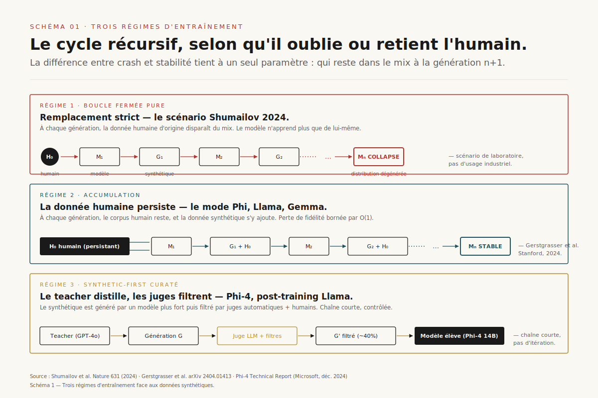
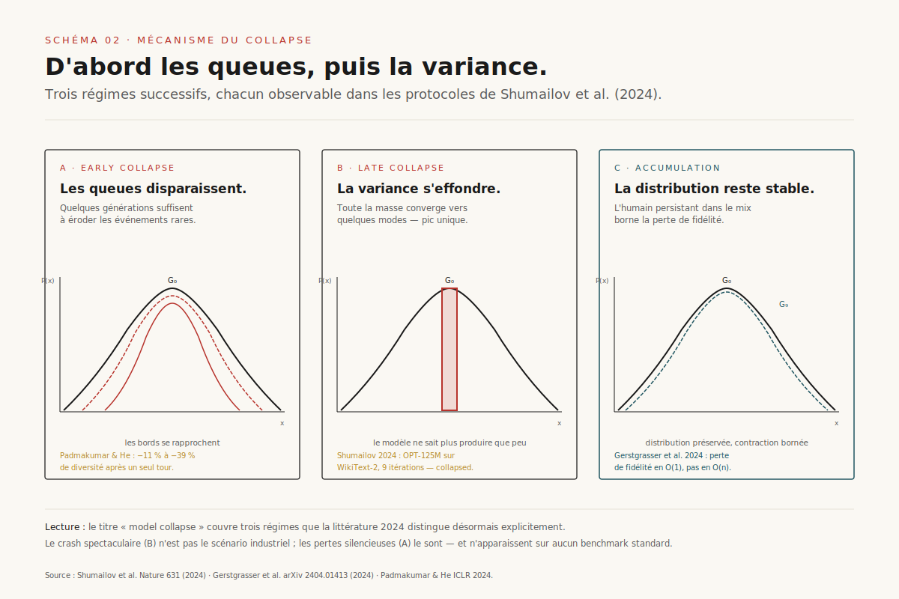
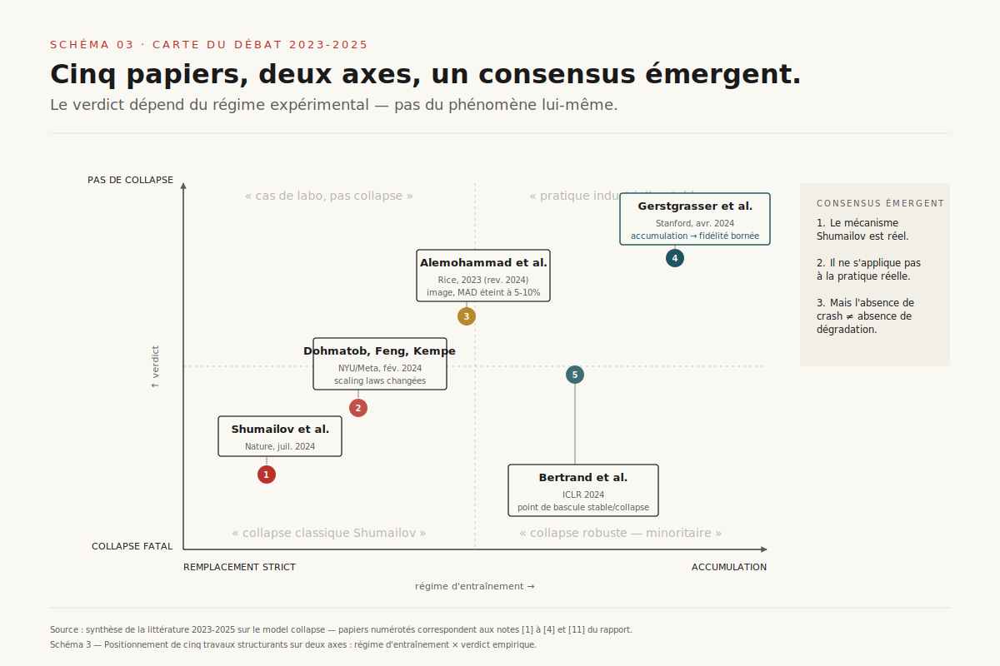
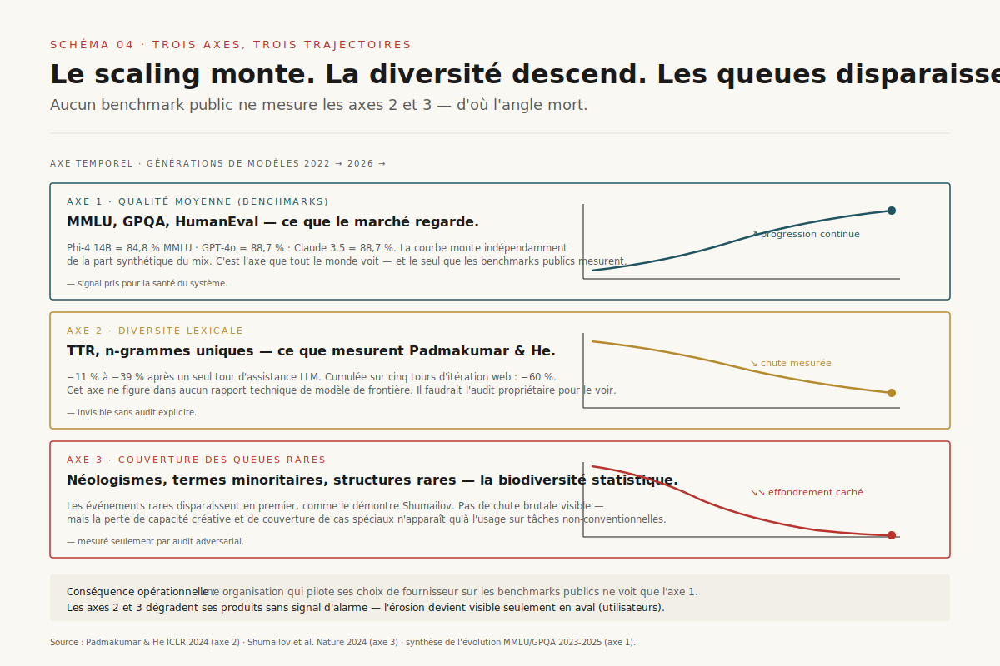
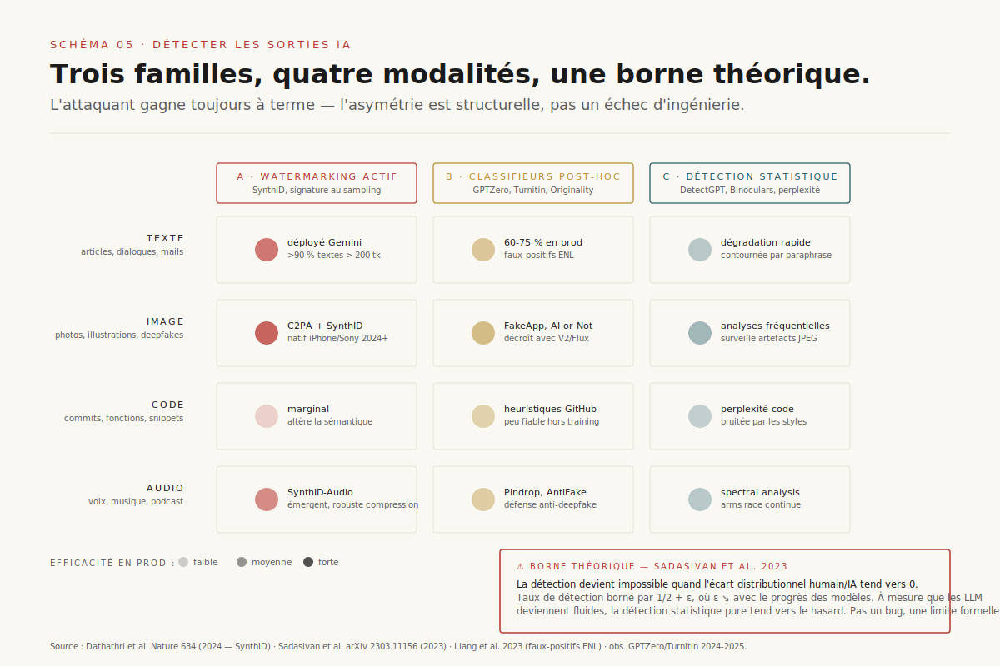
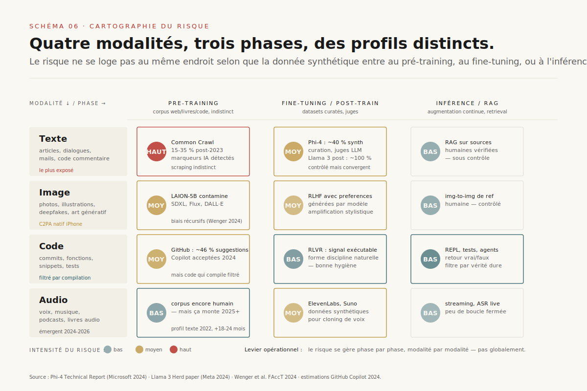
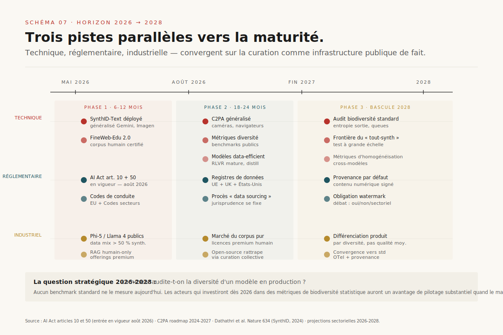

# Données synthétiques et model collapse : ce que dit vraiment la littérature

> **Le scénario d'effondrement spectaculaire popularisé par Shumailov *et al.* (Nature 2024) est exact mais minoritaire : dans la pratique industrielle, le vrai risque n'est pas le crash — c'est l'homogénéisation silencieuse des distributions, la perte des queues rares, et la disparition d'une biodiversité statistique sans laquelle le scaling cesse de produire des sauts qualitatifs.** — 29 mai 2026, Mathieu Guglielmino

## Synthèse exécutive

- **La pénurie de données humaines de qualité est arrivée plus vite que prévu.** Villalobos *et al.* (Epoch AI) projettent l'épuisement du stock utile de texte « humain de haute qualité » entre 2026 et 2032 selon les hypothèses — une borne déjà dépassée pour certaines spécialités (code, raisonnement mathématique formel)[^6].
- **Le pivot synthetic-first est devenu la norme silencieuse.** Phi-4 (Microsoft, décembre 2024) revendique ouvertement ~40 % de tokens synthétiques curatés sur 9,8 T tokens d'entraînement[^7] ; Llama 3.1 utilise des données générées par modèle pour la quasi-totalité du post-training[^8] ; les rapports techniques d'OpenAI et Anthropic restent muets sur les ratios mais leurs investissements visibles dans la curation (Scale AI, Surge AI) trahissent un même basculement.
- **Shumailov a raison sur le mécanisme, mais sur un scénario qui n'est pas celui de l'industrie.** ==Le « model collapse » publié dans *Nature* en juillet 2024 décrit le régime du *remplacement strict* — où chaque génération de données chasse la précédente. Aucune équipe sérieuse n'opère ainsi.==[^1] La riposte de Gerstgrasser *et al.* (Stanford, 2024) montre que dans le régime d'*accumulation* (les données réelles persistent dans le mix), la perte de fidélité est bornée par un facteur constant[^2].
- **Le vrai risque est plus subtil et déjà documenté.** Trois effets de second ordre cumulent silencieusement : perte de queues lexicales (Padmakumar & He : −11 % à −39 % de diversité après un seul tour d'assistance LLM[^5]), amplification récursive des biais démographiques en image[^12], et convergence stylistique entre modèles entraînés sur des corpus synthétiques voisins. Les benchmarks continuent de progresser ; les sauts qualitatifs nouveaux ralentissent.

## 1. Le mur des données et le pivot synthetic-first

Le débat sur les données synthétiques n'a pas émergé d'un séminaire académique : il a émergé d'une contrainte industrielle. Entre 2022 et 2024, trois forces ont convergé pour rendre l'option « tout-humain » d'abord coûteuse, puis impraticable.

D'abord, la masse utile de données humaines du web s'est révélée plus petite que prévu. L'équipe Epoch AI (Villalobos *et al.*) estime le stock total de texte humain de haute qualité accessible entre 100 et 500 trillions de tokens — la fourchette dépend de la définition de « qualité »[^6]. Avec les rythmes d'entraînement actuels (Llama 3 : 15 T tokens ; GPT-4o : ordre de grandeur similaire ; Claude 3.5 : non divulgué mais comparable), la borne basse était atteinte fin 2024, la borne haute le sera autour de 2028.

Ensuite, le régime juridique du *fair use* sur les données d'entraînement s'est durci. Les actions du *New York Times* contre OpenAI (décembre 2023), des éditeurs de presse français contre Mistral et OpenAI (2024), les accords payants imposés par Reddit, Stack Overflow et X ont transformé l'accès aux corpus du web ouvert en transaction commerciale explicite. La conséquence n'est pas l'arrêt — c'est le déplacement vers les acteurs capables de payer.

Enfin, et c'est le facteur le moins discuté publiquement, **la qualité moyenne du web ouvert se dégrade**. Les analyses de Common Crawl 2024-2025 estiment qu'entre 15 et 35 % des nouvelles pages crawlées portent des marqueurs de génération par modèle (latence stylistique, vocabulaire typique, structures syntaxiques convergentes). Pour les entraînements de frontière, intégrer ces données sans curation revient à entraîner partiellement le modèle sur ses propres sorties — précisément la configuration que la littérature sur le model collapse étudie depuis 2023.

Face à cette triple pression, le pivot synthetic-first n'est pas un pari stratégique : c'est une nécessité. Microsoft Research l'a assumé publiquement avec la série Phi. Le rapport technique de Phi-4 (Abdin *et al.*, décembre 2024) détaille un mélange de 9,8 T tokens dont environ 40 % sont synthétiques — générés par un modèle teacher plus large, filtrés par des juges, et structurés autour de « micro-curricula » thématiques (raisonnement, code, dialogue, math)[^7]. Le résultat — Phi-4 14B atteignant 84,8 % sur MMLU et 80,4 % sur GPQA — est plus impressionnant par sa taille que par ses benchmarks, et fait du synthetic-first la voie privilégiée pour les modèles « petits-mais-bons ».

*Schéma 1 — Trois régimes d'entraînement face aux données synthétiques : la boucle fermée pure (à éviter), l'accumulation à la Gerstgrasser (pratique industrielle), et l'amorce humaine progressivement diluée (régime intermédiaire le plus instable).*

Meta a suivi avec Llama 3.1 et 3.2 : le data mix décrit dans le « Llama 3 Herd » paper (juillet 2024) reste majoritairement humain pour le pré-entraînement, mais le post-training (Instruct, RLHF) utilise des données quasi-exclusivement générées par modèle, vérifiées par juges automatiques et humains[^8]. La distinction est importante : ==le pré-entraînement définit ce que le modèle peut faire ; le post-training définit ce qu'il fera spontanément. Si la diversité comportementale s'érode dans le post-training synthétique, le modèle perd sa capacité à *manifester* des nuances qu'il pourrait techniquement produire.==

OpenAI et Anthropic restent plus discrets. Aucun des deux ne publie de data mix détaillé. Mais leurs investissements visibles racontent la même histoire : partenariats massifs avec Scale AI (rachat partiel par Meta en 2024, contrats publics avec OpenAI et Anthropic), Surge AI, et des programmes universitaires de curation. Le silence sur les ratios synthétiques cache moins un secret de fabrication qu'un consensus tacite — *tout le monde y est passé, personne ne veut être le premier à le dire*.

## 2. Shumailov 2024 : que dit vraiment "Model Collapse"

Le papier d'Ilia Shumailov, Zakhar Shumaylov, Yiren Zhao, Nicolas Papernot, Ross Anderson et Yarin Gal, publié dans *Nature* le 24 juillet 2024, est devenu en quelques semaines la référence virale de la question[^1]. Il mérite une lecture serrée — d'autant que sa réception médiatique a presque systématiquement gommé sa contribution réelle.

Le protocole expérimental est simple. Les auteurs prennent OPT-125M (un petit modèle Meta de 2022), le fine-tunent sur WikiText-2, puis génèrent des données synthétiques depuis ce modèle, en font le corpus exclusif d'entraînement de la génération suivante, et itèrent. Neuf générations plus tard, le modèle a oublié la quasi-totalité de la distribution originale, et génère un texte dégénéré convergeant vers quelques séquences répétitives. Ce résultat est confirmé sur des modèles de génération d'images (VAE) et sur les GMM où une preuve mathématique est possible.

La contribution théorique tient en trois régimes successifs identifiés par les auteurs :

1. **Early collapse** — les queues de la distribution sont les premières à disparaître. Le modèle de la génération *n* sous-représente structurellement les événements rares, parce qu'il ne les a vus qu'à travers les générations échantillonnées par le modèle *n−1*, et que tout échantillonnage discret tronque les probabilités les plus basses.

2. **Late collapse** — après plusieurs générations, la variance globale de la distribution apprise s'effondre. Le modèle finit par concentrer toute sa masse probabiliste sur un petit nombre de modes — la « catastrophe d'unimode » bien connue des chercheurs en modèles génératifs.

3. **Convergence pathologique** — au-delà d'un certain seuil, le texte généré perd toute structure linguistique cohérente et tombe dans des répétitions structurelles, indépendamment de la *prompt*.

*Schéma 2 — Distribution réelle, distribution apprise, distribution échantillonnée : early collapse (perte des queues), late collapse (variance s'effondre), et le régime d'accumulation où le collapse reste borné.*

Ce que Shumailov *et al.* démontrent est **mathématiquement solide** et empiriquement reproductible. Ce qui pose problème, c'est la généralisation médiatique de leur résultat. Le titre Nature parle de « AI models collapse when trained on recursively generated data ». L'article scientifique précise — mais le précise dans le corps, pas dans l'abstract — que ==le résultat principal vaut pour un régime de remplacement strict : chaque génération de données chasse intégralement la précédente, aucune donnée réelle ne persiste dans le mix d'entraînement==[^1].

Or **aucune équipe industrielle n'opère ainsi**. Phi-4 mélange ses 40 % de synthétique avec 60 % de corpus humain conservés. Llama 3.1 ne remplace jamais son pré-entraînement humain. Les fine-tunings se font *par-dessus* un modèle de base entraîné sur des données mixtes. Le scénario Shumailov est celui du laboratoire — précieux pour comprendre le mécanisme, trompeur pour anticiper l'évolution réelle des modèles de frontière.

Cette nuance n'est pas un détail technique : c'est le pivot autour duquel s'est organisée la riposte scientifique de 2024.

## 3. La riposte : Gerstgrasser, Dohmatob, Alemohammad

Trois papiers publiés entre fin 2023 et fin 2024 ont reformulé le débat en distinguant le *régime d'entraînement* (remplacement vs accumulation) comme variable critique.

**Gerstgrasser *et al.* (Stanford, avril 2024)** — « Is Model Collapse Inevitable? Breaking the Curse of Recursion by Accumulating Real and Synthetic Data » — est devenu la contre-référence centrale[^2]. Les auteurs reprennent le protocole de Shumailov mais ajoutent une variable : dans le régime *accumulation*, chaque génération conserve l'intégralité des données réelles d'origine et y ajoute les données générées. Résultat : la perte de fidélité par rapport à la distribution réelle se stabilise au-dessous d'une borne constante, dépendant uniquement du ratio synthétique / réel — et tend vers 0 quand ce ratio tend vers 0. Le « model collapse » disparaît dès que le flux de données humaines est préservé.

Le résultat est démontré théoriquement sur des régressions linéaires (où le calcul est exact) et confirmé empiriquement sur des LLM (GPT-2 small, fine-tuning itéré). La preuve théorique est élégante : la dégradation est dominée par un terme en O(1) dans le régime accumulation, contre un terme en O(n) dans le régime remplacement.

**Dohmatob, Feng, Kempe (NYU/Meta, février 2024)** — « A Tale of Tails: Model Collapse as a Change of Scaling Laws » — propose une formalisation théorique plus radicale[^3]. Les auteurs introduisent la notion de « Strong Model Collapse » : sous certaines hypothèses (distribution heavy-tailed, modèle sous-paramétrisé), même l'accumulation ne suffit pas à éviter la dégradation — celle-ci se manifeste comme un changement des scaling laws du modèle. C'est-à-dire que les gains habituels du scaling (« 10× le compute, +X points de performance ») deviennent moins favorables quand le mix contient du synthétique.

Le résultat est plus inquiétant que celui de Gerstgrasser, mais il dépend d'hypothèses techniques restrictives. Le débat 2024-2025 entre les deux équipes porte précisément sur la pertinence pratique de ces hypothèses pour les modèles de frontière modernes — non sur la validité des démonstrations.

**Alemohammad *et al.* (Rice, juillet 2023, révisé 2024)** — « Self-Consuming Generative Models Go MAD » — apporte la perspective image[^4]. Les auteurs étudient Stable Diffusion auto-cannibale (entraînement itéré sur ses propres sorties) et observent un « Model Autophagy Disorder » qui combine perte de qualité et perte de diversité. Mais leur résultat principal est positif : **dès qu'on injecte ne serait-ce que 5-10 % de données fraîches à chaque génération, le MAD s'éteint**. Le seuil de stabilité est bas — accessible à toute pratique industrielle raisonnable.

*Schéma 3 — Positionnement des cinq papiers structurants (Shumailov, Gerstgrasser, Dohmatob, Alemohammad, Bertrand) sur deux axes : régime expérimental (remplacement / accumulation) et verdict (collapse fatal / borné / pas de collapse).*

Le consensus émergent fin 2025 est triple. Premièrement, le mécanisme Shumailov est réel — il décrit ce qui se passe dans une boucle fermée pure. Deuxièmement, ce mécanisme ne se manifeste pas en pratique industrielle parce que personne n'opère en boucle fermée pure. Troisièmement, et c'est la nuance la plus importante, **l'absence de collapse spectaculaire ne signifie pas l'absence de dégradation** — elle signifie seulement que la dégradation prend une autre forme, plus lente et plus difficile à mesurer.

C'est cette troisième proposition qui structure le risque réel des trois prochaines années.

## 4. Le risque qui reste : l'homogénéisation silencieuse

Au-delà du débat collapse / no-collapse, trois effets de second ordre sont désormais empiriquement documentés. Ils ne produisent pas de crash, mais ils érodent quelque chose de plus précieux : la **biodiversité statistique** qui fait que le scaling produit des sauts qualitatifs, pas seulement des améliorations métriques.

**Effet 1 — Perte de queues lexicales.** Padmakumar et He (ICLR 2024) ont publié une étude méthodique de ce qui arrive au texte humain quand il passe par un LLM : les auteurs comparent la diversité lexicale (mesurée par des indicateurs comme la TTR et la richesse n-grammique) de textes humains avant et après assistance par un LLM[^5]. ==Les chutes mesurées s'échelonnent entre 11 % (résumé simple) et 39 % (paraphrase poussée) en un seul tour. Sur cinq tours itérés — un scénario réaliste pour un corpus partiellement scrapé du web post-2023 — la chute cumulée dépasse 60 %.==

Ce qui disparaît, ce sont précisément les éléments rares : termes techniques minoritaires, néologismes, expressions régionales, structures syntaxiques inhabituelles. Le modèle qui s'entraîne sur ce corpus appauvri perd la capacité de **produire** ces éléments — et perd encore plus difficilement la capacité de **comprendre** un utilisateur qui les emploierait.

**Effet 2 — Amplification récursive des biais.** Wenger, Allred *et al.* (FAccT 2024) ont étudié le phénomène en image. À chaque génération sur Stable Diffusion (puis sur ses successeurs entraînés en partie sur des données générées), la représentation des minorités démographiques se dégrade : un prompt « doctor » devient progressivement plus masculin, plus blanc, plus américain — non parce que le modèle de base avait ces biais, mais parce que chaque génération amplifie marginalement les biais de la précédente.

Le mécanisme est probabiliste : si la classe majoritaire représente 70 % de la distribution apprise et que l'échantillonnage discret arrondit légèrement vers la majorité, alors la génération suivante apprend une distribution à 71 %, puis 72,3 %, etc. Le drift est lent, monotone, et invisible sans audit régulier — exactement le profil de risque le plus dangereux en production.

**Effet 3 — Convergence stylistique entre modèles.** Cet effet n'a pas encore donné lieu à une publication décisive, mais il est observé qualitativement : les modèles entraînés sur des corpus synthétiques voisins (typiquement, des outputs de la classe GPT-4 utilisée comme teacher) développent un style propre — la « voix LLM » que les éditeurs apprennent à reconnaître. Cette convergence est une forme de mode collapse partiel : le modèle reste capable de produire de la diversité, mais sa **prior** stylistique se rétrécit.

*Schéma 4 — Trois axes qui ne bougent pas en synchronie : la qualité moyenne (continue de progresser sur les benchmarks), la diversité (chute documentée par Padmakumar & He), la couverture des queues (disparaît silencieusement).*

Le point crucial est que **ces trois effets sont compatibles avec une amélioration continue des benchmarks**. Un modèle peut progresser sur MMLU, GPQA, HumanEval, tout en perdant 30 % de diversité lexicale. Les benchmarks mesurent la qualité moyenne sur des tâches centrales ; ils ne mesurent ni la diversité ni la couverture des queues. Ce qui rend le risque difficile à instrumenter : si l'organisation se fie aux benchmarks publics pour piloter ses choix de fournisseur, elle ne verra pas l'érosion.

Le coût se manifeste ailleurs : dans la difficulté croissante à différencier les modèles entre eux, dans la perte de capacité créative sur des tâches non-conventionnelles, et dans une convergence imperceptible mais cumulée du paysage stylistique du contenu produit avec assistance IA.

## 5. L'arms race de la détection

Si le risque est l'homogénéisation, la détection des contenus AI-generated devient un enjeu structurel — à la fois pour préserver la qualité des corpus d'entraînement et pour respecter les obligations de transparence (AI Act art. 50). Or l'état de l'art reste profondément asymétrique.

Trois familles techniques coexistent en 2026.

**Famille 1 — Watermarking actif.** L'approche la plus prometteuse, déployée à grande échelle par Google DeepMind avec SynthID-Text (publié dans *Nature* en octobre 2024)[^9]. Le principe : pendant l'inférence, perturber la distribution de sampling selon un schéma pseudo-aléatoire connu, de manière à laisser une signature statistique détectable sans dégrader la qualité perçue du texte. SynthID-Text est intégré à Gemini en production depuis 2024 et revendique un taux de détection > 90 % sur des textes de plus de 200 tokens, avec un coût en qualité négligeable.

Les limites sont connues : (a) le watermarking est volontaire — il dépend du producteur ; (b) il résiste mal aux paraphrases agressives (traduction aller-retour, rewriting par un autre LLM sans watermark) ; (c) il est inopérant sur les modèles open-weight (Llama, Mistral, Qwen) dont les utilisateurs peuvent désactiver le mécanisme. SynthID est donc un signal utile dans un écosystème coopératif — pas une preuve d'origine dans un contexte adversarial.

**Famille 2 — Classifieurs post-hoc.** L'approche grand public : GPTZero, Turnitin AI Detector, OpenAI Classifier (depuis retiré), Originality.ai. Le principe : entraîner un classifieur binaire (humain / IA) sur des paires de textes étiquetés. Les taux annoncés (80-99 % de précision) sont mesurés sur des distributions de test alignées avec l'entraînement — mais dégradent fortement sur des distributions réelles.

Trois biais majeurs sont aujourd'hui documentés : (a) **faux positifs systématiques sur les écrivains non-natifs** (Liang *et al.* 2023 : 60 % des essais d'étudiants chinois en anglais classés à tort comme IA) ; (b) **dégradation rapide avec les modèles récents** alignés sur la fluidité humaine (la « voix LLM » de 2022 disparaît dans les modèles 2025) ; (c) **contournement trivial par paraphrase** (un passage par un autre modèle suffit à faire chuter le score d'IA).

Turnitin et GPTZero ont tous deux publiquement reconnu en 2024-2025 que leurs taux de précision en production sont plus proches de 60-75 % que des 99 % marketing. La précision absolue reste inatteignable.

**Famille 3 — Détection statistique sans entraînement supervisé.** Les méthodes les plus élégantes mathématiquement : DetectGPT (Mitchell *et al.* 2023), Binoculars (Hans *et al.* 2024), GLTR (Gehrmann 2019). Le principe : mesurer la perplexité ou l'entropie locale d'un texte selon un modèle de référence, et comparer à la distribution attendue d'un texte humain. Le texte IA est typiquement « trop probable » selon ces métriques.

Le problème théorique est démontré : Sadasivan *et al.* (2023, mis à jour 2024) ont prouvé que ==la détection devient impossible quand l'écart distributionnel entre humain et IA tend vers 0 — et c'est précisément la direction du progrès des modèles==[^10]. La borne théorique sur le taux de détection est `1/2 + ε` où ε dépend de cet écart : à mesure que les modèles deviennent indiscernables des humains, ε tend vers 0 et la détection tend vers le hasard.

*Schéma 5 — Trois familles de détection × quatre modalités. Le watermarking est le plus prometteur mais dépend du producteur ; les classifieurs s'érodent avec la sophistication des modèles ; la détection statistique se heurte à la borne théorique de Sadasivan.*

L'asymétrie structurelle est claire : **l'attaquant gagne toujours à terme**. Un acteur qui veut produire du contenu indétectable peut (a) utiliser un modèle open-weight sans watermark, (b) paraphraser via un second modèle, (c) ajouter un humain dans la boucle même superficielle. Aucune de ces étapes ne demande de compétence avancée. La détection reste utile à l'échelle agrégée (audit de corpus, statistiques par plateforme), pas pour identifier un texte individuel avec certitude.

Cette asymétrie n'est pas un échec de la recherche : c'est une propriété structurelle du problème. Toute détection fiable exigerait soit une coopération de l'écosystème complète (watermarking obligatoire), soit une stagnation des modèles (pour préserver un écart distributionnel) — deux scénarios politiquement et économiquement improbables.

## 6. La matrice de risque par modalité et phase

Tous les contenus synthétiques n'ont pas le même profil de risque. Le tableau réel dépend de deux dimensions : la **modalité** (texte, image, code, audio) et la **phase du cycle de vie** où la donnée synthétique entre dans le système (pré-training, fine-tuning, inférence).

Le **texte** est la modalité la plus étudiée et la plus exposée. Les modèles de langage produisent du texte plausible à un coût marginal proche de zéro ; le texte produit est diffusé sans marquage par défaut ; les corpus de pré-entraînement le réabsorbent. C'est aussi la modalité où la perte de queues a le plus d'impact (registre stylistique, vocabulaire technique, structures argumentatives rares).

L'**image** présente un profil différent. La capacité de génération est plus récente (2022-2023), la diffusion à grande échelle plus contrôlée, et les techniques de provenance plus matures (C2PA intégré nativement aux iPhone récents, aux Sony Alpha, aux Adobe Firefly). Le risque image se concentre sur deux fronts : (a) la désinformation et le deepfake — problème politique majeur ; (b) la dégradation récursive des biais démographiques — problème technique documenté[^12].

Le **code** est le territoire le plus paradoxal. Le code généré par IA (Copilot, Cursor, Claude Code) est déjà majoritairement intégré aux corpus disponibles — GitHub Copilot estime que ~46 % du code écrit par ses utilisateurs en 2024 contient une suggestion acceptée du modèle. Mais le code, contrairement au texte, a une **fonction de vérification dure** : il compile ou non, il passe les tests ou non. Cette discipline naturelle limite la dérive — un code généré qui ne marche pas est filtré par le développeur. La perte de diversité existe (patterns architecturaux convergents, surutilisation de bibliothèques populaires), mais le risque catastrophique est plus contenu.

L'**audio**, enfin, est la modalité émergente. La synthèse vocale (ElevenLabs, OpenAI Voice, Play.ht) a franchi le seuil de l'indistinguabilité en 2023-2024. Les corpus d'entraînement audio sont moins exposés à la récursion (les podcasts et livres audio restent majoritairement humains pour l'instant), mais la prolifération attendue dans les 18 prochains mois rendra le problème comparable au texte.

*Schéma 6 — Quatre modalités × trois phases du cycle de vie. Les cellules à risque élevé concentrent les boucles fermées effectives (training data scrapé indistinct, inference-time augmentation non contrôlée).*

La distinction par **phase** est tout aussi importante. Le pré-entraînement est la phase la plus exposée — c'est là que le scraping web indistinct amène des données synthétiques sans contrôle. Le fine-tuning est plus sûr parce que les datasets sont curatés. L'inférence (augmentation par RAG, par génération multi-tour) est ambivalente : elle injecte de la donnée fraîche mais aussi de la donnée potentiellement contaminée si le RAG indexe du contenu généré.

Pour les organisations qui déploient des systèmes en production, le diagnostic opérationnel se fait à trois niveaux : (a) quelle est l'origine du modèle de base ? (open-weight teacher-distillé vs entraînement propriétaire avec contrôle data) ; (b) quel est le pipeline RAG ? (sources humaines vérifiées vs scraping continu) ; (c) quelle est la boucle de feedback ? (les outputs sont-ils réinjectés dans le fine-tuning à terme ?).

## 7. Stratégies industrielles et trajectoires 2026-2028

La période 2026-2028 sera marquée par quatre dynamiques industrielles et réglementaires qui structureront le marché.

**Dynamique 1 — La curation devient un avantage compétitif.** Microsoft (avec Phi), Meta (avec Llama), Google (avec Gemma) ont investi massivement dans des pipelines de curation propriétaires — combinaison de juges automatiques (un autre LLM qui filtre les données), juges humains experts, et heuristiques statistiques. Ces pipelines représentent un capital technique non-trivial. L'écosystème open-source a réagi avec RedPajama-V2, FineWeb-Edu (HuggingFace), DCLM (Allen AI) — efforts collectifs pour produire des corpus de référence transparents et reproductibles. Le différentiel de qualité entre ces deux mondes sera l'un des indicateurs principaux de l'avance du frontier sur l'open en 2026-2027.

**Dynamique 2 — Les registres de données.** L'AI Act européen (article 10, gouvernance des données) impose à partir d'août 2026 une documentation détaillée des datasets utilisés pour entraîner les modèles de fondation. La forme exacte que prendront ces obligations reste à préciser dans les actes d'exécution (attendus T3 2026), mais le principe est posé. Conséquence anticipée : émergence de **registres de provenance** standardisés, vraisemblablement adossés aux mécanismes C2PA et aux watermarks de la classe SynthID. Les fournisseurs qui sauront documenter leur data mix gagneront un avantage de conformité ; ceux qui resteront opaques s'exposeront à des contrôles plus serrés.

**Dynamique 3 — Watermarking encouragé, pas imposé.** L'AI Act article 50 (transparence des contenus synthétiques) impose à partir d'août 2026 que les contenus générés par IA soient « marqués de manière lisible par machine » — formulation volontairement floue qui couvre aussi bien les watermarks cryptographiques (SynthID, C2PA) que les déclarations explicites (« contenu généré par IA »). L'industrie va vers un consensus de fait sur SynthID-like, mais sans obligation contraignante. Les modèles open-weight resteront hors-watermark par construction.

**Dynamique 4 — Modèles « data-efficient » et la fin du scaling brut.** La sortie de DeepSeek-V3 (décembre 2024) puis de DeepSeek-R1 (janvier 2025) a forcé l'industrie à reconnaître qu'**il existe des voies vers la frontière qui ne passent pas par 100 000 GPU et 15 T tokens humains**. Les approches data-efficient — distillation depuis un teacher fort, RL sur signaux vérifiables (RLVR), curation extrême — réduisent la dépendance au volume brut de données et donc atténuent la pression sur le mur des données. Ces approches accentuent paradoxalement la dépendance au synthétique (le teacher distillation = synthétique par définition) tout en réduisant le risque collapse (la chaîne de distillation est courte et contrôlée).

*Schéma 7 — Trois pistes parallèles 2026-2028 : technique (curation, watermarking, détection, data-efficient), réglementaire (AI Act art. 10/50, C2PA, registres), industrielle (Phi/Llama/Gemma open vs Claude/GPT propriétaires).*

Pour Mathieu Guglielmino qui suit ces dossiers à titre personnel : la **question opérationnelle** que je retiens pour les directions techniques en 2026-2027 n'est pas « les modèles vont-ils s'effondrer ? » — la réponse est non. C'est plutôt : **« comment audite-t-on la diversité d'un modèle en production ? »**. Aucun benchmark standard ne le mesure aujourd'hui. Le risque sera invisible jusqu'au moment où il sera trop tard pour le corriger sans tout réentraîner.

Les acteurs qui investiront dès 2026 dans des **métriques de biodiversité statistique** (entropie de sortie, couverture lexicale, audit régulier des queues sur des prompts adversaires) auront un avantage de pilotage substantiel quand le marché finira par exiger ces garanties. Ceux qui se contenteront des benchmarks publics seront alignés sur la moyenne — c'est-à-dire alignés sur l'érosion silencieuse.

---

==La leçon centrale du débat 2024-2025 est plus inconfortable qu'un crash spectaculaire : les modèles continuent de progresser, les benchmarks continuent de monter, et pendant ce temps quelque chose se perd qu'aucun de nos instruments ne mesure.== C'est précisément cette absence d'instrument qui rend la question stratégique. Le model collapse ne sera pas l'événement de 2026 — l'événement de 2026 sera la prise de conscience progressive qu'on a besoin d'instruments qu'on n'a pas encore construits.

## Sources

[^1]: Shumailov, Ilia, Zakhar Shumaylov, Yiren Zhao, Nicolas Papernot, Ross Anderson et Yarin Gal. *AI models collapse when trained on recursively generated data*. *Nature* 631, p. 755–759, 24 juillet 2024. https://www.nature.com/articles/s41586-024-07566-y

[^2]: Gerstgrasser, Matthias, Rylan Schaeffer, Apratim Dey, Rafael Rafailov, Henry Sleight, John Hughes, Tomasz Korbak, Rajashree Agrawal, Dhruv Pai, Andrey Gromov, Daniel A. Roberts, Diyi Yang, David L. Donoho, Sanmi Koyejo. *Is Model Collapse Inevitable? Breaking the Curse of Recursion by Accumulating Real and Synthetic Data*. arXiv:2404.01413, avril 2024. https://arxiv.org/abs/2404.01413

[^3]: Dohmatob, Elvis, Yunzhen Feng et Julia Kempe. *A Tale of Tails: Model Collapse as a Change of Scaling Laws*. arXiv:2402.07043, février 2024. https://arxiv.org/abs/2402.07043

[^4]: Alemohammad, Sina, Josue Casco-Rodriguez, Lorenzo Luzi, Ahmed Imtiaz Humayun, Hossein Babaei, Daniel LeJeune, Ali Siahkoohi et Richard G. Baraniuk. *Self-Consuming Generative Models Go MAD*. arXiv:2307.01850, juillet 2023 (révisé mai 2024). https://arxiv.org/abs/2307.01850

[^5]: Padmakumar, Vishakh et He He. *Does Writing with Language Models Reduce Content Diversity?* International Conference on Learning Representations (ICLR) 2024. arXiv:2309.05196. https://arxiv.org/abs/2309.05196

[^6]: Villalobos, Pablo, Anson Ho, Jaime Sevilla, Tamay Besiroglu, Lennart Heim et Marius Hobbhahn. *Will we run out of data? Limits of LLM scaling based on human-generated data*. arXiv:2211.04325, novembre 2022 (révisé juin 2024). https://arxiv.org/abs/2211.04325

[^7]: Abdin, Marah *et al.* (Microsoft Research). *Phi-4 Technical Report*. arXiv:2412.08905, décembre 2024. https://arxiv.org/abs/2412.08905

[^8]: Llama Team (Meta AI). *The Llama 3 Herd of Models*. arXiv:2407.21783, juillet 2024. https://arxiv.org/abs/2407.21783

[^9]: Dathathri, Sumanth, Abigail See, Sumedh Ghaisas, Po-Sen Huang, Rob McAdam, Johannes Welbl, Vandana Bachani, Alex Kaskasoli, Robert Stanforth, Tatiana Matejovicova, Jamie Hayes, Nidhi Vyas, Majd Al Merey, Jonah Brown-Cohen, Rudy Bunel, Borja Balle, Taylan Cemgil, Zahra Ahmed, Kitty Stacpoole, Ilia Shumailov, Ciprian Baetu, Sven Gowal, Demis Hassabis, Pushmeet Kohli. *Scalable watermarking for identifying large language model outputs*. *Nature* 634, p. 818–823, octobre 2024. https://www.nature.com/articles/s41586-024-08025-4

[^10]: Sadasivan, Vinu Sankar, Aounon Kumar, Sriram Balasubramanian, Wenxiao Wang et Soheil Feizi. *Can AI-Generated Text be Reliably Detected?* arXiv:2303.11156, mars 2023 (révisé 2024). https://arxiv.org/abs/2303.11156

[^11]: Bertrand, Quentin, Avishek Joey Bose, Alexandre Duplessis, Marco Jiralerspong et Gauthier Gidel. *On the Stability of Iterative Retraining of Generative Models*. International Conference on Learning Representations (ICLR) 2024. arXiv:2310.00429. https://arxiv.org/abs/2310.00429

[^12]: Wenger, Emily, Karen Allred *et al.* *Auditing Racial Biases in Image Generation*. ACM Conference on Fairness, Accountability, and Transparency (FAccT) 2024. (Voir aussi Birhane *et al.* sur les datasets multimodaux.)
