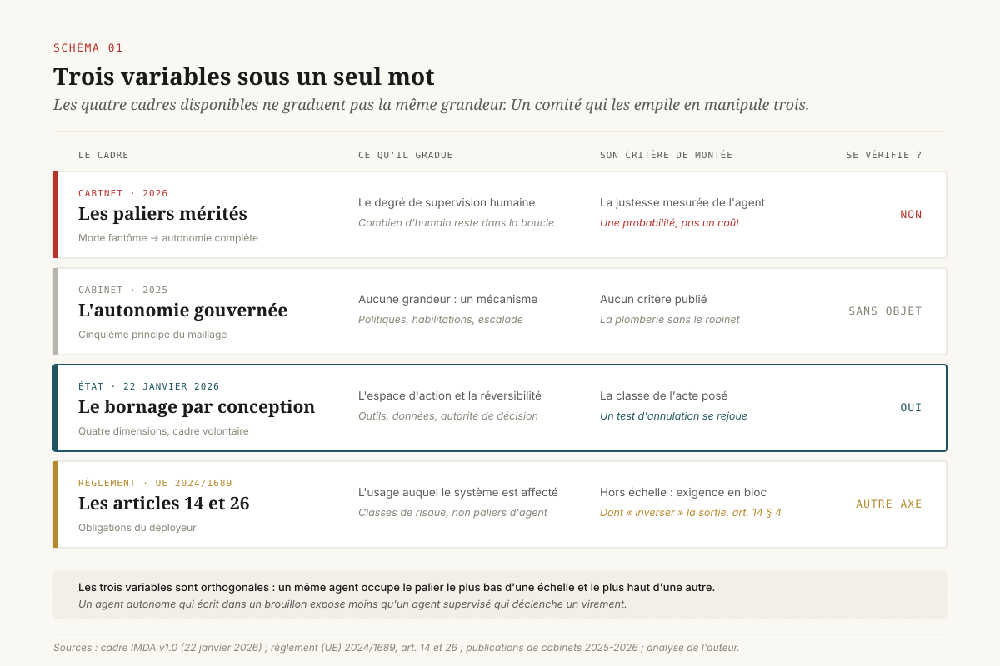
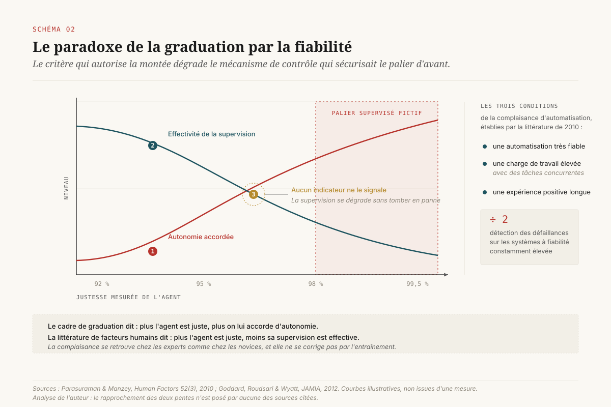
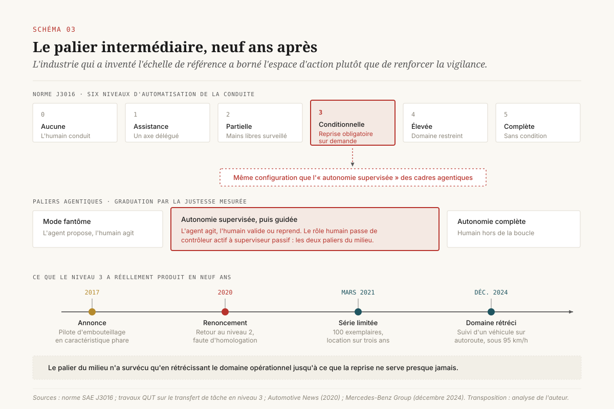
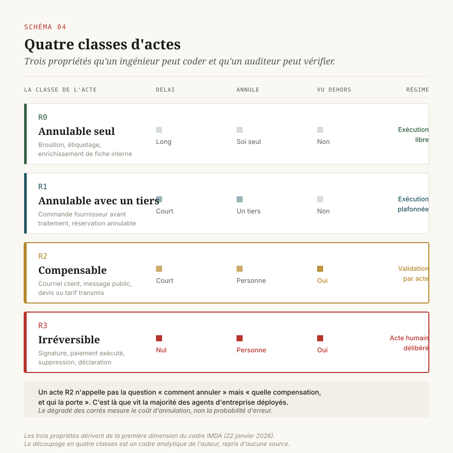
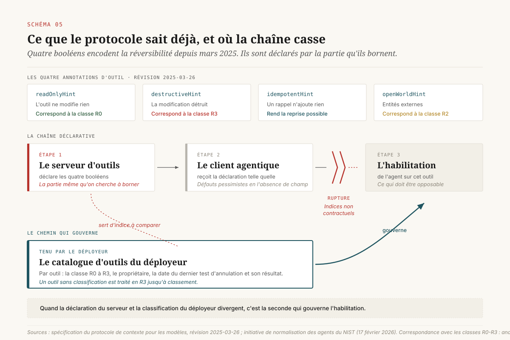
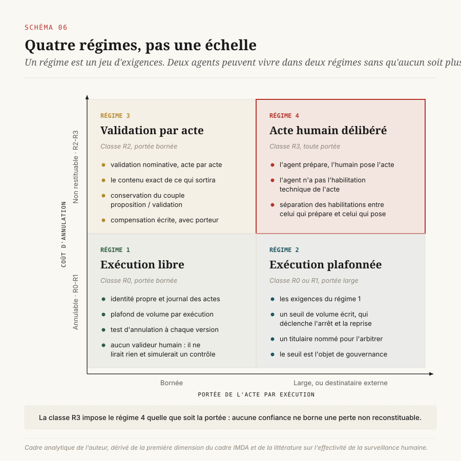

# Le palier qu'on ne peut pas vérifier

> **Quatre cadres publiés graduent l'autonomie des agents sur trois variables incompatibles, et une seule se vérifie : la réversibilité de l'acte.** — 2 octobre 2026, Mathieu Guglielmino

## Trois variables sous un seul mot

Une direction data qui veut écrire sa politique d'autonomie agentique trouve aujourd'hui quatre cadres sur la table. Un cadre de cabinet qui propose des paliers mérités, du mode fantôme à l'autonomie complète. Un second qui nomme un principe d'architecture, l'autonomie gouvernée. Un cadre d'État, publié par Singapour le 22 janvier 2026, premier texte public consacré aux agents. Et un règlement, le règlement européen sur l'intelligence artificielle, qui impose des obligations au déployeur sans jamais parler de paliers.

Le comité qui les empile croit arbitrer une échelle. Il en manipule trois.

Parce que le mot « autonomie » recouvre trois grandeurs distinctes, et que chacun de ces textes en gradue une seule. Le premier gradue le **degré de supervision humaine** : combien d'humain reste dans la boucle, et à quel moment il intervient. Le troisième gradue l'**espace d'action** : quels outils l'agent peut appeler, quelles données il peut lire, et surtout quels actes il peut poser sans retour. Le règlement, lui, ne gradue ni l'un ni l'autre. Il gradue l'**usage** : ce que le système sert à faire, et dans quel domaine. Un même agent peut occuper le palier le plus bas d'une échelle et le plus haut d'une autre.

==Les trois variables ne sont pas trois mesures du même phénomène : elles sont orthogonales, et il existe des contre-exemples dans les quatre coins.== Un agent pleinement autonome qui écrit dans un brouillon partagé est moins dangereux qu'un agent supervisé qui déclenche un virement, parce que dans le premier cas la supervision ne sert à rien et dans le second elle ne suffit pas. Le degré de supervision ne dit rien du coût d'une erreur. L'espace d'action, lui, le dit.

Ce dossier propose un verdict sur les quatre cadres, et une conséquence pratique.

Le verdict : les cadres de cabinets font monter un agent d'un palier quand sa justesse mesurée progresse. Or la littérature de facteurs humains sur la complaisance d'automatisation établit depuis quinze ans que la vigilance d'un opérateur décroît avec la fiabilité perçue du système qu'il surveille[^4]. Le critère de montée dégrade donc le mécanisme de contrôle qui justifiait le palier d'avant. Une échelle graduée sur la supervision contient cette contradiction par construction, et aucun des deux cadres de cabinets ne la traite.

La conséquence : une politique d'autonomie ne tient que si sa variable de graduation se **vérifie**. On ne peut pas tester qu'un humain a réellement lu ce qu'il a validé. On peut tester qu'un acte s'annule. La réversibilité est la seule des trois variables qui se mette à l'épreuve, et c'est celle que le cadre singapourien a choisie[^1]. C'est aussi, comme on le verra, celle que le protocole d'outillage des agents encode déjà depuis mars 2025, à l'étage technique, sous une forme que personne n'a remontée au niveau de la politique d'entreprise[^10].

## Ce que chaque cadre gradue réellement

Le relevé mérite d'être fait texte par texte, parce que l'écart est plus large qu'il n'y paraît.

### La graduation par paliers mérités

Le cadre du Boston Consulting Group sur la gouvernance de l'agentique à l'échelle organise la montée en autonomie comme un **parcours de promotion** : un agent gagne son autonomie en franchissant des seuils de performance prouvés et des campagnes de test rigoureuses[^8]. Le premier palier est le mode fantôme : l'agent propose, l'humain agit. Le dernier est l'autonomie complète, humain hors de la boucle, explicitement réservée aux environnements matures et peu risqués où le coût d'une erreur est négligeable devant le gain d'efficacité.

La construction est propre et elle a un mérite réel : elle interdit d'accorder l'autonomie par décret. Mais son critère de montée est la **justesse mesurée**. L'autonomie y est présentée comme un parcours de confiance, quantifié par la précision de l'agent. Ce choix a deux conséquences que le cadre ne tire pas.

La première : la justesse mesure une probabilité d'erreur, pas un coût d'erreur. Un agent qui se trompe une fois sur mille sur un acte irrattrapable expose l'organisation à une perte non bornée ; un agent qui se trompe une fois sur dix sur un brouillon ne l'expose à rien. Diviser par dix le taux d'erreur ne borne aucune perte. Seule la nature de l'acte la borne.

La seconde est le paradoxe traité en section suivante.

### Le mécanisme sans échelle

Le maillage agentique de McKinsey QuantumBlack repose sur cinq principes de conception : composabilité, intelligence distribuée, découplage des couches, neutralité vis-à-vis du fournisseur, et **autonomie gouvernée**[^9]. Ce cinquième principe est défini comme le contrôle proactif du comportement de l'agent par des politiques embarquées, des habilitations et des mécanismes d'escalade.

C'est le meilleur vocabulaire de risque du corpus des cabinets, et c'est aussi le plus honnête sur ce qu'il ne fait pas : il nomme un **mécanisme** sans publier d'**échelle**. Politiques, habilitations, escalade : voilà par quoi un palier se fait respecter. Reste à dire sur quoi on gradue, et le texte ne le dit pas. Une direction qui adopte le maillage agentique a la plomberie sans le robinet.

### Le cadre d'État qui gradue l'acte

Le cadre singapourien, publié par l'IMDA le 22 janvier 2026 et mis à jour le 20 mai 2026 avec des cas d'entreprise, est structuré en quatre dimensions. La première s'intitule, en substance, évaluer et borner les risques en amont : comprendre les risques d'un agent à partir de son **espace d'action**, de la **réversibilité de ses actions** et de son degré d'autonomie, puis borner par conception la portée de son impact[^1].

Trois choses méritent d'être relevées dans cette seule phrase.

D'abord, la réversibilité est nommée comme variable d'entrée, au même rang que l'espace d'action. Le texte l'illustre par un dégradé explicite : un agent qui planifie un rendez-vous et se trompe de date pose un acte réversible ; un agent qui signe un contrat pose un acte qui ne l'est pas ; un agent qui envoie un courriel se situe entre les deux. Cet entre-deux est l'intuition centrale du dossier, et on y revient en section 5.

Ensuite, le bornage est défini de façon opératoire : définir l'autonomie d'un agent, c'est définir son accès aux outils (quelles interfaces peut-il appeler), son accès aux données (quelles informations client peut-il consulter) et son autorité de décision (quels actes peut-il poser sans validation humaine). Le bornage s'écrit donc en trois listes plutôt qu'en position sur un curseur.

Enfin, le cadre spécifie quatre catégories de déclenchement d'une validation humaine : les décisions à fort enjeu, les actions irréversibles, les comportements aberrants, et les limites définies par l'utilisateur. La deuxième catégorie fait de l'irréversibilité un **déclencheur** et non une caractéristique à documenter.

La conformité au cadre reste volontaire, et les analyses juridiques insistent sur le fait que les organisations demeurent légalement responsables du comportement de leurs agents indépendamment de leur adhésion[^2]. C'est un cadre et non un texte opposable. Mais c'est le seul des quatre qui ait choisi une variable vérifiable.

### Le règlement qui gradue l'usage

Le règlement européen sur l'IA ne contient aucune échelle d'autonomie. Il classe les systèmes par **usage**, et il attache à la classe haut risque un jeu d'obligations. Côté déployeur, deux articles comptent.

L'article 14 impose que les systèmes à haut risque soient conçus pour permettre une surveillance humaine effective. Son paragraphe 4 énumère les capacités que les personnes chargées de cette surveillance doivent pouvoir exercer, et deux points y sont décisifs. Le règlement leur demande d'être conscientes de la **tendance possible à se reposer automatiquement, ou à se reposer excessivement**, sur la sortie du système : le législateur nomme le biais d'automatisation dans le corps du texte. Et il leur demande de pouvoir décider de ne pas utiliser le système, ou d'ignorer, de passer outre ou d'**inverser** sa sortie[^3].

Le mot est là. Le règlement européen nomme l'inversion de la sortie comme une capacité exigible. Aucun des cadres de cabinets ne l'a reprise comme variable de graduation, et le règlement lui-même ne la gradue pas : il l'exige en bloc, à toutes les intensités d'usage de la classe haut risque, sans distinguer l'acte qui s'annule de celui qui ne s'annule pas.

L'article 26 ajoute l'obligation de confier cette surveillance à des personnes physiques disposant de la compétence, de la formation et de l'**autorité** nécessaires, ainsi que du soutien requis. Il crée une exigence d'autorité sans créer de poste, ce qui est la difficulté relevée ailleurs dans la série.

Un dernier texte complète le tableau sans trancher la question : l'initiative américaine sur les normes des agents, lancée par le centre de normalisation de l'institut national des standards le 17 février 2026, s'organise en trois piliers (normes portées par l'industrie, développement de protocoles ouverts, recherche sur la sécurité et l'identité) et prépare des recouvrements de contrôles pour déploiements mono-agent et multi-agents[^11]. Elle gradue les **contrôles**, pas l'autonomie. C'est une quatrième variable, et elle ne résout pas l'incompatibilité des trois premières.

## Le paradoxe de la graduation par la fiabilité

Voici le résultat qui met en difficulté les paliers mérités.

La complaisance d'automatisation est l'un des phénomènes les mieux établis des facteurs humains. La synthèse de référence, publiée par Parasuraman et Manzey dans *Human Factors* en 2010, intègre trois décennies de travaux expérimentaux et identifie trois conditions qui la produisent : une automatisation **très fiable**, un opérateur en **charge de travail élevée** avec des tâches concurrentes, et une **expérience positive prolongée** avec le système[^4].

Les trois conditions décrivent exactement la situation d'un valideur d'actes agentiques en production.

Les résultats expérimentaux sont sévères. Dans les protocoles de surveillance, les opérateurs de systèmes à fiabilité constamment élevée détectent les défaillances environ deux fois moins souvent que les opérateurs de systèmes moins fiables. La complaisance se retrouve chez les participants experts comme chez les novices. Et elle ne se corrige pas par la simple pratique : s'entraîner à surveiller un système fiable n'améliore pas la détection, parce que le mécanisme est attentionnel et non pas lié à une compétence.

La revue systématique publiée dans le *Journal of the American Medical Informatics Association* en 2012 confirme la fréquence du phénomène dans des contextes de décision assistée, et trie les mesures d'atténuation : celles qui modifient la charge de travail et la présentation de l'incertitude fonctionnent partiellement, celles qui reposent sur l'exhortation à la vigilance ne fonctionnent pas[^5].

Mettons les deux énoncés côte à côte.

Le cadre de graduation dit : plus l'agent est juste, plus on lui accorde d'autonomie. La littérature dit : plus l'agent est juste, moins sa supervision est effective. ==Le critère qui autorise la montée détruit le mécanisme de contrôle qui sécurisait le palier précédent.== Les deux courbes se croisent, et le point de croisement n'est signalé par aucun indicateur : la supervision ne tombe pas en panne, elle se dégrade sans émettre de signal. Un taux d'approbation de 99 % se lit de la même manière qu'un valideur attentif qui approuve des actes justes et qu'un valideur qui ne lit plus rien.

C'est la différence de nature entre les deux variables candidates. Une classe de réversibilité se teste : on déclenche l'annulation et on regarde si l'état revient. Le résultat est binaire, reproductible, et il peut figurer dans un jeu de tests rejoué à chaque version. L'effectivité d'une supervision ne se teste pas de l'extérieur. Les travaux interdisciplinaires sur l'effectivité de la surveillance humaine montrent qu'elle dépend de conditions (temps disponible, information contrefactuelle, autorité réelle de l'intervenant) dont aucune n'est observable dans les journaux d'un système en production[^6].

Cette asymétrie a une traduction juridique, et elle est inconfortable. L'article 14 demande au déployeur de rendre la surveillance humaine effective et de prémunir ses valideurs contre le biais d'automatisation. L'analyse de cette obligation montre qu'elle demande au déployeur de produire un résultat que la littérature décrit comme structurellement difficile à atteindre, et qu'elle ne fournit aucun critère pour établir qu'il a été atteint[^7]. Un déployeur qui s'appuie sur la supervision comme garantie principale porte donc une obligation dont il ne peut pas prouver l'exécution. Un déployeur qui s'appuie sur la réversibilité porte une obligation dont il peut produire le test.

## La preuve par l'automobile : neuf ans sur un palier intermédiaire

L'industrie automobile a mené l'expérience avant nous, à grande échelle et sous le regard de régulateurs.

L'échelle de référence du secteur, la norme J3016 de la *Society of Automotive Engineers*, compte six niveaux de 0 à 5. Le niveau 3, dit automatisation conditionnelle, est le palier intermédiaire : le système conduit, le conducteur peut détourner son attention, mais il doit reprendre le contrôle sur demande. C'est exactement la configuration que les cadres agentiques placent au milieu de leur échelle, sous le nom d'autonomie supervisée ou guidée.

La recherche sur le transfert de tâche dans ces véhicules a documenté le problème central : le rôle du conducteur passe de **contrôleur actif** à **superviseur passif**, et un conducteur hors de la boucle de contrôle perd la conscience de situation nécessaire pour reprendre correctement[^12]. Les travaux mesurent un délai de reprise qui dépend de la charge de la tâche annexe, et une dégradation de la qualité de la reprise quand cette charge augmente. Le système doit alors estimer le temps de récupération du conducteur et surveiller ce qu'il fait d'autre, ce qui ajoute une couche de supervision pour surveiller le superviseur.

L'histoire industrielle du palier est plus parlante que les mesures.

Audi annonce en 2017 la première fonction de niveau 3 sur l'A8, le pilote d'embouteillage, présentée comme la caractéristique phare du modèle. En 2020, le constructeur renonce à la déployer sur cette génération et redirige ses efforts vers l'amélioration du niveau 2, en invoquant l'absence de cadre d'homologation stabilisé[^14]. Honda homologue la fonction au Japon en novembre 2020 et commercialise la Legend en mars 2021, en série limitée à cent exemplaires, uniquement en location sur trois ans. Mercedes-Benz obtient en décembre 2024 l'autorisation de l'autorité fédérale allemande pour son système de niveau 3 jusqu'à 95 km/h, en suivi d'un véhicule sur autoroute[^13].

Neuf ans après l'annonce, le palier intermédiaire existe donc, mais il n'a survécu qu'à une condition : ==on a rétréci le domaine opérationnel jusqu'à ce que la reprise ne serve presque jamais.== Suivre un véhicule, sur autoroute, sous une limite de vitesse. L'industrie n'a pas supprimé le niveau 3 ; elle a réduit son espace d'action jusqu'à rendre la supervision à peu près inutile.

La transposition est directe et elle inverse le geste des cadres de cabinets. Ceux-ci élargissent l'espace d'action quand la justesse progresse. L'automobile a fait le contraire : elle a borné l'espace d'action pour que le palier tienne. Et c'est le geste de la première dimension du cadre singapourien, borner par conception. Deux secteurs, deux époques, une même conclusion : le palier intermédiaire ne se sécurise pas par la vigilance de celui qui surveille, il se sécurise par la réduction de ce qui peut mal tourner.

## La variable qui se vérifie : anatomie de la réversibilité

Dire qu'un acte est réversible ne suffit pas. Pour qu'une classe de réversibilité serve de base à une habilitation, il faut la décomposer en propriétés qu'un ingénieur puisse coder et qu'un auditeur puisse vérifier. Trois suffisent.

**Le délai de rétractation.** Combien de temps s'écoule entre l'acte et le moment où l'annulation devient impossible. Un virement en zone euro connaît une fenêtre technique courte mais non nulle ; un message publié sur un canal interne reste supprimable ; une suppression en base sans conservation temporaire a un délai de zéro. Cette propriété se mesure en secondes et s'écrit dans une spécification.

**L'acteur de l'annulation.** Qui doit agir pour que l'état revienne. Trois cas : l'organisation seule, l'organisation avec le concours d'un tiers (une banque, un fournisseur, un greffe), ou personne (l'état antérieur n'est pas reconstituable). Ce critère est le plus discriminant des trois parce qu'il est **organisationnel** et non technique : un acte techniquement réversible qui exige l'accord d'un tiers a un délai réel qui se compte en jours et un taux de succès inférieur à un.

**L'observation par un tiers.** L'effet de l'acte a-t-il été vu hors de l'organisation. C'est la propriété que les systèmes d'information ignorent et que les directions juridiques connaissent bien. Un courriel envoyé par erreur à un client peut être rappelé techniquement sur certaines messageries ; il a été lu. Une proposition tarifaire erronée transmise à un prospect peut être corrigée ; elle a été reçue, et dans certains contextes elle engage. Un acte observé par un tiers n'est pas annulable, il est au mieux **compensable**.

Ces trois propriétés produisent quatre classes d'actes.

| Classe | Définition | Exemple | Régime |
|---|---|---|---|
| **R0 · annulable seul** | Délai long, l'organisation seule, aucun tiers n'a vu | Écriture dans un brouillon, étiquetage, enrichissement de fiche interne | L'autonomie peut être large |
| **R1 · annulable avec un tiers** | Délai court, concours externe nécessaire, aucune observation externe | Commande fournisseur avant traitement, réservation annulable | Point d'arrêt sur seuil de portée |
| **R2 · compensable** | Effet observé hors de l'organisation, l'état antérieur n'est pas restituable | Courriel client, message public, devis transmis | Validation humaine par acte |
| **R3 · irréversible** | Délai nul ou effet juridique constitué | Signature, paiement exécuté, suppression définitive, déclaration réglementaire | Jamais sans acte humain délibéré |

La vertu de cette taxonomie tient à sa **testabilité**. Pour chaque outil du catalogue, on peut écrire un test qui pose l'acte dans un bac à sable, déclenche l'annulation et vérifie l'état. Le test se rejoue à chaque version du modèle, à chaque mise à jour du fournisseur, à chaque ajout d'outil. Il produit une série temporelle. C'est un objet de pilotage, et il n'en existe aucun équivalent pour mesurer la qualité d'une supervision humaine.

Une remarque sur la classe R2, qui est la plus intéressante et la plus mal traitée. Le cadre singapourien place l'envoi de courriel « entre les deux » et s'arrête là. C'est l'entre-deux où vit la majorité des agents d'entreprise déployés aujourd'hui : agents de relation client, de prospection, de support, de reporting diffusé. Pour cette classe, la question n'est pas comment annuler mais **quelle compensation est prévue et qui la porte**. Un régime d'autonomie qui ne répond pas à cette question laisse l'organisation découvrir la réponse au premier incident.

## Ce que le protocole sait déjà et que la politique ignore

Il existe une raison de penser que la réversibilité est la bonne variable, et elle est empirique : l'étage technique l'a déjà adoptée, sans concertation avec l'étage de la gouvernance.

La révision du 26 mars 2025 du protocole de contexte pour les modèles, le protocole d'outillage des agents le plus largement implémenté, introduit un jeu d'annotations d'outils composé de quatre booléens optionnels[^10]. `readOnlyHint` indique que l'outil ne modifie rien. `destructiveHint` indique, pour un outil qui n'est pas en lecture seule, que la modification peut détruire des données plutôt que s'y ajouter. `idempotentHint` indique qu'un appel répété avec les mêmes arguments n'a pas d'effet supplémentaire. `openWorldHint` indique que l'outil interagit avec un monde ouvert d'entités externes plutôt qu'avec un domaine fermé et défini.

Lisons ces quatre champs pour ce qu'ils sont. Lecture seule : classe R0. Destructif : classe R3. Idempotent : la propriété qui rend une reprise sur erreur possible. Monde ouvert : l'observation par un tiers, c'est-à-dire la classe R2. ==Les quatre booléens d'un protocole d'outillage encodent exactement les propriétés de réversibilité qu'aucun cadre de gouvernance d'entreprise n'a converties en politique.== Les valeurs par défaut sont par ailleurs pessimistes : en l'absence de déclaration, un outil est réputé non en lecture seule, potentiellement destructif, non idempotent et ouvert sur le monde. Le protocole a pris la décision prudente que les politiques d'entreprise ne prennent pas.

Puis vient la faille, et elle est structurante pour la décision.

Ces annotations sont déclarées par le **serveur d'outils**, c'est-à-dire par la partie même dont l'acte est celui qu'on cherche à borner. Et la spécification elle-même les qualifie d'indices non contractuels : un serveur non digne de confiance peut déclarer un outil en lecture seule et supprimer des fichiers, ce qui conduit la spécification à demander aux clients de traiter les annotations de serveurs non vérifiés comme purement informatives.

La conséquence est la même que celle établie ailleurs dans la série à propos des identités d'agents : un palier d'autonomie qu'on ne peut pas faire respecter techniquement reste une charte. Une classification de réversibilité lue dans la déclaration du fournisseur d'outils a exactement le statut d'une charte. ==La classification doit être tenue par le déployeur, dans son propre catalogue, et opposée à la déclaration du serveur plutôt que recopiée d'elle.==

Cela donne une exigence concrète, et peu coûteuse : pour chaque outil exposé à un agent, le catalogue du déployeur porte sa classe R0 à R3, son propriétaire, la date du dernier test d'annulation et le résultat de ce test. Quand la déclaration du serveur et la classification du déployeur divergent, c'est la seconde qui gouverne l'habilitation. Quand un outil arrive sans classification, il est traité en R3 jusqu'à classement, ce qui est le défaut pessimiste du protocole remonté d'un étage.

C'est aussi là que l'initiative américaine sur les normes des agents devient pertinente pour une direction : son volet identité et autorisation couvre l'authentification, l'autorisation, l'audit, la non-répudiation et l'atténuation des injections d'instructions[^11]. Ce sont les briques par lesquelles une classification tenue par le déployeur devient opposable plutôt que déclarative.

## La matrice qui remplace l'échelle

Une fois la variable choisie, l'échelle linéaire ne survit pas. Elle est remplacée par un croisement, parce que la classe de l'acte ne suffit pas : la **portée** compte autant.

Un agent qui corrige une étiquette sur un enregistrement et un agent qui corrige la même étiquette sur quatre cent mille enregistrements posent le même acte de classe R0. Le second peut arrêter une chaîne de facturation. La portée se mesure sur deux axes pratiques : le volume d'enregistrements touchés par exécution, et la présence d'un destinataire externe.

Le croisement de la classe de réversibilité et de la portée donne quatre régimes d'habilitation. Un régime n'est pas un palier sur une échelle : c'est un jeu d'exigences, et deux agents de la même organisation peuvent vivre dans deux régimes différents sans qu'aucun ne soit « plus avancé » que l'autre.

**Régime 1, exécution libre.** Classe R0, portée bornée. L'agent agit sans validation. Exigences : identité propre, journal des actes, plafond de volume par exécution, test d'annulation rejoué à chaque version. Pas de valideur humain, parce qu'un valideur sur ce régime ne lirait rien et produirait l'illusion d'un contrôle.

**Régime 2, exécution plafonnée.** Classe R0 ou R1, portée large. L'agent agit, mais un seuil de volume déclenche un arrêt et une reprise humaine. Exigences : les précédentes, plus un seuil écrit et un titulaire nommé pour l'arbitrer. Le seuil est l'objet de gouvernance ; la validation ne l'est plus.

**Régime 3, validation par acte.** Classe R2. Chaque acte observable par un tiers passe par une validation nominative, avec le contenu exact de ce qui sortira. Exigences : les précédentes, plus la conservation du couple proposition/validation, plus une procédure de compensation écrite avec son porteur. C'est le régime le plus coûteux, et c'est celui où vivent la plupart des agents d'entreprise.

**Régime 4, acte humain délibéré.** Classe R3. L'agent prépare, un humain pose l'acte. L'agent n'a pas l'habilitation technique de l'acte : non pas parce qu'on ne lui fait pas confiance, mais parce qu'aucune confiance ne borne une perte non reconstituable. Exigences : les précédentes, plus la séparation des habilitations entre celui qui prépare et celui qui pose.

Ce que cette matrice change dans une instance de gouvernance est concret. Un comité qui délibère sur une échelle linéaire se demande « ce cas d'usage mérite-t-il le palier 3 ». Il arbitre une réputation. Un comité qui délibère sur cette matrice se demande « quelle est la classe la plus haute parmi les outils que cet agent peut appeler, et quelle est sa portée par exécution ». Il arbitre un inventaire, et la réponse se lit dans le catalogue au lieu de se négocier en séance.

## La rétrogradation, clause manquante

Les quatre cadres décrivent la montée. Aucun n'écrit la descente.

C'est l'asymétrie la plus coûteuse de tout ce corpus, et elle est facile à vérifier : les paliers mérités détaillent les seuils de promotion, l'autonomie gouvernée détaille les mécanismes d'escalade, le cadre singapourien détaille les déclencheurs de validation, le règlement européen détaille les capacités d'intervention. Le mouvement inverse, retirer à un agent une autonomie déjà accordée, n'a ni critère, ni titulaire, ni durée dans aucun des quatre.

L'absence a une conséquence prévisible. Une autonomie accordée devient un acquis, et la révoquer devient un acte politique coûteux, qui met en cause l'équipe qui l'a obtenue. L'organisation préfère alors ajouter un contrôle en aval plutôt que redescendre, et elle accumule des couches de supervision sur un palier qu'elle n'ose plus réduire.

Une clause de rétrogradation praticable tient en quatre éléments.

**Le signal.** Quelle mesure déclenche l'examen. Trois candidats qui se calculent sur des données existantes : l'échec d'un test d'annulation, le franchissement d'un taux d'incident par mille actes, et la dérive du taux d'approbation humaine vers 100 % sur un régime 3, qui est le signal précoce de la complaisance décrite en section 3. Ce troisième indicateur est le seul observable qui approche l'effectivité de la supervision, et il fonctionne comme indicateur de **défaillance** : il ne dit pas que la supervision est bonne, il dit qu'elle a cessé.

**Le titulaire.** Qui prononce la rétrogradation, et avec quelle autorité. L'article 26 du règlement exige une surveillance humaine dotée d'autorité sans créer de poste ; la rétrogradation est le cas d'usage qui donne un contenu à ce mot. Un titulaire qui ne peut pas redescendre un agent d'un régime n'a pas d'autorité, il a un intitulé.

**L'automaticité.** Certains signaux ne doivent pas attendre une délibération. L'échec d'un test d'annulation sur un outil de classe R3 peut suspendre l'habilitation de l'agent sans réunion, à charge pour le titulaire de la rétablir. C'est la transposition des coupe-circuits que la littérature des cabinets recommande sur la dépense, appliquée à l'habilitation.

**La durée.** Une rétrogradation sans terme est une sanction ; avec un terme et des conditions de retour, c'est un dispositif. Le retour au régime antérieur suppose le rejeu du jeu de tests et non l'écoulement du temps.

[SCHEMA-07]

## Six décisions

1. **Choisir la variable, et une seule.** Écrire dans la politique d'autonomie que la graduation porte sur la classe de réversibilité de l'acte, et que le degré de supervision humaine en est une conséquence et non un critère. Les deux ne peuvent pas coexister comme critères, parce que la montée sur l'un dégrade l'autre.

2. **Classer les outils, pas les agents.** Porter dans le catalogue du déployeur la classe R0 à R3 de chaque outil exposé, son propriétaire, et la date du dernier test d'annulation. Un agent hérite de la classe la plus haute parmi les outils qu'il peut appeler. Un outil sans classement est traité en R3.

3. **Opposer la classification à la déclaration du fournisseur.** Ne jamais dériver une habilitation des annotations déclarées par un serveur d'outils. La spécification du protocole les qualifie elle-même d'indices non contractuels : elles servent à détecter une divergence et non à fonder un droit.

4. **Instrumenter le test d'annulation comme un jeu d'évaluation.** Pour chaque outil de classe R1 à R3, un test qui pose l'acte en bac à sable, déclenche l'annulation et vérifie l'état, rejoué à chaque changement de version de modèle, de fournisseur ou de catalogue. C'est la seule série chiffrée qu'une politique d'autonomie puisse produire sur elle-même.

5. **Surveiller le taux d'approbation comme indicateur de défaillance.** Sur les régimes à validation par acte, un taux d'approbation humaine qui tend vers 100 % est le signal que la supervision a cessé de fonctionner, et non la preuve qu'elle fonctionne. Le faire remonter au comité avec cette interprétation explicite.

6. **Écrire la clause de rétrogradation avant la première montée.** Signal, titulaire nommé, automaticité pour les cas durs, durée et conditions de retour. Une montée sans clause de descente est une attribution définitive.

## Note de méthode

Le dossier compare quatre cadres publiés et leur oppose une littérature de facteurs humains. Trois limites doivent être dites.

**Le sourçage des cadres de cabinets.** Les sites des grands cabinets de conseil répondent par un refus aux récupérations automatiques. Les éléments attribués ici au cadre de graduation et au maillage agentique proviennent de résultats de recherche et de résumés secondaires concordants. Les noms exacts des paliers intermédiaires du cadre de graduation n'ont pas pu être vérifiés sur la page d'origine : le dossier s'appuie sur le premier palier (mode fantôme), le dernier (autonomie complète) et sur le critère de montée, qui sont concordants dans plusieurs restitutions. Aucun chiffre de performance annoncé par un cabinet n'est repris.

**Le cadre singapourien.** La structure en quatre dimensions, le contenu de la première dimension et les quatre catégories de déclenchement sont attestés par plusieurs analyses juridiques indépendantes. La formulation exacte du texte original n'a pas été relue ligne à ligne.

**Le calendrier réglementaire européen.** Le dossier s'appuie sur le contenu des articles 14 et 26, qui est stable, et non sur leur date d'applicabilité. Les discussions sur un éventuel report de certaines échéances du régime haut risque n'ont pas été vérifiées à la date de publication, et aucune conclusion du dossier n'en dépend.

Enfin, la taxonomie en quatre classes et la matrice des quatre régimes sont un **cadre analytique de l'auteur**. Elles s'appuient sur les trois propriétés de réversibilité décrites dans la littérature et sur la première dimension du cadre singapourien, mais leur découpage n'est repris d'aucune source. Elles valent comme proposition opératoire et non comme standard.

*Format co-écrit avec l'aide d'une IA.*

## Sources

[^1]: IMDA Singapour, *Model AI Governance Framework for Agentic AI*, version 1.0, 22 janvier 2026, mise à jour le 20 mai 2026. https://www.imda.gov.sg/resources/press-releases-factsheets-and-speeches/press-releases/2026/model-ai-governance-framework-for-agentic-ai

[^2]: Baker McKenzie, *Singapore: Governance Framework for Agentic AI Launched*, janvier 2026. https://www.bakermckenzie.com/en/insight/publications/2026/01/singapore-governance-framework-for-agentic-ai-launched

[^3]: Règlement (UE) 2024/1689 du Parlement européen et du Conseil établissant des règles harmonisées concernant l'intelligence artificielle, articles 14 et 26. https://eur-lex.europa.eu/eli/reg/2024/1689/oj

[^4]: Raja Parasuraman et Dietrich H. Manzey, *Complacency and Bias in Human Use of Automation: An Attentional Integration*, Human Factors, vol. 52, n° 3, 2010, p. 381-410. https://journals.sagepub.com/doi/10.1177/0018720810376055

[^5]: Kate Goddard, Abdul Roudsari et Jeremy C. Wyatt, *Automation bias: a systematic review of frequency, effect mediators, and mitigators*, Journal of the American Medical Informatics Association, 2012. https://pmc.ncbi.nlm.nih.gov/articles/PMC3240751/

[^6]: Sarah Sterz et al., *On the Quest for Effectiveness in Human Oversight: Interdisciplinary Perspectives*, ACM FAccT 2024. https://arxiv.org/abs/2404.04059

[^7]: *Automation Bias in the AI Act: On the Legal Implications of Attempting to De-Bias Human Oversight of AI*, 2025. https://arxiv.org/abs/2502.10036

[^8]: Boston Consulting Group, *How CIOs Can Govern Agentic AI at Scale*, 2026. https://www.bcg.com/publications/2026/the-four-pillars-cios-can-use-to-scale-agentic-ai

[^9]: McKinsey QuantumBlack, *Seizing the Agentic AI Advantage*, 2025. https://www.mckinsey.com/capabilities/quantumblack/our-insights/seizing-the-agentic-ai-advantage

[^10]: Model Context Protocol, *Specification — Server Tools, tool annotations*, révision 2025-03-26. https://modelcontextprotocol.io/specification/2025-03-26/server/tools

[^11]: NIST, *Announcing the AI Agent Standards Initiative for Interoperable and Secure Innovation*, 17 février 2026. https://www.nist.gov/news-events/news/2026/02/announcing-ai-agent-standards-initiative-interoperable-and-secure

[^12]: *Complex task handover in SAE J3016 Level 3 automated vehicles*, Queensland University of Technology, 2024. https://eprints.qut.edu.au/241887/

[^13]: Mercedes-Benz Group, *Mercedes-Benz increases top speed of its Level 3 automated driving system to 95 km/h*, décembre 2024. https://group.mercedes-benz.com/technology/autonomous-driving/driving/drive-pilot-95-kmh.html

[^14]: Automotive News, *Audi quits bid to give A8 Level 3 autonomy*, 2020. https://www.autonews.com/cars-concepts/audi-quits-bid-give-a8-level-3-autonomy/
