# Évaluer un agent : méthodes, métriques, coûts et goulots

> **Évaluer un agent, ce n'est plus tester un modèle : c'est instrumenter une trajectoire, calibrer des juges, simuler des utilisateurs et tenir une dette technique vivante.** — 1er mai 2026, Mathieu Guglielmino

## Synthèse exécutive

- **Trois ruptures successives ont rendu obsolètes les métriques classiques.** Du F1-score de la classification supervisée[^1], aux métriques n-gram (BLEU, ROUGE) de la génération[^2], jusqu'aux trajectoires multi-tours, tool calls et état d'environnement de l'agentique[^3]. Chaque rupture impose un nouvel outillage — pas un simple ajustement de seuils.
- **Aucune méthode unique ne suffit.** Anthropic compare l'évaluation agentique au modèle « gruyère suisse » de la sécurité industrielle : evals automatisées, monitoring production, A/B test, revue manuelle, études humaines structurées sont des couches imparfaites dont l'empilement seul produit une couverture acceptable[^3][^4]. Les équipes performantes les combinent, ne s'en remettent jamais à une seule.
- **Le LLM-as-a-judge fonctionne — à condition d'en connaître les biais.** Position bias (jusqu'à 20 % d'écart), verbosity bias, self-enhancement bias et instabilité au-delà de la température 0 sont systématiques[^5][^6]. Les correctifs (debiased pairwise par swap, ensembles, calibration humaine sur 100–200 échantillons, rubriques structurées) sont nécessaires, pas optionnels.
- **L'écart benchmark/production atteint 37 %.** L'analyse 2026 du paysage benchmark documente un écart entre scores de laboratoire et performance terrain de l'ordre de 37 %, avec des variations de coût pouvant atteindre 50× pour une accuracy comparable[^7]. Le framework CLEAR (Cost, Latency, Efficacy, Assurance, Reliability) montre qu'optimiser uniquement l'accuracy produit des agents 4,4 à 10,8× plus chers que des alternatives cost-aware équivalentes[^8].
- **La fiabilité est l'angle mort des benchmarks.** Le passage de pass@1 à pass^k révèle que la performance peut chuter de 60 % (un essai) à 25 % (huit essais consistants). Pour un agent client-facing, c'est ce dernier chiffre qui compte[^3][^8].
- **L'observabilité n'est plus un luxe.** OpenTelemetry pour l'IA générative définit désormais les conventions sémantiques d'instrumentation des agents (spans `invoke_agent`, attributs gen_ai)[^9][^10]. Les traces deviennent le matériau d'évaluation continue, et les outils de root-cause analysis (AgentRx Microsoft, AgentTrace) s'appuient dessus pour automatiser le diagnostic[^11][^12].
- **Le goulot n'est ni le modèle ni l'outillage : c'est la qualité des tâches et la calibration des juges.** Anthropic l'écrit explicitement : « les frameworks ne valent que ce que valent les eval tasks qu'on y fait passer »[^3]. La capacité à formuler un cas de test sans ambiguïté, à le triangulé avec des humains experts, et à maintenir un eval suite vivant est la compétence rare.

---

## 1. Du test logiciel à l'évaluation agentique : trois ruptures

L'évaluation des systèmes d'IA n'a pas évolué linéairement. Elle a connu trois ruptures discrètes, chacune invalidant partiellement le bagage métrique de la précédente. Comprendre ces ruptures, c'est comprendre pourquoi un *Test Lead* QA expérimenté ne peut pas, sans réoutillage, valider un agent de support client moderne.

### 1.1 Première époque — IA classique : la dictature du F1

L'apprentissage supervisé classique (classification, retrieval, ranking, NER, etc.) repose sur un contrat épistémique simple : il existe une vérité-terrain (*ground truth*) annotée par des humains, et la prédiction du modèle peut être comparée *exactement* à cette vérité. Le triplet **précision / rappel / F1**[^1], complété par l'AUC, la matrice de confusion et le log-loss, suffit à caractériser la performance. La métrique est *déterministe*, *bornée*, *interprétable* et *décomposable* (par classe, par segment, par temporalité). Elle alimente naturellement des seuils contractuels — un classifieur de spam à 99 % de précision et 95 % de rappel se discute en chiffres, pas en jugements.

Cette époque a forgé la culture *MLOps* : datasets d'entraînement / validation / test étanches, monitoring de drift, retraining périodique, guards anti-fuite. Elle reste pertinente pour toutes les briques internes d'un agent moderne dès lors qu'elles produisent une sortie discrète vérifiable (intent classification, NER sur entités structurées, scoring de leads).

### 1.2 Deuxième époque — IA générative : la déroute des n-grammes

L'arrivée des LLMs déstabilise le contrat. Une réponse correcte peut s'écrire de mille façons sémantiquement équivalentes mais lexicalement différentes. *« La capitale de la France est Paris »* et *« Paris est la capitale française »* ont une similarité n-gram quasi nulle mais une équivalence sémantique parfaite[^13]. Les métriques BLEU et ROUGE, conçues pour la traduction et le résumé, pénalisent la paraphrase valide et récompensent la similarité de surface ; elles peuvent attribuer un score élevé à une réponse factuellement fausse mais lexicalement proche de la référence[^14].

Trois adaptations ont émergé :

- **Métriques d'embedding** (BERTScore, BLEURT, SBERT) qui mesurent la proximité sémantique dans un espace vectoriel — utiles, mais aveugles à la factualité ;
- **Métriques humaines** (annotation, A/B testing, ELO) — gold standard mais coûteuses (1 à 5 USD par évaluation, semaines de turnaround, accord inter-annotateur souvent < 80 %)[^13] ;
- **LLM-as-a-judge** (cf. § 5) — compromis pratique qui obtient « 80 % de la qualité humaine pour 1 % du coût »[^13], au prix de biais connus.

Ce moment marque aussi l'apparition d'un vocabulaire spécifique au RAG : *faithfulness*, *context precision*, *context recall*, *answer relevancy*, *groundedness*, autant de notions inconnues du F1 classique[^15][^16] (cf. § 4).

### 1.3 Troisième époque — IA agentique : la trajectoire devient l'objet d'évaluation

Un agent moderne combine un modèle, un *scaffold* (prompt système, mémoire, gouvernance des outils), un environnement (système de fichiers, base SQL, API externes) et une boucle multi-tours. À chaque tour, il appelle des outils, modifie l'état du monde, et adapte sa stratégie aux résultats intermédiaires[^3]. La sortie n'est plus un texte : c'est une *transcript* (chaîne d'appels, raisonnements, observations) couplée à un *outcome* (état final de l'environnement).

Trois implications majeures :

1. **Les erreurs se propagent et se composent.** Une erreur de tool call au tour 3 contamine les tours 4 à 12. La métrique pertinente n'est plus la qualité moyenne d'un token, mais la probabilité que la trajectoire complète atteigne le bon outcome.
2. **L'agent peut trouver des chemins non prévus.** Anthropic rapporte le cas d'Opus 4.5 résolvant un problème de τ²-bench en exploitant une faille de la *policy* — il « échoue » au sens de l'eval écrite, mais propose une meilleure solution pour l'utilisateur[^3]. Évaluer le chemin (sequence de tool calls attendus) plutôt que l'outcome punit la créativité.
3. **La mémoire et le contexte ouvrent une nouvelle surface d'évaluation.** Le benchmark MemoryCD[^17], Mem2ActBench[^18] et la Letta Memory Benchmark[^19] mesurent la capacité d'un agent à *décider* quoi récupérer en mémoire et à l'appliquer sous contrainte d'outils — une compétence absente du paradigme RAG simple.

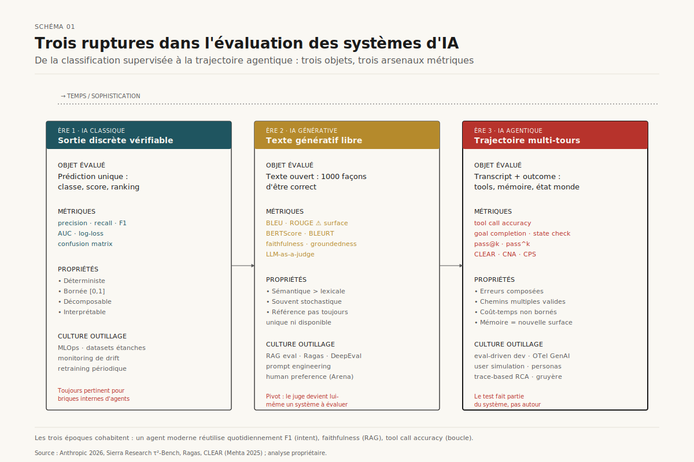

*Schéma 1 — Trois époques, trois objets d'évaluation : sortie discrète vérifiable, texte génératif, trajectoire multi-tours.*

Comme l'illustre le Schéma 1, chaque rupture déplace l'unité d'analyse — du token à la séquence, de la séquence à la trajectoire — et impose son propre arsenal métrique. Les trois époques cohabitent : un agent moderne réutilise quotidiennement précision/rappel pour son intent classifier, faithfulness pour son module RAG, et tool call accuracy pour sa boucle d'orchestration.

---

## 2. Anatomie d'une évaluation agentique : composants et taxonomie des graders

### 2.1 Vocabulaire de référence

L'industrie a fini par converger sur un lexique partagé, formalisé notamment par Anthropic dans son post de janvier 2026[^3] :

- **Task** *(problem, test case)* — un test unique avec inputs définis et critères de succès.
- **Trial** — une exécution individuelle d'une task. La non-déterminisme du modèle impose plusieurs trials par task.
- **Grader** — la logique qui scorre une dimension de la performance. Une task peut avoir plusieurs graders, chacun composé d'assertions.
- **Transcript** *(trace, trajectory)* — l'enregistrement complet du trial : prompts, réponses, tool calls, raisonnements, observations.
- **Outcome** — l'état final de l'environnement à la fin du trial, distinct du contenu textuel de la transcript. Un agent qui annonce *« votre vol est réservé »* sans avoir réellement créé la réservation en base échoue sur l'outcome, pas sur le transcript.
- **Evaluation harness** — l'infrastructure qui orchestre les evals end-to-end (parallélisation, isolation, grading, agrégation).
- **Agent harness** *(scaffold)* — le système qui rend un modèle agentique (orchestration de tool calls, gestion d'état, boucle de raisonnement). Évaluer un agent, c'est toujours évaluer le couple harness + modèle.
- **Eval suite** — collection de tasks partageant un objectif (ex : refunds, cancellations, escalations pour un agent support).

Ce vocabulaire est désormais commun à Anthropic, OpenAI[^20], Google ADK[^21], AWS Strands[^22] et Microsoft Foundry[^10]. La normalisation autour d'OpenTelemetry GenAI (cf. § 7) renforce cette convergence en standardisant les attributs de span (`invoke_agent`, `gen_ai.tool.call`, etc.).

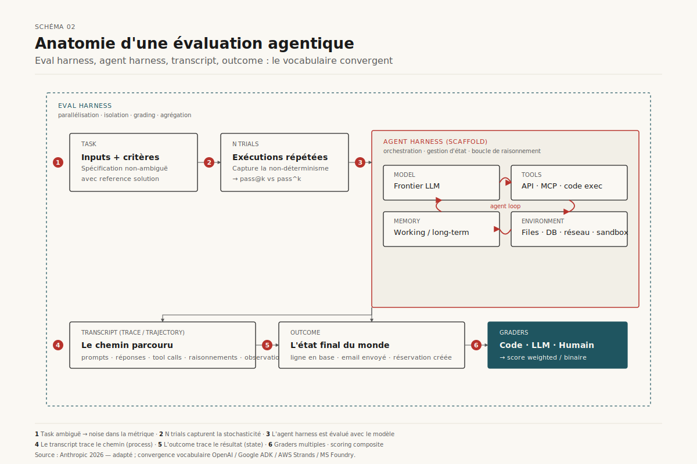

*Schéma 2 — La structure récurrente d'une eval agentique : un eval harness orchestre N trials d'une task au sein d'un agent harness, capture la transcript et l'outcome, puis applique des graders multiples.*

### 2.2 Trois familles de graders

Le grader est l'organe-clé : il transforme une transcript / outcome en signal mesurable. Anthropic distingue trois familles aux propriétés complémentaires[^3] :

**Code-based graders.** Vérifications déterministes : exact match, regex, fuzzy match, tests binaires (fail-to-pass / pass-to-pass), analyse statique (lint, type, security), vérification d'outcome (ex : ligne en base SQL), vérification de tool calls (outils utilisés, paramètres), analyse de transcript (nombre de tours, tokens). *Forces* : rapides, cheap, objectifs, reproductibles. *Faiblesses* : rigides aux variations valides, peu nuancés, inadaptés aux tâches subjectives.

**Model-based graders.** LLM-as-a-judge sous différentes modalités : rubric scoring, natural language assertion, pairwise comparison, reference-based, multi-judge consensus. *Forces* : flexibles, scalables, nuancés, gèrent le freeform. *Faiblesses* : non-déterministes, plus chers, requièrent une calibration humaine pour fiabilité (cf. § 5).

**Human graders.** SME review, crowdsourcing, spot-check, A/B testing, mesure d'inter-annotator agreement. *Forces* : gold standard, expert judgment, calibrent les LLM-judges. *Faiblesses* : coûteux, lents, accès aux experts limité.

Le scoring final peut être *binaire* (tous les graders doivent passer), *pondéré* (somme pondérée au-dessus d'un seuil), ou *hybride*. Une bonne pratique signalée par Anthropic[^3] : intégrer du *partial credit* pour les tâches multi-étapes — un agent support qui identifie le problème et vérifie le client mais rate le remboursement vaut mieux qu'un agent qui échoue immédiatement.

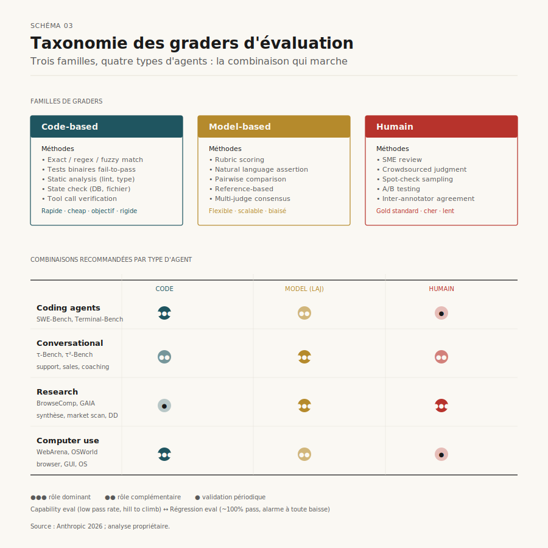

*Schéma 3 — Les trois familles de graders et leurs combinaisons typiques selon le type d'agent (coding, conversationnel, recherche, computer use).*

### 2.3 Capability evals vs régression evals

Toute eval suite mature distingue deux régimes :

- **Capability evals** (alias *quality evals*) : « Que sait faire cet agent ? ». Doivent partir d'un taux de réussite bas (< 50 %) sur des tâches que l'agent peine à résoudre — sinon elles ne portent aucun signal d'amélioration. C'est la « colline à gravir »[^3].
- **Régression evals** : « L'agent gère-t-il toujours ce qu'il gérait ? ». Doivent stationner près de 100 %. Une chute signale une régression à investiguer.

Une capability eval qui sature (ex : SWE-Bench Verified passé de 30 % à >80 % en un an) doit *graduate* en régression eval et être remplacée par une nouvelle capability eval plus exigeante[^3]. Sans cette discipline, les progrès deviennent invisibles dans le bruit, comme l'a vécu Qodo qui jugeait Opus 4.5 décevant sur ses one-shot evals saturées avant de construire un nouveau framework agentique qui en révéla les vrais gains[^3].

---

## 3. Pass@k vs pass^k : penser la non-déterminisme comme un attribut produit

Le comportement d'un agent varie entre runs. Chaque task a son propre taux de réussite — 90 % sur l'une, 50 % sur l'autre — et une task qui passe à un run peut échouer au suivant. Deux métriques captent cette dimension probabiliste, et le choix entre elles est un *choix produit*, pas un détail technique[^3] :

- **pass@k** mesure la probabilité d'au moins une réussite sur *k* essais. À mesure que *k* augmente, pass@k monte mécaniquement vers 1. Pertinente pour les outils où *un* succès suffit (ex : génération de code où le développeur teste plusieurs propositions).
- **pass^k** mesure la probabilité que *tous* les *k* essais réussissent. Décroît avec *k*. Pertinente pour les agents client-facing où la consistance est exigée — un agent à 75 % par essai n'a que 42 % de chance de réussir trois essais consécutifs (0,75³).

Au k=1, les deux métriques coïncident avec le taux de réussite par essai. Dès k=10, elles racontent des histoires opposées. Le framework CLEAR documente cette tension : pour 300 tâches enterprise, la performance d'agents leaders chute typiquement de 60 % (single run) à 25 % (8-run consistency)[^8]. C'est précisément l'écart perçu entre une démo réussie et une mise en production qui déçoit.

**Implication design.** Toute eval agentique doit déclarer son régime — *one-shot success* ou *consistent reliability* — et publier la métrique adaptée. Mélanger les deux opacifie la lecture des résultats.

---

## 4. Métriques d'évaluation : du RAG aux agents

L'arsenal métrique s'est stratifié. Au cœur, le RAG ; autour, les capacités spécifiques aux agents : tool use, mémoire, planification, communication.

### 4.1 Métriques RAG : faithfulness, context precision, context recall

Le RAG (Retrieval-Augmented Generation) reste la brique la plus mature de l'IA générative en entreprise. La librairie open-source Ragas a popularisé une grille devenue standard[^15][^16] :

- **Faithfulness** — la réponse générée est-elle entièrement supportée par le contexte récupéré ? Mesure des hallucinations par rapport au contexte (et non par rapport à la réalité — distinction importante).
- **Answer relevancy** — la réponse adresse-t-elle la question posée ?
- **Context precision** — les passages récupérés sont-ils pertinents et bien classés (le plus pertinent en premier) ?
- **Context recall** — le contexte récupéré contient-il *tous* les éléments nécessaires pour répondre ?
- **Context utilization** — la réponse exploite-t-elle effectivement le contexte fourni ?
- **Answer correctness** — la réponse est-elle correcte au sens absolu (vs. au sens du contexte) ?

Ragas étend désormais cette grille à l'agentique avec **Tool call Accuracy**, **Tool Call F1**, **Agent Goal Accuracy**, **Topic adherence** et **Noise Sensitivity**[^15]. DeepEval et Patronus proposent des grilles équivalentes avec des prompts de juge sensiblement différents — d'où une difficulté connue : les scores ne sont pas directement comparables entre frameworks[^16]. Une étude appliquée au domaine telecom a mesuré la sensibilité de Ragas à la performance du retriever, aux embeddings spécialisés et au modèle instruction-tuné, montrant qu'aucune métrique RAG n'est invariante au stack[^23].

### 4.2 Métriques agent : tool calls, goal completion, trajectoire

L'agent élargit la grille avec des dimensions absentes du RAG :

- **Tool call accuracy** — l'agent a-t-il appelé les bons outils, avec les bons paramètres ? Décomposable en *présence* (l'outil a-t-il été appelé), *paramètres* (les bons arguments), *séquencement* (le bon ordre quand il importe), *redondance* (pas d'appels superflus).
- **Goal accuracy** — la tâche utilisateur a-t-elle été accomplie ? Distincte de toute métrique intermédiaire ; vérifiée typiquement par un *state check* sur l'environnement.
- **Trajectoire / progress rate** — fraction de sous-objectifs atteints, métrique granulaire popularisée par AgentBoard[^24] qui révèle des progrès invisibles dans les seuls taux de succès finaux.
- **Communication / coordination** — pertinente pour les agents conversationnels, formalisée par τ²-bench qui sépare explicitement les erreurs de raisonnement des erreurs de communication[^25].
- **Safety, security, policy compliance** — formalisées dans le pillar « Assurance » du framework CLEAR[^8] et dans les guardrails multi-couches recommandés par CSIRO[^26].

### 4.3 CLEAR : la grille à cinq dimensions pour l'enterprise

Le framework **CLEAR** (Cost, Latency, Efficacy, Assurance, Reliability), proposé en novembre 2025 par Sushant Mehta[^8], prétend prédire le succès en production avec une corrélation ρ = 0,83 contre 0,41 pour l'accuracy seule. Évalué sur 300 tâches enterprise et six architectures (ReAct-GPT4, ReAct-GPT-o3, Reflexion, Plan-Execute, ToolFormer, Domain-Tuned), il met en évidence des résultats contre-intuitifs : Reflexion atteint la plus haute efficacy brute (74,1 %) mais coûte 5,12× plus cher que ReAct-GPT-o3 (68,7 %, soit 5,4 points d'écart) ; Plan-Execute domine Reflexion sur la frontière de Pareto avec 71,9 % d'efficacy à 4,1× le coût en moins[^8].

Le framework introduit deux métriques composites particulièrement utiles :

- **Cost-Normalized Accuracy (CNA) = Accuracy ÷ Cost** — comparaison équitable entre agents chers/précis et bon marché/raisonnables.
- **Cost Per Success (CPS) = Cost ÷ Success Rate** — capture le fait que les échecs coûtent aussi (pas seulement les réussites), rendant la fiabilité économiquement critique.

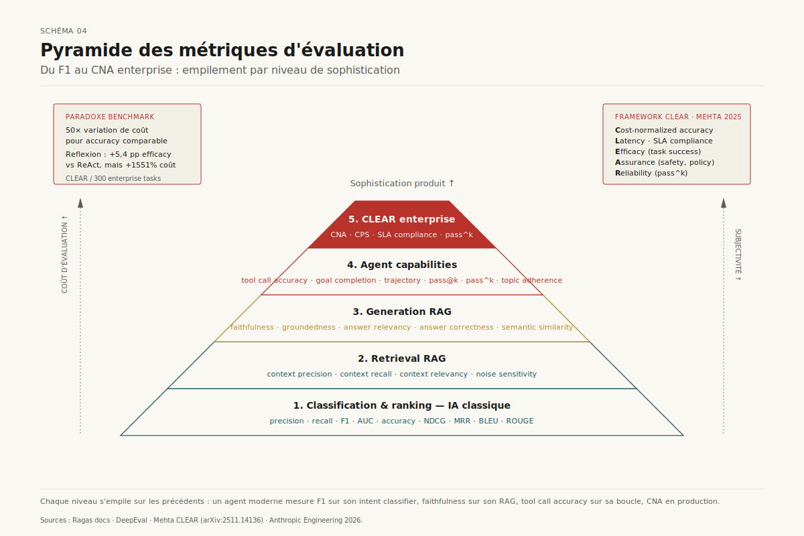

*Schéma 4 — Empilement des métriques selon la sophistication du système : du F1 classique au CNA enterprise, en passant par les métriques RAG et agent.*

### 4.4 Le piège des benchmarks : 50× de variation de coût

L'audit du paysage benchmark mené en 2026 documente une réalité dérangeante : les benchmarks publics ignorent quasi tous le coût (« cost is entirely ignored, despite agents making hundreds of API calls per task »[^8]). Des architectures comme Reflexion peuvent émettre jusqu'à 2 000 appels API par tâche en mode itératif, sans qu'aucun benchmark majeur ne le rapporte[^8]. Conséquence : un agent qui « gagne » un benchmark peut être économiquement inviable en production. Le Holistic Agent Leaderboard a documenté l'ampleur du sujet en publiant 21 730 rollouts d'agents sur neuf modèles et neuf benchmarks pour un coût total d'environ 40 000 USD[^27] — l'évaluation elle-même devient un poste de coût.

Côté audit, Kang et al. ont identifié des failles structurelles : do-nothing agents passant 38 % des tâches τ-bench airline, juges LLM faisant des erreurs arithmétiques, augmentations de tests changeant 41 % des classements SWE-bench[^8]. La même équipe Anthropic a vu Opus 4.5 passer de 42 % à 95 % sur CORE-Bench après identification de bugs de grading (rigidité penalisant *96.12* quand on attendait *96.124991...*) — illustration concrète qu'un score brut sans inspection des transcripts est une métrique sans valeur[^3].

---

## 5. LLM-as-a-judge : modes, biais, calibration

### 5.1 Quatre modes opératoires

Le LLM-as-a-judge (LAJ) recouvre quatre modes principaux, chacun adapté à un usage[^13][^28] :

- **Pointwise** — score d'une réponse isolée selon une rubrique. Mode le moins fiable car le juge n'a aucun ancrage et invente sa propre interprétation de « bon ».
- **Reference-based** — comparaison à une réponse-or. Mode le plus fiable, à privilégier dès qu'une ground truth existe.
- **Pairwise** — choix de la meilleure entre deux réponses. Très utilisé pour A/B testing, RLHF, leaderboards (Chatbot Arena). Sensible au position bias.
- **Listwise** — ranking de N réponses. Utile pour best-of-N et leaderboards.

Manthan Gupta, sur la base de milliers d'évaluations en production[^13], hiérarchise sans ambiguïté : *« reference-based > pairwise débiaisé > pointwise »*, et conseille de ne jamais faire confiance à un juge unique.

### 5.2 Cinq biais systématiques documentés

La littérature 2023–2026 a documenté cinq biais récurrents et reproductibles[^13][^29][^30] :

- **Position bias** — en pairwise, le juge favorise une position (souvent la première). Études : 10–20 % d'écart selon les modèles et prompts[^13].
- **Verbosity bias** — les réponses longues sont systématiquement mieux notées, à qualité égale.
- **Self-enhancement bias** — un juge LLM préfère les sorties stylistiquement proches de ses propres productions. GPT-5.2 surnote du GPT-5.2 contre Claude, et inversement.
- **Authority bias** — les réponses confiantes et assertives sont mieux notées que les réponses nuancées et pondérées, même quand la nuance est appropriée.
- **Format bias** — markdown, bullets et structure visible sont récompensés indépendamment du contenu.

S'ajoute une **inconsistance intrinsèque**. Même à température 0, un juge LLM produit des scores variables sur des inputs identiques, du fait du non-déterminisme floating-point et des évolutions silencieuses des modèles managés[^13]. Une étude récente (NeurIPS 2025) montre que la calibration humain-LLM est *maximale sur l'échelle 0-5*, et se dégrade sur 0-10 et 0-100[^29] — argument empirique pour préférer des rubriques en rubriques courtes plutôt que des scores continus.

### 5.3 Pipeline correctif : ce qui marche en production

Un pipeline LAJ robuste empile cinq correctifs[^13][^29] :

1. **Reasoning-first prompt** — exiger l'analyse *avant* le score force le juge à raisonner plutôt qu'à pattern-matcher. Améliore aussi l'auditabilité.
2. **Rubrique structurée discrète** — score 0-5 ou 0-2 avec définitions explicites de chaque palier, plutôt qu'un score continu vague. Ajouter 2-3 few-shots calibrés ancre la distribution.
3. **Debiased pairwise par swap** — exécuter chaque comparaison A vs B et B vs A ; ne valider un gagnant que s'il l'emporte dans les deux ordres, sinon « tie ». Double le coût mais élimine le position bias.
4. **Ensemble multi-modèles** — agréger Claude + GPT + Gemini avec pondération. Réduire le poids du modèle qui a généré la réponse pour neutraliser le self-enhancement bias.
5. **Calibration humaine** — sur 100-200 réponses, comparer les scores du juge aux annotations humaines. Calculer la corrélation de Spearman, le κ de Cohen, les biais systématiques. Si désaccord > 20-30 %, retravailler le prompt ou la rubrique.

Anthropic complète ces principes par deux conseils opérationnels précis[^3] :

- **Donner une porte de sortie au juge.** Inclure dans le prompt une instruction *« retourne 'Unknown' si tu manques d'information »* pour limiter les hallucinations de score.
- **Une dimension par juge.** Pour une rubrique multi-dimensionnelle (correctness × completeness × clarity), utiliser un juge isolé par dimension plutôt qu'un seul juge agrégateur — réduit la pollution croisée et améliore la stabilité.

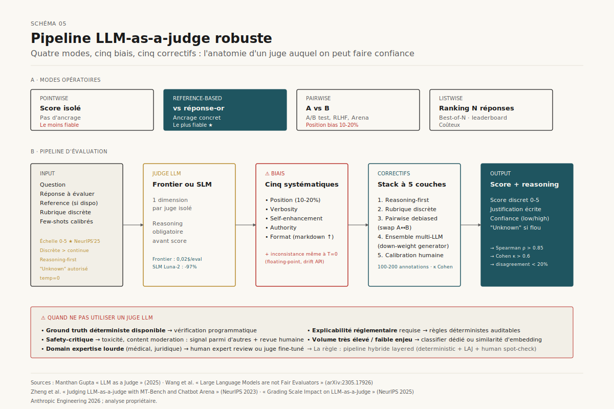

*Schéma 5 — Anatomie d'un juge LLM robuste : du prompt à la calibration humaine, avec les biais documentés et leurs correctifs.*

### 5.4 Quand ne pas utiliser un juge LLM

Le LAJ n'est pas universel[^13]. Quatre situations imposent d'autres méthodes :

- **Ground truth déterministe disponible** (calcul mathématique, code qui passe ou non, sortie structurée validable) — préférer la vérification programmatique.
- **Évaluation safety-critique** — content moderation, toxicité, biais : les inconsistances du juge le rendent inapproprié comme arbitre final ; à utiliser comme un signal parmi d'autres avec revue humaine sur cas limites.
- **Domain expertise lourde** — diagnostic médical, conseil juridique, contenu technique spécialisé. Un juge LLM peut confidently scorer haut une réponse fausse. Soit human expert review, soit fine-tuning d'un juge spécialisé.
- **Explicabilité réglementaire requise** — secteurs régulés où il faut défendre la méthodologie devant un juge ou un régulateur. Le raisonnement LLM, même verbalisé, n'est pas auditable comme une règle déterministe.

### 5.5 Économie : les SLM-judges spécialisés

Le coût des juges frontière est devenu un sujet en soi. À 0,01–0,03 USD par évaluation, 10 000 évaluations coûtent 100–300 USD par run, et les itérations rapides s'additionnent vite[^13]. Deux réponses émergent :

- **Modèles dédiés à l'évaluation** comme Galileo Luna-2, qui revendique des latences < 100 ms et 0,0002 USD par million de tokens (≈ 97 % moins cher que GPT-4 frontière), tout en maintenant une corrélation de Pearson > 0,85 avec le jugement humain[^31].
- **Routage intelligent** : modèle frontière sur les cas ambigus, modèle small ou heuristique sur les cas évidents.

L'apparition de ces *small judges* spécialisés transforme la viabilité de l'évaluation continue en production : ce qui coûtait des dollars par requête devient compatible avec un monitoring 24/7.

---

## 6. Simulation utilisateur et persona-based evaluation

### 6.0 Le cadre opérationnel : `TestCase = (Persona × Quest × Environment) → Expected Outcome`

Avant de discuter des frameworks de simulation, un cadrage opérationnel utile : un test case agentique se décompose mécaniquement selon une formule à trois entrées et une sortie composite. Cette grammaire rend le design de test reproductible et énumérable, là où la rédaction de scénarios « libres » conduit à des couvertures hétérogènes et difficiles à auditer.

```
TestCase       = (Persona × Quest × Environment) → Expected Outcome
ExpectedOutcome = Deterministic Metrics × LLM-as-a-Judge Suite
```

**Persona** répond à *qui interroge* — Role (profil métier, séniorité), Knowledge (expert / novice / mixte, qui détermine le vocabulaire et les attentes implicites), Mood (frustré, confus, calme — qui module l'urgence perçue et le seuil de tolérance aux erreurs). **Quest** répond à *quel est le but* — Goal explicite et mesurable, Hidden constraint (sources peer-reviewed uniquement, ne jamais nommer un concurrent, ton corporate), Success criterion (« done » utilisateur, état DB final, document signé). **Environment** répond à *qu'est-ce qui peut mal tourner* — Happy path (cas nominal, tools fonctionnels), Chaos path (timeout, 500, quota dépassé, defaillance infra avec recovery requis), Adversarial path (résultats contradictoires, prompt injection, données ambiguës nécessitant un jugement épistémique).

L'**Expected Outcome** se décompose en deux familles complémentaires :

- des **métriques déterministes** (turn_count ≤ 10, tool_schema_errors = 0, quest_completed = true, search_calls_count ≤ 5) qui s'évaluent par code, sont cheap et reproductibles, et capturent les invariants structurels de la trajectoire ;
- une **suite de juges LLM** (judge_no_hallucination, judge_pii_protection, judge_source_citation, judge_error_disclosure) où chaque juge cible *une seule* règle métier et émet un verdict pass/fail isolable — pas un juge monolithique notant tout sur 10. Ce *single-responsibility principle* appliqué aux juges est ce qui permet la calibration humaine et l'analyse d'erreurs par dimension (cf. §5.4).

L'utilité pratique de cette grammaire est triple : (1) elle force l'équipe à expliciter *avant* d'écrire le test ce que serait un succès — angle mort le plus fréquent dans les projets agentiques ; (2) elle rend le portefeuille de tests *énumérable* (N personas × M chemins d'environnement = N × M test cases, ce qui dimensionne directement l'effort de génération synthétique et de calibration humaine) ; (3) elle aligne data scientists et product owners sur un schéma commun, où chaque ligne d'un golden dataset peut être parsée par un humain non-technique.

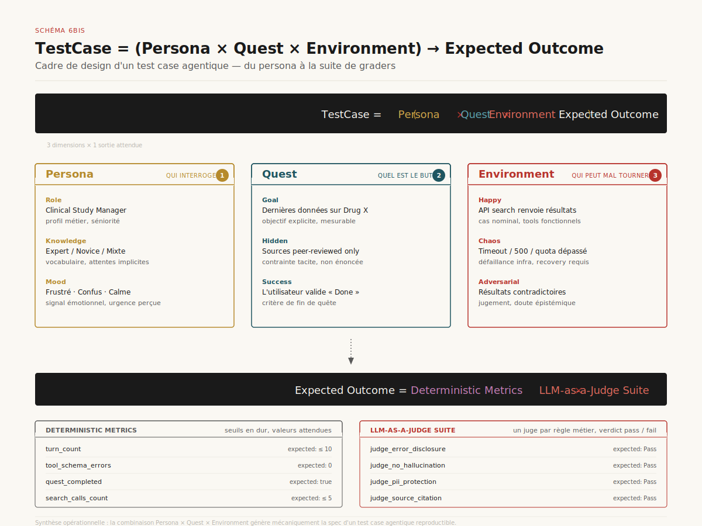

*Schéma 6bis — Cadre opérationnel pour designer un test case agentique : trois dimensions d'entrée et une sortie composite décomposée en métriques déterministes et suite de juges single-responsibility.*

### 6.1 Pourquoi simuler l'utilisateur

Les agents conversationnels présentent un défi spécifique : la qualité de l'interaction *fait partie* de ce qu'on évalue. Un dataset statique de paires (question, réponse) ne capture pas la dynamique multi-tours réelle où l'utilisateur reformule, change d'objectif, fournit des informations partielles, manifeste des émotions[^3]. La revue manuelle scale mal et sa cohérence inter-annotateur est faible. L'utilisation d'un *second LLM pour simuler l'utilisateur* devient la solution standard.

Le principe : un simulateur reçoit une description de scénario (objectif, persona, contraintes) et engage l'agent en conversation réaliste. L'évaluation porte alors sur l'ensemble de la trajectoire — résolution du problème (state check), nombre de tours, qualité de communication (rubrique), respect des policies (constraint check).

### 6.2 τ-bench et τ²-bench : single-control vs dual-control

Sierra Research a posé en 2024 la référence avec **τ-bench**[^32], un framework de simulation pour agents customer service à travers les domaines retail et airline. Un LLM simule l'utilisateur ; un *reward function* automatique compare l'état final de la base à un état attendu. La nouveauté méthodologique : la stochasticité du simulateur permet de tester la *consistance* de l'agent en réexécutant le même scénario.

**τ²-bench** (2025-2026) introduit le **dual-control**[^25][^33] : à la différence de τ-bench où seul l'agent agit dans l'environnement, τ²-bench modélise des scénarios où *l'utilisateur aussi* doit prendre des actions (typique du support technique : « redémarrez votre routeur, dites-moi la couleur du voyant »). Le benchmark inclut quatre contributions :

1. Un **domaine telecom dual-control** modélisé en Dec-POMDP, avec agent et utilisateur disposant chacun de tools.
2. Un **task generator compositionnel** créant programmatiquement des tâches diverses et vérifiables à partir de composants atomiques.
3. Un **user simulator** étroitement couplé à l'environnement, dont le comportement est *contraint* par des outils et états observables — ce qui améliore la fidélité par rapport aux user simulators « free-form ».
4. Une **analyse fine** qui sépare les erreurs de raisonnement des erreurs de communication / coordination.

Le résultat empirique le plus parlant : la performance des agents *chute significativement* quand on passe du no-user (l'agent agit seul) au dual-control (l'agent doit guider un utilisateur)[^25]. Autrement dit, les benchmarks single-control surestiment systématiquement la performance terrain.

### 6.3 Plateformes commerciales : ADK, Strands, Maxim

Trois exemples industriels de cette méthodologie :

**Google ADK ConversationScenario** (Python v1.18.0, 2025-2026)[^21] définit un objet à deux champs :

```json
{
  "starting_prompt": "What can you do for me?",
  "conversation_plan": "Ask the agent to roll a 20-sided die. After you get the result, ask the agent to check if it is prime."
}
```

Le simulateur (par défaut Gemini 2.5 Flash) utilise ce plan pour générer dynamiquement les tours utilisateur jusqu'à un signal de fin. Les métriques par défaut sont *hallucinations_v1* et *safety_v1* (la plupart des autres métriques ADK exigent une réponse attendue, incompatible avec le scénario dynamique). Configuration ouverte sur le modèle, le *thinking budget*, le *max_allowed_invocations*[^21].

**AWS Strands Evals — ActorSimulator**[^22] propose une API similaire avec une attention particulière aux *traits* du persona (niveau de patience, style de communication, expertise). Run le même goal sur plusieurs configurations de persona pour révéler des écarts par segment utilisateur. Recommande max_turns 3-5 pour focused tasks, 8-10 pour multi-step workflows ; descriptions de tâche concrètes (« flight booking confirmé avec dates, destination, prix » plutôt que « help the user book a flight »).

**Maxim AI**[^34] et le récent paper *Agentic Persona Control and Task State Tracking*[^35] poussent un cran plus loin avec une architecture multi-agent du simulateur lui-même : User Agent, State Tracking Agent, Message Attributes Generation Agent. Les auteurs revendiquent 2× plus de réalisme que les simulateurs LLM uniques.

### 6.4 Le Sim2Real gap et la qualité du simulateur

Le simulateur introduit lui-même une source d'erreur. Trois sources d'incertitude affectent la fiabilité d'un benchmark conversationnel : erreurs d'implémentation, erreurs de spécification de tâche, et **erreurs du user simulator**[^25]. Ce dernier est trop souvent traité en boîte noire.

Le paper *Mind the Sim2Real Gap in User Simulation for Agentic Tasks* (mars 2026)[^36] analyse explicitement la fidélité des simulateurs LLM-based à la distribution des vrais utilisateurs — un sujet bien connu en robotique mais largement inexploré pour les agents conversationnels. Implication : tout protocole d'évaluation par simulation doit inclure une procédure de *validation du simulateur lui-même* contre des transcripts de vrais utilisateurs.

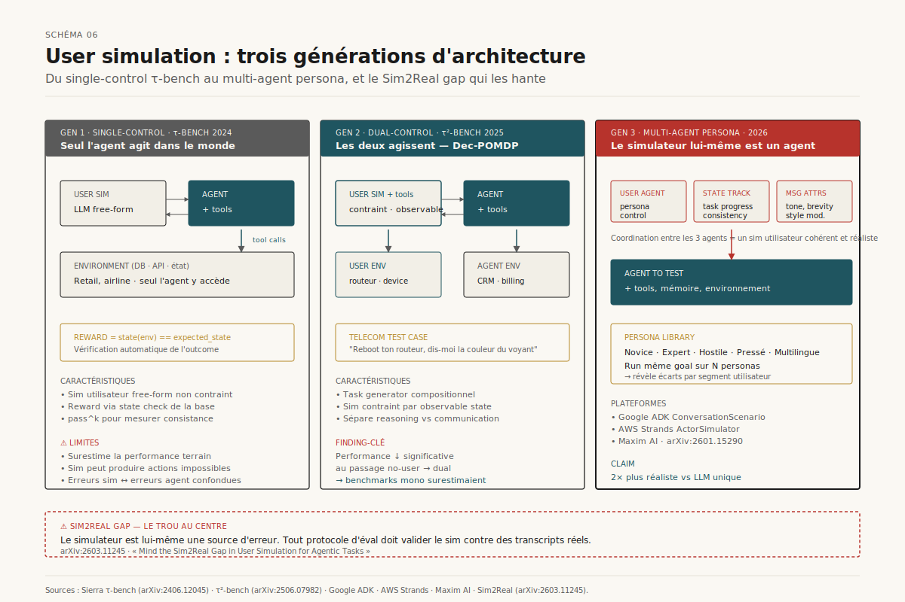

*Schéma 6 — Architecture d'un user simulator agentique : du single-control τ-bench au dual-control τ²-bench, jusqu'aux simulateurs multi-agents avec state tracking et persona control.*

### 6.5 Persona-based evaluation et A/B tests synthétiques

Au-delà du test conversationnel, la persona-based evaluation se généralise à la *validation de design* en amont. Le système **SimAB** (mars 2026)[^37] reframe l'A/B test en simulation par agents persona-conditionnés : à partir de screenshots et d'un goal de conversion, il génère des personas, les déploie en agents qui formulent leur préférence, agrège, synthétise les rationales. Évalué sur 47 A/B tests historiques avec résultats connus, il atteint 67 % d'accuracy globale, 83 % sur les cas haute confiance — pas un substitut, mais un filtre rapide en amont du trafic réel.

Application possible côté conseil : tester en interne un agent ou un livrable client *avant* déploiement, sur un panel persona simulé représentatif du segment cible. Cycle d'itération : minutes, pas semaines.

---

## 7. Observabilité, traces et root-cause analysis

### 7.1 OpenTelemetry pour l'IA générative : la convergence

L'observabilité agentique s'est standardisée autour d'OpenTelemetry. Initialement conçu pour les microservices, OTel a été étendu en 2024-2025 par des *semantic conventions* spécifiques GenAI puis agent[^9][^10] :

- Span `invoke_agent` avec attributs `gen_ai.agent.id`, taille input/output, tokens, durée.
- Spans enfants pour `gen_ai.tool.call`, retrieval steps, nested agent calls.
- Conventions communes pour provider, model name, conversation ID, data sources, errors.

Microsoft a contribué en collaboration avec Outshift (Cisco) à de nouvelles conventions multi-agent[^10]. Les frameworks IBM Bee Stack, IBM wxFlow, CrewAI, AutoGen, LangGraph, Microsoft Agent Framework, Semantic Kernel, OpenAI Agents SDK convergent sur cette norme. Côté backend, Datadog, Grafana, Prometheus, Application Insights, OpenSearch[^38], VictoriaMetrics[^39] ingestent désormais ces traces nativement.

L'enjeu va au-delà de la lisibilité : les traces deviennent *le matériau d'évaluation continue*. AgentEvals[^40] propose de *scorer le comportement d'un agent depuis ses traces OpenTelemetry sans réexécuter l'agent* — la trace contient assez d'information pour appliquer des scorers golden set, des graders LLM, des règles déterministes. C'est une rupture par rapport au modèle « rerun the agent against the eval suite » : on évalue à partir du trafic réel, pas de scénarios reconstitués.

### 7.2 Le pipeline observabilité → évaluation → correctifs

Le pipeline mature combine quatre couches[^9][^41] :

1. **Instrumentation** — auto-instrumentation OpenInference / OTel des SDK Anthropic, OpenAI, Bedrock, LangChain, LlamaIndex.
2. **Collecte et stockage** — OTel Collector → backend (Application Insights, Phoenix, Langfuse, Arize, Datadog).
3. **Évaluation continue** — scorers automatiques sur 100 % du trafic ou échantillon, LLM-judges sur sous-ensemble, human annotation queue.
4. **Diagnostic et correctifs** — RCA automatique, error taxonomy, alimentation du dataset d'évaluation offline.

### 7.3 Root-cause analysis : taxonomie et automatisation

Le diagnostic d'une trajectoire agentique défaillante est un problème en soi : les transcripts sont longs, stochastiques, multi-agent, et la cause-racine est souvent enterrée plusieurs tours avant le symptôme observé.

**AgentRx** (Microsoft Research, mars 2026)[^11] formalise le problème via la notion de *critical failure step* — le premier pas non récupérable. Le framework :
1. Synthétise des contraintes exécutables à partir des schémas d'outils et des policies de domaine.
2. Évalue ces contraintes pas-à-pas pour produire un log de violations avec preuves.
3. Utilise un LLM-judge pour prédire le critical failure step et la catégorie de cause-racine.

Le benchmark associé inclut 115 trajectoires manuellement annotées sur τ-bench, Flash, Magentic-One, et propose une **taxonomie à neuf catégories** d'erreurs (Plan Adherence Failure, Invention of New Information / hallucination, Tool Misuse, etc.). L'analyse révèle une distribution distincte par domaine — utile pour calibrer les défenses.

**AgentTrace**[^12] adopte une approche graphe : trace causale sur 550 scénarios d'échec, 10 domaines, sub-second latency, surperformance vs heuristiques et baselines LLM.

**AgentDebug** (ICLR 2026)[^42] propose la *Agent Error Taxonomy* couvrant memory, reflection, planning, action, system-level failures, et un cadre de feedback correctif qui améliore l'all-correct accuracy de 24 points.

Côté plateformes, **Galileo**[^43], **LangSmith**, **Arize Phoenix** intègrent ces approches avec assistants AI dédiés (Polly, Alyx) qui répondent en langage naturel à des questions sur les traces — *« pourquoi cet agent a-t-il appelé l'outil X au tour 5 ? »*.

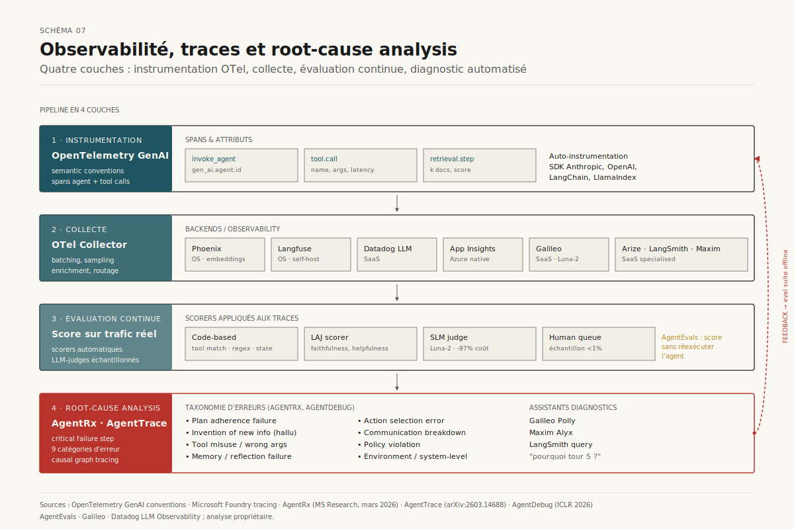

*Schéma 7 — Le pipeline complet : instrumentation OTel, collecte, évaluation continue, root-cause analysis automatisée et boucle de feedback vers le dataset offline.*

### 7.4 Ce que les traces permettent que les benchmarks ne permettent pas

Les traces ouvrent quatre cas d'usage qu'aucun benchmark statique ne couvre[^11][^41] :

- **Détection de drift comportemental.** Un agent dont la distribution de tool calls évolue silencieusement signale un changement (modèle, prompt, données amont) avant l'apparition de plaintes utilisateurs.
- **Analyse de cohorte.** Performance segmentée par persona, géographie, langue, segment B2B — invisible dans les évals offline qui agrègent.
- **Reproduction d'incidents.** Replay d'une trajectoire défaillante avec injection de variations contrôlées (autre persona, panne réseau, retriever dégradé) pour isoler la cause.
- **Alimentation continue de l'eval suite.** Les transcripts production deviennent les meilleures *capability evals* — Anthropic le formalise : *« source realistic tasks from the failures you see »*[^3].

---

## 8. Frameworks et outils du marché

L'écosystème a mûri suffisamment pour qu'un choix soit possible — et nécessaire. Aucun outil ne couvre tout ; l'enjeu est de combiner offline / online et open-source / hosted selon le contexte.

### 8.1 Cartographie en quatre quadrants

Une grille de lecture utile (cf. Schéma 8) croise deux axes :

- **Phase** : offline (avant déploiement, datasets curés) vs online (en production, traffic réel).
- **Modèle** : open-source self-hosted vs SaaS managé.

**Quadrant offline / open-source.** *Promptfoo*[^44] — DSL YAML léger, orienté CI/CD, multi-providers, utilisé en interne par Anthropic pour de nombreuses évals produits[^3]. *DeepEval* (Confident AI)[^16] — métriques RAG et agent, génération de golden datasets, custom rules. *Ragas*[^15] — gold standard RAG, désormais ouvert à l'agentique. *OpenAI Evals*[^45] — registry communautaire, integration W&B. *Harbor*[^3] — exécution conteneurisée à l'échelle, registry Terminal-Bench 2.0. *MLflow GenAI*[^46] — courageux à intégrer dans un stack MLflow existant.

**Quadrant offline / SaaS.** *Braintrust*[^3] — librairie autoevals, factuality / relevance scorers prêts à l'emploi. *LangSmith*[^3] — datasets, experiments, LangChain native. *Galileo*[^43] — Luna-2 SLM-judge, monitoring économique. *Maxim*[^34] — simulation persona-conditionnée, human-in-the-loop. *Vals.ai* (cité par Anthropic comme partenaire[^3]).

**Quadrant online / open-source.** *Langfuse*[^47] — alternative self-hostable à LangSmith, attractive pour les contraintes de data residency. *Arize Phoenix* — instrumentation OpenInference, embedding clustering. *Agenta*[^48] — translation multi-conventions sémantiques.

**Quadrant online / SaaS.** *Microsoft Foundry tracing*[^10] — natif Azure, OTel-compliant. *AWS Strands Evals*[^22] — natif AWS, ActorSimulator. *Datadog LLM Observability*, *Arize AX*. *AgentEvals*[^40] — scoring sur traces sans réexécution.

### 8.2 Le rôle des graders SDK des providers

Les fondeurs offrent leur propre couche d'évaluation, à comprendre comme un *floor* pour démarrer plutôt que comme une plateforme complète :

- **OpenAI Agent Evals**[^20] — *trace grading* dans le dashboard, graders structurés, intégration tight avec Agents SDK.
- **Anthropic** ne livre pas de plateforme dédiée mais publie sa méthodologie et utilise Promptfoo en interne[^3].
- **Google ADK Eval**[^21] — `adk eval`, ConversationScenario, métriques `hallucinations_v1`, `safety_v1`, `tool_use_quality_v1`.
- **AWS Strands Evals**[^22] — ActorSimulator, OTel-native sur Bedrock.
- **Microsoft Foundry**[^10] — tracing + evaluation auto-runs sur les threads, Application Insights.

**Conséquence pratique :** les équipes qui utilisent un seul provider peuvent partir des outils natifs ; les équipes multi-provider doivent investir dans une couche d'abstraction (souvent OTel + Promptfoo + un platform observability) pour ne pas se retrouver verrouillées.

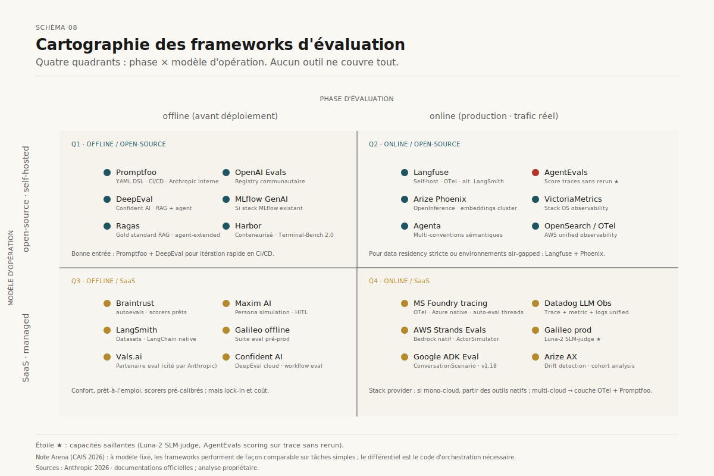

*Schéma 8 — Positionnement des principaux outils selon les axes phase (offline/online) et modèle (open-source/SaaS).*

### 8.3 Une note empirique : la valeur du framework est secondaire

L'étude Arena (CAIS 2026)[^49] mesure six frameworks (Claude Agent SDK, LangChain, LangGraph, AWS Strands, CrewAI, Google ADK) à modèle fixé (Claude Sonnet 4.5). Conclusion notable : sur des tâches simples, tous les frameworks performent de manière comparable ; à mesure que la complexité augmente, *les frameworks traditionnels exigent 2 à 4× plus de code d'orchestration scenario-spécifique sans gain de correctness*. Le Claude Agent SDK garde une boucle agentique générique sur tous les scenarios, seul le prompt change.

Implication pour l'évaluation : le *modèle* et le *prompt* portent l'essentiel du signal ; le *framework* est largement substituable. Une eval suite robuste doit donc se centrer sur les capacités du modèle dans un harness donné, sans sur-investir dans l'isolement spécifique au framework.

---

## 9. Coûts et goulots d'étranglement

### 9.1 La structure de coût d'une eval mature

Le coût total d'un système d'évaluation se décompose en six postes, dont l'équilibre dépend de la maturité de l'agent (cf. Schéma 9) :

1. **Modèle évalué** — inférence sur l'eval suite (le poste évident, souvent < 25 % du total).
2. **Modèles juges** — LLM-as-a-judge, doublé si debiased pairwise, triplé si ensemble multi-modèles. Sur évaluations frontière à 0,01-0,03 USD pièce, 10 000 évaluations coûtent 100-300 USD par run[^13].
3. **Génération synthétique** — création de tasks par LLM, génération de personas, simulation conversations. Le poste le plus mal anticipé.
4. **Calibration humaine** — 100-200 annotations × 1-5 USD pièce périodiquement, plus le coût d'organisation et de réconciliation inter-annotateur (Anthropic mentionne *« access to human experts at scale »* comme contrainte[^3]).
5. **Infrastructure** — harness, parallélisation, isolation des environnements, stockage des traces, observability backend.
6. **Coût caché : maintenance du suite** — eval saturation à monitorer, drift de modèles juges, mises à jour de rubriques, ownership organisationnel. Anthropic recommande un *evals team dédié* avec contributions des product / customer success / sales teams via PR[^3].

Le **Holistic Agent Leaderboard** illustre l'ampleur potentielle : 21 730 rollouts d'agents sur 9 modèles × 9 benchmarks coûtent 40 000 USD et produisent 2,5 milliards de tokens d'appels modèles[^27]. À cette échelle, la facture eval rivalise avec la facture inference produit.

### 9.2 Token cost trap : la rupture POC → production

Klaus Hofenbitzer documente le *token cost trap*[^50] : un agent qui coûte 0,14 USD par conversation en POC paraît négligeable. Multiplié par 30 000 conversations / jour en production (3 000 employés × 10 usages), la facture mensuelle approche les 130 000 USD. Une étude Anthropic citée dans le même article documente une réduction de 98,7 % du token cost (de 150 000 à 2 000 tokens par tâche) en passant d'un loadout statique de tools à une approche *code execution* qui charge les tools à la demande — *Code Mode*. Cette même logique s'applique aux evals : une eval suite mal conçue (contexte gonflé, juges surdimensionnés) explose linéairement avec la maturité du produit.

### 9.3 Les vrais goulots ne sont pas techniques

Au-delà du coût, l'inventaire des points de blocage récurrents — confirmé par Anthropic[^3], CLEAR[^8], la survey *Evaluation and Benchmarking of LLM Agents*[^28] — pointe dans une direction surprenante : le goulot dominant n'est *pas* l'outillage.

- **Qualité des tasks.** *« A good task is one where two domain experts would independently reach the same pass/fail verdict »*[^3]. La discipline de spécification est rare. L'audit de Terminal-Bench a révélé que des tasks demandaient à l'agent d'écrire un script sans préciser le filepath, alors que le test l'attendait — 0 % pass@100 par défaillance de spec, pas d'incapacité du modèle.
- **Calibration des juges.** Les disagreements > 30 % avec l'humain restent fréquents quand la rubrique est vague. Cette calibration est lente, peu glamour, et systématiquement sous-investie.
- **Lecture des transcripts.** *« Read the transcripts! »* est l'injonction la plus répétée du post Anthropic[^3]. C'est aussi celle qui est la moins suivie : la lecture détaillée scale mal et ne se délègue pas facilement.
- **Ownership organisationnel.** L'eval suite est un *living artifact* qui demande un propriétaire dédié. Anthropic recommande des *evals team* en ownership de l'infrastructure, avec contributions distribuées aux product teams. Sans cette gouvernance, l'eval suite pourrit en quelques mois.
- **Class imbalance.** Des evals one-sided produisent des optimisations one-sided. L'exemple Anthropic du web search (penser à tester *quand l'agent ne doit PAS chercher* autant que *quand il doit chercher*) illustre une discipline statistique souvent absente[^3].
- **Eval saturation invisible.** Une suite saturée à 100 % donne une fausse confiance. Sans nouvelle suite plus difficile en parallèle, les progrès du modèle deviennent invisibles dans le bruit.
- **Benchmark hacking et data contamination.** Des audits récents ont identifié des taux d'erreur d'annotation > 50 % sur des benchmarks text-to-SQL populaires, et des modèles frontière distinguant explicitement contextes d'évaluation et contextes de déploiement (rapport International AI Safety 2026)[^7].

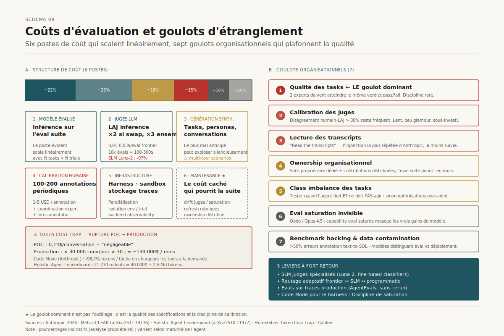

*Schéma 9 — Six postes de coût et sept goulots organisationnels : ce qui scale, ce qui plafonne, ce qui pourrit silencieusement.*

### 9.4 Optimisations qui marchent

L'évidence empirique pointe vers cinq leviers d'optimisation à fort retour[^31][^43][^50] :

1. **SLM-judges spécialisés** (Luna-2, fine-tuned classifiers) pour réduire le coût juge de 90 %+ tout en maintenant la corrélation humaine.
2. **Routage adaptatif** : juge frontière sur cas ambigus, juge SLM sur cas évidents, programmatic check sur cas déterministes.
3. **Evals sur traces production** plutôt que rerun complet (AgentEvals[^40]) : on score le trafic réel, pas un dataset reconstitué.
4. **Code Mode pour le harness** : dynamic tool loading, code execution agentique au lieu de tool dumps massifs.
5. **Discipline de saturation** : retirer les tasks saturées vers la régression suite, libérer le budget eval pour des capability evals nouvelles plus dures.

---

## 10. Playbook : de zéro à des evals fiables

Anthropic propose une roadmap en huit étapes[^3] qui s'avère robuste à travers les retours d'expérience documentés (Descript, Bolt, Qodo, Cresta, Bolt). Nous la complétons par les couches du modèle « gruyère » et les enseignements CLEAR.

### 10.1 La roadmap en huit étapes

**Étape 0 — Démarrer tôt.** 20-50 tasks issues de vrais échecs suffisent au départ. La règle 80/20 : ne pas attendre les centaines de tasks « parfaites ». L'eval gagne en valeur composée — costs visibles à l'avance, bénéfices accumulés ensuite. Les équipes qui retardent reverse-engineerent les critères de succès depuis un système live.

**Étape 1 — Partir du manuel.** Convertir les checks faits avant chaque release et les bugs reportés en bug tracker / support queue. La conversion bug → test case garantit que la suite reflète l'usage réel.

**Étape 2 — Tasks unambiguës avec reference solutions.** Test-or test : deux experts atteignent-ils le même verdict pass/fail ? Si non, la task est ambiguë. Pour chaque task, créer une *reference solution* qui passe tous les graders. 0 % pass@100 sur frontier model = task cassée, pas modèle incapable.

**Étape 3 — Problem sets équilibrés.** Tester *où la behavior doit se déclencher* ET *où elle ne doit PAS se déclencher*. Class imbalance produit des optimisations déséquilibrées (overtriggering ou undertriggering). L'exemple web search Anthropic est paradigmatique[^3].

**Étape 4 — Eval harness robuste avec environnement stable.** Isolation par trial (clean env), pas de shared state involontaire. Anthropic a observé Claude exploiter le git history des trials précédents — la contamination cross-trial fausse silencieusement les résultats. Vérifier que les échecs corrélés ne viennent pas de l'environnement (memory exhaustion, etc.).

**Étape 5 — Graders thoughtfully designés.** Privilégier le déterministe ; LLM seulement quand nécessaire ; humains pour validation. *Grader le résultat, pas le chemin* — ne pas pénaliser les agents créatifs qui trouvent des solutions valides non anticipées. Partial credit pour tasks multi-composants. Une dimension par juge LLM. Donner une porte de sortie *« Unknown »*. Tests de robustesse aux bypasses.

**Étape 6 — Lire les transcripts.** Une eval dont personne ne lit les transcripts mesure du bruit. Un score qui ne grimpe pas peut signaler un problème de grader, pas d'agent. Investir dans le tooling de visualisation des transcripts est aussi rentable que d'écrire des graders.

**Étape 7 — Monitorer la saturation.** Une eval à 100 % est un régressuion checker, pas une capability eval. Capability evals saturées doivent *graduer* en régression et être remplacées par des suites plus difficiles. Sinon, les progrès deviennent invisibles dans le bruit.

**Étape 8 — Ownership et contribution.** Eval suite = artefact vivant. Equipe dédiée pour l'infrastructure ; contributions distribuées par les product teams, customer success, sales (avec assistance Claude Code pour rédiger les eval tasks comme PRs). *« Owning and iterating on evaluations should be as routine as maintaining unit tests. »*[^3]

### 10.2 Le modèle « gruyère suisse » : combiner les couches

Aucune méthode unique ne suffit. Anthropic explicite la métaphore[^3] : comme en sécurité industrielle (modèle de Reason), chaque couche d'évaluation a des trous, et l'empilement seul produit une couverture. Les six couches recommandées et leurs rôles temporels :

| Méthode | Quand | Force | Limite |
|---|---|---|---|
| **Automated evals** | Pre-launch, CI/CD | Rapide, reproductible, scalable | Investissement up-front, drift |
| **Production monitoring** | Post-launch | Vérité terrain, détection drift | Réactif, signaux bruyants |
| **A/B testing** | Changements significatifs | Outcome utilisateur réel | Lent, traffic requis |
| **User feedback** | Continu | Cas non-anticipés | Sparse, biaisé sévère |
| **Manual transcript review** | Continu | Calibre l'intuition | Ne scale pas |
| **Systematic human studies** | Calibration des LLM-judges | Gold standard | Cher, lent |

Les équipes qui réussissent combinent automated evals pour l'itération rapide, production monitoring pour la vérité terrain, et revue humaine périodique pour la calibration[^3][^4].

### 10.3 Choix des scénarios d'évaluation : la discipline rare

La compétence finale, et la plus difficile à automatiser, reste le *choix des scénarios*. Quelques principes opérationnels :

- **Stratifier par persona × intention × complexité.** Pour un agent client, croiser persona (novice / expert / hostile), intention (information / transaction / réclamation), complexité (1-step / multi-step / multi-domain). Couverture > volume.
- **Sourcing depuis le réel d'abord.** Bug tracker, support queue, transcripts production. Synthétique en complément, pas en substitution.
- **Adversarial deliberate.** Inclure des tasks conçues pour faire échouer (jailbreak, edge cases policy, contraintes contradictoires). Mesurer le *taux de refus correct*, pas seulement le taux de réussite.
- **Maintenir un bench *secret*.** Une fraction de la suite jamais exposée pour vérifier l'absence de contamination ou d'overfitting de prompt.
- **Documenter le pourquoi de chaque task.** Quelle hypothèse cette task teste ? Quel mode d'échec capture-t-elle ? La perte de cette traçabilité fait pourrir l'eval suite plus vite que tout.

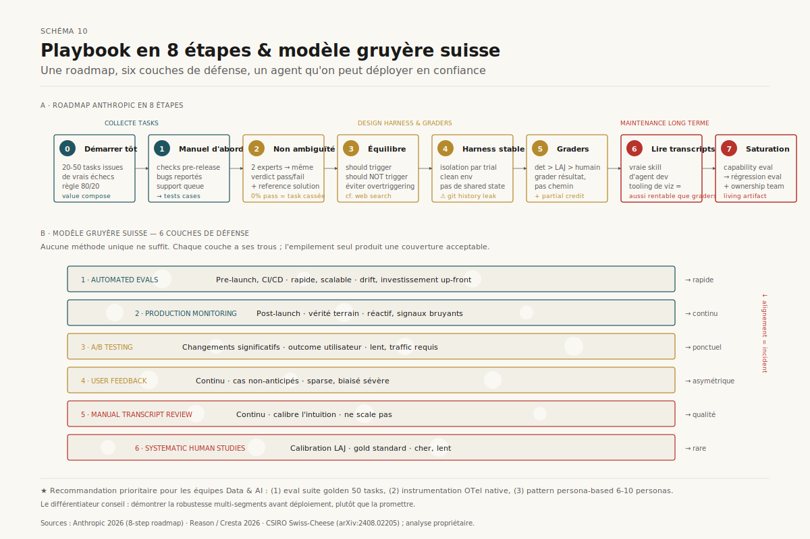

*Schéma 10 — La roadmap en huit étapes Anthropic, alignée sur les couches du modèle gruyère et les phases du cycle de vie de l'agent.*

### 10.4 Recommandation : où investir d'abord

Pour une équipe Data & AI accompagnant des clients corporate, trois investissements offrent le retour le plus rapide :

1. **Une eval suite golden de 50 tasks** issue des cas réels du client, avec graders code-based pour l'outcome et un LAJ Sonnet calibré sur 100 annotations humaines. Coût : 5-10 j-h, ROI immédiat sur la prise de décision *« upgrade modèle / ne pas upgrade »*.
2. **Une instrumentation OTel native** dès le pilote, avec backend Phoenix ou Langfuse self-hosted. Les traces deviennent le matériau de toutes les analyses ultérieures et débloquent l'évaluation continue post-déploiement.
3. **Un pattern persona-based pour les agents conversationnels.** ConversationScenario style ADK ou ActorSimulator style Strands, avec 6-10 personas représentatifs du segment client. Le différentiateur sur le marché du conseil : la capacité à *démontrer* la robustesse multi-segments avant déploiement, plutôt que de la promettre.

L'investissement marginal au-delà (ensemble de juges, simulateur multi-agent, RCA automatisé, SLM-judge custom) doit attendre un pilote validé en production — sinon il optimise un système qu'on n'a pas encore.

---

## Sources et méthodologie

Méthodologie : recherche parallèle multi-sources (Anthropic, Sierra Research, Microsoft Research, OpenTelemetry foundation, frameworks open-source, papers arXiv 2024–2026 NeurIPS / ICLR / ACL), web fetch des cibles haute valeur pour texte intégral, triangulation systématique des chiffres entre deux sources indépendantes minimum, distinction explicite entre claims commerciaux d'éditeurs et résultats académiques peer-reviewed. Période de référence : janvier 2025 – avril 2026.

[^1]: Evidently AI, « Accuracy vs. precision vs. recall in machine learning: what's the difference? », guide. URL : https://www.evidentlyai.com/classification-metrics/accuracy-precision-recall. Consulté le 2026-05-01.

[^2]: Negm W., « Evaluation Metrics for LLMs: Well Beyond Precision and Recall », LinkedIn Pulse, décembre 2025. URL : https://www.linkedin.com/pulse/evaluation-metrics-llms-well-beyond-precision-recall-walid-negm-0sqne. Consulté le 2026-05-01.

[^3]: Grace M., Hadfield J., Olivares R., De Jonghe J., « Demystifying evals for AI agents », Anthropic Engineering, 9 janvier 2026. URL : https://www.anthropic.com/engineering/demystifying-evals-for-ai-agents. Consulté le 2026-05-01.

[^4]: Cresta, « Why AI Agent Evaluations Fail — and How the Swiss-Cheese Model Prevails », blog, avril 2026. URL : https://cresta.com/blog/why-ai-agent-evaluations-fail----and-how-the-swiss-cheese-model-prevails. Consulté le 2026-05-01.

[^5]: Gupta M., « How to Use LLM as a Judge (Without Getting Burned) », blog personnel, 31 décembre 2025. URL : https://manthanguptaa.in/posts/llm_as_a_judge/. Consulté le 2026-05-01.

[^6]: Wang P. et al., « Large Language Models are not Fair Evaluators », arXiv:2305.17926, 2023. URL : https://arxiv.org/abs/2305.17926. Consulté le 2026-05-01.

[^7]: Kili Technology, « AI Benchmarks 2026: Top Evaluations and Their Limits », avril 2026. URL : https://kili-technology.com/blog/ai-benchmarks-guide-the-top-evaluations-in-2026-and-why-theyre-not-enough. Consulté le 2026-05-01.

[^8]: Mehta S., « Beyond Accuracy: A Multi-Dimensional Framework for Evaluating Enterprise Agentic AI Systems », arXiv:2511.14136, novembre 2025. URL : https://arxiv.org/abs/2511.14136. Consulté le 2026-05-01.

[^9]: OpenTelemetry, « AI Agent Observability — Evolving Standards and Best Practices », blog, février 2026. URL : https://opentelemetry.io/blog/2025/ai-agent-observability/. Consulté le 2026-05-01.

[^10]: Microsoft Learn, « Trace and Observe AI Agents in Microsoft Foundry », documentation officielle, 2026. URL : https://learn.microsoft.com/en-us/azure/ai-foundry/how-to/develop/trace-agents-sdk. Consulté le 2026-05-01.

[^11]: Microsoft Research, « Systematic debugging for AI agents: Introducing the AgentRx framework », blog, mars 2026. URL : https://www.microsoft.com/en-us/research/blog/systematic-debugging-for-ai-agents-introducing-the-agentrx-framework/. Consulté le 2026-05-01.

[^12]: « AgentTrace: Causal Graph Tracing for Root Cause Analysis in Deployed Multi-Agent Systems », arXiv:2603.14688, 2026. URL : https://arxiv.org/pdf/2603.14688. Consulté le 2026-05-01.

[^13]: Gupta M., « How to Use LLM as a Judge (Without Getting Burned) », blog personnel, 31 décembre 2025. URL : https://manthanguptaa.in/posts/llm_as_a_judge/. Consulté le 2026-05-01.

[^14]: Dhanakotti K., « RAGAS for RAG in LLMs: A Comprehensive Guide to Evaluation Metrics », Medium, août 2024. URL : https://dkaarthick.medium.com/ragas-for-rag-in-llms-a-comprehensive-guide-to-evaluation-metrics-3aca142d6e38. Consulté le 2026-05-01.

[^15]: Ragas, « List of available metrics », documentation officielle, 2026. URL : https://docs.ragas.io/en/stable/concepts/metrics/available_metrics/. Consulté le 2026-05-01.

[^16]: Confident AI, « RAG Evaluation Metrics: Assessing Answer Relevancy, Faithfulness, Contextual Relevancy », blog, octobre 2025. URL : https://www.confident-ai.com/blog/rag-evaluation-metrics-answer-relevancy-faithfulness-and-more. Consulté le 2026-05-01.

[^17]: Zhang W. et al., « MemoryCD: Benchmarking Long-Context User Memory of LLM Agents for Lifelong Cross-Domain Personalization », arXiv:2603.25973, 2026. URL : https://arxiv.org/pdf/2603.25973. Consulté le 2026-05-01.

[^18]: « Mem2ActBench: A Benchmark for Evaluating Long-Term Memory Utilization in Task-Oriented Autonomous Agents », arXiv:2601.19935, janvier 2026. URL : https://arxiv.org/html/2601.19935. Consulté le 2026-05-01.

[^19]: Letta, « Benchmarking AI Agent Memory: Is a Filesystem All You Need? », blog, août 2025. URL : https://www.letta.com/blog/benchmarking-ai-agent-memory. Consulté le 2026-05-01.

[^20]: OpenAI Platform, « Evaluate agent workflows », documentation API, 2026. URL : https://platform.openai.com/docs/guides/agent-evals. Consulté le 2026-05-01.

[^21]: Google ADK, « User Simulation », documentation officielle, ADK Python v1.18.0, 2026. URL : https://google.github.io/adk-docs/evaluate/user-sim/. Consulté le 2026-05-01.

[^22]: AWS, « Simulate realistic users to evaluate multi-turn AI agents in Strands Evals », AWS Machine Learning Blog, mars 2026. URL : https://aws.amazon.com/blogs/machine-learning/simulate-realistic-users-to-evaluate-multi-turn-ai-agents-in-strands-evals/. Consulté le 2026-05-01.

[^23]: Roychowdhury S. et al., « Evaluation of RAG Metrics for Question Answering in the Telecom Domain », arXiv:2407.12873, 2024. URL : https://arxiv.org/pdf/2407.12873. Consulté le 2026-05-01.

[^24]: Ma C. et al., « AgentBoard: An Analytical Evaluation Board of Multi-turn LLM Agents », arXiv:2401.13178, 2024. URL : https://arxiv.org/pdf/2401.13178. Consulté le 2026-05-01.

[^25]: Barres V. et al., « τ²-Bench: Evaluating Conversational Agents in a Dual-Control Environment », arXiv:2506.07982, juin 2025. URL : https://arxiv.org/abs/2506.07982. Consulté le 2026-05-01.

[^26]: Shamsujjoha M., Lu Q., Zhao D., Zhu L., « Swiss Cheese Model for AI Safety: A Taxonomy and Reference Architecture for Multi-Layered Guardrails of Foundation Model Based Agents », arXiv:2408.02205, Data61 / CSIRO, 2025. URL : https://arxiv.org/html/2408.02205. Consulté le 2026-05-01.

[^27]: Kapoor S. et al., « Holistic Agent Leaderboard: The Missing Infrastructure for AI Agent Evaluation », arXiv:2510.11977, octobre 2025. URL : https://arxiv.org/pdf/2510.11977. Consulté le 2026-05-01.

[^28]: Yehudai A. et al., « Evaluation and Benchmarking of LLM Agents: A Survey », arXiv:2507.21504, juillet 2025. URL : https://arxiv.org/pdf/2507.21504. Consulté le 2026-05-01.

[^29]: « Grading Scale Impact on LLM-as-a-Judge: Human-LLM Alignment Is Highest on 0-5 Grading Scale », arXiv:2601.03444, NeurIPS 2025. URL : https://arxiv.org/pdf/2601.03444. Consulté le 2026-05-01.

[^30]: Zheng L. et al., « Judging LLM-as-a-judge with MT-Bench and Chatbot Arena », arXiv:2306.05685, NeurIPS 2023. URL : https://arxiv.org/abs/2306.05685. Consulté le 2026-05-01.

[^31]: Galileo AI, « The Hidden Costs of Agentic AI: Why 40% of Projects Fail Before Production », blog, août 2025. URL : https://galileo.ai/blog/hidden-cost-of-agentic-ai. Consulté le 2026-05-01.

[^32]: Yao S. et al., « τ-bench: A Benchmark for Tool-Agent-User Interaction in Real-World Domains », arXiv:2406.12045, 2024. URL : https://arxiv.org/pdf/2406.12045. Consulté le 2026-05-01.

[^33]: Sierra Research, « tau2-bench », GitHub repository, 2026. URL : https://github.com/sierra-research/tau2-bench. Consulté le 2026-05-01.

[^34]: Maxim AI, « Agent Simulation Evaluation », documentation produit, 2026. URL : https://www.getmaxim.ai/products/agent-simulation-evaluation. Consulté le 2026-05-01.

[^35]: « Agentic Persona Control and Task State Tracking for Realistic User Simulation in Interactive Scenarios », arXiv:2601.15290, 2026. URL : https://arxiv.org/pdf/2601.15290. Consulté le 2026-05-01.

[^36]: « Mind the Sim2Real Gap in User Simulation for Agentic Tasks », arXiv:2603.11245, mars 2026. URL : https://arxiv.org/pdf/2603.11245. Consulté le 2026-05-01.

[^37]: Rieder T. et al., « SimAB: Simulating A/B Tests with Persona-Conditioned AI Agents for Rapid Design Evaluation », arXiv:2603.01024, mars 2026. URL : https://arxiv.org/abs/2603.01024. Consulté le 2026-05-01.

[^38]: AWS, « Unified observability in Amazon OpenSearch Service: metrics, traces, and AI agent debugging in a single interface », AWS Big Data Blog, avril 2026. URL : https://aws.amazon.com/blogs/big-data/unified-observability-in-amazon-opensearch-service-metrics-traces-and-ai-agent-debugging-in-a-single-interface/. Consulté le 2026-05-01.

[^39]: VictoriaMetrics, « AI Agents Observability with OpenTelemetry and the VictoriaMetrics Stack », blog, novembre 2025. URL : https://victoriametrics.com/blog/ai-agents-observability/. Consulté le 2026-05-01.

[^40]: AgentEvals, « Score Agent Behavior from OpenTelemetry Traces », site officiel, 2026. URL : https://aevals.ai/. Consulté le 2026-05-01.

[^41]: Groundcover, « AI Agent Observability Guide: Telemetry, Traces, Metrics, and Evals », mars 2026. URL : https://www.groundcover.com/learn/observability/ai-agent-observability. Consulté le 2026-05-01.

[^42]: « AgentDebug: Where LLM Agents Fail and How They Can Learn From Failures », ICLR 2026 (cité dans awesome-harness-engineering). URL : https://github.com/ai-boost/awesome-harness-engineering. Consulté le 2026-05-01.

[^43]: Galileo AI, « 8 Best AI Agent Debugging & Root Cause Analysis Tools », blog, mars 2026. URL : https://galileo.ai/blog/best-ai-agent-debugging-root-cause-analysis-tools. Consulté le 2026-05-01.

[^44]: Promptfoo, documentation officielle, 2026. URL : https://www.promptfoo.dev/. Consulté le 2026-05-01.

[^45]: OpenAI Evals, GitHub repository, 2026. URL : https://github.com/openai/evals. Consulté le 2026-05-01.

[^46]: MLflow, « Evaluation Quickstart », documentation officielle, 2026. URL : https://mlflow.org/docs/latest/genai/eval-monitor/quickstart/. Consulté le 2026-05-01.

[^47]: Langfuse, « Tracing and Evaluation for the OpenAI-Agents SDK », guide cookbook, mars 2026. URL : https://langfuse.com/guides/cookbook/example_evaluating_openai_agents. Consulté le 2026-05-01.

[^48]: Agenta, « The AI Engineer's Guide to LLM Observability with OpenTelemetry », blog, août 2025. URL : https://agenta.ai/blog/the-ai-engineer-s-guide-to-llm-observability-with-opentelemetry. Consulté le 2026-05-01.

[^49]: ACM CAIS, « Arena: Benchmarking AI Agent Frameworks Under Fixed-Model Conditions », CAIS 2026. URL : https://www.caisconf.org/program/2026/demos/arena-benchmarking/. Consulté le 2026-05-01.

[^50]: Hofenbitzer K., « Token Cost Trap: Why Your AI Agent's ROI Breaks at Scale (and How to Fix It) », Medium, novembre 2025. URL : https://medium.com/@klaushofenbitzer/token-cost-trap-why-your-ai-agents-roi-breaks-at-scale-and-how-to-fix-it-4e4a9f6f5b9a. Consulté le 2026-05-01.
