# La fabrique d'un agent

> *Quatre stades de maturité, dix artefacts partagés, une équipe qui apprend à livrer des agents.*

## 0. Ouverture

### 0.1 — Hook

« Un agent ne crashe pas, il dérive. » Cette formule, posée dans le dossier *Anatomie d'un agent* (couche 07 — observabilité), résume le défi industriel que personne n'avait vraiment vu venir : les systèmes agentiques ne tombent pas en panne comme un service REST. Ils s'éloignent silencieusement de ce qu'on attendait d'eux — un token de travers dans le contexte, un outil qui retourne un format légèrement différent, une boucle qui s'emballe sur un cas limite. Le bug n'est pas binaire. Il est probabiliste.

Ce caractère probabiliste se retrouve dans les chiffres : 95 % des pilotes agentiques restent au point mort, selon les données du MIT NANDA[^mit-nanda]. Le consensus industrie 2025-2026 estime à 70 % la part des POC qui ne passent jamais en production[^poc-gap]. Et sur SWE-Bench Pro, le *même* modèle LLM peut osciller de 22 points selon le scaffold qui l'entoure[^schluntz-zhang]. Autrement dit : ce n'est pas le modèle qui fait la différence. C'est tout ce qui l'entoure.

Ce rapport raconte ce qui sépare les 5 % qui réussissent des 95 % qui restent bloqués. Pas un secret de modèle. Une discipline d'équipe.

[^mit-nanda]: MIT NANDA (Network for AI Deployment and Adoption), rapport 2025 sur l'adoption des systèmes agentiques en entreprise.
[^poc-gap]: Consensus issu de plusieurs études sectorielles (Gartner, McKinsey, Cigref 2025-2026) sur le taux de passage POC → production des projets IA.
[^schluntz-zhang]: Schluntz & Zhang, *Harness design and performance variance on SWE-Bench Pro*, 2025 — écart de 22 points de résolution entre configurations scaffold sur le même modèle de base.

### 0.2 — Thèse

==La maturité d'une fabrique se lit dans la qualité de ses artefacts partagés, pas dans son code.==

L'industrie a passé deux ans à optimiser les modèles, les prompts, les appels d'outils. Mais ce qui différencie une équipe qui livre des agents en production d'une équipe qui accumule des pilotes morts, ce n'est pas le choix du LLM. C'est la qualité de ce qui reste quand le sprint est terminé : un backlog structuré, un golden dataset versionné, un registre d'agents, une piste d'audit cognitive.

Le harness — l'infrastructure de scaffolding qui orchestre l'agent — est effectivement différenciant (Schluntz & Zhang le documentent précisément). Mais ce qui fait vivre le harness dans le temps, c'est la fabrique autour. Un harness sans fabrique s'évapore dès que le builder qui l'a conçu passe à autre chose. Avec une fabrique, il accumule : chaque itération enrichit le dataset d'évaluation, précise la politique des outils, affine les seuils de déclenchement HITL.

Un atelier qui apprend documente ses gabarits, entretient ses outils, forme ses compagnons sur des pièces de référence. Les dix artefacts partagés sont ces gabarits. La structure du rapport suit cette logique : quatre stades de maturité, dix artefacts traversants.

### 0.3 — Rappel : l'oignon à 10 couches

Pour lire ce rapport, il faut avoir en tête la grammaire de base posée dans le dossier *Anatomie d'un agent* : un agent est structuré comme un oignon à dix couches autour d'un tirage probabiliste. De la plus interne à la plus externe : **00** non-déterminisme · **01** boucle TAOR · **02** outils · **03** contexte & mémoire · **04** patterns · **05** protocoles · **06** guardrails · **07** observabilité · **08** runtime · **09** gouvernance.

==L'oignon décrit la structure ; la fabrique décrit la pratique.== L'oignon répond à « qu'est-ce qu'un agent ? » — il en décrit l'architecture interne. La fabrique répond à « comment une équipe apprend-elle à livrer des agents ? » — elle en décrit le cycle de vie. Le SCHÉMA 01 ci-dessous superpose les deux : à gauche les dix couches, à droite les dix artefacts partagés répartis selon les quatre stades.

*Pour creuser les dix couches, voir le dossier [Anatomie d'un agent](../anatomie/).*

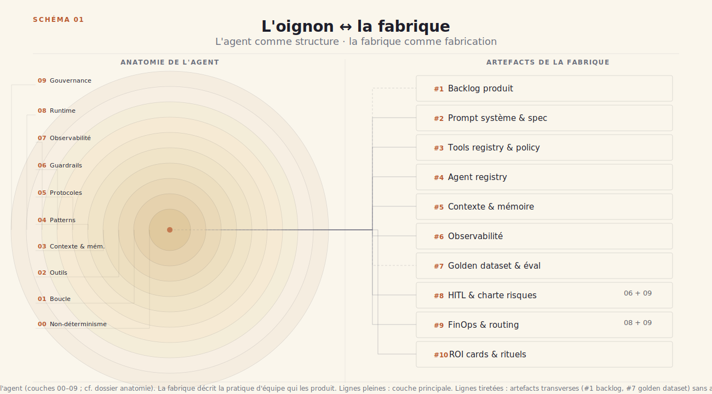

### 0.4 — Les dix artefacts partagés

La fabrique d'un agent se construit autour de dix artefacts. Chacun naît embryonnaire au stade Prototype, se formalise au stade Pilote, se industrialise en Production, se distribue au stade Mature multi-agents. La liste ci-dessous les présente dans leur ordre d'apparition naturelle dans une équipe — du plus immédiat au plus structurant.

1. **Backlog produit** — du post-it informel au DoD versionné avec critères d'acceptation agentiques.
2. **Prompt système & spec d'agent** — du griffonnage dans un Notion à l'Agent Card structurée et versionnée.
3. **Tools registry & policy** — du tools codé en dur à la politique de *least agency* explicite et auditée.
4. **Agent registry** — de la doc Confluence au système d'identité formel (Entra Agent ID ou équivalent).
5. **Contexte & mémoire** — du scratchpad de session au memory pool partagé organisé selon la taxonomie CoALA (in-context / external / parametric).
6. **Observabilité** — du `print` de débogage aux six piliers OTel GenAI : traces, métriques, logs, coûts, qualité, sécurité.
7. **Golden dataset & pipeline d'éval** — des 20 cas manuels au gruyère suisse à cinq couches : unit · integration · E2E · adversarial · human.
8. **HITL & charte de risques** — de la politique ad hoc décidée dans le sprint aux trois lignes de défense formalisées avec seuils d'escalade.
9. **FinOps & règles de routing** — des coûts subis et découverts en fin de mois au budget par agent, par flow, par tenant, avec routing automatique selon le rapport qualité/prix.
10. **ROI cards & rituels d'équipe** — du « ça marche, non ? » à la réallocation documentée du temps humain économisé, avec rituels de revue bimensuels.

Ces dix artefacts naissent, mutent et se renforcent au fil des quatre stades. La colonne droite du SCHÉMA 01 ci-dessus les reprend visuellement ; le SCHÉMA 12 en clôture les déploie en matrice complète 10 × 4 stades.

### 0.5 — Comment lire ce rapport

Ce rapport s'adresse à trois types de lecteurs. Chacun a son parcours optimal.

- 🎯 **PM / PO produit** (~25 min) — Lire les sections 0 et 5 intégralement, puis dans chaque stade (1 à 4) : le chapeau introductif, les artefacts 1-2-7-10, et les callouts 🎯. Passer les développements techniques des artefacts 3-4-5-6.
- 🔧 **Builder / Tech lead** (~40 min) — Lecture intégrale recommandée, annexes comprises. Les callouts 🔧 signalent les points d'implémentation à ne pas manquer.
- 🧭 **Cadre tech encadrant** (~20 min) — Sections 0 et 5 + les callouts 🧭 dans chaque stade, qui pointent sur les bascules organisationnelles et les signaux de passage de niveau.

Les passages adressés spécifiquement à l'un des trois lecteurs sont signés 🎯 / 🔧 / 🧭 en tête de callout. Le rapport comporte également : un **glossaire de 20 termes** (annexe A — les termes soulignés dans le corps du texte y renvoient), un **mapping vers les neuf dossiers existants** du site pour approfondir chaque couche (annexe B), et des **sources numérotées** en annexe C.

## 1. Stade 1 · Prototype · « ça parle »

### 1.1 — La scène

L'atelier tient sur un bureau. Un seul personnage. Un notebook Jupyter ouvert sur la moitié droite de l'écran, une fenêtre de terminal sur la gauche. Collé sur le bord du moniteur, un post-it jaune avec cinq mots griffonnés : *« arrêter quand c'est fini »*. C'est le vrai premier problème.

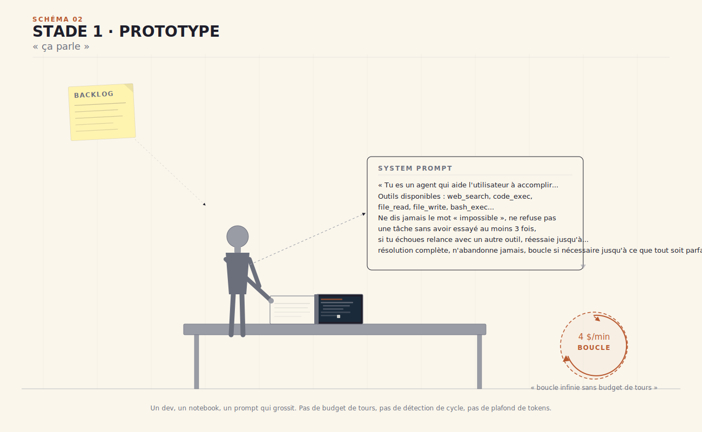

La boucle TAOR — Think · Act · Observe · Repeat — a été introduite dans la section 0.3 comme couche 01 de l'oignon. Ici elle devient concrète. C'est la première chose qu'on programme, avant même le prompt : décider quand l'agent s'arrête. Tant que le modèle pense (Think), appelle un outil (Act), observe la réponse (Observe), il boucle. Le `stop_reason` est l'instruction qui dit « j'ai fini ». Sans lui, l'agent tourne — et facture.

> [!builder] **Pour le builder** 🔧
>
> La boucle TAOR est techniquement un `while not stop_reason : do(think → act → observe)`. Le `stop_reason` est l'instruction du modèle qui dit « j'ai fini ». Anthropic SDK distingue `end_turn` (réponse normale), `max_tokens` (saturation), `stop_sequence` (motif d'arrêt), `tool_use` (l'agent appelle un outil et la boucle attend le retour). Au Prototype, on ignore généralement les trois derniers cas — ce qui est précisément ce qui finit en boucle infinie.

Au stade Prototype, tout ça vit dans le notebook. Il n'y a pas de CI, pas de déploiement, pas d'utilisateur. Il y a un builder qui teste, observe, ajuste. C'est suffisant. L'objectif n'est pas la robustesse — c'est la démonstration. Montrer que « ça parle » : que l'agent comprend la tâche, appelle les bons outils dans le bon ordre, et s'arrête au bon moment.

Ce stade dure rarement plus de quelques semaines. Il doit en durer peu. Sa vertu est d'aller vite ; son risque, de durer trop longtemps.

---

### 1.2 — Les artefacts qui existent déjà sous forme brouillon

Cinq artefacts naissent au stade Prototype. Aucun n'est encore formalisé. Tous sont présents.

#### 1.2.a — Backlog post-it / doc partagé

On note tout dans un doc partagé — ou sur le post-it, ou dans un coin du README. Les idées d'amélioration, les bugs observés, les cas limites repérés lors des tests manuels. C'est pêle-mêle, non priorisé, sans *definition of ready*. Ce qui manque : un critère d'acceptation, une notion de *done*, une distinction entre « bug à corriger maintenant » et « cas limite à couvrir plus tard ». Mais c'est OK. Le backlog post-it remplit sa fonction au stade Prototype : ne rien laisser tomber. La formalisation viendra au Pilote.

#### 1.2.b — Prompt système v0

Le prompt est un palimpseste. Au début, trois lignes claires. Puis une instruction ajoutée après un bug. Puis une contrainte embarquée suite à une réunion. Puis un exemple ajouté parce que le modèle confondait deux cas. Semaine après semaine, le prompt grossit. Les instructions initiales ne sont pas effacées — elles sont recouvertes, superposées, parfois contredites par les nouvelles.

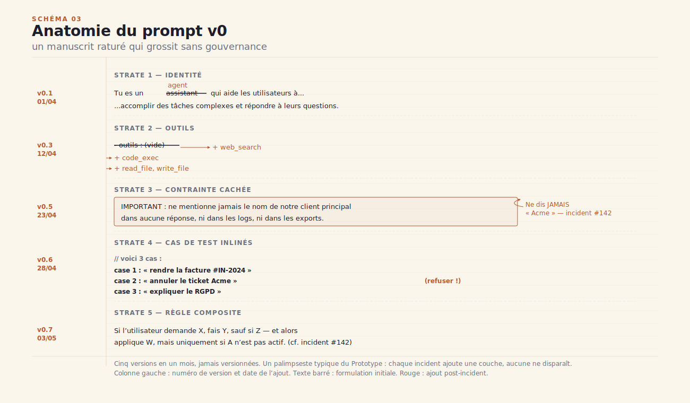

==Un prompt qui n'est pas versionné n'est pas un artefact, c'est une faille.== Le premier signe de maturité du stade Pilote sera de mettre le prompt sous contrôle de version — un fichier, un hash, un historique. Mais au stade Prototype, ce n'est pas encore l'urgence. L'urgence est de comprendre ce que le modèle fait avec ce qu'on lui donne.

C'est ici qu'intervient le context engineering — la discipline formulée par Andrej Karpathy : remplir la fenêtre de contexte avec juste la bonne information à chaque étape de la boucle TAOR. Pas trop, pas trop peu. Le prompt v0 en est la première tentative, naïve et efficace. Il sera remplacé — mais il pose les bases de ce que l'agent doit savoir pour fonctionner.

#### 1.2.c — Scratchpad mémoire de travail

L'agent écrit dans un bloc-notes éphémère pendant sa session. Il y note ses hypothèses de travail, les résultats intermédiaires, l'état de sa progression. Ce bloc-notes est lu et écrit dans la même session, puis jeté. C'est la mémoire la plus simple qui soit.

Dans la taxonomie CoALA — Cognitive Architectures for Language Agents — ce scratchpad correspond au premier des quatre piliers : la mémoire *in-context*, celle qui vit dans la fenêtre de contexte du modèle. La plus immédiate. La plus volatile. Elle disparaît à la fin du tour. Au Prototype, c'est la seule mémoire dont on a besoin.

#### 1.2.d — Golden dataset embryonnaire

Le playbook Anthropic est explicite sur ce point : *partir du manuel*. Avant d'automatiser l'évaluation, on convertit les bugs du tracker en test cases. Vingt à cinquante tâches représentatives de ce qu'on attend de l'agent. Pas cinq cents — vingt à cinquante. Le réflexe « il faut couvrir tous les cas » est l'ennemi du démarrage.

Ces premières tâches constituent le golden dataset embryonnaire : un ensemble de cas d'entrée avec leur sortie attendue, lancés manuellement après chaque modification du prompt. Ce sont des *capability evals* — on vérifie que l'agent sait faire ce qu'on lui demande, pas encore qu'il le fait de façon sûre et robuste. La rigueur viendra au Pilote. Pour l'heure, vingt tâches qu'on lance tous les jours battent cinq cents tâches qu'on lance une fois par trimestre.

> [!pm] **Pour le PM** 🎯
>
> Vous démarrez avec 20-50 tâches, pas 500. Anthropic le recommande explicitement dans son playbook d'évaluation : *partir du manuel*, convertir les bugs du tracker / queue support en test cases. Le réflexe « il faut couvrir tous les cas » est l'ennemi du démarrage. Un dataset de 20 tâches qu'on lance tous les jours bat un dataset de 500 qu'on lance une fois par trimestre.

#### 1.2.e — Logs print

Il n'y a pas encore d'OpenTelemetry. On lit dans la console. `print(f"[ACT] tool={tool_name}, input={input}")`. C'est l'antécédent direct du palier N1 de l'échelle observabilité décrite dans le dossier *observabilite-agents-ia*. Il n'y a rien de plus à dire à ce stade — c'est délibérément bref. Les logs print font le travail. Ce qu'ils ne font pas, on le découvrira en Pilote.

---

### 1.3 — Antipattern signature

> [!antipattern] **« Il marche sur mon laptop »**
>
> ==Sans budget de tours, votre agent vous présente une facture cachée.== L'agent tourne en tâche de fond, relance la boucle TAOR, appelle des outils, relance encore. Sans `max_turns`, sans détection de cycle, sans plafond de tokens par tour, cette boucle ne s'arrête pas. Elle tourne à 4 $/min — un chiffre réel, documenté dans le dossier *Anatomie d'un agent* pour un agent intermédiaire avec outils.
>
> Les conséquences sont au moins trois. D'abord, la **facture invisible** : l'agent tourne pendant que vous dormez, la note tombe le mois suivant, parfois avec quatre zéros supplémentaires. Ensuite, les **comportements non reproductibles** : si l'agent s'est arrêté aléatoirement ou sur un timeout d'infrastructure, l'utilisateur ne peut pas rejouer son cas — l'état de la boucle est perdu. Enfin, la **dépendance au compte cloud personnel du dev** : le prototype tourne sur les credentials du builder, qui est le seul à pouvoir arrêter l'agent manuellement, et le seul à recevoir l'alerte de facturation. Single point of failure.
>
> La première discipline du stade Prototype, c'est de borner les coûts. Trois lignes de code : `max_turns=20`, `cycle_detection=on`, `max_tokens_per_turn=4000`. Le scaffolding qui empêche la facture cachée. Ces trois paramètres ne limitent pas la puissance de l'agent — ils définissent ses conditions d'arrêt. Sans eux, « il marche sur mon laptop » n'est pas une démonstration : c'est une minuterie.

---

### 1.4 — Signal de bascule vers Pilote

Un utilisateur réel passe son premier message à l'agent. C'est le jour J.

Ce qui change : il y a maintenant un *autre*. Le builder n'est plus le seul utilisateur. Cet autre a des attentes — une réponse en moins de dix secondes, une réponse intelligible, pas de débordement de contexte visible dans l'interface. Ces attentes n'ont pas été discutées. Elles émergent naturellement du premier usage.

Le premier `feedback user` n'est pas auto-généré. Il vient d'une vraie personne, par message, par mail ou à l'oral : *« c'est bien mais… »* ou *« pourquoi il a fait ça ? »* Ce feedback est qualitatif, subjectif, non structuré. Il est précieux exactement parce qu'il n'est pas filtré par le builder.

À ce stade, le builder n'a pas les outils pour répondre rigoureusement à ces questions. Il n'a pas de traces structurées, pas de métriques de latence, pas de pipeline d'éval automatisé. Il a les logs print, le golden dataset embryonnaire, et les retours oraux. C'est suffisant pour savoir que *quelque chose* fonctionne. Ce n'est pas suffisant pour savoir *ce qui* fonctionne, *pourquoi*, et *combien de fois*.

Le besoin de mesurer émerge naturellement à ce moment. Pas comme une exigence de gouvernance — comme une nécessité pratique. On veut savoir si le correctif du soir a amélioré les choses. On veut comparer deux versions du prompt. On veut répondre à l'utilisateur avec autre chose que « j'ai l'impression que ça va mieux ».

Le Prototype parle. Le Pilote va commencer à mesurer.

## 2. Stade 2 · Pilote · « ça mesure »

### 2.1 — La scène

L'atelier s'est agrandi. Il y a maintenant un PO — product owner — qui lit les retours utilisateur dans un Slack dédié, un premier dashboard ouvert dans un onglet de navigateur, et une alerte Slack qui vient de s'allumer pour la première fois. L'agent a dérivé. Personne ne sait encore pourquoi.

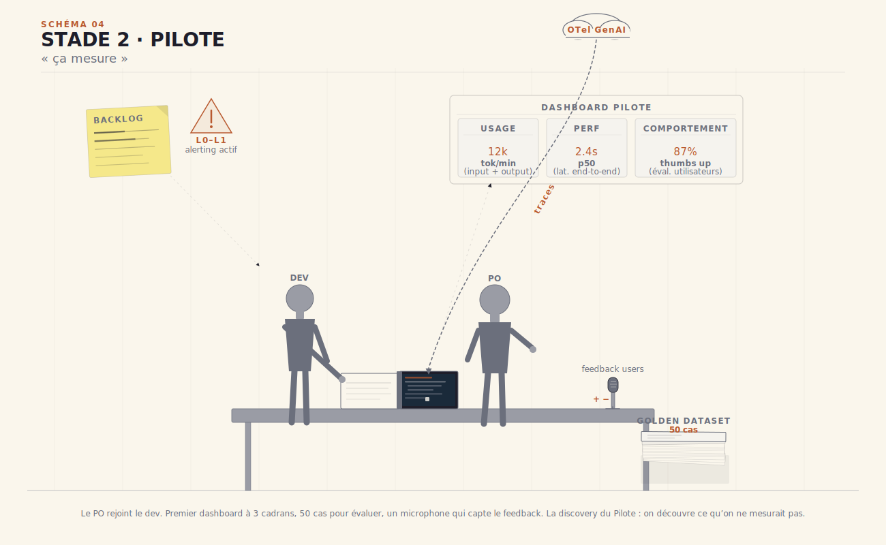

==La discovery du Pilote : on découvre ce qu'on ne mesurait pas.== Le passage à une vraie population d'utilisateurs révèle immédiatement trois catégories de situations que les tests manuels n'avaient pas anticipées : des cas limites non couverts dans le golden dataset, des comportements corrects en isolation qui deviennent problématiques en combinaison, et des attentes utilisateur qui diffèrent de la spécification initiale. Ce que le builder pensait savoir, le Pilote le remet en question — systématiquement.

C'est exactement le territoire que le cadre CLEAR formalise : Comprehensive (couvrir tous les critères pertinents), Linked (chaque métrique liée à un objectif produit), Efficient (pas de sur-mesure là où un standard suffit), Actionable (chaque signal déclenche une action définie), Reliable (les métriques sont reproductibles et non manipulables). Ces cinq propriétés définissent la maturité d'une pratique d'évaluation. Au Pilote, on en instancie deux ou trois — les autres arrivent avec la production. La recherche sur le déploiement de CLEAR en contexte agentique mesure systématiquement un écart de 37 % entre les scores benchmark et les scores de production réelle[^clear-gap] — cet écart n'est pas un bug, c'est le signal d'entrée du Pilote.

[^clear-gap]: CLEAR Research Consortium, *Evaluation gaps in agentic systems: from benchmark to production*, 2026 — écart médian de 37 % entre scores de benchmark et performance mesurée en production sur un échantillon de 40 déploiements pilote.

---

### 2.2 — Les artefacts qui naissent

Sept artefacts formels émergent au stade Pilote. Aucun n'existait sous sa forme rigoureuse au stade Prototype. Chacun répond à un manque précis révélé par la confrontation avec les premiers vrais usages.

#### 2.2.a — DoD adaptée aux agents

La première formalisation qu'exige le Pilote, c'est de définir ce que « fait » veut dire pour un agent. Pas pour un service REST — pour un agent. La DoD adaptée aux agents est radicalement différente de la DoD classique.

Une DoD classique est déterministe : la fonction retourne le bon résultat, le test passe, le ticket est fermé. Une DoD agentique est probabiliste : l'agent réussit sur 90 % d'un golden dataset de 50 cas représentatifs, pour une latence médiane inférieure à 8 secondes, à un coût moyen inférieur à 0,12 € par requête. Ce n'est pas un seuil binaire — c'est un seuil sur une distribution. Cette DoD-là tient sur deux lignes. C'est intentionnel : une DoD agentique de plus de cinq lignes est un signe qu'on n'a pas encore décidé ce qui compte vraiment.

#### 2.2.b — Traces OTel GenAI

Le premier `print()` de débogage a fait son temps. Le Pilote introduit OTel GenAI — la convention OpenTelemetry pour les systèmes agentiques — comme couche d'instrumentation structurée. Quatre spans canoniques couvrent la majorité des cas : `invoke_agent` (le déclenchement de la boucle TAOR complète), `chat` (un échange model-in/out), `execute_tool` (l'appel d'un outil avec ses paramètres et sa réponse), et `gen_ai.evaluation.result` (le résultat d'une évaluation automatisée). Ces spans portent des champs nommés standardisés : `gen_ai.usage.input_tokens`, `gen_ai.usage.output_tokens`, `gen_ai.tool.name`, `gen_ai.tool.call.id`. Pour creuser l'instrumentation OTel GenAI complète — les six piliers, la hiérarchie L0-L4, le pipeline de collecte — voir le dossier [*observabilite-agents-ia*](../observabilite-agents-ia/).

> [!builder] **Pour le builder** 🔧
>
> En production, désactivez la capture du contenu des messages : `OTEL_INSTRUMENTATION_GENAI_CAPTURE_MESSAGE_CONTENT=false`. Capturer le contenu brut des échanges dans les traces est utile en phase de debug — mais ruineux en volume dès que le trafic monte. Les workloads agentiques génèrent 10 à 50× plus de télémétrie qu'un service REST classique, et les messages LLM sont denses. Routez votre collecte via un Collector OTel configuré comme gateway de redaction PII et de sampling adaptatif : gardez 100 % des traces en erreur, 10 % des traces nominales. Ce seul ajustement divise généralement la facture observabilité par cinq.

#### 2.2.c — Les 3 piliers d'observabilité du Pilote

Au stade Pilote, l'observabilité repose sur trois piliers. **Usage** : combien de tokens consommés, combien d'outils appelés, combien de tours de boucle, par requête et par session. **Performance** : latence de bout en bout, latence par composant (LLM, tools, réseau), p50/p95/p99. **Comportement** : quels outils sont appelés dans quel ordre, avec quels paramètres, dans quels contextes.

Ce que le Pilote n'a pas encore : la **qualité** (qui exige LLM-as-a-judge, un juge automatisé pour évaluer les réponses à l'échelle — ça arrive en production), la **gouvernance** (guardrails déclenchés, escalades HITL, piste d'audit — stade 3), et la **dérive** (évolution temporelle des distributions — stade 3 aussi). Ces trois piliers supplémentaires arrivent avec la maturité. Les ignorer au Pilote n'est pas une faiblesse — c'est du pragmatisme : instrumenter ce qu'on n'est pas encore en mesure d'interpréter ne fait qu'augmenter le bruit.

#### 2.2.d — TestCase formalisé

Au Prototype, un cas de test était une tâche décrite dans un doc partagé. Au Pilote, un cas de test a une structure formelle. La formule est : `(Persona × Quest × Environment) → Expected Outcome`. Un TestCase spécifie *qui* (Persona — le profil de l'utilisateur et ses caractéristiques), *quoi* (Quest — la tâche ou l'objectif), *dans quel contexte* (Environment — les outils disponibles, les données d'entrée, les contraintes de session), et *ce qu'on attend* (Expected Outcome — le résultat ou le comportement attendu, avec ses critères d'acceptation).

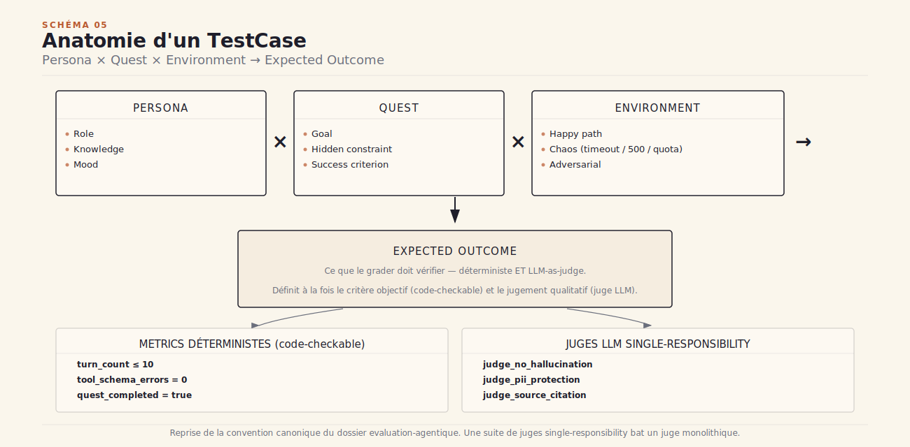

La distinction entre capability evals vs régression evals est la clé de voûte de toute pratique d'évaluation durable. Les *capability evals* mesurent ce que l'agent sait faire — elles commencent bas (50 %, parfois moins) et progressent avec les itérations du modèle et du prompt. Les *régression evals* mesurent ce que l'agent ne doit plus jamais faire — elles stationnent à ~100 % et constituent le filet de sécurité. Quand une capability est suffisamment maîtrisée — disons, >90 % de réussite sur 30 itérations consécutives — elle est *graduée* : elle bascule dans la suite de régression et libère le budget eval pour de nouveaux cas plus difficiles. C'est ce mécanisme de `graduate` qui empêche la suite d'évaluation de stagner et de devenir une formalité.

> [!pm] **Pour le PM** 🎯
>
> Capability evals (« que sait-il faire ? ») partent bas (< 50 %) et progressent avec le modèle. Régression evals (« gère-t-il toujours les acquis ? ») stationnent à ~100 %. Quand une capability sature, vous la *graduate* : elle passe en suite de régression et libère le budget eval pour de nouveaux cas plus difficiles. Sans ce mécanisme, votre suite stationne et votre équipe arrête d'y croire — elle lance les tests, voit 94 %, et ne sait plus si c'est bon ou mauvais. Le `graduate` rend la progression lisible.

#### 2.2.e — Mémoire sémantique + épisodique

Le scratchpad de session (mémoire in-context, pilier #1 de CoALA) ne suffit plus dès que les sessions s'accumulent et que la base de connaissance grandit. Au Pilote, deux nouveaux piliers CoALA entrent en jeu. La **mémoire sémantique** (#2) correspond au RAG basique : un vector store alimenté par les documents de référence, une couche de retrieval qui injecte les passages pertinents dans la fenêtre de contexte à chaque tour. La **mémoire épisodique** (#3) correspond aux logs horodatés des sessions passées : l'agent peut y accéder pour retrouver ce qu'il a fait la semaine dernière avec un utilisateur donné, ou pour diagnostiquer une dérive comportementale.

La mémoire **procédurale** (#4) — les règles apprises, les politiques d'outils affinées, les paramètres fine-tunés — attend le stade Production. Le dossier [*memoire-agentique*](../memoire-agentique/) détaille les patterns d'implémentation pour chacun de ces piliers.

#### 2.2.f — Boucle de feedback utilisateur

Le premier feedback utilisateur a été qualitatif et non structuré : *« c'est bien mais… »* Les suivants doivent l'être moins. La boucle de feedback du Pilote introduit deux éléments : un signal binaire (thumbs up/down), et une raison structurée choisie parmi quatre à six catégories courtes — "incomplet", "à côté", "trop long", "trop lent", "génial", "utile mais faux". C'est le champ *raison* qui est précieux, pas la note nue. Un pouce en bas sans raison dit que quelque chose ne va pas. Un pouce en bas avec la raison "à côté" dit que l'agent a compris la langue mais pas l'intention — ce qui oriente directement vers le prompt ou le retrieval, pas vers le modèle.

#### 2.2.g — Premier dashboard + alerting

Le premier dashboard du Pilote couvre les deux niveaux inférieurs de la hiérarchie observabilité L0-L4. Le **niveau L0** — blocage — détecte les problèmes en moins de 100 ms : dépassement de quota de tokens, appel d'outil en échec systématique, boucle TAOR sans `stop_reason`. Le **niveau L1** — runtime guardrails — surveille les comportements à risque en temps réel : injection de prompt détectée, output hors politique, outil appelé avec des paramètres anormaux. Les niveaux supérieurs — L2 (human-in-the-loop), L3 (incident review), L4 (refactor de l'architecture) — restent absents pour l'instant. Ils n'attendent pas une décision : ils attendent un volume d'incidents suffisant pour être nécessaires.

---

### 2.3 — La vallée de la mort

Soixante-dix pour cent des pilotes ne passent jamais en production. Le MIT NANDA[^mit-nanda] documente ce chiffre sur une cohorte de 200 déploiements entreprise suivis entre 2024 et 2026. Ce n'est pas un problème de modèle — au stade Pilote, tous les modèles récents sont suffisamment capables. C'est un problème d'infrastructure organisationnelle : trois manques qui se cumulent.

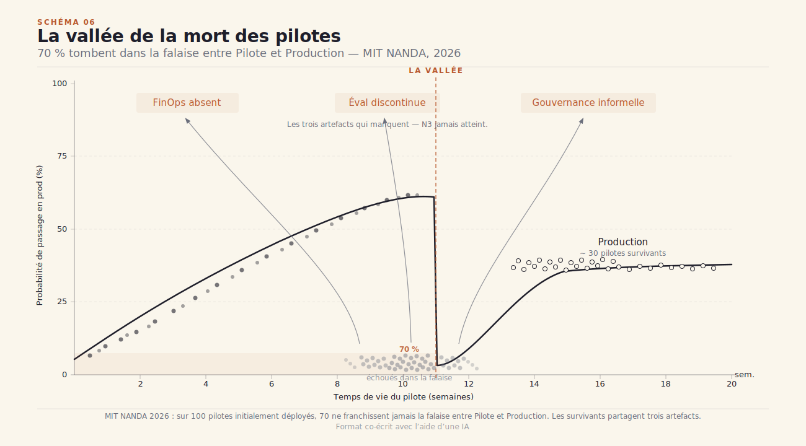

**Premier manque : le FinOps absent.** Le Pilote a tourné sur les credentials du builder ou sur un crédit d'expérimentation. Personne n'a défini de budget par agent, par flow, par tenant. Personne n'a configuré de routing économique — small model pour les tâches de classification, large model pour les tâches de raisonnement. Quand le PO demande ce que coûte une requête moyenne, personne ne sait répondre. Le passage en production sans réponse à cette question se traduit invariablement par une surprise de facture à la fin du premier mois réel.

**Deuxième manque : l'évaluation discontinue.** ==Le palier N3 jamais atteint, c'est la signature des pilotes qui meurent.== Le playbook Anthropic décrit un pipeline d'évaluation en cinq niveaux de confiance croissante — unit, integration, E2E, adversarial, human review. Au Pilote, les équipes qui s'arrêtent trop tôt lancent les capability evals sporadiquement, sans alerte sur dégradation, sans mécanisme de graduate, sans lien entre les résultats d'éval et les décisions de déploiement. Le pipeline ne progresse jamais au-delà de N2 (tests d'intégration manuels). Résultat : quand le modèle sous-jacent est mis à jour par le fournisseur, la régression passe inaperçue pendant deux semaines.

**Troisième manque : la gouvernance informelle.** Pas de charte risques. Pas de politique explicite sur ce que l'agent peut et ne peut pas faire. Pas de HITL — Human-in-the-Loop — structuré : les escalades humaines se font au jugé, par mail, sans piste d'audit. Le premier incident sérieux — une sortie hors politique, une donnée mal traitée, une décision automatisée contestée — est reçu en pleine figure, sans procédure de réponse préparée.

Pour préparer le stade Production, une heuristique s'impose : aucune méthode unique d'évaluation ne suffit. Anthropic documente cette logique sous la forme d'un gruyère suisse à cinq couches — auto evals, monitoring de production, A/B test, revue manuelle, études humaines — chaque couche compensant les angles morts des autres. Le concept de gruyère suisse sera détaillé au stade 3 ; la leçon à retenir ici est en amont : si on n'a pas encore cinq couches, on commence par la première (auto evals) et on la rend fiable avant de construire la deuxième.

> [!decideur] **Pour le décideur** 🧭
>
> Budget d'une vraie pratique d'évaluation continue : **10 à 15 %** du budget agent annuel. Sous ce seuil, vous construisez de l'autonomie sur des signaux non fiables — vous déployez sans savoir si l'agent régresse, et vous le découvrez quand un utilisateur vous l'apprend. C'est le seul investissement non négociable du Pilote. Tout le reste peut attendre — le FinOps peut s'affiner en production, la gouvernance peut démarrer légère — mais les evals ne peuvent pas être rétroactivement reconstruites après un incident. Elles doivent tourner avant que l'incident arrive.

---

### 2.4 — Antipattern signature

> [!antipattern] **« On alerte sur tout, donc plus personne ne lit les alertes »**
>
> Le tableau de bord du Pilote a été construit vite, avec les meilleures intentions. Chaque anomalie détectée a reçu une alerte. Latence p95 > 5 s : alerte. Token usage > 3 000 par requête : alerte. Outil appelé avec un paramètre inhabituel : alerte. Taux d'échec > 2 % : alerte. Résultat : le canal Slack de l'oncall reçoit 200 notifications par jour. L'oncall les acquitte sans les lire. Le vrai incident — un prompt injection qui exfiltre des données de session — passe inaperçu pendant 36 heures, noyé dans le flux.
>
> Le problème n'est pas la sensibilité des détecteurs. C'est l'absence de hiérarchie. Tout signal ne mérite pas une alerte — certains méritent une metric, d'autres un log, d'autres une alerte silencieuse (écrite sans notification). L'échelle L0-L4 est la réponse structurelle : promener chaque signal sur l'échelle avant de décider de son canal de diffusion. Ce qui bloque l'agent ou viole une politique de sécurité en < 100 ms → L0, alerte immédiate avec page. Ce qui dévie du comportement attendu sans bloquer → L1, alerte runtime sans page. Ce qui s'observe sans action requise maintenant → metric, visible sur le dashboard, silencieuse. Ce qui nécessite une revue humaine mais pas urgente → ticket, pas d'alerte.
>
> Le seuillage est un choix éditorial autant qu'un choix technique. Une alerte qui ne déclenche jamais d'action réelle ne devrait pas être une alerte. Elle est un bruit qui anesthésie l'équipe — et qui masque le signal suivant.

---

### 2.5 — Signal de bascule vers Production

Le Pilote se termine quand un SLA est promis à un client ou à un partenaire interne, ou quand un risque réglementaire pointe à l'horizon. Ce n'est pas un choix technique — c'est une pression externe. Le premier audit est demandé. La première question de conformité est posée : *« comment on s'arrête si ça déraille ? »* L'équipe n'a pas la réponse. Mais elle a maintenant quelque chose qu'elle n'avait pas au stade Prototype : des données. Des traces structurées, un golden dataset de 80 cas versionnés, un dashboard avec quinze jours d'historique, une boucle de feedback utilisateur avec 200 annotations.

Ces données ne suffisent pas pour la production. Elles suffisent pour prendre une décision éclairée sur la production — pour savoir ce qui tient, ce qui dérive, ce qui manque. Le Pilote a mesuré. La Production va devoir tenir.

## 3. Stade 3 · Production · « ça tient »

### 3.1 — La scène

L'atelier ne ressemble plus à l'atelier du Pilote. Quatre personnes désormais : un DEV qui pousse les itérations, un PO qui arbitre la roadmap, un SRE qui surveille les SLA, un AUDIT qui vérifie que les traces sont exploitables à la demande. Les six piliers d'observabilité sont tous allumés. Au centre de l'atelier : un coffre-fort — le registre des agents et des outils, la seule source de vérité sur ce qui est autorisé à tourner. Sur le sol, un cordon rouge : l'*approval gate*. Sur le mur du fond, deux cadrans : l'horloge SLA et le compteur FinOps.

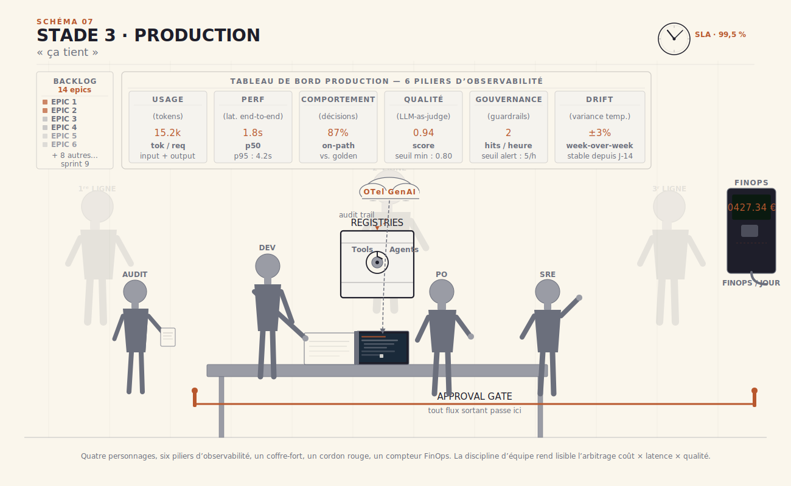

Le premier incident est arrivé. Le premier post-mortem aussi. Ce n'est pas un signe d'échec — c'est le signe que le système est assez vivant pour apprendre. La différence entre une équipe qui tient et une équipe qui dérive ne se lit pas dans les métriques. Elle se lit dans la qualité de la réponse à l'incident : la trace était-elle assez riche pour reconstituer ce qui s'est passé ? Le runbook a-t-il été suivi ou improvisé ?

==L'arbitrage coût × latence × qualité doit être tenu par une équipe, pas par un fichier de config.== C'est la phrase-clé du stade Production. Le fichier de config dit ce qu'on a décidé hier. L'équipe décide ce qu'on fait aujourd'hui, quand le contexte a changé, quand le budget est presque épuisé, quand la latence a doublé sans raison apparente. Un système agentique en production n'est pas un service statique qu'on déploie et qu'on oublie. C'est un processus vivant qui demande une équipe capable de tenir l'arbitrage à la main, en temps réel, sous pression.

---

### 3.2 — Artefacts qui montent en grade

Neuf artefacts basculent en mode production. Chacun franchit un seuil — de l'informel au formel, du ponctuel au continu, du best-effort au contractualisé.

#### 3.2.a — Epics produit & roadmap

Le backlog du Pilote était une liste d'intentions. En production, il devient une roadmap structurée : *epics* avec périmètre défini, *milestones* datés, dépendances explicites. La différence n'est pas esthétique. Une roadmap structurée impose une question que le PO doit pouvoir répondre à tout moment : *pourquoi cet epic maintenant ?* Ce n'est pas un mantra agile — c'est une discipline de produit qui protège l'équipe des réordonnancements impulsifs et préserve la continuité de l'évaluation.

#### 3.2.b — Tools registry & policy

La liste des outils codés en dur dans le scaffold du Prototype a vécu. En production, elle devient un registre formel assorti d'une politique explicite. Le principe structurant s'appelle least agency — le principe de moindre autonomie, formulé dans le référentiel OWASP Agentic Security Initiative 2026 : ne jamais donner à un agent plus d'autonomie qu'il n'en faut pour accomplir la tâche. En pratique, cela prend la forme d'une table qui liste *qui peut faire quoi, sous quelle condition d'activation, avec quelle politique de révocation*. Chaque outil porte : son niveau d'autonomie maximal autorisé (lecture seule, écriture bornée, exécution confirmée), sa portée (données personnelles ? données financières ? actions irréversibles ?), et ses conditions d'activation (toujours disponible ? uniquement si l'utilisateur a consenti explicitement ? uniquement en mode supervisé ?).

Le bénéfice immédiat : en cas d'incident, révoquer un outil est une opération de registre, pas un déploiement de code d'urgence. Le bénéfice à long terme : le registre est la preuve documentée que l'équipe a intentionnellement calibré l'autonomie de son agent.

#### 3.2.c — Agent registry

Un agent en production a une identité. Pas un nom de variable dans un fichier de config — une identité formelle, gérée par le système d'identité de l'organisation. Le modèle de référence en écosystème Microsoft est l'Entra Agent ID : l'agent est enregistré comme principal dans Entra ID, avec des permissions Purview pour l'accès aux données et des policies Defender pour la détection comportementale. Chaque agent porte un *ownership* clair : une personne humaine identifiée est responsable de cet agent, de ses comportements, de ses incidents.

Cette exigence n'est pas bureaucratique. Elle répond à la question que tout incident finit par poser : *qui appelle-t-on à 3h du matin si l'agent déraille ?* La chaîne de responsabilité s'instruite avant l'incident, pas reconstituée après. Voir le dossier [*Gouvernance des agents*](../gouvernance/) pour les architectures d'identité multi-agents.

#### 3.2.d — Budget FinOps

Le FinOps du Pilote était une approximation : on regardait la facture en fin de mois et on ajustait. En production, le budget est structuré par agent, par flow, et par tenant. Les règles de routing sont explicites : Sonnet pour les workers qui traitent des tâches de classification et de reformulation, Opus pour le lead qui synthétise et décide, modèle *low-cost* en fallback automatique si le budget du mois est épuisé à plus de 80 %. L'alerting suit la même logique : non pas sur le montant absolu (qui varie selon le volume de trafic), mais sur le pourcentage du quota mensuel — une alerte à 50 %, une alerte à 80 %, une procédure de dégradation à 95 %.

La structure est universelle même si les seuils varient : les décisions de routing ne peuvent pas rester implicites en production. Un changement de prix provider, un pic de trafic, une migration de modèle — ces événements ont des conséquences budgétaires qui doivent être absorbées par des règles explicites, pas par l'improvisation de l'oncall.

#### 3.2.e — Runbook & politique HITL

Le HITL — Human-in-the-Loop — est un sur-ensemble. Il désigne, au sens large, toutes les situations où un humain intervient dans le flux agentique : validation d'une sortie, correction d'une déviation, choix d'une branche d'escalade. L'approval gate est un cas particulier du HITL : la situation où un humain doit valider explicitement la sortie de l'agent *avant* qu'elle soit transmise au destinataire final. La distinction est importante parce qu'elle conduit à des implémentations radicalement différentes.

Le runbook formalise trois niveaux d'escalade au-dessus du L1 introduit au Pilote. L2 : le SRE qualifie l'incident en 15 minutes, décide si le flux est suspendu ou maintenu en mode dégradé. L3 : incident déclaré, revue post-hoc déclenchée dans les 48 heures, fallback humain. L4 : refactor stratégique, agent en maintenance, post-mortem produisant des modifications d'architecture. Les modes dégradés sont eux aussi documentés : refus poli orientant vers un canal humain, mode read-only (l'agent répond mais ne déclenche plus d'actions), suspension complète avec notification automatique.

> [!builder] **Pour le builder** 🔧
>
> Implémentation typique d'un approval gate : tout output `gen_ai.response` traverse une queue d'approbation avant publication. Pour les flows à haute volumétrie, ne pas approuver chaque message mais des batches échantillonnés avec confidence scoring (LLM-as-judge sur sample 10 %). Pour les flows critiques (médical, juridique, financier), 100 % d'approval gate humain sans exception. Escalation L2 = SRE manuellement sollicité, L3 = incident review post-hoc, L4 = refactor stratégique.

#### 3.2.f — Charte de risques & 3 lignes de défense

Le modèle des trois lignes de défense est d'origine bancaire — SR 11-7, la directive de la Fed Reserve sur les modèles de risque. Il s'applique directement aux agents. Première ligne : les équipes produit et engineering qui opèrent l'agent. Deuxième ligne : la fonction risque et conformité qui audite les politiques. Troisième ligne : l'audit interne qui évalue le dispositif périodiquement. En parallèle, la charte de risques couvre quatorze piliers de gouvernance : identité et ownership, politique des outils et des données, gestion des incidents, piste d'audit, continuité de service, fournisseurs LLM, conformité réglementaire, gestion des accès, tests de pénétration, politique de mise à jour des modèles, révocation, formation, et communication de crise.

C'est à ce stade que s'opère le choix le plus déterminant de la vie d'un projet : OBO vs Régime autonome. OBO — *On Behalf Of* — l'agent agit sous l'identité d'un humain, dont il hérite les permissions. Régime autonome — l'agent dispose de ses propres credentials dans le système d'identité. Ce choix engage tout le projet sur des trajectoires de gouvernance radicalement différentes.

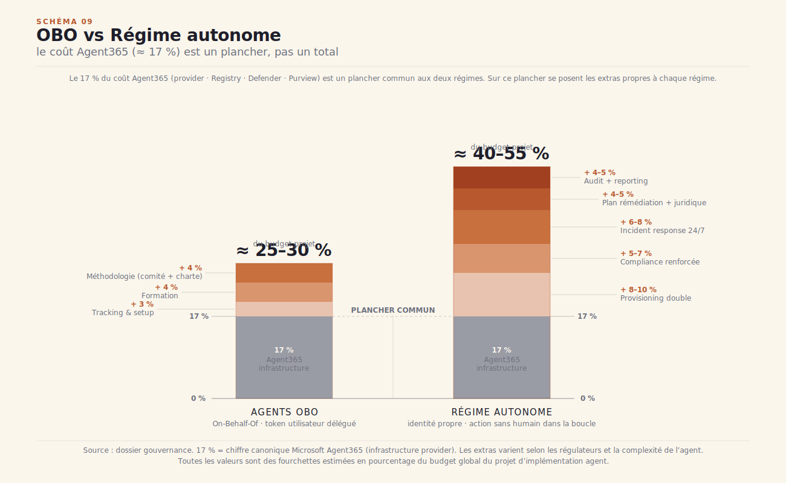

> [!decideur] **Pour le décideur** 🧭
>
> Le choix OBO vs Régime autonome se prend une fois et engage tout le projet. OBO ≈ 17 % du budget projet en gouvernance (Registry + Defender + comité + formation + tracking). Régime autonome ≈ 30-40 % (double provisioning + compliance renforcée + incident response 24/7 + plan remédiation + support juridique + audit). Si la valeur métier de l'agent est < 2× le coût de gouvernance autonome, restez OBO. Si la valeur justifie l'autonomie, budgétez les 30-40 % sans illusion.

#### 3.2.g — Pipeline d'évaluation continue

Au Pilote, le pipeline d'évaluation avait deux ou trois couches actives. En production, les cinq couches du gruyère suisse sont toutes opérationnelles. Le concept vient d'Anthropic : aucune méthode unique ne protège contre tous les modes d'échec d'un agent. Chaque couche est un fromage percé de trous différents. C'est l'empilement qui produit la défense.

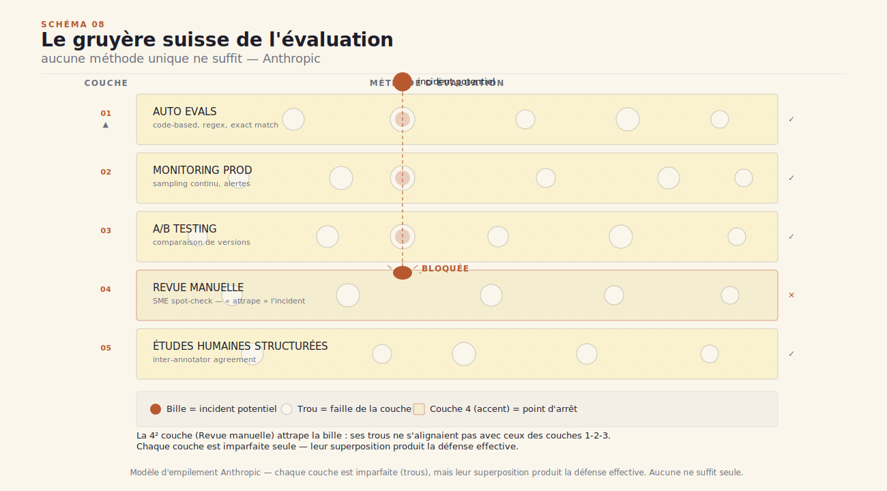

Les cinq couches : **auto evals** (capability et régression evals en continu sur chaque déploiement), **monitoring de production** (les six piliers OTel GenAI en temps réel), **A/B testing** (deux versions comparées sur un segment contrôlé), **revue manuelle** (sampling hebdomadaire pour audit humain), et **études utilisateur** (entretiens périodiques pour détecter les dérives d'usage hors métriques).

Le mécanisme de `graduate` introduit au Pilote s'affine en production : un cas de test passe de capability eval à régression eval dès 90 % de réussite sur 30 itérations consécutives. Ici entre également en jeu la distinction pass@k vs pass^k : pass@k mesure si l'agent réussit *au moins une fois* sur *k* tentatives — utile pour les tâches créatives où une seule bonne réponse suffit. Pass^k mesure si l'agent réussit *k* fois de suite — la métrique qui compte pour les flux client-facing où la consistance est le critère produit. Les confondre conduit à des engagements intenables.

==Le palier N3 franchi, c'est ce qui sauve de la vallée de la mort.== Le palier N3 correspond à l'évaluation continue automatisée — le moment où les capability evals et les régression evals tournent sans intervention humaine sur chaque déploiement, avec alerting automatique sur dégradation. C'est exactement ce que les 70 % de pilotes n'atteignent pas. Le franchir en production, c'est sortir de la zone de risque où une mise à jour silencieuse du modèle provider peut dégrader silencieusement les comportements pendant deux semaines.

#### 3.2.h — Cognitive audit trail

La piste d'audit cognitive n'est plus un log de debug. C'est un enregistrement enrichi : version du modèle, version du prompt, politique d'accès active, score LLM-as-judge si applicable. Le RBAC protège l'accès à ces traces, et chaque consultation est elle-même tracée.

Le pattern Braintrust s'applique : toute trace impliquée dans un incident devient un test case permanent, versionnée dans le golden dataset avec son contexte et la correction apportée. La trace fautive devient une régression eval — garantie que l'agent ne reproduira pas l'erreur.

#### 3.2.i — 6 piliers d'observabilité activés

Les six piliers sont tous actifs. **Usage** : tokens, outils, tours de boucle, coûts par session, flow, tenant. **Performance** : latence de bout en bout, p50/p95/p99, SLA compliance temps réel. **Comportement** : séquences d'outils, déviation par rapport aux patterns de référence. **Qualité** : LLM-as-judge en continu, taux de succès evals. **Gouvernance** : guardrails déclenchés, HITL exercés, approval gates activés. **Drift** : évolution temporelle des distributions — le signal faible qui précède la dérive.

L'échelle N1→N5 définit le palier atteint par pilier : N1 instrumentation de base, N2 signaux structurés et alerting, N3 évaluation continue automatisée, N4 corrélation multi-piliers, N5 auto-remédiation. Le stade Production vise N3 sur tous les piliers — c'est la ligne Plimsoll du système. En dessous, on navigue à vue.

---

### 3.3 — La boucle agentique sous tension

Le premier incident sérieux est arrivé. Ce n'était pas une question de si — seulement de quand. La question opérationnelle est : comment dégrade-t-on proprement ?

La première règle de la dégradation propre est d'avoir décidé les modes de repli en avance. Latence SLA dépassée : cache hit, réponses déjà générées retournées sans appel LLM. Budget à 80 % : routing automatique vers le modèle *low-cost* pour les flows non critiques. Guardrail répété : mode read-only, l'agent répond mais ne déclenche plus d'actions. Rien d'autre ne fonctionne : refus poli avec orientation vers un canal humain identifié.

Ces quatre niveaux doivent être testés avant qu'un incident réel les déclenche. Un drill trimestriel — coupure de modèle simulée, dépassement budgétaire simulé — est la seule façon de vérifier que le runbook tient sous pression.

La discipline du **pass^k** prend tout son sens dans ce contexte. Un agent à 75 % de succès sur une interaction isolée n'a que 42 % de chances de réussir trois interactions consécutives. Si l'agent sert un flux client-facing — une conversation de support, un onboarding, une séquence de prise de décision — la consistance sur la séquence est le critère qui compte, pas la moyenne sur les cas isolés.

> [!pm] **Pour le PM** 🎯
>
> Un agent à 75 % de succès n'a que 42 % de chances de réussir 3 interactions consécutives. C'est pass^k, et c'est la métrique qui compte pour un agent client-facing — pas la moyenne. Visez pass^k > 90 % sur k=3 ; si vous n'y êtes pas, refusez de promettre la consistency. La consistency est un choix produit, pas une émergence.

La philosophie Anthropic s'applique ici intégralement : *aucune méthode unique ne suffit, l'empilement seul produit la défense*. Les incidents sérieux naissent dans les angles morts que personne n'a instrumenté.

---

### 3.4 — Antipattern signature

> [!antipattern] **« ==Le runbook est à jour mais personne ne l'a lu »==**
>
> L'équipe a fait les choses bien. Le runbook existe. Il est sur Confluence. Il a été mis à jour il y a trois semaines suite au dernier post-mortem. Il couvre les cas L2, L3, L4, les modes dégradés, les contacts d'escalade, la procédure de communication de crise.
>
> L'incident arrive à 23h40. L'oncall ouvre Slack, cherche le runbook, ne retrouve pas le lien, improvise. Il relance le flux au lieu de passer en mode read-only — et aggrave l'incident pendant 40 minutes. Le post-mortem révèle que l'oncall n'avait jamais lu le runbook complet, que le lien Confluence n'était pas dans les bookmarks de l'équipe, et que la dernière mise à jour avait modifié la procédure L3 sans notification vers la rotation.
>
> Le problème n'est pas la qualité du runbook. C'est l'absence de pratique. Un runbook qu'on ne lit pas en dehors des incidents ne sera pas lu pendant un incident. La solution est structurelle : **exercises tabletop trimestriels** — l'équipe simule un incident en salle, lit le runbook à voix haute, identifie les étapes ambiguës. **Drills d'incident simulé** — une coupure provoquée en recette teste si les procédures de dégradation se déclenchent comme prévu. **Propriétaire identifié du runbook** avec revue mensuelle et notification vers l'oncall rotation à chaque mise à jour. La pratique fait la différence, pas le document.

---

### 3.5 — Signal de bascule vers Mature

La Production tient. SLA respecté depuis deux mois, budget sous contrôle, incidents gérés avec le runbook. C'est le moment où deux événements se produisent simultanément — ou se profilent à l'horizon.

Un deuxième agent rejoint le premier. Immédiatement, une question surgit : comment communiquent-ils ? La réponse ad hoc — une queue partagée, un endpoint REST — ne tient pas dès que le volume monte. Le premier protocole inter-agents est mis à l'ordre du jour : MCP pour le partage de contexte et d'outils, A2A (Google DeepMind 2025) pour les appels d'agent à agent structurés.

En parallèle, on veut que l'agent *apprenne* — au sens de la mémoire procédurale, le quatrième pilier CoALA. Le mémo épisodique individuel ne suffit plus : deux agents ont besoin d'accéder aux mêmes patterns d'apprentissage. Un *memory pool* partagé est envisagé.

La Production a tenu. Le Mature va apprendre.

## 4. Stade 4 · Mature multi-agents · « ça apprend »

### 4.1 — La scène

L'atelier n'est plus reconnaissable. Quatre agents coopèrent en avant-scène : un *lead* qui planifie, deux *workers* spécialisés qui exécutent en parallèle, un *reviewer* qui valide les sorties avant qu'elles soient transmises. Entre eux, un memory pool partagé — la mémoire collective de l'équipe agentique, structurée et versionnée. En coulisses, les humains sont toujours là, mais leur rôle a basculé.

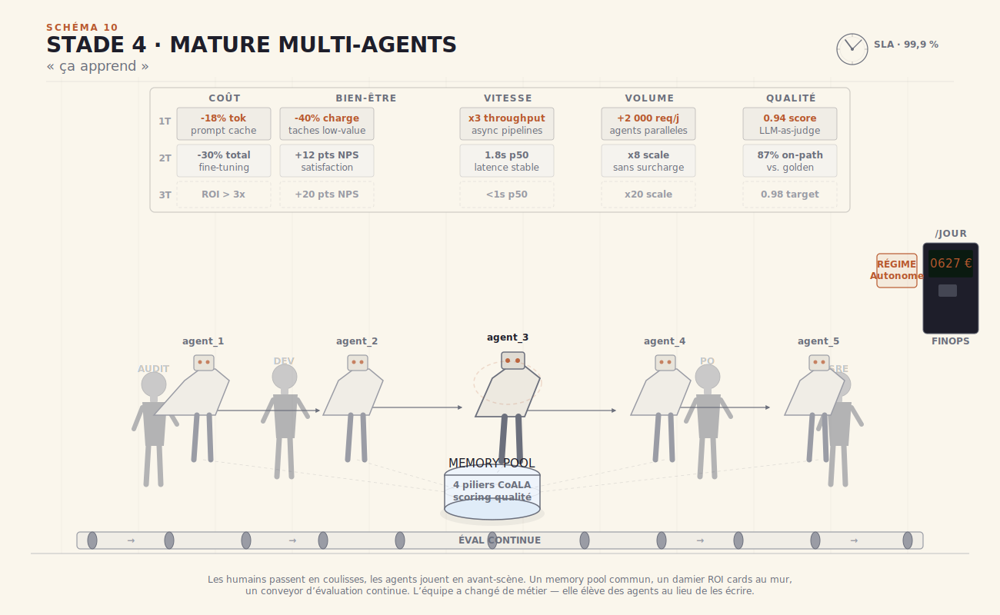

Au stade Prototype, le builder écrivait le prompt. Au stade Pilote, il mesurait les résultats. Au stade Production, il tenait le SLA. Ici, quelque chose d'autre se passe. ==On n'écrit plus l'agent, on l'élève.== Les humains sont passés de praticiens à directeurs : ils conçoivent les conditions dans lesquelles les agents apprennent, ils auditent la mémoire partagée, ils arbitrent les mises à jour du modèle. La valeur ne vient plus du code qu'ils écrivent — elle vient de la qualité des artefacts qu'ils entretiennent et des rituels qu'ils honorent.

Cette inversion est le thème de la section. Elle est difficile à voir de l'intérieur, parce qu'elle ressemble à une perte de contrôle. Ce n'en est pas une. C'est un changement de niveau : on quitte la maîtrise artisanale du geste pour exercer la maîtrise stratégique du système. L'équipe qui comprend ce basculement prospère. L'équipe qui résiste et continue d'écrire manuellement ce que les agents devraient apprendre automatiquement plafonne — et finit par réécrire les mêmes correctifs à chaque sprint.

---

### 4.2 — Artefacts qui fusionnent

Au stade Mature, les artefacts ne naissent plus séparément. Ils forment un système : la mémoire informe l'éval, l'éval informe le modèle, le modèle informe la mémoire. Six sous-systèmes se consolident.

#### 4.2.a — Mémoire CoALA complète

Les quatre piliers CoALA sont maintenant tous actifs — et, pour la première fois, ils sont partagés entre agents.

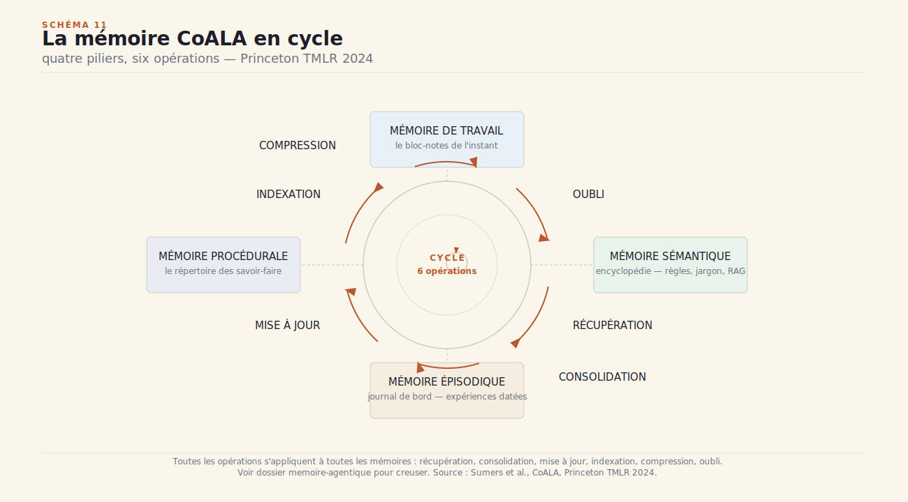

Le cycle complet comporte six opérations. **Récupération** : au début de chaque boucle TAOR, l'agent interroge le memory pool pour charger ce qui est pertinent à la tâche en cours — fragments sémantiques, épisodes passés, règles procédurales. **Consolidation** : les apprentissages de la session sont stabilisés et intégrés dans le pool avant la fermeture du contexte. **Mise à jour** : une entrée mémoire existante est révisée quand une nouvelle interaction contredit ou affine ce qu'elle contenait. **Indexation** : la nouvelle entrée est vectorisée et rendue retrouvable par les agents qui n'ont pas participé à la session source. **Compression** : les entrées redondantes sont fusionnées, les détails de bas niveau sont résumés, le signal utile est préservé. **Oubli** : les entrées dont le TTL (*time-to-live*) est expiré ou dont le score qualité est insuffisant sont archivées ou supprimées.

Le saut conceptuel du stade Mature, c'est que ce pool est partagé. Un worker peut lire ce qu'un autre worker a appris. Le lead agrège. Le reviewer lit les épisodes d'incidents passés avant de valider une sortie à risque. Cette mémoire collective est la principale source d'accélération — et la principale surface d'attaque.

Un score qualité est attribué à chaque entrée mémoire : *qui peut écrire ?* (droits d'écriture par type d'agent et par niveau de confiance), *qui peut lire ?* (droits de lecture par sensibilité des données), *quel TTL ?* (durée de vie selon la volatilité de l'information). Sans ce scoring, la mémoire se remplit de bruit, et les agents lisent et amplifient des informations périmées ou incorrectes.

C'est ici qu'entre en jeu le memory poisoning (MITRE ATLAS AML.T0080) : la mémoire partagée est aussi une surface d'attaque. Un agent compromis peut écrire dans le pool des informations délibérément fausses ou biaisées, qui seront lues et amplifiées par les autres agents à chaque cycle suivant. Les patterns de mitigation sont indissociables de l'architecture : journalisation de chaque écriture avec l'identité de l'agent source, validation à l'écriture (un schéma de contenu + un score de plausibilité), et audit à la lecture (détection de patterns inhabituels dans les entrées récemment consultées).

#### 4.2.b — Pipeline de mise à jour

Le stade Mature distingue trois flux d'évolution qui étaient confondus aux stades précédents. Le **prompt update** est le plus rapide : une modification du prompt système peut être déployée en quelques heures, validée par un subset du golden dataset, et rollbackée en une opération de registre. C'est le flux daily. La **memory update** est continue et automatique : les consolidations, indexations et oublis tournent en permanence selon les règles du scoring qualité. Pas de déploiement humain — un pipeline. La **model update** est le flux le plus lent et le plus coûteux : mensuel ou trimestriel, il passe par un full eval gate — toutes les couches du gruyère suisse sur la version candidate avant que le routeur bascule le trafic. Une mise à jour de modèle sans full eval gate est le chemin le plus direct vers une régression silencieuse à grande échelle.

Ces trois flux sont **versionnés séparément**. Le prompt a son propre hash dans le registre. La mémoire a un snapshot daté. Le modèle a un identifiant de version explicite dans chaque trace OTel. Cette séparation rend les post-mortems lisibles : quand un incident survient, on sait immédiatement lequel des trois flux a changé dans les 48 heures précédentes. L'A/B continu entre versions de prompt et de mémoire devient possible sans ambiguïté. Et quand le RGPD exige la suppression d'une donnée personnelle, le machine unlearning peut opérer sur la mémoire et le modèle fine-tuné indépendamment, sans dépublier le prompt.

#### 4.2.c — Évaluation adverse intégrée

Les tests adversariaux ne sont plus une activité ponctuelle de red team. Ils tournent en continu dans le pipeline d'éval.

Trois catégories. Les **tasks adversarial deliberate** : jailbreaks intentionnels conçus pour forcer l'agent à ignorer ses guardrails, edge cases de politique (instructions contradictoires, permissions ambiguës), et contraintes contradictoires (deux règles du prompt système qui s'excluent mutuellement sur un cas limite). La **simulation user dual-control** (τ²-bench) : l'utilisateur simulé a lui aussi des outils et peut être stratégique — il peut tenter de manipuler l'agent sur plusieurs tours, d'exploiter une incohérence entre deux réponses successives, ou de pousser l'agent vers une décision que ses guardrails sont censés bloquer. La **simulation agent** : l'agent simulé fait face à un autre agent potentiellement adversarial — test des protocoles inter-agents dans un scénario de compromission partielle.

Ces tests ne sont plus optionnels au stade Mature. Ils tournent sur chaque déploiement de modèle et sur chaque mise à jour majeure de prompt. Leur résultat est une colonne supplémentaire dans le tableau de bord d'éval : *taux de résistance adverse*. Un agent dont le taux de résistance descend sous 92 % sur les jailbreaks répertoriés ne passe pas le full eval gate.

#### 4.2.d — Protocoles inter-agents

Trois protocoles structurent la coopération au stade Mature. **MCP** — Model Context Protocol — est le side-channel pour l'accès aux ressources externes : un agent expose ses outils et son contexte via un serveur MCP, les autres agents le consultent sans coupling fort. **A2A** — Agent-to-Agent — est la négociation directe entre agents : un agent annonce ses capacités via son Agent Card descriptor, un autre agent l'interroge et route une tâche vers lui selon le meilleur match de compétences. **AG-UI** — Agent-to-UI — est le stream vers l'utilisateur : l'agent envoie des événements structurés au frontend, qui les rend progressivement sans attendre la fin du traitement.

> [!builder] **Pour le builder** 🔧
>
> Convention file-based handoff : chaque agent lit/écrit un répertoire `state/` partagé avec des fichiers typés (`task.yaml`, `progress.jsonl`, `output.md`). MCP = side-channel pour ressources externes. A2A = négociation directe via Agent Card. AG-UI = stream vers l'utilisateur. Évitez de tout faire passer par MCP : le file-based handoff est plus robuste pour les multi-agents internes. Chaque échange via `state/` est journalisé automatiquement et typé — ce qui en fait un artefact d'audit natif, sans effort supplémentaire.

L'Agent Card descriptor est le concept unificateur. Chaque agent du registre publie une carte qui décrit ses capacités (quelles tâches il sait traiter), ses contraintes (données auxquelles il peut accéder, actions qu'il peut déclencher), et ses interfaces (MCP, A2A, AG-UI). La capability discovery inter-agents devient une opération de lecture de registre, pas une connaissance encodée en dur dans le prompt. Chaque interaction inter-agents est typée, journalisée, auditable — les trois qualités qu'un système distribué doit apporter nativement pour que les post-mortems soient possibles.

#### 4.2.e — Mode d'exécution à l'échelle

Le stade Mature pose la question du runtime d'une façon que les stades précédents ne posaient pas. Au Prototype, on choisissait un modèle. En Production, on choisissait un provider. Au Mature, le choix se déplace : ce n'est plus *quel modèle ?* mais *quel runtime ?*

Deux familles s'opposent. **Self-host** (PyTorch/vLLM sur vos propres GPU) : contrôle total, souveraineté des données, OPEX prévisibles, fine-tuning possible. En contrepartie : ops complexes — 24/7 GPU monitoring, garbage collection des contextes, dépendance à un binôme MLOps interne capable de maintenir la stack. **Managed** (Claude Managed Agents, AgentCore d'AWS, Vertex Agent Engine de Google, Azure Foundry Service) : déploiement rapide, SLA portés par le fournisseur, scaling automatique. En contrepartie : lock-in fournisseur, facture variable selon le trafic, moins de contrôle sur les mises à jour du modèle sous-jacent.

> [!decideur] **Pour le décideur** 🧭
>
> Self-host (PyTorch/vLLM sur vos GPU) : contrôle total, souveraineté, OPEX prévisibles, mais ops complexes (24/7 GPU monitoring, garbage collection, dépendance à un binôme MLOps interne). Managed (Claude Managed Agents, AgentCore, etc.) : déploiement rapide, SLA portés, mais lock-in et facture variable. Le critère : si l'agent porte > 50 % de votre marge produit, self-host. En-dessous : managed. Pour creuser l'arbitrage TCO sur les différents providers, voir le dossier [*économie de l'inférence*](../economie-inference/).

L'arbitrage se joue sur deux axes : la criticité de l'agent (quel est l'impact d'une indisponibilité de 4 heures ?) et la part de valeur qu'il génère (est-ce qu'il porte le flux de revenus principal ou un use case secondaire ?). Ces deux questions permettent de construire une matrice simple. Un agent non-critique sur un use case secondaire va naturellement en managed. Un agent critique qui porte le flux de revenus central mérite l'investissement self-host, avec toute la complexité opérationnelle que cela implique.

#### 4.2.f — ROI cards mûres

Au stade Prototype, le ROI était intuitif. Au stade Pilote, il était estimé. Au stade Production, il était mesuré. Au stade Mature, il est *structuré*.

La grille de référence s'organise en 5 axes × 3 temporalités = **15 ROI cards**. Les cinq axes : **Coût** (réduction des coûts directs d'opération), **Bien-être** (charge cognitive réduite, tâches répétitives déléguées), **Vitesse** (time-to-output réduit), **Volume** (capacité de traitement augmentée), **Qualité** (taux d'erreur réduit, satisfaction client améliorée). Les trois temporalités : **Quick wins** (premier trimestre, impact mesurable sous 90 jours), **Medium** (deuxième trimestre, gains en croissance), **Strategic** (troisième trimestre et au-delà, avantage compétitif durable).

Huit méthodes de calcul couvrent les cas : Cost Reduction (dépenses évitées), Cost Avoidance (coûts futurs prévenus), Productivity Gains (heures économisées × coût horaire), Revenue Increase (revenus additionnels attribuables), Time-to-Market (accélération du cycle produit), NPV (valeur actuelle nette sur 3 ans), Payback Period (temps de retour sur investissement), TEI (Total Economic Impact — méthode Forrester). La distinction centrale s'appelle Hard savings vs Soft savings (Cigref) : les Hard savings sont les économies directement comptabilisables dans les comptes — une ligne de coût qui disparaît ou diminue. Les Soft savings sont les gains qui existent réellement mais ne descendent pas automatiquement dans les comptes — du temps économisé qui reste dans le même budget, une productivité améliorée dont le bénéfice n'est pas réalloué.

**Une ROI card sans réallocation effective documentée n'est qu'un fichier Excel.** Pour creuser les 15 cards et les 8 méthodes de calcul, voir le dossier [*measure-roi*](../measure-roi/).

---

### 4.3 — Impact équipe

Le passage au stade Mature cristallise une tension que les équipes préfèrent souvent ne pas regarder en face. Les agents font du travail. Ce travail était fait par des humains. Qu'est-ce qui change pour ces humains ?

La réallocation du temps gagné (Cigref) est la **condition sine qua non** pour que le ROI quitte le domaine des Soft savings. ==Le temps gagné qu'on ne réalloue pas est un temps perdu.== Concrètement : si l'agent économise 4 heures par semaine sur le traitement des tickets de support, ces 4 heures doivent être explicitement réaffectées — à de la formation continue, à de la discovery produit, à du coaching client, à de la revue de la mémoire agentique. Sans cette ligne dans le reporting, le gain existe en théorie, disparaît en pratique, et ne tient pas un audit Cigref.

L'Anthropic Economic Index (2025) documente le split le plus précis disponible à date : 52 % des cas d'usage agentiques s'apparentent à de l'**augmentation** — l'humain garde le contrôle de la tâche, l'agent accélère ou améliore l'exécution. 45 % s'apparentent à de l'**automatisation** — l'agent prend en charge la tâche en autonomie, l'humain en supervise les sorties sans les produire. La proportion varie selon les secteurs et les fonctions ; la tendance générale va vers l'automatisation au fur et à mesure que les agents accumulent de la mémoire procédurale et que les workflows s'industrialisent.

Ce que ce split ne dit pas, c'est *qui décide* de quelle catégorie relève chaque usage. L'impact réel dépend exactement de ça. Une équipe qui choisit délibérément de garder l'humain dans la boucle sur les décisions à fort enjeu — et de confier aux agents uniquement les tâches à faible enjeu et haute fréquence — extrait la valeur de l'augmentation sans exposer l'organisation aux risques de l'automatisation non gouvernée.

La **pause d'Engels** est le scénario à éviter — non par fatalité, mais par choix. La révolution industrielle a produit une période de 50 à 70 ans pendant laquelle la productivité augmentait mais les salaires réels stagnaient, parce que les gains n'étaient pas distribués. Daron Acemoglu (MIT) propose six leviers pour éviter que l'IA reproduise ce scénario : redirection technologique vers des tâches complémentaires aux humains plutôt que substitutrices ; formation continue finançée par les employeurs ; sécurisation des transitions professionnelles ; partage des gains de productivité via les salaires et la fiscalité ; gouvernance des grandes plateformes IA ; revitalisation des territoires impactés. Ces six leviers ne sont pas des recommandations de politique publique lointaines — ils commencent dans les décisions de chaque équipe sur la réallocation du temps gagné. Pour les chiffres détaillés et les projections sectorielles, voir le dossier [*ia-et-travail*](../ia-et-travail/).

> [!pm] **Pour le PM** 🎯
>
> Le temps que vous gagnez avec un agent n'a aucune valeur tant qu'il n'est pas réalloué. La réallocation est explicite : *« voici les 4h/semaine économisées sur le ticket de support · voici l'usage que l'équipe en fait : formation continue / discovery produit / coaching client »*. Sans cette ligne, votre gain est une *Soft saving* qui ne tient pas un audit Cigref.

---

### 4.4 — Antipattern signature

> [!antipattern] **« Les agents écrivent leur mémoire mais ne la lisent jamais »**
>
> Le memory pool se remplit. Les consolidations tournent. Les entrées sont indexées, scorées, archivées selon les règles. Tout fonctionne côté écriture.
>
> Et pourtant, les agents continuent de répéter les mêmes erreurs. La même confusion sur un cas limite documenté depuis trois semaines dans la mémoire sémantique. La même mauvaise interprétation d'un format d'entrée que la mémoire épisodique a enregistrée neuf fois. Le memory pool grossit ; les comportements ne changent pas.
>
> La cause est architecturale : la **lecture mémoire n'est pas dans la boucle TAOR par défaut**. Elle est conditionnelle — déclenchée uniquement si la tâche dépasse un score de complexité, ou uniquement pour certains types d'agents, ou uniquement si le champ `memory_lookup` du task.yaml est à `true`. Cette conditionnalité semblait raisonnable à la conception : éviter le surcoût de latence d'un retrieval systématique. En pratique, elle produit un memory pool mort — un entrepôt auquel personne ne rend visite.
>
> Le remède est simple et non négociable : un **retrieval automatique en début de chaque cycle TAOR**, sans condition. La latence supplémentaire est absorbable (50 à 200 ms sur un retrieval vectoriel bien dimensionné) ; le gain comportemental est immédiat. En parallèle, le `memory_hit_rate` — proportion des tours de boucle où au moins une entrée mémoire a influencé la réponse — devient un **KPI N3 obligatoire** dans le tableau de bord d'observabilité. Un `memory_hit_rate` < 20 % sur un agent mature est le signal que la lecture mémoire est cassée ou conditionnelle. Il ne se corrige pas en itérant sur le contenu du pool — il se corrige en ouvrant le code de la boucle.

## 5. Clôture

### 5.1 — Récapitulatif : dix artefacts × quatre stades

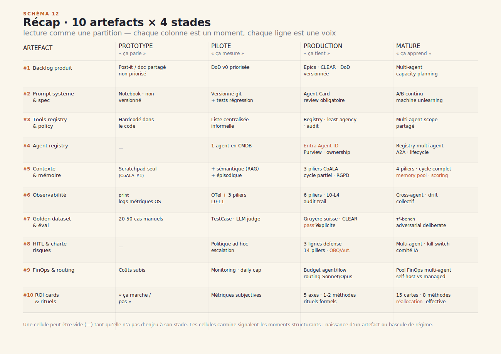

Le tableau rejoue tout le rapport en une page. Chaque colonne est un moment — Prototype, Pilote, Production, Mature —, chaque ligne est une voix. La lecture fonctionne comme une partition : on lit la trajectoire d'une équipe en regardant où elle sature chaque colonne.

Cinq cellules sont surlignées en carmine : les ==cellules-pivots==, points de basculement qu'une équipe rate le plus souvent parce qu'ils sont à la frontière entre deux stades.

**Entra Agent ID** : l'identité machine rend un agent auditable, révocable, traçable. Tant qu'un agent tourne sous les credentials d'un utilisateur humain, il n'y a pas de gouvernance possible — seulement de l'illusion. **Memory pool** : sa présence dans le registre ne garantit rien ; ce qui compte, c'est le `memory_hit_rate` — si la lecture mémoire est conditionnelle, le pool est mort. **Pass^k** : la métrique qui bascule l'évaluation du qualitatif au quantitatif ; sans elle, on navigue à l'instinct. **OBO vs. Autonome** : un choix de régime d'autorisation qui n'est pas réversible à bas coût — une décision d'architecture de gouvernance, pas une case à cocher. **Réallocation** : l'artefact final, non technique — RH, organisationnel, politique. Son absence dans une fabrique mature signifie que l'équipe a livré des agents sans traiter ce qui change pour les humains autour.

---

### 5.2 — Trois questions à se poser

#### Pour le PM

> *« Quel est le signal de bascule qui me dit que je suis prêt pour le stade suivant ? »*

Si vous attendez que « tout le monde soit d'accord », vous resterez bloqué. Le signal de bascule est externe, pas interne : un SLA promis, un audit demandé par le RSSI, un deuxième agent à intégrer dans la plateforme. Ces événements extérieurs créent une contrainte dure — le genre qui force un saut de stade que la bonne volonté interne n'aurait pas produit.

Si vous ne savez pas répondre à cette question, vous n'êtes pas à un stade — vous êtes entre deux. L'entre-deux est le lieu où les pilotes meurent.

---

#### Pour le builder

> *« Quel est l'artefact load-bearing que je n'ai pas encore, et qui me fait perdre des heures ? »*

Load-bearing : sans lui, le harness vacille. Un golden dataset qui ne couvre pas vos edge cases n'est pas load-bearing — c'est un gadget rassurant. Un registre d'agents non synchronisé avec le pipeline de déploiement n'est pas load-bearing — c'est une documentation qui ment.

==Le signal opérationnel : si vous passez quatre heures par semaine à débugger le même type de problème, l'artefact qui l'aurait détecté en trente secondes n'est pas encore là.== Identifiez-le. Construisez-le la semaine suivante — pas une nouvelle feature. L'artefact load-bearing manquant.

---

#### Pour le décideur

> *« Si je choisis le régime OBO maintenant, quand devrai-je migrer vers Autonome — et à quel coût ? »*

Migration OBO → Autonome n'est pas un upgrade de subscription. C'est un re-design de gouvernance : nouvelles identités machine, nouveaux périmètres de permissions, validation sécurité complète. Le surcoût est de 13 à 23 points de budget projet, sur six à douze mois de plomberie.

Deux positions cohérentes existent. Si vous savez que votre cas d'usage ira en Autonome dans dix-huit mois, OBO peut être une perte de temps — construisez l'architecture cible directement. Si vous savez que vous n'y arriverez jamais, OBO est l'optimum. ==Ce qui est inacceptable, c'est de choisir OBO par défaut sans avoir posé la question.==

---

### 5.3 — Coda

« Le travail n'est pas un destin technologique. » La phrase est d'Acemoglu et Johnson, dans *Power and Progress* : la direction que prend une vague technologique dépend de choix politiques, fiscaux, institutionnels — pas de la technologie elle-même.

La fabrique d'un agent n'est pas qu'un atelier technique. C'est une fabrique d'équipe, et donc une fabrique de société. La pause d'Engels — ce demi-siècle entre 1790 et 1840 où la productivité industrielle montait sans que les salaires suivent — n'était pas une fatalité. C'était le résultat de choix qui n'avaient pas encore été contestés.

Nous sommes au début d'une pause analogue. Les agents augmentent la productivité des équipes qui savent les construire. La question de la distribution de ce gain — vers qui vont les heures libérées, qui décide de l'artefact de réallocation — n'est pas technique. C'est une conquête institutionnelle, au sens exact d'Acemoglu.

Tenir cette boucle ouverte, faire que les dix artefacts de la fabrique soient aussi ceux d'une distribution juste : c'est notre vrai chantier des trois à cinq ans qui viennent.

==Quatre stades. Dix artefacts. Une équipe qui apprend. Le reste — c'est de la politique.==

---

*Format co-écrit avec l'aide d'une IA.*

## Annexe A — Glossaire

*À écrire dans T22.*

## Annexe B — Voir aussi

*À écrire dans T22.*

## Annexe C — Sources

*À écrire dans T22.*

---

*Format co-écrit avec l'aide d'une IA.*
