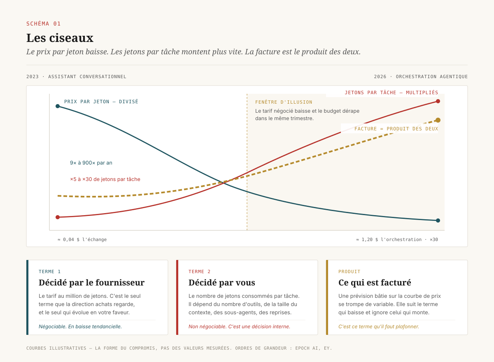
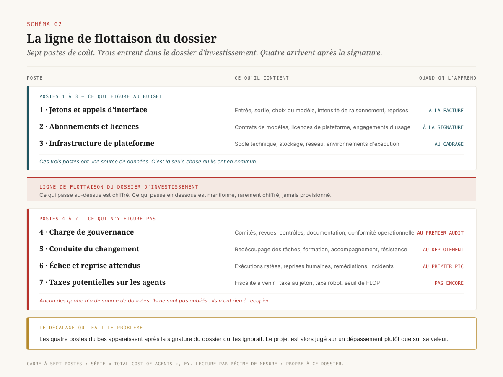
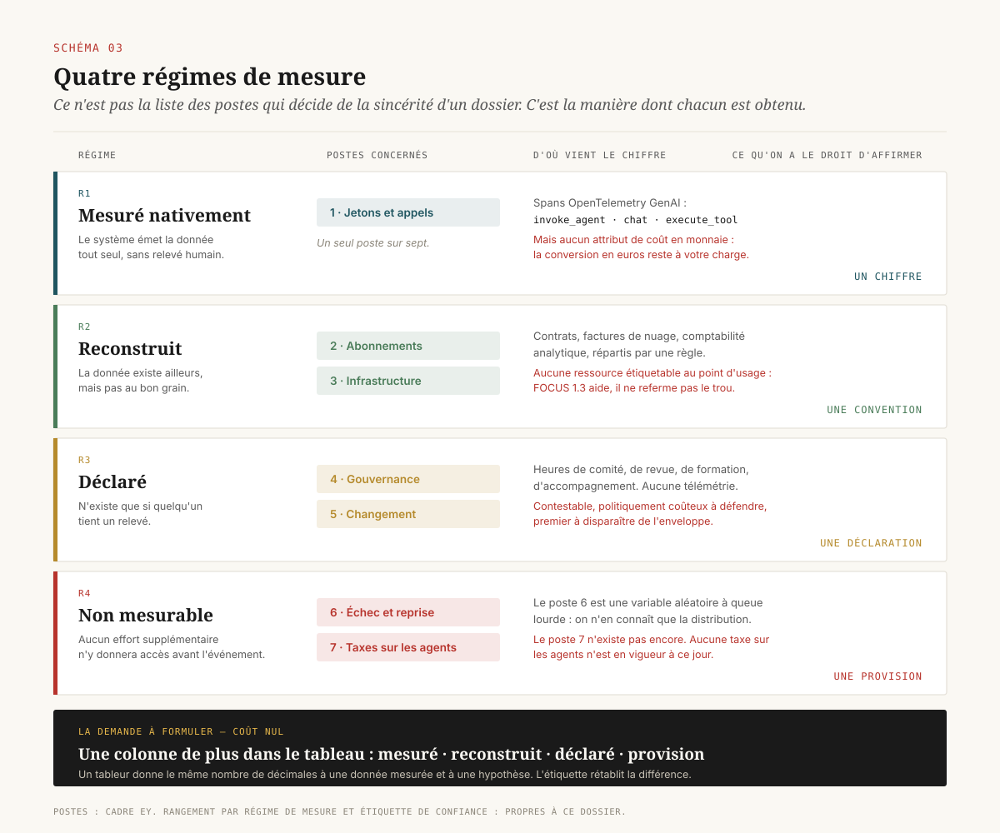
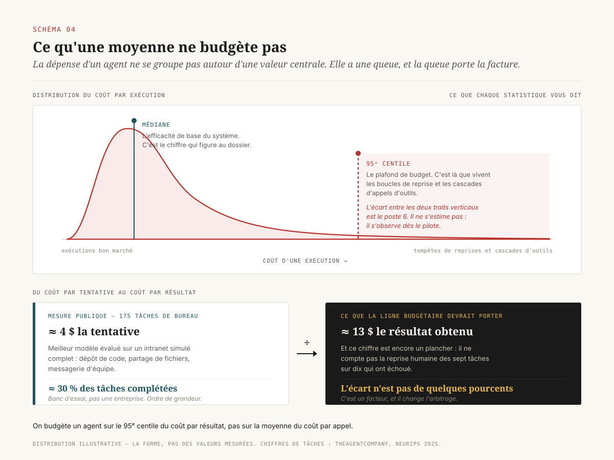
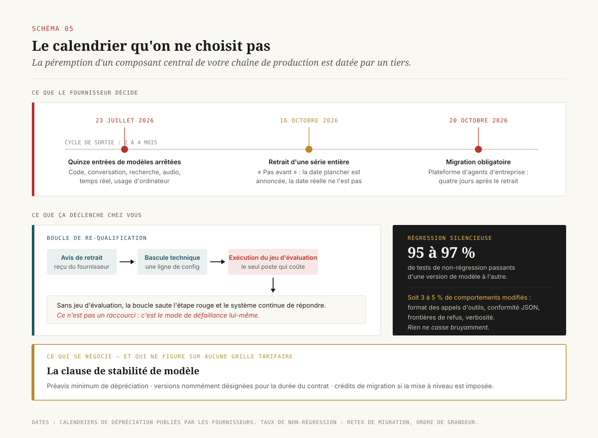
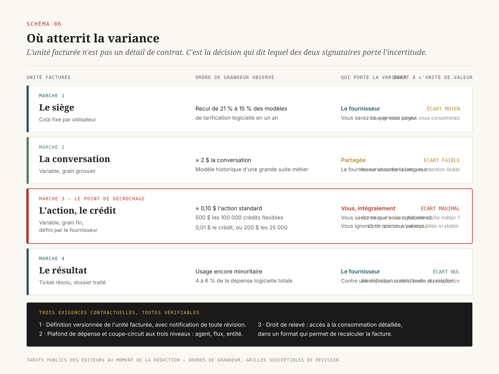

# La facture d'un agent

> **Les sept postes de coût d'un agent ne sont pas cachés parce que personne ne les a listés : ils sont cachés parce qu'un seul est instrumenté.** — 26 août 2026, Mathieu Guglielmino

Il existe désormais un cadre public et sérieux pour décomposer ce que coûte un agent en production. Il tient en sept postes, il circule, il est cité en comité. Et il ne suffit pas.

Parce qu'entre « ce poste existe » et « voici son chiffre », il y a une opération que personne ne documente : **la mesure**. Le poste des jetons, une plateforme le compte pour vous. La charge de gouvernance, personne ne la compte : elle n'apparaît que si quelqu'un tient un relevé, et ce relevé est le premier à disparaître quand il faut faire tenir le dossier d'investissement. Le poste de l'échec et de la reprise n'est pas un chiffre du tout : c'est une variable aléatoire à queue lourde dont on ne connaît la valeur qu'après.

Ce dossier ne propose pas un huitième poste. Il propose de ranger les sept existants par **régime de mesure**, et de tirer la conséquence : un dossier d'investissement qui présente les sept postes avec la même apparence de précision ment sur quatre d'entre eux. La décision de direction porte ailleurs : de quel poste connaissez-vous le chiffre, et de quel poste connaissez-vous seulement l'intention.

---

## 1. Le paradoxe de la facture

Deux faits se contredisent en apparence.

Le premier : le prix de l'inférence s'effondre. À performance constante, le prix par jeton baisse d'un facteur qui se compte en ordres de grandeur par an : l'analyse d'Epoch AI sur les jalons de performance des modèles de pointe situe la baisse entre **9× et 900× par an** selon le palier de capacité considéré[^8]. Gartner prolonge la courbe et annonce que réaliser l'inférence sur un modèle à mille milliards de paramètres coûtera aux fournisseurs **plus de 90 % de moins en 2030 qu'en 2025**[^4].

Le second : la facture monte. Chez les organisations qui sont passées d'un assistant conversationnel à un dispositif agentique, la dépense d'IA augmente pendant que le prix unitaire baisse.

Il n'y a pas de contradiction. Il y a un produit de deux termes dont un seul est regardé. Le montant facturé, c'est le prix par jeton **multiplié par** le nombre de jetons consommés par tâche. Le premier terme est décidé par le fournisseur et il baisse. Le second est décidé par votre architecture et il monte beaucoup plus vite.

L'ordre de grandeur le plus cité vient de la série *Total Cost of Agents* d'EY : un échange conversationnel coûtait de l'ordre de **0,04 $ en 2023** ; la même intention, servie en 2026 par une orchestration qui appelle des outils, planifie, délègue à des sous-agents, réessaie et affine, coûte de l'ordre de **1,20 $**, soit environ trente fois plus, à périmètre de tâche apparemment constant[^1]. La lecture qu'en fait EY est la bonne : ce n'est pas le même travail. La comparaison oppose deux architectures de flux et non deux tarifs.

==La baisse du prix unitaire n'est donc pas une bonne nouvelle budgétaire : c'est le moteur de l'expansion d'usage qui fait monter la facture.== Elle rend économiquement acceptable une architecture qui consomme cinq à trente fois plus de jetons par tâche, et cette architecture s'installe précisément parce que le jeton est devenu bon marché.

La conséquence pour une direction est immédiate et rarement tirée. **Toute prévision de budget construite sur la courbe de prix se trompe de variable.** La variable à instrumenter, à plafonner et à faire figurer dans le dossier est le nombre de jetons par tâche, et elle relève d'une décision d'ingénierie interne plutôt que d'une négociation fournisseur.

## 2. Le cadre à sept postes, et où il s'arrête

Le cadre le plus proche de ce qu'un décideur peut utiliser est celui d'EY. Il range le coût d'un agent en sept postes[^1] :

1. **Jetons et appels d'interface** : volume d'entrée et de sortie, choix du modèle, intensité de raisonnement, reprises.
2. **Abonnements et licences** : les engagements fixes pris *avant* qu'un agent ne s'exécute : contrats fournisseurs de modèles, licences de plateformes d'orchestration, engagements d'usage auprès des fournisseurs de nuage.
3. **Infrastructure de plateforme** : le socle technique porté par le déployeur.
4. **Charge de gouvernance** : comités, revues, contrôles, documentation, conformité opérationnelle.
5. **Conduite du changement** : redécoupage des tâches, formation, accompagnement, résistance.
6. **Échec et reprise attendus** : le coût des exécutions ratées, des reprises humaines et des remédiations.
7. **Taxes potentielles sur les agents** : la fiscalité à venir, encore hypothétique.

EY représente ces postes dans une figure en losange qui sépare **ce qui figure habituellement au budget** (postes 1 à 3) de **ce qui n'y figure pas** (postes 4 à 7), avec quatre colonnes de lecture : où le coût se cache, comment il se déplace, quand on l'apprend, qui en porte le budget[^1]. Le volet australien de la même série ajoute le versant opératoire : coupe-circuits explicites (plafonds de dépense, plafonds de volume d'appels, coupure automatique aux trois niveaux agent, flux et entité), étalonnage par tâche ou par résultat, et un rôle dédié à l'économie des agents[^2].

C'est un bon cadre. Il est descriptif, honnête sur ses limites, et il nomme correctement le phénomène : les postes 4 à 7 **émergent plus tard dans le cycle de vie**, quand le dossier d'investissement est déjà signé.

Ce qu'il ne fait pas, c'est expliquer pourquoi ils émergent plus tard. L'explication tenue par ce dossier n'est pas psychologique. **Quatre de ces sept postes n'ont pas de source de données.** Ils ne sont pas absents du budget parce qu'on les a oubliés ; ils sont absents parce qu'au moment de remplir la case, il n'y a rien à recopier.

## 3. Quatre régimes de mesure

Voici la reformulation que ce dossier propose. Chaque poste de coût appartient à l'un de quatre **régimes de mesure**, et le régime détermine ce qu'on a le droit d'affirmer sur le chiffre.

### R1 · Mesuré nativement

Le poste existe comme donnée émise par le système lui-même, sans intervention humaine. Un seul poste y est : les jetons et les appels. Et encore, partiellement.

Les conventions sémantiques GenAI d'OpenTelemetry, portées depuis avril 2024 par un groupe de travail dédié, définissent un arbre de spans pour une exécution agentique : un span racine `invoke_agent`, des spans `chat` pour chaque appel de modèle, des spans `execute_tool` pour chaque invocation d'outil, avec les attributs `gen_ai.request.model`, `gen_ai.usage.input_tokens` et `gen_ai.usage.output_tokens`[^5]. C'est la bonne granularité, celle qui permet enfin d'attribuer une dépense à une tâche métier plutôt qu'à un compte de facturation.

Deux réserves, toutes deux structurantes.

D'abord, l'état de stabilisation. En 2026, l'essentiel de ces conventions reste au statut **expérimental** : les attributs de conversation et d'embarquement sont assez stables pour bâtir des tableaux de bord de production, mais les conventions d'agent et d'orchestration d'outils sont encore en train de se fixer[^5]. Instrumenter aujourd'hui, c'est accepter de réinstrumenter.

Ensuite, et c'est le point le plus rarement relevé, **il n'existe pas d'attribut de coût en monnaie**. La convention émet des jetons, pas des euros. La conversion est un calcul que porte le déployeur, avec une table de prix par modèle et par mode de facturation qu'il doit maintenir lui-même, et que le fournisseur révise sans le prévenir. ==Le seul poste réellement instrumenté d'une facture agentique est instrumenté dans une unité qui n'est pas celle de la facture.==

### R2 · Reconstructible par recoupement

Les postes 2 et 3 : abonnements, licences, infrastructure de plateforme. Ces coûts existent bel et bien dans le système d'information : ils sont dans des contrats, dans des factures de nuage, dans des lignes de comptabilité analytique. Le problème porte sur leur **grain**, non sur leur existence.

La difficulté est reconnue par la discipline qui s'en occupe. La FinOps Foundation a formalisé une catégorie *FinOps for AI*, mise à jour au 17 février 2026, précisément parce que la dépense d'IA a des propriétés structurelles que la répartition de coûts en nuage classique ne sait pas traiter : coût par appel non déterministe, absence de ressource étiquetable au point d'usage, consommation qui ne se projette pas proprement sur des environnements ou des comptes[^6]. La version 1.3 de la spécification FOCUS, ratifiée le 4 décembre 2025, ajoute la répartition des coûts partagés et referme le trou des grappes de calcul mutualisées[^6].

Le progrès est réel, la limite reste : on **reconstruit** ces postes par des règles de répartition. Une règle de répartition est une convention, pas une mesure. Elle est défendable, discutable, et elle change quand quelqu'un décide qu'elle change.

### R3 · Fabriqué à la main

Les postes 4 et 5 : charge de gouvernance et conduite du changement. Aucune télémétrie ne les produit. Ils n'existent que si une personne tient un relevé : heures de comité, heures de revue, heures de formation, heures d'accompagnement.

Ce sont des budgets **déclarés**. Ils ont trois propriétés qu'un décideur doit connaître. Ils sont contestables, parce que rien ne les objective. Ils sont politiquement coûteux à défendre, parce qu'ils financent du temps humain sur un projet vendu comme économisant du temps humain. Et ils sont, dans l'ordre d'arbitrage, ==les premiers à disparaître quand il faut faire tenir le dossier d'investissement dans l'enveloppe==.

### R4 · Structurellement non mesurable avant l'événement

Les postes 6 et 7.

Le poste 6, l'échec et la reprise, n'est pas un chiffre inconnu qu'on pourrait connaître avec plus d'effort. C'est une **variable aléatoire**, dont la distribution est fortement asymétrique, et dont on ne connaît la réalisation qu'après coup. C'est l'objet de la section suivante.

Le poste 7, les taxes, n'existe pas encore. À la date de ce dossier, aucune administration fiscale n'a instauré de prélèvement sur les agents. Les propositions circulent et méritent d'être suivies : taxe au jeton assise sur le coût facturé par le fournisseur (techniquement la plus simple, puisque les jetons sont déjà comptés et facturés), taxe robot indexée sur les recettes fiscales du poste de travail remplacé, régulation par seuil de FLOP déjà présente dans le règlement européen sur l'IA comme approximation de la capacité d'un modèle[^14]. Aucune n'est en vigueur. Le poste 7 est une provision pour incertitude réglementaire, et il doit être présenté comme tel.

### La règle qui en découle

==Un dossier d'investissement qui présente les sept postes avec la même apparence de précision ment sur quatre d'entre eux.== Non par malhonnêteté, mais par uniformité de présentation : un tableur donne le même nombre de décimales à une donnée mesurée et à une hypothèse.

La demande à formuler est donc simple et gratuite : **une étiquette de confiance par poste**. Mesuré, recoupé, déclaré, non mesurable. Quatre mots dans une colonne supplémentaire, et le dossier cesse de mentir.

## 4. La queue lourde : pourquoi une moyenne ne budgète rien

Le poste 6 mérite un traitement à part, parce qu'il concentre l'essentiel de l'écart entre le budget prévu et la facture reçue.

La consommation de jetons d'un système agentique n'est pas distribuée normalement. Elle est fortement asymétrique à droite : la plupart des exécutions sont bon marché, et une longue queue d'exécutions coûteuses porte une part disproportionnée de la dépense. La raison est mécanique : dans un agent, le chemin d'exécution lui-même est stochastique. Le nombre d'appels de modèle, le nombre d'appels d'outils, la taille du contexte accumulé et le nombre de reprises sont tous variables, et leur composition produit une distribution à queue épaisse.

Une prévision fondée sur un coût moyen par appel suppose que les coûts se groupent autour d'une valeur centrale prévisible. Les systèmes agentiques violent cette hypothèse à chaque niveau. **La médiane dit l'efficacité de base ; c'est le 95ᵉ centile qui dit où vivent les tempêtes de reprises et les cascades d'appels d'outils**, et c'est donc le 95ᵉ centile qui doit servir de plafond de budget.

### Le coût par tentative n'est pas le coût par résultat

L'ancrage chiffré le plus utile vient d'une mesure publique et reproductible plutôt que d'un retex commercial. *TheAgentCompany*, produit par l'équipe de Graham Neubig à Carnegie Mellon et publié à NeurIPS 2025, fait tourner des agents sur **175 tâches de bureau réalistes** dans un intranet simulé complet (dépôt de code, partage de fichiers, messagerie d'équipe)[^7]. Les tâches sont longues, multi-outils, et ressemblent au travail que les dossiers d'investissement promettent d'automatiser.

Les résultats mesurés donnent l'ordre de grandeur qui manque partout ailleurs : le meilleur modèle évalué complète environ **30 % des tâches, à environ 4 $ la tâche** ; un modèle bon marché atteint environ 19 % de score partiel pour moins de 1 $[^7].

Ce chiffre se lit dans les deux sens, et le second sens est celui qui compte pour un budget. À 4 $ la tentative et 30 % de réussite, ==le coût d'un résultat effectivement obtenu approche les 13 $, avant la reprise humaine de ce qui a échoué==. Le rapport entre la ligne budgétaire qu'on a écrite (coût par appel) et la ligne budgétaire qui compte (coût par résultat livré) n'est pas de quelques pourcents : c'est un facteur.

Trois précautions honnêtes sur ce chiffre. C'est un banc d'essai et non une entreprise réelle : les tâches sont choisies, l'environnement est simulé, et les taux de réussite ont progressé depuis. Le coût par tâche dépend fortement du modèle et de l'architecture retenus. Et surtout, un banc mesure des tâches à vérité connue, alors qu'en production personne ne sait avec certitude qu'une tâche a échoué. Ce qu'il établit néanmoins, et qu'aucune source commerciale n'établit, c'est **la forme du rapport** entre les deux grandeurs.

### La conséquence budgétaire

Elle tient en une phrase. **On budgète un agent sur le 95ᵉ centile du coût par résultat, pas sur la moyenne du coût par appel.** L'écart entre les deux *est* le poste 6. Il n'a pas besoin d'être estimé séparément, il se déduit d'une distribution qu'on peut observer dès le pilote, à condition d'avoir instrumenté le bon objet.

Cette lecture donne aussi son sens à la formule la plus utile du corpus des cabinets, celle d'Accenture : un agent peut être **économiquement irrationnel tout en étant techniquement efficace**. Un agent qui réussit huit fois sur dix et dont chaque échec coûte une reprise humaine de trente minutes peut être un excellent système et une mauvaise affaire, et aucun tableau de bord technique ne le dira.

## 5. Le coût que le fournisseur décide pour vous

Il existe un poste de dépense récurrent, parfaitement prévisible dans son existence, imprévisible dans son calendrier, et absent de la quasi-totalité des dossiers d'investissement : **la re-qualification imposée par la péremption des modèles**.

Les faits sont datés et publics. OpenAI a programmé l'arrêt de **quinze entrées de modèles au 23 juillet 2026**, couvrant les interfaces de code, de conversation, de recherche approfondie, de recherche, d'audio, de temps réel et d'usage d'ordinateur. Google a annoncé le retrait de la série Gemini 2.5 **pas avant le 16 octobre 2026**, avec une obligation de migration au **20 octobre 2026** pour les équipes déployées sur sa plateforme d'agents d'entreprise[^11]. Le cycle de sortie moyen d'un modèle se situe entre deux et quatre mois, et les grands laboratoires publient trois à six mises à jour significatives par an[^11].

Autrement dit : ==la péremption d'un composant central de votre chaîne de production est décidée par un tiers, à une date que vous n'avez pas négociée.==

### Ce qui coûte n'est pas l'appel au nouveau modèle

Basculer un point d'accès d'un modèle à un autre est une ligne de configuration. Ce qui coûte, c'est de vérifier que le comportement n'a pas changé. Et il a changé.

Le mode de défaillance est la **régression silencieuse**. En repointant un agent vers un modèle plus récent, les sorties dérivent : format des appels d'outils, respect du schéma JSON, frontières de refus, verbosité. Rien ne casse bruyamment ; le système continue de répondre. Un retex de migration rapporte des taux de tests de non-régression passants de l'ordre de **95 % à 97 %** d'une version de modèle à l'autre[^11], c'est-à-dire trois à cinq pour cent de comportements modifiés, qui, à l'échelle d'un volume de production, se traduisent en centaines de défaillances muettes.

Ces trois à cinq pour cent ne sont détectables que si un jeu d'évaluation existe, est maintenu, et est exécuté avant la bascule. C'est le prolongement direct de la conclusion du dossier `distillation-specialisee` : **c'est le jeu d'évaluation qui est l'actif, et non le modèle.** Ici il devient aussi une ligne budgétaire : le coût du jeu d'évaluation est un coût récurrent, indexé sur le rythme de sortie des modèles.

### Ce qui se négocie

Le poste devient arbitrable dès lors qu'on le porte au contrat. Les acheteurs les plus avancés négocient des **clauses de stabilité de modèle** : préavis minimum de dépréciation de douze mois, disponibilité de versions nommément désignées pour la durée du contrat, crédits de migration si une mise à niveau est imposée[^11].

Ce n'est pas une bonne pratique d'ingénierie. C'est un transfert de coût, et il se négocie au même endroit que le prix au jeton, sauf qu'il ne figure sur aucune grille tarifaire, donc personne ne pense à le demander.

## 6. Ce que la tarification vous force à mesurer

Un dernier déplacement, plus discret, change ce qu'une direction est capable de suivre : **l'unité facturée**.

Le mouvement est documenté et rapide. La tarification par siège recule, d'environ 21 % à 15 % des modèles de tarification logicielle en un an — pendant que les grands éditeurs reconstruisent leur facturation autour de crédits et de résultats[^9]. Salesforce fait tourner trois modèles en parallèle pour Agentforce : crédits flexibles à **500 $ les 100 000 crédits**, soit de l'ordre de **0,10 $ l'action standard** ; conversations facturées environ **2 $ pièce** ; et licence par utilisateur pour certaines éditions[^9]. Microsoft applique la même structure à Copilot Studio : **0,01 $ le crédit, ou 200 $ les 25 000** à l'usage[^10]. Et pourtant, la dépense réellement facturée à l'usage reste minoritaire, de l'ordre de 4 à 6 % de la dépense logicielle[^9]. L'offre a basculé avant la demande.

Ce qui se joue là est **l'endroit où la variance atterrit**, plus que le niveau du prix.

- Une **licence par siège** est un coût fixe : la variance est portée par le fournisseur. Vous savez ce que vous payez, vous ne savez pas ce que vous consommez.
- Un **crédit à l'action** est un coût variable indexé sur l'activité du système : la variance est portée par vous. Vous savez ce que vous consommez, vous ne savez plus ce que vous paierez le mois prochain.
- Une **facturation au résultat** (ticket résolu, dossier traité) remet la variance chez le fournisseur, mais introduit une définition contractuelle du résultat que quelqu'un doit écrire, mesurer et défendre.

La règle de décision : ==quand l'unité facturée n'est pas l'unité de valeur, vous n'achetez pas un service, vous achetez de la variance.== Une « action standard » facturée 0,10 $ n'a de sens économique que si vous savez combien d'actions produit une tâche métier, et cette relation, contrairement au prix, n'est ni publiée ni stable.

Trois exigences contractuelles en découlent, toutes vérifiables :

1. **Définition versionnée de l'unité facturée.** Ce qui compte comme une action, une conversation ou un résultat doit être écrit, daté, et sa révision notifiée. Sans cela, une évolution de produit se traduit en hausse de facture sans hausse de tarif.
2. **Plafond de dépense et coupe-circuit.** Le volet australien du cadre EY est explicite sur ce point : plafonds de dépense, plafonds de volume d'appels, coupure automatique aux trois niveaux : agent, flux, entité[^2]. Un système facturé à l'usage sans plafond n'a pas de budget, il a une estimation.
3. **Droit de relevé.** L'accès aux données de consommation détaillées, dans un format exploitable, pour reconstituer la facture indépendamment de l'état récapitulatif du fournisseur.

## 7. Les leviers, et ce qu'ils déplacent vraiment

Il existe de vrais leviers d'optimisation, et ils fonctionnent. Ils méritent d'être connus, et ils méritent surtout d'être situés.

**La mise en cache d'invite** est le plus puissant. Le principe : la partie stable du contexte (instructions système, définitions d'outils, documents de référence) est conservée côté fournisseur et refacturée à tarif réduit. Chez les principaux fournisseurs, une lecture de cache coûte de l'ordre de **0,1 fois le tarif d'entrée standard**, soit une remise d'environ 90 %[^12]. Le piège est dans l'écriture : constituer un cache coûte davantage qu'un appel normal, de l'ordre de 1,25 fois le tarif de base pour une rétention courte, jusqu'à 2 fois pour une rétention longue[^12]. ==Le calcul ne devient favorable qu'au-dessus d'un taux de réutilisation du cache suffisant pour amortir la prime d'écriture== ; en dessous, la mise en cache coûte plus cher que l'absence de mise en cache. Les gains rapportés en conditions réalistes se situent dans une fourchette large, de 40 % à 80 % de la facture d'appels selon la stabilité du contexte[^12].

**Le traitement par lot** offre de l'ordre de 50 % de remise sur les charges asynchrones[^12], et se cumule avec la mise en cache. Sa contrainte est rédhibitoire pour une part des cas d'usage : il est incompatible avec l'interactif.

**Le routage vers un modèle plus petit** et la **spécialisation par distillation** déplacent le coût unitaire d'un ordre de grandeur sur les tâches à spécification stable ; c'est l'objet du dossier `distillation-specialisee`, et l'arbitrage y est traité en détail.

Voilà pour l'inventaire. Vient maintenant le cadrage, et il est sévère.

**Ces leviers agissent tous sur le poste 1.** Celui qui est déjà instrumenté, déjà visible, déjà en baisse tendancielle de son propre mouvement. Aucun d'eux ne touche la charge de gouvernance, la conduite du changement, l'échec et la reprise, ou la re-qualification imposée. ==Optimiser la facture de jetons pendant que la charge de gouvernance dérive, c'est écoper du côté sec du bateau.==

Il y a pire qu'inefficace : c'est trompeur. Une optimisation du poste 1 produit un indicateur qui s'améliore, un tableau de bord qui verdit et un rapport de comité rassurant, pendant que les postes non instrumentés continuent de courir sans témoin. L'amélioration mesurable du poste mesuré devient la preuve apparente de la maîtrise de l'ensemble.

[SCHEMA-07]

## 8. Ce qu'une direction décide

Six décisions, classées par réversibilité croissante du coût d'y renoncer. La première est gratuite et immédiate, la dernière engage une organisation.

**1. Exiger une étiquette de confiance par poste.** Dans tout dossier d'investissement agentique, une colonne supplémentaire : *mesuré · recoupé · déclaré · non mesurable*. Coût nul, effet immédiat : un chiffre déclaré cesse de se présenter comme un chiffre mesuré. C'est la décision la plus rentable de ce dossier, et elle ne demande l'accord de personne.

**2. Instrumenter le coût par résultat avant le coût par appel.** Le coût par appel finira par être fourni par l'outillage ; le coût par résultat suppose de définir ce qu'est un résultat, ce qui est un travail métier et non technique. Commencer par là évite de bâtir un tableau de bord précis sur le mauvais dénominateur.

**3. Provisionner le poste 6 comme une enveloppe de variance.** Non pas une ligne moyenne, mais l'écart entre le 95ᵉ centile et la médiane du coût par résultat, observé dès le pilote. C'est un chiffre qu'on peut produire, à condition d'avoir conservé la distribution et non sa seule moyenne.

**4. Négocier la clause de stabilité de modèle.** Préavis minimum de dépréciation, versions nommées disponibles pour la durée du contrat, crédits de migration en cas de mise à niveau imposée. Ce poste ne figure sur aucune grille tarifaire : il ne s'obtient que si on le demande.

**5. Définir et versionner l'unité facturée au contrat**, avec plafond de dépense et coupe-circuit aux trois niveaux : agent, flux, entité. Un système facturé à l'usage sans plafond n'a pas de budget.

**6. Nommer un responsable de l'économie des agents.** Le rôle est identifié dans le volet australien du cadre EY[^2], et il n'existe dans presque aucun organigramme. Sa fonction est d'être le propriétaire des postes 4 à 7, qui aujourd'hui n'en ont aucun, plutôt que de réduire la facture. Un poste sans propriétaire n'est pas un poste sous-estimé : c'est un poste que personne n'a le mandat de mesurer.

En arrière-plan de ces six décisions, un chiffre sert d'avertissement. Gartner prévoit que **plus de 40 % des projets agentiques seront annulés d'ici fin 2027**, et cite en tête des causes les coûts qui dérapent, avant la valeur métier floue et les contrôles de risque insuffisants[^3]. La lecture qu'en propose ce dossier n'est pas que ces projets coûtaient trop cher. C'est qu'ils coûtaient un montant inconnu, et qu'un montant inconnu qui monte finit toujours par être arbitré contre lui-même, quel qu'ait été son niveau réel.

Poste par poste, la seule question qui tienne est de savoir si vous connaissez un chiffre ou seulement une intention.

---

## Note de méthode

Deux réserves, portées ici plutôt qu'en note de bas de page.

**(a) Récupération des sources primaires.** La politique de sortie réseau de l'environnement de rédaction a renvoyé un refus d'accès sur plusieurs domaines détenant des sources de première main de ce dossier, dont `ey.com`, `gartner.com`, `finops.org`, `opentelemetry.io` et `arxiv.org`. Les éléments qui en proviennent sont cités **en substance**, recoupés sur au moins deux formulations indépendantes, et signalés comme ordres de grandeur plutôt que comme valeurs exactes. Ils doivent être revérifiés à la source avant toute réutilisation dans un document contractuel ou un dossier d'investissement réel.

**(b) Statut des chiffres de cabinets.** Les ordres de grandeur de coût issus du corpus des cabinets (EY, Accenture, McKinsey) sont **annoncés** par des organisations qui vendent l'accompagnement du déploiement. Ils ne sont pas audités indépendamment. Ils sont utilisés ici pour leur **forme** (la structure du cadre à sept postes, le rapport entre un échange et une orchestration) et non pour leur valeur numérique. Le seul chiffre de ce dossier issu d'une mesure publique et reproductible est celui de *TheAgentCompany*, et il porte sur un banc d'essai, pas sur une entreprise.

---

## Sources

[^1]: EY, *Agentic AI enterprise token cost* — série *Total Cost of Agents*. Cadre à sept postes de coût, figure en losange séparant les postes budgétés des postes non budgétés, et ordre de grandeur 0,04 $ (échange conversationnel, 2023) → 1,20 $ (orchestration agentique, 2026). https://www.ey.com/en_us/insights/ai/agentic-ai-token-costs

[^2]: EY, *Unlocking agentic value: a new investment discipline for the agentic era*. Volet opératoire de la même série : coupe-circuits explicites (plafonds de dépense, plafonds de volume d'appels, coupure automatique aux niveaux agent / flux / entité), étalonnage par tâche ou par résultat, et rôle dédié à l'économie des agents. https://www.ey.com/en_au/insights/ai/unlocking-agentic-value-a-new-investment-discipline-for-the-agentic-era

[^3]: Gartner, communiqué du 25 juin 2025, *Gartner Predicts Over 40% of Agentic AI Projects Will Be Canceled by End of 2027*. Causes citées dans l'ordre : coûts qui dérapent, valeur métier floue, contrôles de risque insuffisants. https://www.gartner.com/en/newsroom/press-releases/2025-06-25-gartner-predicts-over-40-percent-of-agentic-ai-projects-will-be-canceled-by-end-of-2027

[^4]: Gartner, communiqué du 25 mars 2026, sur le coût d'inférence d'un modèle à mille milliards de paramètres : plus de 90 % de baisse pour les fournisseurs entre 2025 et 2030. https://www.gartner.com/en/newsroom/press-releases/2026-03-25-gartner-predicts-that-by-2030-performing-inference-on-an-llm-with-1-trillion-parameters-will-cost-genai-providers-over-90-percent-less-than-in-2025

[^5]: OpenTelemetry, *Inside the LLM call: GenAI observability with OpenTelemetry* (2026) et conventions sémantiques GenAI. Spans `invoke_agent`, `chat`, `execute_tool` ; attributs `gen_ai.request.model`, `gen_ai.usage.input_tokens`, `gen_ai.usage.output_tokens` ; statut expérimental des conventions agent et orchestration d'outils en 2026 ; absence d'attribut de coût en monnaie. https://opentelemetry.io/blog/2026/genai-observability/

[^6]: FinOps Foundation, catégorie technologique *FinOps for AI* (dernière mise à jour 17 février 2026) et spécification FOCUS 1.3 (ratifiée le 4 décembre 2025). Propriétés structurelles de la dépense d'IA : coût par appel non déterministe, absence de ressource étiquetable au point d'usage, répartition des coûts partagés. https://www.finops.org/framework/technology-categories/ai/

[^7]: Xu, Neubig et al., *TheAgentCompany: Benchmarking LLM Agents on Consequential Real World Tasks*, arXiv:2412.14161, NeurIPS 2025 (Datasets & Benchmarks). 175 tâches de bureau dans un intranet simulé ; meilleur modèle évalué à environ 30 % de tâches complétées pour environ 4 $ la tâche. https://arxiv.org/abs/2412.14161

[^8]: Epoch AI, analyse de l'évolution du prix par jeton à performance constante sur les jalons de modèles de pointe : baisse comprise entre 9× et 900× par an selon le palier de capacité. https://epoch.ai/

[^9]: Constellation Research, *Salesforce revamps Agentforce pricing with Flex Credits*. Crédits flexibles à 500 $ les 100 000 (≈ 0,10 $ l'action standard), conversations à ≈ 2 $, licence par utilisateur en parallèle ; recul de la tarification par siège de 21 % à 15 % en un an ; usage encore minoritaire (4 à 6 % de la dépense logicielle). https://www.constellationr.com/insights/news/salesforce-revamps-agentforce-pricing-flex-credits-what-you-need-know

[^10]: Microsoft, tarification Copilot Studio à l'usage : 0,01 $ le crédit, 200 $ les 25 000 crédits. https://www.microsoft.com/en-us/microsoft-copilot/microsoft-copilot-studio

[^11]: Calendriers de péremption des fournisseurs et retex de migration : arrêt de quinze entrées de modèles OpenAI au 23 juillet 2026 ; retrait de la série Gemini 2.5 pas avant le 16 octobre 2026, migration obligatoire au 20 octobre 2026 sur la plateforme d'agents d'entreprise ; cycle de sortie de deux à quatre mois ; taux de tests de non-régression passants de 95 % à 97 % d'une version de modèle à l'autre ; clauses de stabilité négociées (préavis de douze mois, versions nommées, crédits de migration). https://docs.uipath.com/overview/other/latest/overview/llm-model-deprecation-timeline

[^12]: Tarification de la mise en cache d'invite et du traitement par lot chez les principaux fournisseurs : lecture de cache à 0,1× le tarif d'entrée (−90 %), écriture à 1,25× (rétention courte) à 2× (rétention longue), traitement par lot à −50 % et cumulable ; gains observés de 40 % à 80 % sur des sessions agentiques à contexte système volumineux. https://www.flexera.com/blog/ai/prompt-caching-breakdown/

[^13]: McKinsey (QuantumBlack), *Cost versus value: managing agentic AI system performance*, et Accenture, *AI tokenomics for enterprise value* — formulation retenue : un agent peut être économiquement irrationnel tout en étant techniquement efficace ; attribution granulaire du coût par domaine délégué. https://www.mckinsey.com/capabilities/quantumblack/our-insights

[^14]: National Law Review, *Will Businesses be Taxed for Using AI? Robot, Token and Floating Point Operations (FLOP) Taxes Explained*. État des propositions de fiscalité sur l'IA : taxe au jeton assise sur le coût facturé, taxe robot indexée sur les recettes du poste remplacé, seuil de FLOP déjà présent dans le règlement européen sur l'IA. Aucune n'est en vigueur à la date de ce dossier. https://natlawreview.com/article/will-businesses-be-taxed-using-ai-robot-token-and-floating-point-operations-flop
