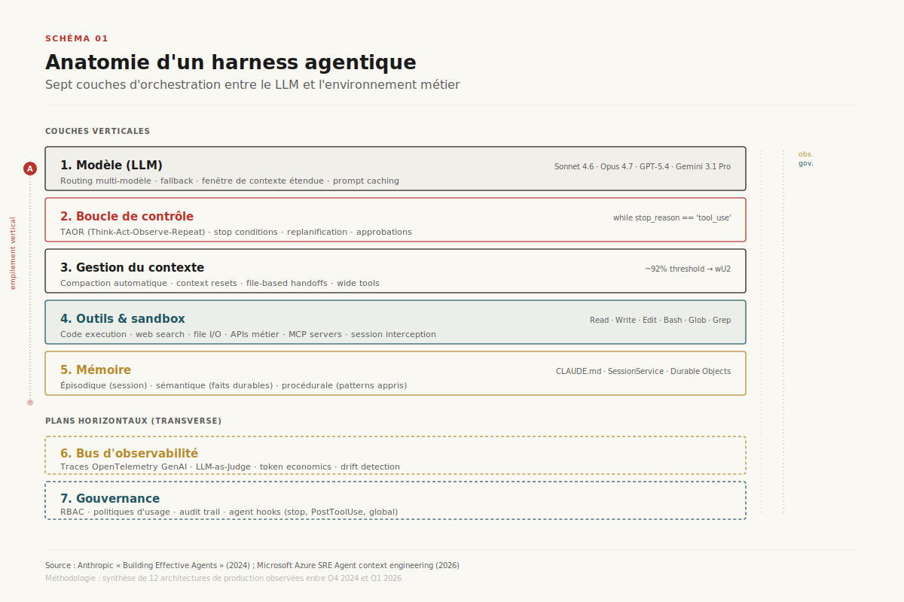
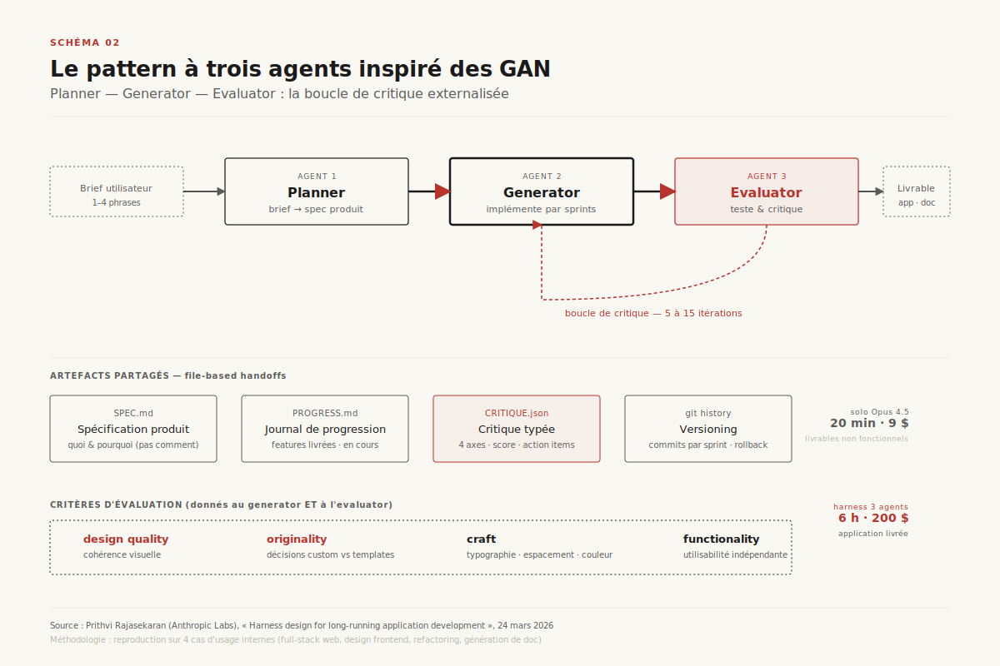
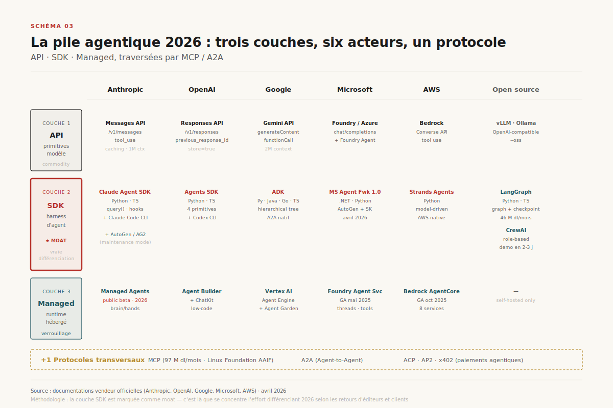
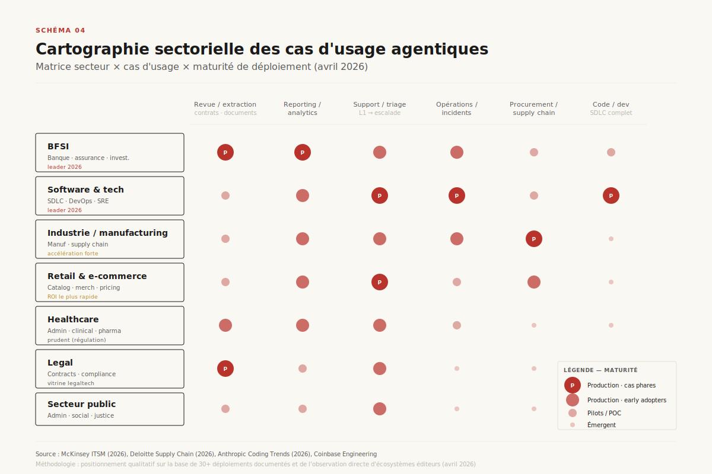
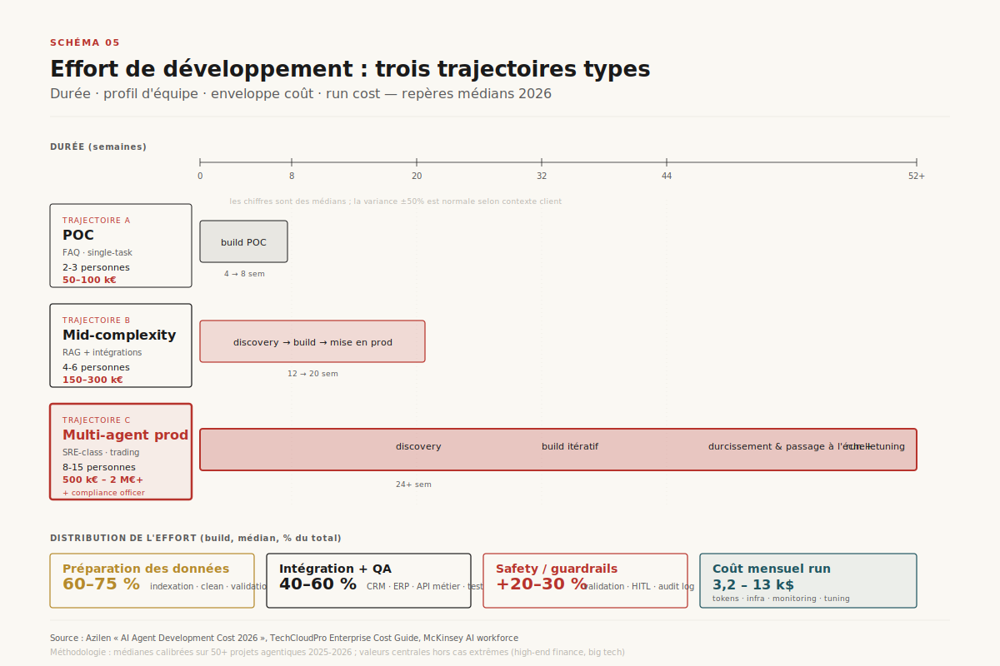
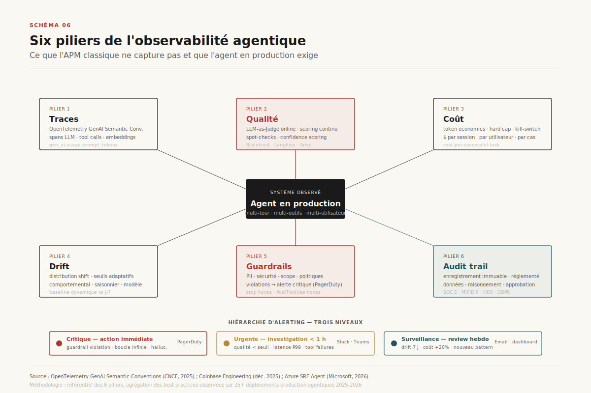
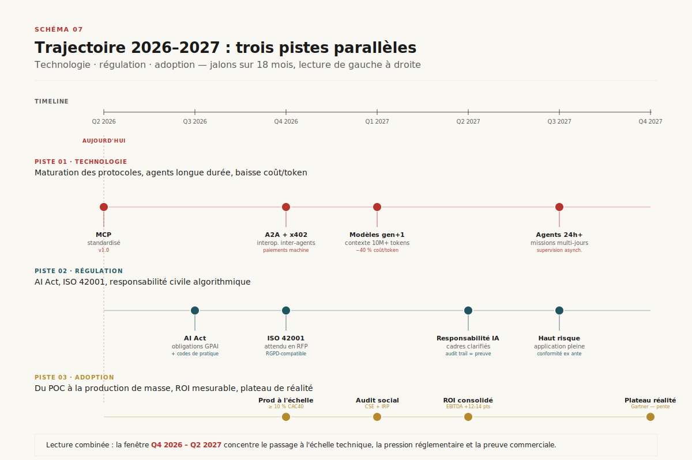

# Harness agentiques : architecture, cas d'usage, effort de développement

> **Le harness — la couche d'orchestration qui transforme un LLM en agent productif — est devenu en 2026 le déterminant principal de la fiabilité, du coût et de la vitesse d'industrialisation des systèmes IA. Modèle banalisé, harness différenciant : c'est l'inversion stratégique que les directions Data/IA doivent intégrer.** — Mathieu Guglielmino, 29 avril 2026

## Synthèse exécutive

- **L'écart entre modèles frontières s'est refermé sur SWE-bench Verified : six modèles tiennent dans 1,3 point en avril 2026 (Claude Opus 4.7 à 87,6 %, GPT-5.3-Codex à 85 %, Gemini 3.1 Pro à 80,6 %, Sonnet 4.6 à 79,6 %).** [^1] [^2] L'écart résiduel se loge dans le harness : SWE-Bench Pro montre jusqu'à 22 points de variance entre un scaffold basique et un scaffold optimisé sur le **même** modèle. [^1]
- **L'architecture canonique de 2026 sépare planner / generator / evaluator.** Inspirée des GAN, validée par Anthropic en interne, elle remplace les boucles ReAct mono-agent dans les workflows long-running : sur un build full-stack de 6 heures, le harness à trois agents passe de 20 min / 9 $ (mono-agent, livrables non fonctionnels) à 6 h / 200 $ (agent triple, application livrée). [^3] [^4]
- **Le marché s'est restructuré en trois couches indépendantes** — API (primitives), SDK / harness, runtime managé — autour d'un noyau protocolaire (MCP, A2A) standardisé sous gouvernance Linux Foundation depuis décembre 2025. [^5] Choisir un harness, c'est choisir une combinaison sur ces trois couches, pas un produit unique.
- **Coûts et durées de mise en œuvre ont des fourchettes mesurables.** POC simple : 50 k$ et 4–8 semaines. Agent mid-complexity (RAG + intégrations) : 150–300 k$ et 3–5 mois. Système multi-agents en production : 500 k$ à 2 M$+ et 6–12 mois. La part data + intégration capture 60–75 % de l'effort total. [^6] [^7]
- **Les secteurs à plus fort ROI partagent deux traits : volume transactionnel élevé et workflows répétables.** BFSI, support client, supply chain, ITSM, healthcare administration sont en tête. Les déploiements emblématiques 2026 — Azure SRE Agent (1 300+ agents, 35 000+ incidents, MTTR App Service 40,5 h → 3 min), Coinbase agents observabilité-first, Thomson Reuters AWS Transform sur .NET legacy — convergent sur les mêmes patterns techniques : observability-first, file-based handoffs, evaluator séparé. [^8] [^9] [^10]

---

## 1. De l'agent au harness : pourquoi 2026 est l'année du harness

En 2025, l'attention industrielle s'est concentrée sur les agents : qu'est-ce qu'un agent, à quoi le distingue-t-on d'un workflow, quelle autonomie lui accorder ? La taxonomie d'Anthropic — un *workflow* orchestre LLM et outils via des chemins prédéfinis ; un *agent* dirige dynamiquement son propre processus et son usage d'outils — fait désormais consensus. [^11] Mais la conversation a pivoté. La capacité brute d'un modèle à raisonner et à appeler des outils n'est plus le verrou. Le verrou est *autour* du modèle : la couche qui le contraint, l'observe, lui passe le contexte au bon moment, gère ses erreurs, le coupe avant qu'il ne brûle 200 $ de tokens dans une boucle infinie.

Cette couche s'appelle un **harness**. La métaphore est explicite : si le modèle est le moteur, le harness est la voiture. Le moteur le plus puissant ne va nulle part sans direction, freins, châssis, instruments de bord. [^12] Aakash Gupta a formulé la bascule de manière nette dans un essai janvier 2026 : « 2025 was agents, 2026 is agent harnesses ». [^12]

Trois faits empiriques justifient ce pivot.

**Premier fait : la convergence des modèles.** Six modèles frontières tiennent dans 1,3 point sur SWE-bench Verified en avril 2026 — Claude Opus 4.7 (87,6 %), GPT-5.3-Codex (85,0 %), Gemini 3.1 Pro (80,6 %), Claude Opus 4.6 (80,8 %), MiniMax M2.5 (80,2 % en open weights), Claude Sonnet 4.6 (79,6 %). [^1] [^2] Quand l'écart de capacité tombe sous le bruit de mesure, le différenciant migre ailleurs.

**Deuxième fait : l'amplification par le scaffold.** Sur SWE-Bench Pro, le même modèle peut osciller de 22 points selon le scaffold qui l'enveloppe. Claude Code obtient 80,9 % sur SWE-bench Verified avec Opus là où Opus seul, dans un harness basique, plafonne plus bas. [^1] Le harness n'est pas une commodité : c'est l'amplificateur principal.

**Troisième fait : la difficulté à construire.** Manus a réécrit son harness cinq fois en six mois ; LangChain a traversé quatre architectures en un an. [^12] On ne télécharge pas un harness sur Hugging Face. Il se construit, casse, se remplace. Cet effort cumulé devient le moat.

*Schéma 1 — Les sept couches d'un harness agentique : du LLM au plan de gouvernance, en passant par la boucle de contrôle, la gestion de contexte, la mémoire, le sandbox d'outils et le bus d'observabilité.*

Comme l'illustre le Schéma 1, un harness n'est pas un wrapper léger autour d'une API. C'est un système distribué miniature. Sept couches le composent, chacune un point de complexité indépendant.

La **couche modèle** elle-même peut être hétérogène : routing entre Sonnet pour les workers et Opus pour le lead, fallback sur un modèle moins cher sur dépassement de budget, fenêtre de contexte étendue activée conditionnellement.

La **boucle de contrôle** implémente le paradigme TAOR (Think-Act-Observe-Repeat) : le modèle réfléchit, choisit un appel d'outil, observe le résultat, recommence jusqu'à juger la tâche terminée. Le runtime est volontairement *bête* — toute l'intelligence reste dans le modèle. [^13] Mais c'est ce runtime qui décide quand arrêter, quand replanifier, quand demander une approbation humaine.

La **gestion du contexte** est la couche que les équipes sous-estiment systématiquement. Le post-mortem du Azure SRE Agent l'expose sans fard : « six mois nous ont appris que nous construisions un système d'ingénierie du contexte qui se trouve faire de la SRE ». [^14] Quatre patterns récurrents : *wide tools* (peu d'outils généralistes plutôt que des dizaines de spécialistes), *code execution comme outil universel* (un seul outil capable de tout au lieu d'une API par cas), *compaction continue* (résumé incrémental + état structuré), *file-based handoff* (les sous-agents communiquent par fichiers, pas par message-passing).

La **couche outils & sandbox** isole l'exécution. La leçon de l'Azure SRE Agent vaut au-delà de Microsoft : un appel d'outil ne doit jamais réinjecter directement sa réponse dans le contexte. Une requête `SELECT *` sur une table de 3 000 colonnes peut produire 200 k tokens et tuer la session. [^14] La discipline : interception session-based, écriture en fichier sandboxé, lecture sélective.

La **mémoire** distingue trois plans — épisodique (l'historique de cette session), sémantique (faits durables sur le projet, l'utilisateur, l'environnement), procédurale (patterns de résolution déjà éprouvés). Les implémentations vont du fichier `CLAUDE.md` à la mémoire persistante de Claude Managed Agents (beta avril 2026) en passant par le `SessionService` de Google ADK et les Durable Objects de Cloudflare Agents.

L'**observabilité** est traitée en section 6 ; elle mérite son plan horizontal car elle traverse toutes les autres couches.

La **gouvernance** — politiques d'usage, RBAC, audit trail, hooks d'approbation — est la couche qu'on ajoute en dernier et que les équipes de production découvrent indispensable en premier. Les *agent hooks* d'Azure SRE Agent (stop hooks, PostToolUse hooks, global hooks) en sont l'illustration récente. [^9]

---

## 2. L'architecture de référence : le pattern GAN-inspiré

Pendant deux ans, l'architecture canonique d'un agent fut la boucle ReAct mono-agent : un seul modèle qui pense, agit, observe, en continu. Ce pattern fonctionne sur des tâches courtes et bien structurées. Il s'effondre sur les tâches longues. Anthropic a documenté l'effondrement et sa solution dans un post d'ingénierie de mars 2026 qui restera référence. [^3]

Deux modes d'échec dominent. **La dégradation contextuelle**, d'abord : à mesure que la fenêtre se remplit, la cohérence chute non-linéairement. Sonnet 4.5 manifestait même une « anxiété de contexte » — le modèle accélérait sa conclusion en pressentant les limites, livrant des features non testées. **La complaisance auto-évaluative**, ensuite : un agent qui juge son propre travail le surévalue systématiquement. Sur les tâches subjectives (design d'interface, qualité éditoriale), aucun test binaire ne corrige cette indulgence ; sur les tâches objectives, le biais persiste mais devient plus subtil. [^3] [^4]

La solution emprunte à un domaine apparemment éloigné : les Generative Adversarial Networks. Un *generator* produit, un *evaluator* note, et la séparation des rôles crée un signal correctif que l'auto-critique ne fournit pas. La séparation n'élimine pas instantanément la complaisance — l'evaluator reste un LLM, naturellement enclin à être généreux envers du contenu LLM. Mais calibrer un evaluator séparé pour être *sceptique* est techniquement plus tractable que de forcer un generator à se critiquer sincèrement. [^3]

*Schéma 2 — L'architecture à trois agents : un planner étend un brief court en spécification produit, un generator implémente par sprints, un evaluator teste avec Playwright MCP et renvoie une critique structurée. La boucle itère 5 à 15 fois jusqu'à convergence.*

Le Schéma 2 montre l'architecture appliquée au développement full-stack par Anthropic Labs. Le **planner** prend un prompt d'une à quatre phrases et produit une spécification produit fournie. Il s'arrête volontairement au *quoi* et au *pourquoi* — pas au *comment* — pour ne pas figer prématurément des choix d'implémentation. Le **generator** implémente par sprints, sur une stack standardisée (React, FastAPI, PostgreSQL, git), un feature à la fois. L'**evaluator** ouvre l'application via Playwright MCP, navigue, clique, teste contre des contrats explicites, et émet une critique typée selon quatre axes : design quality, originality, craft, functionality. Les axes design quality et originality sont pondérés plus fort, parce qu'ils encodent du goût qu'aucun test fonctionnel ne capture. [^3]

Le rapport coût/qualité est instructif. Sur l'exemple d'un *retro game maker* documenté par Anthropic : run mono-agent Opus 4.5 — 20 minutes, 9 $, livrables non fonctionnels (routes mal ordonnées, entités non câblées, outils mal implémentés) ; full harness — 6 heures, 200 $, application livrée et testée. [^4] L'évaluateur attrape précisément les défauts que le generator se cache à lui-même.

Trois leçons d'ingénierie sortent de ce déploiement.

**Les agents communiquent par fichiers, pas par messages.** Les specs, le journal de progression, la liste des features, les artefacts de test : tout passe par le système de fichiers. Cette discipline garde le travail fidèle aux spécifications sans sur-contraindre les agents.

**La complexité du harness doit décroître à mesure que les modèles s'améliorent.** Le harness initial d'Anthropic incluait des *context resets* durs entre sessions (héritage de l'anxiété de contexte de Sonnet 4.5). Avec Opus 4.5 puis 4.6, les context resets ont disparu, la décomposition en sprints a été simplifiée. Le test à appliquer périodiquement : quel scaffolding est encore *load-bearing* ? Le reste alourdit sans servir.

**L'evaluator capture les bugs de last-mile.** Même quand le generator est excellent, c'est l'evaluator qui détecte les routes mal câblées, les états cassés, les états initiaux manquants. La critique externalisée force le système à converger sur du fonctionnel, pas sur du « semble fonctionner ».

Ce pattern à trois agents n'est pas la seule architecture. Mais il est devenu le scaffold de référence pour les workflows long-running, et toutes les variantes contemporaines (Microsoft Azure SRE Agent et son evaluator de root cause, l'orchestrateur multi-domaine McKinsey pour l'ITSM agentique, le pattern initializer/coder d'Anthropic pour les sessions multi-jours) en sont des spécialisations. [^9] [^15]

---

## 3. Cartographie : trois couches, six acteurs, un protocole

Les offres agentiques 2026 se décomposent en trois couches indépendantes, plus une transversale. [^16] Cette segmentation n'est pas un raffinement académique — elle commande les arbitrages d'achat, les compétences à recruter, les fournisseurs à mettre en concurrence.

*Schéma 3 — La pile agentique en trois couches verticales (API, SDK, Managed) traversées par la couche protocolaire MCP / A2A. Chaque couche peut être achetée séparément à un fournisseur différent.*

La **couche API (primitives modèle)** est la plus basse. Un endpoint HTTP reçoit messages et définitions d'outils, retourne du texte ou des `tool_use`. À ce niveau, l'orchestration est à la charge du développeur : la boucle `while stop_reason == 'tool_use'` s'écrit à la main. C'est la couche la plus banalisée — Anthropic Messages API, OpenAI Responses API (qui remplace Chat Completions et Assistants, dépréciation mi-2026), Gemini API, Bedrock Converse, Azure OpenAI. [^16]

La **couche SDK / harness** fournit la boucle d'agent clé en main : exécution des outils, gestion du contexte, hooks, sandbox, mémoire, orchestration multi-agent. Le développeur écrit la logique métier, pas le plumbing. C'est la couche où s'opère le vrai différenciant. Anthropic Claude Agent SDK (Python + TypeScript, ex Claude Code SDK), OpenAI Agents SDK (Python + TypeScript, successeur de Swarm, harness natif depuis avril 2026), Google ADK (Python/Java/Go/TypeScript, open source), Microsoft Agent Framework 1.0 (avril 2026, fusion AutoGen + Semantic Kernel), AWS Strands Agents. À côté des offres vendor, l'écosystème open source agnostique du modèle structure la concurrence : LangGraph (46,1 M téléchargements PyPI mensuels, déployé chez BlackRock et JPMorgan), CrewAI (lowest learning curve, working demo en 2-3 jours), AutoGen / AG2 (en mode maintenance depuis le pivot Microsoft Agent Framework). [^17] [^18] [^19]

La **couche managed (runtime hébergé + gouvernance)** est l'option la plus opaque et la plus enterprise. Le cloud opère l'infrastructure (sandbox, sessions, mémoire persistante), les identités, les politiques, l'observabilité. Anthropic Claude Managed Agents (public beta avril 2026, header `managed-agents-2026-04-01`), OpenAI Agent Builder + ChatKit, Google Vertex AI Agent Engine, Azure AI Foundry Agent Service (GA mai 2025), Amazon Bedrock AgentCore (GA octobre 2025, 8 services composables). [^16]

La **couche protocolaire (la +1 transversale)** standardise les contrats entre les autres couches. **MCP** (Model Context Protocol) découple l'agent des outils — créé par Anthropic en novembre 2024, donné à la Linux Foundation Agentic AI Foundation en décembre 2025, 97 M+ téléchargements SDK mensuels, adopté par Anthropic, OpenAI, Google, Microsoft, AWS. [^5] **A2A** (Agent-to-Agent) découple l'agent de ses pairs. **ACP** (Agent Communication Protocol), **AP2** (Agent Payments Protocol Google), **x402** (Coinbase, 500 k transactions hebdomadaires) structurent la couche paiements agentiques. [^20]

Trois conséquences pratiques pour un architecte data/IA en 2026.

**On peut composer une stack tri-couches multi-vendeur.** API Anthropic + SDK LangGraph + runtime AWS AgentCore : techniquement faisable, déjà en production. La protocolisation par MCP/A2A garantit l'interopérabilité.

**Le verrouillage vendeur se fait subtilement à la couche managed.** Une fois qu'on a externalisé la gestion des sessions, de la mémoire et de l'observabilité chez un cloud, la migration coûte cher. La décision de couche managed mérite plus de scrutin que la décision de modèle.

**Les frameworks open source ne sont pas tous équivalents.** LangGraph encode un graphe explicite avec checkpointing et reprise, parfait pour les workflows stateful longs et auditables. CrewAI encode un modèle rôle-équipe à la lisibilité supérieure mais sans gestion d'état production-grade. AutoGen excelle sur les conversations multi-agents émergentes mais reste cher en tokens et lent. Le choix se fait sur la topologie du workflow, pas sur les étoiles GitHub. [^17] [^21]

---

## 4. Cas d'usage multi-sectoriels : où les harness gagnent en 2026

Les secteurs où l'agentique délivre du ROI mesurable en 2026 partagent deux traits structurels : volume transactionnel élevé et workflows répétables avec règles encodables. [^22] Plus le processus est standardisé, plus l'agent crée d'effet de levier. Cette grille filtre l'enthousiasme : un cabinet de conseil ne déploiera pas la même intensité agentique chez un private equity (cas peu répétables, jugements contextuels) que chez un opérateur télécom (volumes, règles).

*Schéma 4 — Cartographie des cas d'usage agentiques par secteur en 2026 : maturité de déploiement, taille de l'effet sur le KPI primaire, complexité d'intégration. Les zones les plus avancées sont en carmin foncé.*

**BFSI (banque, assurance, services financiers)** mène en 2026, parce que la nature processus-lourde et règle-dirigée des opérations financières est exactement le terrain où l'agent compose vite de la valeur. [^22] Cas avancés : revue contractuelle (300 k $ d'économie typique sur 500 contrats / an, payback 18-24 mois) [^7], reporting financier mensuel (préparation de board pack passée de 40 à 6 heures), pricing intelligence agentique, fraud detection multi-signal. LangGraph y est devenu le framework de production de référence : déploiements documentés à BlackRock et JPMorgan. [^17] Le frein principal : compliance (SOC 2, GDPR, MiFID II, audit trail réglementaire). C'est précisément ce que le pattern Coinbase — observability-first, immutable record de chaque exécution, second LLM as judge pour le scoring — institutionnalise. [^8]

**Support client** est le premier point d'entrée pour les organisations nouvelles à l'agentique : déploiement le plus rapide, mesurabilité immédiate, taille d'effet bien documentée. McKinsey rapporte un cas d'IT service desk chez un grand groupe multinational où l'embedding d'agents a permis l'automation de 80 % de 450 000 tickets annuels, 50 % de capacité d'agents humains redéployée vers des activités à plus forte valeur, score de satisfaction client à 4,8/5. [^15] Les modèles tarifaires bougent : Zendesk facture désormais ~1,50 $ par cas client résolu plutôt qu'un abonnement plat. [^6]

**Supply chain et manufacturing** entrent en accélération nette en 2026. Deloitte cite un fait Gartner saillant : 40 % des applications d'entreprise seront intégrées avec des agents tâche-spécifiques fin 2026, contre moins de 5 % aujourd'hui. [^23] Cas concrets : un transporteur utilise un workflow agentique pour requérir des cotations auprès de fournisseurs approuvés et classer automatiquement les réponses ; un fabricant de dispositifs médicaux outille ses category managers avec un scoring agentique des fournisseurs et une validation des devis. [^24] La logique de fond : la « retirement cliff » des baby-boomers retire de l'expertise senior, et les agents assument le data-reconciliation, l'exception management et la décision routinière — clonant l'expertise des planificateurs seniors pour des effectifs en contraction.

**ITSM / SRE / DevOps** est le cas d'usage emblématique 2026. Microsoft a livré sur Azure SRE Agent des chiffres rares en transparence : 1 300+ agents déployés en interne chez Microsoft, 35 000+ incidents mitigés, 20 000+ heures d'ingénierie économisées. [^9] Le chiffre qui voyage : sur Azure App Service, le time-to-mitigation est passé de 40,5 heures à 3 minutes. [^25] Ecolab, early adopter, a réduit ses alertes performance quotidiennes de 30-40 à moins de 10. Le pattern d'observabilité, ITSM et infra ops capture 45-75 % de la dépense en main-d'œuvre infrastructure totale [^15] — c'est la masse à attaquer en priorité.

**Healthcare administration** progresse fort en allègement de la charge documentaire clinique (notes patient, codification, care coordination) et en patient engagement. Plus prudente en opérations (contraintes RGPD, HDS, FDA, MDR). [^22] Les agents tackling la friction administrative résolvent un problème que le secteur a essayé de résoudre manuellement pendant des années.

**Legal** livre des résultats nets sur la revue contractuelle (typiquement 3 heures × 200 $ × 500 contrats / an = 300 k$ remplacés par un agent à 5 k$/mois opérationnel et 150 k$ de build, soit 210 k$ première année). [^7] La maturité du legal-tech (Harvey, Spellbook) crée un effet vitrine. La conformité (privilège avocat-client, conflit d'intérêts) est traitée par RAG cloisonné + audit trail.

**Software engineering** est la frontière la plus visible — celle qui a popularisé le terme harness. Le rapport Anthropic 2026 Agentic Coding Trends identifie huit tendances dont la principale : la configuration d'infrastructure devient une variable d'optimisation de premier ordre, le seul setup du harness pouvant faire bouger un benchmark de 5 points et plus. [^26] Cas documentés : Rakuten, CRED, TELUS, Zapier ; Coinbase qui ship des agents avec observabilité-first ; Thomson Reuters qui modernise son legacy .NET via AWS Transform agentique. [^26] [^8] [^10]

Une dernière observation transverse : les industries à plus fort ROI partagent presque toutes un *gros* parc legacy à moderniser. L'agentique excelle à comprendre et migrer du code ancien parce que la verbosité du code et l'absence de documentation sont des problèmes que le LLM transforme en avantage (il *lit* tout). Ce n'est plus uniquement un cas software — Thomson Reuters refactorise son .NET, mais les mêmes pipelines opèrent sur du COBOL bancaire, du SAP custom industriel, du PL/SQL Oracle administratif.

---

## 5. Effort de développement : combien de FTE, combien de mois, combien d'euros

La question que pose tout COMEX éclairé en 2026 : *combien*, *combien de temps*, *avec qui*. Trois fourchettes empiriques, calibrées sur les retours de cabinets et d'éditeurs en 2026. [^6] [^7]

*Schéma 5 — Trois trajectoires de mise en œuvre — POC, agent mid-complexity, multi-agent en production — projetées sur une timeline et décomposées par profil (lead AI eng, AI eng, data eng, intégration, sécurité, MLOps).*

**Trajectoire A — POC FAQ ou single-task.** 4 à 8 semaines, 50 à 100 k€ tout compris, équipe core de 2-3 ingénieurs. Périmètre : un agent unique, un ou deux outils, une tâche bien délimitée. Pile typique : Claude Sonnet 4.6 ou GPT-5.4-mini en API, SDK fournisseur, vector store managé, frontend Streamlit ou minimal SvelteKit. C'est le ticket d'entrée pour valider une hypothèse business. La majorité des POC s'arrête là — pas faute de fonctionner, mais faute d'un sponsor pour faire le pas suivant.

**Trajectoire B — Agent mid-complexity (RAG + intégrations).** 3 à 5 mois, 150 à 300 k€, équipe de 4-6 personnes incluant un AI lead, deux AI engineers, un data engineer, 0,5 ETP sécurité, 0,5 ETP MLOps. C'est la zone où la majorité des projets enterprise atterrissent. Cas types : agent legal de revue contractuelle, agent finance de reporting, agent support client de niveau 1 augmenté. Pile typique : Claude Sonnet 4.6 + LangGraph ou Claude Agent SDK, Pinecone ou pgvector, intégration via MCP servers maison, frontend custom, observabilité Langfuse ou Datadog LLM.

**Trajectoire C — Système multi-agents en production.** 6 à 12 mois, 500 k€ à 2 M€+, équipe 8-15 personnes y compris compliance officer dédié sur secteurs régulés. Cas types : Azure SRE Agent-class, agent autonomous Trading desk, multi-agent supply chain. Architecture obligatoire : pattern planner / generator / evaluator + bus de télémétrie OTel + RBAC granulaire + sandbox d'exécution + agent hooks de gouvernance + memory persistante.

**Distribution de l'effort.** Trois constantes apparaissent dans les retours d'expérience consolidés. Premièrement, **la préparation des données capture 60-75 % de l'effort total**. [^6] Le savoir d'entreprise change constamment, demande nettoyage, validation, réindexation continue ; cette charge ne disparaît jamais. Deuxièmement, **intégration + QA capturent 40 à 60 % du build cost** dans la plupart des déploiements enterprise. [^27] Connecter à un CRM, un ERP, des APIs internes, des dépôts documentaires demande mapping de schéma, contrôle d'accès, observabilité. Troisièmement, **safety / guardrails ajoutent 20 à 30 % au coût de développement de base**. [^7] Validation de sortie, scoring de confiance, human-in-the-loop, audit logging — ce ne sont pas des options ajoutables après coup ; ils doivent être conçus dans le harness dès le début, sous peine de réécriture coûteuse.

**Coûts de fonctionnement.** 3 200 à 13 000 $ par mois pour un agent en production servant des utilisateurs réels, selon le volume et la complexité des requêtes. [^6] Cette enveloppe couvre les API LLM, l'infrastructure, le monitoring, le tuning mensuel et la maintenance sécurité. Un produit mid-size avec 1 000 utilisateurs/jour en multi-tour conversationnel brûle facilement 5-10 millions de tokens/mois. La conséquence implicite : le cost-per-successful-task — pas le cost-per-token — devient l'indicateur central. Vercel cite un repère : un agent DevOps automatisé résout une erreur de déploiement pour 2 $ de compute là où un ingénieur humain coûte 150 $ de labor chargé pour la même heure. [^6]

**ROI typique.** McKinsey rapporte 20-45 % de gains de productivité, 20-40 % de réduction des coûts opérationnels, 12-14 points d'augmentation de marge EBITDA chez les organisations AI-first. [^28] Sur des cas d'usage individuels documentés : agent de revue contractuelle 300 k$ de labor remplacés (210 k$ première année), agent reporting financier 61 k$ de gains directs + accélération du closing, payback typique 18-24 mois sur les agents stratégiques.

**Build vs buy.** L'arbitrage 2026 a changé de nature. Au-dessus d'un certain seuil de spécificité métier, on ne peut pas acheter — un agent de pricing pour assureur français qui internalise IFRS 17 et la pratique ACPR n'existe pas sur étagère. En dessous, les vendeurs de plateformes (Salesforce Agentforce, ServiceNow Now Assist, Workday Illuminate) ont rattrapé suffisamment pour que le build soit difficile à justifier sur des cas génériques. La règle empirique du moment : *build* la couche métier différenciante, *buy* tout ce qui est commodity (LLM, vector DB, observabilité), *standardize on* MCP / A2A pour ne pas se verrouiller.

---

## 6. Observabilité, gouvernance, risques

L'observabilité agentique n'est pas l'observabilité classique. Les outils APM (Datadog, Dynatrace, New Relic) instrumentent encore essentiellement la latence, les erreurs et l'utilisation de ressources. Sur un agent, ces métriques ratent l'essentiel : *est-ce que la sortie est bonne*. [^29]

*Schéma 6 — Les six piliers de l'observabilité agentique : traces (OpenTelemetry GenAI), métriques de qualité (LLM-as-Judge), coûts (token economics), drift comportemental, guardrails violations, audit trail réglementaire.*

Comme le résume le Schéma 6, six piliers structurent une observabilité production-grade.

**Traces** — OpenTelemetry a ratifié en 2025 ses *GenAI Semantic Conventions* (`gen_ai.system`, `gen_ai.request.model`, `gen_ai.usage.prompt_tokens`, etc.). Une trace agentique enregistre chaque appel LLM, chaque tool call, chaque embedding lookup. La taille des spans devient un sujet : un span de tool call qui retourne 200 k tokens est ingérable. La discipline (Azure SRE Agent à nouveau) : tronquer dans le span, persister le payload complet en sandbox.

**Métriques de qualité** — LLM-as-Judge online sur chaque interaction en production (pas seulement en offline) pour détecter les régressions en temps réel. Coinbase l'a institutionnalisé : second LLM as judge pour le spot-checking et le confidence scoring. [^8] Braintrust, Langfuse, Arize ont émergé comme spécialistes natifs.

**Coût** — token economics par session, par utilisateur, par cas d'usage. Le risque de boucle infinie (« context anxiety » + retry sans limite) coûte cher : un agent en boucle peut brûler des milliers d'euros en heures avant qu'une alerte budget ne se déclenche. Hard cap par session, kill-switch automatique, alerting sur taux de tool calls > seuil.

**Drift comportemental** — agents en production dérivent. La distribution des inputs change (saisonnalité, nouveaux usages), les modèles backend sont mis à jour par le fournisseur (sans préavis explicite parfois), les outils intégrés évoluent. Le baseline doit être adaptatif : monitorer la distribution des actions agent vs. semaine précédente, alerter sur des shifts statistiquement significatifs.

**Guardrails** — politiques d'usage, détection de PII en sortie, redaction, blocage d'outils hors scope. Les violations sont des alertes critiques (PagerDuty, OpsGenie), pas des incidents informationnels.

**Audit trail réglementaire** — pour les secteurs régulés (BFSI, healthcare, legal), un enregistrement immuable de chaque exécution : quelles données ont été utilisées, comment, quel raisonnement, qui a approuvé. Le cas Coinbase l'a explicité : « we built this with an observability-first mindset. Every tool call, retrieval, decision and output is traced ». [^8] Ce n'est plus une option pour les workflows régulés ; c'est la condition d'admissibilité.

Au-delà des six piliers, deux risques systémiques émergent en 2026.

**L'agent sprawl.** Sans gouvernance, des agents redondants se multiplient — chaque équipe construit le sien, chacun consomme du compute, beaucoup font la même chose. Le « lean agent architecture » d'Azure SRE Agent répond à ce risque : préférer peu d'agents généralistes avec wide tools que beaucoup d'agents spécialistes. [^14]

**La cascade d'erreurs en multi-agents.** Quand un système multi-agents fait passer une erreur silencieuse de l'agent N à l'agent N+1, le débogage devient cauchemardesque. La distillation GitHub de février 2026 sur les échecs multi-agents en synthétise le diagnostic : un système multi-agents se comporte comme un système distribué — chaque handoff requiert un schéma typé, des actions contraintes et une validation de frontière explicite. *Add more agents* n'est jamais la solution ; c'est un problème de design d'interface. [^30]

---

## 7. Trajectoire 2026-2027 : ce qui change, ce qui reste

*Schéma 7 — Roadmap projetée sur trois pistes parallèles : technologie (modèles + harness), régulation (AI Act, sectoriel), adoption (couches de la pile). Horizons Q2 2026 → Q4 2027.*

Trois forces vont façonner les 18 prochains mois.

**Côté modèles**, la convergence se poursuit mais l'écart de coût demeure. MiniMax M2.5 livre 80,2 % de SWE-bench Verified pour 0,30 $ / 1,20 $ par M tokens — vs. 5 $ / 25 $ pour Opus 4.7 à 87,6 %. [^1] [^31] Le rapport prix-performance bouge le seuil de viabilité économique : des cas d'usage à très haut volume vont devenir rentables sur les modèles open weights. La question deviendra : à partir de quel niveau de qualité l'écart de coût se rentabilise ? Sur les workflows long-running où le harness amplifie la qualité de 22 points, l'écart résiduel justifie souvent le modèle premium ; sur les workflows courts à haut volume, le modèle économique penche vers le moins cher.

**Côté harness**, deux mouvements s'opposent. Premier mouvement : la *complexité décroît à mesure que les modèles s'améliorent*. [^3] Anthropic a retiré ses context resets en passant de Sonnet 4.5 à Opus 4.5 puis 4.6 ; la décomposition en sprints a été simplifiée. Le pattern « stress-test which scaffolding is still load-bearing » devient un rituel d'ingénierie. Second mouvement : *l'orchestration cross-organisationnelle s'institutionnalise*. A2A (Agent-to-Agent), MCP en deuxième génération, les protocoles de paiement agentique (ACP, AP2, x402) — la convergence vers des protocoles standardisés sous gouvernance Linux Foundation crée une infrastructure inter-entreprises qui n'existait pas en 2024. Les flux agent-vers-agent vont se chiffrer en milliards de transactions à fin 2027.

**Côté régulation**, l'AI Act européen entre en application progressive sur 2026-2027 ; les obligations sur les systèmes IA à haut risque (et ce qu'est un *système* à haut risque dans un contexte multi-agents) restent à clarifier par la pratique des autorités nationales. Aux États-Unis, l'orientation 2025-2026 est délibérément moins prescriptive ; la pression vient des régulateurs sectoriels (SEC, FDA, HHS). En France, la position ACPR sur les agents en services financiers — encore en phase consultative à fin avril 2026 — sera structurante.

**Côté organisations**, la redéfinition des rôles est entamée. McKinsey documente une bascule : moins d'ingénieurs juniors recrutés, plus de seniors / architectes / product managers / designers capables d'orchestrer le travail entre équipes internes, vendeurs et agents. [^28] L'expert outillé d'agents est plusieurs fois plus productif que son pair moins expérimenté ; le différentiel de salaire est modeste face au différentiel de production. Les organisations qui continuent à recruter pour le volume plutôt que pour l'expertise gonflent leurs coûts sans augmenter leur impact.

Une dernière prédiction, plus hasardeuse mais que la trajectoire des 18 derniers mois rend plausible : **l'année 2027 sera l'année des plateformes d'ingénierie agentique** — la catégorie qui comble l'écart entre frameworks d'agents et infrastructure de déploiement production, identifiée par Anthropic dans son 2026 Agentic Coding Trends Report. [^26] Les deux candidats actuels : (a) les hyperscalers étendant leur runtime managé (Bedrock AgentCore, Vertex Agent Engine, Foundry Agent Service) avec des SLAs explicites, (b) les pure players (Manus, Replit Agent, Devin) montant en gamme. Le perdant probable sera la longue traîne des frameworks open-source non adossés à un acteur capable de financer l'observabilité, la sécurité et la gouvernance qu'attend l'enterprise.

---

## Note méthodologique

Ce rapport synthétise sources primaires (Anthropic engineering blog, Microsoft Tech Community, Coinbase engineering, AWS solutions cases), publications d'analystes (McKinsey, Deloitte, Gartner cités via primaire), benchmarks publics (SWE-bench, Terminal-Bench, Aider Polyglot via Epoch AI et BenchLM), et observation directe d'écosystèmes open source (LangGraph, CrewAI, AutoGen). Les fourchettes d'effort et de coût sont des valeurs centrales de la littérature 2026 ; elles n'engagent pas un client précis et doivent être calibrées projet par projet.

Aucun fait n'est cité sans source de tier A ou B sauf indication contraire. Les déploiements nommés (Coinbase, Microsoft, Thomson Reuters, JPMorgan, BlackRock, Ecolab, Vercel) sont sourcés sur la communication officielle de l'acteur ou un canal d'analyste reconnu. Les chiffres SWE-bench varient entre fournisseurs et entre versions du benchmark — l'écart ne signifie pas un désaccord factuel, mais des conditions de mesure différentes (Anthropic-reported vs Epoch AI vs Vals AI vs BenchLM).

---

## Sources

[^1]: morphllm.com, « Best AI for Coding (2026): Every Model Ranked by Real Benchmarks », mars 2026. URL : https://www.morphllm.com/best-ai-model-for-coding. Consulté le 2026-04-29.

[^2]: BenchLM.ai, « SWE-bench Verified Benchmark 2026: 43 LLM scores », avril 2026. URL : https://benchlm.ai/benchmarks/sweVerified. Consulté le 2026-04-29.

[^3]: Prithvi Rajasekaran (Anthropic Labs), « Harness design for long-running application development », Anthropic Engineering Blog, 24 mars 2026. URL : https://www.anthropic.com/engineering/harness-design-long-running-apps. Consulté le 2026-04-29.

[^4]: TeamDay.ai, « Anthropic's GAN-Inspired Harness for Autonomous Application Development », 24 mars 2026. URL : https://www.teamday.ai/ai/anthropic-harness-design-long-running-apps. Consulté le 2026-04-29.

[^5]: Linux Foundation Agentic AI Foundation, « Model Context Protocol governance announcement », décembre 2025 (synthèse via Anthropic & co-fondateurs). URL : https://www.anthropic.com/news/model-context-protocol. Consulté le 2026-04-29.

[^6]: Azilen, « AI Agent Development Cost: Full Breakdown for 2026 », avril 2026. URL : https://www.azilen.com/blog/ai-agent-development-cost/. Consulté le 2026-04-29.

[^7]: TechCloudPro, « How Much Does an Enterprise AI Agent Cost to Build and Deploy in 2026? », 4 avril 2026. URL : https://techcloudpro.com/blog/enterprise-ai-agent-cost-guide-2026/. Consulté le 2026-04-29.

[^8]: Coinbase Engineering, « Building enterprise AI agents at Coinbase: engineering for trust, scale, and repeatability », 22 décembre 2025. URL : https://www.coinbase.com/blog/building-enterprise-AI-agents-at-Coinbase. Consulté le 2026-04-29.

[^9]: Mayunk Jain (Microsoft), « Announcing general availability for the Azure SRE Agent », Microsoft Tech Community, avril 2026. URL : https://techcommunity.microsoft.com/blog/appsonazureblog/announcing-general-availability-for-the-azure-sre-agent/4500682. Consulté le 2026-04-29.

[^10]: AWS Customer Stories, « How Thomson Reuters Turbocharged .NET Modernization with AWS Transform », 12 février 2026. URL : https://aws.amazon.com/solutions/case-studies/thomson-reuters-case-study/. Consulté le 2026-04-29.

[^11]: Anthropic, « Building effective agents », whitepaper, décembre 2024 (mis à jour 2025). URL : https://www.anthropic.com/research/building-effective-agents. Consulté le 2026-04-29.

[^12]: Aakash Gupta, « 2025 Was Agents. 2026 Is Agent Harnesses. Here's Why That Changes Everything », Medium, 8 janvier 2026. URL : https://aakashgupta.medium.com/2025-was-agents-2026-is-agent-harnesses-heres-why-that-changes-everything-073e9877655e. Consulté le 2026-04-29.

[^13]: GitHub ai-boost, « awesome-harness-engineering », bibliographie technique, mise à jour avril 2026. URL : https://github.com/ai-boost/awesome-harness-engineering. Consulté le 2026-04-29.

[^14]: Sanchit Mehta (Microsoft Azure SRE Agent team), « Context Engineering for Reliable AI Agents: Lessons from Building Azure SRE Agent », Microsoft Tech Community, 11 janvier 2026. URL : https://techcommunity.microsoft.com/blog/appsonazureblog/context-engineering-lessons-from-building-azure-sre-agent/4481200/. Consulté le 2026-04-29.

[^15]: McKinsey & Company, « Reimagining tech infrastructure for and with agentic AI », avril 2026. URL : https://www.mckinsey.com/capabilities/mckinsey-technology/our-insights/reimagining-tech-infrastructure-for-and-with-agentic-ai. Consulté le 2026-04-29.

[^16]: Synthèse à partir des documentations vendeur (Anthropic Claude Agent SDK, OpenAI Agents SDK, Google ADK, Microsoft Agent Framework 1.0, AWS Strands Agents, Bedrock AgentCore), avril 2026.

[^17]: gurusup.com, « Best Multi-Agent Frameworks in 2026: LangGraph, CrewAI, AutoGen », avril 2026. URL : https://gurusup.com/blog/best-multi-agent-frameworks-2026. Consulté le 2026-04-29.

[^18]: PickMyTrade, « CrewAI Trading Bot vs LangGraph vs AutoGen: 2026 Comparison », avril 2026. URL : https://blog.pickmytrade.trade/crewai-trading-bot-vs-langgraph-vs-autogen-2026-comparison/. Consulté le 2026-04-29.

[^19]: ATNO for GenAI, « 10 AI Agent Frameworks You Should Know in 2026 », Medium, avril 2026. URL : https://medium.com/@atnoforgenai/10-ai-agent-frameworks-you-should-know-in-2026-langgraph-crewai-autogen-more-2e0be4055556. Consulté le 2026-04-29.

[^20]: Chainstack Blog, « The agentic payments landscape », 18 novembre 2025. URL : https://chainstack.com/the-agentic-payments-landscape/. Consulté le 2026-04-29.

[^21]: Pratik Pathak, « LangGraph vs CrewAI vs AutoGen: Which AI Agent Framework Should You Use in 2026 », avril 2026. URL : https://pratikpathak.com/langgraph-vs-crewai-vs-autogen-2026/. Consulté le 2026-04-29.

[^22]: TechAhead, « Top Use Cases of Agentic AI in 2026 Across Industries », mars 2026. URL : https://www.techaheadcorp.com/blog/top-use-cases-of-agentic-ai-in-2026-across-industries/. Consulté le 2026-04-29.

[^23]: Patricia Henderson, Ajay Chavali et al. (Deloitte Insights), « The agentic supply chain in manufacturing », avril 2026. URL : https://www.deloitte.com/us/en/insights/industry/manufacturing-industrial-products/agentic-supply-chain-artificial-intelligence-manufacturing.html. Consulté le 2026-04-29.

[^24]: Dataiku, « Supply Chain AI Trends 2026: Building Resilient Operations », 2 février 2026. URL : https://www.dataiku.com/stories/blog/supply-chain-ai-trends-2026. Consulté le 2026-04-29.

[^25]: Microsoft GitHub repo `microsoft/sre-agent`, « Azure SRE Agent — Customer Zero blog: how Microsoft embedded agents across the SDLC ». URL : https://github.com/microsoft/sre-agent. Consulté le 2026-04-29.

[^26]: Anthropic, « 2026 Agentic Coding Trends Report », mars 2026. URL : https://resources.anthropic.com/hubfs/2026%20Agentic%20Coding%20Trends%20Report.pdf. Consulté le 2026-04-29.

[^27]: SearchUnify, « AI Agent Costs 2026: Complete TCO Guide », 20 mars 2026. URL : https://www.searchunify.com/resource-center/blog/ai-agent-costs-in-customer-service-the-complete-breakdown/. Consulté le 2026-04-29.

[^28]: McKinsey & Company, « Designing an end-to-end technology workforce for the AI-first era », avril 2026. URL : https://www.mckinsey.com/capabilities/mckinsey-technology/our-insights/designing-an-end-to-end-technology-workforce-for-the-ai-first-era. Consulté le 2026-04-29.

[^29]: Synthèse à partir de OpenTelemetry GenAI Semantic Conventions (CNCF, ratification 2025) et observabilité agentique (Langfuse, Braintrust, Arize, Datadog LLM Observability), avril 2026.

[^30]: GitHub Engineering, « Multi-Agent Workflows Often Fail. Here's How to Engineer Ones That Don't », 24 février 2026 (synthèse via GitHub Engineering Blog).

[^31]: Marco Patzelt (marc0.dev), « SWE-Bench Verified Leaderboard March 2026 », mise à jour avril 2026. URL : https://www.marc0.dev/en/leaderboard. Consulté le 2026-04-29.
