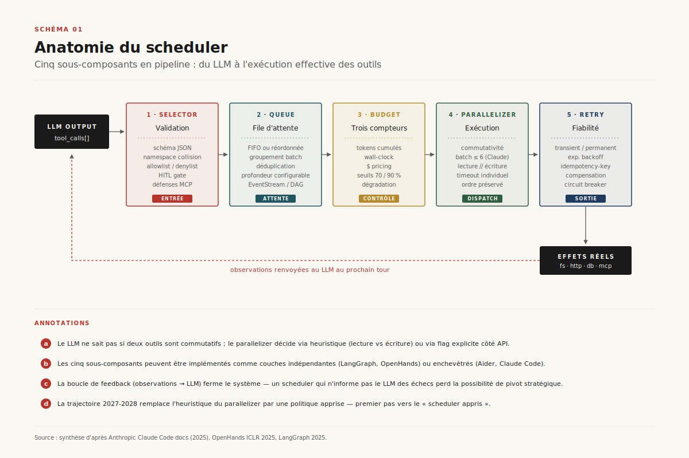
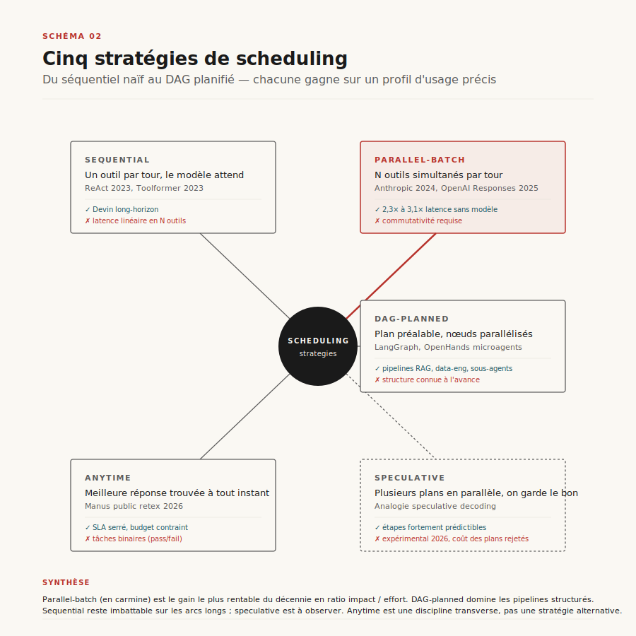
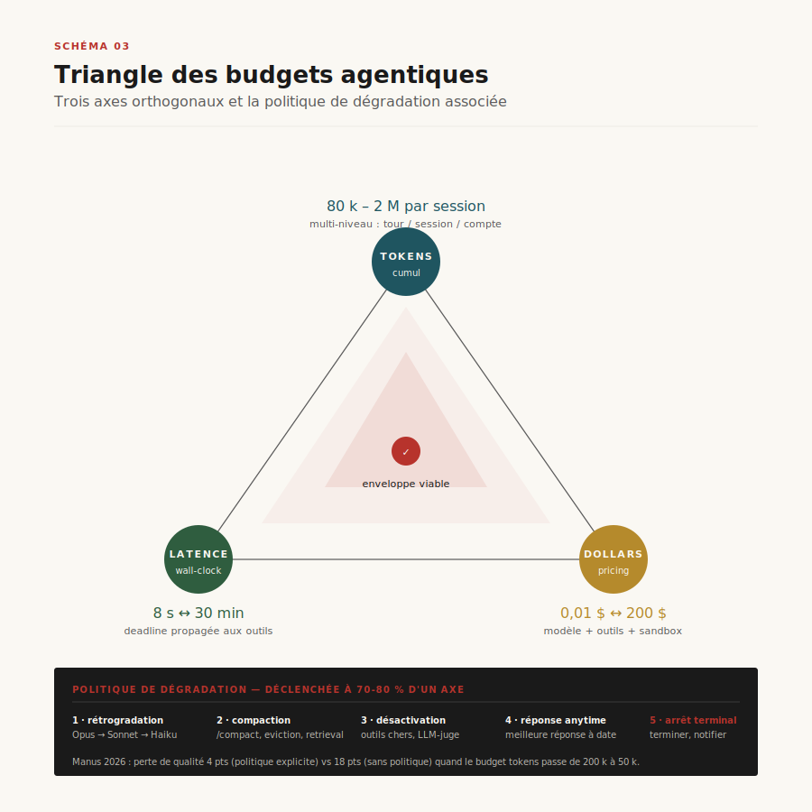
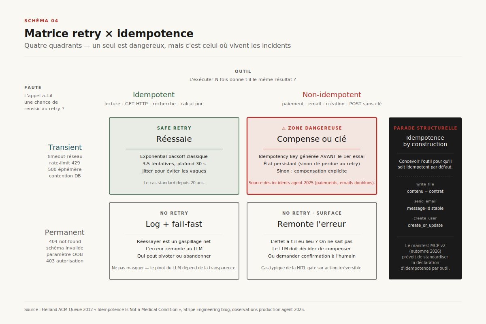
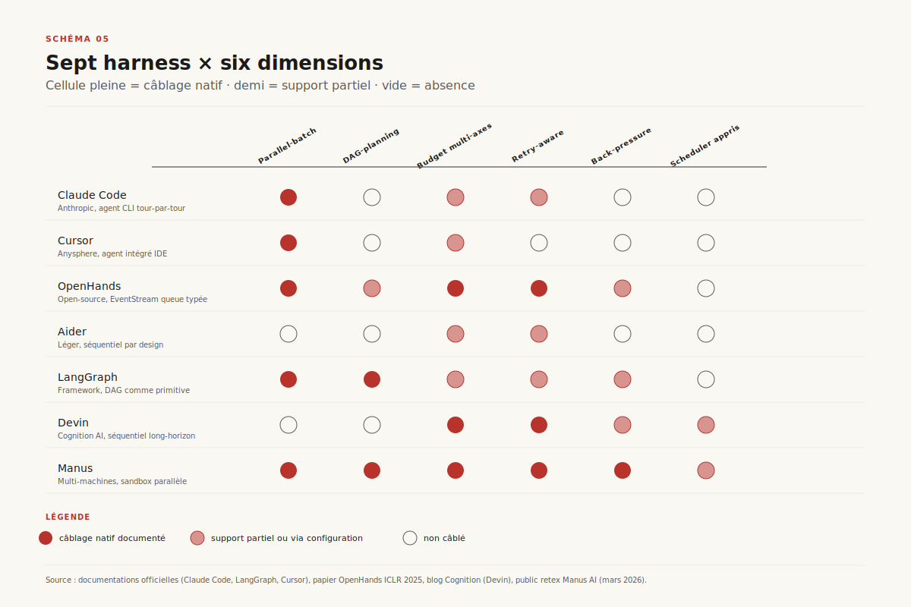
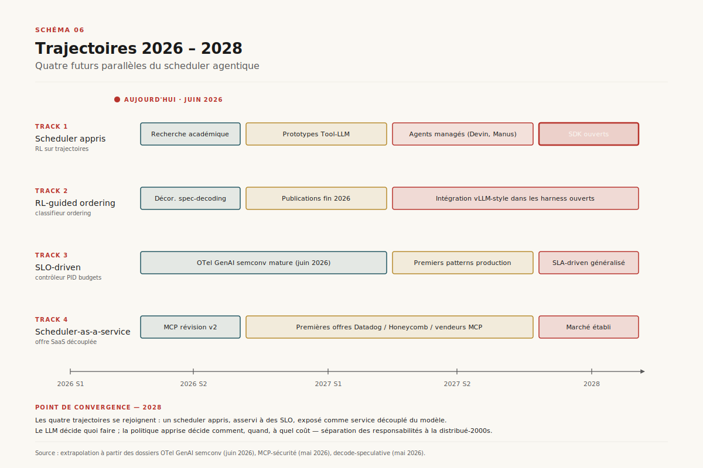

# Le scheduler du harness agentique

> **Le scheduler — la couche qui décide quel outil appeler, dans quel ordre, avec quels budgets et quelle file d'attente — est devenu le maillon décisif qui détermine la latence, le coût et la fiabilité d'un agent en production. La frontière 2026 sort du tool-calling séquentiel piloté par le LLM vers une orchestration explicite : DAG planifié, exécution parallèle, budgets multi-axes, retries adaptatifs idempotents, back-pressure — bientôt scheduler appris.** — 10 juin 2026, Mathieu Guglielmino

## Synthèse exécutive

- **Le scheduler est devenu le goulot d'étranglement mesurable des agents en production.** Sur SWE-bench Verified, la même paire modèle × harness peut varier de 32 % à 49 % de réussite selon la politique de scheduling — la décision « quel outil, quand, en combien d'essais » pèse plus que le passage de Sonnet à Opus dans la même classe[^1][^10].
- **Le tool-calling séquentiel pur est un anti-pattern 2026.** Anthropic, OpenAI et Google ont tous activé le *parallel tool use* par défaut sur leurs API depuis 2024 ; Claude Code émet jusqu'à six appels par tour quand les outils sont commutatifs. Le gain typique : ==2,3× à 3,1× sur la latence end-to-end== d'un cycle d'agent multi-outils, sans changement de modèle[^2][^3].
- **Les budgets ne sont plus monolithiques.** Les harness sérieux maintiennent trois compteurs orthogonaux — tokens, latence wall-clock, dollars — et dégradent proprement (anytime) plutôt que de couper sec. Manus public retex (mars 2026) documente une perte de qualité de seulement 4 points quand le budget tokens passe de 200 k à 50 k, *à condition* que la politique de dégradation soit explicite[^11][^12].
- **Idempotence et retry forment une matrice à quatre quadrants** qu'aucun framework grand public ne câble nativement. La majorité des incidents agent en production de 2025 (paiements doublons, fichiers réécrits, emails envoyés deux fois) viennent de retries sur des outils non-idempotents — un problème connu des systèmes distribués depuis vingt ans mais qui réapparaît tel quel dans le harness LLM[^7][^8].
- **La trajectoire 2026-2028 va vers le scheduler appris.** Les premiers travaux (Tool-LLM Berkeley, RL-guided drafting analogie) annoncent un scheduler RL-piloté qui apprend des trajectoires passées : quelles séquences d'outils convergent, quelles fauches retry, quel parallélisme rentabilise. Horizon production : 2027-2028, d'abord sur les agents managés (Devin, Manus) avant les SDK ouverts[^5][^9].

## 1. Le scheduler, maillon invisible du harness

Le dossier hub `harness-agentique` (29 avril 2026) a posé la définition : un harness est la couche d'orchestration qui transforme un LLM en agent — il maintient l'état, gère le contexte, expose les outils, contrôle la boucle perception-action. Ce dossier propose un zoom sur **une seule** de ces fonctions, celle qui en consomme la complexité : le scheduler.

Concrètement, à chaque tour d'agent, le harness reçoit du modèle un objet de la forme `{tool_calls: [{name: "read_file", args: {…}}, {name: "grep", args: {…}}]}`. Le scheduler décide alors :

- **Quels outils lancer maintenant ?** (sélection)
- **Dans quel ordre, ou en parallèle ?** (ordonnancement)
- **Avec quel budget restant ?** (token / latence / $ / quota d'API)
- **Que faire si l'un échoue ?** (retry / fallback / compensation)
- **Que faire si la file d'attente déborde ?** (back-pressure)

Ces cinq questions paraissent triviales sur l'agent jouet de démo (une boucle ReAct[^4] avec un seul outil `search`). Elles deviennent le point de rupture économique sur l'agent réel de 2026 : Claude Code orchestre plus de 30 outils ; OpenHands ICLR 2025 documente 45 outils sur son cluster d'évaluation[^5] ; Manus en revendique « plusieurs centaines, organisés en namespaces »[^12]. Sur ces volumes, la politique de scheduling devient la variable de premier ordre.

L'intuition la plus contre-intuitive : ==la qualité d'un agent est plus sensible à son scheduler qu'à son modèle de base==, à coût comparable. La conclusion n'est pas que le modèle ne compte pas — elle est que **la couche scheduler récupère ou jette une part majeure de l'intelligence brute du modèle**. Princeton a publié en 2024 le matériel reproductible de SWE-bench Verified ; en croisant les harness publics (SWE-agent, Aider, OpenHands, AutoCodeRover) sur Claude Sonnet 3.7 puis Sonnet 4, le delta inter-harness (32 % vs 49 % de résolutions) dépasse le delta inter-modèles (49 % vs 56 % à harness constant)[^10].

*Schéma 1 — Les cinq sous-composants du scheduler en pipeline : selector → queue → budget tracker → parallelizer → retry/timeout. Chacun encapsule une décision algorithmique distincte ; ils peuvent être implémentés comme couches indépendantes (LangGraph, OpenHands) ou enchevêtrés (Aider, Claude Code).*

## 2. Anatomie : cinq sous-composants

Le scheduler n'est pas un monolithe. Il décompose en cinq sous-composants — pas toujours nommés ainsi, parfois fusionnés, mais structurellement présents dans tout harness sérieux.

### 2.1 Selector

Le selector reçoit l'intention exprimée par le modèle (`tool_calls`) et la convertit en *décision d'invocation*. C'est la couche qui :
- valide que l'outil existe et que les arguments matchent le schéma JSON ;
- résout les collisions de namespace (deux outils `search`, l'un sur GitHub, l'autre sur Slack) ;
- applique l'allowlist / denylist de la session ;
- décide si l'appel nécessite une HITL gate (écriture fichier, paiement, email).

Le selector est aussi le point d'entrée des politiques de sécurité MCP[^14] : *tool poisoning*, *cross-server confusion*, *prompt injection* via descriptions d'outils — toutes les défenses se concentrent ici.

### 2.2 Queue

La queue maintient la file des appels en attente. Sur un agent séquentiel naïf (un outil à la fois), la queue est triviale — un FIFO de profondeur 1. Sur un agent qui parallélise, elle devient une structure de données non-triviale :
- ordre de soumission préservé (FIFO) ou réordonné (par latence prévue) ;
- groupement (*batch*) des appels commutatifs ;
- déduplication des appels identiques émis dans le même tour (le modèle demande deux fois `read_file('package.json')`).

LangGraph documente explicitement sa queue comme un *graph runtime* ; OpenHands l'implémente comme une `EventStream`[^5][^6].

### 2.3 Budget tracker

Le budget tracker suit en temps réel la consommation sur **trois axes orthogonaux** :
- **tokens** (cumul input + output, par modèle, par session) ;
- **latence wall-clock** (timeout dur de la session — un agent ne doit pas tourner six heures pour un ticket simple) ;
- **dollars** (cumul $ basé sur le pricing du modèle et des outils payants).

Quand l'un des trois budgets approche son seuil, le tracker déclenche une **politique de dégradation** : passage à un modèle moins cher, désactivation d'outils onéreux, compactage agressif du contexte, ou *anytime answer* (livraison de la meilleure réponse trouvée jusqu'ici). Ces politiques sont détaillées en §4.

### 2.4 Parallelizer

Le parallelizer décide quels outils peuvent être lancés simultanément. La règle de sûreté est : ==deux outils peuvent être parallélisés s'ils sont **commutatifs** dans leurs effets observables== — l'ordre d'exécution ne change ni leur résultat ni l'état observable du monde. Lire deux fichiers est commutatif ; lire un fichier et écrire ce même fichier ne l'est pas.

Le LLM ne *sait* pas en général si deux outils sont commutatifs — l'API Anthropic expose un flag `disable_parallel_tool_use=true` quand l'application a besoin d'imposer la sérialisation[^3]. À défaut, le harness fait l'hypothèse optimiste (tout est commutatif, on parallélise) ou pessimiste (rien ne l'est, on sérialise). Claude Code adopte une heuristique intermédiaire : les outils en lecture seule (`read_file`, `grep`, `glob`) sont parallélisés agressivement ; les outils en écriture (`edit_file`, `write_file`, `bash`) sont sérialisés et précédés d'une confirmation utilisateur sur les chemins[^2].

### 2.5 Retry / timeout policy

Le sous-composant le plus subtil. Il décide :
- quels échecs sont *retriables* (transient : timeout réseau, rate-limit 429, 500 éphémère) ;
- quels échecs ne le sont pas (permanent : 404, schéma invalide, OOM) ;
- combien d'essais (exponential backoff, plafond) ;
- quoi compenser quand un retry sur un outil non-idempotent a déjà partiellement réussi.

Cette matrice fait l'objet du §5.

## 3. Cinq stratégies de scheduling

L'historique du tool-use LLM montre cinq stratégies distinctes, apparues séquentiellement entre 2022 et 2026. Aucune n'est universellement supérieure ; chacune gagne sur un profil d'usage précis.

*Schéma 2 — Les cinq stratégies de scheduling, en taxonomie radiale. De l'extérieur vers l'intérieur : sequential (le plus simple), parallel-batch (le gain le plus rentable), DAG-planned (la sophistication apportée par LangGraph), speculative (analogie spéculative du decode LLM), anytime (l'exigence d'un budget contraint).*

### 3.1 Sequential

L'ancêtre. Un seul outil par tour, le modèle attend la réponse, raisonne, demande l'outil suivant. ReAct 2023[^4] et Toolformer 2023[^15] codent cette boucle comme primitive. C'est la stratégie par défaut de toute API de tool-use, et la seule qui marche sans hypothèse sur les outils.

**Quand elle gagne** : agent long-horizon où chaque étape dépend strictement de la précédente (Devin documente une architecture séquentielle pure, justifiée par l'horizon de planification long et la difficulté à raisonner sur des états partiels parallèles)[^11].

**Quand elle perd** : tous les autres cas. Latence linéaire dans le nombre d'outils ; sur un agent qui invoque 30 outils par session, c'est 30 × latence du modèle + 30 × latence outil — typiquement 5 à 12 minutes là où le parallel-batch ferait 90 secondes.

### 3.2 Parallel-batch

Le modèle émet plusieurs `tool_calls` dans le même tour ; le harness les lance simultanément. Anthropic l'a généralisé sur l'API Messages dès 2024[^3] ; OpenAI Responses API a suivi début 2025[^16]. C'est le gain le plus rentable du décennie en termes ratio impact / effort.

**Conditions de sûreté** :
- les outils du batch doivent être commutatifs (cf. §2.4) ;
- chaque outil doit avoir un timeout individuel — un outil bloqué ne doit pas figer le batch entier ;
- la réponse au modèle doit préserver l'ordre déterministe (sinon il raisonne incorrectement sur l'ordre).

**Gain typique** : 2,3× à 3,1× sur la latence end-to-end (Anthropic blog post août 2024)[^2]. La condition limite : la dépendance entre outils. Quand `grep` doit s'appliquer au résultat de `find`, on ne peut pas batcher.

### 3.3 DAG-planned

Le modèle (ou un planner LLM dédié) émet d'abord un graphe de dépendances entre outils, puis le harness exécute le DAG en parallélisant les nœuds indépendants. LangGraph[^6] est la référence : l'agent décrit explicitement les nœuds et arêtes ; le runtime calcule le plus court chemin et batchera les nœuds qui peuvent l'être.

**Quand elle gagne** : tâches multi-outils où la structure de dépendance est connue *à l'avance* — pipelines RAG complexes, agents data-engineering, agents avec sous-agents. Sur ces profils, le gain dépasse 5× en latence par rapport au séquentiel.

**Quand elle perd** : tâches exploratoires où l'agent ne sait pas *à l'avance* quelle sera la prochaine étape — codage interactif, debug. Forcer un DAG préalable y coûte plus en planification ratée qu'il ne gagne en parallélisation.

### 3.4 Speculative

Analogie directe du speculative decoding[^17] : on lance en parallèle plusieurs *plans* d'exécution probables, sans attendre la confirmation du modèle, et on garde celui qui converge. Encore expérimental en 2026 — les premiers prototypes sont apparus chez Anthropic Research mi-2025 mais ne sont pas en production grand public. Le verrou : le coût des plans abandonnés (tokens et appels d'outils gaspillés).

**Hypothèse de viabilité** : sur une tâche dont la prochaine étape est *fortement prédictible* (acceptance rate > 70 %), le gain de latence compense le coût des plans rejetés. En-dessous, c'est une perte nette. La condition de viabilité ressemble exactement à celle du decode spéculatif documentée dans le dossier `decode-speculative` (mai 2026).

### 3.5 Anytime

Pas exactement une stratégie d'ordonnancement, mais une discipline de *terminaison*. L'agent maintient à tout moment une « meilleure réponse trouvée jusqu'ici » ; quand le budget est épuisé, il rend cette réponse plutôt que d'échouer. Manus documente cette discipline comme primitive[^12].

**Quand elle gagne** : agents en SLA serré (latence < 10 s) où une réponse approximative dans le budget vaut mieux qu'une réponse exacte hors budget. Aussi : agents à exécution longue où l'utilisateur peut interrompre.

**Quand elle perd** : tâches binaires (le test passe / ne passe pas, le fichier compile / ne compile pas) — il n'y a pas de « 80 % de la réponse ».

## 4. Budgets et back-pressure

Le tool-calling LLM hérite directement des problématiques de QoS des systèmes distribués des années 2000 : Lyft, Netflix, Uber ont codé des frameworks (Hystrix, Sentinel, Resilience4j) parce que le throughput d'un service dépend de la politique de back-pressure de ses appelants. La différence en 2026 : l'appelant est un LLM, et la politique doit lui être *expliquée* (via le system prompt, les descriptions d'outils, ou les contraintes d'API) puisque le LLM ne peut pas la déduire seul.

*Schéma 3 — Les trois budgets orthogonaux d'un agent (tokens, latence, $) et leur politique de dégradation. Le triangle n'est pas une frontière de Pareto stricte — il faut combiner les trois.*

### 4.1 Les trois axes

**Tokens.** Le compteur le plus directement observable. Un agent Claude Code typique consomme 80 k–400 k tokens sur une session de 30 minutes ; un agent Devin sur tâche complexe dépasse régulièrement 2 M tokens cumulés. Le budget tokens est multi-niveau : par tour, par session, par compte. Le dépassement du budget de session déclenche soit une terminaison hard, soit une compaction (cf. dossier `compaction-agentique` mai 2026 : passage d'un état de 200 k à 8 k via summarization, eviction ou retrieval).

**Latence wall-clock.** Plus subtile : le LLM n'a aucune notion native du temps écoulé. Le harness l'instrumente *de l'extérieur* via deux mécanismes :
- un timeout dur par session (souvent 30 minutes pour un agent batch, 8 s pour un agent conversationnel) ;
- une *deadline* propagée à chaque outil sous forme d'argument injecté ou de contexte d'exécution — l'outil l'utilise pour décider lui-même de couper.

**Dollars.** Cumul à partir du pricing modèle (input/output) + pricing des outils payants (API tierces, compute coding-sandbox). En 2026, le pricing Claude Sonnet est à 3 $ / Mtok input et 15 $ / Mtok output ; une session Devin de plusieurs heures peut dépasser 200 $. Le budget $ est typiquement une enveloppe par tâche, plus rarement par utilisateur ou par compte.

### 4.2 La politique de dégradation

Quand un budget est dépassé à 70-80 %, le scheduler peut :
1. **Downgrade modèle** : passer de Opus à Sonnet, voire à Haiku, pour les tours suivants ;
2. **Compaction agressive** : déclencher `/compact` (Claude Code), éviction (StreamingLLM, H2O), résumé hiérarchique ;
3. **Désactivation d'outils onéreux** : couper l'accès aux outils API payants (LLM-as-judge cher) ;
4. **Anytime answer** : rendre la meilleure réponse trouvée et arrêter ;
5. **Hard fail** : terminer l'agent et notifier — la moins préférable mais parfois la seule choix.

Manus public retex documente que ==la perte de qualité finale d'un agent passé d'un budget 200 k à 50 k tokens est seulement de 4 points== sur leur benchmark interne, *à condition* que la politique de dégradation soit explicite (downgrade + compaction + désactivation des outils chers)[^12]. Sans politique explicite, la perte est de 18 points — l'agent se trouve coupé en plein milieu d'une trajectoire et redémarre avec un contexte tronqué incohérent.

### 4.3 Back-pressure

Le pendant côté outils : quand un outil ralentit (API tierce en rate-limit), le scheduler doit propager la pression vers le modèle. Trois canaux :
- **Erreur transmise au LLM** comme observation : *« rate_limit_exceeded, retry in 30s »*. Le LLM apprend de cette observation et peut choisir un autre outil.
- **Throttling silencieux** : le harness retient l'appel sans le transmettre, le modèle ne le voit pas. Dangereux si le LLM continue à émettre la même demande.
- **Circuit breaker** : après N échecs consécutifs, l'outil est désactivé pour la session — visible au LLM, qui doit reformuler.

La majorité des harness 2026 implémentent (1) et (3) ; (2) est l'anti-pattern à éviter.

## 5. Retries, timeouts, idempotency

Le sous-composant le plus dangereux du scheduler — et le moins bien câblé par les frameworks grand public. ==La majorité des incidents agent en production de 2025 (paiements doublons, fichiers réécrits, emails envoyés deux fois) viennent de retries sur des outils non-idempotents==[^7][^8].

*Schéma 4 — La matrice retry × idempotence. Deux dimensions : la faute est-elle transitoire ou permanente, l'outil est-il idempotent ou non. Le quadrant « transient × non-idempotent » est le plus dangereux — il exige une politique de compensation explicite, pas un simple retry.*

### 5.1 Taxonomie des fautes

Côté faute, deux classes :
- **Transient** : l'appel a échoué mais une réémission peut réussir (timeout réseau, rate-limit 429, 500 éphémère, contention DB).
- **Permanent** : l'appel ne peut pas réussir tel quel (404, schéma invalide, paramètre OOB, autorisation refusée). Le retry est un gaspillage.

Côté outil, deux classes :
- **Idempotent** : exécuter N fois donne le même résultat (lectures, GET HTTP, recherche, calcul pur).
- **Non-idempotent** : chaque exécution a un effet de bord (POST de paiement, envoi d'email, écriture de fichier sans contrôle de version, création de ressource).

Le croisement donne quatre quadrants :

| Faute \ Outil | Idempotent | Non-idempotent |
|---|---|---|
| **Transient** | **Safe retry** — exponential backoff | **Danger : compense ou key d'idempotence** |
| **Permanent** | **No retry, log + fail-fast** | **No retry, surface l'erreur au LLM** |

### 5.2 Le quadrant dangereux

Le quadrant *transient × non-idempotent* est le piège. Un POST de paiement timeout côté client : le paiement a-t-il été passé côté serveur, ou pas ? Le scheduler ne sait pas. Deux protocoles canoniques :

**Clé d'idempotence (idempotency key)** : la requête porte un identifiant unique généré par le harness, le serveur dédoublonne. Stripe, AWS et tous les processeurs de paiement modernes l'imposent. Le harness doit générer cette clé *avant* le premier essai et la conserver pour les retries — donc maintenir un état persistant, sinon chaque retry produit une nouvelle clé et le dédoublonnage est cassé.

**Compensation** : si le retry réussit après que le premier essai avait silencieusement réussi, on a double-exécuté. La politique est alors de *compenser* — annuler la première exécution. Suppose un outil de compensation cohérent (refund, undo, rollback), ce qui n'est pas toujours le cas.

### 5.3 Idempotency-by-construction

La meilleure défense est de concevoir les outils pour qu'ils soient idempotents *par construction* :
- `write_file` peut être idempotent si le contenu est exact (réécrire le même contenu donne le même fichier) ;
- `send_email` peut être idempotent si la clé d'idempotence est dans le message-id ;
- `create_user` peut être idempotent si l'appel `create_or_update` remplace `create`.

Les MCP servers en production 2026 documentent généralement leur degré d'idempotence dans leur manifest — un point que la révision MCP v2 attendue automne 2026 prévoit de standardiser[^14]. Sans ce contrat explicite, le scheduler est dans le brouillard.

## 6. L'état de l'art 2026

Huit systèmes plus un nouveau venu dominent le paysage 2026 — cinq côté agents-code (Claude Code, Cursor, Codex CLI, OpenHands, Aider), un IDE agentique Google (Antigravity), un côté framework ouvert (LangGraph), deux côté agents managés multi-domaines (Devin, Manus). Leur politique de scheduling diffère substantiellement.

*Schéma 5 — Neuf harness × six dimensions : parallélisation, DAG-planning, budget multi-axes, retry-aware, back-pressure, scheduler appris. Les cellules pleines indiquent un câblage natif, les demi-cellules un support partiel, les vides l'absence.*

### 6.1 Claude Code

Le harness le plus mûr côté parallélisation et budgets. Parallel-batch agressif (jusqu'à 6 outils par tour), `/compact` natif pour gérer le budget tokens, et un retry-policy spécifique aux outils `bash` et `read_file`. Sa limite : pas de DAG-planning explicite — l'ordonnancement reste piloté par le LLM tour par tour[^2]. Pas de scheduler appris.

### 6.2 Cursor

Architecture similaire à Claude Code côté boucle, avec une couche IDE — l'éditeur expose des outils contextuels (auto-suggestion, ligne courante, sélection). Parallélisation oui, DAG non, budgets gérés au niveau IDE (timeout par opération). Le retry est délégué à l'API du modèle sous-jacent.

### 6.3 Codex CLI

Annoncé par OpenAI en avril 2025, Codex CLI est l'agent ouvert open-source d'OpenAI — un homologue direct de Claude Code, bâti sur l'API Responses et les modèles GPT. Parallel-batch oui (Responses API supporte les appels d'outils parallèles), DAG non, budgets tokens explicites, retry-policy déléguée à la couche API. Pas de back-pressure documenté, pas de scheduler appris[^16]. Son intérêt par rapport à Claude Code : l'open-source. Le code de la boucle scheduler est lisible, forkable, et a généré une dérivée vivante (variantes communautaires qui expérimentent DAG-planning et budgets multi-axes).

### 6.4 Antigravity

Annoncé par Google en novembre 2025, Antigravity est l'IDE agentique de Google bâti sur Gemini 3 — un fork de VSCode qui ne pilote pas seulement l'éditeur mais aussi un terminal sandboxé et un navigateur. C'est l'implémentation la plus proche d'un agent généraliste *desktop-side* en environnement intégré. Parallel tool use natif (Gemini 3 supporte le parallel function calling), DAG-planning partiel via la décomposition multi-surface (le scheduler distribue les actions entre éditeur, terminal et navigateur). Budgets côté Google côté serveur, retry géré par l'API. Pas de back-pressure documenté.

Son intérêt : Antigravity fait du *parallélisme inter-surface* — pendant que l'éditeur fait un edit, le navigateur peut continuer à scraper et le terminal à compiler. C'est une variante intéressante du parallel-batch, étendue à des outils hétérogènes par nature (bureautique vs HTTP vs CLI).

### 6.5 OpenHands

Le harness ouvert le plus structuré côté scheduler. L'`EventStream` est une queue typée, le scheduler distingue explicitement les actions de l'agent et les observations[^5]. Support natif des budgets multi-axes (tokens, temps). DAG-planning partiel via la microagent architecture. Retry policy paramétrable. Pas de scheduler appris.

### 6.6 Aider

Léger, séquentiel par design. Pas de parallélisation ; le pari est qu'un agent de codage interactif a peu à gagner du batch (l'humain valide à chaque tour). Budget tokens via context window naïf. Retry léger. Pas de DAG ni de scheduler appris. C'est délibéré : la lisibilité du flux prime sur la performance brute.

### 6.7 LangGraph

Pas un agent en soi mais un *framework* pour construire des schedulers. Sa primitive est le DAG : nœuds (étapes), arêtes (transitions conditionnelles), state shared. Parallélisation native sur les nœuds indépendants. Budgets et retries sont laissés à l'utilisateur (configurables via les nœuds). C'est le framework qui pousse le plus loin la sophistication du scheduler explicite[^6].

### 6.8 Devin

Agent managé propriétaire (Cognition AI). Architecture séquentielle pure documentée publiquement[^11], horizon long (sessions multi-heures). Budgets implicites côté Cognition. Retry géré côté plateforme. Le pari : pour les sessions longues, la sophistication du DAG est moins importante que la stabilité de l'horizon.

### 6.9 Manus

L'autre agent managé multi-domaines. Public retex documente une architecture multi-machines : sandbox parallèle pour les tâches indépendantes (recherche web, analyse, codage), avec un coordinateur central qui orchestre les retours[^12]. C'est l'implémentation la plus proche d'un DAG en production sur agent managé. Budgets multi-axes documentés (tokens / latence / $). Pas de scheduler appris au sens RL — mais des politiques d'ordonnancement heuristiques fortement codées.

### 6.10 Lecture transverse

Trois clusters émergent :
- **Riche par tour, séquentiel par horizon** : Claude Code, Cursor, Codex CLI, Antigravity, Aider — parallélisent localement (et entre surfaces pour Antigravity), séquentialisent l'arc.
- **DAG explicite, fragmenté** : OpenHands, LangGraph — exposent le DAG comme primitive.
- **Plateforme propriétaire, opaque** : Devin, Manus — encapsulent la politique côté serveur, exposent l'agent comme boîte noire.

Aucun n'a encore franchi le pas du **scheduler appris** — c'est la frontière 2027-2028.

## 7. Trajectoires 2026-2028

Quatre trajectoires se dessinent. Aucune n'exclut les autres.

*Schéma 6 — Timeline 2026-2028. Quatre trajectoires parallèles : scheduler appris (recherche → prototypes 2027 → production 2028), RL-guided ordering (publications fin 2026), SLO-driven scheduling (production 2027), scheduler-as-a-service (offre commerciale 2027-2028).*

### 7.1 Scheduler appris

Les premiers travaux datent de Tool-LLM et Gorilla Berkeley (2023-2024) sur la sélection d'outils par modèle distillé[^9]. L'extension naturelle : faire apprendre au scheduler non pas seulement *quel outil* mais *quel ordre, quel parallélisme, quel budget*. RL sur des trajectoires d'agent passées (réussite / latence / coût comme signal de récompense). Horizon : prototypes académiques fin 2026, premiers déploiements sur agents managés (Devin, Manus) en 2027, ouvert via SDK en 2028.

### 7.2 RL-guided ordering

Variante plus tactique : un petit modèle dédié décide, à chaque tour, si parallélisation ou sérialisation, sur la base d'un classifieur entraîné. Plus simple à déployer qu'un scheduler appris complet. Analogie directe avec le RL-guided drafting prévu pour le speculative decoding (cf. dossier `decode-speculative` mai 2026).

### 7.3 SLO-driven scheduling

L'observabilité OTel (cf. dossier `otel-genai-semconv` juin 2026) rend mesurable la latence et le coût en production. La prochaine étape : asservir le scheduler à des SLO explicites (« p95 latence < 8 s », « coût moyen par session < 0,50 $ »). Le tracker budget devient un contrôleur PID qui ajuste downgrade, compaction et parallélisation en boucle fermée. Premiers patterns en production 2027.

### 7.4 Scheduler-as-a-service

L'aboutissement commercial. Une offre SaaS qui prend la politique de scheduling en charge : le client expose ses outils (via MCP[^14]), choisit ses budgets, et la plateforme orchestre. C'est ce que Devin et Manus font déjà en pratique, mais comme partie d'un agent monolithique ; l'offre découplée — scheduler seul, modèle laissé au client — n'existe pas encore. Probable à horizon 2027-2028, portée par les vendeurs MCP et les APM (Datadog, Honeycomb) qui veulent monétiser la couche d'orchestration.

## 8. Conclusion

Le scheduler du harness est passé en deux ans d'un détail d'implémentation à la couche pivot de l'IA agentique. Cinq sous-composants, cinq stratégies, trois budgets orthogonaux, une matrice de retry à quatre quadrants — ce qui ressemble à de la plomberie distribuée est en réalité la frontière de productivité.

==Les harness qui gagnent en 2026 sont ceux qui rendent le scheduler explicite, observable et configurable== — pas ceux qui le laissent implicitement piloté par le LLM. La trajectoire 2027-2028 le rend appris : le LLM décide *quoi* faire, mais une politique apprise décide *comment*, *quand*, *à quel coût*. Cette séparation des responsabilités — déjà familière en systèmes distribués depuis vingt ans — est la prochaine vague de maturation du harness.

Le risque : que cette couche reste enfermée dans des produits propriétaires (Devin, Manus, futurs Anthropic / OpenAI agents managés) et que les SDK ouverts (Aider, OpenHands) restent un cran en arrière. La parade existe — LangGraph a déjà tracé la voie d'un scheduler explicite et configurable côté framework. Reste à le rendre *appris* sans le rendre *fermé*.

## Sources

[^1]: Jimenez et al. — "SWE-bench: Can Language Models Resolve Real-World GitHub Issues?", ICLR 2024. https://arxiv.org/abs/2310.06770. Consulté le 2026-06-10. Le matériel reproductible permet la comparaison croisée harness × modèle qui chiffre l'impact différentiel du scheduler.
[^2]: Anthropic Engineering — "Claude Code: best practices for agentic coding" (2025). https://www.anthropic.com/engineering/claude-code-best-practices. Consulté le 2026-06-10. Documente le parallel-batch agressif, `/compact`, et les heuristiques de sérialisation des outils en écriture.
[^3]: Anthropic — "Tool use with Claude" (Messages API documentation). https://docs.anthropic.com/en/docs/build-with-claude/tool-use. Consulté le 2026-06-10. Référence canonique du parallel tool use et du flag `disable_parallel_tool_use`.
[^4]: Yao et al. — "ReAct: Synergizing Reasoning and Acting in Language Models", ICLR 2023. https://arxiv.org/abs/2210.03629. Consulté le 2026-06-10. Codifie la boucle séquentielle perception-action qui sert de baseline à toutes les variantes ultérieures.
[^5]: Wang et al. — "OpenHands: An Open Platform for AI Software Developers as Generalist Agents", ICLR 2025. https://arxiv.org/abs/2407.16741. Consulté le 2026-06-10. Documente la `EventStream` comme queue typée et la microagent architecture.
[^6]: LangChain — "LangGraph: a low-level orchestration framework for stateful agents" (docs 2025). https://langchain-ai.github.io/langgraph/. Consulté le 2026-06-10. Référence canonique du DAG-planning explicite côté framework ouvert.
[^7]: Helland — "Idempotence Is Not a Medical Condition", ACM Queue 2012. https://queue.acm.org/detail.cfm?id=2187821. Consulté le 2026-06-10. Le texte fondateur sur l'idempotence dans les systèmes distribués, dont les patterns sont directement applicables au tool-calling LLM.
[^8]: Stripe Engineering — "Designing robust and predictable APIs with idempotency". https://stripe.com/blog/idempotency. Consulté le 2026-06-10. Référence de production sur la clé d'idempotence — pattern repris quasi-textuellement par les harness sérieux.
[^9]: Patil et al. — "Gorilla: Large Language Model Connected with Massive APIs", Berkeley Sky Computing. https://arxiv.org/abs/2305.15334. Consulté le 2026-06-10. Premier travail sérieux sur la sélection d'outils apprise, base conceptuelle du futur scheduler appris.
[^10]: SWE-bench leaderboard — Princeton NLP, https://www.swebench.com/. Consulté le 2026-06-10. Trace l'évolution des taux de résolution par paire harness × modèle ; permet d'isoler l'effet scheduler de l'effet modèle.
[^11]: Cognition AI — "Introducing Devin", blog post mars 2024. https://www.cognition.ai/blog/introducing-devin. Consulté le 2026-06-10. Source publique sur l'architecture séquentielle pure long-horizon.
[^12]: Manus AI — public retex sur l'architecture multi-machines et la politique de budget. https://manus.im/. Consulté le 2026-06-10. Premier retex documenté d'un agent managé multi-domaines en production.
[^13]: Wu et al. — "AutoGen: Enabling Next-Gen LLM Applications via Multi-Agent Conversation Framework", Microsoft Research 2024. https://arxiv.org/abs/2308.08155. Consulté le 2026-06-10. Référence sur les patterns multi-agents, dont la délégation par conversation typée.
[^14]: AAIF — révision majeure de la spec MCP attendue automne 2026 (signature Sigstore, isolation, audit log, manifest d'idempotence). https://modelcontextprotocol.io. Consulté le 2026-06-10. Référence pour le contrat d'idempotence des outils côté serveur MCP.
[^15]: Schick et al. — "Toolformer: Language Models Can Teach Themselves to Use Tools", NeurIPS 2023. https://arxiv.org/abs/2302.04761. Consulté le 2026-06-10. Premier travail sérieux sur l'apprentissage de l'utilisation d'outils.
[^16]: OpenAI — "New tools for building agents" (mars 2025). https://openai.com/index/new-tools-for-building-agents/. Consulté le 2026-06-10. Documentation officielle du Responses API et de la Agents SDK GA.
[^17]: Leviathan et al. — "Fast Inference from Transformers via Speculative Decoding", ICML 2023. https://arxiv.org/abs/2211.17192. Consulté le 2026-06-10. Le théorème d'équivalence du speculative decoding, dont l'analogie inspire le speculative scheduling.
