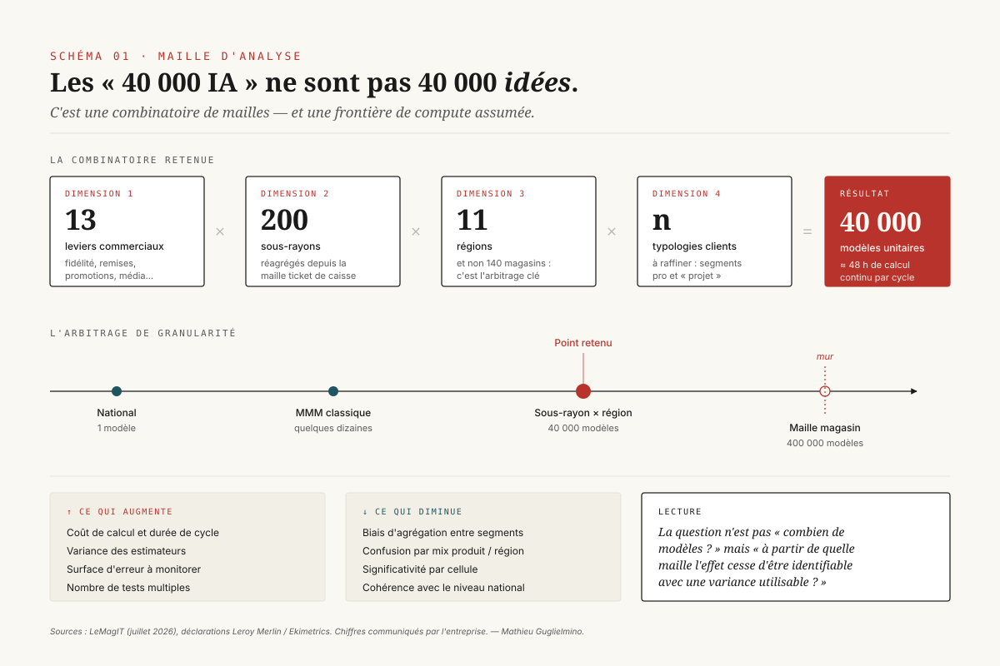
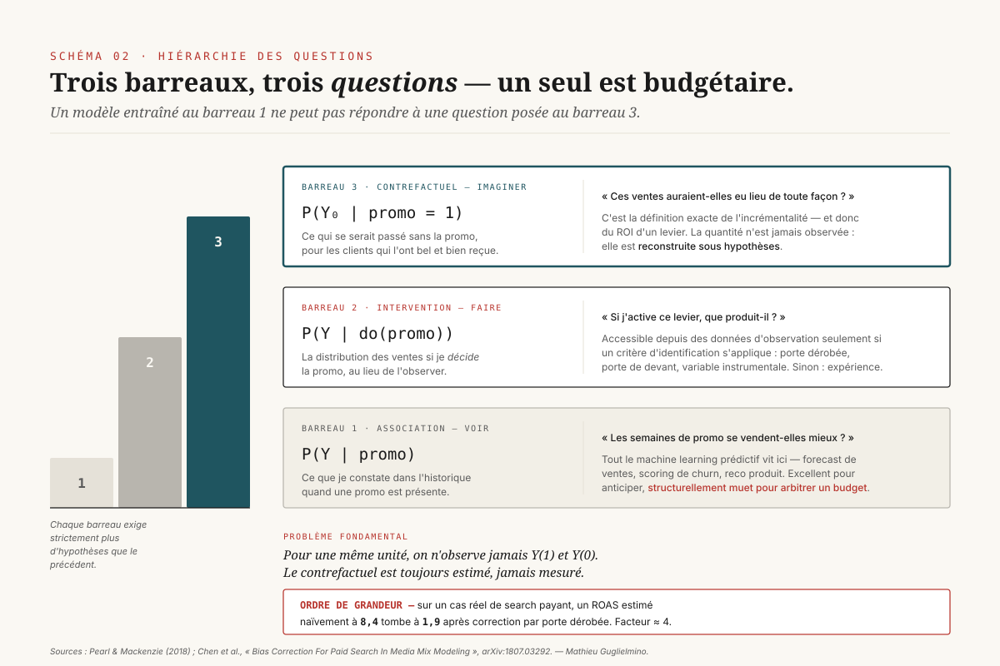
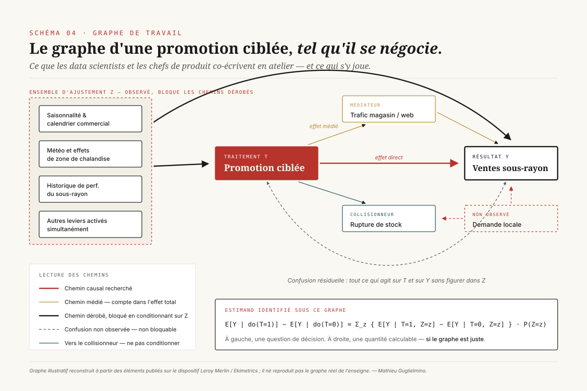
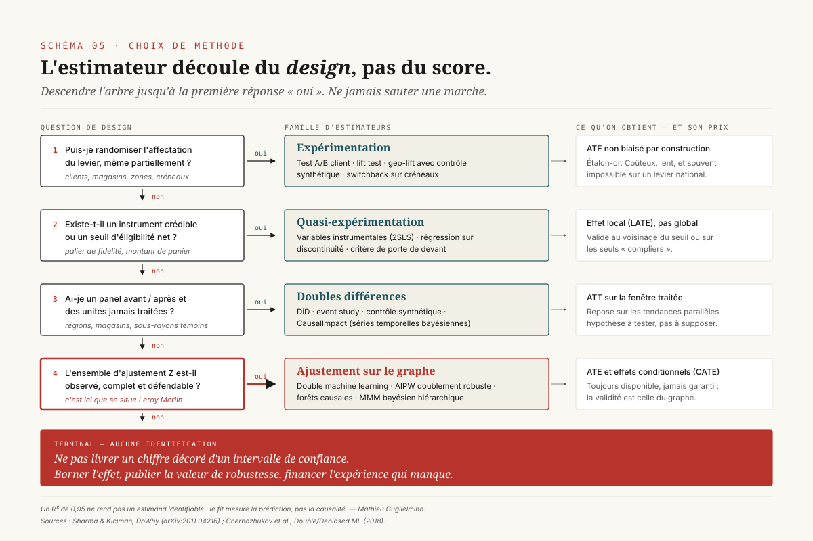
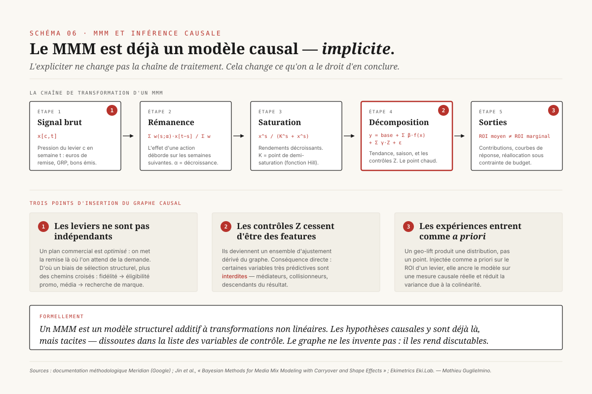
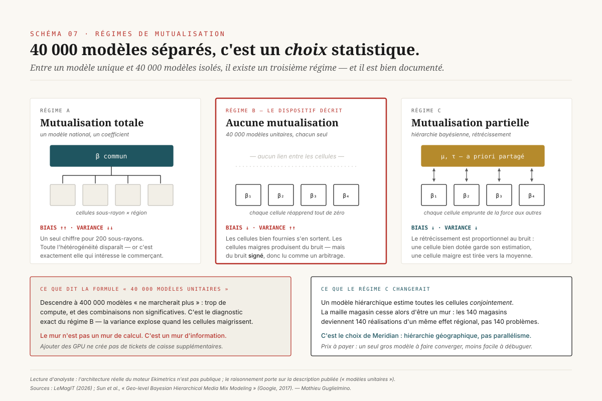
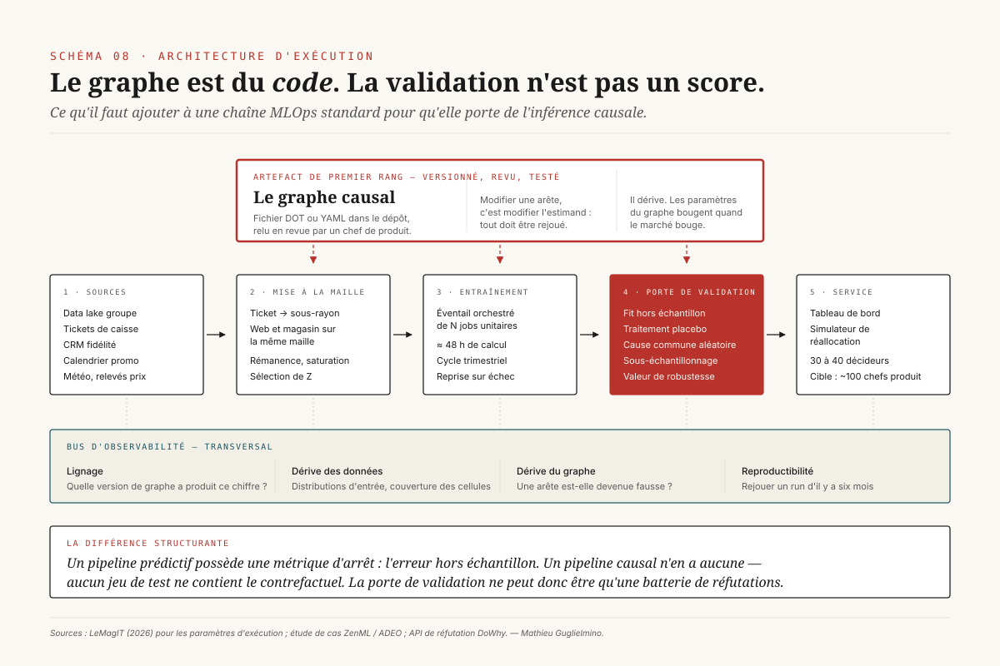

# Ce que la promotion a vraiment causé

> **Le passage du prédictif au causal en retail n'est pas un changement d'algorithme : c'est un changement d'objet. On cesse d'estimer une fonction de prédiction pour estimer un estimand identifié sous un graphe — et dès lors, c'est le graphe, pas le modèle, qui porte le risque.** — 26 juillet 2026, Mathieu Guglielmino

## Synthèse exécutive

- **Le chiffre de « 40 000 IA » décrit une maille, pas une prouesse.** Le croisement de 13 leviers commerciaux, environ 200 sous-rayons, 11 régions et quelques typologies clients produit mécaniquement cet ordre de grandeur[^1]. L'information intéressante n'est pas le nombre de modèles : c'est le fait que descendre à la maille des 140 magasins ferait exploser le volume à 400 000 et que l'enseigne a explicitement refusé ce pas.

- **Le vrai basculement se joue sur la sélection des variables.** Dans un modèle prédictif, on retient les variables qui améliorent le score. Dans un modèle causal, on retient celles qu'un critère graphique autorise — et certaines variables très prédictives deviennent *interdites*. C'est une inversion complète de la discipline d'ingénierie des features.

- **L'ordre de grandeur du biais de confusion est énorme.** Sur un cas réel de search payant documenté par des chercheurs de Google, un retour sur dépense publicitaire estimé naïvement à 8,4 tombe à 1,9 une fois le biais de sélection corrigé par critère de porte dérobée[^4]. Facteur quatre. Ce n'est pas un raffinement statistique : c'est la différence entre financer un levier et le supprimer.

- **« 40 000 modèles unitaires » est un choix statistique discutable, et il est discutable dans les deux sens.** Estimer chaque cellule séparément, c'est le régime du *pooling* nul : biais faible, variance élevée. La littérature du MMM géographique — celle dont Meridian est l'implémentation ouverte — a tranché pour le pooling partiel hiérarchique[^8][^9]. Le mur des 400 000 modèles n'est pas un mur de calcul, c'est un mur d'information ; et une hiérarchie bayésienne le déplace.

- **L'agentique amplifie exactement ce qui est fragile.** Un agent qui réalloue un budget hérite de l'estimand sans pouvoir le contester. Et l'idée symétrique — confier au modèle de langue la construction du graphe — se heurte à une littérature 2026 dure : sur la découverte causale pure, les modèles plafonnent et s'effondrent dès qu'on renomme les variables[^13][^14].

---

## 1. Ce que Leroy Merlin a construit, décodé

Commençons par démonter le chiffre, parce qu'il est devenu le titre et qu'il masque le projet.

L'enseigne a croisé quatre dimensions : 13 leviers commerciaux (programme de fidélité, remises nationales, opérations locales, promotions, publicité…), près de 200 sous-rayons, 11 régions, et plusieurs typologies de clients[^1]. Le produit des trois premières donne déjà 28 600. Les typologies clients n'ajoutent donc qu'un facteur d'environ 1,4 — ce qui signifie soit un nombre très restreint de segments, soit un élagage des combinaisons vides, probablement les deux. La vérification arithmétique inverse confirme la logique : passer des 11 régions aux 140 magasins multiplie par 12,7, soit environ 363 000 modèles, que les intéressés arrondissent à 400 000[^1].

Cette arithmétique n'est pas un jeu. Elle établit que **le nombre de modèles est une variable de sortie, pas une ambition**. Personne n'a décidé de faire 40 000 modèles ; on a décidé d'une maille, et 40 000 en est tombé. Les responsables du projet racontent d'ailleurs le mouvement inverse : l'ambition initiale était d'intégrer tout le périmètre, avant que le scope ne soit délibérément resserré[^1].

*Schéma 1 — La combinatoire retenue, l'axe de granularité sur lequel elle se place, et ce que chaque pas vers plus de finesse fait gagner ou perdre.*

### Le socle, et l'événement qui l'a sauvé

Le dispositif s'appuie sur plusieurs téraoctets de données collectées depuis 2022 dans les data lakes du groupe, descendant jusqu'à la maille du ticket de caisse avant réagrégation au sous-rayon[^1]. Deux détails d'ingénierie méritent d'être relevés parce qu'ils conditionnent tout le reste.

Le premier est que **les données web et magasin sont traitées au même niveau**, parce que le parcours client mêle les deux. C'est une décision de modélisation, pas une commodité technique : elle définit l'unité d'observation. Si l'on avait séparé les canaux, chaque modèle aurait mesuré l'effet d'un levier *conditionnellement au canal*, ce qui est un estimand différent — et probablement biaisé, puisque le canal est lui-même une conséquence du levier.

Le second est un coup de chance transformé en actif. En cours de projet, Leroy Merlin est passé à une carte de fidélité gratuite. La décision relevait de la stratégie commerciale et non du data, soulignent les responsables, mais le taux d'identification des clients y a gagné de l'ordre de 30 %[^1]. Or le taux d'identification n'est pas un indicateur de confort : c'est ce qui détermine si les typologies clients sont observables et donc si la quatrième dimension du croisement existe. Une décision commerciale a rendu possible une dimension d'analyse. C'est une leçon d'architecture data qu'aucune roadmap ne produit.

### Les paramètres d'exécution

Le pipeline complet demande près de 48 heures de calcul continu pour stabiliser l'ensemble des coefficients[^1]. Le réentraînement est prévu tous les trois mois, et il est désormais assuré par les équipes de l'enseigne : le code du cabinet partenaire leur a été transféré à l'issue de la première phase, avec l'exigence explicite de pouvoir monitorer la dérive du modèle en autonomie[^1].

Cette clause de transfert est plus significative qu'elle n'en a l'air. Un modèle causal en production n'est pas un actif figé : les paramètres du graphe bougent quand le marché bouge. Une organisation qui ne peut pas modifier son propre graphe est une organisation qui devra racheter du conseil à chaque évolution du marché. Le « make or buy » ici n'a pas porté sur la construction mais sur **la propriété de la spécification**.

### Ce que le dispositif sert, et à qui

Les premiers résultats ont circulé sous forme de présentations, puis via un tableau de bord interne. Un simulateur de réallocation budgétaire, adossé à des courbes de réponse ajustées, complète le dispositif et permet de visualiser l'impact d'un déplacement de budget d'une catégorie à une autre[^1].

Le point le plus contre-intuitif du cas est là : **l'outil ne vise pas une diffusion massive**. Il cible initialement une centaine de chefs de produit, et plus vraisemblablement entre 30 et 40 décideurs clés — contrôleurs de gestion, responsables de la performance[^1]. Pour un dispositif à 40 000 modèles, c'est un ratio modèles/utilisateurs supérieur à mille. Cette asymétrie n'est pas absurde : la valeur d'un système de mesure ne se compte pas en utilisateurs mais en euros d'arbitrage éclairés.

### Les résultats annoncés, et le principe de prudence

Trois enseignements sont mis en avant : le nouveau programme de fidélité payant afficherait un retour sur investissement supérieur de 30 % à l'ancienne carte payante ; les promotions ciblées sur des profils spécifiques généreraient un retour deux fois supérieur à une animation de masse ; et les leviers locaux, activés par les magasins, créeraient une valeur réelle bien qu'inférieure aux opérations nationales[^1].

Ces chiffres sont communiqués par l'entreprise et n'ont pas fait l'objet d'une validation indépendante. Ils doivent être lus comme des sorties de modèle, pas comme des mesures. Le responsable data formule lui-même la posture correcte : « l'important n'est pas de savoir si le bon chiffre est 30 ou 35 », mais d'en suivre l'évolution d'une année sur l'autre[^1]. C'est exactement la bonne posture épistémique, et nous verrons en section 7 pourquoi elle est techniquement fondée.

Un dernier élément mérite d'être noté, parce qu'il désamorce un fantasme récurrent : **le modèle n'a pas invalidé les intuitions commerciales**. L'enseigne indique n'avoir découvert aucun mauvais choix rétrospectif[^1]. Une IA causale qui confirme le métier n'est pas une IA inutile — c'est une IA qui vient de transformer une intuition en actif défendable devant un contrôleur de gestion.

---

## 2. Pourquoi un modèle prédictif ne peut pas répondre à la question posée

La quasi-totalité du machine learning déployé en retail répond à une question de la forme : *que va-t-il se passer ?* Combien d'unités partiront la semaine prochaine, quel client risque de churner, quel produit recommander. Ces modèles estiment une distribution conditionnelle P(Y | X) et l'optimisent contre une erreur hors échantillon.

La question du chef de produit est d'une autre nature. « Combien rapporte cette promotion ? » n'est pas une question sur ce que l'on observe. C'est une question sur ce qui se serait passé si l'on avait fait autrement. Et il n'existe aucune quantité observable dans l'historique qui corresponde à cette question.

*Schéma 2 — Trois niveaux de question, trois formalismes, trois exigences croissantes en hypothèses. Un modèle entraîné au barreau 1 ne peut structurellement pas répondre à une question posée au barreau 3.*

### Les trois barreaux

Le premier barreau est celui de l'**association** : P(Y | promo). Ce que je constate dans l'historique quand une promotion est présente. Un modèle de forecast excellent vit ici, et il y est parfaitement légitime.

Le deuxième est celui de l'**intervention** : P(Y | do(promo)). La distribution des ventes si je *décide* la promotion, au lieu de l'observer. L'opérateur `do` marque une amputation du graphe : on coupe toutes les flèches qui entrent dans la variable manipulée, parce qu'en la fixant, on la soustrait à ses causes habituelles[^3]. C'est précisément ce qui distingue une expérience d'une observation.

Le troisième est celui du **contrefactuel** : quelle aurait été la valeur des ventes, pour les clients qui *ont* reçu la promotion, si on ne la leur avait pas donnée. C'est la définition exacte de l'incrémentalité, et donc du ROI d'un levier[^2]. C'est aussi une quantité qui n'est jamais observée — c'est ce qu'on appelle le problème fondamental de l'inférence causale : pour une même unité, on n'observe jamais à la fois Y(1) et Y(0).

Chaque barreau exige strictement plus d'hypothèses que le précédent. Et aucune quantité d'entraînement ne fait monter un modèle d'un barreau : l'information manquante n'est pas dans les données, elle est dans la structure qu'on leur superpose.

### Pourquoi le retail est un cas particulièrement piégeux

Le biais de confusion en marketing n'est pas un accident : il est *structurel*, parce qu'un plan commercial est optimisé. On met la remise là où l'on attend de la demande. On pousse le média avant les périodes de forte saisonnalité. On cible les promotions sur les segments qui répondent historiquement le mieux[^2].

Autrement dit, le levier et le résultat partagent systématiquement des causes communes — la saison, le calendrier, l'anticipation de la demande. Une régression naïve de ventes sur dépense promotionnelle attribue au levier tout ce que ces causes communes expliquent. Le coefficient est donc gonflé, et il est gonflé d'autant plus que le plan est bien optimisé. C'est un paradoxe cruel : **plus une équipe commerciale est bonne, plus la mesure naïve de sa performance est fausse.**

L'ordre de grandeur de cette distorsion est documenté. Sur un cas de search payant analysé par des chercheurs de Google, le retour sur dépense estimé par une régression classique s'établit à 8,4, avec une erreur standard de 1,30. Un ajustement heuristique de la demande le ramène à 7,3 — donc corrige peu. La correction fondée sur le critère de porte dérobée, elle, donne 1,9, une valeur bien plus proche du résultat expérimental de référence[^4]. On ne parle pas d'un ajustement de quelques points : on parle d'un facteur quatre, et d'une conclusion budgétaire opposée.

### La formulation opérationnelle

Voici la reformulation qui rend l'enjeu tangible pour un chef de produit. Un modèle prédictif dit : « quand vous baissez les prix, les ventes montent ». Un modèle causal dit : « cette baisse de prix a généré X euros de ventes qui n'auraient pas eu lieu sinon ». La première phrase est vraie et inutile pour arbitrer. La seconde est incertaine et décisionnelle.

C'est aussi pourquoi l'objection « votre chiffre n'est pas fiable » se retourne. Les équipes de Leroy Merlin ont soulevé cette critique à la sortie des premiers indicateurs[^1]. La bonne réponse n'est pas de défendre la précision du chiffre, mais de rappeler que l'alternative à un contrefactuel estimé n'est pas un contrefactuel exact — c'est un contrefactuel implicite, non écrit, et lui aussi faux.

---

## 3. Le graphe causal : une grammaire, pas un diagramme

Le point le plus mal compris du dossier Leroy Merlin est celui-ci : le graphe causal co-construit entre data scientists et experts métier n'est pas un outil de pédagogie. Ce n'est pas un schéma qu'on dessine pour rassurer les décideurs et dissiper l'effet de boîte noire — la justification mise en avant publiquement[^1]. C'est **l'objet qui définit ce que le modèle a le droit de calculer**.

Le responsable data le décrit comme un moyen d'intégrer l'expertise métier pour déterminer ce qui génère de la valeur lors d'une promotion — catégorie de produit, saisonnalité, effet du programme de fidélité[^1]. La formulation est modeste ; la fonction est fondatrice. Sans le graphe, il n'y a pas d'estimand ; sans estimand, il n'y a rien à estimer.

### Trois briques, et une seule règle

Un graphe causal orienté acyclique se décompose en trois structures élémentaires, et tout le raisonnement d'identification se ramène à leur combinaison.

*Schéma 3 — La grammaire minimale : chaîne, fourche, collisionneur ; puis les quatre rôles qu'une variable peut jouer dans un modèle de promotion, avec le geste correct associé à chacun.*

La **chaîne** (X → M → Y) transmet l'information. Conditionner sur M ferme le chemin — et détruit l'effet total qu'on cherchait à mesurer. Exemple retail : promotion → trafic magasin → ventes. Si l'on met le trafic dans le modèle, on mesure l'effet de la promotion *à trafic constant*, ce qui n'a aucun sens budgétaire.

La **fourche** (X ← Z → Y) crée une corrélation sans lien causal. C'est le confondeur classique : la saisonnalité pousse à la fois la décision promotionnelle et les ventes. Conditionner sur Z ferme ce chemin dérobé. C'est le geste central de l'ajustement.

Le **collisionneur** (X → C ← W) est fermé par défaut. Conditionner sur C *l'ouvre* et fabrique une corrélation qui n'existe pas. Exemple retail redoutable : promotion → rupture de stock ← demande locale imprévue. Si l'on ajoute « rupture de stock » comme variable de contrôle — ce qui semble raisonnable, puisqu'une rupture affecte évidemment les ventes — on crée une association artificielle entre la promotion et la demande latente, laquelle influe sur les ventes. Le coefficient de la promotion est alors biaisé par une variable qu'on croyait neutraliser.

### L'inversion de la discipline d'ingénierie des features

C'est ici que l'écart avec le ML prédictif devient irréconciliable, et c'est le point que tout data scientist qui bascule doit intégrer.

Dans un pipeline prédictif, la question est : *cette variable améliore-t-elle le score ?* Si oui, on la garde. Dans un pipeline causal, la question est : *le critère graphique autorise-t-il cette variable dans l'ensemble d'ajustement ?* Et il se trouve que les variables les plus prédictives sont souvent précisément celles qu'il faut exclure — les médiateurs, les collisionneurs, les descendants du résultat. Une variable comme « marge réalisée sur la semaine » est extraordinairement prédictive des ventes de la semaine. Elle est aussi une conséquence de Y, et l'inclure détruit l'estimation.

Il n'existe aucun critère interne aux données pour arbitrer. Deux graphes différents peuvent engendrer exactement la même distribution jointe observée : ils appartiennent à la même classe d'équivalence de Markov et les données ne les départagent pas. **C'est la raison épistémique — et non managériale — pour laquelle le graphe doit être co-construit avec le métier.** L'expert commercial n'est pas là pour valider ; il est là pour apporter l'information que les données ne contiennent structurellement pas : le sens des flèches.

### Un graphe de travail réaliste

*Schéma 4 — Ce que les data scientists et les chefs de produit co-écrivent effectivement en atelier : un ensemble d'ajustement, un chemin médié, un piège de collisionneur, et l'aveu de ce qui reste hors du graphe.*

Le Schéma 4 met en scène l'atelier tel qu'il se déroule. Quatre familles de variables sont candidates à l'ensemble d'ajustement Z : saisonnalité et calendrier commercial, météo et effets de zone de chalandise, historique de performance du sous-rayon, et — c'est le point le moins intuitif — **les autres leviers activés simultanément**.

Ce dernier mérite qu'on s'y arrête. Pour l'estimand d'une promotion ciblée, la remise nationale concomitante et le programme de fidélité ne sont pas des « autres sujets » : ce sont des variables de l'ensemble d'ajustement. Or c'est exactement ce que la situation antérieure ne permettait pas. Le MMM existait déjà chez Leroy Merlin, mais sans vision transverse : les leviers étaient traités en silo[^1]. Un MMM en silo est un MMM qui omet les confondeurs les plus puissants, à savoir les autres leviers. **La suppression des silos n'est pas une amélioration organisationnelle : c'est une correction de biais.**

L'estimand identifié sous ce graphe s'écrit alors comme une formule d'ajustement classique : l'effet moyen se calcule en moyennant, sur la distribution de Z, l'écart des ventes entre traitement et absence de traitement à Z fixé. La partie gauche de l'égalité est une question de décision ; la partie droite est calculable — à condition que le graphe soit juste.

### Ce qui reste dehors

Le Schéma 4 comporte volontairement une arête en pointillés, sans origine nommée : la confusion résiduelle. Tout ce qui agit sur le levier et sur le résultat sans figurer dans Z.

Aucun dispositif ne l'élimine. Un modèle causal honnête ne prétend pas l'avoir supprimée ; il en quantifie l'impact potentiel. C'est l'objet de l'analyse de sensibilité, sur laquelle nous reviendrons — et notamment de la **valeur de robustesse**, qui répond à la question : quelle force minimale un confondeur omis devrait-il avoir, à la fois avec le traitement et avec le résultat, pour renverser ma conclusion ?[^7] Un effet dont la valeur de robustesse est de 1 % est un effet fragile. Un effet dont la valeur de robustesse est de 20 % est un effet sur lequel on peut engager un budget.

### La nuance que le graphe ne portera jamais

Un dernier point, et il est important pour ne pas survendre la méthode. Le responsable data cite le cas du jardin : catégorie très concurrentielle, élasticité-prix faible, ROI décevant — mais flux de clients généré considérable, et rôle de produit d'appel[^1].

Aucun graphe causal centré sur les ventes du sous-rayon ne capturera cela. Non pas parce que la méthode est faible, mais parce que **le résultat mesuré n'est pas le bon**. Si le jardin est un produit d'appel, l'estimand pertinent n'est pas « ventes du sous-rayon jardin » mais « ventes totales du magasin » ou « valeur client à douze mois ». Le choix du Y est une décision aussi structurante que le choix de Z, et elle est beaucoup moins discutée. C'est là que le bon sens commerçant intervient — non pas pour corriger le modèle, mais pour signaler qu'on a modélisé la mauvaise question.

---

## 4. De l'estimand à l'estimateur : deux problèmes qu'il ne faut pas mélanger

La contribution méthodologique la plus utile des bibliothèques modernes d'inférence causale est une séparation de responsabilités, formalisée par DoWhy en quatre verbes : *modéliser*, *identifier*, *estimer*, *réfuter*[^5].

**Modéliser**, c'est écrire le graphe. **Identifier**, c'est vérifier, par un raisonnement purement graphique, que la quantité causale visée s'exprime en fonction de quantités observables — et produire cette expression, l'estimand. **Estimer**, c'est calculer numériquement cette expression avec l'outil statistique de son choix. **Réfuter**, c'est tenter de casser son propre résultat.

Cette séparation a une conséquence pratique majeure : le choix de l'estimateur est libre *une fois l'estimand fixé*, et plusieurs estimateurs peuvent servir un même estimand. À l'inverse, aucun estimateur, si sophistiqué soit-il, ne compense un défaut d'identification. C'est l'erreur la plus fréquente des équipes qui abordent le sujet par la boîte à outils : on ne résout pas un problème d'identification avec un gradient boosting.

*Schéma 5 — Descendre l'arbre jusqu'à la première réponse « oui ». Le design de données commande, pas la performance en validation.*

### Le catalogue, et ses conditions d'emploi

**Randomisation possible → expérimentation.** Test A/B client, lift test, geo-lift avec contrôle synthétique, switchback sur créneaux. L'effet moyen est non biaisé par construction. C'est l'étalon-or, mais il est coûteux, lent, et souvent impossible sur un levier national : on ne suspend pas une carte de fidélité dans trois régions pour voir.

**Instrument ou seuil → quasi-expérimentation.** Variables instrumentales, régression sur discontinuité. En retail, les seuils d'éligibilité sont partout : paliers de fidélité, montants de panier déclenchant une remise, seuils de franco de port. Ce sont des discontinuités exploitables, et elles sont sous-utilisées. Le prix à payer est que l'effet obtenu est local : valide au voisinage du seuil, pas généralisable au reste de la base.

**Panel avant/après avec unités jamais traitées → doubles différences.** DiD, event study, contrôle synthétique, séries temporelles bayésiennes à la CausalImpact. Particulièrement adapté au retail multi-sites, où les magasins ou régions non traités fournissent naturellement le contrefactuel. L'hypothèse critique — les tendances parallèles — doit être testée sur la période pré-traitement, jamais supposée.

**Ensemble d'ajustement observé et défendable → ajustement sur le graphe.** C'est le régime dans lequel se place le dispositif Leroy Merlin, et c'est celui qui offre le plus de latitude technique.

### Ce qu'apporte le double machine learning

Dans ce quatrième régime, une famille d'estimateurs mérite une mention particulière parce qu'elle réconcilie la flexibilité du ML avec la validité de l'inférence.

Le problème classique : si l'on modélise l'effet du traitement en injectant directement des prédictions issues de modèles de ML flexibles, on hérite de leur biais de régularisation. Le lasso, les forêts et le boosting sont conçus pour arbitrer biais et variance dans un objectif de prédiction — cet arbitrage pollue le coefficient causal.

Le double machine learning règle cela par deux mécanismes conjoints[^6]. Le premier est l'**orthogonalité de Neyman** : on construit un score dont la dérivée par rapport aux paramètres de nuisance s'annule au point vrai, ce qui rend l'estimation localement insensible aux petites erreurs sur ces paramètres. Le second est le **cross-fitting** : on partitionne l'échantillon, on estime les fonctions de nuisance sur une partie et le paramètre cible sur l'autre, en alternant. Cela supprime la dépendance entre l'erreur d'estimation des nuisances et l'échantillon utilisé pour le paramètre.

Le résultat est puissant : on obtient une convergence en racine de n et des intervalles de confiance valides *alors même que* les fonctions de nuisance sont estimées par des méthodes qui convergent bien plus lentement. Concrètement, un data scientist peut utiliser son gradient boosting habituel pour modéliser la propension à recevoir une promotion et l'espérance des ventes, et obtenir malgré tout une estimation d'effet avec une inférence correcte.

### Effets hétérogènes : le lien avec l'uplift

Le retail ne se contente pas de l'effet moyen. La question « quel client faut-il cibler ? » porte sur l'effet conditionnel — le CATE. C'est le territoire de l'uplift modeling, et le vocabulaire y diffère alors que les mathématiques sont les mêmes.

Les méta-apprenants (S, T, X, R, DR) et les forêts causales estiment cette quantité conditionnelle. Un point empirique mérite d'être connu avant de sur-ingénierer : sur une comparaison à grande échelle menée sur près de 14 millions d'enregistrements clients du jeu Criteo, le S-learner avec LightGBM obtient le meilleur coefficient de Qini, devançant le X-learner malgré le déséquilibre de traitement ; les 20 % de clients les mieux classés capturent 77,7 % des conversions incrémentales[^16]. La sophistication de l'estimateur n'est pas le levier principal — la qualité du design l'est.

C'est directement relié au résultat annoncé par Leroy Merlin : des promotions ciblées générant un retour deux fois supérieur à une animation de masse[^1]. C'est exactement la signature d'un gain d'uplift : on cesse d'arroser les « acquis d'avance » et les « causes perdues » pour concentrer la dépense sur les persuadables.

---

## 5. Le MMM était déjà un modèle causal — il ne le disait pas

Une confusion circule : l'IA causale remplacerait le Marketing Mix Modeling. C'est faux, et le cas Leroy Merlin le montre bien puisque le MMM y préexistait[^1]. Ce qui change, c'est le statut des hypothèses.

*Schéma 6 — La chaîne de transformation d'un MMM reste identique. Le graphe causal s'y insère en trois points précis, et modifie ce qu'on a le droit de conclure.*

### La chaîne, inchangée

Un MMM applique trois transformations avant décomposition. La **rémanence** (adstock) capture le fait que l'effet d'une action déborde sur les semaines suivantes : le signal transformé est une moyenne pondérée des pressions passées, avec un paramètre de décroissance. La **saturation** capture les rendements décroissants, typiquement par une fonction de Hill paramétrée par un point de demi-saturation. Puis vient la **décomposition additive** : le résultat s'écrit comme une base, une tendance, une saisonnalité, la somme des contributions transformées de chaque levier, et un terme de contrôle[^8].

Formellement, c'est **un modèle structurel additif à transformations non linéaires**. Les hypothèses causales y sont déjà présentes — elles sont dissoutes dans le choix des variables de contrôle et dans la forme fonctionnelle. Le graphe ne les invente pas : il les rend discutables.

### Trois points d'insertion

Le premier concerne les **dépendances entre leviers**. Un MMM classique traite les canaux comme des contributeurs indépendants. Or les leviers s'influencent : le média pousse la recherche de marque, le programme de fidélité conditionne l'éligibilité aux promotions ciblées, une opération nationale change le contexte d'une opération locale. Expliciter ces chemins permet de décomposer effets directs et indirects au lieu de les mélanger dans un coefficient unique[^2].

Le deuxième concerne les **contrôles**. Ils cessent d'être une liste de variables jugées utiles pour devenir un ensemble d'ajustement dérivé du graphe. C'est la conséquence la plus opérationnelle : certaines variables sortent du modèle malgré leur pouvoir prédictif, et cette exclusion doit pouvoir être justifiée par un argument graphique, pas par un score.

Le troisième concerne la **calibration expérimentale**. Un geo-lift ne produit pas un point mais une distribution. Injectée comme *a priori* sur le ROI d'un levier dans un modèle bayésien, cette distribution ancre le modèle sur une mesure causale réellement obtenue[^10][^18]. Meridian en a fait un argument central : les résultats d'expériences d'incrémentalité s'intègrent comme *a priori*, indépendamment du canal ou du type d'expérience[^17].

Ce point est capital face à la colinéarité. Quand plusieurs leviers montent et descendent ensemble — ce qui est la norme d'un plan commercial cohérent — le modèle ne peut pas les départager sur les seules données. Il produit des coefficients instables, parfois de signe absurde. Une expérience sur un seul canal réduit brutalement cet espace de solutions.

### La triangulation, et non le remplacement

La bonne architecture de mesure n'est donc pas un modèle mais un système à trois étages qui se contrôlent mutuellement : le MMM en mesure permanente sur tous les leviers ; les expériences en mesure ponctuelle et fiable sur quelques leviers ; l'attribution en signal rapide et granulaire, à recalibrer en permanence contre les deux premiers.

Chacun échoue seul. Le MMM manque de précision et de fraîcheur, les expériences ne couvrent pas tout et coûtent cher, l'attribution est biaisée par construction. Ensemble, ils forment une boucle. C'est ce que l'enseigne décrit comme le passage d'une lecture en silo à une lecture transverse des leviers — et c'est, techniquement, une architecture de triangulation.

### Un manque notable dans le cas décrit

Il faut le relever honnêtement : rien dans la description publique du dispositif Leroy Merlin ne mentionne de programme d'expérimentation systématique venant calibrer les 40 000 modèles. Le dispositif décrit repose sur la validation du fit hors échantillon, la co-construction du graphe et la confrontation au bon sens métier[^1].

C'est déjà considérable. Mais un geo-lift trimestriel sur deux ou trois leviers, mené en rotation, fournirait un ancrage externe qu'aucune validation interne ne peut produire — et transformerait la question « ce chiffre est-il bon ? » en une question empiriquement décidable. C'est probablement le meilleur prochain euro à investir dans ce type de dispositif.

---

## 6. 40 000 modèles unitaires : ce que ce choix engage

Nous arrivons au point d'architecture le plus discutable du dossier, et il mérite d'être traité sans complaisance dans un sens comme dans l'autre.

*Schéma 7 — Entre un modèle national unique et 40 000 modèles isolés, il existe un troisième régime, et il est le mieux documenté des trois.*

### Trois régimes

La **mutualisation totale** estime un coefficient unique pour toutes les cellules. Biais élevé, variance faible. Toute l'hétérogénéité disparaît — or c'est exactement elle qui intéresse le commerçant : savoir que la promotion marche mieux en sanitaire qu'en jardin est tout l'objet de l'exercice.

L'**absence de mutualisation** estime chaque cellule séparément. Biais faible, variance élevée. Les cellules bien fournies s'en sortent très bien. Les cellules maigres — un sous-rayon de niche dans une petite région pour un segment client rare — produisent du bruit. Mais du bruit *signé*, avec un intervalle, présenté dans un tableau de bord, et donc lu comme un arbitrage.

La **mutualisation partielle** estime toutes les cellules conjointement sous un *a priori* partagé. Chaque cellule emprunte de la force aux autres, et le rétrécissement vers la moyenne est proportionnel au bruit local : une cellule bien dotée conserve son estimation, une cellule maigre est tirée vers le comportement moyen. C'est le régime dominant de la littérature du MMM géographique[^9], et c'est le choix architectural de Meridian, qui met partiellement en commun les coefficients de traitement et de contrôle entre géographies tout en supposant communs les paramètres de tendance, de rémanence et de saturation[^8].

### Relire le mur des 400 000

Le diagnostic donné par les praticiens pour refuser la maille magasin est double : trop de compute et trop de temps d'entraînement, et surtout des combinaisons qui cessent de produire des résultats significatifs à cette échelle[^1].

La seconde moitié de la phrase est la vraie. Le problème n'est pas le calcul : c'est que la quantité d'information par cellule s'effondre quand on subdivise. Or c'est précisément le symptôme du régime B. **Le mur n'est pas un mur de calcul, c'est un mur d'information — et ajouter des GPU ne crée pas de tickets de caisse supplémentaires.**

Dans un régime de mutualisation partielle, cette limite se déplace. Les 140 magasins cessent d'être 140 problèmes d'estimation indépendants pour devenir 140 réalisations bruitées d'un même effet régional. Les magasins peu fréquentés ne produisent pas de bruit : ils produisent une estimation prudemment ramenée vers leur région, ce qui est l'information correcte à afficher.

### Les contre-arguments, qui sont réels

Il faut être équitable, car le choix des modèles unitaires a des mérites que la théorie sous-estime.

Il est **débuggable**. Quand un chef de produit conteste un chiffre sur son sous-rayon, on ouvre un modèle, on regarde ses résidus, on l'explique. Dans un modèle hiérarchique unique, la réponse est « cette valeur résulte du rétrécissement postérieur », ce qui est vrai et inaudible.

Il est **parallélisable trivialement**. 40 000 jobs indépendants se distribuent sans effort et se rejouent individuellement en cas d'échec. Un gros modèle hiérarchique doit converger d'un bloc, et un échec de convergence à la vingt-quatrième heure est un incident coûteux.

Il est **incrémental**. Ajouter un sous-rayon ajoute des modèles sans invalider les autres. Dans une hiérarchie, ajouter un niveau change toutes les estimations.

Il **échoue localement**. Une cellule aberrante reste une cellule aberrante ; elle ne contamine pas les autres via l'*a priori* partagé — un risque réel quand la spécification hiérarchique est mal posée.

Le cabinet revendique par ailleurs un renforcement de la modélisation causale et bayésienne multi-KPI, ainsi qu'une intégration plus étroite entre MMM, expérimentation et suivi digital continu[^19].

Enfin, précisons ce que nous ne savons pas : l'architecture interne du moteur du cabinet partenaire n'est pas publique — pas plus que le détail des autres chantiers IA du groupe, dont la gouvernance est pilotée « par la valeur » avec des revues hebdomadaires par pays[^12]. La formule « 40 000 modèles unitaires » décrit une expérience utilisateur et un mode d'exécution ; elle n'exclut pas formellement une forme de partage de paramètres entre modèles. Le raisonnement ci-dessus porte sur la description publiée, pas sur une implémentation vérifiée.

### La recommandation opérationnelle

Pour une équipe qui construit ce type de dispositif aujourd'hui, le choix n'a pas à être binaire. Une architecture pragmatique consiste à hiérarchiser sur les dimensions où l'emprunt de force est légitime — les régions et les magasins, où le résultat et les pressions ont la même interprétation et se normalisent par la population ou le chiffre d'affaires — et à garder des modèles séparés sur les dimensions où il ne l'est pas, comme les catégories de produits, dont les dynamiques n'ont aucune raison de partager un *a priori*. C'est d'ailleurs l'avertissement explicite de la documentation Meridian : la structure hiérarchique a été conçue pour la géographie, et son usage sur une autre variable catégorielle est déconseillé sauf à pouvoir stratifier proprement résultat et pressions[^8].

---

## 7. Industrialiser : ce que l'inférence causale fait à une plateforme

Passons à la plomberie, parce que c'est là que la plupart des projets meurent.

*Schéma 8 — Ce qu'il faut ajouter à une chaîne MLOps standard pour qu'elle porte de l'inférence causale : un artefact de spécification versionné, et une porte de validation qui ne peut pas être un score.*

### Le contexte plateforme

Le groupe a construit son socle MLOps sur Google Cloud avec le framework open source ZenML, avec un objectif explicite : rendre les data scientists autonomes jusqu'à la mise en production sans dépendre systématiquement des équipes d'infrastructure. Le délai de mise sur le marché d'un modèle serait passé de 8,5 semaines à 2 semaines[^11].

Une précision d'honnêteté s'impose : cette transformation concerne la plateforme ML du groupe dans son ensemble et n'est pas présentée comme le socle spécifique du projet d'IA causale. Les deux relèvent d'entités et de temporalités différentes. Mais la capacité générale à passer du prototype à la production sans friction est exactement ce qui distingue les organisations qui parlent d'IA de celles qui la déploient — et elle conditionne la faisabilité d'un réentraînement trimestriel de 40 000 modèles par une équipe interne.

### Ce qui change vraiment : le graphe devient du code

Dans un pipeline prédictif, les artefacts versionnés sont le code, les données et les poids. Dans un pipeline causal, il faut en ajouter un, et c'est le plus important : **le graphe**.

Il doit vivre dans le dépôt sous forme de fichier — DOT, YAML, peu importe — et non dans une diapositive d'atelier. Il doit être relu en revue de code, par un chef de produit autant que par un data scientist. Et il doit être traité comme une modification à fort impact : **changer une arête, c'est changer l'estimand, donc invalider tous les résultats et déclencher un recalcul complet**. Une organisation qui modifie son graphe sans rejouer ses chiffres publie des chiffres qui ne correspondent plus à leur définition.

Il faut également accepter qu'il dérive. Les paramètres du graphe ne sont pas figés ; ils bougent à mesure que le marché évolue[^1]. Un canal qui n'existait pas devient un levier. Un produit d'appel cesse d'en être un. Cette dérive-là n'est détectable par aucun test statistique standard : c'est une revue périodique, avec le métier, inscrite au calendrier.

### La porte de validation ne peut pas être un score

Voici la différence structurante, et elle mérite d'être énoncée sans nuance.

**Un pipeline prédictif possède une métrique d'arrêt : l'erreur hors échantillon. Un pipeline causal n'en a aucune.** Aucun jeu de test ne contient le contrefactuel. On peut valider qu'un modèle prédit bien les ventes tout en estimant complètement à côté l'effet causal de la promotion — et c'est même le cas typique, puisqu'un modèle qui absorbe la saisonnalité dans le coefficient promotionnel prédit très bien et se trompe totalement.

Leroy Merlin valide le niveau de précision de chaque modèle sur des échantillons de test non vus à l'entraînement[^1]. C'est nécessaire — un modèle qui ne prédit rien n'estime rien de bon — mais radicalement insuffisant. La porte de validation doit être une batterie de réfutations, exécutée automatiquement, avec des seuils bloquants[^5] :

- **Traitement placebo** : remplacer le levier par une variable aléatoire indépendante. L'effet estimé doit tomber à zéro. S'il ne tombe pas, le modèle capte autre chose que le levier.
- **Cause commune aléatoire** : ajouter un confondeur simulé indépendant. L'effet estimé ne doit pas bouger. S'il bouge, l'estimation est instable.
- **Sous-échantillon aléatoire** : réestimer sur un sous-ensemble. L'effet doit rester dans son intervalle. Sinon, l'estimation est portée par quelques observations.
- **Retrait d'un sous-ensemble de traités** : vérifier la stabilité par exclusion successive de segments.
- **Analyse de sensibilité** : publier, à côté de chaque effet, la valeur de robustesse — la force minimale qu'un confondeur omis devrait avoir pour annuler la conclusion[^7].

Sur 40 000 modèles, cela représente une charge de calcul du même ordre que l'entraînement lui-même. C'est le vrai coût de l'inférence causale industrielle, et c'est celui qu'on coupe en premier quand le budget serre.

### Ce qu'il faut observer en production

Quatre familles de signaux, dont deux n'existent pas dans un pipeline prédictif.

Le **lignage** répond à la question qu'un contrôleur de gestion posera tôt ou tard : quelle version de graphe a produit ce chiffre, sur quelles données, à quelle date ? Sans cela, aucun arbitrage n'est auditable.

La **dérive des données** est classique : distributions d'entrée, couverture des cellules, apparition de cellules vides.

La **dérive du graphe** ne l'est pas : une arête est-elle devenue fausse ? Elle ne se détecte pas automatiquement, mais certains symptômes alertent — un effet qui change de signe, une réfutation qui commence à échouer sur un segment, une famille de cellules dont la valeur de robustesse s'effondre.

La **reproductibilité** enfin : pouvoir rejouer à l'identique un calcul d'il y a six mois. C'est ce qui permet de répondre « le chiffre a changé parce que le graphe a changé, voici le diff » plutôt que « le modèle a été réentraîné ».

### La bonne unité de lecture

Terminons cette section par la posture méthodologique la plus juste du dossier. Face aux contestations sur la précision, le responsable data répond que l'important n'est pas de savoir si le bon chiffre est 30 ou 35, mais de voir comment il évolue d'année en année[^1].

Ce n'est pas de la diplomatie, c'est de la statistique. Le niveau absolu d'un effet estimé porte l'ensemble des biais résiduels non contrôlés. Sa **variation d'une période à l'autre**, à graphe constant et à spécification constante, en élimine une bonne partie — les biais stables se compensent en différence. La bonne unité de lecture d'un dispositif d'IA causale est donc le delta, pas le niveau. C'est aussi ce qui rend absolument critique la stabilité de la spécification : si le graphe change entre deux périodes, la comparaison ne veut plus rien dire.

---

## 8. Le passage à l'agentique

Le sujet est arrivé partout dans les feuilles de route retail, y compris chez ADEO, dont les responsables évoquent explicitement les agents autonomes et la responsabilité humaine parmi leurs priorités de gouvernance[^20]. La question mérite d'être posée précisément, parce que « agentique » recouvre quatre situations dont une seule est mûre.

*Schéma 9 — Plus l'agent remonte vers la spécification du modèle, plus l'erreur devient silencieuse et rapide.*

### Niveau 1 — L'agent lit le modèle

C'est le niveau déployable, et c'est d'ailleurs celui que Leroy Merlin envisage : une interface conversationnelle de type *talk-to-data* pour démocratiser plus largement les résultats, tempérée par une question de priorité et de bande passante[^1].

Un agent qui interroge le tableau de bord, commente une variation, alerte sur un ROI trimestriel qui décroche, répond aux questions d'un chef de produit sans passer par l'équipe data : c'est de l'accès, pas de la décision. Le modèle causal reste souverain.

Le risque n'est pas nul pour autant, et il est spécifique. Un agent qui reformule fait disparaître l'incertitude. « Le ROI de la fidélité est de 30 % supérieur » est une phrase que le modèle ne produit jamais : il produit une distribution postérieure avec un intervalle et une valeur de robustesse. La fluidité du langage naturel écrase précisément l'information dont un décideur a besoin pour calibrer sa confiance. La contre-mesure est simple et rarement appliquée : **imposer que toute sortie chiffrée d'un agent soit accompagnée de son intervalle et de la mention de sa réfutation la plus faible.**

### Niveau 2 — L'agent décide avec le modèle

C'est l'extension naturelle du simulateur de réallocation. Passer d'un outil qui répond « si je mettais 15 euros au lieu de 10 sur cette catégorie, que se passerait-il ? » à un agent qui *effectue* la réallocation sous contrainte : égaliser les ROI marginaux entre catégories, respecter des planchers par rayon, intégrer le rôle de produit d'appel de certaines familles.

Techniquement, c'est une optimisation sous contrainte sur des courbes de réponse — un problème bien posé, et le point important à retenir est que la décision d'allocation se prend sur le **ROI marginal**, pas sur le ROI moyen. Le ROI moyen décrit la performance historique ; le ROI marginal décrit le rendement de l'euro suivant au niveau de dépense actuel. Réallouer sur le ROI moyen conduit systématiquement à sur-investir dans des canaux déjà saturés.

Le risque change de nature à ce niveau. **L'agent hérite de l'estimand sans pouvoir le contester.** Si une arête du graphe est fausse, l'erreur cesse d'être lente et humaine — un chef de produit dubitatif qui ralentit, discute, arbitre autrement. Elle devient une politique appliquée à toutes les cellules, chaque semaine, sans témoin. La vitesse d'exécution transforme un biais d'estimation en dérive systémique.

Trois garde-fous s'imposent avant d'autoriser ce niveau : des bornes dures sur l'amplitude de réallocation par période ; une réserve d'exploration maintenue hors optimisation, qui sert simultanément de dispositif expérimental permanent ; et une traçabilité par décision reliant chaque mouvement de budget à la version de graphe et à l'estimation qui l'ont motivé.

### Niveau 3 — L'agent construit le modèle

C'est le plus séduisant intellectuellement, et le plus sévèrement documenté.

L'idée : confier à un modèle de langue la proposition d'arêtes candidates à partir de la documentation métier, la détection de variables oubliées, l'exécution automatique de la batterie de réfutations, la rédaction du rapport de sensibilité.

Les deux dernières tâches sont légitimes et immédiatement utiles — ce sont des tâches d'orchestration et de rédaction, pas de raisonnement causal. Les deux premières se heurtent à un mur.

Le tableau empirique est net. Le benchmark Corr2Cause a montré que dix-sept modèles de langue performaient au niveau du hasard sur l'inférence causale pure à partir d'énoncés corrélationnels ; les modèles affinés atteignent une bonne exactitude en distribution mais s'effondrent sous des perturbations aussi triviales qu'un renommage de variables[^13]. Des travaux ont formulé l'hypothèse des « perroquets causaux » : les modèles restituent des faits causaux appris plutôt qu'ils ne raisonnent sur des mécanismes[^13]. Un travail de mai 2026 va plus loin en soutenant que la limitation est intrinsèque au paradigme d'apprentissage — l'affinage supervisé, l'optimisation de préférences et l'apprentissage en contexte produisent tous des prédicteurs incapables de distinguer des graphes engendrant des données observationnelles similaires — et propose de contourner l'obstacle en plaçant le modèle en oracle interrogé par une boucle bayésienne externe qui concentre les croyances sur les graphes candidats[^13]. Enfin, un benchmark interactif de 2026 portant sur trente modèles de pointe conclut que leur principal mode d'échec est précisément l'incapacité à raisonner sur des mécanismes cachés en présence de biais de sélection, d'erreur de mesure et de confondeurs non observés[^14].

Or ce sont exactement les trois pathologies du retail promotionnel. Un travail complémentaire de 2026 évalue les agents non plus sur des énoncés symboliques mais sur des scènes de données réelles où raisonnement causal, compétences data et usage d'outils comptent simultanément — le cadre le plus proche de ce qu'on demanderait à un agent dans une équipe de mesure[^15].

La conclusion opérationnelle est donc restrictive mais pas nihiliste : **l'agent propose, l'humain dispose, et la structure de la boucle importe plus que la capacité du modèle**. Un agent qui suggère « avez-vous considéré que la pression concurrentielle locale pourrait affecter à la fois votre décision promotionnelle et vos ventes ? » est utile — c'est une aide au rappel, adossée à la documentation métier. Un agent qui écrit le graphe et lance l'estimation ne l'est pas.

### Hors boucle — L'agent devient le canal

Le quatrième cas n'est pas une agentification de la mesure : c'est un changement de l'objet mesuré.

Si une part croissante du parcours d'achat — découverte, comparaison, commande — transite par un assistant, le levier commercial ne s'adresse plus à un humain mais à un système de sélection qui lit des attributs structurés et arbitre sur des critères explicites. Trois conséquences pour la mesure.

Les **traces côté navigateur disparaissent** : un agent appelle des interfaces de programmation, il ne déclenche pas de balises. Toute la mesure fondée sur le suivi de session s'aveugle progressivement.

L'**unité de traitement change** : ce n'est plus la personne exposée à une promotion, c'est la requête d'un agent mandaté. Le cadre potentiel d'un traitement individuel devient mal défini.

L'**élasticité-prix change de nature** : face à un système qui compare de manière exhaustive et instantanée, la sensibilité au prix n'est plus atténuée par les frictions cognitives sur lesquelles reposait une partie de l'efficacité promotionnelle.

Il est trop tôt pour quantifier l'ampleur du phénomène, et les projections publiées varient considérablement selon les définitions retenues. Mais la direction est structurante : c'est le MMM, fondé sur des données agrégées et sur des expériences géographiques, qui résiste le mieux à cette évolution — précisément parce qu'il n'a jamais dépendu du suivi individuel. Le paradoxe est plaisant : la méthode la plus ancienne de la boîte à outils est celle qui survit le mieux au monde des agents.

---

## 9. Playbook par rôle

### Pour le data scientist

**Désapprendre la sélection de variables par le score.** C'est le geste le plus difficile. Écrire le graphe avant de toucher aux données, et accepter d'exclure des variables très prédictives.

**Séparer explicitement identification et estimation.** Produire l'estimand comme un artefact distinct, écrit, relisible. Si l'on ne sait pas écrire l'estimand, on n'a pas de projet causal — on a une régression avec des ambitions.

**Choisir l'estimateur par le design, pas par la nouveauté.** L'arbre du Schéma 5 se descend dans l'ordre. Chercher les seuils d'éligibilité existants avant de se rabattre sur l'ajustement : le retail en regorge et ils offrent une identification bien plus solide.

**Rendre les réfutations non négociables.** Placebo, cause commune aléatoire, sous-échantillon, plus une valeur de robustesse publiée avec chaque effet. Un effet sans analyse de sensibilité n'est pas un livrable.

**Ne pas confondre uplift et incrémentalité agrégée.** Le CATE répond à « qui cibler », l'effet moyen répond à « combien investir ». Ce ne sont pas les mêmes modèles ni les mêmes décisions.

### Pour le data engineer

**Versionner le graphe comme du code**, avec revue obligatoire et déclenchement de recalcul complet à chaque modification d'arête.

**Concevoir la porte de réfutation comme une étape de première classe** du pipeline, avec seuils bloquants, et budgéter son coût de calcul dès la conception — de l'ordre de grandeur de l'entraînement.

**Instrumenter le lignage jusqu'au chiffre affiché.** Toute valeur d'un tableau de bord doit pouvoir remonter à une version de graphe, un instantané de données et un identifiant d'exécution.

**Prévoir la reprise partielle.** Sur une exécution à 48 heures, un échec en fin de course ne doit jamais imposer un rejeu complet.

**Traiter la couverture des cellules comme un signal de qualité de premier rang** : nombre d'observations effectives, chevauchement des traitements, cellules sous le seuil de significativité. Ce sont ces métriques, plus que le fit, qui prédisent la fiabilité d'une sortie.

### Pour le product owner

**Piloter le choix du résultat mesuré**, pas seulement celui des variables. Le cas du produit d'appel montre qu'une modélisation techniquement irréprochable sur le mauvais Y produit une conclusion fausse.

**Animer l'atelier graphe comme un rituel régulier**, pas comme un événement de cadrage. C'est le seul mécanisme qui capte la dérive de spécification.

**Défendre l'unité de lecture en variation.** Un tableau de bord d'IA causale doit afficher des évolutions, avec la mention explicite du fait que le graphe est resté constant sur la période comparée.

**Résister à la pression de généralisation.** Cibler 30 à 40 décideurs qui utilisent réellement l'outil vaut mieux que 500 utilisateurs occasionnels — un modèle causal mal lu est plus dangereux qu'un modèle causal non lu.

**Financer l'expérimentation.** C'est l'arbitrage le plus contre-intuitif à porter : accepter de dégrader délibérément une petite part du plan commercial pour obtenir un ancrage causal externe. C'est le seul moyen de sortir du régime où la validité repose entièrement sur des hypothèses invérifiables.

### Les cinq anti-patterns

1. **Mettre toutes les variables disponibles dans le modèle** « pour être sûr ». C'est la garantie d'inclure des médiateurs, des collisionneurs et des descendants du résultat, donc de biaiser l'estimation dans un sens imprévisible.
2. **Valider un modèle causal par son fit.** Un bon fit est nécessaire et ne prouve rien sur la causalité.
3. **Comparer des niveaux entre deux versions de graphe.** La comparaison n'a de sens qu'à spécification constante.
4. **Réallouer sur le ROI moyen.** La décision se prend sur le rendement marginal.
5. **Automatiser la décision avant d'avoir automatisé la réfutation.** Un agent qui optimise sur des corrélations ne se trompe pas moins qu'un humain : il se trompe plus vite, plus loin, et sans témoin.

---

## Ce qu'il faut retenir

Le dossier Leroy Merlin est intéressant moins pour ses 40 000 modèles que pour ce qu'il révèle d'un déplacement en cours dans le retail : la mesure de performance commerciale cesse d'être un exercice de reporting pour devenir un problème d'inférence, avec ses hypothèses, ses conditions d'identification et ses limites explicites.

Ce déplacement a un coût que peu d'organisations anticipent. Il ne se paie pas en GPU. Il se paie en heures d'atelier entre data scientists et chefs de produit pour écrire un graphe, en discipline de versionnement pour le maintenir, en calcul de réfutation pour l'éprouver, et en budget commercial délibérément sacrifié pour l'ancrer sur des expériences.

Il produit en échange quelque chose qu'aucun modèle prédictif ne donne : une phrase défendable devant un contrôleur de gestion. Non pas « les ventes montent quand on baisse les prix », mais « cette baisse a généré tel montant qui n'aurait pas eu lieu sinon, et voici la force qu'aurait dû avoir un facteur oublié pour que cette conclusion s'inverse ».

C'est peu, et c'est tout ce qui compte.

---

## Note de méthode

- Format co-écrit avec l'aide d'une IA.
- Les chiffres de performance attribués à Leroy Merlin sont communiqués par l'entreprise et n'ont pas fait l'objet d'une validation indépendante ; ils sont à lire comme des sorties de modèle, pas comme des mesures.
- Le graphe causal du schéma 4 est une reconstruction illustrative à partir des éléments publiés : il ne reproduit pas le graphe réel de l'enseigne.
- L'analyse de la section 6 sur les régimes de mutualisation porte sur la description publiée du dispositif (« modèles unitaires »), l'architecture interne du moteur du cabinet partenaire n'étant pas publique.

---

## Sources

[^1]: Ducellier, Philippe, « Leroy Merlin modélise l'impact de ses investissements commerciaux avec 40 000 IA », LeMagIT, 15 juillet 2026. URL : https://www.lemagit.fr/actualites/366645992/Leroy-Merlin-modelise-limpact-de-ses-investissements-commerciaux-avec-40000-IA. Consulté le 2026-07-26.

[^2]: Fortora, Toni, « Marketing Mix Modeling: Opportunities of Using Causal Inference », Eki.Lab (Ekimetrics), 31 mars 2025. URL : https://ekimetrics.github.io/blog/Causal_Inference/. Consulté le 2026-07-26.

[^3]: Pearl, Judea, *Causality: Models, Reasoning, and Inference*, Cambridge University Press, 2e édition ; et Pearl, Judea & Mackenzie, Dana, *The Book of Why*, Basic Books, 2018.

[^4]: Chen, Aiyou ; Chan, David ; Perry, Mike ; Jin, Yuxue ; Sun, Yunting ; Wang, Yueqing ; Koehler, Jim, « Bias Correction For Paid Search In Media Mix Modeling », arXiv:1807.03292, 2018. URL : https://arxiv.org/abs/1807.03292. Consulté le 2026-07-26.

[^5]: Sharma, Amit & Kıcıman, Emre, « DoWhy: An End-to-End Library for Causal Inference », arXiv:2011.04216, 2020. URL : https://arxiv.org/abs/2011.04216. Consulté le 2026-07-26.

[^6]: Chernozhukov, Victor ; Chetverikov, Denis ; Demirer, Mert ; Duflo, Esther ; Hansen, Christian ; Newey, Whitney ; Robins, James, « Double/Debiased Machine Learning for Treatment and Structural Parameters », *The Econometrics Journal*, vol. 21, n° 1, 2018. URL : https://academic.oup.com/ectj/article/21/1/C1/5056401. Consulté le 2026-07-26.

[^7]: Cinelli, Carlos & Hazlett, Chad, « Making Sense of Sensitivity: Extending Omitted Variable Bias », *Journal of the Royal Statistical Society, Series B*, vol. 82, n° 1, 2020, p. 39-67. URL : https://academic.oup.com/jrsssb/article-abstract/82/1/39/7056023. Consulté le 2026-07-26.

[^8]: Google, documentation méthodologique Meridian — « Media saturation and lagging », « Geo-level modeling », « FAQs ». URL : https://developers.google.com/meridian/docs/advanced-modeling/media-saturation-lagging. Consulté le 2026-07-26.

[^9]: Sun, Yueqing ; Wang, Yunting ; Jin, Yuxue ; Chan, David ; Koehler, Jim, « Geo-level Bayesian Hierarchical Media Mix Modeling », Google, 2017 — référencé comme fondement du modèle hiérarchique de Meridian. URL : https://developers.google.com/meridian/docs/pre-modeling/geo-selection-national-data. Consulté le 2026-07-26.

[^10]: Meta / facebookincubator, « GeoLift — MMM Calibration », livre blanc, dépôt GitHub. URL : https://github.com/facebookincubator/GeoLift/blob/main/Whitepapers/MMM%20Calibration/GeoLift_Calibration.pdf. Consulté le 2026-07-26.

[^11]: ZenML, « How ADEO Leroy Merlin is Scaling Data Science with ZenML », étude de cas. URL : https://www.zenml.io/case-study/adeo-leroy-merlin. Consulté le 2026-07-26.

[^12]: La Revue du Digital, « Leroy Merlin, Saint Maclou ou Weldom : l'IA au cœur du métier pour créer le plus de valeur », décembre 2025. URL : https://www.larevuedudigital.com/chez-les-enseignes-dadeo-priorite-a-lia-dans-le-coeur-de-metier-pour-creer-le-plus-de-valeur/. Consulté le 2026-07-26.

[^13]: Roy, Amartya et al., « Why LLMs Fail at Causal Discovery and How Interventional Agents Escape », arXiv:2605.27567, mai 2026 — incluant la discussion de Jin et al. (Corr2Cause) et de Zečević et al. (« Causal Parrots »). URL : https://arxiv.org/abs/2605.27567. Consulté le 2026-07-26.

[^14]: Chen et al., « CausalGame: Benchmarking Causal Thinking of LLM Agents in Games », arXiv:2607.04293, 2026. URL : https://arxiv.org/pdf/2607.04293. Consulté le 2026-07-26.

[^15]: « CausalDS: Benchmarking Causal Reasoning in Data-Science Agents », arXiv:2607.08093, juillet 2026. URL : https://arxiv.org/html/2607.08093. Consulté le 2026-07-26.

[^16]: « A Large-Scale Empirical Comparison of Meta-Learners and Causal Forests for Heterogeneous Treatment Effect Estimation in Marketing Uplift Modeling » (UpliftBench), arXiv:2604.06123, 2026. URL : https://arxiv.org/html/2604.06123. Consulté le 2026-07-26.

[^17]: Google, « Meridian is now available to everyone », blog Google, février 2025. URL : https://blog.google/products/ads-commerce/meridian-marketing-mix-model-open-to-everyone/. Consulté le 2026-07-26.

[^18]: PyMC-Marketing, « MMM Calibration with Geo-Level Lift Tests », documentation. URL : https://www.pymc-marketing.io/en/latest/notebooks/mmm/mmm_geolift_calibration.html. Consulté le 2026-07-26.

[^19]: Ekimetrics, « Ekimetrics recognized as a Leader in Marketing Measurement and Optimization », janvier 2026. URL : https://www.ekimetrics.com/articles/ekimetrics-recognized-as-a-leader-in-marketing-measurement-and-optimization-2026. Consulté le 2026-07-26.

[^20]: Républik Retail, « Shadow IA, agents, gouvernance : les défis de l'IA selon Adeo », juin 2026. URL : https://www.republik-retail.fr/solutions-techno/data/shadow-ai-agents-gouvernance-les-defis-de-l-ia-selon-adeo.html. Consulté le 2026-07-26.
