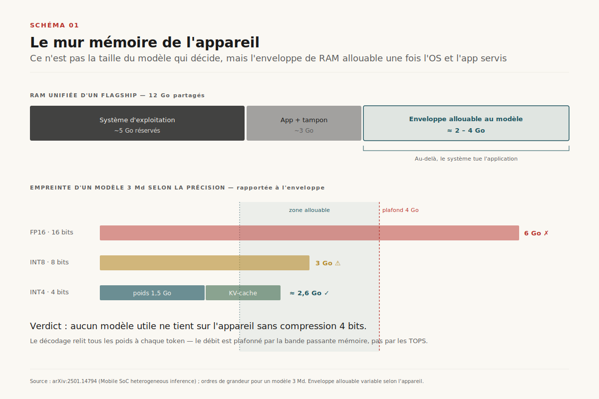
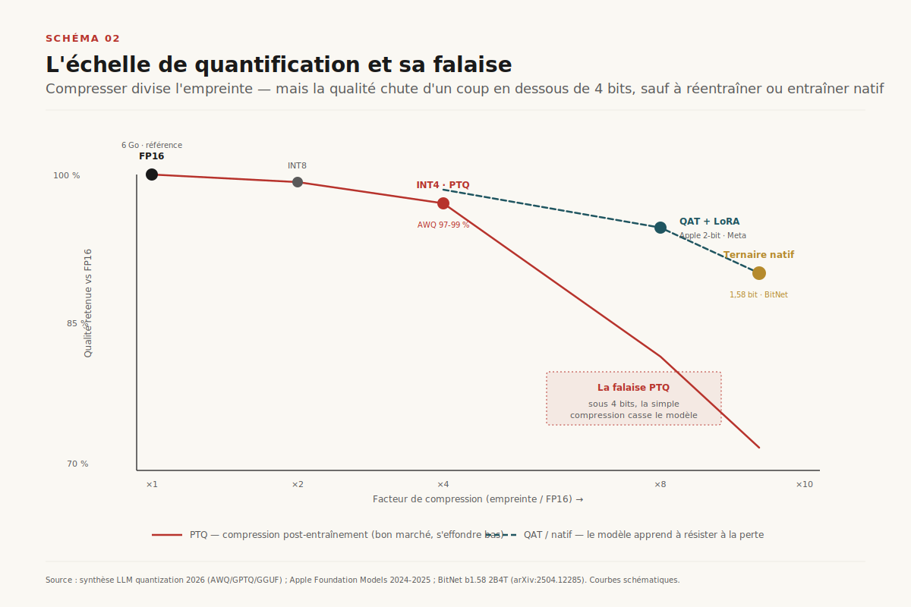
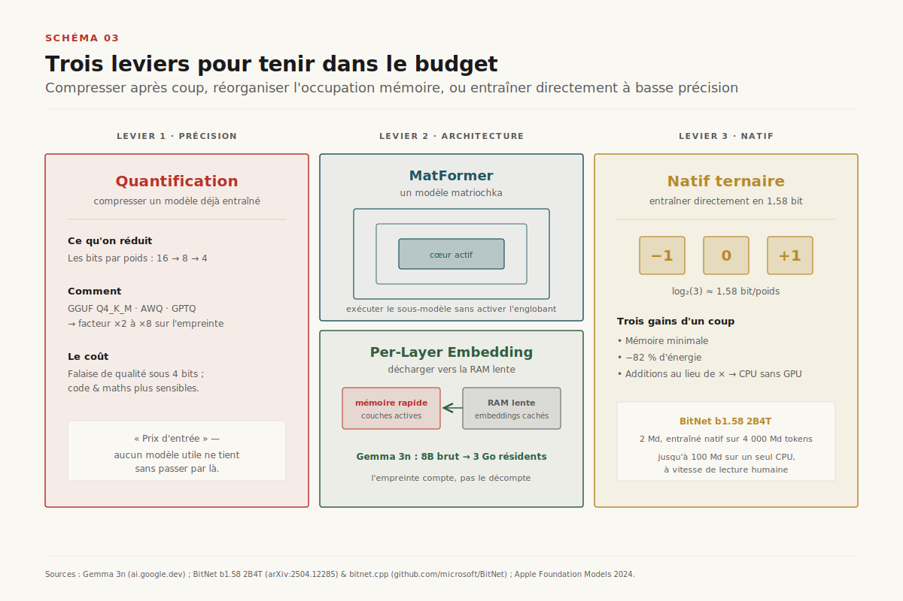
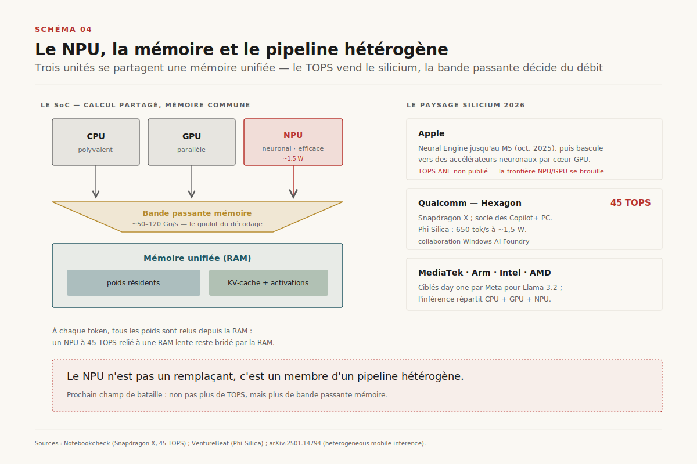
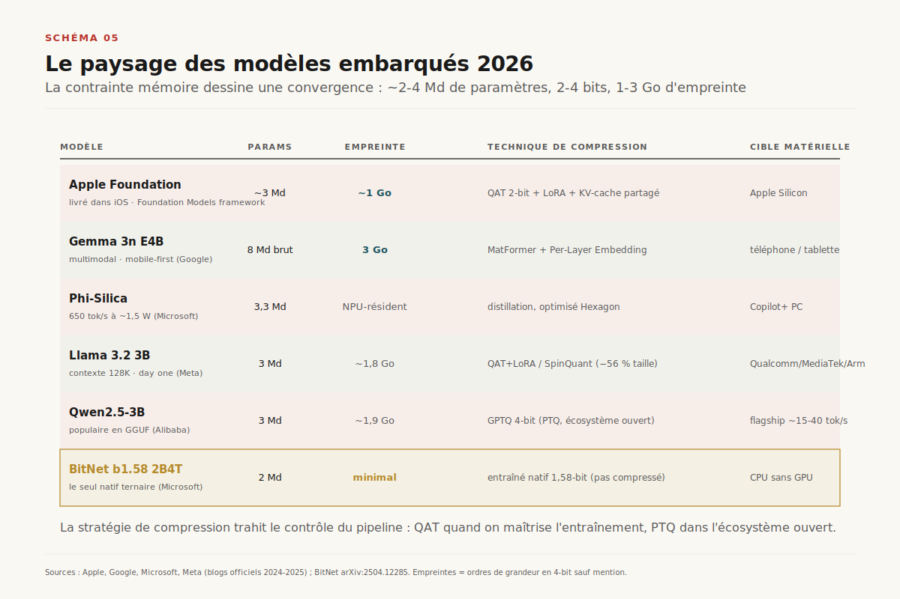
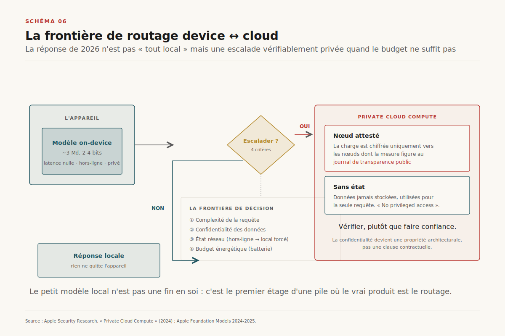

# L'IA embarquée : le budget mémoire commande, pas le modèle

> **L'IA embarquée ne se gagne pas au niveau du modèle mais au niveau du budget mémoire de l'appareil ; et l'architecture réellement déployée en 2026 n'est pas « tout local » mais un routage vérifiable entre l'appareil et le cloud.** — 6 juillet 2026, Mathieu Guglielmino

Depuis dix-huit mois, une bascule discrète s'est opérée dans la façon dont les modèles de langage atteignent les utilisateurs. La question n'est plus seulement « quel est le meilleur modèle dans le cloud », mais « qu'est-ce qui peut tourner **sur l'appareil que vous tenez en main**, sans réseau, sans envoyer vos données ailleurs, sans vider la batterie ». Apple a livré un modèle de ~3 milliards de paramètres directement dans iOS[^1] ; Google a publié Gemma 3n, taillé pour tourner sur 2 Go de RAM[^4] ; Microsoft embarque Phi-Silica dans chaque Copilot+ PC[^6] ; Meta a poussé Llama 3.2 1B/3B sur Qualcomm et MediaTek dès le premier jour[^10].

Le récit dominant présente cette course comme une affaire de modèles : qui a le plus petit, le plus malin, le plus rapide. C'est une erreur de cadrage. ==La contrainte porteuse de l'IA embarquée n'est pas le calcul, c'est la mémoire.== Un téléphone haut de gamme dispose de bien assez de TOPS — d'opérations par seconde — pour faire tourner un modèle de 3 milliards de paramètres. Ce qu'il n'a pas, c'est la RAM pour y loger les poids, le cache d'attention et les activations **en même temps que le système d'exploitation et l'application hôte**. Tout l'art de l'IA embarquée consiste à tenir dans ce budget d'octets. Et quand on n'y tient pas — ce qui reste le cas pour la majorité des requêtes utiles — la vraie architecture 2026 n'est pas de renoncer, mais d'**escalader vers le cloud de façon vérifiable**.

Ce dossier prend le problème par la contrainte, pas par le modèle. Il montre pourquoi le mur mémoire commande tout le reste, quels leviers le repoussent (quantification, astuces d'architecture, silicium dédié), et pourquoi la frontière décisive de 2026 est celle du routage device↔cloud.

## 1. Le mur mémoire de l'appareil

Un modèle de langage qui décode du texte est, sur un appareil, une opération **limitée par la bande passante mémoire**, pas par le calcul. À chaque token généré, il faut relire l'intégralité des poids du modèle depuis la RAM vers les unités de calcul. Un modèle de 3 milliards de paramètres en FP16 pèse ~6 Go ; le lire une fois par token, à la bande passante mémoire d'un SoC mobile (de l'ordre de 50 à 120 Go/s), plafonne mécaniquement le débit — bien avant que les TOPS du NPU ne soient saturés[^12]. ==Sur l'appareil, l'octet est la ressource rare, pas le FLOP.==

Le budget est encore plus serré qu'il n'y paraît, parce que le modèle ne tourne pas seul. La RAM d'un appareil est **unifiée** : le système d'exploitation, l'application hôte, le tampon graphique, les poids du modèle, le cache clé-valeur de l'attention (*KV-cache*, qui croît avec la longueur du contexte) et les activations intermédiaires se partagent le même pool. Un flagship de 2026 embarque 8 à 16 Go de RAM ; iOS ou Android en réservent une large part ; l'enveloppe réellement allouable à un modèle sans faire tuer l'application par le système tourne autour de **2 à 4 Go**[^12]. C'est cette enveloppe — et non la taille théorique du modèle — qui définit ce qui est faisable (voir Schéma 1).

D'où une arithmétique simple et impitoyable. Un modèle de 3 milliards de paramètres :
- en **FP16** (16 bits/poids) pèse ~6 Go → hors budget ;
- en **INT8** (8 bits) pèse ~3 Go → à la limite haute, KV-cache compris c'est déjà trop ;
- en **INT4** (4 bits) pèse ~1,5 Go → ça passe, avec de la marge pour le KV-cache et l'app.

Autrement dit, **aucun modèle utile ne tient sur l'appareil sans compression agressive**. La quantification n'est pas une optimisation optionnelle : c'est le prix d'entrée. Tout le reste — les astuces d'architecture, le silicium dédié, le routage hybride — se construit par-dessus ce constat.

## 2. La quantification, levier premier

Quantifier un modèle, c'est réduire le nombre de bits utilisés pour représenter chaque poids. L'échelle est directe : FP16 → INT8 divise l'empreinte par 2, INT8 → INT4 encore par 2, soit un facteur 8 entre le format d'entraînement (FP16/BF16) et le format embarqué courant[^13]. C'est le levier qui fait passer un 3B de 6 Go à 1,5 Go — de l'infaisable au faisable (voir Schéma 2).

Deux familles de méthodes coexistent, et la distinction est structurante.

**La quantification post-entraînement (*PTQ*)** compresse un modèle déjà entraîné, sans le réentraîner. C'est la voie dominante en pratique parce qu'elle est bon marché[^13]. Trois formats se sont imposés :
- **GGUF**, le format de `llama.cpp` et d'Ollama, avec ses paliers Q2_K à Q8_0. Le schéma **Q4_K_M** (4 bits, à grain fin) est le standard de facto pour le mobile : meilleur compromis compression/fidélité, inférence hybride CPU+GPU[^13].
- **AWQ** (*Activation-aware Weight Quantization*) protège les poids saillants en analysant les activations et retient 97-99 % de la qualité en INT4 — légèrement au-dessus de GPTQ sur la plupart des bancs[^13].
- **GPTQ** quantifie couche par couche en minimisant l'erreur locale via une information de second ordre ; un cran en dessous d'AWQ en qualité mais très bien outillé.

**La quantification pendant l'entraînement (*QAT*)** simule la perte de précision au fil de l'entraînement, si bien que le modèle apprend à y résister. Elle coûte plus cher mais récupère 2 à 5 points de qualité aux compressions extrêmes[^13] — ce qui, en dessous de 4 bits, fait la différence entre un modèle exploitable et un modèle cassé. C'est la voie retenue par les acteurs qui contrôlent tout le pipeline : Apple entraîne son modèle on-device en **QAT à 2 bits par poids**, avec la table d'*embeddings* à 4 bits et le KV-cache à 8 bits, puis récupère la qualité perdue via des adaptateurs *LoRA*[^1]. Meta combine **QAT + LoRA** (priorité à la qualité) et **SpinQuant** (PTQ, priorité à la portabilité) pour ses Llama 3.2 quantifiés, avec −56 % de taille et −41 % de mémoire par rapport au BF16[^9].

La quantification n'est pas gratuite. ==La perte de précision ne frappe pas uniformément : le raisonnement mathématique, la logique formelle et la génération de code y sont bien plus sensibles que le résumé ou la conversation ouverte.==[^13] Un 4-bit qui « passe » très bien en assistant de rédaction peut dégrader silencieusement sur du code. C'est un piège d'évaluation classique : mesurer la qualité d'un modèle quantifié sur la mauvaise tâche donne une confiance trompeuse.

## 3. Les astuces d'architecture

La quantification a une limite : en dessous d'un certain seuil de bits, la qualité s'effondre quelle que soit la méthode. Pour aller plus loin, il faut changer non pas la précision des poids mais **la façon dont le modèle occupe la mémoire**. Trois idées se sont imposées en 2025-2026 (voir Schéma 3).

**Le MatFormer (transformer matriochka).** Gemma 3n imbrique des sous-modèles plus petits à l'intérieur d'un modèle plus grand, comme des poupées russes[^5]. On peut exécuter le seul cœur — le plus petit modèle imbriqué — sans activer les paramètres englobants, ce qui réduit à la volée le calcul, la latence et l'énergie selon la difficulté de la requête. Un seul jeu de poids, plusieurs points de fonctionnement : le modèle s'adapte au budget disponible au lieu d'imposer une taille fixe.

**Le Per-Layer Embedding (PLE).** Les tables d'*embeddings* sont volumineuses et peu utilisées à chaque instant. Gemma 3n les **décharge de la mémoire de travail rapide vers la RAM plus lente**, les régénère et les réinjecte couche par couche au fil de l'inférence[^4]. Le résultat est spectaculaire : les modèles E2B et E4B ont un décompte brut de 5 et 8 milliards de paramètres, mais tournent avec l'empreinte de modèles 2B et 4B classiques — **aussi peu que 2 Go (E2B) et 3 Go (E4B)**[^4]. C'est une application directe du principe de la section 1 : ce qui compte n'est pas le nombre de paramètres, mais combien d'octets sont résidents en mémoire de travail à un instant donné. Apple joue la même partition avec le **partage du KV-cache** entre couches, qui réduit l'empreinte du cache d'attention[^1].

**Le natif ternaire.** BitNet renverse la logique : au lieu d'entraîner en haute précision puis de compresser, il **entraîne directement des poids ternaires** {−1, 0, +1}, soit log₂(3) ≈ 1,58 bit par poids[^7]. Le zéro autorise une parcimonie apprise que les modèles 1-bit purs n'ont pas. BitNet b1.58 2B4T est le premier modèle natif 1,58-bit à 2 milliards de paramètres entraîné sur 4 000 milliards de tokens[^7]. L'intérêt dépasse la seule empreinte : des poids ternaires remplacent les multiplications par des additions, ce qui donne une inférence CPU sans GPU. Le framework `bitnet.cpp` affiche des accélérations de 1,37× à 6,17× selon l'architecture et **jusqu'à −82 % d'énergie**, au point de faire tourner un modèle de 100 milliards de paramètres sur un seul CPU à vitesse de lecture humaine[^8]. ==Le natif ternaire est le seul des trois leviers qui attaque simultanément la mémoire, l'énergie et la dépendance au GPU.==

## 4. Le NPU et le silicium

Faire tenir le modèle en mémoire ne suffit pas : encore faut-il l'exécuter sans vider la batterie ni monopoliser le processeur. C'est le rôle du **NPU** (*Neural Processing Unit*), un accélérateur dédié aux opérations de réseaux de neurones, optimisé pour l'efficacité énergétique plutôt que pour la polyvalence. L'argument est chiffré : Phi-Silica tourne sur le NPU Hexagon des Copilot+ PC à ~650 tokens/seconde pour **environ 1,5 watt**, en libérant CPU et GPU pour le reste[^6]. Un modèle exécuté sur CPU ferait chauffer l'appareil et fondrait la batterie ; sur NPU, il devient une fonction de fond soutenable (voir Schéma 4).

Mais **le TOPS n'est pas la performance**. Qualcomm annonce 45 TOPS pour le Hexagon des Snapdragon X[^11] ; ce chiffre mesure une capacité de calcul crête, pas le débit réel d'un LLM. Comme établi en section 1, le décodage est limité par la bande passante mémoire : un NPU à 45 TOPS relié à une RAM lente reste bridé par la RAM. ==Le TOPS vend le silicium ; la bande passante mémoire décide du débit.== C'est pourquoi les mesures sérieuses portent sur des tokens/seconde à budget énergétique donné, pas sur des TOPS.

Le paysage 2026 s'est fragmenté :
- **Apple** a cessé de publier un chiffre de TOPS pour le Neural Engine avec le M5 (octobre 2025) et route désormais une large part de l'IA on-device via des **accélérateurs neuronaux intégrés à chaque cœur GPU**[^11] — un signe que la frontière NPU/GPU se brouille.
- **Qualcomm** pousse le Hexagon à 45 TOPS et collabore avec Microsoft sur Windows AI Foundry[^11][^6].
- **MediaTek** et les partenaires Arm sont ciblés dès le premier jour par Meta pour Llama 3.2[^10].
- **Intel et AMD** complètent la course sur PC.

En pratique, l'inférence est **hétérogène** : un même modèle répartit ses opérations entre CPU, GPU et NPU selon leurs forces respectives, la mémoire unifiée servant de substrat commun[^12]. Le NPU n'est pas un remplaçant mais un membre d'un pipeline.

## 5. Le paysage des modèles embarqués 2026

En croisant contrainte mémoire, technique de compression et cible matérielle, une petite famille de modèles a émergé comme état de l'art embarqué. Elle tourne autour d'un point de convergence remarquable : **~2 à 4 milliards de paramètres, compressés à 2-4 bits, pour une empreinte de 1 à 3 Go** (voir Schéma 5).

- **Apple Foundation (~3B, 2-bit QAT)** — livré dans iOS via le *Foundation Models framework*, ~1 Go d'empreinte sur Apple Silicon grâce au 2-bit QAT, avec adaptateurs LoRA et KV-cache partagé[^1][^2]. Apple revendique qu'il dépasse Phi-3-mini, Mistral-7B, Gemma-7B et Llama-3-8B — des modèles pourtant plus gros[^1].
- **Gemma 3n E2B / E4B** — MatFormer + PLE, 2 Go / 3 Go d'empreinte pour des décomptes bruts de 5B/8B ; multimodal, taillé mobile[^4].
- **Phi-Silica (3.3B)** — distillé de la famille Phi, optimisé pour le Hexagon 45 TOPS, embarqué dans tous les Copilot+ PC ; 650 tok/s à 1,5 W[^6].
- **Llama 3.2 1B / 3B** — contexte 128K, quantifié QLoRA+SpinQuant (−56 % taille), Qualcomm/MediaTek/Arm day one ; le 3B bat Gemma 2 2.6B et Phi-3.5-mini sur instruction, résumé, réécriture, tool-use[^9][^10].
- **Qwen2.5-3B** — GPTQ 4-bit, populaire sur mobile via GGUF (~15-40 tok/s sur flagship récent)[^10].
- **BitNet b1.58 2B4T** — le seul natif ternaire ; empreinte et énergie minimales, inférence CPU[^7][^8].

Deux enseignements. D'abord, **la convergence vers ~3B n'est pas un hasard** : c'est le plus gros modèle qui tient dans l'enveloppe mémoire allouable après quantification 2-4 bits. La contrainte de la section 1 dessine directement la taille des modèles. Ensuite, **la stratégie de compression trahit le contrôle du pipeline** : Apple et Meta, qui maîtrisent l'entraînement, misent sur le QAT ; l'écosystème ouvert (Qwen, Llama en GGUF) sur la PTQ ; Microsoft sur la distillation ciblée matériel.

## 6. L'architecture hybride device↔cloud

Le point le plus mal compris de l'IA embarquée est celui-ci : ==la réponse de 2026 n'est pas « tout sur l'appareil », c'est le routage.== Un modèle de 3B, même excellent, ne remplace pas un modèle frontière pour les requêtes complexes. L'architecture réellement déployée garde le petit modèle local pour ce qu'il fait bien — latence nulle, hors-ligne, confidentialité — et **escalade vers le cloud le reste**, mais sous une contrainte inédite : que cette escalade soit **vérifiablement privée** (voir Schéma 6).

Apple a posé le patron de référence avec **Private Cloud Compute (PCC)**. Quand une requête dépasse les capacités du modèle on-device, elle part vers des serveurs en silicium Apple conçus autour de deux principes : ils sont **sans état** (les données ne sont jamais stockées, utilisées seulement pour la requête en cours) et leur comportement est **cryptographiquement vérifiable**[^3]. Le mécanisme est précis : l'appareil chiffre la charge utile uniquement vers les clés publiques des nœuds PCC dont les mesures attestées correspondent à une image logicielle publiée dans un **journal de transparence** public[^3]. S'y ajoutent une conception « no privileged access » qui exclut l'accès administrateur, et un registre matériel append-only à double racine de confiance contre les attaques de chaîne d'approvisionnement[^3]. Autrement dit, l'utilisateur n'a plus à *faire confiance* au fournisseur cloud : il peut *vérifier* qu'aucun logiciel non attesté ne verra ses données.

La frontière de décision — **quand rester local, quand escalader** — arbitre quatre critères :
- **la complexité de la requête** (un résumé court reste local ; un raisonnement multi-étapes escalade) ;
- **la confidentialité** (les données les plus sensibles restent sur l'appareil par défaut) ;
- **l'état réseau** (hors-ligne force le local) ;
- **le budget énergétique** (une longue génération sur NPU peut coûter plus de batterie qu'un aller-retour réseau).

Ce routage est le véritable produit. Le petit modèle local n'est pas une fin en soi : c'est le premier étage d'une pile où la confidentialité devient une propriété **architecturale et vérifiable**, pas une promesse contractuelle. La tendance se confirme au-delà d'Apple — l'industrie tout entière fait de l'IA on-device économe en énergie le différenciateur clé de performance **et** de confidentialité[^11].

## 7. Trajectoires 2026-2028

Quatre lignes de force se dessinent (voir Schéma 7).

**Le natif ternaire se généralise.** BitNet a montré qu'entraîner directement en 1,58 bit bat la compression post-hoc sur les trois axes qui comptent à l'edge : mémoire, énergie, indépendance au GPU[^7][^8]. Attendre des modèles ternaires natifs plus gros et multimodaux, avec des kernels CPU dédiés qui feront du NPU un luxe plutôt qu'une nécessité pour une partie des charges.

**Le NPU devient l'unité première.** Le brouillage Apple entre Neural Engine et accélérateurs GPU[^11], la course aux TOPS de Qualcomm, l'intégration Windows AI Foundry[^6] convergent vers un SoC où l'inférence neuronale est un citoyen de première classe, pas un accélérateur d'appoint — avec la bande passante mémoire, et non le TOPS, comme prochain champ de bataille.

**Les agents on-device arrivent.** Le passage d'un chatbot local à un agent local — qui appelle des outils, lit l'écran, enchaîne des étapes — change la donne mémoire : le KV-cache d'un contexte agentique long devient le poste dominant, ce qui rejoint les problématiques de compaction et de gestion du cache déjà critiques côté datacenter.

**La confidentialité devient argument produit et levier réglementaire.** Le traitement local est, du point de vue du RGPD, une forme de **minimisation** : ce qui ne quitte jamais l'appareil n'est pas un transfert de données. Combiné à l'attestation vérifiable de PCC, cela transforme la privacy d'une clause de confiance en une propriété démontrable — un angle que la régulation européenne (RGPD, AI Act) est outillée pour récompenser. ==L'IA embarquée n'est pas seulement une optimisation technique : c'est une architecture de la confiance.==

---

Le fil rouge de ce dossier tient en une phrase : **l'IA embarquée est un problème de budget mémoire, pas de modèle.** La contrainte d'octets sur l'appareil dessine la taille des modèles (~3B), impose la quantification (2-4 bits), justifie les astuces d'architecture (MatFormer, PLE, ternaire natif) et le silicium dédié (NPU), et — quand le budget ne suffit pas — commande une architecture hybride où le vrai produit est le **routage vérifiable** device↔cloud. Qui raisonne en « quel modèle » se trompe de question ; la bonne est « combien d'octets, où, et selon quelle frontière de confiance ».

## Sources

[^1]: Apple Machine Learning Research, *Introducing Apple's On-Device and Server Foundation Models*, 2024 — architecture du modèle ~3B, QAT 2-bit, embeddings 4-bit, KV-cache 8-bit, adaptateurs LoRA. https://machinelearning.apple.com/research/introducing-apple-foundation-models
[^2]: Apple Machine Learning Research, *Introducing the Third Generation of Apple's Foundation Models*, 2025 — Foundation Models framework, ~3B on-device, empreinte ~1 Go. https://machinelearning.apple.com/research/introducing-third-generation-of-apple-foundation-models
[^3]: Apple Security Research, *Private Cloud Compute: A new frontier for AI privacy in the cloud*, 2024 — attestation, stateless, transparency log, no privileged access, double racine de confiance. https://security.apple.com/blog/private-cloud-compute/
[^4]: Google AI for Developers, *Gemma 3n model overview* — MatFormer, Per-Layer Embedding, E2B 2 Go / E4B 3 Go. https://ai.google.dev/gemma/docs/gemma-3n
[^5]: Hugging Face (R. Raj), *Understanding Gemma 3n: How MatFormer Gives You Many Models in One* — sous-modèles imbriqués matriochka. https://huggingface.co/blog/rishiraj/matformer-in-gemma-3n
[^6]: VentureBeat, *Microsoft introduces Phi-Silica, a 3.3B parameter model made for Copilot+ PC NPUs*, 2024 — 650 tok/s, 1,5 W, Hexagon 45 TOPS. https://venturebeat.com/ai/microsoft-introduces-phi-silica-a-3-3b-parameter-model-made-for-copilot-pc-npus
[^7]: Microsoft Research, *BitNet b1.58 2B4T Technical Report*, arXiv:2504.12285, avril 2025 — premier natif 1,58-bit 2B, 4T tokens, poids ternaires {−1,0,+1}. https://arxiv.org/abs/2504.12285
[^8]: Microsoft, *BitNet — Official inference framework for 1-bit LLMs* (bitnet.cpp) — accélérations 1,37×-6,17× CPU, −82 % énergie, 100B sur un CPU. https://github.com/microsoft/BitNet
[^9]: Meta AI, *Introducing quantized Llama models with increased speed and a reduced memory footprint*, 2024 — QAT+LoRA et SpinQuant, −56 % taille, −41 % mémoire. https://ai.meta.com/blog/meta-llama-quantized-lightweight-models/
[^10]: Meta AI, *Llama 3.2: Revolutionizing edge AI and vision*, 2024 — 1B/3B, contexte 128K, Qualcomm/MediaTek/Arm day one, comparatif Gemma 2/Phi-3.5. https://ai.meta.com/blog/llama-3-2-connect-2024-vision-edge-mobile-devices/
[^11]: Notebookcheck, *Qualcomm releases official Snapdragon X Plus/Elite benchmarks for 45 TOPS Hexagon NPU*, 2025 — 45 TOPS, bascule Apple M5 vers accélérateurs GPU. https://www.notebookcheck.net/Qualcomm-releases-official-Snapdragon-X-Plus-and-Snapdragon-X-Elite-benchmarks-for-45-TOPS-Hexagon-NPU.841811.0.html
[^12]: arXiv:2501.14794, *Characterizing Mobile SoC for Accelerating Heterogeneous LLM Inference*, 2025 — inférence hétérogène CPU/GPU/NPU, plafond bande passante mémoire, RAM unifiée. https://arxiv.org/abs/2501.14794
[^13]: VRLA Tech / SitePoint / meta-intelligence, *LLM Quantization Explained: INT4, INT8, FP8, AWQ, GPTQ* (synthèse 2026) — facteurs de compression, AWQ 97-99 %, PTQ vs QAT, sensibilité par tâche. https://vrlatech.com/llm-quantization-explained-int4-int8-fp8-awq-and-gptq-in-2026/
