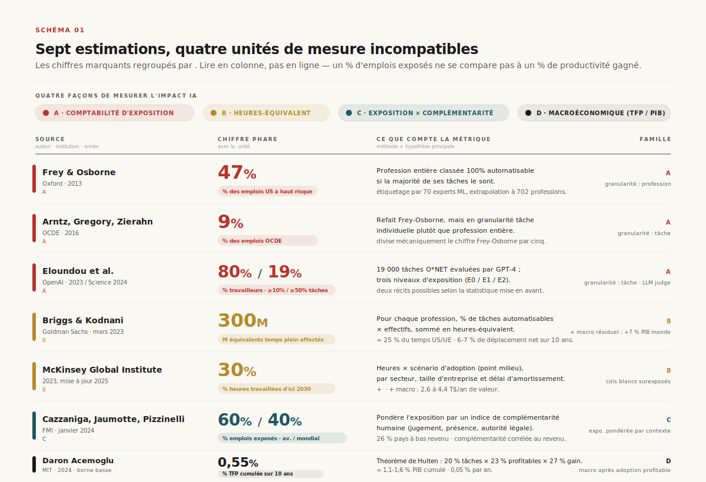
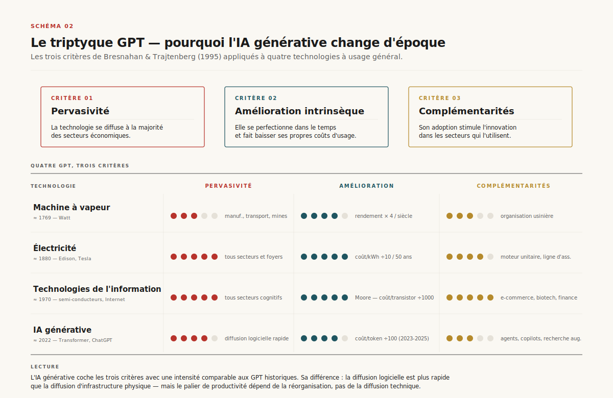
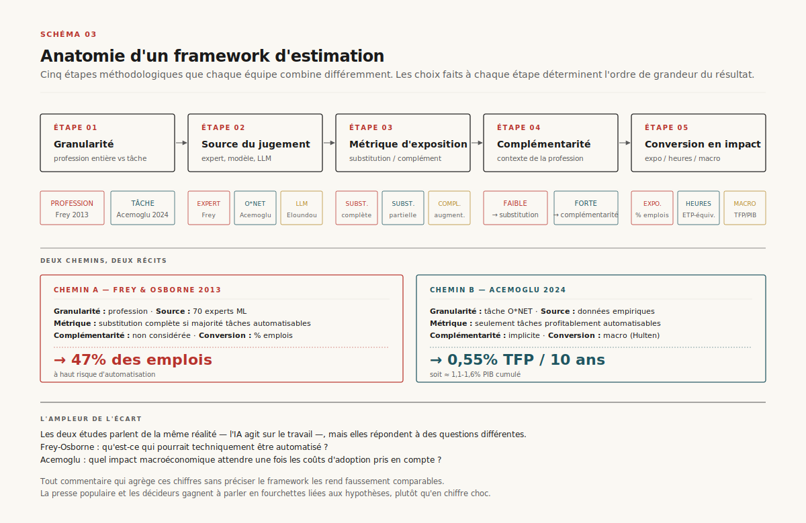
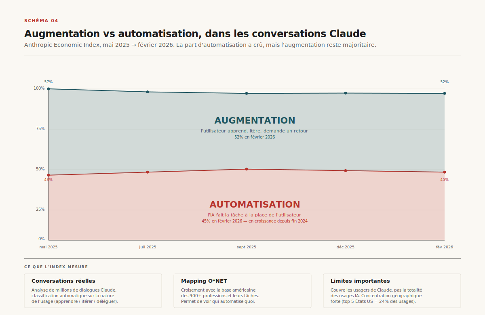
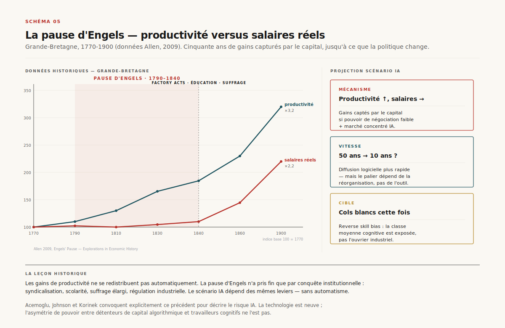
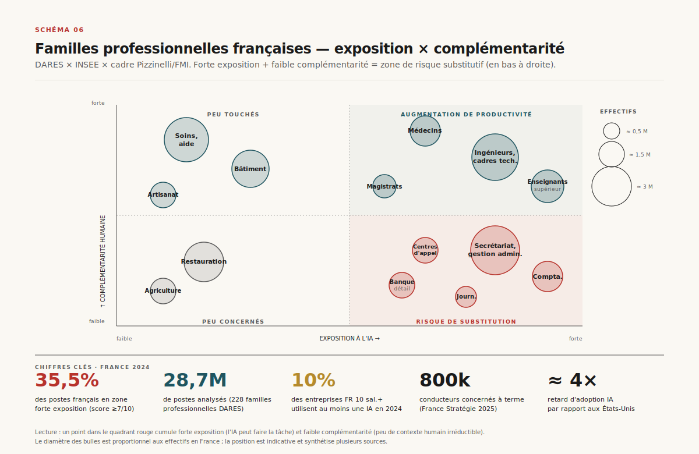
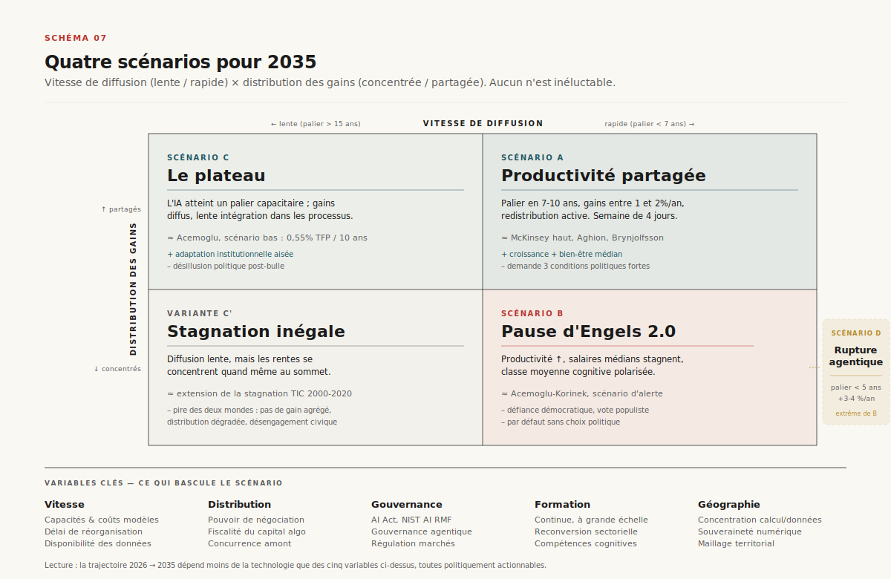
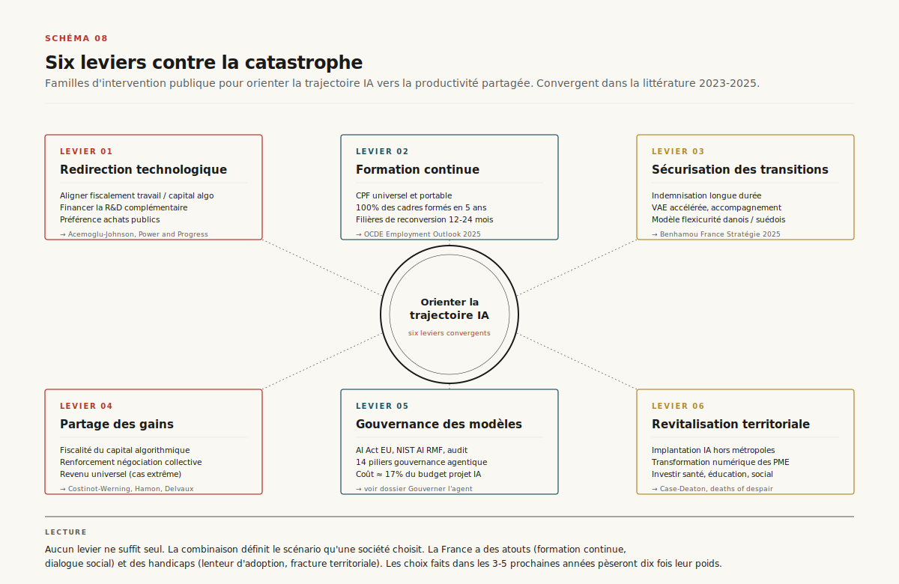

# L'IA et le travail

> **L'écart entre les estimations va de 0,5 % de productivité sur dix ans à 300 millions d'emplois exposés. Ce n'est pas un débat technique : c'est un choix politique sur la direction de la technologie.** — 4 mai 2026, Mathieu Guglielmino

*Format co-écrit avec l'aide d'une IA.*

---

## Lede — ce qu'il faut retenir en trois minutes

Entre les pronostics de catastrophe (Goldman Sachs : 300 millions d'équivalents temps plein exposés à l'automatisation[^1]) et les estimations modestes (Acemoglu : 0,55 % de productivité totale des facteurs sur dix ans[^2]), la littérature économique sur l'IA et le travail paraît irréconciliable. Elle ne l'est pas — pour peu qu'on lise les frameworks plutôt que les communiqués.

Tous les chiffres marquants reposent sur des **conventions méthodologiques** qui ne sont pas comparables : *exposition* d'une tâche n'est pas son *automatisation*, *automatisable* n'est pas *automatisé*, et le passage d'un comptage par profession à un comptage par tâche divise les estimations par cinq[^3]. Les médias additionnent des kilomètres et des kilos.

Le vrai débat est ailleurs. Les économistes du travail s'accordent sur cinq points : (1) l'IA générative est probablement une *general-purpose technology*[^4], comparable à la machine à vapeur ou à l'électricité, (2) son impact sur la productivité agrégée sera lent à matérialiser — entre 5 et 15 ans pour le palier — du fait du temps nécessaire pour réorganiser les processus[^5], (3) son effet net sur l'emploi sera dominé par les choix de déploiement plus que par la technologie elle-même[^6], (4) les gains de productivité sont **réels mais inégalement répartis**[^7], et (5) le risque dominant n'est pas la disparition du travail, mais une nouvelle « pause d'Engels » : concentration des gains au sommet, polarisation, déclassement de la classe moyenne cognitive[^8].

Ce dossier cartographie cette littérature, démonte les frameworks d'estimation, compare l'IA aux révolutions technologiques antérieures, et propose six leviers concrets pour éviter le scénario catastrophique. Il s'inscrit dans le prolongement de mes dossiers sur la [gouvernance des agents IA](../gouvernance/), le [procès Musk v. Altman](../proces-musk-altman/) (qui pose précisément la question : qui dirige cette technologie ?) et l'[anatomie d'un système agentique](../anatomie/) (ce que l'IA fait techniquement, au-delà des récits).

---

## 1. Le malentendu fondamental

*Schéma 1. Les six estimations les plus citées de l'impact de l'IA sur le travail, sur dix ans, ramenées à leur unité de mesure réelle. Aucune n'est directement comparable.*

Le 26 mars 2023, six mois après la sortie publique de ChatGPT, Goldman Sachs publie une note de Joseph Briggs et Devesh Kodnani estimant que **l'équivalent de 300 millions d'emplois temps plein** pourraient être exposés à l'automatisation par l'IA générative[^1]. Quatre jours plus tard, un papier du Future of Life Institute, signé par Elon Musk, Yoshua Bengio, Steve Wozniak et un millier de chercheurs, demande un moratoire de six mois sur l'entraînement des modèles plus puissants que GPT-4. La presse mondiale assemble les deux : la machine va prendre nos emplois, et même ses créateurs s'en inquiètent.

Cette lecture n'est pas fausse. Elle est mal calibrée.

### Ce que mesure réellement Goldman Sachs

Le chiffre de 300 millions n'est pas un nombre d'emplois détruits. C'est l'**équivalent en heures de travail** de tâches susceptibles d'être affectées (substituées ou augmentées) par l'IA générative, calculé en additionnant pour chaque profession sa proportion de tâches automatisables pondérée par les effectifs. Briggs et Kodnani estiment que **deux tiers des emplois actuels sont exposés à un degré quelconque** d'automatisation par l'IA, et que l'IA pourrait automatiser environ **25 % du temps de travail** total aux États-Unis et en Europe[^1]. Dans leur scénario central, **6 à 7 % des travailleurs seraient déplacés** sur une période de dix ans — un taux historiquement élevé mais pas hors normes (la transition agricole-industrie a déplacé bien davantage, sur plusieurs décennies).

### Ce que mesure Acemoglu

À l'autre extrême, Daron Acemoglu publie en 2024 *The Simple Macroeconomics of AI*[^2]. Il applique le théorème de Hulten — l'effet macroéconomique d'un changement technologique est égal à la somme pondérée des effets sur les tâches affectées — avec des hypothèses prudentes : environ **20 % des tâches aux États-Unis sont exposées à l'IA**, dont **23 % seulement seront profitablement automatisées** dans les dix ans, avec une **économie de coût moyenne par tâche de 27 %**. Le calcul donne **0,71 % de gain de productivité totale des facteurs sur dix ans**, ramené à **0,55 %** quand on tient compte du fait que les premiers gains viennent de tâches faciles (classification, rédaction simple) et que les tâches restantes seront plus dures à automatiser. En PIB, cela donne **1,1 à 1,6 %** de gain cumulé sur dix ans, soit **environ 0,05 % par an**[^9].

Goldman Sachs et Acemoglu ne se contredisent pas frontalement. Ils mesurent des choses différentes : le premier additionne des **expositions à l'automatisation**, le second calcule l'**impact macroéconomique net après adoption profitable**. Le premier dit *ce que la technologie pourrait faire*, le second dit *ce qu'elle fera vraiment compte tenu des coûts d'adoption et de la lenteur de réorganisation*.

Cette distinction n'est pas marginale. Elle structure tout le débat.

### Trois confusions structurantes

Avant d'aller plus loin, trois distinctions doivent être posées :

1. **Emploi vs tâche.** Un emploi est composé de dizaines de tâches. Quand Frey et Osborne disaient en 2013 que **47 % des emplois américains étaient à haut risque d'automatisation**[^10], leur méthode classait l'emploi entier dès lors qu'une majorité de ses tâches étaient automatisables. En 2016, l'OCDE refait le calcul en regardant les tâches individuellement : le chiffre tombe à **9 % en moyenne dans les pays OCDE**[^11]. La même technologie, deux unités de mesure, un facteur cinq d'écart.

2. **Exposition vs déplacement.** *Exposition* signifie qu'une tâche pourrait techniquement être réalisée par l'IA. *Déplacement* signifie qu'un travailleur perd son emploi parce que l'IA la réalise effectivement. Entre les deux, il y a : le coût d'adoption, l'inertie organisationnelle, les contraintes réglementaires, les préférences des consommateurs, et — surtout — le fait que des gains de productivité sur certaines tâches augmentent souvent la demande pour les autres tâches du même métier (l'effet productivité d'Acemoglu et Restrepo[^12]).

3. **Automation vs augmentation.** L'Anthropic Economic Index, qui analyse depuis 2025 les conversations réelles avec Claude, mesure cette distinction empiriquement. En février 2026, **52 % des conversations relèvent de l'augmentation** (l'utilisateur apprend, itère, demande un retour) contre **45 % d'automatisation** (l'IA fait la tâche à la place de l'utilisateur)[^13]. La frontière n'est pas figée — la part d'automatisation a crû de 27 % à 39 % en un an[^14] — mais le récit du « remplacement pur » ne décrit qu'une fraction du phénomène.

La conclusion à ce stade est inconfortable : **les chiffres médiatiques sur l'IA et le travail ne se comparent pas entre eux**. Aucun d'eux n'est faux *en soi*, mais leur addition produit des récits incohérents. Pour comprendre ce qui se joue, il faut comprendre les frameworks.

---

## 2. L'IA comme *general-purpose technology*

*Schéma 2. Les trois critères de Bresnahan et Trajtenberg pour identifier une general-purpose technology, mappés sur quatre cas historiques.*

Pour situer l'IA dans l'histoire des chocs technologiques, le cadre dominant reste celui des *general-purpose technologies* (GPT, à ne pas confondre avec les *Generative Pretrained Transformers*) défini par Timothy Bresnahan et Manuel Trajtenberg en 1995[^15]. Une GPT, écrivent-ils, est une technologie qui « entraîne des époques entières de progrès technique et de croissance économique ». Trois critères :

1. **Pervasivité** — la technologie se diffuse à la majorité des secteurs.
2. **Amélioration intrinsèque** — elle se perfectionne dans le temps et fait baisser ses propres coûts d'usage.
3. **Complémentarités innovationnelles** — son adoption stimule l'innovation dans les secteurs qui l'utilisent (ce qu'on appelle aussi les *spillovers*).

La machine à vapeur, l'électricité, le moteur à combustion interne, les semi-conducteurs et les réseaux informatiques cochent les trois cases. Pour l'IA générative, le verdict de la littérature est convergent : Tyna Eloundou et al., dans *GPTs are GPTs* (2023, publié dans *Science* en 2024), affirment explicitement que « l'attribut collectif des LLM tels que les *generative pretrained transformers* suggère fortement qu'ils possèdent les caractéristiques clés des autres GPT »[^16]. Acemoglu lui-même, malgré ses estimations conservatrices, ne conteste pas la classification : il conteste le *timing* et l'*ampleur* des gains.

### Ce que ce cadre prédit

La littérature sur les GPT historiques fournit trois prédictions empiriques :

**1. Un long délai entre invention et productivité agrégée.** Paul David, dans *The Dynamo and the Computer* (1990), montre que l'électricité, inventée commercialement dans les années 1880, ne contribue significativement à la productivité manufacturière américaine que dans les **années 1920**, soit **trente à quarante ans plus tard**[^17]. La raison : les usines doivent abandonner le système de transmission par arbres et courroies (qui exigeait une source de puissance unique au centre) pour adopter le « moteur unitaire » — un moteur électrique par machine. Ce changement architectural a pris une génération. Le *Solow paradox* — « on voit l'âge de l'ordinateur partout sauf dans les statistiques de productivité » — décrit le même phénomène appliqué à l'informatique des années 1970-1990[^18].

**2. Une explosion de la productivité après le palier.** Une fois le palier franchi, les gains s'enchaînent rapidement : pour l'électricité, **la moitié de la croissance de la productivité manufacturière américaine des années 1920** lui est attribuable[^17]. Le pari implicite des prévisions optimistes (McKinsey, Goldman Sachs) est que l'IA suivra cette trajectoire — avec un palier plus court, parce que la diffusion logicielle est plus rapide que la diffusion d'infrastructure physique.

**3. Une transformation profonde des structures organisationnelles.** Bresnahan et Trajtenberg insistent : la GPT exige une réorganisation. Pour la machine à vapeur, c'est l'usine. Pour l'électricité, c'est la ligne de production. Pour les TIC, c'est la fonction support et le back-office. Pour l'IA, ce pourrait être l'organisation cognitive elle-même — la manière dont les entreprises produisent du raisonnement, de l'analyse, de la décision.

### Ce qui pourrait être différent cette fois

Trois hypothèses circulent sur ce qui pourrait distinguer l'IA des GPT précédentes :

**(a) Vitesse de diffusion**. ChatGPT a atteint cent millions d'utilisateurs en deux mois — record historique pour un produit de consommation. La diffusion logicielle, sans infrastructure physique à déployer, peut être beaucoup plus rapide qu'une révolution électrique. *Ce qui ne signifie pas que les gains de productivité seront rapides* : la lenteur du palier ne tient pas à la diffusion de l'outil mais à la réorganisation des processus.

**(b) Nature cognitive**. Les GPT précédentes augmentaient le travail physique. L'IA générative augmente — et potentiellement automatise — le travail cognitif. McKinsey parle de « *reverse skill bias* » : pour la première fois, **une technologie d'automatisation a un impact disproportionné sur les emplois à fort capital humain** (cadres, juristes, consultants, journalistes, développeurs)[^19]. Cette inversion n'est pas neutre politiquement : la coalition socialement bénéficiaire/perdante n'est pas celle des révolutions précédentes.

**(c) Capacité d'auto-amélioration**. Les modèles d'IA participent à leur propre développement (génération de code, RLHF, agents autonomes). Si cette boucle se referme — *self-improving AI* —, le rythme de progrès pourrait s'accélérer, raccourcissant le palier d'adoption. C'est l'argument central des chercheurs en sécurité de l'IA (Geoffrey Hinton, Yoshua Bengio, Stuart Russell)[^20]. La littérature économique mainstream traite cette hypothèse avec scepticisme, mais elle n'est plus marginale.

Sur ce dernier point, mes dossiers sur la [mémoire agentique](../memoire-agentique/) et les [agents computer use](../agents-computer-use/) documentent une trajectoire technique tangible : l'IA n'est plus un outil amnésique de réponse en un coup, c'est un système qui pilote des écrans, persiste, capitalise. Cette transformation technique est un **multiplicateur d'exposition** que les frameworks économiques de 2023 (basés sur les LLM en chat) commencent à peine à intégrer.

---

## 3. Cartographie des frameworks d'estimation

*Schéma 3. Comment passe-t-on d'« un emploi » à « un impact sur l'emploi » ? Les six étapes méthodologiques que les frameworks combinent différemment.*

Les estimations chiffrées de l'impact de l'IA sur le travail dépendent de **cinq choix méthodologiques** que chaque équipe combine différemment. Comprendre ces choix permet de lire les chiffres pour ce qu'ils sont.

### Étape 1 — La granularité

**Profession entière** (Frey-Osborne 2013 : 47 %) ou **tâches** (Eloundou 2023, Acemoglu 2024) ? La première produit des chiffres dramatiques mais fragiles, parce qu'un emploi rare 100 % automatisé pèse autant qu'un emploi massif partiellement automatisé. La seconde produit des chiffres plus modestes mais plus robustes. Depuis 2018, la littérature a basculé majoritairement sur la granularité-tâche.

### Étape 2 — La source du jugement

**Experts humains** (Frey-Osborne ont fait étiqueter 70 professions par des chercheurs en machine learning, puis ont extrapolé à 702), **modèle économétrique sur les compétences O*NET** (la base américaine décrivant ~900 professions par ~200 attributs), ou **LLM lui-même comme évaluateur** (Eloundou et al. ont utilisé GPT-4 pour évaluer la pertinence de 19 000 tâches O*NET). Chaque source a ses biais : les humains sont influencés par les démonstrations récentes, les modèles statistiques cristallisent les corrélations historiques, le LLM tend à surestimer ses propres capacités sur les tâches qu'il décrit.

### Étape 3 — La métrique d'exposition

**Substitution complète** (« l'IA peut faire la totalité de cette tâche »), **substitution partielle** (« l'IA peut faire la moitié »), ou **complémentarité** (« l'IA augmente la productivité du travailleur sur cette tâche sans la remplacer »). Eloundou distingue trois niveaux : E0 (pas d'impact), E1 (LLM réduit le temps d'au moins 50 % avec accès direct au modèle), E2 (avec logiciels supplémentaires). Le résultat : **80 % de la main-d'œuvre américaine a au moins 10 % de tâches affectées au niveau E1, mais seulement 19 % a 50 % ou plus de tâches affectées**[^21]. La même étude, deux récits possibles selon la statistique mise en avant.

### Étape 4 — Exposition vs complémentarité

Le FMI, dans sa note de discussion *Gen-AI: Artificial Intelligence and the Future of Work* (Cazzaniga, Jaumotte, Pizzinelli et al., janvier 2024)[^22], introduit une **pondération par contexte**. Une profession peut être très exposée à l'IA mais avoir **un fort complément humain** (médecin : l'IA aide au diagnostic mais ne remplace pas la consultation), ou exposée avec **faible complément** (secrétariat administratif : l'IA peut produire l'output direct). Le FMI estime que **60 % des emplois dans les économies avancées sont exposés à l'IA**, mais que parmi eux, environ la moitié sont en complémentarité forte (gain de productivité sans destruction d'emploi), l'autre moitié en complémentarité faible (risque de substitution). La complémentarité, ajoute le FMI, est **fortement corrélée au revenu** : les pays avancés ont une main-d'œuvre plus complémentaire à l'IA, ce qui pourrait creuser les écarts internationaux. Pour les pays émergents, l'exposition tombe à 40 %, et 26 % dans les pays à bas revenus[^22].

### Étape 5 — La conversion en impact

C'est l'étape qui sépare le plus radicalement les estimations. Quatre approches :

| Approche | Question posée | Exemple |
|---|---|---|
| **Comptabilité d'exposition** | Combien d'emplois ont une part significative de tâches automatisables ? | Frey-Osborne, Eloundou |
| **Heures-équivalent** | Combien d'heures de travail pourraient être réalisées par l'IA ? | Goldman Sachs (300M ETP) |
| **Macroéconomique (Hulten)** | Quel est l'impact sur la productivité totale des facteurs ? | Acemoglu (0,55 %), McKinsey ($2,6-4,4T) |
| **Empirique (RCT, expériences)** | Que mesure-t-on quand on déploie l'IA dans un environnement réel ? | Brynjolfsson, Noy-Zhang, Peng |

Aucune approche ne domine les autres. La comptabilité d'exposition produit les chiffres les plus impressionnants mais ne dit rien du chemin de la technologie aux résultats économiques. L'approche macroéconomique est rigoureuse mais dépend de petites différences d'hypothèses qui se composent de manière non-linéaire (Acemoglu obtient 0,55 % avec ses paramètres ; en doublant les hypothèses de Brookings, on dépasse 2 %). L'approche empirique mesure du concret, mais sur des situations très spécifiques (un centre d'appel, un panel de rédacteurs) qui généralisent mal.

### La leçon

La citation chiffrée n'a de sens qu'avec son framework. **« 47 % des emplois sont menacés »** est faux dès qu'on précise les hypothèses de Frey-Osborne ; **« 0,55 % de productivité sur dix ans »** est correct sous des hypothèses très conservatrices ; **« 80 % des tâches affectées »** est compatible avec Goldman Sachs comme avec Acemoglu, mais ne dit rien du déplacement net. La presse populaire et les décideurs gagneraient à parler en **fourchettes liées aux hypothèses** plutôt qu'en *chiffre choc*.

---

## 4. Ce que les études empiriques mesurent vraiment

*Schéma 4. La part augmentation / automatisation des conversations avec Claude (Anthropic Economic Index, mai 2025–février 2026). La frontière n'est pas figée.*

À côté des cartographies théoriques, une littérature empirique commence à s'accumuler depuis 2023 — études contrôlées en entreprise, expériences randomisées, analyses de logs d'usage. Quatre résultats robustes, et un *caveat* central.

### Brynjolfsson, Li, Raymond — le centre d'appel (2023)

L'étude la plus citée sur l'impact réel de l'IA générative sur le travail observe **5 179 agents de support client** dans une grande entreprise technologique, utilisant un assistant conversationnel branché sur GPT-4[^23]. Trois résultats :

- **Productivité +14 %** mesurée en problèmes résolus par heure, en moyenne sur l'ensemble des agents.
- **Effet hétérogène** : les agents novices et peu qualifiés gagnent 34 % de productivité ; les agents les plus expérimentés ne gagnent rien (et parfois sont légèrement freinés par l'outil).
- **Diffusion du savoir tacite** : l'IA propage les pratiques des meilleurs agents aux moins expérimentés, **divisant par deux** le temps que mettent les nouveaux à atteindre la performance d'un agent expérimenté.

Ce résultat — **compression des écarts par le bas plutôt que destruction par le haut** — est confirmé par d'autres études dans des contextes proches.

### Noy, Zhang — la rédaction (2023, *Science*)

Étude pré-enregistrée auprès de **444 professionnels diplômés** sur des tâches de rédaction professionnelle (mémos, e-mails, plans marketing)[^24]. Le groupe traité (avec accès à ChatGPT) :

- **Temps moyen −40 %**.
- **Qualité jugée par des évaluateurs aveugles +18 %**.
- **Inégalité de productivité réduite** : les rédacteurs faibles bénéficient davantage que les forts.
- **Effet d'apprentissage durable** : deux mois après, les participants exposés sont 1,6 fois plus susceptibles d'utiliser l'outil au travail que le groupe contrôle.

Noy et Zhang notent un point important : l'IA *substitue à l'effort* plutôt qu'elle ne *complémente la compétence*. La tâche est restructurée vers la génération d'idées et l'édition, en court-circuitant la phase de premier jet — ce qui pose une question sérieuse pour la formation des juniors, dont la phase de premier jet est précisément la phase d'apprentissage.

### Peng et al. — le développement logiciel (2023, GitHub Copilot)

Expérience contrôlée auprès de **95 développeurs professionnels** chargés d'implémenter un serveur HTTP en JavaScript[^25]. Le groupe avec accès à GitHub Copilot :

- **Temps de complétion −56 %** (71 minutes vs 161 minutes).
- Pas de différence significative sur le taux de complétion (les deux groupes finissent).
- L'effet est plus fort pour les **développeurs moins expérimentés, plus âgés, et travaillant dans des conditions de forte charge**.

À l'échelle d'un secteur entier, un gain de 50 % de productivité par développeur déplace l'équilibre marché du travail. L'enquête développeurs Stack Overflow 2025 montre déjà un effet sur le marché de l'emploi junior : en 2025, **51 % des organisations interrogées par McKinsey rapportent que l'IA générative réduit leur besoin en postes débutants**[^19].

### Anthropic Economic Index — la mesure en continu (2025-2026)

Depuis février 2025, Anthropic publie un index trimestriel basé sur l'analyse de millions de conversations Claude, avec mapping sur la base O*NET[^13]. Les résultats à février 2026 :

- **52 % des conversations sont en mode augmentation**, 45 % en automatisation, 3 % indéterminé.
- La part d'automatisation a augmenté de **27 % à 39 % entre fin 2024 et septembre 2025**, signe d'une délégation croissante.
- L'usage est **très concentré géographiquement** : aux États-Unis, le top 5 des États concentre 24 % de l'usage par habitant ; à l'international, les 20 premiers pays concentrent 48 % de l'usage par habitant — et cette concentration s'accroît[^26].
- Pour chaque année supplémentaire d'usage de Claude, l'écart d'éducation requis pour comprendre les prompts s'élargit d'environ une année — les utilisateurs apprennent à mieux utiliser l'outil[^26].

### Le *caveat* central

Tous ces résultats portent sur des **adoptions précoces, dans des contextes contrôlés, sur des tâches choisies pour s'adapter à l'IA**. La généralisation est délicate pour trois raisons :

1. **Sélection** — les entreprises et tâches étudiées sont celles où le déploiement est faisable. Les résistances organisationnelles (formation, refus syndicaux, contraintes réglementaires, intégration aux systèmes existants) sont sous-représentées.
2. **Effet de nouveauté** — les premiers gains peuvent venir de tâches faciles ; le profil de gain à mesure que l'usage mature est inconnu.
3. **Effets d'équilibre général** — un développeur qui produit deux fois plus de code peut soit doubler le marché, soit le faire à effectifs moitié moindres. La littérature empirique observée ne distingue pas ces deux régimes.

C'est précisément ce que dit Goldman Sachs en mars 2025 : malgré la prolifération massive de l'IA générative, **« aucun effet discernable sur les indicateurs majeurs du marché du travail »** au niveau agrégé[^27]. Le palier de la GPT, encore une fois.

---

## 5. Le précédent historique : la pause d'Engels

*Schéma 5. Productivité vs salaires réels en Grande-Bretagne, 1770-1900 (données Allen). Le décalage de cinquante ans entre les deux courbes — c'est ce que Marx et Engels appelaient le « paupérisme » industriel.*

Le scénario que la littérature économique évoque le plus quand elle parle de l'IA et du travail n'est pas celui du chômage de masse. C'est celui de la **pause d'Engels**.

### Le concept

Le concept est dû à l'historien économique Robert C. Allen[^28]. Entre **1790 et 1840**, en Grande-Bretagne, la productivité du travail manufacturier augmente fortement (mécanisation textile, machine à vapeur, organisation en usine). Mais les **salaires réels stagnent** sur la même période, tandis que la part du capital dans le revenu national grimpe massivement. Friedrich Engels, observant Manchester en 1842, décrit dans *La situation de la classe laborieuse en Angleterre* une misère ouvrière qui contraste avec l'enrichissement industriel : ce n'est pas une dépression économique, c'est une distribution déséquilibrée.

Allen, dans une étude statistique publiée en 2009, confirme : pendant cinquante ans, **les gains de productivité ont été quasi-intégralement captés par les détenteurs de capital**[^28]. Les salaires réels britanniques ne reprennent leur croissance qu'après 1840, lorsque l'éducation, la syndicalisation, l'extension du droit de vote et la régulation des conditions de travail (Factory Acts) renversent le rapport de force. Le retour à une croissance partagée a pris une génération — et n'a pas été automatique : il a fallu de l'organisation politique et des conflits sociaux.

### Pourquoi ce précédent revient dans le débat IA

Trois économistes contemporains parmi les plus influents — Daron Acemoglu, Simon Johnson, et Anton Korinek — ont explicitement convoqué le précédent d'Engels pour décrire le risque IA[^29]. Leur argument :

- Une technologie nouvelle peut **augmenter la productivité agrégée** sans **augmenter les salaires** ni l'emploi, si elle se déploie dans un contexte où le pouvoir de négociation des travailleurs est faible et où la concentration de marché des producteurs de la technologie est élevée.
- L'IA présente précisément ces deux caractéristiques : **pouvoir de négociation des salariés en déclin** dans la plupart des pays OCDE depuis 1980, et **concentration extrême** du marché des modèles d'IA (OpenAI, Anthropic, Google, Meta).
- La question n'est pas *si* l'IA produira des gains de productivité, mais *qui les captera*.

L'analogie avec Engels n'est pas mécanique. Trois différences importantes :

1. **Vitesse** — la révolution textile s'est étalée sur trois générations. L'IA pourrait franchir son palier en une décennie.
2. **Cible** — la révolution industrielle frappait les ouvriers ; l'IA frappe d'abord les cols blancs, dont le pouvoir politique et économique est différent.
3. **Élasticité de la demande** — pour la machine à vapeur, la demande mondiale de textile a explosé ; pour l'IA, l'élasticité de la demande pour les services cognitifs est moins claire.

Mais l'enseignement structurel reste : **les gains de productivité ne se redistribuent pas automatiquement**. C'est une conquête institutionnelle.

### Le palier électrique : pourquoi il faut être patient

Avant d'invoquer une nouvelle pause d'Engels, il faut accepter le second enseignement historique : les bénéfices d'une *general-purpose technology* sont lents à matérialiser. Paul David l'a montré pour l'électricité — moteurs commerciaux dès 1880, gain de productivité significatif vers 1920[^17]. Erik Brynjolfsson l'a documenté pour les TIC — Internet commercial en 1995, gains de productivité visibles dans les statistiques américaines à partir de 2002 environ[^30].

Pour l'IA, la littérature converge sur un palier de **5 à 15 ans** entre la disponibilité commerciale (ChatGPT, novembre 2022) et la matérialisation dans les statistiques de productivité agrégée. Goldman Sachs estime, dans sa note de mars 2025, que les gains commenceront à apparaître nettement à partir de 2027, avec un pic dans les années 2030[^27]. Cela est **compatible avec l'histoire des GPT**, et incompatible avec les récits — apocalyptiques ou messianiques — qui voient les effets dans les six mois.

Le palier est aussi un risque politique. Si la productivité agrégée n'augmente pas pendant que les pertes d'emploi se concrétisent localement (centres d'appel, juniors administratifs, certains profils tertiaires), la fenêtre d'**adhésion populaire** à la technologie peut se refermer. La pause d'Engels n'a pas seulement creusé les inégalités : elle a produit le mouvement chartiste, les révolutions de 1848, et — à plus long terme — le marxisme. Le scénario IA équivalent ne serait pas une révolution armée, mais un blocage politique : régulations punitives, défiance généralisée, fragmentation géopolitique. C'est précisément le risque qu'Acemoglu et Johnson appellent dans *Power and Progress*[^31] à anticiper.

---

## 6. Le cas français

*Schéma 6. Familles professionnelles françaises classées par exposition à l'IA et complémentarité. Source : croisement DARES (Familles professionnelles 2021) × INSEE (Enquête Emploi Continu 2024) × cadre Pizzinelli/FMI 2024.*

Le débat français sur l'IA et l'emploi s'est structuré autour de deux pôles institutionnels en 2024 : la **Commission de l'IA** présidée par Anne Bouverot et Philippe Aghion (rapport *IA : notre ambition pour la France*, mars 2024), et le rapport de **France Stratégie** par Salima Benhamou et al. (*Intelligence artificielle et travail*, avril 2025).

### La position d'Aghion-Bouverot : croissance d'abord

Le rapport remis au Président de la République le 13 mars 2024 affirme un parti pris **résolument optimiste**[^32] :

- L'IA pourrait **augmenter la productivité globale de 40 % d'ici 2035**, tout en modifiant ou supprimant environ 40 % des emplois actuels.
- L'enjeu n'est pas de « préserver l'emploi tel qu'il est », mais de **gagner la course de l'IA pour ne pas dépendre des modèles étrangers**.
- Recommandation centrale : un **fonds France & IA de 10 milliards d'euros**, un investissement public annuel de 5 milliards sur cinq ans, formation massive, allègement des contraintes réglementaires sur l'expérimentation.

La logique d'Aghion est une logique schumpetérienne : la destruction créatrice (qu'il a théorisée pendant trente ans) suppose qu'on accepte la destruction. **Le risque, pour lui, n'est pas que l'IA détruise des emplois ; c'est que la France rate l'IA et reste dépendante des plateformes américaines** — ce qui détruirait *plus* d'emplois à terme, sans contrepartie de productivité.

Cette position a deux faiblesses analytiques. Elle suppose (a) que la France a une chance réaliste de produire des champions IA souverains alors que la concentration des capacités calcul-données est extrêmement défavorable, et (b) que les gains de productivité macro se traduiront automatiquement en bien-être collectif — la pause d'Engels suggère que cette hypothèse est fragile.

### La position de France Stratégie : transformer plutôt que protéger

Le rapport de Salima Benhamou (avril 2025) prend un angle complémentaire[^33]. Plutôt qu'une estimation chiffrée globale, il étudie en profondeur **trois secteurs** — banque de détail, transport, santé — et conclut :

- L'IA va **transformer profondément les métiers** plus qu'elle ne va les supprimer.
- Pour le transport, **800 000 conducteurs français** sont concernés à terme par les véhicules autonomes — mais la transition sera graduelle et exige une stratégie de reconversion proactive.
- Trois recommandations : (1) **prospective au niveau des branches**, (2) **formation différenciée** entre les producteurs hautement qualifiés d'IA et les utilisateurs informés des enjeux techniques, juridiques et éthiques, (3) **sécurisation des transitions professionnelles** dans les secteurs exposés.

Le rapport insiste sur un risque souvent sous-estimé : la **dégradation des conditions de travail** liée à un déploiement IA mal calibré — perte d'autonomie, intensification, surveillance. Ce risque n'apparaît pas dans les chiffres d'emploi, mais il pèse sur la santé au travail et sur l'engagement.

### Données INSEE/DARES 2024 : qui est exposé en France ?

Le croisement de la nomenclature DARES (228 familles professionnelles) avec l'Enquête Emploi Continu INSEE 2024 (28,7 millions de postes) donne une cartographie quantitative[^34] :

- **35,5 % des postes français sont fortement exposés** à l'automatisation par l'IA (score d'exposition ≥ 7/10).
- **Les plus exposés (8/10 ou plus)** : gestion administrative, comptabilité, secrétariat, informatique, finance, journalisme.
- **Les moins exposés** : artisanat, services à la personne, bâtiment, agriculture, restauration.

Ce chiffre — 35,5 % — rejoint les estimations du FMI pour les économies avancées (60 % d'exposition au sens large, environ moitié-moitié entre forte complémentarité et faible complémentarité). Ce qui distingue la France :

1. **Adoption plus lente** que les États-Unis. L'INSEE rapporte qu'en 2024, **10 % des entreprises françaises de 10 salariés ou plus** utilisent au moins une technologie d'IA[^35], contre **environ 40 % aux États-Unis** (Census Bureau Business Trends and Outlook Survey, 2024).
2. **Dialogue social structuré**. Les transitions IA y sont par défaut négociées au niveau de la branche, ce qui peut ralentir mais aussi mieux distribuer les gains. Le rapport Benhamou insiste sur ce point.
3. **Concentration géographique de l'usage**. Comme aux États-Unis, l'IA est plus utilisée en Île-de-France, dans les métropoles, dans les grandes entreprises et dans certains secteurs (finance, conseil, tech). Le risque de **fracture territoriale** est explicite.

### La synthèse française

Ni Aghion ni Benhamou ne sont en désaccord radical. La différence de ton — *go for growth* vs *steer the transition* — masque un consensus sur les fondamentaux : l'IA va transformer le travail français, l'effet net sur l'emploi dépend des politiques mises en place, et le statu quo n'est pas une option (pour Aghion, parce que la concurrence internationale impose le mouvement ; pour Benhamou, parce que la transition mal accompagnée crée des dégâts sociaux).

Ce que le débat français pourrait gagner à intégrer plus clairement : **les six leviers concrets de redistribution des gains**, sur lesquels l'économie politique (Acemoglu-Johnson, Korinek) a beaucoup à dire et que la conversation française médiatique aborde peu.

---

## 7. Quatre scénarios pour 2035

*Schéma 7. Quatre scénarios à dix ans, projetés sur deux axes : vitesse de diffusion (lente / rapide) × distribution des gains (concentrée / partagée). Aucun n'est inéluctable.*

Plutôt qu'une prévision unique, la littérature converge vers une logique de **scénarios contrastés** dont la probabilité dépend des choix politiques, économiques et organisationnels des dix prochaines années. Quatre scénarios structurent le débat.

### Scénario A — Productivité partagée

Le palier IA se franchit en 7 à 10 ans. La productivité agrégée grimpe de **1 à 2 % par an** dans les économies avancées (Brynjolfsson et al., scénario haut[^30]). Les gains se partagent entre capital et travail grâce à : (i) un marché du travail tendu maintenu par le départ massif des baby-boomers, (ii) une politique fiscale et sociale qui taxe les rentes IA, (iii) une formation continue massive financée par les gains de productivité. **La semaine de quatre jours se généralise dans les secteurs à fort gain** ; le revenu médian croît plus vite que sur les vingt années précédentes ; certains métiers disparaissent mais sont compensés par de nouveaux secteurs (santé prédictive, climat, éducation personnalisée).

C'est le scénario implicite des optimistes (McKinsey, Aghion, Brynjolfsson). Il suppose **trois conditions politiques fortes** : redistribution active, formation continue à grande échelle, et institutions de partage de la valeur. Aucune n'est mécanique.

### Scénario B — La pause d'Engels 2.0

Le palier IA se franchit en 7 à 10 ans, **mais les gains sont captés par le sommet**. Les revenus du capital augmentent fortement ; les salaires médians stagnent ; la classe moyenne cognitive (juristes, comptables, journalistes, certains profils tech) se polarise — élite augmentée par l'IA d'un côté, prolétariat cognitif partiellement déclassé de l'autre. Les pays qui hébergent les producteurs d'IA (États-Unis essentiellement) creusent l'écart avec les pays utilisateurs (Europe, sauf Royaume-Uni en partie). Le PIB mondial monte ; le bien-être médian stagne.

C'est le scénario qu'Acemoglu et Korinek alertent[^29] : techniquement plausible, économiquement non-fatal, **politiquement explosif**. Les phénomènes contemporains de défiance démocratique (deaths of despair documentées par Case et Deaton[^36], polarisation politique, vote populiste) trouveraient un nouveau combustible.

### Scénario C — Le plateau

Le palier de la GPT s'avère plus long que prévu : 15-20 ans. Les modèles atteignent un palier capacitaire (limites des données d'entraînement, coûts énergétiques croissants, saturation des cas d'usage faciles). Les gains de productivité restent diffus et lents (Acemoglu, scénario bas : **0,55 % de TFP sur dix ans**[^9]). L'IA s'intègre comme outil de support — une « meilleure recherche Google » — sans transformation structurelle.

Pour beaucoup d'organisations, ce scénario est en fait **le moins déstabilisant**. Il laisse le temps d'adapter les institutions, les formations, les contrats sociaux. Mais il est aussi celui où la France et l'Europe restent dépendantes des modèles fondationnels américains, sans bénéfice industriel propre. La désillusion économique vis-à-vis de l'IA, après le bruit médiatique de 2023-2026, pourrait alimenter un rejet politique.

### Scénario D — La rupture agentique

Le palier IA se franchit en moins de cinq ans, porté par les **agents autonomes** capables de piloter des écrans, persister, capitaliser. La courbe d'amélioration s'auto-renforce (les agents génèrent du code et des données qui améliorent les modèles). Une fraction significative des emplois cognitifs est automatisée en moins d'une décennie : juniors juridiques, supports administratifs, premiers niveaux de codage, certaines parties du conseil et de l'audit. Les gains de productivité dépassent **3-4 % par an** en macroéconomie.

C'est le scénario que les chercheurs en sécurité de l'IA (Hinton, Bengio, Russell) tiennent pour plausible[^20]. Il pose deux problèmes simultanés : un **choc de transition extrême** sur le marché du travail (sans précédent depuis la transition agricole-industrie), et la **question de la gouvernance des systèmes autonomes**, que je traite dans mon dossier dédié à la [gouvernance des agents](../gouvernance/). La discussion sur le revenu universel, marginalisée jusque-là, redeviendrait centrale — non comme utopie progressiste, mais comme nécessité technique.

### Le point commun aux quatre scénarios

Aucun de ces scénarios n'est techniquement inéluctable. **Les quatre dépendent de variables politiques, fiscales et institutionnelles** que les sociétés peuvent encore choisir. Le scénario A demande une volonté redistributive ; le B est ce qui arrive *par défaut* sans choix politique ; le C suppose une stagnation technique qu'aucun des leaders du secteur n'anticipe ; le D suppose à la fois une percée technique et un effondrement institutionnel face à elle.

Le rôle de la stratégie publique est moins de *prédire* le scénario que de *préparer les institutions à plusieurs d'entre eux*. Cela passe par six leviers concrets.

---

## 8. Six leviers contre la catastrophe

*Schéma 8. Six familles d'intervention publique pour orienter l'IA vers une trajectoire socialement bénéfique. Toutes ne sont pas activables immédiatement ; toutes sont documentées par la littérature.*

La littérature économique récente — Acemoglu-Johnson (*Power and Progress*, 2023), Korinek-Stiglitz (2024), Benhamou (France Stratégie 2025), FMI (*Gen-AI*, 2024), OCDE (*Employment Outlook 2025*) — converge sur **six leviers** pour orienter la trajectoire IA vers les scénarios A plutôt que B.

### Levier 1 — Redirection technologique

Acemoglu et Johnson en font la thèse centrale de *Power and Progress*[^31] : la direction de la technologie n'est pas une force de la nature, c'est un choix social. Aujourd'hui, les modèles d'IA sont massivement entraînés et déployés pour **automatiser le travail humain** plutôt que pour **augmenter la productivité humaine**. Cette orientation est le résultat d'un calcul économique : remplacer un salarié vaut le salaire net ; augmenter sa productivité vaut le gain marginal. Tant que le travail est traité comme un coût plutôt que comme une ressource, l'incitation est à la substitution.

Les leviers de redirection :

- **Égalisation fiscale** entre l'emploi de salariés et l'utilisation d'algorithmes/équipements. Aujourd'hui, le travail supporte des cotisations sociales et l'impôt sur le revenu ; le capital algorithmique amorti supporte beaucoup moins. Acemoglu propose explicitement d'aligner ces régimes[^31].
- **Financement public de la R&D « complémentaire »** — recherche orientée vers les outils d'IA qui assistent le travailleur sans le remplacer (médicaux d'aide au diagnostic, pédagogiques, productifs).
- **Préférence dans les marchés publics** pour les systèmes IA qui démontrent une logique de complémentarité.

### Levier 2 — Formation continue à grande échelle

Toutes les institutions internationales (OCDE, FMI, France Stratégie) convergent : **la formation continue est le levier le plus large et le plus efficace**[^37]. Mais elle est aussi le plus cher et le plus structurellement difficile à activer dans des systèmes éducatifs conçus pour la formation initiale.

Les composantes nécessaires :

- **Compte de formation universel et portable** (CPF en France, modèle qui inspire d'autres pays). À étendre quantitativement et à débloquer pour des durées plus longues (reconversion).
- **Formation aux outils IA pour 100 % des cadres** sur cinq ans. Pas la culture générale IA, mais la pratique d'usage : prompting, vérification, gouvernance de ses propres usages.
- **Filières de reconversion accélérées** pour les métiers à forte exposition / faible complémentarité (administratif, secrétariat, certains métiers d'analyse). 12-24 mois, financées publiquement, avec engagement de placement.

### Levier 3 — Sécurisation des transitions professionnelles

C'est le levier français par excellence. Le rapport Benhamou y consacre sa troisième recommandation principale[^33]. Le principe : **plutôt que de protéger les emplois, sécuriser les personnes**.

Outils :

- **Indemnisation de longue durée** pour les reconversions complexes (modèle danois de la flexicurité).
- **Validation des acquis de l'expérience accélérée** pour reconvertir les compétences cognitives transverses (analyse, organisation, relation client).
- **Accompagnement individualisé** par des conseillers dédiés (modèle Allemand AVGS, Suède *Trygghetsråd*).

Le coût n'est pas marginal — environ **0,5 à 1 % du PIB** pour une transition à grande échelle —, mais il est inférieur au coût social et politique d'une transition non-sécurisée.

### Levier 4 — Partage des gains : fiscalité et négociation

C'est le débat le plus politiquement chargé. Trois familles d'instruments :

**(a) Fiscalité du capital algorithmique.** Une étude du MIT en 2022 a évalué qu'une **« taxe modeste sur les robots »** (aux alentours de 1-3,7 %) pourrait financer la redistribution sans pénaliser sensiblement l'adoption[^38]. La proposition de Benoît Hamon en France (2017) allait dans ce sens, comme la résolution de Mady Delvaux au Parlement européen. Bill Gates a soutenu l'idée publiquement.

**(b) Renforcement de la négociation collective.** L'évidence empirique est solide : les gains de productivité se partagent quand les syndicats sont forts (voir l'historique des Trente Glorieuses). Le déclin syndical OCDE depuis 1980 (de 35 % à 16 % en moyenne) coïncide avec la stagnation des salaires réels médians.

**(c) Revenu universel.** Considéré marginal il y a dix ans, redevenu central avec les scénarios D (rupture agentique). L'expérience financée par OpenResearch (la fondation soutenue par Sam Altman) sur **3 000 personnes pendant trois ans** a montré des effets positifs sur la santé mentale et la mobilité professionnelle, sans réduction massive de l'offre de travail[^39]. Ce n'est pas un argument décisif, mais c'est une donnée empirique nouvelle qui change le débat.

### Levier 5 — Gouvernance des modèles

Ce levier est techniquement le plus complexe et politiquement le plus instable. Il concerne la régulation des grands modèles d'IA eux-mêmes : transparence d'entraînement, évaluation préalable, audit, responsabilité. C'est l'objet de l'**AI Act européen** (entré en application graduelle 2024-2026), des executive orders américains successifs, et des codes de conduite volontaires.

J'ai consacré un dossier complet à ce sujet dans [Gouverner l'agent](../gouvernance/), qui détaille les 14 piliers de la gouvernance agentique, le coût (environ 17 % du budget projet), et la manière dont les frameworks (NIST AI RMF, AI Act) s'articulent. Le point essentiel pour le débat travail : **plus la gouvernance est faible, plus le risque de scénarios B et D dominants augmente**. La gouvernance technique et la politique du travail ne sont pas deux questions séparées.

Le procès Musk v. Altman, dont j'ai documenté l'ouverture le 27 avril 2026 dans un [dossier dédié](../proces-musk-altman/), pose explicitement la question : **à qui appartient le contrôle de la direction de l'IA ?** Au-delà de la querelle entre fondateurs d'OpenAI, c'est cette question qui détermine si l'IA s'orientera vers la complémentarité (avec une exigence de bien public) ou vers la maximisation de la rente privée.

### Levier 6 — Revitalisation territoriale

Le dernier levier est le plus localement efficace mais le moins théorisé. L'IA, comme toutes les GPT précédentes, **se diffuse de manière géographiquement très inégale** — concentration dans les métropoles, désertification cognitive des territoires intermédiaires. Anne Case et Angus Deaton ont documenté pour les États-Unis l'impact dévastateur de la décompression industrielle de 1990-2015 sur la santé, l'espérance de vie, le tissu social des régions affectées[^36] — les *deaths of despair*.

Le scénario IA peut reproduire cette dynamique sur les emplois administratifs et tertiaires des villes moyennes françaises : centres d'appel, comptabilité, secrétariat, certaines fonctions juridiques et bancaires. Ces emplois sont la colonne vertébrale économique de ces territoires.

Outils de réponse :

- **Politique d'implantation** des centres de calcul et de R&D IA hors des métropoles principales. La France a partiellement ce levier avec son réseau d'écoles d'ingénieurs régionales et ses pôles de compétitivité.
- **Financement de la transformation numérique des PME** régionales — si elles adoptent l'IA, elles peuvent rester concurrentielles sans devoir migrer.
- **Investissement dans les infrastructures cognitives** (santé, éducation) qui sont à la fois résistantes à l'automatisation et essentielles aux territoires.

### La leçon des leviers

Aucun de ces six leviers ne résout seul le problème. Ils sont **complémentaires**, et leur combinaison définit le scénario qu'une société choisit. La France a des atouts (système de formation continue, dialogue social, services publics performants) et des handicaps (lenteur d'adoption, fracture territoriale, faiblesse industrielle IA). Les choix faits dans les **trois à cinq prochaines années** détermineront en grande partie le scénario réalisé en 2035.

---

## 9. Coda — le travail n'est pas un destin technologique

L'argument que ce dossier a déroulé tient en trois propositions :

1. **L'IA est une general-purpose technology** au sens de Bresnahan-Trajtenberg, comparable à l'électricité ou aux TIC. Sa diffusion sera rapide en termes d'adoption logicielle, lente en termes d'impact macroéconomique. Le palier de productivité sera franchi entre 2027 et 2035, selon les estimations crédibles.

2. **Les frameworks d'estimation médiatisés** ne se comparent pas. Les chiffres marquants (47 % d'emplois menacés, 300 millions d'ETP, 0,55 % de TFP) reposent sur des conventions différentes et mesurent des choses différentes. Le débat public confond exposition, automatisation potentielle, automatisation réelle et déplacement effectif.

3. **Le risque dominant n'est pas le chômage de masse, mais une nouvelle pause d'Engels** — une période où la productivité agrégée augmente sans que les salaires suivent, où les gains sont captés par le sommet, où la classe moyenne cognitive se polarise. Ce risque est **politique avant d'être technique**. Il dépend des choix de redistribution, de fiscalité, de formation, de gouvernance — choix que les institutions humaines ont les outils pour faire.

L'erreur des conversations apocalyptique et messianique est la même : traiter le résultat comme imposé par la technologie. **L'histoire des GPT précédentes le démentit explicitement**. La machine à vapeur a coexisté avec la pause d'Engels britannique (paupérisme) et avec la prospérité partagée des Trente Glorieuses (consommation de masse). L'électricité a permis à la fois la chaîne de montage tayloriste (déqualification ouvrière) et le secteur des services hautement qualifiés. Les TIC ont produit Silicon Valley *et* la désindustrialisation des Rust Belts, simultanément, dans le même pays.

Ces résultats divergents ne s'expliquent pas par les technologies, mais par les **institutions, les coalitions politiques, les choix fiscaux, les rapports de force entre travail et capital** qui les ont entourées.

L'IA suivra la même règle. Les chiffres conservateurs d'Acemoglu (0,55 % de TFP) ne sont pas une fatalité ; ses recommandations politiques (taxer le capital algorithmique, financer la R&D complémentaire, renforcer la négociation collective) sont des choix opérationnels. Le scénario favorable (productivité partagée, semaine de quatre jours, déclassement minimisé) **n'est ni mécanique ni utopique** : il est conditionnel à une combinaison de leviers documentés.

Le dernier mot revient à Acemoglu et Johnson, dans la dernière page de *Power and Progress* : « *La direction de la technologie n'est pas, comme la direction du vent, une force de la nature au-delà du contrôle humain.* »[^31]

C'est la phrase la plus optimiste de la littérature contemporaine sur l'IA et le travail. Elle est aussi la plus exigeante.

---

## Sources

[^1]: Briggs, Joseph et Devesh Kodnani. *The Potentially Large Effects of Artificial Intelligence on Economic Growth*. Goldman Sachs Global Economics Analyst, 26 mars 2023. Disponible sur [gspublishing.com](https://www.gspublishing.com/content/research/en/reports/2023/03/27/d64e052b-0f6e-45d7-967b-d7be35fabd16.html). Consulté le 4 mai 2026.

[^2]: Acemoglu, Daron. *The Simple Macroeconomics of AI*. NBER Working Paper 32487, mai 2024 ; publié dans *Economic Policy*, vol. 40, n° 121, 2025. Disponible sur [nber.org](https://www.nber.org/papers/w32487). Consulté le 4 mai 2026.

[^3]: Arntz, Melanie, Terry Gregory et Ulrich Zierahn. *The Risk of Automation for Jobs in OECD Countries: A Comparative Analysis*. OECD Social, Employment and Migration Working Papers, n° 189, 2016. Cette étude a refait le calcul Frey-Osborne par tâches et a abaissé l'estimation de 47 % à 9 % en moyenne OCDE.

[^4]: Bresnahan, Timothy F. et Manuel Trajtenberg. *General Purpose Technologies « Engines of Growth ? »*. *Journal of Econometrics*, vol. 65, 1995, p. 83-108. Disponible sur [sciencedirect.com](https://www.sciencedirect.com/science/article/pii/030440769401598T).

[^5]: Brynjolfsson, Erik, Daniel Rock et Chad Syverson. *Artificial Intelligence and the Modern Productivity Paradox: A Clash of Expectations and Statistics*. NBER Working Paper 24001, 2017. Pose le cadre du palier IA par analogie avec l'électricité.

[^6]: Acemoglu, Daron et Pascual Restrepo. *Artificial Intelligence, Automation and Work*. NBER Working Paper 24196, 2018. Pose la distinction effet de déplacement / effet de productivité / effet de création de tâches nouvelles.

[^7]: Cazzaniga, Mauro, Florence Jaumotte, Longji Li, Giovanni Melina, Augusta Panton, Carlo Pizzinelli, Emma J. Rockall et Marina M. Tavares. *Gen-AI: Artificial Intelligence and the Future of Work*. IMF Staff Discussion Note SDN/2024/001, 14 janvier 2024.

[^8]: Acemoglu, Daron et Simon Johnson. *Power and Progress: Our Thousand-Year Struggle Over Technology and Prosperity*. PublicAffairs, 2023, p. 387 et suivantes (chapitre sur la pause d'Engels).

[^9]: Acemoglu, *The Simple Macroeconomics of AI*, op. cit., section 5 (« Numerical Estimates »).

[^10]: Frey, Carl Benedikt et Michael A. Osborne. *The Future of Employment: How Susceptible Are Jobs to Computerisation ?*. Oxford Martin School Working Paper, septembre 2013 ; publié dans *Technological Forecasting and Social Change*, vol. 114, 2017. Disponible sur [oxfordmartin.ox.ac.uk](https://www.oxfordmartin.ox.ac.uk/publications/the-future-of-employment).

[^11]: Arntz, Gregory et Zierahn (2016), op. cit.

[^12]: Acemoglu, Daron et Pascual Restrepo. *Automation and New Tasks: How Technology Displaces and Reinstates Labor*. *Journal of Economic Perspectives*, vol. 33, n° 2, 2019, p. 3-30.

[^13]: Anthropic. *Anthropic Economic Index Report: Economic Primitives*. Janvier 2026. Disponible sur [anthropic.com](https://www.anthropic.com/research/anthropic-economic-index-january-2026-report). Consulté le 4 mai 2026.

[^14]: Anthropic. *Anthropic Economic Index Report: Uneven Geographic and Occupational Adoption*. Septembre 2025. Disponible sur [anthropic.com](https://www.anthropic.com/research/anthropic-economic-index-september-2025-report).

[^15]: Bresnahan et Trajtenberg (1995), op. cit.

[^16]: Eloundou, Tyna, Sam Manning, Pamela Mishkin et Daniel Rock. *GPTs are GPTs: An Early Look at the Labor Market Impact Potential of Large Language Models*. arXiv:2303.10130, mars 2023 ; publié dans *Science*, vol. 384, n° 6702, juin 2024. Disponible sur [arxiv.org](https://arxiv.org/abs/2303.10130).

[^17]: David, Paul A. *The Dynamo and the Computer: An Historical Perspective on the Modern Productivity Paradox*. *American Economic Review*, vol. 80, n° 2, mai 1990, p. 355-361.

[^18]: Solow, Robert. « We'd better watch out ». *New York Times Book Review*, 12 juillet 1987, p. 36. Citation originale du paradoxe.

[^19]: McKinsey Global Institute. *Generative AI and the Future of Work in America*. Juillet 2023, mise à jour 2025. Disponible sur [mckinsey.com](https://www.mckinsey.com/mgi/our-research/generative-ai-and-the-future-of-work-in-america/).

[^20]: Bengio, Yoshua, Geoffrey Hinton, Andrew Yao, Stuart Russell et al. *Managing extreme AI risks amid rapid progress*. *Science*, vol. 384, n° 6698, mai 2024, p. 842-845. Préprint sur [arxiv.org](https://arxiv.org/abs/2310.17688).

[^21]: Eloundou et al. (2023/2024), op. cit. Tableau 4.

[^22]: Cazzaniga, Jaumotte et al. (2024), op. cit. Disponible sur [imf.org](https://www.imf.org/en/Publications/Staff-Discussion-Notes/Issues/2024/01/14/Gen-AI-Artificial-Intelligence-and-the-Future-of-Work-542379).

[^23]: Brynjolfsson, Erik, Danielle Li et Lindsey R. Raymond. *Generative AI at Work*. NBER Working Paper 31161, avril 2023, révisé 2024. Disponible sur [nber.org](https://www.nber.org/papers/w31161).

[^24]: Noy, Shakked et Whitney Zhang. *Experimental Evidence on the Productivity Effects of Generative Artificial Intelligence*. *Science*, vol. 381, n° 6654, juillet 2023, p. 187-192.

[^25]: Peng, Sida, Eirini Kalliamvakou, Peter Cihon et Mert Demirer. *The Impact of AI on Developer Productivity: Evidence from GitHub Copilot*. arXiv:2302.06590, février 2023.

[^26]: Anthropic. *Anthropic Economic Index Report: Learning Curves*. Mars 2026. Disponible sur [anthropic.com](https://www.anthropic.com/research/economic-index-march-2026-report).

[^27]: Goldman Sachs. *AI's Impact on the US Labor Market: An Update*. Mars 2025. Voir aussi *Fortune*, 14 mars 2025.

[^28]: Allen, Robert C. *Engels' Pause: Technical Change, Capital Accumulation, and Inequality in the British Industrial Revolution*. *Explorations in Economic History*, vol. 46, n° 4, 2009, p. 418-435.

[^29]: Korinek, Anton et Joseph Stiglitz. *Artificial Intelligence, Globalization, and Strategies for Economic Development*. NBER Working Paper 28453, 2021 ; voir aussi Korinek (2024) *Scenarios for the Transition to AGI*.

[^30]: Brynjolfsson, Erik et Andrew McAfee. *The Second Machine Age*. W. W. Norton, 2014. Voir aussi Brynjolfsson, Rock et Syverson (2017), op. cit.

[^31]: Acemoglu et Johnson (2023), op. cit. Voir notamment p. 415 sur la phrase « not like the wind ».

[^32]: Bouverot, Anne et Philippe Aghion (présidents). *IA : notre ambition pour la France*. Rapport de la Commission de l'IA au Président de la République, mars 2024. Disponible sur [info.gouv.fr](https://www.info.gouv.fr/upload/media/content/0001/09/4d3cc456dd2f5b9d79ee75feea63b47f10d75158.pdf).

[^33]: Benhamou, Salima et al. *Intelligence artificielle et travail*. Rapport de France Stratégie au ministre du Travail et au secrétaire d'État chargé du Numérique, avril 2025. Disponible sur [strategie-plan.gouv.fr](https://www.strategie-plan.gouv.fr/en/publications/intelligence-artificielle-travail).

[^34]: Données croisées DARES, *Familles professionnelles 2021*, et INSEE, *Enquête Emploi Continu 2024*. Voir la synthèse sur [yassineabouzaid.com/jobs-fr](https://www.yassineabouzaid.com/jobs-fr) (treemap interactif des 54 familles de métiers).

[^35]: INSEE. *Les technologies de l'information et de la communication dans les entreprises en 2024*. Insee Première n° 2061, 2025. Disponible sur [insee.fr](https://www.insee.fr/fr/statistiques/8604126).

[^36]: Case, Anne et Angus Deaton. *Deaths of Despair and the Future of Capitalism*. Princeton University Press, 2020. Voir aussi *Education, Despair and Death*, NBER Working Paper 29241, 2021.

[^37]: OCDE. *OECD Employment Outlook 2025: Can we get through the demographic crunch ?*. OECD Publishing, 2025. Voir aussi OECD AI WG. *Generative AI and the Future of Work Global Dialogue*. Janvier 2025.

[^38]: Costinot, Arnaud et Iván Werning. *Robots, Trade, and Luddism: A Sufficient Statistic Approach to Optimal Technology Regulation*. *Review of Economic Studies*, vol. 90, n° 5, 2023.

[^39]: Bartik, Alexander, Elizabeth Rhodes, David Broockman, Patrick Krause, Sarah Miller, Eva Vivalt. *The Employment Effects of a Guaranteed Income: Experimental Evidence from Two U.S. States*. NBER Working Paper 32719, 2024 (étude OpenResearch financée par Sam Altman).
