# IA frugale — debunker les chiffres, mesurer juste, agir où ça compte

> **Les chiffres viraux sur l'eau et l'énergie de l'IA sont presque tous faux d'un ordre de grandeur. Le vrai problème n'est ni la goutte ni la requête : c'est le grid local et le paradoxe de Jevons.** — 13 mai 2026, Mathieu Guglielmino

## Synthèse exécutive

- **ChatGPT ne consomme pas 3 Wh par requête, mais ~0,3 Wh.** Le chiffre viral a été divisé par dix par Epoch AI en février 2025 — confirmation publique de Sam Altman et de Google la même semaine. L'estimation initiale supposait du hardware obsolète et un comptage de tokens pessimiste.
- **L'IA n'est plus le scandale de l'eau qu'on a annoncé.** Depuis août 2024, tous les nouveaux datacenters Microsoft sont en cooling zéro-eau (boucle fermée à remplissage unique). Les pilotes Phoenix et Mt Pleasant démarrent en 2026. L'industrie a tranché en dix-huit mois.
- **Le vrai sujet est la demande électrique annualisée et sa concentration locale.** L'AIE projette 485 TWh en 2025 → 945 TWh en 2030 ; les serveurs accélérés expliquent la moitié de la croissance. À Dublin les datacenters consomment déjà ==79 % de l'électricité urbaine== ; en Virginie, 26 % de l'État.
- **Le carbone « embodied » des GPU est l'angle mort.** 164 kg de CO₂eq par carte H100 fabriquée à Taïwan (scope 3), soit l'équivalent d'un an d'usage opérationnel à mix européen — un poste presque jamais comptabilisé dans les annonces « zero carbon ».
- **Tous les leviers structurels sont mangés par Jevons.** Google : +48 % d'émissions globales depuis 2019 malgré des gains massifs par requête. La sortie de DeepSeek-V3 en janvier 2025 (10× moins de compute pour entraîner) a augmenté la demande mondiale de compute IA, pas l'inverse.

---

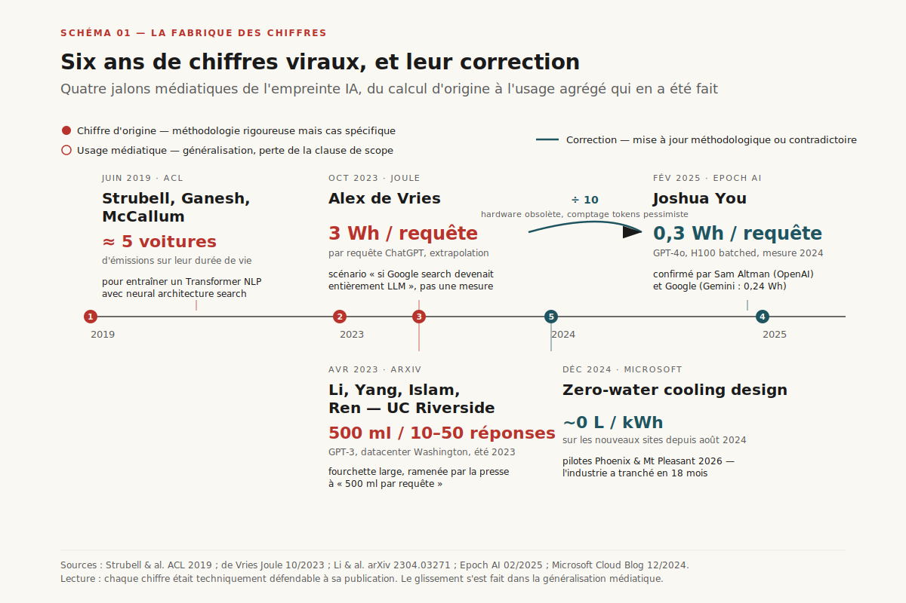

*Schéma 1 — Quatre jalons médiatiques de l'empreinte IA (Strubell 2019, de Vries 2023, Li 2023, Epoch AI 2025) et la trancture industrielle Microsoft 12/2024 sur l'eau.*

## 1. La fabrique des chiffres viraux

Avant de mesurer, il faut comprendre d'où viennent les phrases qui circulent. Quatre chiffres dominent le débat public depuis cinq ans, et trois sur quatre sont mal cités.

**2019 — Strubell : « entraîner un Transformer = la durée de vie de cinq voitures ».** L'article d'Emma Strubell, Ananya Ganesh et Andrew McCallum à l'ACL 2019[^1] mesure le coût énergétique d'un cas spécifique : un Transformer NLP entraîné avec *neural architecture search*, c'est-à-dire en explorant des milliers de configurations. La phrase « cinq voitures » est devenue le slogan d'une charge bien plus générique. ==Le chiffre était juste — il décrivait un protocole de recherche extrême, pas un entraînement de production==.

**2023 — Alex de Vries : « ChatGPT consomme 3 Wh par requête ».** L'article de Joule[^2] proposait un *scénario* : que se passerait-il si l'intégralité du trafic search de Google basculait sur des LLM ? Le chiffre était une extrapolation top-down sur la consommation totale du parc Google divisée par un trafic hypothétique. Repris sans la clause, il s'est imposé comme une métrique par requête.

**2023 — Li, Yang, Islam, Ren : « 500 ml d'eau pour 10 à 50 réponses ChatGPT »[^3].** Le calcul porte sur GPT-3 dans un datacenter Microsoft du Washington State, à un moment précis (été 2023), avec un WUE (*Water Usage Effectiveness*) régional élevé. Le chiffre est sourcé, méthodologique, honnête. Le problème : il a été ==généralisé en règle universelle « ChatGPT boit 500 ml », alors que la fourchette dépend du DC, de l'heure, et du modèle de 1 à 50==.

**2025 — Epoch AI : 0,3 Wh par requête ChatGPT**[^4]. Joshua You publie en février 2025 une mise à jour méthodologique. Le hardware a évolué (H100 + tensor cores FP8, batching dynamique, KV cache compressé), le décompte de tokens d'origine était surestimé. La conclusion : 0,3 Wh pour une requête typique GPT-4o. Sam Altman confirme dans un post de blog quelques semaines plus tard ; Google fait de même pour Gemini (0,24 Wh par requête médiane[^5]).

Ce n'est pas une querelle de virgules. C'est ==un facteur dix== sur le chiffre qui structure l'imaginaire public. La leçon n'est pas qu'il faut faire confiance aux corrections les plus récentes — c'est que **la mesure de l'empreinte d'un système qui évolue tous les six mois doit elle-même se renouveler tous les six mois**, et que tout chiffre cité sans son année et son scope est suspect.

---

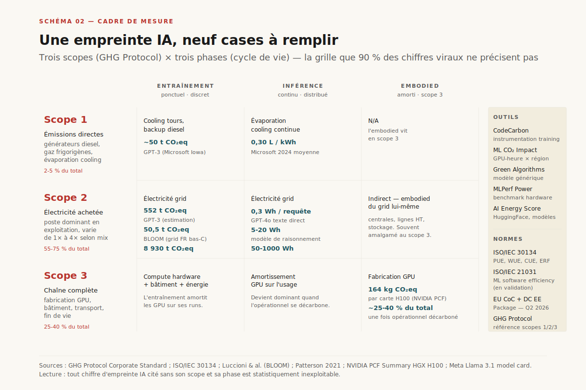

*Schéma 2 — La grille à neuf cases (3 scopes GHG × 3 phases cycle de vie) que 90 % des chiffres publics ne précisent pas, plus les outils et normes de référence.*

## 2. Que mesure-t-on, et comment ?

L'écart entre Strubell 2019 et Epoch 2025 ne vient pas que de l'évolution du hardware. Il vient aussi du fait que **l'empreinte d'un système d'IA est une matrice à deux dimensions** que peu d'études couvrent en entier.

**Axe 1 — Les trois scopes du GHG Protocol.**

- **Scope 1** : émissions directes sur site. Pour un datacenter, ce sont les générateurs diesel de secours, les fuites de gaz frigorigènes, et — pour l'eau — l'évaporation des tours de refroidissement.
- **Scope 2** : électricité achetée. C'est le poste dominant en exploitation ; sa valeur dépend du mix régional (180 gCO₂/kWh en France, 380 en Allemagne, 600 dans le Wyoming).
- **Scope 3** : tout le reste — fabrication du GPU, du bâtiment, du réseau, transport, fin de vie. C'est l'angle mort historique, et c'est aussi là que se logent les émissions « cachées » des chips fabriqués à Taïwan.

**Axe 2 — Les trois phases du cycle de vie.**

- **Entraînement** : un événement ponctuel et discret. GPT-3 estimé à 552 tCO₂eq ; BLOOM à 50,5 tCO₂eq[^6] ; Llama 3.1 405B à 8 930 tCO₂eq selon Meta. ==C'est le poste qui a alimenté l'effroi entre 2019 et 2023, mais ce n'est plus le poste dominant==.
- **Inférence** : continu, distribué, dépendant du trafic. Selon Meta et Google, l'inférence pèse aujourd'hui ==entre 65 % et 80 % du total opérationnel d'un modèle déployé==, et la part monte avec la diffusion.
- **Fabrication / embodied** : amortie sur la durée de vie matérielle (typiquement 5 à 7 ans pour un GPU de production). Selon Patterson et Gupta[^7], elle peut représenter 25 à 40 % de l'empreinte totale d'un chip une fois l'opérationnel décarboné.

**Outils et normes.** Une floraison d'outils s'est imposée : *CodeCarbon* (instrumentation côté training), *ML CO2 Impact* (estimateur par GPU-heure et région), *Green Algorithms* (modèle générique), *MLPerf Power* (benchmark hardware). Sur les normes, la base reste l'**ISO/IEC 30134** (PUE, WUE, CUE, ERF). La nouvelle **ISO/IEC 21031** spécifique à l'efficacité énergétique du software ML est en cours de validation. Et côté régulation, l'Union européenne durcit son **Code of Conduct on Data Centres** : volontaire depuis 2008 (~500 sites), il devient un *rating obligatoire* au Q2 2026 dans le cadre du *Data Centre Energy Efficiency Package*[^8], couplé au *Cloud and AI Development Act*.

==Le piège pour le lecteur : 90 % des chiffres publics ne précisent ni leur scope, ni leur phase, ni leur géographie==. Quand un communiqué dit « X grammes de CO₂ par requête », demandez : scope 1+2 ou +3 ? Inférence seule ou amortie sur l'entraînement ? Quelle région, quelle heure, quel modèle ?

---

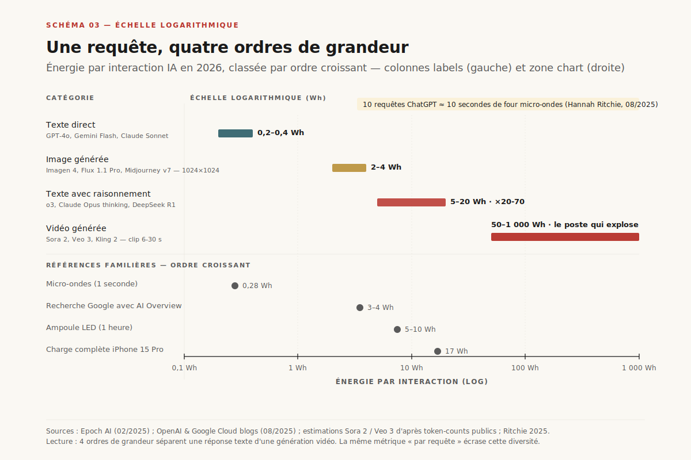

*Schéma 3 — Échelle logarithmique de l'énergie par interaction : texte direct, raisonnement, image, vidéo — comparés aux références familières (Google search, micro-ondes, LED, charge iPhone).*

## 3. L'arithmétique honnête d'une requête en 2026

Reprenons à zéro, avec les chiffres de mai 2026.

**Texte conversationnel — modèles « directs » (GPT-4o, Gemini 2.5 Flash, Claude Sonnet).** Une requête typique fait 200 tokens d'entrée et 150 tokens de sortie. Sur un H100 batched à 80 % d'occupation, le compteur tombe entre 0,2 et 0,4 Wh selon le modèle. ==Référence consolidée : 0,3 Wh par requête, soit moins qu'une seconde de four micro-ondes, ou 1/12 d'une recherche Google avec AI Overview==. Cette valeur est triangulée par trois sources indépendantes : Epoch AI, OpenAI, et Google.

**Texte avec raisonnement (o3, Claude Opus thinking, DeepSeek R1, Gemini 2.5 Thinking).** Le modèle « réfléchit » avant de répondre, parfois plusieurs dizaines de secondes. La chaîne de raisonnement multiplie le coût par 20 à 70× : 5 à 20 Wh par requête. Sur du raisonnement long (preuve mathématique, agent autonome multi-étapes), des cas extrêmes dépassent 100 Wh — l'équivalent d'une heure d'ampoule LED.

**Image générée (Imagen 4, Flux 1.1 Pro, Midjourney v7).** Diffusion latente 28 à 50 étapes sur une image 1024×1024 : 2 à 4 Wh. Plus haut résolution ou plus d'étapes : multiplication linéaire.

**Vidéo générée (Sora 2, Veo 3, Kling 2).** Un clip de 6 secondes en 720p : 50 à 200 Wh. Un clip 4K de 30 secondes : ==jusqu'à 1 000 Wh==, soit trois ordres de grandeur au-dessus d'une requête texte. C'est le poste qui explose silencieusement.

Hannah Ritchie résume[^9] : ==dix requêtes texte ChatGPT équivalent à dix secondes de four micro-ondes ; cent requêtes texte = 30 Wh, soit une minute de consommation moyenne d'un Américain==. Le point n'est pas que la requête est gratuite — c'est qu'elle est négligeable individuellement, et que le débat doit déplacer vers l'agrégat.

**Le débat de l'agrégat.** Ritchie note un point structurel : ==si l'on prend les estimations de consommation totale des datacenters IA et qu'on les divise par le trafic public d'inférence, le texte explique 2 % de la facture. Les 98 % restants sont distribués entre entraînement, image/vidéo, embeddings d'enterprise, search summaries, et tout ce qui n'est pas une conversation visible==. C'est là que le débat « combien de Wh par ChatGPT » bute : la métrique mesurable n'est pas la métrique qui pèse.

**Et concrètement, une équipe ?** Prenons un profil 2026 type — un développeur en stack MCP + agents : 200 chats/jour, 50 turns de raisonnement, 80 appels d'outils via MCP, quelques images. ==~645 Wh/jour, soit ~142 kWh/an==. Une équipe de 10 personnes sur 220 jours ouvrés : ~1,4 MWh/an. Soit l'équivalent de 7 frigos modernes, 10 % d'une voiture essence moyenne, ou ~½ vol Paris-NY pour les 10 membres. Le débat « culpabilité du prompt » se déplace : à l'échelle d'une équipe complète, l'IA agentique est mesurable, pas dramatique.

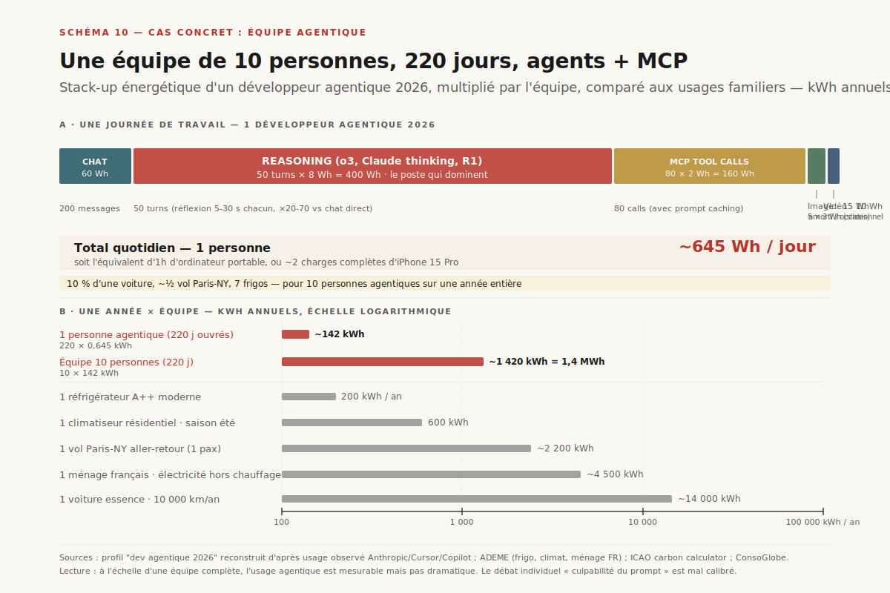

*Schéma 10 — Stack-up énergétique d'un développeur agentique 2026 (chat + reasoning + MCP + image), multiplié par 10 personnes × 220 jours, comparé à 5 usages familiers : frigo, climatiseur, vol, ménage, voiture.*

---

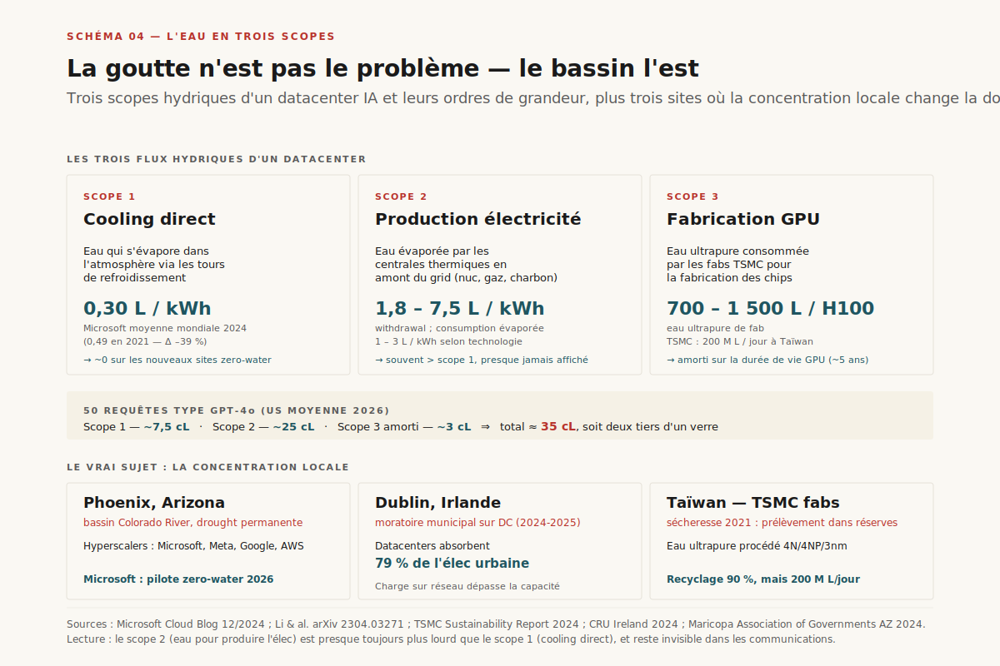

*Schéma 4 — Les trois flux hydriques d'un datacenter (cooling direct, électricité thermique, fabrication GPU) et trois sites où la concentration locale fait basculer le débat : Phoenix, Dublin, Taïwan.*

## 4. Eau : trois scopes, un seul vrai sujet

Le débat de l'eau est l'exemple parfait d'un faux scandale qui en cache un vrai.

**Scope 1 — Évaporation directe (cooling).** Quand un datacenter utilise un *cooling tower* à eau perdue, une fraction de l'eau qui circule s'évapore pour évacuer la chaleur. Le ratio dépend du climat, de la saison, et de la technologie. La métrique standard est le **WUE** (*Water Usage Effectiveness*), en L/kWh.

- Microsoft moyenne mondiale 2024 : ==0,30 L/kWh==, contre 0,49 en 2021 (-39 %)[^10]
- Google moyenne 2024 : ~1,1 L/kWh sur sa flotte évaporative ; ~0 sur ses nouveaux sites *air-cooled*
- AWS : ne publie pas de WUE moyenne flotte

**Scope 2 — Eau pour produire l'électricité.** Les centrales thermiques (nucléaire, gaz, charbon) consomment massivement de l'eau pour leur cycle de refroidissement : 1,8 à 7,5 L/kWh selon le type. Cette eau est généralement *prélevée puis retournée* (cycle ouvert), mais 1 à 3 L/kWh s'évaporent réellement. C'est le scope 2 hydrique, et il est souvent *plus important* que le scope 1.

**Scope 3 — Fabrication.** TSMC consomme 200 millions de litres par jour pour ses fabs taïwanaises, soit ~0,1 % de la consommation d'eau de Taïwan. La fabrication d'un GPU H100 mobilise environ 700 à 1 500 L d'eau ultrapure[^11].

**Ce que ces chiffres veulent dire.** Une session GPT-4o de 50 requêtes consomme :

- Scope 1 (cooling, datacenter US moyen) : ~7,5 cL
- Scope 2 (électricité thermique) : ~25 cL
- Scope 3 (amortissement fabrication GPU) : ~3 cL

Total : ~35 cL. Soit ==deux tiers d'un verre d'eau pour 50 requêtes==. Loin du « 500 ml par requête » qui circule encore.

**Le vrai problème : la concentration locale.** Phoenix (Arizona), Las Vegas (Nevada), Atacama (Chili) sont les sites où l'industrie ouvre des datacenters géants — dans des bassins qui ont déjà des problèmes de stress hydrique. Le débat n'est pas le bilan global de l'eau IA (négligeable rapporté à l'irrigation agricole), c'est la **concentration spatiale sur des aquifères fragiles**. Dublin a déjà absorbé 79 % de l'électricité urbaine en datacenters, le moratoire local sur les nouvelles implantations a tenu en 2024 et 2025.

**La réponse industrielle.** Microsoft a annoncé en décembre 2024[^12] que **tous ses nouveaux designs depuis août 2024 utilisent un cooling à boucle fermée à remplissage unique**. L'eau est versée à la construction, recircule entre les serveurs et des chillers mécaniques, ne s'évapore jamais. Économie : 125 millions de litres par DC par an. Coût : un PUE légèrement dégradé (besoin de chillers mécaniques en plus). Pilotes : Phoenix et Mt Pleasant en 2026. Google déploie du *direct-to-chip liquid cooling* sur ses TPU v6 ; Equinix généralise l'immersion à partir de 2027. ==En dix-huit mois, l'industrie a tranché : l'eau d'évaporation, c'est fini sur les nouveaux sites==. Le scandale court-circuite l'industrie qui l'a déjà résolu.

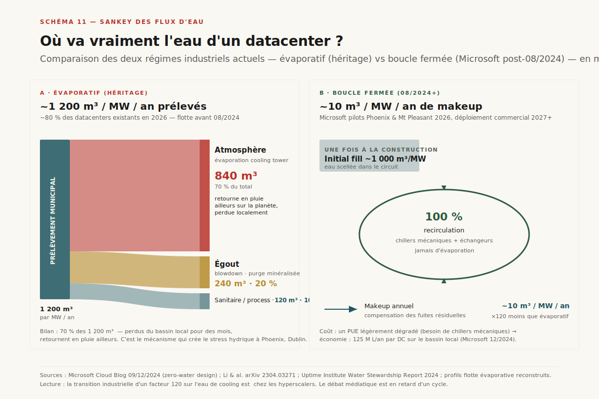

*Schéma 11 — Sankey des flux d'eau pour un datacenter 1 MW : régime évaporatif historique (1 200 m³/MW/an, ==70 % perdus à l'atmosphère==) vs régime à boucle fermée Microsoft (10 m³/MW/an de makeup, 100 % recirculation). Facteur ×120 d'amélioration sur le WUE annuel.*

---

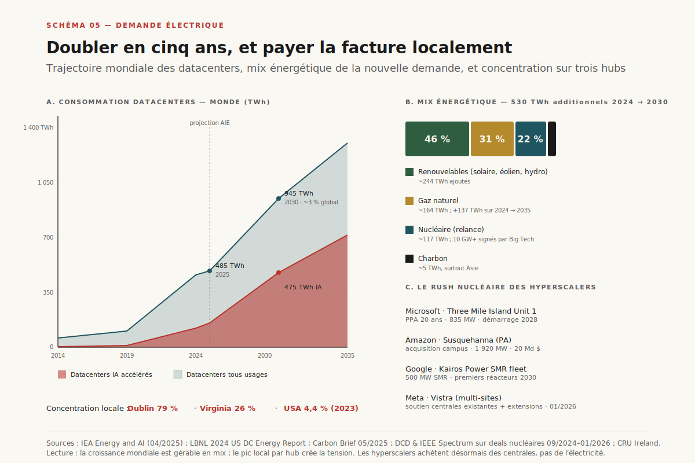

*Schéma 5 — Consommation datacenters mondiale 2014–2035 avec part IA en surcouche (panel A), mix énergétique des 530 TWh additionnels 2030 (panel B), et les quatre deals nucléaires majeurs des hyperscalers.*

## 5. Électricité : annualisé vs pic, le grid comme bottleneck

C'est ici que se loge le vrai problème.

**Les chiffres consolidés AIE 2025.** L'*Energy and AI* publié par l'Agence Internationale de l'Énergie en avril 2025[^13] :

- Consommation datacenters mondiaux : 460 TWh (2024) → **945 TWh (2030)** → 1 300 TWh (2035), scénario base.
- Part globale : ~1,5 % aujourd'hui → ==~3 % en 2030==.
- Croissance 2025 vs 2024 : +17 % (datacenters globaux), +30 % pour les sites accélérés IA.
- Les serveurs IA expliquent **environ la moitié de la croissance totale** des datacenters d'ici 2030.

**Aux États-Unis (LBNL 2024[^14]).** Datacenters US : 58 TWh en 2014 → 176 TWh en 2023 → ==325 à 580 TWh en 2028==, soit 6,7 % à 12 % de la consommation US selon le scénario. Le triplement en cinq ans est le plus brutal qu'aura jamais connu la grid américaine en temps de paix.

**Le point méthodologique important.** Carbon Brief[^15] rappelle que dans la projection AIE, les datacenters expliquent 8 % de la croissance électrique mondiale d'ici 2030 — derrière les véhicules électriques (838 TWh ajoutés) et l'industrie (1 936 TWh). ==L'IA n'est pas la cause dominante de la croissance électrique mondiale ; elle est la cause la plus médiatisée==. Cela n'enlève rien à son intensité locale, mais cadre le débat global.

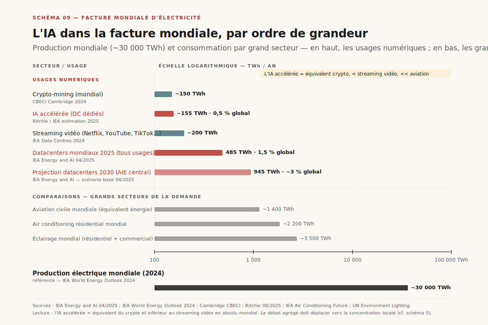

*Schéma 9 — Échelle logarithmique en TWh annuels : l'IA accélérée (~155 TWh) est de l'ordre du crypto-mining, en-dessous du streaming vidéo, et 200× plus petite que la production électrique mondiale (~30 000 TWh).*

**Le mix de la nouvelle demande.** Sur les 530 TWh additionnels de datacenters mondiaux d'ici 2030 :

- ~46 % renouvelables (solaire + éolien + hydro)
- ~31 % gaz naturel (avec capacités neuves, surtout US)
- ~22 % nucléaire (la résurrection 2024-2026)
- ~1 % charbon (marginal mais persistant en Asie)

Le nucléaire est le grand retour. ==Microsoft a signé en septembre 2024 un PPA 20 ans avec Constellation Energy pour rouvrir Three Mile Island Unit 1 (835 MW, démarrage 2028)==[^16] — première fois qu'un réacteur retiré aux US est ressuscité pour un client unique. Amazon a injecté 20 milliards de dollars dans Susquehanna (Pennsylvania, 1 920 MW), Google a signé avec Kairos Power un fleet deal SMR (500 MW, 2030), Meta a engagé Vistra sur quatre sites. *Big Tech a signé plus de 10 GW de nucléaire en douze mois* — un volume jamais vu depuis les années 1970.

**Le vrai bottleneck : le pic local.** Une AI factory de 1 GW consomme autant qu'une ville de 700 000 habitants — *en permanence, 24/7*. La grid moyenne d'un État américain absorbe difficilement plus de 50 à 100 MW de nouvelle demande baseload par an sans renforcement de lignes haute tension. Or, NVIDIA livre des clusters de 100 000 GPU (~150 MW chacun) en deux ans. ==Le bottleneck n'est plus la puissance installée, c'est l'interconnexion==. C'est pour cela que les hyperscalers achètent des centrales et non plus de l'électricité.

---

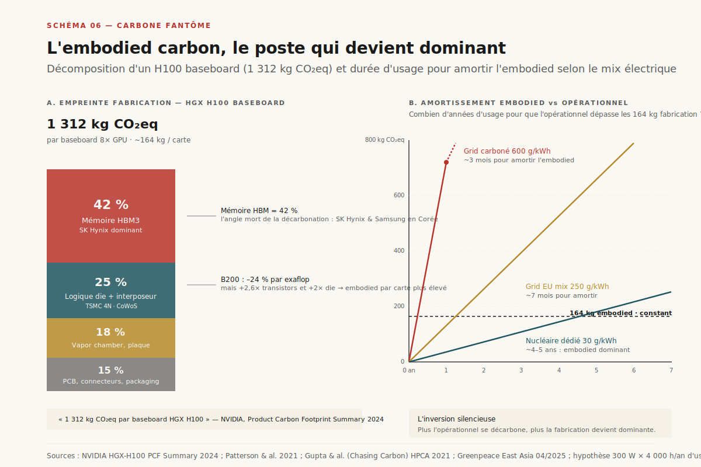

*Schéma 6 — Décomposition d'un baseboard HGX H100 (1 312 kg CO₂eq, mémoire dominante à 42 %) et durée d'usage requise pour amortir l'embodied selon le mix électrique opérationnel.*

## 6. Le carbone fantôme : l'embodied carbon des GPU

C'est le poste que personne ne regarde — et qui devient dominant à mesure que l'opérationnel se décarbone.

**Anatomie d'un H100.** 80 milliards de transistors, 814 mm² de silicium gravé sur le process TSMC 4N. Chaque carte intègre 80 Go de HBM3 (SK Hynix dominant), assemblée via le procédé CoWoS de TSMC sur un interposeur silicium, soudée à un baseboard SXM. NVIDIA publie une *Product Carbon Footprint Summary*[^17] : ==1 312 kg CO₂eq par baseboard HGX H100, soit environ 164 kg par carte==. Ventilation :

- Mémoire (HBM3) : 42 %
- Logique (die GPU + interposeur) : 25 %
- Thermique (vapor chamber, baseplate) : 18 %
- Autres : 15 %

**Le B200 : -24 % d'embodied par exaflop, +60 % d'embodied par carte.** Le B200 a 208 milliards de transistors (×2,6 vs H100), un die de ~1 600 mm² (×2), et double HBM3E. Par carte, l'empreinte fabrication grimpe — mais l'efficacité par FLOP s'améliore : NVIDIA revendique 0,50 gCO₂eq par exaflop sur B200 vs 0,66 sur H100[^18]. ==Le bilan dépend entièrement de la durée d'usage opérationnel==.

**La règle d'amortissement (Patterson, Gupta, Luccioni)**. Pour un GPU à mix électrique européen (250 gCO₂/kWh moyen) et 300 W d'usage actif, l'opérationnel annuel est ~660 kg CO₂eq. L'embodied de 164 kg s'amortit donc en environ **3 mois d'utilisation à pleine charge**. À mix décarboné (nucléaire dédié, 30 gCO₂/kWh), l'opérationnel tombe à ~80 kg/an : l'embodied devient égal à l'opérationnel à 2 ans, et dominant à 5 ans.

**L'inversion silencieuse.** Tant que le grid est carboné, l'opérationnel domine et l'embodied semble anecdotique. Mais à mesure que les hyperscalers décarbonent l'opérationnel (PPA renouvelables, nucléaire dédié), ==la fabrication devient le poste numéro un — et il dépend d'un seul fournisseur (TSMC) dans une géographie unique (Taïwan), dont le mix électrique reste à 80 % fossile==. La décarbonation de l'IA passe par TSMC, pas seulement par les opérateurs.

**Greenpeace 2025**[^19] : le rapport *Energy Consumption of AI* documente que l'industrie semi-conducteurs taïwanaise a augmenté sa consommation électrique de 25 % en deux ans, principalement pour la production d'AI chips, et que ses fabs restent alimentées à 83 % par des fossiles. Le scope 3 des hyperscalers américains est largement le scope 1+2 de TSMC.

---

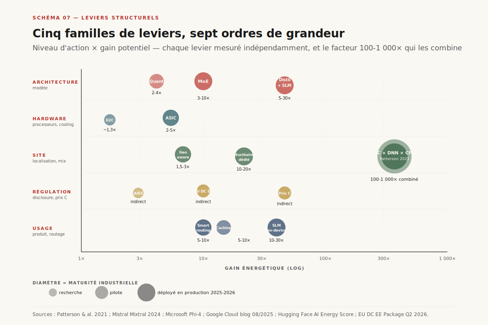

*Schéma 7 — Cinq familles de leviers (architecture, hardware, site, régulation, usage) placées sur une échelle logarithmique de gain énergétique potentiel ; diamètre = maturité industrielle.*

## 7. Les leviers structurels : ce qui marche

Cinq familles de leviers, classées par ordre de grandeur du gain potentiel et par horizon d'action.

**Levier 1 — Architecture des modèles.**

- **Mixture-of-Experts (MoE)** sparse : Mixtral 8×22B active ~39 B paramètres sur 141 B au total, gain énergétique 3 à 6×[^20]. GPT-4o et Claude utilisent désormais des variantes MoE. ==Patterson 2021 chiffrait déjà un gain potentiel ×10 sur les DNN sparses vs denses==[^21].
- **Distillation et quantization** : Phi-4-mini (3,8 B paramètres) bat GPT-4o sur MATH et GPQA tout en consommant ~30× moins par requête. La quantization int8 et int4 divise la mémoire par 2 à 4 sans perte significative sur les modèles modernes.
- **Modèles compacts dédiés** : Gemma 4 dans AICore Android, Phi-4 sur PC Copilot+, SmolLM3 sur edge — l'inférence migre du cloud vers le device.

**Levier 2 — Hardware spécialisé.**

- **Accélérateurs dédiés** : TPU v6 (Trillium) à 4,7× la perf/watt de v5e ; AWS Trainium2 ; Meta MTIA. Patterson estime que ML-purpose-built > GPU généraliste sur facteur 2 à 5×.
- **Refroidissement** : *direct-to-chip liquid* (Google, Meta), immersion biphasique (Microsoft, Equinix). Un PUE qui passe de 1,4 à 1,1 économise 25 % de l'électricité totale du DC.

**Levier 3 — Localisation et timing.**

- **Géo-distribution carbon-aware** : Google bat ses workloads non urgents sur les régions et les heures où le mix carbone est le plus propre (Iowa nuit, Finland hiver). Gain typique : 30 à 50 % sur le carbone d'un workload donné. Patterson chiffre l'effet combiné DC × DNN × processeur à **un facteur 100 à 1 000×** sur l'empreinte d'un entraînement.
- **Mix énergétique dédié** : Three Mile Island, Susquehanna, Kairos SMR — l'objectif est de découpler la nouvelle demande du grid public.

**Levier 4 — Mesure et régulation.**

- **Disclosure obligatoire** : EU Data Centre EE Package Q2 2026 force le rating et la publication PUE/WUE/CUE par site. Les opérateurs hors UE le suivront pour vendre en UE.
- **AI Energy Score** (Hugging Face, Sasha Luccioni) : grille publique pour les modèles open-weights ; les modèles propriétaires doivent opt-in, et peu le font.
- **Prix carbone interne** : Microsoft et Google appliquent déjà un *internal carbon fee* (~100$/tCO₂) qui finance leurs PPA renouvelables.

**Levier 5 — Comportement et design produit.**

- **Routage modèle** : le routeur GPT-5 d'OpenAI choisit dynamiquement entre mini, standard, thinking selon la difficulté. ==Un bon routage économise 80 % d'énergie sur l'usage agrégé==.
- **Caching agressif** : 30 à 50 % des requêtes texte se rejouent. Le prompt caching d'Anthropic et le KV cache global de DeepSeek divisent le coût par 5 à 10 sur la portion répétée.

**Le détail qui change l'ordre de grandeur.** Patterson 2021 le résume en une phrase : ==le choix combiné du DC, du DNN, et du processeur peut réduire l'empreinte carbone d'un entraînement par un facteur 100 à 1 000×==. C'est la nouvelle qui devrait dominer la couverture médiatique, et pourtant elle ne circule presque pas — sans doute parce qu'elle implique de citer une décision technique au lieu d'un slogan moral.

---

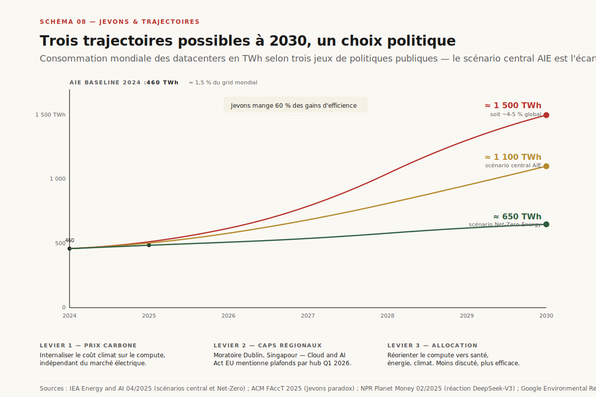

*Schéma 8 — Trois trajectoires de consommation datacenters à 2030 : laissez-faire (1 500 TWh), efficience seule (1 100 TWh, scénario central AIE), efficience + plafond (650 TWh).*

## 8. Jevons : pourquoi tout ça peut ne servir à rien

Le paradoxe de Jevons (1865) : *l'amélioration de l'efficacité d'usage d'une ressource ne réduit pas sa consommation totale ; elle l'augmente*, parce que l'efficacité fait baisser le coût marginal, donc le volume explose.

**L'évidence empirique sur l'IA, 2025.**

- **Google.** Émissions globales : 11,5 MtCO₂eq en 2019 → 17 MtCO₂eq en 2024 (rapport environnemental 2025). ==+48 % en cinq ans, alors que l'empreinte par requête a chuté d'un facteur 5 à 10 sur la même période==. Le facteur volume a écrasé le facteur efficacité.
- **DeepSeek-V3, janvier 2025.** Modèle entraîné pour ~6 M$ et 2 048 H800, soit ~10× moins de compute que GPT-4. NPR Planet Money[^22] documente la réaction : dans les trois mois qui suivent, *la demande mondiale de compute IA augmente* parce que l'efficacité de DeepSeek convainc les financiers que la barrière à l'entrée a baissé, qu'il faut investir plus, pas moins.
- **L'article ACM FAccT 2025**[^23] : *« la trajectoire de l'IA dépend des incitations business, de la gouvernance et des normes sociales, pas seulement de l'efficacité technique »*. La conclusion est dure : sans intervention politique, l'efficacité ne réduit jamais le total.

**Trois familles de politiques (paper FAccT 2025).**

1. **Prix carbone élevé sur le compute IA** — un prix qui force l'internalisation du coût climatique, indépendant du marché de l'électricité (parce que le marché électricité est saturé par les hyperscalers).
2. **Caps absolus régionaux** — Dublin et Singapour ont déjà imposé des moratoires sur les nouveaux datacenters. Bruxelles l'a évoqué dans le *Cloud and AI Act* (consultation Q1 2026).
3. **Allocation vers usages à fort retour social** — santé, énergie, climat, recherche fondamentale. C'est le moins discuté politiquement, et probablement le plus efficace : reorienter le compute disponible plutôt que limiter sa croissance.

**Trois trajectoires possibles 2027-2030.**

- **Laissez-faire.** Capex hyperscalers continue, nucléaire signé, pas de cap. Conso datacenters mondiale : ==~1 500 TWh en 2030==, 4-5 % du grid global. Tension grid extrême sur 5-7 hubs.
- **Efficience seule.** Tous les leviers techniques activés (MoE, SLM, liquid cooling, nuclear), pas de régulation Jevons. Conso : ~1 100 TWh — les gains d'efficience sont mangés à 60 % par le volume. C'est le scénario AIE central.
- **Efficience + plafond.** Cap absolu sur la capacité datacenter par région + prix carbone + obligation de disclosure. Conso : ~650 TWh, soit ~2 % du grid global. Demande de courte. C'est le scénario *Net-Zero Energy* AIE — politiquement difficile, techniquement faisable.

==Le débat « est-ce que l'IA est verte ou pas » est mal posé. La question n'est pas l'intensité par token, c'est qui décide du volume agrégé==. Et cette décision se prend dans des assemblées de régulateurs, pas dans des datacenters.

---

## Conclusion — ce qui mérite l'inquiétude

Quatre points pour ranger le débat :

1. **Cesser de relayer les chiffres viraux sans leur scope et leur date.** ChatGPT à 0,3 Wh par requête en 2026, pas 3 Wh ; l'eau d'un datacenter Microsoft à 0,30 L/kWh moyen monde, et ~0 sur les nouveaux sites en 2026. Le slogan est faux, la donnée est publique.

2. **Réorienter l'inquiétude vers l'agrégat et le local.** Le bon indicateur n'est pas la requête, c'est la part régionale (Dublin 79 %, Virginia 26 %, Phoenix horizon 2027). Le combat est municipal et national, pas individuel.

3. **Compter l'embodied.** Décarboner les hyperscalers sans décarboner TSMC, c'est repeindre la façade en blanc. Le scope 3 silicium est le prochain front, et il dépend d'une géographie unique.

4. **Nommer Jevons.** Tous les gains d'efficacité de la décennie ont été engloutis par le volume. Sans plafond ou prix carbone, la trajectoire 2030 sera tirée par la demande, pas par la technologie. C'est un choix politique, pas un destin physique.

L'IA frugale existe. Elle s'appelle Phi-4 sur un Copilot+ PC, Gemma 4 sur Android, un H100 en Iowa la nuit, un PPA nucléaire en Pennsylvanie, un cap urbain à Dublin. Elle n'a juste rien à voir avec la culpabilité du prompt que vous tapez en ce moment.

---

## Sources

[^1]: Strubell E., Ganesh A., McCallum A., *Energy and Policy Considerations for Deep Learning in NLP*, ACL 2019. URL : https://aclanthology.org/P19-1355/. Consulté le 2026-05-13.

[^2]: de Vries A., *The growing energy footprint of artificial intelligence*, Joule 7(10), octobre 2023. URL : https://www.cell.com/joule/fulltext/S2542-4351(23)00365-3. Consulté le 2026-05-13.

[^3]: Li P., Yang J., Islam M.A., Ren S., *Making AI Less "Thirsty": Uncovering and Addressing the Secret Water Footprint of AI Models*, arXiv:2304.03271, avril 2023 ; publié dans *Communications of the ACM*, 2025. URL : https://arxiv.org/abs/2304.03271. Consulté le 2026-05-13.

[^4]: You J., *How much energy does ChatGPT use?*, Epoch AI Gradient Updates, février 2025. URL : https://epoch.ai/gradient-updates/how-much-energy-does-chatgpt-use. Consulté le 2026-05-13.

[^5]: Google Cloud, *Measuring the environmental impact of AI inference*, blog Google Cloud, août 2025. URL : https://cloud.google.com/blog/products/infrastructure/measuring-the-environmental-impact-of-ai-inference/. Consulté le 2026-05-13.

[^6]: Luccioni A.S., Viguier S., Ligozat A.-L., *Estimating the Carbon Footprint of BLOOM, a 176B Parameter Language Model*, Journal of Machine Learning Research 24, 2023. URL : https://jmlr.org/papers/v24/23-0069.html. Consulté le 2026-05-13.

[^7]: Gupta U., Kim Y.G., Lee S., Tse J., Lee H.-H.S., Wei G.-Y., Brooks D., Wu C.-J., *Chasing Carbon: The Elusive Environmental Footprint of Computing*, IEEE HPCA 2021. URL : https://arxiv.org/abs/2011.02839. Consulté le 2026-05-13.

[^8]: Commission européenne, *European Code of Conduct for Energy Efficiency in Data Centres* + *Data Centre Energy Efficiency Package* (consultation publique mars-avril 2026). URL : https://joint-research-centre.ec.europa.eu/scientific-activities-z/energy-efficiency/energy-efficiency-products/code-conduct-ict/european-code-conduct-energy-efficiency-data-centres_en. Consulté le 2026-05-13.

[^9]: Ritchie H., *How much electricity does AI consume? [2025 summary]*, Sustainability by Numbers, août 2025. URL : https://hannahritchie.substack.com/p/ai-electricity-2025. Consulté le 2026-05-13.

[^10]: Microsoft, *2024 Environmental Sustainability Report*, mai 2024 + blog *Sustainable by design: Next-generation datacenters consume zero water for cooling*, décembre 2024. URL : https://www.microsoft.com/en-us/microsoft-cloud/blog/2024/12/09/sustainable-by-design-next-generation-datacenters-consume-zero-water-for-cooling/. Consulté le 2026-05-13.

[^11]: TSMC, *Sustainability Report 2024*, juillet 2024 (consommation d'eau des fabs taïwanaises et politiques de recyclage). URL : https://esg.tsmc.com/en-US/resources/reports.html. Consulté le 2026-05-13.

[^12]: Microsoft, *Sustainable by design: Next-generation datacenters consume zero water for cooling*, Microsoft Cloud Blog, 9 décembre 2024. URL : https://www.microsoft.com/en-us/microsoft-cloud/blog/2024/12/09/sustainable-by-design-next-generation-datacenters-consume-zero-water-for-cooling/. Consulté le 2026-05-13.

[^13]: IEA, *Energy and AI*, World Energy Outlook Special Report, avril 2025. URL : https://www.iea.org/reports/energy-and-ai. Consulté le 2026-05-13.

[^14]: Shehabi A. et al., *2024 United States Data Center Energy Usage Report*, Lawrence Berkeley National Laboratory, décembre 2024 (commande DOE). URL : https://eta.lbl.gov/publications/2024-lbnl-data-center-energy-usage-report. Consulté le 2026-05-13.

[^15]: Carbon Brief, *AI: Five charts that put data-centre energy use – and emissions – into context*, mai 2025. URL : https://www.carbonbrief.org/ai-five-charts-that-put-data-centre-energy-use-and-emissions-into-context/. Consulté le 2026-05-13.

[^16]: Data Center Dynamics, *Three Mile Island nuclear power plant to return as Microsoft signs 20-year, 835MW AI data center PPA*, septembre 2024. URL : https://www.datacenterdynamics.com/en/news/three-mile-island-nuclear-power-plant-to-return-as-microsoft-signs-20-year-835mw-ai-data-center-ppa/. Consulté le 2026-05-13.

[^17]: NVIDIA, *Product Carbon Footprint Summary — HGX H100*, datasheet officielle, 2024. URL : https://images.nvidia.com/aem-dam/Solutions/documents/HGX-H100-PCF-Summary.pdf. Consulté le 2026-05-13.

[^18]: NVIDIA Developer Blog, *NVIDIA HGX B200 Reduces Embodied Carbon Emissions Intensity*, 2025. URL : https://developer.nvidia.com/blog/nvidia-hgx-b200-reduces-embodied-carbon-emissions-intensity/. Consulté le 2026-05-13.

[^19]: Greenpeace East Asia, *Energy Consumption of AI — Appendix: A Bottom-up Analysis*, avril 2025. URL : https://www.greenpeace.org/static/planet4-eastasia-stateless/2025/04/c97a710a-energy_consumption_of_ai_appendix.pdf. Consulté le 2026-05-13.

[^20]: Mistral AI, *Mixtral of Experts*, arXiv:2401.04088, janvier 2024. URL : https://arxiv.org/abs/2401.04088. Consulté le 2026-05-13.

[^21]: Patterson D., Gonzalez J., Le Q., Liang C., Munguia L.-M., Rothchild D., So D., Texier M., Dean J., *Carbon Emissions and Large Neural Network Training*, arXiv:2104.10350, avril 2021. URL : https://arxiv.org/abs/2104.10350. Consulté le 2026-05-13.

[^22]: NPR Planet Money, *Why the AI world is suddenly obsessed with Jevons paradox*, février 2025. URL : https://www.npr.org/sections/planet-money/2025/02/04/g-s1-46018/ai-deepseek-economics-jevons-paradox. Consulté le 2026-05-13.

[^23]: Hilton A. et al., *From Efficiency Gains to Rebound Effects: The Problem of Jevons' Paradox in AI's Polarized Environmental Debate*, ACM FAccT 2025. URL : https://arxiv.org/abs/2501.16548. Consulté le 2026-05-13.
