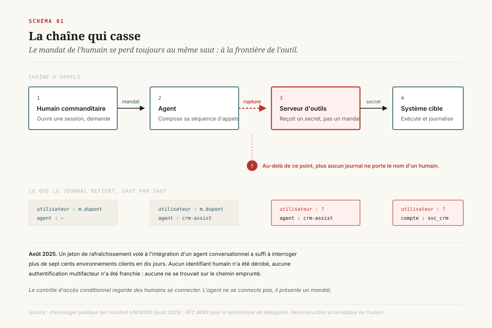
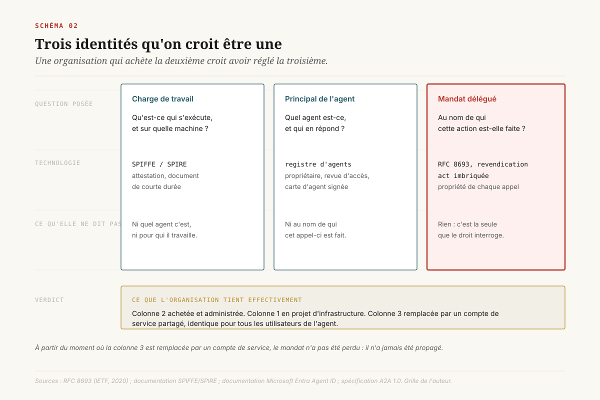
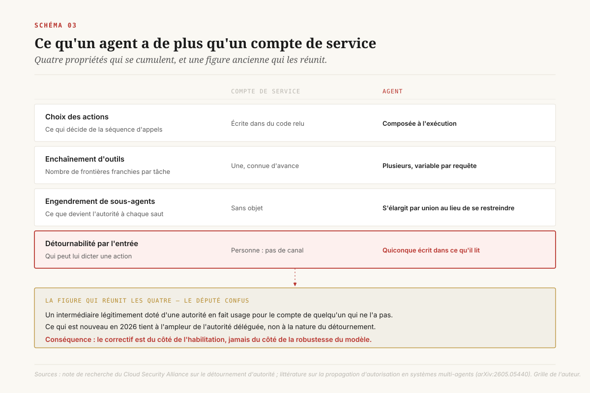
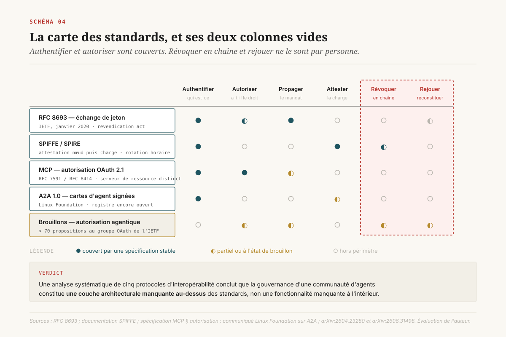

# Au nom de qui

> **On ne peut pas graduer l'autonomie d'un agent dont on ne sait pas dire au nom de qui il agit.** — 21 août 2026, Mathieu Guglielmino

Les cadres de gouvernance agentique publiés depuis dix-huit mois convergent tous vers la même figure : une échelle d'autonomie. Quatre paliers, cinq paliers, six selon les maisons, du mode observateur jusqu'à l'exécution sans validation. La figure est juste et elle a rendu service : elle donne à un comité un vocabulaire pour dire ce qu'un agent a le droit de faire.

Il lui manque une chose. Un palier d'autonomie ne vaut que par le point de contrôle qui le refuse. Et ce point de contrôle ne lit ni la charte, ni le compte rendu du comité : il lit un jeton. La question de gouvernance qui décide de toutes les autres n'est donc pas « jusqu'où l'agent peut-il aller », mais ==**au nom de qui agit-il quand il y va**==.

Cette question a une réponse technique, et cette réponse est aujourd'hui absente dans la plupart des organisations. Non pas parce que les standards manquent : ils existent, certains depuis 2020. Parce que l'organisation a branché ses agents sur un socle d'identité conçu pour des salariés et des comptes de service, et qu'elle a acheté un contrôle d'accès en croyant régler une question de responsabilité.

---

## 1. Le trou dans la chaîne

Entre le 8 et le 18 août 2025, un groupe d'attaquants suivi sous le nom d'UNC6395 a interrogé et exporté méthodiquement des données de plus de sept cents environnements Salesforce[^5]. La liste des organisations touchées est publique et elle est instructive : Cloudflare, Google, PagerDuty, Palo Alto Networks, Proofpoint, Tanium, Zscaler. Des entreprises dont la sécurité n'est pas un poste de coût mais un produit.

Aucun mot de passe n'a été volé. Aucune authentification multifacteur n'a été contournée. Aucun poste de travail n'a été compromis.

Ce qui a été volé, ce sont des jetons de rafraîchissement OAuth appartenant à l'intégration entre Salesforce et Drift, l'agent conversationnel commercialisé par Salesloft[^4]. Ces jetons autorisaient Drift à interroger les instances Salesforce de ses clients. L'attaquant s'en est servi exactement comme Drift s'en servait : en présentant un jeton valide à une interface qui l'attendait.

La leçon habituellement tirée de cet incident est une leçon de chaîne d'approvisionnement logicielle. Elle est correcte et elle est insuffisante. La leçon de gouvernance est ailleurs : ==l'intégralité de la pile de contrôle d'identité de sept cents organisations a été non pas franchie, mais **contournée par le côté**, parce qu'aucun de ses éléments ne se trouvait sur le chemin emprunté==. Le contrôle d'accès conditionnel, la revue trimestrielle des habilitations, la politique de mots de passe, la détection de connexion anormale : tous ces dispositifs regardent des humains se connecter. Drift ne se connectait pas. Drift présentait un mandat.

Et personne, ni chez Salesloft, ni chez Salesforce, ni chez les sept cents déployeurs, ne pouvait répondre en temps réel à la question qui aurait arrêté l'incident : *cette requête est-elle faite au nom de quelqu'un, et de qui ?*

La question n'est pas rhétorique. Elle a une forme technique précise, elle a des réponses normalisées depuis six ans, et l'écart entre ces réponses et ce que les organisations déploient effectivement est le sujet de ce dossier.

## 2. Trois identités qu'on croit être une

Quand un comité décide qu'un agent aura « une identité », il croit décider d'une chose. Il en décide de trois, et il n'en obtient généralement qu'une.

**La première est l'identité de la charge de travail.** Elle répond à la question *qu'est-ce qui s'exécute, et où*. Un conteneur, un processus, une fonction déclenchée par événement. C'est le domaine du SPIFFE et de son implémentation SPIRE : l'identité n'est pas un secret qu'on distribue mais une propriété qu'on atteste. SPIRE procède en deux temps, attestation du nœud puis attestation de la charge, et délivre un document de courte durée de vie renouvelé toutes les heures[^13]. Aucun appelant n'a besoin de présenter d'identifiant pour obtenir le sien : le fait d'appeler depuis ce processus, sur cette machine, *est* la preuve.

**La deuxième est le principal applicatif de l'agent.** Elle répond à *quel agent est-ce, qui l'a créé, qui en répond*. C'est le terrain sur lequel les grands fournisseurs d'identité se sont positionnés en 2026. Microsoft Entra Agent ID, désormais en disponibilité générale, fait apparaître les agents dans la même console que les utilisateurs, avec un registre, un propriétaire, des habilitations lisibles et des revues d'accès[^12]. C'est un progrès réel : sans registre, il n'y a pas de gouvernance possible, seulement des inventaires manuels périmés à la semaine.

**La troisième est le mandat délégué.** Elle répond à la seule question dont le droit se soucie : *au nom de qui cette action est-elle faite*. Elle n'est pas une propriété de l'agent, elle est une propriété de **chaque appel**. Le même agent, appelé par deux personnes différentes, doit porter deux mandats différents et ne doit jamais pouvoir faire pour l'une ce qu'il ferait pour l'autre.

L'erreur structurante tient en une phrase : ==une organisation qui achète la deuxième croit avoir réglé la troisième==. Elle enregistre l'agent, lui donne un propriétaire, l'inscrit dans la revue d'accès. Puis elle lui attribue un compte de service avec les habilitations nécessaires « pour que ça marche », et ce compte de service est le même pour tous les utilisateurs de l'agent.

À partir de ce moment, le journal ne contient plus qu'un seul nom : celui de l'agent. Le mandat a disparu. Il n'a pas été perdu : il n'a jamais été propagé.

Cette rupture a un coût qui ne se manifeste pas le jour où elle est créée. Elle se manifeste le jour où il faut reconstituer. La directive européenne sur la responsabilité du fait des produits défectueux, dont la transposition arrive en décembre 2026, assortit le refus **ou l'incapacité** de produire des éléments d'une présomption de défectuosité ; l'article 26 du règlement sur l'intelligence artificielle impose au déployeur d'un système à haut risque une conservation des journaux d'au moins six mois[^16]. Un journal qui dit « l'agent commercial a exporté 14 000 fiches » et rien de plus satisfait la lettre de l'obligation et ne défend personne.

## 3. Ce qu'un agent a de plus qu'un compte de service

L'objection est immédiate et elle mérite d'être prise au sérieux : les organisations gèrent des comptes de service depuis trente ans, avec des résultats médiocres mais connus. Qu'est-ce qu'un agent change ?

Quatre choses, et elles se cumulent.

**Il choisit ses actions à l'exécution.** Un compte de service exécute un traitement dont la liste d'appels est écrite dans du code relu et versionné. Un agent reçoit un objectif et compose sa séquence. L'habilitation qu'on lui accorde n'est plus la liste de ce qu'il fera, elle est la borne de ce qu'il *pourrait* faire, et l'écart entre les deux est précisément ce qu'on ne sait pas mesurer avant l'incident.

**Il enchaîne des outils.** Chaque appel d'outil est une frontière où le mandat doit être re-présenté, et chaque frontière est une occasion de le perdre.

**Il engendre des sous-agents.** Quand un agent A délègue à B et B à C, l'autorité s'élargit à chaque saut : B tourne avec les habilitations de A plus les siennes, C accumule les deux, et une action au fond de la chaîne s'exécute avec un ensemble de permissions qu'aucun humain n'a jamais accordé[^11]. La littérature récente sur la propagation d'autorisation dans les systèmes multi-agents pose l'invariant qui manque : les permissions effectives d'un agent doivent être l'**intersection** de celles de l'utilisateur et de celles autorisées à l'agent, jamais leur union, et cet invariant doit tenir à chaque saut, pas seulement au premier.

**Il est détournable par son entrée.** C'est la propriété qu'aucun compte de service ne possède. Un agent lit des contenus qu'il n'a pas choisis : une boîte de réception, un ticket, un document récupéré, la sortie d'un outil. Quiconque peut écrire dans l'un de ces canaux peut y placer des instructions que l'agent exécutera avec l'autorité de son commanditaire[^8].

Le nom de cette figure est ancien : le **député confus**. Un intermédiaire légitimement doté d'une autorité est amené à en faire usage pour le compte de quelqu'un qui ne l'a pas. Ce qui est nouveau en 2026 tient à l'ampleur de l'autorité déléguée, pas à la nature du détournement. Le Cloud Security Alliance en a fait l'objet d'une note de recherche dédiée[^8], et la constatation qui en ressort est décourageante pour qui espérait une parade au niveau du modèle : ==aucune amélioration de la robustesse d'un agent aux instructions injectées ne peut compenser une autorité qu'il n'aurait pas dû détenir==. Le correctif est du côté de l'habilitation, pas du côté de l'intelligence.

Or l'état de l'habilitation est documenté, et il est mauvais. Une enquête menée en juin 2026 auprès de 107 entreprises rapporte que 69 % d'entre elles font partager des secrets d'accès entre agents quelque part dans leur déploiement, que 49 % seulement appliquent une portée d'habilitation à l'exécution, que 47 % journalisent l'activité des agents, et que 32 % attribuent à chaque agent une identité gérée et cadrée[^2]. La même enquête rapporte que 54 % des répondants déclarent un incident de sécurité confirmé impliquant un agent (18 %) ou un incident évité de justesse (36 %)[^1].

Ces chiffres viennent d'un panel déclaratif, restreint, et il faut les lire comme tels. Leur intérêt n'est pas leur précision, il est leur cohérence interne : les deux tiers des organisations ont créé la condition du détournement, et un peu plus de la moitié en ont déjà vu la manifestation.

## 4. Ce que les standards savent déjà faire

Le réflexe, à ce stade, est d'attendre une norme. Il faut résister au réflexe, pour une raison simple : la pièce centrale existe depuis janvier 2020.

**RFC 8693**, *OAuth 2.0 Token Exchange*, définit un mécanisme d'échange de jeton et, avec lui, une revendication nommée `act` qui exprime qu'un mandataire agit pour le compte d'un mandant[^6]. La revendication est **imbriquable** : si un service B appelle un service C pour le compte de l'utilisateur X après avoir été appelé par A, le jeton présenté à C porte la chaîne complète, l'acteur courant au niveau extérieur et les acteurs antérieurs imbriqués, le plus ancien étant le plus profond. La spécification pose aussi la règle de lecture qui évite l'accumulation d'autorité : le destinataire ne doit considérer que les revendications de premier niveau et l'acteur courant ; les acteurs antérieurs sont informatifs.

Elle pose enfin la distinction dont dépend tout le reste. Sans jeton d'acteur, l'échange produit une **usurpation** : l'agent devient l'utilisateur, indiscernable de lui dans tous les journaux en aval. Avec jeton d'acteur, il produit une **délégation** : le jeton porte les deux parties. La différence ne se voit pas à l'usage. Elle se voit six mois plus tard, quand il faut expliquer qui a fait quoi.

Autour de cette pièce, le paysage s'est densifié vite, et de façon inégale.

Du côté de l'**exécution**, SPIFFE et SPIRE répondent proprement à l'attestation de la charge de travail, avec des documents de courte durée qui expirent quand l'agent éphémère disparaît[^13]. La difficulté n'est pas conceptuelle, elle est de déploiement : la plupart des équipes utiliseront des jetons d'API à longue durée ce trimestre encore, parce que le socle d'attestation suppose un plan de contrôle qu'elles n'ont pas.

Du côté des **outils**, le Model Context Protocol a adossé son autorisation à OAuth 2.1, avec l'enregistrement dynamique de client (RFC 7591) et les métadonnées de serveur d'autorisation (RFC 8414), et il traite explicitement le serveur d'outils comme un serveur de ressource distinct[^15]. C'est le bon découpage. Il laisse ouverte la question qui compte : rien n'oblige, dans le protocole, à ce que le jeton présenté au serveur d'outils porte le mandat de l'utilisateur plutôt que l'identité de l'agent seul.

Du côté des **agents entre eux**, le protocole A2A, versé à la Linux Foundation, a livré une version 1.0 stable comportant des cartes d'agent signées pour la vérification cryptographique d'identité, et revendique plus de cent cinquante organisations participantes en un an[^14]. Le progrès est réel. Il est aussi borné : la proposition de registre d'agents et celle de vérification d'identité des cartes restaient des questions ouvertes à la mi-2026, ce qui signifie que la découverte et l'identité ne sont pas résolues au niveau du protocole et que les pairs se configurent à la main.

Du côté de l'**autorisation**, enfin, le travail normatif est abondant au point d'être illisible : plus de soixante-dix brouillons individuels proposés au seul groupe de travail OAuth de l'IETF[^9], un groupe communautaire dédié à l'identité et l'IA à l'OpenID Foundation, et des brouillons de groupe de travail sur l'autorisation à l'ère des agents, dont un profil traitant le cas où une politique ne peut pas encore autoriser une action parce qu'un préalable manque : une approbation, un consentement, une autorité déléguée, une attestation.

Une analyse systématique publiée fin juin 2026 met de l'ordre dans ce paysage, en évaluant cinq protocoles d'interopérabilité (MCP, A2A, ACP, ANP, ERC-8004) contre une taxonomie de six exigences de gouvernance : appartenance, délibération, vote, conservation du désaccord, escalade humaine, audit et rejeu[^10]. Le résultat mérite d'être cité tel quel : ==la gouvernance d'une communauté d'agents constitue **une couche architecturale manquante au-dessus** des standards d'interopérabilité actuels, et non une fonctionnalité manquante à l'intérieur de chacun d'eux==.

Traduction pour une direction : les standards répondent à *authentifier* et *autoriser*. Ils répondent partiellement à *propager*. Ils ne répondent pas à *révoquer en chaîne* ni à *rejouer*. Ces deux cases vides ne seront comblées par aucun achat en 2026, et ce sont exactement les deux dont on a besoin le jour d'un incident.

## 5. Le chiffre qui ne veut rien dire, et ceux qu'il faudrait

Un chiffre circule dans toutes les présentations sur le sujet : le rapport entre identités non humaines et identités humaines dans l'entreprise. Il vaut la peine de s'y arrêter, parce que sa fortune est un cas d'école.

Les valeurs publiées sur les douze derniers mois s'échelonnent de 40 pour 1 à 109 pour 1. Un rapport d'éditeur titre « plus de 80 pour 1 » et retient 82 ; une compilation ultérieure avance 109, dont 79 attribuées à des agents ; d'autres publications citent 45. Les fourchettes couramment reprises vont de 40 à 80[^3].

[SCHEMA-05]

Trois observations, dans l'ordre d'importance.

La première : **toutes ces mesures proviennent d'éditeurs qui vendent le remède**. L'observation porte sur leur position, non sur leur honnêteté : personne d'autre n'a de raison de compter, et aucun organisme indépendant ne s'en est chargé.

La deuxième : **il n'existe pas de dénominateur commun**. Compte-t-on les comptes de service, les certificats, les clés d'API, les jetons éphémères, les instances de conteneurs, les sessions d'agents ? Un écart de facteur deux entre deux publications peut n'être qu'un écart de définition. Le chiffre n'est donc pas faux ; il n'est pas comparable, ce qui est pire, parce qu'il autorise des séries temporelles qui ne mesurent rien.

La troisième, et c'est celle qui intéresse un comité : **le ratio ne se rattache à aucune décision**. Savoir qu'on a quatre-vingts identités machine par salarié ne dit ni lesquelles sont dangereuses, ni lesquelles sont abandonnées, ni sur laquelle commencer. C'est un chiffre d'alerte destiné à ouvrir un budget, pas un indicateur de pilotage.

Trois taux le remplacent avantageusement, et une organisation peut les produire elle-même en quelques jours.

**Le taux de propriété.** Quelle proportion des identités non humaines actives porte un propriétaire nommé, vivant, et une date de revue non dépassée. La réponse initiale est généralement basse au point d'être inconfortable à publier, et c'est exactement pourquoi elle est utile : elle borne toute autre ambition de gouvernance.

**Le taux de portée.** Quelle proportion des habilitations accordées à un agent a été effectivement exercée sur les quatre-vingt-dix derniers jours. L'écart entre accordé et exercé est la mesure directe du rayon d'un détournement. Contrairement au ratio, il se calcule à partir de journaux que l'organisation possède déjà.

**Le taux de reconstitution.** Sur un échantillon d'actions d'agents tirées au sort dans le trimestre écoulé, quelle proportion permet de remonter à un humain commanditaire nommé. C'est le seul des trois qui mesure la chaîne de délégation, et c'est celui qui prédit ce qu'on pourra opposer à un régulateur ou à un juge.

Aucun de ces trois taux ne se compare entre entreprises. C'est un avantage : ils se comparent à eux-mêmes d'un trimestre à l'autre, ce qu'un ratio d'éditeur ne permet pas.

## 6. Le palier d'autonomie devient opposable ici

Revenons à l'échelle d'autonomie, avec de quoi la rendre opérante.

Toutes les échelles publiées décrivent des paliers par la **capacité** : ce que l'agent a le droit de faire. Mode observateur, mode supervisé, autonomie guidée, autonomie complète, dans la formulation la plus répandue. Chaque palier est conditionné à une mesure de résultat et à un risque explicitement visé.

Cette description est nécessaire. Elle ne suffit pas, parce qu'elle ne dit pas **où le palier est refusé**. Un palier qui n'est refusé nulle part est une intention. Un palier refusé par un point de contrôle qui lit un jeton est une politique.

[SCHEMA-06]

La relecture consiste à attacher à chaque palier la pièce d'identité qu'il exige et le point qui la vérifie.

**Palier 1, l'agent propose.** Il lit, il rédige, un humain valide avant tout effet. Pièce exigée : un principal applicatif enregistré, avec propriétaire nommé. Point de refus : le registre. Un agent absent du registre ne reçoit aucun accès en lecture au-delà du bac à sable.

**Palier 2, l'agent exécute sous validation.** Pièce exigée : la propagation du mandat. Chaque appel d'outil porte l'identité de l'humain commanditaire, distincte de celle de l'agent, sous forme de délégation et non d'usurpation. Point de refus : le serveur d'outils, qui rejette un jeton sans mandat. C'est la marche la plus haute de toute l'échelle, et celle qui est presque toujours sautée.

**Palier 3, l'agent exécute et notifie.** Pièce exigée, en plus des précédentes : l'attestation de la charge de travail et une habilitation dont la portée est bornée à l'exécution, plus un journal qui conserve la chaîne complète. Point de refus : le serveur d'autorisation, qui n'échange un jeton qu'au bénéfice d'une charge attestée.

**Palier 4, l'agent exécute sans notification préalable.** Pièce exigée : tout ce qui précède, plus une capacité de révocation en chaîne éprouvée, c'est-à-dire testée. Point de refus : il n'existe pas encore de mécanisme normalisé. La conséquence à en tirer est directe et un comité peut la voter demain : ==tant que la révocation en chaîne n'est pas démontrée par un exercice, le palier 4 reste fermé hors du bac à sable==.

Cette relecture a une propriété que les échelles par capacité n'ont pas : elle est **falsifiable**. On peut demander la preuve. Prenez une action d'agent au hasard dans le trimestre, et remontez au commanditaire. Si vous n'y arrivez pas, l'agent n'est pas au palier que le comité croit lui avoir accordé, quelle que soit la délibération inscrite au compte rendu.

## 7. Naissance, dérive, orphelinat

Reste le temps long, qui est l'angle mort le plus coûteux et le moins spectaculaire.

Une organisation dispose d'un processus éprouvé pour les identités humaines : arrivée, mobilité, départ. Chaque étape a un déclencheur, un responsable et un délai. Aucun de ces trois processus ne s'applique aux agents, pour une raison mécanique : ==l'agent naît en dehors du système qui distribue les identités==. Il naît dans un dépôt de code, dans un atelier métier, dans une plateforme à faible codage, souvent en quelques heures, et il entre en production avant que quiconque ait eu à signer.

[SCHEMA-07]

Trois motifs de défaillance reviennent, et ils s'enchaînent.

**La prolifération.** Un agent se crée en quelques heures, une revue de gouvernance prend des mois. Quand l'instance se prononce, l'agent est en production depuis un trimestre et l'arbitrage porte sur un fait accompli. Le rythme de création n'étant pas la variable sur laquelle une direction souhaite agir, la seule parade est de déplacer le point d'entrée : l'agent ne se crée pas contre le registre, il se crée **par** le registre, qui devient la source de son identité et non son inventaire a posteriori.

**L'accumulation de privilèges.** Un agent reçoit des habilitations larges au moment du déploiement, pour que le cas d'usage fonctionne sans allers-retours. Ces habilitations ne sont jamais réduites, parce que personne ne sait lesquelles sont exercées. Le taux de portée de la section précédente est l'instrument qui débloque cette situation, et il ne demande aucun outillage nouveau.

**L'orphelinat.** L'agent survit à son cas d'usage, à son commanditaire, parfois à l'équipe qui l'a écrit. Ses identifiants restent valides. Les identifiants inutilisés figurent régulièrement parmi les premiers vecteurs d'accès initial dans les analyses de compromission, et les habilitations résiduelles gonflent artificiellement le périmètre des audits de conformité.

La correction tient en trois portes, et aucune n'est technologiquement difficile.

**Une porte à la naissance** : pas d'identité sans propriétaire nommé, sans cas d'usage rattaché au registre, sans date d'expiration. L'expiration est la mesure la plus efficace du lot, parce qu'elle inverse la charge : le maintien devient l'action à justifier.

**Une porte à la mobilité** : quand le propriétaire d'un agent change de poste, l'agent apparaît dans sa liste de transfert au même titre qu'un dossier. C'est une ligne à ajouter à un formulaire existant.

**Une porte au départ** : la liste de sortie d'un salarié comporte une rubrique « agents dont il est propriétaire ». Sans elle, le départ d'un chef de projet produit mécaniquement une cohorte d'orphelins.

Ce registre se confond avec le registre des cas d'usage que la conformité réclame déjà : la même table, augmentée de trois colonnes, type d'identifiant, propriétaire technique, date de revue. Tenir deux registres séparés garantit qu'au moins l'un des deux ment.

## 8. Cinq décisions, classées par réversibilité

Les cinq décisions suivantes sont rangées de la plus réversible à la plus engageante. Cet ordre est aussi celui du rapport entre ce qu'elles coûtent et ce qu'elles apprennent.

**1. Faire l'inventaire de rupture.** Coût : quelques jours d'analyste. Prenez cinq agents en production et, pour chacun, suivez un appel d'outil jusqu'au système cible en notant à quel saut le nom de l'humain commanditaire disparaît du journal. Vous obtiendrez une carte des points de rupture, et vous saurez si le sujet est urgent ou théorique chez vous. Aucune décision d'architecture n'est engagée.

**2. Publier les trois taux.** Coût : l'accès aux journaux existants. Taux de propriété, taux de portée, taux de reconstitution, mesurés une fois, présentés au comité, puis reconduits chaque trimestre. Le premier relevé est le plus utile parce qu'il est le plus mauvais.

**3. Fermer les paliers non tenus.** Coût : un arbitrage politique, pas un budget. Pour chaque agent en production, comparez le palier accordé au palier réellement soutenu par les pièces d'identité en place, et redescendez ceux qui ne tiennent pas. C'est réversible : un agent redescendu remonte dès que la pièce manquante est produite.

**4. Faire de la propagation du mandat une exigence de plateforme.** Coût : significatif, parce qu'il touche l'intégration. Aucun serveur d'outils interne n'accepte un jeton dépourvu de mandat délégué. La règle se pose au niveau du socle, jamais projet par projet, sous peine d'être négociée à chaque cadrage. Le mécanisme existe et il est normalisé depuis 2020 ; ce qui manque est la décision de l'exiger.

**5. Porter la propagation et la restitution au contrat.** Coût : un cycle de renégociation. Deux clauses, à traiter comme des objets contractuels opposables et non comme des bonnes pratiques. La première oblige le fournisseur à propager l'identité du commanditaire jusqu'à ses propres systèmes en aval, et à la conserver. La seconde lui impose de restituer les journaux correspondants dans un délai et un format exploitables. Sans la seconde, l'incapacité de produire de votre fournisseur devient votre présomption.

---

Ces cinq décisions ne demandent aucune anticipation sur l'évolution des normes. C'est leur principal intérêt dans une matière où le paysage bouge tous les trimestres : elles portent sur ce que l'organisation sait déjà de ses propres agents, et sur ce qu'elle a déjà le droit d'exiger.

Un dernier point, qui est le plus difficile à faire passer en comité. L'identité de l'agent se présente comme un sujet de sécurité, et elle sera naturellement renvoyée à la direction qui porte ce budget. C'est une erreur d'aiguillage. Le contrôle d'accès dit ce qui est permis ; l'identité dit **qui répond**. La première question se traite dans un budget de sécurité, la seconde dans une politique de délégation, et une organisation qui les confond achètera correctement la mauvaise.

## Note de méthode

Trois réserves, portées ici plutôt qu'en note de bas de page.

**a) Aucune source primaire n'a pu être récupérée en texte intégral.** La politique de sortie réseau de l'environnement de rédaction a bloqué l'accès direct à l'ensemble des domaines sollicités : arxiv.org, rfc-editor.org, datatracker.ietf.org, spiffe.io, openid.net, learn.microsoft.com. Le contenu des sources citées provient de résultats de recherche et de résumés, recoupés sur au moins deux formulations indépendantes lorsque c'était possible. Les citations sont données **en substance et non entre guillemets**, et les points normatifs (revendication `act` de la RFC 8693, obligations de l'article 26, statut des brouillons) doivent être vérifiés à la source avant toute réutilisation contractuelle ou juridique.

**b) Les chiffres d'enquête sont déclaratifs et proviennent de parties intéressées.** Les ratios d'identités non humaines sont publiés par des éditeurs de solutions d'identité ; la section 5 en fait l'analyse plutôt que l'usage. Les taux de l'enquête de juin 2026 (69 %, 54 %, 32 %) portent sur un panel de 107 entreprises auto-déclarantes, sans audit. Ils sont utilisés ici comme ordres de grandeur cohérents entre eux, pas comme mesures.

**c) Le cas Salesloft Drift est un point d'appui, pas une preuve générale.** Il illustre une classe de défaillance, il ne la quantifie pas. Sa portée est aussi limitée par sa nature : une compromission de chaîne d'approvisionnement chez un éditeur, dont la leçon d'identité déléguée est déduite ici, et qui a été analysée par ailleurs sous d'autres angles également valides.

Le taux de reconstitution proposé en section 5 et la grille palier × pièce d'identité de la section 6 sont des constructions de l'auteur. Elles n'ont pas d'antécédent publié à ma connaissance, ce qui veut dire qu'elles n'ont pas été éprouvées sur le terrain.

## Sources

[^1]: VentureBeat, « The agent security gap: 54% of enterprises have already had an AI agent incident, and most still let agents share credentials », Pulse Research, juin 2026. https://venturebeat.com/ai/the-agent-security-gap-54-of-enterprises-have-already-had-an-ai-agent-incident-and-most-still-let-agents-share-credentials

[^2]: VentureBeat, « Shared API keys expose AI agents at 69% of enterprises », 9 juillet 2026. https://venturebeat.com/security/shared-api-keys-expose-ai-agent-fleets-venturebeat-research

[^3]: CyberArk, « Machine Identities Outnumber Humans by More Than 80 to 1 », communiqué et *State of Machine Identity Security Report*. https://www.cyberark.com/press/machine-identities-outnumber-humans-by-more-than-80-to-1-new-report-exposes-the-exponential-threats-of-fragmented-identity-security/

[^4]: Astrix Security, « Critical update: Astrix research team discovers UNC6395 OAuth compromise spanning Salesforce, Google Workspace and AWS », août 2025. https://astrix.security/learn/blog/critical-update-astrix-research-team-discovers-unc6395-oauth-compromise-spanning-salesforce-google-workspace-and-aws/

[^5]: Anomali, « Reviewing the Salesforce–Salesloft Drift OAuth supply chain breach », 2025. https://www.anomali.com/blog/salesloft-drift-breach-recap

[^6]: IETF, RFC 8693, *OAuth 2.0 Token Exchange*, janvier 2020. https://www.rfc-editor.org/info/rfc8693/

[^7]: Cloud Security Alliance, *The Non-Human Identity Governance Vacuum*, livre blanc. https://labs.cloudsecurityalliance.org/research/csa-whitepaper-nonhuman-identity-agentic-ai-governance-v1-cs/

[^8]: Cloud Security Alliance, *Confused Deputy Attacks on Autonomous AI Agents*, note de recherche. https://labs.cloudsecurityalliance.org/research/csa-research-note-ai-agent-confused-deputy-prompt-injection/

[^9]: *AI Identity: Standards, Gaps and Opportunities*, arXiv:2604.23280, 28 avril 2026. https://arxiv.org/abs/2604.23280

[^10]: *Governance Gaps in Agent Interoperability Protocols: What MCP, A2A, and ACP Cannot Express*, arXiv:2606.31498, 30 juin 2026. https://arxiv.org/abs/2606.31498

[^11]: *Authorization Propagation in Multi-Agent AI Systems: Identity Governance as Infrastructure*, arXiv:2605.05440, 2026. https://arxiv.org/abs/2605.05440

[^12]: Microsoft Learn, « What are agent identities? », documentation Microsoft Entra Agent ID, 2026. https://learn.microsoft.com/en-us/entra/agent-id/what-are-agent-identities

[^13]: SPIFFE, « SPIRE concepts », documentation du projet. https://spiffe.io/docs/latest/spire-about/spire-concepts/

[^14]: Linux Foundation, « A2A Protocol surpasses 150 organizations, lands in major cloud platforms, and sees enterprise production use in first year », avril 2026. https://www.linuxfoundation.org/press/a2a-protocol-surpasses-150-organizations-lands-in-major-cloud-platforms-and-sees-enterprise-production-use-in-first-year

[^15]: Model Context Protocol, « Authorization », spécification. https://modelcontextprotocol.io/specification/draft/basic/authorization

[^16]: EU Artificial Intelligence Act, article 26, « Obligations of deployers of high-risk AI systems ». https://artificialintelligenceact.eu/article/26/
