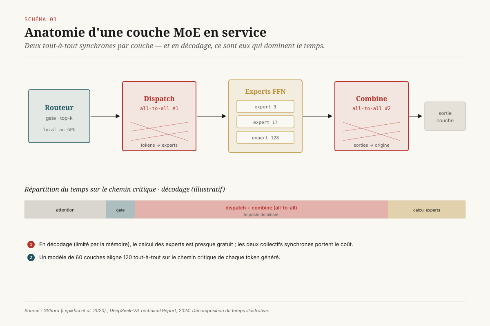
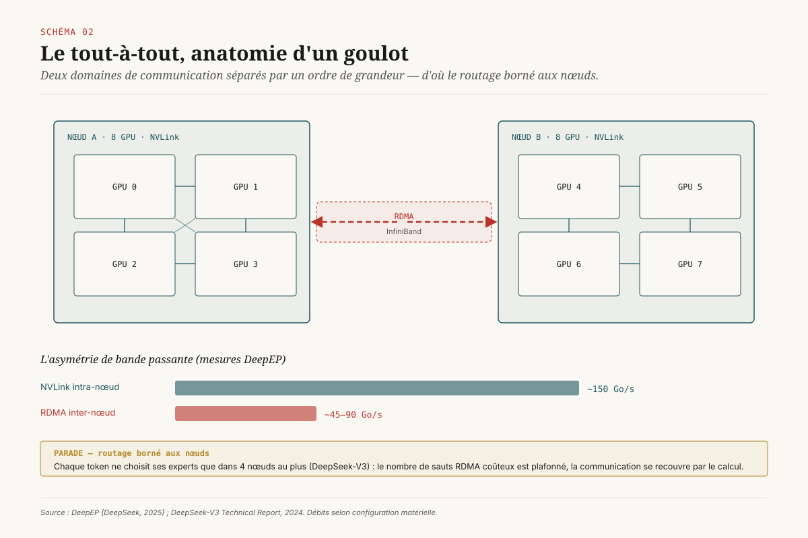
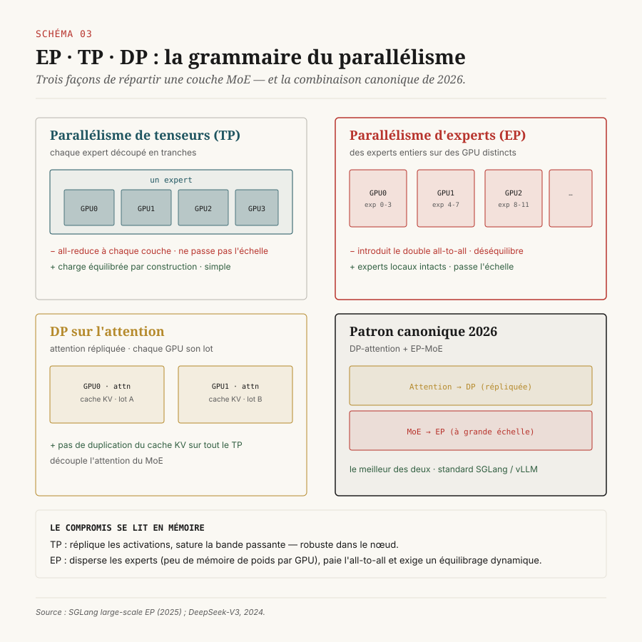
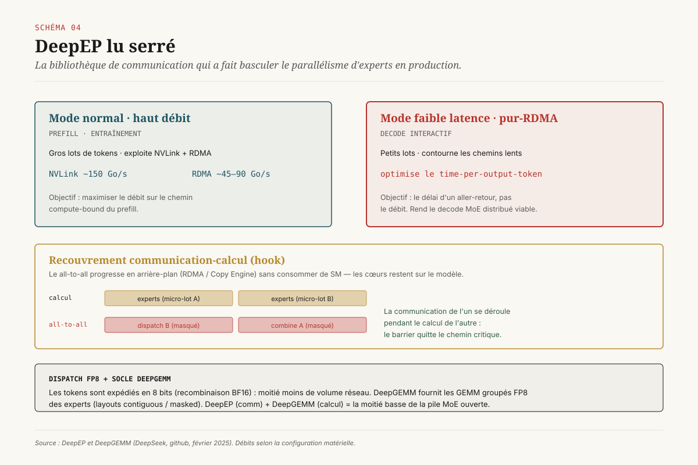
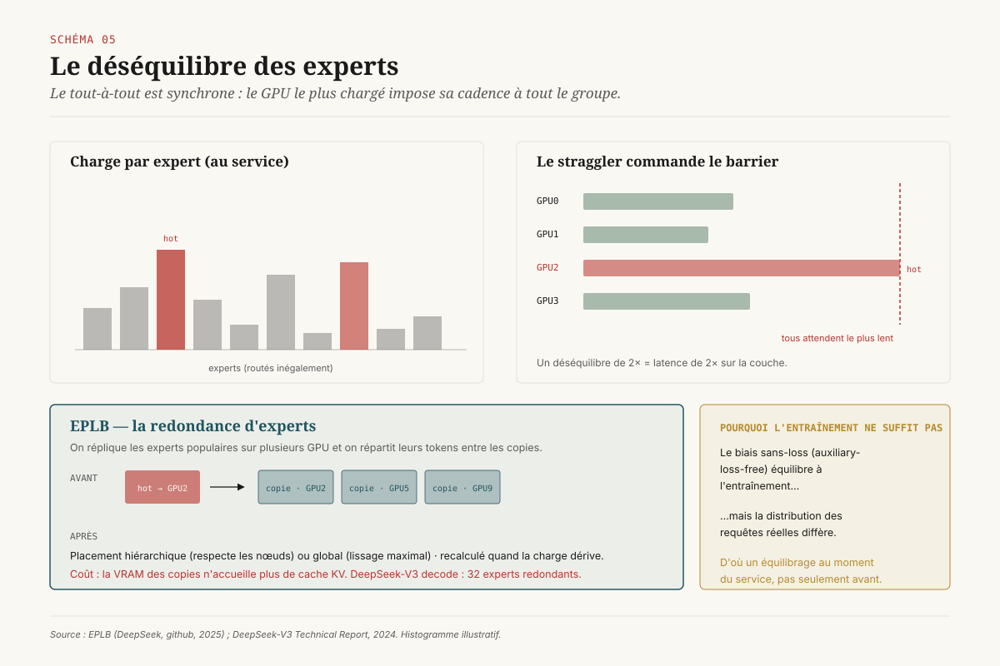
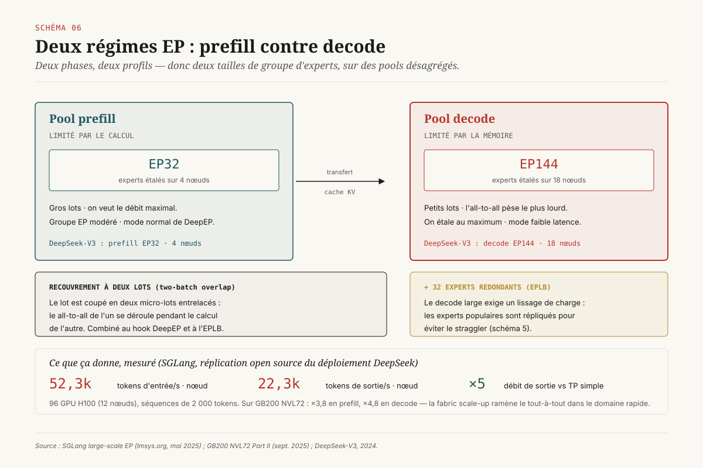

# Servir un mélange d'experts : quand l'inférence devient un problème de réseau

> **En production, le mélange d'experts ne se paie plus en calcul mais en communication : le poste dominant du décodage est le tout-à-tout qui achemine chaque token vers ses experts, et l'arbitrage porteur de 2026 est parallélisme d'experts contre parallélisme de tenseurs.** — 29 juillet 2026, Mathieu Guglielmino

Le mélange d'experts (*Mixture-of-Experts*, MoE) a gagné la bataille de l'architecture. DeepSeek-V3, Llama 4, Qwen3, Mixtral, les modèles frontières ouverts de 2025-2026 sont presque tous creux : ils portent des centaines de milliards de paramètres mais n'en activent qu'une fraction par token. La promesse est connue et démontrée — à budget de calcul fixé, un modèle routé bat un modèle dense[^12]. Ce qu'on a moins raconté, c'est ce que cette promesse coûte *une fois le modèle entraîné, mis en service, et sommé de répondre à des dizaines de milliers de requêtes par seconde*.

La réponse tient en un mot : le **tout-à-tout**. Là où un modèle dense fait circuler ses activations le long d'un chemin prévisible, un MoE doit, à chaque couche, expédier chaque token vers les quelques experts que son routeur a choisis — répartis sur des dizaines de GPU — puis rapatrier les résultats. Deux communications collectives *all-to-all* par couche, synchrones, sur le chemin critique du décodage. À grande échelle, ce n'est plus l'algèbre linéaire des experts qui domine le temps de réponse, c'est le déplacement des tokens sur le réseau.

Ce dossier prend la suite de [`melange-experts`](../melange-experts/), qui traitait le MoE comme architecture (routage, équilibrage, collapse) et [`desagregation-prefill-decode`](../desagregation-prefill-decode/), qui traitait la séparation des phases. Ici on descend d'un cran, dans la **couche de service** : comment on place les experts sur le matériel, comment on route les tokens entre eux, et pourquoi la bibliothèque de communication est devenue aussi structurante que le modèle lui-même.

## 1. Le retournement : de l'algèbre linéaire au réseau

Rappelons l'anatomie d'une couche MoE (développée dans [`melange-experts`](../melange-experts/)) : un routeur attribue à chaque token un score sur *N* experts, sélectionne les *k* meilleurs (*top-k*, typiquement 8 sur 256 pour DeepSeek-V3), envoie le token à ces experts — de simples réseaux *feed-forward* —, puis recombine leurs sorties pondérées. Le nombre de paramètres croît avec *N* ; le calcul, lui, ne croît qu'avec *k*. ==C'est ce découplage capacité/calcul qui fait tout l'intérêt du MoE — et c'est lui qui crée le problème de service.==

Car les experts ne tiennent pas sur un seul GPU. Un modèle comme DeepSeek-V3 (671 milliards de paramètres, 37 milliards actifs par token[^1]) répartit ses 256 experts par couche sur des dizaines d'accélérateurs. Dès lors, le token et l'expert qui doit le traiter ne sont presque jamais sur le même GPU. Il faut les faire se rencontrer — physiquement, sur le réseau.

Le poste de coût bascule à cause d'un fait bien documenté du décodage : la phase de génération token par token est **limitée par la mémoire, pas par le calcul** (*memory-bound*). Le GPU passe l'essentiel de son temps à charger des poids depuis la mémoire, ses unités de calcul largement sous-employées (voir [`kv-cache`](../kv-cache/) et [`economie-inference`](../economie-inference/)). Dans ce régime, le calcul des experts — quelques multiplications matricielles étroites — est presque gratuit. Ce qui coûte, c'est le double *all-to-all* : deux barrières de communication où *tous* les GPU s'échangent *tous* leurs tokens, et où le plus lent impose son rythme à tous les autres.

Le retournement est là. Sur un dense, optimiser l'inférence, c'est optimiser la lecture des poids et la gestion du cache. Sur un MoE à grande échelle, ==optimiser l'inférence, c'est d'abord optimiser un motif de communication collective== — sa topologie, son recouvrement avec le calcul, et l'équilibre de charge qui décide de la durée du barrier. Le modèle est le même ; le problème d'ingénierie a changé de nature.

## 2. Anatomie du tout-à-tout

Le motif a été fixé par GShard en 2020, la première mise à l'échelle sérieuse d'un MoE[^3]. Une couche MoE distribuée par *parallélisme d'experts* (voir §3) enchaîne quatre étapes :

1. **Routage (*gate*)** — local à chaque GPU : le routeur calcule les scores et décide, pour chacun de ses tokens, vers quels *k* experts l'envoyer.
2. **Dispatch (*all-to-all* #1)** — collectif : chaque GPU envoie ses tokens vers les GPU qui hébergent les experts cibles. Un GPU qui héberge un expert populaire reçoit beaucoup de tokens ; un autre, peu.
3. **Calcul des experts** — local : chaque expert applique son réseau *feed-forward* aux tokens qu'il a reçus.
4. **Combine (*all-to-all* #2)** — collectif : les sorties repartent vers les GPU d'origine des tokens, où elles sont recombinées.

Deux collectifs *all-to-all* par couche, donc, et un modèle de 60 couches en aligne cent-vingt sur le chemin critique. Le *all-to-all* est le pire motif de communication qui soit : contrairement à un *all-reduce* dont le volume est fixe et le motif régulier, ici *chaque* GPU parle à *tous* les autres, avec des volumes qui dépendent des décisions dynamiques du routeur — impossibles à connaître avant l'exécution.

Le coût dépend crucialement de **où** se trouvent les experts. Deux domaines de communication coexistent, séparés par un facteur d'un ordre de grandeur :

- **Intra-nœud (NVLink)** — les 8 GPU d'un même serveur communiquent par un maillage NVLink à très haute bande passante. La bibliothèque DeepEP y mesure des débits de dispatch de l'ordre de **150 Go/s** (jusqu'à 740 Go/s en version 2 sur les configurations récentes)[^2].
- **Inter-nœud (RDMA/InfiniBand)** — dès que le token doit franchir la frontière du serveur, on tombe sur le réseau RDMA, où DeepEP mesure plutôt **45 à 90 Go/s**[^2]. Un facteur 3 à 10 selon les générations.

Cette asymétrie commande une parade que DeepSeek a inscrite jusque dans l'entraînement : le **routage borné aux nœuds** (*node-limited routing*). Chaque token n'est autorisé à choisir des experts que dans un petit nombre de nœuds (4 pour DeepSeek-V3), ce qui plafonne le nombre de sauts inter-nœud coûteux et permet de recouvrir presque intégralement la communication RDMA par le calcul[^1]. ==Le motif de routage n'est pas seulement une affaire de qualité de modèle : c'est une variable d'architecture réseau décidée à l'entraînement.==

## 3. EP contre TP contre DP : la grammaire du parallélisme

Comment répartit-on une couche MoE sur *G* GPU ? Trois grammaires, qu'on combine en pratique.

**Parallélisme de tenseurs (TP).** On découpe *chaque* expert (et chaque matrice d'attention) en tranches réparties sur les GPU du groupe. Chaque GPU détient un morceau de tous les experts. L'avantage : pas de *all-to-all*, la charge est parfaitement équilibrée par construction. L'inconvénient, décisif : le TP exige un *all-reduce* à *chaque* couche, réplique les activations, et sa bande passante requise explose avec la taille du groupe — il ne passe pas l'échelle au-delà d'un nœud sans s'étrangler. Le TP est la solution simple et robuste des petits déploiements.

**Parallélisme d'experts (EP).** On place des experts *entiers* sur des GPU distincts. Un GPU héberge, disons, 4 experts complets ; son voisin en héberge 4 autres. C'est *ceci* qui introduit le double *all-to-all* — mais c'est aussi ce qui permet de faire tenir un modèle de 671 milliards de paramètres en gardant chaque expert local et intact, donc calculé efficacement. ==L'EP échange le coût du *all-reduce* du TP contre le coût du *all-to-all* — et à grande échelle, bien optimisé, le second gagne.== La taille du groupe EP (*EP size*) est le paramètre porteur du déploiement : EP32 signifie que les experts d'une couche sont étalés sur 32 GPU.

**Parallélisme de données sur l'attention (DP-attention).** Innovation clé des déploiements DeepSeek de 2025 : découpler la stratégie de l'attention de celle du MoE. L'attention (avec son cache KV, très gourmand en mémoire — voir [`attention-latente`](../attention-latente/)) est répliquée en parallélisme de données, chaque GPU traitant son propre lot de requêtes ; le MoE, lui, tourne en EP à grande échelle. Cette combinaison **DP-attention + EP-MoE** est devenue le patron canonique[^8] : elle évite de dupliquer le cache KV sur tout le groupe TP tout en laissant les experts s'étaler.

Le compromis se lit finalement en mémoire. Le TP réplique les activations et sature la bande passante ; l'EP disperse les experts (peu de mémoire de poids par GPU) mais paie la latence du *all-to-all* et exige un équilibrage de charge dynamique (§5). À grande échelle, tous les déploiements sérieux de 2026 convergent vers l'EP pour le MoE, réservant le TP à l'intérieur du nœud quand un expert est trop gros pour un seul GPU.

## 4. DeepEP lu serré

Si l'EP a basculé du prototype au standard de production en 2025, c'est en grande partie grâce à un objet précis : **DeepEP**, la bibliothèque de communication *expert-parallel* que DeepSeek a mise en open source en février 2025[^2]. Elle fournit les kernels GPU du double *all-to-all* — précisément le morceau que chaque équipe réécrivait mal dans son coin. La lire de près, c'est comprendre où se joue la performance.

DeepEP expose deux modes de kernels, taillés pour les deux phases de l'inférence :

- **Mode normal (haut débit).** Pour le *prefill* et l'entraînement, où de gros lots de tokens transitent. Il exploite à fond le NVLink intra-nœud et le RDMA inter-nœud, avec des débits mesurés de l'ordre de 150 Go/s (NVLink) et 45-90 Go/s (RDMA)[^2].
- **Mode faible latence (*low-latency*).** Pour le *decode*, où ce qui compte n'est pas le débit mais le délai d'un aller-retour. Ce mode utilise du **RDMA pur**, contourne les chemins à forte latence, et vise le *time-per-output-token* le plus court possible sur de petits lots. C'est le mode qui rend le décodage MoE distribué viable en interactif.

Trois raffinements font la différence. D'abord, le **recouvrement communication-calcul par *hook*** : DeepEP fournit un mécanisme (*hook*-based) qui laisse le *all-to-all* progresser *pendant* que le GPU calcule autre chose, sans consommer de *Streaming Multiprocessors* pour la communication — le réseau travaille en arrière-plan pendant que les cœurs de calcul restent sur le modèle[^2]. Ensuite, le **dispatch en FP8** : les tokens sont expédiés en précision 8 bits (avec recombinaison en BF16), divisant par deux le volume sur le réseau — la quantification (voir [`quantification-llm`](../quantification-llm/)) au service de la bande passante, pas seulement de la mémoire. Enfin, le **cache des handles** : en décodage, les métadonnées de routage sont réutilisées d'une itération à l'autre plutôt que recalculées.

Autour de DeepEP, DeepSeek a livré un socle cohérent : **DeepGEMM**[^10], des kernels de multiplication matricielle groupée (*grouped GEMM*) en FP8 spécialisés pour le calcul des experts — un expert traite un nombre variable de tokens, ce qui casse les GEMM classiques, d'où des layouts *contiguous* et *masked* dédiés. Ensemble, DeepEP (communication) et DeepGEMM (calcul) forment la moitié basse de la pile d'inférence MoE ouverte de 2026.

## 5. Le déséquilibre des experts : le straggler qui commande le barrier

Le talon d'Achille de l'EP est un phénomène simple et impitoyable. Le routeur, en production, ne distribue *pas* les tokens uniformément sur les experts : certains experts sont populaires (*hot*), d'autres presque jamais choisis. Or le double *all-to-all* est **synchrone** : la couche ne peut pas avancer tant que le GPU le plus chargé — celui qui héberge les experts populaires — n'a pas fini. ==Le GPU le plus lent (*straggler*) impose sa cadence à tout le groupe : un déséquilibre de charge de 2× se paie en latence de 2× sur toute la couche.==

L'équilibrage vu à l'entraînement (loss auxiliaire, *auxiliary-loss-free bias* de DeepSeek-V3, détaillés dans [`melange-experts`](../melange-experts/)) atténue le problème mais ne le supprime pas au service, où la distribution des requêtes réelles diffère de celle de l'entraînement. Il faut donc un équilibrage *au moment du service*.

C'est le rôle de l'**EPLB** (*Expert Parallelism Load Balancer*), l'autre brique open source de DeepSeek[^9]. Son idée maîtresse : la **redondance d'experts**. Plutôt que de placer chaque expert sur un seul GPU, on **réplique les experts populaires** sur plusieurs GPU et on répartit leurs tokens entre les copies. DeepSeek-V3 en décodage ajoute ainsi des experts redondants pour lisser la charge[^1]. L'EPLB calcule un **placement** — quel expert (et combien de copies) sur quel GPU — selon deux régimes : un équilibrage **hiérarchique** (qui respecte la structure des groupes de nœuds, pour minimiser le trafic inter-nœud) et un équilibrage **global** (qui ignore la hiérarchie pour un lissage maximal). Le placement peut être recalculé périodiquement à mesure que la charge dérive.

Le coût de la redondance est mémoire : répliquer des experts consomme de la VRAM qui n'accueille plus de cache KV ni de contexte. L'équilibrage de l'EP est donc un problème d'optimisation à part entière — combien de copies, où, à quelle fréquence recalculer — et non un réglage qu'on fixe une fois pour toutes. ==La charge des experts est une donnée d'exploitation vivante, pas une propriété du modèle.==

## 6. Deux régimes EP : prefill contre decode

La séparation *prefill*/*decode* (traitée dans [`desagregation-prefill-decode`](../desagregation-prefill-decode/)) prend, sous l'angle EP, une forme spécifique. Les deux phases n'ont pas le même profil, donc pas la même taille de groupe EP optimale :

- **Prefill** — traite le *prompt* entier d'un coup, gros lots de tokens, phase **limitée par le calcul**. On veut un débit maximal ; un groupe EP modéré suffit, et le mode normal de DeepEP domine. DeepSeek-V3 sert le prefill en **EP32, sur 4 nœuds**[^1].
- **Decode** — génère token par token, petits lots, phase **limitée par la mémoire**. Ici le *all-to-all* pèse le plus lourd relativement au calcul, et on étale les experts sur beaucoup plus de GPU pour minimiser la mémoire de poids par accélérateur et maximiser le parallélisme. DeepSeek-V3 sert le decode en **EP144, sur 18 nœuds**, avec 32 experts redondants[^1].

Comme les deux phases veulent des tailles EP différentes, il est naturel de les **désagréger** sur des pools distincts — chaque pool dimensionné pour sa phase — reliés par un transfert de cache KV. C'est exactement ce que SGLang a industrialisé dans sa réplication open source du déploiement DeepSeek : sur **96 GPU H100** (12 nœuds de 8), en désagrégation *prefill*/*decode* et EP à grande échelle, il atteint **52,3k tokens d'entrée/s et 22,3k tokens de sortie/s par nœud** (sur des séquences de 2 000 tokens), soit **jusqu'à 5× le débit de sortie** d'un simple parallélisme de tenseurs à ressources égales — approchant les chiffres officiels de DeepSeek[^8].

L'autre levier de cette performance est le **recouvrement à deux lots** (*two-batch overlap*) : on découpe le lot en deux micro-lots et on entrelace leur exécution, de sorte que le *all-to-all* de l'un se déroule pendant le calcul de l'autre. Combiné au *hook* de DeepEP et à l'EPLB, il transforme une communication qui bloquait le chemin critique en une communication masquée. Sur GB200 NVL72, la même équipe rapporte plus tard **3,8× en prefill et 4,8× en decode**[^11] — le gain vient largement de ce que la fabric NVLink du NVL72 (72 GPU dans un même domaine de cohérence) fait *rentrer le tout-à-tout dans le domaine intra-nœud rapide*, dissolvant en partie l'asymétrie du §2.

## 7. Le paysage outillage 2026

[SCHEMA-07]

Le marché de l'inférence MoE s'est structuré en 2025-2026 autour d'une pile ouverte étonnamment convergente. Le **socle** est le trio DeepSeek — DeepEP (communication), DeepGEMM (calcul FP8), EPLB (équilibrage) — que la plupart des serveurs intègrent plutôt que de le réimplémenter.

Au-dessus, deux serveurs open source mènent la course. **SGLang** a livré la première implémentation ouverte de la désagrégation P/D + EP à grande échelle reproduisant le déploiement DeepSeek[^8], et l'a depuis couplée à la prédiction multi-tokens (*MTP*, +60 % de débit de sortie). **vLLM** a suivi avec son propre support DP-attention + EP et l'intégration DeepEP. Côté propriétaire, **NVIDIA Dynamo** (avec TensorRT-LLM) pousse la désagrégation et l'EP jusqu'au **GB200 NVL72**, dont la fabric scale-up est précisément taillée pour absorber le *all-to-all*.

La ligne de fracture entre ces offres n'est plus « qui sait faire de l'EP » — tout le monde sait — mais **la maturité de l'équilibrage dynamique, la finesse du recouvrement communication-calcul, et l'exploitation des fabrics scale-up**. C'est là que se gagnent les derniers x2 de débit, et c'est un terrain d'ingénierie système, pas de modélisation.

## 8. Trajectoires

Quatre directions se dessinent pour 2026-2028.

**L'EP élastique.** Aujourd'hui la taille du groupe EP est fixée au déploiement. Demain, on ajustera dynamiquement le nombre de GPU d'un pool decode selon la charge — un *autoscaling* au niveau des experts, qui suppose de recalculer placement et redondance à chaud (extension naturelle de l'EPLB).

**Le tout-à-tout intra-domaine.** La montée des fabrics scale-up (NVL72 et ses successeurs) déplace la frontière : plus le domaine de cohérence NVLink est grand, plus le *all-to-all* reste dans le régime rapide. À terme, un modèle entier pourrait tenir son EP dans un seul domaine, dissolvant le goulot inter-nœud qui a façonné toute l'ingénierie décrite ici.

**La co-conception réseau × modèle.** Le *node-limited routing* de DeepSeek a montré la voie : le motif de routage se décide en fonction de la topologie réseau. On verra des modèles dont l'architecture MoE (nombre d'experts, granularité, contraintes de routage) est explicitement co-conçue avec le *hardware* de service — comme la parcimonie native l'a été pour le calcul (voir [`attention-parcimonieuse`](../attention-parcimonieuse/)).

**L'EP-as-a-service.** Enfin, comme le cache KV avant lui (voir [`desagregation-prefill-decode`](../desagregation-prefill-decode/)), l'infrastructure EP pourrait se mutualiser : des pools d'experts partagés entre modèles et locataires, posant les mêmes questions d'isolation et de sécurité que le prompt caching partagé (voir [`mcp-securite`](../mcp-securite/)).

Le fil rouge est constant. Le MoE n'a pas rendu l'inférence plus simple ; il a déplacé la difficulté de l'algèbre linéaire vers le réseau. ==Servir un modèle creux, en 2026, c'est d'abord savoir faire circuler des tokens — et le savoir-faire porteur n'est plus dans le modèle, il est dans la bibliothèque de communication.==

---

*Format co-écrit avec l'aide d'une IA. Les chiffres cités proviennent des sources listées ; les schémas sont des reconstructions illustratives des motifs décrits, non des mesures.*

## Sources

[^1]: DeepSeek-AI. *DeepSeek-V3 Technical Report*. arXiv:2412.19437, décembre 2024. Placement EP32 (prefill, 4 nœuds) / EP144 (decode, 18 nœuds), experts redondants, routage borné aux nœuds, DualPipe, entraînement FP8.

[^2]: DeepSeek-AI. *DeepEP: an efficient expert-parallel communication library*. github.com/deepseek-ai/DeepEP, février 2025. Kernels normal / low-latency, débits NVLink et RDMA, dispatch FP8, recouvrement par *hook*.

[^3]: Lepikhin, Dmitry et al. *GShard: Scaling Giant Models with Conditional Computation and Automatic Sharding*. arXiv:2006.16668, 2020. Origine du parallélisme d'experts et du double *all-to-all* dispatch/combine.

[^4]: Fedus, William, Barret Zoph et Noam Shazeer. *Switch Transformers: Scaling to Trillion Parameter Models with Simple and Efficient Sparsity*. JMLR 23, 2022. Facteur de capacité, *token dropping*, loss d'équilibrage de charge.

[^5]: DeepSeek-AI. *DeepSeekMoE: Towards Ultimate Expert Specialization in Mixture-of-Experts Language Models*. arXiv:2401.06066, 2024. Experts fins + expert partagé isolé.

[^6]: Hwang, Changho et al. *Tutel: Adaptive Mixture-of-Experts at Scale*. MLSys 2023 / arXiv:2206.03382. Parallélisme adaptatif, optimisation du *all-to-all*, bascule dynamique de stratégie.

[^7]: Li, Jiamin et al. *Accelerating Distributed MoE Training and Inference with Lina*. USENIX ATC 2023. Priorisation du *all-to-all* et partition tensorielle pour dompter le goulot de communication.

[^8]: SGLang Team. *Deploying DeepSeek with PD Disaggregation and Large-Scale Expert Parallelism on 96 H100 GPUs*. lmsys.org/blog, 5 mai 2025. 52,3k tokens d'entrée/s et 22,3k tokens de sortie/s par nœud, jusqu'à 5× vs TP, DP-attention + EP, EPLB, *two-batch overlap*.

[^9]: DeepSeek-AI. *EPLB: Expert Parallelism Load Balancer*. github.com/deepseek-ai/EPLB, février 2025. Experts redondants, équilibrage hiérarchique et global.

[^10]: DeepSeek-AI. *DeepGEMM: clean and efficient FP8 GEMM kernels*. github.com/deepseek-ai/DeepGEMM, février 2025. GEMM groupé FP8 pour le calcul des experts (*contiguous* / *masked layout*).

[^11]: SGLang Team. *Deploying DeepSeek on GB200 NVL72 with PD and Large Scale EP (Part II): 3.8x Prefill, 4.8x Decode Throughput*. lmsys.org/blog, 25 septembre 2025. Exploitation de la fabric scale-up NVL72.

[^12]: Clark, Aidan et al. *Unified Scaling Laws for Routed Language Models*. arXiv:2202.01169, 2022. Un modèle routé bat un dense à budget de calcul fixé.
