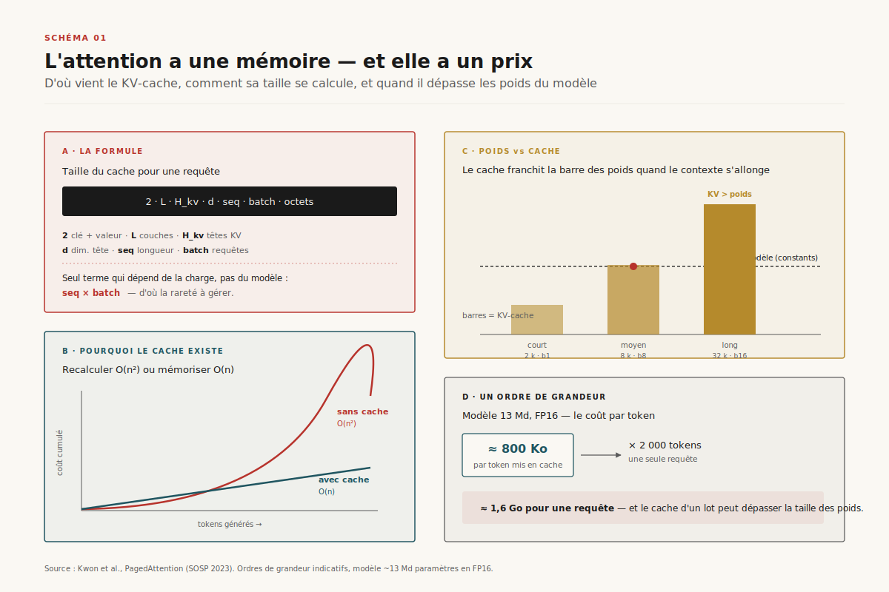
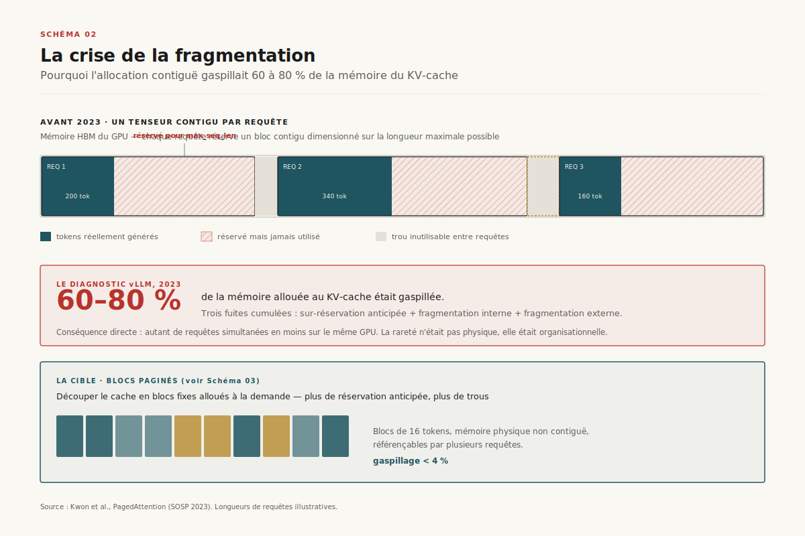
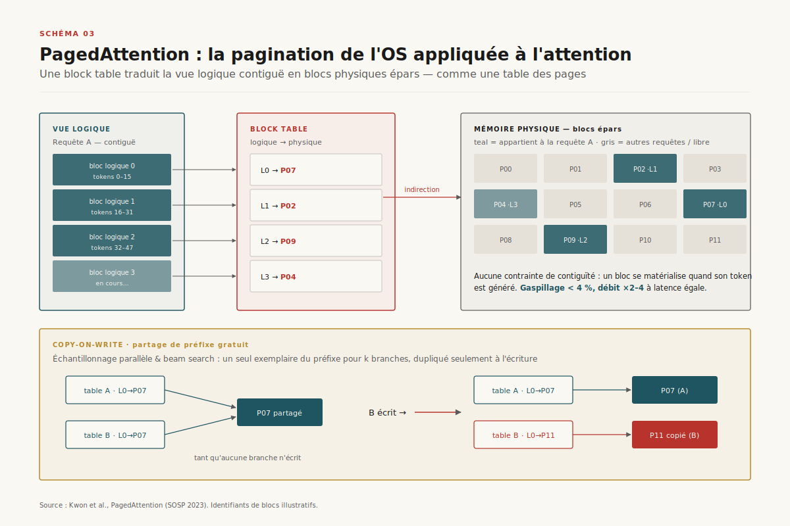
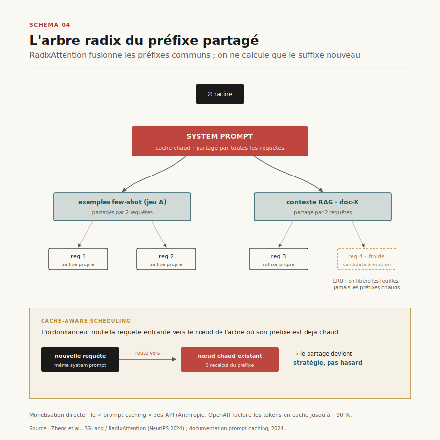
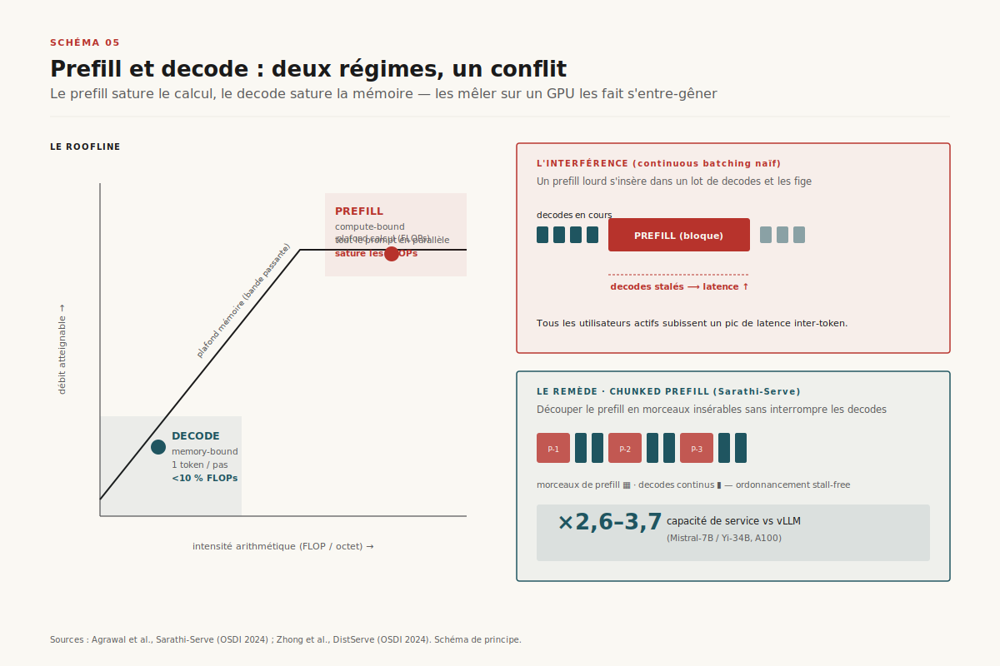
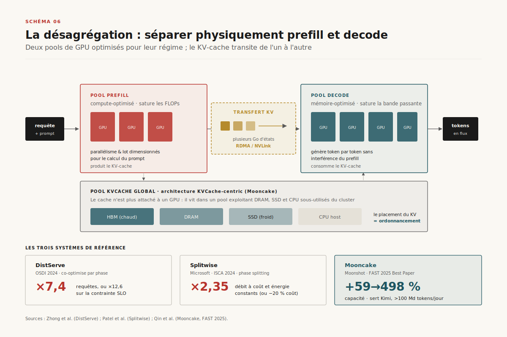

# L'économie du KV-cache

> **Le KV-cache est devenu la ressource rare qui gouverne l'inférence LLM : sa gestion — pagination, partage de préfixes, désagrégation prefill/decode, compression — pèse désormais plus que les FLOPs bruts. Les systèmes de service modernes ne sont pas des optimiseurs de calcul, ce sont des gestionnaires de mémoire.** — 24 juin 2026, Mathieu Guglielmino

Pendant dix ans, l'intuition dominante de l'inférence des réseaux de neurones tenait en un mot : *calcul*. Plus de FLOPs, plus de débit. Servir un grand modèle de langage, c'était d'abord acheter des multiplications matricielles. Cette intuition est aujourd'hui fausse, ou du moins secondaire. Sur une charge d'inférence réelle — sessions longues, agents, RAG, conversations multi-tours — le goulot d'étranglement n'est plus le FLOP, c'est l'octet : la mémoire occupée par les états intermédiaires de l'attention, le *KV-cache*.

==Comprendre l'inférence LLM moderne, c'est comprendre la gestion d'un cache mémoire, pas l'ordonnancement d'un calcul.== Les trois systèmes de service qui ont défini l'état de l'art entre 2023 et 2026 — vLLM, SGLang, Mooncake — ne se distinguent pas par leurs noyaux de calcul (largement partagés, hérités de FlashAttention). Ils se distinguent par la manière dont ils *allouent, partagent, transfèrent et compriment* le KV-cache. Ce rapport raconte cette bascule, du diagnostic de la rareté jusqu'aux systèmes désagrégés qui traitent aujourd'hui plus de cent milliards de tokens par jour.

## 1. L'attention a une mémoire — et elle a un prix

Le mécanisme d'attention d'un *transformer* calcule, pour chaque token, une requête (*query*), une clé (*key*) et une valeur (*value*). Lors de la génération auto-régressive, chaque nouveau token doit attendre à *tous* les tokens précédents. Sans cache, produire le token *n* exigerait de recalculer les clés et valeurs des *n−1* tokens antérieurs — un coût quadratique, O(n²), prohibitif. La parade est évidente et universelle : on mémorise les clés et valeurs déjà calculées. C'est le KV-cache. Il transforme une génération O(n²) en O(n) de calcul, au prix d'une occupation mémoire qui croît linéairement avec la longueur de la séquence.



Cette mémoire n'est pas anodine. Sa taille suit une formule simple mais implacable :

```
taille_KV = 2 × n_layers × n_kv_heads × d_head × seq_len × batch × bytes_par_élément
```

Le facteur 2 vient du couple clé+valeur. Pour un modèle de 13 milliards de paramètres servi en FP16, ==chaque token stocké coûte environ 800 Ko de KV-cache ; une seule requête de 2 000 tokens en consomme près de 1,6 Go, et le cache d'un lot de requêtes peut dépasser la taille des poids du modèle eux-mêmes==[^1]. Là est le renversement : à contexte court, ce sont les poids qui dominent la mémoire ; à contexte long et fort *batch*, c'est le cache. Le KV-cache est l'unique structure de données de l'inférence dont la taille dépend de la *charge*, pas du modèle — et c'est précisément ce qui en fait une ressource à gérer, pas une constante à provisionner.

## 2. La crise de la fragmentation

Avant 2023, les systèmes de service traitaient le KV-cache comme un tenseur contigu. À l'arrivée d'une requête, on réservait un bloc mémoire contigu dimensionné sur la longueur *maximale* possible de la séquence — car on ne sait pas a priori combien de tokens le modèle va générer. Cette stratégie, héritée des frameworks d'entraînement, a une conséquence dévastatrice en service.



Le diagnostic posé par l'équipe de vLLM en 2023 est resté célèbre : ==dans les systèmes existants, 60 à 80 % de la mémoire allouée au KV-cache était gaspillée par la fragmentation et la sur-réservation==[^1]. Trois sources de gaspillage se cumulaient. La **fragmentation interne** : on réserve pour 2 048 tokens, la requête en génère 200, le reste est immobilisé mais inutilisé. La **fragmentation externe** : entre deux blocs contigus de tailles différentes, des trous de mémoire trop petits pour accueillir une nouvelle requête. Et la **réservation anticipée** : la mémoire d'une séquence future est bloquée dès le départ, indisponible pour les requêtes présentes. Sur un GPU dont chaque gigaoctet de HBM est compté, gaspiller les quatre cinquièmes du cache, c'est diviser d'autant le nombre de requêtes servies simultanément. La rareté n'était pas physique, elle était *organisationnelle*.

## 3. PagedAttention : la pagination OS appliquée à l'attention

La solution est venue d'une analogie avec un problème résolu depuis cinquante ans par les systèmes d'exploitation : la mémoire virtuelle paginée. PagedAttention, le cœur de vLLM[^1], découpe le KV-cache en **blocs de taille fixe** (typiquement 16 tokens), stockés dans une mémoire physique *non contiguë*. Une **block table** par requête traduit les positions logiques (la vue continue « tokens 0 à n ») en adresses physiques éparpillées — exactement comme la table des pages d'un OS traduit les adresses virtuelles en cadres physiques.



Le gain est double et structurel. D'abord la mémoire : ==le gaspillage tombe sous 4 %, et le débit augmente d'un facteur 2 à 4 à latence égale, par rapport à FasterTransformer et Orca==[^1][^7]. On ne réserve plus que les blocs effectivement remplis ; un bloc se matérialise quand le token correspondant est généré. Ensuite le **partage**. Parce qu'un bloc physique peut être référencé par plusieurs block tables, deux requêtes qui partagent un préfixe — un même *system prompt*, un même contexte few-shot — peuvent pointer vers les *mêmes* blocs physiques. Quand l'une des deux diverge et écrit, le bloc partagé est dupliqué à la volée : c'est le **copy-on-write**, là encore emprunté aux OS. L'échantillonnage parallèle (plusieurs complétions d'un même prompt) et le *beam search* deviennent quasi gratuits en mémoire : un seul exemplaire du préfixe pour *k* branches.

> **À retenir.** PagedAttention ne change pas un seul FLOP du calcul d'attention. Il change uniquement *où* le cache vit en mémoire. Le gain de débit ×2-4 est entièrement un gain d'*allocation* — la preuve la plus nette que la mémoire, et non le calcul, était le facteur limitant.

## 4. RadixAttention et l'économie du préfixe partagé

PagedAttention permet le partage de préfixe ; SGLang l'a érigé en discipline de premier ordre avec **RadixAttention**[^2]. L'idée : maintenir l'ensemble des KV-caches actifs non pas comme une collection de séquences indépendantes, mais comme un **arbre radix** — une structure où les préfixes communs sont fusionnés en branches partagées. Chaque requête entrante cherche dans l'arbre le plus long préfixe déjà en cache ; elle ne calcule que le *suffixe* nouveau.



Deux mécanismes rendent la structure exploitable en production. L'**éviction LRU** au niveau des feuilles : quand la mémoire sature, on libère les nœuds froids (les suffixes les moins récemment utilisés) sans toucher aux préfixes chauds partagés par de nombreuses requêtes. Et le **cache-aware scheduling** : l'ordonnanceur route préférentiellement les requêtes vers le nœud de l'arbre où leur préfixe est déjà chaud, transformant le partage de cache d'opportunité passive en stratégie d'ordonnancement active. Sur les charges à fort recouvrement de préfixe — agents avec un long prompt système, RAG avec un même contexte documentaire, conversations multi-tours — ==RadixAttention multiplie le débit en réduisant à la fois le calcul redondant et la pression mémoire==[^2].

Ce qui était une astuce système est devenu un produit. Le *prompt caching* offert par les API d'inférence — Anthropic depuis 2024, puis OpenAI et Google — est la monétisation directe de cette mécanique : le fournisseur conserve le KV-cache du préfixe entre deux appels et facture les tokens réutilisés à une fraction du prix, jusqu'à ==−90 % sur les tokens lus depuis le cache==[^12]. Le préfixe partagé, hier détail d'implémentation, est aujourd'hui une ligne de facturation.

## 5. Prefill et decode : deux régimes, un conflit

Jusqu'ici, le cache était traité comme un objet statique à bien ranger. Mais sa *production* et sa *consommation* obéissent à deux régimes de calcul radicalement différents — et leur cohabitation sur un même GPU est une source d'inefficacité longtemps masquée.



La phase de **prefill** traite le prompt d'entrée en une passe : tous les tokens en parallèle, ce qui sature les unités de calcul du GPU. Elle est *compute-bound*. La phase de **decode** génère les tokens un par un : à chaque pas, une seule ligne de calcul, mais une lecture complète du KV-cache accumulé. Elle est *memory-bound* — limitée par la bande passante mémoire, pas par les FLOPs. ==Un GPU en decode pur utilise typiquement moins de 10 % de sa puissance de calcul, tout en saturant sa bande passante mémoire== : l'inverse exact du prefill[^3][^4].

Le *continuous batching* introduit par Orca[^7] regroupe des requêtes à l'échelle de l'itération pour amortir le coût. Mais lorsqu'une nouvelle requête arrive, son prefill (lourd, compute-bound) doit s'insérer dans un lot de decodes (légers, memory-bound) : le prefill monopolise le GPU et *stalle* les générations en cours, dégradant brutalement la latence inter-token de tous les utilisateurs actifs. C'est l'**interférence prefill/decode**. Sarathi-Serve[^6] propose le premier remède sans changer de matériel : le **chunked prefill**, qui découpe un prefill long en morceaux insérables dans les lots de decode sans les interrompre — un ordonnancement *stall-free*. ==Sur un A100, le chunked prefill de Sarathi-Serve multiplie la capacité de service par 2,6 à 3,7 face à vLLM==[^6], simplement en cessant de laisser le prefill écraser le decode.

> **Renvoi — `decode-speculative`.** Le point de bascule du *continuous batching* (autour de batch ≈ 24) et son interaction avec le décodage spéculatif sont détaillés dans le dossier [decode-speculative](../decode-speculative/). Le chunked prefill et le speculative decoding attaquent le même problème — l'utilisation du GPU en phase decode — par deux angles complémentaires.

## 6. La désagrégation : séparer physiquement les deux phases

Si prefill et decode ont des profils opposés, pourquoi les exécuter sur le même matériel ? C'est la question qui a fondé la vague de **désagrégation prefill/decode** de 2024-2025, sans doute le changement architectural le plus profond de l'inférence depuis PagedAttention.



Le principe : deux pools de GPU distincts. Un pool **prefill**, dimensionné et parallélisé pour le calcul ; un pool **decode**, dimensionné pour la bande passante mémoire. Une requête fait son prefill sur le premier pool, *son KV-cache est transféré* sur le second, qui prend en charge la génération. Chaque pool est optimisé pour son régime, et l'interférence disparaît par construction. Les chiffres sont spectaculaires :

- **DistServe**[^3] (OSDI 2024) co-optimise allocation et parallélisme par phase : ==×7,4 requêtes servies, ou ×12,6 sur la contrainte de latence (SLO), tout en respectant les cibles pour plus de 90 % des requêtes==.
- **Splitwise**[^4] (Microsoft, ISCA 2024) sépare les phases sur des machines distinctes : ×1,4 débit à −20 % de coût, ou ×2,35 de débit à coût et enveloppe énergétique constants.
- **Mooncake**[^5] (Moonshot AI, *Best Paper* FAST 2025) pousse la logique jusqu'au bout avec une architecture **KVCache-centric** : le KV-cache n'est plus attaché à un GPU mais vit dans un **pool désagrégé** exploitant la DRAM, les SSD et le CPU sous-utilisés du cluster. ==Mooncake augmente la capacité effective de 59 à 498 % selon la charge, et sert aujourd'hui Kimi sur des milliers de nœuds, traitant plus de 100 milliards de tokens par jour==[^5].

Le coût de la désagrégation est explicite et il a un nom : le **transfert du KV-cache**. Déplacer plusieurs gigaoctets d'états d'attention du pool prefill au pool decode sur le réseau introduit une latence et une consommation de bande passante qui peuvent annuler le gain si le lien est lent. C'est pourquoi ces systèmes investissent massivement dans le transfert rapide (RDMA, NVLink) et la *localité* du cache — Mooncake fait du placement du KV-cache un problème d'ordonnancement de premier ordre. La désagrégation ne supprime pas la rareté du cache : elle la transforme en problème de réseau.

## 7. Comprimer le cache lui-même

Paginer, partager, désagréger : trois manières de mieux *gérer* un cache dont on tient la taille pour donnée. Reste un quatrième levier, attaqué en parallèle — *réduire la taille du cache à la source*.

[SCHEMA-07]

Quatre familles de techniques, ordonnées par ce qu'elles sacrifient :

- **Moins de têtes KV — GQA et MQA.** La Multi-Query Attention[^9] (Shazeer, 2019) fait partager une *seule* tête clé/valeur à toutes les têtes de requête, divisant le cache par le nombre de têtes — au prix d'une perte de qualité. La Grouped-Query Attention[^8] (Ainslie, 2023) interpole : *g* groupes de têtes KV, un compromis qualité/mémoire devenu standard (Llama 2 70B, la plupart des modèles ouverts récents). C'est une compression *architecturale*, décidée à l'entraînement.
- **Latent compressé — MLA.** DeepSeek-V2[^11] introduit la Multi-head Latent Attention : au lieu de cacher clés et valeurs pleines, on cache un *vecteur latent* de basse dimension dont on reconstruit K et V à la volée. ==MLA réduit l'empreinte KV d'un ordre de grandeur tout en préservant la qualité de l'attention multi-têtes==, ce qui en a fait un pilier de l'efficacité des modèles DeepSeek.
- **Quantization — KIVI.** Plutôt que de réduire le nombre d'éléments, on réduit leurs *bits*. KIVI[^10] (ICML 2024) quantifie le KV-cache en 2 bits, sans fine-tuning, avec une stratégie asymétrique (clés par canal, valeurs par token). Le cache rétrécit d'un facteur ~8 contre une dégradation marginale.
- **Éviction — H2O, StreamingLLM.** Tous les tokens passés ne contribuent pas également ; on peut en *oublier* certains. H2O[^13] identifie les « *heavy hitters* », tokens à fort poids d'attention, et évince le reste. C'est l'oubli sélectif au niveau du cache — traité en profondeur, comme stratégie de mémoire agentique, dans le dossier [compaction-agentique](../compaction-agentique/).

Aucun de ces leviers n'est gratuit : chacun déplace le curseur sur un axe qualité/mémoire. La discipline d'ingénierie de 2026 consiste à composer pagination + partage + désagrégation + compression selon le profil de charge, et non à chercher une balle d'argent.

## 8. Trajectoires 2026-2028

La direction est claire : le KV-cache devient une **ressource de premier ordre**, gérée, mesurée, facturée comme telle.

- **Hiérarchie mémoire du cache.** À l'image de la hiérarchie cache CPU, le KV-cache s'étage déjà sur HBM (chaud), DRAM, SSD (Mooncake) et, demain, stockage distant. Le placement devient un problème d'ordonnancement à part entière.
- **KV-cache-as-a-service.** Le prompt caching d'aujourd'hui préfigure des pools de cache *partagés entre requêtes et entre tenants*, monétisés à l'octet-seconde. La question de l'isolation (un tenant ne doit pas lire le cache d'un autre) devient une surface de sécurité.
- **Désagrégation par défaut.** Ce qui était une optimisation de pointe en 2024 devient le mode de déploiement standard des grands services en 2026-2027 ; vLLM et SGLang intègrent nativement la séparation prefill/decode.
- **Observabilité du cache.** Mesurer le *hit-rate* du préfixe, le ratio de gaspillage, le coût du transfert devient un besoin d'exploitation. Le namespace OpenTelemetry `gen_ai.*` — détaillé dans [otel-genai-semconv](../otel-genai-semconv/) — n'a pas encore d'attributs dédiés au KV-cache, mais c'est une lacune que la pression opérationnelle comblera.

Le fil rouge de toute cette histoire tient en une phrase : ==l'inférence LLM est passée d'un problème de calcul à un problème de mémoire, et le KV-cache en est l'unité de compte.== Qui sait gérer le cache sait servir le modèle.

---

## Sources

[^1]: Woosuk Kwon et al., « Efficient Memory Management for Large Language Model Serving with PagedAttention », SOSP 2023. https://arxiv.org/abs/2309.06180 — source fondatrice : diagnostic 60-80 % de gaspillage, mécanique de pagination, gain ×2-4.
[^2]: Lianmin Zheng et al., « SGLang : Efficient Execution of Structured Language Model Programs » (RadixAttention), NeurIPS 2024. https://arxiv.org/abs/2312.07104 — arbre radix, cache-aware scheduling, éviction LRU.
[^3]: Yinmin Zhong et al., « DistServe : Disaggregating Prefill and Decoding for Goodput-optimized LLM Serving », OSDI 2024. https://arxiv.org/abs/2401.09670 — ×7,4 requêtes / ×12,6 SLO.
[^4]: Pratyush Patel et al. (Microsoft), « Splitwise : Efficient Generative LLM Inference Using Phase Splitting », ISCA 2024. https://arxiv.org/abs/2311.18677 — ×1,4 à −20 % coût, ou ×2,35 à coût constant.
[^5]: Ruoyu Qin et al. (Moonshot AI), « Mooncake : A KVCache-centric Disaggregated Architecture for LLM Serving », FAST 2025 (Best Paper). https://arxiv.org/abs/2407.00079 — pool KV désagrégé, +59-498 % capacité, >100 Md tokens/jour pour Kimi.
[^6]: Amey Agrawal et al., « Taming Throughput-Latency Tradeoff in LLM Inference with Sarathi-Serve », OSDI 2024. https://arxiv.org/abs/2403.02310 — chunked prefill, stall-free batching, ×2,6-3,7 vs vLLM.
[^7]: Gyeong-In Yu et al., « Orca : A Distributed Serving System for Transformer-Based Generative Models », OSDI 2022. https://www.usenix.org/conference/osdi22/presentation/yu — continuous batching (iteration-level scheduling), le baseline de référence.
[^8]: Joshua Ainslie et al., « GQA : Training Generalized Multi-Query Transformer Models from Multi-Head Checkpoints », EMNLP 2023. https://arxiv.org/abs/2305.13245 — grouped-query attention, compromis qualité/mémoire standard.
[^9]: Noam Shazeer, « Fast Transformer Decoding : One Write-Head is All You Need » (Multi-Query Attention), 2019. https://arxiv.org/abs/1911.02150 — l'ancêtre : une seule tête KV partagée.
[^10]: Zirui Liu et al., « KIVI : A Tuning-Free Asymmetric 2bit Quantization for KV Cache », ICML 2024. https://arxiv.org/abs/2402.02750 — quantization 2-bit sans fine-tuning.
[^11]: DeepSeek-AI, « DeepSeek-V2 : A Strong, Economical, and Efficient Mixture-of-Experts Language Model » (Multi-head Latent Attention), 2024. https://arxiv.org/abs/2405.04434 — MLA, cache d'un vecteur latent compressé.
[^12]: Anthropic, « Prompt caching with Claude », documentation produit, 2024. https://docs.anthropic.com/en/docs/build-with-claude/prompt-caching — monétisation du partage de préfixe, −90 % sur tokens en cache.
[^13]: Zhenyu Zhang et al., « H2O : Heavy-Hitter Oracle for Efficient Generative Inference of Large Language Models », NeurIPS 2023. https://arxiv.org/abs/2306.14048 — éviction des tokens à faible poids d'attention.
