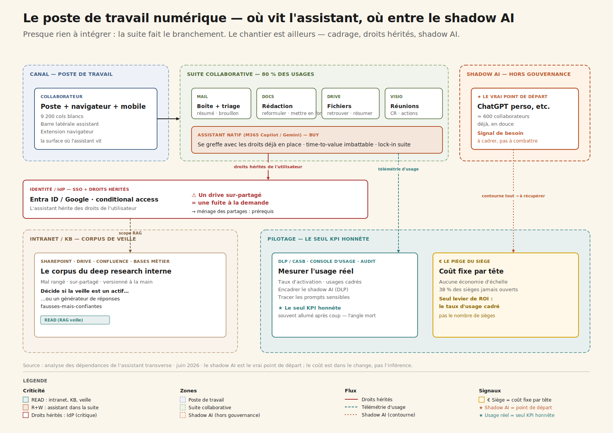
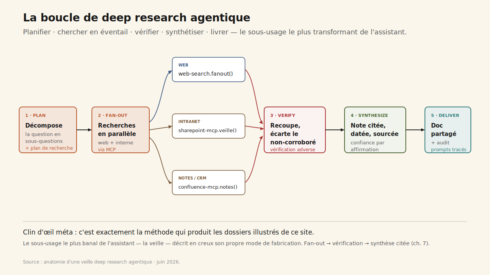
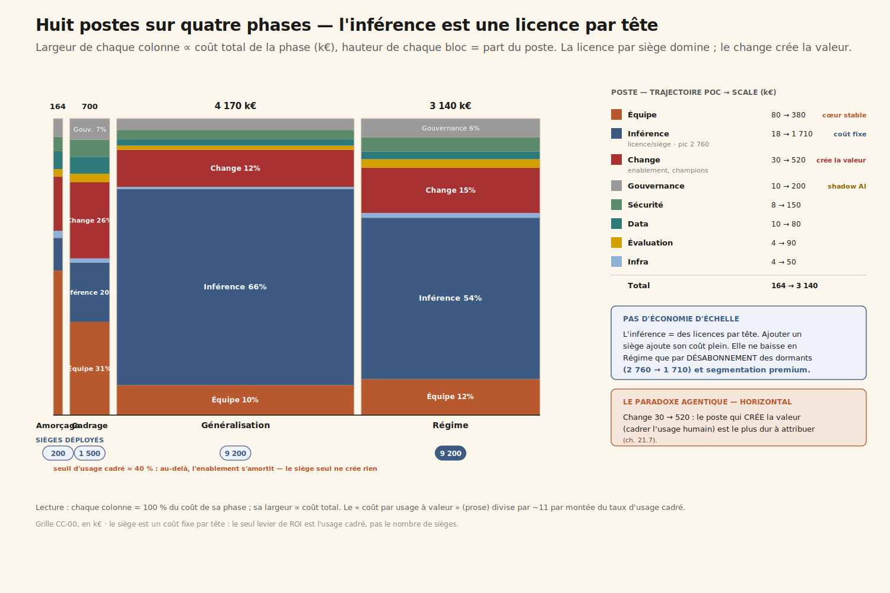
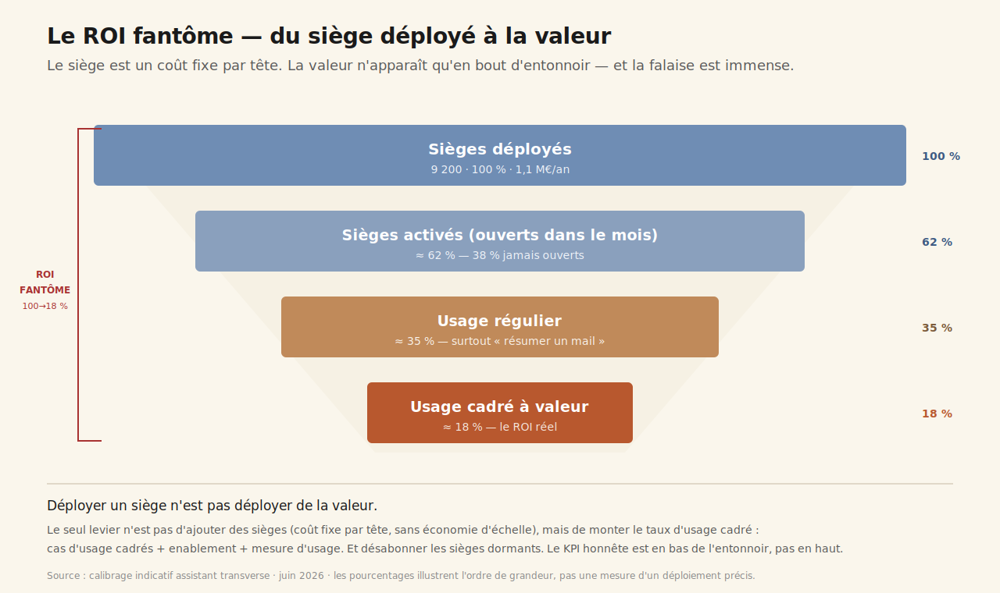

# CC-00 — Assistant transverse (routines · analyses · veille)

**Transverse · Agentic · charnière (~5 400 mots)**

> L'usage le plus universel de l'IA — l'assistant que tout le monde ouvre — est le plus dur à chiffrer en Hard et le plus risqué en gouvernance : le ROI ne vient pas du siège déployé, mais des cas d'usage cadrés.

---

## 1. « On a déployé 9 200 sièges. Combien de valeur on a déployée ? »

Salle du COMEX, revue budgétaire de mi-année. Sur le slide : *« 9 200 sièges d'assistant IA déployés, 2,8 M€/an. »* Le DG est satisfait — l'entreprise est « passée à l'IA », la case est cochée, le communiqué est parti.

Le DAF, lui, fait défiler une autre courbe : celle de l'usage réel, lue dans la console d'administration. **38 % des sièges n'ont pas été ouverts une seule fois ce mois-ci.** Et sur ceux qui le sont, l'usage médian plafonne à *« résumer un mail, écrire un message »*. Pendant ce temps, la DPO signale que 600 collaborateurs collent du contenu interne dans des outils grand public non gérés — du **shadow AI** que personne n'a cadré.

Alors le DAF pose la question qui gèle la salle : *« on a déployé 9 200 sièges. Combien de valeur on a déployée ? »*

C'est l'ouverture de cette annexe, et ce n'est pas un hasard. **L'IA entre dans l'entreprise par la porte horizontale** — l'assistant que tout le monde ouvre pour rédiger, résumer, analyser, faire sa veille. C'est l'usage le plus universel, celui que le lecteur connaît déjà. Et c'est, paradoxalement, **le plus dur à mesurer en ROI Hard** et **le plus risqué en gouvernance**. Déployer 10 000 sièges sans cas d'usage cadrés, c'est une facture certaine pour un ROI fantôme.

La leçon centrale du cas tient en une phrase : **le ROI ne vient pas du siège déployé, mais des cas d'usage cadrés.** Et comme toujours, tout commence par regarder ce qui est déjà là.

## 2. Le poste de travail numérique — et le shadow AI comme vrai point de départ

Il n'y a presque rien à *intégrer* techniquement. C'est le premier renversement du cas : contrairement au copilot bancaire (CC-01) ou à l'agent vocal (CC-02), où le sclérosant est un legacy à wrapper, ici la suite native fait le branchement. Le chantier est ailleurs.

Cinq couches, qu'on connaît déjà parce qu'on travaille dedans tous les jours :

1. **Le poste de travail** — Windows ou Mac, navigateur, mobile. C'est la surface où l'assistant vit vraiment : barre latérale dans la suite, extension navigateur, app mobile. C'est aussi la surface par laquelle entre le shadow AI, l'onglet ChatGPT perso ouvert à côté de l'intranet.

2. **La suite collaborative** — Microsoft 365 ou Google Workspace : mail, docs, drive, agenda, visio. Le terrain de jeu de 80 % des usages. La suite native (Copilot M365, Gemini Workspace) s'y greffe avec **les droits déjà en place** — argument time-to-value massif, mais lock-in suite.

3. **L'annuaire / IdP** — Entra ID ou Google, SSO, conditional access. L'IdP décide qui voit quoi, et **l'assistant hérite des droits de l'utilisateur**. S'ils sont trop larges — l'over-permissioning historique des drives — l'assistant rend visible en deux secondes ce qui dormait depuis dix ans. Le socle d'accès devient soudain critique.

4. **L'intranet et les bases de connaissance** — SharePoint, Drive, Confluence, bases métier RH/juridique/commerce. Le corpus de la veille et de l'analyse internes. Mal rangé, sur-partagé, versionné à la main : c'est lui qui décide si le *deep research interne* est un actif ou un générateur de réponses fausses-mais-confiantes.

5. **Le pilotage** — DLP/CASB, console d'usage des sièges, journal d'audit. Le poste depuis lequel on mesure l'usage réel (le seul KPI honnête), on encadre le shadow AI, on trace les prompts sensibles. **Souvent allumé après coup — l'angle mort du déploiement « par siège ».**

Ce que cette carte dit immédiatement :

- **Le vrai chantier n'est pas le MCP, c'est le cadrage des usages, l'enablement et la gouvernance.** Le coût est dans le change, pas dans l'inférence.
- **L'assistant hérite des droits de l'utilisateur.** Un drive sur-partagé devient une fuite à la demande. Le socle d'accès est un prérequis, pas une option — exactement la condition que CC-03 généralisera au socle data.
- **Le shadow AI est le vrai point de départ.** 600 collaborateurs ont déjà voté avec leurs pieds. Le cadrer bat le combattre.
- **Le siège est un coût fixe par tête.** Aucune économie d'échelle sur la licence. Le seul levier de ROI est le taux d'usage cadré — pas le nombre de sièges.

## 3. Trois sous-usages, trois fils du livre

Ce que l'assistant fait, vraiment, se range en trois familles — et chacune est un fil que le livre tire ailleurs.

### 3.1 Routines — le quotidien

Rédaction et reformulation au ton de l'organisation, résumé d'une réunion ou d'un fil de mails avec actions à reprendre, triage et priorisation de l'inbox, traduction, mise en forme. C'est la couche d'assistance invisible du poste de travail, et c'est là que se concentrent 80 % des usages — et l'essentiel du gain de charge cognitive. Fil du livre : les [surfaces agentiques (ch. 13)](../../chapitres/ch13-surfaces-agentiques.md) et [l'IA au travail (ch. 26)](../../chapitres/ch26-ia-et-travail.md).

### 3.2 Analyses — la première passe

Lire un export, dégager des tendances, signaler des anomalies, générer un graphe et le commenter en langage clair. **Une première passe, pas une vérité** : à charge d'un humain de vérifier les chiffres. C'est le pont vers CC-03 — la démocratisation de l'analyse n'a de sens que si le socle data en dessous est gouverné. Fil du livre : [l'analytics agentique (ch. 18)](../../chapitres/ch18-analytics-agentique-banque.md).

### 3.3 Veille — le deep research agentique

Le sous-usage le plus transformant, et le plus mal servi par la suite native. Monitoring concurrentiel, réglementaire, technologique — décomposer une question, lancer des recherches en éventail, recouper, synthétiser en une note citée. Fil du livre : [la boucle agent (ch. 7)](../../chapitres/ch07-boucle-agentique.md) — *fan-out search → vérification → synthèse*.

> **Clin d'œil méta.** La méthode de deep research agentique — fan-out, vérification adverse, synthèse citée — est exactement celle qui produit les dossiers illustrés de ce site. Le cas le plus banal de l'annexe décrit, en creux, son propre mode de fabrication.

## 4. Quatre niveaux d'autonomie — et le quatrième sous condition

- **L1 Assistant à la demande** — prompt → réponse, le collaborateur copie-colle. Aucun accès aux données de l'entreprise. C'est immédiat : la suite native, déjà déployée.
- **L2 Assistant connecté (lecture)** — accède en lecture au mail, aux docs, au drive de l'utilisateur (ses droits), résume, retrouve, répond sur le contexte. Activable **après le ménage des partages**.
- **L3 Agent cadré (action validée)** — exécute une routine cadrée de bout en bout : prépare le compte-rendu et le poste en brouillon, trie l'inbox, monte la veille hebdo. Chaque sortie validée.
- **L4 Agent transverse pleinement autonome** — agit sans validation à travers tous les outils. **Encadré** : réservé à des routines à risque nul et réversibles, avec DLP et audit. Jamais sur du contenu engageant ou diffusé à l'externe sans revue.

La frontière n'est pas technique : elle est de **confiance et de réversibilité**. Un assistant qui envoie un mail au nom du collaborateur sans validation, c'est une erreur signée de sa main. L'action réversible et bornée est le terrain de jeu ; l'engageant reste sous l'œil humain.

## 5. Anatomie d'une veille — Plan, Fan-out, Verify, Synthesize, Deliver

Prenons un déclenchement réel : *« fais-moi le point sur les offres d'assistant IA souverain pour le secteur public européen, ce trimestre. »*

**1. Plan.** L'agent décompose la question en sous-questions (offres, souveraineté, références publiques, prix, conformité) et trace un plan de recherche. C'est une vraie [boucle agent (ch. 7)](../../chapitres/ch07-boucle-agentique.md), pas une requête unique.

**2. Fan-out.** Recherches en éventail, en parallèle : web + sources internes via MCP — la veille déjà archivée, les notes d'analystes, le CRM partenaires.
- `web-search.fanout(queries)`
- `sharepoint-mcp.search_veille(topic)`
- `confluence-mcp.search_notes(topic)`

**3. Verify.** L'agent recoupe les affirmations entre sources, écarte les non-corroborées, distingue le sourcé du supposé. C'est la **vérification adverse** — ce qui sépare une synthèse fiable d'un collage confiant.

**4. Synthesize.** Une note structurée, citée, datée, avec un niveau de confiance par affirmation et des zones d'incertitude assumées.

**5. Deliver.** Publication dans un doc partagé ou un canal, sources cliquables, prompt et sources tracés dans le [journal d'audit (ch. 20)](../../chapitres/ch20-observabilite-cognitive-audit-trail.md) — la confidentialité des prompts est ici un sujet de premier rang.

Ce qui prenait une demi-journée prend quelques minutes. Mais — et c'est le cœur du cas — **ce gain n'existe que si quelqu'un fait réellement cette veille de cette façon.** Le siège déployé ne le garantit pas.

## 6. Build, Buy, Hybride — et le « build » caché dans un cas pourtant en buy

Trois options, six critères. Notation `--` → `++`.

| Critère | **Build pur** *Assistant maison self-hosted* | **Buy mainstream** *Suite native, sans cadrage* | **Hybride** *(recommandé)* *Suite + couche de cadrage* |
| --- | :---: | :---: | :---: |
| Sensibilité data | `++` | `0` | `+` |
| Personnalisation | `++` | `-` | `+` |
| Volumétrie | `-` | `++` | `+` |
| Lock-in | `+` | `--` | `0` |
| Time-to-value | `--` | `++` | `+` |
| Souveraineté | `++` | `-` | `0` |
| **Verdict** | *Réinventer une suite grand public mature. Effort injustifié — sauf noyau souverain.* | *Time-to-value immédiat, mais c'est exactement le piège : déployer des sièges n'est pas déployer de la valeur.* | ***RECOMMANDÉ — buy cadré.** On achète la suite, on construit la couche qui crée la valeur.* |

La décision structurante n'est **pas** « quel modèle ». La suite native est l'évidence technique : si l'entreprise est sous M365, c'est Copilot ; sous Google, c'est Gemini. La vraie décision est : **quels 12 cas d'usage on cadre, comment on mesure l'usage réel, et comment on transforme le shadow AI en usage officiel sûr.**

C'est là qu'est le **« build »** d'un cas pourtant recommandé en buy : on ne build pas l'assistant, on build **la couche de cadrage** — les cas d'usage, l'enablement par les champions, la gouvernance du shadow AI, la mesure d'usage. Le ROI se décide dans cette couche, pas dans la licence.

## 7. Segmenter par population, pas déployer uniformément

Le réflexe est de donner le même outil à tout le monde, par souci d'équité. Erreur de cadrage : ici l'uniformité est un gâchis.

- **La suite native** (Copilot / Gemini) pour les 9 200 — le quotidien horizontal. On ne réinvente pas la roue.
- **Un assistant deep-research premium** (Claude Enterprise / ChatGPT Enterprise) pour les quelques centaines de profils veille / analyse / R&D — la vraie valeur profonde, que la suite native fait mal. À **ne pas** déployer à tout le monde : payer cher un usage que la plupart ne feront pas.
- **Une option souveraine** (Mistral Le Chat Enterprise, ou self-hosted) pour les populations à données sensibles — juridique, RH, secteur public.

Ce n'est pas une cascade de modèles comme en CC-02, c'est une **segmentation de populations**. Le ROI est dans le ciblage, pas dans l'uniformité. Couper le premium « pour économiser » pousse justement les profils à forte valeur vers le shadow AI — la fausse économie classique.

## 8. Les huit postes sur quatre phases — quand l'inférence est une licence par tête

Grille CC-00, en k€. Lecture attentive du poste inférence — qui n'est pas ce qu'on croit.

| Poste | Amorçage 3 m | Cadrage 6 m | Généralisation 12 m | Régime 36 m |
| --- | --- | --- | --- | --- |
| Inférence *(licences par siège)* | 18 | 140 | 2 760 | 1 710 |
| Infra | 4 | 10 | 30 | 50 |
| Équipe | 80 | 220 | 420 | 380 |
| Data | 10 | 40 | 90 | 80 |
| Évaluation | 4 | 20 | 60 | 90 |
| Gouvernance | 10 | 50 | 160 | 200 |
| Sécurité | 8 | 40 | 130 | 150 |
| **Change** | **30** | **180** | **520** | **480** |
| **Total** | **164** | **700** | **4 170** | **3 140** |
| Coût / usage à valeur | 9,50 € | 3,80 € | 2,40 € | 0,90 € |

Lecture transverse, et elle est singulière :

- **L'inférence, ici, ce sont les licences par siège** — un coût fixe par tête, **sans aucune économie d'échelle**. Ajouter un siège ajoute son coût plein. C'est l'inverse de tous les autres cas, où scaler fait baisser le coût marginal.

- **Le poste inférence ne baisse en phase Régime que parce qu'on DÉSABONNE les sièges dormants** (2 760 → 1 710 k€) et qu'on segmente premium/souverain. On ne l'optimise pas techniquement : on arrête de payer pour ce qui ne sert pas.

- **Le poste dominant après l'inférence est le change** (30 → 520 k€) — l'enablement, les champions, la formation. C'est le paradoxe agentique ([ch. 23.7](../../chapitres/ch23-roi-paradoxe-agentique.md)) appliqué à l'horizontal : **le poste qui crée la valeur — cadrer l'usage humain — est aussi le plus dur à attribuer.**

- **Le coût par usage à valeur divise par ~11** (9,50 € → 0,90 €) non par prouesse technique, mais par **montée du taux d'usage cadré**. Le levier est l'usage, pas le nombre de sièges.

Il n'y a donc **pas** de crossover build/buy ici, mais un **seuil d'usage cadré** : tant que le taux d'usage réel à valeur reste sous ~40 % des sièges, le coût par usage utile reste prohibitif — le siège dormant est un coût pur. Au-delà, l'enablement s'amortit et le coût par usage s'effondre.

## 9. Gouvernance — le shadow AI, à cadrer plutôt qu'à combattre

**Ligne AI Act** : la plupart des usages relèvent du **risque minimal** (productivité interne). Obligation de transparence ([Art. 50](../../chapitres/ch25-gouvernance-ai-act.md)) quand l'assistant génère du contenu diffusé à l'externe. Les obligations GPAI pèsent sur le fournisseur du modèle, pas sur l'entreprise déployeuse. **L'essentiel n'est pas l'AI Act, c'est le RGPD et la confidentialité.**

Le sujet réel de gouvernance, c'est le **shadow AI**. 600 collaborateurs l'utilisent déjà. Trois réponses possibles, une seule tient :

- **Bloquer** pousse l'usage sur les mobiles perso, hors de toute visibilité. On perd le signal sans supprimer le risque.
- **Fermer les yeux** garantit l'incident RGPD le jour où un document confidentiel est collé dans un outil grand public.
- **Fournir un outil officiel sûr + DLP + charte** transforme 600 contournements invisibles en 600 usages cadrés et mesurables. Le shadow AI devient un **signal de besoin**, pas une menace.

S'y ajoute le **ménage des droits hérités** : reprendre les partages sur-larges avant de connecter l'assistant aux données. Et une transparence interne assumée : les collaborateurs savent ce qui est tracé, l'assistant n'est pas un mouchard.

## 10. Évaluer un usage ouvert — le taux d'usage réel comme juge

L'évaluation d'un assistant horizontal n'est pas une régression suite classique : l'usage est ouvert, on ne peut pas tout scripter. Quatre temps adaptés.

**1. Panel de tâches-types.** 30-40 tâches par cas d'usage cadré, plus un échantillon de prompts sensibles pour tester la DLP. On ne juge pas un benchmark abstrait, on juge la qualité utile sur les routines ciblées.

**2. Métriques en ligne.** Temps de recherche documentaire (−40 %), temps sur les routines cadrées (−30 %), engagement perçu. La métrique qui compte vraiment : **le taux d'usage actif cadré** — le seul KPI honnête.

**3. Détection de dérive.** Console d'usage (activation, fréquence, cadré vs ad hoc), DLP/CASB sur le shadow AI, revue qualité d'un échantillon de veilles. Une chute du taux d'usage signale un cas d'usage mal cadré ; un pic de shadow AI signale un besoin non couvert.

**4. Boucle de correction.** Pas un cycle ML — le modèle est managé. L'itération porte sur **le cadrage des usages et l'enablement** : mise à jour des templates, retrait d'un cas d'usage qui ne prend pas, réallocation du budget vers ceux qui marchent.

## 11. ROI — le fantôme qu'on finance chaque mois

Axe principal : **Bien-être** (soulagement, démocratisation). Axe secondaire : Vitesse. Méthode : Cigref Hard/Soft + TEI Forrester prudent + arbre [ch. 23.6](../../chapitres/ch23-roi-paradoxe-agentique.md), **avec l'honnêteté que l'horizontal est dominé par le Soft.**

| Métrique | Borne basse | Cible | Borne haute | Catégorie |
| --- | --- | --- | --- | --- |
| `doc-search-time` | −20 % | **−40 %** | −55 % | Soft |
| `processing-time` | −15 % | **−30 %** | −45 % | Hard |
| `employee-engagement` | +2 | **+6** | +10 | Soft |
| `time-to-market` | marginal | **veille → décision plus rapide** | indirect | Mixed |

Le piège du cas est dans le titre du slide d'ouverture : **mesurer les sièges déployés.** Le siège est un indicateur d'input, pas de valeur.

> **KPI gardien : `employee-engagement`** couplé au **taux d'usage actif cadré**. Le temps réalloué ne vaut que s'il est réinvesti sur de la valeur ET vécu comme un soulagement, pas une surveillance. Un siège non utilisé est un coût pur — l'usage réel est le seul juge honnête. C'est le déclencheur du **désabonnement des sièges dormants.**

**Non retenues** : `revenue` (attribution horizontale impossible — ne pas la promettre, c'est le ROI fantôme), `nps` (hors périmètre), `employee-turnover` (trop indirect).

## 15. L'équipe, la vélocité, les sclérosants

**4,6 ETP** pour l'amorçage, avec un poste load-bearing qui n'est pas celui qu'on attend :

| Rôle | ETP | Profil cible |
| --- | --- | --- |
| **Product Owner usages** | 1,0 | **LOAD-BEARING** — cadre les cas d'usage, connaît les métiers, traque l'usage réel (pas un chef de projet outil) |
| Référent enablement / formation | 1,0 | Anime le réseau de champions, la pédagogie du prompt utile |
| Référent data / deep research | 0,8 | MCP intranet/KB, qualité du corpus de veille |
| Référent sécurité / DLP | 0,5 | Shadow AI, droits hérités, usage acceptable |
| Analyste usage / mesure | 0,5 | Console d'usage, tableau de bord du taux d'usage cadré |
| Champions métier (réseau) | 0,5 | Relais terrain par direction — multiplicateurs d'adoption |
| DPO référent | 0,3 | Confidentialité des prompts, transparence interne |

En Régime, 5 ETP de cœur (centre d'enablement) + un réseau de champions distribué dans les directions.

**Quatre sclérosants** — et aucun n'est technique :
- Le **ménage des droits hérités** : des années de drives sur-partagés à reprendre avant de connecter l'assistant.
- La **mesure honnête de l'usage** : sans console exploitée, on confond sièges déployés et valeur.
- Le **cadrage des cas d'usage** : un travail métier, pas IT — du temps de champions et de POs, rare et disputé.
- Le **shadow AI** : déjà installé. Le cadrer demande de la diplomatie, pas de la répression.

**Deadlines** : transparence AI Act (2026-08, léger), et surtout la **revue de renouvellement des licences trimestrielle** — sans preuve d'usage, le DAF gèle le budget. Le siège dormant ne se renouvelle pas.

## 16. Le débat — valeur réelle ou ROI fantôme ?

**Pour** : soulagement réel sur les routines pour qui s'en saisit ; veille et première passe d'analyse démocratisées qui désengorgent les experts ; un outil officiel sûr comme meilleure réponse au shadow AI déjà présent.

**Contre** : le siège déployé est un indicateur d'input, pas de valeur — la moitié des sièges dorment ; le temps « gagné » se dissout s'il n'est pas réinvesti ; sans gouvernance des droits hérités, l'assistant transforme un drive sur-partagé en fuite à la demande.

**Verdict pondéré** : GO mais buy **cadré**. On n'achète pas un ROI, on achète une **capacité** — et le ROI se construit dans la couche enablement + gouvernance + mesure. KPI honnête = taux d'usage actif cadré, pas nombre de sièges. Désabonner les dormants, segmenter le premium, transformer le shadow AI en usage officiel.

## 13. Trois choix qu'il faut faire

### 13.1 Comment mesurer le succès, au COMEX ?

*Vous êtes le DG.*

**A. Le nombre de sièges déployés.** 9 200 sièges, 100 % de couverture — puis le DAF révèle que 38 % dorment. Le ROI promis est introuvable. *Piège de l'indicateur d'input ([ch. 23.5](../../chapitres/ch23-roi-paradoxe-agentique.md)).*

**B. Le taux de satisfaction déclaré.** Les enquêtes sont bonnes, mais aucun retour chiffrable et aucune preuve de réinvestissement du temps. *Piège du Soft seul ([ch. 23.5.4](../../chapitres/ch23-roi-paradoxe-agentique.md)).*

**C. Le taux d'usage actif cadré + le temps réalloué.** On mesure l'usage réel par cas d'usage, on désabonne les dormants, on réinvestit sur ce qui marche. *Le seul cadrage honnête ([ch. 23.7.3](../../chapitres/ch23-roi-paradoxe-agentique.md)).*

### 13.2 600 collaborateurs en shadow AI. Vous faites quoi ?

**A. Bloquer les outils non gérés.** L'usage continue sur les mobiles perso, hors visibilité. *Antipattern ([ch. 16](../../chapitres/ch16-mcp-securite.md)).*

**B. Fournir un outil officiel sûr + DLP + charte.** 600 contournements deviennent 600 usages visibles et sûrs. *La bonne réponse ([ch. 25](../../chapitres/ch25-gouvernance-ai-act.md)) : cadrer plutôt que combattre.*

**C. Fermer les yeux.** Un jour, un document confidentiel collé dans un outil grand public, et c'est l'incident RGPD. *Le risque différé.*

### 13.3 Un budget premium limité. Vous le déployez comment ?

**A. À tout le monde, pour l'équité.** Outil cher dilué sur 9 200 sièges dont la plupart ne feront jamais de deep research. *Piège de l'uniformité.*

**B. Ciblé sur les profils veille / analyse / R&D.** Le premium va aux quelques centaines qui en tirent une vraie valeur ; la suite native couvre le quotidien des autres. *La bonne réponse : segmentation par population.*

**C. Pas de premium du tout.** Les profils à valeur retournent au ChatGPT perso pour faire le deep research que la suite native fait mal. *Fausse économie ([ch. 16](../../chapitres/ch16-mcp-securite.md)).*

## 17. Quiz

**Q1.** Pourquoi le ROI de l'assistant transverse est-il si difficile à chiffrer en Hard ?
- Parce que le modèle de langage est trop cher
- **Parce que le gain est diffus, hétérogène et difficile à attribuer : déployer des sièges n'est pas créer de la valeur, et le temps gagné se dissout s'il n'est pas réinvesti** ✓
- Parce que l'AI Act l'interdit
- Parce qu'il n'y a aucun gain réel

*L'horizontal est dominé par le Soft. Le seul KPI honnête est le taux d'usage actif cadré.*

**Q2.** Quel est le vrai point de départ d'un programme d'assistant transverse ?
- Le choix du meilleur modèle
- **Le shadow AI déjà présent — le cadrer (outil officiel sûr + DLP) bat le combattre** ✓
- Le déploiement du maximum de sièges
- La signature d'un contrat suite

*Le shadow AI est le signal d'un besoin réel. Une alternative officielle sûre transforme des contournements en usages cadrés.*

**Q3.** Où se trouve le « build » dans un cas pourtant en buy ?
- Dans l'entraînement d'un modèle maison
- **Dans la couche de cadrage : cas d'usage, enablement, gouvernance, mesure — pas dans le modèle, qu'on achète** ✓
- Dans l'infrastructure GPU
- Il n'y a aucun build

*On achète la suite ; on construit ce qui crée la valeur : 12 cas d'usage, les champions, la gouvernance du shadow AI, la mesure de l'usage réel.*

## 18. Verdict — GO en buy cadré

**GO_BUY_CADRE_PAR_USAGE** — la valeur est dans l'usage cadré, pas dans le siège déployé.

Six conditions :

1. **KPI honnête** = taux d'usage actif cadré + temps réalloué par cas d'usage, jamais le nombre de sièges.
2. **12 cas d'usage cadrés** avec enablement (champions) avant toute généralisation.
3. **Gouvernance du shadow AI** : outil officiel sûr + DLP + charte, plutôt que répression.
4. **Ménage des droits hérités** avant de connecter l'assistant aux données.
5. **Segmentation par population** : suite native au quotidien, premium deep-research ciblé, souverain pour les données sensibles.
6. **Revue de renouvellement** conditionnée à l'usage réel — désabonner les dormants.

Aux conditions remplies, l'assistant transverse cesse d'être une ligne de facture pour devenir une capacité. Il ouvre l'arc de cette annexe par le pôle le plus large et le moins maîtrisé — et il pose, dès le premier cas, la leçon que tous les autres reprendront : **on ne déploie pas de la valeur, on la cadre.**

---

## Renvois livre

- **[Ch. 7 — Boucle agent (deep research : fan-out → vérification → synthèse)](../../chapitres/ch07-boucle-agentique.md)**
- **[Ch. 15 — MCP plateforme (deep research interne)](../../chapitres/ch15-mcp-plateforme.md)**
- **[Ch. 16 — Sécurité MCP (droits hérités, shadow AI)](../../chapitres/ch16-mcp-securite.md)**
- **[Ch. 13 — Surfaces agentiques (l'assistant dans le poste de travail)](../../chapitres/ch13-surfaces-agentiques.md)**
- **[Ch. 18 — Analytics agentique (première passe d'analyse — pont vers CC-03)](../../chapitres/ch18-analytics-agentique-banque.md)**
- **[Ch. 19 — Évaluation agent](../../chapitres/ch19-evaluation-benchmarks.md)**
- **[Ch. 20 — Audit trail cognitif (confidentialité des prompts)](../../chapitres/ch20-observabilite-cognitive-audit-trail.md)**
- **[Ch. 23.5 — Hard vs Soft (le ROI fantôme de l'horizontal)](../../chapitres/ch23-roi-paradoxe-agentique.md)**
- **[Ch. 23.6 — Arbre de décision méthode ROI](../../chapitres/ch23-roi-paradoxe-agentique.md)**
- **[Ch. 23.7 — Paradoxe agentique (le poste qui crée la valeur est le plus dur à attribuer)](../../chapitres/ch23-roi-paradoxe-agentique.md)**
- **[Ch. 25 — Gouvernance AI Act (transparence, shadow AI)](../../chapitres/ch25-gouvernance-ai-act.md)**
- **[Ch. 26 — IA et travail (réinvestissement du temps, montée en compétences)](../../chapitres/ch26-ia-et-travail.md)**

---

*Format co-écrit avec l'aide d'une IA. Données et calibrage : analyse Mathieu Guglielmino · juin 2026.*
