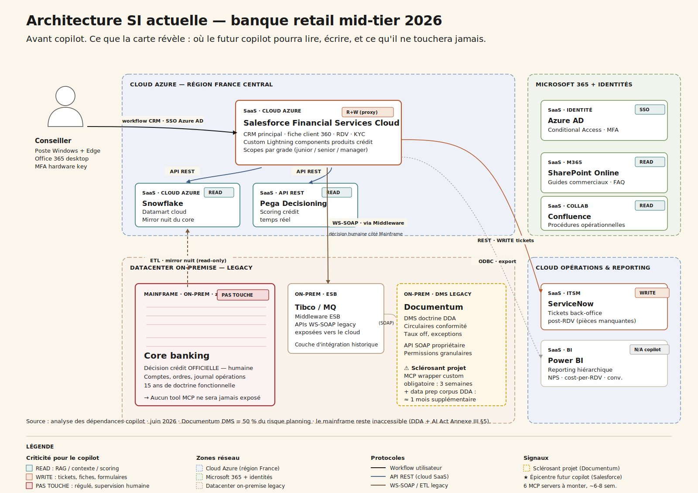
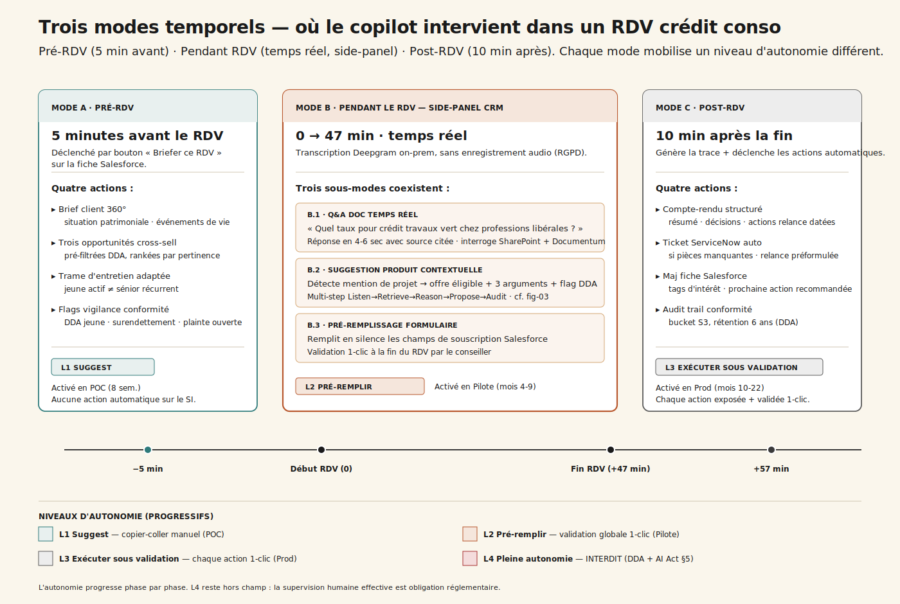
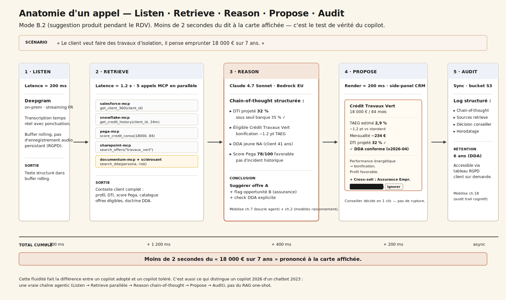
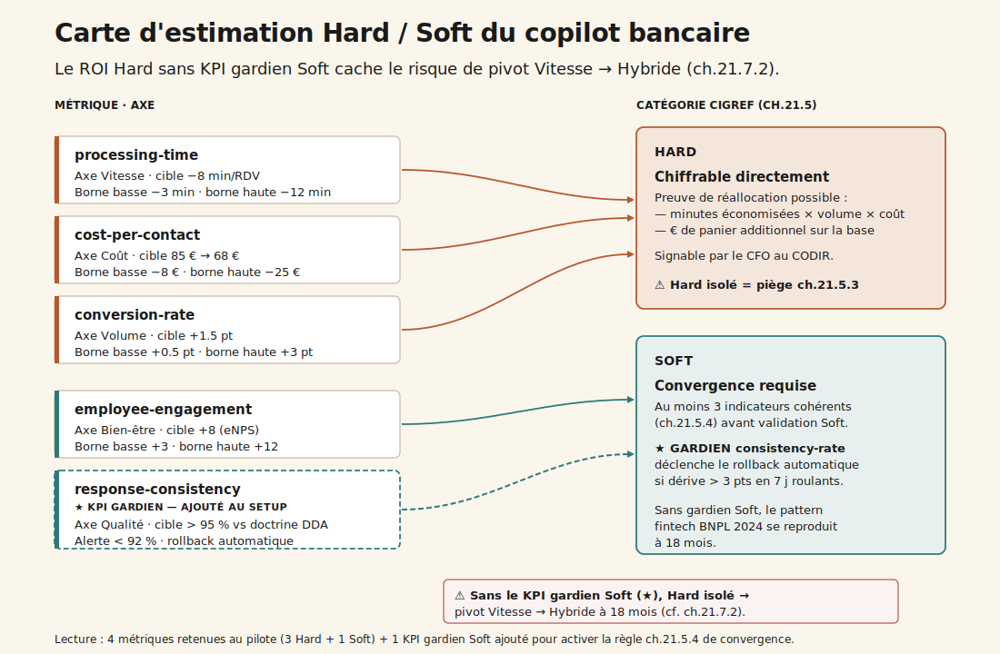

# CC-01 — Copilot conseiller bancaire

**Banque · Generative · charnière (~5 500 mots)**

> Le copilot allège l'entretien — mais le KPI qu'on choisit décide si on retombe sur le pivot Vitesse → Hybride documenté 2024.

---

## 1. Une matinée d'agence

Agence pilote de [VILLE], 9 h, lundi de rentrée scolaire. La conseillère reçoit son premier RDV crédit conso depuis quatre ans dans le métier. Le copilot lui suggère trois produits en marge de l'entretien — elle en choisit un, contre l'intuition qu'elle aurait eue. Quarante-sept minutes plus tard, le crédit est ouvert.

Le directeur retail veut généraliser : 2 800 conseillers, 14 régions, 1,2 million de RDV crédit par an, cost-per-RDV actuel 85 €. Le pilote initial — 80 conseillers, 30 000 RDV, 6 mois — est suffisamment encourageant pour qu'il y mette son CODIR. Le NPS conseiller est à 38, la recherche documentaire prend 12 secondes par requête full-text dans des PDF, et personne ne sait dire exactement ce qui se passe quand un conseiller ouvre Documentum pour vérifier un point de doctrine DDA.

Mais le directeur conformité demande : *« qui répond si le conseil suggéré viole DDA ? »*

Cette question, qui paraît bureaucratique au sponsor finance, est la seule qui décide vraiment du sort du projet. La conséquence pratique se mesure à 18 mois, quand la dérive a déjà fait son œuvre — comme l'a vécu une fintech BNPL scandinave en 2024, contrainte de revenir à l'humain après avoir trop optimisé la Vitesse au détriment de la qualité de conseil (cf. [ch. 21.7.2](../../chapitres/ch21-roi-paradoxe-agentique.md)).

L'enjeu n'est donc pas tellement de **faire** un copilot. C'est de le faire avec **les bons garde-fous**, avec **les bonnes mesures**, sur **la bonne stack**, à un coût qui tient à l'échelle. Et la première question — celle qui structure toutes les autres — est : *qu'est-ce qu'on a déjà dans le SI ?*

## 2. La carte de la stack — six couches qui décident

Avant de parler MCP, modèle ou ROI, il faut regarder la stack existante. C'est elle qui décide de l'effort d'intégration, du risque sécurité, de la marge de manœuvre face à l'AI Act. La théorie build/buy/hybride sans architecture actuelle est un slide commercial.

Six couches structurent la banque retail mid-tier 2026 typique :

1. **Le canal utilisateur**, où vit le conseiller : poste Windows + Edge, Office 365 desktop, authentification Azure AD avec Conditional Access et MFA hardware key. Cette couche n'est pas touchée par le copilot ; elle l'héberge.

2. **Le front métier**, c'est-à-dire **Salesforce Financial Services Cloud** (cloud Azure). C'est l'épicentre du copilot : c'est ici que vit la fiche client 360°, les RDV, les opportunités cross-sell, les custom Lightning components qui hébergent les produits crédit. Le copilot y lit (contexte client) et y écrit (mise à jour fiche, création opportunité, pré-remplissage formulaire) — toujours via proxy de validation, jamais en autonomie. Un MCP officiel Salesforce existe : ~1 semaine de customization pour câbler les scopes par grade conseiller.

3. **La couche data & scoring** : **Snowflake** comme datamart cloud Azure (mirror nuit du core banking, transactions, soldes, scores comportementaux) et **Pega Decisioning** en SaaS (scoring crédit temps réel via API REST). Le copilot lit en parallèle ces deux systèmes pendant la phase Retrieve d'un appel — MCP open source Snowflake (2 jours), MCP custom REST Pega (1 semaine).

4. **Le core banking — pas-touche-régulé** : mainframe IBM z/OS COBOL, accédé via middleware Tibco/MQ en WS-SOAP. C'est ici que vit la décision crédit officielle, qui reste **humaine** par obligation DDA et AI Act Annexe III §5. Aucun tool MCP n'y sera jamais exposé. Le copilot prépare le dossier ; le conseiller signe via les outils existants ; le mainframe enregistre.

5. **La knowledge base** : **SharePoint Online** pour les guides commerciaux et FAQ produits (MCP officiel Microsoft, 3 jours), **Documentum DMS** pour la doctrine DDA et les circulaires conformité (legacy SOAP — **3 semaines** de MCP wrapper custom, **plus un mois** de data prep pour structurer un corpus DDA aujourd'hui éparpillé en PDF non-versionnés), et **Confluence** pour les procédures opérationnelles. Documentum est le sclérosant du projet : 50 % du risque planning s'y concentre.

6. **Le back-office** : **ServiceNow** pour les tickets back-office post-RDV (création automatique pour pièces manquantes, MCP officiel, 1 semaine) et **Power BI** pour le reporting hiérarchique, qui reste hors périmètre du copilot.

Ce que cette carte dit tout de suite :

- Le **cloud Azure est dominant** — un Microsoft Copilot Studio s'intègre quasi nativement (argument time-to-value massif).
- Le **mainframe est inaccessible** — pas une contrainte technique, une contrainte réglementaire. Toute architecture qui prétend contourner cette frontière sera bloquée par le DPO et la Conformité avant le pilote.
- **Documentum est l'angle mort projet** — un MCP wrapper custom + un mois de structuration du corpus DDA, c'est 1 mois et demi de retard quasi-garanti par rapport au cadrage initial.
- **Azure AD gère déjà le SSO et les scopes par grade conseiller** — le copilot hérite des autorisations existantes, pas de nouveau périmètre IAM à inventer.

Avec cette carte, on peut maintenant parler de ce que le copilot fait.

## 3. Ce que le copilot fait, vraiment

Pas un chatbot ouvert. Un copilot **contextuel**, ancré dans le workflow CRM du conseiller. Trois modes d'usage temporels — avant, pendant, après le RDV — qui mobilisent chacun des outils différents et engagent des niveaux de risque différents.

### 3.1 Avant le RDV — 5 minutes pour briefer

Cinq minutes avant le RDV, le conseiller clique sur un bouton « Briefer ce RDV » sur la fiche Salesforce. Le copilot fait quatre choses :

- Il **génère un brief client 360°** : situation patrimoniale, ancienneté banque, événements de vie détectés (mariage, naissance, déménagement) via signaux datamart.
- Il **suggère trois opportunités cross-sell** rankées par pertinence, avec pré-filtre DDA pour exclure les recommandations non éligibles au profil.
- Il **propose une trame d'entretien** adaptée au profil — un jeune actif sur premier RDV n'a pas la même structure d'entretien qu'un sénior récurrent.
- Il **affiche les flags de vigilance conformité** : DDA jeune si applicable, surendettement signalé, plainte ouverte, etc.

Mode L1 Suggest : le conseiller lit et décide. Aucune action automatique. C'est la version POC, livrable en 8 semaines sur 20 conseillers d'une agence pilote.

### 3.2 Pendant le RDV — trois sous-modes en silence

Pendant l'entretien, le copilot écoute via transcription temps réel — **Deepgram on-prem**, sans enregistrement audio persistant pour respecter le RGPD. Il occupe un side-panel discret dans le CRM, à droite de la fiche client. Trois sous-modes coexistent :

- **B.1 Q&A documentaire temps réel** : le conseiller chuchote *« quel est le taux pour un crédit travaux vert chez professions libérales ? »* — réponse en 4 à 6 secondes, avec source citée. Le copilot interroge SharePoint + Documentum + référentiel produit en parallèle.

- **B.2 Suggestion produit contextuelle** : le copilot détecte une mention de projet (*« travaux d'isolation »*, *« changer de voiture »*, *« études des enfants »*) et propose une offre éligible avec trois arguments + flag DDA. La trajectoire multi-step est détaillée au §5 — c'est là que se joue la valeur réelle du copilot.

- **B.3 Pré-remplissage de formulaire** : pendant que le conseiller clarifie montants et durées, le copilot remplit en silence les champs de souscription dans Salesforce. À la fin du RDV, le conseiller valide d'un clic — ou modifie. Mode L2 Pré-remplir, activé en pilote (mois 4 à 9).

### 3.3 Après le RDV — la trace et le ticket

Dix minutes après la fin du RDV, quatre actions séquentielles :

- Le copilot **génère un compte-rendu structuré** : résumé, décisions prises, actions de relance datées.
- Si des pièces manquent (justificatif domicile, RIB, dernière fiche de paie…), il **crée automatiquement un ticket ServiceNow** avec une relance préformulée à envoyer au client.
- Il **met à jour la fiche Salesforce** : tags d'intérêt détectés pendant le RDV, prochaine action recommandée.
- Il **sauvegarde l'audit trail conformité** dans un bucket S3 dédié, rétention 6 ans pour DDA — qui a dit quoi, qu'est-ce que le copilot a recommandé, qu'est-ce que le conseiller a validé ou refusé, avec horodatage et empreinte des sources retrieve.

Mode L3 Exécuter sous validation, activé en prod (mois 10 à 22). Le conseiller voit toujours ce qui va être fait, valide d'un clic — mais l'action est mécaniquement déclenchée par le copilot.

## 4. Quatre niveaux d'autonomie, et le quatrième est interdit

L'autonomie progresse phase par phase, calibrée par les capacités du modèle et par les exigences réglementaires.

- **L1 Suggest** (POC, 8 semaines) — Le copilot suggère du texte. Le conseiller copie-colle ou reformule. Aucune action sur le SI.
- **L2 Pré-remplir** (Pilote, mois 4-9) — Le copilot écrit dans Salesforce des champs structurés. Validation globale 1-clic en fin de session.
- **L3 Exécuter sous validation** (Prod, mois 10-22) — Le copilot crée tickets ServiceNow, met à jour la fiche, envoie email récap. Chaque action est exposée à l'écran et validée 1-clic via une UI dédiée.
- **L4 Pleine autonomie** — **Interdit**. DDA exige une décision humaine en conseil financier. AI Act Annexe III §5 (système haut risque) exige une supervision humaine effective documentée. Aucune action du copilot ne se déclenche sans qu'un humain ne l'ait vue passer.

L'interdiction de L4 n'est pas une frilosité ; c'est une obligation réglementaire à laquelle on adosse une architecture saine. Le proxy de validation côté CRM transforme tout tool MCP qui touche un système écrit en geste explicite du conseiller. Cette discipline coûte un clic — et économise des amendes AI Act jusqu'à 7 % du CA en cas de non-conformité.

## 5. Anatomie d'un appel — Listen, Retrieve, Reason, Propose, Audit

Le mode B.2 (suggestion produit pendant le RDV) est le test de vérité. Si le copilot s'effondre ici, le reste n'a pas d'importance. Reprenons l'exemple : *« le client veut faire des travaux d'isolation, il pense emprunter 18 000 € sur 7 ans »*. Voici ce qui se passe en moins de deux secondes.

**1. Listen.** Deepgram transcrit en streaming, en français, avec ponctuation. Latence brute : 200 ms. Le texte arrive dans un buffer rolling.

**2. Retrieve.** Le copilot déclenche **cinq appels MCP en parallèle** (≈ 1,2 s cumulé) :
- `salesforce-mcp.get_client_360(client_id)` — revenus, ancienneté banque, score relation, KYC
- `snowflake-mcp.get_credit_history(client_id, 24m)` — DTI calculé, incidents, soldes moyens
- `pega-mcp.score_credit_conso(client_id, 18000, 84)` — score Pega, taux applicable, flags décisionnels
- `sharepoint-mcp.search_offers(category="travaux_vert")` — catalogue Crédit Travaux Vert en cours, conditions de bonification
- `documentum-mcp.search_dda(persona="proprio_RP", risk="moyen")` — doctrine DDA applicable, exceptions régionales

**3. Reason.** Le modèle reasoning (Claude 4.7 Sonnet via AWS Bedrock résidence EU) déroule une chaîne de pensée structurée : DTI projeté à 32 % (sous seuil banque 35 %) → éligible Crédit Travaux Vert (−1,2 pt TAEG standard) → DDA jeune ne s'applique pas (41 ans) → pas d'incident, score Pega 78/100 favorable → conclusion : suggérer offre A (Crédit Travaux Vert) + flag opportunité B (assurance emprunteur DDA-compliant) + check DDA explicite.

Cette étape mobilise vraiment la chaîne agentic (cf. [ch. 7](../../chapitres/ch07-boucle-agentique.md)) — pas du RAG one-shot. C'est ce qui distingue un copilot 2026 d'un chatbot 2023.

**4. Propose.** Une carte produit apparaît en side-panel CRM :

> **Crédit Travaux Vert · 18 000 € / 84 mois**
> TAEG estimé 2,9 % (− 1,2 pt vs standard) · Mensualité ~234 €
> DTI projeté 32 % (seuil 35 % ✓) · DDA conforme (doctrine v2026-04)
>
> *Argumentaires : performance énergétique = bonification · mensualité < 1/3 reste à vivre · profil client favorable*
>
> *+ Cross-sell : Assurance Emprunteur DDA-compliant*
>
> `[ Insérer dans formulaire ]  [ Ignorer ]`

**5. Audit.** Log structuré (chain-of-thought + sources retrieve + décision conseiller) → bucket S3 audit-trail (rétention 6 ans DDA), accessible via le tableau RGPD du client sur demande. Cette discipline d'audit cognitif (cf. [ch. 18](../../chapitres/ch18-observabilite-cognitive-audit-trail.md)) est ce qui rendra l'AI Act gérable plutôt que paralysant.

Le total : moins de 2 secondes du *« 18 000 € sur 7 ans »* prononcé à la carte affichée. Le conseiller continue son entretien sans rupture de rythme — c'est cette fluidité qui fera la différence entre un copilot adopté et un copilot toléré.

## 6. Build, Buy, Hybride — l'arbitrage qui dépend de l'architecture

Trois options sur la table, évaluées sur six critères. Notation `--` (très défavorable) → `++` (très favorable).

| Critère | **Build pur** *LangGraph + Mistral Large 3 self-hosted* | **Buy mainstream** *Microsoft Copilot Studio + GPT-5* | **Hybride** *(recommandé)* *Orchestrateur maison + Claude via MCP + cascade Mistral 7B* |
| --- | :---: | :---: | :---: |
| Sensibilité data    | `++` *(tout interne)*           | `-` *(cloud US, RGPD à scruter)*  | `+` *(Claude via Bedrock EU + gardien self-hosted)* |
| Personnalisation    | `++` *(corpus + prompts maison)* | `-` *(templates Copilot Studio)* | `+` *(prompts et garde-fous maison)* |
| Volumétrie          | `+` *(besoin investir GPU + SRE)* | `++` *(Microsoft a industrialisé)* | `+` *(routing intelligent + cascade)* |
| Lock-in             | `+` *(pas de vendor)*            | `--` *(Azure-only, sortie coûteuse)* | `0` *(modèle changeable, MCP standardisé)* |
| Time-to-value       | `--` *(9 mois avant pilote)*    | `++` *(POC en 4 sem., démo rapide)* | `+` *(5 mois jusqu'au pilote)* |
| Souveraineté        | `++` *(France end-to-end)*       | `--` *(cloud US sans atténuation)* | `0` *(partielle : embeddings + gardien FR, primaire US-EU)* |
| **Verdict**         | *Trop lent pour le calendrier sponsor (CODIR Q2 2027). Reasoning Mistral Large 3 en retrait sur arbitrages DDA complexes. À internaliser progressivement dès Scale, mais pas en porte d'entrée.* | *Time-to-value imbattable, mais lock-in Azure problématique pour un métier qui doit documenter sa souveraineté devant l'ACPR. Connecteur Documentum à construire de toute façon.* | ***RECOMMANDÉ.** Équilibre time-to-value / souveraineté partielle / fallback dégradé qui tient devant CODIR et Conformité.* |

**Argument décisif pour l'hybride** : les six MCP servers custom **servent toute la plateforme agent banque ultérieure** — CC-03 (détection fraude), CC-18 (AML), CC-19 (génération rapports réglementaires) profiteront du même socle. C'est un investissement plateforme, pas projet.

**Décision opérationnelle** : démarrage POC sur API Anthropic via Bedrock EU. Ré-évaluation à 12 mois pour internaliser le routing et le gardien Mistral si la volumétrie le justifie (crossover ≈ 800 000 interactions/an, cf. §9).

## 7. Sept MCP servers à monter — et le sclérosant qu'on connaît déjà

Le tableau qui ne ment pas. Effort et risque par outil pour budgéter sérieusement.

| Système           | Mode                     | Type MCP                          | Effort dev          | Risque |
| ----------------- | ------------------------ | --------------------------------- | ------------------- | ------ |
| Salesforce FSC    | R+W (proxy validation)   | Officiel disponible               | 1 sem. customization | Moyen (scopes) |
| Snowflake         | Read                     | Open source `snowflake-mcp`       | 2 j config           | Bas    |
| Pega Decisioning  | Read                     | Custom (API REST)                 | 1 sem.               | Bas    |
| SharePoint Online | Read                     | Officiel Microsoft                | 3 j                  | Moyen (RBAC) |
| **Documentum DMS** | **Read** | **Custom obligatoire (SOAP legacy)** | **3 sem.** | **Haut** |
| ServiceNow        | Write (tickets)          | Officiel                          | 1 sem.               | Bas    |
| Deepgram voice    | Read streaming           | Pas MCP — websocket direct        | 1 sem.               | Bas    |

**Effort cumulé : 6 à 8 semaines** pour un backend dev sénior, plus un ML engineer en support pour le wrapping Documentum. C'est le poste data + équipe combiné qui décide ; ce n'est pas la techno.

Documentum mérite son traitement de faveur. Trois semaines de wrapper SOAP, plus un mois pour structurer le corpus DDA aujourd'hui éparpillé en circulaires PDF non-versionnées, plus une couche de permissions granulaires qui doit dialoguer avec Azure AD. C'est là que se logent les vraies surprises projet. C'est aussi là qu'on découvre, semaine 4, que les circulaires de 2019 contredisent silencieusement celles de 2024 sur trois points DDA — et qu'on a besoin de la cellule conformité pour arbitrer, ce qui ajoute six semaines de coordination.

## 8. La cascade Claude + Mistral — pourquoi deux modèles

Cinq candidats sur la table en juin 2026 :

| Modèle | Force pour ce cas | Faiblesse | Coût indicatif |
|---|---|---|---|
| Claude 4.7 Sonnet | Excellent FR, tool use natif, MCP first-class, 1M tokens | Cloud US (atténué par Bedrock EU) | 3 / 15 $/Mtok |
| Claude 4.7 Opus | Reasoning supérieur sur arbitrages DDA complexes | Coût, latence | 15 / 75 $/Mtok |
| GPT-5 | Voice tier intégré, structured output | Lock-in MS si Copilot Studio | 5 / 25 $/Mtok |
| Mistral Large 3 | **Souverain France**, argument banque réglementée | Reasoning légèrement en retrait | 2,5 / 10 €/Mtok |
| Mistral 7B fine-tuné | Coût plancher, self-hostable | Capacité limitée, pas standalone | OpEx infra |

La recommandation est une **cascade** :

- **Modèle primaire : Claude 4.7 Sonnet** via AWS Bedrock résidence EU. Tool use robuste, MCP first-class, excellent en français bancaire, contexte 1 M tokens pour absorber sans souci le brief client + les sources retrieve + l'historique du RDV.
- **Modèle gardien : Mistral 7B fine-tuné** self-hosted, sollicité comme **2nd opinion sur tout flag DDA** et comme **LLM-as-judge sur 5 % des entretiens** en monitoring continu (voir §11). C'est le même modèle qui sert à deux usages : pas de fragmentation infra.
- **Voice tier : Deepgram on-prem** pour la transcription, sans hébergement audio persistant.
- **Embeddings RAG : Mistral embed** (souverain, performance suffisante pour le corpus DDA).

L'argument cascade tient devant la Conformité **et** devant la DSI. Devant la Conformité : *« et si OpenAI/Anthropic est down ? »* — fallback dégradé sur Mistral seul reste possible. Devant la DSI : *« on partage le gardien Mistral entre génération B.2 et évaluation continue, on amortit l'infra GPU »*. Et devant le CFO : la souveraineté partielle (embeddings + gardien français) coche la case ACPR sans payer le prix d'un Mistral primaire.

## 9. Les huit postes de coûts sur quatre phases — le paradoxe agentique

Toute trajectoire de scaling se mesure sur **huit postes standardisés** sur **quatre phases** (POC → Pilote → Prod → Scale). Voici la grille CC-01, en k€ :

| Poste         | POC 3 m | Pilote 6 m | Prod 12 m | Scale 36 m |
| ------------- | ------- | ---------- | --------- | ---------- |
| Inférence     | 5       | 30         | 180       | 450        |
| Infra         | 8       | 25         | 90        | 220        |
| **Équipe**    | **90**  | **280**    | **720**   | **1 500**  |
| Data          | 10      | 40         | 60        | 80         |
| Évaluation    | 5       | 30         | 120       | 300        |
| Gouvernance   | 8       | 25         | 80        | 180        |
| Sécurité      | 5       | 20         | 80        | 180        |
| **Change**    | **0**   | **40**     | **160**   | **320**    |
| **Total**     | **131** | **490**    | **1 490** | **3 230**  |
| Coût/interaction | 2,10 € | 0,85 €  | 0,42 €    | 0,28 €     |

Lecture transverse :

- **Le coût par interaction divise par 7 entre POC et Scale** (2,10 € → 0,28 €). C'est le levier LLMflation + cascade + routing + cache qui fait son œuvre. C'est aussi ce qu'on vend au CFO pour signer le budget.

- **Le poste équipe est multiplié par ~17** (90 k€ → 1 500 k€). C'est l'équipe core + plateforme + change qui grandit avec la surface d'usage. Plafonné vers l'année 4 par la maturité des patterns d'orchestration (cf. [ch. 11](../../chapitres/ch11-patterns-orchestration.md)).

- **Le poste change passe de 0 à 320 k€**. Au cadrage initial, c'est le poste qu'on oublie systématiquement — on n'a pas formé 2 800 conseillers et 14 régions sans budget dédié. Quand on s'en aperçoit, l'écart au plan est de l'ordre de 200 à 300 k€.

- **Le couple évaluation + gouvernance + change** représente **5 % du POC** (18 k€ sur 131) mais **25 % du Scale** (800 k€ sur 3 230). C'est le **paradoxe agentique** ([ch. 21.7](../../chapitres/ch21-roi-paradoxe-agentique.md)) en grandeur réelle : l'unité de mesure se déplace de l'inférence (qui baisse) vers l'équipe + change + évaluation (qui montent).

**Crossover build/buy** estimé à ≈ 800 000 interactions/an : seuil au-delà duquel l'hybride avec routing interne et gardien self-hosted bat la solution mainstream pure en coût total. CC-01 dépasse ce seuil dès le mois 14 en Prod — c'est ce qui justifie la stratégie *« démarrer hybride avec Claude API + internaliser le gardien dès Scale »*.

## 10. Gouvernance — RACI, FRIA, AI Act août 2027

Sans gouvernance documentée, le pilote ne sort pas du juridique. Voici le squelette.

**RACI** :
- **R**esponsable : l'équipe produit copilot (Tech Lead Agentic + 2 prompt engineers + 1 ML engineer évaluation).
- **A**pprobateur : Directeur Retail (sponsor), qui engage le budget et arbitre les conflits avec Conformité.
- **C**onsultés : DPO référent, RSSI, Conformité DDA, Comité IA Risk groupe, CSE / représentants conseillers.
- **I**nformés : CODIR mensuel, ACPR (régulateur prudentiel banque) trimestriel.

**Cadence revue** :
- Comité évaluation : **trimestriel**, métriques en ligne + revue régression suite + revue incidents.
- Alertes : **continues** (Datadog + Mistral 7B gardien sur 5 % des entretiens en LLM-as-judge).
- Audit externe : **annuel**, cabinet conformité bancaire spécialisé.

**Ligne AI Act** : système **haut risque** au sens de l'**Annexe III §5** (évaluation de la solvabilité dans le cadre du conseil crédit). Échéances :
- Août 2026 : transparence obligatoire — registre, information utilisateur final, log basique.
- Août 2027 : **obligations complètes** — FRIA (Fundamental Rights Impact Assessment) documentée, registre Annexe IV tenu trimestriellement, log d'audit ≥ 6 ans, supervision humaine effective documentée (l'interface ne doit pas être un rubber-stamp ; l'échantillonnage retour humain ≥ 5 % est l'argument matériel), information du client dans le compte-rendu post-RDV mentionnant l'usage de l'IA.

Non-conformité au 2027-08 = amende jusqu'à **7 % du chiffre d'affaires mondial**. Ce chiffre suffit pour que le sponsor accepte que la gouvernance pèse 80 k€/an en Prod (cf. §9). Il faut juste savoir le poser sur la table avant que le pilote ne soit signé.

## 11. La boucle d'évaluation — ce qui décide vraiment du rollback

L'évaluation n'est pas un projet, c'est un **budget continu**. C'est le poste le plus sous-estimé au cadrage POC (voir §9) et celui qui décide à 18 mois si le copilot reste en prod ou s'il faut tout reprendre.

Quatre temps :

**1. Régression suite.** 120 cas dorés DDA + 40 cas adversariaux (prompt injection, contournement de règles). Mise à jour mensuelle par la cellule conformité, en lien avec l'équipe produit. Critères évalués : respect DDA (doctrine versionnée v2026-04), consistency vs doctrine (response-consistency > 95 %), absence de cross-sell agressif (heuristique : pas plus de 2 produits suggérés par RDV), robustesse aux prompt injection (rate < 0,5 %), qualité argumentaire (LLM-as-judge Mistral gardien + revue humaine échantillon 5 %).

**2. Métriques en ligne.**
- `response-consistency` > 95 % vs doctrine — alerte si < 92 % sur 7 jours roulants.
- `regulatory-compliance` = 0 violation DDA — alerte si > 0 (rollback immédiat sous 24 h).
- `csat` > 4,2 / 5 — alerte si < 4,0 / 5 sur 7 jours roulants.

**3. Détection de dérive.** Datadog pour latence, taux d'appel tool, exceptions. Mistral 7B gardien en LLM-as-judge sur 5 % des entretiens, comparant chaque réponse copilot à un score de conformité doctrinaire. Alerte PagerDuty équipe produit, escalade DPO si DDA, escalade RSSI si attaque prompt injection. Fenêtre : rolling 7 jours vs baseline 30 jours pour les métriques de qualité ; instantané pour DDA.

**4. Boucle de correction.** Trigger via ticket Linear ou alerte automatique. Délai de re-prompt sur l'orchestrateur : **48 h**. Cadence ré-entraînement du gardien Mistral 7B : **trimestriel** (corpus DDA mis à jour). Pas de fine-tuning du primaire Claude (frozen). Rollback technique : **< 4 h via feature flag**, chaque tool MCP désactivable individuellement, avec clause expresse au contrat AWS Bedrock.

Cette boucle n'est pas un nice-to-have — c'est **le mécanisme qui transforme la promesse en confiance**. Sans elle, on découvre la dérive en lisant les premiers commentaires conseillers excédés sur le NPS interne, six mois après que le mal soit fait.

## 12. ROI — Hard, Soft, et le KPI gardien qu'on ajoute

L'axe principal est la **Vitesse** ; axes secondaires : Volume et Bien-être. Méthode mobilisée : TEI Forrester (chiffrage) + Cigref Hard/Soft (qualification) + arbre de décision [ch. 21.6](../../chapitres/ch21-roi-paradoxe-agentique.md).

Quatre métriques retenues :

| Métrique              | Borne basse | Cible      | Borne haute | Catégorie |
|-----------------------|-------------|------------|-------------|-----------|
| `processing-time`     | −3 min      | **−8 min** | −12 min     | Hard      |
| `cost-per-contact`    | −8 €        | **−17 €**  | −25 €       | Hard      |
| `conversion-rate`     | +0,5 pt     | **+1,5 pt** | +3 pt       | Hard      |
| `employee-engagement` | +3          | **+8**     | +12         | Soft      |

Cette grille est honnête mais incomplète. C'est ici qu'arrive la décision qui change tout : **ajouter un KPI gardien Soft**.

> **`response-consistency`** (axe Qualité, catégorie Soft) — cible > 95 % vs doctrine DDA, alerte < 92 %. **Déclenche le rollback automatique** si dérive > 3 pts sur 7 jours roulants. C'est le mécanisme qui active la règle [ch. 21.5.4](../../chapitres/ch21-roi-paradoxe-agentique.md) de **convergence Soft**.

Sans ce gardien, le ROI Hard isolé (Vitesse + Volume) signe au CODIR — et la consistency dérive en silence pendant six à neuf mois. À 18 mois, le NPS chute, les premières plaintes DDA arrivent, et la dégradation Soft impose un retour à l'hybride forcé. C'est le pattern fintech BNPL scandinave 2024, documenté au [ch. 21.7.2](../../chapitres/ch21-roi-paradoxe-agentique.md).

**Métriques explicitement non retenues** :
- `fraud-avoided` — pas le périmètre du copilot conseil (cf. CC-03 détection fraude).
- `basket-size` — attribution copilot ↔ cross-sell trop indirecte sur 12 mois pilote.
- `nps` — utilisé en monitoring CSAT secondaire, pas en KPI primaire (cf. règle [ch. 21.5.4](../../chapitres/ch21-roi-paradoxe-agentique.md) sur la convergence à trois indicateurs).

La discipline d'écrire ce qu'on ne mesure pas, et pourquoi, est ce qui sauve le pilote du procès en cherry-picking au CODIR.

## 13. L'équipe, la vélocité, les deadlines

**9,6 ETP** pour le pilote 6 mois, composés ainsi :

| Rôle                  | ETP | Profil cible |
| --------------------- | --- | ------------ |
| Tech Lead Agentic     | 1,0 | Python+TS sénior, ≥ 12 mois d'expérience agentic, a déjà livré un agent en prod, comprend MCP/tool use |
| ML Engineer           | 2,0 | Eval, RAG, fine-tuning Mistral 7B, MLOps |
| Backend MCP           | 1,0 | **Le sclérosant** : Documentum legacy SOAP + Pega + middleware Tibco |
| Prompt Engineer       | 1,5 | 1 banque/conformité (ex-conseiller crédit ou conformité DDA) + 0,5 conversation designer FR |
| Data Engineer         | 1,0 | Snowflake, corpus DDA, embeddings Mistral, qualité data |
| UX Designer           | 0,5 | Side-panel CRM Salesforce, workflow conseiller, validation 1-clic |
| Product Owner         | 1,0 | **Ex-conseiller banque retail** — load-bearing, sans ce profil échec garanti |
| MLOps / SRE           | 0,5 | Observabilité, déploiement, monitoring agent, Datadog |
| RSSI référent         | 0,3 | Threat model, MCP authz hardening, red-team trimestriel |
| DPO référent          | 0,3 | FRIA, registre AI Act, doctrine prompts, audit trail |
| Change manager        | 0,5 | Formation conseillers, CSE, communication interne |

En Prod (mois 10+), descente à **6 ETP core** + ressources mutualisées plateforme agent transverse (la plateforme MCP servira aussi CC-03, CC-18, CC-19 — l'argument vaut le détour quand on présente le budget DSI).

**Vélocité** :
- POC : **8 semaines**, releases bi-hebdo, 20 conseillers 1 agence, mode L1, crédit conso uniquement.
- Pilote : **6 mois**, releases hebdo, 80 conseillers 4 agences, mode L2, MCP Salesforce + Snowflake + SharePoint + Pega + Documentum activés.
- Prod : **12 mois**, releases bi-hebdo + hotfix 48 h, 2 800 conseillers 14 régions, mode L3, extension crédit immo + assurance.
- Scale : **36 mois**, releases mensuelles, optimisation cost/interaction, internalisation Mistral self-hosted, cross-sell pro.

**Quatre sclérosants** à intégrer dans le planning honnête :
- Accès Documentum DMS legacy + qualité corpus DDA : +1 mois data prep et +3 sem. MCP wrapper.
- Gouvernance CSE / syndicats : **3 mois** de consultations obligatoires avant pilote élargi.
- FRIA AI Act : **4 semaines** via cabinet externe spécialisé.
- Convaincre la Conformité DDA : 2-3 sessions de cadrage + 1 audit pilote à 3 mois sous peine de blocage.

**Deadlines externes datées** :
- **2026-08** — AI Act transparence (Annexe III §5). Si système haut risque en prod sans documentation, FRIA + registre déjà obligatoires.
- **2027-08** — AI Act obligations complètes. Non-conformité = amende jusqu'à 7 % CA.
- **2027 Q2** — CODIR premiers chiffres ROI. Sponsor CFO doit présenter Hard savings concrets — sinon arrêt budget.
- **2028** — Plan stratégique −10 pts cost-income ratio. Copilot levier sur 1,5-2 pts du plan.

**Deadline opérationnelle** : POC démarré **septembre 2026** → pilote en prod **avril 2027** → généralisation **Q3 2027** (3 mois de marge avant AI Act août 2027).

## 14. Le débat — Vitesse cache-t-elle le pivot ?

C'est la question centrale du cas, et celle qui se pose dans tous les copilots métier 2026.

**Pour optimiser Vitesse en KPI primaire** :
- Hard savings mesurables, signables CFO et défendables au CODIR.
- Réallocation prouvable des minutes économisées (+4 RDV par semaine et par conseiller).
- Rollback technique possible en moins de 4 h via feature flags — architecture saine.

**Contre l'optimisation Vitesse isolée** :
- Le pattern fintech BNPL scandinave 2024 a optimisé Vitesse, dégradé la qualité de conseil, fait marche arrière 18 mois plus tard avec dégradation NPS forte. Ce n'est pas une anecdote, c'est le **cas d'école de la remontée échouée** ([ch. 21.7.2](../../chapitres/ch21-roi-paradoxe-agentique.md)).
- Les Soft savings (conseil consistant, doctrine respectée) sont ce qui protège le FDC contre les banques 100 % en ligne — c'est l'avantage concurrentiel qu'on dilapide si on optimise mal.
- Le coût d'évaluation + change + gouvernance est sous-estimé : il représente 25 % du coût total à Scale et 0 % du cadrage POC initial.

**Verdict pondéré** : KPI primaire = Vitesse (`processing-time` + `cost-per-contact`). **KPI gardien = `response-consistency` > 95 %**. Échantillon humain de re-listening 5 % des RDV par la cellule conformité DDA. **Clause contractuelle de rollback** si NPS conseillers dégrade > 2 pts ou consistency-rate dégrade > 3 pts sur 7 jours roulants.

C'est le seul setup qui tient à 18 mois.

## 15. Trois choix qu'il faut faire — et leurs conséquences

Les bifurcations ne sont pas pour noter le lecteur ; elles sont pour le faire **rencontrer** les chemins. Chaque option est plausible. Une seule est sage.

### 15.1 Premier KPI à mesurer à 6 mois ?

*Vous êtes le CFO. Vous engagez 2,8 M€ sur 18 mois. Quel KPI mesurez-vous EN PREMIER à 6 mois ?*

**A. Cost-per-contact baseline + pilote.** Vous tombez dans le piège du Hard isolé : la consistency a déjà dérivé de 4 pts en silencieux, invisible dans votre KPI primaire. Le compte-rendu CODIR est triomphal — mais à 18 mois, le NPS chute et il faut tout reprendre. *Cf. règle de validation Hard [ch. 21.5.3](../../chapitres/ch21-roi-paradoxe-agentique.md) — preuve de réallocation oui, mais sans contre-poids Soft, le pivot menace à 12-18 mois.*

**B. NPS conseillers (eNPS) uniquement.** Le pilote est jugé succès Soft (+9 eNPS) mais le CFO ne peut pas signer la généralisation : pas de chiffre Hard à présenter au CODIR, le budget est gelé en attente. *Cf. règle de validation Soft [ch. 21.5.4](../../chapitres/ch21-roi-paradoxe-agentique.md) — convergence à trois indicateurs requise, eNPS seul ne tient pas. Le pilote est techniquement bon mais politiquement mort.*

**C. Combo Vitesse (Hard primaire) + response-consistency (Soft gardien).** Vous tenez l'alignement Cigref — KPI Hard signé CFO + garde-fou Soft qui déclenche rollback automatique si dérive. La généralisation est validée avec clause de surveillance. *Cf. règle Cigref alignement stratégique [ch. 21.7.3](../../chapitres/ch21-roi-paradoxe-agentique.md) — c'est le seul setup qui évite le retour à l'hybride forcé documenté 2024.*

### 15.2 Qui répond d'une recommandation copilot non conforme DDA ?

*La Conformité DDA pose la question. Vous tranchez.*

**A. Le conseiller (assistance, pas décision).** Vous transférez le risque sur le conseiller — qui devient juridiquement exposé sans en avoir les moyens. Les syndicats bloquent au CSE, le pilote est suspendu 3 mois. *Pattern à éviter : le conseiller n'a ni la formation IA-Act, ni le temps de valider sérieusement. La responsabilité doit rester côté éditeur du système (la banque).*

**B. La banque (système éditeur), supervision humaine effective documentée.** Vous assumez la responsabilité au niveau institutionnel + organisez la supervision humaine effective (échantillonnage 5 %, audit DDA trimestriel, formation conseillers IA-Act). La FRIA documente la chaîne. *Conforme AI Act Annexe III §5 + DDA. Coût gouvernance ≈ 80 k€/an en Prod — c'est le prix d'une plateforme régulée. Ne pas l'inscrire au cadrage = pivot inévitable.*

**C. Mode soft-block — le copilot ne propose que des produits whitelistés, flagge les zones grises pour escalade humaine.** Vous limitez l'utilité du copilot aux 60 % de cas standards. Les 40 % restants nécessitent escalade humaine — gain Vitesse divisé par deux mais risque DDA plafonné. *Bon compromis pour la phase Pilote, à élargir en Prod après calibration. Pattern human-in-the-loop + autorisation MCP scoped ([ch. 7](../../chapitres/ch07-boucle-agentique.md) + [ch. 13](../../chapitres/ch13-mcp-securite.md)). Souvent la bonne réponse en phase pilote, avant d'avoir mesuré la dérive réelle.*

### 15.3 À 12 mois, le ROI Vitesse est à −6 min (cible −8). Vous faites quoi ?

**A. Étendre quand même (sunk cost, pression CODIR).** Vous généralisez avec un ROI sous cible. Le coût total à Scale est 15 % au-dessus du budget, le sponsor finit l'année avec un dossier critiqué. Le projet survit mais l'effort plateforme transverse est annulé. *Pattern McKinsey aboutissement ([ch. 21.3.2](../../chapitres/ch21-roi-paradoxe-agentique.md)) : ne pas généraliser un cas qui n'a pas atteint son seuil. Le sunk cost est un mauvais argument.*

**B. Suspendre, ré-évaluer la stack (Documentum, qualité corpus DDA).** Vous identifiez que 70 % de l'écart vient de la latence Documentum (réponses 2-4 s vs cible 1 s). 3 mois pour internaliser un cache RAG sur le corpus DDA. ROI rejoint cible à 18 mois. Pilote prolongé mais Prod sain. *Bon réflexe — identifier le sclérosant réel, pas l'apparent. Souvent le data layer (qualité corpus) et pas le modèle est en cause.*

**C. Pivot vers Quality first (re-spec KPI primaire en consistency-rate).** Vous changez le KPI primaire en cours de pilote — politiquement coûteux mais éditorialement honnête. Le CFO râle mais signe car le récit est tenable. *Pattern McKinsey aboutissement + Cigref alignement ([ch. 21.7.3](../../chapitres/ch21-roi-paradoxe-agentique.md)) : si la mesure révèle qu'on s'est trompé d'axe, mieux vaut pivoter que continuer une lente dérive.*

## 16. Quiz — vérifier qu'on a saisi

**Q1.** Pourquoi `cost-per-contact` seul est-il un piège méthodologique ?
- Parce qu'il n'est pas mesurable directement
- Parce qu'il manque la preuve de réallocation Hard
- **Parce qu'il ignore la dérive Qualité Soft qui peut imposer un retour à l'hybride à 18 mois** ✓
- Parce qu'il est interdit par le RGPD

*Le KPI Hard isolé ne déclenche pas le rollback quand la consistency dérive — c'est l'angle mort qui a coûté cher au pattern fintech BNPL documenté 2024 (cf. [ch. 21.5](../../chapitres/ch21-roi-paradoxe-agentique.md)).*

**Q2.** Pourquoi Documentum DMS est-il le sclérosant projet, et pas Salesforce ?
- Parce que Documentum est plus volumineux
- **Parce que Salesforce a un MCP officiel disponible alors que Documentum nécessite un wrapper custom (SOAP legacy) et héberge un corpus DDA mal structuré** ✓
- Parce que Documentum coûte plus cher en licence
- Parce que Documentum n'a pas d'API

*L'arbitrage build/buy/hybride est dicté par l'architecture actuelle. Les systèmes legacy avec API SOAP + permissions granulaires + corpus mal structuré sont systématiquement les sclérosants (cf. [ch. 12](../../chapitres/ch12-mcp-plateforme.md)).*

**Q3.** Quel poste de coût est le plus sous-estimé au cadrage POC ?
- L'inférence (tokens)
- L'infrastructure GPU
- **Le couple évaluation + gouvernance + change (passe de 5 % du budget POC à 25 % du budget Scale)** ✓
- Les licences mainstream

*C'est le paradoxe agentique ([ch. 21.7](../../chapitres/ch21-roi-paradoxe-agentique.md)) en grandeur réelle : l'unité de mesure se déplace de l'inférence (qui baisse avec la LLMflation) vers l'équipe + change + évaluation.*

## 17. Verdict — pilote étendu, conditionné

**PILOT_ETENDU_CONDITIONNE** — généralisation possible Q3 2027 sous garde-fous.

Cinq conditions non-négociables :

1. **KPI primaire Vitesse** (processing-time + cost-per-contact) **+ KPI gardien response-consistency > 95 %** avec rollback automatique.
2. **Échantillon humain re-listening 5 % des RDV** par la cellule conformité DDA, trimestriel.
3. **Clause contractuelle de rollback** si NPS conseillers dégrade > 2 pts ou consistency-rate dégrade > 3 pts sur 7 jours roulants.
4. **Plateforme MCP transverse** (six servers) considérée comme investissement banque-wide, **mutualisée avec CC-03 / CC-18 / CC-19** (fraude, AML, reporting réglementaire). C'est ce qui transforme un projet à 1,5 M€ en plateforme à 0,8 M€ amortis.
5. **FRIA documentée** et **registre AI Act tenu trimestriellement** dès la phase Pilote, sans attendre 2027-08.

Aux conditions remplies, le copilot conseiller bancaire est défendable au CODIR, à l'ACPR et au CSE simultanément. Ce qui — soyons clairs — n'est pas le cas par défaut.

---

## Renvois livre

- **[Ch. 2 — Modèles de raisonnement et seconde courbe de scaling](../../chapitres/ch02-modeles-raisonnement.md)**
- **[Ch. 5 — Économie unitaire de l'inférence](../../chapitres/ch05-economie-inference.md)**
- **[Ch. 7 — Boucle agent (ReAct, human-in-the-loop)](../../chapitres/ch07-boucle-agentique.md)**
- **[Ch. 12 — MCP plateforme](../../chapitres/ch12-mcp-plateforme.md)**
- **[Ch. 13 — Sécurité MCP](../../chapitres/ch13-mcp-securite.md)**
- **[Ch. 17 — Évaluation agent](../../chapitres/ch17-evaluation-benchmarks.md)**
- **[Ch. 18 — Audit trail cognitif](../../chapitres/ch18-observabilite-cognitive-audit-trail.md)**
- **[Ch. 19 — Garde-fous](../../chapitres/ch19-gardefous-securite-globale.md)**
- **[Ch. 21.5 — Hard vs Soft Savings](../../chapitres/ch21-roi-paradoxe-agentique.md)**
- **[Ch. 21.6 — Arbre de décision méthode ROI](../../chapitres/ch21-roi-paradoxe-agentique.md)**
- **[Ch. 21.7 — Paradoxe agentique](../../chapitres/ch21-roi-paradoxe-agentique.md)**
- **[Ch. 21.7.2 — Cas d'école de la remontée échouée](../../chapitres/ch21-roi-paradoxe-agentique.md)**
- **[Ch. 21.7.3 — Alignement Cigref](../../chapitres/ch21-roi-paradoxe-agentique.md)**
- **[Ch. 21.8 — Études empiriques (Brynjolfsson, Copilot, METR)](../../chapitres/ch21-roi-paradoxe-agentique.md)**
- **[Ch. 23.5 — Banque sous AI Act](../../chapitres/ch23-gouvernance-ai-act.md)**

---

*Format co-écrit avec l'aide d'une IA. Données et calibrage : analyse Mathieu Guglielmino · juin 2026.*
