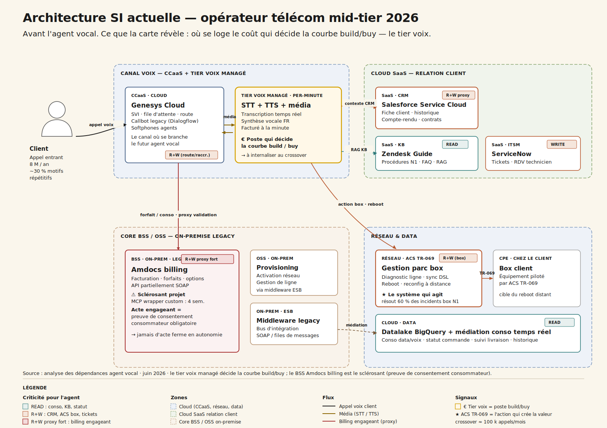
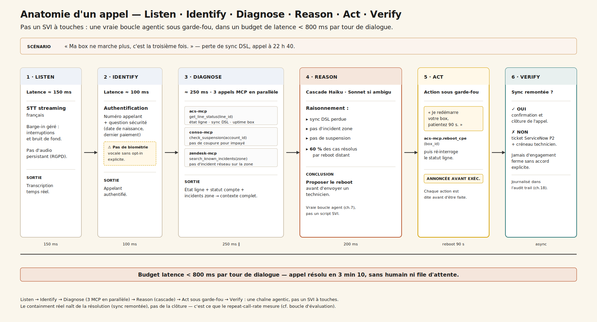
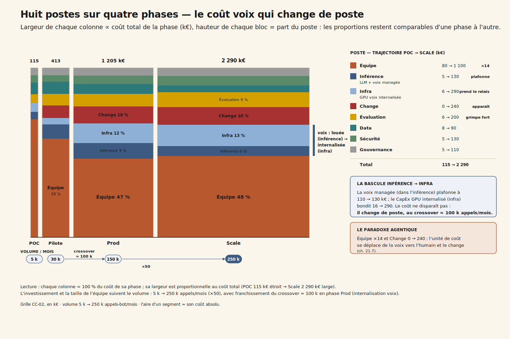
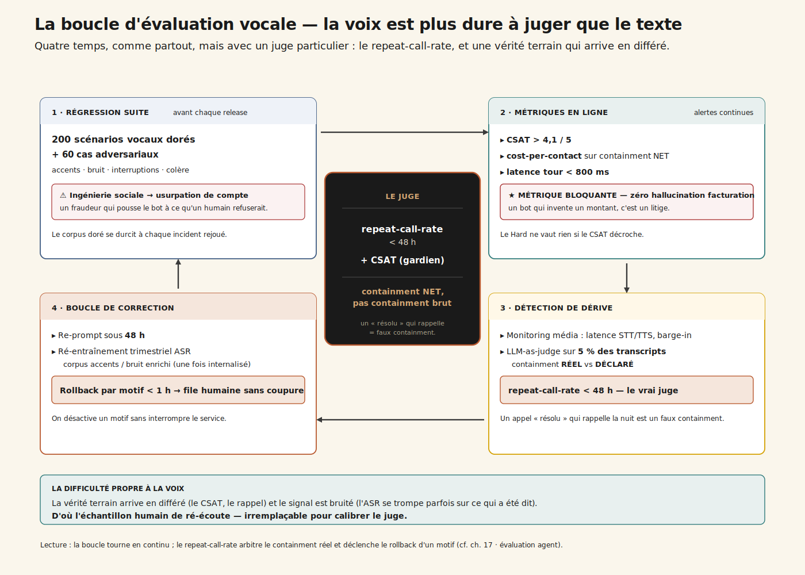

# CC-02 — Agent vocal IA service client

**Télécom · Agentic · charnière (~5 200 mots)**

> Le coût par interaction explose quand on scale au-delà de 100 k appels/mois — sauf à internaliser le tier voix qu'on louait au début.

---

## 1. 22 h 40, file d'attente 14 minutes

Plateau de relation client de [VILLE], 22 h 40. La file d'attente affiche quatorze minutes. Un client appelle pour la troisième fois en deux jours : sa box ne synchronise plus. L'agent vocal IA décroche en deux secondes, l'authentifie, interroge la ligne, détecte une perte de sync DSL, annonce *« je redémarre votre box, ne la débranchez pas, patientez 90 secondes »* — et la ligne remonte. Appel clos en 3 min 10, sans humain.

Le directeur de la relation client veut généraliser : huit millions d'appels par an, dont environ 30 % portent sur des motifs répétitifs (suivi conso, statut commande, incident box niveau 1, modification d'option). Le pilote — 30 000 appels par mois, quatre motifs, six mois — est assez bon pour qu'il y mette son CODIR. Le cost-per-call humain est à 4,80 €, la file d'attente grimpe à quatorze minutes au pic du soir.

Mais le DAF regarde une autre courbe : la facture du **tier voix managé** — la transcription (speech-to-text), la synthèse vocale (text-to-speech) et le média téléphonique — qui monte proportionnellement au volume. Et il pose la seule question qui décide vraiment de la trajectoire économique du projet : *« à 100 000 appels par mois, on continue à louer la voix, ou on l'internalise ? »*

C'est une question de **trajectoire de coûts**, pas de faisabilité. L'agent vocal marche déjà. Ce qui n'est pas tranché, c'est la courbe : à quel volume le CapEx d'un tier voix internalisé bat-il le coût par minute du tier voix loué ? Et ce que cette question révèle — comme toujours — commence par la stack existante.

## 2. La carte de la stack — où vit le coût qui décide

Avant le modèle, avant le prompt, il faut regarder où se loge le coût marginal. Dans un copilot bancaire (cf. CC-01), c'est le modèle de raisonnement. Ici, c'est ailleurs.

Cinq couches structurent l'opérateur télécom mid-tier 2026 typique :

1. **Le canal voix / CCaaS** — un SVI Genesys Cloud, un callbot legacy (Dialogflow CX), des softphones agents. C'est ici que se branche l'agent vocal, et c'est ici que vit le **tier voix managé** : STT + TTS + média téléphonique, facturés à la minute. Au volume, ce poste devient le coût marginal dominant — pas le LLM.

2. **Le front métier** — le CRM Salesforce Service Cloud, où vit la fiche client, l'historique des contacts, les contrats. L'agent y lit le contexte et y écrit le compte-rendu. MCP officiel disponible, intégration légère.

3. **Le core métier régulé** — le **BSS billing Amdocs** et l'OSS de provisioning, sur middleware legacy. Facturation, forfaits, options, conso. Toute modification engageante (changer un forfait, souscrire une option payante) est un **acte de consommation** qui exige une confirmation forte et une preuve de consentement. C'est le **sclérosant** : un monolithe billing de vingt ans d'âge, à l'API partiellement SOAP.

4. **Le satellite qui agit vraiment — ACS TR-069** — le système de gestion de parc box à distance : diagnostic ligne, reboot, reconfiguration. Sans lui, l'agent vocal est un répondeur amélioré. Avec lui, il résout 60 % des incidents box niveau 1 sans humain. C'est le différenciateur du cas.

5. **La data, la knowledge base et le back-office** — datalake BigQuery et médiation conso temps réel (lecture seule), base de connaissance Zendesk Guide pour le RAG vocal, ServiceNow pour les tickets d'escalade, et les outils WFM/QM de planification, impactés indirectement (la charge humaine se redéploie).

Ce que cette carte dit immédiatement :

- **Le tier voix est le poste qui décide la courbe build/buy.** Pas le modèle. C'est lui qu'on louera pour démarrer vite, et lui qu'on internalisera au crossover.
- **Le billing Amdocs est le sclérosant.** Toute action engageante traverse un monolithe partiellement SOAP, avec exigence de preuve consommateur.
- **ACS TR-069 fait la valeur.** C'est la capacité d'agir sur la box qui transforme le containment théorique en containment réel.
- **Le budget latence < 800 ms bout-en-bout** contraint le choix modèle (cascade Haiku) et plaide, à terme, pour l'internalisation voix : un aller-retour vers un tier voix managé ajoute 150 à 300 ms.

## 3. Ce que l'agent vocal fait, vraiment

Pas un SVI à touches. Un agent vocal **conversationnel et agentic**, capable d'agir sous garde-fou. Trois modes.

### 3.1 Self-service vocal autonome (containment)

Sur les motifs adressables, l'agent décroche en moins de deux secondes, 24/7. Il authentifie (numéro appelant + question de sécurité — pas de biométrie vocale sans consentement), comprend le motif en langage naturel, consulte (conso, statut commande, diagnostic ligne), puis **agit sous garde-fou** : reboot box, envoi SMS, activation d'une option réversible. Chaque action est **annoncée avant d'être exécutée**. C'est le mode qui produit le ROI.

### 3.2 Routage intelligent + passage de relais humain

Quand le motif sort du périmètre, ou que le client demande un conseiller, l'agent ne raccroche pas et ne boucle pas. Il **détecte l'intention hors-scope** (litige, résiliation, détresse), route vers la bonne file humaine, et **pousse un résumé pré-transfert** : qui, quoi, ce qui a déjà été tenté. Le client ne re-raconte pas son problème depuis zéro — la frustration nº 1 des centres d'appels. Et *« dire conseiller »* bascule vers un humain à tout moment : exigence AI Act et protection consommateur.

### 3.3 Post-appel

À la clôture, l'agent génère le compte-rendu dans Salesforce, crée un ticket ServiceNow si escalade ou RDV technicien, met à jour le statut de l'incident, et déclenche l'enquête de satisfaction (CSAT + verbatim) qui servira de gardien.

## 4. Quatre niveaux d'autonomie, et le quatrième est interdit

- **L1 SVI augmenté** (POC) — comprend le langage naturel, route mieux. Aucune action métier.
- **L2 Self-service lecture** (Pilote, mois 1-6) — consulte conso, statut, diagnostic. Actions read-only.
- **L3 Self-service action réversible** (Prod, mois 7-18) — reboot box, option réversible, SMS. Chaque action annoncée et journalisée.
- **L4 Acte engageant en pleine autonomie** — **Interdit.** Résiliation ferme, modification de facturation engageante : jamais sans confirmation forte ou escalade humaine. Protection consommateur (droit de rétractation, preuve de consentement) et risque de litige l'imposent.

La frontière L3/L4 n'est pas technique : elle est **juridique et commerciale**. Un agent qui résilie en autonomie, c'est un litige par erreur — et un titre de presse. L'action réversible (reboot, option qu'on peut annuler) est le terrain de jeu ; l'acte engageant reste sous main humaine.

## 5. Anatomie d'un appel — Listen, Identify, Diagnose, Reason, Act, Verify

Reprenons *« ma box ne marche plus, c'est la troisième fois »*. Voici ce qui se passe.

**1. Listen.** Transcription streaming (STT) en français, avec gestion des interruptions (barge-in) et du bruit de fond.

**2. Identify.** Authentification via numéro appelant + question de sécurité (date de naissance, dernier paiement). Pas d'empreinte vocale sans opt-in explicite.

**3. Diagnose.** Trois appels en parallèle :
- `acs-mcp.get_line_status(line_id)` — état ligne, sync DSL, uptime box
- `conso-mcp.check_suspension(account_id)` — la box n'est pas coupée pour impayé
- `zendesk-mcp.search_known_incidents(zone)` — pas d'incident réseau connu sur la zone

**4. Reason.** La cascade (Claude 4.7 Haiku pour le routage, escalade Sonnet si ambigu) raisonne : sync DSL perdue + pas d'incident zone + pas de suspension → 60 % des cas se résolvent par reboot distant → proposer le reboot avant d'envoyer un technicien. C'est une vraie boucle agent (cf. [ch. 7](../../chapitres/ch07-boucle-agentique.md)), pas un script SVI.

**5. Act.** *« Je redémarre votre box, ne la débranchez pas, patientez 90 secondes. »* → `acs-mcp.reboot_cpe(box_id)`, puis ré-interrogation du statut.

**6. Verify / Escalate.** Sync remontée → confirmation et clôture. Sinon → ticket ServiceNow P2 + proposition de créneau technicien, jamais d'engagement ferme sans confirmation explicite. Le tout journalisé dans l'audit trail (cf. [ch. 20](../../chapitres/ch20-observabilite-cognitive-audit-trail.md)).

Le client raccroche en trois minutes, sans avoir tapé sur une touche ni attendu en file. C'est cette résolution réelle — pas la clôture — qui fait le containment.

## 6. Build, Buy, Hybride — l'arbitrage qui se joue sur le tier voix

Trois options, six critères. Notation `--` → `++`.

| Critère | **Build pur** *STT/TTS self-hosted + média maison* | **Buy mainstream** *Voicebot SaaS packagé* | **Hybride** *(recommandé)* *Voix managée → internalisée au crossover* |
| --- | :---: | :---: | :---: |
| Sensibilité data | `++` | `-` | `+` |
| Personnalisation | `++` | `-` | `+` |
| Volumétrie | `+` | `++` | `+` |
| Lock-in | `+` | `--` | `0` |
| Time-to-value | `--` *(média temps réel = projet d'infra)* | `++` *(POC en 4-6 sem.)* | `+` |
| Souveraineté | `++` | `-` | `0` |
| **Verdict** | *Coût marginal plancher mais time-to-value catastrophique. À ne PAS faire en porte d'entrée — c'est la cible du crossover, pas du POC.* | *POC rapide, mais le coût par minute du tier voix devient un plancher qui mange la marge au-delà de 100 k appels/mois. Et la profondeur d'action (Amdocs, ACS) reste à construire de toute façon.* | ***RECOMMANDÉ — buy_then_build_partial.** On loue la voix pour livrer vite, on construit dès le départ les MCP qui font la valeur, on internalise le tier voix au crossover.* |

**Décision opérationnelle** : tier voix managé + LLM API cascade en POC/pilote pour le time-to-value ; internalisation du STT (Whisper) puis du TTS (open) au franchissement du crossover ≈ 100 000 appels/mois. Les MCP Amdocs et ACS sont construits **dès le POC** car ils portent toute la valeur métier — et serviront aussi le chat et le canal app plus tard.

C'est l'inverse de CC-01. En banque, on garde le modèle de raisonnement managé et on internalise un gardien souverain. Ici, le modèle reste API (la cascade le rend bon marché) ; c'est **l'infra média** qu'on rapatrie.

## 7. Huit intégrations à monter — et le sclérosant qu'on connaît déjà

| Système | Mode | Type MCP | Effort | Risque |
| --- | --- | --- | --- | --- |
| Genesys Cloud CCaaS | R+W (proxy) | API officielle (route/transfer/hangup) | 1 sem. | Moyen (média temps réel + barge-in) |
| Salesforce Service Cloud | R+W (proxy) | Officiel | 1 sem. | Bas |
| ACS TR-069 (box) | R+W | Custom (API constructeur) | 2 sem. | Moyen (actions distantes — idempotence, rate-limit) |
| **BSS Amdocs (billing)** | **R+W (proxy)** | **Custom (legacy SOAP partiel)** | **4 sem.** | **Haut** |
| Médiation conso | Read | Connecteur SQL | 3 j | Bas |
| Zendesk Guide (KB) | Read | Officiel | 3 j | Bas |
| ServiceNow | Write | Officiel | 1 sem. | Bas |
| **Tier voix (STT/TTS/média)** | **Stream + synth** | **Pipeline média (pas MCP)** | **2 sem. managé → 6-8 sem. internalisé** | **Moyen (latence, coût/min)** |

**Effort cumulé : 7 à 9 semaines** pour un backend dev sénior + un conversation designer voix, hors internalisation du tier voix (phase 2, +6-8 semaines).

Le BSS Amdocs mérite son traitement de faveur. Quatre semaines de wrapper sur un monolithe billing de vingt ans, plus le design de la **preuve de consentement consommateur** sur tout write engageant. C'est là que se logent les surprises — et c'est là qu'on découvre, semaine 3, que deux référentiels de forfaits coexistent depuis une migration jamais terminée.

## 8. La cascade Haiku/Sonnet — pourquoi le LLM n'est pas le problème

Le réflexe est de chercher le bon gros modèle. Erreur de cadrage : ici le LLM est le poste **le moins cher**.

- **Claude 4.7 Haiku** porte le routage et 80 % des tours de dialogue : latence basse, coût plancher, tool use robuste.
- **Claude 4.7 Sonnet** ne se déclenche que sur les tours ambigus (litige naissant, motif composite) — une fraction des appels.
- **STT Whisper large-v3 self-hosted** est la cible d'internalisation : coût marginal proche de zéro après CapEx GPU, données voix qui ne sortent pas.
- **TTS** managé (voix FR naturelle, faible latence) en POC/pilote, puis open self-hosted (XTTS / Kokoro) au crossover.

L'argument tient devant le DAF : *« le LLM, on le maîtrise par la cascade. Le poste cher, c'est la voix par minute. La stratégie, c'est louer la voix pour démarrer, l'internaliser au crossover. »* C'est l'exact opposé de la banque — et c'est le cœur du cas.

## 9. Les huit postes sur quatre phases — le coût voix qui bascule

Grille CC-02, en k€. Lecture attentive du couple inférence/infra.

| Poste | POC 3 m | Pilote 6 m | Prod 12 m | Scale 36 m |
| --- | --- | --- | --- | --- |
| Inférence *(LLM + voix managée)* | 5 | 35 | 110 | 130 |
| Infra *(GPU voix internalisée)* | 6 | 16 | 140 | 290 |
| **Équipe** | **80** | **240** | **560** | **1 100** |
| Data | 8 | 30 | 70 | 90 |
| Évaluation | 6 | 28 | 90 | 200 |
| Gouvernance | 5 | 18 | 55 | 110 |
| Sécurité | 5 | 16 | 60 | 130 |
| **Change** | **0** | **30** | **120** | **240** |
| **Total** | **115** | **413** | **1 205** | **2 290** |
| Coût/appel | 6,80 € | 2,20 € | 0,62 € | 0,34 € |

Lecture transverse :

- **Le coût par appel divise par vingt** entre POC et Scale (6,80 € → 0,34 €). Mais regardez **comment**.

- **L'investissement et la mise à l'échelle de l'équipe dépendent aussi du volume.** Le nombre d'appels passe de 5 k à 250 k par mois (×50) entre POC et Scale : c'est cette montée en charge qui porte la croissance de l'équipe et fait franchir le crossover ≈ 100 000 appels/mois, en phase Prod, où l'on internalise la voix.

- **Le poste inférence cesse d'exploser à partir de la Prod** (110 → 130 k€). Pourquoi ? Parce qu'au crossover, on **bascule le coût du tier voix managé (per-minute, dans l'inférence) vers l'infra GPU internalisée**. L'inférence inclut la voix louée ; quand on la rapatrie, elle s'arrête de monter.

- **Le poste infra fait le saut inverse** (16 → 140 → 290 k€) : c'est le CapEx GPU du tier voix internalisé. C'est lui qui absorbe le coût que l'inférence ne porte plus. **Le coût ne disparaît pas, il change de poste** — et le coût/appel décroche parce que le marginal s'effondre une fois le matériel amorti.

- **Le poste équipe est multiplié par ~14**, le poste change passe de 0 à 240 k€. Paradoxe agentique ([ch. 23.7](../../chapitres/ch23-roi-paradoxe-agentique.md)) : l'unité de mesure se déplace de la voix vers l'équipe et le change.

- **Le poste évaluation grimpe fort** (6 → 200 k€) car la surface vocale (ASR, hallucination facturation) est plus dure à monitorer que le texte.

**Crossover** estimé à ≈ 100 000 appels-bot/mois : au-delà, le CapEx GPU d'un tier voix internalisé bat le coût par minute du tier voix managé. CC-02 franchit ce seuil en phase Prod — d'où la stratégie *« louer la voix, l'internaliser au mois 14 »*. C'est la thèse du cas, et elle est lisible dans la courbe.

## 10. Gouvernance — risque limité, mais social lourd

**Ligne AI Act** : système à **risque limité**, au sens de l'**Article 50** (transparence). Pas un système haut risque — la détection de motifs et l'assistance ne relèvent pas de l'Annexe III. L'obligation est de **transparence** : informer l'appelant qu'il parle à une IA, garantir l'opt-out humain, pas de design manipulateur, pas de biométrie vocale sans consentement, RGPD voix (minimisation, base légale).

C'est plus léger que la banque CC-01 sur le plan réglementaire. Mais **plus lourd sur le plan social** : l'automatisation touche directement des postes d'agents. Le RACI place le CSE et les représentants du personnel en consultés de premier rang, et le change manager devient un poste renforcé (cf. §13). L'opposant légitime n'est pas la Conformité ici — c'est le CSE.

**Cadence** : comité éval mensuel au pilote (containment net, repeat-call, CSAT, hallucination facturation), alertes continues (latence média, taux d'escalade, LLM-as-judge sur 5 % des transcripts), audit conformité consommateur + RGPD voix annuel.

## 11. La boucle d'évaluation — la voix est plus dure à juger que le texte

Quatre temps, comme partout, mais avec deux difficultés propres à la voix.

**1. Régression suite.** 200 scénarios vocaux dorés + 60 cas adversariaux : accents, bruit, interruptions, colère, et **tentative d'ingénierie sociale pour usurpation de compte** (un fraudeur qui essaie de faire faire au bot ce qu'il ne ferait pas à un humain).

**2. Métriques en ligne.** CSAT > 4,1/5, cost-per-contact sur containment net, latence tour < 800 ms. La métrique bloquante : **zéro hallucination sur les informations facturation** — un bot qui invente un montant, c'est un litige.

**3. Détection de dérive.** Monitoring média (latence STT/TTS, barge-in) + LLM-as-judge sur 5 % des transcripts (containment **réel** vs **déclaré**) + suivi du **repeat-call-rate < 48 h**. Le repeat-call est le juge : un appel « résolu » qui rappelle dans la nuit est un faux containment.

**4. Boucle de correction.** Re-prompt sous 48 h, ré-entraînement trimestriel de l'ASR self-hosted (corpus accents/bruit enrichi) une fois internalisé, et **rollback par motif** : on désactive un motif en moins d'une heure et on bascule vers la file humaine sans coupure.

La difficulté propre à la voix : la vérité terrain arrive en différé (le CSAT, le rappel) et le signal est bruité (l'ASR se trompe parfois sur ce qui a été dit). D'où l'importance de l'échantillon humain de ré-écoute.

## 15. ROI — le containment net, pas le containment brut

Axe principal : **Coût**. Axe secondaire : Vitesse. Méthode : TEI Forrester + Cigref Hard/Soft + arbre [ch. 23.6](../../chapitres/ch23-roi-paradoxe-agentique.md).

| Métrique | Borne basse | Cible | Borne haute | Catégorie |
| --- | --- | --- | --- | --- |
| `cost-per-contact` | −2,0 € | **−3,8 €** | −4,3 € | Hard |
| `response-time` | −6 min | **−14 min** *(file → 0)* | −14 min | Hard |
| `throughput` | +15 % | **+30 %** *(motifs absorbés)* | +45 % | Hard |
| `csat` | −0,2 | **stable ± 0,1** | +0,3 | Soft |

Le piège du cas : mesurer le **containment brut** (taux d'appels clos par le bot). Un appel « résolu » qui rappelle sous 48 h est un faux containment qui coûte deux fois.

> **KPI gardien : `csat`** couplé au **repeat-call-rate**. Le containment Hard ne vaut rien si le CSAT chute. Le gardien déclenche le rollback d'un motif si le containment est un faux containment. Sans lui, on optimise un mirage — exactement l'angle mort du **cas d'école de la sur-automatisation 2024**, où un acteur tech a claironné un containment record avant de voir le CSAT chuter et de ré-internaliser une partie de ses agents (cf. [ch. 23.7.2](../../chapitres/ch23-roi-paradoxe-agentique.md)).

**Non retenues** : `arpu` (attribution rétention/upsell trop indirecte), `nps` (suivi en CSAT secondaire), `employee-turnover` (le sujet RH se traite en requalification, pas en KPI de ROI cynique).

## 16. L'équipe, la vélocité, les deadlines

**8,6 ETP** pour le pilote, avec deux postes load-bearing inhabituels :

| Rôle | ETP | Profil cible |
| --- | --- | --- |
| Tech Lead Agentic voix | 1,0 | Python/TS sénior, temps réel média, tool use |
| **Conversation Designer voix** | 1,0 | **LOAD-BEARING** — la voix n'est pas du texte lu : prosodie, barge-in, gestion d'erreur, tours de parole |
| ML Engineer (ASR / eval) | 1,5 | STT, word error rate, LLM-as-judge, MLOps voix |
| Backend MCP | 1,5 | **Le sclérosant** : Amdocs billing legacy + ACS TR-069 + garde-fous actions |
| Data Engineer | 0,8 | Intents, transcripts, RAG Zendesk |
| **Product Owner** | 1,0 | **Ex-superviseur centre d'appels** — load-bearing, connaît les motifs et les pièges |
| MLOps / SRE | 0,5 | Latence média, monitoring, disponibilité 24/7 |
| RSSI référent | 0,3 | Fraude vocale, account takeover, MCP authz |
| **Change manager** | 1,0 | **POSTE RENFORCÉ** — CSE, requalification agents, communication interne |

En Prod, descente à 6,5 ETP core + une équipe transitoire d'internalisation du tier voix (+2 ETP infra GPU le temps de la bascule).

**Vélocité** : POC 8 semaines (1 motif, voix managée) → Pilote 6 mois (4 motifs, L3, MCP Amdocs + ACS) → Prod 12 mois (150 k appels/mois, internalisation STT) → Scale 36 mois (tier voix entièrement internalisé, multi-canal).

**Quatre sclérosants** :
- BSS Amdocs billing legacy + preuve de consentement consommateur : +4 semaines.
- Budget latence < 800 ms : contraint le modèle, plaide pour l'internalisation voix.
- Consultation CSE : **plus lourde qu'en CC-01** (3-4 mois, engagement de requalification) car l'automatisation touche des postes.
- Qualité ASR sur accents / bruit : le pilote révèle toujours un word error rate au-dessus des démos studio.

**Deadlines** : AI Act transparence (2026-08), consultation CSE bouclée (2027-Q1), crossover tier voix (2027-Q3 — sans plan d'internalisation, la facture voix plafonne la marge).

## 13. Le débat — le containment Hard cache-t-il deux pièges ?

**Pour optimiser le containment en KPI primaire** : Hard savings nets et chiffrables (cost-per-call divisé par dix sur la part automatisée), disponibilité 24/7 + file supprimée, agents libérés du répétitif pour monter sur la valeur — *si* l'accompagnement RH suit.

**Contre l'optimisation du containment isolé** : le containment brut sans gardien repeat-call est un mirage (un « résolu » qui rappelle coûte deux fois et détruit le CSAT) ; le tier voix managé est un plancher de coût marginal qui plafonne la marge sans plan d'internalisation ; l'impact social est un risque CSE/réputationnel réel.

**Verdict pondéré** : KPI primaire = `cost-per-contact` sur containment **net** (résolu sans rappel < 48 h). KPI gardien = `csat` + repeat-call-rate. Plan d'internalisation du tier voix documenté dès le pilote, déclenché au crossover. Accord de requalification CSE avant l'extension.

## 17. Trois choix qu'il faut faire

### 17.1 Quel KPI primaire à 6 mois ?

*Vous êtes le DAF.*

**A. Containment brut.** Vous claironnez 42 % au CODIR — mais 30 % de ces appels rappellent sous 48 h. Le vrai containment est à 29 %, le CSAT a baissé de 0,4, et vous l'apprenez au trimestre suivant. *Piège du Hard isolé ([ch. 23.5.3](../../chapitres/ch23-roi-paradoxe-agentique.md)).*

**B. CSAT seul.** Stable, mais aucun chiffre Hard à présenter : budget d'extension gelé. *Piège du Soft seul ([ch. 23.5.4](../../chapitres/ch23-roi-paradoxe-agentique.md)).*

**C. Containment NET + CSAT gardien.** Hard signable + gardien Soft qui déclenche le rollback d'un motif si faux containment. *Le seul setup honnête ([ch. 23.7.3](../../chapitres/ch23-roi-paradoxe-agentique.md)) — le repeat-call est le juge.*

### 17.2 À 100 k appels/mois, le tier voix pèse lourd. Vous faites quoi ?

**A. Rester en managé.** Pas de CapEx, mais le coût/appel cesse de baisser : le tier voix par minute est un plancher. Le DAF rouvre le dossier dans 6 mois. *Confort court terme, plafond moyen terme.*

**B. Internaliser STT + TTS d'un coup.** Coût marginal effondré, mais un trimestre d'infra média temps réel + un word error rate à fiabiliser. Risqué en big-bang. *Bonne cible, mauvais tempo ([ch. 24](../../chapitres/ch24-ia-frugale.md)).*

**C. Internaliser le STT d'abord, garder le TTS managé.** Vous rapatriez Whisper (le STT pèse le plus au volume), gardez la synthèse managée le temps de fiabiliser, internalisez le TTS en Scale. Le coût/appel décroche sans tout casser. *Bascule par étage — exactement la stratégie buy_then_build_partial.*

### 17.3 Le CSE bloque l'extension. Vous faites quoi ?

**A. Passer en force.** Conflit social, qualité des escalades détruite (sans les agents, les escalades se passent mal). *Antipattern ([ch. 26](../../chapitres/ch26-ia-et-travail.md)).*

**B. Cadrer requalification + zéro licenciement sec.** Les agents libérés du répétitif montent sur la rétention et les cas complexes. L'accord débloque l'extension et la qualité des escalades grimpe. *La bonne réponse ([ch. 26](../../chapitres/ch26-ia-et-travail.md)) : l'automatisation du répétitif finance la montée en valeur.*

**C. Plafonner le containment à 35 %.** Borne le risque social mais laisse du ROI sur la table. *Compromis défendable en pilote, à rouvrir une fois l'accord signé.*

## 18. Quiz

**Q1.** Pourquoi le coût par appel ne baisse-t-il pas indéfiniment en mode buy ?
- Parce que le LLM coûte de plus en plus cher
- **Parce que le tier voix managé facturé à la minute est un plancher de coût marginal qu'on ne franchit qu'en internalisant** ✓
- Parce que les appels durent plus longtemps
- Parce que l'AI Act impose un surcoût

*Le LLM est maîtrisé par la cascade. Le coût marginal dominant est le tier voix par minute — on ne le franchit qu'en internalisant STT puis TTS au crossover.*

**Q2.** Pourquoi le repeat-call-rate est-il le vrai gardien du containment ?
- Parce qu'il est imposé par la réglementation
- **Parce qu'un appel « résolu » qui rappelle sous 48 h est un faux containment : il coûte deux fois et dégrade le CSAT** ✓
- Parce qu'il mesure la latence
- Parce qu'il remplace le CSAT

*Le containment brut compte les appels clos, pas les problèmes résolus.*

**Q3.** Quel est le sclérosant projet ?
- Le choix du modèle de langage
- **Le BSS Amdocs billing legacy (+ preuve de consentement) et le budget de latence voix — pas le LLM** ✓
- La base de connaissance Zendesk
- Le ticketing ServiceNow

*Le sclérosant est dans le legacy : monolithe billing partiellement SOAP + exigence de preuve consommateur + contrainte de latence temps réel.*

## 19. Verdict — pilote validé avec KPI gardien

**PILOT_AVEC_KPI_GARDIEN** — extension conditionnée à l'accord social et au plan d'internalisation.

Cinq conditions :

1. **KPI primaire `cost-per-contact` sur containment NET** (résolu sans rappel < 48 h), pas containment brut.
2. **KPI gardien CSAT > 4,1/5 + repeat-call-rate**, avec rollback d'un motif si faux containment.
3. **Plan d'internalisation du tier voix** (STT puis TTS) documenté dès le pilote, déclenché au crossover ≈ 100 k appels/mois.
4. **Accord de requalification CSE** signé avant l'extension (engagement zéro licenciement sec).
5. **Disclosure AI Act Art. 50** + opt-out humain garanti à tout moment.

Aux conditions remplies, l'agent vocal tient devant le CODIR, le CSE et la conformité consommateur. La trajectoire de coûts est lisible : on loue la voix pour démarrer, on l'internalise au crossover, et le coût/appel décroche parce qu'on a su changer le coût de poste au bon moment.

---

## Renvois livre

- **[Ch. 5 — Économie unitaire de l'inférence (cascade)](../../chapitres/ch05-economie-inference.md)**
- **[Ch. 7 — Boucle agent (action sous garde-fou)](../../chapitres/ch07-boucle-agentique.md)**
- **[Ch. 15 — MCP plateforme](../../chapitres/ch15-mcp-plateforme.md)**
- **[Ch. 16 — Sécurité MCP (fraude vocale)](../../chapitres/ch16-mcp-securite.md)**
- **[Ch. 13 — Surfaces agentiques (voix)](../../chapitres/ch13-surfaces-agentiques.md)**
- **[Ch. 19 — Évaluation agent](../../chapitres/ch19-evaluation-benchmarks.md)**
- **[Ch. 20 — Audit trail cognitif](../../chapitres/ch20-observabilite-cognitive-audit-trail.md)**
- **[Ch. 22 — Runtime managé vs internalisé](../../chapitres/ch22-runtime-manage.md)**
- **[Ch. 23.5 — Hard vs Soft Savings](../../chapitres/ch23-roi-paradoxe-agentique.md)**
- **[Ch. 23.6 — Arbre de décision méthode ROI](../../chapitres/ch23-roi-paradoxe-agentique.md)**
- **[Ch. 23.7 — Paradoxe agentique](../../chapitres/ch23-roi-paradoxe-agentique.md)**
- **[Ch. 23.7.2 — Sur-automatisation service client](../../chapitres/ch23-roi-paradoxe-agentique.md)**
- **[Ch. 24 — IA frugale (internalisation tier voix)](../../chapitres/ch24-ia-frugale.md)**
- **[Ch. 25 — Gouvernance AI Act (risque limité Art. 50)](../../chapitres/ch25-gouvernance-ai-act.md)**
- **[Ch. 26 — IA et travail (CSE, requalification)](../../chapitres/ch26-ia-et-travail.md)**

---

*Format co-écrit avec l'aide d'une IA. Données et calibrage : analyse Mathieu Guglielmino · juin 2026.*
