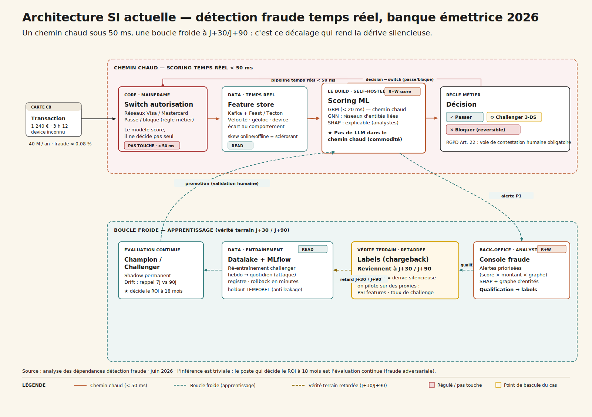
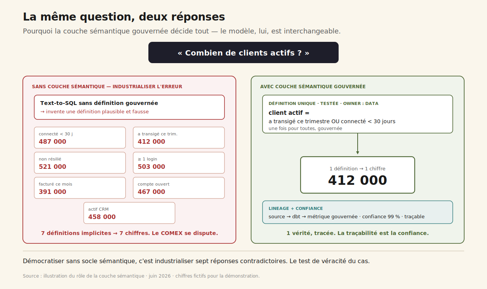
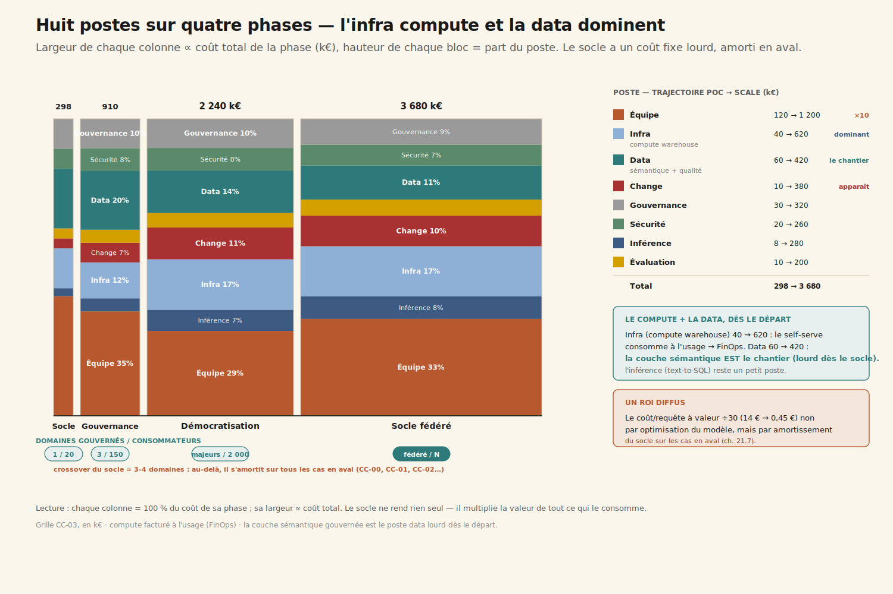
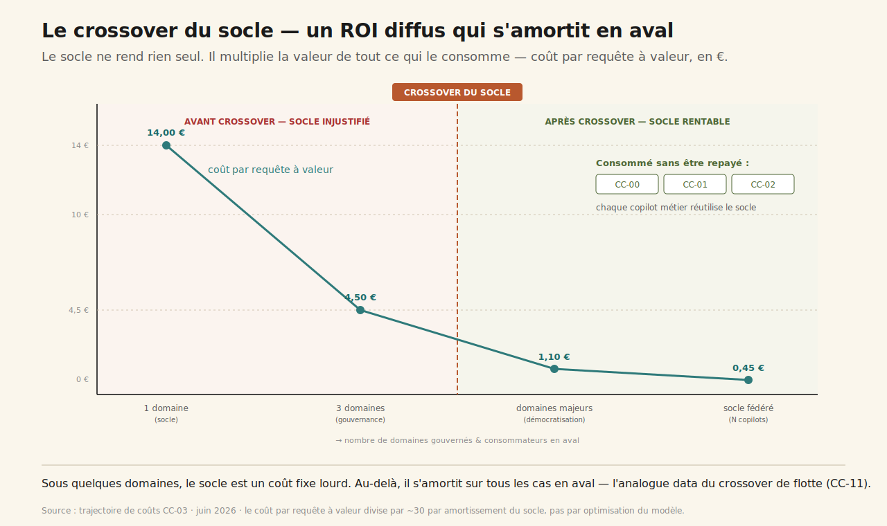

# CC-03 — Plateforme data moderne & analytics agentique

**Transverse · Agentic · charnière (~5 600 mots)**

> On parle d'IA en oubliant le socle data : sans qualité automatisée ni gouvernance d'accès, démocratiser l'analytics agentique, c'est industrialiser l'erreur.

---

## 1. Deux chiffres pour la même question

Comité de direction, revue trimestrielle. Sur le slide stratégique, le *nombre de clients actifs* : **412 000**. Le DG le compare au chiffre que lui a montré la veille un directeur commercial — **487 000** — via un assistant data flambant neuf qui « parle au datawarehouse » en langage naturel. Deux chiffres pour la même notion, à la même date. La salle se fige.

La cause n'est pas l'IA. C'est qu'**« actif » n'a jamais été défini une seule fois quelque part.** Il existe sept définitions implicites, éparpillées dans autant de dashboards — *connecté dans les 30 jours*, *ayant transigé ce trimestre*, *non résilié*, et quatre autres. Le text-to-SQL en a inventé une huitième, plausible et fausse, parce qu'on ne lui avait donné aucune définition à respecter.

Le CDO comprend en direct le vrai sujet : on a voulu **démocratiser l'analytics sans avoir sécurisé le socle**. Pas l'IA — le socle data en dessous. Et le DAF pose la question qui structure tout le cas : *« avant de donner ça à 2 000 personnes, qu'est-ce qui nous garantit que le chiffre est juste ? »*

C'est le cas qui répond directement à un angle mort récurrent : **quand on parle d'IA, on oublie le socle.** Avant de démocratiser l'analytics agentique — text-to-SQL, exploration conversationnelle, dashboards générés, data storytelling — il faut une plateforme data moderne dont la qualité et la gouvernance sont **automatisées et tenues**. La démocratisation des expertises data n'est un actif qu'**à condition de sécuriser le socle**. Sinon, c'est industrialiser l'erreur à l'échelle.

## 2. La carte du socle — et le trou au milieu

Avant le modèle, avant le prompt, il faut regarder la chaîne de la donnée. Et y repérer le trou.

Six couches structurent la plateforme data d'une organisation mid-to-large 2026 :

1. **Les sources** — ERP (SAP), CRM (Salesforce), apps transactionnelles, SaaS métier. Les producteurs de la donnée, hétérogènes, avec leurs propres notions : un *client* SAP n'est pas un *client* CRM. La réconciliation est le travail de fond — et la source des sept définitions divergentes.

2. **L'ingestion** — Fivetran ou Airbyte managé, doublés d'un ETL batch legacy (scripts, Talend). La partie managée est saine ; les scripts legacy sont les angles morts de qualité (pannes silencieuses, retards non détectés) que les agents data quality devront surveiller.

3. **Le warehouse / lakehouse** — Snowflake, BigQuery ou Databricks. Le cœur du socle. Le **compute y est facturé à l'usage** : un text-to-SQL mal cadré lâché sur 2 000 personnes peut faire exploser la facture par full scans et requêtes en boucle. La maîtrise du coût compute est un enjeu de premier rang.

4. **La transformation (dbt) — et la couche sémantique absente.** C'est le **sclérosant** du cas. dbt existe parfois, mais la **couche sémantique** — où *client actif*, *churn*, *marge* sont définis une fois, gouvernés, testés — est le grand trou. Sans elle, le text-to-SQL hallucine une définition plausible. **C'est ici que se gagne ou se perd la démocratisation.**

5. **La BI** — Power BI, Tableau, Looker, et une forêt de 1 800 dashboards dont ~60 % obsolètes, plus les *spreadmarts* Excel. Ces exports recalculés à la main sont le **shadow data** : des chiffres hors gouvernance qui contredisent le warehouse.

6. **La gouvernance** — catalogue (DataHub, Collibra) partiel, lineage, IAM/RBAC, DLP. Le périmètre de sécurité-accès — le **gardien** du cas. Le text-to-SQL hérite des droits de l'utilisateur : un RBAC lâche transforme la démocratisation en exposition à la demande de données sensibles.

Ce que cette carte dit immédiatement :

- **La couche sémantique gouvernée est le prérequis non négociable.** Sans définition unique d'« actif », démocratiser = industrialiser sept réponses contradictoires.
- **Le text-to-SQL hérite des droits.** RBAC et lineage sont la condition d'ouverture, pas une tâche de fin de projet. **Sécuriser avant de démocratiser — jamais l'inverse.**
- **Le compute est facturé à l'usage.** Le coût du socle est un poste de premier rang.
- **Le socle ne « rend » rien directement.** Il multiplie la valeur de tous les cas en aval — un ROI diffus, le piège de mesure du paradoxe agentique appliqué à une fondation.

## 3. Trois sous-usages, trois promesses

L'analytics agentique se range en trois familles — qui sont aussi trois promesses au métier.

### 3.1 Automatiser — la qualité et les ops data

Des agents data quality qui détectent les anomalies (volumétrie, fraîcheur, distribution) **avant** qu'elles ne polluent les tableaux de bord, génèrent et maintiennent les tests dbt, proposent des corrections de pipeline en pull request, documentent automatiquement les tables (owner, définition, lineage) pour résorber la dette de catalogue. Fil du livre : [l'analytics agentique (ch. 16)](../../chapitres/ch16-analytics-agentique-banque.md) et [l'observabilité (ch. 18)](../../chapitres/ch18-observabilite-cognitive-audit-trail.md).

### 3.2 Analyser — le text-to-SQL gouverné et le data storytelling

Une question en langage naturel → un SQL généré **sur la couche sémantique** → un chiffre restitué avec sa définition et son lineage. Puis l'exploration conversationnelle (*« et par région ? »*, *« vs l'an dernier ? »*) sans réécrire de requête, et le dashboard généré avec un récit commenté — hypothèses et limites explicites. Fil du livre : [ch. 16](../../chapitres/ch16-analytics-agentique-banque.md) et les [surfaces agentiques (ch. 14)](../../chapitres/ch14-surfaces-agentiques.md).

### 3.3 Démocratiser — l'accès métier, sous condition

Ouvrir le self-service aux métiers — mais **uniquement sur les domaines dont la couche sémantique est gouvernée**, en appliquant le RBAC (chacun ne voit que ce qu'il a le droit de voir), en traçant chaque réponse pour l'auditabilité. Le périmètre s'élève à mesure que la gouvernance le couvre — jamais avant. Fil du livre : [MCP plateforme (ch. 12)](../../chapitres/ch12-mcp-plateforme.md) et [gouvernance (ch. 23)](../../chapitres/ch23-gouvernance-ai-act.md).

## 4. Quatre niveaux d'autonomie — et le quatrième interdit sur les chiffres officiels

- **L1 Copilote SQL analyste** — suggère du SQL à un analyste qui valide et exécute. Outil de productivité, pas de démocratisation.
- **L2 Text-to-SQL gouverné (lecture)** — restitue un chiffre sur la couche sémantique, avec définition et lineage, dans le périmètre RBAC de l'utilisateur. Activable **après la couche sémantique**.
- **L3 Agent data quality / ops (action validée)** — détecte une anomalie, ouvre une PR dbt de correction, met à jour le catalogue. Chaque action revue par un data engineer.
- **L4 Agent autonome qui publie des chiffres ou modifie les pipelines** — **Interdit** sur les métriques officielles et les pipelines critiques. Un chiffre faux propagé est une décision fausse à l'échelle. Toujours un gate de revue et des tests verts.

La frontière L3/L4 est la même leçon que partout : l'action réversible et validée est le terrain de jeu ; **la publication d'une vérité officielle reste sous main humaine.**

## 5. Anatomie d'une requête — pourquoi la couche sémantique décide tout

Reprenons une question banale : *« quel est notre taux de churn sur le segment PME ce trimestre ? »* Voici ce qui se passe — et où ça dérape sans socle.

**1. Resolve sémantique.** L'agent résout les notions sur la **couche sémantique gouvernée** : définition officielle de *churn*, périmètre *segment PME*, *ce trimestre*.
- `semantic-mcp.resolve_metric(churn)`
- `semantic-mcp.resolve_dimension(segment=PME)`

**Sans cette couche, cette étape hallucine une définition plausible — la racine du chiffre faux.** C'est tout le cas en une ligne.

**2. Check accès (RBAC).** L'agent vérifie que l'utilisateur a le droit de voir le segment PME — `iam-mcp.check_scope(user, dataset)`. Le text-to-SQL hérite de ses droits, pas plus ([ch. 13](../../chapitres/ch13-mcp-securite.md)).

**3. Generate SQL.** Le SQL est généré sur le modèle gouverné, pas sur les tables brutes. La définition gouvernée garantit l'unicité du calcul.

**4. Execute sous garde-fou compute.** Exécution avec limites de scan et cache pour maîtriser le coût facturé à l'usage.

**5. Verify.** Sanity checks : comparaison à l'historique, cohérence d'ordre de grandeur. Si l'écart est suspect → **un drapeau, pas un chiffre faux affirmé** ([ch. 17](../../chapitres/ch17-evaluation-benchmarks.md)).

**6. Answer.** Le chiffre est restitué **avec sa définition gouvernée, son lineage et son niveau de confiance**. La traçabilité *est* la confiance ([ch. 18](../../chapitres/ch18-observabilite-cognitive-audit-trail.md)).

La figure le dit d'un coup d'œil : la même question, sans couche sémantique, donne sept chiffres ; avec une couche sémantique gouvernée, elle en donne un, tracé. **Le modèle de langage est interchangeable ; le socle ne l'est pas.**

## 6. Build, Buy, Hybride — et le faux débat du modèle

Trois options, six critères. Notation `--` → `++`.

| Critère | **Build pur** *Plateforme + agents maison* | **Buy mainstream** *Text-to-SQL natif du warehouse* | **Hybride** *(recommandé)* *Stack managée + socle gouverné maison* |
| --- | :---: | :---: | :---: |
| Sensibilité data | `++` | `0` | `+` |
| Personnalisation | `++` | `-` | `+` |
| Volumétrie | `+` | `++` | `+` |
| Lock-in | `+` | `--` | `0` |
| Time-to-value | `--` | `++` | `+` |
| Souveraineté | `++` | `-` | `0` |
| **Verdict** | *Réinventer une modern data stack mature. Effort démesuré sur des commodités managées.* | *Time-to-value séduisant, mais il hérite de la qualité de ton modèle sémantique : sans socle, le générateur de chiffres faux.* | ***RECOMMANDÉ.** On achète les commodités, on construit ce qui crée la valeur ET le risque : la couche sémantique et le RBAC.* |

Le piège, c'est de croire que la décision est *« quel modèle de text-to-SQL »*. **C'est un faux débat.** Claude, Snowflake Cortex Analyst, Databricks Genie ou Power BI Copilot donneront tous un chiffre **faux** si la couche sémantique n'est pas gouvernée — ils héritent de la qualité du socle. *Garbage in, garbage out* à l'échelle.

La vraie décision n'est pas build/buy du modèle, c'est **l'ordre** : sécuriser le socle — couche sémantique gouvernée + RBAC durci + qualité automatisée — **avant** d'ouvrir la démocratisation. Le warehouse et le text-to-SQL sont des commodités ; la gouvernance des définitions et des accès est l'actif différenciant, et non négociable.

## 7. Les MCP à monter — et le sclérosant qu'on ne peut pas acheter

| Système | Mode | Type MCP | Effort | Risque |
| --- | --- | --- | --- | --- |
| Data warehouse | Read | Officiel / connecteur SQL | 1 sem. | Moyen (garde-fous compute) |
| **Couche sémantique** | **Read** | **Custom — à construire** | **8-12 sem.** | **Haut** |
| Catalogue / lineage | R+W | Officiel / API | 2 sem. | Moyen |
| dbt (transformation + tests) | R+W (proxy) | API dbt + CI | 2 sem. | Moyen (PR gatées) |
| **IAM / RBAC + DLP** | **Read** | **Intégration identité (le gardien)** | **3 sem.** | **Haut** |
| BI | R+W (proxy) | Officiel | 1 sem. | Bas |

**Effort cumulé : 12 à 16 semaines**, dont **60 % sur la couche sémantique gouvernée et le RBAC** — le socle. Les 40 % restants sur la couche agentique. L'ordre est non négociable : socle d'abord, agents ensuite.

La couche sémantique mérite son traitement de faveur. Ce n'est pas un connecteur qu'on achète, c'est un **travail métier long et politique** : asseoir les data owners autour d'une table et trancher, une fois pour toutes, ce qu'est un *client actif*. Huit à douze semaines, et c'est là qu'on découvre, semaine 4, que la finance et le commerce ne comptaient pas les mêmes clients depuis cinq ans — et que personne ne l'avait jamais formalisé.

## 8. Les modèles — interchangeables, par construction

Le réflexe est de chercher le meilleur text-to-SQL. Le cas démontre l'inverse : **le modèle est le maillon interchangeable.**

- **Claude 4.7 Sonnet** pour le text-to-SQL gouverné et le data storytelling : reasoning sur schéma, respect des contraintes de la couche sémantique, tool use MCP natif.
- **Cortex Analyst / Genie**, les text-to-SQL natifs du warehouse, séduisants par leur intégration — mais qui **héritent de la qualité de ton modèle sémantique**, exactement comme les autres.
- **Mistral Large** en option souveraine pour les domaines sensibles (RH, finance, santé).
- **Des embeddings souverains** pour la recherche sémantique dans le catalogue et le matching question ↔ métrique gouvernée.

Le gardien, lui, **n'est pas un modèle** : c'est la vérification systématique (sanity checks, comparaison historique) doublée du RBAC et du lineage. On peut changer de modèle ; on ne peut pas se passer du socle de gouvernance.

## 9. Les huit postes sur quatre phases — l'infra compute qui domine

Grille CC-03, en k€. Deux postes à surveiller : l'infra et la data.

| Poste                            | Socle 4 m | Gouvernance 6 m | Démocratisation 12 m | Socle fédéré 36 m |
| -------------------------------- | --------- | --------------- | -------------------- | ----------------- |
| Inférence                        | 8         | 40              | 160                  | 280               |
| **Infra** *(compute warehouse)*  | **40**    | **110**         | **380**              | **620**           |
| **Équipe**                       | **120**   | **320**         | **640**              | **1 200**         |
| **Data** *(sémantique, qualité)* | **60**    | **180**         | **320**              | **420**           |
| Évaluation                       | 10        | 40              | 110                  | 200               |
| Gouvernance                      | 30        | 90              | 220                  | 320               |
| Sécurité                         | 20        | 70              | 170                  | 260               |
| Change                           | 10        | 60              | 240                  | 380               |
| **Total**                        | **298**   | **910**         | **2 240**            | **3 680**         |
| Coût / requête à valeur          | 14,00 €   | 4,50 €          | 1,10 €               | 0,45 €            |

Lecture transverse :

- **L'infra (compute warehouse) est ici un poste dominant et croissant** (40 → 620 k€) — le self-serve à 2 000 personnes consomme du compute facturé à l'usage. D'où le **FinOps compute** en phase Scale (cache, requêtes gouvernées, limites de scan), et le renvoi à l'[IA frugale (ch. 22)](../../chapitres/ch22-ia-frugale.md).

- **Le poste data est lourd dès le départ** (60 k€ au socle) parce que la modélisation sémantique et la qualité **sont** le chantier. Ce n'est pas une externalité, c'est le cœur.

- **Le coût par requête à valeur divise par ~30** (14 € → 0,45 €) non par optimisation du modèle, mais par **amortissement du socle sur les consommateurs en aval**. C'est le mécanisme central du cas.

- **Le ROI du socle est diffus** : il ne rend rien seul, il multiplie la valeur de tout ce qui le consomme. Paradoxe agentique sur une fondation ([ch. 21.7](../../chapitres/ch21-roi-paradoxe-agentique.md)).

Le **crossover du socle** : sous ~3-4 domaines gouvernés et quelques centaines de consommateurs, le socle est un coût fixe lourd qui ne se justifie pas. Au-delà, il s'amortit sur le nombre de cas et de copilots métiers qui le réutilisent **sans le repayer** — chaque copilot bancaire (CC-01), chaque agent vocal (CC-02) consomme ce socle. C'est l'analogue data du crossover de flotte (CC-11).

## 10. Gouvernance — le RGPD avant l'AI Act, et le gardien d'accès

**Ligne AI Act** : l'analytics interne relève généralement du **risque minimal**. L'enjeu réglementaire dominant **n'est pas l'AI Act** mais le **RGPD** : le text-to-SQL peut exposer des données personnelles si le RBAC est lâche. Vigilance haut-risque seulement si les sorties alimentent des décisions sur des personnes (RH, crédit — cf. CC-01).

Le cœur de la gouvernance, c'est donc le **gardien d'accès** :

- **RBAC durci avant ouverture** : le text-to-SQL n'expose jamais plus que les droits réels de l'utilisateur.
- **Lineage de bout en bout** : chaque chiffre traçable à sa source et sa définition.
- **DLP** sur les domaines sensibles.
- **Gouvernance des définitions** : une métrique = un owner = une définition testée.
- **Garde-fous compute** : pas de full scan en self-serve non maîtrisé.

Le RACI place le **Data Steward** et la **sécurité** au premier rang, et un **comité de gouvernance des métriques** mensuel arbitre les définitions, les owners et les paliers d'ouverture. L'opposant légitime, ici, n'est pas la conformité au sens AI Act — c'est le **gardien des accès et de la vérité des chiffres**.

## 11. Évaluer un analytics agentique — un chiffre faux est pire que pas de chiffre

Quatre temps, avec une métrique bloquante singulière.

**1. Régression suite.** 200 questions-or à réponse connue par domaine gouverné, plus 50 questions-pièges : notions ambiguës, hors-périmètre RBAC, données absentes. On teste l'exactitude **et** le refus propre quand c'est hors droits.

**2. Métriques en ligne.** Le critère bloquant : **l'exactitude des chiffres** (> 98 % sur les domaines gouvernés). Plus le temps d'obtention d'un chiffre fiable (−50 %) et le coût compute par requête (FinOps).

**3. Détection de dérive.** Agents data quality (anomalies, fraîcheur), comparaison historique des chiffres restitués, monitoring du compute, et — signal clé — **le taux de retour aux spreadmarts** : si les métiers reprennent leurs exports Excel, c'est un signal de défiance.

**4. Boucle de correction.** Pas un cycle ML — le modèle est managé. L'itération porte sur **la couche sémantique et le RBAC**. Et le rollback est radical : **on referme un domaine au self-serve** si le taux d'exactitude passe sous le seuil. On préfère refermer que de laisser circuler des chiffres faux.

C'est la règle d'or de l'évaluation analytics : **un dashboard faux est pire que pas de dashboard** — il fait prendre une mauvaise décision, avec confiance.

## 12. ROI — le socle qui multiplie sans jamais rendre seul

Axe principal : **Bien-être** (démocratisation, temps analyste gagné). Secondaires : Qualité, Coût. Méthode : Cigref Hard/Soft + TEI Forrester + arbre [ch. 21.6](../../chapitres/ch21-roi-paradoxe-agentique.md), **avec l'honnêteté que le socle a un ROI diffus.**

| Métrique | Borne basse | Cible | Borne haute | Catégorie |
| --- | --- | --- | --- | --- |
| `doc-search-time` | −30 % | **−50 %** | −65 % | Soft |
| `processing-time` | −20 % | **−40 %** | −55 % | Hard |
| `prediction-reliability` | 95 % | **98 %** | 99,5 % | Mixed |
| `tco-infrastructure` | compute stable | **compute maîtrisé** | −20 % | Hard |

> **KPI gardien : `prediction-reliability`** — la fiabilité des chiffres restitués est la condition de tout. Si l'exactitude passe sous 98 % sur un domaine, **on le referme au self-serve.** C'est le déclencheur le plus dur du cas, et le plus salutaire.

**Non retenues** : `revenue` (le socle ne génère pas de CA directement — il multiplie la valeur des cas en aval ; le promettre serait malhonnête), `conversion-rate` (attribution impossible), `system-availability` (suivi en SRE, pas en ROI primaire).

## 13. L'équipe, la vélocité, les sclérosants

**7,1 ETP** pour le socle, avec deux postes load-bearing :

| Rôle | ETP | Profil cible |
| --- | --- | --- |
| Data Platform Lead | 1,0 | Architecte modern data stack, MCP, vision socle |
| **Analytics Engineer (sémantique)** | 1,5 | **LOAD-BEARING** — modélise les métriques gouvernées, le vrai chantier |
| Data Quality Engineer | 1,0 | Agents data quality, tests dbt, anomalies |
| ML / Agent Engineer | 1,0 | Text-to-SQL gouverné, eval exactitude, garde-fous compute |
| **Data Steward / Gouvernance** | 1,0 | **LOAD-BEARING** — owners de métriques, RBAC, lineage (le gardien) |
| Référent sécurité / RBAC | 0,5 | Droits hérités, DLP, domaines sensibles |
| Product Owner data | 0,8 | Priorise les domaines à gouverner |
| DPO référent | 0,3 | RGPD, données perso via text-to-SQL |

En prod, 7 ETP de cœur — puis **le socle est consommé (mutualisé) par les équipes copilots métiers** : son coût se répartit sur les cas en aval.

**Quatre sclérosants** :
- La **couche sémantique** : un travail métier long et politique — 60 % de l'effort, toute la valeur.
- Le **RBAC / les droits hérités** : des années d'accès trop larges à reprendre avant d'ouvrir.
- Le **compute facturé à l'usage** : sans garde-fous, le self-serve fait exploser la facture warehouse.
- La **défiance / les spreadmarts** : tant que les métiers ne font pas confiance au chiffre gouverné, ils retournent à Excel. La confiance se gagne par la traçabilité, pas par décret.

**Deadlines** : RGPD en continu (le RBAC durci avant ouverture), revue FinOps compute trimestrielle, et un **gate de gouvernance avant chaque ouverture de domaine** — démocratiser un domaine non gouverné, c'est garantir des chiffres faux à l'échelle.

## 14. Le débat — démocratiser maintenant, ou sécuriser d'abord ?

**Pour démocratiser vite** : 45 % du temps analyste part dans des requêtes triviales que le self-serve gouverné absorbe ; une vérité unique par métrique met fin aux débats de COMEX ; les agents data quality détectent les anomalies avant publication.

**Contre la démocratisation prématurée** : sans couche sémantique, chaque métier obtient un chiffre différent et la confiance s'effondre — l'inverse de l'objectif ; sans RBAC durci, le text-to-SQL expose à la demande des données sensibles ; le compute non gouverné fait exploser la facture.

**Verdict pondéré** : GO mais **socle d'abord** — couche sémantique gouvernée + RBAC durci + qualité automatisée **avant** toute démocratisation. Ouverture par paliers, chaque domaine ouvert seulement quand il est gouverné. KPI gardien = exactitude des chiffres : on referme un domaine plutôt que de laisser circuler du faux.

## 15. Trois choix qu'il faut faire

### 15.1 Le DG veut le self-service pour 2 000 personnes dans 3 mois

*Vous êtes le CDO.*

**A. Vous l'ouvrez à tous tout de suite.** En trois mois, chaque direction a son chiffre, les COMEX deviennent des disputes de définitions, un commercial cite un churn faux à un client. *Le piège de la démocratisation prématurée ([ch. 21.7](../../chapitres/ch21-roi-paradoxe-agentique.md)).*

**B. Vous refusez tant que tout n'est pas parfait.** Vous attendez un socle complet sur tous les domaines — 18 mois — pendant que les métiers retournent aux spreadmarts. *Le perfectionnisme tue l'adoption.*

**C. Vous ouvrez par paliers, domaine par domaine gouverné.** Vous gouvernez d'abord le commerce, l'ouvrez, prouvez la confiance, enchaînez. *La bonne réponse ([ch. 21.6](../../chapitres/ch21-roi-paradoxe-agentique.md)) : on démocratise du fiable, pas du faux.*

### 15.2 Le text-to-SQL va hériter des droits. Avant d'ouvrir, vous…

**A. Vous ouvrez avec les droits existants.** Les accès historiques sont trop larges ; le premier jour, un métier obtient des données RH qu'il n'aurait jamais dû voir. *Antipattern ([ch. 13](../../chapitres/ch13-mcp-securite.md)).*

**B. Vous durcissez le RBAC et tracez le lineage avant.** Le text-to-SQL n'expose jamais plus que les droits réels. *La bonne réponse ([ch. 13](../../chapitres/ch13-mcp-securite.md)) : sécuriser l'accès est la condition d'ouverture.*

**C. Vous comptez sur la DLP après coup.** La DLP est un filet, pas un mur ; les données ont déjà circulé avant l'alerte. *Faux confort.*

### 15.3 Un agent renvoie un chiffre incohérent avec l'historique

**A. Afficher le chiffre quand même.** Le métier décide dessus ; l'incohérence n'est découverte qu'après. *Un chiffre faux affirmé avec confiance est le pire résultat ([ch. 17](../../chapitres/ch17-evaluation-benchmarks.md)).*

**B. Lever un drapeau d'incertitude.** L'agent signale l'écart, propose de vérifier plutôt que d'affirmer. *La bonne réponse ([ch. 17](../../chapitres/ch17-evaluation-benchmarks.md)) : la vérification est le cœur de l'éval analytics.*

**C. Bloquer tout le domaine.** Sur-réaction sur un cas isolé : le drapeau ciblé vaut mieux que la fermeture sur un faux positif.

## 16. Quiz

**Q1.** Pourquoi déployer un text-to-SQL sans couche sémantique gouvernée est-il dangereux ?
- Parce que le modèle coûte trop cher
- **Parce que, sans définition unique et gouvernée des métriques, l'agent invente une définition plausible — chaque métier obtient un chiffre différent et on industrialise l'erreur à l'échelle** ✓
- Parce que l'AI Act l'interdit
- Parce que le SQL est trop lent

*La valeur du text-to-SQL est conditionnée à la maturité de la couche sémantique. Sans elle, l'agent hallucine une définition fausse (ch.16, ch.21.7).*

**Q2.** Pourquoi le RBAC est-il une condition d'ouverture, pas une tâche de fin de projet ?
- Parce que c'est exigé par le contrat de licence
- **Parce que le text-to-SQL hérite des droits de l'utilisateur : un RBAC lâche transforme la démocratisation en exposition à la demande de données sensibles** ✓
- Parce que le RBAC accélère les requêtes
- Parce qu'il réduit le coût compute

*L'agent rend visible en deux secondes ce que des années de partages trop larges laissaient dormir (ch.13).*

**Q3.** Pourquoi dit-on que le socle data a un ROI « diffus » ?
- Parce qu'il ne sert à rien
- **Parce qu'il ne génère pas de valeur directement : il multiplie la valeur de tous les cas en aval — le poste qui décide de tout est le plus dur à attribuer** ✓
- Parce que le ROI est négatif
- Parce qu'il est facturé à l'usage

*Comme l'assistant transverse (CC-00), le socle est un multiplicateur, pas un générateur direct (ch.21.7).*

## 17. Verdict — le socle d'abord, jamais l'inverse

**GO_SOCLE_DATA_AVANT_DEMOCRATISATION** — GO en hybride, mais le socle (sémantique + accès + qualité) **avant** la démocratisation.

Six conditions :

1. **Couche sémantique gouvernée** : une métrique = un owner = une définition testée, avant d'ouvrir un domaine.
2. **RBAC durci + lineage avant ouverture** : le text-to-SQL n'expose jamais plus que les droits de l'utilisateur.
3. **Qualité automatisée** : agents data quality + vérification — un chiffre faux est drapeauté, pas affirmé.
4. **Démocratisation par paliers** : chaque domaine ouvert seulement quand il est gouverné.
5. **KPI gardien = exactitude des chiffres** (> 98 %) : on referme un domaine plutôt que de laisser circuler du faux.
6. **FinOps compute** : garde-fous pour que le self-serve ne fasse pas exploser la facture warehouse.

Aux conditions remplies, le socle data devient le **pivot de l'arc** : sans lui, ni l'assistant transverse (CC-00) ni les copilots métiers (CC-01, CC-02) ne tiennent — chacun consomme cette fondation. Et il introduit la condition de gouvernance — **sécuriser avant de démocratiser** — que le cas-chapeau (CC-11) généralisera à la flotte tout entière.

---

## Renvois livre

- **[Ch. 7 — Boucle agent (text-to-SQL : resolve → generate → verify)](../../chapitres/ch07-boucle-agentique.md)**
- **[Ch. 12 — MCP plateforme (le socle data)](../../chapitres/ch12-mcp-plateforme.md)**
- **[Ch. 13 — Sécurité MCP (RBAC, droits hérités, le gardien d'accès)](../../chapitres/ch13-mcp-securite.md)**
- **[Ch. 14 — Surfaces agentiques (data storytelling)](../../chapitres/ch14-surfaces-agentiques.md)**
- **[Ch. 16 — Analytics agentique (text-to-SQL, couche sémantique)](../../chapitres/ch16-analytics-agentique-banque.md)**
- **[Ch. 17 — Évaluation agent (exactitude SQL, drapeau d'incertitude)](../../chapitres/ch17-evaluation-benchmarks.md)**
- **[Ch. 18 — Audit trail cognitif (lineage = confiance)](../../chapitres/ch18-observabilite-cognitive-audit-trail.md)**
- **[Ch. 21.5 — Hard vs Soft (ROI diffus du socle)](../../chapitres/ch21-roi-paradoxe-agentique.md)**
- **[Ch. 21.6 — Arbre de décision méthode ROI](../../chapitres/ch21-roi-paradoxe-agentique.md)**
- **[Ch. 21.7 — Paradoxe agentique (le socle, le poste qui décide de tout)](../../chapitres/ch21-roi-paradoxe-agentique.md)**
- **[Ch. 22 — IA frugale (FinOps compute warehouse)](../../chapitres/ch22-ia-frugale.md)**
- **[Ch. 23 — Gouvernance (RGPD, gouvernance des métriques)](../../chapitres/ch23-gouvernance-ai-act.md)**

---

*Format co-écrit avec l'aide d'une IA. Données et calibrage : analyse Mathieu Guglielmino · juin 2026.*
