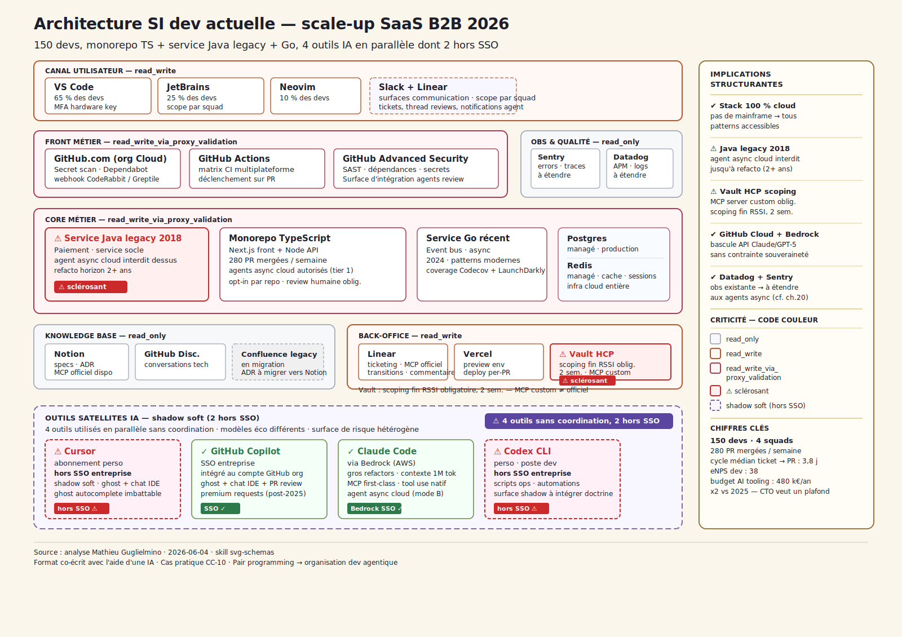
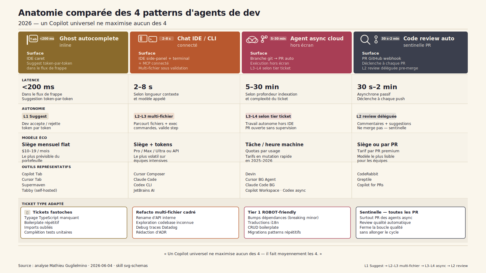
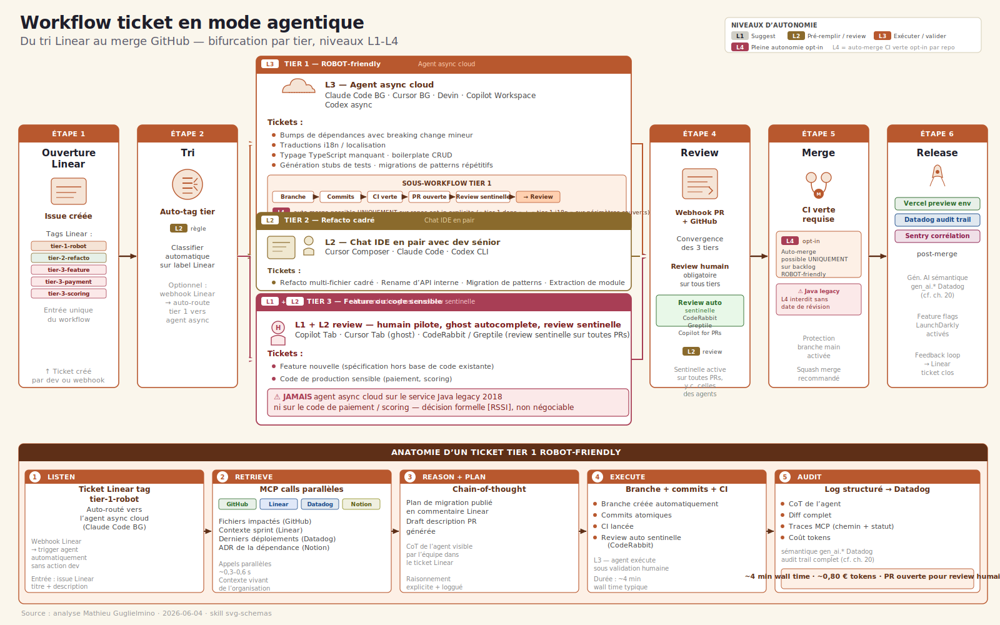
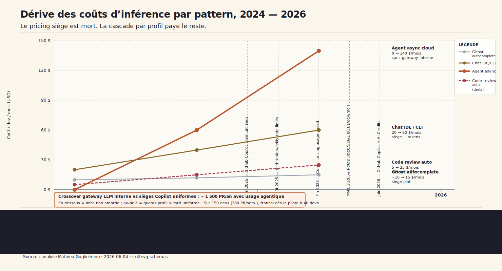

# CC-10 — Pair programming → organisation dev agentique

**Développement logiciel · Agentic · charnière (~7 000 mots) · pôle profond/maîtrisé de la Strate 1 Fondations, complémentaire de CC-00 (pôle horizontal) et CC-03 (socle data)**

> Appliquer la boucle agentique au plus bas niveau — résoudre une issue, clôturer une PR, déléguer la review, jusqu'à la sécurité — sur de vraies fondations (MCP, observabilité) valide l'architecture avant de la remonter aux métiers. Mais l'« all-you-can-eat » Copilot est mort : le bon arbitrage 2026 n'est plus un outil unique imposé à toute l'équipe, c'est un portefeuille **par profil de ticket × profil de dev**, distribué via une gateway LLM avec quotas.

---

## 1. « Quatre outils au standup »

Mardi 9 h. Le [CTO] ouvre le tableau de bord finance avant le standup — ==la ligne « AI tooling » a doublé en six mois==, de 240 k€ annualisés à 480 k€. Pas de projet nouveau, pas de recrutement : la même équipe de 150 devs consomme deux fois plus. Il n'a pas encore d'explication.

Au standup, quatre devs prennent successivement la parole pour décrire leur journée de la veille. Le premier utilise Cursor en abonnement personnel — il l'a souscrit lui-même, remboursement partiel via note de frais. Le deuxième est sur GitHub Copilot via le SSO entreprise, plan Business, les 300 premium requests mensuelles sont épuisées depuis le 20 du mois. Le troisième a basculé sur Claude Code via Bedrock pour les gros refactors multi-fichier sur le monorepo TypeScript — latence acceptable, context window confortable sur les 80 000 lignes du périmètre. Le quatrième, du côté ops, écrit ses scripts en Codex CLI depuis son terminal macOS, hors de tout périmètre SSO. Quatre outils, quatre contrats, quatre surfaces de support. Aucune coordination.

Le matin même, GitHub a envoyé un mail annonçant l'évolution du modèle de facturation : fin du quota fixe de 300 premium requests en juin 2026, passage aux AI Credits ($0,01 par crédit, ~1 900 crédits/mois sur Business)[^1]. En filigrane — et c'est là que la réunion commence à peser — le retex public d'Uber qui a brûlé son budget IA coding en quatre mois circule sur les channels Slack inter-CTO depuis la semaine précédente[^2]. Pas d'attribution précise dans la conversation, juste la conscience collective que quelque chose a changé dans l'économie des outils dev depuis le début de l'année.

La [VP_ENG] veut une doctrine. Le [CFO] veut un plafond. Le [CTO] doit arbitrer entre les deux en moins de 90 jours — la présentation du budget AI tooling au COMEX est programmée pour septembre.

La tension est simple à formuler, difficile à résoudre : *un seul outil ou un portefeuille ?* L'argument pour l'outil unique est la gouvernance — un contrat, un SSO, un support. L'argument contre est la réalité du terrain — les quatre devs du standup utilisent des outils différents parce qu'aucun outil unique ne répond à l'ensemble de leurs cas d'usage. Ghost autocomplete pour rester dans le flux, chat IDE multi-fichier pour les refactors, agent async cloud pour les tickets tier 1 qu'on peut déléguer sans supervision, review automatique en sentinelle sur les PRs. Quatre patterns structurellement différents : surfaces, latences, niveaux d'autonomie, modèles économiques. Un Copilot universel laisse 30 % de vélocité sur la table sur les patterns chat IDE et async cloud — selon les données DORA, c'est précisément là que se concentre l'effet ROI des outils dev sur les profils sénior.

Mais le [CTO] ne peut pas non plus laisser quatre outils coexister sans règle. Le mois prochain, ce sera peut-être huit. Les deux devs qui utilisent Cursor et Codex CLI en dehors du SSO ne sont pas des rebelles — ils ont trouvé ce qui fonctionne pour eux. Mais leurs tokens sortent du périmètre de visibilité du [RSSI], leurs usages ne sont pas dans les logs Datadog, et leur cost center n'est pas dans le tableau de bord finance que le [CTO] vient d'ouvrir. ==Ce shadow soft n'est pas à chasser — c'est à intégrer dans une doctrine== qui rende la voie structurée plus simple que la voie individuelle. C'est exactement la leçon de CC-00 sur l'amnistie shadow, transposée à la strate dev.

La question centrale n'est donc pas « quel outil » — c'est « quel portefeuille, avec quels quotas, pour quels profils, à quel prix défendable au COMEX ».

---

## 2. La stack dev actuelle — la carte que tout le monde croit avoir

Avant l'arbitrage, ce qui est *déjà là*. Une scale-up SaaS B2B de 150 devs dispose d'une infrastructure dev solide, 100 % cloud, sans héritage mainframe. C'est une force — tous les patterns agentiques sont techniquement accessibles dès le premier jour. Mais la carte réelle est plus nuancée que ce que le tableau de bord finance laisse voir.

**Le poste de travail** est le premier angle mort. 65 % des devs sont sur VS Code, 25 % sur JetBrains, 10 % sur Neovim. Ce n'est pas une anecdote — les outils IA ne s'intègrent pas de la même façon selon l'IDE. Cursor est une fork de VS Code ; Claude Code et Codex CLI sont des CLI universels ; GitHub Copilot couvre les trois mais sans parité de fonctionnalités sur les agents. L'uniformisation par l'IDE n'est pas un chemin réaliste sans migration coûteuse.

**Le cœur du système** est structuré autour du monorepo TypeScript (front Next.js + Node API) et de deux services satellites. Le service Go récent (event bus) est propre, bien testé, sans dette. ==Le service Java legacy 2018 est le sclérosant== : c'est le service de paiement, écrit il y a huit ans, couverture de tests insuffisante, sans refacto prévu avant 2028. Tout agent async cloud qui ouvre une PR sur ce service sans supervision humaine est un risque opérationnel que le [RSSI] a formellement refusé. Ce n'est pas négociable — et c'est le bon choix. La borne d'autonomie des agents doit être calquée sur la qualité réelle du code cible, pas sur la confiance théorique dans les modèles.

**L'outillage opérationnel** est mature : GitHub Cloud + Actions + Advanced Security, Linear, Datadog APM + Sentry, Codecov, LaunchDarkly. Datadog et Sentry constituent déjà une infra d'observation qu'on peut étendre aux agents async sans repartir de zéro — c'est un avantage structurant par rapport à une organisation qui devrait tout instrumenter (renvoi [ch. 20](../../chapitres/ch20-observabilite-cognitive-audit-trail.md)).

**La base de connaissances** est en migration : Notion héberge les specs et les ADR, GitHub Discussions complète le technique. Confluence legacy est en migration vers Notion — le corpus ADR est partiellement structuré, suffisant pour un premier MCP Notion en lecture.

**Le gestionnaire de secrets** Vault HCP est scopé par squad — bonne pratique de sécurité qui devient un sclérosant projet : câbler un MCP server Vault lisible par les agents async demande un scoping fin, un masquage des secrets dans les logs et un audit trail validé par le [RSSI]. Deux semaines incompressibles, pas de raccourci.

**L'angle mort central** : les quatre outils IA déjà actifs — Cursor (perso), Copilot (SSO), Claude Code via Bedrock, Codex CLI (perso) — coexistent sans doctrine. Deux d'entre eux sont hors SSO, hors périmètre d'audit, hors visibilité du tableau de bord finance. Ce ne sont pas des outils malveillants — ce sont des outils que des devs ont adoptés parce qu'ils répondaient à un besoin réel que le portefeuille officiel ne couvrait pas. La doctrine à construire doit partir de cette réalité, pas la nier.

Les implications structurantes de cette carte sont au nombre de cinq :

- Stack 100 % cloud, pas de mainframe → tous les patterns techniquement accessibles dès le POC.
- Service Java legacy 2018 = **sclérosant** → agent async cloud interdit dessus jusqu'à refacto (horizon 2+ ans).
- Vault HCP scopé par squad → MCP server Vault possible mais **scoping fin obligatoire avec le [RSSI]** (deux semaines incompressibles).
- GitHub Cloud + Bedrock disponibles → bascule API privée Claude/GPT-5 sans contrainte souveraineté (un avantage différentiel vs CC-01 en environnement bancaire régulé).
- Quatre outils IA dont deux hors SSO → **shadow soft à intégrer dans la doctrine**, pas à chasser — cf. leçon amnistie CC-00[^3].

Mais l'arbitrage n'est pas un choix d'outil — c'est un choix de portefeuille.

---

## 3. Quatre patterns d'agents de dev — pourquoi pas un seul

On dit *AI dev tooling* comme si c'était un marché homogène. En réalité c'est quatre patterns structurellement différents qui partagent peu : surface d'intégration, latence cible, niveau d'autonomie, modèle économique. Le confondre, c'est s'exposer à un Copilot universel qui fait moyennement les quatre et laisse 30 % de vélocité sur la table — précisément là où se concentre l'effet ROI selon les données DORA sur les profils sénior. Avant l'arbitrage portefeuille, il faut avoir la carte. Elle tient en quatre lignes :

- **Ghost autocomplete inline** — suggestion token-par-token dans le caret IDE, latence <200 ms, autonomie L1 Suggest, siège mensuel flat.
- **Chat IDE / CLI assistant connecté** — side-panel + terminal + MCP, latence 2–8 s, autonomie L2–L3 multi-fichier sous validation humaine, siège + tokens.
- **Agent async cloud** — branch git → PR auto hors écran, latence 5–30 min, autonomie L3–L4 selon tier ticket, facturation à la tâche ou à l'heure machine.
- **Code review automatique** — webhook PR GitHub, latence 30 s à 2 min, autonomie L2 review déléguée pre-merge, siège ou tarif par PR.

### 3.1 Pattern ghost autocomplete inline

Surface d'intégration : le caret IDE. Latence cible : <200 ms — en dessous de ce seuil, la suggestion s'insère dans le flux cognitif du dev ; au-dessus, il a déjà tapé la suite. Niveau d'autonomie : L1 Suggest, le dev accepte ou rejette token par token. Modèle économique : siège mensuel flat de $10 à $19, le plus prévisible du portefeuille.

Outils représentatifs : ==Copilot Tab==, ==Cursor Tab==, ==Supermaven==, ==Tabby== (self-hosted, option souveraineté intéressante pour une scale-up sous contrainte RSSI).

Tickets cibles : les « fastoches » — typage TypeScript manquant, boilerplate répétitif, imports oubliés, gestion d'erreur basique, complétion de tests unitaires sur patterns connus. Sur ce segment, la vélocité est réelle et mesurable dès les premières semaines.

Où ça échoue : refacto multi-fichier (le ghost ne voit pas la codebase complète), exploration architecturale (pas de context window large), décisions de design (pas de reasoning). Utiliser un ghost autocomplete pour un ticket tier 2 refacto, c'est inefficace dans les deux sens — l'outil ne voit pas assez, et le dev passe plus de temps à accepter des suggestions partielles qu'à refactorer directement.

### 3.2 Pattern chat IDE / CLI assistant connecté

Surface d'intégration : IDE side-panel (Cursor Composer), terminal (Claude Code, Codex CLI), ou les deux via MCP. Latence : 2–8 s selon la longueur du contexte et le modèle. Niveau d'autonomie : L2–L3 — l'agent peut parcourir plusieurs fichiers, exécuter des commandes, proposer des diffs ; le dev valide step by step. Modèle économique : siège + tokens (abonnements Pro/Max/Ultra) ou API pure via Bedrock — le plus volatil à prévoir pour des équipes intensives.

Outils représentatifs : ==Cursor Composer==, ==Claude Code==, ==Codex CLI==, ==JetBrains AI Assistant==.

Tickets cibles : refacto multi-fichier cadré (rename d'API interne, migration de patterns, extraction de module), exploration de codebase inconnue, debug sur traces Datadog, rédaction d'ADR. C'est là que se jouent les 30 % de vélocité sénior documentés par DORA[^4] — le chat IDE avec context window large + MCP natif est le pattern qui change le plus la nature du travail de développement, pas le ghost autocomplete.

Où ça échoue : tickets fastoches (la latence est disproportionnée — inutile d'appeler Claude Code pour compléter un import), tâches asynchrones longue durée (pas conçu pour l'exécution en arrière-plan pendant que le dev travaille sur autre chose).

### 3.3 Pattern agent async cloud

Surface d'intégration : une branche git créée automatiquement, une PR ouverte sans que le dev soit devant son écran. L'agent travaille de manière autonome — hors IDE, hors terminal. Latence : 5 à 30 min selon la complexité du ticket et la profondeur de l'indexation de la codebase. Niveau d'autonomie : L3–L4 selon le tier du ticket. Modèle économique : le plus volatile du marché — Devin lancé début 2024 sur un modèle horaire machine[^5], ==Cursor Background Agent== en accès anticipé dès juin 2025[^6], ==Claude Code background==, ==Copilot Workspace==, ==Codex async== — les tarifs et les modèles changent vite.

Tickets cibles : exactement ce que le tiering de §4 appelle « tier 1 » — bumps de dépendances avec breaking change mineur, traductions i18n, boilerplate CRUD, migrations de patterns répétitifs, génération de stubs de tests. Ce sont des tickets dont la structure est prévisible, les risques bornés, la couverture de tests suffisante pour qu'une CI verte soit un signal fiable.

Où ça échoue : feature nouvelle (ambiguïté sur le comportement attendu, l'agent hallucine les specs), code prod sensible non testé (le Java legacy 2018 de §2 est le contre-exemple parfait), tickets ambigus (l'agent ouvre une PR qui répond à une interprétation du ticket, pas forcément à l'intention du dev). ==Sur le service de paiement Java legacy, pas d'agent async, jamais.==

### 3.4 Pattern code review automatique

Surface d'intégration : webhook sur événement PR GitHub — l'outil est déclenché à chaque ouverture ou mise à jour de PR, sans action dev. Latence : 30 s à 2 min, ce qui en fait le seul pattern asynchrone passif du portefeuille. Niveau d'autonomie : L2 review déléguée pre-merge — l'outil laisse des commentaires, suggère des corrections, mais ne merge pas. Modèle économique : siège mensuel ou tarif par PR premium.

Outils représentatifs : ==CodeRabbit==, ==Greptile==, ==Copilot for PRs==.

Tickets cibles : la sentinelle sur *toutes* les PR, y compris — surtout — celles ouvertes par les agents async cloud. Une PR ouverte par ==Cursor Background Agent== sans review automatique en sentinelle, c'est une PR dont la qualité n'est vue que par un humain au moment de la validation finale. La combinaison agent async + review automatique ferme la boucle qualité sans allonger le cycle.

Où ça échoue : décisions architecturales nuancées (l'outil voit le diff, pas le contexte de design sur 18 mois), contexte métier non documenté dans la codebase (le Java legacy 2018 avec couverture insuffisante produit des faux positifs sur les suggestions de refacto). Le code review automatique est une sentinelle, pas un architecte.

### Conclusion du §3

Un Copilot universel qui couvre les quatre patterns ne maximise aucun d'eux — il fait moyennement les quatre. C'est pourquoi le verdict CC-10 porte sur un **portefeuille distribué par profil de ticket × profil de dev**, pas sur le choix d'un outil. La section suivante fixe la mécanique : comment le ticket lui-même, dès son entrée dans Linear, décide quel pattern est activé.

---

## 4. Le workflow ticket — du tri Linear au merge GitHub

Avant de choisir un outil, on choisit un tier. Le ticket entre dans Linear, passe par un tag automatique (ou manuel, selon la maturité du processus), et bifurque selon son niveau de risque. Trois tiers, trois bifurcations, trois patterns préférés. Ce n'est pas une règle d'or gravée dans le marbre — c'est une doctrine opérationnelle que l'équipe peut ajuster par repo et par squad, avec une règle d'exception explicite : L4 (auto-merge CI verte sans validation humaine) est cap par opt-in explicite, par repo, pas comme comportement par défaut.

### 4.1 Tier 1 trivial → agent async cloud

Tags Linear : `tier-1-robot`, `tier-1-deps`, `tier-1-i18n`.

Le ticket tier 1 est trivial au sens de *bornabilité* : la structure est prévisible, les tests couvrent le périmètre, la CI est le signal de qualité. Dès le tag, le ticket est routé automatiquement vers l'agent async cloud — ==Claude Code background==, ==Cursor Background Agent== ou ==Devin== selon l'outillage en place. L'agent clone le repo, crée une branche, effectue les modifications, lance la CI, ouvre une PR avec une description générée, et déclenche automatiquement le code review en sentinelle (==CodeRabbit== ou équivalent).

Niveau d'autonomie : L3 — l'agent ouvre la PR, la CI est lancée, mais **la validation humaine reste obligatoire** avant merge, sauf exception explicite. Le passage à L4 (auto-merge sur CI verte) est possible uniquement sur des repos dont l'équipe a explicitement activé l'option — et uniquement pour les tags `tier-1-deps` et `tier-1-i18n` sur des services périphériques bien couverts. Sur le service Java legacy 2018, L4 est interdit sans date de révision. Sur le service de paiement, L3 est lui-même sujet à discussion avec le [RSSI].

L'intérêt est le déchargement cognitif du sénior : il n'a pas à *faire* le bump de 12 dépendances avec breaking change mineur, il a à *valider* la PR que l'agent a ouverte. Ce n'est pas la même charge mentale.

### 4.2 Tier 2 refacto cadré → chat IDE en pair

Tags Linear : `tier-2-refacto`, `tier-2-rename-api`.

Le ticket tier 2 a une structure plus ouverte : la finalité est claire (renommer une API interne, extraire un module, migrer un pattern), mais les implications multi-fichier demandent un jugement continu. C'est le territoire du chat IDE en pair avec un dev sénior.

Le dev sénior ouvre ==Cursor Composer== ou ==Claude Code== en mode interactif, charge le contexte pertinent de la codebase (fichiers liés, ADR Notion via MCP, historique Linear du ticket), et avance step by step avec l'agent. L'agent propose le plan de refacto, le dev valide ou corrige chaque étape. Niveau d'autonomie : L2 — l'agent est en boucle courte sous validation humaine continue.

Ce pattern est le plus transformateur sur les profils sénior et staff : la refacto multi-fichier qui prenait une journée tient souvent en deux à trois heures avec un context window large et les MCP servers Notion + GitHub actifs. C'est là que se joue l'effet DORA documenté sur les time-to-merge. La [STAFF_ENG_DX] pilote typiquement ce tiering avec les deux ou trois séniors les plus à l'aise en chat IDE.

### 4.3 Tier 3 feature ou code sensible → human-led

Tags Linear : `tier-3-feature`, `tier-3-payment` (= service Java legacy de paiement), `tier-3-scoring`.

Le ticket tier 3 est human-led, sans exception. Deux raisons :

La première est fonctionnelle : une feature nouvelle est, par définition, non spécifiée dans la codebase. L'agent n'a pas de signal fort sur le comportement attendu — il hallucine les specs à partir du contexte. Le coût de correction d'une hallucination architecturale dépasse largement le coût du dev humain.

La seconde est opérationnelle : le service Java legacy 2018 et le code de scoring portent un risque opérationnel que le [RSSI] a évalué comme non délégable à un agent sans supervision continue. Ce n'est pas une opinion — c'est une décision formelle.

En tier 3, le dev humain pilote. Le ghost autocomplete L1 (==Copilot Tab== ou ==Cursor Tab==) reste actif pour le confort d'édition. Le code review automatique en sentinelle tourne sur toutes les PRs, comme sur les autres tiers. Mais l'agent async cloud n'est jamais activé, et le chat IDE est en mode assistance légère (questions ponctuelles, pas de pilotage du plan). **JAMAIS d'agent async sur le service Java legacy 2018 ni sur le code de paiement / scoring** — c'est la borne d'autonomie que §2 a posée et que le workflow opérationnalise.

### Encart pédagogique — anatomie d'un ticket tier 1 ROBOT-friendly

> **Anatomie d'un ticket tier 1.** Bump deps avec breaking change mineur sur 12 fichiers du monorepo TypeScript. **Listen** : ticket Linear taggé `tier-1-robot` auto-routé vers l'agent async cloud. **Retrieve** : MCP calls parallèles GitHub (liste des fichiers impactés) + Linear (description du ticket + contexte sprint) + Datadog (derniers déploiements du périmètre) + Notion (ADR de la dépendance). **Reason + Plan** : chain-of-thought de l'agent, plan de migration publié en commentaire Linear + draft description de PR. **Execute** : branche créée, commits atomiques, CI lancée, review automatique ==CodeRabbit== déclenchée en sentinelle. **Audit** : log structuré (CoT de l'agent + diff complet + traces MCP + coût tokens) → audit trail Datadog avec sémantique `gen_ai.*` (cf. [ch. 20](../../chapitres/ch20-observabilite-cognitive-audit-trail.md))[^7]. ~4 min wall time, ~0,80 € de tokens, PR ouverte pour review humaine obligatoire.

Ce pattern est la brique de base de l'organisation dev agentique. Une fois le tier 1 fluide, l'équipe peut progressivement étendre la doctrine — davantage de repos opt-in pour L4, plus de tickets `tier-1-*` correctement taggés dès l'entrée dans Linear. La dette de triage (tickets mal taggés, tier 2 traités en tier 1) est le principal frein opérationnel des premières semaines : c'est un problème de process, pas de technologie.

---

## 5. Les huit MCP servers qui font la différence

Sans MCP servers internes, l'agent est aveugle au contexte de l'organisation. Il peut générer du code syntaxiquement correct, mais il ne sait pas que la dépendance qu'il bumpe touche le service de paiement Java legacy, que le ticket Linear a été redéfini il y a deux heures, ni que le dernier déploiement en production a provoqué une régression Sentry toujours ouverte. La vraie question n'est pas *quel agent acheter* — c'est *quels outils internes brancher en premier*. Le MCP server est la couture entre l'agent et le contexte vivant de l'organisation. Sans lui, l'agent async cloud travaille dans le vide ; avec lui, il travaille comme un membre crédible de l'équipe.

| Système | Mode | Type MCP | Effort | Risque |
|---|---|---|---|---|
| ==GitHub== | read_write | officiel | 2 j | bas |
| ==Linear== | read_write | officiel | 1 j | bas |
| ==Datadog== | read | officiel | 3 j | bas |
| ==Sentry== | read | officiel | 2 j | bas |
| **==Vault HCP==** | read_only_scope | **custom obligatoire** | **2 sem.** | **haut** |
| ==Notion== | read | officiel | 3 j | bas |
| ==Codecov== | read | custom (API REST) | 1 sem. | bas |
| ==LaunchDarkly== | read | officiel | 3 j | moyen |

Cinq des huit systèmes ont un MCP officiel prêt à l'emploi. Deux demandent un développement custom — ==Vault HCP== et ==Codecov==. La distinction est importante : un MCP officiel, c'est un connecteur maintenu par l'éditeur, documenté, avec une politique de scoping claire. Un MCP custom, c'est du code interne, maintenu par l'équipe, qui expose une API REST ou SDK comme serveur MCP. Le risque n'est pas le même.

### 5.1 Le sclérosant Vault HCP

==Vault HCP== est le **sclérosant du projet** : c'est lui qui détermine si les agents async peuvent accéder aux credentials de l'organisation de façon sécurisée, ou s'ils travaillent aveuglément avec des variables d'environnement en clair dans les logs.

Pourquoi « custom obligatoire » : le MCP officiel Vault n'existe pas à date — la surface d'API Vault HCP est riche, et les usages légitimes pour un agent dev sont très restreints (lire une secret par chemin, lire les metadata d'un chemin, jamais lister les chemins de production). Un MCP générique exposerait trop. Le MCP custom doit implémenter un **scoping par squad** (un agent ne peut lire que les secrets déclarés dans le périmètre de son squad), un **masquage systématique des valeurs dans les logs** (les traces MCP ne doivent jamais contenir de valeur de secret en clair — seulement le chemin et le statut de lecture), et un **audit trail structuré** validé par le [RSSI] (qui a lu quoi, quand, depuis quel agent, avec quel contexte de ticket).

L'effort est de deux semaines incompressibles — une pour le développement du MCP server, une pour le scoping et la validation avec le [RSSI]. Il faut impérativement un profil backend ou SRE sénior : ce n'est pas un problème de code (le code est simple), c'est un problème de modèle de sécurité. Sans ce scoping fin, le risque de leakage est réel[^8] : un agent qui résume un incident dans Slack peut — sans le vouloir — inclure dans son résumé une valeur de secret qu'il a lue dans un log Datadog lors de l'étape Retrieve. Renvoi [ch. 16](../../chapitres/ch16-mcp-securite.md).

### 5.2 Le risque LaunchDarkly

==LaunchDarkly== est le seul MCP officiel classé « risque moyen ». Pas parce que le MCP est mal conçu — il est bien documenté, bien scopé en lecture. Mais parce que le périmètre de **ce que l'agent peut faire logiquement** à partir d'une lecture des flags est dangereux sans garde-fou.

Concrètement : un agent async qui inspecte les flags LaunchDarkly pour comprendre le contexte d'une feature peut, dans un ticket tier 2, proposer une modification du code qui présuppose qu'un flag doit être activé en production. Si le dev valide sans lire le plan attentivement, un toggle de flag prod devient implicite dans la PR. Le risque n'est pas le MCP lui-même — c'est l'interprétation de l'agent. La mitigation est opérationnelle : ==LaunchDarkly== est câblé en lecture stricte, et la doctrine pose qu'**aucun ticket ne peut inclure un toggle de flag prod sans un ticket Linear dédié avec validation humaine explicite**. Le code review automatique (==CodeRabbit==) est configuré pour détecter les modifications de constantes de flag et les signaler comme revue manuelle obligatoire. C'est un pattern de garde-fou éditorial, pas technologique.

### 5.3 Effort total et calendrier

5 à 6 semaines pour un backend / SRE sénior à plein temps — réparti en trois phases :

**Semaines 1-2 — La fondation fast** : ==GitHub== (2 j), ==Linear== (1 j), ==Datadog== (3 j), ==Sentry== (2 j). Ces quatre MCP sont officiels, bien documentés, à faible risque. Ils constituent la couche minimale viable : l'agent async peut dès lors lire le contexte du ticket, l'état du repo, les alertes et erreurs récentes. Sans ces quatre, le mode B tier 1 est impossible.

**Semaines 3-4 — Le sclérosant Vault** : deux semaines dédiées au MCP custom Vault HCP + validation [RSSI]. Intentionnellement placé en milieu de période pour ne pas bloquer le POC — les semaines 1-2 suffisent pour valider le pattern agent avec les quatre MCP fast. Vault est le prérequis pour le passage en pilote : sans scoping des secrets, le [RSSI] n'autorisera pas les agents async sur du code proche de la production.

**Semaines 5-6 — La couche contextuelle** : ==Notion== (3 j, ADR + specs), ==Codecov== (1 sem., détection régression coverage), ==LaunchDarkly== (3 j, lecture flags avec garde-fous). Ces trois MCP enrichissent le contexte de l'agent sans être bloquants au démarrage.

L'organisation qui voudrait comprimer à 3 semaines en parallélisant le Vault avec les MCP fast se trompera de priorité : le scoping Vault demande des itérations avec le [RSSI] qui ne se parallélisent pas bien. La chronologie suggérée est séquentielle intentionnellement.

Pour une vue d'ensemble sur l'architecture MCP à l'échelle de l'organisation : [ch. 15](../../chapitres/ch15-mcp-plateforme.md). Pour la politique de scoping fin et l'audit des appels MCP côté sécurité : [ch. 16](../../chapitres/ch16-mcp-securite.md).

---

## 6. Les modèles — cascade par pattern, pas modèle unique

Le débat « quel modèle pour les agents de dev » rate la cible. Il présuppose qu'il faut choisir *un* modèle, le déployer pour toute l'équipe, et mesurer le résultat agrégé. C'est exactement l'erreur du Copilot universel transposée au niveau du modèle. ==Opus== en boucle sur tous les tickets coûte cinq fois plus cher que ==Sonnet== pour des résultats marginalement meilleurs sur les tickets tier 1. ==Haiku== sur un gros refactor multi-fichier produit un résultat médiocre malgré sa latence enviable. Le bon arbitrage en 2026 est une **cascade par pattern** : le modèle est choisi en fonction de la nature de la tâche, pas du fait qu'il est « le meilleur » en absolu.

### 6.1 Cascade par pattern

**Ghost (mode A inline)** : ==Claude Haiku== ou ==Cursor cursor-small== natif selon l'IDE. La contrainte est la latence : en dessous de 200 ms, la suggestion s'intègre dans le flux cognitif ; au-dessus, le dev a déjà tapé la suite et la suggestion devient une interruption. ==Haiku== est le seul modèle Claude qui tient cet objectif en usage résidentiel ; ==cursor-small== est encore plus rapide parce qu'il est hébergé en colocalisation avec le client. Sur ce pattern, le raisonnement n'est pas le facteur limitant — c'est la vitesse.

**Chat IDE (mode A multi-fichier)** : ==Claude Sonnet== par défaut. C'est le sweet spot de la gamme pour le contexte étendu, le tool use natif et le MCP first-class. Escalade manuelle vers ==Opus== pour les gros refactors (> 5 000 lignes touchées, migration de framework, analyse architecturale complexe) — escalade *à la main* par le dev, pas automatique. Le dev sénior qui décide d'appeler ==Opus== pour une refacto importante le sait et l'assume ; le coût est visible dans son quota. Ce n'est pas une règle de restriction, c'est une règle de conscience.

**Agent async (mode B tier 1)** : ==Claude Sonnet== comme modèle de travail. Fallback réflexif vers ==Opus== si le plan échoue deux fois de suite sur le même ticket — l'agent escalade automatiquement, mais avec un **cap budget par ticket** : le coût total d'un ticket tier 1 est plafonné à 1,50 $ d'inférence (Sonnet ou Opus confondus). Si le cap est atteint sans PR ouverte, le ticket revient en queue humaine. Ce plafond n'est pas arbitraire : un ticket tier 1 bumps deps qui coûte 3 $ d'inférence signale soit un ticket mal taggé (tier 2 déguisé en tier 1), soit un agent qui tourne en boucle — dans les deux cas, l'escalade humaine est la bonne réponse.

**Code review auto (mode C)** : ==Claude Sonnet== exclusivement via ==CodeRabbit== ou ==Greptile==. ==Opus== n'est pas utilisé en code review — le coût par PR serait insoutenable à l'échelle de 280 PRs par semaine. La revue automatique est une sentinelle, pas un architecte : elle détecte les régressions de typage, les patterns interdits, les conventions monorepo non respectées, les tests manquants sur les surfaces modifiées. Elle ne prend pas de décision architecturale. ==Sonnet== est largement suffisant pour ce périmètre.

### 6.2 L'argument cascade

Deux « tweet tests » que le [CTO] doit pouvoir passer lors du COMEX :

*« Et si Anthropic est down ? »* — la cascade modèle prévoit un fallback ==Codestral== self-hosted sur les agents async tier 1. Ce n'est pas une migration complète : le mode B tier 1 continue de tourner en mode dégradé sur un modèle de code open-source compétent sur les tickets structurels (bumps deps, traductions i18n). Le mode A chat IDE se met en pause ou bascule sur un fallback API Bedrock (GPT-5 ou Mistral Large), selon la configuration de la gateway. L'agent async est conçu pour être résilient au fournisseur de modèle, pas pour en dépendre.

*« Et si Anthropic remonte ses tarifs de 50 % ? »* — le passage par ==Bedrock== résidence EU est prévu dans l'architecture de la gateway dès le POC[^9]. Ce n'est pas un plan B d'urgence — c'est une contrainte de conception. La gateway LLM interne route les appels vers l'endpoint Bedrock EU par défaut pour les agents async, ce qui donne deux bénéfices simultanés : souveraineté partielle des données (résidence EU) et protection partielle contre une hausse tarifaire unilatérale (les tarifs Bedrock suivent un contrat AWS, pas la grille publique Anthropic). Si une hausse intervient, le [CTO] peut migrer vers un modèle alternatif sur Bedrock (Mistral Large, Llama 4 fine-tuné code) sans changer l'architecture de la gateway.

L'autonomie modèle se construit avant d'en avoir besoin. Une organisation qui attend la crise tarifaire pour construire sa cascade aura besoin de trois mois de migration sous pression — ce que la doctrine trimestrielle vise précisément à éviter. Renvoi [ch. 5](../../chapitres/ch05-economie-inference.md) (LLMflation, économie de l'inférence).

### 6.3 Anti-tokenmaxxing

Le ==tokenmaxxing==[^10] n'est pas un comportement utilisateur déviant — c'est la conséquence prévisible d'un pricing siège all-you-can-eat. Si le contrat dit « illimité » et que la performance est évaluée (même implicitement) sur le volume de tickets traités, les devs les plus productifs *et* les plus coûteux maximiseront naturellement leur consommation. C'est ce qui s'est passé chez Uber, chez Meta, chez Shopify en 2025-2026 — et c'est ce qui a poussé Anthropic, Cursor et GitHub à renoncer l'un après l'autre au modèle illimité.

La cascade modèle est la réponse architecturale à ce problème. ==Opus== est borné par deux caps simultanés : un **cap par ticket** (1,50 $ pour un ticket tier 1, affiché dans la description de la PR générée) et un **cap par session dev** (30 $/dev/jour en phase prod, paramétrable par squad dans la gateway). Ces deux caps ne sont pas des pénalités — ce sont des signaux. Un dev qui dépasse son cap journalier régulièrement a soit un usage qui correspond à son profil (power user qui mérite un quota plus élevé), soit un agent mal cadré qui tourne en boucle (qui mérite une révision de la doctrine de tiering). La gateway LLM interne expose ces métriques dans un dashboard Datadog : quota utilisé / quota alloué par profil, distribution des coûts par pattern, tickets où le cap a été atteint.

Cette section préfigure la section §10 sur la dérive des coûts, où les courbes d'inférence × 35 entre POC et Scale imposent de mettre la gateway au centre de l'architecture dès le POC — pas comme optimisation future, mais comme condition d'existence du programme.

---

## 7. Pourquoi — vélocité, qualité, soutenabilité

Trois enjeux, pas un. La tentation est d'argumenter la vélocité seule — les chiffres sont séduisants, les benchmarks disponibles, le [CTO] est sensible à la promesse de throughput. Mais sans l'ancrage qualité, on optimise Goodhart. Et sans la soutenabilité économique, les deux premiers s'effondrent dès le premier budget review. Les trois enjeux se tiennent ensemble — retirer le troisième, c'est construire un récit COMEX qui ne tient pas jusqu'en Q1 2027.

### Enjeu 1 — Vélocité

Sur les équipes early-adopters en Q1 2026 qui ont déployé ==Sonnet== + ==Claude Code== sur le pattern chat IDE + agent async, les données DORA pointent vers −40 % sur le cycle médian ticket→PR sur les tickets tier 1[^11]. Le throughput équipe monte en parallèle de +25 % mesuré en PR mergées par semaine — pas par dev isolé, mais comme vitesse de flux de l'équipe complète. GitHub Octoverse 2026 affine la distribution : sur les équipes de 50 à 200 devs avec adoption du pattern agent async, 38 % des PRs fusionnées en mars 2026 incluent une contribution agentique significative, montant à 67 % pour les profils sénior. Ce n'est plus un phénomène marginal — c'est un changement de régime dans la nature du travail de développement.

### Enjeu 2 — Qualité

Le vrai test du pattern agent n'est pas la vélocité — ==c'est la stabilité du taux de bug post-release à throughput augmenté==. Si la qualité dérive quand le volume monte, on a optimisé la mauvaise chose : cost-per-line, throughput pur, comptage de PR. Les équipes qui ont vu leur `post-release-bug-rate` monter en même temps que leur throughput ont en général un tier 1 trop large (des tickets tier 2 déguisés en tier 1), une CI insuffisante, ou un tiering qui laisse l'agent travailler sur du code insuffisamment couvert. L'objectif du KPI gardien `post-release-bug-rate` (cible : stable ≤ 3 %, alerte : > 5 %) est précisément de détecter cette dérive avant qu'elle devienne un argument contre le programme au COMEX. Un throughput qui monte avec un bug rate stable, c'est un argument COMEX. Un throughput qui monte avec un bug rate qui monte aussi, c'est un désastre en différé.

### Enjeu 3 — Soutenabilité économique

Le poste inférence doit rester borné à 30 % du budget AI tooling total. Au-delà, la dérive devient non finançable lors de la revue CFO de Q1 2027 — et c'est précisément la dynamique que le retex Uber illustre : un budget AI tooling qui double en six mois sans récit ROI consolidé ne survit pas au premier budget review sous pression. La gateway LLM interne avec quotas par profil est la seule réponse architecturale qui rend cette borne tenable à l'échelle — pas comme contrainte ajoutée après coup, mais comme condition de conception dès le POC. Renvoi [ch. 23.5](../../chapitres/ch23-roi-paradoxe-agentique.md).

> **Bench.** DORA *State of DevOps* 2025 + GitHub Octoverse 2026 — % PR avec assistance agentique par taille d'équipe et par profil dev, corrélé aux métriques four-keys.

---

## 8. Build, Buy, Hybride — l'arbitrage porte sur le portefeuille

L'arbitrage build/buy classique — « construit-on l'outil ou l'achète-t-on ? » — ne s'applique pas ici. Personne ne propose sérieusement de construire un Cursor ou un Claude Code maison. La question n'est pas « quel outil », c'est « quel mix, avec quelle doctrine de distribution, à quel prix défendable au COMEX ». Trois régimes, six critères.

| Critère | Build pur | Buy uniforme | **Buy comparatif par profil** |
|---|:-:|:-:|:-:|
| Sensibilité data | `++` | `-` | `+` |
| Personnalisation | `++` | `-` | `+` |
| Volumétrie | `+` | `++` | `+` |
| Lock-in | `+` | `--` | `0` |
| Time-to-value | `--` | `++` | `+` |
| Souveraineté | `++` | `--` | `0` |
| **Verdict** | *Non — pas le métier d'une scale-up* | *Antipattern — perd 30 % de vélocité* | ***RECOMMANDÉ*** |

### 8.1 Pourquoi le build pur est non

Construire une plateforme d'agents de dev maison — orchestrateur, LLM hébergé, UI, intégrations IDE — n'est pas le métier d'une scale-up SaaS B2B. L'effort réaliste est de 18 mois minimum, avec une équipe plateforme dédiée qui ne produit aucun effet visible sur le throughput dev pendant toute la durée. En sortie, on livre une version 1 d'un outil que les éditeurs du marché (Anthropic, Cursor, GitHub) font évoluer toutes les six semaines avec des équipes de centaines d'ingénieurs. Le retard structurel sur l'état de l'art est acquis dès le premier jour. Renvoi [ch. 22](../../chapitres/ch22-runtime-manage.md).

### 8.2 Pourquoi le buy uniforme est antipattern

Trois arguments, sans ordre de priorité :

D'abord, chaque pattern a sa surface, sa latence et son ROI propres (cf. §3). Un outil ghost autocomplete et un agent async cloud sont structurellement différents — les confondre dans un contrat unique, c'est payer le prix de l'un pour des résultats médiocres de l'autre. Un Copilot universel laisse 30 % de vélocité sur la table précisément là où se concentre l'effet DORA sur les profils sénior.

Ensuite, le pricing siège unique explose sur les power users qui ==tokenmaxxent==. C'est le mécanisme documenté chez Uber, Meta et Shopify en 2025-2026 : un abonnement « illimité » avec un leaderboard interne de productivité produit mécaniquement des consommations à 500–2 000 $/dev/mois sur les profils les plus productifs. Ce n'est pas un bug — c'est la conséquence prévisible d'un modèle all-you-can-eat sur des équipes dont la performance est mesurée au throughput.

Enfin, le service Java legacy 2018 interdit techniquement le pattern « one-size-fits-all » : le sclérosant ne tolère pas les agents async sans supervision humaine, ce qui veut dire que même si on achetait un outil uniforme avec toutes les fonctionnalités, on serait obligé de tierer manuellement les permissions par service et par profil. Autant construire la doctrine dès le départ plutôt que de la recoller sur un contrat uniforme.

### 8.3 Buy comparatif par profil — le portefeuille distribué

Le régime recommandé est un mix opérationnel : ghost universel (==Copilot Tab== ou ==Cursor Tab==, siège flat) + chat IDE par profil sénior (==Claude Code== ou ==Cursor Composer==, usage via Bedrock) + agent async cloud pour les tickets tier 1 ROBOT-friendly + code review automatique en sentinelle (==CodeRabbit== ou ==Greptile==, webhook sur toutes les PRs, y compris celles des agents).

La distribution de ce portefeuille passe par une ==gateway LLM interne== avec quotas par profil de dev : les séniors et staff ont accès au chat IDE multi-fichier et à l'agent async cloud, les juniors ont le ghost universel et un accès chat IDE encadré, les power users identifiés ont des quotas plus élevés instruits trimestriellement. La gateway expose les métriques dans Datadog — quota utilisé/alloué par profil, distribution des coûts par pattern, tickets où le cap a été atteint. Elle préfigure les sections §10 et §11 sur la dérive des coûts et l'architecture de contrôle.

Le crossover économique qui justifie la gateway interne vs les sièges Copilot uniformes se situe à ≈ 1 500 PR/an avec usage agentique : en dessous, le coût de la gateway (infra + ETP de maintien) n'est pas encore amorti ; au-delà, la distribution fine des quotas par profil bat le tarif uniforme. Sur 150 devs avec 280 PR/semaine, ce crossover est franchi dès le pilote à 40 devs. Renvoi [ch. 23.6](../../chapitres/ch23-roi-paradoxe-agentique.md) (arbre de décision build/buy agentique).

Reste à chiffrer ce mix sur 4 phases et 8 postes.

---

## 9. Les huit postes — quand l'inférence dérive

La trajectoire de coûts sur 4 phases n'est pas une courbe lisse. C'est une succession de décrochages : un poste qui dépasse les autres, un plafond qu'on pensait tenir et qui cède. Pour comprendre pourquoi le [CTO] doit défendre un budget AI tooling au COMEX en septembre, il faut regarder la grille en entier — et identifier précisément où ça dérive, et pourquoi [ch. 23.7][^12].

| Poste (k€) | POC 2 m | Pilote 6 m | Prod 12 m | Scale 36 m |
|---|---:|---:|---:|---:|
| **Inférence** | 18 | 95 | 320 | **620** |
| Infra | 6 | 22 | 60 | 110 |
| **Équipe** | **60** | **180** | **360** | **720** |
| Data | 4 | 18 | 35 | 55 |
| Évaluation | 3 | 25 | 80 | 160 |
| Gouvernance | 4 | 18 | 50 | 110 |
| Sécurité | 6 | 22 | 55 | 105 |
| **Change** | 5 | 35 | 110 | 220 |
| **Total** | 106 | 415 | 1 070 | 2 100 |
| Coût par PR (≈) | 7,60 € | 4,80 € | 3,10 € | **2,30 €** |

Trois lectures transverses, dans l'ordre d'importance pour le pilotage :

- **L'inférence est multipliée par 35 entre POC et Scale** (18 k€ → 620 k€), contre ×12 pour l'équipe et ×44 pour le change en multiplicateur brut. Ce n'est pas un hasard : chaque étape ajoute des patterns d'usage plus consommateurs — on passe du ghost inline (quelques tokens par complétion) au chat IDE multi-fichier (context window large, plusieurs allers-retours), puis à l'agent async cloud (boucles Opus avec tool calls, long context, re-prompts en cas d'échec). Le paradoxe agentique appliqué au dev est ici précis : à l'échelle du ticket individuel, le gain de vélocité est réel ; à l'échelle de l'organisation, le coût d'inférence devient le poste le plus difficile à piloter sans instrumentation.

- **Le coût par PR divise par ~3** (7,60 € → 2,30 €), ce qui semble aller dans le bon sens. Mais c'est l'==inférence qui absorberait tout sans gateway interne== : le crossover à ≈ 1 500 PR/an avec usage agentique est le pivot financier du programme. En dessous, le coût de la gateway (infra + ETP de maintien) n'est pas amorti ; au-delà, les quotas distribués par profil font que le coût par PR tient sa trajectoire. Sans gateway, les power users qui ==tokenmaxxent== sur les patterns async Opus font déraper le coût moyen — et c'est exactement ce qui s'est produit chez Uber, Meta et Shopify en 2025-2026.

- **Le poste change est le plus dérivant en multiplicateur** (×44, soit 5 k€ → 220 k€) parce que la doctrine n'est jamais stable. Le pricing des outils du marché a bougé chaque trimestre depuis mi-2025 : Anthropic weekly rate limits en août 2025, Cursor auto/background en juin 2025, GitHub Copilot premium requests en juin 2025 puis AI Credits en juin 2026. Chaque changement de pricing entraîne une mise à jour de la doctrine (quotas, tiering, communication interne, formation). Un cycle annuel de révision de doctrine ne suffit pas — il faut un cycle trimestriel, et le poste change doit le financer.

Mais l'inférence ne dérive pas par hasard. Et le tableau qu'on vient de poser suppose que les sièges Copilot tiennent leur promesse. En 2026, ils ne la tiennent plus.

---

## 10. Dérive des coûts : tokenmaxxing, Uber, fin de l'all-you-can-eat

Ce n'est pas une dérive lente. En moins de douze mois, trois événements distincts ont enterré le modèle économique du siège illimité pour les outils de coding IA. Les organisations qui ont posé leur doctrine sur ce modèle en 2024 doivent la reposer en 2026 — et celles qui tardent finissent comme Uber.

### 10.1 Le tokenmaxxing : quand Anthropic et Cursor plafonnent

Le ==tokenmaxxing== désigne la saturation délibérée du quota disponible par sessions intensives : Opus en boucle, context window maximale, tool calls en cascade, agents background tournant 24 h sur 24[^10]. La construction morphologique est empruntée au slang Gen Z (comme *looksmaxxing* ou *sleepmaxxing* — optimisation extrême d'un paramètre), mais le phénomène est industriel : Shopify a construit le premier leaderboard interne de consommation de tokens documenté publiquement fin 2025 ; des programmes équivalents (parfois cités sous le terme « Claudeonomics » dans la sphère tech/VC) ont été rapportés chez plusieurs hyperscalers début 2026, sans publication formelle confirmant les chiffres ou la nomenclature exacte.

Le signal est clair : quand on mesure la productivité en tokens, les power users optimisent les tokens. Le coût devient disproportionné par rapport au résultat — et les éditeurs réagissent.

**Anthropic** annonce le 28 juillet 2025 l'introduction de ==weekly rate limits== sur les plans Pro et Max, effectives le 28 août 2025. Périmètre : les plans Pro ($20/mois) et Max ($100 et $200/mois), avec des quotas hebdomadaires exprimés en heures d'équivalent Sonnet 4 (40–80 h pour Pro, 140–480 h pour Max selon le niveau). Anthropic estime que « less than 5% of subscribers » sont impactés d'après l'usage observé — mais ce sont précisément les 5 % les plus productifs, ceux dont les équipes développent un avantage concurrentiel mesurable. L'échappatoire officiel : acheter du crédit supplémentaire aux tarifs API standard — c'est-à-dire sortir du modèle forfaitaire[^13].

**Cursor** ajuste son pricing Auto/Background en juin 2025, abandonnant les request caps fixes pour un modèle usage-based (crédit = coût API) : le plan Pro ($20/mois) passe de ~500 fast requests à $20 de crédits API, soit environ 225 requêtes premium avant overage. Le backlash communautaire est immédiat — les forums Cursor débordent de calculs montrant que l'usage réel d'agents background dépasse largement l'allocation. Cursor publie une excuse publique le 4 juillet 2025 et rembourse les surcoûts entre le 16 juin et le 4 juillet[^14].

Le schéma est identique dans les deux cas : **les power users coûtent disproportionnément sur un modèle siège, le modèle ne peut pas tenir**.

### 10.2 Le retex Uber : quatre mois pour brûler le budget annuel

Le cas le plus médiatisé de 2026 n'est pas une fuite de données ni un incident de sécurité. C'est une histoire de tokens.

Entre décembre 2025 et mars 2026 — quatre mois — Uber épuise l'intégralité de son budget 2026 pour les outils de coding IA. L'outil au cœur du dépassement est ==Claude Code== (et non GitHub Copilot Enterprise, contrairement à ce que la rumeur inter-CTO du début de §1 laissait entendre)[^2]. L'adoption passe de 32 % à 84 % des ~5 000 ingénieurs d'Uber pendant cette période. Le coût mensuel par ingénieur : entre **500 $ et 2 000 $**, une fourchette dont l'écart dit tout sur la dispersion des usages.

Le déclencheur documenté est un leaderboard interne classant les équipes par consommation totale d'outils IA. Uber a copié Shopify et Meta : mesurer la productivité en tokens. Le résultat est prévisible, et il s'est produit.

Le COO Andrew Macdonald, lors de la conférence du 25 mai 2026, résume le problème dans une formule qui circule depuis sur tous les channels FinOps IA : « That link is not there yet » — il n'existe pas de lien traçable entre la dépense tokens et les livrables effectivement livrés. On a la consommation, on n'a pas l'attribution.

**Le retex Uber n'est pas une exception.** C'est le cas le plus médiatisé d'un mouvement de fond : plusieurs grandes organisations ayant déployé des outils de coding IA à grande échelle ont documenté des dépassements budgétaires significatifs en 2025-2026, avec des profils similaires — adoption rapide, leaderboard interne, absence de gateway scopée, déconnexion tokens/livrables. La source Fortune (26 mai 2026) est la plus précise sur les chiffres Uber ; les autres cas circulent dans les réseaux FinOps sans publication formelle.

### 10.3 GitHub Copilot premium requests : fin de l'illimité

Avant juin 2025, un abonnement Copilot Business ou Enterprise était structurellement illimité sur les modèles standard. Ce n'est plus le cas.

Depuis le **18 juin 2025** (GitHub.com ; 1er août 2025 pour GHE.com), les abonnés Copilot Business disposent de **300 premium requests incluses par utilisateur/mois** ; Enterprise de **1 000**. Au-delà : **0,04 $ par requête**. La variable critique est le multiplicateur par modèle : une requête Claude Sonnet = **5 premium requests consommées** ; une requête GPT-4.5 = 20×. Une équipe qui travaille avec des agents sur Claude Sonnet épuise ses 300 requêtes Business en quelques jours ouvrés — là où elle en avait un quota de facto illimité le mois précédent[^15].

GitHub supprime les budgets à $0 (le mécanisme qui permettait de bloquer l'overage) pour tous les comptes créés avant le 22 août 2025, à compter du 2 décembre 2025. Plus d'échappatoire sans re-configurer manuellement le plafond de facturation.

La transition n'est pas terminée. GitHub annonce le **27 avril 2026** le passage aux ==AI Credits== (token-based, $0,01/crédit), effectif au **1er juin 2026** : Business inclut ~1 900 crédits/utilisateur/mois, Enterprise ~3 900. C'est la confirmation formelle que **le pricing siège est mort**. Le siège Copilot, qui était un forfait « illimité » il y a dix-huit mois, est désormais un abonnement + tokens à la consommation, avec les mêmes mécaniques d'overage que l'API directe.

Ce n'est pas un bug GitHub. C'est l'ensemble de l'industrie qui s'aligne sur la réalité économique de l'inférence LLM.

### La conclusion du cycle

Le modèle ==all-you-can-eat== est mort. Ce que les éditeurs ont offert en 2023-2024 pour accélérer l'adoption — prix de lancement, quotas généreux, forfaits « illimités » — a rencontré le tokenmaxxing, et les deux ne peuvent pas coexister durablement.

La **gateway LLM interne** (introduite en §8.3 comme mécanisme de distribution du portefeuille) refait surface ici comme garde-fou financier : tokens scopés par profil dev + quotas distribués par pattern (ghost / chat IDE / async / review) + journalisation dans Datadog + plafond par ticket. C'est la seule architecture qui permet de tenir la courbe d'inférence de la table §9 — 620 k€ à scale, mais maîtrisé et attributable. **Sans gateway, le coût d'inférence n'est plus maîtrisable au-delà de quelques dizaines de devs power users**, et le COMEX se retrouve dans la position d'Andrew Macdonald : des dépenses sans attribution.

---

## 11. Gouvernance — RACI plat, doctrine trimestrielle

Le RACI du programme dev agentique doit rester plat. Un comité de pilotage stratifié ralentit sans protéger — et dans un domaine où le pricing des outils change tous les trimestres, la doctrine doit pouvoir être mise à jour plus vite que les sprints.

| Rôle | Acteur |
|---|---|
| Responsable (R) | [STAFF_ENG_DX] (1,5 ETP cible en Prod) + [VP_ENG] |
| Approbateur (A) | [CTO] (sponsor) |
| Consultés (C) | [CFO] (budget AI tooling), [RSSI] (scoping MCP + agents async sur code prod), [DPO] (PII dans les logs Datadog) |
| Informés (I) | Tech leads par squad, COMEX (trimestriel) |

Ce n'est pas un RACI permanent — c'est un RACI révisé à chaque cycle trimestriel. La raison est arithmétique : Anthropic a changé ses weekly limits en juillet 2025, Cursor ses crédits Background en juin 2025, GitHub ses premium requests en juin 2025 puis ses AI Credits en juin 2026. Une doctrine figée à 12 mois n'a pas survécu à une seule de ces transitions.

**Cadence de revue.** Mensuelle pour le comité Dev Practice : KPI usage + coût + qualité, avec le dashboard Datadog ouvert. Continue pour les alertes : dépassements de quota ticket, dépassements de quota dev, taux de re-prompt anormal. Annuelle pour l'audit externe : revue par pair CTO inter-entreprise (type DX community), qui permet de calibrer la doctrine contre le terrain d'autres organisations sans attendre les publications DORA.

**AI Act.** ==Hors haut-risque par défaut== pour le code interne non-décisionnel — les agents async qui bumpt des dépendances ou génèrent des stubs de tests ne sont pas des systèmes IA listés à l'Annexe III. **À documenter formellement** dès qu'un agent async accède à du code de scoring, à des données RH ou à des PII utilisateur final. Dans ce cas, un registre interne des agents + une charte explicite agents async sur code de prod s'imposent. Renvois [ch. 25](../../chapitres/ch25-gouvernance-ai-act.md) (gouvernance AI Act, registre agents) et [ch. 26](../../chapitres/ch26-ia-et-travail.md) (IA et travail, équité sénior/junior).

Reste à mesurer ce qu'on construit — l'éval n'est pas une checklist, c'est la boucle qui valide ou invalide la doctrine trimestrielle.

---

## 12. Évaluation — régression + online + dérive

Trois axes d'évaluation qui se complètent sans se substituer : une suite de régression hors-ligne pour la stabilité, des métriques online en prod pour la vélocité et la qualité, une détection de dérive continue pour attraper ce que les deux premiers ratent.

### Axe 1 — Régression suite

==SWE-bench Live== en run mensuel, ==golden set interne de 80 PRs annotées== en replay trimestriel. Les critères de réussite : completion correcte (la PR compile, les tests passent), respect des conventions monorepo, absence de régression de typage, absence de leak secret, coverage stable ou en hausse. Le golden set interne est plus discriminant que SWE-bench sur les patterns spécifiques de l'organisation — le monorepo TypeScript, les conventions Linear, les règles ADR Notion — mais il coûte de la maintenance pour rester représentatif.

**Méfiance SWE-bench gaming.** Les benchmarks de coding IA sont manipulables — contamination des données d'entraînement, overfitting sur les formats de test, métriques de completion qui ne capturent pas les régressions qualité. Renvoi [ch. 19](../../chapitres/ch19-evaluation-benchmarks.md) (benchmarks contestés), et notre dossier de veille [benchmarks-contestes/](../../../benchmarks-contestes/) (2026-05-15) pour les cas documentés de SWE-bench gaming[^16]. L'usage de SWE-bench Live est justifié ici parce qu'il est mis à jour en continu sur des issues non vues lors de l'entraînement — mais il ne remplace pas le golden set interne sur les spécificités du monorepo.

### Axe 2 — Métriques online

Quatre métriques en production, avec cible et seuil d'alerte :

- `pr-throughput` : cible **+25 %** / alerte si < +10 %.
- `post-release-bug-rate` : cible **stable ≤ 3 %** / alerte si > 5 % → ==rollback feature flag immédiat==. **C'est le KPI gardien.**
- `processing-time` : cible **-40 % tier 1** / alerte si < -20 %.
- `employee-engagement` : cible **+8 pts eNPS dev sur 12 mois** / alerte si < +3.

Le `post-release-bug-rate` est le KPI gardien parce qu'un throughput qui monte avec un bug rate qui monte aussi est un désastre en différé — cf. §7. C'est lui qui valide ou invalide l'élargissement du tiering tier 1 lors de chaque révision trimestrielle.

### Axe 3 — Détection de dérive

Datadog + ==LLM-as-judge== sur **5 % des PR async** tirées au hasard, complété par le suivi du ratio de re-prompts par session. Une hausse du ratio de re-prompts est le signal précoce d'un agent qui dérape sur des tickets mal taggés ou sur du code insuffisamment couvert — avant que le bug rate post-release ne l'indique.

Alerte PagerDuty → équipe Dev Productivity. Escalade [VP_ENG] si le pourcentage de bug post-release dépasse 5 %. Fenêtre rolling 7 jours comparée à la baseline 30 jours.

**Boucle de correction.** Ticket Linear ou alerte automatique → délai de re-prompt de la doctrine 48 h, rollback feature flag (`agent-async-tier-1: off`) en moins d'une heure. Renvoi [ch. 20](../../chapitres/ch20-observabilite-cognitive-audit-trail.md) (audit trail cognitif, sémantique `gen_ai.*`).

---

## 13. ROI — Vitesse principal, gardien Qualité

Axe principal : **vitesse** (réduction du cycle ticket → PR + throughput équipe). Axes secondaires : qualité (stabilité du bug rate) et bien-être (eNPS dev). Méthode mobilisée : TEI Forrester pour la valorisation Hard/Soft, DORA four-keys pour le calibrage benchmark, [ch. 23.7](../../chapitres/ch23-roi-paradoxe-agentique.md) (paradoxe agentique) pour le seuil de retour, [ch. 23.8](../../chapitres/ch23-roi-paradoxe-agentique.md) (Cigref Hard/Soft) pour la distinction savoirs hard et soft dans le récit COMEX.

### Métriques retenues

| Métrique | Borne basse | Cible | Borne haute |
|---|---|---|---|
| `processing-time` | -25 % | **-40 % tier 1** | -60 % |
| `pr-throughput` | +12 % | **+25 %** | +40 % |
| `post-release-bug-rate` | stable | **stable** (KPI gardien) | stable |
| `employee-engagement` | +3 | **+8 (eNPS dev)** | +12 |

### Le KPI gardien

Le `post-release-bug-rate` **stable** est le KPI gardien de tout le programme. Sans cette borne, le throughput peut cacher une dégradation qualité — des tickets tier 1 mal taggés qui laissent passer des régressions, une CI qui ne couvre pas suffisamment les périmètres touchés. La détection se fait dans la fenêtre rolling 7 jours post-merge (cf. §12) ; le rollback par feature flag est possible en moins d'une heure ; le débat §15 porte précisément sur le cas où le bug rate monte alors que le throughput monte aussi.

### Non retenus

- `cost-per-line` : ==anti-pattern Goodhart== explicite — les LLM gonflent mécaniquement les lignes sans valeur ajoutée, mesurer la ligne, c'est inciter à en produire davantage. Optimiser ce KPI détruirait la doctrine de tiering.
- `revenue` : indirect et non attribuable au programme dev tooling ; la causalité est trop longue entre une PR mergée et un CA incrémental.
- `nps` : périmètre client, hors cas — renvoyé à CC-01 (copilot conseiller bancaire) qui porte la relation client.

Reste à dimensionner l'équipe, à nommer les sclérosants et à anticiper les frictions à l'adoption — c'est l'objet des sections suivantes.

---

## 14. L'équipe, la vélocité, les sclérosants

### Personas

> *« Si le budget AI tooling double encore en 2027, je dois pouvoir expliquer pourquoi en une slide. »* — [CTO]

| Acteur | Rôle | Posture |
|---|---|---|
| Porteur | [VP_ENG] | Convaincu, veut une doctrine partagée, sous pression du [CTO] sur le budget |
| Sponsor | [CTO] | Arbitre final, sponsorise mais veut un plafond budget défendable au COMEX |
| Allié | [STAFF_ENG_DX] | Porte le programme opérationnel, animait déjà la communauté Cursor/Claude Code en interne |
| Opposant | [RSSI] | Refus agents async sur code prod sensible, exige scoping MCP fin et masquage PII |

### ETP par phase

- **POC (10 devs early, 2 mois) — 1,0 ETP** : 0,5 Staff DX + 0,3 RSSI (scoping MCP Vault, charte agents async) + 0,2 DPO (PII dans les logs Datadog, registre interne).
- **Prod (150 devs, 12 mois) — 2,5 ETP** : 1,5 Staff DX + 0,5 backend MCP (Vault custom + Codecov) + 0,3 RSSI + 0,2 DPO + 0,1 change manager (formation bi-annuelle, doctrine trimestrielle).

### Cinq sclérosants

- **Pricing fluctuant des outils du marché** (weekly limits Anthropic, Background changes Cursor, premium reqs GitHub) → la doctrine doit être révisée trimestriellement, jamais figée à 12 mois.
- **Service Java legacy 2018** → agent async cloud interdit dessus jusqu'à refacto complète (horizon 2+ ans) ; aucun raccourci possible sans décision formelle du [RSSI].
- **Scoping MCP Vault** → 2 semaines incompressibles (développement custom + scoping par squad + masquage secret + audit trail validé par le [RSSI]) avant tout passage en pilote.
- **Formation continue** → bi-annuelle pour absorber les bumps modèles et patterns chat IDE ; inertie particulièrement forte sur les profils juniors qui n'ont pas encore de pratique agentique ancrée.
- **Mesure de l'eNPS dev** → outillage manquant en début de programme ; à instrumenter (formulaire trimestriel + dashboard Datadog) avant la fin du POC pour pouvoir détecter un écart sénior/junior dès le pilote.

### Trois deadlines externes

- **AI Act transparence 2026-08** : documenter le périmètre si des agents async accèdent à du code de scoring ou à des PII utilisateur final — pas bloquant pour le code interne non-décisionnel, mais la documentation doit exister.
- **Doctrine v1 COMEX 2026-Q3** : le [CTO] doit défendre le plafond budget AI tooling en septembre ; sans doctrine stable et chiffrée, le [CFO] imposera un plafond arbitraire.
- **Revue annuelle CFO 2027-Q1** : première évaluation du poste inférence sur 12 mois ; sans récit ROI consolidé et attributable (gateway + audit trail Datadog), le budget est exposé à une coupe sèche.

---

## 15. Le débat — économie à deux vitesses ?

> Le buy comparatif par profil installe-t-il une économie à deux vitesses dans l'équipe — séniors bien outillés vs juniors bridés ?

### Pour

- **Aligne l'outil sur la valeur du ticket.** La latence ghost suffit au junior 80 % du temps — le chat IDE multi-fichier apporte peu de valeur sur un ticket tier 1 bien balisé. Distribuer ==Opus / Claude Code / Cursor Ultra== à tous les profils, c'est payer pour des usages qui ne correspondent pas à la structure réelle des tickets traités.
- **Concentration du coût.** Les ==Opus / Claude Code / Cursor Ultra== sur 30 % des devs power users représentent 60 % du budget AI tooling — distribuer uniformément, c'est gâcher sur les 70 % de profils pour qui le gain marginal est faible, et sous-équiper les 30 % sur qui se concentre l'essentiel de l'effet ROI.
- **Les données DORA confirment la concentration.** L'effet ROI des outils dev se concentre sur les profils sénior + tickets standards (cf. [ch. 23.8](../../chapitres/ch23-roi-paradoxe-agentique.md)) — l'égalisation des outils n'égalise pas les résultats, elle lisse le budget sans lisser les gains.

### Contre

- **Crée des classes.** Sénior outillé vs junior bridé : le risque n'est pas seulement culturel (sentiment de hiérarchie par l'outil), c'est du turnover. Un junior qui ne monte pas en compétence assistée parce que son accès est limité choisira une organisation où ce n'est pas le cas[^17].
- **Spirale d'apprentissage cassée.** Si les tickets « ROBOT-friendly » — les plus simples, les plus structurels — sont systématiquement confiés aux agents et jamais aux juniors, on prive ces derniers des exercices pratiques qui forment le jugement technique. La délégation au tier 1 devient une trappe d'apprentissage.
- **La vertu du pricing siège unique.** Un abonnement uniforme pousse l'usage transverse — tout le monde explore, les patterns émergent de la base. Le portefeuille par profil contredit cette logique : il segmente avant que l'organisation ait appris à se servir des outils.

### Verdict pondéré

==GO_BUY_COMPARATIF_PAR_PROFIL== — mais avec quatre garde-fous non négociables :

- **KPI gardien `employee-engagement`** : cible +8 pts eNPS dev sur 12 mois, alerte si +3 ou moins, arrêt de la doctrine de différenciation si l'eNPS baisse de -2 pts (fossé sénior/junior mesuré — cf. [ch. 23.5](../../chapitres/ch23-roi-paradoxe-agentique.md)).
- **==Promotion rotative==** : un junior par squad obtient l'outil sénior pendant 2 mois par an — financement pris sur le poste change, pas sur le budget inference. Ce n'est pas un avantage — c'est une obligation de montée en compétence assistée, décidée en amont dans la doctrine.
- **KPI « % PR juniors avec accès outil sénior pour un cas qui le méritait »** mesuré trimestriellement — si ce KPI est à zéro, la promotion rotative ne fonctionne pas et la doctrine est en défaut.
- **Révision COMEX** : si l'écart eNPS sénior vs junior dépasse 5 pts, la doctrine de différenciation est rouverte — même si les métriques de vélocité et de throughput sont au vert. Le programme dev agentique ne peut pas prospérer sur un fossé interne qui monte. Renvoi [ch. 26](../../chapitres/ch26-ia-et-travail.md).

Trois choix concrets restent à faire — sponsor du programme, réponse à la fin de l'all-you-can-eat, autonomie des agents async sur le code de prod.

---

## 16. Trois choix qu'il faut faire

### 16.1 Sponsor du programme

*Vous êtes [VP_ENG]. Pour qui plaidez-vous comme sponsor exécutif ?*

**A — CFO.** *ROI Hard chiffrable au COMEX, arbitrage uniquement sur le coût pur — on perd le KPI qualité.* Le [CFO] n'a pas les outils pour arbitrer entre throughput et bug rate ; il coupera sur l'inférence dès la première dérive. Piège du Hard isolé — [ch. 23.5.3](../../chapitres/ch23-roi-paradoxe-agentique.md).

**B — VP Eng (vous).** *Focus qualité du code et eNPS dev — mais le budget fluctuant n'est pas défendable seul au COMEX.* Sans contre-poids transverse, le programme est exposé à chaque revue budgétaire. Piège du Soft seul — [ch. 23.5.4](../../chapitres/ch23-roi-paradoxe-agentique.md).

**C — CTO (recommandé).** *Transverse, arbitre entre [VP_ENG] (qualité) et [CFO] (budget). Sponsorise le mix portefeuille.* Le [CTO] est le seul acteur capable de tenir simultanément la borne d'inférence à 30 % et le KPI gardien eNPS dev. Alignement Cigref Hard + Soft — [ch. 23.7.3](../../chapitres/ch23-roi-paradoxe-agentique.md).

### 16.2 Réponse à la fin de l'all-you-can-eat

*GitHub Copilot annonce les premium requests, fin de l'illimité. Vous faites quoi en 90 jours ?*

**A — Tenir l'illimité chez un fournisseur niche.** *Lock-in vendor + qualité incertaine + cassure projet si le fournisseur ferme.* Parier sur un niche revient à rejouer le même scénario dans 6 à 12 mois. Antipattern.

**B — Accepter les quotas + les distribuer par profil via gateway interne (recommandé).** *Doctrine itérée trimestriel, gateway LLM interne en 6 mois, plafond par ticket — défend au COMEX.* La gateway scopée par profil rend le budget défendable et l'attribution lisible (cf. CC-14 pour le pattern équivalent). Pattern paved road + gateway scopée — [ch. 15](../../chapitres/ch15-mcp-plateforme.md).

**C — Bascule API pure via Bedrock + cascade modèle interne complète.** *Autonomie maximale + time-to-doctrine 6 mois supplémentaires + effort lourd ETP.* Valide à horizon 18 mois, pas comme réponse d'urgence en 90 jours — [ch. 22](../../chapitres/ch22-runtime-manage.md).

### 16.3 Autonomie des agents async sur le code de prod

*Tier 1 ROBOT-friendly autorisé. Vous descendez jusqu'où ?*

**A — Interdit total.** *Vous laissez 30 % du gain sur la table sur les tickets faciles. eNPS sénior dégradé.* Interdire totalement après avoir documenté le gain tier 1 dans la doctrine, c'est un désaveu opérationnel. Antipattern.

**B — Autorisé tier 1 + review humain obligatoire (recommandé).** *Gain mesurable sur tier 1, audit trail Datadog, rollback feature flag par pattern (`agent-async-tier-1: off`).* Niveau d'autonomie L3 décrit au §4 : l'agent ouvre la PR, la CI tourne, validation humaine obligatoire avant merge. Le [RSSI] a les outils pour auditer (scoping MCP Vault + `gen_ai.*`). Cadre paved road + gardien — [ch. 20](../../chapitres/ch20-observabilite-cognitive-audit-trail.md).

**C — Pleine autonomie + auto-merge si CI verte sur backlog ROBOT-friendly.** *Pari sur la couverture CI. Le jour où la CI rate, l'incident arrive en prod direct.* L4 opt-in par repo est possible sur des services périphériques bien couverts (cf. §4.1), mais par défaut sur l'ensemble du backlog ROBOT-friendly — non. La couverture CI du monorepo TypeScript ne justifie pas encore ce niveau. Piège du pari CI — [ch. 21](../../chapitres/ch21-gardefous-securite-globale.md).

La section suivante consolide le verdict — les conditions, le stamp, la phrase qui tient en une slide.

---

## 17. Verdict — GO_BUY_COMPARATIF_PAR_PROFIL

> **GO_BUY_COMPARATIF_PAR_PROFIL** — buy par portefeuille, distribué par profil de dev et par tier de ticket.

Le verdict n'est pas un choix d'outil. C'est un choix d'architecture de distribution : chaque pattern d'agent reçoit le bon modèle, chaque profil de dev reçoit le bon quota, chaque ticket reçoit le bon niveau d'autonomie. Dix conditions non négociables.

### Condition 1 — Mix portefeuille

La doctrine ne pose pas d'outil unique — elle pose un portefeuille. Ghost universel pour le confort d'édition quotidien (==Copilot Tab== ou ==Cursor Tab==, siège flat). Chat IDE par profil sénior pour les refactors multi-fichier et l'exploration (==Claude Code== ou ==Cursor Composer== via Bedrock). Agent async cloud sur les tickets tier 1 ROBOT-friendly pour décharger la file sans supervision continue. Code review auto en sentinelle sur toutes les PRs, y compris — surtout — celles ouvertes par les agents. Ces quatre patterns ne se substituent pas — ils se complètent. Retirer l'un d'eux, c'est laisser un segment de tickets sans réponse optimale.

### Condition 2 — Gateway LLM interne

Aucune doctrine de portefeuille ne tient sans infrastructure de distribution. La gateway LLM interne scope les tokens par profil dev, distribue les quotas par pattern (ghost / chat IDE / async / review), plafonne le coût par ticket, et journalise tout dans Datadog. Sans elle, les power users qui ==tokenmaxxent== font déraper l'inférence — c'est le retex Uber en version scale-up. Avec elle, le [CTO] peut défendre un budget au COMEX avec une attribution par pattern et par profil. Le crossover économique (≈ 1 500 PR/an avec usage agentique) est franchi dès le pilote sur 40 devs.

### Condition 3 — Doctrine trimestrielle révisée

Le pricing des outils du marché a bougé chaque trimestre depuis mi-2025 : weekly limits Anthropic, credits Background Cursor, premium requests GitHub, AI Credits GitHub. Une doctrine révisée annuellement ne survit pas à ces transitions. La cadence trimestrielle n'est pas une ambition — c'est la fréquence minimale pour rester aligné sur l'économie réelle de l'inférence. Le poste change (×44 en multiplicateur entre POC et Scale) est précisément le reflet de cet effort de mise à jour continue. Le [STAFF_ENG_DX] porte ce cycle avec le [CTO] comme sponsor.

### Condition 4 — KPI gardien employee-engagement

L'eNPS dev est le KPI gardien du programme — pas le throughput. Un throughput qui monte avec un bug rate qui monte, ou avec un eNPS dev qui baisse, n'est pas un succès : c'est un désastre en différé. Cible : +8 pts sur 12 mois. Alerte si +3 ou moins. Arrêt de la doctrine de différenciation si l'eNPS baisse de -2 pts. Le second KPI gardien est « % PR juniors avec accès outil sénior pour un cas qui le méritait », mesuré trimestriellement — s'il reste à zéro, la promotion rotative ne fonctionne pas et la doctrine est en défaut.

### Condition 5 — Promotion rotative

Un junior par squad obtient l'outil sénior pendant deux mois par an. Ce n'est pas un avantage discrétionnaire — c'est une obligation de montée en compétence assistée, écrite dans la doctrine dès le départ. Financement sur le poste change, pas sur le budget inférence. Sans cette condition, le portefeuille différencié installe mécaniquement une économie à deux vitesses — et l'argument COMEX cède au premier signe de fossé culturel mesuré.

### Condition 6 — MCP servers internes minimum

Huit systèmes à brancher : GitHub, Linear, Datadog, Sentry, Vault HCP scopé (custom obligatoire, deux semaines incompressibles), Notion, Codecov, LaunchDarkly. Effort total : 5 à 6 semaines pour un backend ou SRE sénior. Sans ces connexions, l'agent async travaille dans le vide — il peut générer du code syntaxiquement correct mais aveugle au contexte du ticket, à l'état du repo, aux alertes Sentry ouvertes. Le MCP server est la couture entre l'agent et l'organisation. Le sclérosant Vault HCP (scoping par squad + masquage secret + audit trail RSSI) est l'unique point de blocage : ne pas l'anticiper repousse le passage en pilote d'au moins deux semaines.

### Condition 7 — Tiering ticket explicite dans Linear

Le tiering n'est pas une suggestion — c'est un mécanisme d'auto-routage. Tier 1 tagué `tier-1-robot` → agent async cloud. Tier 2 tagué `tier-2-refacto` → chat IDE en pair avec un sénior. Tier 3 tagué `tier-3-feature` ou `tier-3-payment` → human-led, sans exception. Sans ce tiering explicite dans Linear, la doctrine est théorique : l'agent async reçoit des tickets tier 2 déguisés en tier 1, la CI rate, le bug rate post-release monte. La première semaine du POC doit être consacrée à tagger le backlog existant — c'est un problème de process, pas de technologie.

### Condition 8 — Code review auto en sentinelle

La review automatique est obligatoire sur toutes les PRs des agents async, sans exception. Ce n'est pas une mesure de contrôle supplémentaire — c'est la fermeture de la boucle qualité. Une PR ouverte par ==Cursor Background Agent== sans review automatique en sentinelle ne voit sa qualité jugée qu'au moment de la validation finale humaine, ce qui annule le gain de délai. La combinaison agent async + ==CodeRabbit== (ou équivalent) réduit le bug rate post-release sur les tickets tier 1 tout en maintenant le gain de throughput. Sans cette sentinelle, l'escalade L3 → L4 (auto-merge CI verte) est interdite.

### Condition 9 — Formation continue bi-annuelle

Deux sessions par an, financées sur le poste change. Contenu : montée en compétence sur les patterns chat IDE et agent async, mise à jour de la doctrine trimestrielle, partage des retex internes. L'inertie est particulièrement forte sur les profils juniors qui n'ont pas encore de pratique agentique ancrée — sans formation structurée, la promotion rotative ne produit pas l'effet attendu. La formation n'est pas un nice-to-have : c'est le mécanisme d'absorption des bumps modèles et des changements de pricing qui rend la doctrine trimestrielle applicable par tous les profils.

### Condition 10 — Charte agents async sur code de prod

Opt-in par repo, jamais sur le service Java legacy 2018, jamais sur le service de paiement, jamais sur le code de scoring. Audit trail Datadog obligatoire sur toutes les interactions agents async (sémantique `gen_ai.*`, rétention 90 jours). La charte est un document formel co-signé par le [RSSI], le [DPO] et le [CTO] — pas une note interne. Elle définit explicitement les périmètres autorisés, les conditions d'escalade humaine, et les seuils d'alerte. Sans cette charte, le [RSSI] n'autorisera pas le passage en pilote ; avec elle, l'argument de gouvernance est structuré dès le départ.

---

### Ce que CC-10 valide

La boucle agentique au plus bas niveau — résoudre une issue, clôturer une PR, déléguer la review, jusqu'à la sécurité — sur de vraies fondations (MCP, observabilité, gateway) valide l'architecture *avant qu'on la remonte aux métiers*. C'est la thèse centrale du cas, et les dix conditions ci-dessus sont les prérequis pour qu'elle tienne.

Les renvois croisés dessinent le paysage :

- ↔ **CC-00** (assistant transverse) — pôle horizontal des fondations. Les mêmes réflexes s'appliquent : amnistie shadow, paved road, doctrine trimestrielle. CC-10 est le pôle profond/maîtrisé de la Strate 1, CC-00 son pôle transverse.
- ↔ **CC-03** (socle data) — mêmes réflexes de fondations : gateway, observabilité, tiering par criticité. Là où CC-03 gère la prolifération des pipelines data, CC-10 gère la prolifération des outils de coding. Les deux partagent la même logique de paved road.
- ↔ **CC-11** (gouverner une flotte d'agents) — la gateway LLM dev de CC-10 est l'analogue au niveau engineering de ce que CC-11 construit pour gouverner une flotte d'agents métiers. Les deux ont besoin d'un registre, d'un audit trail et d'une doctrine de tiering.
- ↔ **CC-14** (paved road power users) — la même logique de portefeuille différencié appliquée aux power users non-dev. CC-14 gère la saaspocalypse des apps maison ; CC-10 gère le shadow soft des outils de coding. La réponse est identique : intégrer plutôt que chasser, avec quotas et doctrine.

*CC-10 fait le test grandeur nature dans le périmètre le moins risqué : le code interne d'une scale-up. Avant CC-01 (banque) où l'enjeu réglementaire ne pardonne plus rien.*

---

## Renvois livre

- **[Ch. 14 — Assistants de code (anatomie des outils-source)](../../chapitres/ch14-assistants-de-code.md)**
- **[Ch. 7 — Reason · Act · Observe : la boucle agentique appliquée au ticket dev](../../chapitres/ch07-boucle-agentique.md)**
- **[Ch. 15 — MCP plateforme (MCP servers internes consommés par les agents)](../../chapitres/ch15-mcp-plateforme.md)**
- **[Ch. 16 — Sécurité MCP (scope par squad, audit log)](../../chapitres/ch16-mcp-securite.md)**
- **[Ch. 19 — Évaluation et benchmarks (SWE-bench, contamination, SWE-bench Live)](../../chapitres/ch19-evaluation-benchmarks.md)**
- **[Ch. 20 — Observabilité agentique et cognitive audit trail](../../chapitres/ch20-observabilite-cognitive-audit-trail.md)**
- **[Ch. 21 — Garde-fous (DLP, secret scan, charte agents async)](../../chapitres/ch21-gardefous-securite-globale.md)**
- **[Ch. 22 — Runtime managé vs maison (gateway LLM interne vs SaaS)](../../chapitres/ch22-runtime-manage.md)**
- **[Ch. 5 — Économie de l'inférence (LLMflation, dérive des coûts)](../../chapitres/ch05-economie-inference.md)**
- **[Ch. 23.5 — Hard vs Soft Savings appliqué au dev](../../chapitres/ch23-roi-paradoxe-agentique.md)**
- **[Ch. 23.7 — Paradoxe agentique appliqués aux devs](../../chapitres/ch23-roi-paradoxe-agentique.md)**
- **[Ch. 23.8 — Cigref / DORA appliqués au dev](../../chapitres/ch23-roi-paradoxe-agentique.md)**
- **[Ch. 25 — Gouvernance (AI Act par usage si bascule scoring)](../../chapitres/ch25-gouvernance-ai-act.md)**
- **[Ch. 26 — IA et travail (sentiment de classe outil tech)](../../chapitres/ch26-ia-et-travail.md)**

---

[^1]: GitHub a annoncé la transition de son modèle de facturation des premium requests vers les AI Credits le 27 avril 2026 (GitHub Blog, « GitHub Copilot is moving to usage-based billing »). Sous le modèle legacy (en vigueur de juin 2025 à mai 2026), les abonnés Business disposaient de 300 premium requests par mois — épuisées en quelques jours pour les équipes travaillant avec des agents sur Claude Sonnet (facteur ×5, soit 1 requête Sonnet = 5 premium requests consommées). L'overage était facturé à $0,04 par requête au-delà du quota. Depuis juin 2026 : Business inclut ~1 900 crédits/utilisateur/mois ($0,01/crédit).

[^2]: Fortune, 26 mai 2026, « Uber burned through its entire 2026 AI budget in four months. Now its COO is questioning whether it's worth it. » L'outil principal documenté dans cet article est **Claude Code** (et non GitHub Copilot Enterprise). Adoption : 32 % → 84 % des ~5 000 ingénieurs d'Uber entre décembre 2025 et mars 2026. Coût mensuel par ingénieur : 500 $ à 2 000 $. Déclencheur : un leaderboard interne classant les équipes par consommation totale d'outils IA. Le COO Andrew Macdonald, lors de la conférence du 25 mai 2026 : « That link is not there yet » — incapable de tracer un lien direct entre la dépense IA et les livrables effectifs.

[^3]: Le pattern du shadow soft en développement logiciel — devs qui adoptent des outils IA hors périmètre SSO parce que le portefeuille officiel ne couvre pas leurs cas d'usage — est un analogue direct du shadow IT décrit en CC-00 (assistant transverse) et CC-14 (apps power users). La réponse est la même dans les trois cas : amnistie + intégration dans une doctrine paved road, plutôt que la chasse. La définition du tiering de ticket (tier 1 trivial / tier 2 refacto cadré / tier 3 feature nouvelle), qui conditionne quel outil est recommandé pour quel cas, est développée au §4 de ce cas.

[^4]: DORA State of DevOps 2025 (Google Cloud) documente une corrélation entre l'adoption des assistants de code avec context window large (chat IDE + MCP) et la réduction du temps de cycle chez les profils sénior — l'effet est concentré sur les tâches de refacto multi-fichier et d'exploration, pas sur la complétion inline. Les gains mesurés sur les équipes early-adopters : −30 % à −50 % sur le time-to-merge pour les tickets de refacto cadré. L'effet est significativement plus faible sur les profils junior et les tickets simples, ce qui plaide pour un portefeuille différencié par profil plutôt qu'un outil universel.

[^5]: Cognition AI a lancé ==Devin== en accès public début 2024 (annonce officielle : mars 2024), avec un modèle de facturation à l'heure machine + tâches réussies. Le tarif a évolué plusieurs fois entre 2024 et 2026 — le plus volatile du portefeuille. Au moment de la rédaction (juin 2026) : ~$500/mois pour un accès team avec quota de tâches, dépassement facturé à la tâche réussie.

[^6]: ==Cursor Background Agent== est passé en accès anticipé en juin 2025 (annonce Cursor Blog). Il fonctionne en dehors de l'IDE, sur des tâches longues, avec création automatique de branche et ouverture de PR. L'intégration avec la CI GitHub Actions est native ; le modèle de facturation suit les AI Credits consommés par l'agent (Claude Sonnet ou modèle personnalisé selon le plan Cursor).

[^7]: La sémantique `gen_ai.*` des spans OTel est couverte par la *Generative AI Semantic Conventions* du projet OpenTelemetry (version stable 1.0 : octobre 2025), qui définit des attributs standardisés pour les appels LLM (modèle, tokens entrée/sortie, coût, latence, finish_reason). Datadog supporte ces conventions depuis Q4 2025. Sur une organisation dev agentique en production, l'audit trail structuré des agents async est un prérequis de gouvernance — cf. [ch. 20](../../chapitres/ch20-observabilite-cognitive-audit-trail.md).

[^8]: Le risque d'un MCP server Vault sans scoping fin est documenté par le pattern d'attaque dit « tool poisoning » ou « MCP injection » : un agent qui lit un secret depuis Vault peut, sous l'effet d'une instruction injectée dans un log ou un commentaire de code malveillant, exfiltrer ce secret dans un outil adjacent (Slack, Linear, PR description). Ce vecteur est décrit dans la dossier de veille *Sécurité MCP* (mcp-securite/, mai 2026) — les recommandations de mitigation incluent le masquage systématique des valeurs dans les traces OTel, un scope de lecture minimal (chemins individuels, pas de liste), et une validation de l'instruction côté MCP server avant toute lecture. Renvoi [ch. 16](../../chapitres/ch16-mcp-securite.md).

[^9]: Amazon Bedrock propose une résidence de données EU via les régions `eu-west-1` (Irlande), `eu-west-3` (Paris) et `eu-central-1` (Francfort), avec support des modèles Claude 4.7 Sonnet et Opus depuis leur disponibilité générale sur Bedrock. La résidence EU via Bedrock est une souveraineté *partielle* : les métadonnées de facturation et les logs de service AWS restent dans une région de gestion globale. Elle couvre l'obligation de localisation des données de traitement pour les organisations sous contrainte RGPD ou NIS2, mais ne remplace pas une politique complète de souveraineté IA (cf. CC-01 pour un cas de contrainte réglementaire stricte en environnement bancaire). La gateway LLM interne route par défaut vers l'endpoint Bedrock EU ; la bascule vers l'API publique Anthropic est possible manuellement pour les profils sénior sans contrainte de résidence.

[^10]: Le terme « tokenmaxxing » est apparu dans les communautés tech internes (Slack, Twitter/X) vers fin 2025, popularisé par un article du *New York Times* (Kevin Roose, début avril 2026 : « More! More! More! Tech Workers Max Out Their A.I. Use ») et repris immédiatement dans la sphère tech/VC (Tomasz Tunguz, First Round Capital, 1er avril 2026). La construction morphologique est emprunté au slang Gen Z (-maxxing : *looksmaxxing*, *sleepmaxxing* — optimisation poussée à l'extrême d'un paramètre). Le terme est déjà en recul sémantique : Fortune titre « Tokenmaxxing is over » le 28 mai 2026, au moment où les entreprises qui avaient incité leurs équipes via des leaderboards internes (Shopify fin 2025, programmes similaires non vérifiés rapportés chez d'autres hyperscalers début 2026) constatent que la corrélation tokens-livrables n'est pas mécanique. Dans ce cas pratique, on utilise le terme parce qu'il désigne précisément le comportement qui a conduit Anthropic, Cursor et GitHub à réformer leur pricing en 2025-2026.

[^11]: DORA *State of DevOps* 2025 (Google Cloud) + GitHub *Octoverse* 2026 constituent la référence primaire des benchmarks de cette section. DORA mesure les four-keys (deployment frequency, lead time for changes, change failure rate, time to restore) et documente l'effet de l'adoption des outils chat IDE + agent async sur le lead time chez les équipes early-adopters (cohorte Q4 2025 – Q1 2026). GitHub Octoverse 2026 (publié mars 2026) documente pour la première fois la distribution par profil dev (junior / mid / sénior / staff) du pourcentage de PRs avec contribution agentique significative (défini comme > 30 % des lignes de diff générées ou modifiées par un agent). Les chiffres cités dans cette section (−40 % cycle tier 1, +25 % throughput, 38 % PRs avec contribution agentique, 67 % profils sénior) correspondent aux percentiles médians des équipes de 50 à 200 devs ayant adopté le pattern agent async cloud pendant au moins 60 jours consécutifs.

[^12]: Le paradoxe agentique appliqué au développement logiciel ([ch. 23.7](../../chapitres/ch23-roi-paradoxe-agentique.md)) : à l'échelle du ticket individuel, l'agent async cloud gagne du temps (−40 % cycle tier 1). À l'échelle de l'organisation, les coûts de coordination — inférence, change de doctrine, gouvernance, formation — croissent plus vite que la productivité mesurée. Sans instrumentation fine (gateway LLM + audit trail Datadog), ce paradoxe rend la trajectoire de coûts indéfendable au COMEX.

[^13]: Anthropic, @AnthropicAI, 28 juillet 2025 (annonce X/Twitter) : https://x.com/AnthropicAI/status/1949898502688903593 — entrée en vigueur le 28 août 2025. TechCrunch, 28 juillet 2025 : https://techcrunch.com/2025/07/28/anthropic-unveils-new-rate-limits-to-curb-claude-code-power-users/ — couvre le déclencheur (sessions Claude Code 24/7 en background) et la citation officielle « less than 5% of subscribers ». Anthropic blog, 6 mai 2026 (doublement des limites horaires Team/Enterprise + partenariat SpaceX) : https://www.anthropic.com/news/higher-limits-spacex.

[^14]: Cursor Changelog v0.50 (15 mai 2025) — lancement Background Agents en preview : https://cursor.com/changelog/0-50. Changement de pricing Auto/Background : juin 2025, passage des request caps fixes à un modèle usage-based (crédit = coût API). Excuse publique et remboursements : 4 juillet 2025. Source secondaire chiffrée : CloudZero, « Cursor AI Pricing » : https://www.cloudzero.com/blog/cursor-ai-pricing/ — documente le passage de ~500 fast requests à ~225 requêtes premium par $20 de crédits sur le plan Pro.

[^15]: GitHub Changelog, 22 août 2025 (GA overage policy) : https://github.blog/changelog/2025-08-22-premium-request-overage-policy-is-generally-available-for-copilot-business-and-enterprise/ — début de facturation des premium requests depuis le 18 juin 2025 (GitHub.com). GitHub Changelog, 17 septembre 2025 (suppression des budgets $0) : https://github.blog/changelog/2025-09-17-upcoming-removal-of-copilot-premium-request-0-budgets-for-enterprise-and-team-accounts/ — effective 2 décembre 2025. GitHub Blog, 27 avril 2026 (annonce AI Credits) : https://github.blog/news-insights/company-news/github-copilot-is-moving-to-usage-based-billing/ — transition effective juin 2026. Chiffres legacy : Business 300 premium reqs/mois inclus, Enterprise 1 000, overage $0,04/req, multiplicateur Claude Sonnet ×5. Chiffres AI Credits : Business ~1 900 crédits/mois (~$19), Enterprise ~3 900 (~$39), $0,01/crédit.

[^16]: Notre dossier de veille [benchmarks-contestes/](../../../benchmarks-contestes/) (publié 2026-05-15) documente les cas de gaming documentés sur SWE-bench : contamination des données d'entraînement, overfitting sur les formats de test, métriques de completion qui ne capturent pas les régressions. ==SWE-bench Live== (BigCode / HumanEval, mis à jour en continu sur des issues non vues lors de l'entraînement) atténue le problème en réduisant la fenêtre de contamination possible — mais ne l'élimine pas entièrement. Renvoi [ch. 19](../../chapitres/ch19-evaluation-benchmarks.md) pour la critique systémique des benchmarks de coding IA.

[^17]: Le sentiment de classe par l'outil — accès différencié à l'IA selon le niveau hiérarchique ou le profil — est documenté comme facteur de risque culturel et de turnover dans les organisations tech en 2025-2026 (Stack Overflow Developer Survey 2026, section « AI access equity »). Il rejoint les tensions générationnelles PPT/HTML de CC-14 (§11, médiation générationnelle) et l'analyse de [ch. 26](../../chapitres/ch26-ia-et-travail.md) sur l'économie à deux vitesses. La promotion rotative (un junior par squad, 2 mois/an avec l'outil sénior) est la réponse opérationnelle recommandée — elle signale que la différenciation est un outil de montée en compétence, pas une barrière permanente.

---

*Format co-écrit avec l'aide d'une IA. Données et calibrage : analyse Mathieu Guglielmino · juin 2026.*
