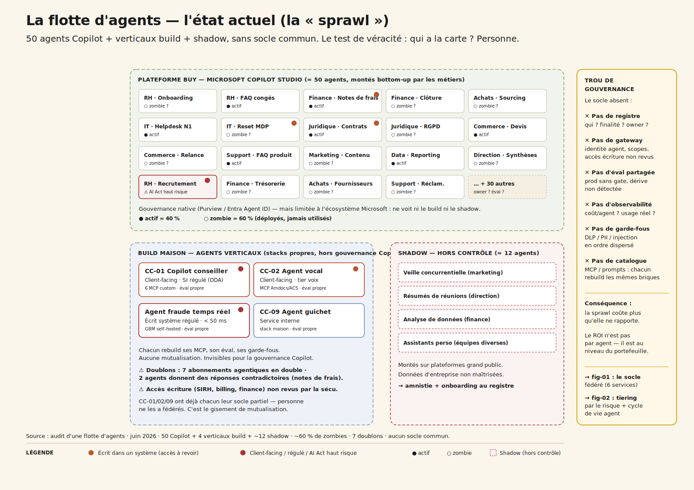
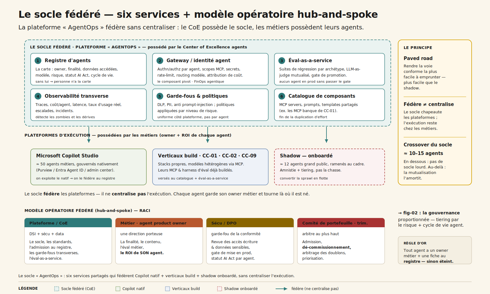
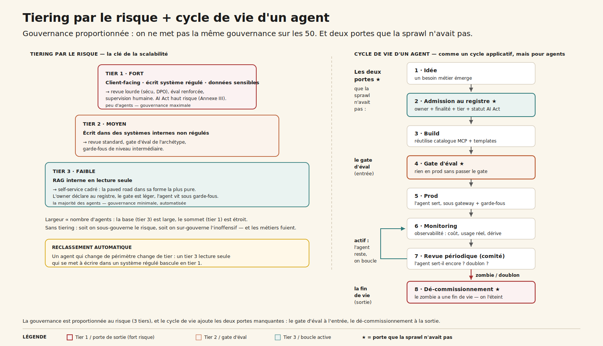

# CC-11 — Gouverner une flotte d'agents

**Transverse · Agentic · charnière (~5 600 mots) · cas-chapeau de clôture**

> Passé une dizaine d'agents, le problème n'est plus de *faire* un agent mais de *gouverner une flotte* : sans socle fédéré ni modèle opératoire, la prolifération coûte plus qu'elle ne rapporte. Le ROI n'est pas par agent, il est au niveau du portefeuille.

---

## 1. « On a une cinquantaine d'agents là-dedans. Qui les gère ? »

CODIR de fin de trimestre, grand groupe. Le DSI prend la parole avec une diapositive qu'il aurait préféré ne pas montrer : un agent RH, monté en quelques clics par une équipe métier, **écrit dans le SIRH — sans aucune revue sécu.** Le DAF enchaîne : il a compté **sept abonnements agentiques en doublon**, payés par sept directions qui s'ignorent. La DRH signale que deux agents donnent des réponses **contradictoires** sur la politique de notes de frais. Et un agent client-facing est passé en production **sans la moindre évaluation.**

La question s'impose, et personne ne sait à qui l'adresser : *« on a une cinquantaine d'agents là-dedans. Qui les gère, comment, sur quel socle — et est-ce que ça nous coûte plus que ça ne rapporte ? »*

C'est la **clôture** de cette annexe, et ce n'est pas un hasard. CC-00 l'ouvrait par le pôle large et peu maîtrisé — l'assistant que tout le monde ouvre, le shadow AI qui entre par tous les côtés. Les cas qui ont suivi ont construit, un par un, des agents de plus en plus profonds : le copilot bancaire (CC-01), l'agent vocal (CC-02), le guichet unique (CC-09), le dev agentique (CC-10), le socle data (CC-03). **CC-11 est ce qui arrive après** : quand on a laissé la flotte proliférer, il faut reprendre la main.

La leçon centrale tient en une phrase : **on ne gouverne pas une flotte d'agents comme on gouverne un agent.** Le problème change de nature. Et comme toujours, tout commence par regarder ce qui est déjà là — ici, le désordre.

## 2. La sprawl — la carte que personne n'avait

En 18 mois, l'IA agentique est entrée **bottom-up**, par tous les côtés. Il n'y a pas eu de décision d'architecture : il y a eu une accumulation.

Trois zones, et un trou au milieu :

1. **≈ 50 agents dans Microsoft Copilot Studio**, montés par les métiers — RH, finance, achats, IT, juridique, commerce, support. Self-service sans cadre. Certains écrivent dans des systèmes internes (SIRH, ERP) sans revue. C'est la sprawl principale. Le natif Microsoft (Purview, Entra Agent ID, admin center) sait les gouverner — mais il ne voit qu'eux.

2. **4 verticaux « sérieux »** buildés par les équipes data : le copilot conseiller (CC-01), l'agent vocal (CC-02), l'agent guichet (CC-09), un agent fraude temps réel. Les agents à fort enjeu, sur stacks hétérogènes. **Chacun a rebuildé sa propre éval, ses propres MCP servers, ses propres garde-fous.** Hors du périmètre du natif Microsoft.

3. **≈ 12 agents shadow**, montés en douce sur des plateformes grand public. Invisibles du SI. Le risque le plus diffus : des données internes qui transitent hors de tout cadre.

Et au centre, **l'angle mort — ce qui n'existe pas** : pas de registre, pas de gateway transverse, pas d'éval-as-a-service, pas d'observabilité de flotte, pas de catalogue de composants partagés.

Ce que cette carte dit immédiatement :

- **Personne n'a la carte.** Sans registre, on ne sait ni combien d'agents existent, ni qui en est l'owner, ni ce qu'ils accèdent. C'est le premier symptôme et la première cause.
- **Le problème n'est pas technique par agent** — chaque agent est faisable. Il est de **portefeuille** : la duplication d'effort (4 harness d'éval, N MCP rebuildés) et la sprawl (doublons, zombies, accès non revus) coûtent plus que n'importe quel agent isolé.
- **Le natif Microsoft gouverne un tiers de la flotte.** S'y fier sans le compléter, c'est gouverner les 50 Copilot en croyant tenir les 66.
- **Le shadow n'est pas un dérapage marginal** : c'est le signal que la paved road officielle n'existe pas encore — exactement la leçon du shadow AI de CC-00, généralisée aux agents.

## 3. Six services — l'anatomie du socle « AgentOps »

Gouverner une flotte exige un **socle transverse** : six services partagés qui ne *remplacent* pas les plateformes d'exécution (Copilot Studio, build maison), mais les **fédèrent**.

| # | Service | Rôle | Sans lui |
| --- | --- | --- | --- |
| 1 | **Registre d'agents** | Catalogue : owner, finalité, données accédées, modèle, statut éval/risque, **statut AI Act**, cycle de vie | Personne n'a la carte → sprawl |
| 2 | **Gateway / identité agent** | Authn/authz **par agent**, scopes MCP, secrets, rate-limit, routing modèle, **attribution de coût** (FinOps) | Accès non revus, coûts non imputables |
| 3 | **Éval-as-a-service** | Suites de régression réutilisables **par archétype**, LLM-as-judge mutualisé, **gate de promotion** | 50 évals artisanales = aucune éval |
| 4 | **Observabilité transverse** | Traces, coût/agent, latence, **taux d'usage réel**, escalades, incidents | Pas de perf, pas de détection des zombies |
| 5 | **Garde-fous & politiques** | DLP, PII, anti prompt-injection, politiques **par niveau de risque** | Risque non maîtrisé, conformité ingérable |
| 6 | **Catalogue de composants** | MCP servers partagés (ex. les MCP banque de CC-01), prompts, templates | Chaque équipe rebuild les mêmes briques |

Le mot qui compte est **fédère** : le socle ne centralise pas l'exécution. Les agents continuent de tourner sur Copilot, sur les orchestrateurs maison, là où ils sont nés. Le socle chapeaute — il pose la carte (registre), il garde la porte (gateway), il juge sur un standard commun (éval), il regarde (observabilité), il borne (garde-fous), il mutualise (catalogue).

Le **gateway** est le composant pivot. C'est lui qui rend les accès revus, les coûts imputables, les garde-fous appliqués sans être réinventés par agent. Et c'est le sclérosant projet : fédérer Copilot + verticaux + shadow sans casser les flux existants prend deux à trois mois incompressibles. Renvois : la [plateforme MCP (ch. 15)](../../chapitres/ch15-mcp-plateforme.md) est le socle ; la [sécurité MCP (ch. 16)](../../chapitres/ch16-mcp-securite.md) est le gateway/identité agent.

## 4. Qui gère ? — métier vs DSI, le vrai débat

C'est **le** débat de fond, et il décide de tout le reste. Trois modèles opératoires.

- **Centralisé — la DSI fait tout.** Contrôle maximal sur le papier. En pratique : goulot d'étranglement, file d'attente, l'innovation métier meurt. Ne passe pas à l'échelle de 50+ agents — et les métiers repartent en shadow.
- **Décentralisé — chaque métier fait ses agents.** Vélocité maximale. Mais c'est **exactement la sprawl actuelle** : doublons, chaos, risque non maîtrisé. L'absence de gouvernance est une gouvernance — la pire.
- **Fédéré / hub-and-spoke (recommandé).** Un **Center of Excellence agents** possède le socle, les standards, les garde-fous, le registre, l'éval-as-a-service. Les **métiers possèdent leurs agents** : finalité, contenu, owner métier **obligatoire**, ROI de *leur* agent — **dans le cadre.** Le principe directeur est la **paved road** : rendre la voie conforme tellement facile à emprunter que personne n'ait envie de la contourner.

**RACI cible :**

| Acteur | Responsabilité |
| --- | --- |
| **Plateforme / CoE** (DSI + sécu + data) | Le socle, les standards, l'admission au registre, les garde-fous transverses, l'éval-as-a-service |
| **Métier** (agent product owner) | La finalité, le contenu, l'éval métier, le ROI de **son** agent |
| **Sécu / DPO** | Revue des accès écriture & données sensibles, gate de mise en prod, statut AI Act |
| **Comité de portefeuille** (trimestriel) | Admission, **dé-commissionnement**, arbitrage des doublons, priorisation |

Deux rôles nouveaux apparaissent : un **Head of AgentOps / Agent Platform Owner** côté plateforme, et des **agent product owners** côté métier. Et une règle d'or qui résume tout : **tout agent a un owner métier nommé + une fiche au registre — sinon il est éteint.** Renvoi : [métier vs DSI, conduite du changement (ch. 26)](../../chapitres/ch26-ia-et-travail.md).

## 5. Trois modes — admettre, faire vivre, réviser

Ce que le socle *fait*, concrètement, se range en trois temps.

### 5.1 Admission — la paved road

À la création d'un agent, sur n'importe quelle plateforme (y compris un shadow ramené par l'amnistie), le porteur déclare au registre : owner métier, finalité, données accédées, modèle, plateforme. Il classe le niveau de risque (tier 1/2/3), ce qui déclenche la revue **proportionnée**. Le gateway câble l'identité et les scopes MCP — les accès sont tracés, le coût attribué. Et le statut AI Act est renseigné : **le registre devient la pièce de conformité.**

### 5.2 Run — l'agent vit dans le cadre

Une fois admis, l'agent vit sous trois services, quelle que soit sa plateforme d'exécution. Le **gateway** : chaque appel passe par l'authn/authz par agent, le rate-limit, le routing modèle, l'attribution de coût (FinOps agentique). Les **garde-fous** : DLP, PII, anti prompt-injection appliqués par niveau de risque — politique uniforme côté plateforme, pas réinventée par agent. L'**observabilité** : traces, coût/agent, latence, taux d'usage réel — la console qui détecte zombies et dérives.

### 5.3 Revue — le comité de portefeuille

Trimestriel, plus des alertes continues. Le comité arbitre les **doublons** (deux agents au périmètre qui se chevauchent), éteint les **zombies** (taux d'usage sous seuil), valide les **promotions** en prod (aucun agent sans gate d'éval), met à jour le tiering et le statut AI Act des agents qui changent de périmètre.

> **Anatomie d'une admission.** Un métier déclare un « agent notes de frais », alors qu'un agent finance couvre déjà ce périmètre. **Declare** → fiche registre. **Detect** → le socle détecte la collision (`registre-mcp.detect_collision`). **Tier & gate** → tier 2, gate de l'archétype conversationnel + test de non-contradiction contre l'agent existant. **Arbitrate** → le comité tranche : fusion, pas doublon. **Govern** → l'agent retenu vit sous gateway + observabilité, statut AI Act au registre. La paved road a évité une contradiction de plus dans la flotte.

## 6. Build, Buy, Hybride — l'arbitrage porte sur le socle

L'arbitrage build/buy ne porte pas ici sur un agent, mais sur **le socle lui-même.** Trois options, six critères, notation `--` → `++`.

| Critère | **Build pur** *Socle maison complet* | **Buy mainstream** *MS-native ou AgentOps tiers* | **Hybride fédéré** *(recommandé)* *Natif MS + socle maison léger* |
| --- | :---: | :---: | :---: |
| Sensibilité data | `++` | `0` | `+` |
| Personnalisation | `++` | `-` | `+` |
| Volumétrie | `+` | `++` | `+` |
| Lock-in | `+` | `--` | `0` |
| Time-to-value | `--` | `++` | `+` |
| Souveraineté | `++` | `-` | `0` |
| **Verdict** | *Couvre tout, souverain — mais effort plateforme lourd, trop lent pour reprendre la main vite.* | *Le natif gouverne très bien les 50 Copilot — mais angle mort total sur build et shadow → lock-in et périmètre partiel.* | ***RECOMMANDÉ.** On exploite le natif sans le réinventer, on build le minimum qui fédère, on cadre le shadow par amnistie.* |

La recommandation est l'**hybride fédéré** : exploiter le natif Microsoft pour gouverner les 50 Copilot (ne pas réinventer la roue) + un **registre + gateway transverse maison léger** qui chapeaute **toutes** les plateformes + un **harness d'éval partagé**. Le socle fédère, il ne centralise pas l'exécution. La discipline d'architecture est le prix — et c'est moins cher que la sprawl. Renvoi : [runtime managé vs maison (ch. 22)](../../chapitres/ch22-runtime-manage.md).

Et le **modèle** ? La question n'est pas « quel modèle » mais « comment gouverner une flotte multi-modèle ». Le **gateway model-agnostic** est le bon niveau d'abstraction : il route par agent et par politique (GPT-5 pour les Copilot, Claude pour les verticaux à reasoning, Mistral pour le souverain), attribue le coût, applique les garde-fous — sans figer le choix de modèle. La diversité des modèles devient un paramètre gouverné, pas un chaos subi.

## 7. Les huit postes — quand le coût de coordination domine

Grille CC-11, en k€. Attention : ici le « coût par interaction » est en réalité un **coût de gouvernance par agent**, et l'inférence n'est pas le poste qu'on croit.

| Poste | Socle minimal 3 m | Fédération 6 m | Régime fédéré 12 m | Plateforme mature 36 m |
| --- | --- | --- | --- | --- |
| Inférence *(judge mutualisé + overhead gateway)* | 6 | 25 | 70 | 110 |
| Infra *(registre + gateway + observabilité)* | 20 | 60 | 140 | 220 |
| **Équipe** *(le CoE / AgentOps)* | **120** | **360** | **760** | **1 100** |
| Data | 8 | 30 | 60 | 90 |
| **Évaluation** *(harness partagé)* | 10 | 90 | 240 | 380 |
| **Gouvernance** *(registre + comité)* | 30 | 120 | 320 | 480 |
| Sécurité *(gateway / identité)* | 20 | 80 | 200 | 300 |
| Change *(enablement métier)* | 15 | 90 | 260 | 360 |
| **Total** | **229** | **855** | **2 050** | **3 040** |
| Coût de gouvernance / agent | 22,00 € | 9,50 € | 4,20 € | 2,30 € |

Lecture transverse, et elle est le cœur intellectuel du cas :

- **L'inférence est le plus PETIT poste.** À l'échelle flotte, l'inférence par agent baisse ([LLMflation, ch. 23.2.1](../../chapitres/ch23-roi-paradoxe-agentique.md)) et ne représente, côté socle, que le LLM-as-judge mutualisé et l'overhead du gateway.

- **Les postes dominants sont l'équipe (le CoE), la gouvernance et l'évaluation** — c'est-à-dire le **coût de coordination.** C'est le **paradoxe agentique au carré** ([ch. 23.7](../../chapitres/ch23-roi-paradoxe-agentique.md)) : au niveau d'un agent, le poste équipe dominait déjà l'inférence ; au niveau de la flotte, c'est le coût de *coordination de la flotte* qui domine. L'unité de mesure se déplace de l'agent vers le portefeuille.

- **Le coût de gouvernance par agent divise par ~10** (22 € → 2,30 €) non par optimisation technique, mais par **amortissement du socle sur un nombre croissant d'agents.** C'est le mécanisme central.

D'où le **crossover du socle** : **≈ 10-15 agents.** En dessous, pas besoin d'un socle lourd — les agents se gouvernent à la main, et une gouvernance lourde sur 5 agents est du gâchis. Au-delà, la mutualisation (éval + MCP + garde-fous) s'amortit et le socle devient rentable. C'est l'**analogue flotte du crossover build/buy.**

## 8. Évaluer une flotte — le test de non-contradiction

L'éval **à l'échelle de la flotte** est un problème nouveau. On ne peut pas faire 50 régression suites artisanales — ce serait recommencer la duplication qu'on veut tuer.

**1. Éval-as-a-service.** Un harness **partagé**, des suites de régression réutilisables **par archétype** (RAG, tool-use, conversationnel), un LLM-as-judge mutualisé, des **gates de promotion standardisés.** Aucun agent en prod sans passer le gate. Renvoi : [évaluation (ch. 19)](../../chapitres/ch19-evaluation-benchmarks.md).

**2. Test de non-contradiction inter-agents.** Les 50 agents donnent-ils des réponses **cohérentes** sur les politiques communes — notes de frais, congés ? C'est un test propre à la flotte, qu'aucun agent isolé ne peut faire sur lui-même. C'est ce test qui aurait attrapé les deux agents contradictoires du CODIR.

**3. Détection de collision.** Deux agents au périmètre qui se chevauchent et divergent — le doublon avant qu'il ne devienne une contradiction.

**4. Validation continue, pas one-shot.** La dérive d'un agent passe inaperçue si l'éval n'est pas mutualisée et permanente. L'observabilité transverse veille en continu : chute du taux d'usage (zombie en formation), pic de coût, réponse contradictoire, accès écriture non prévu au tiering. Renvoi : [observabilité transverse / audit trail (ch. 20)](../../chapitres/ch20-observabilite-cognitive-audit-trail.md).

## 9. Tiering et cycle de vie — la gouvernance proportionnée

On ne met **pas** la même gouvernance sur les 50. C'est la clé de la scalabilité : sans tiering, soit on sous-gouverne les agents à risque, soit on sur-gouverne les agents inoffensifs (et les métiers fuient).

- **Tier 1 (fort)** : client-facing, écrit dans un système régulé, données sensibles → revue lourde (sécu, DPO), éval renforcée, supervision humaine.
- **Tier 2 (moyen)** : écrit dans des systèmes internes non régulés → revue standard.
- **Tier 3 (faible)** : RAG interne lecture seule → **self-service cadré** — la paved road dans sa forme la plus pure.

Le **cycle de vie** d'un agent calque celui d'une application, mais pour agents : idée → **admission au registre** → build → **gate d'éval** → prod → monitoring → revue périodique → **dé-commissionnement.** Les deux portes que la sprawl n'avait pas sont le **gate d'éval** (rien en prod sans passer) et le **dé-commissionnement** (le zombie a une fin de vie).

**AI Act par agent** : la plupart des 50 relèvent du risque limité/minimal (productivité interne), mais certains basculent **haut risque** — un agent RH de tri de candidatures (Annexe III §4), un agent qui touche au crédit (Annexe III §5). Le **registre porte le statut AI Act de chaque agent** : le registre **est** l'outil de conformité de la flotte. Sans lui, on ne peut ni identifier ni documenter les agents haut risque face au régulateur. Renvoi : [AI Act, registre par agent (ch. 25)](../../chapitres/ch25-gouvernance-ai-act.md).

**Shadow agents** : **amnistie + onboarding** (« ramène ton agent au registre, on t'aide à le mettre en conformité ») plutôt que la chasse. On convertit la sprawl en flotte au lieu de la combattre — la leçon shadow de CC-00, à l'échelle agents.

## 10. ROI au niveau portefeuille — éteindre vaut mieux qu'ajouter

Axe principal : **Coût** (TCO du portefeuille, fin des doublons et des zombies). Secondaires : Qualité (cohérence inter-agents), Bien-être (paved road). Méthode : **TCO de portefeuille** — et non par agent — + Cigref Hard/Soft.

| Métrique | Borne basse | Cible | Borne haute | Catégorie |
| --- | --- | --- | --- | --- |
| `tco-infrastructure` | −10 % | **−25 % TCO portefeuille** | −40 % | Hard |
| `response-consistency` | +5 pts | **+10 pts cohérence inter-agents** | +15 pts | Soft |
| `regulatory-compliance` | tier 1 documentés | **registre = conformité tenue** | audit passé | Mixed |
| `employee-engagement` | +2 | **+5 (paved road facile)** | +8 | Soft |

Le contre-pied à comprendre : **le premier gisement de valeur n'est pas d'ajouter des agents, c'est d'éteindre les zombies.** Sur 50 agents, souvent moins de 40 % sont réellement utilisés. Le coût de la sprawl tient en trois lignes : (a) licences/sièges dupliqués, (b) duplication d'effort (chacun rebuild les mêmes MCP), (c) risque et incidents. Le socle paie par **mutualisation.**

> **KPI gardien — et principal — de flotte : le taux d'agents actifs avec ROI prouvé vs zombies.** Un agent non utilisé est un coût pur, pas un actif. C'est aussi le gardien qui empêche le socle de devenir lui-même une bureaucratie : si le socle ne fait pas monter ce taux (en éteignant les zombies, en évitant les doublons), il ne se justifie pas. Le socle se mesure à ce qu'il nettoie, pas à ce qu'il ajoute.

**Non retenues** : `revenue` (le ROI du socle n'est pas du CA direct — il multiplie la valeur des agents en aval, comme le socle data de CC-03), `processing-time` (c'est le ROI de chaque agent métier — ne pas double-compter), `nps` (hors périmètre).

## 11. L'équipe, la vélocité, les sclérosants

**5,6 ETP** pour le socle minimal, avec un poste pivot qui est un rôle nouveau.

| Rôle | ETP | Profil cible |
| --- | --- | --- |
| **Head of AgentOps / Platform Owner** | 1,0 | **pivot** — pense portefeuille, arbitre le build/buy du socle, anime le comité (pas un chef de projet outil) |
| Ingénieur plateforme (registre + observabilité) | 1,5 | Schéma de métadonnées, ingestion des inventaires hétérogènes, OpenTelemetry GenAI |
| Ingénieur gateway / identité agent | 1,0 | Le sclérosant : authn/authz par agent, scopes MCP, routing, FinOps |
| Référent éval-as-a-service | 0,8 | Consolide les harness des verticaux en suites par archétype + non-contradiction |
| RSSI référent flotte | 0,5 | Politiques de garde-fous par tier, revue des accès écriture |
| DPO référent flotte | 0,5 | Statut AI Act par agent, tiering, FRIA des agents haut risque |
| Change / animation paved road | 0,3 | Amnistie shadow, onboarding des owners métier |

En régime, 8 ETP de cœur (le CoE) + des agent product owners distribués dans les métiers — **le coût n'est pas centralisé**, chaque agent garde son owner.

**Quatre sclérosants :**
- Le **gateway transverse** : fédérer Copilot + verticaux + shadow sans casser l'existant — 2-3 mois incompressibles.
- L'**amnistie shadow** : faire revenir les ~12 agents demande de la diplomatie, pas de la répression — sinon ils replongent dans l'ombre.
- La **résistance à la re-centralisation perçue** : la paved road doit être PLUS facile que le shadow, sinon le socle est contourné. C'est du change, pas de la tech.
- L'**ingestion des inventaires hétérogènes** : aligner Copilot admin, build et shadow dans un schéma de registre unique.

**Deadlines** : AI Act transparence + identification des agents haut risque (2026-08), obligations complètes (2027-08, le registre est la pièce qui prouve la conformité), et le comité de portefeuille trimestriel — sans dé-commissionnement actif, la sprawl revient.

## 15. Le débat — socle ou bureaucratie ?

**Pour** : passé ~10-15 agents, la sprawl coûte plus que n'importe quel agent isolé ; le registre est l'outil de conformité AI Act de la flotte ; la mutualisation (éval, catalogue, garde-fous) paie le socle.

**Contre** : la flotte est née bottom-up parce que l'IT était trop lent — un socle mal pensé re-centralise et repousse les métiers vers le shadow ; sous ~10-15 agents le socle coûte plus qu'il ne rapporte ; un comité qui ne dé-commissionne jamais devient une bureaucratie de plus.

**Verdict pondéré** : GO socle fédéré — **mais** la gouvernance est **proportionnée au risque** (tiering 3 niveaux, pas uniforme) et le modèle est **fédéré** (le CoE possède le socle, les métiers possèdent leurs agents). La paved road doit être plus facile que le shadow. Et le socle se justifie par un seul KPI : le **taux d'agents actifs avec ROI prouvé** qu'il fait monter en éteignant zombies et doublons.

## 16. Trois choix qu'il faut faire

### 16.1 Quel modèle opératoire ?

*Vous êtes le DSI, face aux 50 + 4 + 12.*

**A. Centralisé — la DSI reprend tout.** Goulot immédiat, l'innovation métier meurt, les métiers repartent en shadow. *Antipattern de la re-centralisation ([ch. 26](../../chapitres/ch26-ia-et-travail.md)).*

**B. Décentralisé — chaque métier garde la main.** C'est exactement la sprawl actuelle : doublons, zombies, risque non vu. *L'absence de gouvernance est une gouvernance, la pire.*

**C. Fédéré hub-and-spoke.** Le CoE possède le socle, les métiers possèdent leurs agents, la paved road rend la voie conforme la plus facile. *La bonne réponse ([ch. 26](../../chapitres/ch26-ia-et-travail.md)).*

### 16.2 Quel socle pour une flotte hétérogène ?

**A. Microsoft-native uniquement.** Vous gouvernez parfaitement les 50 Copilot et restez aveugle sur les 16 autres. *Piège de l'angle mort ([ch. 15](../../chapitres/ch15-mcp-plateforme.md)).*

**B. Hybride fédéré — natif MS + registre/gateway maison léger.** Vous exploitez le natif, fédérez le reste, cadrez le shadow. *La bonne réponse ([ch. 15](../../chapitres/ch15-mcp-plateforme.md) + [ch. 16](../../chapitres/ch16-mcp-securite.md)).*

**C. Tout raser, build maison complet.** Souverain mais lourd, des mois sans reprendre la main, et vous réinventez ce que le natif fait déjà. *Fausse pureté ([ch. 22](../../chapitres/ch22-runtime-manage.md)).*

### 16.3 Que faire des existants + du shadow ?

**A. Tout raser et repartir propre.** Vous perdez l'adhésion et le shadow se reforme en pire. *Antipattern de la table rase.*

**B. Amnistie + onboarding + tiering.** Vous convertissez la sprawl en flotte, récupérez le signal du shadow, classez par risque. *La bonne réponse ([ch. 26](../../chapitres/ch26-ia-et-travail.md)).*

**C. Laisser courir.** Le jour de l'incident AI Act, vous n'avez ni registre ni audit trail à présenter. *Le risque différé ([ch. 25](../../chapitres/ch25-gouvernance-ai-act.md)).*

## 13. Quiz

**Q1.** Pourquoi le ROI d'une flotte se mesure-t-il au niveau du portefeuille, et non par agent ?
- Parce que les agents sont trop nombreux pour être mesurés un par un
- **Parce que le socle a un coût fixe qui s'amortit sur N agents, et que les coûts de la sprawl (doublons, zombies, incidents) sont des coûts de portefeuille — pas d'agent isolé** ✓
- Parce que l'AI Act l'impose
- Parce que les agents n'ont pas de ROI individuel

*Sous ~10-15 agents le socle coûte plus qu'il ne rapporte ; au-delà, la mutualisation l'amortit (le crossover du socle). Paradoxe agentique au carré (ch. 23.7).*

**Q2.** Quel est le bon modèle opératoire pour une flotte née bottom-up ?
- Centralisé : la DSI reprend tout
- Décentralisé : chaque métier garde la main sans cadre
- **Fédéré hub-and-spoke : le CoE possède le socle et les standards, les métiers possèdent leurs agents — paved road plus facile que le shadow** ✓
- Externalisé : un prestataire gère la flotte

*Le centralisé tue la vélocité, le décentralisé EST la sprawl. Le fédéré fait posséder le socle au CoE et les agents aux métiers (ch. 26).*

**Q3.** Pourquoi le registre est-il plus qu'un inventaire ?
- Parce qu'il liste les agents par ordre alphabétique
- **Parce qu'il porte le statut AI Act de chaque agent : c'est l'outil de conformité de la flotte, qui permet d'identifier et documenter les agents haut risque (Annexe III)** ✓
- Parce qu'il remplace le gateway
- Parce qu'il entraîne les modèles

*Le registre transforme une collection ingouvernable en flotte pilotable, et prouve la conformité au régulateur (ch. 25).*

## 17. Verdict — GO socle fédéré

**GO_SOCLE_FEDERE** — gouverner le portefeuille, sinon la sprawl coûte plus qu'elle ne rapporte.

Six conditions :

1. **Registre obligatoire** — aucun agent sans owner métier nommé + fiche (sinon extinction).
2. **Gouvernance proportionnée au risque** (tiering 3 niveaux), pas uniforme.
3. **Éval-as-a-service** partagée + gate de prod pour tous.
4. **Modèle fédéré** — le CoE possède le socle, les métiers possèdent leurs agents ; paved road plus facile que le shadow.
5. **Dé-commissionnement actif des zombies** (KPI taux d'agents actifs avec ROI prouvé).
6. **Socle hybride** — natif Microsoft pour les Copilot + registre/gateway transverse maison pour fédérer le reste + amnistie/onboarding du shadow.

Aux conditions remplies, la flotte cesse d'être une collection ingouvernable pour devenir un portefeuille piloté. **CC-11 ferme l'arc que CC-00 ouvrait** : là où l'assistant transverse montrait l'IA *non maîtrisée* qui entre par tous les côtés, le socle fédéré montre comment on *reprend la main* sur la flotte qui en résulte. Les MCP servers, les harness d'éval, les garde-fous que chaque cas avait buildés pour lui-même (CC-01, CC-02, CC-09, CC-10, CC-03) deviennent ici des **composants mutualisés d'un socle commun.** C'est le cas qui transforme une collection de projets en plateforme — et la leçon de clôture de l'annexe : **on ne fait pas grandir une flotte, on la gouverne.**

---

## Renvois livre

- **[Ch. 11 — Patterns d'orchestration multi-agent](../../chapitres/ch11-patterns-orchestration.md)**
- **[Ch. 15 — MCP plateforme (le socle fédéré)](../../chapitres/ch15-mcp-plateforme.md)**
- **[Ch. 16 — Sécurité MCP (gateway / identité agent)](../../chapitres/ch16-mcp-securite.md)**
- **[Ch. 13 — Surfaces agentiques](../../chapitres/ch13-surfaces-agentiques.md)**
- **[Ch. 19 — Évaluation (éval-as-a-service, gate de promotion)](../../chapitres/ch19-evaluation-benchmarks.md)**
- **[Ch. 20 — Observabilité transverse / audit trail de flotte](../../chapitres/ch20-observabilite-cognitive-audit-trail.md)**
- **[Ch. 21 — Garde-fous & politiques par niveau de risque](../../chapitres/ch21-gardefous-securite-globale.md)**
- **[Ch. 22 — Runtime managé vs maison (build/buy du socle)](../../chapitres/ch22-runtime-manage.md)**
- **[Ch. 23.2.1 — LLMflation (l'inférence par agent baisse)](../../chapitres/ch23-roi-paradoxe-agentique.md)**
- **[Ch. 23.7 — Paradoxe agentique (le coût de coordination devient dominant au niveau flotte)](../../chapitres/ch23-roi-paradoxe-agentique.md)**
- **[Ch. 25 — Gouvernance AI Act (le registre = conformité par agent)](../../chapitres/ch25-gouvernance-ai-act.md)**
- **[Ch. 26 — IA et travail (métier vs DSI, modèle fédéré, conduite du changement)](../../chapitres/ch26-ia-et-travail.md)**

---

*Format co-écrit avec l'aide d'une IA. Données et calibrage : analyse Mathieu Guglielmino · juin 2026.*
