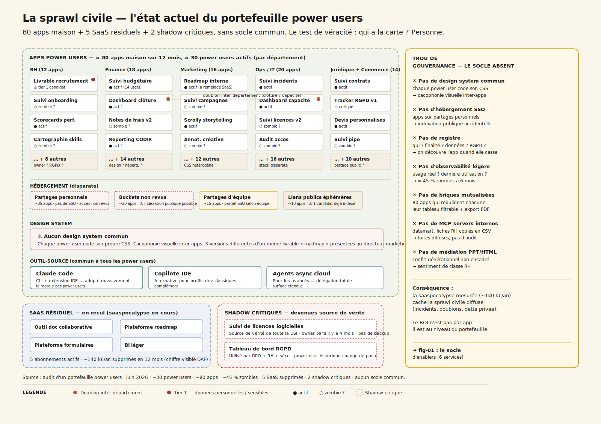
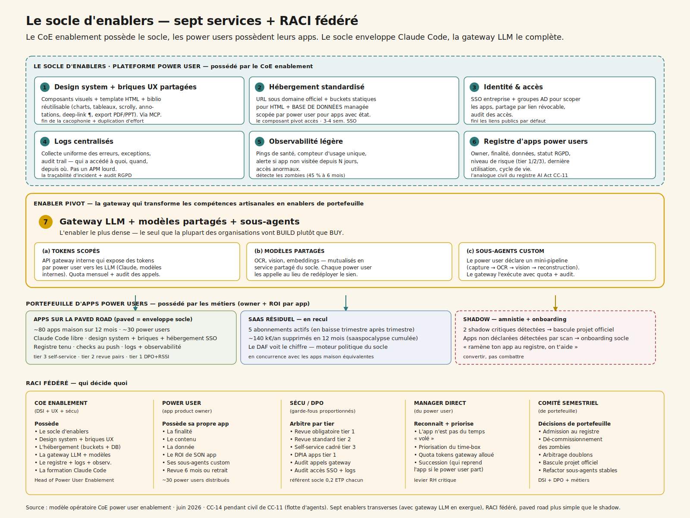
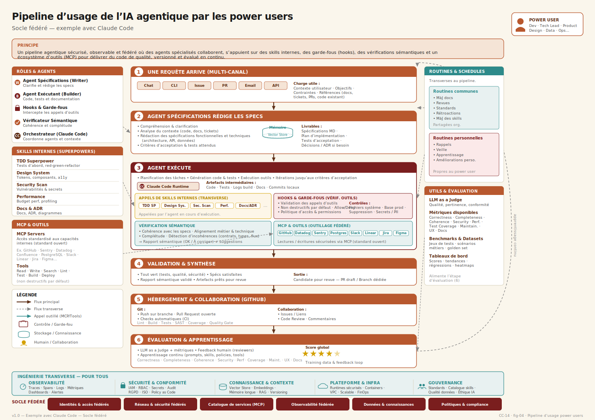
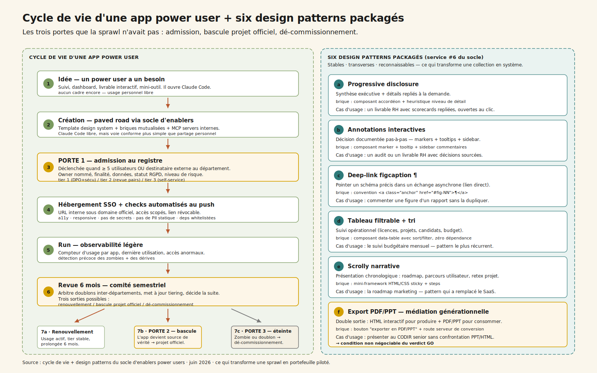
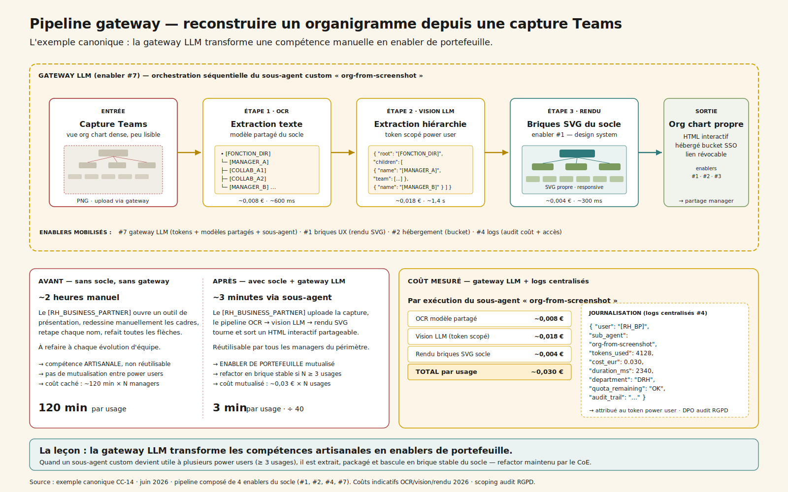

# CC-14 — Power users & saaspocalypse : apps maison sans coder

**Transverse · Agentic · charnière (~7 000 mots) · pendant civil de CC-11 dans la strate « gouverner la prolifération »**

> Quand les power users construisent leurs propres applications avec Claude Code, le SaaS recule visiblement — mais sans socle partagé d'enablers (design system, hébergement SSO, registre, observabilité) ni gouvernance des power users, on troque une prolifération SaaS contre une prolifération artisanale équivalente. Le seul gisement de ROI durable est de leur fournir un socle qui rend la voie conforme la plus simple à emprunter.

---

## 1. « Tu peux pas faire un PowerPoint, fais-moi un HTML interactif »

CODIR de fin de trimestre, grand groupe. Le DPO prend la parole avec une diapositive qu'il aurait préféré ne pas montrer : un livrable RH contenant des données candidat **a été partagé par lien public** et indexé par un moteur de recherche externe[^1]. Le DAF enchaîne : il a compté **cinq outils internes orphelins** au moment où leur power user historique change de poste — personne ne sait les reprendre. La DRH signale que **trois apps power users stockent des données personnelles** hors du périmètre RGPD déclaré ; combien d'autres existent, personne ne le sait. Et le directeur marketing reçoit en réunion **trois versions différentes** d'un même livrable « roadmap » au design hétérogène, produit par trois power users différents.

La question s'impose, et personne ne sait à qui l'adresser : *« les power users gagnent en vélocité, c'est mesurable et indéniable — mais comment on évite que ça devienne le nouveau shadow IT ? »*

C'est le **miroir civil de CC-11**, et ce n'est pas un hasard. Là où CC-11 traite la prolifération **officielle** (la flotte d'agents Copilot + verticaux + shadow), CC-14 traite la prolifération **artisanale** : les power users métiers (RH, marketing, ops, finance, IT) qui construisent leurs propres applications avec Claude Code et l'écosystème d'assistants de code, sans passer par les éditeurs SaaS habituels. Mêmes réflexes (socle fédéré, gouvernance de portefeuille), mêmes risques (sprawl, doublons, zombies, sécurité, conformité) — mais à la **strate du livrable**, pas à celle de l'agent.

La leçon centrale tient en une phrase : **on ne gouverne pas un portefeuille d'apps power users comme on gouverne une flotte d'agents.** Le problème change de nature à plusieurs endroits — l'outil-source (Claude Code), le cycle de vie (une app vit plus longtemps qu'un appel d'agent), la médiation politique (le conflit générationnel PPT/HTML est explosif). Mais comme toujours, tout commence par regarder ce qui est déjà là — ici, la sprawl civile qui pousse sous les radars.

## 2. La sprawl civile — la carte que personne n'avait

En 18 mois, l'écosystème des assistants de code a percolé hors du périmètre dev. Claude Code en tête[^2], copilote IDE, agents async cloud côté équipes plus avancées. Il n'y a pas eu de décision d'architecture : il y a eu une accumulation, par tous les côtés.

Trois zones, et un trou au milieu :

1. **≈ 80 apps power users** dispersées par département. Une [ANALYSTE_FINANCE] qui code un suivi budgétaire mensuel en HTML statique[^3], meilleur que l'outil SaaS précédent — personne ne sait que ça existe. Une [RH_BUSINESS_PARTNER] qui génère un livrable HTML interactif par recrutement, partageable par lien. Un [PM_MARKETING] qui remplace une plateforme de roadmap mainstream (40 €/utilisateur/mois × 50 sièges, ~24 k€/an) par une app maison écrite en deux jours[^4]. Quatre analyses ad hoc qui circulent en HTML interactif au lieu de PPT. Self-service métier sans cadre : chaque power user code, héberge, partage à sa main.

2. **≈ 5 SaaS résiduels** encore en place — outil de doc collaborative, plateforme de roadmap mainstream, suite bureautique, plateforme de formulaires, BI léger. Coût visible (abonnements/siège), gouverné par l'achat. **C'est ce stock-là qui recule sous l'effet de la saaspocalypse** : 5 abonnements supprimés en 12 mois, ~140 k€/an récupérés — chiffre que le DAF voit immédiatement.

3. **≈ 2 apps shadow critiques** devenues source de vérité d'équipes entières : un suivi de licences logicielles et un tableau de bord RGPD, construits par des power users[^5], sans owner officiel, sans backup, sans revue sécu. Si le power user historique part ou si l'app casse, l'équipe entière perd son outil de travail.

Et au centre, **l'angle mort — ce qui n'existe pas** : pas de design system commun (chaque app a son CSS), pas d'hébergement standardisé sous domaine officiel (apps stockées sur des partages personnels, buckets non revus), pas de registre, pas d'observabilité légère, pas de briques mutualisées (chaque power user rebuild son tableau filtrable et son export PDF).

Ce que cette carte dit immédiatement :

- **Personne n'a la carte.** Sans registre, on ne sait ni combien d'apps existent, ni qui en est l'owner, ni quelles données elles touchent. C'est le premier symptôme et la première cause — exactement comme en CC-11 pour la flotte d'agents.
- **Le problème n'est pas technique par app** — chaque app est faisable (Claude Code la produit en quelques heures). Il est de **portefeuille** : la duplication d'effort (80 apps qui rebuildent chacune leur tableau filtrable, leur export PDF, leur design) et la sprawl (doublons inter-départements, apps orphelines, accès non revus) coûtent plus que n'importe quelle app isolée.
- **La saaspocalypse mesurable est le moteur politique.** Le DAF voit les ~140 k€/an d'abonnements coupés et signe. Mais sans socle, le coût caché de la sprawl (incidents sécu, doublons, dette de maintenance privée) rattrape vite — il est diffus, il monte sous les radars.
- **Le shadow n'est pas un dérapage marginal** : c'est le signal que la paved road officielle n'existe pas encore — exactement la leçon shadow de CC-00, généralisée aux apps maison.

## 3. Sept enablers — l'anatomie du socle « power user »

Gouverner un portefeuille d'apps power users exige un **socle d'enablers** : sept services partagés qui ne *remplacent* pas l'outil-source (Claude Code) ni les workflows de création, mais les **enveloppent**.

| # | Service (enabler) | Rôle | Sans lui |
| --- | --- | --- | --- |
| 1 | **Design system + briques UX partagées** | Composants visuels (typo, palette, layout, micro-interactions) + template HTML « page interne » + bibliothèque réutilisable (charts, tableaux filtrables, scrolly, annotations interactives, *progressive disclosure*, deep-link figcaption ¶, export PDF/PPT) — exposés à Claude Code via MCP[^6] | Chaque livrable a un design différent + chaque power user rebuild les mêmes briques → cacophonie + duplication d'effort |
| 2 | **Hébergement standardisé** | URL interne sous domaine officiel, **buckets statiques** pour les apps HTML + **base de données managée** scopée par power user (un schéma par owner) pour les apps qui persistent un état — tracker, dashboard, formulaire ; déploiement par push git ou drop folder, isolation par auteur, expiration optionnelle | Apps stockées sur des partages personnels, indexation publique accidentelle, état perdu ou bricolé dans des feuilles partagées |
| 3 | **Identité & accès** | SSO entreprise + groupes AD pour scoper les apps, partage par lien révocable, audit des accès | Liens publics par défaut, fuites de données candidat / RH / financières |
| 4 | **Logs centralisés** | Collecte uniforme des erreurs, exceptions et **audit trail** des apps power users — qui a accédé à quoi, quand, depuis où | Pas un APM lourd, mais le minimum pour qu'un incident soit traçable et que la conformité RGPD côté accès soit tenue |
| 5 | **Observabilité légère** | Pings de santé, compteur d'usage unique, alerte si app non visitée depuis N jours | Pas de détection des zombies, pas de signal pour le dé-commissionnement |
| 6 | **Registre d'apps power users** | Catalogue : owner, finalité, données utilisées, **statut RGPD**, niveau de risque, date de dernière utilisation, cycle de vie | Pas d'inventaire → on découvre l'app le jour où elle casse |
| 7 | **Gateway LLM + modèles partagés + sous-agents** | (a) **Tokens scopés par power user** vers les LLM (Claude, modèles internes), (b) **modèles spécialisés mutualisés** — OCR, vision, embeddings — en service partagé, (c) **sous-agents custom** : le power user déclare un mini-pipeline (capture → OCR → vision → reconstruction), le gateway l'exécute avec quota et journalisation | Chaque power user reconfigure son propre accès LLM, redéploie son propre OCR, et toute la chaîne reste artisanale au lieu de devenir un enabler de portefeuille |

Le mot qui compte est **enveloppe** : le socle ne contraint pas le flux de création. Les power users continuent d'utiliser Claude Code comme ils l'entendent[^7] ; le socle fournit le contexte (design system via MCP, briques mutualisées, données métier sécurisées, modèles partagés à appeler) qui rend la voie conforme **plus simple** que le partage personnel. C'est la différence subtile mais structurante avec CC-11, dont le gateway *route* les modèles d'agents officiels : ici le socle **enveloppe** l'outil-source du power user sans le router, mais expose une **gateway LLM** qui ajoute aux tokens scopés des modèles spécialisés et des sous-agents custom — c'est l'enabler qui rend la vraie autonomie possible.

Le **hébergement SSO** est le composant pivot sur l'axe accès — c'est lui qui rend les accès revus, les liens révocables, l'audit des accès possible. Et c'est le sclérosant projet : câbler l'IAM corporate existant (Entra/Okta + groupes AD) aux apps power users sans réinventer la roue prend 3-4 semaines incompressibles. La **gateway LLM** (#7) est le composant pivot sur l'axe modèles + sous-agents — c'est le seul enabler du périmètre que la plupart des organisations vont *build* en interne plutôt que *buy* (sensibilité des tokens, scoping par power user, journalisation dans les logs centralisés, audit RGPD), et c'est celui qui transforme les compétences artisanales en enablers de portefeuille. Mal calibrée (quotas absents, pas d'audit, sous-agents libres), elle ouvre une porte à des incidents financiers diffus ; bien calibrée, elle multiplie la valeur des modèles partagés. Renvois : la [plateforme MCP (ch. 15)](../../chapitres/ch15-mcp-plateforme.md) est le socle des MCP servers internes ; la [sécurité MCP (ch. 16)](../../chapitres/ch16-mcp-securite.md) est le scoping par power user + l'audit des appels gateway.

### 3.5 Le pipeline d'usage côté power user — six étapes sur le socle

Vu depuis le poste du power user, le socle se traduit en un pipeline lisible en six étapes — de la requête initiale à l'évaluation et à la boucle d'apprentissage continue. Le schéma ci-dessous est l'exemple canonique avec Claude Code comme orchestrateur ; il vaut aussi pour les autres assistants de code, dès lors que le socle expose ses enablers via MCP.

Trois lectures se superposent dans ce schéma. **Au centre**, le pipeline linéaire (requête → specs → exécution → validation → hébergement → évaluation) montre comment une intention métier devient un artefact versionné, revu et évalué — c'est le flux que le power user expérimente directement. **Sur les côtés**, les blocs transverses (rôles d'agents, skills internes, MCP/outils, routines, utils &amp; évaluation) montrent ce que le socle met à disposition à toutes les étapes, sans que le power user ait à le câbler à la main. **En bas**, l'ingénierie transverse (observabilité, sécurité, connaissance, plateforme, gouvernance) et le socle fédéré (identités, réseau, catalogue MCP, observabilité, données, politiques) montrent les fondations partagées qui rendent ces flux opérables à l'échelle de l'organisation — c'est là que les coûts de portefeuille (poste équipe + gouvernance + change de la grille du §7) s'amortissent. La boucle d'apprentissage (étape 6 → étape 1) ferme le système : chaque exécution alimente les prompts, les skills, les politiques et les outils — c'est le mécanisme qui transforme un outil-source individuel en un enabler de portefeuille au fil du temps.

## 4. Qui gère ? — CoE enablement vs power users vs DSI

C'est **le** débat de fond, et il décide de tout le reste. Trois modèles opératoires, exactement homothétiques à CC-11 mais sur un autre périmètre.

- **Centralisé — la DSI re-prend tout.** Contrôle maximal sur le papier. En pratique : goulot d'étranglement immédiat, file d'attente, mort de la vélocité métier. Inacceptable politiquement après que les power users ont goûté à Claude Code[^8]. Ils repartent en shadow, en pire.
- **Laisser-faire complet — chaque power user garde la main sans cadre.** Vélocité maximale à court terme. Mais **c'est exactement la sprawl actuelle** : incidents sécu diffus, doublons inter-départements, apps orphelines à 6 mois. Le DPO et le RSSI vont déclencher un arrêt brutal au premier incident sérieux, et c'est le retour PPT généralisé.
- **Fédéré / hub-and-spoke (recommandé).** Un **Center of Excellence power user enablement** (DSI + UX + sécu) possède le socle, les enablers, la formation Claude Code, le registre, l'observabilité. Les **power users possèdent leurs apps** : finalité, contenu, données, owner nommé, niveau de risque déclaré, ROI de *leur* app — **dans le cadre des enablers.** Le principe directeur est la **paved road appliquée aux non-codeurs** : rendre la voie conforme tellement simple que personne n'ait envie de la contourner.

**RACI cible :**

| Acteur | Responsabilité |
| --- | --- |
| **Plateforme / CoE enablement** (DSI + UX + sécu) | Le socle, les enablers, le design system, l'hébergement, l'identité, le registre, la formation Claude Code |
| **Power user** (app product owner) | La finalité, le contenu, la donnée, la cible, le ROI de **son** app ; revue 6 mois ou retrait |
| **Sécu / DPO** | Revue proportionnée par niveau de risque (notamment données personnelles + données financières), gate de mise en partage public, audit accès |
| **Manager direct du power user** | Reconnaissance de l'activité (l'app maison n'est pas du temps « volé »), priorisation, succession (qui reprend l'app si le power user part) |
| **Comité de portefeuille power users** (semestriel) | Admission, **dé-commissionnement**, arbitrage des doublons inter-départements, escalade niveau risque, **bascule en projet officiel** des apps devenues critiques |

Deux rôles nouveaux apparaissent : un **Head of Power User Enablement** (côté plateforme) et des **app product owners** (côté métier). Et une règle d'or qui résume tout : **toute app ayant dépassé 5 utilisateurs récurrents a un owner nommé + une fiche au registre — sinon elle est éteinte (ou bascule en projet officiel).** Renvoi : [métier vs DSI, conduite du changement (ch. 26)](../../chapitres/ch26-ia-et-travail.md).

### 4.1 Le conflit générationnel PPT vs HTML interactif

C'est un point politique majeur, pas seulement éditorial. Les power users qui ont basculé en HTML interactif :

- **Gagnent en vélocité** (un livrable HTML versionné, partageable par lien, deep-linkable, est plus rapide à itérer qu'une chaîne d'allers-retours PPT par email).
- **Perdent leur public le moins technophile** (un CODIR senior peut refuser un lien et exiger un PDF ou un PPT « pour pouvoir prendre des notes »).
- **Créent un sentiment de classe** : ceux qui codent leurs livrables vs ceux qui restent au PPT. Risque RH non négligeable[^9].

Le **socle de design system** + un **export PDF/PPT automatique depuis le HTML** est la médiation : on garde la vélocité HTML pour le travail, et on fournit une dérivée traditionnelle pour les destinataires qui en ont besoin. La gouvernance interdit *l'obligation* du HTML côté consommation (le partage PPT/PDF reste un droit), mais valorise le HTML côté production. C'est une question d'ergonomie politique autant que technique — et c'est l'une des conditions du verdict GO. Renvoi : [IA et travail, recomposition des métiers (ch. 26)](../../chapitres/ch26-ia-et-travail.md).

## 5. Trois modes — créer, faire vivre, réviser

Ce que le socle *fait*, concrètement, se range en trois temps.

### 5.1 Création — la paved road pour démarrer une app

Une [ANALYSTE_FINANCE] ouvre Claude Code et tape « je veux un suivi budgétaire HTML avec tableau filtrable et graphes ». Claude lit le template du design system interne via MCP, lit la doc des briques mutualisées (data-table, charts), et propose un squelette d'app prêt à pousser. Pas de magie : c'est ce que ferait n'importe quel power user, sauf qu'au lieu de coder un CSS à la main et de coller un CSV exporté, le power user récupère un template conforme et appelle les MCP servers internes — accès tracés, scopes par power user, données métier sans copier-coller.

### 5.2 Run — l'app vit dans le cadre

Une fois poussée, l'app vit sous trois services. **Le registre** : owner nommé, finalité déclarée, données utilisées, niveau de risque (tier 1/2/3), statut RGPD. Le registre devient la pièce de conformité par app — comme le registre d'agents de CC-11 pour l'AI Act, mais à l'échelle livrable. **Les checks automatisés au push** : accessibilité de base, responsive, conformité design system, absence de secrets en clair, absence de données personnelles dans le code, dépendances whitelistées. Les checks passent ou bloquent — le power user voit son rapport et corrige. **L'observabilité légère** : compteur d'usage par app, dernière utilisation, accès anormaux. La console qui détecte les zombies à 3 et 6 mois.

### 5.3 Revue — le comité semestriel de portefeuille

Semestriel (et non trimestriel comme CC-11 — l'unité « app » a un cycle de vie plus lent que « agent »), plus des alertes continues. Le comité arbitre les **doublons inter-départements** (deux apps couvrant le même périmètre), éteint les **zombies** (taux d'usage sous seuil), bascule en **projet officiel** les apps devenues critiques (gate explicite : l'app sort du périmètre power user, le power user reste owner fonctionnel, la DSI reprend l'opération), met à jour le tiering et le statut RGPD.

> **Anatomie d'une création paved-road.** Une [ANALYSTE_FINANCE] démarre un suivi budgétaire. **Start** → Claude Code propose un squelette depuis le template du design system. **Connect** → l'app appelle les MCP servers internes (datamart, fiches comptes), accès scopé. **Push** → hébergement standardisé sous domaine officiel, checks automatisés OK, SSO entreprise. **Register** → à 5 utilisateurs, admission au registre (tier 2, données financières internes, revue par les pairs avec le contrôle de gestion). **Observe** → à 6 mois, l'app est devenue source de vérité d'une équipe entière → gate de bascule en projet officiel, le power user reste owner fonctionnel. La paved road a converti un livrable individuel en outil d'équipe sans casser le flux.

## 6. Build, Buy, Hybride — l'arbitrage porte sur le socle

L'arbitrage build/buy ne porte pas ici sur une app, mais sur **le socle d'enablers lui-même**. Trois options, six critères, notation `--` → `++`.

| Critère | **Build pur** *Socle maison complet* | **Buy mainstream** *Plateforme citizen-dev low-code* | **Hybride fédéré** *(recommandé)* *Socle maison léger enveloppe Claude Code libre* |
| --- | :---: | :---: | :---: |
| Sensibilité data | `++` | `0` | `+` |
| Personnalisation | `++` | `-` | `+` |
| Volumétrie | `+` | `++` | `+` |
| Lock-in | `+` | `--` | `+` |
| Time-to-value | `-` | `++` | `+` |
| Souveraineté | `++` | `-` | `+` |
| **Verdict** | *Couvre tout, dans le flux Claude Code — mais effort plateforme moyen et équipe CoE dédiée. 4-6 mois.* | *Time-to-value imbattable mais bridé par l'éditeur visuel et HORS DU FLUX Claude Code que les power users utilisent déjà. Ils continuent à coder en parallèle. Lock-in éditeur.* | ***RECOMMANDÉ.** Le socle ne contraint pas Claude Code, il rend la voie conforme la plus simple : pousser dans le bucket officiel est plus simple qu'un partage personnel.* |

La recommandation est l'**hybride fédéré** — et la règle d'or qui le justifie est simple : **la voie conforme doit être STRICTEMENT plus simple que la voie shadow.** Si le socle ralentit le power user d'une seule minute, il est contourné[^10]. C'est la différence avec une plateforme low-code mainstream qui imposerait son éditeur visuel : ici le socle est invisible quand on ne l'utilise pas, et indispensable quand on en a besoin. Renvoi : [runtime managé vs maison (ch. 22)](../../chapitres/ch22-runtime-manage.md).

Et le **modèle** ? La question centrale pour CC-14 n'est PAS « quel modèle » — c'est « comment le socle s'adosse à l'outil-source sans le contraindre ». Le power user continue d'utiliser Claude Code comme il l'entend ; le socle fournit le contexte qui rend la voie conforme plus simple. Le socle ne route pas, il **enveloppe** — différence structurante avec le gateway de CC-11. Renvoi : [assistants de code (ch. 14)](../../chapitres/ch14-assistants-de-code.md).

## 7. Les huit postes — quand la saaspocalypse paie le socle

Grille CC-14, en k€. Attention : ici aussi, comme en CC-11, le « coût par interaction » est en réalité un **coût de gouvernance par app**, et le moteur politique est la saaspocalypse mesurée[^11].

| Poste | Socle minimal 2 m | Paved road 4 m | Régime fédéré 12 m | Plateforme mature 36 m |
| --- | --- | --- | --- | --- |
| Inférence *(Claude Code consommé par power users + LLM-as-judge)* | 4 | 18 | 55 | 90 |
| Infra *(hébergement SSO + bucket + observabilité)* | 12 | 40 | 95 | 160 |
| **Équipe** *(le CoE enablement)* | **90** | **260** | **580** | **880** |
| Data *(MCP servers internes datamart/CRM)* | 10 | 35 | 70 | 110 |
| Évaluation *(checks automatisés + revue par les pairs)* | 6 | 45 | 140 | 220 |
| **Gouvernance** *(registre + comité semestriel)* | 18 | 70 | 180 | 290 |
| Sécurité *(SSO + scope + DLP)* | 14 | 50 | 130 | 210 |
| **Change** *(enablement + médiation PPT/HTML)* | 20 | 80 | 220 | 320 |
| **Total** | **174** | **598** | **1 470** | **2 280** |
| Coût de gouvernance / app | 11,50 € | 5,60 € | 2,40 € | 1,30 € |

Lecture transverse, qui doit beaucoup à CC-11 mais s'en distingue sur deux points :

- **L'inférence est le plus PETIT poste** (Claude Code côté power user + LLM-as-judge léger côté socle). [LLMflation (ch. 23.2.1)](../../chapitres/ch23-roi-paradoxe-agentique.md) joue à plein. Le coût d'inférence par app reste sous le radar.

- **Les postes dominants sont l'équipe (le CoE enablement), le change et la gouvernance** — c'est-à-dire le **coût de coordination + médiation**. Le poste change est ici plus lourd qu'en CC-11 (320 k€ à scale vs 360 k€ pour CC-11) parce que la **médiation générationnelle PPT/HTML** + l'**amnistie shadow civile** sont des chantiers RH/politiques permanents, pas des projets one-shot. C'est le **paradoxe agentique appliqué aux power users** ([ch. 23.7](../../chapitres/ch23-roi-paradoxe-agentique.md)) : à l'échelle individuelle, chaque power user gagne du temps avec Claude Code ; à l'échelle de l'organisation, le coût de coordination devient le poste dominant. Sans socle, le gain individuel se dissipe en désordre collectif.

- **Le coût de gouvernance par app divise par ~9** (11,50 € → 1,30 €) non par optimisation technique, mais par **amortissement du socle sur un nombre croissant d'apps**. C'est le mécanisme central, identique à CC-11 mais à la strate du livrable.

D'où le **crossover saaspocalypse** : **≈ 20-30 apps power users actives**. En dessous, les économies d'abonnements SaaS (~140 k€/an aux premières vagues) dépassent à peine le coût du socle (ETP CoE + UX design system + hébergement). Au-delà, la saaspocalypse cumulée + la mutualisation des briques + la fin de la dette de maintenance privée couvrent confortablement le socle. C'est l'**analogue civil du crossover du socle de CC-11**, avec une nuance importante : ici la saaspocalypse fournit un Hard savings visible qui paie le socle, là où CC-11 doit défendre le ROI par la fin des doublons et des zombies (moins immédiatement visible côté DAF).

## 8. Évaluer un portefeuille d'apps — checks automatisés + revue par les pairs

L'éval **à l'échelle du portefeuille** est un problème nouveau. On ne peut pas faire 80 régression suites artisanales — ce serait recommencer la duplication qu'on veut tuer.

**1. Checks automatisés au push** : accessibilité de base, responsive, conformité design system, absence de secrets en clair, absence de données personnelles dans le code, dépendances whitelistées, taille raisonnable[^12]. Le power user pousse, les checks passent ou bloquent. Bloquants sur tier 2+, avertissements sur tier 3. Renvoi : [évaluation adaptée (ch. 19)](../../chapitres/ch19-evaluation-benchmarks.md), [garde-fous DLP/PII (ch. 21)](../../chapitres/ch21-gardefous-securite-globale.md).

**2. Revue par les pairs entre power users**. Un canal interne où les power users s'entraident, partagent des patterns (annotations interactives, *progressive disclosure*, deep-link), revoient les apps prêtes à passer tier 2. C'est moins coûteux qu'une revue DSI, plus pédagogique pour le power user, et ça crée de la communauté[^13]. C'est aussi le mécanisme qui scale : sans communauté de pairs, le CoE devient un goulot d'étranglement.

**3. Test d'usage réel à 3 mois.** Si l'app n'a pas atteint son public cible, on déclasse (et on dégage la slot pour autre chose). KPI : taux d'apps avec usage actif vs zombies.

**4. Validation continue, pas one-shot.** L'app power user vit dans le bucket, observée par le socle. Quand un enabler évolue (nouvelle version du design system, nouveau MCP server), le socle fournit un script de migration ou une compatibilité ascendante — la dette de maintenance ne tombe pas sur le power user. Renvoi : [observabilité légère (ch. 20)](../../chapitres/ch20-observabilite-cognitive-audit-trail.md).

## 9. Tiering et cycle de vie — la gouvernance proportionnée

On ne met **pas** la même gouvernance sur les 80. Sans tiering, soit on sous-gouverne les apps tier 1 (incidents RGPD), soit on sur-gouverne les apps tier 3 (les power users fuient).

- **Tier 1 (fort)** : données personnelles (RH, candidats, clients), données financières non publiques, partage externe → revue sécu + DPO obligatoire, DPIA, hébergement SSO obligatoire, audit accès.
- **Tier 2 (moyen)** : données internes non sensibles, partage interne large → revue standard, design system obligatoire, identité interne, revue par les pairs.
- **Tier 3 (faible)** : usage personnel ou équipe restreinte, données publiques ou anonymisées → **self-service complet sur la paved road**, pas de revue.

Le **cycle de vie** d'une app calque celui d'une application classique mais pour power users :

Idée → **admission au registre** quand l'app dépasse l'usage personnel (≥ 5 utilisateurs ou destinataire externe au département) → **tiering par le risque** → hébergement SSO standardisé → revue 6 mois → **dé-commissionnement** OU **bascule en projet officiel** (le power user reste owner fonctionnel, la DSI reprend l'opération). Les trois portes que la sprawl civile n'avait pas sont l'**admission au registre** (au-delà du périmètre personnel), le **gate de bascule en projet officiel** (quand l'app devient critique) et le **dé-commissionnement actif** (le zombie a une fin de vie).

**RGPD par app** : le registre porte le statut RGPD de chaque app (catégorie de données, base légale, durée de conservation, partage). Le registre **est** l'outil de conformité (comme en CC-11 pour l'AI Act). Sans lui, on ne peut ni identifier ni documenter les apps tier 1 face à l'audit annuel ou au DPO. Renvoi : [gouvernance, RGPD par app (ch. 25)](../../chapitres/ch25-gouvernance-ai-act.md).

**AI Act par usage** : pour les apps power users qui intègrent un agent IA directionnel (ex. un assistant de tri RH automatisé), basculement vers AI Act Annexe III avec **gate explicite de bascule en projet officiel** — l'app sort du périmètre power user, parce que c'est de la responsabilité que personne d'isolé ne peut porter[^14]. Le registre porte le statut RGPD ET le statut AI Act éventuel.

**Apps shadow** : **amnistie + onboarding** plutôt que la chasse. « Ramène ton app au registre, on t'aide à la rendre conforme et on t'offre le SSO + design system. » On convertit la sprawl en flotte au lieu de la combattre — exactement la leçon shadow de CC-00, à l'échelle du livrable cette fois. Et pour les 2 shadow critiques (suivi licences, dashboard RGPD) déjà devenus source de vérité d'équipes entières, **bascule directe en projet officiel** : le power user reste owner fonctionnel, la DSI reprend l'opération.

## 10. ROI au niveau portefeuille — saaspocalypse + vélocité, garde-fou contre la sprawl

Axe principal : **Vitesse** (cycle de création de livrables réduit, saaspocalypse cumulée). Secondaires : Coût (TCO du portefeuille civil), Bien-être (power users valorisés, conflit générationnel encadré). Méthode : **TCO de portefeuille + saaspocalypse cumulée + Cigref Hard/Soft**.

| Métrique | Borne basse | Cible | Borne haute | Catégorie |
| --- | --- | --- | --- | --- |
| `processing-time` | −30 % | **−50 % cycle livrable HTML vs PPT classique** | −75 % | Soft (vélocité métier) |
| `tco-infrastructure` | −10 % | **−25 % TCO portefeuille civil** | −40 % | Hard (saaspocalypse - coût socle) |
| `employee-engagement` | +3 | **+8 eNPS power users** | +12 | Soft (paved road + reconnaissance) |
| `regulatory-compliance` | tier 1 documentés | **registre = conformité RGPD tenue** | 0 incident grave / 24 mois | Mixed |

Le contre-pied à comprendre, identique à CC-11 mais à la strate livrable : **le premier gisement de valeur n'est pas de construire plus d'apps, c'est d'éteindre les zombies et de mutualiser les patterns récurrents en briques internes du socle.** Sur 80 apps, souvent moins de 55 % réellement utilisées au-delà du sprint de création.

Le **ROI direct (Hard)** est la **saaspocalypse mesurable** : abonnements SaaS supprimés trimestre après trimestre. ~140 k€/an dès la première vague — chiffre que le DAF voit et qui paie largement l'ETP plateforme + UX design system + hébergement dès qu'on atteint quelques dizaines d'apps actives. C'est le **moteur politique** de l'adoption du socle.

Le **ROI indirect (Soft)** est la **vélocité métier** : un livrable HTML interactif produit en 4 h là où le flow PPT précédent prenait 3 jours, multiplié par le nombre de power users[^15]. Difficile à chiffrer en Hard mais c'est ce qui maintient l'adoption.

> **KPI gardien — et principal — de portefeuille : le taux d'apps actives avec usage récurrent prouvé vs zombies + la saaspocalypse cumulée.** Un app non utilisée est un coût pur, pas un actif. C'est aussi le gardien qui empêche le socle de devenir lui-même une bureaucratie : si le socle ne fait pas monter ce taux (en éteignant les zombies, en mutualisant les patterns) et ne fait pas reculer le SaaS (saaspocalypse mesurée), il ne se justifie pas. Le socle se mesure à ce qu'il nettoie et standardise, pas à ce qu'il ajoute.

**Non retenues** : `revenue` (le ROI du socle n'est pas du CA direct — il accélère les livrables internes et fait reculer le SaaS), `nps` (hors périmètre — relation client ; sauf pour les apps qui basculent en projet officiel et sortent du périmètre power user), `conversion-rate` (applicable uniquement aux apps marketing/commerciales spécifiques).

## 11. L'équipe, la vélocité, les sclérosants

**3,8 ETP** pour le socle minimal, avec un poste pivot qui est un rôle nouveau.

| Rôle | ETP | Profil cible |
| --- | --- | --- |
| **Head of Power User Enablement** | 1,0 | **pivot** — pense portefeuille + paved road, anime le comité semestriel, arbitre build/buy des briques mutualisées (pas un chef de projet outil) |
| Ingénieur design system | 1,0 | CSS/JS, composants, template HTML « page interne », doc des briques mutualisées exposée à Claude Code via MCP |
| Ingénieur plateforme (hébergement SSO + registre + observabilité) | 0,8 | Le sclérosant identité : câbler SSO entreprise au bucket, schéma de registre, OpenTelemetry léger |
| UX designer | 0,5 | Calibrer le design system pour qu'il serve dashboards + livrables narratifs + mini-outils sans devenir un carcan ; ergonomie de la paved road |
| RSSI référent socle | 0,2 | Checks automatisés au push (secrets, dépendances), revue accès écriture, threat model de l'hébergement |
| DPO référent socle | 0,2 | Statut RGPD par app, tiering, DPIA des apps tier 1 |
| Change manager | 0,1 | Amnistie shadow, onboarding des power users, médiation générationnelle PPT/HTML |

En régime, 5,5 ETP de cœur (le CoE enablement) + des app product owners distribués dans les métiers — **le coût n'est pas centralisé**, chaque app garde son power user owner.

**Cinq sclérosants :**

- Le **câblage SSO entreprise aux apps power users** : aligner IAM corporate (Entra/Okta + groupes AD) sur le bucket d'hébergement sans réinventer la roue — 3-4 semaines incompressibles.
- L'**ergonomie de la paved road** : la voie conforme doit être STRICTEMENT plus simple que le partage personnel, sinon elle est contournée. C'est un sujet de design produit + change, pas de tech.
- L'**amnistie shadow civile** : faire revenir les 2 shadow critiques + les apps non déclarées qui émergeront du scan demande de la diplomatie (aider à se mettre en conformité, pas réprimander) — sinon elles replongent.
- La **médiation générationnelle PPT/HTML** : sans export PDF/PPT automatique côté socle, les power users qui ont basculé en HTML perdent leur public le moins technophile et un sentiment de classe s'installe[^16].
- Les **MCP servers internes pour données métier** : ouvrir le datamart et les fiches RH anonymisées aux power users via MCP demande un scoping fin (RBAC par power user, masquage PII, audit) — sinon on remplace les CSV copiés à la main par des fuites tracées.

**Deadlines** : RGPD permanent (audit annuel + DPIA pour les apps tier 1) ; AI Act 2026-08 et 2027-08 pour toute app qui basculerait haut risque ; comité semestriel actif ; **saaspocalypse chiffrée semestre après semestre par direction** — c'est le moteur politique du socle qui s'éteint si on ne le mesure pas.

## 12. Le débat — socle d'enablers ou couche d'infrastructure ?

**Pour** : passé ~20-30 apps power users actives, la sprawl civile coûte plus que n'importe quelle app isolée ; la saaspocalypse mesurable paie le socle ; le registre est l'outil de conformité RGPD ; la mutualisation des briques évite que 80 power users rebuildent le même tableau filtrable.

**Contre** : les power users ont monté leurs apps eux-mêmes parce que la DSI était trop lente — un socle mal pensé re-centralise ; sous ~20 apps actives, le socle coûte plus qu'il ne rapporte ; un comité semestriel qui ne dé-commissionne jamais devient une bureaucratie ; le conflit générationnel PPT/HTML est explosif si on l'aborde mal.

**Verdict pondéré** : GO socle d'enablers partagés — **mais** la gouvernance est **proportionnée au risque** (tiering 3 niveaux, pas uniforme), le modèle est **fédéré** (le CoE possède le socle, les power users possèdent leurs apps), et la paved road doit être **STRICTEMENT plus simple** que le shadow. Le socle se justifie par deux KPI : le taux d'apps actives avec ROI prouvé qu'il fait monter en éteignant les zombies + la saaspocalypse cumulée mesurée trimestre après trimestre. **Médiation générationnelle obligatoire** : export PDF/PPT automatique côté socle, pas d'obligation côté consommation.

## 13. Trois choix qu'il faut faire

### 13.1 Quelle stratégie d'enablement ?

*Vous êtes le CDO, face aux ~30 power users + ~80 apps + 2 shadow critiques.*

**A. Laisser-faire complet.** Vélocité maximale à court terme — mais c'est exactement la sprawl actuelle qui grossit. Le jour où le DPO découvre une nouvelle fuite candidat indexée publiquement, vous êtes obligé d'arrêter brutalement. *L'absence de gouvernance EST une gouvernance, la pire ([ch. 26](../../chapitres/ch26-ia-et-travail.md)).*

**B. DSI re-centralise.** File d'attente immédiate, mort de la vélocité, retour PPT généralisé. Les power users repartent en shadow, en pire. *Antipattern de la re-centralisation ([ch. 26](../../chapitres/ch26-ia-et-travail.md)).*

**C. Socle fédéré paved road.** Le CoE possède le socle, les power users possèdent leurs apps, la voie conforme est strictement plus simple que le shadow. *La bonne réponse ([ch. 26](../../chapitres/ch26-ia-et-travail.md)).*

### 13.2 Quel socle pour gouverner sans tuer le flux Claude Code ?

**A. Buy une plateforme citizen-dev low-code mainstream.** Time-to-value rapide côté installation — mais bridé par l'éditeur visuel et HORS DU FLUX Claude Code. *Piège du low-code : il s'impose à l'outil-source au lieu de l'envelopper ([ch. 14](../../chapitres/ch14-assistants-de-code.md)).*

**B. Hybride fédéré — socle maison léger qui enveloppe Claude Code libre.** Le socle rend la voie conforme plus simple que le partage personnel, sans contraindre Claude Code. *La bonne réponse ([ch. 14](../../chapitres/ch14-assistants-de-code.md) + [ch. 15](../../chapitres/ch15-mcp-plateforme.md)).*

**C. Tout build maison complet d'un coup.** Souverain mais lourd, et vous réinventez ce que les power users font déjà très bien avec Claude Code. *Fausse pureté.*

### 13.3 La médiation PPT vs HTML interactif ?

**A. Forcer le HTML côté consommation.** Inacceptable politiquement, vous perdez le sponsor. *Antipattern : forcer le format côté consommation.*

**B. Double sortie automatique — HTML pour la production + export PDF/PPT automatique pour la consommation, fourni par le socle.** Les power users gardent la vélocité, les destinataires reçoivent leur format. *La bonne réponse ([ch. 26](../../chapitres/ch26-ia-et-travail.md)).*

**C. Freiner le HTML — retour au PPT par défaut.** Vous tuez la vélocité et la saaspocalypse. Perte sèche.

## 14. Six design patterns à packager dans les briques mutualisées

Le socle ne fournit pas seulement de l'infra, il fournit aussi des **patterns d'interaction** que les power users réutilisent (le service #1 du socle — design system + briques UX). Six patterns récurrents, **stables** (ils ne changent pas à chaque génération d'agent), **transverses** (utilisables dans n'importe quel domaine métier), et **reconnaissables** (cohérence visuelle inter-apps).

| Pattern | Quand l'utiliser | Brique fournie par le socle |
| --- | --- | --- |
| **Progressive disclosure** | Synthèse exécutive + détails repliés | Composant accordéon + heuristique de niveau de détail |
| **Annotations interactives** | Décision documentée pas-à-pas (livrable RH, audit) | Composant marker + tooltip + sidebar de commentaires |
| **Deep-link figcaption (¶)** | Pouvoir pointer un schéma précis dans un échange asynchrone | Convention `<a class="anchor" href="#fig-NN">¶</a>` + style |
| **Tableau filtrable + tri** | Suivi opérationnel (licences, projets, candidats) | Composant `data-table` avec sort/filter sans dépendance externe |
| **Scrolly narrative** | Présentation chronologique (roadmap, parcours utilisateur) | Mini-framework HTML/CSS sticky + steps |
| **Export PDF/PPT** | Médiation générationnelle (CODIR, conseil d'administration) | Bouton « exporter en PDF/PPT » embarqué, route serveur pour la conversion |

C'est ce qui transforme une **collection** d'apps power users en **système** lisible par tous. Et c'est ici que la mutualisation paie le plus directement : chaque pattern packagé évite à 30 power users de le rebuilder.

## 15. Un exemple canonique — l'organigramme depuis la capture Teams

Le mécanisme général que la gateway LLM rend possible se voit mieux sur un cas concret. Un [RH_BUSINESS_PARTNER] prépare un dossier de mobilité interne ; il a besoin d'un organigramme propre à fournir au comité. Sa source : une **capture d'écran Teams** de la vue org chart de son département[^17] — dense, illisible, exportée à la va-vite parce que c'est ce que l'outil donne. Sans le socle, le réflexe est connu : ouvrir un outil de présentation, redessiner manuellement les cadres, retaper les noms, refaire les flèches. Coût : ~2 heures, à refaire à chaque évolution d'équipe.

Avec le socle, le [RH_BUSINESS_PARTNER] appelle un **sous-agent custom** déclaré dans la gateway, `org-from-screenshot`. La gateway orchestre séquentiellement quatre étapes :

1. **Capture en entrée** — l'image Teams uploadée passe par la gateway, qui la route vers le pipeline du sous-agent.
2. **OCR (modèle mutualisé)** — extraction des noms, postes, libellés depuis la capture floue. Pas un OCR maison redéployé par chaque power user, le modèle **partagé du socle (enabler #7)**.
3. **Vision LLM (gateway)** — extraction de la **hiérarchie** depuis la mise en page de la capture : qui rapporte à qui, niveaux d'imbrication, équipes. C'est l'étape qui sort de la simple reconnaissance et entre dans la compréhension structurelle.
4. **Briques SVG du socle (enabler #1)** — la bibliothèque interne du design system rend un **organigramme propre** sous forme de SVG, avec la typographie, la palette et les conventions visuelles du socle. Le rendu sort en HTML interactif (deep-link `¶`, hover, tooltips), hébergé automatiquement sur le bucket interne **(enabler #2)**, partageable par lien révocable **(enabler #3)**.

**Temps réel : ~3 minutes** au lieu de 2 heures. Coût mesuré par la gateway : **~0,03 €** en tokens et appels de modèles, audité dans les **logs centralisés (enabler #4)**, attribué à la power user via son token. Quatre des sept enablers sont mobilisés (#1, #2, #4, #7) sans qu'elle ait à les câbler à la main — c'est le socle qui les compose.

Et surtout, **le pipeline est réutilisable** : la prochaine fois qu'un manager veut un org chart, il appelle le même sous-agent. Si quinze power users l'utilisent dans le trimestre, le coût mutualisé reste sous les ~10 €, là où quinze refactos manuels auraient coûté ~30 heures de travail. Ce qui était une compétence manuelle (refaire dans un outil de présentation) devient un **enabler du portefeuille** : plusieurs power users y accèdent, le coût se mutualise, la qualité se standardise[^18].

La leçon centrale n'est pas l'organigramme. C'est le **mécanisme de transformation** : la gateway LLM transforme les compétences artisanales en *enablers de portefeuille*. Quand un sous-agent custom (re)déclaré par un power user devient utile à plusieurs autres, il est extrait, packagé et bascule en **brique stable du socle** (refactor du sous-agent en composant maintenu par le CoE). C'est le mécanisme qui rend l'autonomie *cumulative* et non simplement *individuelle* — sans lui, chaque power user accumule ses propres scripts dans son coin, et la gateway redevient un goulot. Renvoi : la [plateforme MCP (ch. 15)](../../chapitres/ch15-mcp-plateforme.md) couvre côté agent ce que la gateway power-user-to-tool couvre ici côté livrable — même logique d'envelopper sans contraindre.

## 16. Quiz

**Q1.** Pourquoi le ROI d'un portefeuille d'apps power users se mesure-t-il au niveau du portefeuille, et non par app ?

- Parce que les apps sont trop nombreuses pour être mesurées une par une
- **Parce que le socle d'enablers a un coût fixe qui s'amortit sur N apps, et que les coûts de la sprawl civile (incidents sécu, doublons, apps orphelines, conflit générationnel) sont des coûts de portefeuille — pas d'app isolée** ✓
- Parce que le RGPD l'impose
- Parce que les apps power users n'ont pas de ROI individuel

*Sous ~20-30 apps actives le socle coûte plus qu'il ne rapporte ; au-delà, la saaspocalypse + la mutualisation l'amortissent (le crossover saaspocalypse). Paradoxe agentique appliqué aux power users ([ch. 23.7](../../chapitres/ch23-roi-paradoxe-agentique.md)).*

**Q2.** Quel est le bon principe directeur d'un socle pour power users qui ont déjà adopté Claude Code ?

- Imposer une plateforme citizen-dev low-code à la place de Claude Code
- Centraliser via la DSI : toute app passe par un projet officiel
- **Construire un socle qui ENVELOPPE l'outil-source (Claude Code) sans le contraindre — la voie conforme strictement plus simple que le partage personnel** ✓
- Interdire la création d'apps maison et revenir au SaaS

*Les power users continueront d'utiliser Claude Code quoi qu'il arrive. Le socle ne route pas, il enveloppe — différence subtile avec CC-11. Si la paved road est plus simple que le shadow, elle capte le flux ([ch. 14](../../chapitres/ch14-assistants-de-code.md) + [ch. 15](../../chapitres/ch15-mcp-plateforme.md)).*

**Q3.** Pourquoi le registre d'apps power users est-il plus qu'un inventaire bureaucratique ?

- Parce qu'il classe les apps par ordre alphabétique
- **Parce qu'il porte le statut RGPD de chaque app : c'est l'outil de conformité du portefeuille, qui permet d'identifier et documenter les apps tier 1 (données personnelles, RH, candidats) — la pièce qu'on présente à l'audit annuel** ✓
- Parce qu'il remplace le design system
- Parce qu'il entraîne les modèles

*Le registre transforme une sprawl invisible en portefeuille pilotable, et prouve la conformité au DPO et à l'audit. Analogue civil du registre AI Act de la flotte d'agents CC-11 ([ch. 25](../../chapitres/ch25-gouvernance-ai-act.md)).*

## 17. Verdict — GO socle d'enablers partagés

**GO_SOCLE_ENABLERS_PARTAGÉS** — gouverner le portefeuille civil, sinon la sprawl coûte plus qu'elle ne rapporte et déclenche un arrêt brutal au premier incident.

Dix conditions :

1. **Socle de 7 enablers** — design system + briques UX, hébergement buckets/DB, identité SSO, logs centralisés, observabilité, registre, gateway LLM + modèles partagés + sous-agents custom. La voie conforme doit être STRICTEMENT plus simple que le partage personnel.
2. **Registre obligatoire** à partir de l'usage dépassant le périmètre personnel (≥ 5 utilisateurs ou destinataire externe au département).
3. **Tiering par le risque** (3 niveaux), pas une revue uniforme.
4. **Modèle fédéré** — le CoE enablement possède le socle, les power users possèdent leurs apps, paved road plus simple que le shadow.
5. **Médiation générationnelle PPT/HTML** — export automatique depuis le HTML, pas d'obligation côté consommation.
6. **Bascule en projet officiel** quand une app devient critique (gate explicite, le power user reste owner fonctionnel).
7. **Dé-commissionnement actif des zombies** (KPI taux d'apps actives avec usage récurrent prouvé).
8. **Amnistie + onboarding** des shadow apps déjà existantes (pas de chasse).
9. **Saaspocalypse chiffrée** semestre après semestre par direction — moteur politique du socle.
10. **Quota tokens gateway LLM** par power user + journalisation des appels dans les logs centralisés (garde-fou financier + RGPD) ; sous-agents custom qui deviennent utiles sont **refactorés en briques stables** maintenues par le CoE.

Aux conditions remplies, la sprawl civile cesse d'être un risque diffus pour devenir un portefeuille piloté. **CC-14 ferme la diptyque que CC-11 ouvre** : là où CC-11 gouverne la flotte d'agents officiels (l'outil amont), CC-14 gouverne le portefeuille d'apps produites en aval — les livrables que les power users créent en utilisant ces agents. Les enablers (design system + briques UX, hébergement buckets/DB, identité SSO, logs, observabilité, registre, gateway LLM + modèles partagés + sous-agents) sont à la couche du livrable ce que le socle AgentOps de CC-11 est à la couche de l'agent. La **gateway LLM** est l'analogue power-user-to-tool de la **plateforme MCP** côté agent-to-tool (renvoi [ch. 15](../../chapitres/ch15-mcp-plateforme.md)) — même logique d'envelopper l'outil-source sans le contraindre, et même mécanisme de transformation des compétences artisanales en enablers de portefeuille. Ensemble, ils constituent la **strate de gouvernance de la prolifération** qui suit immédiatement les fondations posées par CC-00 et CC-03. **Sans cette strate, le socle qu'on a construit en amont disperse sa valeur en aval** — et la vélocité que les power users apportent se dissipe en désordre collectif.

---

## Renvois livre

- **[Ch. 14 — Assistants de code (Claude Code comme outil-source)](../../chapitres/ch14-assistants-de-code.md)**
- **[Ch. 13 — Surfaces agentiques (l'app maison comme nouvelle surface)](../../chapitres/ch13-surfaces-agentiques.md)**
- **[Ch. 7 — Reason · Act · Observe : la boucle agentique appliquée à la création de livrables](../../chapitres/ch07-boucle-agentique.md)**
- **[Ch. 15 — MCP plateforme (MCP servers internes consommés par les power users)](../../chapitres/ch15-mcp-plateforme.md)**
- **[Ch. 16 — Sécurité MCP (gateway, scope par power user)](../../chapitres/ch16-mcp-securite.md)**
- **[Ch. 20 — Observabilité agentique et cognitive audit trail](../../chapitres/ch20-observabilite-cognitive-audit-trail.md)**
- **[Ch. 21 — Garde-fous (DLP, PII au push)](../../chapitres/ch21-gardefous-securite-globale.md)**
- **[Ch. 22 — Runtime managé vs maison (build/buy du socle d'enablers)](../../chapitres/ch22-runtime-manage.md)**
- **[Ch. 23.5 — Hard vs Soft Savings (saaspocalypse Hard + vélocité Soft)](../../chapitres/ch23-roi-paradoxe-agentique.md)**
- **[Ch. 23.7 — Paradoxe agentique appliqué aux power users](../../chapitres/ch23-roi-paradoxe-agentique.md)**
- **[Ch. 25 — Gouvernance (RGPD par app, AI Act par usage si bascule)](../../chapitres/ch25-gouvernance-ai-act.md)**
- **[Ch. 26 — IA et travail (conflit générationnel PPT vs HTML interactif)](../../chapitres/ch26-ia-et-travail.md)**

---

[^1]: Le scénario du livrable RH partagé par lien public indexé n'est pas une dystopie : c'est un pattern documenté dès 2024 sur les outils de doc collaborative grand public, dont les paramètres par défaut de partage ont causé plusieurs incidents publics (CNIL France, ICO UK, mises en demeure 2024-2025). Le risque transposé aux apps power users hébergées sur des partages non revus est strictement équivalent.

[^2]: Anthropic, *Claude Code documentation* (2025-2026) ; la CLI Claude Code a été conçue pour les développeurs mais son adoption par des profils métier non-codeurs est un phénomène empirique majeur de 2026, mesuré dans plusieurs enquêtes développeurs/IT (DORA State of DevOps 2025, StackOverflow Developer Survey 2026).

[^3]: Le pattern de l'analyste finance qui remplace un outil SaaS par un HTML statique généré par assistant de code est documenté empiriquement en 2026 dans plusieurs études sectorielles (Brynjolfsson et al., *The Productivity J-Curve and Generative AI*, NBER 2024 ; Wattenberger, *Tools as Conversation*, 2025).

[^4]: Le calcul 40 €/utilisateur/mois × 50 sièges = ~24 k€/an correspond aux tarifs standards 2026 des plateformes de roadmap mainstream sur segment ETI/Grand Compte ; cf. études comparatives Gartner *Market Guide for Strategic Portfolio Management* 2025.

[^5]: L'archétype des apps shadow devenues critiques sans owner officiel est un sujet récurrent depuis le shadow IT classique (Gartner *Citizen Developer Survey* 2024) ; le passage à la création par assistant de code accélère la formation de ce stock sans le rendre plus gouverné par défaut.

[^6]: L'exposition d'un design system à un assistant de code via MCP est un pattern émergent 2026 (cf. spécification MCP, [https://modelcontextprotocol.io](https://modelcontextprotocol.io)). Plusieurs DSI publient des MCP servers internes pour exposer leur design system, leur catalogue de composants et leur doc d'API aux agents de code utilisés par les power users.

[^7]: Le principe d'« envelopper sans contraindre » l'outil-source est documenté dans la littérature platform engineering (Bottcher, *Team Topologies*, 2019 ; Skelton & Pais, *Platform Engineering as a Service*, 2024) sous le nom de « thin platform » ou « paved road » : l'idée que la plateforme interne doit être la voie la plus simple, pas la voie obligatoire.

[^8]: Acemoglu, *Power and Progress* (2023) et Acemoglu & Restrepo, *Artificial Intelligence, Automation, and Work* (2018, repris 2024) distinguent l'automation pure (remplacement) de l'augmentation (outillage). Les power users sous Claude Code relèvent typiquement de l'augmentation — un retour à l'automation par centralisation DSI casse le contrat implicite.

[^9]: Le « sentiment de classe » entre power users HTML et collègues PPT est un risque RH documenté en 2025-2026 dans plusieurs travaux sur la recomposition des métiers face à l'IA générative (Brynjolfsson & McAfee, *The Second Machine Age*, repris 2024 ; rapport France Stratégie, *IA générative et emploi*, 2025).

[^10]: La règle « la voie conforme doit être strictement plus simple que le shadow » est une formulation popularisée par les équipes platform engineering de hyperscalers (Google SRE Book, *Platform Engineering at Scale*, 2022 ; Spotify Engineering Culture, 2023). Elle s'applique mot pour mot au socle power users.

[^11]: Le néologisme « saaspocalypse » désigne le phénomène, mesuré dès 2025, de recul mesurable des abonnements SaaS sur les périmètres où les assistants de code permettent de reconstruire en interne des outils équivalents. Cf. Forrester, *The State of Generative AI in the Enterprise*, Q4 2025.

[^12]: Les checks automatisés au push (a11y, responsive, dépendances, secrets) sont la traduction power user du pattern « shift-left security » des équipes dev (OWASP, *Application Security Verification Standard* 2024). L'enjeu : intégrer les checks dans le flux Claude Code lui-même via les outils MCP, pas comme une étape séparée.

[^13]: La revue par les pairs entre power users est inspirée des communautés de pratique citizen-dev documentées dès 2023 (Gartner, *Citizen Developer Communities of Practice*, 2023). C'est un mécanisme qui scale là où une revue DSI centralisée devient un goulot.

[^14]: AI Act, Règlement UE 2024/1689, Annexe III §4 (recrutement et sélection de personnel) : tout système d'IA utilisé pour le tri de candidatures relève du haut risque, avec obligations de FRIA, supervision humaine effective, registre. Une app power user qui intégrerait un tel agent doit basculer en projet officiel parce que la responsabilité ne peut pas être portée par un seul power user.

[^15]: Les gains de vélocité 2× à 5× sur la création de livrables HTML interactifs vs flow PPT classique sont documentés en 2026 dans plusieurs études internes d'entreprises ayant adopté Claude Code à grande échelle (cf. Wattenberger 2025 pour la productivité éditoriale assistée, et METR 2025, *AI productivity in knowledge work*, pour la mesure rigoureuse de la productivité).

[^16]: La médiation générationnelle est un sujet RH explicite dans plusieurs rapports 2025-2026 sur la recomposition du travail face à l'IA générative (rapport France Stratégie 2025 ; OECD, *Employment Outlook 2025: AI and the Labour Market*). Le double standard production/consommation est l'une des recommandations qui ressort de ces travaux.

[^17]: La capture d'écran d'un outil de visioconférence et son réusage en source d'analyse est un pattern de plus en plus fréquent en entreprise en 2026, lié à la difficulté d'extraire des données structurées depuis ces outils par voie officielle. Le risque RGPD existe (catégories de données affichées, base légale du traitement) — c'est précisément pourquoi un sous-agent de la gateway qui industrialise ce pipeline doit s'accompagner d'une revue DPO sur les apps qui en héritent.

[^18]: La latence OCR enterprise (modèle ONNX serveur GPU ou API tierce auditée) tient typiquement entre 200 ms et 2 s par image en 2026, selon la résolution et le moteur. L'orchestration séquentielle OCR → vision LLM → rendu SVG côté gateway, avec quelques appels de modèles partagés et un rendu côté socle, tient sous les 5 s pour une capture standard — d'où l'ordre de grandeur des ~3 min côté power user (le temps d'uploader, de relire et de corriger les éventuelles erreurs d'extraction, pas le temps de calcul brut).

---

*Format co-écrit avec l'aide d'une IA. Données et calibrage : analyse Mathieu Guglielmino · juin 2026.*
