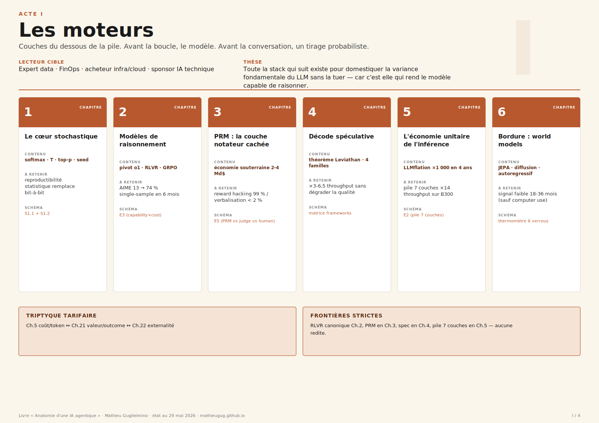
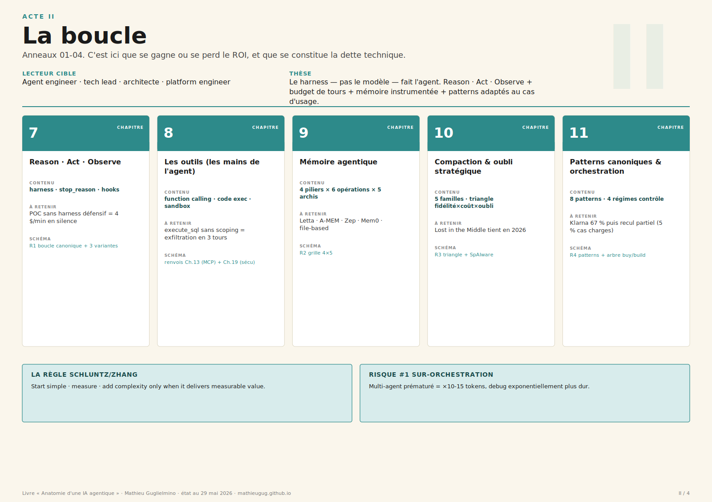
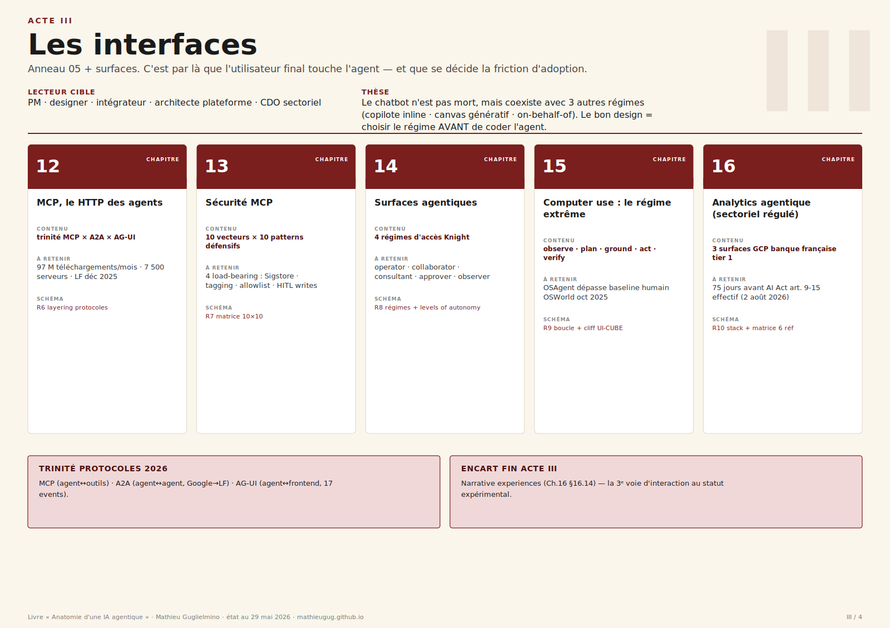
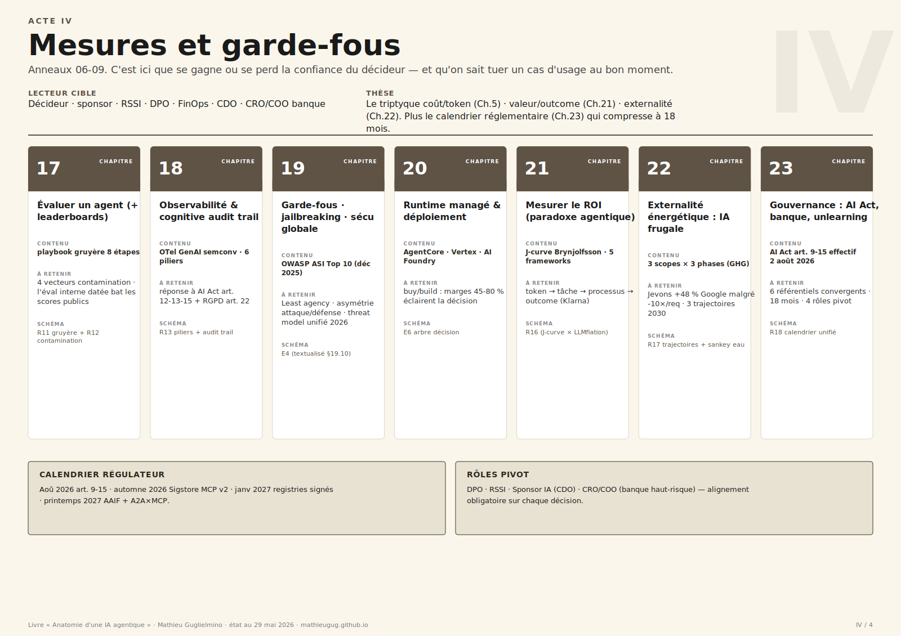

# Sommaire — Livre « Anatomie d'une IA agentique »

> **Manuscrit en cours de production.** État au 4 juin 2026. **25/27 chapitres v1 livrés** + 2 ébauches (ch. 12 ADK, ch. 14 assistants de code). Restent Prologue + Épilogue.
> Voir [`../livre-outline.md`](../livre-outline.md) pour la carte de bataille complète (4 actes, 27 chapitres, schémas R/E, gabarits, frontières inter-chapitres) et [`../journal-livre.md`](../journal-livre.md) pour les audits éditoriaux + tâches restantes par chapitre.

**Repère lecteur** : ✅ v1 livré · 🟡 ébauche · ⏳ à écrire

---

## Prologue

- ⏳ **Prologue — Pourquoi un livre, maintenant**

## Acte I — Les moteurs

> _Couches du dessous de la pile. Avant la boucle, le modèle. Avant la conversation, un tirage probabiliste. Avant le débit en token/sec, un schedule de GPU._
> _Lecteur cible : expert data + acheteur infra/cloud._

| # | Chapitre | Gabarit | Mots |
|---|---|---|---|
| 1 | ✅ [Le cœur stochastique](ch01-coeur-stochastique.md) | encart 8-12 p | ~4 760 |
| 2 | ✅ [Les modèles de raisonnement et la seconde courbe de scaling](ch02-modeles-raisonnement.md) | standard 22 p | ~7 630 |
| 3 | ✅ [La couche notateur cachée (Process Reward Models)](ch03-process-reward-models.md) | standard 22 p | ~7 540 |
| 4 | ✅ [Décode spéculative et la course au token/sec](ch04-decode-speculative.md) | standard 22 p | ~6 590 |
| 5 | ✅ [L'économie unitaire de l'inférence (et son angle mort)](ch05-economie-inference.md) | standard 22 p | ~7 590 |
| 6 | ✅ [Bordure : world models et physique apprise](ch06-world-models.md) (encart) | encart 6-8 p | ~3 340 |

## Acte II — La boucle

> _Anneaux 01-04 (boucle, outils, contexte, patterns), jusqu'aux kits qui servent à la builder. C'est ici que se gagne ou se perd le ROI, et que se constitue la dette technique._
> _Lecteur cible : agent engineer, tech lead, architecte._

| # | Chapitre | Gabarit | Mots |
|---|---|---|---|
| 7 | ✅ [Reason · Act · Observe : le harness et ce qu'il enveloppe](ch07-boucle-agentique.md) (charnière) | charnière 28-40 p | ~9 510 |
| 8 | ✅ [Les outils (les mains de l'agent)](ch08-outils-de-lagent.md) | standard 22 p | ~6 140 |
| 9 | ✅ [Mémoire agentique : 4 piliers, 6 opérations, 5 architectures](ch09-memoire-agentique.md) | standard 22 p | ~6 900 |
| 10 | ✅ [Compaction et oubli stratégique](ch10-compaction.md) | standard 22 p | ~4 880 |
| 11 | ✅ [Patterns canoniques et orchestration multi-agents](ch11-patterns-orchestration.md) (charnière) | charnière 28-40 p | ~7 810 |
| 12 | 🟡 [Construire la boucle : SDK, ADK et frameworks d'agents](ch12-adk-frameworks.md) | standard 18 p | ~5 200 |

## Acte III — Les interfaces

> _Anneau 05 + surfaces. C'est par là que l'utilisateur final touche l'agent — du régime d'accès à l'assistant de code, jusqu'au protocole qui le câble aux outils. C'est là que se décide la friction d'adoption._
> _Lecteur cible : PM, designer, intégrateur, architecte plateforme._

| # | Chapitre | Gabarit | Mots |
|---|---|---|---|
| 13 | ✅ [Surfaces agentiques : quatre régimes d'accès](ch13-surfaces-agentiques.md) | standard 22 p | ~10 370 |
| 14 | 🟡 [Assistants de code : Claude Code, Copilot, Codex, Antigravity](ch14-assistants-de-code.md) | standard 18 p | ~5 400 |
| 15 | ✅ [MCP, le HTTP des agents](ch15-mcp-plateforme.md) | standard 22 p | ~5 550 |
| 16 | ✅ [Sécurité MCP : dix vecteurs × dix patterns](ch16-mcp-securite.md) | standard 22 p | ~5 570 |
| 17 | ✅ [Computer use : le régime extrême](ch17-computer-use.md) | standard 18 p | ~7 530 |
| 18 | ✅ [Analytics agentique : la stack data + IA en sectoriel régulé](ch18-analytics-agentique-banque.md) (dont encart 4 p) | standard 24 p | ~10 800 |

## Acte IV — Mesures et garde-fous

> _Anneaux 06-09 (guardrails, observabilité, runtime, governance). C'est ici que se gagne ou se perd la confiance du décideur._
> _Lecteur cible : décideur, sponsor, RSSI, DPO, FinOps, CDO._

| #   | Chapitre                                                                                          | Gabarit           | Mots    |
| --- | ------------------------------------------------------------------------------------------------- | ----------------- | ------- |
| 19  | ✅ [Évaluer un agent (et débunker les leaderboards)](ch19-evaluation-benchmarks.md) (charnière)    | charnière 28-40 p | ~11 050 |
| 20  | ✅ [Observabilité agentique et cognitive audit trail](ch20-observabilite-cognitive-audit-trail.md) | standard 22 p     | ~6 000  |
| 21  | ✅ [Garde-fous, jailbreaking et sécurité globale](ch21-gardefous-securite-globale.md) (charnière)  | charnière 28-40 p | ~6 720  |
| 22  | ✅ [Runtime managé et déploiement](ch22-runtime-manage.md)                                         | standard 22 p     | ~6 240  |
| 23  | ✅ [Mesurer le ROI (et le paradoxe agentique)](ch23-roi-paradoxe-agentique.md) (charnière)         | charnière 28-40 p | ~8 530  |
| 24  | ✅ [Externalité énergétique : IA frugale](ch24-ia-frugale.md)                                      | standard 22 p     | ~8 120  |
| 25  | ✅ [Gouvernance : AI Act, banque, machine unlearning](ch25-gouvernance-ai-act.md)                  | standard 22 p     | ~9 300  |
| 26  | ✅ [Société : IA et travail](ch26-ia-et-travail.md)                                                | standard 22 p     | ~10 115 |
| 27  | ✅ [Politique : procès Musk v. Altman](ch27-proces-musk-altman.md)                                 | court encart 12 p | ~7 190  |
|     |                                                                                                   |                   |         |

## Épilogue

- ⏳ **Épilogue — Sept paris à dater 2027-2028**

---

## Infographies de couverture par acte

Une par acte, A3 paysage (viewBox 1600×1130). Vue d'avion synthétisant les chapitres de l'acte avec, pour chacun : contenu (en mots-clés), thèse à retenir, schéma signature.

| Acte    | Infographie                                                                                   | Statut |
| ------- | --------------------------------------------------------------------------------------------- | ------ |
| **I**   | [Les moteurs](../../livre/images/20260601-acte1-moteurs-infographie.svg)                      | ✅ v1   |
| **II**  | [La boucle](../../livre/images/20260601-acte2-boucle-infographie.svg)                         | ✅ v1   |
| **III** | [Les interfaces](../../livre/images/20260601-acte3-interfaces-infographie.svg)                | ✅ v1   |
| **IV**  | [Mesures et garde-fous](../../livre/images/20260601-acte4-mesures-garde-fous-infographie.svg) | ✅ v1   |

Générateur idempotent : [`tools/gen_actes_infographics.py`](../../tools/gen_actes_infographics.py).

## Schémas produits ex nihilo pour le livre

| ID       | Schéma                                                                                                                               | Position                                  | Statut                                  |
| -------- | ------------------------------------------------------------------------------------------------------------------------------------ | ----------------------------------------- | --------------------------------------- |
| **S1.1** | [Softmax → T → top-p → tirage : la chaîne mécanique](../../livre/images/20260601-01-softmax-temperature-sampling-chain.svg)          | Ch.1 §1.2                                 | ✅ v1                                    |
| **S1.2** | [Faisceau de 1 000 trajectoires à T=0,7](../../livre/images/20260601-02-variance-trajectoire-1000-rejouages.svg)                     | Ch.1 §1.3                                 | ✅ v1                                    |
| **E3**   | [Capability × Cost : seconde courbe de scaling](../../livre/images/20260601-03-capability-vs-cost-e3.svg)                            | Ch.2 §2.4 (+ renvoi Ch.5, Ch.19)          | ✅ v1                                    |
| **E5**   | [PRM vs LLM-as-judge vs human eval](../../livre/images/20260601-04-prm-vs-judge-vs-human-e5.svg)                                     | Ch.3 §3.7 (+ renvoi Ch.19)                | ✅ v1                                    |
| **E4**   | [Threat model unifié 2026 (six surfaces × quatre parades pivot)](../../livre/images/20260601-e4-threat-model-unifie-2026.svg) | Ch.21 §21.10 (+ cité Ch.10, Ch.16, Ch.17) | ✅ v1                                    |
| **R16**  | [Productivity J-curve × LLMflation × paradoxe agentique](../../livre/images/20260601-r16-jcurve-llmflation-paradoxe.svg)             | Ch.23 §23.2.3 + §23.7 (+ renvoi Ch.5)     | ✅ v1                                    |
| **R18**  | [Calendrier réglementaire 2026-2028 unifié](../../gouvernance/images/20260421-r18-calendrier-reglementaire.svg)                      | Ch.25 §25.2 + §25.10                      | ✅ v1 (livré dans `gouvernance/images/`) |

Tous les autres schémas (R1-R15, R17, R19, E1, E2, E6) sont **réutilisés tels quels** depuis les dossiers source (`anatomie/`, `economie-inference/`, `orchestration-agentique/`, etc.). Voir [`../livre-outline.md`](../livre-outline.md) annexe A pour la liste exhaustive.

---

## Annexes

|     | Annexe                                                                                      | Statut                                                            |
| --- | ------------------------------------------------------------------------------------------- | ----------------------------------------------------------------- |
| A   | Schémas à fusionner (registres R et E)                                                      | 🟡 partiel — voir [`../livre-outline.md`](../livre-outline.md) §A |
| B   | Glossaire (extension de `anatomie/livre-data.js` CONCEPT_DEFS + ~30 entrées spécialisées)   | ⏳ à compléter                                                     |
| C   | Index des dossiers source (chronologique, 28 dossiers)                                      | ⏳ à générer depuis `index.html` racine                            |
| D   | Index des rôles (parcours de lecture par profil RSSI / FinOps / DPO / CDO / Agent Engineer) | ⏳ à compléter                                                     |
|     | Cahier central « 6 schémas pour tout retenir » (E1-E6)                                      | ✅ 6/6 prêts (E1, E2, E3, E4, E5, E6)                              |

---

## Statistiques de production

- **Couverture chapitres** : 25 / 27 v1 + 2 ébauches (ch. 12 ADK, ch. 14 assistants de code) ; restent Prologue et Épilogue à rédiger
- **Volume total chapitres** : ~187 000 mots sur 27 chapitres (~6 900 mots/chapitre en moyenne)
- **Footnotes Tier-A intégrées** : 300+ (cible 12-25 par chapitre standard, 25-50 par chapitre charnière)
- **Schémas réutilisés tels quels** : 60+ depuis les 28 dossiers source
- **Schémas créés ex nihilo pour le livre** : 7 (S1.1, S1.2, E3, E4, E5, R16, R18) — tous v1 livrés

---

## Pour démarrer la lecture

| Profil | Parcours recommandé |
|---|---|
| **Agent engineer / tech lead** | Acte II en entier (Ch.7 → Ch.12), puis Ch.16 et Ch.20 en compléments. Ch.4 et Ch.5 pour l'économie de la pile. |
| **Décideur / CDO / Sponsor IA** | Prologue (quand disponible), Ch.11, Ch.14, Ch.23, Ch.25, Ch.26, Ch.27. TLDR de chaque chapitre Acte I pour le cadre. |
| **RSSI** | Ch.16 et Ch.21 (priorité), Ch.10, Ch.17, Ch.25 (compléments). Threat model unifié 2026 en Ch.21 §21.10. |
| **FinOps / acheteur infra** | Ch.5, Ch.23, Ch.24 (priorité), Ch.22 (compléments). Le triptyque tarifaire Ch.5 ↔ Ch.23 ↔ Ch.24. |
| **DPO** | Ch.10 et Ch.25 (priorité), Ch.20 (cognitive audit trail). |
| **Développeur / praticien** | Ch.14 (assistants de code) puis Ch.12 (builder son agent). Ch.16 pour la sécurité MCP. |
| **PM / designer / intégrateur** | Acte III en entier (Ch.13 → Ch.18). Ch.6 en bordure si computer use ou robotique. |
| **Expert data / chercheur** | Acte I en entier (Ch.1 → Ch.6). Ch.3 et Ch.19 pour l'éval (PRM ↔ benchmarks). |
