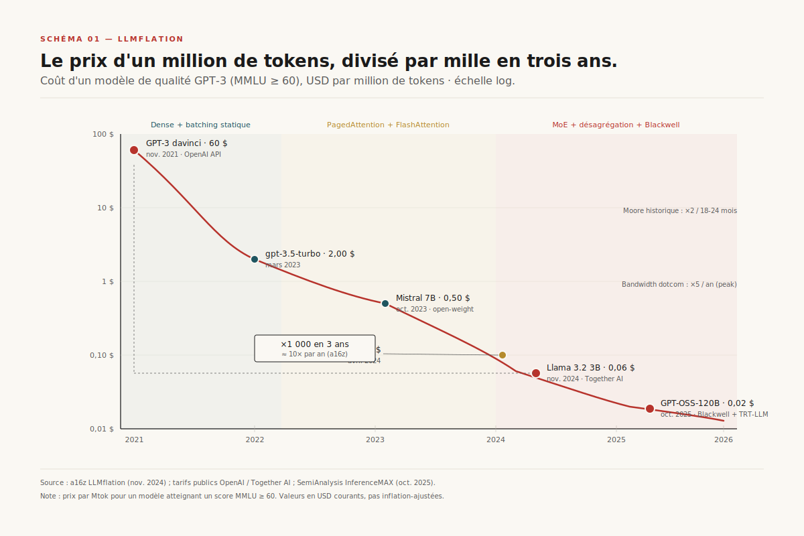
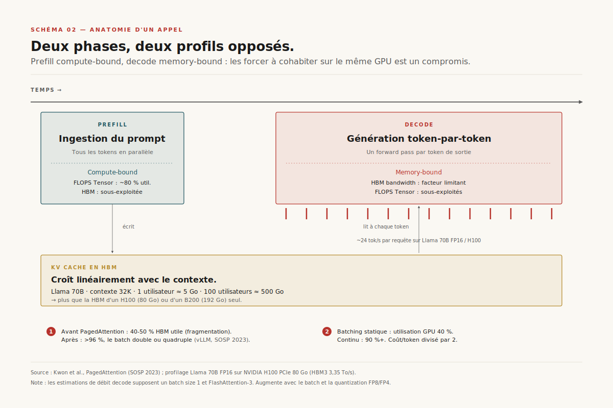
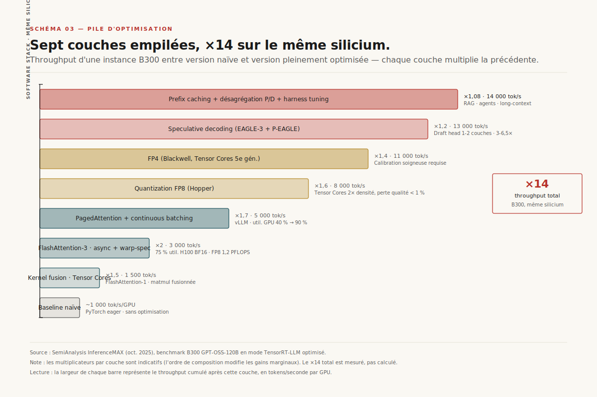
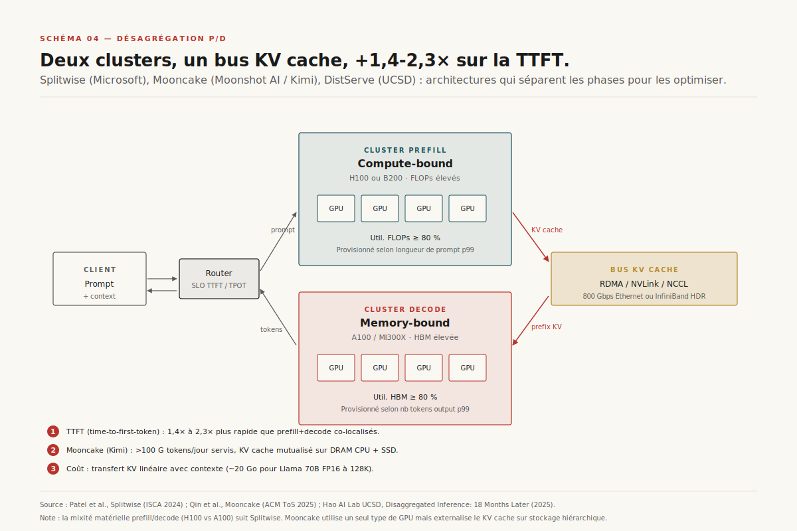
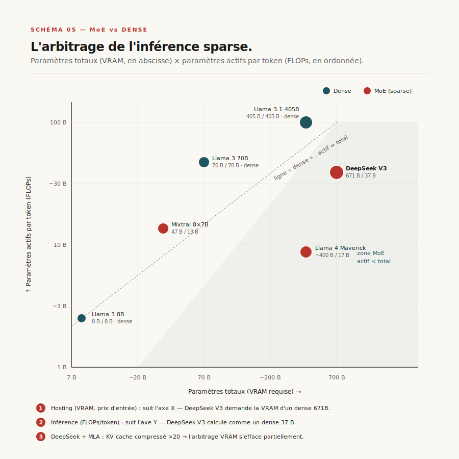
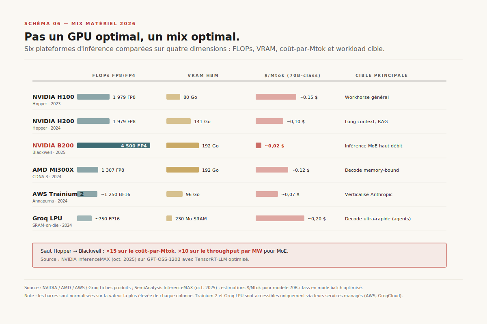
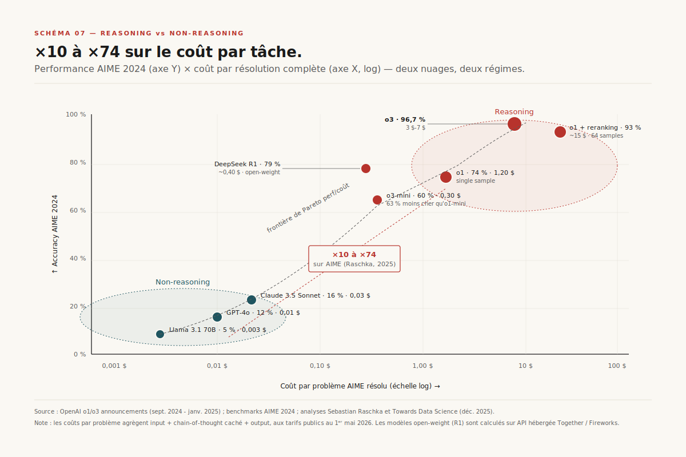

# Chapitre 5 — L'économie unitaire de l'inférence (et son angle mort)

> **Acte I — Les moteurs · Chapitre standard, ~22 pages**
> _Le prix d'un million de tokens a chuté d'un facteur mille en quatre ans — de 60 $ sur GPT-3 en novembre 2021 à 0,02 $ sur GPT-OSS-120B porté par Blackwell en octobre 2025. La trajectoire est documentée, sourcée, vérifiable. Mais elle masque deux mécaniques opposées que le décideur doit lire en parallèle. Sept couches logicielles empilées multiplient le débit par GPU d'un facteur quatorze sur le même silicium — l'écart compétitif se joue dans le harness de service, pas dans le poids du modèle. Et les reasoning models — o1, o3, et leurs cousins — multiplient la facture par tâche d'un facteur dix à soixante-quatorze sur AIME, exactement au moment où le prix unitaire est devenu négligeable. La pile démontée, le mix matériel 2026 lu, les marges fragiles des fournisseurs mesurées : reste la règle structurelle — le décideur paie un prix par token qui baisse pendant que sa facture par tâche monte et que sa courbe d'outcome traverse le creux. Trois lectures d'une même facture — et trois pièges contractuels traçables._

> [!QUESTION] Question d'ouverture
> Pourquoi un décideur qui signe en mai 2026 un contrat 3 ans sur la base d'un prix au million de tokens — et qui croit en bénéficier mécaniquement chaque trimestre — déchante-t-il six mois plus tard sur les reasoning models, dont la facture par requête peut être dix à soixante-quatorze fois supérieure à perf comparable ? Et pourquoi le même décideur, qui signe un RFP indexé sur des `tokens/sec` mesurés en batch 1, découvre-t-il en multi-tenant à batch 32-64 qu'il a contractualisé sur un peak qu'aucun fournisseur n'atteint à charge réelle ?

> [!TLDR] TL;DR décideur
> - ==**LLMflation ×1 000 en quatre ans, 10×/an.**== 60 $ → 0,06 $ → 0,02 $/Mtok. Trois régimes : dense + batching statique 2021-2023 ; PagedAttention + FlashAttention-3 2023-2024 ; MoE + désagrégation + Blackwell 2024-2026. Plus rapide que Moore et que la dotcom.
> - **Deux phases opposées.** Prefill compute-bound (80 % util FLOPS H100), decode memory-bound (~24 tok/s/requête sur Llama 70B FP16). KV cache dimensionne la VRAM, croît linéairement en contexte.
> - ==**Sept couches multiplient le throughput ×14 sur B300.**== Kernel fusion ×1,5 → FA-3 ×2 → PagedAttention + batching continu ×2-4 → FP8/FP4 ×2 chacune → speculative decoding ×3-6,5 → prefix caching ×10 situationnel → désagrégation prefill/decode. Aucune n'est un breakthrough ; l'avantage est dans l'intégration cohérente.
> - **Désagrégation Splitwise / Mooncake / DistServe.** TTFT 1,4-2,3× plus rapide. Mooncake (Kimi) sert ==plus de 100 Mds tokens/jour== en KVCache-centric. Coût : ~20 Go par 128 K Llama 70B FP16.
> - **MoE bat dense de même total, perd contre dense de même actif** (Epoch). DeepSeek V3 (671 B/37 B, MLA ×20 KV cache) — modèle qualité GPT-4 pré-entraîné pour 5,6 M$ de compute pur (×5-10 R&D incluse).
> - **Mix matériel 2026 :** H100 ~0,15 $/Mtok, H200 ~0,10 $, B200 ~0,02 $ (GPT-OSS-120B), MI300X ~0,12 $, Trainium 2 -30/-40 % vs H100 sur Bedrock, Groq LPU 800 tok/s/user premium. Blackwell : ×15 coût/Mtok, ×10 throughput/MW MoE.
> - ==**Marges fragiles vs SaaS classique.**== Together ~45 %, Fireworks ~50 % cible 60 %, OpenAI/Anthropic ~60-70 %, hyperscalers 70-80 %. COGS dominé par GPU + réseau + énergie + software stack — industrie low-cost.
> - **Angle mort reasoning.** AIME ==×10 à ×74== vs non-reasoning équivalent. Nuances : o3-mini -63 % vs o1-mini ; rentable selon workload ; spec partiellement compatible. ==**La déflation tokens/sec est partiellement consommée par l'inflation tokens/requête.**==

---

## 5.1 LLMflation — la chute ×1 000 en quatre ans

### 5.1.1 De 60 $ à 0,06 $ à 0,02 $ — trois ordres de grandeur en quatre ans

En novembre 2021, OpenAI ouvre l'API GPT-3 à **60 $/Mtok**. Trois ans plus tard, le même score MMLU se paie **0,06 $** chez Together AI sur Llama 3.2 3B — ==facteur 1 000==[^1]. Un an encore, en octobre 2025, NVIDIA InferenceMAX mesure **0,02 $/Mtok à 55 tok/s/user sur GPT-OSS-120B** sur système Blackwell pleinement optimisé[^8]. Trajectoire documentée, reproductible, ouverte — pas un slogan marketing. Pour cadrer : Moore historique ~1,5×/an, déflation bandwidth dotcom ~5×/an. ==La LLMflation tient 10×/an pendant trois ans — plus rapide que Moore, plus rapide que la dotcom==. Aucune trajectoire technique connue ne tient ce rythme pendant dix ans : les prévisions de continuité naïve doivent être recalibrées.

### 5.1.2 a16z baptise le phénomène « LLMflation »

Andreessen Horowitz, via Guido Appenzeller, baptise le phénomène **LLMflation** en novembre 2024[^1]. Le calcul : sur un échantillon de modèles de qualité GPT-3 (mesurée par MMLU comme proxy), le prix au million de tokens divise par dix chaque année depuis trois ans. La note ne prétend pas que la pente continuera ; elle nomme un fait observé. ==C'est cette discipline méthodologique — benchmark unique, fenêtre bornée, fournisseurs nommés — qui en a fait la référence industrielle citée par tous les analystes en 2025-2026.==

> [!QUOTE] Guido Appenzeller, *Welcome to LLMflation*, a16z, novembre 2024
> *« At a high level, the inference cost of a model with constant performance has been decreasing by 10× per year for the past 3 years. This is faster than Moore's law. […] We are not seeing the end of this trend yet, but the easy gains have been collected. »*[^1]

### 5.1.3 Trois régimes successifs

La trajectoire de 60 $ à 0,02 $ n'est pas linéaire. Trois régimes distincts se découpent — chacun porté par une famille de leviers technologiques différents.

**2021 — début 2023 : modèles encoder-decoder denses.** Coût dominé par les FLOPs de génération autorégressive sur GPT-3 (175 B denses) et Codex. L'utilisation GPU plafonne à 30-40 % — KV cache mal géré, batching statique. Le prix descend d'environ 60 $ à 5-10 $ — facteur 6-12 sur deux ans, déjà respectable, sans rupture.

**2023 — milieu 2024 : la révolution serving.** Trois publications déclenchent la bascule. PagedAttention (vLLM, SOSP 2023) résout la fragmentation du KV cache et permet le batching continu[^2]. FlashAttention-3 (juillet 2024) exploite l'asynchronie des Tensor Cores Hopper et fait passer l'utilisation H100 de 35 % à 75 % en BF16[^3]. Mistral 7B, Mixtral 8×7B et Llama 2/3 popularisent l'open-weight performant. ==Le prix du token chute d'un facteur 30 en dix-huit mois==.

**2024 — 2026 : MoE + désagrégation + Blackwell.** DeepSeek V3 (671 B totaux / 37 B actifs) et Llama 4 imposent le MoE en production[^4]. Splitwise et Mooncake industrialisent la séparation prefill/decode[^5][^6]. Hopper → Blackwell apporte **×15 sur le coût-par-million-tokens** grâce au support FP4 natif[^8]. Les benchmarks InferenceMAX (octobre 2025) mesurent **0,02 $/Mtok à 55 TPS/utilisateur sur GPT-OSS-120B** sur système Blackwell pleinement optimisé[^8][^9].

### 5.1.4 Analogie kWh, pas Moore ni dotcom

L'analogie la plus fidèle est la **baisse du prix du kWh** pendant l'industrialisation du XXᵉ siècle : combinaison de meilleurs combustibles (silicium plus dense), de meilleures turbines (FlashAttention, PagedAttention) et d'une intégration verticale du grid (désagrégation prefill/decode). ==Aucun des trois leviers pris isolément n'aurait produit le ×1 000 — c'est leur empilement coordonné qui le rend possible==. La prochaine décade de gains demandera une combinaison que personne ne sait nommer aujourd'hui.

> [!INFO] Voir [Ch. 23 — Mesurer le ROI (et le paradoxe agentique)](ch23-roi-paradoxe-agentique.md)
> Le **paradoxe agentique** — le décideur paie moins par token mais peut payer plus par tâche, et la valeur business ne suit qu'avec un décalage de 12-36 mois (J-curve Brynjolfsson). La double-page éco du schéma R16 place côte à côte la courbe LLMflation §5.1 et la J-curve d'outcome. C'est le **triptyque tarifaire** repris en clôture §5.10.

---

## 5.2 Anatomie d'un appel — prefill compute-bound vs decode memory-bound

### 5.2.1 Prefill — tous les tokens du prompt en parallèle

Un appel d'inférence se découpe en deux phases aux profils opposés. La première, le **prefill**, ingère le prompt complet en un seul forward parallèle — ==tous les tokens d'entrée traités simultanément==. Les tensor cores du GPU saturent, la HBM travaille en deuxième rideau. Sur un H100, un prefill atteint **80 % d'utilisation FLOPS** si le batch est correctement formé. Régime *compute-bound* — le goulot est le calcul.

### 5.2.2 Decode — un token à la fois, plafonné par la HBM

La seconde phase, le **decode**, génère les tokens de sortie un par un. À chaque pas, le modèle lit l'intégralité de ses poids depuis la HBM pour produire un seul token. Sur Llama 70B FP16, ==140 Go à charger par token==. La HBM3 du H100 plafonne à 3,35 To/s — soit théoriquement **~24 tokens/seconde par requête**. Les FLOPs tensor sont sous-utilisés (5-15 % du peak). Régime *memory-bound*. Cette asymétrie est le fait fondateur de toute l'économie de l'inférence : prefill et decode ont des profils opposés, et les forcer à cohabiter sur le même GPU revient à demander à un sprinter et un marathonien de partager un short.

### 5.2.3 KV cache — écrit pendant le prefill, lu à chaque token de decode

Entre les deux, le **KV cache**. Pour éviter de recalculer l'attention sur tous les tokens précédents, le modèle stocke en HBM les clés et valeurs déjà calculées. Taille linéaire en contexte. Sur Llama 70B à 32 K tokens, le KV cache pèse ~5 Go par utilisateur ; pour servir 100 utilisateurs concurrents, 500 Go de HBM — ==plus que toutes les variantes commerciales du H100 (80 Go) et du B200 (192 Go) prises individuellement==. C'est la contrainte qui dicte l'architecture du serveur, dimensionne la VRAM, et explique pourquoi la VRAM disponible est devenue la métrique de premier rang du mix matériel (cf. §5.7).

### 5.2.4 PagedAttention et batching continu — la sortie du régime « démo »

Avant PagedAttention (2023), le KV cache était alloué en blocs contigus de taille maximale[^2]. Un utilisateur qui demandait 32 K tokens mais en consommait 4 K gaspillait les 28 K restants — utilisation effective de la HBM 40-50 %. ==PagedAttention applique la mémoire virtuelle paginée des OS : blocs de 16-256 tokens alloués à la demande, indexés par translation table. Le gaspillage tombe à < 4 %==, le batch utilisable double ou quadruple[^2]. Le **batching continu** (introduit par Orca, popularisé par vLLM) ajoute des requêtes au batch dès qu'une fente se libère (decode terminé), en remplacement du batching statique qui attendait que la fenêtre se remplisse. ==L'utilisation GPU passe de 40 % à 90+ %, le coût par token chute de 50 % en production==[^2]. C'est, en termes économiques, le levier qui a sorti l'inférence du régime « démo-éphémère » pour la faire entrer en production multi-tenant industrielle. Plus aucun serveur sérieux ne tourne en batching statique en 2026.

---

## 5.3 La pile sept couches d'optimisation

> [!NOTE] Légende du schéma
> ==*« Sept couches logicielles empilées multiplient le throughput d'un facteur 14 sur un B300 — sans changer une ligne de hardware. Le silicium fait son travail ; l'écart compétitif se joue dans le harness de service. »*==

Les gains de l'inférence ne viennent pas d'une seule innovation. Ils viennent de l'**empilement** de sept couches logicielles, chacune apportant 1,3× à 4× sur la précédente. Sur un B300, une version naïve produit environ 1 000 tokens/seconde par GPU ; une version pleinement optimisée atteint 14 000 — **un facteur 14 sur le même silicium**[^9]. C'est cette multiplication cumulée, et non un seul levier vedette, qui rend la trajectoire LLMflation soutenable.

### 5.3.1 Couche 1 — Kernel fusion + tensor cores (×1,5)

Fusionner softmax + matmul + dropout dans un seul kernel CUDA évite les allers-retours en HBM. **FlashAttention-1** (2022) a popularisé le pattern. Gain marginal mais structurant : c'est le socle sur lequel les six couches suivantes s'installent.

### 5.3.2 Couche 2 — FlashAttention-3 (×2)

En exploitant l'asynchronie des Tensor Cores Hopper, le **warp-specialization** et le **block quantization**, FA-3 atteint ==75 % d'utilisation FLOPS H100 en BF16 (vs 35 % pour FA-2) et 1,2 PFLOPS en FP8==[^3]. Le même H100, sous deux versions du même kernel, produit deux régimes de performance qui diffèrent d'un facteur deux. Travail entièrement logiciel ; tensor core inchangé.

### 5.3.3 Couche 3 — PagedAttention + continuous batching (×2-4)

Gain combiné ×2 à ×4 selon le profil de charge — plus le mix de requêtes est hétérogène (longueurs variées, arrivées asynchrones), plus le gain est élevé. ==C'est cette couche qui rend possible l'arbitrage économique : un fournisseur qui passe d'un util GPU de 40 % à 90 % divise structurellement son coût/token par deux à charge égale==. Mécanique détaillée au §5.2 ci-dessus.

### 5.3.4 Couches 4-5 — Quantization FP8 / FP4 (×2 chacune)

La **FP8** sur Hopper est devenue standard pour l'inférence en 2024 ; la **FP4** sur Blackwell apporte un nouveau facteur 2 sans perte significative de qualité sur les modèles correctement calibrés. DeepSeek V3 a démontré la faisabilité de l'**entraînement** FP8 à grande échelle[^4]. Le saut FP4 sur Blackwell est l'un des deux ingrédients du ×15 sur coût/Mtok (l'autre étant la densité HBM3e ; cf. §5.7).

### 5.3.5 Couche 6 — Speculative decoding (×3-6,5)

Une tête de prédiction légère génère plusieurs tokens candidats que le modèle cible vérifie en un seul forward pass[^7]. **EAGLE-3** atteint 4,5-5× sur Llama 3.1 8B et 3,0-4,5× sur Llama 3.3 70B en 2025. ==×3 à ×6,5 sur le même silicium==, mais perte nette dès que l'on quitte le régime memory-bound à acceptance élevée — la couche la plus traître à calibrer.

> [!INFO] Voir [Ch. 4 — Décode spéculative et la course au token/sec](ch04-decode-speculative.md)
> Mécanique mathématique (théorème d'équivalence de Leviathan, Kalman, Matias — sortie bit-identique en sampling stochastique) et deux pièges traîtres en production (acceptance rate qui dérive silencieusement, batching qui annule le gain au-delà d'un seuil).

### 5.3.6 Couche 7 — Prefix caching (×10 situationnel)

Mémoriser le KV cache des préfixes communs (system prompt, retrieved documents) entre requêtes évite des prefills redondants. Sur les workloads **RAG**, le gain peut atteindre 10×. ==Anthropic, OpenAI et Google le facturent désormais à 10 % à 25 % du prix nominal du token cached==. C'est devenu une primitive de tarification visible côté API. Le décideur qui dimensionne son budget API doit explicitement modéliser sa fraction de tokens cacheables — typiquement 30-60 % sur un déploiement RAG mature.

### 5.3.7 Couche 8 — Désagrégation prefill/decode

Séparer prefill (compute-bound) et decode (memory-bound) sur des pools de calcul distincts, communicants par un transfert de KV cache via réseau RDMA. C'est la couche la plus structurelle des sept — celle qui change l'architecture du datacenter et pas seulement le runtime du serveur. Développement complet au §5.5 ci-dessous.

> [!INFO] Voir [Ch. 24 — Externalité énergétique : IA frugale](ch24-ia-frugale.md)
> Les sept couches d'optimisation §5.3 sont **les mêmes leviers techniques** que ceux que Patterson 2021 nomme dans son ×100 à ×1 000 sur l'empreinte d'un entraînement (choix combiné DC × DNN × processeur), repris sous l'angle externalité environnementale. ==Ici, TWh qui se traduisent en lignes de facture cloud ; là, TWh qui se traduisent en grid stress local, embodied carbon, eau.==

---

## 5.4 Le harness comme avantage compétitif

### 5.4.1 Aucune couche n'est un breakthrough en soi

==Aucune des sept couches §5.3 n'est un breakthrough scientifique au sens fort.== FA-3 est une optimisation de kernel, PagedAttention emprunte une idée vieille de cinquante ans aux OS, le batching continu est une heuristique de scheduling, la quantization FP8/FP4 une discipline de calibration, la spec existait en théorie depuis 2018, le prefix caching est une primitive standard, la désagrégation une décision architecturale. Pris isolément, chacun est documenté dans la littérature parfois depuis dix ans. C'est leur **intégration cohérente** dans un harness qui produit le ×14 — et c'est cette intégration qui est devenue l'avantage compétitif réel.

### 5.4.2 L'intégration cohérente est l'art difficile

Un harness comme vLLM, TensorRT-LLM, SGLang ou DeepSpeed-MII doit gérer simultanément la planification du KV cache paginé, le scheduling en batch continu, les kernels FA par GPU cible, les calibrations de quantization par modèle, les vérifications spéculatives avec gestion d'acceptance rate par tenant, le routing prefill/decode, et la propagation cohérente des paramètres de sampling entre target et draft — sans que les couches ne se piétinent. ==C'est une dette d'ingénierie, pas une dette de recherche== — et elle se paie en équipes systèmes qui maintiennent le harness, suivent l'upstream, calibrent les seuils sous charge.

### 5.4.3 Dette d'ingénierie, pas dette de recherche

C'est pourquoi l'inférence est devenue en 2026 une industrie distincte de la R&D modèle. Un chercheur ML qui sait entraîner un MoE 671 B n'est pas le même profil qu'un ingénieur systèmes qui calibre un seuil de désactivation conditionnelle de spéculation par batch sous mix workload variable. ==Les fournisseurs qui survivent à la déflation sont ceux qui ont industrialisé cette dette d'ingénierie.== Le bon modèle mal servi coûte trois fois plus cher au million de tokens — et la marge brute de l'inférence est trop fragile pour absorber un facteur trois.

> [!IMPORTANT] Le harness comme avantage compétitif
> ==L'avantage compétitif d'un fournisseur d'inférence en 2026 ne se loge plus dans l'invention d'une optimisation nouvelle — toutes les briques sont publiques.== Il se loge dans la maturité du **harness de service** : qualité du scheduler hybride, instrumentation fine de l'acceptance rate spéculative, rapidité d'intégration des nouvelles versions de FlashAttention, solidité du routing prefill/decode sous charge mixte. C'est ce qui distingue Together, Fireworks, SGLang et TensorRT-LLM d'une implémentation amateur de vLLM stock. C'est aussi ce qui rend les RFP sur le `tokens/sec peak` trompeurs : le peak est facile, c'est le `p95 TTFT` sous charge représentative qui mesure la maturité du harness.

> [!INFO] Voir [Ch. 22 — Runtime managé et déploiement](ch22-runtime-manage.md)
> La décision **buy / build** côté runtime : self-hosted vLLM, managé Together / Fireworks / Anyscale, hyperscaler Bedrock / OpenAI Service. ==La marge fragile §5.9 éclaire directement cette décision.== Externaliser chez un managé coûte typiquement 20-30 % de marge intermédiaire ; ce delta achète la maintenance du harness, le suivi upstream, la calibration multi-tenant. Choisir un harness, c'est choisir un mainteneur — et sur 18-36 mois, sa stabilité pèse plus que le delta de 10 % sur le `tokens/sec` annoncé.

---

## 5.5 Désagrégation Splitwise / Mooncake / DistServe

L'asymétrie posée au §5.2 a une conséquence directe en production : si un utilisateur lance un long prefill (RAG sur 128 K tokens, par exemple), les utilisateurs en cours de decode subissent une latence dégradée — pic de TTFT, dégradation du TPOT. À l'inverse, si on optimise pour le decode, le prefill est sous-utilisé. La **désagrégation prefill/decode** sépare ces deux phases sur des pools de calcul distincts, communicants par un transfert de KV cache via réseau RDMA. Trois architectures de référence se sont imposées en 18 mois.

### 5.5.1 Splitwise (Microsoft / UW, ISCA 2024)

Mélange hétérogène : **prefill sur H100** (compute-bound), **decode sur A100** (memory-bound, moins cher)[^5]. Communication NCCL couche par couche — le KV cache se transfère à mesure que les couches du prefill sont produites, ce qui masque la latence réseau derrière le calcul. Gain mesuré : ==1,4× sur la cost-per-query à perf égale==. Intuition économique limpide : utiliser le bon GPU pour le bon profil, plutôt que payer du H100 pour faire tourner du decode memory-bound.

### 5.5.2 Mooncake (Moonshot AI, Kimi) — KVCache-centric

Architecture **KVCache-centric** : un pool de KV cache partagé exploite la DRAM CPU et les SSDs des nœuds GPU sous-utilisés. ==Mooncake sert plus de 100 milliards de tokens par jour aux utilisateurs Kimi, déployé sur des milliers de nœuds==[^6]. Transfert RDMA pour latences sub-milliseconde. Mooncake a fait du KV cache un *citoyen de première classe* du système — pas un sous-produit de l'attention, mais une ressource allouée, transférée, réutilisée. C'est l'implémentation à la plus large échelle en production en 2026.

### 5.5.3 DistServe (UCSD, OSDI 2024) — SLO indépendants

Sépare prefill et decode pour respecter des **SLO de TTFT et TPOT indépendants**[^13]. L'apport théorique : formaliser le **dimensionnement par SLO**. Un fournisseur qui s'engage sur `TTFT p95 ≤ 500 ms` et `TPOT p95 ≤ 50 ms` peut calculer combien de GPU prefill et combien de GPU decode provisionner par tranche horaire, en fonction de la distribution observée des longueurs de prompts et de générations.

### 5.5.4 Coût réseau et avantage hyperscaler

==Pour un contexte 128 K sur Llama 70B FP16, on déplace ~20 Go de prefill vers decode== — linéaire en contexte. Le réseau devient un budget à part entière : 800 Gbps Ethernet ou InfiniBand HDR/NDR par nœud sur les datacenters d'inférence modernes. Gains TTFT mesurés : **1,4 à 2,3×**[^13]. L'effet économique est plus subtil que la latence. La désagrégation permet d'**allouer** le hardware au profil de charge — prefill généreux côté RAG/code, decode généreux côté chat. ==Cette flexibilité d'allocation est la principale raison pour laquelle les hyperscalers maintiennent un avantage de coût structurel sur les spécialisés== — trafic diversifié, rééquilibrage dynamique. Un spécialiste qui sert un workload monolithique paie le coût d'opportunité en pleine taille.

---

## 5.6 MoE vs dense — DeepSeek V3 et l'inflexion d'architecture

L'architecture **Mixture of Experts** (MoE) découple les paramètres totaux des paramètres actifs. DeepSeek V3 : ==671 milliards de paramètres au total, ~37 milliards activés== par token[^4]. Mixtral 8×7B : 47 B / 13 B. Les FLOPs par token sont déterminés par les paramètres *actifs* (coût de génération), mais la VRAM par les paramètres *totaux* (coût de hosting).

### 5.6.1 Arbitrage VRAM × FLOPs — la nouvelle équation économique

==**MoE bat un dense de même nombre total de paramètres en throughput, mais perd contre un dense de même nombre de paramètres actifs**==[^11]. Sur un workload à fort traffic — la VRAM des poids amortie sur des milliers de requêtes — le MoE gagne. Sur un workload à faible traffic — chaque requête « paie » sa part de VRAM — le dense gagne. C'est l'inverse de l'intuition naïve « moins de paramètres actifs = toujours moins cher ». La règle, formulée par Epoch AI[^11], est devenue l'invariant économique de la décision d'architecture en 2026 — et elle déplace la conversation d'« est-ce que DeepSeek V3 est moins cher que Llama 3.1 405B ? » à « pour mon profil de charge, quelle architecture amortit le mieux la VRAM ? ».

### 5.6.2 Trois techniques structurantes

**Expert parallelism + all-to-all.** Les experts sont distribués entre GPU. Une requête activant les experts 3 et 7 nécessite un all-to-all entre les nœuds qui les hébergent. Le trafic réseau se déplace du data parallelism (gradients en training) vers l'inférence (activations). NVLink 5 et InfiniBand NDR rendent ce trafic absorbable — sans bande passante inter-GPU suffisante, le MoE perd l'essentiel de son avantage.

**Auxiliary-loss-free balancing.** Le routeur qui choisit les experts doit éviter le déséquilibre — sinon certains experts saturent pendant que d'autres dorment. DeepSeek V3 introduit un *auxiliary-loss-free balancing* qui élimine le coût d'entraînement d'une perte auxiliaire historiquement coûteuse[^4].

**Multi-head Latent Attention (MLA).** DeepSeek V3 compresse le KV cache via une projection latente. Pour un contexte 128 K, ==le KV cache de Llama 70B pèse ~20 Go ; celui de DeepSeek V3 environ 1 Go — un facteur 20==. C'est la véritable raison pour laquelle DeepSeek peut servir des millions d'utilisateurs depuis une infrastructure modeste : la VRAM par utilisateur tombe d'un ordre de grandeur, la concurrence supportée par GPU monte d'autant.

> [!NOTE] MLA — le détail technique qui change le dimensionnement HBM
> Multi-head Latent Attention compresse les clés et valeurs sur un axe latent de dimension faible (typiquement 64-128 vs 4 096-8 192 en attention multi-tête classique), puis les décompresse à la volée. ==Facteur de compression observé sur DeepSeek V3 : ×20 sur 128 K contexte==. C'est l'innovation la moins visible mais la plus structurellement importante de DeepSeek V3 — elle rend le modèle servable, là où un Llama 70B à 128 K contexte demanderait 50 % de la HBM B200 par utilisateur.

### 5.6.3 Économie DeepSeek V3 — 5,6 M$ de compute pur

Chiffres publics : ==**2,664 millions d'heures H800 pour le pré-entraînement**==, à 2 $/heure → **5,6 M$** pour le seul run de pré-entraînement[^4]. À comparer à Llama 3.1 405B, ~30,8 millions d'heures H100 — environ ×12 plus cher en compute pur.

> [!ATTENTION] Le chiffre 5,6 M$ ne couvre pas la R&D
> ==SemiAnalysis a souligné dès la publication de DeepSeek V3 que les 5,6 M$ ne couvrent ni la R&D, ni les expérimentations préliminaires, ni les salaires — coût total sans doute ×5-10, soit 30-60 M$.== Crucial à dire en clair pour ne pas tomber dans le slogan « GPT-4 pour le prix d'une Tesla ». L'écart avec Llama 3.1 405B reste massif : ×4-8 tous frais inclus, ×12 compute pur. DeepSeek a démontré qu'un modèle qualité GPT-4 peut être entraîné pour < 10 M$ de compute pur et servi à 60 % moins cher qu'OpenAI à qualité équivalente — argument économique du siècle, sans l'enjoliver.

---

## 5.7 Mix matériel 2026 — H100, H200, B200, MI300X, Trainium 2, Groq LPU

Le marché de l'inférence en 2026 reste dominé par NVIDIA, mais avec une **diversification croissante** de la couche silicium. Quatre acteurs comptent vraiment, et deux paris alternatifs s'imposent sur des niches précises.

### 5.7.1 Tableau de référence — $/Mtok sur modèle 70B-class

| Plateforme | TFLOPS FP8/FP4 | VRAM | Cible | $/Mtok |
|---|---|---|---|---|
| **NVIDIA H100** (Hopper, 2023) | 1 979 FP8 | 80 Go HBM3 | Workhorse | ~0,15 $ |
| **NVIDIA H200** (Hopper, 2024) | 1 979 FP8 | 141 Go HBM3e | Long context | ~0,10 $ |
| **NVIDIA B200** (Blackwell, 2025) | 4 500 FP4 | 192 Go HBM3e | Inférence MoE | ~0,02 $ (GPT-OSS-120B) |
| **AMD MI300X** (CDNA 3, 2024) | 1 307 FP8 | 192 Go HBM3 | Anti-NVIDIA | ~0,12 $ |
| **AWS Trainium 2** | — | — | Bedrock Anthropic | -30/-40 % vs H100 |
| **Groq LPU** | — | — | Ultra-low latency | 800 tok/s/user, premium |

Source : InferenceMAX / SemiAnalysis 2025, fiches produits constructeurs[^9].

### 5.7.2 Saut Blackwell — ×15 sur coût/Mtok, ×10 throughput/MW MoE

Le saut Hopper → Blackwell est vertical. NVIDIA revendique **×15 sur le coût-par-million-tokens** et **×10 sur le throughput par mégawatt** pour les charges MoE[^8]. Moteur principal : support natif FP4 (Tensor Core de cinquième génération), qui double la densité de calcul à erreur acceptable. NVLink 5 (1,8 To/s par GPU) divise par deux la latence des all-to-all MoE — ce qui rend les architectures à expert parallelism (DeepSeek V3, Mixtral, Llama 4 MoE) substantiellement plus efficaces. Sur GPT-OSS-120B en TensorRT-LLM, ==un B200 produit 60 000 tokens/seconde par GPU à 1 000 tokens/seconde par utilisateur==[^8].

### 5.7.3 AMD MI300X — déployé Microsoft, Meta, Oracle

Compétitif sur le papier (192 Go HBM3, 1 307 TFLOPS FP8) ; en pratique **ROCm vs CUDA** reste le talon d'Achille. ==Microsoft, Meta et Oracle ont déployé des MI300X en volume==, surtout pour le **decode memory-bound** où la VRAM compte plus que les FLOPS. Le MI300X est aussi le levier de négociation des prix NVIDIA — l'existence d'une alternative crédible déplace les marges même quand le volume déployé reste minoritaire.

### 5.7.4 AWS Trainium 2 / Inferentia 3 — Claude sur Bedrock

AWS facture Anthropic Claude sur Trainium 2 à ==30-40 % en dessous des mêmes modèles sur H100==. Pari : **intégration verticale** (silicium maison + datacenter + service managé) absorbe les marges intermédiaires. Si Trainium 2 produit ce qu'il promet à volume, le coût marginal AWS sur l'inférence devient incompressible par les concurrents qui paient la marge NVIDIA. Inferentia 3 est la version dédiée pure inférence du même pari.

### 5.7.5 Groq, Cerebras, SambaNova — premium latence

**Decode ultra-rapide**. La **LPU de Groq** dépasse 800 tokens/seconde/user sur Llama 3 70B contre ~200 sur un H100 optimisé[^9]. Coût/token plus élevé qu'un B200, mais la latence justifie un premium pour **agents en boucle serrée** et **voice apps**. Cerebras et SambaNova jouent la même partition (wafer-scale, dataflow). ==Ces trois acteurs ne menacent pas le volume NVIDIA mais défendent une niche où la latence est le KPI dominant.==

### 5.7.6 « Pas un GPU optimal, mais un mix optimal pour un workload donné »

==L'enseignement industriel : il n'y a pas un GPU optimal, mais un **mix optimal pour un workload donné**==. Une API serveuse à 10 $/utilisateur-mois aura un mix dominé H100 + B200 ; un agent temps-réel à 100 $/utilisateur-mois acceptera Groq pour le decode et H100 pour le prefill ; un RAG long contexte privilégiera H200 et MI300X pour leur HBM ; Claude sur Bedrock acceptera Trainium 2 contre une remise structurelle.

> [!ATTENTION] Le mix prefill/decode change avec le workload — un contrat sur mix anticipé est un pari
> Un fournisseur dimensionné « 60 % decode court / 40 % prefill long » mesure son coût/token sur ce mix. Si le client adopte des agents en 2026 et bascule à « 30 % decode court / 70 % prefill RAG long », le coût réel s'effondre — et le contrat signé sur l'ancien mix n'a plus de fondement. ==Un contrat 3 ans sur prix/token sans **clause de révision sur évolution du mix prefill/decode** est un pari, pas une garantie==. Bonne pratique : clause trimestrielle de re-calibrage sur observation effective du mix + audit côté client.

---

## 5.8 L'angle mort — le reasoning ré-explose le coût par tâche

L'angle mort est arrivé fin 2024 avec **o1** et la série des reasoning models. Ces modèles ne génèrent pas plus vite — ils génèrent **plus**. Avant la réponse finale, ils produisent une longue chaîne de pensée invisible qui peut représenter 5 à 50× le nombre de tokens output.

### 5.8.1 o1, o3 — 5-50× tokens output via CoT invisible

OpenAI documente dans *Learning to reason with LLMs* (sept. 2024) que o1 et o3 produisent une chaîne de pensée invisible facturée comme tokens de génération[^12]. Sur AIME hard, 50 000 tokens internes pour 500 tokens visibles ; sur GSM8K facile, l'overhead retombe à 5-10×. La facture compte chaque token de raisonnement.

### 5.8.2 AIME mesuré ×10 à ×74 vs non-reasoning

==Les reasoning models sont **10 à 74 fois plus chers** à exploiter que leurs équivalents non-reasoning sur AIME==[^12]. Facteur exact selon modèle (o1 vs o3 vs o3-mini), difficulté, et stratégie de sampling (mono-sample vs best-of-N). Ordre de grandeur stable : 10 à 100, pas 2 à 5. Le test-time compute relance la course aux coûts — et déplace la bataille du « modèle moins cher » vers le « raisonnement moins cher ».

### 5.8.3 Trois nuances tempérantes

**L'efficacité monte vite.** ==o3-mini est 63 % moins cher qu'o1-mini à performance comparable==[^12]. La courbe industrielle sur les reasoning models réplique celle de la pile à sept couches — chaque génération apporte des gains d'efficience substantiels. Si le rythme se maintient, l'écart se réduira sur 18-36 mois.

**Reasoning rentable seulement quand le workload le mérite.** Un chatbot conversationnel n'a pas à invoquer un raisonnement à 50 K tokens. Router systématiquement vers un reasoning model par défaut, c'est payer pour rien. ==Le smart routing — classifier la requête, router vers le modèle adapté — est devenu la première discipline FinOps des déploiements 2026==.

**Speculative decoding partiellement compatible.** Le draft model peut prédire les tokens internes du reasoning, la vérification target valide la chaîne complète. Gain plus faible que sur decode classique (acceptance rate moyen plus bas sur raisonnement libre), mais non nul. Combiné à un MoE compact et à FP4 Blackwell, l'overhead reasoning peut être absorbé à 30-50 % de son coût naïf.

### 5.8.4 L'équation inversée

L'équation économique reste inversée. ==**La déflation tokens/seconde gagnée par la pile logicielle est partiellement consommée par l'inflation tokens/requête des reasoning models.**== Pour un usage code ou math intensif, la facture client peut paradoxalement augmenter en 2026 alors même que le prix unitaire baisse.

> [!IMPORTANT] L'équation inversée
> Prix/Mtok descend de 60 $ à 0,02 $ (×1 000). Tokens consommés par tâche monte de 1 (réponse directe) à 50 (CoT invisible d'un reasoning model). ==La facture par tâche peut rester stable, voire augmenter, alors que le prix unitaire s'est effondré.== Le décideur qui ne lit que le prix au token croit signer une victoire FinOps ; celui qui lit la facture par tâche découvre la dérive. C'est la mécanique économique réelle des déploiements 2026.

> [!INFO] Voir [Ch. 2 — Les modèles de raisonnement](ch02-modeles-raisonnement.md) · [Ch. 23 — Mesurer le ROI](ch23-roi-paradoxe-agentique.md)
> La **mécanique** du raisonnement à l'inférence (RLVR, GRPO, interleaved thinking, parallel thinking, Snell sur le second axe de scaling) tient en [Ch. 2](ch02-modeles-raisonnement.md). Le §5.8 ci-dessus en traduit la **conséquence économique** sur la facture par tâche. Le R16 du [Ch. 23](ch23-roi-paradoxe-agentique.md) reprend LLMflation §5.1 + reasoning cost §5.8 pour matérialiser le triptyque en édition print A3 facing.

---

## 5.9 Marges vendeurs — l'industrie low-cost de l'inférence

L'économie d'un fournisseur d'inférence ressemble à celle d'un transporteur low-cost, pas à celle d'un éditeur SaaS. ==Le COGS contient le coût des GPU (loués ou amortis), le réseau, l'énergie, et le software stack==. Marge brute typique **45-50 %**, contre 70-80 % pour un SaaS de référence[^10]. Cause structurelle : le coût des GPU est dans le COGS, pas dans le R&D, et la concurrence pousse les prix vers le bas chaque trimestre.

### 5.9.1 COGS dominé par GPU + réseau + énergie + software stack

Décomposition typique : ~55-65 % GPU (amortissement + loyer cloud), ~10-15 % réseau et stockage, ~10-15 % énergie (refroidissement, PUE), ~5-10 % software stack, ~5-10 % overhead datacenter. Aucune ligne au-dessus de 65 %, total laissant 45-50 % de marge brute. ==Un fournisseur qui revendique 60-70 % de marge sans intégration verticale ment ou triche sur la décomposition==. Un fournisseur sous 40 % n'a pas l'échelle ou pas la maturité du harness.

### 5.9.2 Tableau marges 2025

| Vendeur | Marge brute estimée | Cible déclarée | Modèle |
|---|---|---|---|
| **Together AI** | ~45 % | 60 %+ | Inférence à coût (proche du break-even) |
| **Fireworks AI** | ~50 % | 60 % | Inférence + dédiés enterprise |
| **OpenAI / Anthropic** | ~60-70 % (non public, estimé) | — | Marge captive sur les modèles propriétaires |
| **Hyperscalers (AWS Bedrock, Azure OpenAI)** | ~70-80 % | — | Intégration verticale + premium enterprise |

Sources : Sacra (Together, Fireworks), estimations sectorielles SemiAnalysis[^10].

L'écart Together 45 % vs AWS Bedrock 75-80 % n'est pas une question de harness — Together a un harness mature. C'est l'**intégration verticale**. AWS Bedrock contient silicium (Trainium 2) + datacenter (réseau, refroidissement, énergie négociée à l'échelle) + runtime managé. Chaque marge qui aurait été payée à un tiers reste captive — mécaniquement 25-30 points.

### 5.9.3 Trois forces à la baisse, trois à la hausse

**À la baisse.** **Concurrence par les prix** entre fournisseurs serveuse — chaque deal de Llama 4 70B se gagne au cent près, transparence des benchmarks ouverts. **Coût d'amortissement** des GPU achetés au pic 2023-2024 (cluster H100 à 35 k$ la carte en 2023 vs 22 k$ en 2025). **Pression contractuelle** des clients enterprise qui négocient des rabais de volume — passage *catalogue API* → *deals dédiés* érode 5-10 points sur les gros comptes.

**À la hausse.** **Deployments dédiés** (cluster réservé, marge proche SaaS classique parce que le risque d'allocation est porté par le client). **Services à valeur ajoutée** (fine-tuning, monitoring, RAG managé, observabilité OpenTelemetry GenAI — cf. [Ch. 20](ch20-observabilite-cognitive-audit-trail.md)) à marges 70-85 %, qui diluent positivement la consolidée. **Effet d'échelle sur l'utilisation GPU** — charger 80 % de ses GPU au lieu de 50 % donne un avantage structurel mécanique.

> [!ATTENTION] La marge fragile vs SaaS classique
> SaaS classique (Salesforce, Workday, ServiceNow) : 70-85 % de marge brute. ==Inférence pure : 45-50 %. Delta structurel, pas conjoncturel.== Tant que les GPU sont dans le COGS et qu'aucun acteur ne possède simultanément silicium + datacenter + service, la marge ne remontera pas. Deux conséquences : un pure-play n'a pas la résilience financière d'un SaaS (il ne tient pas une récession 3 ans à -25 % de chiffre) ; la consolidation est inévitable à 36-60 mois — les pure-players (Together, Fireworks, Anyscale) seront absorbés ou disparaîtront. ==Tout contrat 3 ans avec un pure-play doit explicitement modéliser le risque de continuité.==

> [!INFO] Voir [Ch. 22 — Runtime managé et déploiement](ch22-runtime-manage.md)
> Si la marge fournisseur est 45 %, le delta entre managé et self-hosted est de 25-30 % sur le coût total (à amortissement GPU comparable). ==Pour un workload mature, stable, à volume prévisible, le self-hosted devient rentable plus vite que ce que le décideur croit== — typiquement 12-18 mois de payback sur cluster H100 dédié, contre 24-36 mois sur un SaaS classique. Le triptyque : marge fournisseur fragile → delta buy/build étroit → payback court → décision favorable au build pour les workloads matures.

---

## 5.10 Conclusion — le triptyque tarifaire (et trois pièges)

### 5.10.1 Coût/token ↔ valeur/outcome ↔ externalité

La même facture lue sous trois angles. La **physique du prix par token** (sept couches, LLMflation ×1 000) tient ici. La **valeur métier par outcome** (paradoxe agentique, stack token → tâche → processus → outcome, Klarna) tient en [Ch. 23](ch23-roi-paradoxe-agentique.md). L'**externalité énergétique** qui n'apparaît sur aucune facture (3 scopes × 3 phases, Patterson 100-1 000×, Jevons) tient en [Ch. 24](ch24-ia-frugale.md).

Les trois lectures se complètent strictement. Optimiser le prix par token au détriment de l'outcome, c'est préparer un cas Klarna. Maximiser l'outcome sans regarder l'externalité, c'est préparer une révision désagréable à 18-36 mois. Suivre l'externalité sans tenir le prix au token, c'est ne pas savoir ce qu'on optimise.

> [!IMPORTANT] Le triptyque tarifaire — slogan signature
> ==**Le décideur paie un prix par token qui baisse pendant que sa facture par tâche monte et que sa courbe d'outcome traverse le creux. Trois lectures d'une même facture.**==

### 5.10.2 Développer le slogan

Le sponsor IA qui ne lit que le **prix par token** rate trois choses. La **facture par tâche** monte si les reasoning models sont activés (×10 à ×74 AIME) — elle peut dériver de plusieurs ordres de grandeur sans qu'aucun signal contractuel ne se déclenche, parce que le prix au token, lui, descend bien. La **courbe d'outcome** traverse le creux (J-curve Brynjolfsson, 12-36 mois) — et c'est souvent dans ce creux qu'on coupe (Klarna). La **facture environnementale** est différée, invisible jusqu'à la régulation, et peut basculer en un trimestre (CBAM 2026, EU DC EE Q2 2026, prix carbone interne). ==Refuser d'en lire deux, c'est se condamner à les découvrir tard.==

### 5.10.3 Outlook 12-24 mois — déflation à pente décroissante

**Déflation à pente décroissante.** Les gains software faciles ont été cueillis. Les prochains 5× viendront d'une nouvelle génération de hardware (Rubin NVIDIA, MI400 AMD) et d'optimisations marginales. a16z prévoit ==3-5× par an jusqu'en 2027, puis 1,5-2× par an==[^1]. Extrapoler un 10×/an sur dix ans donne un facteur 10 milliards — impossible.

**Désagrégation cross-region.** Tous les serveurs majeurs supportent désormais prefill/decode native. Prochaine étape : prefill à Paris, decode à Dublin, KV cache sur backbone privé — Mooncake le déploie aujourd'hui pour Kimi[^6]. Conséquences réglementaires (souveraineté, latence cross-border, traçabilité) qui rejoignent le [Ch. 25](ch25-gouvernance-ai-act.md).

**$/tâche-réussie devient le KPI dominant.** Un modèle qui résout AIME en 20 K tokens à 0,02 $/Mtok gagne contre un modèle qui le résout en 200 K tokens à 0,01 $/Mtok. ==L'efficacité de raisonnement devient le KPI dominant==, et les benchmarks (InferenceMAX, MLPerf v6) migrent vers le coût-par-tâche-réussie. Probable mutation la plus structurelle des 24 mois à venir — elle déplace la conversation FinOps de l'infrastructure vers le cas d'usage.

> [!INFO] Voir [Ch. 23 — Mesurer le ROI (et le paradoxe agentique)](ch23-roi-paradoxe-agentique.md)
> Le schéma R16 fusionne en une double-page A3 paysage les trois ingrédients : panel A — la courbe LLMflation de §5.1 (prix descend ×1 000), panel B — la stack à quatre niveaux du paradoxe agentique (token → tâche → processus → outcome), panel C — la J-curve Brynjolfsson en creux entre 0-3 ans, plateau 3-7 ans. La légende canonique du schéma reprend mot pour mot le slogan signature du §5.10.1 ci-dessus.

> [!WARNING] Trois pièges classiques (100 % traçables)
> **(1) Contrat 3 ans prix/token sans clause de révision sur évolution du mix prefill/decode.** Le fournisseur a dimensionné son cluster pour un mix anticipé ; le client bascule en cours d'année vers des agents RAG long contexte ; le coût réel s'effondre mais le contrat reste signé sur l'ancien tarif. *Mitigation* : clause trimestrielle de re-calibrage + audit côté client.
>
> **(2) RFP sur tokens/sec en batch 1.** Les chiffres peak sont mesurés à batch 1 (memory-bound, slack compute énorme, spéculation maximale). En multi-tenant à batch 24-64, le speedup s'effondre. ==Tout RFP qui ne précise pas le profil de charge représentatif et le `p95 TTFT` sous charge est mal cadré==. *Mitigation* : `p95 TTFT` sous charge représentative + seuil de désactivation par batch documenté + plan de rollback (cf. [Ch. 4](ch04-decode-speculative.md)).
>
> **(3) Confondre LLMflation marketing (prix/Mtok) et coût par cas d'usage.** Le prix unitaire baisse de ×1 000, mais le nombre de tokens par tâche peut monter de ×50 sur reasoning. ==Un workload reasoning sur RAG long contexte peut coûter cent fois le prix unitaire affiché==. *Mitigation* : instrumenter `$/tâche-réussie` aux côtés du `$/Mtok`, séparer routing reasoning et non-reasoning, modéliser tokens cacheables et fraction de requêtes raisonnement.

---

## Pour aller plus loin

- Zoom monographique sur la décode spéculative (théorème d'équivalence, deux pièges acceptance rate × batching) : **[Ch. 4 — Décode spéculative et la course au token/sec](ch04-decode-speculative.md)**.
- Mécanique du raisonnement (RLVR, GRPO, second axe de scaling Snell) qui rend l'angle mort §5.8 économiquement crucial : **[Ch. 2 — Les modèles de raisonnement](ch02-modeles-raisonnement.md)**.
- Décision **buy / build** que les marges fragiles éclairent : **[Ch. 22 — Runtime managé et déploiement](ch22-runtime-manage.md)**.
- **Valeur métier par outcome** (paradoxe agentique, stack token → tâche → processus → outcome, J-curve, Klarna) : **[Ch. 23 — Mesurer le ROI](ch23-roi-paradoxe-agentique.md)**.
- **Externalité énergétique** qui ferme le triptyque (3 scopes × 3 phases, Patterson 100-1 000×, Jevons) : **[Ch. 24 — IA frugale](ch24-ia-frugale.md)**.
- Sources externes vivantes : a16z LLMflation[^1], benchmarks InferenceMAX[^8][^9], doc vLLM[^2] / SGLang / TensorRT-LLM, DeepSeek V3 Technical Report[^4], retour d'expérience Mooncake[^6] et rétrospectif DistServe[^13].

---

## Sources

[^1]: Andreessen Horowitz / Guido Appenzeller, *Welcome to LLMflation — LLM inference cost is going down fast*. a16z, novembre 2024. URL : https://a16z.com/llmflation-llm-inference-cost/. Consulté le 6 mai 2026.

[^2]: Kwon, Woosuk et al., *Efficient Memory Management for Large Language Model Serving with PagedAttention*. SOSP 2023, arXiv:2309.06180. URL : https://arxiv.org/abs/2309.06180. Consulté le 6 mai 2026.

[^3]: Dao, Tri et al., *FlashAttention-3: Fast and Accurate Attention with Asynchrony and Low-precision*. NeurIPS 2024, arXiv:2407.08608. URL : https://arxiv.org/abs/2407.08608. Consulté le 6 mai 2026.

[^4]: DeepSeek-AI, *DeepSeek-V3 Technical Report*. arXiv:2412.19437, décembre 2024. URL : https://arxiv.org/abs/2412.19437. Consulté le 6 mai 2026.

[^5]: Patel, Pratyush et al., *Splitwise: Efficient Generative LLM Inference Using Phase Splitting*. ISCA 2024, arXiv:2311.18677. URL : https://arxiv.org/abs/2311.18677. Consulté le 6 mai 2026.

[^6]: Qin, Ruoyu et al. (Moonshot AI), *Mooncake: A KVCache-centric Disaggregated Architecture for LLM Serving*. ACM Transactions on Storage, 2025. URL : https://dl.acm.org/doi/10.1145/3773772. Consulté le 6 mai 2026.

[^7]: Li, Yuhui et al., *EAGLE-3: Scaling up Inference Acceleration of Large Language Models via Training-Time Test*. NeurIPS 2025, arXiv:2503.01840. URL : https://arxiv.org/abs/2503.01840. Consulté le 6 mai 2026.

[^8]: NVIDIA Technical Blog, *Blackwell Raises Bar in New InferenceMAX Benchmarks, Delivering Unmatched Performance and Lowest Cost Per Token*. Octobre 2025. URL : https://blogs.nvidia.com/blog/blackwell-inferencemax-benchmark-results/. Consulté le 6 mai 2026.

[^9]: SemiAnalysis, *InferenceMAX: Open Source Inference Benchmarking*. 2025. URL : https://newsletter.semianalysis.com/p/inferencemax-open-source-inference. Consulté le 6 mai 2026.

[^10]: Sacra, *Together AI revenue, valuation & funding* et *Fireworks AI revenue, valuation & funding*. 2025. URL : https://sacra.com/c/together-ai/. Consulté le 6 mai 2026.

[^11]: Epoch AI, *MoE vs AI dense models: How do they compare in inference?*. 2025. URL : https://epoch.ai/gradient-updates/moe-vs-dense-models-inference. Consulté le 6 mai 2026.

[^12]: OpenAI, *Learning to reason with LLMs*. Septembre 2024. URL : https://openai.com/index/learning-to-reason-with-llms/. Consulté le 6 mai 2026.

[^13]: Hao AI Lab UCSD, *Disaggregated Inference: 18 Months Later*. 2025. URL : https://haoailab.com/blogs/distserve-retro/. Consulté le 6 mai 2026.

[^14]: Patterson, David et al., *Carbon Emissions and Large Neural Network Training*. arXiv:2104.10350, avril 2021. URL : https://arxiv.org/abs/2104.10350. Consulté le 6 mai 2026.
