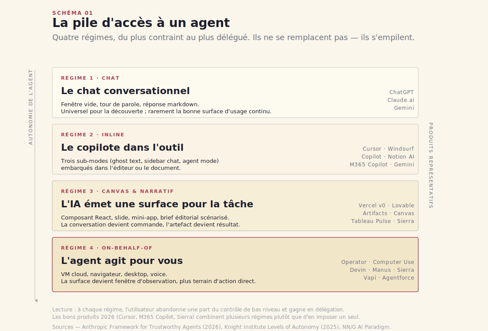
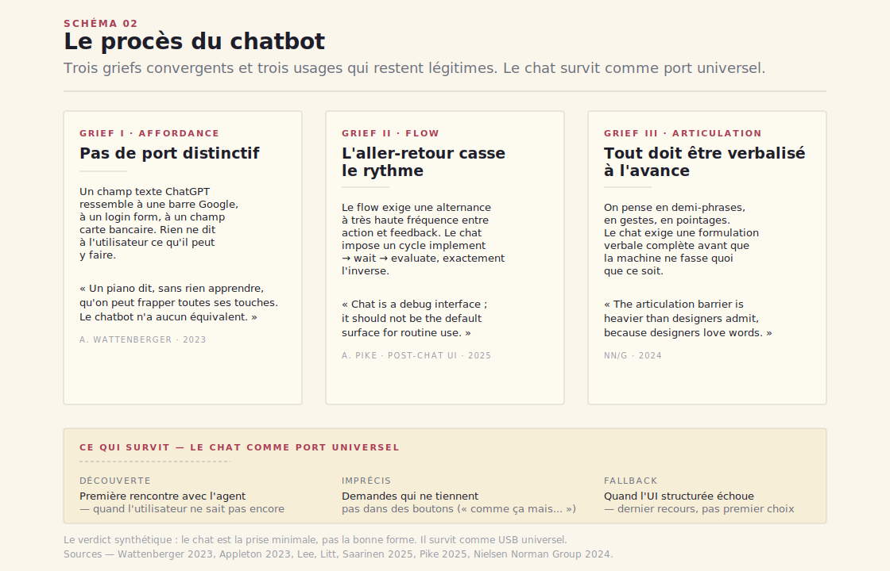
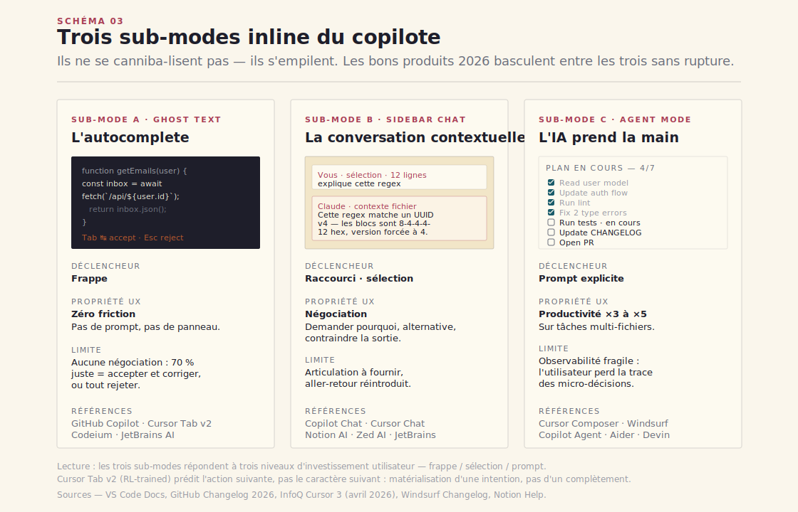
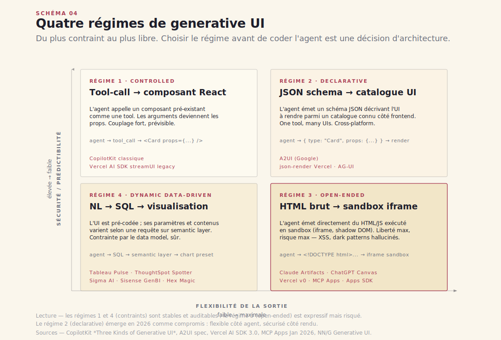
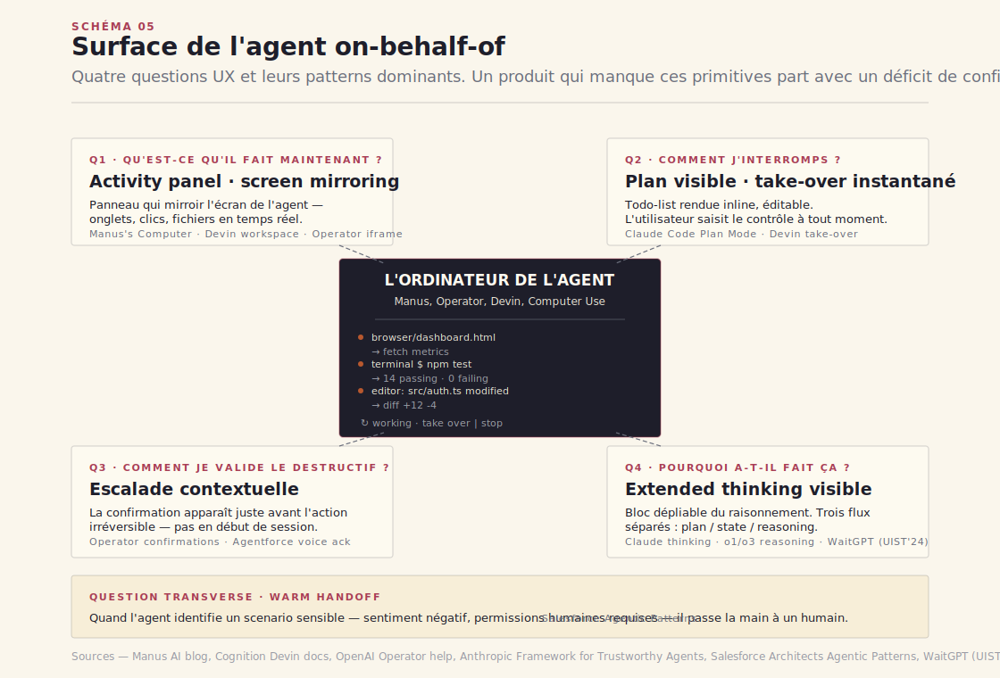
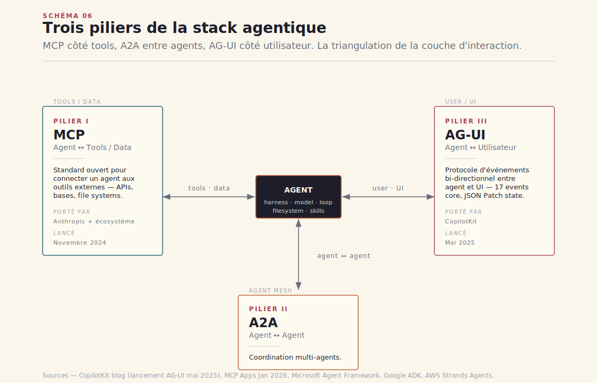
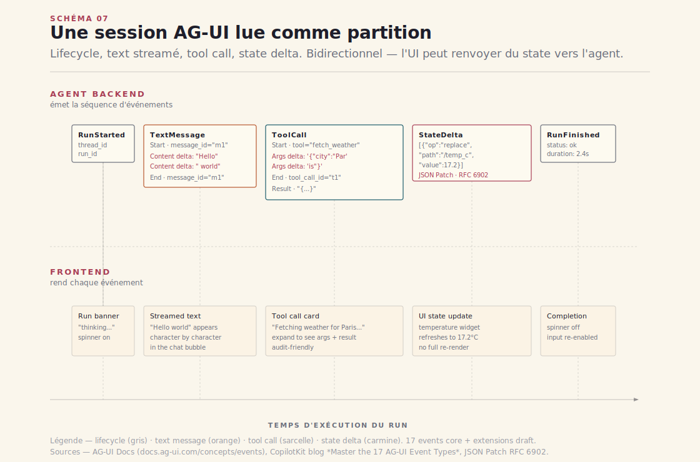
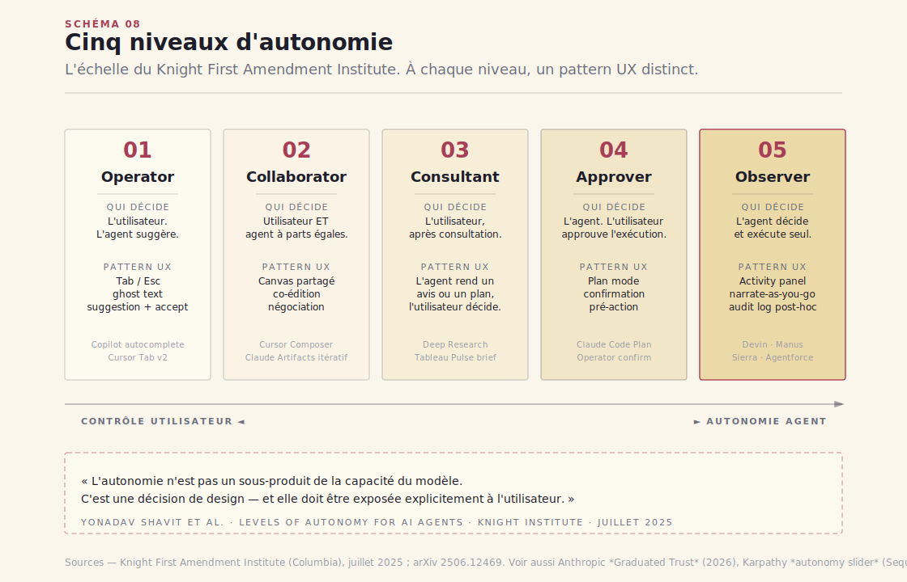
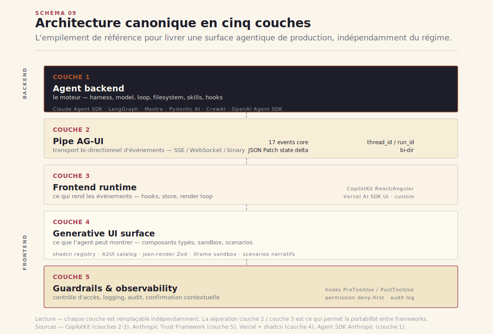
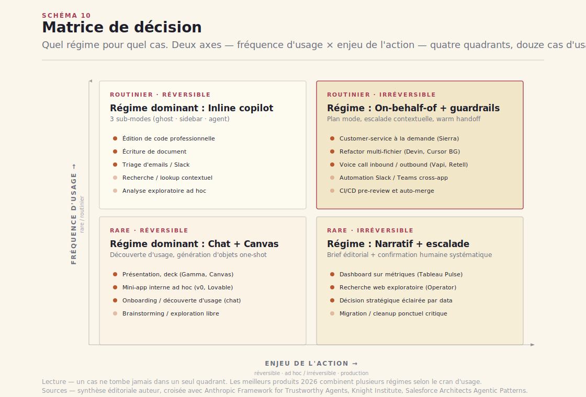

# Chapitre 13 — Surfaces agentiques : quatre régimes d'accès

> **Acte III — Les interfaces · Chapitre standard, ~22 pages**
> _Le [Ch. 15](ch15-mcp-plateforme.md) a posé l'effet de réseau MCP et la trinité MCP × A2A × AG-UI ; le [Ch. 16](ch16-mcp-securite.md) a documenté la facture sécurité. On franchit ici la frontière : ce que voit l'utilisateur final. Quatre régimes d'accès coexistent en 2026 — chat, copilote inline, canvas génératif, agent on-behalf-of — et le bon design consiste à choisir le régime **avant** de coder l'agent, pas à l'inverse. Le wording canonique des niveaux d'autonomie Knight (operator / collaborator / consultant / approver / observer) est aussi fixé ici, et AG-UI promis en [Ch. 15](ch15-mcp-plateforme.md) §15.5 est déroulé._

> [!QUESTION] Question d'ouverture
> Ben Thompson signe en mars 2026 ce qu'il appelle *l'aveu fondateur de la quatrième vague* : Microsoft lance Copilot Cowork à 99 $/siège/mois (tier E7) et reconnaît qu'on ne livre pas un produit agentique convaincant en empilant des LLM modulaires — il faut intégrer modèle et harness[^1]. Sierra (Bret Taylor) vaut 15,8 milliards de dollars en mai 2026[^2] sans avoir entraîné un seul modèle ; sa valeur tient à la surface customer-service qu'elle construit autour des LLM existants. Si la **surface mange le modèle** et que le chatbot est désormais étudié comme la surface par défaut **à éviter**, quel régime d'accès choisit-on, dans quel ordre, et avec quel contrat de confiance ?

> [!TLDR] TL;DR décideur
> - ==Quatre régimes d'accès coexistent, pas un.== Chat (la prise minimale), copilote inline (l'IA dans l'outil — Cursor Tab, GitHub Copilot Agent Mode, M365 Copilot), canvas génératif (l'IA émet une interface — v0, Claude Artifacts, OpenAI Apps SDK), agent on-behalf-of (l'IA exécute en VM ou navigateur — Operator, Devin, Sierra). Choisir le bon régime *avant* de coder l'agent change tout : ce sont des architectures, des contrats utilisateur et des risques différents.
> - **Le procès du chatbot est instruit et le verdict est tombé.** Wattenberger, Appleton, Lee, Litt, Saarinen, Pike, Nielsen Norman Group : six ans de critique convergent en un diagnostic — pas d'affordance, pas de flow, articulation forcée. Le chat reste utile pour la *découverte d'usage*, l'expression de l'imprécis, et le fallback. Il cesse d'être la surface de référence pour l'usage continu.
> - ==AG-UI standardise la prise côté frontend ce que MCP standardise côté tools.== Lancé par CopilotKit le 12 mai 2025, AG-UI est un transport bi-directionnel agnostique (SSE par défaut), 17 événements core (lifecycle/text/tool/state/special), `StateDelta` en JSON Patch RFC 6902. Adopté par LangGraph, CrewAI, Microsoft Agent Framework, Google ADK, AWS Strands, Mastra, Pydantic AI, Agno, LlamaIndex, AG2 — et en *community tier* par le Claude Agent SDK[^11].
> - **L'économie du régime 4 a basculé.** Coût par tâche d'un agent navigateur 0,50–1,50 $ (2024) → **0,05–0,15 $** (2026), précision GUI > 90 % avec Claude Opus 4.7 et GPT-5. C'est cette double bascule qui rend l'on-behalf-of commercialement viable — pas un breakthrough modèle isolé. Détails au [Ch. 17](ch17-computer-use.md).
> - ==Les 5 niveaux d'autonomie du Knight Institute sont la grille **pivot** du livre.== Operator / collaborator / consultant / approver / observer (Yonadav Shavit et al., juillet 2025[^19]). Cette grille est fixée ici une fois pour toutes et réutilisée aux [Ch. 11](ch11-patterns-orchestration.md) (pilote *interne* de la boucle), [Ch. 17](ch17-computer-use.md) (computer use), [Ch. 25](ch25-gouvernance-ai-act.md) (gouvernance). Avec elle, six primitives non négociables : plan visible, escalade contextuelle, warm handoff, autonomy slider explicite, audit log, disclosure non-humain.

---

## 13.1 Pourquoi les surfaces

Un **régime d'accès** n'est pas un canal de communication — c'est un contrat d'expérience. Il dit *où* l'utilisateur rencontre l'agent (fenêtre dédiée, outil existant, panneau adjacent, observatoire d'exécution), *quels gestes* il peut faire (taper, valider, interrompre, reconfigurer), *quelle classe d'erreurs* est acceptable, et *quelle part de contrôle* il abandonne. Choisir le régime, c'est choisir l'architecture de l'agent, son économie, son risque, et la confiance qui s'y construira ou s'y défera.

> [!INFO] Voir [Ch. 11 — Patterns d'orchestration](ch11-patterns-orchestration.md)
> Le [Ch. 11](ch11-patterns-orchestration.md) traite les régimes *internes* (code-driven workflow / LLM-driven routines+handoffs / graphe déclaratif / agent autonome) — *qui pilote la boucle dans le code*. Ici, les régimes *externes* — *qui contrôle l'expérience côté utilisateur final*. Les deux taxonomies sont orthogonales : un agent autonome au sens du [Ch. 11](ch11-patterns-orchestration.md) peut s'exposer en régime canvas, en régime on-behalf-of, ou en inline. La passerelle entre les deux est la **grille Knight** (§13.8), qui articule l'autonomie interne et l'autonomie *exposée* à l'utilisateur.

### 13.1.1 La surface mange le modèle

L'industrie LLM s'est déplacée par bascules. ChatGPT a installé en novembre 2022 l'idée qu'on parle à un agent dans une fenêtre vide. Quarante-deux mois plus tard, l'industrie a passé suffisamment de temps avec cette surface pour savoir qu'elle est faible. Quatre vagues s'enchaînent : **chat, copilote inline, canvas génératif, agent on-behalf-of**. Et toutes les quatre coexistent — elles ne se remplacent pas, elles s'empilent.

Andrej Karpathy a verbalisé la bascule produit au Sequoia AI Ascent 2026 le 29 avril : « Autour de décembre 2025, quelque chose a basculé. Je suis passé de 80–20 à 20–80 — j'écris moi-même 20 %, l'agent écrit 80 %. Je ne me souviens plus de la dernière fois où j'ai dû corriger l'agent »[^16]. Sa thèse *Software 3.0* — prompter un interpréteur LLM plutôt qu'écrire du code (1.0) ou entraîner un réseau (2.0) — naturalise le passage de l'IDE comme surface principale à l'agent comme surface principale. Sa *pet peeve* : « Pourquoi les gens me disent encore quoi faire ? Quelle est la chose que je dois copier-coller à mon agent ? » — la surface inline reste un goulot tant qu'elle exige des copier-coller manuels.

Ben Thompson formule la même chose côté business. Le lancement de **Microsoft Copilot Cowork** à 99 $/siège/mois (tier E7) en mars 2026 est, pour lui, « l'aveu fondateur de la vague 4 » : Microsoft, qui défendait depuis trois ans la posture model-agnostic (*Copilot est un wrapper, on choisit le modèle*), reconnaît qu'on ne livre pas un produit agentique convaincant en empilant des LLM modulaires[^1]. ==Il faut intégrer modèle et harness — et ce harness est exactement ce qu'a documenté l'Acte II ; ce qui se voit côté utilisateur, c'est la surface.==

Le Nielsen Norman Group apporte le cadre théorique. Dans *AI: First New UI Paradigm in 60 Years* (Jakob Nielsen, 2023), l'enquête identifie une rupture historique : après le *batch processing* (1945–1964) et l'*interaction directe / command-based* (1964–2020), on entre dans l'ère de l'**intent-based outcome specification**[^17]. L'utilisateur ne dit plus *quoi faire* à l'ordinateur ; il dit *quel résultat il veut*. Cette bascule a une conséquence directe sur la surface : si on spécifie un résultat plutôt qu'une action, il faut une interface qui *montre les états intermédiaires*, qui *propose des affordances de correction*, qui *permet l'intervention sans recommencer*. Aucune de ces propriétés ne tient dans un simple champ texte suivi d'une réponse markdown.



Une formulation venue de la communauté open-source résume la trajectoire : « A chatbot answers, a copilot suggests, an agent acts, and a digital employee persists »[^18]. Cette gradation — *répond / suggère / agit / persiste* — capture la trajectoire d'autonomie croissante des produits AI 2022–2026. À chaque cran, la surface change. Et à chaque cran, l'utilisateur abandonne une part du contrôle de bas niveau qu'il maîtrisait — la frappe (copilot), la composition (canvas), l'exécution (agent autonome).

Le mot *surface* mérite d'être ancré. La **surface d'accès** à un agent désigne l'ensemble des points d'interaction visibles côté utilisateur : la fenêtre, les contrôles, les feedbacks, le rendu des résultats intermédiaires, les options de correction et d'interruption. C'est tout ce qui n'est pas le modèle ni le harness backend (couverts en Acte II). C'est le contrat d'expérience que le produit pose au moment où l'utilisateur s'en sert. ==La surface est aussi ce qui matérialise les choix de design d'autonomie==, et ces choix doivent être exposés explicitement à l'utilisateur — c'est la thèse Knight développée en §13.8.

---

## 13.2 Le procès du chatbot — la cause est entendue

Le procès du chat comme surface universelle est désormais un genre éditorial à part entière dans la communauté design. Il faut le résumer fidèlement, parce que ce procès cadre tout ce qui suit — et parce que les arguments sont solides.



### 13.2.1 Six contributions convergentes

**Amelia Wattenberger, *Why Chatbots Are Not the Future of Interfaces*** (2023). Le texte fondateur. Trois arguments structurels[^3] :

1. *Un bon outil rend clair comment il doit être utilisé.* Un champ texte ChatGPT ressemble à une barre Google, à un login form, à un champ carte bancaire — *aucune affordance distinctive*. L'utilisateur doit deviner, échouer, retenter. Wattenberger compare au piano : « on voit, sans rien apprendre, qu'on peut frapper toutes les touches et obtenir un son ; on comprend en quelques secondes qu'elles vont du grave à l'aigu ». Le chatbot n'a aucun équivalent.
2. *Le chat casse le flow state.* Csíkszentmihályi : on est en flow quand on alterne action et feedback à très haute fréquence. Le chat impose un aller-retour permanent entre *implement* (j'écris une question) et *evaluate* (je lis une réponse). C'est l'inverse du flow.
3. *Le chat oblige à articuler tout, en mots, à l'avance.* Or les humains pensent en demi-phrases, en gestes, en pointages.

**Maggie Appleton, *Language Model Sketchbook, or Why I Hate Chatbots*** (2023). Appleton accumule depuis 2022 des prototypes Figma d'interfaces non-conversationnelles — *Daemons* (personnages qui suggèrent des éditions dans la marge pendant qu'on écrit), *Branches* (arbres de causes et conséquences pour une affirmation). Sa thèse : la plupart des implémentations LLM devraient être « spell-check sized » — faire une chose précise, bien, dans le contexte d'édition[^4]. Sa formule restée idiomatique : « language model legos need glue » — il manque la colle entre le modèle et le travail réel.

**Linus Lee (Notion AI), *Imagining better interfaces to language models***. Lee propose de remplacer l'interaction *prompt-wait-retry* par deux familles d'affordances[^5] : un **interactive shell** où l'agent et l'utilisateur manipulent un environnement partagé (plutôt que de communiquer à travers le tuyau étroit d'une conversation) ; des **manipulations directes de l'espace latent** — sliders pour la longueur, le ton, le degré de formalité, drag-and-drop pour interpoler entre deux idées. Son prototype *latent.space* matérialise l'argument.

**Geoffrey Litt, *Malleable software in the age of LLMs*** (Ink & Switch, mars 2023, essai consolidé en 2025[^6]). La contribution de Litt est moins une critique du chat qu'un changement d'horizon. Les LLM, en effondrant le coût de fabrication d'une UI, ouvrent un régime où les utilisateurs *reshape* leurs propres outils. L'IA n'est pas une surface qu'on ajoute, c'est *la condition de possibilité de modifier toutes les autres surfaces*. Sa formule reste : « good tools become transparent — l'interaction directe (souris, manipulation) reste cognitivement plus rapide que le chat, donc la generative UI doit produire des affordances manipulables, pas des conversations ».

**Karri Saarinen (Linear), *Design for the AI Age*** (7 avril 2025[^7]). Saarinen radicalise le procès : « A chat interface is a very weak and generic form ». La conséquence pour Linear : abandonner la posture « ticket tracker avec un peu d'IA » et viser « context infrastructure for coding agents ». Les six guidelines *Agent Interaction* de Linear (2026) : (1) divulgation non-humain, (2) patterns natifs plutôt qu'interface séparée, (3) feedback immédiat à l'invocation, (4) transparence du raisonnement, (5) respect immédiat des disengagement requests, (6) accountability humaine.

**Allen Pike, *Post-Chat UI*** (30 avril 2025[^8]). Pike fait la synthèse pratique. Le chat reste utile comme *debug interface* et comme *fallback mode* — quand on ne sait pas ce qu'on cherche, le langage naturel est un point d'entrée acceptable. Pour 90 % des usages routiniers, il propose dix patterns alternatifs : *co-authorship* (Canvas, Cursor), *generative right-click* (Dia), *intuitive search* (Superhuman, Figma), *type instead of pick*, *inline feedback* (writing daemons), *clean up* (Figma Rename Layers), *summary/synthesis* (Apple Intelligence), *voice + pointing*, *do-the-obvious-thing* (tab complete), *completely generated UI* (bolt.new).

### 13.2.2 Le concept central — l'articulation barrier

Le Nielsen Norman Group formalise en 2024 le grief le plus structurel sous le nom d'**articulation barrier**[^9]. La définition opérationnelle : « obliger l'utilisateur à articuler verbalement chaque demande est une charge cognitive lourde, sous-estimée parce que les concepteurs sont eux-mêmes des manieurs de mots ». Ce point a une conséquence stratégique : ==pour un utilisateur qui n'est pas un manieur de mots — un comptable, un chef d'atelier, un opérateur de production — le chat est structurellement défaillant==, et aucune amélioration du modèle sous-jacent ne le corrige. Le concepteur qui pense le chat suffisant fait porter sa propre fluence verbale sur des publics qui ne l'ont pas.

> [!NOTE] Trois usages où le chat reste légitime
> Le procès n'est pas une condamnation totale. Trois usages restent justifiés et sont d'ailleurs ce qui garantit que le chat survit dans tous les produits 2026 :
> 1. **La découverte d'usage.** Quand l'utilisateur ne sait pas ce qu'il cherche, le langage naturel est la barrière la plus basse pour explorer ce que l'agent peut faire. « Hey can you help me with… » est un premier pas universel.
> 2. **L'expression de l'imprécis.** Certaines demandes ne se décomposent pas en boutons. « Donne-moi quelque chose comme ce que David a partagé l'autre jour, mais en plus formel » est une instruction parfaitement actionnable et impossible à exprimer dans une UI à cases.
> 3. **Le fallback universel.** Quand l'UI structurée échoue (pas de bouton pour ça, pas de filtre adapté), le chat est l'échappatoire. Tous les bons produits 2026 le préservent comme dernier recours — pas comme premier choix.

==Le verdict synthétique : le chat est la **prise minimale**, pas la **bonne forme**.== C'est le port USB universel — utile pour brancher n'importe quoi, jamais la solution la plus élégante pour un usage spécifique. Reste à explorer les surfaces qu'on construit *après* cette reconnaissance.

---

## 13.3 Régime 1 — Le copilote inline

Le premier régime alternatif au chat s'est imposé silencieusement entre 2023 et 2025 : le **copilote inline**. L'IA vit *dans* l'outil existant, pas à côté. Trois sub-modes coexistent désormais — l'autocomplete (ghost text), le chat panel (sidebar contextuelle), l'agent mode (l'IA pilote l'éditeur sur plusieurs fichiers). Les bons produits 2026 ont compris qu'il faut les trois, et qu'il faut basculer entre eux sans changer d'application.



### 13.3.1 Ghost text et autocomplete

Le pattern canonique : l'IA insère une suggestion en texte gris italique à la position du curseur, l'utilisateur accepte par Tab ou rejette par Esc[^20]. GitHub Copilot l'a popularisé en 2021. Cursor a poussé le pattern d'un cran avec **Cursor Tab v2** — un modèle propriétaire RL-trained qui ne prédit plus *les caractères suivants* mais *l'action suivante* (déplacer le curseur ailleurs, ouvrir un fichier, modifier un import). ==C'est la première fois qu'un outil inline matérialise une *intention*, pas un complètement.==

La force du sub-mode : *zéro friction*. L'utilisateur tape, l'IA suggère, l'utilisateur valide ou ignore. Pas de prompt à écrire, pas de fenêtre à ouvrir. Sa limite : *aucune négociation possible*. Si la suggestion est à 70 % juste, il faut l'accepter et corriger derrière, ou tout rejeter. Pas de *« comme ça, mais avec X »*.

### 13.3.2 Sidebar chat contextuelle

Le pattern : un panneau latéral qui a accès au document, au repo, à la sélection. C'est un chat, mais *contextualisé* — l'utilisateur ne décrit pas le code, il dit *« explique ça »* en pointant. GitHub Copilot Chat, Cursor Chat, Notion AI (`/AI` qui ouvre un panneau), JetBrains AI, Zed AI.

La force du sub-mode : *négociation et raisonnement explicite*. L'utilisateur peut demander pourquoi, demander une alternative, contraindre la sortie. Sa limite : on retombe partiellement dans les griefs de §13.2 — il faut articuler, attendre, évaluer.

### 13.3.3 Agent mode inline

Le pattern : l'IA prend la main, modifie plusieurs fichiers, lance le terminal, lit les erreurs, itère. L'utilisateur valide à la fin (ou interrompt en cours). C'est le sub-mode qui a émergé en force en 2024-2025 avec Cursor Composer, Windsurf Cascade, Aider, et finalement GitHub Copilot Agent Mode (GA mars 2026 sur VS Code et JetBrains)[^21]. La preview *Inline Agent Mode* d'avril 2026 mérite mention : l'agent mode s'invoque directement *dans l'inline chat*, sans bascule vers un panneau. C'est l'unification cognitive des trois sub-modes.

La force : *productivité ×3 à ×5 sur les tâches multi-fichiers*. Cursor revendique 2 milliards d'ARR run-rate en février 2026[^22], valorisation discutée à 50 milliards, 40 000 ingénieurs NVIDIA en clients. Windsurf, racheté par Cognition pour ~250 M$ en décembre 2025, défend une variante : **Arena Mode**, deux agents Cascade côte à côte avec identités modèles cachées, l'utilisateur vote — manière élégante de masquer le choix du modèle derrière la qualité du résultat. Sa limite : ==l'observabilité chute brutalement==. L'utilisateur perd la trace des micro-décisions. On y revient au §13.8.

### 13.3.4 Hors du code — la productivité inline

Le pattern n'est pas réservé au développement. Les outils de productivité ont adopté les mêmes trois sub-modes en 2025-2026, parfois avec des variantes intéressantes.

- **Microsoft 365 Copilot** — Agent Mode dans Word/Excel/PowerPoint GA le 22 avril 2026[^23]. L'agent ne suggère plus *depuis le panneau*, il *prend des actions app-native multi-étapes* directement dans le document. Engagement Excel +67 % en preview, satisfaction +65 %. Microsoft a ajouté **Copilot Cowork** (tier E7, 99 $/siège/mois) en mars 2026 — une GUI-fication de Claude Code pour l'entreprise.
- **Google Workspace + Gemini** — embeddé par défaut depuis mars 2026 dans Gmail/Docs/Sheets/Slides/Drive/Meet/Chat[^24]. *Help me create* synthétise depuis fichiers et emails en un draft formaté.
- **Notion AI** — `/AI` qui ouvre un AI Block voyant le contexte mentions/relations/synced ; et — nouveauté 2026 — des **Custom Agents** dans la sidebar : autonomes, schedule-based, pas prompt-based[^25]. Notion sépare clairement *AI ponctuel* (`/AI`) et *AI récurrent* (custom agents) — la première fois qu'un outil mainstream offre les deux primitives distinctement.
- **Linear AI** — Linear intègre nativement **Codex / Claude Code / Cursor / Copilot / Devin** et devient l'orchestrateur des agents de coding qui modifient le ticket. Son CEO en mars 2026 : « issue tracking is dead » — Linear devient « context infrastructure » pour agents[^7].
- **Slack AI** — apps agent prêtes à l'emploi (Adobe Express, Box, Cohere, Workday, Writer) ; les workspace agents OpenAI rejoignent les threads, exécutent actions cross-app[^26].

==Le copilote inline résout les trois griefs centraux du procès du chatbot.== *Affordance* : la suggestion apparaît dans le contexte de travail, l'utilisateur sait où elle vient. *Flow* : l'aller-retour est instantané (Tab/Esc), le rythme de travail n'est pas brisé. *Articulation* : l'utilisateur n'a pas besoin de décrire ce qu'il fait — l'IA voit le curseur, la sélection, le fichier ouvert.

Sa limite structurelle : l'inline ne convient qu'aux tâches *déjà encadrées par un outil*. Si l'utilisateur n'a pas d'éditeur, pas de document ouvert, pas de canvas, il n'y a pas de surface inline possible. C'est précisément ce qui motive le régime 2.

---

## 13.4 Régime 2 — Le canvas génératif

Le canvas est la surface qui a le plus muté entre 2024 et 2026. Lancé comme *« side panel pour artefacts générés »* (Claude Artifacts, juin 2024 ; ChatGPT Canvas, octobre 2024), il s'est transformé en quelques mois en **IDE hébergé full-stack**.

### 13.4.1 Le pattern central

L'utilisateur décrit un objet — un composant React, une slide, un dashboard, une app entière. L'IA émet cet objet dans un panneau adjacent (ou une page dédiée). L'utilisateur édite ou itère par prompt sur cet objet, pas sur le chat. ==La conversation devient la commande ; l'artefact devient le résultat.==

### 13.4.2 Quatre régimes de generative UI

Sous le terme *generative UI*, quatre régimes coexistent — ce sont des architectures et des risques différents. CopilotKit propose la taxonomie la plus claire à date[^27] :



1. **Controlled / Static.** L'agent appelle un composant React pré-existant comme une tool ; les arguments du tool call deviennent les props. Couplage fort, prévisible. C'est ce que fait CopilotKit en mode classique.
2. **Declarative.** L'agent émet un schéma JSON qui décrit l'UI à rendre parmi un catalogue connu côté frontend. Le client choisit le composant matching, applique les props. C'est le pattern de **A2UI** (Google, décembre 2025[^28]) — délibérément sans exécution de code, pour la sécurité.
3. **Open-ended.** L'agent émet directement du HTML/JS exécuté en sandbox (typiquement iframe ou shadow DOM). C'est ce que font Claude Artifacts, ChatGPT Canvas, Vercel v0. Liberté maximale, risque maximal.
4. **Dynamic data-driven.** L'UI elle-même est pré-codée, mais ses paramètres et son contenu varient selon une requête NL → SQL → visualisation. C'est le régime de la BI conversationnelle (Tableau Pulse, ThoughtSpot Spotter, Sigma AI, Sisense GenBI). Le [Ch. 18](ch18-analytics-agentique-banque.md) le décortique sur la stack data GCP.

### 13.4.3 Les acteurs centraux

- **Vercel v0** — lancé en septembre 2023 comme générateur de composants React + shadcn/ui. Rebrand v0.dev → **v0.app** en janvier 2026, signalant le passage à « générateur d'apps full-stack ». Février 2026 : intégration Git, éditeur VS Code-like, sandbox Next.js complet (API Routes + Server Actions), connectivité Supabase/Snowflake/AWS. Guillermo Rauch revendique 3 millions d'utilisateurs au podcast Sequoia *Training Data* (2026) ; ==10 % des nouveaux signups Vercel viennent désormais de ChatGPT qui recommande v0==[^12]. La boucle est révélatrice : ChatGPT → v0 → Vercel. shadcn/ui joue un rôle structurel souvent sous-estimé — c'est la couche qui permet à v0, Claude Artifacts et autres de produire du code esthétiquement décent sans entraînement spécifique[^29].

- **Claude Artifacts + Skills + VM unifiée.** Trajectoire à connaître pour positionner Anthropic[^13] :
  - 20 juin 2024 : lancement initial des Artifacts avec Claude 3.5 Sonnet.
  - Juillet 2024 : publication en URL publique sur `claude.site`.
  - 16 octobre 2025 : annonce des **Claude Skills** — un dossier `SKILL.md` + scripts.
  - 21 avril 2026 : **Live Artifacts** dans la couche Cowork — applications persistantes connectées à des sources live (Gmail, Calendar, MCP).
  - 13 mai 2026 : Anthropic notifie que les Artifacts legacy, Styles, et Project file search seront retirés au 15 juin 2026 — tout migre vers une **VM-based architecture unifiée** où Claude exécute code, crée fichiers, run Skills, interagit avec MCP, sous contrôle d'egress configurable par l'admin.
  - ==Cette consolidation VM est l'événement le plus significatif côté Anthropic en 2026 : tout l'éventail GenUI / code-exec / files / Skills / Computer Use vit dans le même runtime sandboxé.== C'est en pratique une convergence vers le modèle *OS pour agent*.

- **OpenAI Canvas → Apps in ChatGPT → Apps SDK.** Canvas (octobre 2024) : panneau collaboratif pour writing et coding. Détection auto par GPT-4o, edits ciblés via highlight + instruction, rewrites complets, shortcuts (adjust length, debug, port to language). **Apps in ChatGPT + Apps SDK** annoncés au DevDay 2025 (6 octobre 2025) avec partenaires Booking.com, Canva, Coursera, Figma, Expedia, Spotify, Zillow[^30]. L'architecture est intéressante : ==bâtie sur MCP==, chaque tool MCP peut déclarer une ressource `ui://` contenant un bundle HTML rendu dans une iframe sandboxée ; pont bidirectionnel via JSON-RPC over postMessage (`window.openai`). C'est le pattern *widget* : serveur fait la logique, widget fait l'UI, le LLM peut déclencher d'autres tools depuis le widget.

- **Lovable, Bolt, Replit Agent.** Le canvas full-stack consumer/dev. **Lovable** : 100 M$ d'ARR en 8 mois, 330 M$ Series B à 6,6 Md $ de valo (fin 2025)[^14] — opinionated stack (auth + DB + paiements inclus). **Bolt.new** : flexibilité JS-only, browser-based, focus prototypage rapide. **Replit Agent 4** lancé mars 2026 — revenus 10 M$ → 100 M$ en 9 mois post-Agent[^32].

### 13.4.4 La convergence MCP

Trois standards de generative UI s'affrontaient en 2025 ; ils convergent vers MCP en 2026.

- **MCP Apps** est officialisé le 26 janvier 2026 comme première extension MCP officielle, en partenariat OpenAI + MCP-UI[^33]. Tools MCP retournent des composants HTML interactifs rendus dans une iframe sandboxée. Support : Claude, Claude Desktop, VS Code Copilot, Goose, Postman, MCPJam.
- **OpenAI Apps SDK** est rétrocompatible avec MCP Apps depuis son lancement.
- **A2UI** (Google) prend le pari déclaratif inverse : catalogue de composants pré-approuvés, l'agent ne peut référencer que ceux-là.

> [!IMPORTANT] La convergence MCP côté frontend
> ==Le centre de gravité 2026 a basculé vers MCP== côté generative UI comme il l'avait fait côté tool. Construire pour MCP Apps maintenant, c'est construire une fois pour Claude + ChatGPT + VS Code Copilot + Goose. Construire pour Apps SDK seul, c'est accepter le lock-in ChatGPT. Construire pour A2UI seul, c'est parier sur la sécurité avant la reach. Le pattern à connaître : un tool MCP peut désormais déclarer une ressource `ui://`, ce qui transforme MCP d'un protocole *tools* en un protocole *tools + UI* — convergence que ni AG-UI ni A2UI n'avaient prévue en 2025.

==Le canvas est la bonne surface quand la tâche produit un *objet*, pas une *décision*.== Une slide, un dashboard, un composant, une mini-app, un rapport — autant d'objets que l'utilisateur veut voir, manipuler, éditer, partager. Le chat seul échoue ici parce qu'il oblige à itérer sur du texte alors que l'objet final doit être visuel/interactif. Sa limite : le canvas n'est pas la bonne surface quand la tâche a un *résultat dans le monde* — envoyer un mail, exécuter un transfert bancaire, fixer un rendez-vous, faire fonctionner un workflow en production. Pour ça, on a besoin du régime 4.

---

## 13.5 Régime 3 — L'expérience narrative orientée tâche

Le troisième régime est moins documenté que les autres, et c'est pourtant celui qui prend le plus de vitesse en 2026. Il ressemble au canvas, mais il n'est pas générique : ==l'IA construit une mini-app éditoriale orientée vers une tâche précise de l'utilisateur, avec un scénario, des points d'arrêt, et des contrôles calibrés==.

Trois symptômes que ce régime émerge. **Live Artifacts** d'Anthropic (avril 2026[^13]) ne sont plus des chunks HTML statiques, ce sont des applications persistantes qui se rafraîchissent à chaque ouverture via MCP. Un utilisateur peut demander à Claude « construis-moi un tracker des leads chauds de cette semaine » — l'agent compose une mini-app qui requête Gmail/Calendar/Slack via MCP, affiche les leads dans un layout adapté, propose des actions (envoyer un follow-up, scheduler un appel). C'est de la generative UI au sens technique, mais c'est aussi une *expérience narrative* au sens éditorial : l'agent a fait un choix de scénario (cette semaine, leads chauds, follow-up = action prioritaire), il a hiérarchisé l'information, il a calibré les poignées d'action.

**Tableau Pulse** (Salesforce, depuis 2024) pousse un format proche : *résumés AI proactifs* sur des métriques pré-définies, envoyés en email ou Slack, avec une narrative générée et trois actions suggérées[^35]. Ce n'est pas un dashboard explorable — c'est un *brief* éditorial calibré pour une tâche (typiquement : décider quoi prioriser cette semaine).

**Sierra** ne fait pas de dashboards et n'écrit pas d'apps. Sierra fait des **agents customer-service**, et la surface utilisateur — du côté du client final — n'est pas un chat avec une IA, c'est un *appel téléphonique ou une conversation Web*, scénarisé par l'agent, qui sait où la conversation doit aller. Valorisée 15,8 Md $ en mai 2026[^2], plus de 150 M$ ARR à février, 40 % du Fortune 50 en clientèle. ==C'est la radicalisation du régime 3 : la surface n'est même plus une UI au sens classique, c'est un parcours conversationnel scénarisé orienté vers une issue de tâche.==

Trois principes pour designer une expérience narrative agentique, tirés des sept genres de Segel-Heer adaptés à l'IA :

1. **L'auteur sait où il va.** L'agent ne demande pas « comment veux-tu structurer ça ? ». Il propose une structure et négocie ensuite les écarts.
2. **Des poignées calibrées, pas une liberté totale.** L'utilisateur peut zoomer sur une cellule, demander un détail, intervenir à un point précis du parcours. Mais il ne peut pas tout reconfigurer — ça casserait la cohérence narrative.
3. **Une métrique de qualité explicite.** Une expérience narrative est *bonne* quand l'utilisateur a compris quelque chose qu'il ne savait pas avant, et qu'il peut agir dessus. Ce n'est ni *la couverture* (régime dashboard) ni *la mémorisation* (régime infographique) — c'est *la conversion en décision*.

> [!INFO] Voir [Ch. 18 — Analytics agentique](ch18-analytics-agentique-banque.md), encart Expériences narratives génératives
> Le [Ch. 18](ch18-analytics-agentique-banque.md) fait redescendre ce régime sur le cas analytics banque : un comité crédit reçoit un dashboard fixe (signé, audité, distribué), pose une question hors-périmètre — la conversation ouvre la profondeur — puis si la question demande une analyse sur-mesure, un agent compose une page d'analyse à la demande qui combine données internes, données externes, et qui expose son lineage. La généalogie complète (Segel-Heer, Bertin, Tufte, Cairo, le tournant humaniste Lupi/Posavec/Fragapane) est en encart §18.14.

Le régime 3 est souvent la *façade* d'un régime 4. Sierra fait du customer-service en surface (régime 3) mais agit en backend (annule la commande, crédite le compte, envoie un voucher — régime 4). Tableau Pulse pousse un brief (régime 3) puis exécute une action sur Salesforce si l'utilisateur clique (régime 4). C'est ce couplage qui fait la valeur — la narrative orientée tâche conduit à l'action, et l'action est exécutée par l'agent on-behalf-of.

---

## 13.6 Régime 4 — L'agent on-behalf-of

Le quatrième régime est celui qui occupe le plus de presse en 2026 et qui demande le plus de précautions de design. ==L'agent agit *pour* vous : il ouvre un navigateur, clique, remplit des formulaires, paye, envoie des emails, refactore un projet, scheduler un appel.== La surface devient une *fenêtre d'observation* sur le travail de l'agent — plus un terrain d'action direct pour l'utilisateur.



### 13.6.1 Quatre sous-familles

**Browser agents** — Operator (OpenAI), Claude Computer Use (Anthropic), Convergence AI Proxy, Browser Use, Multion, Microsoft Copilot Vision, Project Mariner (Google). Ils opèrent dans un navigateur cloud (Operator, Proxy) ou local (Computer Use, Browser Use). Benchmarks 2026 : OSWorld 38,1 % (Operator), 44 % (Computer Use, ×3 en un an) ; WebVoyager 87 % (Operator), 88 % (Convergence Proxy)[^15]. Le déroulé technique est en [Ch. 17](ch17-computer-use.md).

**Engineering agents** — Devin (Cognition), Cursor Background Agent, Claude Code en mode agent, GitHub Spark, Replit Agent. Le pattern : l'utilisateur assigne un ticket Slack ou Linear, l'agent livre une PR. Devin a fait son repricing massif : 20 $/mo Core (contre 500 $/mo avant) en début 2026, clients Goldman Sachs (pilote sur 12 000 devs), Nubank[^36].

**Vertical agents** — Sierra (CX, 15,8 Md $), Harvey AI (legal, 11 Md $, 190 M$ ARR jan 2026)[^37], Hippocratic AI (healthcare), Vapi (voice infra, ~500 M$, 62 M appels/mois)[^38], Retell AI, Bland AI, Sesame.

**Enterprise workflow agents** — Salesforce Agentforce (~800 M$ ARR FY26, 18 500 clients, 29 000 deals)[^39], Microsoft Copilot Studio + Agent 365 (GA mai 2026), ServiceNow AI Agents.

### 13.6.2 La double bascule économique 2026

L'économie a basculé en 2026. ==Le coût par tâche d'un agent navigateur est passé de 0,50–1,50 $ (2024) à 0,05–0,15 $ (2026), et la précision GUI a franchi 90 %==[^15]. C'est cette double bascule — coût ÷ 10 *et* précision > 90 % — qui rend le régime 4 commercialement viable. Anthropic Claude Opus 4.7 et OpenAI GPT-5 sont à l'origine du saut de précision. Les modèles deviennent assez bons pour comprendre des screenshots complexes, et assez cheap pour qu'on les laisse cliquer mille fois par jour.

> [!INFO] Voir [Ch. 17 — Computer use : le régime extrême](ch17-computer-use.md)
> Le on-behalf-of est ici traité comme régime UX. Le [Ch. 17](ch17-computer-use.md) zoome sur le **sous-régime extrême du pilotage écran** — boucle observe·plan·ground·act·verify à cinq phases, trois architectures concurrentes (vision pure / vision+parseur OmniParser / agent intégré perception-action UI-TARS), trajectoire OSWorld 12,2 % avril 2024 → 76,26 % octobre 2025 (premier dépassement humain), cliff UI-CUBE (87 % → 32 % tier complexe), surface insolite VPI + CVE-2025-55322 control plane, latence 24× humain en coût caché. Les chiffres business mentionnés ici (Cursor, Devin, Sierra, Harvey, Agentforce) ne sont pas répétés au [Ch. 17](ch17-computer-use.md) — discipline éditoriale.

### 13.6.3 Les quatre questions UX critiques

Quand l'agent agit pour vous, quatre questions UX dominent. Les réponses convergent à travers l'industrie, et un produit qui ne propose pas ces quatre primitives part avec un déficit de confiance.

**Question 1 — Qu'est-ce qu'il fait là, maintenant ?**

*Pattern dominant : l'activity panel.* Manus AI a popularisé un pattern radical avec **Manus's Computer** — un panneau « ordinateur de l'agent » visible en permanence à côté du chat, qui mirroir l'écran sur lequel l'agent travaille — tous les onglets ouverts, tous les clics, tous les fichiers écrits[^40]. L'utilisateur peut prendre le contrôle d'un onglet en cliquant dedans, ou tout stopper en le fermant. C'est le **screen mirroring** poussé à sa conclusion logique. Cognition (Devin) joue une variante : terminal + éditeur + navigateur dans un workspace partagé, avec l'humain qui peut *take over* à n'importe quel point[^41]. OpenAI Operator rend l'iframe avec différents modes — *Takeover* (l'agent passe la main, ne screenshote pas), *Watch* (supervision rapprochée sur sites sensibles), *Confirmation* (validation explicite avant action de conséquence)[^42].

**Question 2 — Comment je l'interromps ?**

*Pattern dominant : take-over instantané + plan visible.* L'utilisateur doit pouvoir saisir le contrôle à n'importe quel moment, sans avoir à attendre que l'agent finisse. Claude Code matérialise ça avec une **todo-list visible en temps réel** — l'utilisateur lit où l'agent en est, peut interrompre, peut éditer la todo-list elle-même. Anthropic, sur la base de données empiriques montrant que ==les utilisateurs approuvent 93 % des prompts de permission== (consentement de fatigue), a introduit le **Plan Mode**[^43] : au lieu d'approuver action par action, l'utilisateur valide *un plan complet en amont* — et l'agent exécute. Le système de permission est *deny-first* par défaut.

**Question 3 — Comment je valide ce qui est destructif ?**

*Pattern dominant : escalade contextuelle.* La confirmation apparaît au moment exact où elle compte — juste avant la destruction d'un fichier, l'envoi d'un mail, le débit d'un compte. Pas en début de session. Operator demande confirmation avant de soumettre une commande, de payer, d'envoyer un email. Anthropic formalise un *reversibility-weighted risk* : un risque irréversible mérite une friction plus haute qu'un risque réversible. Salesforce Agentforce Voice ajoute une *confirmation auditive de progrès* (« Let me check that for you ») qui sert d'équivalent vocal de la todo-list visible[^44].

**Question 4 — Pourquoi a-t-il fait ça ?**

*Pattern dominant : extended thinking visible et narrate-as-you-go.* Claude (claude.ai) et OpenAI o1/o3 affichent désormais le raisonnement intermédiaire dans un bloc dépliable. C'est une réponse directe au besoin de comprendre *pourquoi*. Le papier académique **WaitGPT** (UIST 2024[^45]) formalise ce besoin : transformer le code généré par un agent LLM d'analyse de données en une représentation visuelle interactive, étape par étape, que l'utilisateur peut comprendre, vérifier, modifier — *en cours d'exécution*. ==Une bonne surface on-behalf-of sépare **trois flux d'information** : le *plan* (todo-list), le *state* (où l'agent en est), le *reasoning* (pourquoi cette étape).== Les confondre dans un seul stream de texte tue la lisibilité.

### 13.6.4 Le warm handoff to human

Pattern critique systématisé par Salesforce[^46]. L'agent identifie les scenarios sensibles ou complexes — sentiment utilisateur négatif, tâche requérant des permissions humaines — et fait un *warm hand-off* à un humain. Le handoff porte le contexte de la conversation. C'est *warm* parce qu'il ne force pas l'utilisateur à tout recommencer. Le warm handoff n'est pas une feature optionnelle pour un agent customer-service en production — c'est ce qui transforme la fiabilité moyenne d'un agent (~75 %) en fiabilité produit acceptable (~99 %) en escalant les 25 % difficiles.

---

## 13.7 AG-UI — le protocole qui standardise la prise

Quatre régimes posés. Reste un problème pratique : comment câbler une UI quelconque à un agent quelconque ? Chaque framework (LangGraph, Mastra, Pydantic AI, Claude Agent SDK, OpenAI Agent SDK…) a son propre format de stream ; chaque frontend (React, Angular, Svelte, Vue…) attend des événements différents. Sans standard, chaque projet réinvente son transport — c'est précisément le problème que MCP a résolu côté tools, et que **AG-UI** résout côté UI. Le [Ch. 15](ch15-mcp-plateforme.md) a annoncé AG-UI comme le troisième pilier de la trinité protocolaire ; déroulé ici.

### 13.7.1 Identité et gouvernance

**AG-UI** (*Agent-User Interaction Protocol*) est créé et maintenu par **CopilotKit** (Seattle, CEO Atai Barkai, ex-Meta / ex-Doximity). Lancement public le 12 mai 2025[^10]. Repo sous l'organisation GitHub `ag-ui-protocol`, licence MIT, 13 600 stars à mai 2026. CopilotKit a levé 27 M$ en Series A en mai 2026 sur la promesse de faire d'AG-UI un standard de fait[^47].

Le pitch officiel : « an open, lightweight, event-based protocol that standardizes how AI agents connect to user-facing applications ». La formulation journalistique « MCP for the UI layer » est juste sur le fond, mais la formulation officielle est plus précise : ==AG-UI est **le pendant frontend** de MCP côté tools — la stack agentique se cale sur trois piliers, MCP / A2A / AG-UI==.



### 13.7.2 Spécification technique

**Modèle de communication** : bi-directionnel, séquence ordonnée d'événements JSON. Une session est identifiée par `threadId` (fil de conversation) et `runId` (exécution unique de l'agent).

**Transport** : *agnostique* — la doc précise « Works with any event transport (SSE, WebSockets, webhooks, etc.) »[^48]. Deux implémentations canoniques : HTTP + SSE (texte par défaut, pare-feu-friendly), HTTP binary protocol (haut débit).

**17 événements core** + extensions Reasoning/Activity/Meta en draft :

| Catégorie | Événements |
|---|---|
| **Lifecycle** (5) | `RunStarted`, `RunFinished`, `RunError`, `StepStarted`, `StepFinished` |
| **Text Message** (3 + 1) | `TextMessageStart`, `TextMessageContent` (delta), `TextMessageEnd`, `TextMessageChunk` (wrapper) |
| **Tool Call** (4 + 1) | `ToolCallStart`, `ToolCallArgs` (delta), `ToolCallEnd`, `ToolCallResult`, `ToolCallChunk` |
| **State** (3) | `StateSnapshot`, `StateDelta` (JSON Patch RFC 6902), `MessagesSnapshot` |
| **Special** (2) | `Raw` (passthrough), `Custom` (extension applicative) |

> [!EXAMPLE] Une trame textuelle typique
> ```
> RunStartedEvent(thread_id=..., run_id=...)
> TextMessageStartEvent(message_id="m1", role="assistant")
> TextMessageContentEvent(message_id="m1", delta="Hello")
> TextMessageContentEvent(message_id="m1", delta=" world")
> TextMessageEndEvent(message_id="m1")
> ToolCallStartEvent(tool_call_id="t1", tool_call_name="fetch_weather")
> ToolCallArgsEvent(tool_call_id="t1", delta='{"city":"Par')
> ToolCallArgsEvent(tool_call_id="t1", delta='is"}')
> ToolCallEndEvent(tool_call_id="t1")
> StateDeltaEvent(delta=[{"op":"replace","path":"/score","value":42}])
> RunFinishedEvent(...)
> ```
> ==`StateDelta` utilise JSON Patch (RFC 6902)== — l'agent émet `[{"op": "replace", "path": "/cart/items/3/qty", "value": 2}]` au lieu de re-streamer tout l'état. Mécanique snapshot+delta classique des bases de données distribuées, appliquée à l'UI. C'est ce qui permet la synchronisation bidirectionnelle d'un état partagé entre agent et UI sans surcharge de bande passante.



### 13.7.3 Shared state vs Generative UI — distinction structurante

AG-UI transporte deux choses orthogonales que la presse confond souvent :

- ==**Shared state**== — un dictionnaire d'état structuré, bi-directionnel, synchronisé via `StateSnapshot` + `StateDelta`. Côté React : `const { state, setState } = useCoAgent({...})`. Cas typique : un dashboard où l'agent met à jour des KPIs pendant qu'il analyse, et où l'utilisateur peut éditer un filtre qui se propage côté agent. **C'est de la donnée, pas de l'interface.**
- ==**Generative UI**== — l'agent émet directement des fragments d'interface (composant React invoqué comme tool, schéma JSON déclaratif, ou HTML brut sandboxé). **C'est de l'interface, pas de la donnée.**

La distinction essentielle : *shared state* = « qu'est-ce que l'agent sait » ; *generative UI* = « qu'est-ce que l'agent montre ». AG-UI transporte les deux, mais ce sont des patterns architecturaux orthogonaux. La confusion entre les deux est l'erreur de design la plus fréquente sur les implémentations 2026.

### 13.7.4 Adoption et écosystème

À mai 2026, l'écosystème AG-UI s'étend sur trois cercles[^11] :

- **Partenariats fondateurs** : LangGraph, CrewAI.
- **1st-party (maintenus officiellement)** : Microsoft Agent Framework, Google ADK, AWS Strands Agents, Mastra, Pydantic AI, Agno, LlamaIndex, AG2.
- **Community** : Claude Agent SDK (Anthropic), Langroid.
- **In progress** : OpenAI Agent SDK, AWS Bedrock Agents, Cloudflare Agents, .NET SDK.

**SDKs langages** : Python (34 % de la codebase), TypeScript (30 %), Kotlin, Java, Go, C++, Ruby, Dart, Rust. **Pas de SDK .NET stable** au 18 mai 2026 — point d'attention pour les SI Microsoft-heavy.

**Côté frontend**, la référence est **CopilotKit React/Angular SDK** (hooks `useAgent`, `useCoAgent`, `useCoAgentStateRender`). Le hook `useAgent` (v1.50, décembre 2025) donne accès brut au flux AG-UI ; `useCoAgent` est une abstraction haut niveau pour les patterns courants[^49]. Pas d'alternative frontend mainstream à ce jour — c'est le verrou écosystémique de CopilotKit.

### 13.7.5 Quand AG-UI vs streamUI vs WebSocket maison

==AG-UI n'est ni un framework ni une UI library — c'est un transport.== Sa valeur se révèle dès qu'on découple le framework agentic (LangGraph, Mastra, Pydantic AI…) du framework frontend (React, Angular), ou qu'on veut survivre à un changement de runtime agent sans réécrire l'UI.

| Cas | AG-UI apporte | AG-UI est overkill |
|---|---|---|
| Vercel AI SDK + RSC | Multi-framework backend, state sync bidirectionnel, agent long-running multi-tool. Note : Vercel a marqué AI SDK RSC `streamUI` comme expérimental et son développement est pausé[^50] — migration recommandée vers `AI SDK UI`. | App full-stack Next.js mono-équipe, chat simple. RSC reste plus rapide à mettre en place. |
| OpenAI Responses API | Backend agnostique, multi-tool calls visibles, human-in-the-loop. | Single-vendor OpenAI, chat completion classique. |
| Anthropic content blocks | Idem + agents Claude orchestrés + UI riche. | Usage CLI/headless du Claude Agent SDK. |
| WebSocket custom | Bénéficier des SDKs Python/TS pré-faits, hooks React, compat multi-framework. | Une seule app, une seule équipe, un seul framework : WebSocket maison de 200 lignes suffit. |

> [!ATTENTION] Maturité — standard d'un an, écosystème en consolidation
> AG-UI est un standard d'un an, son écosystème est en pleine consolidation. L'intégration Vercel AI SDK est annoncée mais non publiée sur npm au 18 mai 2026[^51]. L'OpenAI Agent SDK et AWS Bedrock Agents sont en *in progress*. ==Adopter AG-UI en mai 2026 = parier sur un standard émergent largement adopté mais pas encore stabilisé sur toutes ses extensions.== Le pari rationnel se justifie pour un projet ≥ 12 mois avec ≥ 2 frameworks (back + front) découplés ; il ne se justifie pas pour un mono-équipe Next.js mono-vendor.

---

## 13.8 Patterns de confiance — la grille transverse

L'agent qui agit pour vous pose deux problèmes de confiance distincts : *est-ce qu'il fait bien ?* (qualité) et *est-ce qu'il fait ce que j'ai autorisé ?* (gouvernance). La surface est ce qui rend ces deux questions concrètes pour l'utilisateur. Cette section pose la grille **pivot du livre** — réutilisée aux [Ch. 11](ch11-patterns-orchestration.md) (régimes internes), [Ch. 17](ch17-computer-use.md) (computer use), [Ch. 25](ch25-gouvernance-ai-act.md) (gouvernance régulaire).

### 13.8.1 Le cadre Knight Institute — cinq rôles utilisateur

Le papier le plus important de 2025 sur ces questions est *Levels of Autonomy for AI Agents* du Knight First Amendment Institute de Columbia (juillet 2025, Yonadav Shavit et al.)[^19]. Il définit cinq rôles utilisateur, du moins au plus autonome :



| Rôle | Qui décide ? | Pattern UX typique |
|---|---|---|
| **Operator** | L'utilisateur. L'agent suggère, l'utilisateur exécute. | Suggestion + bouton Accept. Tab/Esc ghost text. |
| **Collaborator** | L'utilisateur et l'agent à parts égales. | Canvas partagé, l'agent édite, l'humain édite, négociation. |
| **Consultant** | L'utilisateur, après consultation de l'agent. | L'agent rend un avis ou un plan, l'utilisateur décide. |
| **Approver** | L'agent décide, l'utilisateur approuve avant exécution. | Plan mode, confirmation pré-action. |
| **Observer** | L'agent décide et exécute. L'utilisateur regarde. | Activity panel, narrate-as-you-go, audit log post-hoc. |

==La thèse-clé du papier : *l'autonomie n'est pas un sous-produit de la capacité du modèle, c'est une décision de design*.== Le papier propose des **autonomy certificates** — documents numériques qui prescrivent le niveau maximum d'autonomie autorisé pour un agent donné dans un environnement opérationnel donné. C'est la version régulation-friendly du *capability negotiation* entre user et agent.

> [!IMPORTANT] La grille Knight comme référentiel transverse du livre
> Cette taxonomie à cinq rôles est fixée ici une fois pour toutes. Elle est citée au [Ch. 11](ch11-patterns-orchestration.md) §11.3 pour articuler les régimes de pilotage *interne* (code-driven / LLM-driven / graphe / autonome) avec les niveaux d'autonomie *exposés* à l'utilisateur — les deux ne se confondent pas mais s'articulent. Elle est réutilisée au [Ch. 17](ch17-computer-use.md) pour situer le computer use (typiquement *approver* ou *observer*, jamais *operator*). Elle est reprise au [Ch. 25](ch25-gouvernance-ai-act.md) sous l'angle obligation régulaire : ==l'AI Act art. 14 sur la supervision humaine peut être lu comme l'imposition d'un niveau Knight maximum selon le caractère haut-risque du système==. Aucun chapitre ne redéfinit les cinq rôles ; tous y renvoient.

### 13.8.2 Le cadre Anthropic — graduated trust

Anthropic publie en 2026 un cadre opérationnel de quatre principes[^43] :

1. **Deny-first with human escalation.** L'agent ne fait rien d'irréversible sans demander. Mais — c'est le subtil — *« demander »* ne signifie pas *« interrompre tout pour confirmation »* à chaque action. C'est le rôle du Plan Mode et du sliding scale.
2. **Graduated trust spectrum.** ==Les données empiriques d'Anthropic montrent que l'auto-approve passe de ~20 % à 50 sessions à >40 % à 750 sessions.== **L'autonomie est co-construite par l'usage**, pas configurée une fois pour toutes. C'est la justification expérimentale du concept Knight *autonomy certificate* — l'autonomie évolue, et la surface doit l'exposer.
3. **Defense in depth.** Plusieurs couches imparfaites. Cf. le schéma *gruyère suisse* déjà introduit au [Ch. 7](ch07-boucle-agentique.md) pour l'alignement modèle, et étendu ici à la sécurité de la surface (alignement modèle + harness controls + sandbox env + surface guardrails).
4. **Reversibility-weighted risk.** Un risque irréversible (envoyer un mail, valider un paiement) mérite une friction plus haute qu'un risque réversible (créer un fichier qu'on peut supprimer).

Le **modèle de responsabilité partagée** d'Anthropic, en quatre couches : *Model* (owned par le provider), *Harness* (instructions et policies, partagé), *Tools* (MCP servers, APIs, owned par l'organisation déployante), *Environment* (sandboxes, data, owned par l'orga). Cette répartition cadre les obligations DORA / AI Act que le [Ch. 25](ch25-gouvernance-ai-act.md) déroule.

### 13.8.3 Le Trust Layer Salesforce

Cinq mécanismes ancrent l'agent dans l'entreprise[^52] :

1. *Data grounding* — les prompts sont ancrés dans les données entreprise.
2. *PII masking* avant envoi au LLM — les champs sensibles sont remplacés par des tokens, ré-injectés après.
3. *Zero-data retention* côté provider.
4. *Toxicity detection* sur les réponses, avant affichage.
5. *Audit logging* exhaustif — chaque action de l'agent est tracée.

Côté UX, le pattern Salesforce est *« jamais un pop-up qui se bat pour l'attention »* — l'assistant est un pane intégré à la console, toujours visible, jamais intrusif. Quand l'agent suggère une action, le raisonnement est affiché à côté.

### 13.8.4 Microsoft Responsible AI et la métaphore Karpathy

Sept principes Microsoft Copilot Studio[^53] : *fairness, reliability & safety, privacy & security, inclusiveness, transparency, accountability* + couche opérationnelle *continuous monitoring*. Le pattern UX dominant : disclaimers et badges qui indiquent explicitement « ceci est généré par IA », visibilité sur où la donnée est stockée et comment elle est utilisée, feedback mechanisms intégrés pour signaler les inexactitudes.

Au YC AI Startup School (juin 2025, *Software Is Changing Again*[^54]), Karpathy défend une métaphore qui a circulé : ==« on ne devrait pas viser à construire des robots Iron Man — autonomie totale, démos flashy — mais des suits Iron Man, augmentations partielles avec un slider d'autonomie ajustable par l'utilisateur »==. Sa formule subsidiaire « build for agents » a un corollaire pour la surface : créer du markdown lisible par agent, des docs `llms.txt`, éviter les affordances GUI-only — la *surface de l'agent* devient une couche d'infrastructure.

### 13.8.5 Convergence — six primitives non négociables

À travers Anthropic, Salesforce, Microsoft, Karpathy et le Knight Institute, on retrouve la même grammaire :

- **Plan visible** (todo-list, narrate-as-you-go)
- **Escalade contextuelle** sur les actions irréversibles
- **Warm handoff** vers l'humain pour les cas sensibles
- **Autonomy slider** exposé à l'utilisateur, pas caché
- **Audit log** exhaustif pour la post-hoc reconstruction
- **Disclosure non-humain** — l'agent dit qu'il est un agent

==Un produit qui ne propose pas ces six primitives part avec un déficit de confiance qui se paye à l'usage.== Ce sont les minima 2026, pas les *nice-to-have*. Ils valent aussi bien pour un canvas génératif (le code généré doit pouvoir être audité) que pour un agent on-behalf-of (l'observer doit pouvoir reprendre le contrôle), avec une intensité variable selon le régime.

---

## 13.9 Architecture canonique d'une surface agentique

On peut maintenant assembler les pièces. Quels composants techniques produit-on pour livrer une surface agentique de production, indépendamment du régime choisi ?



**Couche 1 — Agent backend.** Le moteur. C'est tout ce qui a été traité dans l'Acte II : le harness Claude Code / LangGraph / Mastra / Pydantic AI, le model, les tools, les skills, les hooks, le filesystem, le context management. Pour ce chapitre, ça reste une boîte noire — la surface est ce qui le consomme, pas ce qu'il y a dedans.

**Couche 2 — Pipe AG-UI.** Le transport bi-directionnel d'événements. SSE ou WebSocket, 17 événements core, state delta JSON Patch. Si AG-UI n'est pas disponible (framework legacy, contrainte d'infra), on substitue un WebSocket maison ou un stream Server Actions — mais on accepte le coût : on devra réimplémenter le shared state, les tool call delta, le run lifecycle.

**Couche 3 — Frontend runtime.** Ce qui rend les événements. Pour React : CopilotKit (hooks `useAgent`, `useCoAgent`), Vercel AI SDK UI (depuis le pivot post-RSC), shadcn registry pour les composants prêts à l'emploi. Pour Angular : CopilotKit Angular SDK. Pour autre : pour l'instant, à fabriquer soi-même au-dessus du SDK TS client AG-UI.

**Couche 4 — Generative UI surface.** Ce qui définit *ce que l'agent peut montrer*. Pour le régime canvas : un système de composants typés (shadcn, A2UI catalog, json-render Zod), ou un sandbox iframe (Claude Artifacts, MCP Apps). Pour le régime narratif : un système de scénarios pré-définis paramétrables.

**Couche 5 — Guardrails et observability.** Les hooks d'interception (cf. [Ch. 7](ch07-boucle-agentique.md) §7 couche harness), le permission system, le logging exhaustif, l'audit log côté UI, les pop-up de confirmation contextuelle. Pour la production, ajouter le monitoring de coûts par tâche et la *replay capability* — pouvoir rejouer une session pour débugger.

> [!INFO] Voir [Ch. 20 — Observabilité agentique et cognitive audit trail](ch20-observabilite-cognitive-audit-trail.md)
> La couche 5 reste ici descriptive. Le déroulé canonique — six piliers OpenTelemetry GenAI Semantic Conventions, cognitive audit trail, vendor landscape (Langfuse, Braintrust, Arize, LangSmith, Dynatrace, AgentCore), échelle de maturité — est au [Ch. 20](ch20-observabilite-cognitive-audit-trail.md). Ici, la couche 5 est posée comme non-optionnelle ; comment la peupler relève du [Ch. 20](ch20-observabilite-cognitive-audit-trail.md).

==Aucune surface sérieuse ne fait l'économie des cinq couches.== Beaucoup de produits 2024-2025 ont fait l'erreur de skipper la couche 5 (les démos flashy ne montrent pas les guardrails) et l'ont payé en perte de confiance utilisateur. Le choix d'architecture par régime :

| Régime | Couche 4 dominante | Couche 5 priorité |
|---|---|---|
| Chat | Aucune (texte streamé) | Disclaimer, feedback button |
| Copilot inline | Suggestion DOM (ghost text, autocomplete) | Telemetry d'acceptance, opt-out |
| Canvas génératif | shadcn + sandbox iframe | Code execution sandboxing, content moderation |
| Narratif orienté tâche | Scenarios + composants typés | Editorial guardrails (no hallucinated stats) |
| On-behalf-of | Activity panel + screen mirroring | Plan mode, escalade contextuelle, audit log |

---

## 13.10 Matrice de décision — quel régime pour quel cas

Pour fermer le chapitre, voici la grille de décision opératoire. Le choix du régime dépend de quatre axes : nature du résultat attendu, fréquence d'usage, niveau d'enjeu, profil d'utilisateur.



| Cas d'usage | Régime principal | Pattern UX dominant | Surveiller |
|---|---|---|---|
| Découverte d'usage / onboarding | **Chat** | Free-form, suggestions de prompts | Articulation barrier, abandon prématuré |
| Édition de code professionnelle | **Inline copilot** (3 sub-modes) | Ghost text + sidebar + agent mode | Observabilité de l'agent mode |
| Écriture de document | **Inline copilot** + **canvas** | Slash menu, sélection + instruction | Cohérence stylistique inter-sessions |
| Présentation, deck | **Canvas génératif** | Layout pré-défini, narration AI | Dérive de la marque, hallucinations visuelles |
| Mini-app interne ad hoc | **Canvas génératif** full-stack | v0, Lovable, Replit Agent | Sécurité du code exécuté, sandboxing |
| Dashboard sur métriques pré-définies | **Narratif orienté tâche** | Tableau Pulse, Live Artifacts | Semantic layer gouvernée ([Ch. 18](ch18-analytics-agentique-banque.md)) |
| Analyse exploratoire ad hoc | **Inline copilot** + **canvas** | Hex Magic, Mode AI | Vérification des résultats |
| Customer-service à la demande | **On-behalf-of vertical** | Sierra, Agentforce | Warm handoff, escalade |
| Recherche web exploratoire | **On-behalf-of browser** | Operator, Computer Use, Proxy | Coût par tâche, fiabilité GUI ([Ch. 17](ch17-computer-use.md)) |
| Refactor de code multi-fichier | **On-behalf-of engineering** | Devin, Cursor Background, Claude Code | Audit log, PR review humaine |
| Voice — call inbound/outbound | **On-behalf-of vertical voice** | Sierra, Vapi, Retell | Latence, naturalité, escalade |
| Automation Slack / Telegram | **On-behalf-of enterprise** | Slack AI, Agentforce | Permissions cross-app, audit |

Quelques règles transverses émergent.

**Plus la tâche produit un objet visuel/interactif (slide, dashboard, app), plus le régime canvas gagne** sur le chat ou l'inline.

**Plus la tâche a un résultat dans le monde réel (envoi, paiement, modification de production), plus le régime on-behalf-of gagne**, mais avec une priorité absolue donnée à la couche 5 (guardrails).

**Plus la tâche est routinière et embarquée dans un outil existant, plus l'inline gagne** sur le chat ou le canvas.

**Plus la tâche demande de la cohérence éditoriale (brief, parcours, scénarisation), plus le régime narratif gagne** — c'est le régime sous-couvert qui prend le plus de vitesse en 2026.

Et toujours, deux principes pour ne pas se tromper :

1. ==**Commencer par décider du régime, pas par coder l'agent.**== Le choix du régime détermine 80 % de l'architecture qui suivra. L'inverse — coder d'abord, choisir la surface ensuite — produit des chatbots déguisés en n'importe quoi.
2. **Combiner les régimes plutôt que les opposer.** Les meilleurs produits 2026 ne font pas un seul régime mais en empilent plusieurs : Cursor combine inline + canvas + on-behalf-of ; Microsoft 365 combine inline + on-behalf-of dans le ruban ; Sierra fait du narratif scénarisé en surface et du on-behalf-of en backend. La question n'est pas *« quel régime ? »* mais *« quel régime pour quel cran de l'usage ? »*

> [!WARNING] Trois pièges classiques (100 % traçables)
> **Piège 1 — POC sans couche 5.** Les démos qui vendent le projet ne montrent jamais les guardrails. Le passage en prod découvre qu'il n'y a ni audit log, ni permission system, ni escalade contextuelle. Coût de rattrapage : ~30 % du projet refait.
> **Piège 2 — Skipper Knight à l'étape design.** Choisir le régime sans nommer le niveau d'autonomie cible produit un agent qui hésite entre *consultant* et *approver* selon les jours, et un utilisateur qui ne sait pas ce qu'on attend de lui. Conséquence : approbation de fatigue (les 93 % d'Anthropic) et accidents irréversibles.
> **Piège 3 — AG-UI absent → WebSocket maison non maintenable.** L'équipe écrit son propre transport agent → frontend, ré-implémente *mal* shared state et tool call delta, et bloque toute migration de framework agentic ultérieure. Coût : 4-8 semaines-ingénieur pour rebrancher sur AG-UI le moment venu.

---

## Récap chapitre — Cinq niveaux Knight, six primitives, quatre régimes


Trois objets à retenir :

- **La grille Knight à cinq niveaux** (operator / collaborator / consultant / approver / observer) — taxonomie pivot du livre, fixée ici, citée aux [Ch. 11](ch11-patterns-orchestration.md), [Ch. 17](ch17-computer-use.md), [Ch. 25](ch25-gouvernance-ai-act.md).
- **Les six primitives non négociables** (plan visible, escalade contextuelle, warm handoff, autonomy slider, audit log, disclosure non-humain) — minima 2026 pour toute surface qui prétend à la production.
- **La matrice de décision à 12 cas d'usage** — outil pratique pour cadrer un régime avant de cadrer un agent.

Le [Ch. 17](ch17-computer-use.md) enchaîne sur le sous-régime extrême — le pilotage écran, où la surface devient une fenêtre d'observation et où la surface d'attaque change qualitativement. Le [Ch. 18](ch18-analytics-agentique-banque.md) ferme l'Acte sur une instanciation sectorielle : trois surfaces agentiques GCP, banque française tier 1, pivot sémantique, régulation 2 août 2026.

---

## Sources

[^1]: **Ben Thompson**, *Agents Over Bubbles*, Stratechery, 26 mars 2026. [stratechery.com/2026/agents-over-bubbles](https://stratechery.com/2026/agents-over-bubbles/). Consulté 2026-05-18.

[^2]: **TechCrunch**, *Sierra raises $950M as the race to own enterprise AI gets serious*, 4 mai 2026. [techcrunch.com/2026/05/04/sierra-raises-950m](https://techcrunch.com/2026/05/04/sierra-raises-950m-as-the-race-to-own-enterprise-ai-gets-serious/). Consulté 2026-05-18.

[^3]: **Amelia Wattenberger**, *Why Chatbots Are Not the Future of Interfaces*, 2023. [wattenberger.com/thoughts/boo-chatbots](https://wattenberger.com/thoughts/boo-chatbots/). Consulté 2026-05-18.

[^4]: **Maggie Appleton**, *Language Model Sketchbook, or Why I Hate Chatbots*, 2023. [maggieappleton.com/lm-sketchbook](https://maggieappleton.com/lm-sketchbook). Consulté 2026-05-18.

[^5]: **Linus Lee**, *Imagining better interfaces to language models*, thesephist.com. [thesephist.com/posts/latent](https://thesephist.com/posts/latent/). Consulté 2026-05-18.

[^6]: **Geoffrey Litt et al.** (Horowitz, van Hardenberg, Matthews), *Malleable software: Restoring user agency in a world of locked-down apps*, Ink & Switch, 2025. [inkandswitch.com/essay/malleable-software](https://www.inkandswitch.com/essay/malleable-software/). Voir aussi *Malleable software in the age of LLMs*, mars 2023, [geoffreylitt.com/2023/03/25/llm-end-user-programming](https://www.geoffreylitt.com/2023/03/25/llm-end-user-programming.html). Consulté 2026-05-18.

[^7]: **Karri Saarinen**, *Design for the AI Age*, Linear, 7 avril 2025. [linear.app/now/design-for-the-ai-age](https://linear.app/now/design-for-the-ai-age). Et *How to Design for Human-Agent Interaction*, Every, 2026. [every.to/thesis/how-to-design-for-human-agent-interaction](https://every.to/thesis/how-to-design-for-human-agent-interaction). Consulté 2026-05-18.

[^8]: **Allen Pike**, *Post-Chat UI*, 30 avril 2025. [allenpike.com/2025/post-chat-llm-ui](https://allenpike.com/2025/post-chat-llm-ui/). Consulté 2026-05-18.

[^9]: **Kate Moran & Sarah Gibbons**, *Generative UI and Outcome-Oriented Design*, Nielsen Norman Group, 22 mars 2024. [nngroup.com/articles/generative-ui](https://www.nngroup.com/articles/generative-ui/). Et *Overcoming the Articulation Barrier in Generative AI Using Hybrid Interfaces*, NN/G. [nngroup.com/articles/ai-articulation-barrier](https://www.nngroup.com/articles/ai-articulation-barrier/). Consulté 2026-05-18.

[^10]: **CopilotKit**, *Introducing AG-UI: the Protocol Where Agents Meet Users*, 12 mai 2025. [copilotkit.ai/blog/introducing-ag-ui-the-protocol-where-agents-meet-users](https://www.copilotkit.ai/blog/introducing-ag-ui-the-protocol-where-agents-meet-users). Consulté 2026-05-18.

[^11]: **AG-UI Protocol**, repo officiel GitHub, organisation `ag-ui-protocol`. [github.com/ag-ui-protocol/ag-ui](https://github.com/ag-ui-protocol/ag-ui). Documentation canonique [docs.ag-ui.com](https://docs.ag-ui.com/). Consulté 2026-05-18.

[^12]: **Guillermo Rauch** (CEO Vercel), interview *Building the Generative Web with AI*, Sequoia *Training Data* podcast, 2026. [sequoiacap.com/podcast/training-data-guillermo-rauch](https://sequoiacap.com/podcast/training-data-guillermo-rauch/). Consulté 2026-05-18.

[^13]: **Anthropic**, *What are artifacts and how do I use them?*, Claude Help Center. Annonce Skills, 16 octobre 2025. Live Artifacts (Cowork), 21 avril 2026. Migration VM unifiée, notification admin 13 mai 2026, [toolnav.io/news/2026-05-13-anthropic-claude-vm-artifacts-skills-migration](https://toolnav.io/news/2026-05-13-anthropic-claude-vm-artifacts-skills-migration). Consulté 2026-05-18.

[^14]: **Lovable**, plateforme. [lovable.dev](https://lovable.dev). Series B 330 M$, valo 6,6 Md $, fin 2025 (TechCrunch, The Information). Consulté 2026-05-18.

[^15]: **VentureBeat**, *The rise of browser-use agents: why Convergence's Proxy is beating OpenAI's Operator*. Benchmarks OSWorld et WebVoyager publics. Évolution coût/tâche : *AgentMarketCap, Voice AI Agents kill the call-center*, 5 avril 2026. [agentmarketcap.ai/blog/2026/04/05/voice-ai-agents-kill-the-call-center](https://agentmarketcap.ai/blog/2026/04/05/voice-ai-agents-kill-the-call-center). Consulté 2026-05-18.

[^16]: **Andrej Karpathy**, *Software Is Changing (Again)*, Sequoia AI Ascent 2026, 29 avril 2026. [karpathy.bearblog.dev/sequoia-ascent-2026](https://karpathy.bearblog.dev/sequoia-ascent-2026/). Et conf YC AI Startup School, juin 2025, *Software Is Changing Again*, [latent.space/p/s3](https://www.latent.space/p/s3). Consulté 2026-05-18.

[^17]: **Jakob Nielsen**, *AI: First New UI Paradigm in 60 Years*, Nielsen Norman Group. [nngroup.com/articles/ai-paradigm](https://www.nngroup.com/articles/ai-paradigm/). Consulté 2026-05-18.

[^18]: **Taskade**, *AI Agents vs Copilots vs Chatbots*, 2026. [taskade.com/blog/ai-agents-taxonomy](https://www.taskade.com/blog/ai-agents-taxonomy). Consulté 2026-05-18.

[^19]: **Yonadav Shavit et al.**, *Levels of Autonomy for AI Agents*, Knight First Amendment Institute, Columbia, juillet 2025. [knightcolumbia.org/content/levels-of-autonomy-for-ai-agents-1](https://knightcolumbia.org/content/levels-of-autonomy-for-ai-agents-1). arXiv [2506.12469](https://arxiv.org/pdf/2506.12469). Consulté 2026-05-18.

[^20]: **Visual Studio Code**, *AI-powered suggestions / Inline suggestions from GitHub Copilot*, documentation. [code.visualstudio.com/docs/copilot/ai-powered-suggestions](https://code.visualstudio.com/docs/copilot/ai-powered-suggestions). Consulté 2026-05-18.

[^21]: **GitHub Changelog**, *Inline agent mode in preview and more in GitHub Copilot for JetBrains IDEs*, 24 avril 2026. [github.blog/changelog/2026-04-24-inline-agent-mode-in-preview-and-more-in-github-copilot-for-jetbrains-ides](https://github.blog/changelog/2026-04-24-inline-agent-mode-in-preview-and-more-in-github-copilot-for-jetbrains-ides/). Consulté 2026-05-18.

[^22]: **InfoQ**, *Cursor 3 ships agent-first interface*, avril 2026. [infoq.com/news/2026/04/cursor-3-agent-first-interface](https://www.infoq.com/news/2026/04/cursor-3-agent-first-interface/). Voir aussi *Antigravity Lab* sur valo et acquisition Windsurf. Consulté 2026-05-18.

[^23]: **Microsoft 365 Blog**, *Copilot's agentic capabilities in Word, Excel and PowerPoint are generally available*, 22 avril 2026. [microsoft.com/en-us/microsoft-365/blog/2026/04/22/copilots-agentic-capabilities-in-word-excel-and-powerpoint-are-generally-available](https://www.microsoft.com/en-us/microsoft-365/blog/2026/04/22/copilots-agentic-capabilities-in-word-excel-and-powerpoint-are-generally-available/). Consulté 2026-05-18.

[^24]: **Google**, *Gemini Workspace updates March 2026*. [blog.google/products-and-platforms/products/workspace/gemini-workspace-updates-march-2026](https://blog.google/products-and-platforms/products/workspace/gemini-workspace-updates-march-2026/). Consulté 2026-05-18.

[^25]: **Notion**, *Using slash commands*, documentation. [notion.com/help/guides/using-slash-commands](https://www.notion.com/help/guides/using-slash-commands). Voir aussi Q1 2026 updates, [chloeforbesk.com/blog/notion-q1-2026-updates](https://chloeforbesk.com/blog/notion-q1-2026-updates). Consulté 2026-05-18.

[^26]: **Slack**, *Slack AI features overview*. [slack.com/features/ai](https://slack.com/features/ai). Consulté 2026-05-18.

[^27]: **CopilotKit**, *The Three Types of Generative UI* / *Generative UI Explained*. [copilotkit.ai/blog/the-three-kinds-of-generative-ui](https://www.copilotkit.ai/blog/the-three-kinds-of-generative-ui). Et [copilotkit.ai/generative-ui](https://www.copilotkit.ai/generative-ui). Consulté 2026-05-18.

[^28]: **Google Developers Blog**, *Introducing A2UI: an open project for agent-driven interfaces*, décembre 2025. [developers.googleblog.com/introducing-a2ui-an-open-project-for-agent-driven-interfaces](https://developers.googleblog.com/introducing-a2ui-an-open-project-for-agent-driven-interfaces/). Spec : [a2ui.org](https://a2ui.org/). Consulté 2026-05-18.

[^29]: **Vercel**, *Introducing AI SDK 3.0 with Generative UI support*, 1 mars 2024. Et *Open in v0* / shadcn registry, [ui.shadcn.com/docs/registry/open-in-v0](https://ui.shadcn.com/docs/registry/open-in-v0). Consulté 2026-05-18.

[^30]: **OpenAI**, *Introducing apps in ChatGPT and the new Apps SDK*, 6 octobre 2025. [openai.com/index/introducing-apps-in-chatgpt](https://openai.com/index/introducing-apps-in-chatgpt/). Apps SDK developer docs : [developers.openai.com/apps-sdk/build/mcp-server](https://developers.openai.com/apps-sdk/build/mcp-server). Consulté 2026-05-18.

[^32]: **Replit**, *Agent 4 release*, mars 2026. [replit.com](https://replit.com). Consulté 2026-05-18.

[^33]: **Model Context Protocol Blog**, *MCP Apps — Bringing UI Capabilities to MCP Clients*, 26 janvier 2026. [blog.modelcontextprotocol.io/posts/2026-01-26-mcp-apps](https://blog.modelcontextprotocol.io/posts/2026-01-26-mcp-apps/). Consulté 2026-05-18.

[^35]: **Tableau**, *Tableau Pulse*. [tableau.com/products/tableau-pulse](https://www.tableau.com/products/tableau-pulse). Consulté 2026-05-18.

[^36]: **VentureBeat**, *Devin 2.0 is here: Cognition slashes price of AI software engineer to $20 per month from $500*. [venturebeat.com/programming-development/devin-2-0-is-here-cognition-slashes-price-of-ai-software-engineer-to-20-per-month-from-500](https://venturebeat.com/programming-development/devin-2-0-is-here-cognition-slashes-price-of-ai-software-engineer-to-20-per-month-from-500). Consulté 2026-05-18.

[^37]: **Harvey AI**, *Harvey raises at $11 billion valuation*, mars 2026. [harvey.ai/blog/harvey-raises-at-dollar11-billion-valuation-to-scale-agents-across-law-firms-and-enterprises](https://www.harvey.ai/blog/harvey-raises-at-dollar11-billion-valuation-to-scale-agents-across-law-firms-and-enterprises). Consulté 2026-05-18.

[^38]: **TechCrunch**, *Vapi hits $500M valuation as Amazon Ring chose its AI platform over 40 rivals*, 12 mai 2026. [techcrunch.com/2026/05/12/vapi-hits-500m-valuation](https://techcrunch.com/2026/05/12/vapi-hits-500m-valuation-as-amazon-ring-chose-its-ai-platform-over-40-rivals/). Consulté 2026-05-18.

[^39]: **Salesforce Ben**, *Are Salesforce customers actually adopting Agentforce?*. [salesforceben.com/are-salesforce-customers-actually-adopting-agentforce](https://www.salesforceben.com/are-salesforce-customers-actually-adopting-agentforce/). Consulté 2026-05-18.

[^40]: **Manus AI**, *Introducing Manus Browser Operator*. [manus.im/blog/manus-browser-operator](https://manus.im/blog/manus-browser-operator). Consulté 2026-05-18.

[^41]: **Cognition**, *Introducing Devin*. [cognition.ai/blog/introducing-devin](https://cognition.ai/blog/introducing-devin). Et *Devin for Terminal*. Consulté 2026-05-18.

[^42]: **OpenAI**, *Introducing Operator*. [openai.com/index/introducing-operator](https://openai.com/index/introducing-operator/). Et *ChatGPT agent*, [help.openai.com/en/articles/11752874-chatgpt-agent](https://help.openai.com/en/articles/11752874-chatgpt-agent). Consulté 2026-05-18.

[^43]: **Anthropic**, *Our framework for developing safe and trustworthy agents*. [anthropic.com/news/our-framework-for-developing-safe-and-trustworthy-agents](https://www.anthropic.com/news/our-framework-for-developing-safe-and-trustworthy-agents). Consulté 2026-05-18.

[^44]: **Salesforce**, *Design Trust in Agentforce Voice*, 2026. [salesforce.com/blog/design-trust-agentforce-voice](https://www.salesforce.com/blog/design-trust-agentforce-voice/). Consulté 2026-05-18.

[^45]: **Wen Shelly et al.**, *WaitGPT: Monitoring and Steering Conversational LLM Agent in Data Analysis with On-the-Fly Code Visualization*, UIST 2024. [arxiv.org/html/2408.01703v1](https://arxiv.org/html/2408.01703v1). Consulté 2026-05-18.

[^46]: **Salesforce Architects**, *Agentic Patterns*. [architect.salesforce.com/fundamentals/agentic-patterns](https://architect.salesforce.com/fundamentals/agentic-patterns). Consulté 2026-05-18.

[^47]: **TechCrunch**, *CopilotKit raises $27M to help devs deploy app-native AI agents*, 5 mai 2026. [techcrunch.com/2026/05/05/copilotkit-raises-27m-to-help-devs-deploy-app-native-ai-agents](https://techcrunch.com/2026/05/05/copilotkit-raises-27m-to-help-devs-deploy-app-native-ai-agents/). Consulté 2026-05-18.

[^48]: **AG-UI Documentation**, *Events concepts*. [docs.ag-ui.com/concepts/events](https://docs.ag-ui.com/concepts/events). Consulté 2026-05-18.

[^49]: **CopilotKit Documentation**, *useAgent* + *useCoAgent* hooks. [docs.copilotkit.ai/learn/ag-ui-protocol](https://docs.copilotkit.ai/learn/ag-ui-protocol). Consulté 2026-05-18.

[^50]: **Vercel**, *AI SDK RSC streamUI status*, ai-sdk.dev. [ai-sdk.dev/docs/reference/ai-sdk-rsc/stream-ui](https://ai-sdk.dev/docs/reference/ai-sdk-rsc/stream-ui). Consulté 2026-05-18.

[^51]: **AG-UI GitHub**, issues #67 et #933 sur l'intégration Vercel AI SDK. [github.com/ag-ui-protocol/ag-ui](https://github.com/ag-ui-protocol/ag-ui). Consulté 2026-05-18.

[^52]: **Salesforce Trailhead**, *Explore Agentforce Guardrails and Trust Patterns*. [trailhead.salesforce.com/content/learn/modules/trusted-agentic-ai/explore-agentforce-guardrails-and-trust-patterns](https://trailhead.salesforce.com/content/learn/modules/trusted-agentic-ai/explore-agentforce-guardrails-and-trust-patterns). Consulté 2026-05-18.

[^53]: **Microsoft Learn**, *Apply responsible AI principles (Copilot Studio)*. [learn.microsoft.com/en-us/microsoft-copilot-studio/guidance/responsible-ai](https://learn.microsoft.com/en-us/microsoft-copilot-studio/guidance/responsible-ai). Consulté 2026-05-18.

[^54]: **Andrej Karpathy**, *Software Is Changing (Again)*, YC AI Startup School, juin 2025. [latent.space/p/s3](https://www.latent.space/p/s3). Consulté 2026-05-18.
